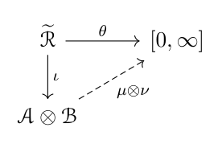

# 积分与求导交换、乘积测度

[返回讲义目录](../../../math-analysis-lecture-notes.md) · [学期目录](../../02-math-analysis-ii.md) · [章节目录](../43-product-measures.md) · [校勘记录](../../errata.md) · [上一篇：Lebesgue 积分与控制收敛定理](../42-dominated-convergence.md) · [下一篇：43.1：作业：Lebesgue 控制收敛，十进制小数的研究](43-03-p0503-0508.md)

<!-- source: PDF 496; printed: 496; transcription: first-pass; proofreading: applied -->

## 控制收敛与含参数积分

我们上次课证明了 Lebesgue 控制收敛定理和它的一个推论（对参数的连续依赖性）：

**定理 294**（Lebesgue 控制收敛定理）。假定测度空间 $(X, \mathcal{A}, \mu)$ 上的可测函数列 $\{f_i\}_{i \geqslant 1}$ 几乎处处收敛到可测函数 $f$。如果存在控制函数 $h \in \mathcal{L}^1(X, \mathcal{A}, \mu)$，使得对每个 $i$，$|f_i(x)| \leqslant h(x)$ 几乎处处成立。那么，我们有
$$\lim_{i \to \infty} \int_X |f_i - f| d\mu = 0.$$

特别地，我们有
$$\lim_{i \to \infty} \int_X f_i d\mu = \int_X f d\mu.$$

**推论 295**（积分对参数的连续依赖性）。假设 $\Omega$ 为距离空间，$(X, \mathcal{A}, \mu)$ 是测度空间。函数
$$f : X \times \Omega \to \mathbb{C}, \quad (x, t) \mapsto f(x, t),$$
满足如下条件：

1) 对每个固定的 $t \in \Omega$，函数 $x \mapsto f(x, t)$ 是可测的；
2) 对几乎处处的 $x$，映射 $t \mapsto f(x, t)$ 在 $t_0 \in \Omega$ 处连续；
3) 存在正函数 $h \in \mathcal{L}^1(X, \mathcal{A}, \mu)$，使得对每个 $t \in \Omega$，我们有 $|f(x, t)| \leqslant h(x)$ 对几乎处处的 $x$ 成立。

那么，函数
$$F : \Omega \to \mathbb{C}, \quad t \mapsto F(t) = \int_X f(x, t) d\mu(x)$$
是良好定义的并且在 $t_0$ 处连续。

我们这次证明另一个推论：

### 积分与求导的交换

**推论 296**（积分与求导数的可交换性）。假定参数空间 $I$ 为 $\mathbb{R}$ 中的开区间，$(X, \mathcal{A}, \mu)$ 是测度空间，$N \in \mathcal{A}$ 为零测集合，$X' = X - N$。我们假设函数
$$f : X \times I \to \mathbb{C}, \quad (x, t) \mapsto f(x, t)$$
满足如下条件：

1) 对任意固定的 $t \in I$，函数 $x \mapsto f(x, t)$ 是可积的；
2) 对任意固定的 $x \in X'$，函数 $t \mapsto f(x, t)$ 对 $t$ 的导数 $\frac{\partial f}{\partial t}(x, t)$ 存在并且存在正函数 $h \in \mathcal{L}^1(X, \mathcal{A}, \mu)$，使得对任意的 $(x, t) \in X' \times I$，都有
$$\left| \frac{\partial f}{\partial t}(x, t) \right| \leqslant h(x).$$

<!-- source: PDF 497; printed: 497; transcription: first-pass; proofreading: applied -->

那么，函数
$$F : I \to \mathbb{C}, \quad t \mapsto F(t) = \int_X f(x, t) d\mu(x)$$
是良好定义的并且在 $I$ 上可微。进一步，我们有如下的导数公式
$$F'(t)=\int_X\frac{\partial f}{\partial t}(x,t)\,d\mu(x).$$

**注记**。我们用 $d\mu(x)$ 表明是对 $x$ 来积分。

**证明：** 任意选取实数数列 $\{\varepsilon_k\}_{k \geqslant 1}$，使得 $\varepsilon_k\ne0$、$t+\varepsilon_k\in I$ 且 $\lim_{k\to\infty}\varepsilon_k=0$。对于任意的 $x \in X'$，按定义，我们知道 $\frac{\partial f}{\partial t}(x,t)$ 是可测函数序列 $\left\{ \frac{f(x, t + \varepsilon_k) - f(x, t)}{\varepsilon_k} \right\}_{k \geqslant 1}$ 在 $x$ 点的极限，从而 $\frac{\partial f}{\partial t}(x,t)$ 是可测函数。

由于 $\left| \frac{\partial f}{\partial t}(x, t) \right| \leqslant h(x)$，所以 $\frac{\partial f}{\partial t}(x,t)$ 是可积的，从而函数
$$t\mapsto\int_X\frac{\partial f}{\partial t}(x,t)\,d\mu(x).$$
是良好定义的。

现在证明 $F$ 的导数存在并计算它的导数。固定 $t \in I$，根据积分的线性，我们有
$$\begin{aligned}
\frac{F(t + \varepsilon_k) - F(t)}{\varepsilon_k} &= \int_X \frac{f(x, t + \varepsilon_k) - f(x, t)}{\varepsilon_k} d\mu(x) \\
&= \int_{X'} \frac{f(x, t + \varepsilon_k) - f(x, t)}{\varepsilon_k} d\mu(x).
\end{aligned}$$

对于固定 $x$，把差值乘模为一的复数使其为非负实数，再对所得函数的实部使用实值中值定理。实部导数的绝对值不超过 $|\partial_tf(x,s)|\leqslant h(x)$，因而有
$$\left| \frac{f(x, t + \varepsilon_k) - f(x, t)}{\varepsilon_k} \right| \leqslant\sup_{s\text{ 位于 }t\text{ 与 }t+\varepsilon_k\text{ 之间}}|\partial_tf(x,s)|\leqslant h(x).$$

我们现在可以对函数序列 $\left\{ \frac{f(x, t + \varepsilon_k) - f(x, t)}{\varepsilon_k} \right\}_{k \geqslant 1}$ 应用 Lebesgue 控制收敛定理，因为 $h$ 就是控制函数：
$$\begin{aligned}
\lim_{k\to\infty}\frac{F(t+\varepsilon_k)-F(t)}{\varepsilon_k}&=\lim_{k\to\infty}\int_X\frac{f(x,t+\varepsilon_k)-f(x,t)}{\varepsilon_k}\,d\mu(x) \\
&= \int_X \frac{\partial f(x, t)}{\partial t} d\mu(x).
\end{aligned}$$
这就给出了证明。 \quad $\square$

## 乘积测度与 Fubini 公式

所谓的 Fubini 定理，就是将乘积空间上的积分化为分量空间上的积分的公式，它将保证我们能把 $\mathbb{R}^n$ 上的积分化为 $\mathbb{R}^1$ 上的积分来计算。为此，我们的第一件事情是建立乘积测度。

给定两个测度空间 $(X, \mathcal{A}, \mu)$ 和 $(Y, \mathcal{B}, \nu)$，我们要求 $\mu$ 和 $\nu$ 是 $\sigma$-有限的。我们要在可测空间 $(X \times Y, \mathcal{A} \otimes \mathcal{B})$ 上定义一个测度 $\mu \otimes \nu$。

<!-- source: PDF 498; printed: 498; transcription: first-pass; proofreading: applied -->

根据定义，$X \times Y$ 上的 $\sigma$-代数 $\mathcal{A} \otimes \mathcal{B}$ 是按照如下的方式构造的：我们称 $X \times Y$ 上形如 $A \times B$ 的子集为矩形，其中 $A \in \mathcal{A}, B \in \mathcal{B}$；我们用 $\widetilde{\mathcal{R}}$ 表示有限个两两不交的矩形之并所构成集合的全体并且证明了 $\widetilde{\mathcal{R}}$ 是代数；$\mathcal{A} \otimes \mathcal{B}$ 被定义为 $\widetilde{\mathcal{R}}$ 所生成的 $\sigma$-代数，即 $\mathcal{A} \otimes \mathcal{B} = \sigma(\widetilde{\mathcal{R}})$；$\mathcal{A} \otimes \mathcal{B}$ 也可以由所有的矩形生成。

与 Lebesgue 测度的构造类似，我们要在 $\widetilde{\mathcal{R}}$ 上构造一个加性函数并利用 Carathéodory 定理把它扩张成 $\mathcal{A} \otimes \mathcal{B}$ 上的测度。为此，在矩形 $A \times B \in \widetilde{\mathcal{R}}$，我们定义
$$\theta(A \times B) = \mu(A)\nu(B).$$

我们规定 $0$ 乘任何数都得 $0$，$\infty$ 乘任何非零正数都得 $\infty$。

对于 $\widetilde{\mathcal{R}}$ 中的元素 $S$，按照 $\widetilde{\mathcal{R}}$ 的定义，我们可以将 $S$ 写成有限个不交的矩形的并：
$$S = \coprod_{i \leqslant m} A_i \times B_i, \quad A_i \in \mathcal{A}, B_i \in \mathcal{B}.$$

此时，我们定义
$$\theta(S) = \sum_{i \leqslant m} \theta(A_i \times B_i) = \sum_{i \leqslant m} \mu(A_i)\nu(B_i).$$

然而，把 $S$ 写成有限个不相交的矩形的并的方式不是唯一的，我们还可能有别的方式：
$$S = \coprod_{j \leqslant n} A'_j \times B'_j \in \widetilde{\mathcal{R}}.$$

这样，我们得到 $S$ 的两种不同的分解，为了说明 $\theta(S)$ 是良好定义的（不依赖于分解的选取），我们必须证明
$$\sum_{i \leqslant m} \mu(A_i)\nu(B_i) = \sum_{j \leqslant n} \mu(A'_j)\nu(B'_j).$$

我们要考虑这两种分解共同的“加细”：对每个 $1 \leqslant i \leqslant m$，我们有
$$\begin{aligned}
A_i \times B_i &= \coprod_{j \leqslant n} (A_i \times B_i) \cap (A'_j \times B'_j) \\
&= \coprod_{j \leqslant n} (A_i \cap A'_j) \times (B_i \cap B'_j).
\end{aligned}$$

所以，上述两种分解可以加细为如下的关于 $S$ 的新的分解：
$$S = \coprod_{\substack{i \leqslant m, \\ j \leqslant n}} (A_i \cap A'_j) \times (B_i \cap B'_j).$$

利用这个分解，我们有
$$\begin{aligned}
\sum_{i \leqslant m, j \leqslant n} \mu(A_i \cap A'_j)\nu(B_i \cap B'_j) &= \sum_{i \leqslant m} \left( \sum_{j \leqslant n} \mu(A_i \cap A'_j)\nu(B_i \cap B'_j) \right) \\
&{\color{red}=} \sum_{i \leqslant m} \mu(A_i)\nu(B_i).
\end{aligned}$$

<!-- source: PDF 499; printed: 499; transcription: first-pass; proofreading: applied -->

上面最后一个红色等号我们用到了等式
$$A_i \times B_i = \coprod_{j \le n} (A_i \cap A'_j) \times (B_i \cap B'_j).$$

我们暂且假设这个等号成立。类似地，如果我们先对 $i \le m$ 求和，我们就得到了
$$\sum_{\substack{i \le m, \\ j \le n}} \mu(A_i \cap A'_j)\nu(B_i \cap B'_j) = \sum_{j \le n} \mu(A'_j)\nu(B'_j).$$

这就证明了两种分解所对应的 $\theta$ 的值都是一样的！

当然，我们必须证明如下的等式：如果（所有的元素都来自 $\mathcal{A}$ 或者 $\mathcal{B}$），
$$A \times B = \coprod_{j \le n} (A \cap A'_j) \times (B \cap B'_j),$$

那么
$$\sum_{j \le n} \mu(A \cap A'_j)\nu(B \cap B'_j) = \mu(A)\nu(B).$$

为此，我们不妨假设 $A_j$ 均为 $A$ 的子集并且 $\bigcup_{j \le n} A_j = A$，$B_j$ 均为 $B$ 的子集并且 $\bigcup_{j \le n} B_j = B$，而且
$$A \times B = \coprod_{j \le n} A_j \times B_j.$$

我们要证明
$$\sum_{j \le n} \mu(A_j)\nu(B_j) = \mu(A)\nu(B).$$

如果 $\{A_j\}_{j \le n}$ 是两两不交的，$\{B_j\}_{j \le n}$ 也是两两不交的，那么命题上述公式是显然的，因为
$$\begin{aligned}
\mu(A)\nu(B) &= \left( \sum_{j \le n} \mu(A_j) \right) \left( \sum_{j \le n} \nu(B_j) \right) \\
&= \sum_{j,j\prime\le n}\mu(A_j)\nu(B_{j\prime}).
\end{aligned}$$

对于一般的情形，我们要 $A_j$ 和 $B_j$ 进一步分解成不相交的集合即可。我们考虑
$$\{ X_1 \cap X_2 \cap \dots \cap X_n \mid X_i = A_i \text{ 或 } (A_i)^c \},$$
它们是两两不交的并且可以把 $A_j$ 都并出来。在 $B$ 中同样对所有 $B_j$ 及其补作共同分割；这些坐标分割的乘积格子两两不交。原每个 $A_j\times B_j$ 是若干格子的并，且 $A\times B$ 的格子恰好各出现一次，按有限可加性逐格求和便得到所需等式。

据此，我们有

**命题 297**。映射
$$\theta : \widetilde{\mathcal{R}} \to [0, \infty], \quad S \mapsto \sum_{i \le m} \mu(A_i)\nu(B_i).$$
是代数 $\widetilde{\mathcal{R}}$ 上的 $\sigma$-有限的加性函数。

<!-- source: PDF 500; printed: 500; transcription: first-pass; proofreading: applied -->

**证明：** 根据定义，这显然是加性函数。为了说明 $\sigma$-有限性，由于 $X$ 和 $Y$ 是 $\sigma$-有限的，所以存在上升的序列 $\{A_i\}_{i \ge 1} \subset\mathcal A,A_i\nearrow X, \{B_i\}_{i \ge 1} \subset \mathcal{B}, B_i\nearrow Y$，其中对每个 $i$，$\mu(A_i)$ 和 $\nu(B_i)$ 是有限的。所以，我们就有上升的序列 $\{A_i \times B_i\}_{i \ge 1} \subset \widetilde{\mathcal{R}}$，使得 $A_i \times B_i \nearrow X \times Y$。按照 $\theta$ 的定义，对每个 $i$，$\theta(A_i \times B_i) = \mu(A_i)\nu(B_i)$ 是有限的。这就完成了证明。 $\square$

我们注意到，这里的构造和 Lebesgue 测度的构造在形式上一模一样。

我们将使用 Carathéodory 测度扩张定理来构造 $\mathcal{A} \otimes \mathcal{B}$ 上的乘积测度：

为此，先证明一个粗糙版本的 Fubini 定理：

**引理 298**。对任意 $S \in \widetilde{\mathcal{R}}, x \in X$，我们定义 $S$ 的 $x$-截面为：
$$S_x = \{ y \in Y \mid (x, y) \in S \} \subset Y.$$

那么，$S_x \in \mathcal{B}$。进一步，函数
$$X \to [0, \infty], \quad x \mapsto \nu(S_x),$$
为 $(X, \mathcal{A})$ 上的可测函数并且
$$\theta(S) = \int_X \nu(S_x) d\mu(x).$$

**证明：** 我们考虑 $S$ 的分解 $S = \coprod_{i \le m} A_i \times B_i$，其中矩形们 $A_i \times B_i$ 两两不交，通过对 $A_i$ 进一步进行细分（如同上一个命题中所证明的），先以所有 $A_i$ 及其补作共同坐标分割，再把同一分割块对应的各 $B_i$ 并在一起作为新的第二因子；这样重写后，可以进一步要求 $A_i$ 们两两不交。此时，我们可以精确的计算 $S$ 的 $x$-截面：
$$S_x = \begin{cases} B_i, & \text{如果 } x \in A_i; \\ \emptyset, & \text{如果 } x \notin \bigcup_{i \le m} A_i. \end{cases}$$
这显然是 $\mathcal{B}$ 中的元素。我们现在研究 $\nu(S_x)$ 的可测性，实际上
$$\nu(S_x) = \begin{cases} \nu(B_i), & \text{如果 } x \in A_i; \\ 0, & \text{如果 } x \notin \bigcup_{i \le m} A_i. \end{cases}$$
这是一个简单函数，自然可测。所以，我们有
$$\begin{aligned}
\int_X \nu(S_x) d\mu(x) &= \sum_{i \le m} \int_X \nu(B_i) \mathbf{1}_{A_i}(x) d\mu(x) \\
&= \sum_{i \le m} \mu(A_i)\nu(B_i).
\end{aligned}$$
根据定义，上式右边即为 $\theta(S)$，命题得证。 $\square$

<!-- source: PDF 501; printed: 501; transcription: first-pass; proofreading: applied -->

利用上述引理，我们来验证 $\theta$ 满足 Carathéodory 扩张定理中的**条件 (C)** 和**条件 ($\text{C}_\infty$)**：

**条件 ($\text{C}_\infty$) 的验证：**
根据 $\sigma$-有限性，存在上升的序列 $\{A_i\}_{i \ge 1} \subset \mathcal{A}, A_i \nearrow X, \{B_i\}_{i \ge 1} \subset \mathcal{B}, B_i\nearrow Y$，其中对每个 $i$，$\mu(A_i)$ 和 $\nu(B_i)$ 是有限的。令 $Z = X \times Y$ 为整个乘积空间，考虑上升的集合的序列 $\{Z_i = A_i \times B_i\}_{i \ge 1}$，很明显，我们有 $Z_i \nearrow Z$ 并且每个 $Z_i$ 的 $\theta$ 体积有限。**条件 ($\text{C}_\infty$)** 要求我们证明：对于任意的 $S \in \widetilde{\mathcal{R}}$，如果 $\theta(S) = \infty$，那么
$$\lim_{i \to \infty} \theta(S \cap Z_i) = \infty.$$

由于 $S \in \widetilde{\mathcal{R}}$ 为有限个矩形的并，所以只要对某个 $S = A \times B$ 的情形证明 $\theta(S\cap Z_i)\to\infty$ 即可（这里和 Lebesgue 测度的构造又是一样的）。由于我们假设了 $\theta(A \times B) = \infty$，不妨 $\mu(A) = \infty$ 而 $\nu(B) > 0$（可以是 $\infty$）。根据 $Z_i = A_i \times B_i$，所以
$$\theta(Z_i \cap (A \times B)) = \mu(A_i \cap A)\nu(B_i \cap B).$$

利用测度 $\mu$ 和 $\nu$ 的性质，我们有
$$\mu(A_i \cap A) \to \infty, \quad \nu(B_i \cap B) \ge \delta > 0, \quad (\text{当 } i \text{ 足够大时候}).$$

从而，我们有
$$\lim_{i\to\infty}\theta(Z_i\cap(A\times B))=\infty.$$

**条件 (C) 的验证：**
任意选取 $\widetilde{\mathcal{R}}$ 中下降的序列 $\{S_i\}_{i \ge 1}$，如果 $\theta(S_1)<\infty$ 并且 $S_i \searrow \emptyset$，那么，**条件 (C)** 要求我们证明
$$\lim_{i \to \infty} \theta(S_i) = 0.$$

我们运用粗糙版本的 Fubini 定理。首先，研究 $X$ 上的可测函数列 $\{f_i(x)\}_{i \ge 1}$，其中，
$$f_i(x) : X \to [0, \infty], \quad x \mapsto \nu((S_i)_x).$$

由于 $S_i$ 是下降集合序列，所以，$\{f_i(x)\}_{i \ge 1}$ 是 $X$ 上下降的正可测函数序列。根据定义，我们有按照定义，我们有
$$f_i(x) = \nu((S_i)_x).$$

由粗糙 Fubini 公式，$\int_X f_1\,d\mu=\theta(S_1)<\infty$，故 $f_1$ 几乎处处有限。对这样的 $x$，$\nu((S_1)_x)<\infty$，而 $(S_i)_x\searrow\emptyset$，由测度从上连续性得到 $f_i(x)=\nu((S_i)_x)\searrow0$。因此函数列几乎处处收敛到零。我们对函数列 $\{f_i(x)\}_{i \ge 1}$ 运用 Lebesgue 控制收敛定理，其中，这列函数中的第一项 $f_1$ 可以作为控制函数。根据上面粗糙版本的 Fubini 定理，我们就有
$$\theta(S_i) = \int_X f_i(x) d\mu(x) \to 0,$$
这就证明了**条件 (C)**。

综上所述，我们证明了如下重要的定理：

<!-- source: PDF 502; printed: 502; transcription: first-pass; proofreading: applied -->

**定理 299**（乘积测度）。给定 $\sigma$-有限的测度空间 $(X, \mathcal{A}, \mu)$ 和 $(Y, \mathcal{B}, \nu)$，在可测空间 $(X \times Y, \mathcal{A} \otimes \mathcal{B})$ 上存在唯一的 $\sigma$-有限的测度 $\mu \otimes \nu$，使得对任意的 $A \in \mathcal{A}$ 和 $B \in \mathcal{B}$，我们都有
$$(\mu \otimes \nu)(A \times B) = \mu(A)\nu(B).$$

特别地，对任意的 $E \in \mathcal{A} \otimes \mathcal{B}$，它的测度可由如下公式计算
$$(\mu \otimes \nu)(E) = \inf_{\substack{E \subset \bigcup_{i=1}^\infty (A_i \times B_i) \\ A_i \in \mathcal{A}, B_i \in \mathcal{B}}} \sum_{i=1}^\infty \mu(A_i)\nu(B_i).$$

**注记**。在之前的课程中，我们已经证明了 $\mathbb{R}^2 = \mathbb{R}^1 \times \mathbb{R}^1$ 上 Borel 代数是 $\mathbb{R}^1$ 上的 Borel 代数的乘积，即 $\mathcal{B}(\mathbb{R}^2) = \mathcal{B}(\mathbb{R}^1) \otimes \mathcal{B}(\mathbb{R}^1)$。由于我们上面关于乘积测度的构造过程和 Lebesgue 测度的构造是一样的，所以 $\mathbb{R}^2$ 上的 Lebesgue 测度 $m_2$ 就是两个 $\mathbb{R}^1$ 上的 Lebesgue 测度 $m_1$ 的张量积。这还可以通过观察它们在方块上的取值以及测度的唯一性来证明。所以，我们有
$$(\mathbb{R}^2, \mathcal{B}(\mathbb{R}^2), m_2) = (\mathbb{R}^2, \mathcal{B}(\mathbb{R}^1) \otimes \mathcal{B}(\mathbb{R}^1), m_1 \otimes m_1).$$

类似的结论对于 $\mathbb{R}^n$ 也成立，我们不再赘述。

[返回讲义目录](../../../math-analysis-lecture-notes.md) · [学期目录](../../02-math-analysis-ii.md) · [章节目录](../43-product-measures.md) · [校勘记录](../../errata.md) · [上一篇：Lebesgue 积分与控制收敛定理](../42-dominated-convergence.md) · [下一篇：43.1：作业：Lebesgue 控制收敛，十进制小数的研究](43-03-p0503-0508.md)
