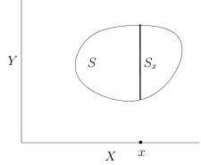

# Fubini 定理与积分降维

[返回讲义目录](../../../math-analysis-lecture-notes.md) · [学期目录](../../02-math-analysis-ii.md) · [章节目录](../44-fubini.md) · [校勘记录](../../errata.md) · [上一篇：43.2：习题课：硬币空间的测度理论](../43-product-measures/43-05-p0509-0511.md) · [下一篇：44.1：作业：Archimedes对抛物线面积的计算，Gauss积分](44-03-p0520-0523.md)

<!-- source: PDF 512; printed: 512; transcription: first-pass; proofreading: applied -->

## 可测集的截面与乘积测度

上次课里，我们证明了乘积测度的存在性，即给定 $\sigma$-有限的测度空间 $(X, \mathcal{A}, \mu)$ 和 $(Y, \mathcal{B}, \nu)$，在可测空间 $(X \times Y, \mathcal{A} \otimes \mathcal{B})$ 上存在唯一的 $\sigma$-有限的测度 $\mu \otimes \nu$，使得对任意的 $A \in \mathcal{A}$ 和 $B \in \mathcal{B}$，我们都有
$$(\mu \otimes \nu)(A \times B) = \mu(A)\nu(B).$$

特别地，对任意的 $E \in \mathcal{A} \otimes \mathcal{B}$，它的测度可由如下公式计算
$$(\mu \otimes \nu)(E) = \inf_{\substack{E \subset \bigcup_{i=1}^\infty (A_i \times B_i) \\ A_i \in \mathcal{A}, B_i \in \mathcal{B}}} \sum_{i=1}^\infty \mu(A_i)\nu(B_i).$$

证明过程的一个重要辅助工具是所谓的粗糙版本的 Fubini 定理，我们现在就它加以改进：

**引理 300**。任意给定 $S \in \mathcal{A} \otimes \mathcal{B}$，$x \in X$，我们定义 $S$ 在 $x$ 处的截面 $S_x$ 为
$$S_x = \{y \in Y \mid (x, y) \in S\} \subset Y.$$

那么，如下三条性质成立

1) $S_x \in \mathcal{B}$；

2) 函数
$$X \to [0, \infty], \quad x \mapsto \nu(S_x),$$
为 $(X, \mathcal{A})$ 上的可测函数；

3) $S$ 的测度可以用截面的测度通过积分得到：
$$\mu \otimes \nu(S) = \int_X \nu(S_x) d\mu(x).$$

**注记**。粗糙版本的 Fubini 定理讲的是对于 $S \in \widetilde{\mathcal{R}}$，即 $S$ 是有限个两两不交的矩形的并，上面的结论 1)，2) 和 3) 都成立。

<!-- source: PDF 513; printed: 513; transcription: first-pass; proofreading: applied -->

**证明**：用集合 $\mathcal{M}$ 表示所有 $\mathcal{A} \otimes \mathcal{B}$ 中满足引理三个结论 1)，2) 和 3) 的集合 $S$ 所组成的集合。粗糙版本的 Fubini 表明 $\widetilde{\mathcal{R}} \subset \mathcal{M}$。如果可以证明 $\mathcal{M}$ 为单调类，根据 $\widetilde{\mathcal{R}}$ 是代数，我们就可以推出 $\mathcal{M}$ 包含了 $\widetilde{\mathcal{R}}$ 所生成的 $\sigma$-代数，即 $\mathcal{M} \supset \mathcal{A} \otimes \mathcal{B}$，这就说明了 $\mathcal{M} = \mathcal{A} \otimes \mathcal{B}$，从而证明了引理。

我们如下来证明 $\mathcal{M}$ 是单调类。根据单调类的定义，我们需要对上升和下降的子集序列分别进行验证它们的极限的仍然在 $\mathcal{M}$ 中：

($\nearrow$) 对任意上升的集合序列 $\{S_i\}_{i\geqslant1}\subset\mathcal M$，如果当 $i \to \infty$ 时，$S_i \nearrow S$，验证 $S \in \mathcal{M}$。

首先固定的 $x \in X$。根据 $S_i \nearrow S$，我们推出 $(S_i)_x \nearrow S_x$。由于 $S_i \in \mathcal{M}$，根据定义，$S_i$ 满足引理叙述中的 1)，所以 $(S_i)_x \in \mathcal{B}$ 所以在 $Y$ 中，从而（因为 $\mathcal{B}$ 是 $\sigma$-代数）
$$S_x = \bigcup_{i \geqslant 1} (S_i)_x \in \mathcal{B}.$$

上述对于任意的 $x \in X$ 都成立，这表明 $S$ 满足引理叙述中的 1)。

由于对任意的 $i \geqslant 1$，$(S_i)_x \in \mathcal{B}$，$S_x \in \mathcal{B}$，我们可以定义 $X$ 上的函数：
$$f_i(x) = \nu((S_i)_x), \quad f(x) = \nu(S_x).$$

由于 $(S_i)_x \nearrow S_x$，所以对任意的 $x$，$\{f_i(x)\}_{i \geqslant 1}$ 是递增的序列并且极限为 $f(x)$，即递增函数列 $\{f_i\}_{i \geqslant 1}$ 逐点地收敛到 $f(x)$。根据 $S_i \in \mathcal{M}$ 以及 $\mathcal{M}$ 的定义，$f_i$ 是 $(X, \mathcal{A})$ 上的可测函数。所以，$f : X \to [0, \infty]$ 也是可测的，这表明 $S$ 满足引理叙述中的 2)。

为了证明 $S$ 满足引理叙述中的 3)，我们利用 Beppo Levi 定理：
$$\begin{aligned}
\int_X \nu(S_x) d\mu(x) &= \int_X f(x) d\mu(x) \\
&\overset{\text{Beppo Levi}}{=} \lim_{i \to \infty} \int_X f_i(x) d\mu(x) \\
&= \lim_{i \to \infty} \int_X \nu((S_i)_x) d\mu(x) \\
&= \lim_{i \to \infty} \mu \otimes \nu(S_i) \\
&= \mu \otimes \nu(S).
\end{aligned}$$

其中，倒数第二个等号成立是因为 $S_i \in \mathcal{M}$ 满足引理叙述中的 3)；倒数第一个等号可以取到是因为 $\mu \otimes \nu$ 是测度。

($\searrow$) 对任意下降的集合序列 $\{S_i\}_{i\geqslant1}\subset\mathcal M$，如果当 $i \to \infty$ 时，$S_i \searrow S$，验证 $S \in \mathcal{M}$。我们分两种情形讨论：

-- $\mu$ 和 $\nu$ 均为有限测度，即 $\mu(X) < \infty$，$\nu(Y)<\infty$。

此时，我们可以参照上升序列的情况如法炮制：

<!-- source: PDF 514; printed: 514; transcription: first-pass; proofreading: applied -->

对任意的 $x \in X$，我们有 $(S_i)_x \searrow S_x$。根据 $S_i \in \mathcal{M}$，所以 $(S_i)_x \in \mathcal{B}$ 所以在 $Y$ 中，从而 $S_x\in\mathcal B$。我们仍定义函数
$$f_i(x) = \nu((S_i)_x), \quad f(x) = \nu(S_x).$$

那么，函数列 $\{f_i\}_{i \geqslant 1}$ 递减并且逐点地收敛到 $f(x)$，这一点是由测度有限保证的。根据 $f_i$ 在 $(X, \mathcal{A})$ 上可测，我们推出 $f$ 也可测。最终，我们可以用 $f_1$ 作为控制函数从而利用 Lebesgue 控制收敛定理：
$$\begin{aligned}
\int_X \nu(S_x) d\mu(x) &= \int_X f(x) d\mu(x) \\
&\overset{\text{Lebesgue}}{=} \lim_{i \to \infty} \int_X f_i(x) d\mu(x) \\
&= \lim_{i \to \infty} \int_X \nu((S_i)_x) d\mu(x) \\
&= \lim_{i \to \infty} \mu \otimes \nu(S_i) \\
&= \mu \otimes \nu(S).
\end{aligned}$$

其中，倒数第二个等号成立是因为 $S_i \in \mathcal{M}$ 满足引理叙述中的 3)；倒数第一个等号可以取到是因为 $\mu \otimes \nu$ 是测度。

-- $\mu$ 和 $\nu$ 是 $\sigma$-有限的测度。

利用 $\sigma$-有限性，先取有限测度的子集 $\{X_p\}_{p \geqslant 1} \subset \mathcal{A}$，使得 $X_p \nearrow X$ 和有限测度的子集 $\{Y_p\}_{p \geqslant 1} \subset \mathcal{B}$，使得 $Y_p \nearrow Y$。先在有限测度情形完成上述单调类论证，得到引理在整个有限乘积空间成立。再将测度限制到 $X_p$ 与 $Y_p$，由这个有限测度结论及零延拓可知 $S\cap(X_p\times Y_p)$ 满足引理三条性质；于是我们有
$$S\cap(X_p\times Y_p)=\lim_{i\to\infty}\bigl(S_i\cap(X_p\times Y_p)\bigr)\in\mathcal M$$
另外，当 $p \to \infty$ 时，$S \cap (X_p \times Y_p) \nearrow S$。此时，对任意的 $p$，我们已经有 $S \cap (X_p \times Y_p) \in \mathcal{M}$。再利用前面关于上升序列的结论，我们就说明了 $S \in \mathcal{M}$。

综上所述，这种版本的 Fubini 定理成立，实际上，这个命题表明，对于形如 $1_S$，其中 $S \in \mathcal{A} \otimes \mathcal{B}$ 的示性函数，Fubini 定理是成立的，请参考后面 Fubini 定理的叙述。 $\square$

## 富比尼定理

我们可以利用上升的阶梯函数列来逼近正函数，加上 Beppo Levi 定理，我们就可以证明正函数版本的 Fubini 定理：

**定理 301**（Fubini 定理：正函数版本）。给定 $\sigma$-有限的测度空间 $(X, \mathcal{A}, \mu)$ 和 $(Y, \mathcal{B}, \nu)$，对于可测的正函数
$$f : (X \times Y, \mathcal{A} \otimes \mathcal{B}, \mu \otimes \nu) \to [0, \infty],$$
我们有

1)

-- 对任意的 $x \in X$，函数
$$Y \longrightarrow [0, \infty], \quad y \mapsto f(x, y)$$
是 $\mathcal{B}$-可测的；

<!-- source: PDF 515; printed: 515; transcription: first-pass; proofreading: applied -->

-- 函数
$$X \longrightarrow [0, \infty], \quad x \mapsto \int_Y f(x, y) d\nu(y),$$
是 $\mathcal{A}$-可测的；

-- 上面两个叙述中 $X$ 和 $Y$ 是对称的（可以把 $X$ 换成 $Y$）。

2) 我们有如下的积分等式：
$$\begin{aligned}
\int_{X \times Y} f(x, y) d\mu \otimes \nu &= \int_X \left( \int_Y f(x, y) d\nu(y) \right) d\mu(x) \\
&= \int_Y \left( \int_X f(x, y) d\mu(x) \right) d\nu(y).
\end{aligned}$$

**注记**。在正函数版本的 Fubini 定理中，我们并不要求函数是可积的，也就是说可以容许正函数的积分是无限的。

**证明**：这个命题对于形如 $f = 1_S$ 的示性函数（$S \in \mathcal{A} \otimes \mathcal{B}$）是成立的，这是前面引理的内容。利用积分的线性，这个命题对于形如
$$f = \sum_{i \leqslant n} \lambda_i 1_{S_i}$$
的简单函数也成立，其中对任意的 $1\leqslant i\leqslant n$，$S_i \in \mathcal{A} \otimes \mathcal{B}$，系数 $\lambda_i$ 是非负的。

对于 $(X \times Y, \mathcal{A} \otimes \mathcal{B})$ 上的正可测函数 $f$，我们选取单调上升的正简单函数列 $\{f_i(x, y)\}_{i \geqslant 1}$，使得该函数列逐点地收敛到 $f$。对固定的 $x$，作为 $Y$ 上的函数，我们自然有如下的逐点收敛性：
$$\lim_{i \to \infty} f_i(x, y) = f(x, y).$$

根据 $f_i(x, y)$ 是 $\mathcal{B}$-可测的，所以 $y \mapsto f(x, y)$ 也是 $\mathcal{B}$-可测的。利用 Beppo Levi 定理，我们得到
$$\int_Y f(x,y)\,d\nu(y)=\lim_{i\to\infty}\int_Y f_i(x,y)\,d\nu(y).$$

由于 $\int_Y f_i(x,y)\,d\nu(y)$ 是 $\mathcal A$-可测的，所以 $x\mapsto\int_Y f(x,y)\,d\nu(y)$ 是 $\mathcal{A}$-可测的，至此，定理的第一部分中关于可测性的论断得到了证明。

为了证明第二部分，我们可以将
$$\int_Y f(x,y)\,d\nu(y)=\lim_{i\to\infty}\int_Y f_i(x,y)\,d\nu(y).$$

右端视作是为单调上升的（$X$ 上的）正函数列。由于要证明的等式对于 $f_i$ 是成立的，由 Beppo Levi 定理，当 $i \to \infty$ 时，我们就有
$$\begin{aligned}
\int_{X \times Y} f(x, y) d\mu \otimes \nu &\overset{\text{Beppo Levi}}{=} \lim_{i \to \infty} \int_{X \times Y} f_i(x, y) d\mu \otimes \nu \\
&= \lim_{i \to \infty} \int_X \left( \int_Y f_i(x, y) d\nu(y) \right) d\mu(x) \\
&\overset{\text{Beppo Levi}}{=} \int_X \left( \int_Y f(x, y) d\nu(y) \right) d\mu(x).
\end{aligned}$$

所以命题成立。 $\square$

<!-- source: PDF 516; printed: 516; transcription: first-pass; proofreading: applied -->

### 可积函数版本

最终，我们证明可积函数版本的 Fubini 定理：

**定理 302**（Fubini 定理：可积函数版本）。给定 $\sigma$-有限的测度空间 $(X, \mathcal{A}, \mu)$ 和 $(Y, \mathcal{B}, \nu)$，$f(x, y)$ 是 $(X \times Y, \mathcal{A} \otimes \mathcal{B}, \mu \otimes \nu)$ 上的定义的复值可积函数（允许取 $\infty$）。那么，存在两个零测集 $N_X \in \mathcal{A}$ 和 $N_Y \in \mathcal{B}$，使得

1)

- 对任意的 $x \in X - N_X$，$Y$ 上的函数
$$Y \to \mathbb{C}, \quad y \mapsto f(x, y)$$
是 $\mathcal{B}$-可测的并且这个函数是还是 $\nu$-可积的；

- $X$ 上的函数
$$X \to \mathbb{C}, \quad x \mapsto \int_Y f(x, y) d\nu(y)$$
在 $X$ 上几乎处处有定义；在 $N_X$ 上置零后，这个函数是 $\mathcal{A}$-可测的同时还是 $\mu$-可积的；

- 上述性质对于 $X$ 和 $Y$ 是对称的。

2) 我们有如下的积分等式：
$$\int_{X \times Y} f(x, y) d\mu \otimes \nu = \int_X \left( \int_Y f(x, y) d\nu(y) \right) d\mu(x) = \int_Y \left( \int_X f(x, y) d\mu(x) \right) d\nu(y).$$

**证明**：我们观察到，上面的所有叙述在 $\mathbb{C}$-线性操作下是保持的，所以，通过实部和虚部的分解，我们可以只要对 $f$ 在 $\mathbb{R} \cup \{\pm\infty\}$ 中取值的情况进行证明即可。此时，我们将 $f$ 分解为正和负的两部分：
$$f = f^+ - f^-.$$
其中，$f_\pm \le |f|$，所以 $f_\pm$ 的积分（对测度 $\mu \otimes \nu$ 而言）是有限的。根据正函数版本的 Fubini 定理，$X$ 上的函数
$$F_X^+ : X \to [0, \infty], \quad x \mapsto \int_Y f^+(x, y) d\nu(y)$$
可测并且其积分有限。然而，我们并不能排除这个函数的取值是 $+\infty$ 的可能。类似的，我们定义
$$F_X^- : X \to [0, \infty], \quad x \mapsto \int_Y f^-(x, y) d\nu(y)$$
令
$$N_X^+ = (F_X^+)^{-1}(+\infty), \quad N_X^- = (F_X^-)^{-1}(\infty).$$
由于 $F_X^\pm$ 的积分有限，所以，$N_X^\pm$ 是 $\mu$-零测集。最终，我们令
$$N_X = N_X^+ \cup N_X^-.$$
这是 $\mu$-零测集。

<!-- source: PDF 517; printed: 517; transcription: first-pass; proofreading: applied -->

现在任意选取 $x \in X - N_X$，作为 $Y$ 上的函数，我们自然有 $f(x, \cdot) = f^+(x, \cdot) - f^-(x, \cdot)$。按照 $N_X$ 的定义，积分 $\int_Y f^\pm(x, y) d\nu(y)$ 是有限的，所以，作为 $Y$ 上的函数，$f^\pm(x, \cdot)$ 是 $\nu$-可积的。所以，对任意的 $x \in X - N_X$，$f(x, y)$ 作为 $Y$ 上的函数对测度 $\nu(y)$ 是可积的，即 $\int_Y |f(x, y)| d\nu(y) < \infty$。

再者，按照定义，对于 $x \in X - N_X$，函数
$$x \mapsto \int_Y f(x, y) d\nu(y) = \int_Y f^+(x, y) d\nu(y) - \int_Y f^-(x, y) d\nu(y),$$
是两个 $\mu$-可积函数之差，所以也是 $\mu$-可积。

最后，定理中的积分等式是通过正函数版本的 Fubini 定理及积分的线性直接得到。至此，我们完成了 Fubini 定理的证明。 $\square$

**注记**。在可积版本的 Fubini 定理的叙述中，很多地方都有几乎处处的限制，这是不可避免的，除非能排除证明过程中类似于 $N_X^\pm$ 类型的集合。

**注记**（应用）。在使用正函数版本的 Fubini 定理的时候，我们对函数没有要求（只要求可测），这非常得方便；对于可积情形的 Fubini 定理，我们要求
$$\int_{X \times Y} |f(x, y)| d(\mu \otimes \nu) < \infty,$$
这是必须验证的条件。

## $\mathbb{R}^n$ 上积分自此始

如果不加说明，$\mathbb{R}^n$ 上的测度总是 Lebesgue 测度 $m$，我们还用 $dx_1 \cdots dx_n$ 表示 $dm$。

**推论 303**（积分的降维计算）。给定 $\mathbb{R}^n$ 中的开集（或者闭集）$\Omega\subset\mathbb R^n$，以及其上的实值可积函数 $f:\Omega\to\mathbb R$。对任意的 $x_n \in \mathbb{R}$，我们定义 $x_n$ 对于在 $\Omega$ 的截面：
$$\Omega_{x_n} = \{(x_1,\cdots,x_{n-1})\in\mathbb R^{n-1} \mid (x_1, \cdots, x_{n-1}, x_n) \in \Omega \}.$$
那么，对每个几乎处处的 $x_n \in \mathbb{R}$，函数
$$\Omega_{x_n} \to \mathbb{R}, \quad (x_1, \cdots, x_{n-1}) \mapsto f(x_1, \cdots, x_{n-1}, x_n)$$
是 $\Omega_{x_n}\subset\mathbb R^{n-1}$ 上的可积函数。我们还有如下的积分等式：
$$\int_\Omega f(x_1, \cdots, x_{n-1}, x_n) dx_1 \cdots dx_n = \int_{\mathbb{R}} \left( \int_{\Omega_{x_n}} f(x_1, \cdots, x_{n-1}, x_n) dx_1 \cdots dx_{n-1} \right) dx_n,$$
其中，当 $\Omega_{x_n} = \emptyset$ 时，无论 $f(x_1, \cdots, x_{n-1}; x_n)$ 是否有定义，我们都规定
$$\int_{\Omega_{x_n}} f(x_1, \cdots, x_{n-1}, x_n) dx_1 \cdots dx_{n-1} = 0.$$

这个推论的证明很简单：

<!-- source: PDF 518; printed: 518; transcription: first-pass; proofreading: applied -->

**证明**：我们定义 $\mathbb{R}^n$ 上的函数 $F$：
$$F:\mathbb R^n\to\mathbb R,\qquad F(x)=\begin{cases}f(x),&x\in\Omega,\\0,&x\notin\Omega.\end{cases}$$
由零延拓及 $f$ 在 $\Omega$ 上可积，$\int_{\mathbb R^n}|F|\,dm=\int_\Omega|f|\,dm<\infty$，所以 $F$ 是可积的。我们对 $\mathbb{R}^n = \mathbb{R}^{n-1} \times \mathbb{R}^1$ 运用 Fubini 定理就给出了上述定理。 $\square$

**注记**。这个推论在积分的计算中是最有用的：Fubini 定理把一个高维数的积分转化为两个低维数的积分，从而使我们可以用一元微积分的理论归纳地计算多元微积分。我们需要特别地指出，大多数情况下，通过降维得到的都是传统的 Riemann 积分（我们已经证明它和 Lebesgue 积分是一码事），所以我们可以用任何学习过的关于 Riemann 积分的性质。

### 积分降维的计算实例

我们看几个例子：

**例子**。计算如下的积分 $\int_\Omega f dx_1 \cdots dx_n$，其中

1) $\Omega = [1, 2] \times [0, 3] \subset \mathbb{R}^2$，$f(x, y) = xy + y^2 + 1$：

这个函数是有界的，自然可积。按照 Fubini 公式，我们知道
$$\begin{aligned}
\int_{[1,2] \times [0,3]} f(x, y) dxdy &= \int_0^3 \left( \int_1^2 xy + y^2 + 1 dx \right) dy \\
&= \int_0^3 \underbrace{\left. \frac{y}{2} x^2 \right|_1^2}_{= \frac{3y}{2}} + y^2 + 1 dy = 18 \frac{3}{4}.
\end{aligned}$$

2) $\Omega = [1, 2] \times [0, 2] \subset \mathbb{R}^2$，$f(x, y) = y e^{xy}$：这个函数是有界的，自然可积。按照 Fubini 公式，我们知道（计算过程中我们可能会去掉零测集 $y = 0$）
$$\begin{aligned}
\int_{[1,2] \times [0,2]} f(x, y) dxdy &= \int_0^2 y \left( \int_1^2 e^{xy} dx \right) dy \\
&= \int_0^2(e^{2y}-e^y)\,dy=\left[\frac12e^{2y}-e^y\right]_0^2=\frac12e^4-e^2+\frac12.
\end{aligned}$$

3) $\Omega$ 由 $x = 1, x = 4, y = (x - 2)^2 - 4, y = -(x - 3)^2 + 4$ 围成，$f(x, y) = 3x - 2y + 1$：

对于任意的 $x \in [1, 4]$，不难看出，
$$\Omega_x = \{ y \in \mathbb{R} \mid (x - 2)^2 - 4 \le y \le -(x - 3)^2 + 4 \}.$$

所以，
$$\begin{aligned}
\int_\Omega f(x, y) dxdy &= \int_1^4 \left( \int_{(x-2)^2-4}^{-(x-3)^2+4} 3x - 2y + 1 dy \right) dx \\
&= \int_1^4 (3x + 1) (10x - 2x^2 - 5) - y^2 \Big|_{(x-2)^2-4}^{-(x-3)^2+4} dx = \text{某个数}.
\end{aligned}$$

<!-- source: PDF 519; printed: 519; transcription: first-pass; proofreading: applied -->

**例子**（Arichimedes 的墓碑）。我们计算如下三个基本的几何对象的测度：

1) 计算单位圆盘 $\Omega = B(1) \subset \mathbb{R}^2$ 的面积 $m_2(B(1))$。

对任意的 $|x| \le 1$，我们有
$$\Omega_x = \{ y \in \mathbb{R} \mid -\sqrt{1 - x^2} \le y \le \sqrt{1 - x^2} \}.$$

从而，
$$\begin{aligned}
m_2(B(1)) &= \int_\Omega 1 dxdy = \int_{-1}^1 |\Omega_x| dx \\
&= \int_{-1}^1 2 \sqrt{1 - x^2} dx.
\end{aligned}$$

这就是上学期我们来计算曲线下面积的做法，答案是 $\pi$。

2) 计算柱体 $C = B(1) \times [-1, 1] = \{ (x, y, z) \in \mathbb{R}^3 \mid (x, y) \in B(1), -1 \le z \le 1 \} \subset \mathbb{R}^3$ 的体积 $m_3(C)$。

由于 $B(1) \subset \mathbb{R}^2$ 和 $[-1, 1] \subset \mathbb{R}$ 都是 Borel 集，所以，$C = B(1) \times [-1, 1]$ 是 $\mathbb{R}^3$ 中的一个“矩形”，由于 $m_3=m_2\otimes m_1$，它的体积自然是
$$m_3(C) = m_2(B(1)) m_1([-1, 1]) = 2\pi.$$

3) 计算单位球 $\Omega = B(1) \subset \mathbb{R}^3$ 的体积 $m_3(B(1))$。

对任意的 $|z| \le 1$，我们有
$$\Omega_z = \{(x,y)\in\mathbb R^2\mid x^2+y^2 \le 1 - z^2 \}.$$

这是一个半径为 $\sqrt{1 - z^2}$ 的圆盘，它的面积是 $\pi(1 - z^2)$。从而，
$$\begin{aligned}
m_3(B(1))&=\int_\Omega1\,dx\,dy\,dz=\int_{-1}^1m_2(\Omega_z)\,dz \\
&= \pi\int_{-1}^1(1-z^2)\,dz = \frac{4}{3} \pi.
\end{aligned}$$

特别地，我们得到了
$$\frac{m_3(B(1))}{m_3(C)} = \frac{2}{3}.$$

这是传说中 Archimedes 墓碑上的图形和数字。

[返回讲义目录](../../../math-analysis-lecture-notes.md) · [学期目录](../../02-math-analysis-ii.md) · [章节目录](../44-fubini.md) · [校勘记录](../../errata.md) · [上一篇：43.2：习题课：硬币空间的测度理论](../43-product-measures/43-05-p0509-0511.md) · [下一篇：44.1：作业：Archimedes对抛物线面积的计算，Gauss积分](44-03-p0520-0523.md)
