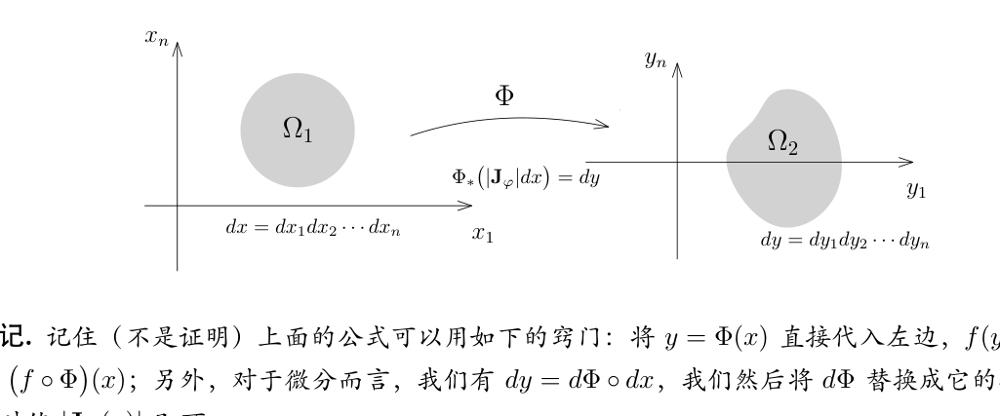
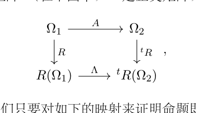
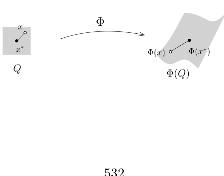
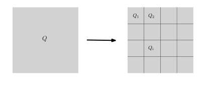

# 45：换元积分公式

[返回讲义目录](../../math-analysis-lecture-notes.md) · [学期目录](../02-math-analysis-ii.md) · [校勘记录](../errata.md) · [上一篇：44.1：作业：Archimedes对抛物线面积的计算，Gauss积分](44-fubini/44-03-p0520-0523.md) · [下一篇：常用换元与子流形上的积分](46-submanifold-integrals/46-01-p0537-0546.md)

<!-- source: PDF 524; printed: 524; transcription: first-pass; proofreading: applied -->

## 积分顺序交换与分布函数

我们上一周证明了 Fubini 定理，它讲的是，给定 $\sigma$-有限的测度空间 $(X, \mathcal{A}, \mu)$ 和 $(Y, \mathcal{B}, \nu)$，$X \times Y$ 上的函数 $f$ 是正可测的或者是复值可积函数，那么 $f$ 在 $X \times Y$ 上的积分可以通过每个分量的积分来计算：
$$
\begin{aligned}
\int_{X\times Y} f(x,y) d\mu \otimes \nu &= \int_X \left( \int_Y f(x,y) d\nu(y) \right) d\mu(x) \\
&= \int_Y \left( \int_X f(x,y) d\mu(x) \right) d\nu(y).
\end{aligned}
$$

**注记**（Fubini 用来交换积分顺序）。除了在计算积分时可以降维之外，Fubini 定理还有其它的应用：它表明在 $X$ 上的积分运算与在 $Y$ 上的积分运算是可交换的，即
$$
\int_X \left( \int_Y f(x,y) d\nu(y) \right) d\mu(x) = \int_Y \left( \int_X f(x,y) d\mu(x) \right) d\nu(y),
$$
这个可以把在某些空间上积分运算转化为在另一个空间上的积分运算（可能更简单），下面的命题是一个典型的（重要）例子，它在基本的调和分析理论中有很多应用。

**推论 304**。$f$ 是测度空间 $(X, \mathcal{A}, \mu)$ 上的正可测函数，其中
$$
f : X \to [0, \infty)
$$
在 $\mathbb{R}_{\geqslant 0}$ 上取值。一元函数 $g : [0, \infty) \to [0, \infty)$ 是递增的并且连续可微，它满足 $g(0) = 0$，那么
$$
\int_X g \circ f d\mu = \int_{[0, \infty)} g'(t) \mu(\{x \mid f(x) \geqslant t\}) dt.
$$
特别地，我们有
$$
\int_X f d\mu = \int_{[0, \infty)} \mu(\{x \mid f(x) \geqslant t\}) dt.
$$

**证明：** 根据 Newton-Leibniz 公式，我们有
$$
\begin{aligned}
\int_X g \circ f d\mu &= \int_X (g(f(x)) - g(0)) d\mu \\
&= \int_X \left( \int_{[0, f(x)]} g'(s) ds \right) d\mu \\
&= \int_X \left( \int_{[0, \infty)} g'(s) \mathbf{1}_{[0, f(x)]}(s) ds \right) d\mu.
\end{aligned}
$$

<!-- source: PDF 525; printed: 525; transcription: first-pass; proofreading: applied -->

当 $\mu$ 是 $\sigma$-有限测度时，根据正函数版本的 Fubini 定理，我们有以下等式。对任意测度，等式同样可先对有限取值非负简单函数直接验证，再用单调收敛延拓；其中各超水平集的测度随逼近列上升，至多在可数个跳跃水平上需区分严格与非严格不等号，这不影响 $dt$ 积分。
$$
\begin{aligned}
\int_X g \circ f d\mu &= \int_{X \times [0, \infty)} (g'(s) \mathbf{1}_{[0, f(x)]}(s)) d\mu\otimes ds \\
&= \int_{[0, \infty)} \left( \int_X g'(s) \mathbf{1}_{[0, f(x)]}(s) d\mu \right) ds \\
&= \int_{[0, \infty)} g'(s) \mu(\{x \mid f(x) \geqslant s\}) ds.
\end{aligned}
$$
特别地，当 $g(s) = s$ 时，我们就得到了第二个等式。 $\square$

## 测度的密度与像测度

换元积分公式是计算积分的另一个重要手段，为了给出一个相对漂亮的表述，我们先进行一些抽象的表述。

### 用密度定义测度

给定测度空间 $(X, \mathcal{A}, \mu)$，我们总是假设 $\mu$ 是 $\sigma$-有限的。我们考虑 $X$ 上的正可测函数
$$
\rho : X \to [0, \infty].
$$
我们假设这个函数几乎处处取有限值，即在一个零测集之外，$\rho$ 处处取有限值，即存在 $N \in \mathcal{A}, \mu(N) = 0$，使得对任意的 $x \notin N$，我们都有
$$
\rho(x) < \infty.
$$
我们要定义一个新的测度：
$$
\nu := \rho\mu : \mathcal{A} \to [0, \infty], \quad A \mapsto \int_X \rho(x) \mathbf{1}_A(x) d\mu(x).
$$
如果 $A, B \in \mathcal{A}, A \cap B = \emptyset$，根据积分的线性，我们有
$$
\begin{aligned}
\nu(A \cup B) &= \int_X \rho(x) \mathbf{1}_{A \cup B}(x) d\mu(x) \\
&= \int_X \rho(x) \mathbf{1}_A(x) d\mu(x) + \int_X \rho(x) \mathbf{1}_B(x) d\mu(x) \\
&= \nu(A) + \nu(B).
\end{aligned}
$$
所以，$\nu$ 是加性函数。

我们再任意选取单调上升的序列 $\{A_j\}_{j \geqslant 1} \subset \mathcal{A}$，使得 $A_j \nearrow A$。根据 Beppo Levi 定理，我们有
$$
\nu(A_j) = \int_X \rho \cdot \mathbf{1}_{A_j} d\mu \to \int_X \rho \cdot \mathbf{1}_A d\mu = \nu(A),
$$
这表明 $\nu$ 是测度。

我们还可以说明这是一个 $\sigma$-有限性，要点是用 $\rho$ 几乎处处取有限值。根据 $\mu$ 的 $\sigma$-有限性，我们选取 $\{X_p\}_{p \geqslant 1} \subset \mathcal{A}$，使得 $X_p \nearrow X$ 使得并且对每个 $p$，我们都有 $\mu(X_p) < \infty$。我们现在定义如下的集合
$$
Y_p = \{x \mid \rho(x) \leqslant p\} \cap X_p.
$$

<!-- source: PDF 526; printed: 526; transcription: first-pass; proofreading: applied -->

很明显，$\{Y_p\}_{p \geqslant 1} \subset \mathcal{A}$ 是上升的并且 $Y_p\nearrow X-N_\infty$，其中 $N_\infty=\{\rho=\infty\}$ 为 $\mu$-零测集；将 $N_\infty$ 并入每个 $Y_p$ 后所得上升列覆盖 $X$ 且各项 $\nu$-测度不变。为了说明 $\nu(Y_p)<\infty$，我们只要注意到
$$
\begin{aligned}
\nu(Y_p) &= \int_X \rho(x) \mathbf{1}_{Y_p}(x) d\mu(x) \\
&\leqslant \int_X p \mathbf{1}_{X_p}(x) d\mu(x) \\
&= p\mu(X_p) < \infty.
\end{aligned}
$$
总结上面的证明，我们有如下的结论：

**定义 305**。给定 $\sigma$-有限的测度空间 $(X, \mathcal{A}, \mu)$，正可测函数 $\rho$ 几乎处处取有限值，那么 $\nu = \rho\mu$ 是 $(X, \mathcal{A})$ 上 $\sigma$-有限的测度。我们将 $\nu$ 称作是 $(X, \mathcal{A}, \mu)$ 上以 $\rho$ 为**密度的测度**。

对于以 $\rho$ 为密度的测度的测度 $\nu$ 以及 $(X, \mathcal{A}, \mu)$ 上的可测函数。我们可以证明 $f\rho$ 对于测度 $\mu$ 可积当且仅当 $f$ 对于测度 $\nu$ 可积，并且此时有
$$
\int_X f(x) d\nu(x) = \int_X f(x)\rho(x) d\mu(x).
$$
我们把这个性质的证明留作习题。

### 像测度与抽象换元公式

我们先证明一个抽象版本的换元积分公式（漂亮但是用途不大）。给定测度空间 $(X, \mathcal{A}, \mu)$ 和可测空间 $(Y, \mathcal{B})$，考虑可测映射
$$
\Phi : (X, \mathcal{A}, \mu) \to (Y, \mathcal{B}).
$$
我们已经证明过，我们可以将测度 $\mu$ 用 $\Phi$ 推出来定义 $(Y, \mathcal{B})$ 的测度 $\Phi_*\mu$：对任意的 $B \in \mathcal{B}$，我们定义
$$
(\Phi_*\mu)(B) = \mu(\Phi^{-1}(B)).
$$
我们要指出，这样得到的测度未必是 $\sigma$-有限的，比如考虑映射
$$
\Phi : \mathbb{R}^2 \to \mathbb{R}, \quad (x,y) \mapsto x.
$$
那么，$\mathbb R^1$ 上由二维 Lebesgue 测度推前得到的测度 $\Phi_*m_2$ 就不是 $\sigma$-有限的，因为对任意的 Borel 集 $A\subset\mathbb R^1$，如果 $m_1(A) > 0$，那么 $(\Phi_*\mu)(A) = +\infty$，同学们会在本次作业中完成这个证明。抽象的换元积分公式如下：

**定理 306**。给定测度空间 $(X, \mathcal{A}, \mu)$，可测空间 $(Y, \mathcal{B})$，$(Y, \mathcal{B})$ 上可测函数 $f$ 以及这两个空间之间的可测映射
$$
\Phi : (X, \mathcal{A}, \mu) \to (Y, \mathcal{B}).
$$
那么，$f$ 在 $(Y, \mathcal{B}, \Phi_*(\mu))$ 上可积当且仅当 $(f \circ \Phi)(x)$ 在 $(X, \mathcal{A}, \mu)$ 上可积。在此情形下，我们还有
$$
\int_Y f(y) d\nu(y) = \int_X (f \circ \Phi)(x) d\mu(x).
$$
其中 $\nu = \Phi_*\mu$。

<!-- source: PDF 527; printed: 527; transcription: first-pass; proofreading: applied -->

**证明：** 这个证明过程只需要照章办事：首先，如果 $f = \mathbf{1}_B$ 是示性函数，其中 $B \in \mathcal{B}$，那么，
$$
\begin{aligned}
\int_Y \mathbf{1}_B d\nu &= \nu(B) = \mu(\Phi^{-1}(B)) \\
&= \int_X \mathbf{1}_{\Phi^{-1}(B)}(x) d\mu(x) = \int_X \mathbf{1}_B \circ \Phi d\mu.
\end{aligned}
$$
所以，命题明显成立。所以，通过线性命题对一切简单正函数上式都成立。对于一般的正函数，$f$，我们选取单调上升的简单正 $\{f_i\}_{i \geqslant 1}$ 序列，使得它们逐点收敛到 $f$。那么，根据 Beppo Levi 定理，我们有
$$
\begin{aligned}
\int_Y f d\nu &= \lim_{i \to \infty} \int_Y f_i d\nu \\
&= \lim_{i \to \infty} \int_X f_i \circ \Phi d\mu \\
&= \int_X f \circ \Phi d\mu.
\end{aligned}
$$
从而，该定理对正函数也成立。特别地，由于 $|f \circ \Phi| = |f| \circ \Phi$，从而 $f$ 在 $(Y, \mathcal{B}, \Phi_*(\mu))$ 上可积当且仅当 $(f \circ \Phi)(x)$ 在 $(X, \mathcal{A}, \mu)$ 上可积。为了验证可积函数的等式，我们只要将函数分解为正负部分或这实虚部利用线性即可，我们略去冗长无聊的细节。 $\square$

## 微分同胚下的换元积分

我们现在正式进入 $\mathbb{R}^n$ 上的换元积分公式（对 Lebesgue 测度而言）。首先，我们引入必要的记号。

假定 $\Omega_1$ 和 $\Omega_2$ 是 $\mathbb{R}^n$ 中的两个开集，映射
$$
\Phi : \Omega_1 \to \Omega_2
$$
是微分同胚（只要要求是 $C^1$-同胚即可，即 $\Phi$ 与 $\Phi^{-1}$ 都是 $C^1$ 的）。如果用坐标来写，我们把 $\Phi$ 的坐标函数写成
$$
\Phi : \Omega_1 \to \Omega_2, \quad (x_1, \cdots, x_n) \mapsto (\Phi_1(x_1, \cdots, x_n), \cdots, \Phi_n(x_1, \cdots, x_n))
$$
映射 $\Phi$ 的微分可以用它的 Jacobi 行列式来写，为了后面方便起见，我们把它简记为：
$$
J_\Phi(x_1, \cdots, x_n) = |\operatorname{Jac}(\Phi)(x_1, \cdots, x_n)| = \det \left( \frac{\partial \Phi_i}{\partial x_j} \right) \bigg|_{x=(x_1, \cdots, x_n)}.
$$

**定理 307**（换元积分公式）。假定 $\Omega_1$ 和 $\Omega_2$ 是 $\mathbb{R}^n$ 中的两个开集，映射
$$
\Phi : \Omega_1 \to \Omega_2
$$
是微分同胚。我们用 $dx$ 和 $dy$ 分别表示开集 $\Omega_1$ 和 $\Omega_2$ 上的 Lebesgue 测度。

对于 $\Omega_2$ 上的可测函数
$$
f : \Omega_2 \to \mathbb{C}
$$

<!-- source: PDF 528; printed: 528; transcription: first-pass; proofreading: applied -->

而言，它在 $\Omega_2$ 上对测度 $dy$ 是可积的当且仅当 $f \circ \Phi$ 在 $\Omega_1$ 对带密度的测度 $|J_\Phi(x)|dx$ 是可积的。此时，我们进一步有

$$
\Phi_* \left( |J_\Phi| dx \right) = dy.
$$

用积分的语言表达：对任意的 $\Omega_2$ 上对 $dy$ 可积的函数 $f$，我们有

$$
\int_{\Omega_2} f(y)dy = \int_{\Omega_1} (f \circ \Phi)(x)|J_\Phi(x)|dx.
$$

**注记。** 记住（不是证明）上面的公式可以用如下的窍门：将 $y = \Phi(x)$ 直接代入左边，$f(y)$ 就变成了 $(f \circ \Phi)(x)$；另外，对于微分而言，我们有 $dy = d\Phi \circ dx$，我们然后将 $d\Phi$ 替换成它的行列式的绝对值 $|J_\Phi(x)|$ 即可。

### 换元公式的证明

换元积分公式是本学期最困难的证明之一，我们要分若干步骤来完成。在考察一般的微分同胚之前，我们先研究比较特殊的一种微分同胚：仿射变换。

我们假定 $\Phi$ 为仿射变换，也就是说它是一次函数：

$$
\Phi : \Omega_1 \to \Omega_2, \quad x \mapsto \Phi(x) = A \cdot x + x_0,
$$

这里我们把 $x \in \mathbb{R}^n$ 看作是列向量，其中 $x_0 \in \mathbb{R}^n$，$A$ 为 $n \times n$ 的实系数可逆矩阵。此时，

$$
\Phi^{-1}(y) = A^{-1} \cdot y - A^{-1} \cdot x_0.
$$

如果 $A$ 为单位矩阵，此时 $\Phi$ 就是平移变换 $\tau_{x_0}$，此时 $\Omega_2 = \tau_{x_0}\Omega_1$。根据 Lebesgue 测度的平移不变性，我们有

$$
(\tau_{x_0})_* m = m.
$$

此时，我们显然有 $|J_\Phi| = 1$。所以，利用抽象版本的换元积分公式就有

$$
\begin{aligned}
\int_{\Omega_1} f \circ \Phi dx & = \int_{\Omega_1} f(x + x_0)dx \\
& = \int_{\Omega_2} f(y) d(\tau_{x_0})_* m = \int_{\Omega_2} f(y)dy.
\end{aligned}
$$

这表明，对于 $f$（和 $\Omega_1$）复合上任何一个平移都不会改变其积分。所以，通过对 $\Phi$ 复合上某个平移变换，我们只需要考虑 $x_0 = 0$ 的情形即可。

<!-- source: PDF 529; printed: 529; transcription: first-pass; proofreading: applied -->

我们现在假设

$$
\Phi(x) = A \cdot x.
$$

根据矩阵的极分解定理，$A$ 可以写为

$$
A = O \cdot S,
$$

其中 $O$ 为正交矩阵，$S$ 为正定对称矩阵[^p0529-11]。从几何上来看，$O$ 对应着正交变换（旋转或反射），而 $S$ 对应着不同方向上的伸缩（需要进一步用正交矩阵来对角化）。我们已经证明了 Lebesgue 测度在正交变换下不变（作业五 A11)），我们可以照搬上述关于平移的论证，通过对 $\Phi$ 复合上某个正交变换，从而将命题约化为 $A$ 是对称的情况。另外，每个对称矩阵都可以通过正交矩阵对角化，所以，再次通过复合正交矩阵，可以进一步假定 $A$ 为对角矩阵：（在下图中，$R$ 是正交矩阵，$\Lambda$ 是对角矩阵）

根据上面的讨论，最终，我们只要对如下的映射来证明命题即可：

$$
\Phi : (x_1, \cdots, x_n) \mapsto (\lambda_1 x_1, \cdots, \lambda_n x_n),
$$

其中 $\lambda_1, \cdots, \lambda_n$ 都是正实数。

我们要用 Fubini 公式降低维数 $n$ 进行计算。为此，我们先考虑 $n = 1$ 的情形。首先，我们已经证明过对于伸缩变换

$$
\rho_\lambda : \mathbb{R}^1 \to \mathbb{R}^1, \quad x \mapsto \lambda x,
$$

其中 $\lambda > 0$，我们有

$$
(\rho_\lambda)_* m = \lambda^{-1} m.
$$

我们现在假设 $\Omega_2 = \rho_\lambda (\Omega_1)$。根据抽象版本的换元积分公式，我们有

$$
\int_{\Omega_1} f(\lambda x) dx = \int_{\Omega_2} f(y) (\rho_\lambda)_* m = \lambda^{-1} \int_{\Omega_2} f(y) dy.
$$

所以命题成立。对于一般的维数 $n$，我们用 Fubini 公式。为了书写简洁，我们用 $d\bar{x}$ 表示 $dx_1 \cdots dx_{n-1}$，

<!-- source: PDF 530; printed: 530; transcription: first-pass; proofreading: applied -->

用 $d\bar{y}$ 表示 $dy_1 \cdots dy_{n-1}$

$$
\begin{aligned}
& \int_{\Omega_1} f(\lambda_1 x_1, \cdots, \lambda_n x_n) d\bar{x} \otimes dx_n \\
= & \int_{\mathbb{R}^n} f(\lambda_1 x_1, \cdots, \lambda_n x_n) \mathbf{1}_{\Omega_1}(x_1, \cdots, x_n) d\bar{x} \otimes dx_n \\
= & \int_{\mathbb{R}} \left( \int_{\mathbb{R}^{n-1}} f(\lambda_1 x_1, \cdots, \lambda_n x_n) \mathbf{1}_{\Omega_1}(x_1, \cdots, x_n) d\bar{x} \right) dx_n \\
= & (\lambda_1 \cdots \lambda_{n-1})^{-1} \int_{\mathbb{R}} \left( \int_{\mathbb{R}^{n-1}} f(y_1, \cdots, y_{n-1}, \lambda_n x_n) \mathbf{1}_{\Omega_1} \left( \frac{y_1}{\lambda_1}, \cdots, \frac{y_{n-1}}{\lambda_{n-1}}, x_n \right) d\bar{y} \right) dx_n \\
= & (\lambda_1 \cdots \lambda_n)^{-1} \int_{\Omega_2} f(y)dy.
\end{aligned}
$$

注意到 $(\lambda_1 \cdots \lambda_n)^{-1}$ 恰好是 $J_\Phi$ 的倒数，所以命题成立。

综上所述，当 $\Phi$ 为仿射变换时，我们就证明了换元积分公式。为了证明一般的情况，需要一个关于证明 $\mathbb{R}^n$ 中 Borel-集上的正则性（对于 Lebesgue 测度而言），这是一个技术性的引理，本身也很有意义：

**定理 308**（正则性定理）。我们在 $\mathbb{R}^n$ 上的 Borel-代数 $\mathcal{B}(\mathbb{R}^n)$ 上给定满足如下条件的测度 $\mu$：

- 如果 $K \subset \mathbb{R}^n$ 是紧集，我们有 $\mu(K) < \infty$。

那么，对于任意的 $A \in \mathcal{B}(\mathbb{R}^n)$ 和任意的 $\varepsilon > 0$，存在开集 $U$ 包含 $A$ 和被 $A$ 包含的闭集 $F$（即 $F \subset A \subset U$）使得

$$
\mu(U - F) < \varepsilon.
$$

**证明：** 我们定义

$$
\mathcal{A} = \left\{ A \in \mathcal{B}(\mathbb{R}^n) \;\middle|\; \text{对任意 } \varepsilon > 0, \text{存在开集 } U \supset A \text{ 和闭集 } F \subset A, \text{使得 } \mu(U - F) < \varepsilon \right\}.
$$

我们注意到，如果 $K$ 是紧集，那么 $K \in \mathcal{A}$：由于紧集是闭集，我们取 $F = K$；对任意的 $k \in \mathbb{Z}_{\geqslant 1}$，考虑开集

$$
U_k = \left\{ x \in \mathbb{R}^n \;\middle|\; d(x, K) < \frac{1}{k} \right\}.
$$

其中，距离函数 $d(x, K)$ 的定义如下：

$$
d(x, K) = \inf_{y \in K} d(x, y).
$$

由于 $K$ 是紧集，所以函数

$$
K \to \mathbb{R}, \quad y \mapsto d(x, y)
$$

的最小值实际上可以取到。特别地，$x \in K$ 当且仅当 $d(x, K) = 0$。另外，由于 $K$ 是有界的，所以，对任意的 $k$，$U_k$ 也有界（包含在某个有界闭球中），从而 $\mu(U_1) < \infty$。很明显，我们有 $U_k \searrow K$，根据测度与极限可交换性，我们就有 $\mu(U_k) \to \mu(K)$。从而，存在 $k_0$，使得 $\mu(U_{k_0} - K) < \varepsilon$，我们选取 $U = U_{k_0}$ 即可。

<!-- source: PDF 531; printed: 531; transcription: first-pass; proofreading: applied -->

为了证明这个命题，我们要说明 $\mathcal{A}$ 包含了所有的 Borel 集，为此，只要证明 $\mathcal{A}$ 是 $\sigma$-代数即可。

很明显，$\emptyset \in \mathcal{A}$。另外，$\mathcal{A}$ 在取补集的操作下封闭，这非常容易证明：假设 $A \in \mathcal{A}$。对任意 $\varepsilon > 0$，存在开集 $U \supset A$ 和闭集 $F \subset A$，使得 $\mu(U - F) < \varepsilon$，所以，对于其补集 $A^c$，我们有 $F^c \supset A^c \supset U^c$，此时，$F^c$ 为开集，$U^c$ 为闭集。另外，

$$
\mu(F^c - U^c) = \mu(U - F) < \varepsilon.
$$

所以，$A^c \in \mathcal{A}$。

现在来证明 $\mathcal{A}$ 在取可数并的操作下封闭。任意给定序列 $\{A_i\}_{i \geqslant 1} \subset \mathcal{A}$。根据 $\mathcal{A}$ 的定义，对任意的 $i \geqslant 1$，存在开集 $U_i$ 和闭集 $F_i$，使得

$$
F_i \subset A_i \subset U_i, \quad \mu(U_i-F_i)<\frac{\varepsilon}{2^{i+1}}.
$$

我们定义

$$
\tilde{F} = \bigcup_{i \geqslant 1} F_i, \quad U = \bigcup_{i \geqslant 1} U_i,
$$

那么，我们显然有

$$
\tilde{F} \subset \bigcup_{i \geqslant 1} A_i \subset U,
$$

并且

$$
\begin{aligned}
\mu(U - \tilde{F}) & \leqslant \sum_{i \geqslant 1} \mu(U_i - F_i) \\
& < \sum_{i \geqslant 1} \frac{\varepsilon}{2^{i+1}}=\frac\varepsilon2.
\end{aligned}
$$

$U$ 显然是开集。但是，我们并不能保证 $\tilde{F}$ 为闭集。为了对 $\tilde{F}$ 进行一定的改造，我们只要能证明下述引理，并对 $G=\tilde F$ 以误差 $\varepsilon/2$ 选取闭集 $F\subset\tilde F$ 即可：此时 $\mu(U-F)\leqslant\mu(U-\tilde F)+\mu(\tilde F-F)<\varepsilon$，从而完成正则性定理的证明：

**引理 309。** 测度 $\mu$ 在 $\mathcal{B}(\mathbb{R}^n)$ 上定义，它在任意的紧集上取值有限。集合 $G = \bigcup_{i \geqslant 1} F_i$ 是可数个闭集的并，那么对任意的 $\varepsilon > 0$，存在闭集 $F \subset G$，使得

$$
\mu(G - F) < \varepsilon.
$$

分两种情况来证明引理：

1) $G$ 的测度有限，即 $\mu(G) < \infty$。

对任意的 $j \geqslant 1$，我们定义

$$
E_j = \bigcup_{i \leqslant j} F_i.
$$

这是一列上升的闭集序列并且 $E_j \nearrow G$。特别地，我们有 $\lim_{j \to \infty} E_j = G$，从而当 $j \to \infty$ 时，$\mu(G - E_j) \to 0$。据此，只需要取 $F = E_{k_0}$，其中 $k_0$ 比较大即可。

<!-- source: PDF 532; printed: 532; transcription: first-pass; proofreading: applied -->

2) $G$ 的测度无限，即 $\mu(G) = \infty$。

我们考虑 $G$ 和环面的交
$$
G_k = G \cap \{ x \in \mathbb{R}^n \mid k - 1 \leqslant |x| \leqslant k \}.
$$

我们注意到 $\mu(G_k) < \infty$ 并且 $G_k$ 也是可数个闭集的并：$G_k = \bigcup_{i \geqslant 1} G_k \cap F_i$。根据上一情形，对任意的 $k \geqslant 1$，存在闭集 $H_k \subset G_k$，使得
$$
\mu(G_k - H_k) < \frac{\varepsilon}{2^k}.
$$

我们现在令
$$
F = \bigcup_{k \geqslant 1} H_k.
$$

我们自然有
$$
\mu(G - F) \leqslant \sum_{k \geqslant 1} \mu(G_k - H_k) < \varepsilon.
$$

为了说明 $F$ 为闭集，我们现在利用分解 $G = \bigcup_{k \geqslant 1} G_k$ 的最重要的性质：对任意的 $k, k'$，如果 $|k - k'| \geqslant 2$，那么 $G_k \cap G_{k'} = \emptyset$。任意一个 $F$ 中的收敛点列的充分靠后的各项一定会落在某个 $G_k \cup G_{k+1}$ 中，从而落在 $H_k \cup H_{k+1}$ 中（这是闭集），所以 $F$ 是闭集。

这就完成了正则性定理的证明。 \hfill $\square$

我们现在正式开始换元积分公式的证明。

**换元积分公式的证明。** 我们分成六个步骤来完成这一任务：

**第一步**，正方体的体积在 $\Phi$ 下变换的控制：假定 $Q\subset\Omega_1$ 是一个边长为 $h>0$ 的闭正方体，那么
$$
m(\Phi(Q)) \leqslant \left( \sup_{x \in Q} \|\operatorname{Jac}(\Phi)(x)\| \right)^n m(Q),
$$
其中，对任意 $x = (x_1, \cdots, x_n) \in \mathbb{R}^n$ 和 $n \times n$ 的矩阵 $A = (A_{ij})$，我们用如下的范数：
$$
\|x\| = \sup_{i \leqslant n} |x_i|, \quad \|A\| = \sup_{i \leqslant n} \left( \sum_{j=1}^n |A_{ij}| \right).
$$

<!-- source: PDF 533; printed: 533; transcription: first-pass; proofreading: applied -->

我们对 $\Phi$ 的每个分量用 Lagrange 中值定理。假设 $x^*$ 为 $Q$ 的中心，$x$ 为 $Q$ 中任意一点，那么，对于指标 $i \leqslant n$，我们有
$$ \Phi_i(x) - \Phi_i(x^*) = \sum_{j \leqslant n} \frac{\partial \Phi_i}{\partial x_j}(\xi_i)(x_j - x_j^*), $$
其中 $\xi_i$ 为线段 $\overline{xx^*}$ 上的一点（从而，$\xi_i \in Q$）。这样，我们得到
$$ \begin{aligned} \|\Phi(x) - \Phi(x^*)\| &= \sup_{i \leqslant n} |\Phi_i(x) - \Phi_i(x^*)| \\ &\overset{\text{Lagrange}}{\leqslant} \sup_i \sum_{j \leqslant n} \left| \frac{\partial \Phi_i}{\partial x_j}(\xi_i) \right| |(x_j - x_j^*)| \\ &\leqslant \|x - x^*\| \sup_{i \leqslant n} \sum_{j \leqslant n} \left| \frac{\partial \Phi_i}{\partial x_j}(\xi_i) \right| \\ &\leqslant \frac{h}{2} \sup_{x \in Q} \|\operatorname{Jac}(\Phi)(x)\|. \end{aligned} $$
最后一步，我们还用到了 $\|x - x^*\| \leqslant 0.5 \times h$。从而，$\Phi(Q)$ 落在以 $\Phi(x^*)$ 为中心且边长不超过 $\sup_{x \in Q} \|\operatorname{Jac}(\Phi)(x)\|h$ 的正方体里面，这个方块的体积自然不超过 $\sup_{x \in Q} \|\operatorname{Jac}(\Phi)(x)\|^n m(Q)$。

**第二步**，假定 $Q$ 是闭正方体，那么我们有如下不等式：
$$ m(\Phi(Q)) \leqslant \int_Q |\mathbf{J}_{\Phi}(x)| dx $$

由于 $\Phi$ 是 $C^1$ 同胚，所以映射
$$ Q \to \mathbb{R}^{n^2}, \quad x \mapsto \operatorname{Jac}(\Phi)(x) $$
是连续的。根据连续映射在紧集上的一致连续性，对任意给定的 $\varepsilon > 0$，我们将 $Q$ 分解为有限个足够小的闭的正方体 $Q_i$ 的并集，其中 $i \leqslant N$，我们要求 $Q_i$ 的内部两两不交并且并且对任意的 $i$ 和 $x, x' \in Q_i$，我们都有
$$ \| (\operatorname{Jac}_{\Phi}(x'))^{-1} \cdot \operatorname{Jac}_{\Phi}(x) \| < (1 + \varepsilon)^{\frac{1}{n}}. $$

现在选定一个小正方体 $Q_i$ 以及一个点 $q_0 \in Q_i$，我们对映射 $(\operatorname{Jac}_{\Phi}(q_0))^{-1} \circ \Phi$ 应用第一步的结论：
$$ \begin{aligned} m\left( (\operatorname{Jac}_{\Phi}(q_0))^{-1} (\Phi(Q_i)) \right) &= m\left( (\operatorname{Jac}_{\Phi}(q_0))^{-1} \circ \Phi(Q_i) \right) \\ &\leqslant \left( \sup_{x \in Q_i} \| (\operatorname{Jac}_{\Phi}(q_0))^{-1} \cdot \operatorname{Jac}_{\Phi}(x) \| \right)^n m(Q_i) \\ &\leqslant (1 + \varepsilon) m(Q_i). \end{aligned} $$

<!-- source: PDF 534; printed: 534; transcription: first-pass; proofreading: applied -->

利用仿射变换的换元积分公式，我们有
$$ \begin{aligned} m(\Phi(Q_i)) &= m\left( (\operatorname{Jac}_{\Phi}(q_0)) \circ (\operatorname{Jac}_{\Phi}(q_0))^{-1} \circ \Phi \right)(Q_i) \\ &= |\mathbf{J}_{\Phi}(q_0)| m\left( (\operatorname{Jac}_{\Phi}(q_0))^{-1} \circ \Phi \right)(Q_i) \\ &\leqslant (1 + \varepsilon)|\mathbf{J}_{\Phi}(q_0)| m(Q_i). \end{aligned} $$

现在允许 $q_0$ 变化，对上式两边在 $Q_i$ 上积分，我们得到
$$ m(\Phi(Q_i)) m(Q_i) \leqslant (1 + \varepsilon) m(Q_i) \int_{Q_i} |\mathbf{J}_{\Phi}(x)| dx, $$
从而（约掉共同的因子）
$$ m(\Phi(Q_i)) \leqslant (1 + \varepsilon) \int_{Q_i} |\mathbf{J}_{\Phi}(x)| dx. $$

另外，这些小正方体 $Q_i$ 内部两两不相交，从而 $\Phi(Q_i)$ 内部两两不相交，并且对任意不同的 $i$ 和 $j$，$Q_i\cap Q_j$ 和 $\Phi(Q_i \cap Q_j)$ 都是零测集（零测集在微分同胚下的像还是零测集）。下面我们对 $Q_i$ 的指标求和来得到 $Q$ 上的积分：
$$ \begin{aligned} m(\Phi(Q)) &= \sum_i m(\Phi(Q_i)) \\ &\leqslant \sum_i (1 + \varepsilon) \int_{Q_i} |\mathbf{J}_{\Phi}(x)| dx \\ &= (1 + \varepsilon) \int_{\bigcup_i Q_i} |\mathbf{J}_{\Phi}(x)| dx \\ &= (1 + \varepsilon) \int_Q |\mathbf{J}_{\Phi}(x)| dx. \end{aligned} $$

令 $\varepsilon \to 0$，这完成了第二步的证明。

**第三步**，$U \subset \Omega_1$ 是开集，我们有不等式
$$ m(\Phi(U)) \leqslant \int_U |\mathbf{J}_{\Phi}(x)| dx. $$

我们已经证明过每个开集 $U$ 都可以表示成可数个正方体块 $Q_i$ 的并集 $U = \bigcup_{i=1}^{\infty} Q_i$ 并且这些 $Q_i$ 的内部两两不交（利用 $2^{-k}$ 大小的网格来实现）。根据第二步的结论，我们有
$$ \begin{aligned} m(\Phi(U)) &= \lim_{N \to \infty} m\left( \bigcup_{i \leqslant N} \Phi(Q_i) \right) \\ &\leqslant \lim_{N \to \infty} \sum_{i \leqslant N} m(\Phi(Q_i)) \\ &\leqslant \sum_{i=1}^{\infty} \int_{Q_i} |\mathbf{J}_{\Phi}(x)| dx \\ &= \int_U |\mathbf{J}_{\Phi}(x)| dx. \end{aligned} $$

<!-- source: PDF 535; printed: 535; transcription: first-pass; proofreading: applied -->

**第四步**，$B \subset \Omega_1$ 是 Borel 集，我们有不等式
$$ m(\Phi(B)) \leqslant \int_B |\mathbf{J}_{\Phi}(x)| dx. $$

我们假设 $\int_B |\mathbf{J}_{\Phi}(x)| dx < \infty$（否则没有什么可以证明的）。考虑测度带有密度的测度
$$ \mu = |\mathbf{J}_{\Phi}(x)| dx. $$
$\Omega_1$ 中的每个紧集在这个测度下是有限值；上述正则性论证在开子空间上同样成立，可用其紧集穷尽来证明（因为 $|\mathbf{J}_{\Phi}(x)|$ 在紧集上有界）。根据我们刚证明的正则性定理，存在开集 $U$，$B \subset U \subset \Omega_1$，使得
$$ \mu(U)\leqslant\mu(B)+\varepsilon. $$
也就是说，
$$ \int_U |\mathbf{J}_{\Phi}(x)| dx \leqslant \int_B |\mathbf{J}_{\Phi}(x)| dx+\varepsilon. $$
从而，
$$ \begin{aligned} m(\Phi(B)) &\leqslant m(\Phi(U)) \leqslant \int_U |\mathbf{J}_{\Phi}(x)| dx \\ &\leqslant \int_B |\mathbf{J}_{\Phi}(x)| dx+\varepsilon. \end{aligned} $$
其中，倒数第二个不等号我们用了第三步的结论。令 $\varepsilon \to 0$，第四步的结论成立。

**第五步**，$f$ 是 $\Omega_2$ 上定义的正可测函数，那么，我们有
$$ \int_{\Omega_2} f(y) dy = \int_{\Omega_1} (f \circ \Phi)(x) |\mathbf{J}_{\Phi}(x)| dx. $$

我们首先来证明不等式：
$$ \int_{\Omega_2} f(y) dy \leqslant \int_{\Omega_1} (f \circ \Phi)(x) |\mathbf{J}_{\Phi}(x)| dx. $$
根据第四步，上面的不等式对示性函数 $f = \mathbf{1}_B$ 成立，其中 $B$ 是 Borel-集。所以，根据积分的线性，上述不等式对正的简单函数也成立。另外，我们可以去单调上升的正简单函数序列 $\{f_i\}_{i \geqslant 1}$ 使得该函数列逐点地收敛到 $f$，从而，利用 Beppo Levi 定理，我们就有
$$ \begin{aligned} \int_{\Omega_2} f(y) dy &= \lim_{i \to \infty} \int_{\Omega_2} f_i(y) dy \\ &\leqslant \lim_{i \to \infty} \int_{\Omega_1} (f_i \circ \Phi)(x) |\mathbf{J}_{\Phi}(x)| dx \\ &= \int_{\Omega_1} (f \circ \Phi)(x) |\mathbf{J}_{\Phi}(x)| dx. \end{aligned} $$

<!-- source: PDF 536; printed: 536; transcription: first-pass; proofreading: applied -->

我们现在说明上面的不等号实际上是等号。此时，要用到 $\Phi$ 有逆：对 $\Psi = \Phi^{-1}$ 同样成立上述不等式。所以，
$$ \begin{aligned} \int_{\Omega_1} (f \circ \Phi)(x) |\mathbf{J}_{\Phi}(x)| dx &\leqslant \int_{\Omega_2} (f \circ \Phi \circ \Psi)(y) |\mathbf{J}_{\Phi}(\Psi(y))| |\mathbf{J}_{\Psi}(y)| dy \\ &= \int_{\Omega_2} f(y) dy. \end{aligned} $$
最后一步，我们用到了 $|\mathbf{J}_{\Phi}(\Psi(y))| |\mathbf{J}_{\Psi}(y)| = 1$，根据链式法则，这是明显的。

**第六步**，对于一般可积函数换元积分公式也成立。我们只需要把函数拆为正负和实部虚部的和，利用线性即可。这就完成了定理的证明。 $\hfill \square$

**注记**。在 1 维 Riemann 积分情形下，换元积分公式的表达有所不同。假设 $\varphi : [a, b] \to [c, d]$ 是微分同胚（双射的 $C^1$ 函数且 $\varphi\prime$ 处处非零），那么我们有
$$ \int_{\varphi(a)}^{\varphi(b)} f(y) dy = \int_a^b f(\varphi(x)) \varphi'(x) dx. $$
我们注意到，$\varphi$ 的 Jacobi 行列式是没有加绝对值符号的。这当然和积分的区域相关，因为我们要求了
$$ \int_{\varphi(a)}^{\varphi(b)} f(y) dy = - \int_{\varphi(b)}^{\varphi(a)} f(y) dy. $$
这和我们刚证明的换元积分公式是一致的。

[返回讲义目录](../../math-analysis-lecture-notes.md) · [学期目录](../02-math-analysis-ii.md) · [校勘记录](../errata.md) · [上一篇：44.1：作业：Archimedes对抛物线面积的计算，Gauss积分](44-fubini/44-03-p0520-0523.md) · [下一篇：常用换元与子流形上的积分](46-submanifold-integrals/46-01-p0537-0546.md)

[^p0529-11]: 实际上，由于 ${^t A} \cdot A$ 为正定矩阵，我们可以取正定对称矩阵 $S$ 使得 $S^2 = {^t A} \cdot A$，此时 $O = A \cdot S^{-1}$。这个分解是唯一的，称作是可逆矩阵的极分解
