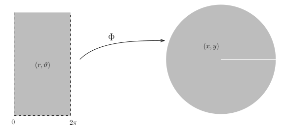
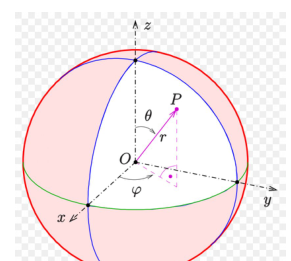
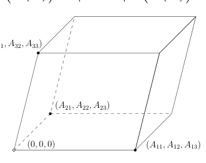
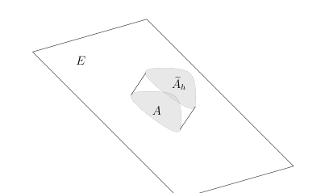
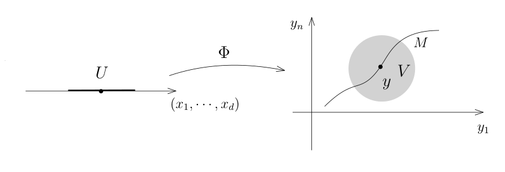
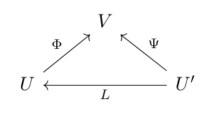

# 常用换元与子流形上的积分

[返回讲义目录](../../../math-analysis-lecture-notes.md) · [学期目录](../../02-math-analysis-ii.md) · [章节目录](../46-submanifold-integrals.md) · [校勘记录](../../errata.md) · [上一篇：换元积分公式](../45-change-of-variables.md) · [下一篇：46.1：期中考试：非Borel集的构造](46-03-p0547-0552.md)

<!-- source: PDF 537; printed: 537; transcription: first-pass; proofreading: applied -->

## 极坐标与球坐标换元

上次课，我们证明了换元积分公式：$\Omega_1$ 和 $\Omega_2$ 是 $\mathbb{R}^n$ 中开集，我们用 $dx$ 和 $dy$ 分别表示开集 $\Omega_1$ 和 $\Omega_2$ 上的 Lebesgue 测度。映射
$$\Phi:\Omega_1\to\Omega_2\quad\text{为微分同胚。}$$
那么，对任意的 $\Omega_2$ 上对 $dy$ 可积的函数 $f$，我们有
$$\int_{\Omega_2} f(y)dy = \int_{\Omega_1} (f \circ \Phi)(x)|\mathbf{J}_\Phi(x)|dx.$$

**例子。** 我们要熟记如下两个最常用的换元积分公式，极坐标换元和球坐标换元：

1) 我们现在考虑 $\Omega_1 = (0, \infty) \times (-\pi, \pi)$ 和 $\Omega_2 = \mathbb{R}^2 - \{(x,0)\mid x\le0\}$。注意到，$\Omega_2$ 和全空间 $\mathbb{R}^2$ 只相差一个零测集，所以在 $\mathbb{R}^2$ 上的积分可以在 $\Omega_2$ 上来算。我们考虑极坐标变换：
$$\Phi : \Omega_1 = (0, \infty) \times (-\pi, \pi) \to \Omega_2, \quad (r, \theta) \mapsto (r \cos(\theta), r \sin(\theta)).$$

我们之前已经在作业中计算过这个坐标变换的行列式，这给出
$$\iint_{\mathbb{R}^2} f(x, y)dxdy = \iint_{\Omega_1} f(r \cos(\theta), r \sin(\theta))r dr d\theta.$$
我们可以看到，$\Omega_1$ 具有很好的乘积结构，所以我们可能可以利用 Fubini 公式来计算某些积分。

2) 令 $\Omega_1 = (0, \infty) \times (-\pi, \pi) \times (-\frac{\pi}{2}, \frac{\pi}{2})$，$\Omega_2 = \mathbb{R}^3 - \{(x, y, z) \mid x \le 0, y = 0, z \in \mathbb{R}\}$。我们考虑球坐标变换：
$$\Phi : \Omega_1 \to \Omega_2, \quad (r, \theta, \varphi) \mapsto (r \cos(\varphi) \cos(\theta), r \cos(\varphi) \sin(\theta), r \sin(\varphi)).$$

<!-- source: PDF 538; printed: 538; transcription: first-pass; proofreading: applied -->

我们有
$$\iiint_{\mathbb{R}^3} f(x, y, z) dxdydz = \iiint_{\Omega_1} f(r \cos(\varphi) \cos(\theta), r \cos(\varphi) \sin(\theta), r \sin(\varphi)) r^2 \cos(\varphi) dr d\theta d\varphi.$$

### 高斯积分与行列式的几何意义

我们给出换元积分公式的两个经典应用：

**例子**（Gauss 积分的计算）。我们要重新计算 $I = \int_{\mathbb{R}} e^{-x^2} dx$。为此，根据 Fubini 公式，我们考虑
$$\begin{aligned}
I^2 &= \left( \int_{\mathbb{R}} e^{-x^2} dx \right) \left( \int_{\mathbb{R}} e^{-y^2} dy \right) \\
&= \iint_{\mathbb{R}^2} e^{-(x^2+y^2)} dxdy \\
&= \int_0^\infty \int_0^{2\pi} e^{-r^2} r d\theta dr \\
&= 2\pi \int_0^\infty e^{-r^2} r dr = \pi.
\end{aligned}$$
所以，$I = \sqrt{\pi}$。

**例子**（行列式的几何含义）。很多的线性代数课本上来就声明行列式表示的空间中平行多面体的体积，这实际上是捕风捉影的叙述。只有定义了什么是体积，才能作出这样的论断，我们现在给出这个说法的解释。给定线性映射（我们直接用矩阵来表示）
$$A : \mathbb{R}^n \to \mathbb{R}^n,$$
先假设 $A$ 可逆。首先考虑由顶点在原点，以 $e_1, e_2, \cdots, e_n$ 作为边的平行多面体（正方体）$\Omega$，它的测度为 1。另外，$A(\Omega)$ 是顶点在原点，以 $A(e_1), A(e_2), \cdots, A(e_n)$ 作为边的平行多面体，根据换元积分公式，它的体积为
$$\begin{aligned}
1 = \int_{\Omega} 1 dx &= \int_{A(\Omega)} 1 |\mathbf{J}_{A^{-1}}| dy \\
&= |\det A|^{-1} \int_{A(\Omega)} 1 dy = |\det A|^{-1} m(A(\Omega)).
\end{aligned}$$
所以，
$$m(A(\Omega))=|\det A|m(\Omega).$$

若 $A$ 不可逆，则 $A(\Omega)$ 包含在低维线性子空间中，故其 $n$ 维 Lebesgue 测度为零；此时 $\det A=0$，同一公式仍成立。

<!-- source: PDF 539; printed: 539; transcription: first-pass; proofreading: applied -->

另外，我们有
$$\begin{cases}
A(e_1) &= (A_{11},A_{21},\cdots,A_{n1}), \\
A(e_2) &= (A_{12},A_{22},\cdots,A_{n2}), \\
&\quad \cdots \quad \cdots \quad \cdots \\
A(e_n) &= (A_{1n},A_{2n},\cdots,A_{nn}).
\end{cases}$$
这就是我们平时所说的以位置向量 $(A_{1i},A_{2i},\cdots,A_{ni})$ 为从原点出发的边的平行多面体的体积，其中 $i \le n$。

**注记。** 我们所寻求的高维的积分理论一定要具备两个基本的工具：第一，Fubini 定理，它可以把高维积分（乘积空间上）转化为低维的来计算；第二，换元积分公式，它可以把一个不规则区域上的积分转化为乘积型区域上的积分，从而用 Fubini 来计算。我们现在建立的积分理论满足这两点，传统的 Riemann 积分理论也要建立这两个公式，所以，从计算积分的观点来看，我们所得到的理论和 Riemann 积分实际上差别不大。

## 子流形上的积分（第一型曲线／曲面积分）

### 仿射子空间上的测度

我们从测度论的观点来研究传统的曲面积分，也就是在子流形上进行积分。我们从最简单的子流形开始研究这个问题（即 $\mathbb{R}^n$ 中的一个线性子空间或者仿射子空间）。我们固定一个背景空间 $\mathbb{R}^n$，在 $\mathbb{R}^n$ 上我们将使用 Lebesgue 测度 $m = dy_1 \cdots dy_n$。我们用 $E$ 表示 $\mathbb{R}^n$ 的一个 $d$-维仿射子空间 $E \subset \mathbb{R}^n$。最基本的问题是：如何测量 $E$ 上集合的体积（面积），即如何在 $E$ 上定义测度？对于这个测度，我们还需要它和直观是一致的（和 Euclid 几何的直观相符）。为此，我们研究一个更简单明了的例子：

**例子。** 考虑映射
$$\Phi : \mathbb{R} \to \mathbb{R}^2, \quad x_1 \mapsto (x_1, x_1).$$
它的像就是 $\mathbb{R}^2$ 中的直线 $45^\circ$ 的直线 $E$。
我们强调一点，$E \subset \mathbb{R}^2$ 是我们关心的几何对象，它还可以通过另外的方式来参数化，比如
$$\Psi : \mathbb{R} \to \mathbb{R}^2, \quad x_2 \mapsto (2x_2, 2x_2).$$
这个映射的像也是 $E$。
我们考虑 $E$ 上的 $(0, 0)$ 点和 $(1, 1)$ 点之间的一段线段 $L$，我们直观上希望它的长度是 $\sqrt{2}$。
然而，根据参数化 $\Phi$ 或者 $\Psi$，我们有若干种不同的方式给出 $E$ 上的测度：

1) 我们用 $\Phi_* m$ 作为 $E$ 上的测度，即我们定义 $L$ 的测度为
$$m(\Phi^{-1}(L)) = m([0, 1]) = 1.$$
此时，用 $x_1$ 表示参数，$L$ 上的测度 $\Phi_* m$ 为 $dx_1$。我们希望这条直线上的测度是 $m_1 = \sqrt{2}dx_1$。

<!-- source: PDF 540; printed: 540; transcription: first-pass; proofreading: applied -->

2) 我们用 $\Psi_* m$ 作为 $E$ 上的测度，即我们定义 $L$ 的测度为
$$m(\Psi^{-1}(L)) = m([0, \tfrac{1}{2}]) = \tfrac{1}{2}.$$
此时，用 $x_2$ 表示参数，$L$ 上的测度 $\Psi_* m$ 在参数 $x_2$ 下为 $dx_2$。我们希望这条直线上的测度是 $m_2 = 2\sqrt{2}dx_2$。

我们希望说明 $m_1$ 或者 $m_2$ 是我们在不同的参数化下同一个测度的不同表示而已（它们都是相对于参数化的一个带有密度的测度）！

仿射子空间 $E$ 上的测度，我们也有类似的困境。我们取仿射变换（一次函数）来参数化我们的仿射子流形：
$$\Phi : \mathbb{R}^d \to E \subset \mathbb{R}^n, \quad x = (x_1, \cdots, x_d) \mapsto J \cdot x + y_0$$
其中，$y_0 \in \mathbb{R}^n$，$J$ 是 $n \times d$ 的矩阵并且 $\operatorname{rank}(J) = d$（$J$ 为映射 $\Phi$ 的 Jacobi 矩阵）。我们强调在 $\mathbb{R}^d$ 和 $\mathbb{R}^n$ 上我们选取了坐标 $\{x_1, \cdots, x_d\}$ 和 $\{y_1, \cdots, y_n\}$ 并且假定了这两个空间上有和这两个坐标系相对应的标准的内积结构（选定了标准正交基）。

为了定义 $E$ 上的测度，最干脆（但是错误）的做法是用 $\mathbb{R}^d$ 上的 Lebesgue 测度在 $\Phi$ 下的像，即 $\Phi_* m_d$，作为 $E$ 上的测度，前面的例子表明，这个不符合直观。我们可以用 $J$ 自身来修正这一点：

**定义 310**（Gram 矩阵）。我们定义一个 $d \times d$ 的矩阵
$$G = {}^t J \cdot J.$$
我们把它称作是参数化 $\Phi$ 的 **Gram 矩阵**。我们定义 $E$ 上的测度 $m_E$ 为：
$$m_E = |\det(G)|^{\frac{1}{2}} \cdot \Phi_* m_d.$$
换而言之，对任意的 $A\in\mathcal B(E)$，我们有
$$m_E(A) = |\det(G)|^{\frac{1}{2}} \cdot m_d(\Phi^{-1}(A)).$$

我们用之前例子中的映射
$$\Phi : \mathbb{R} \to \mathbb{R}^2, \quad x_1 \mapsto (x_1, x_1).$$
此时，$J = {}^t(1, 1)$，$G = 2$，所以，相应的测度为 $\sqrt{2}dx_1$。如果我们换成
$$\Psi : \mathbb{R} \to \mathbb{R}^2, \quad x_2 \mapsto (2x_2, 2x_2).$$
此时，$J = {}^t(2, 2)$，$G = 8$，所以，相应的测度为 $\sqrt{8}dx_2 = 2\sqrt{2}dx_2$。
按照我们在例子中的讨论，这两个测度实际上是同一个，也恰好是我们直观上想要找的测度。

**引理 311。** $E$ 上的测度 $m_E$ 不依赖于仿射线性化 $\Phi$ 的选取。

<!-- source: PDF 541; printed: 541; transcription: first-pass; proofreading: applied -->

**证明：** 我们给两个仿射参数化（忘掉平移部分）：
$$
\begin{aligned}
\Phi : \mathbb{R}^d &\to E \subset \mathbb{R}^n, \quad x \mapsto J_\Phi \cdot x + y_1 \\
\Psi : \mathbb{R}^d &\to E \subset \mathbb{R}^n, \quad z \mapsto J_\Psi \cdot z + y_2.
\end{aligned}
$$

此时，存在一个同构的仿射变换
$$
L : \mathbb{R}^d \to \mathbb{R}^d, \quad z \mapsto J_L \cdot z + x_1,
$$
使得 $\Psi = \Phi \circ L$，其中 $J_L$ 是 $d \times d$ 的可逆矩阵。我们自然有（比如求微分）
$$
J_\Psi = J_\Phi \cdot J_L.
$$

所以，
$$
\begin{aligned}
\det(G_\Psi) &= \det({}^t(J_\Psi) \cdot J_\Psi) \\
&= \det({}^t(J_\Phi \cdot J_L) \cdot J_\Phi \cdot J_L) \\
&= |\det J_L|^2 \det(G_\Phi).
\end{aligned}
$$

从而，对于任意的 $A\in\mathcal B(E)$，根据在 $\mathbb{R}^d$ 上的换元积分公式，我们有
$$
\begin{aligned}
|\det(G_\Psi)|^{\frac{1}{2}} \Psi_* m_d(A) &= |\det(G_\Phi)|^{\frac{1}{2}} |\det J_L| m_d \left( L^{-1}(\Phi^{-1}(A)) \right) \\
&= |\det(G_\Phi)|^{\frac{1}{2}} |\det J_L| |\det J_{L^{-1}}| m_d (\Phi^{-1}(A)) \\
&= |\det(G_\Phi)|^{\frac{1}{2}} m_d (\Phi^{-1}(A)) \\
&= |\det(G_\Phi)|^{\frac{1}{2}} \Phi_* m_d(A).
\end{aligned}
$$

这说明 $m_E$ 的定义不依赖于仿射参数化的选取。\hfill $\square$

**例子。** 这两个例子都是关于超平面的（余维数是 1）：

1) 假定 $E \subset \mathbb{R}^n$，$\operatorname{dim} E = n - 1$，令 $\nu$ 是 $E$ 上的单位法向量（场）（与 $E$ 在每一点处的切空间垂直），$A \subset E$ 是 Borel 集。我们定义以 $A$ 为底高为 $h>0$ 的柱体 $\widetilde{A}_h$ 为：
$$
\widetilde{A}_h = \{ x + t \cdot \nu \mid x \in A, t \in [0, h] \}.
$$

<!-- source: PDF 542; printed: 542; transcription: first-pass; proofreading: applied -->

我们证明
$$m_n(\widetilde A_h) = m_E(A) \times h.$$

根据 Lebesgue 测度的旋转不变性以及测度 $m_E$ 是参数不变的，我们可以在 $E$ 的仿射参数上复合一个 $\mathbb R^n$ 中的正交变换及平移（不改变 Gram 矩阵的行列式），从而不妨假设
$$E = \{y_n = 0\}$$

并且
$$\Phi : \mathbb{R}^{n-1} \to \mathbb{R}^n, \quad (x_1, \cdots, x_{n-1}) \mapsto (x_1, \cdots, x_{n-1}, 0).$$

这时，命题显然成立（乘积测度的定义）。

2) 我们将 $E$ 实现为函数的图像：给定仿射函数
$$f : \mathbb{R}^{n-1} \to \mathbb{R},$$

它的图像 $\Gamma_f = \{(x, f(x)) \in \mathbb{R}^{n-1} \times \mathbb{R} \mid x \in \mathbb{R}^{n-1}\}$ 为 $\mathbb{R}^n$ 中的超平面。由于 $f$ 是仿射的，所以我们有
$$f(x)=f_1x_1+\cdots+f_{n-1}x_{n-1}+a,\quad f_i\in\mathbb R,\ a\in\mathbb R,\ i=1,\cdots,n-1.$$

从而，$\nabla f=(f_1,\cdots,f_{n-1})$。子流形 $E = \Gamma_f$ 的（共有两个）单位法向量（场）为
$$\nu = \pm\frac{1}{(1 + |\nabla f|^2)^\frac{1}{2}} (-\nabla f, 1) = \frac{(-f_1, \cdots, -f_{n-1}, 1)}{(1 + |f_1|^2 + \cdots + |f_{n-1}|^2)^\frac{1}{2}}.$$

为了给出 $m_E$，我们现在找出 $E$ 的参数化：
$$\Phi : \mathbb{R}^{n-1} \to \mathbb{R}^n, \quad x \mapsto \Phi(x) = (x, f(x)).$$

它所对应的 $J=J_\Phi=\begin{pmatrix}\mathbf I_{n-1}\\f_1\quad f_2\quad\cdots\quad f_{n-1}\end{pmatrix}$，所以
$$\det({}^t J_\Phi\cdot J_\Phi) = 1 + |\nabla f|^2.$$

从而，相应的测度为
$$m_E = \sqrt{1 + |\nabla f|^2} dx_1 \cdots dx_{n-1}.$$

所以，如果你要在 $E$ 上积分一个函数 $F : E \to \mathbb{C}$，我们先把 $F$ 写成复合的形式：
$$ (F\circ\Phi)(x)=F(x,f(x)), \quad x \in \mathbb{R}^{n-1}.$$

从而，
$$\int_E F dm_E = \int_{\mathbb{R}^{n-1}} F(x, f(x)) \sqrt{1 + |\nabla f|^2} dx_1 \cdots dx_{n-1}.$$

<!-- source: PDF 543; printed: 543; transcription: first-pass; proofreading: applied -->

这就化成了 $\mathbb{R}^{n-1}$ 上的积分。

### 一般子流形上的测度

上面关于线性子流形的构造很容易推广到一般的子流形上去，基本的想法是局部上把每个子流形看作是参数化的流形，尽管这只是局部的构造，但是局部上能定义测度也就可以整体上定义测度了，所以子流形的积分的理论本质上是局部的问题。给定一个子流形 $M \subset \mathbb{R}^n$，我们假设 $\dim M = d$。对于任意的 $y\in M\subset\mathbb R^n$，按照定义，存在开集 $V \subset \mathbb{R}^n$，$y \in V$，开集 $U \subset \mathbb{R}^d$ 和光滑映射 $\Phi : U \to \mathbb{R}^n$，使得

1) $\Phi : U \to V \cap M$ 是微分同胚；

2) 对每个 $x \in U$，$\operatorname{rank}(d\Phi(x)) = d$，从而，$G_\Phi(x) = {}^t(\operatorname{Jac}(\Phi)) \cdot \operatorname{Jac}(\Phi)$ 是非退化的 $d \times d$ 的矩阵。

（上面的映射方向和我们的子流形的定义中的映射方向是相反的，但这个不妨碍证明）

仿照仿射子流形的情况，对于任意的 Borel 集 $A \subset M \cap V$，我们定义其测度为
$$\begin{aligned}
\sigma(A) &= \int_U \mathbf{1}_{\Phi^{-1}(A)}(x) \sqrt{\det({}^t(\operatorname{Jac}(\Phi)) \cdot \operatorname{Jac}(\Phi))} dx_1 \cdots dx_d \\
&= \int_U \mathbf{1}_{\Phi^{-1}(A)}(x) \sqrt{\det(G_\Phi(x))} dx_1 \cdots dx_d.
\end{aligned}$$

换而言之，我们将 $M$ 上的子流形测度（也叫做曲面测度）定义为
$$d\sigma=\Phi_*\left(\sqrt{\det({}^t(\operatorname{Jac}(\Phi))\cdot\operatorname{Jac}(\Phi))}\,(dx_1\cdots dx_d)\right),$$

其中 $dx_1 \cdots dx_d$ 是 $U$ 上的 Lebesgue 测度。当然，如果 $M$ 是仿射子流形并且 $\Phi$ 是仿射变换，这与之前的构造一致。

我们现在说明这个测度是良好定义的：

**引理 312。** 在 $V \cap M$ 上定义的测度
$$\sigma=\Phi_*\left(\sqrt{\det({}^t(\operatorname{Jac}(\Phi))\cdot\operatorname{Jac}(\Phi))}\,m\right)$$

不依赖于参数化 $\Phi : U \to V$ 的选取。其中，我们在 $V \cap M$ 配有 Borel-代数（它和 $U$ 是微分同胚的）。特别地，这个测度是局部上定义的，从而也在子流形的整体上有了定义。

<!-- source: PDF 544; printed: 544; transcription: first-pass; proofreading: applied -->

**证明：** 这个证明和仿射情形的证明如出一辙：假设 $\Psi : U' \to V \cap M$ 是另一个参数化，即存在开集 $U \subset \mathbb{R}^d$ 和光滑映射 $\Phi : U \to \mathbb{R}^n$，使得
$$\Psi : U' \to V \cap M$$

是微分同胚。所以，如果我们定义 $L = \Phi^{-1} \circ \Psi$，即 $\Psi = \Phi \circ L$，我们就得到一个微分同胚
$$L : U' \to U$$

（$C^1$ 同胚即可）。这可以用如下的交换图表来表示：

利用复合映射的求微分公式，我们就有
$$\operatorname{Jac}(\Psi)(x\prime)=\operatorname{Jac}(\Phi)(L(x\prime))\cdot\operatorname{Jac}(L)(x\prime),$$

所以，
$$\sqrt{\det({}^t(\operatorname{Jac}(\Psi)) \cdot \operatorname{Jac}(\Psi))} = |\det(\operatorname{Jac}(L))| \sqrt{\det({}^t(\operatorname{Jac}(\Phi)) \cdot \operatorname{Jac}(\Phi))}.$$

我们在 $U$ 和 $U'$ 上分别用 $x_i$ 和 $x'_i$ 作为坐标，其中 $i = 1, \cdots, d$。那么，以下各式中 $\operatorname{Jac}(\Psi)$ 与 $\operatorname{Jac}(L)$ 在 $x\prime$ 处取值，第二行的 $\operatorname{Jac}(\Phi)$ 在 $L(x\prime)$ 处取值，第三行则在 $x$ 处取值。根据对 $L$ 的换元积分公式，我们有
$$\begin{aligned}
\sigma'(A) &= \int_{U'} \mathbf{1}_{\Psi^{-1}(A)}(x') \sqrt{\det({}^t(\operatorname{Jac}(\Psi)) \cdot \operatorname{Jac}(\Psi))} dx'_1 \cdots dx'_d \\
&= \int_{L^{-1}(U)} \mathbf{1}_{L^{-1}(\Phi^{-1}(A))}(x') \sqrt{\det({}^t(\operatorname{Jac}(\Phi)) \cdot \operatorname{Jac}(\Phi))} |\det(\operatorname{Jac}(L))| dx'_1 \cdots dx'_d \\
&= \int_U \mathbf{1}_{\Phi^{-1}(A)}(x) \sqrt{\det({}^t(\operatorname{Jac}(\Phi)) \cdot \operatorname{Jac}(\Phi))} dx_1 \cdots dx_d \\
&= \sigma(A).
\end{aligned}$$

这表明测度 $\sigma$ 不依赖于参数化的选取。 $\square$

**注记。** 如果 $f$ 是 $\mathbb{R}^n$ 上定义的函数并且 $f$ 在 $M$ 上的限制是可积的（对测度 $\sigma$ 而言），那么
$$\int_{V\cap M} f\,d\sigma = \int_U f(\Phi(x)) \sqrt{\det({}^t(\operatorname{Jac}(\Phi)) \cdot \operatorname{Jac}(\Phi))} dx_1 \cdots dx_d.$$

这将是非常有用的公式，因为它把曲面积分转化为通常的在 $\mathbb{R}^d$ 上的一个区域上的积分，定要熟练记忆和运用。

### 曲线长度与函数图像上的积分

**例子。** 我们考虑 $1$ 维的子流形对它进行参数化，这就是参数化的曲线
$$\gamma : (-1, 1) \to \mathbb{R}^n,$$

<!-- source: PDF 545; printed: 545; transcription: first-pass; proofreading: applied -->

其中 $\gamma$ 是该曲线的单射参数化，并且对任意的 $t \in (-1, 1)$，$\gamma'(t) \neq 0$。我们固定 $-1 < a < b < 1$，我们来研究曲线上 $\gamma(a)$ 和 $\gamma(b)$ 之间的曲线段 $C_a^b$ 的测度/长度。首先，$\operatorname{Jac}(\gamma)(t) = \gamma'(t)$，所以，按照定义：
$$\begin{aligned}
\sigma(C_a^b) &= \int_{(-1,1)} \mathbf{1}_{\gamma^{-1}(C_a^b)} \sqrt{\gamma'(t) \cdot \gamma'(t)} dt \\
&= \int_a^b |\gamma'(t)| dt.
\end{aligned}$$

这和上个学期所定义的参数曲线的长度的定义一致。特别地，我们用 $C$ 表示该曲线（即 $\gamma$ 的像），$f : C \to \mathbb{C}$ 是给定的（可积）函数，那么
$$\int_{C_a^b} f d\sigma = \int_a^b f(\gamma(t)) |\gamma'(t)| dt.$$

这将是非常有用的公式，定要熟练记忆和运用。

下面所展示的是另一个核心的例子：

**例子。** 给定光滑函数
$$f : \mathbb{R}^{n-1} \to \mathbb{R},$$

我们考虑它的图像所定义的 $\mathbb{R}^n$ 中的超曲面 $\Gamma_f = \{(x, f(x)) \mid x \in \mathbb{R}^{n-1}\}$。该曲面在 $(x, f(x))$ 法向量为
$$\nu = \frac{1}{(1 + |\nabla f|^2)^\frac{1}{2}} (-\nabla f, 1).$$

实际上，很容易看出，$T_{(x, f(x))}$ 由如下 $n-1$ 个向量
$$v_i = (\underbrace{0, \cdots, 0, 1, 0, \cdots, 0}_{\text{共 } n-1 \text{ 个，第 } i \text{ 个位置为 } 1}, \frac{\partial f}{\partial x_i}), \quad i = 1, 2, \cdots, n-1,$$

所张成，直接计算就得到 $v_i \cdot \nu = 0$，其中 $i \leqslant n-1$。

我们用如下的映射来参数化 $\Gamma_f$：
$$\Phi : \mathbb{R}^{n-1} \to \mathbb{R}^n, \quad x \mapsto (x, f(x)).$$

所以，我们有
$${}^t \operatorname{Jac}(\Phi) = \begin{pmatrix} 1 & 0 & \cdots & 0 & \frac{\partial f}{\partial x_1} \\ 0 & 1 & \cdots & 0 & \frac{\partial f}{\partial x_2} \\ 0 & \cdots & \cdots & 0 & \cdots \\ 0 & 0 & \cdots & 1 & \frac{\partial f}{\partial x_{n-1}} \end{pmatrix}$$

这是一个 $(n-1) \times n$ 的矩阵，如果用分块矩阵的写法，我们有 ${}^t \operatorname{Jac}(\Phi) = (\mathbf{I}, \nabla f)$，其中 $\mathbf{I}$ 是 $(n-1) \times (n-1)$ 的单位矩阵，$\nabla f$ 为列向量。所以，

$${}^t \operatorname{Jac}(\Phi) \cdot \operatorname{Jac}(\Phi) = \mathbf{I} + \nabla f \otimes \nabla f = \begin{pmatrix} 1 + \left(\frac{\partial f}{\partial x_1}\right)^2 & \frac{\partial f}{\partial x_1}\frac{\partial f}{\partial x_2} & \cdots & \frac{\partial f}{\partial x_1}\frac{\partial f}{\partial x_{n-1}} \\ \frac{\partial f}{\partial x_2}\frac{\partial f}{\partial x_1} & 1 + \left(\frac{\partial f}{\partial x_2}\right)^2 & \cdots & \frac{\partial f}{\partial x_2}\frac{\partial f}{\partial x_{n-1}} \\ \cdots & \cdots & \cdots & \cdots \\ \frac{\partial f}{\partial x_{n-1}}\frac{\partial f}{\partial x_1} & \frac{\partial f}{\partial x_{n-1}}\frac{\partial f}{\partial x_2} & \cdots & 1 + \left(\frac{\partial f}{\partial x_{n-1}}\right)^2 \end{pmatrix}$$

<!-- source: PDF 546; printed: 546; transcription: first-pass; proofreading: applied -->

所以，（这是一个很有意义的行列式的计算，我们把它留作作业）

$$\det\left({}^t\operatorname{Jac}(\Phi)\cdot\operatorname{Jac}(\Phi)\right)=1+|\nabla f|^2.$$

所以，我们所求的曲面测度为

$$\sigma = \sqrt{1 + |\nabla f|^2} dx_1 \cdots dx_{n-1}.$$

那么，对于任意的 $\mathbb{R}^n$ 上定义的函数，我们有（只要下面的等式有意义）

$$\int_{\Gamma_f} \varphi d\sigma = \int_{\mathbb{R}^{n-1}} \varphi(x, f(x)) \sqrt{1 + |\nabla f(x)|^2} dx.$$

这将是非常有用的公式，必须要熟练记忆和运用。

[返回讲义目录](../../../math-analysis-lecture-notes.md) · [学期目录](../../02-math-analysis-ii.md) · [章节目录](../46-submanifold-integrals.md) · [校勘记录](../../errata.md) · [上一篇：换元积分公式](../45-change-of-variables.md) · [下一篇：46.1：期中考试：非Borel集的构造](46-03-p0547-0552.md)
