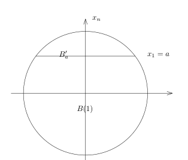
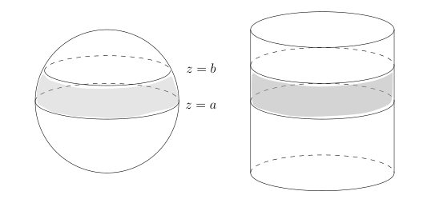
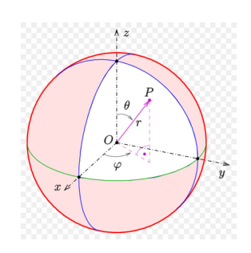
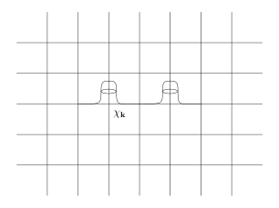
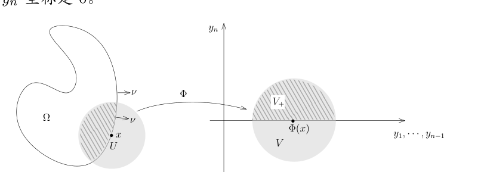
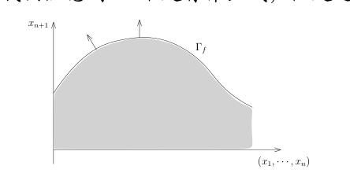
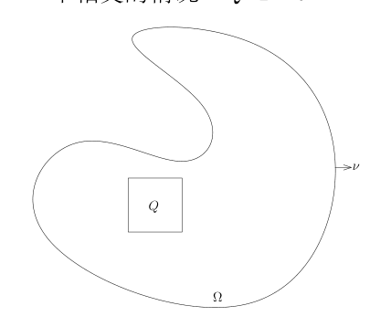

# 47 球体积与 Stokes 公式的第一个证明

[返回讲义目录](../../math-analysis-lecture-notes.md) · [学期目录](../02-math-analysis-ii.md) · [校勘记录](../errata.md) · [上一篇：46.1 期中考试:非Borel集的构造](46-submanifold-integrals/46-03-p0547-0552.md) · [下一篇：Sard 型引理与 Stokes 公式](48-stokes-topological-proof/48-01-p0565-0572.md)

<!-- source: PDF 553; printed: 553; transcription: first-pass; proofreading: applied -->

## 47 子流形上积分的计算: $n$-维球的体积, Archimedes 公式. 截断函数的构造, 周期的单位分解, 有界带边光滑区域, 单位外法向量, 在函数图像上的计算, Stokes 公式的第一个证明

先补充 Fubini 公式的一个应用:

**例子.** 令 $c_n = m(B(1) \subset \mathbb{R}^n)$ 为 $\mathbb{R}^n$ 中单位球的体积, 我们来计算所有的 $c_n$。以 $c_1=2$ 为初值；对于 $n\geqslant2$ 以及 $a\in[-1,1]$，我们令
$$B'_a = B(1) \cap \{x_n = a\}.$$

它的半径长为 $\sqrt{1 - a^2}$

此时, 我们有
$$
\begin{aligned}
c_n = m_n(B(1)) &= \int_{-1}^1 m_{n-1}\bigl(\{x'\mid(x',x_n)\in B(1)\}\bigr) d x_n \\
&= 2 \int_0^1 (1 - x_n^2)^{\frac{n-1}{2}} c_{n-1} d x_n \\
&= 2 c_{n-1} \int_0^{\frac{\pi}{2}} \sin^n \theta d\theta.
\end{aligned}
$$

其中, 我们用了变元替换 $x_n = \cos \theta$。我们注意到, $I_n = \int_0^{\frac{\pi}{2}} \sin^n \theta d\theta$ 是我们上个学期研究过的 Wallis 积分, 其中,
$$I_{2p} = \frac{(2p)!}{2^{2p}(p!)^2} \frac{\pi}{2}, \quad I_{2p+1} = \frac{2^{2p}(p!)^2}{(2p + 1)!}.$$

从而, 我们可以递归地计算 $c_n$。特别地, 我们有
$$c_{2n} = \frac{\pi^n}{n!}.$$

根据递归公式, 我们很容易证明
$$\lim_{n\to\infty} c_n = 0.$$

这说明当 $n$ 变大时, $\mathbb{R}^n$ 中单位球的体积趋于 $0$。另外, 如果借助计算器的话, 我们可以很快看到 $c_5$ 是最大的。

<!-- source: PDF 554; printed: 554; transcription: first-pass; proofreading: applied -->

我们上次课讲过, 如果给定函数图像 $\Gamma_f$, 那么它上面的积分可以用如下的公式来计算:
$$\int_{\Gamma_f} \varphi d\sigma = \int_{\mathbb{R}^{n-1}} \varphi(x, f(x)) \sqrt{1 + |\nabla f(x)|^2} dx.$$

我们现在来看几个经典的例题:

**例子** (Archimedes). 考虑 $\mathbb{S}^2 \subset \mathbb{R}^3$ 是标准的单位球面, 对于 $-1\leqslant a\leqslant b\leqslant1$，我们令
$$\mathbb{S}^2(a, b) = \{(x, y, z) \in \mathbb{S}^2 \mid a \leqslant z \leqslant b\}.$$

我们令 $\mathbf{C}$ 为与 $z$-轴平行的圆柱面, 并且这个圆柱面的直径是 $2$ (恰好可以套在 $\mathbb{S}^2$ 上)。对于 $a, b \in [-1, 1]$, 我们令
$$\mathbf{C}(a, b) = \{(x, y, z) \in \mathbb{R}^3 \mid x^2 + y^2 = 1, a \leqslant z \leqslant b\}.$$

这是两个平行的平面在 $\mathbb{S}^2$ 或者 $\mathbf{C}$ 上所截出的带状区域 (图中的灰色区域)。Archimedes 的一个著名定理说, $\mathbb{S}^2(a, b)$ 的面积和 $\mathbf{C}(a, b)$ 的面积相等。我们来证明这个命题。

我们不妨假设 $a = 0, b > 0$ (从这一点出发很容易证明 Arichmedes 的定理, 这是因为我们将看到 $\mathbf{C}(a, b)$ 的面积正比于 $b - a$), 此时, $\mathbb{S}^2(a, b)$ 可以写成函数的图像:
$$\mathbb{S}^2(0, b) = \{(x, y, z) \in \mathbb{R}^3 \mid z = \sqrt{1 - x^2 - y^2}, 1 \geqslant x^2 + y^2 \geqslant 1 - b^2\}.$$

此时, $f(x, y) = \sqrt{1 - x^2 - y^2}$, 所以
$$d\sigma = \sqrt{1 + |\nabla f(x)|^2} dxdy = \sqrt{\frac{1}{1 - x^2 - y^2}} dxdy.$$

所以,
$$
\begin{aligned}
\sigma(\mathbb{S}^2(0, b)) &= \int_{1 \geqslant x^2 + y^2 \geqslant 1 - b^2} \sqrt{\frac{1}{1 - x^2 - y^2}} dxdy \\
&= \int_{\sqrt{1-b^2}}^1 \int_0^{2\pi} \sqrt{\frac{1}{1 - r^2}} r d\theta dr \\
&= 2\pi \int_{\sqrt{1-b^2}}^1 \sqrt{\frac{1}{1 - r^2}} r dr \\
&= \pi \int_{1-b^2}^1 \sqrt{\frac{1}{1 - t}} dt \\
&= -2\pi \sqrt{1 - t} \Big|_{1-b^2}^1 = 2\pi b.
\end{aligned}
$$

<!-- source: PDF 555; printed: 555; transcription: first-pass; proofreading: applied -->

现在计算 $\mathbf{C}(0, b)$ 的面积, 由对称性, 我们把 $x$ 看成是 $y$ 和 $z$ 的函数, 有对称性, 我们假设 $x \geqslant 0$, 所以, 只要算如下图形的面积即可:
$$\mathbf{C}^+(0, b) = \{(x, y, z) \in \mathbb{R}^3 \mid x = \sqrt{1 - y^2}, -1 \leqslant y \leqslant 1, 0 \leqslant z \leqslant b\}.$$

所以, 我们有 $f(y, z) = \sqrt{1 - y^2}$, 从而,
$$d\sigma = \sqrt{\frac{1}{1 - y^2}} dydz.$$

所以,
$$
\begin{aligned}
\sigma(\mathbf{C}^+(0, b)) &= \int_{[-1, 1] \times [0, b]} \sqrt{\frac{1}{1 - y^2}} dydz \\
&= b \int_{-1}^1 \sqrt{\frac{1}{1 - y^2}} dy \\
&= b\pi.
\end{aligned}
$$

从而,
$$\sigma(\mathbf{C}(0, b)) = 2\sigma(\mathbf{C}^+(0, b)) = \sigma(\mathbb{S}^2(0, b)).$$

我们还可以采取参数化的形式来计算 $\mathbb{S}^2(a, b)$ 的面积, 比如说, 我们可以利用球面坐标系:
$$\Phi : (0, \pi) \times (0, 2\pi) \to \mathbb{S}^2, \quad (\theta, \varphi) \mapsto (\sin(\theta) \cos(\varphi), \sin(\theta) \sin(\varphi), \cos(\theta)).$$

由于 $z = \cos\theta$, 所以 $\mathbb{S}^2(a, b)$ 由 $\theta \in [\arccos b, \arccos a]$ 所定义。此时, 我们有
$${}^t\mathrm{Jac}(\Phi) = \begin{pmatrix} \cos\theta \cos(\varphi) & \cos\theta \sin(\varphi) & -\sin\theta \\ -\sin\theta \sin(\varphi) & \sin\theta \cos(\varphi) & 0 \end{pmatrix} \Rightarrow \det G_\Phi = \sin^2\theta.$$

所以, $d\sigma = \sin\theta d\theta d\varphi$, 从而
$$
\begin{aligned}
\sigma(\mathbb S^2(a,b))&=\int_{[\arccos b,\arccos a]\times(0,2\pi)} \sin\theta d\theta d\varphi \\
&= 2\pi \int_{\arccos b}^{\arccos a} \sin\theta d\theta \\
&= 2\pi (b - a).
\end{aligned}
$$

<!-- source: PDF 556; printed: 556; transcription: first-pass; proofreading: applied -->

我们可以类似地计算 $\mathbf C(a,b)$ 的面积, 考虑参数化
$$\Phi : (0, 2\pi) \times (a, b) \to\mathbf C(a,b), \quad (\theta, s) \mapsto (\cos(\theta), \sin(\theta), s).$$

从而,
$${}^t\mathrm{Jac}(\Phi) = \begin{pmatrix} -\sin\theta & \cos\theta & 0 \\ 0 & 0 & 1 \end{pmatrix} \Rightarrow \det G_\Phi = 1.$$

所以, $d\sigma = d\theta ds$, 从而
$$\sigma(\mathbf C(a,b))=\int_{(0,2\pi)\times(a,b)} d\theta ds = 2\pi(b - a).$$

## Stokes 公式

我们先给出 Stokes 公式的第一个证明, 其想法是把整体的公式转换为局部上的公式。为此, 我们先证明一种特殊形式的单位分解定理, 这是一个技术性的引理。

**注记** (截断函数的存在性). 我们在上个学期作业七习题 F 中 (截断函数部分) 构造了函数 $\psi(x) \in C^\infty(\mathbb{R})$, 使得 $\psi(x) \geqslant 0$, 在 $[-1, 1]$ 上恒为 $1$, 在 $[-2, 2]$ 之外恒为零。另外, 这个 $\psi$ 还是偶函数, 并且在 $[1, 2]$ 之间是单调下降的。

我们现在来构造 $\mathbb{R}^n$ 上的光滑截断函数 $\varphi(x) \in C^\infty(\mathbb{R}^n)$, 其中
$$\varphi(x) = \psi(x_1^2 + \cdots + x_n^2) = \psi(r^2).$$

很明显, $\varphi$ 只依赖于变量 $r$, 它半径为 $2$ 的球之外恒为 $0$, 在半径为 $1$ 的球之上恒为 $1$ 并且这是一个对于半径 $r$ 递减的函数。

我们还可以构造 $\mathbb{R}^n$ 上的光滑截断函数 $\chi(x) \in C^\infty(\mathbb{R}^n)$, 其中
$$\chi(x) = \psi(x_1)\psi(x_2)\cdots\psi(x_n).$$

很明显, 这个函数是光滑的正函数, 它在一个中心在原点并且边长为 $2$ 的正方体上恒为 $1$, 在中心在原点并且边长为 $4$ 的正方体之外恒为 $0$。

我们强调, 这类函数具体构造并不重要, 我们只用上面所列举的几条性质。

我们要构造一个与格点 $\mathbb{Z}^n \subset \mathbb{R}^n$ 相容的单位分解。为此, 首先定义 $\mathbb{R}^n$ 上的函数:
$$F(x) = \sum_{(k_1, \dots, k_n) \in \mathbb{Z}^n} \chi(x_1 + k_1, \dots, x_n + k_n).$$

这个函数是良好定义的: 对于给定的 $x = (x_1, \dots, x_n) \in \mathbb{R}^n$, 这是一个有限和, 因为当某个 $|k_i + x_i| \geqslant 2$ 时, $\chi(x_1 + k_1, \dots, x_n + k_n) = 0$, 所以, 有贡献的项只是 $\mathbb{Z}^n$ 与中心在 $-x$ 处边长为 $4$ 的正方体中的格点, 这自然是一个有限集。

特别地, $F$ 是光滑函数并且以 $\mathbb{Z}^n$ 为周期的周期函数, 即对任意的 $(k_1, \dots, k_n) \in \mathbb{Z}^n$, 我们有
$$F(x_1 + k_1, \dots, x_n + k_n) = F(x_1, \dots, x_n).$$

<!-- source: PDF 557; printed: 557; transcription: first-pass; proofreading: applied -->

另外，根据 $\chi$ 的构造，对任意的 $x$，我们都有 $F(x) > 0$。据此，对每个 $\mathbf{k} = (k_1, \cdots, k_n) \in \mathbb{Z}^n$，我们可以定义
$$F_{\mathbf{k}}(x_1, \cdots, x_n) = \frac{\chi(x_1 - k_1, \cdots, x_n - k_n)}{F(x)},$$
我们得到了一组有紧支集[^p0557-13]的光滑函数 $F_{\mathbf{k}}$，使得对任意的 $x \in \mathbb{R}^n$，我们有
$$\sum_{\mathbf{k} \in \mathbb{Z}^n} F_{\mathbf{k}}(x) = 1.$$

对任意的 $\mathbf{k} \in \mathbb{Z}^n$，$F_{\mathbf{k}}$ 在某个中心在格点上面并且边长为 $4$ 的正方体之外恒为 $0$（本来在某个小一点的正方体上恒为 $1$ 的性质由于除以 $F$ 所以不再成立）。

我们现在任意固定一个（很大的）正整数 $N \ge 1$。对每个 $\mathbf{k} \in \mathbb{Z}^n$，我们定义
$$\chi_{\mathbf{k}}(x) = F_{\mathbf{k}}(2^{N+1}x).$$

那么，$\chi_{\mathbf k}$ 的支集落在以 $2^{-(N+1)}\mathbf k$ 为中心、边长为 $2^{-N+1}$ 的正方体中，并且在这个正方体之外恒为零。除以 $F$ 后，较小的同心正方体（边长为 $2^{-N}$）上一般不再恒为一。特别地，这些正方体的中心落在 $2^{-(N+1)}\mathbb Z^n$ 中（这是更密的格点）。我们自然还有
$$\sum_{\mathbf{k} \in \mathbb{Z}^n} \chi_{\mathbf{k}} \equiv 1.$$

综合上面的讨论，我们得到了如下的单位分解定理，其中，所谓的单位分解，指的是把 $1$ 这个单位函数分解成若干函数的和：

**引理 313** (周期的单位分解). 对任意的 $N \ge 1$，令 $\Gamma_N = 2^{-(N+1)}\mathbb{Z}^n$。那么，存在一族有紧支集的非负的光滑函数 $\{\chi_{\mathbf{k}}(x)\}_{\mathbf{k} \in \Gamma_N}$，满足如下的两个条件：

1) 对任意的 $\mathbf{k} \in \Gamma_N$，$\operatorname{supp} \chi_{\mathbf{k}}$ 落在以 $\mathbf{k}$ 为中心边长为 $2^{-N+1}$ 的正方体中；

2) 常值函数 $1$ 可以分解为：
$$1 = \sum_{\mathbf{k} \in \Gamma_N} \chi_{\mathbf{k}}.$$

为了证明 Stokes 定理，我们还需要技术性的引理。这个引理实际上大有渊源，它和 Dirac $\delta$-函数有关，我们会在下个学期的课程中经常用到这个引理。

<!-- source: PDF 558; printed: 558; transcription: first-pass; proofreading: applied -->

**引理 314.** 假设 $\chi(x)$ 是 $\mathbb{R}^1$ 上的有紧支集的光滑函数，我们假设 $\int_{\mathbb{R}^1} \chi(x)dx = 1$。那么，对任意的连续函数 $f(x)$，我们都有
$$\lim_{\varepsilon \to 0^+} \left( \int_{\mathbb{R}^1} \frac{1}{\varepsilon}\chi \left( \frac{x}{\varepsilon} \right) f(x)dx \right) = f(0).$$

**证明：** 我们假设 $\operatorname{supp}(\chi)\subset[-M,M]$，其中 $M>0$。令 $C=\int_{\mathbb R}|\chi(s)|\,ds<\infty$。根据变量替换公式，对任意的 $\varepsilon > 0$，我们有
$$\int_{\mathbb{R}^1} \frac{1}{\varepsilon}\chi \left( \frac{x}{\varepsilon} \right) dx = 1.$$
为了证明引理所要求的极限，我们做差：
$$
\begin{aligned}
\left| \int_{\mathbb{R}^1} \frac{1}{\varepsilon}\chi \left( \frac{x}{\varepsilon} \right) f(x)dx - f(0) \right| &= \left| \int_{\mathbb{R}^1} \frac{1}{\varepsilon}\chi \left( \frac{x}{\varepsilon} \right) f(x)dx - f(0)\int_{\mathbb{R}^1} \frac{1}{\varepsilon}\chi \left( \frac{x}{\varepsilon} \right) dx \right| \\
&= \left| \int_{\mathbb{R}^1} \frac{1}{\varepsilon}\chi \left( \frac{x}{\varepsilon} \right) (f(x) - f(0)) dx \right| \\
&= \left| \int_{-\varepsilon M}^{\varepsilon M} \frac{1}{\varepsilon}\chi \left( \frac{x}{\varepsilon} \right) (f(x) - f(0)) dx \right|.
\end{aligned}
$$
由于 $f$ 在 $0$ 处连续，所以对任意的 $\epsilon > 0$，存在 $\delta > 0$，使得当 $|x| < \delta$ 时，$|f(x) - f(0)| < \epsilon$。所以，当 $\varepsilon < \frac{\delta}{M}$ 时，上面的积分可以被下面的积分控制：
$$\left| \int_{\mathbb{R}^1} \frac{1}{\varepsilon}\chi \left( \frac{x}{\varepsilon} \right) f(x)dx - f(0) \right| \leqslant \int_{-\varepsilon M}^{\varepsilon M}\frac1\varepsilon\left|\chi\left(\frac x\varepsilon\right)\right|\epsilon\,dx=C\epsilon.$$
所以，所要证明的极限成立。 $\square$

为了能够正确地陈述与证明 Stokes 公式，我们需要引入 $\mathbb{R}^n$ 中的（有界）**带边的光滑区域**（或者 $C^1$-光滑）的概念。很多教科书上在 Stokes 的证明方面语焉不详，很大程度上受制于没有正确地引入概念。

**定义 315**（有界带边光滑区域）. 给定 $\mathbb{R}^n$ 中的紧集 $\Omega \subset \mathbb{R}^n$，我们假设对任意的 $x \in \Omega$，如下两种情况必居其一：

1) $x$ 是一个**内点**，即存在开集 $U \subset \Omega$，使得 $x \in U$；
2) $x$ 是一个**边界点**，即存在开集 $U \subset \mathbb{R}^n$, $x \in U$，存在开集 $V \subset \mathbb{R}^n$，存在微分同胚 $\Phi : U \to V$，其中 $U$ 上的坐标我们用 $x_1, \cdots, x_n$ 表示，$V$ 上的坐标我们用 $y_1, \cdots, y_n$ 表示使得
- $\Phi(U \cap \Omega) = V_+ = V\cap\{(y_1,\cdots,y_n)\mid y_n\geqslant0\}$;
- $\Phi(x)$ 的 $y_n$ 坐标是 $0$。

<!-- source: PDF 559; printed: 559; transcription: first-pass; proofreading: applied -->

那么，我们把 $\Omega$ 称做是一个**有界带边光滑区域**。我们总是约定 $\Omega$ 的内点的集合非空。

**注记.** 根据定义，一个边界点绝对不能是内点，因为它的任何一个邻域都与 $\Omega^c$ 相交。我们将 $\Omega$ 所有内点的集合记为 $\mathring{\Omega}$，边界点的集合记作 $\partial\Omega$。所以，$\Omega = \mathring{\Omega} \cup \partial\Omega$ 并且 $\mathring{\Omega} \cap \partial\Omega = \emptyset$。

在边界点的定义中，$\Phi$ 将边界点映射到 $V_+$ 的边界上，即 $\Phi^{-1}(V_+ \cap \{y_n = 0\}) \subset \partial\Omega$。

实际上，$\partial\Omega$ 是余维数为 $1$ 的光滑子流形。证明是直截了当的：局部上（在上述定义中的 $U$ 中），$x \in \partial\Omega$ 都被一个微分同胚映射成了 $V$ 中 $y_n = 0$ 的点，按照子流形的定义，这是 $n-1$ 维的子流形。

对于 $\mathbb{R}^n$ 中的余维数为 $1$ 的光滑子流形 $M$，对任意的 $x \in M$，我们可以找到两个单位长的（法）向量 $\pm\nu$，使得它们和 $T_x M$ 是垂直的。

**引理 316.** 假设 $\Omega$ 是一个有界带边光滑区域。对于任意的 $p \in \partial\Omega$，存在唯一的 $\nu(p) \in T_p \mathbb{R}^n = \mathbb{R}^n$，使得

1) 这是 $\partial\Omega$ 的单位法向量，即 $\nu(p) \perp T_p \partial\Omega$ 并且 $|\nu(p)| = 1$；
2) 这个向量指向 $\Omega$ 的外部，即存在 $\varepsilon > 0$，使得对任意的 $t \in (0, \varepsilon)$，$p - t\nu(p) \in \Omega$。

我们称 $\nu(p)$ 是 $\Omega$ 在 $p \in \partial\Omega$ 处的**单位外法向量**。

**证明：** 按照定义，存在开集 $p \in U \subset \mathbb{R}^n$, $V\subset\mathbb R^n$ 和微分同胚 $\Phi : U \to V$，使得 $x \in U$ 并且 $\Phi(\partial\Omega \cap U) = V \cap \{y_n = 0\}$ 并且 $\Phi(U \cap \Omega) = V_+$。如果我们令
$$f : U \to \mathbb{R}, \quad x \mapsto f(x) = \Phi^* y_n = y_n(\Phi) = \Phi_n(x),$$
其中 $\Phi(x) = (\Phi_1(x), \cdots, \Phi_n(x))$。那么，$f$ 的零点集就定义了 $\partial\Omega$ 而且
$$\Omega\cap U=\{x\in U\mid f(x)\geqslant0\}.$$
此时，我们任意选取 $\mathbf{n}(p)$，使得 $\mathbf{n}(p) \perp T_p \partial\Omega$ 并且 $|\mathbf{n}(p)| = 1$。为了决定到底哪一个 $\pm\mathbf{n}(p)$ 是外法向量，利用如下的性质
$$\nabla_{\mathbf{n}(p)} f(p) \neq 0.$$
（否则对任意的 $v \in \mathbb{R}^n$，$\nabla_v f = 0$，从而 $df(p) = 0$，矛盾）通过选取 $\mathbf{n}$ 前面的符号，我们要求 $(\nabla_{\nu(p)} f)(p) < 0$。此时，对较小的 $\varepsilon > 0$，对任意的 $t \in (0, \varepsilon)$，我们有
$$f(p - t\nu(p)) = f(p) - t(\nabla_{\nu(p)} f)(p) +o(t)>0.$$
这表明 $p - t\nu(p) \in \Omega$。 $\square$

**注记.** 假设 $\Omega$ 是一个有界带边光滑区域，对任意的 $x \in \partial\Omega$，我们都可以唯一地指定它的外法向量 $\nu(x)$，所以，我们有映射
$$\nu : \partial\Omega \to \mathbb{R}^n, \quad x \mapsto \nu(x).$$

<!-- source: PDF 560; printed: 560; transcription: first-pass; proofreading: applied -->

这实际上是光滑子流形 $\partial\Omega$ 上定义的光滑函数：这是因为每个余 $1$ 维子流形局部上都可以写成函数图像的形式[^p0560-14]，从而我们可以用下面例子的结论。

**例子.** 给定 $\mathbb{R}^n$ 上的光滑函数 $f : \mathbb{R}^n \to \mathbb{R}$，我们把 $\Omega \subset \mathbb{R}^{n+1}$ 定义为 $f$ 的图像 $\Gamma_f$ 下的区域（下面图中的灰色区域），即
$$\Omega = \{(x,x_{n+1})\mid x\in\mathbb R^n,\ x_{n+1}\in\mathbb R,\ x_{n+1}\leqslant f(x)\}.$$

我们计算 $\Omega$ 的单位外法向量（我们注意到 $\Omega$ 不是有界区域，但是这不影响我们计算法向量）。

**证明：** 很明显，$\partial\Omega = \Gamma_f$。给定 $(x, f(x)) \in \partial\Omega$，其中 $x \in \mathbb{R}^n$，我们已经计算过
$$T_{(x, f(x))} \partial\Omega = \operatorname{span}\{e_1, \cdots, e_n\}, \quad \text{其中 } e_i = (\underbrace{0, \cdots, 0, 1, 0, \cdots, 0}_{\text{第 } i \text{ 个位置处为 } 1\text{，其余为 } 0}, \frac{\partial f}{\partial x_i}(x)).$$

据此，这个点处的单位外法向量必然是
$$\nu = \pm \frac{1}{(1+|\nabla f|^2)^{\frac{1}{2}}} (-\nabla f, 1)$$

我们现在确定 $\nu$ 的符号：考虑 $h(x_1,\cdots,x_n,x_{n+1})=x_{n+1} - f(x_1, \cdots, x_n)$，那么，$\Omega = h^{-1}((-\infty, 0])$。为了保证 $\nu$ 是外法向量，我们需要 $\nabla_{\nu} h > 0$。我们计算
$$\nabla_{\frac{(-\nabla f, 1)}{(1+|\nabla f|^2)^{\frac{1}{2}}}} h = (1 + |\nabla f|^2)^{\frac{1}{2}}.$$
所以，
$$\nu = \frac{1}{(1+|\nabla f|^2)^{\frac{1}{2}}} (-\nabla f, 1).$$

特别地，此时，$\nu$ 对 $x$ 是光滑依赖的。 $\square$

我们现在叙述并证明 Stokes 公式：

**定理 317.** 假设 $\Omega$ 是一个有界带边光滑区域，$\nu(x) = (\nu_1(x), \cdots, \nu_n(x))$ 为 $\partial\Omega$ 的单位外法向量，$d\sigma$ 为 $\partial\Omega$ 上的曲面测度。对任意的 $\varphi \in C^1(\mathbb{R}^n, \mathbb{C})$，我们有
$$\int_{\Omega} \frac{\partial \varphi}{\partial x_i}(x) dx = \int_{\partial\Omega} \varphi(x)\nu_i(x) d\sigma.$$

<!-- source: PDF 561; printed: 561; transcription: first-pass; proofreading: applied -->

如果用向量值的函数来写,我们有
$$
\int_{\Omega} \nabla\varphi dx = \int_{\partial\Omega} \varphi \cdot \nu d\sigma.
$$

**证明:** 证明分为四步, 前两步是准备工作:

**第一步**, 把 $\partial\Omega$ 写成若干函数图像的并。

对于每个 $x \in \partial\Omega$, 存在开集 $U_x \subset \mathbb{R}^n$, 使得 $x \in U_x$, $\partial\Omega \cap U_x$ 是函数的图像, 即在 $U_x$ 上, 存在 $k \leqslant n$, 使得 $\partial\Omega$ 形如
$$
\partial\Omega \cap U_x = \{(x_1, \cdots, x_n) \mid x_k = f(x_1, \cdots, x_{k-1}, x_{k+1}, \cdots, x_n)\}.
$$
由于 $\partial\Omega$ 是紧集, 所以存在有限个 $U_{x_1}, \cdots, U_{x_m}$, 使得 $\partial\Omega\subset U_{x_1}\cup\cdots\cup U_{x_m}$。

特别地, 对于足够大的 $N > 0$, 如果一个边长为 $2^{-N+1}$ 的正方体 $Q$ 与 $\partial\Omega$ 的交非空, 那么, 存在 $x_i$, 使得 $Q \subset U_{x_i}$。(请参考上学期第 11 次课关于 Lebesgue 数的讨论)

**第二步**, 函数的局部化。

首先观察到, Stokes 公式的左右两边对于 $\varphi$ 都是线性的。我们利用单位分解将 $\varphi$ 限制到更小的开集上去: 对任意的 $N \geqslant 1$, 我们有一族有紧支集的非负的光滑函数 $\{\chi_{\mathbf{k}}(x)\}_{\mathbf{k}\in\Gamma_N}$, 其中 $\Gamma_N = 2^{-(N+1)}\mathbb{Z}^n$, 使得对每个 $\mathbf{k} \in \Gamma_N$, $\operatorname{supp}\chi_{\mathbf{k}}$ 落在以 $\mathbf{k}$ 为中心边长为 $2^{-N+1}$ 的正方体中并且:
$$
1 = \sum_{\mathbf{k}\in\Gamma_N} \chi_{\mathbf{k}}.
$$
从而,
$$
\varphi = \sum_{\mathbf{k}\in\Gamma_N} \underbrace{\chi_{\mathbf{k}}(x)\varphi(x)}_{=\varphi_{\mathbf{k}}(x)}.
$$
此时, 每个 $\varphi_{\mathbf{k}}$ 在以 $\mathbf{k}$ 为中心边长为 $2^{-N+1}$ 的正方体之外恒为 0。由于 $\Omega$ 是紧集, 所以上述支集与 $\Omega$ 相交的函数的个数是有限个, 所以, 我们只要对这些函数来证明即可。我们仍然用 $\varphi$ 表示 $\varphi_{\mathbf{k}}$, 上面的讨论容许我们假设 $\operatorname{supp}(\varphi)$ 落在一个边长为 $2^{-N+1}$ 的正方体 $Q$ 中。

**第三步**, 正方体 $Q$ 与边界 $\partial\Omega$ 不相交的情况: $Q \subset \mathring{\Omega}$。

<!-- source: PDF 562; printed: 562; transcription: first-pass; proofreading: applied -->

此时, 由于 $\varphi$ 在 $Q$ 之外恒为 0, 从而 $\frac{\partial\varphi}{\partial x_i}$ 在 $Q$ 之外也恒为 0, 所以, 我们可以把积分限制到 $Q$ 上:
$$
\int_{\Omega} \frac{\partial\varphi}{\partial x_i} dx = \int_Q \frac{\partial\varphi}{\partial x_i} dx,
$$
其中, $dx = dx_1 \cdots dx_n$。我们不妨假设 $Q = I_1 \times I_2 \times \cdots \times I_n$, 其中, $I_i = [a_i, b_i]$。所以, 根据 Fubini 公式和 Newton-Leibniz 公式, 我们得到
$$
\begin{aligned}
\int_{\Omega} \frac{\partial\varphi}{\partial x_i} dx &= \int_{I_1 \times \cdots \times \widehat{I_i} \times \cdots \times I_n} \left( \int_{a_i}^{b_i} \frac{\partial\varphi}{\partial x_i} dx_i \right) dx_1 \cdots \widehat{dx_i} \cdots dx_n \\
&= \int_{I_1 \times \cdots \times \widehat{I_i} \times \cdots \times I_n} \varphi(x_1, \cdots, b_i, \cdots, x_n) - \varphi(x_1, \cdots, a_i, \cdots, x_n) dx_1 \cdots \widehat{dx_i} \cdots dx_n.
\end{aligned}
$$
上面表达式中, 一个符号上面加上 $\widehat{\quad}$ 表示这个符号不在那里。由于 $\varphi$ 的支集在 $Q$ 中, 所以
$$
\varphi(x_1, \cdots, b_i, \cdots, x_n) = \varphi(x_1, \cdots, a_i, \cdots, x_n) = 0.
$$
从而上面的积分为 0。另外, 由于 $\varphi$ 及 $\frac{\partial\varphi}{\partial x_i}$ 在 $\partial\Omega$ 上为零, 所以此时 Stokes 公式成立。

**第四步**，正方体 $Q$ 与边界 $\partial\Omega$ 相交的情况：$Q\cap\partial\Omega\ne\emptyset$。此时可以假设 $Q\subset U_{x_j}$，其中 $U_{x_j}$ 是第一步构造的图像邻域，并且 $\operatorname{supp}\varphi\subset Q$。

记 $x'=(x_1,\ldots,x_{n-1})$。经过必要的坐标置换、反向并缩小邻域，可设
$$
\partial\Omega\cap U_{x_j}=\{(x',x_n)\in U_{x_j}\mid x_n=f(x')\},
\qquad
\Omega\cap U_{x_j}=\{(x',x_n)\in U_{x_j}\mid x_n\leqslant f(x')\}.
$$
在此邻域定义
$$
\rho(x)=x_n-f(x').
$$
所以 $\Omega$ 在局部位于 $\rho\leqslant0$ 的一侧，外法向沿着 $\nabla\rho$ 的方向。选取光滑非递减函数 $\theta$，满足 $0\leqslant\theta\leqslant1$ 以及
$$
\theta(t)=\begin{cases}1,&t\geqslant1;\\0,&t\leqslant-1.\end{cases}
$$

<!-- source: PDF 563; printed: 563; transcription: first-pass; proofreading: applied -->

（函数的存在性请参考上个学期作业七习题 F。）设 $Q'$ 为 $Q$ 在前 $n-1$ 个坐标上的投影。因为 $Q$ 紧含于图像邻域，可在 $Q'$ 的一个邻域上保持 $f$ 不变，再乘适当的截断函数，将 $f$ 延拓为 $\mathbb R^{n-1}$ 上的 $C^1$ 函数。将局部函数 $\varphi$ 在其支集之外按零延拓到全空间，它仍为 $C^1$ 紧支集函数。下文的 $\rho(x)=x_n-f(x')$ 使用这个全域延拓；在 $\varphi$ 及其导数可能非零的地方，原区域仍由 $\rho\leqslant0$ 描述。

由于 $\partial\Omega$ 为局部 $C^1$ 图像，它在 $\mathbb R^n$ 中为零测集。因此在被积函数的支集上，
$$
1-\theta\left(\frac{\rho(x)}\varepsilon\right)\longrightarrow\mathbf1_\Omega(x)
\quad\text{几乎处处},\qquad\varepsilon\downarrow0.
$$
由控制收敛定理，再利用紧支集消去分部积分的边界项，得到
$$
\begin{aligned}
\int_\Omega\frac{\partial\varphi}{\partial x_i}(x)\,dx
&=\lim_{\varepsilon\downarrow0}\int_{\mathbb R^n}\frac{\partial\varphi}{\partial x_i}(x)\left[1-\theta\left(\frac{\rho(x)}\varepsilon\right)\right]dx\\
&=\lim_{\varepsilon\downarrow0}\int_{\mathbb R^n}\varphi(x)\frac1\varepsilon\theta'\left(\frac{\rho(x)}\varepsilon\right)\frac{\partial\rho}{\partial x_i}(x)\,dx.
\end{aligned}
$$
这里使用全空间积分，无需把 $\Omega\cap Q$ 的像误认为矩形。

作全域坐标变换
$$
H:\mathbb R^n\to\mathbb R^n,\qquad H(x',x_n)=(x',x_n-f(x')).
$$
它的逆为 $H^{-1}(y',y_n)=(y',y_n+f(y'))$，Jacobian 行列式 $J_H\equiv1$。令
$$
B_i(y)=\frac{\partial\rho}{\partial x_i}(H^{-1}(y))\,\varphi(H^{-1}(y)).
$$
$B_i$ 连续且紧支撑。由换元和 Fubini 公式，
$$
\int_\Omega\frac{\partial\varphi}{\partial x_i}(x)\,dx
=\lim_{\varepsilon\downarrow0}\int_{\mathbb R^{n-1}}\left[\int_\mathbb R\frac1\varepsilon\theta'\left(\frac{y_n}\varepsilon\right)B_i(y',y_n)\,dy_n\right]dy'.
$$
因为 $\theta'\geqslant0$、$\operatorname{supp}\theta'\subset[-1,1]$ 且 $\int_\mathbb R\theta'(t)\,dt=1$，由近似单位引理，对每个 $y'$，内积分趋于 $B_i(y',0)$。这些内积分的绝对值不超过 $\|B_i\|_\infty\mathbf1_{Q'}(y')$，后者可积。再由控制收敛定理，
$$
\begin{aligned}
\int_\Omega\frac{\partial\varphi}{\partial x_i}(x)\,dx
&=\int_{\mathbb R^{n-1}}B_i(y',0)\,dy'\\
&=\int_{Q'}\frac{\partial\rho}{\partial x_i}(x',f(x'))\,\varphi(x',f(x'))\,dx'.
\end{aligned}
$$

<!-- source: PDF 564; printed: 564; transcription: first-pass; proofreading: applied -->

图像下方区域的单位外法向为
$$
\nu=\frac{\nabla\rho}{|\nabla\rho|}
=\frac{(-\nabla f,1)}{\sqrt{1+|\nabla f|^2}},
$$
因此
$$
\frac{\partial\rho}{\partial x_i}(x',f(x'))
=\nu_i(x',f(x'))\sqrt{1+|\nabla f(x')|^2}.
$$
另一方面，图像曲面测度为
$$
d\sigma=\sqrt{1+|\nabla f(x')|^2}\,dx'.
$$
故上页最后的积分就是 $\varphi\nu_i$ 对曲面测度的积分：
$$
\int_\Omega\frac{\partial\varphi}{\partial x_i}(x)\,dx
=\int_{\partial\Omega}\nu_i\varphi\,d\sigma.
$$
在局部图像之外 $\varphi$ 为零，所以右侧可以写成整个边界积分。这就对该小块证明了 Stokes 公式；由此前的单位分解求和，命题得证。 $\hfill\square$

**注记**. 上述证明的一个和核心想法是把函数 $\varphi$ 拆成支集很小的函数的和来进行证明而不是把 $\Omega$ 拆成更小的集合! 也就是说, 把 $\Omega$ 分成小块是更直观的看法, 但是为了实现这个想法, 我们应该走到函数的层次上。

[返回讲义目录](../../math-analysis-lecture-notes.md) · [学期目录](../02-math-analysis-ii.md) · [校勘记录](../errata.md) · [上一篇：46.1 期中考试:非Borel集的构造](46-submanifold-integrals/46-03-p0547-0552.md) · [下一篇：Sard 型引理与 Stokes 公式](48-stokes-topological-proof/48-01-p0565-0572.md)

[^p0557-13]: 函数 $f$ 的**支集** $\operatorname{supp} f$ 为
    $$\operatorname{supp} f = \overline{\{x \in X \mid f(x) \neq 0\}},$$
    即 $f$ 的非零点集的闭包。

[^p0560-14]: 我们总是可以假设子流形局部上是由光滑 $f(x_1, \cdots, x_n) = 0$ 给出的，其中 $df(x) \neq 0$。经过必要的坐标置换并限制到更小的局部 $U$ 上，我们可以假设 $\frac{\partial f}{\partial x_n}(x) \neq 0$，根据隐函数定义，我们可以把 $f^{-1}(0) = M \cap U$ 写成 $x_n = h(x_1, \cdots, x_{n-1})$ 的形式这显然是函数图像。通过缩小这个区域，我们还可以假设它形如 $U' \times I$，其中 $U' \subset \mathbb{R}^{n-1}$ 为开集，$I \subset \mathbb{R}$ 为开区间
