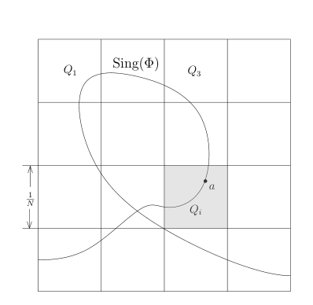
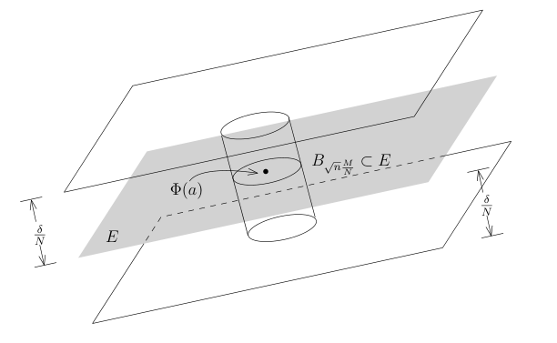
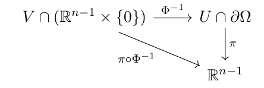
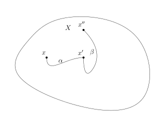
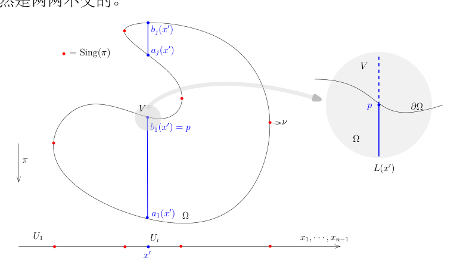

# Sard 型引理与 Stokes 公式

[返回讲义目录](../../../math-analysis-lecture-notes.md) · [学期目录](../../02-math-analysis-ii.md) · [章节目录](../48-stokes-topological-proof.md) · [校勘记录](../../errata.md) · [上一篇：球体积与 Stokes 公式的第一个证明](../47-stokes-first-proof.md) · [下一篇：48.1：作业：曲面曲线积分的计算](48-03-p0573-0577.md)

<!-- source: PDF 565; printed: 565; transcription: first-pass; proofreading: applied -->

## 临界值的零测性

我们先证明微分拓扑学中 Sard 定理的一个特殊形式，它的证明用到了换元积分公式证明里的基本想法和技巧：

**引理 318**。$U \subset \mathbb{R}^n$ 是开集，$\Phi : U \to \mathbb{R}^n$ 是 $C^1$ 的映射。我们定义 $\Phi$ 的临界点集或者奇异点集 $\operatorname{Sing}(\Phi)$ 为
$$\operatorname{Sing}(\Phi) = \{ x \in U \mid \operatorname{rank}(d\Phi(x)) < n \} = \{ x \in U \mid \det(\operatorname{Jac}_\Phi(x)) = 0 \}.$$
那么，$\Phi(\operatorname{Sing}(\Phi)) \subset \mathbb{R}^n$ 是零测集。

**证明**：我们可以将 $U$ 写成可数个闭的正方体的并集
$$U = \bigcup_{i=1}^{\infty} Q_i,$$
其中 $Q_i$ 是闭正方体。由于可数个零测集的并还是零测集，所以只要对每个 $Q_i$ 来证明 $\Phi(Q_i \cap \operatorname{Sing}(\Phi))$ 是零测集即可。

我们只需要考虑单独的一个正方体 $Q$ 即可。不妨假设 $Q$ 的边长为 1。我们沿用在换元积分公式的证明中所用的范数，即对任意 $x = (x_1, \cdots, x_n) \in \mathbb{R}^n$ 和 $n \times n$ 的矩阵 $A = (A_{ij})$，有
$$\|x\| = \sup_{i \leqslant n} |x_i|, \quad \|A\| = \sup_{i \leqslant n} \left( \sum_{j=1}^n |A_{ij}| \right).$$

由于 $\Phi$ 是 $C^1$ 的，所以映射 $d\Phi$ 在 $Q$ 上是连续的，从而在 $Q$（紧集）上一致连续。据此，我们将 $Q$ 进一步分解为边长为 $h = \frac{1}{N}$ 的 $N^n$ 个的正方体 $Q_i$，其中 $N \in \mathbb{Z}$ 是很大的正整数，使得在每个 $Q_i$ 上面，都有
$$\|d\Phi(x) - d\Phi(y)\| \leqslant \delta, \quad \forall x, y \in Q_i.$$

<!-- source: PDF 566; printed: 566; transcription: first-pass; proofreading: applied -->

我们考察每一个 $Q_i$。如果 $Q_i \cap \operatorname{Sing}(\Phi) = \emptyset$，那么 $Q$ 对 $\Phi(\operatorname{Sing}(\Phi))$ 的测度没有贡献，我们可以忽略这一类的小正方体。现在假设 $Q_i \cap \operatorname{Sing}(\Phi) \neq \emptyset$，我们选定 $a \in Q_i \cap \operatorname{Sing}(\Phi)$。对于任意的 $x \in Q_i$ 和任意的指标 $k \leqslant n$，根据 Lagrange 中值定理（对 $\Phi$ 的分量用），我们有
$$\Phi_k(x) - \Phi_k(a) - d\Phi_k(a)(x - a) = \sum_{j \leqslant n} \left( \frac{\partial \Phi_k}{\partial x_j}(\xi_k) - \frac{\partial \Phi_k}{\partial x_j}(a) \right) (x_j - a_j),$$
其中 $\xi_k$ 为线段 $\overline{xa}$ 上的某点（从而，$\xi_k \in Q_i$）。所以，
$$\begin{aligned}
\|\Phi(x) - \Phi(a) - d\Phi(a)(x - a)\| &= \sup_{k \leqslant n} |\Phi_k(x)-\Phi_k(a)-d\Phi_k(a)(x-a)| \\
&\overset{\text{Lagrange}}{\leqslant} \sup_{k \leqslant n} \sum_{j \leqslant n} \left| \frac{\partial \Phi_k}{\partial x_j}(\xi_k) - \frac{\partial \Phi_k}{\partial x_j}(a) \right| |(x_j - a_j)| \\
&\leqslant \|x - a\| \sup_{k \leqslant n} \sum_{j \leqslant n} \left| \frac{\partial\Phi_k}{\partial x_j}(\xi_k)-\frac{\partial\Phi_k}{\partial x_j}(a) \right| \\
&\leqslant\left(\sup_{z\in Q_i}\|d\Phi(z)-d\Phi(a)\|\right)\|x-a\| \\
&\leqslant \frac{\delta}{N}.
\end{aligned}$$
即
$$\|\Phi(x) - (\Phi(a) + d\Phi(a)(x - a))\| \leqslant \frac{\delta}{N}.$$

按照奇异集 $\operatorname{Sing}(\Phi)$ 的定义，$d\Phi(a)$ 的秩至多是 $n - 1$，所以集合
$$\{\Phi(a)+d\Phi(a)(x-a)\mid x\in Q_i\}$$
落在某个过 $\Phi(a)$ 点的 $n - 1$ 维的超平面里面 $E \subset \mathbb{R}^n$。我们刚刚在证明的不等式表明，$\Phi(Q_i)$ 落在离这个超平面的距离不超过 $\sqrt n\frac\delta N$ 距离的地方（这里使用 Euclid 距离，由 $|v|\leqslant\sqrt n\|v\|$ 把最大坐标范数的误差转换为 Euclid 距离）。

另外，根据上面的不等式的证明，我们有
$$\|\Phi(x) - \Phi(a)\| \leqslant \left(\sup_{k\leqslant n}\sum_{j\leqslant n}\left|\frac{\partial\Phi_k}{\partial x_j}(\xi_k)\right|\right)\|x-a\|\leqslant M\|x-a\|.$$

<!-- source: PDF 567; printed: 567; transcription: first-pass; proofreading: applied -->

其中，$M = \sup_{x \in Q} \|d\Phi(x)\|$（整个 $Q$ 上的最大值）。根据，$|x| \leqslant \sqrt{n}\|x\|$，我们就有（Euclid 距离）
$$|\Phi(x) - \Phi(a)| \leqslant \sqrt{n}\frac{M}{N}.$$
也就是说，$\Phi(Q_i)$ 像中的每个点到 $\Phi(a)$ 的距离都不超过 $\sqrt{n}\frac{M}{N}$。我们把 $\Phi(Q_i)$ 正交投影到 $E$ 上，它的像一定包含在一个以 $\Phi(a)$ 为中心以 $\sqrt{n}\frac{M}{N}$ 为半径的球 $B_{\sqrt{n}\frac{M}{N}}$ 里面。所以，$\Phi(Q_i)$ 落在以 $B_{\sqrt{n}\frac{M}{N}}$ 为底（截面），以 $2\sqrt n\frac\delta N$ 为高的圆柱里面，它的体积不超过
$$c_{n-1}\left(\sqrt n\frac MN\right)^{n-1}\times\left(2\sqrt n\frac\delta N\right) = C_n M^{n-1} \frac{\delta}{N^n}.$$
这里在 $n=1$ 时约定 $c_0=1$；维数常数 $C_n$ 取上述圆柱体积式所给出的值。由于至多有 $N^n$ 个这样的 $Q_i$，所以，
$$\begin{aligned}
m(\Phi(Q\cap\operatorname{Sing}(\Phi)))&\leqslant \sum_{Q_i \cap \operatorname{Sing}\Phi \neq \emptyset} m(\Phi(Q_i)) \\
&\leqslant N^n \times \left[ C_n M^{n-1} \frac{\delta}{N^n} \right] \\
&= C_n M^{n-1} \delta.
\end{aligned}$$
由于 $\delta$ 是任意选取的，所以 $\Phi(Q\cap\operatorname{Sing}(\Phi))$ 是零测集。再对覆盖 $U$ 的可数个闭正方体取并，得到 $\Phi(\operatorname{Sing}(\Phi))$ 是零测集。 $\quad \square$

我们对换元积分公式的证明稍加改造，就可以证明更强一点的结论：

**练习**。假设 $U$ 和 $V$ 是 $\mathbb{R}^n$ 中的开集，$\Phi : U \to V$ 是同胚而且 $\Phi$ 是 $C^1$ 的映射（它的逆未必是 $C^1$ 同胚），那么换元积分公式仍然成立（比如，我们可以考虑 $\mathbb{R}^1$ 上的变元替换 $x \mapsto x^3$）。

我们把它留作本次的作业。

另外，类似于上述引理的表述，我们还可以讨论到 $\mathbb R^{n-1}$ 的映射的奇异点的集合：假设 $M \subset \mathbb{R}^n$ 是 $n - 1$-维的子流形，考虑投影映射
$$\pi : M \to \mathbb{R}^{n-1}, \quad (x_1, \cdots, x_{n-1}, x_n) \mapsto (x_1, \cdots, x_{n-1}).$$

令
$$\operatorname{Sing}(\pi) = \{ x \in M \mid \operatorname{rank}(d\pi(x)) < n - 1 \}.$$
那么，$\pi(\operatorname{Sing}(\pi)) \subset \mathbb{R}^{n-1}$ 是零测集。我们把它留作本次的作业。

还有一个所谓的“扭曲”版本的 Fubini 定理，尽管我们证明 Stokes 公式用不到这个定理：$\Omega \subset \mathbb{R}^n$ 是开集，$F:\Omega\to\mathbb R$ 是光滑映射。假设对任意的 $x\in\Omega$，$dF(x) \neq 0$（从而，$\Sigma_t = F^{-1}(t)$ 是余 1 维子流形）。那么，对任意的 $\Omega$ 上的可积函数 $f$，我们有
$$\int_{\Omega} f(x) dx = \int_{\mathbb{R}} \left( \int_{\Sigma_t} \frac{f}{|\nabla F|} d\sigma_t \right) dt,$$

<!-- source: PDF 568; printed: 568; transcription: first-pass; proofreading: applied -->

其中，$d\sigma_t$ 是 $\Sigma_t$ 上的子流形测度。我们也将在这次方作业中证明这个命题。

## 沿投影纤维证明斯托克斯公式

我们现在给出 Stoke 公式的一个新的证明：与之前的相比，这个证明更几何，更整体。

只要证明
$$\int_{\Omega} \frac{\partial \varphi}{\partial x_1}(x) dx = \int_{\partial\Omega} \varphi(x) \nu_1(x) d\sigma.$$
即可。

我们考虑 $\mathbb{R}^n$ 上的投影映射：
$$\pi : \mathbb{R}^n \to \mathbb{R}^{n-1}, \quad (x_1, \cdots, x_n) \mapsto (x_2, \cdots, x_n).$$
把它限制到 $\partial\Omega$ 上（仍记作 $\pi$），我们就有
$$\pi : \partial\Omega \to \mathbb{R}^{n-1}.$$
我们定义 $\pi$ 的临界点集：
$$\operatorname{Sing}(\pi) = \{ x \in \partial\Omega \mid \operatorname{rank}(d\pi(x)) < n - 1 \}.$$
由于 $\partial\Omega$ 是 $n - 1$ 维的子流形，对任意的 $x \in \partial\Omega$，存在包含 $x$ 开集 $U \subset \mathbb{R}^n$ 以及 $\mathbb{R}^n$ 中的开集 $V$ 和微分同胚
$$\Phi : U \to V$$
使得
$$\Phi(U\cap\partial\Omega)=V\cap(\mathbb R^{n-1}\times\{0\}).$$
从而，我们可以对
$$\pi \circ \Phi^{-1} : V \cap (\mathbb{R}^{n-1} \times \{0\}) \to \mathbb{R}^{n-1}$$
应用刚才的引理（与微分同胚复合把奇异点集映射到奇异点并且不会改变零测集的性质）。

所以，$\pi(\operatorname{Sing}(\pi)) \subset \mathbb{R}^{n-1}$ 是零测集。所以，我们有
$$\begin{aligned}
\int_{\Omega} \frac{\partial \varphi}{\partial x_1}(x)dx &= \int_{\mathbb{R}^n} 1_{\Omega}(x) \frac{\partial \varphi}{\partial x_1}(x)dx \\
&\overset{\text{Fubini}}{=} \int_{\mathbb{R}^{n-1}} \left( \int_{\mathbb{R}} 1_{\Omega}(x_1, \cdots, x_n) \frac{\partial \varphi}{\partial x_1}(x_1, \cdots, x_n) dx_1 \right) dx_2 \cdots dx_n \\
&= \int_{\mathbb{R}^{n-1} - \pi(\operatorname{Sing}(\pi))} \left( \int_{\mathbb{R}} 1_{\Omega}(x_1, \cdots, x_n) \frac{\partial \varphi}{\partial x_1}(x_1, \cdots, x_n) dx_1 \right) dx_2 \cdots dx_n.
\end{aligned}$$
我们需要研究 $\mathbb{R}^{n-1} - \pi(\operatorname{Sing}(\pi))$ 的一些简单的几何/拓扑性质。

<!-- source: PDF 569; printed: 569; transcription: first-pass; proofreading: applied -->

首先注意到，对任意的 $x \in \partial \Omega - \operatorname{Sing}(\pi)$，$x$ 附近必然有一个 $\partial\Omega$ 中的相对开集 $U$ 使得 $x \in U \subset \partial \Omega - \operatorname{Sing}(\pi)$，这表明 $\operatorname{Sing}(\pi)$ 是闭集，从而是紧集。由于紧集的在连续映射下的像还是紧集，所以，$\pi(\operatorname{Sing}(\pi)) \subset \mathbb{R}^{n-1}$ 是紧集，从而，$\mathbb{R}^{n-1} - \pi(\operatorname{Sing}(\pi))$ 是开集。

**定义 319**（道路连通性）。$X \subset \mathbb{R}^n$ 是子集，如果对任意 $x, x' \in X$，我们都有连续映射
$$
\gamma : [0, 1] \to X \subset \mathbb{R}^n,
$$
使得 $\gamma(0) = x$，$\gamma(1) = x'$，我们就称 $X$ 是**道路连通的**。如果某两个点满足上述性质，我们就说 $x$ 与 $x'$ 之间存在道路。

**注记。** 对任意的集合 $X \subset \mathbb{R}^n$，我们定义如下的等价关系：$x \sim x'$ 当且仅当 $x$ 与 $x'$ 之间存在道路。我们验证这是等价关系：

- $x \sim x$：我们可以取 $\gamma(t) \equiv x$；
- $x \sim x' \Rightarrow x' \sim x$：首先，存在连续映射 $\gamma : [0, 1] \to X$，使得 $\gamma(0) = x$，$\gamma(1) = x'$；我们定义
$$
\tilde{\gamma} : [0, 1] \to X, \quad t \mapsto \gamma(1 - t).
$$
这显然是连续映射并且 $\tilde{\gamma}(0) = x'$，$\tilde{\gamma}(1) = x$；

- $x \sim x', x' \sim x'' \Rightarrow x \sim x''$：首先，存在连续映射 $\alpha : [0, 1] \to X$，使得 $\alpha(0) = x$，$\alpha(1) = x'$；存在连续映射 $\beta : [0, 1] \to X$，使得 $\beta(0) = x'$，$\beta(1) = x''$。

我们定义
$$
\gamma : [0, 1] \to X, \quad t \mapsto \gamma(t) = \begin{cases} \alpha(2t), & t \in [0, \frac{1}{2}]; \\ \beta(2t - 1), & t \in [\frac{1}{2}, 1] \end{cases}.
$$
这给出了从 $x$ 到 $x''$ 的道路。

所以，我们可以把 $X$ 分拆为不同等价类的无交并 $X = \bigcup_i X_i$，每个 $X_i$ 我们都称作是 $X$ 的一个**道路连通分支**。比如，在 $\mathbb{R}^2$ 上，集合 $\mathbb{R}^2 - \{(x, y) \mid xy = 0\}$ 有四个连通分支。

**注记。** 如果 $U \subset \mathbb{R}^n$ 是开集，那么 $U$ 的每个道路连通分支都是开集，且与通常的连通分支一致，因为每个 $x$ 附近的点自然和 $x$ 之间存在道路。此时，$U$ 的连通分支的个数是可数的（因为每个连通分支当中我们都可以取一个有理点来标记）。

<!-- source: PDF 570; printed: 570; transcription: first-pass; proofreading: applied -->

**引理 320**。假设 $U \subset \mathbb{R}^n$ 是连通的开集，函数

$$f : U \to \mathbb{Z} \subset \mathbb{R}$$

是连续映射，那么 $f$ 是常值映射。

这是一个非常有用的引理。

**证明：** 如果不然，那么不妨假设存在两个不同的整数 $k$ 和 $\ell$ 以及 $x, y \in U$，使得 $f(x) = k, f(y) = \ell$。我们任选一条连接 $x$ 和 $y$ 的道路

$$\gamma : [0, 1] \to U \subset \mathbb{R}^n,$$

使得 $\gamma(0) = x, \gamma(1) = y$，那么函数 $f(\gamma(t))$ 根据介值定理，存在某个 $t' \in (0, 1)$，使得 $f(\gamma(t'))$ 是 $k$ 与 $\ell$ 之间的一个非整数，矛盾。 $\Box$

我们现在回到 Stokes 定理的证明。

由于 $\mathbb{R}^{n-1} - \pi(\operatorname{Sing}(\pi))$ 是开集，所以，它可以写成（可数个）不交的（道路）连通开集 $\{U_i\}_{i \geqslant 1}$ 的并：

$$\mathbb{R}^{n-1} - \pi(\operatorname{Sing}(\pi)) = \bigcup_{i=1}^{\infty} U_i.$$

这些连通分支自然是两两不交的。

所以，我们有

$$\int_{\Omega} \frac{\partial \varphi}{\partial x_1}(x) dx = \sum_i \left[ \int_{U_i} \left( \int_{\mathbb{R}} \mathbf{1}_{\Omega}(x_1, \dots, x_n) \frac{\partial \varphi}{\partial x_1}(x_1, \dots, x_n) dx_1 \right) dx_2 \cdots dx_n \right].$$

现在固定连通分支 $i$，对于每个 $x' \in U_i$，我们考虑 $x'$ 在背景空间投影 $\pi:\mathbb R^n\to\mathbb R^{n-1}$ 下的逆像

$$L_{x'} = \pi^{-1}(x') = \{(t, x') \mid t \in \mathbb{R}\}.$$

考虑 $\Omega$ 的边界与 $L_{x'}$ 的一个交点（如果存在的话）$p \in \partial\Omega \cap L_{x'}$，在 $p$ 附近的小领域 $V$ 上（右边的图是局部上的放大）。由于 $x' \notin \pi(\operatorname{Sing}(\pi))$，所以

$$d\pi(p) : T_p \partial\Omega \to T_{x'} \mathbb{R}^{n-1} = \mathbb{R}^{n-1}$$

<!-- source: PDF 571; printed: 571; transcription: first-pass; proofreading: applied -->

是线性同构。根据

$$d\pi(p) : T_p L_{x'} \to T_{x'} \mathbb{R}^{n-1} = \mathbb{R}^{n-1}$$

是零映射（因为 $\pi(L_{x'}) = x'$，求微分立得），所以，$T_p L_{x'} \subset \ker(d\pi(p))$。这表明（数维数）：

$$T_p \mathbb{R}^n = T_p \partial\Omega \oplus T_p L_{x'}.$$

所以，假设 $\partial\Omega\cap V$ 由 $f(x_1, \dots, x_n) = 0$ 定义并且 $f(x) \leqslant 0$ 定义了 $\Omega\cap V$。那么，对于 $v = \frac{\partial}{\partial x_1} \in T_p L_{x'}$，我们有 $\nabla_v f(p) \neq 0$（否则 $df(p) \equiv 0$，矛盾）。与 $\Omega$ 的单位外法向量的构造一致，通过缩小 $V$，我们知道 $L_{x'} \cap V$ 被 $p$ 分成了两段，一段（实线）在 $\Omega$ 中，一段（虚线）在 $\Omega$ 外面。特别地，这表明，对于 $p \in \partial\Omega \cap L_{x'}$，$p$ 在 $L_{x'}$ 上面的附近（出了自己）没有点与 $\partial\Omega$ 相交。据此，我们知道 $\partial\Omega \cap L_{x'}$ 在 $L_{x'}$ 上没有聚点，又因为 $\partial\Omega$ 是有界的，所以，$\partial\Omega \cap L_{x'}$ 只有有限个点（可以没有）：我们把它们按照 $x_1$ 坐标的大小依次记作

$$a_1(x'), b_1(x'), a_2(x'), b_2(x'), \dots, a_k(x'), b_k(x') \in\mathbb R.$$

这里各 $a_j,b_j$ 表示对应交点的 $x_1$ 坐标；我们一共有 $2k$（偶数个点），这是因为，当 $x_1$ 坐标很负的时候，$L_{x'}$ 的点在 $\Omega$ 之外（因为 $\Omega$ 是有界的）。根据上面的证明，$a_1(x')$ 是第一次（如果有的话）$L_{x'}$ 进入 $\Omega$，$b_1(x')$ 是接下来 $L_{x'}$ 离开 $\Omega$ 时与 $\partial\Omega$ 的交点，依次类推，因为最终当 $x_1$ 很正（大）的时候，$L_{x'}$ 的点在 $\Omega$ 之外，所以最终 $L_{x'}$ 要离开 $\Omega$，这说明有偶数个点。

这样子，$L_{x'} \cap \Omega$ 是 $k$ 个不交的闭区间之并，即

$$L_{x'} \cap \Omega = \coprod_{j=1}^{k(x')} [a_j(x'), b_j(x')],$$

我们注意到区间的个数可能依赖于 $x'$。

根据隐函数定理，$a_j(x')$（或者 $b_j(x')$）是 $x'$ 的光滑函数（因为 $\nabla_{\frac{\partial}{\partial x_1}} f(a_j(x'),x')\neq0,\ f(a_j(x'),x')=0$，这就是隐函数定理的叙述），此外，若附近出现其它交点，可由紧边界中取收敛子列，其极限仍在原纤维上，违背原交点邻域中隐函数分支的唯一性。因此在 $x'$ 附近，区间的个数 $k(x')$ 是常数，所以 $x' \to k(x')$ 是连续函数，再根据 $U_i$ 的连通性，我们知道，在每个 $U_i$ 上，对任意的 $x' \in U_i, k(x') \equiv k$。从而，我们都有

$$
\begin{aligned}
& \int_{U_i} \left( \int_{\mathbb{R}} \mathbf{1}_{\Omega}(x_1, \dots, x_n) \frac{\partial \varphi}{\partial x_1}(x_1, \dots, x_n) dx_1 \right) dx_2 \cdots dx_n \\
= & \int_{U_i} \left( \int_{\Omega\cap L_{x'}} \frac{\partial \varphi}{\partial x_1}(x_1, \dots, x_n) dx_1 \right) dx_2 \cdots dx_n \\
= & \sum_{j=1}^k \int_{U_i} \left( \int_{a_j(x')}^{b_j(x')} \frac{\partial \varphi}{\partial x_1}(x_1, x') dx_1 \right) dx'.
\end{aligned}
$$

在每个区间 $[a_j(x'), b_j(x')]$ 上用 Newton-Leibniz 法则，我们得到

$$
\begin{aligned}
& \int_{U_i} \left( \int_{\mathbb{R}} \mathbf{1}_{\Omega}(x_1, \dots, x_n) \frac{\partial \varphi}{\partial x_1}(x_1, \dots, x_n) dx_1 \right) dx_2 \cdots dx_n \\
= & \sum_{j=1}^k \int_{U_i} \left( \varphi(b_j(x'), x') - \varphi(a_j(x'), x') \right) dx'.
\end{aligned}
$$

<!-- source: PDF 572; printed: 572; transcription: first-pass; proofreading: applied -->

我们考察其中的一项，比如说

$$\int_{U_i} \varphi(b_j(x'), x') dx'$$

我们注意到，此时，$x' \mapsto b_j(x')$ 将 $\partial\Omega \cap \pi^{-1}(U_i)$ 的一部分 $\partial\Omega_{i, b_j}$ 实现为函数图像所定义的曲面，所以，

$$
\begin{aligned}
\int_{U_i} \varphi(b_j(x'), x') dx' &= \int_{\partial\Omega_{i, b_j}} \frac{1}{\sqrt{1 + |\nabla b_j|^2}} \varphi(b_j(x'), x') d\sigma \\
&= \int_{\partial\Omega_{i, b_j}} \nu_1\varphi\,d\sigma.
\end{aligned}
$$

类似地，

$$\int_{U_i} \varphi(a_j(x'), x') dx' = -\int_{\partial\Omega_{i, a_j}} \nu_1 \varphi d\sigma.$$

根据

$$\partial\Omega \cap \pi^{-1}(U_i) = \bigcup_{j\leqslant k} \left( \partial\Omega_{i, a_j} \cup \partial\Omega_{i, b_j} \right),$$

我们最终得到

$$\int_{U_i} \left( \int_{\mathbb{R}} \mathbf{1}_{\Omega}(x_1, \dots, x_n) \frac{\partial \varphi}{\partial x_1}(x_1, \dots, x_n) dx_1 \right) dx_2 \cdots dx_n = \int_{\partial\Omega \cap \pi^{-1}(U_i)} \nu_1 \varphi d\sigma.$$

再对所有的连通分支 $U_i$ 求和。令 $A=\{x\in\partial\Omega\mid\pi(x)\in\pi(\operatorname{Sing}(\pi))\}$，于是限制在边界上的投影满足 $\pi^{-1}(\mathbb R^{n-1}-\pi(\operatorname{Sing}(\pi)))=\partial\Omega-A$，我们就有

$$\int_{\Omega}\frac{\partial\varphi}{\partial x_1}(x)\,dx=\int_{\partial\Omega-A} \nu_1 \cdot \varphi d\sigma.$$

我们注意到 $\operatorname{Sing}(\pi) \subset \partial\Omega$ 未必是零测集（它在 $\pi$ 的像下是零测集）。然而，当 $x \in \operatorname{Sing}(\pi)$ 时，存在非零向量 $w\in T_x\partial\Omega$，使得 $d\pi(x)(w) = 0$，由于 $\pi$ 是投影映射，所以 $w$ 必须形如 $(w_1, 0, \dots, 0)$。根据 $\nu \perp w$，这表明 $\nu_1(x) = 0$。也即是说

$$\nu_1 \vert_{\operatorname{Sing}(\pi)} \equiv 0.$$

对于 $A-\operatorname{Sing}(\pi)$，投影在每个点附近给出边界的图像坐标。其基底属于零测集 $\pi(\operatorname{Sing}(\pi))$，图像曲面测度有连续的密度，故每个局部图像中的这部分曲面测度为零。由可数个图像邻域覆盖，得到 $\sigma(A-\operatorname{Sing}(\pi))=0$。结合 $\nu_1$ 在临界点上为零，可知 $\int_A\nu_1\varphi\,d\sigma=0$。所以，

$$\int_{\partial\Omega-A} \nu_1 \cdot \varphi d\sigma = \int_{\partial\Omega} \nu_1 \cdot \varphi d\sigma.$$

这就完成了 Stokes 公式的证明。

**注记**。Stokes 公式第一个证明更分析，我们设法把问题转化为对支撑集很小的函数来证明，把 $n$ 维的 Stokes 公式转化为一个方块上的问题（乘积机构），从而可以降低维数；第二个集合证明具有很强的微分拓扑的味道，直接将问题转化为 $1$ 维的 Newton-Leibniz 公式。

[返回讲义目录](../../../math-analysis-lecture-notes.md) · [学期目录](../../02-math-analysis-ii.md) · [章节目录](../48-stokes-topological-proof.md) · [校勘记录](../../errata.md) · [上一篇：球体积与 Stokes 公式的第一个证明](../47-stokes-first-proof.md) · [下一篇：48.1：作业：曲面曲线积分的计算](48-03-p0573-0577.md)
