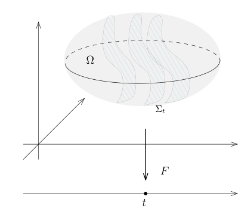

# 48.1：作业：曲面曲线积分的计算

[返回讲义目录](../../../math-analysis-lecture-notes.md) · [学期目录](../../02-math-analysis-ii.md) · [章节目录](../48-stokes-topological-proof.md) · [校勘记录](../../errata.md) · [上一篇：Sard 型引理与 Stokes 公式](48-01-p0565-0572.md) · [下一篇：48.2：习题课：Riemann积分的定义1](48-04-p0578-0584.md)

<!-- source: PDF 573; printed: 573; transcription: first-pass; proofreading: applied -->

<!-- math-analysis-layout: document-title-normalized -->

>

## 课堂补充

A1) 给定 $\sigma$-有限的测度空间 $(X, \mathcal{A}, \mu)$，正可测函数 $\rho$ 几乎处处取有限值，我们课上证明了 $\nu = \rho\mu$ 是 $(X, \mathcal{A})$ 上 $\sigma$-有限的测度。$f$ 是 $(X, \mathcal{A}, \mu)$ 上的可测函数。证明，$f\rho \in L^1(X, \mathcal{A}, \mu)$ 当且仅当 $f \in L^1(X, \mathcal{A}, \nu)$（$L^1$ 表示它可积分）。进一步，在此情形下，我们有
$$ \int_X f(x)d\nu(x) = \int_X f(x)\rho(x)d\mu(x). $$

（提示：证明遵循标准操作的步骤：
1）对 $f(x) = \mathbf{1}_A$ 验证，其中 $A \in \mathcal{A}$）。
2）对阶梯函数验证。
3）通过取上升的简单函数逼近正函数 $f$ 对正函数验证。
4）对于一般的函数，将函数的实部和虚部拆成正负部分并利用线性完成证明。
）

A2) 我们在 $\mathbb{R}^2$ 上给 Lebesgue 测度 $m_2$。考虑投影映射
$$ \pi_1 : \mathbb{R}^2 \to \mathbb{R}, \quad (x, y) \mapsto x. $$
证明，由二维 Lebesgue 测度推前到 $\mathbb R$ 上的测度 ${\pi_1}_*m_2$ 不是 $\sigma$-有限的，

A3) 假设 $n \geqslant 2$，$f \in C^\infty(\mathbb{R}^{n-1})$，我们用如下的方式来参数化其图像 $\Gamma_f$：
$$ \Phi : \mathbb{R}^{n-1} \to \mathbb{R}^n, \quad x \mapsto (x, f(x)). $$
证明，
$$ \det \left( {}^t\operatorname{Jac}(\Phi) \cdot \operatorname{Jac}(\Phi) \right) = 1 + |\nabla f|^2. $$

A4) （换元积分公式，条件更弱）给定 $\mathbb R^n$ 中的两个开集 $\Omega_1,\Omega_2$。如果 $\Phi : \Omega_1 \to \Omega_2$ 是同胚（即该映射及其逆都是连续的）并且 $\Phi$ 是连续可微的，对任意的可积函数 $f(y) \in L^1(\Omega_2, dy)$，我们有
$$ \int_{\Omega_2} f(y)dy = \int_{\Omega_1} (f \circ \Phi)(x) |J_\Phi(x)| dx. $$

<!-- source: PDF 574; printed: 574; transcription: first-pass; proofreading: applied -->

A5) 假设 $M \subset \mathbb{R}^n$ 是 $n - 1$-维的子流形，考虑投影映射
$$ \pi : M \to \mathbb{R}^{n-1}, \quad (x_1, \cdots, x_{n-1}, x_n) \mapsto (x_1, \cdots, x_{n-1}). $$
令
$$ \operatorname{Sing}(\pi) = \{ x \in M \mid \operatorname{rank} d\pi(x) < n - 1 \}. $$
证明，$\pi(\operatorname{Sing}(\pi)) \subset \mathbb{R}^{n-1}$ 是零测集（用 $\mathbb{R}^{n-1}$ 上的 Lebesgue 测度来看）。对于 $x' = (x_1, \cdots, x_{n-1}) \in \mathbb{R}^{n-1}$，这里将 $\pi$ 也用于相同公式定义的背景空间投影；我们定义直线
$$ L_{x'} = \{ (x_1, \cdots, x_{n-1}, t) \mid t \in \mathbb{R} \} = \pi^{-1}(x') \subset \mathbb{R}^n. $$
证明，
$$ \pi(\operatorname{Sing}(\pi)) = \{ x' \in \mathbb{R}^{n-1} \mid \text{直线 } L_{x'} \text{ 与 } M \text{ 相切} \}. $$
其中，$L_{x'}$ 与 $M$ 相切指的是存在 $p \in M$，使得 $p \in L_{x'}$ 并且 $T_p L_{x'} \subset T_p M$。

A6) （一个“扭曲”的 Fubini）$\Omega \subset \mathbb{R}^n$ 是开集，$F:\Omega\to\mathbb R$ 是光滑映射。假设对任意的 $x\in\Omega$，$dF(x) \neq 0$（从而，$\Sigma_t = F^{-1}(t)$ 是余 $1$ 维子流形）。

那么，$\Omega$ 上的任意可积函数 $f$，我们有
$$ \int_\Omega f(x)dx = \int_\mathbb{R} \left( \int_{\Sigma_t} \frac{f}{|\nabla F|} d\sigma_t \right) dt, $$
其中，$d\sigma_t$ 是 $\Sigma_t$ 上的子流形测度。

## 积分的计算（换元积分公式）

我们有比较常用的坐标变换（主要是前两种）：

1. 极坐标 $(r, \varphi) \mapsto (x, y) = (r \cos \varphi, r \sin \varphi)$；
2. 球坐标 $(r, \theta, \varphi) \mapsto (x, y, z) = (r \sin \theta \cos \varphi, r \sin \theta \sin \varphi, r \cos \theta)$；

<!-- source: PDF 575; printed: 575; transcription: first-pass; proofreading: applied -->

3. 双曲坐标（Rindler 坐标）$(t, x) \mapsto (T, X) = (x \sinh t, x \cosh t)$，其中 $\sinh t = \frac{e^t - e^{-t}}{2}$，$\cosh t = \frac{e^t + e^{-t}}{2}$；
4. 抛物坐标 $(u, v) \mapsto (x, y) = (u^2 - v^2, 2uv)$；
5. 椭圆坐标 $(u, v) \mapsto (x, y) = (c \cosh u \cos v, c \sinh u \sin v)$，$c > 0$ 是常数。

B1) 计算体积或者面积（如果需要对参数分类讨论，那么请至少处理一种情形）
(a) 双纽线 $(x^2 + y^2)^2 = 2a^2(x^2 - y^2)$ 围成的面积。
(b) 曲线 $(x^3 + y^3)^2 = x^2 + y^2$ 的内部区域面积。
(c) 曲线 $\frac{x^3}{a^3} + \frac{y^3}{b^3} = \frac{x^2}{h^2} + \frac{y^2}{k^2}$ 与坐标轴 $x = 0, y = 0$ 围成的面积。
(d) 曲线 $(2x + y)^4 = x^2 - 2y^2$ 围成的面积。
(e) 曲线 $(\frac{x}{a} + \frac{y}{b})^5 = \frac{x^2 y^2}{c^4}$（$x > 0, y > 0$）围成的面积。
(f) 曲面 $(x^2 + y^2 + z^2)^3 = \frac{a^6 z^2}{x^2 + y^2}$ 所围立体图形的体积。
(g) 曲面 $(\frac{x^2}{a^2} + \frac{y^2}{b^2})^2 + \frac{z^4}{c^4} = 1$ 内部的体积。
(h) 曲面 $(\frac{x}{a} + \frac{y}{b} + \frac{z}{c})^4 = \frac{xyz}{abc}$（$x, y, z > 0$）所围立体图形的体积。
(i) $(\frac{x}{a} + \frac{y}{b})^2 + (\frac{z}{c})^2 = 1$ 所围立体图形的体积。
(j) 曲面 $z = x^2 + y^2$，$z = 2(x^2 + y^2)$，$xy = a^2$，$xy = 2a^2$，$x = 2y$，$2x = y$（$x > 0, y > 0$）所围立体图形的体积。

B2) 设物体的质量由密度函数 $\rho$ 给出，那么在区域 $V$ 内的总质量为 $\int_V \rho(x)dx$，若 $0<\int_V\rho(x)\,dx<\infty$ 且各 $\int_V|x_i|\rho(x)\,dx<\infty$，$V$ 的质心坐标 $(\bar x_1,\cdots,\bar x_n)$ 由下式确定：
$$ \bar{x}_i = \frac{\int_V x_i \rho(x)dx}{\int_V \rho(x)dx}. $$

(a) 计算球 $x^2 + y^2 + z^2 \leqslant 2az$ 的质量及质心坐标，其中密度函数 $\rho(x, y, z) = \frac{k}{\sqrt{x^2 + y^2 + z^2}}$，$k > 0$ 是常数。
(b) 求由抛物面 $x^2 + y^2 = 2az$ 及球面 $x^2 + y^2 + z^2 = 3a^2$ 围成的均质（$\rho \equiv 1$）物体的质心坐标。

B3) 假设 $\rho$ 是 $\mathbb{R}^3$ 上非负可积的函数（如果一个物体的质量函数是 $\rho$ 的话），它所对应的引力势能 $\Phi(x)$ 和引力场 $G(x)$ 在下列积分有限且势函数可微的点，由下式给出：
$$ \Phi(x) = -\int_{\mathbb{R}^3} \frac{\rho(y)}{|x - y|} dy, \quad G(x) = -\nabla \Phi(x) $$

<!-- source: PDF 576; printed: 576; transcription: first-pass; proofreading: applied -->

我们假设区域 $V \subset \mathbb{R}^3$ 是开区域，$\rho_0 > 0$ 是常数，
$$ \rho(x) = \begin{cases} \rho_0, & x \in V \\ 0, & x \in \mathbb{R}^3 \setminus V \end{cases} $$
试计算如下情形下的 $\Phi(x)$ 和 $G(x)$：
(a) $V = \{ x \in \mathbb{R}^3 : |x|^2 < R^2 \}$ 是球体。
(b) $V = \{ x = (x_1, x_2, x_3) \in \mathbb{R}^3 : x_1^2 + x_2^2 < R^2, 0 < x_3 < h \}$ 是圆柱体。
(c) $V = \{ x = (x_1, x_2, x_3) \in \mathbb{R}^3 : x_3^2 > \frac{h^2}{R^2}(x_1^2 + x_2^2), 0 < x_3 < h \}$ 是圆锥体。

B4) （Newton 壳层（shell）定理：关于球对称密度分布的引力）假设
$$ \rho(x) = \begin{cases} f(|x|), & r < |x| < R; \\ 0, & |x|\geqslant R\text{ 或 }|x|\leqslant r. \end{cases} $$
其中 $0\leqslant r<R$，$f$ 是在 $[r, R]$ 上定义的非负可积函数。证明：
(a) 对球外一点（$|x| > R$）产生的引力与球的所有质量集中于球心的质点产生的引力一样。
(b) 球壳对球壳内任何一点（$|x| < r$）产生的引力（合力）为零。

## 曲面 / 曲线 / 子流形上的积分计算

C1) 计算下列的曲线积分：
(a) 计算 $\mathbb{R}^3$ 中曲线 $C$ 的长度，其中参数曲线 $C$ 由 $t \mapsto (a \cos(t), b \sin(t), bt)$ 给出，其中 $t \in [0, 2\pi]$；计算 $\int_C \frac{z^2}{x^2 + y^2} ds$，其中 $ds$ 为 $C$ 上的子流形测度。
(b) 假设 $C$ 是 $\mathbb{R}^3$ 中 $x^2 + y^2 + z^2 = a^2$ 与 $x + y + z = 0$ 所截出的曲线，试计算 $\int_C xyds$。
(c) $C$ 是参数曲线 $(a(t - \sin t), a(1 - \cos t))$，其中 $t \in [0, 2\pi]$。计算积分 $\int_C y^2 ds$。
(d) 平面上的曲线 $C$ 在极坐标系下的方程为 $r = f(\theta)$，其中 $f$ 是连续可微的，$\alpha \leqslant \theta \leqslant \beta$。证明，该参数曲线 $C$ 按遍历次数计的长度为
$$ \int_\alpha^\beta \sqrt{|f(\theta)|^2 + |f'(\theta)|^2} d\theta. $$

C2) 计算下列的曲面积分：
(a) 试计算 $x^2 + y^2 + z^2 = a^2$ 与 $x^2 + y^2 = ax$ 相交得到的曲线在球面上围出的面积。
(b) 试计算参数曲面 $\Sigma$ 的面积，其中 $\Sigma$ 如下定义：
$$ [0, 2\pi] \times [0, 2\pi] \to \mathbb{R}^3, \quad (\theta, \varphi) \mapsto ((b + a \cos \theta) \cos \varphi, (b + a \cos \theta) \sin \varphi, a \sin \theta), $$
其中，我们要求 $0 < a < b$。

<!-- source: PDF 577; printed: 577; transcription: first-pass; proofreading: applied -->

(c) $C$ 是参数曲线 $(a(t - \sin t), a(1 - \cos t))$，其中 $t \in [0, 2\pi]$。将 $C$ 在 $\mathbb{R}^3$ 中绕着 $x$ 轴旋转一周得到的曲面是 $\Sigma$，试计算 $\Sigma$ 的面积。

(d) $C$ 是平面上的抛物线段 $x = y^2$，其中 $x \in [0, a]$。将 $C$ 在 $\mathbb{R}^3$ 中绕着 $x$ 轴旋转一周得到的曲面是 $\Sigma$，试计算 $\Sigma$ 的面积。

(e) $\Sigma$ 是锥面 $z^2 = x^2 + y^2$ 被柱面 $x^2 + y^2 = 2ax$ 所截下的部分，计算曲面积分 $\int_{\Sigma} x^2y^2 + y^2z^2 + z^2x^2 d\sigma$。

(f) $\Sigma$ 是 $\mathbb{R}^3$ 中的柱面 $x^2 + y^2 = a^2$，其中 $z \in [0, h]$，计算曲面积分 $\int_{\Sigma} x^4 + y^4 d\sigma$。

(g) $\Sigma$ 是 $\mathbb{R}^3$ 中的半球面 $x^2 + y^2 + z^2 = 1$，其中 $z \geqslant 0$，计算曲面积分 $\int_{\Sigma} x + y + z d\sigma$。

(h) $\Sigma$ 是 $\mathbb{R}^3$ 中的球面 $x^2 + y^2 + z^2 = 1$，计算曲面积分 $\int_{\Sigma} x^2 d\sigma$。

(i) $\Sigma$ 是 $\mathbb{R}^3$ 中的球面上小帽子 $x^2 + y^2 + z^2 = 1$，$z \geqslant h > 0$，计算曲面积分 $\int_{\Sigma} \frac{1}{z} d\sigma$。

(j) $\Sigma$ 是 $\mathbb{R}^3$ 中的参数曲面：$(u, v) \mapsto (u \cos v, u \sin v, v)$，其中 $(u, v) \in [0, a] \times [0, 2\pi]$。计算曲面积分 $\int_{\Sigma} z d\sigma$。

(k) $\Sigma$ 是 $\mathbb{R}^3$ 中的球面 $x^2 + y^2 + z^2 = 1$，$f$ 是 $\mathbb{R}$ 上的连续函数。证明，
$$ \int_{\Sigma} f(ax + by + cz) d\sigma = 2\pi \int_{-1}^1 f((a^2 + b^2 + c^2)^{\frac{1}{2}} t) dt. $$

[返回讲义目录](../../../math-analysis-lecture-notes.md) · [学期目录](../../02-math-analysis-ii.md) · [章节目录](../48-stokes-topological-proof.md) · [校勘记录](../../errata.md) · [上一篇：Sard 型引理与 Stokes 公式](48-01-p0565-0572.md) · [下一篇：48.2：习题课：Riemann积分的定义1](48-04-p0578-0584.md)
