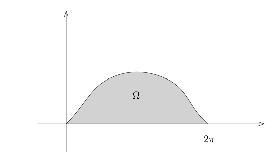
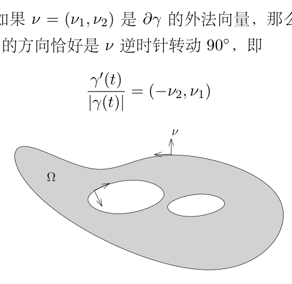

# 49：散度定理与 Green 公式

[返回讲义目录](../../math-analysis-lecture-notes.md) · [学期目录](../02-math-analysis-ii.md) · [校勘记录](../errata.md) · [上一篇：48.2：习题课：Riemann积分的定义1](48-stokes-topological-proof/48-04-p0578-0584.md) · [下一篇：Brouwer 不动点定理与 Hilbert 空间](50-hilbert-spaces.md)

<!-- source: PDF 585; printed: 585; transcription: first-pass; proofreading: applied -->

## 摆线围成区域上的积分

我们首先一起计算一个积分：$\int_{\Omega} y^2 dxdy$，其中 $\Omega$ 是 $\mathbb{R}^2$ 上面由曲线
$$\gamma : [0, 2\pi] \to \mathbb{R}^2, \quad t \mapsto (a(t - \sin(t)), a(1 - \cos(t)))$$
与 $y = 0$ 所围成的区域，其中 $a>0$。

图示对应 $a=1$。

这显然是某个函数 $y = f(x)$ 的图像下的部分（与 $x$ 轴所围），其中 $x \in [0, 2\pi a]$。所以，我们可以尝试用 Fubini 公式：
$$\int_{\Omega} y^2 dxdy = \int_{0}^{2\pi a} \left( \int_{0}^{f(x)} y^2 dy \right) dx$$
$$= \int_{0}^{2\pi a} \frac{1}{3} f(x)^3 dx.$$

当然，我们可能需要强行决定 $f(x)$ 具体的表达式。
所以，我们很自然地想研究 $y$ 与 $x$ 之间的（隐函数）关系：
$$x = \begin{cases}
a\arccos\left(1-\frac{y}{a}\right)-\sqrt{y(2a-y)}, & 0\le t\le\pi,\\
2\pi a-a\arccos\left(1-\frac{y}{a}\right)+\sqrt{y(2a-y)}, & \pi\le t\le2\pi.
\end{cases}$$
这个只需要用 $y$ 来表达 $t$，然后带入 $x$ 的表达式即可。利用这个表达式，一种计算积分的方式就是把 $x$ 换元成 $y$，从而对 $y$ 积分。当然，这个操作启发我们可以用 Fubini 公式先对 $x$ 积分，这样再用 $x = x(y)$ 来描述函数的图像就会简单很多。

还有一种看法是用参数曲线来描述积分
$$\int_{0}^{2\pi a} \left( \int_{0}^{f(x)} y^2 dy \right) dx = \int_{0}^{2\pi a} \frac{1}{3} f(x)^3 dx.$$
我们将这个积分写的形式化一些：
$$\int_{\Omega} y^2 dxdy = \int_{0}^{2\pi a} \varphi(x, f(x)) dx,$$

<!-- source: PDF 586; printed: 586; transcription: first-pass; proofreading: applied -->

其中 $y = f(x)$ 就是我们要找的函数图像，$\frac{\partial}{\partial y} \varphi(x, y) = y^2$，所以我们可以取 $\varphi(x, y) = \frac{1}{3} y^3$（注意到这个函数的选取比较随意）。此时，我们可以用曲线的参数表达，因为我们通过 $(x, y) = (x, f(x))$ 的替换已经假设这个点生活在 $f$ 的图像上。所以
$$\int_{\Omega} y^2 dxdy = \int_{0}^{2\pi a} \varphi(x, f(x)) dx$$
$$= \int_{0}^{2\pi} \varphi(x(t), f(x(t))) x'(t) dt$$
$$= \int_{0}^{2\pi} \varphi(x(t), y(t)) x'(t) dt.$$

代入参数化，我们得到
$$\int_{\Omega} y^2 dxdy = \int_{0}^{2\pi} \frac{1}{3} a^3 (1 - \cos(t))^3 a(1 - \cos(t)) dt.$$

这样，就得到了一个 1 维的积分，所以可以进行计算了。

如果我们坚持不用具体的参数表达式来写，我们实际上就是用了如下简单的计算：
$$\int_{\Omega} y^2 dxdy = \int_{0}^{2\pi a} \frac{1}{3} f(x)^3 dx$$
$$= \int_{0}^{2\pi} \frac{1}{3} y(t)^3 x'(t) dt.$$

这些计算实际上已经隐藏在 Stokes 公式之中，我们把 $y^2$ 看作是 $\frac{\partial \varphi}{\partial y}$，并且
$$\int_{\Omega} y^2 dxdy = \int_{0}^{2\pi} \varphi(x(t), y(t)) \underbrace{\frac{x'(t)}{|\gamma'(t)|}}_{\nu_2} \underbrace{|\gamma'(t)| dt}_{d\sigma}$$
$$= \int_{\partial \Omega} \varphi \nu_2 d\sigma.$$

这恰好就是在 Stokes 公式的证明中所出现的步骤。此时，$\Omega$ 的下边界对积分没有贡献，因为在 $y=0$ 上有 $\varphi(x,0)=0$，所以 $\varphi\nu_2=0$。

上述的讨论还建议我们实际上可以用 Stokes 公式来计算，想法是直接把积分化到边界上，从而用曲线上的积分计算：
$$\int_{\Omega} y^2 dxdy = \int_{\Omega} \operatorname{div}(0, \frac{1}{3}y^3) dxdy.$$

我们可以参考后面的散度定理。

**注记**。上周的 Stokes 公式的证明是值得研究的，核心的想法是把边界上的积分分解为一些函数图像上的积分，为了搞清楚证明，假设 $\Omega$ 为 $\mathbb{R}^n$ 的标准球，然后就这个例子把证明的每一步搞清楚是很有帮助的。

<!-- source: PDF 587; printed: 587; transcription: first-pass; proofreading: applied -->

我们先澄清一些出现在各种数学或物理教材文献中的各种积分的记号。我们总是假设 $\Omega \subset \mathbb{R}^n$ 是给定的一个区域（很多场合下，它是一个有界带边的光滑区域）。

假设 $M \subset \mathbb{R}^n$ 是子流形，给定函数 $f : M \to \mathbb{C}$，人们通常把子流形上的积分（如果可积的话）
$$\int_{M} f d\sigma$$
称作是**第一型子流形积分**。当 $\dim M = 1$ 时（通常 $n = 2$ 或 $3$），这个积分被称作是**第一型曲线积分**；当 $\dim M = 2$ 时（通常 $n = 3$），这个积分被称作是**第一型曲面积分**。这种分类可能不是很有意思，更多是沿用了历史上的名称。

## 第二型曲线积分

现在假设 $X$ 是区域 $\Omega \subset \mathbb{R}^n$ 上的光滑向量场。

我们首先定义第二型曲线积分。假设 $C \subset \Omega$ 是一个 1 维子流形，我们假设它可以用光滑的参数化
$$\gamma : [a, b] \to \Omega$$
来表示。我们定义向量场 $X$ 在 $C$ 上的**第二型曲线积分**为
$$\int_{\gamma} X \cdot d\gamma := \int_{a}^{b} \langle X(\gamma(t)), \gamma'(t) \rangle dt.$$
在上面的表达式中，左边我们认为是形式的记号，右边 $\langle X(\gamma(t)), \gamma'(t) \rangle$ 表示的是向量的内积。有时候（从微分流形的观点看更自然，我们或许在下个学期会严格地定义一般流形上对微分形式的积分），人们把这个积分也写成：
$$\int_{\gamma} X \cdot d\gamma := \int_{\gamma} X_1 dx_1 + \cdots + X_n dx_n.$$
用测度的观点来写（或者用第一型曲线积分来写），我们有
$$\int_{\gamma} X \cdot d\gamma = \int_{\gamma} \left\langle X(\gamma(t)), \frac{\gamma'(t)}{|\gamma'(t)|} \right\rangle d\sigma.$$
也就是说，被积函数是 $X$ 与 $\gamma$ 的单位切向量的内积。

所以，单独地研究第二型曲线积分并没有太大的意义，因为这就是在曲线上做积分，然而，这些表达式在物理学里有着它们特殊的含义，我们会在某些例子中展现，同学们在今后其他场合遇到第二型曲线积分只要来查一下这部分笔记把它翻译成第一型积分即可。

另外，假设 $C$ 是闭曲线，即 $\gamma(a) = \gamma(b)$，我们还把这个积分写成
$$\oint_{\gamma} X \cdot d\gamma,$$
其中，积分号上的圈表明这个曲线是一个“圈”（封闭），我们把它还称作是 $X$ 沿曲线 $C$ 的**环路积分**，物理上把它称作是 $X$ 沿曲线 $C$ 的**环量**。

<!-- source: PDF 588; printed: 588; transcription: first-pass; proofreading: applied -->

## 第二型（超）曲面积分

现在 $\Omega \subset \mathbb{R}^n$ 是有界带边光滑区域，$X$ 是 $\Omega$ 上的光滑向量场，$\nu$ 是 $\partial \Omega$ 上的单位外法向量。
我们定义
$$\int_{\partial \Omega} X \cdot d\vec{\sigma} = \int_{\partial \Omega} \langle X, \nu \rangle d\sigma$$
物理学上，我们把上面的量称作是 $X$ 穿过 $\partial \Omega$ 的**通量**，目前我们可以简单地从字面上直观认为这个积分是 $X$ 从里向外有多少” 流” 通过了 $\partial \Omega$（我们后面会定义精确地定义它的含义）。

通常，我们研究的区域在 $\mathbb{R}^3$ 中，此时，我们也把上面的积分写成
$$\iint_{\partial \Omega} X \cdot d\vec{\sigma}.$$
其中，两个积分符号代表着 $\partial \Omega$ 的维数是 2。
另外，由于 $\partial \Omega$ 是闭曲面，我们还把这个积分写成
$$\oiint_{\partial \Omega} X \cdot d\vec{\sigma}.$$
其中，积分号上的圈表明曲面是封闭的。
另外，文献中还有另一种表达式代表的也是第二型曲面积分（$\mathbb{R}^3$）的情形，它的表达式是
$$\iint_{\partial \Omega} P dydz + Q dxdz + R dxdy,$$
其中 $P, Q, R$ 是 $\mathbb{R}^3$（或者 $\partial \Omega$）上的光滑函数。这个积分应该按照下面的方式解读：
$$X = P \frac{\partial}{\partial x} + Q \frac{\partial}{\partial y} + R \frac{\partial}{\partial z} = (P, Q, R)$$
为 $\mathbb{R}^3$ 上的向量场，那么
$$\iint_{\partial \Omega} P dydz + Q dxdz + R dxdy := \iint_{\partial \Omega} X \cdot d\vec{\sigma}.$$

同样地，从微分流形的观点看这些记号更有意义，但是这绝对不会影响我们学习积分，所以我们完全没有必要去记住这些记号（只需要记住在哪里查找即可）。

## $\mathbb{R}^n$ 上向量场的运算

我们在 $\mathbb{R}^n$ 上固定直角坐标系 $(x_1, \cdots, x_n)$。对于 $\Omega \subset \mathbb{R}^n$ 上的光滑向量场
$$X = \sum_{k=1}^{n} X_k \frac{\partial}{\partial x_k},$$
我们定义 $X$ 的**旋度** $\nabla \wedge X$ 是在反对称矩阵中取值的映射（这实际上是一个 2-形式）
$$\omega : \Omega \to \mathbf{M}_n(\mathbb{R}), \quad x \mapsto (\omega_{ij})_{1 \leqslant i,j \leqslant n},$$

<!-- source: PDF 589; printed: 589; transcription: first-pass; proofreading: applied -->

其中
$$ \omega_{ij}(x) = \frac{\partial X_j}{\partial x_i} - \frac{\partial X_i}{\partial x_j}. $$

特别地，在 $n = 3$ 时，由于 $\omega$ 只有三个分量，我们将 $X$ 的旋度用 $\mathbb{R}^3$ 中的向量场表示（正确的定义需要用到 Hodge $*$-算子），记作
$$ \operatorname{curl} X = \nabla \times X = \left( \frac{\partial X_3}{\partial x_2} - \frac{\partial X_2}{\partial x_3} \right) \frac{\partial}{\partial x_1} + \left( \frac{\partial X_1}{\partial x_3} - \frac{\partial X_3}{\partial x_1} \right) \frac{\partial}{\partial x_2} + \left( \frac{\partial X_2}{\partial x_1} - \frac{\partial X_1}{\partial x_2} \right) \frac{\partial}{\partial x_3} $$

当 $n = 2$ 时，由于 $\omega$ 只有一个分量，我们将 $X$ 的旋度用 $\mathbb{R}^2$ 中的函数表示，记作
$$ \operatorname{curl} X = \frac{\partial X_1}{\partial x_2} - \frac{\partial X_2}{\partial x_1} $$

我们还定义向量场 $X$ 的**散度**为：
$$ \operatorname{div} X = \sum_{k=1}^n \frac{\partial X_k}{\partial x_k}. $$

这是一个函数。

散度和旋度的几何意义很难从它们的定义读出，我们需要 Stokes 公式的帮助来能正确理解这两个概念。但在此之前，我们先罗列出它们满足的一些代数性质，这将为后来的众多计算提供莫大的方便：

**引理 321**。我们在 $\mathbb{R}^3$ 用直角坐标系。假设 $X, Y$ 是 $\mathbb{R}^3$ 上的光滑向量场，$\varphi$ 是 $\mathbb{R}^3$ 上实值光滑函数，我们用下面经典的记号：
$$ \nabla \cdot X = \operatorname{div} X, \quad (X \cdot \nabla) Y = \nabla_X Y = \sum_{i=1}^3 X_i \frac{\partial Y}{\partial x_i}, \quad \Delta \varphi = \sum_{i=1}^3 \frac{\partial^2 \varphi}{\partial x_i^2}, $$
（其中，$\Delta$ 被称作是 *Laplace 算子*）那么，我们有
$$ \nabla \times (\nabla \varphi) = 0, \quad \nabla \cdot (\nabla \times X) = 0, \quad \Delta \varphi = \nabla \cdot (\nabla \varphi), $$
$$ \nabla \times (\varphi X) = \varphi (\nabla \times X) + \nabla \varphi \times X, $$
$$ \nabla \cdot (X \times Y) = (\nabla \times X) \cdot Y - (\nabla \times Y) \cdot X, $$
$$ \nabla \times (X \times Y) = X(\nabla \cdot Y) - Y(\nabla \cdot X) + (Y \cdot \nabla)X - (X \cdot \nabla)Y. $$

这些等式的证明可以通过直接计算得到，我们把它们留作作业。

## Stokes 公式的应用

我们首先给出 Stokes 公式的散度定理形式：

**定理 322**（散度定理）。给定有界光滑带边区域 $\Omega \subset \mathbb{R}^n$，我们用 $\nu$ 表示 $\partial \Omega$ 的单位外法向量，$d\sigma$ 为 $\partial \Omega$ 的子流形测度。那么，对任意 $\mathbb{R}^n$ 上 $C^1$ 的向量场 $X$，我们有
$$ \int_{\Omega} \operatorname{div} X \, dx = \int_{\partial \Omega} \langle X, \nu \rangle \, d\sigma. $$

<!-- source: PDF 590; printed: 590; transcription: first-pass; proofreading: applied -->

**证明：** 证明几乎是平凡的：假设 $X = (X_1, \cdots, X_n)$，那么，根据 Stokes 公式，对任意的 $i \leqslant n$，我们有
$$ \int_{\Omega} \frac{\partial X_i}{\partial x_i} dx = \int_{\partial \Omega} X_i \nu_i d\sigma. $$
对 $i$ 求和我们就得到了公式。 $\square$

**注记**。如果我们令 $X = (0, \cdots, 0, \varphi, 0, \cdots, 0)$，其中除了第 $i$ 个位置之外，$X$ 的其余分量都为 $0$，那么，散度定理就给出了 Stokes 公式，这说明这两个公式是等价的。

当 $n = 2$ 时，散度定理或者 Stokes 公式被称作是 Green 公式，它经常以第二型曲线积分的形式出现：

**推论 323**（Green 公式）。如果 $\Omega \subset \mathbb{R}^2$ 是有界光滑带边区域，那么对任意的 $\mathbb{R}^2$ 上的光滑（$C^1$）$P$ 和 $Q$，我们有
$$ \int_{\Omega} \left( \frac{\partial Q}{\partial x} - \frac{\partial P}{\partial y} \right) dxdy = \oint_{\partial \Omega} Pdx + Qdy. $$

**注记**。上面的公式隐含地用到了 $\partial \Omega$ 是有限个闭曲线的并，我们不打算在这里展开这一点。

**证明：** 我们只需要把上述公式翻译成我们熟悉的形式。我们对 $\partial \Omega$ 局部上进行参数化
$$ \gamma : (-1, 1) \to \mathbb{R}^2 $$
。我们利用 $\mathbb{R}^2$ 上的特点：如果 $\nu = (\nu_1, \nu_2)$ 是 $\partial \Omega$ 的外法向量，那么，我们总是可以选取参数化 $\gamma(t)$（或者 $\gamma(-t)$），使得 $\gamma$ 的方向恰好是 $\nu$ 逆时针转动 $90^\circ$，即
$$ \frac{\gamma'(t)}{|\gamma'(t)|} = (-\nu_2, \nu_1) $$

令 $X = (P, Q)$ 是 $\mathbb{R}^2$ 上的向量场，那么
$$ \begin{aligned} \int_{\partial \Omega} Pdx + Qdy &= \int_{\partial \Omega} \left\langle X, \frac{\gamma'(t)}{|\gamma'(t)|} \right\rangle d\sigma \\ &= \int_{\partial \Omega} -P\nu_2 + Q\nu_1 d\sigma. \end{aligned} $$

<!-- source: PDF 591; printed: 591; transcription: first-pass; proofreading: applied -->

另外，根据散度定理，我们有
$$ \begin{aligned} \int_{\Omega} \left( \frac{\partial Q}{\partial x} - \frac{\partial P}{\partial y} \right) dxdy &= \int_{\Omega} \left( \frac{\partial Q}{\partial x_1} - \frac{\partial P}{\partial x_2} \right) dx_1 dx_2 \\ &= \int_{\Omega} \operatorname{div} (Q, -P) dx_1 dx_2 \\ &= \int_{\partial \Omega} (Q, -P) \cdot (\nu_1, \nu_2) d\sigma. \end{aligned} $$
对比上下的式子，我们就得到了结论。 $\square$

当 $n = 3$ 时，散度定理或者 Stokes 公式被称作是 Gauss-Ostrogradsky 公式，

**推论 324**（Gauss-Ostrogradsky）。如果 $\Omega \subset \mathbb{R}^3$ 是有界光滑带边区域，那么对任意的 $\mathbb{R}^3$ 上的光滑（$C^1$）$P, Q$ 和 $R$，我们有
$$ \oiint_{\partial \Omega} Pdydz + Qdxdz + Rdxdy = \int_{\Omega} \frac{\partial P}{\partial x} + \frac{\partial Q}{\partial y} + \frac{\partial R}{\partial z} dxdydz. $$

## 向量场的流与散度的几何意义

为了给出散度定理的几何/物理解释，我们需要研究和向量场相关的几何。我们要利用上学期第二十五课讲的关于常微分方程解的存在唯一性定理（Cauchy-Lipschitz）：

**定理 325**（Cauchy-Lipschitz）。给定完备的赋范线性空间 $V$（通常我们假设 $V = \mathbb{R}^n$），$\Omega \subset V$ 是开集，$I \subset \mathbb{R}$ 是开区间，$f : \Omega \times I \to V$ 是给定的连续函数（映射）。假设存在 $C > 0$，对任意的 $t \in I$，映射
$$ \Omega \to V, \quad x \mapsto f(x, t) $$
是 $C$-Lipschitz 映射，即对任意的 $x, y \in \Omega$，有如下估计
$$ |f(x, t) - f(y, t)| \leqslant C|x - y|. $$
那么，对任意的（初始值）$(x_0, t_0) \in \Omega \times I$，存在 $\delta > 0$（可能依赖于 $(x_0, t_0)$），存在唯一的映射 $x(t) : (t_0 - \delta, t_0 + \delta) \to \Omega$，满足如下的常微分方程：
$$ \left\{ \begin{aligned} x'(t) &= f(x(t), t), \\ x(t_0) &= x_0. \end{aligned} \right. $$

现在考虑更广的一个场合：给定子流形 $M \subset \mathbb{R}^n$ 上的一个光滑的向量场 $X$（在大部分的应用中，$M = \mathbb{R}^n$ 就足够了）。按照定义，对每个 $p \in M$，$X(p) \in T_p M$。给定 $p_0 \in M$，我们想找一条通过 $p_0$ 曲线
$$ \gamma : \mathbb{R} \to M, $$
使得
$$ \left\{ \begin{aligned} \gamma'(0) &= X(p_0), \\ \gamma(0) &= p_0. \end{aligned} \right. $$

<!-- source: PDF 592; printed: 592; transcription: first-pass; proofreading: applied -->

这样的曲线当然存在，因为这就是切向量的定义。然而我们还想要求在该曲线其他点处，曲线的切向量恰好是 $X$ 在这点处的值。

用常微分方程的语言来讲，我们要找如下方程的一个解：
$$ \left\{ \begin{aligned} \gamma'(t) &= X(\gamma(t)), \\ \gamma(0) &= p_0. \end{aligned} \right. $$

根据 Cauchy-Lipschitz 定理，存在 $\varepsilon > 0$，使得对于 $t \in (-\varepsilon, \varepsilon)$，上述方程有解。我们这里假设上述的解对一切 $t \in \mathbb{R}$ 都可以定义（其参考下学期的常微分方程课的进一步讨论）。我们首先注意到 $\gamma$ 的像是落在 $M$ 上的：局部上，我们可以假设 $M$ 是 $f_1, \cdots, f_{n-d}$ 的零点所定义的，其中 $d = \dim M$，所以，为了说明 $\gamma(t) \in M$，只要说明对每个 $i$，$f_i(\gamma(t)) = 0$ 即可。当 $t = 0$ 时，我们有
$$ f_i(\gamma(0)) = f_i(p_0) = 0. $$

对 $t$ 求导数，我们就有
$$ f_i(\gamma(t))' = \nabla_{\gamma'(t)} f_i(\gamma(t)) = \nabla_{X(\gamma(t))} f_i = 0, $$
最后一个等号是因为 $X(p) \in T_p M$，所以，我们可以选一条落在 $M$ 上的曲线来计算这个方向导数，它自然是 $0$。

现在假设 $t_0$ 固定，$p_0$ 在变化，也就是上面方程的初始值在变化，那么，我们就得到了映射
$$ \Phi_{t_0} : M \to M, \quad x \mapsto \Phi_{t_0}(x), $$
其中，$\Phi_{t_0}(x)$ 的定义如下：考虑满足如下条件的方程的唯一的解
$$ \left\{ \begin{aligned} \gamma'(t) &= X(\gamma(t)), \\ \gamma(0) &= x \in M. \end{aligned} \right. $$
我们就令 $\Phi_{t_0}(x) = \gamma(t_0)$。

直观上来说，$\Phi_t(x)$ 就是 $x$ 沿着 $X$ 流了 $t$ 这么长的时间所到达的点（至少物理学家们都采用这样的说法），我们通常把 $\Phi_t(x)$ 被称作是 $X$ 通过 $x$ 点的流线。很明显，我们有
$$ \Phi_0 = \mathbf{Id}. $$
这是单位映射。

另外，利用常微分方程的解的存在唯一性定理，任意的 $s, t \in \mathbb{R}$，我们有
$$ \Phi_{s+t} = \Phi_s \circ \Phi_t \iff \Phi_{s+t}(x) = \Phi_s (\Phi_t(x)), \quad \forall x \in M. $$

证明很简单：对任意的 $p_0$，假设 $t_0$ 是固定的。我们考虑两条曲线：
$$ \begin{aligned} \gamma_1 : \mathbb{R} &\to M, \quad t \mapsto \Phi_{t_0+t}(p_0), \\ \gamma_2 : \mathbb{R} &\to M, \quad t \mapsto \Phi_t (\Phi_{t_0}(p_0)). \end{aligned} $$

<!-- source: PDF 593; printed: 593; transcription: first-pass; proofreading: applied -->

利用链式法则，对每个 $i$，我们有
$$ \gamma_i'(t) = X(\gamma_i(t)). $$
并且当 $t = 0$ 是，我们有 $\gamma_1(0) = \gamma_2(0)$，解的存在唯一性定理，我们就证明了所要的性质。特别地，我们知道
$$ \Phi_t \circ \Phi_{-t} = \mathbf{Id}. $$
所以，$\Phi_t$ 是 $M$ 到自身的双射。根据下个学期要学习的常微分方程理论（对初值的光滑依赖性），我们还可以证明 $\Phi_t$ 都是微分同胚。

我们现在给出散度的几何/物理解释：$\operatorname{div} X$ 衡量了 $X$ 的所对应的 $\Phi_t$ 在 $t \to 0$ 时的体积变化率。

**引理 326**。给定 $\mathbb{R}^n$ 上的光滑向量场 $X$，假设 $\Phi_t$ 是上述所构造的流，那么，
$$ \left. \frac{d}{dt} \right|_{t=0} \operatorname{det} (d\Phi_t(x)) = (\operatorname{div} X) (x). $$

**证明：** 根据 Newton-Leibniz 公式以及 $\Phi_t$ 的定义，对任意的 $x \in \mathbb{R}^n$，我们有
$$ \Phi_t(x) = x + \int_0^t X(\Phi_\tau(x)) d\tau, $$
从而（Lebesgue 控制收敛保证了积分与求导数可交换），
$$ \begin{aligned} d\Phi_t(x) &= \mathbf{Id} + \int_0^t dX(\Phi_\tau(x)) d\Phi_\tau(x) d\tau \\ &= \mathbf{Id} + dX(x)t + O(t^2). \end{aligned} $$

我们上个学期已经做过关于行列式导数的计算。所以，我们有
$$ \left. \frac{d}{dt} \right|_{t=0} \operatorname{det} (d\Phi_t(x)) = \operatorname{tr}(dX)(x) = (\operatorname{div} X) (x). $$
$\square$

特别地，用积分的形式来写，我们有
$$ \operatorname{det} (d\Phi_t(x)) = e^{\int_0^t (\operatorname{div} X)(\Phi_\tau(x)) d\tau}. $$

根据换元积分公式，我们有
$$ \Phi_{t*} m = e^{\int_0^{-t} (\operatorname{div}X)(\Phi_\tau(x))\,d\tau} m $$

所以，$\operatorname{div} X$ 衡量了 $\Phi_t$ 局部上体积的变化。特别地，如果 $\operatorname{div} X = 0$，那么 $\Phi_t$ 是保持体积的（保持了 Lebesgue 测度）。

<!-- source: PDF 594; printed: 594; transcription: first-pass; proofreading: applied -->

用积分的语言来写，我们有
$$
\begin{aligned}
\left. \frac{d}{dt} \right|_{t=0} m(\Phi_t(\Omega)) &= \left. \frac{d}{dt} \right|_{t=0} \int_{\Phi_t(\Omega)} 1 \, dx \\
&= \left. \frac{d}{dt} \right|_{t=0} \int_{\Omega} \underbrace{\det (d\Phi_t)}_{>0, t=0 \text{ 为正}} dx \\
&= \int_{\Omega} \left. \frac{d}{dt} \right|_{t=0} (\det d\Phi_t) \, dx \\
&= \int_{\Omega} \operatorname{div} X \, dx.
\end{aligned}
$$

所以散度的积分是 $\Omega$ 的体积在 $\Phi_t$ 作用下瞬时的变化率。

如果我们给定一个区域 $\Omega$，它是不动的，那么
$$
\begin{aligned}
\left. \frac{d}{dt} \right|_{t=0} \int_{\Omega} 1 \, d\Phi_{t*}m &= \left. \frac{d}{dt} \right|_{t=0} m(\Phi_{-t}(\Omega)) \\
&= -\int_{\Omega} \operatorname{div} X \, dx.
\end{aligned}
$$

根据 Stokes 公式，我们有
$$
\left. \frac{d}{dt} \right|_{t=0} \Phi_{t*}m(\Omega) = \int_{\partial\Omega} X \cdot (-\nu) \, d\sigma.
$$

上面左边代表瞬间有多少面积（质量）流入了 $\Omega$，右边可以解释为（$-\nu$ 是内法向量，指向区域的内部）通过这个边界瞬间进入了多少面积（质量）。

[返回讲义目录](../../math-analysis-lecture-notes.md) · [学期目录](../02-math-analysis-ii.md) · [校勘记录](../errata.md) · [上一篇：48.2：习题课：Riemann积分的定义1](48-stokes-topological-proof/48-04-p0578-0584.md) · [下一篇：Brouwer 不动点定理与 Hilbert 空间](50-hilbert-spaces.md)
