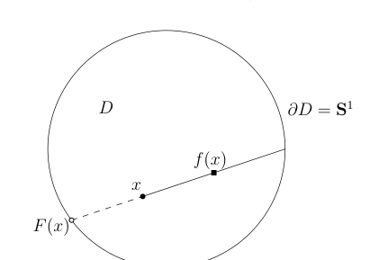

# 50：Brouwer 不动点定理与 Hilbert 空间

[返回讲义目录](../../math-analysis-lecture-notes.md) · [学期目录](../02-math-analysis-ii.md) · [校勘记录](../errata.md) · [上一篇：散度定理与 Green 公式](49-vector-calculus.md) · [下一篇：函数空间、连续算子与卷积逼近](51-convolution-approximation/51-01-p0602-0611.md)

<!-- source: PDF 595; printed: 595; transcription: first-pass; proofreading: applied -->

## 多元微积分的应用举例：二维的 Brouwer 不动点定理

我们回顾一下所谓的 Green 公式：

如果 $\Omega \subset \mathbb{R}^2$ 是有界光滑带边区域，那么对任意的 $\mathbb{R}^2$ 上的光滑（$C^1$）$P$ 和 $Q$，我们有
$$ \int_{\Omega} \left( \frac{\partial Q}{\partial x} - \frac{\partial P}{\partial y} \right) dxdy = \oint_{\partial \Omega} Pdx + Qdy. $$

我们现在要来证明 2 维情形的 Brouwer 不动点定理。我们用 $D$ 表示 $\mathbb{R}^2$ 上的单位圆盘：
$$ D = \{ (x, y) \in \mathbb{R}^2 \mid x^2 + y^2 \leqslant 1 \}. $$

它的边界是单位圆周：$\partial D = \mathbf{S}^1$。

**定理 327**（Brouwer）。假设 $f : D \to D$ 是连续映射，那么一定存在某个点 $x \in D$，使得 $f(x) = x$。

我们用反证法。如若不然，那么对任意的 $x \in D$，$f(x) \neq x$。考虑从 $f(x)$ 出发的射线，它经过 $x$ 之后，与 $\partial D$ 恰好有一个交点，我们把它记作 $F(x)$。这样，我们就定义了映射
$$ F : D \to \mathbf{S}^1 \subset \mathbb{R}^2, \quad x \mapsto F(x). $$

这显然是连续映射（请验证）并且 $F|_{\mathbf{S}^1} = \operatorname{Id}$。我们做一个额外的假设：$F : D \to \mathbf{S}^1$ 是 $C^\infty$ 映射（我们在几次课后会用函数逼近的技巧把连续的情况化归到这个情形）。另外，为了方便，我们用坐标来表示 $F$：
$$ F(x, y) = (u(x, y), v(x, y)) \in \mathbb{R}^2. $$

我们还用
$$ \gamma : [0, 2\pi] \to \mathbb{R}^2, \quad \vartheta \to (\cos \vartheta, \sin \vartheta) $$

来参数化 $\partial D$，其中，我们用 $\gamma'$ 表示其单位切向量 $(-\sin \vartheta, \cos \vartheta)$。

<!-- source: PDF 596; printed: 596; transcription: first-pass; proofreading: applied -->

证明的核心在于计算下面的积分（在下个学期学习了 de Rham 上同调理论之后，这个积分会变得很自然，目前大家把这个积分的计算看做是 Stokes 公式的应用和练习即可），我们用两种方法来做：
$$ I = \oint_{\partial D} (u\nabla v - v\nabla u) \cdot \gamma'. $$

用传统的第二型曲线积分的记法，我们还可以把它写成：
$$ I = \oint_{\partial D} (uv_x - vu_x)dx + (uv_y - vu_y)dy. $$

为了书写方便，我们用 $u_x$ 表示 $\frac{\partial u}{\partial x}$，诸如此类。首先，
$$ \begin{aligned} I &= \int_{0}^{2\pi} u\nabla_{\gamma'}v - v\nabla_{\gamma'}u \, d\vartheta \\ &= \int_{0}^{2\pi} x\nabla_{\gamma'}y - y\nabla_{\gamma'}x \, d\vartheta. \end{aligned} $$

这是沿着曲线切线方向的方向导数，所以，它只和函数在曲线上的取值相关。由于在 $\partial D$ 上面，我们有 $u = x$，$v = y$，所以，我们有
$$ \begin{aligned} I &= \oint_{\partial D} xdy - ydx \\ &= \int_{D} 2dxdy \\ &= 2\pi. \end{aligned} $$

另外，$F$ 的像落在 $\mathbf{S}^1$ 上，所以，我们有
$$ u^2 + v^2 = 1 \implies \begin{cases} u \frac{\partial u}{\partial x} + v \frac{\partial v}{\partial x} = 0, \\ u \frac{\partial u}{\partial y} + v \frac{\partial v}{\partial y} = 0. \end{cases} $$

由于 $(u, v) \neq (0, 0)$，所以上面线性方程系数的行列式为 0，即
$$ u_x v_y = u_y v_x. $$

从而，
$$ \begin{aligned} I &= \oint_{\partial D} (uv_x - vu_x)dx + (uv_y - vu_y)dy \\ &= \int_{D} (uv_y - vu_y)_x - (uv_x - vu_x)_y \, dxdy \\ &= 0, \end{aligned} $$

其中，我们用到了 $u_{xy} = u_{yx}$ 等。这是矛盾的，所以，这样的 $F$ 不存在，从而，Brouwer 不动点定理得到了证明。

<!-- source: PDF 597; printed: 597; transcription: first-pass; proofreading: applied -->

## 赋范空间与函数空间

为了学习 Fourier 级数，我们首先复习／学习几个基本的函数空间，我们下个学期也会把这几个空间上的分析作为重点。

### 赋范线性空间与内积空间

首先回忆两个抽象的空间的概念：

a) $X$ 为 $\mathbb{C}$-线性空间，如果它配备了某个范数
$$\|\cdot\| : X \to \mathbb{R}_{\geqslant 0},$$
（即对任意的 $x \in X$，$\|x\| = 0$ 当且仅当 $x = 0$；对任意的 $\lambda \in \mathbb{C}$，$\|\lambda x\| = |\lambda| \|x\|$；对任意的 $x, y \in X$，有 $\|x+y\| \leqslant \|x\| + \|y\|$。）

我们称 $(X, \|\cdot\|)$ 是**赋范线性空间**。此时，对任意的 $x, y \in X$，我们可以用 $d(x, y) = \|x-y\|$ 作为 $X$ 上的距离函数，从而使得 $X$ 称为距离空间。如果 $X$ 在这个距离下是完备的（即 Cauchy 列必收敛），我们就称 $(X, \|\cdot\|)$ 是**完备赋范线性空间**（也叫做 **Banach 空间**）。

b) $X$ 为 $\mathbb{C}$-线性空间，如果它拥有二次型
$$\langle \cdot, \cdot \rangle : X \times X \to \mathbb{C},$$
满足

1) 对任意的 $\mu, \nu \in \mathbb{C}$ 和 $x, y, z \in X$，我们有
$$\langle \mu x + \nu y, z \rangle = \mu \langle x, z \rangle + \nu \langle y, z \rangle.$$

2) 对任意的 $x, y \in X$，我们有
$$\langle x, y \rangle = \overline{\langle y, x \rangle}.$$

3) 对任意的 $x \in X$，
$$\langle x, x \rangle \geqslant 0$$
并且 $\langle x, x \rangle = 0$ 当且仅当 $x = 0$。

我们就称 $(X, \langle \cdot, \cdot \rangle)$ 是**内积空间**，其中二次型 $\langle \cdot, \cdot \rangle$ 被称作是内积。很容易验证，映射
$$\|\cdot\| : X \to \mathbb{R}_{\geqslant 0}, \quad x \mapsto \sqrt{\langle x, x \rangle}$$
是一个范数（由内积定义的范数），从而，内积空间一定是赋范线性空间。我们把完备的内积空间称作是 **Hilbert 空间**。

**注记**。我们注意到，在内积空间中，对任意的 $x, y \in X$，我们都有
$$|\langle x, y \rangle| \leqslant \|x\| \|y\|$$
最简单的证明就是注意到把内积限制到由 $x$ 和 $y$ 生成的有限维线性空间上也得到内积空间，从而可以用有限维的结论。

<!-- source: PDF 598; printed: 598; transcription: first-pass; proofreading: applied -->

### 常用函数空间

在 Lebesgue 积分的理论框架下，有三个最基本的函数空间：$L^1(X, \mathcal{A}, \mu)$，$L^2(X, \mathcal{A}, \mu)$ 和 $L^\infty(X, \mathcal{A}, \mu)$。我们现在引入它们的概念并证明它们的完备性。

首先，给定测度空间 $(X, \mathcal{A}, \mu)$，它上面的可积函数全体为 $\mathcal{L}^1(X, \mathcal{A}, \mu)$，这是一个 $\mathbb{C}$-线性空间（在 Fourier 级数的学习中，我们不得不研究在复数域中取值的函数）。我们把几乎处处为零的函数记作
$$N = \{ f \in \mathcal{L}^1(X, \mathcal{A}, \mu) \mid f \text{ 几乎处处为零} \}.$$
这是 $\mathcal{L}^1(X, \mathcal{A}, \mu)$ 的线性子空间。它的商空间我们定义为：
$$L^1(X, \mathcal{A}, \mu) = \mathcal{L}^1(X, \mathcal{A}, \mu) / N.$$
从记号上而言，我们通常还是把 $f \in L^1(X, \mathcal{A}, \mu)$ 看作是一个函数：实际上，它是函数的等价类 $[f] \subset \mathcal{L}^1(X, \mathcal{A}, \mu)$，$f \in [f]$ 是这里面的一个代表，也就是说如果 $g \in \mathcal{L}^1(X, \mathcal{A}, \mu)$ 并且与 $f$ 几乎处处相等，那么我们就说 $f = g$。我们已经证明过：
$$\|\cdot\|_{\mathcal{L}^1(X, \mathcal{A}, \mu)} : \mathcal{L}^1(X, \mathcal{A}, \mu) \to \mathbb{R}_{\geqslant 0}$$
是半范数；它在商空间 $L^1(X,\mathcal A,\mu)$ 上诱导范数，我们通常称此范数为 $L^1$-范数。

其次，我们定义内积空间 $L^2(X, \mathcal{A}, \mu)$。首先，我们定义
$$\mathcal{L}^2(X, \mathcal{A}, \mu) = \{ f : X \to \mathbb{C} \mid f \text{ 是可测度并且 } |f|^2 \text{ 是可积函数} \}.$$
很容易验证这是一个 $\mathbb{C}$-线性空间并且 $N$ 是其线性子空间，我们定义
$$L^2(X, \mathcal{A}, \mu) = \mathcal{L}^2(X, \mathcal{A}, \mu) / N.$$
我们在 $L^2(X, \mathcal{A}, \mu)$ 可以按照如下的方式定义内积，其中 $[f], [g] \in L^2(X, \mathcal{A}, \mu)$ 是函数的等价类，$f$ 和 $g$ 分别是这两个等价类中的代表元：
$$\langle [f], [g] \rangle_{L^2(X, \mathcal{A}, \mu)} = \langle f, g \rangle_{L^2} = \int_X f(x) \overline{g(x)} d\mu(x).$$
我们很容易看出这个定义是不依赖于等价类中的代表元的选取的并且上面的二次型是一个内积（逐条验证定义即可）。此时，$L^2(X, \mathcal{A}, \mu)$ 由该内积定义的范数为
$$\|[f]\|_{L^2(X, \mathcal{A}, \mu)} = \|f\|_{L^2} = \sqrt{\int_X |f|^2 d\mu}.$$
特别地，根据前面的注，我们有所谓的 **Cauchy-Schwarz 不等式**：
$$\left| \int_X f \overline{g} d\mu \right| \leqslant \|f\|_{L^2} \|g\|_{L^2}.$$

最后，我们定义赋范线性空间 $L^\infty(X, \mathcal{A}, \mu)$。首先，令
$$\mathcal{L}^\infty(X, \mathcal{A}, \mu) = \{ f : X \to \mathbb{C} \mid f\text{ 可测，且存在 } M \in \mathbb{R}_{\geqslant 0}\text{，使得 } |f(x)| \leqslant M \text{ 几乎处处成立} \}.$$

<!-- source: PDF 599; printed: 599; transcription: first-pass; proofreading: applied -->

很容易验证这是 $\mathbb{C}$-线性空间并且 $N$ 是其线性子空间，我们定义
$$L^\infty(X, \mathcal{A}, \mu) = \mathcal{L}^\infty(X, \mathcal{A}, \mu) / N.$$
我们在 $L^\infty(X, \mathcal{A}, \mu)$ 定义范数 $\|\cdot\|_{L^\infty}$，其中，$[f] \in L^\infty(X, \mathcal{A}, \mu)$ 是函数的等价类而 $f$ 是其代表元：
$$\|[f]\|_{L^\infty(X, \mathcal{A}, \mu)} = \|f\|_{L^\infty} = \inf_{\substack{M \in \mathbb{R}_{\geqslant 0}, \\ |f(x)| \leqslant M \text{ 几乎处处}}} M.$$

### 完备性的级数判据与里斯定理

为了证明上述空间都是完备的，我们需要一个技术性引理：

**引理 328**（完备性的级数判定）。假设 $(X, \|\cdot\|)$ 是赋范线性空间，那么，我们有

1) 如果 $(X, \|\cdot\|)$ 是完备的，那么绝对收敛的级数一定收敛，即给定级数 $\sum_{i=1}^\infty x_i$，其中 $x_i \in X$，如果
$$\sum_{i=1}^\infty \|x_i\| < \infty,$$
那么部分和 $\sum_{i \leqslant n} x_i$ 在 $X$ 中收敛（我们把它的极限记作 $\sum_{i=1}^\infty x_i$）。

2) 如果每个绝对收敛的级数均收敛，那么 $(X, \|\cdot\|)$ 是完备的。

**证明**：1) 是平凡的：如果令 $S_n = \sum_{i \leqslant n} x_i$，那么，对任意的 $n \geqslant m$，我们有
$$\|S_n - S_m\| \leqslant \sum_{k=m+1}^n \|x_k\|.$$
根据 $\sum_{i=1}^\infty \|x_i\|$ 收敛，我们知道对任意的 $\varepsilon > 0$，存在 $N \geqslant 1$，使得当 $n \geqslant m \geqslant N$ 时，我们有
$$\sum_{k=m+1}^n \|x_k\| < \varepsilon.$$
所以，$\{S_n\}_{n \geqslant 1}$ 是 $X$ 中的 Cauchy 列，从而收敛。

为证明 2)，我们取 Cauchy 列 $\{x_i\}_{i \geqslant 1} \subset X$。根据 Cauchy 列的定义，对每个 $p \in \mathbb{Z}_{\geqslant 1}$，可以选取严格递增的正整数 $N_p$（并令 $N_0=1$），使得当 $i, j \ge N_p$ 时，我们有
$$\|x_i - x_j\| \leqslant 2^{-p}.$$
从而，我们考虑级数 $\sum_{p=1}^\infty (x_{N_p} - x_{N_{p-1}})$，按照指标 $N_p$ 的选取方式，这是一个绝对收敛的级数，从而它收敛。另外，它所对应的部分和为
$$(x_{N_p} - x_{N_{p-1}}) + (x_{N_{p-1}} - x_{N_{p-2}}) + \cdots + (x_{N_1} - x_{N_0}) = x_{N_p} - x_{N_0},$$
这表明 $\{x_i\}_{i \geqslant 1}$ 的子列 $\{x_{N_i}\}_{i \geqslant 1}$ 收敛。我们知道如果 Cauchy 列的子列收敛，Cauchy 列本身就收敛，证毕。 $\square$

<!-- source: PDF 600; printed: 600; transcription: first-pass; proofreading: applied -->

我们先证明 $L^1$ 空间的完备性：

**定理 329**（Fischer-Riesz）。对任意的测度空间 $(X, \mathcal{A}, \mu)$，$L^1(X, \mathcal{A}, \mu)$ 是完备的赋范线性空间。

**证明**：根据上述引理，只须证明绝对收敛的级数 $\sum_{i=1}^\infty f_i$ 是收敛的，其中 $f_i \in L^1(X, \mathcal{A}, \mu)$。为此，我们首先定义函数（的等价类）
$$F : X \to [0,+\infty], \quad x \mapsto F(x) = \sum_{i=1}^\infty |f_i(x)|.$$
这显然是良好定义的函数（除去一个零测集）。根据 Beppo Levi 定理，我们有
$$\int_X F(x) d\mu = \sum_{i=1}^\infty \int_X |f_i(x)| d\mu = \sum_{i=1}^\infty \|f_i\|_{L^1} < \infty.$$
特别地，我们有 $\mu(F^{-1}(+\infty)) = 0$。对任意的 $x \notin F^{-1}(+\infty)$，从而对几乎处处的 $x \in X$，我们定义 $f(x) \in \mathbb{C}$：
$$f(x) = \lim_{N \to \infty} \sum_{i=1}^N f_i(x).$$
我们将运用 Lebesgue 控制收敛定理，其中我们把 $F(x)$ 作为控制函数。由于对几乎处处的 $x$，我们有 $\sum_{i=1}^N f_i(x) \to f(x)$。Lebesgue 控制收敛定理表明：
$$\lim_{N \to \infty} \left\| \sum_{i=1}^N f_i(x) - f(x) \right\|_{L^1} = \lim_{N\to\infty}\int_X \left| \sum_{i=1}^N f_i(x) - f(x) \right| d\mu = 0.$$
这说明，$\sum_{i=1}^N f_i(x)$ 在 $\|\cdot\|_{L^1}$ 所定义的距离下收敛到 $f(x)$，根据前一个引理，$L^1(X, \mathcal{A}, \mu)$ 是完备的。 $\square$

Fischer-Riesz 定理的证明还可以给出一个很有意义的推论：

**推论 330**。给定 $L^1(X, \mathcal{A}, \mu)$ 中的函数序列 $\{f_i\}_{i \geqslant 1}$，我们假设它们在 $L^1$ 范数下收敛到 $f$，即
$$f_i \xrightarrow{L^1(X, \mathcal{A}, \mu)} f, \quad i \to \infty.$$
那么，存在子函数序列 $\{f_{i_p}\}_{p \geqslant 1}$，使得对几乎处处的 $x \in X$，我们都有
$$\lim_{p \to \infty} f_{i_p}(x) = f(x)$$

<!-- source: PDF 601; printed: 601; transcription: first-pass; proofreading: applied -->

**证明**：通过选取子序列，我们不妨假设 $f_0 \equiv 0$ 并且对任意的 $n \geqslant 1$，我们都有
$$
\|f_n - f_{n+1}\|_{L^1} \leqslant 2^{-n-1}.
$$

所以，我们可以把 $f_n$ 写成：
$$
f_n = (f_1 - f_0) + (f_2 - f_1) + \cdots + (f_n - f_{n-1})
$$

这表明 $f_n$ 可视为是 $L^1(X, \mathcal{A}, \mu)$ 中某个绝对收敛的级数的部分和，前一证明的过程表明除一个零测集外，$f_n$ 逐点收敛到 $f$。 \hfill $\square$

[返回讲义目录](../../math-analysis-lecture-notes.md) · [学期目录](../02-math-analysis-ii.md) · [校勘记录](../errata.md) · [上一篇：散度定理与 Green 公式](49-vector-calculus.md) · [下一篇：函数空间、连续算子与卷积逼近](51-convolution-approximation/51-01-p0602-0611.md)
