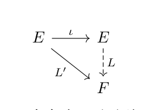

# 函数空间、连续算子与卷积逼近

[返回讲义目录](../../../math-analysis-lecture-notes.md) · [学期目录](../../02-math-analysis-ii.md) · [章节目录](../51-convolution-approximation.md) · [校勘记录](../../errata.md) · [上一篇：Brouwer 不动点定理与 Hilbert 空间](../50-hilbert-spaces.md) · [下一篇：51.1 作业:Stokes公式的应用](51-03-p0612-0617.md)

<!-- source: PDF 602; printed: 602; transcription: first-pass; proofreading: applied -->

## 51 偶数维球面上的切向量场，$L^2$ 与 $L^\infty$ 的完备性，连续线性算子，线性映射的延拓，卷积与函数逼近

### 多元微积分的应用举例：偶数维球面上的切向量场

考虑 $\mathbb{R}^n$ 中的单位球面
$$
S^{n-1} = \{(x_1, \cdots, x_n) \in \mathbb{R}^n \mid x_1^2 + \cdots + x_n^2 = 1\}.
$$

如果 $n-1 = 2k-1$ 是奇数，在点 $(x_1, x_2, \cdots, x_{2k-1}, x_{2k}) \in S^{n-1}$ 处，我们指定向量
$$
v(x_1, \cdots, x_{2k}) = (-x_2, x_1, \cdots, -x_{2k}, x_{2k-1}).
$$
这是 $S^{2k-1}$ 的一个单位切向量。当 $(x_1, x_2, \cdots, x_{2k-1}, x_{2k}) \in S^{n-1}$ 变动的时候，我们就得到了 $S^{2k-1}$ 上的一个处处非零的光滑向量场。我们现在证明：

**定理 331**. 在 $S^{2k}$ 上不存在处处非零的光滑向量场，其中 $k \geqslant 1$。

假设 $\Omega \subset \mathbb{R}^n$ 是一个有界开集并且 $V$ 是 $\Omega$ 上的一个有界的光滑向量场，我们假设 $dV$ 是有界的（把 $V$ 看成映射），并且存在 $M>0$，使 $V$ 在 $\Omega$ 上是 $M$-Lipschitz 映射。我们现在定义光滑映射
$$
\Phi_t : \Omega \to \mathbb{R}^n, \quad x \mapsto x + tV(x).
$$
它在 $x$ 处的微分为
$$
d\Phi(x) = \mathbf{Id} + tdV(x).
$$
所以，当 $t$ 足够小时，$d\Phi(x)$ 可逆，从而，$\Phi_t$ 是局部微分同胚（反函数定理）。另外，对任意的 $x, y \in \Omega$，我们有
$$
\begin{aligned}
|x - y| &= |\Phi_t(x) - \Phi_t(y) - t(V(x) - V(y))| \\
&\leqslant |\Phi_t(x) - \Phi_t(y)| + |t|\,|V(x) - V(y)| \\
&\leqslant |\Phi_t(x) - \Phi_t(y)| + |t|M|x - y|.
\end{aligned}
$$
其中，我们用了 $V$ 的 Lipschitz 性质，从而 $|V(x) - V(y)| \leqslant M|x - y|$。所以，当 $|t| < (2M)^{-1}$ 时，我们有
$$
|\Phi_t(x) - \Phi_t(y)| \geqslant \frac{1}{2}|x - y|.
$$
这表明 $\Phi_t$ 是单射，所以当 $t$ 足够小的时，映射
$$
\Phi_t : \Omega \to \Phi_t(\Omega), \quad x \mapsto x + tV(x).
$$

<!-- source: PDF 603; printed: 603; transcription: first-pass; proofreading: applied -->

是微分同胚。特别地，我们可以用换元积分公式计算 $\Phi_t(\Omega)$ 的体积：
$$
m(\Phi_t(\Omega)) = \int_\Omega \left| \det\left(\mathbf{I} + t\left(\frac{\partial V_i}{\partial x_j}\right)\right) \right| dx.
$$
将行列式展开，我们发现，这是关于 $t$ 的一个次数不超过 $n$ 的多项式。

我们现在用反证法证明这个定理：如若不然，我们假设 $X(x)$ 是 $S^{n-1}$ 上的一个处处非零的光滑向量场，其中 $n-1 = 2k$。通过考虑 $\frac{X(x)}{|X(x)|}$ 这个向量场，我们不妨假设 $X$ 在每个点处都是单位长度的。令
$$
\Omega = \left\{ (x_1, \cdots, x_n) \in \mathbb{R}^n \;\middle|\; \frac{1}{2} < x_1^2 + \cdots + x_n^2 < 2 \right\}.
$$

那么，
$$
\Omega = \bigcup_{\frac{1}{\sqrt2} < r < \sqrt2} S_r = \bigcup_{\frac{1}{\sqrt2} < r < \sqrt2} (r S^{n-1}).
$$

我们定义 $\Omega$ 上的向量场为
$$
V(x) = |x|X\left(\frac{x}{|x|}\right)
$$
对任意的 $r$，我们知道 $\Phi_t(S_r) \subset \sqrt{1 + t^2} S_r$，所以，当 $t$ 足够小的时候，$\Phi_t$ 将 $\Omega$ 映射成了
$$
\Phi_t(\Omega) = \left\{ (x_1, \cdots, x_n) \in \mathbb{R}^n \;\middle|\; \frac{1}{2}(1+t^2) < x_1^2 + \cdots + x_n^2 < 2(1+t^2) \right\}.
$$

那么，根据 Lebesgue 测度在伸缩变换下的性质，我们有
$$
m(\Phi_t(\Omega)) = (1+t^2)^{\frac{2k+1}{2}} m(\Omega)
$$
这不是 $t$ 的多项式，矛盾。

### 函数空间的完备性：继续

**定理 332**. 对任意的测度空间 $(X, \mathcal{A}, \mu)$，$L^2(X, \mathcal{A}, \mu)$ 是 Hilbert 空间。

**证明**：根据之前的引理，我们只需要证明绝对收敛的级数 $\sum_{i=1}^\infty f_i$ 在 $L^2(X, \mathcal{A}, \mu)$ 中收敛即可，其中 $f_i \in L^2(X, \mathcal{A}, \mu)$。仿照 Fischer-Riesz 定理，我们定义
$$
S_N(x) = \sum_{i=1}^N f_i(x), \quad |S|_N(x) = \sum_{i=1}^N |f_i(x)|,
$$
并令
$$
F(x) = (\lim_{N \to \infty} |S|_N)^2 = \left(\sum_{i=1}^\infty |f_i(x)|\right)^2.
$$

<!-- source: PDF 604; printed: 604; transcription: first-pass; proofreading: applied -->

根据 Fubini 定理和 Cauchy-Schwarz 不等式，我们有
$$
\begin{aligned}
\int_X |F| &= \int_X \sum_{i=1}^\infty \sum_{j=1}^\infty |f_i(x)||f_j(x)|d\mu(x) \\
&= \sum_{i=1}^\infty \sum_{j=1}^\infty \int_X |f_i(x)||f_j(x)|d\mu(x) \\
&\leqslant \sum_{i=1}^\infty \sum_{j=1}^\infty \|f_i\|_{L^2} \|f_j\|_{L^2} \\
&= \left( \sum_{i=1}^\infty \|f_i\|_{L^2} \right)^2 < \infty.
\end{aligned}
$$
所以，$F$ 是可积函数（显然可测）并且 $A = F^{-1}(+\infty)$ 是零测集。根据 $F$ 的定义，当 $x \notin A$ 时，$|S|_N(x)$ 收敛到 $\sqrt{F(x)}$，从而存在 $S(x)$，使得当 $x \notin A$ 时，我们有 $\lim_{N \to \infty} S_N(x) = S(x)$，即
$$
\sum_{i=1}^\infty f_i(x) = S(x), \quad x \notin A.
$$

我们现在选取 $4F(x)$ 作为控制函数：
$$
|S_N(x) - S(x)|^2 \leqslant 2|S_N(x)|^2 + 2|S(x)|^2 \leqslant 4F(x).
$$

由于 $\lim_{N \to \infty} |S_N(x) - S(x)|^2 = 0$（几乎处处），根据 Lebesgue 控制收敛定理，我们有
$$
\lim_{N \to \infty} \int_X |S_N(x) - S(x)|^2 d\mu(x) = 0.
$$
这就完成了证明。

**推论 333**. 给定 $L^2(X, \mathcal{A}, \mu)$ 中的函数序列 $\{f_i\}_{i \geqslant 1}$，我们假设它们在 $L^2$ 范数下收敛到 $f$，即
$$
f_i \xrightarrow{L^2(X, \mathcal{A}, \mu)} f, \quad i \to \infty.
$$
那么，存在子函数序列 $\{f_{i_p}\}_{p \geqslant 1}$，使得对几乎处处的 $x \in X$，我们都有
$$
\lim_{p \to \infty} f_{i_p}(x) = f(x)
$$

我们把推论的证明留成作业。

**定理 334**. 对任意的测度空间 $(X, \mathcal{A}, \mu)$，$L^\infty(X, \mathcal{A}, \mu)$ 是完备的。

**证明**：对于 $L^\infty(X, \mathcal{A}, \mu)$ 中的 Cauchy 列 $\{f_i\}_{i \geqslant 1}$，我们定义
$$
A_{ij} = \{x \in X \mid |f_i(x) - f_j(x)| > \|f_i - f_j\|_{L^\infty}\}.
$$

<!-- source: PDF 605; printed: 605; transcription: first-pass; proofreading: applied -->

按定义，这是一个零测集，所以 $A = \bigcup_{i, j=1}^\infty A_{ij}$ 是零测集。对于 $x \notin A$，$\{f_i(x)\}_{i=1,2,\cdots}$ 为 Cauchy 列：
$$
|f_i(x) - f_j(x)| \leqslant \|f_i - f_j\|_{L^\infty} \to 0.
$$
从而，存在 $f(x) \in \mathbb{C}$，使得 $\lim_{n \to \infty} f_n(x) = f(x)$，所以函数
$$
f : X \to \mathbb{C}
$$
几乎处处有定义。对任意的 $\varepsilon > 0$，存在正整数 $N$，使得当 $i, j \geqslant N$ 时，我们有
$$
\|f_i - f_j\|_{L^\infty} < \varepsilon.
$$
所以，对任意的 $x \notin A$，我们有
$$
|f_i(x) - f_j(x)| \leqslant \|f_i - f_j\|_{L^\infty} < \varepsilon.
$$
令 $j \to \infty$，所以对任意的 $i \geqslant N$，我们都有
$$
|f_i(x) - f(x)| \leqslant \varepsilon, \quad x \notin A.
$$
这表明 $\{f_i\}_{i \geqslant 1}$ 在 $L^\infty$ 范数下收敛到 $f$。

**注记**.（重要：在不同的意义下收敛）给定一个函数列 $\{f_i\}_{i \geqslant 1}$，在我们将谈论它收敛到某个函数 $f$ 时，一定要事先界定用的哪个范数。不同的范数可能给出不同的结论，比如说，函数列
$$
f_n(x) = \begin{cases} \frac{1}{n}, & 0 \leqslant x \leqslant \frac{1}{n}, \\ 0, & \frac{1}{n} < x \leqslant 1 \end{cases}
$$
它满足 $\|f_n\|_{L^2([0,1])}=n^{-3/2}$、$\|f_n\|_{L^1([0,1])}=n^{-2}$，所以在这两个空间中都收敛到 $0$；该例没有表现出两种收敛性的差异。

另外，如果 $X$ 是有限维赋范线性空间，$X$ 上任意范数定义出的收敛性都是等价的。

我们将在作业中证明上面的论断。

最后，我们讨论所谓的（赋范线性空间之间）连续线性映射。

**引理 335**. 给定赋范线性空间 $(E, \|\cdot\|_E)$, $(F, \|\cdot\|_F)$ 和它们之间的 ($\mathbb{C}$-)线性映射 $L : E \to F$。那么，如下三个论断是等价的：

1) $L$ 在 $0 \in E$ 处连续；

2) $L$ 是连续的；

3) $L$ 是有界，即存在 $C > 0$，对每个 $e \in E$，我们都有
$$
\|L(e)\|_F \leqslant C\|e\|_E.
$$

<!-- source: PDF 606; printed: 606; transcription: first-pass; proofreading: applied -->

**证明：** 2) $\Rightarrow$ 1) 是显然；为了说明 3) $\Rightarrow$ 2)，对任意的 $e \in E$，以及 $x \in E$，我们有
$$
\begin{aligned}
d_F (L(x), L(e)) &= \|L(x) - L(e)\|_F = \|L(x - e)\|_F \\
&\leqslant C\|x - e\|_E = C d_E(x, e).
\end{aligned}
$$
所以，当 $x \to e$ 时，我们有 $L(x) \to L(e)$，从而，2) 成立。

现在证明 1) $\Rightarrow$ 3)。由连续性，对于 $\varepsilon = 1$，存在 $\delta > 0$，当 $\|e\|_E \leqslant \delta$ 时，我们有 $\|L(e)\|_F < 1$。
那么，对任意的 $e\in E\setminus\{0\}$，我们有
$$
\left\| L \left( \frac{\delta e}{\|e\|_E} \right) \right\|_F \leqslant 1.
$$
我们选取 $C = \delta^{-1}$ 即可。\quad $\square$

**注记.** 这个命题说的是连续线性映射一定是有界线性映射，我们之后对这两个名词不加区分。

**推论 336** (线性映射的延拓). 给定赋范线性空间 $(E, \|\cdot\|_E)$, $(E', \|\cdot\|_{E'})$ 和 $(F, \|\cdot\|_F)$，其中 $E' \subset E$ 为线性子空间且其范数为诱导范数，即对任意的 $e' \in E'$，我们有
$$
\|e'\|_{E'} = \|e'\|_E.
$$
假设 $E'$ 在 $E$ 中是稠密的，并且 $F$ 是完备的。

图中左上角应标作 $E'$，且 $i:E'\hookrightarrow E$ 为包含映射。若存在连续线性映射 $L' : E' \to F$，那么存在唯一的连续线性映射 $L : E \to F$，使得 $\left. L \right|_{E'} = L'$。

**证明：** 唯一性：对任意的 $e \in E$，根据稠密性，我们可以选取 $\{e'_i\}_{i \geqslant 1} \subset E'$，使得
$$
\lim_{i \to \infty} e'_i = e.
$$
所以，
$$
L(e) = \lim_{i \to \infty} L(e'_i) = \lim_{i \to \infty} L'(e'_i)
$$
是被唯一决定的。反之，对任意的 $e$，我们任取 $\{e'_i\}_{i \geqslant 1} \subset E'$，使得 $\lim_{i \to \infty} e'_i = e$，由于 $L'$ 有界，$\{L'(e'_i)\}$ 是 Cauchy 列；$F$ 的完备性保证其极限存在。因此定义
$$
L(e) := \lim_{i \to \infty} L'(e'_i)
$$
为了说明这是良好定义的，假设 $\{e''_i\}_{i \geqslant 1} \subset E'$，使得 $\lim_{i \to \infty} e''_i = e$，我们只要说明
$$
\lim_{i \to \infty} L'(e'_i) = \lim_{i \to \infty} L'(e''_i)
$$
即可。这因为
$$
\|L'(e'_i) - L'(e''_i)\|_F = \|L'(e'_i - e''_i)\|_F \leqslant C \|e'_i - e''_i\|_E.
$$
所以，$\lim_{i \to \infty} \|L'(e'_i) - L'(e''_i)\|_F = 0$，从而，$L$ 是良好定义的。上面的计算还表明
$$
\|L(e)\|_F = \lim_{i \to \infty} \|L'(e'_i)\|_F \leqslant \lim_{i \to \infty} C \|e'_i\|_E = C \|e\|_E.
$$
这说明 $L$ 是连续线性映射。\quad $\square$

<!-- source: PDF 607; printed: 607; transcription: first-pass; proofreading: applied -->

**注记.** 这个不起眼的定理是贯穿分析学始终的想法: 研究一个连续函数我们只需要搞清楚它在有理数(或者其他稠密子集)上的取值即可。从此往后, 为了构造赋范线性空间之间的连续线性映射, 我们只需要在稠密的子空间上面构造即可。我们会证明, 很多函数空间都包含光滑函数作为子空间, 所以, 为了定义好的连续线性算子, 我们只要对光滑函数进行构造即可。

## 函数的逼近

**定理 337.** 给定测度空间 $(X, \mathcal{A}, \mu)$, 我们仍然用 $\mathcal{E}(X)$ 表示简单函数所构成的线性空间 (这是阶梯函数的商掉 $\mathcal{N}$ 的商空间)。那么, $\mathcal{E}(X)$ 是 $L^p(X, \mathcal{A}, \mu)$ 的稠密子空间, 其中 $p=1$ 或者 $2$。

**注记.** 对于 $p=\infty$ 也有类似的结果, 然而, 我们要指出, 此时它依赖于我们对于阶梯函数的定义, 即是否容许测度为 $\infty$ 的集合的示性函数作为简单函数。这些都是概念上的腾挪, 没有太多的意思, 所以我们忽略掉这个情况。

**证明:** 首先, 对 $L^1(X, \mathcal{A}, \mu)$ 来证明这个结论。任意选取 $f \in L^1(X, \mathcal{A}, \mu)$, 我们分情况讨论:

1) 如果 $f$ 是正函数, 那么存在上升的简单函数列 $\{f_i\}_{i \geqslant 1}$, 它逐点地收敛到 $f$, 从而
$$
\|f_i - f\|_{L^1} = \int_X f(x) - f_i(x) d\mu \to 0.
$$

2) 如果 $f$ 是实值函数, 我们将它写成正函数的差:
$$
f = f_+ - f_-.
$$
我们可以选取简单函数序列 $\{f_{i,+}\}_{i \geqslant 1}$ 和 $\{f_{i,-}\}_{i \geqslant 1}$, 使得
$$
\lim_{i \to \infty} \|f_{i,\pm} - f_{\pm}\|_{L^1} = 0.
$$
从而,
$$
\lim_{i \to \infty} \|(f_{i,+} - f_{i,-}) - f\|_{L^1} \leqslant \lim_{i \to \infty} \|f_{i,+} - f_+\|_{L^1} + \lim_{i \to \infty} \|f_{i,-} - f_-\|_{L^1} = 0.
$$
这就给出了 $f$ 的逼近。

3) 如果 $f$ 是复值函数, 我们可以类似地将它写成实部和虚部来逼近。

其次, 我们对 $L^2(X, \mathcal{A}, \mu)$ 来证明这个结论。我们仍然先处理 $f \in L^2(X, \mathcal{A}, \mu)$ 是正函数的情形, 此时, 我们知道 $f^2$ 是可积函数, 所以我们选取上升的简单函数列 $\{F_i\}_{i \geqslant 1}$, 它逐点地收敛到 $f^2$, 我们令 $f_i = \sqrt{F_i}$。我们考虑函数序列 $\{|f_i - f|^2\}_{i \geqslant 1}$, 很明显, 这个序列逐点地收敛到 $0$。我们可以用 $4|f|^2$ 作为控制函数 (因为 $f_i(x) \leqslant f(x)$):
$$
|f_i(x) - f(x)|^2 \leqslant 4|f|^2.
$$

<!-- source: PDF 608; printed: 608; transcription: first-pass; proofreading: applied -->

根据 Lebesgue 控制收敛定理, 我们有
$$
\int_X |f_i(x) - f(x)|^2 d\mu \to 0.
$$
即
$$
\lim_{i \to \infty} \|f_i - f\|_{L^2} = 0.
$$
这就给出了这种情形的证明。如果 $f$ 是实值函数或者复值函数, 我们把它拆成正函数的和然后利用线性即可。 $\square$

根据积分的定义, 用简单函数来逼近 $L^p$ 中的函数算是理所当然的事情, 我们现在要用光滑函数来逼近 $L^p(\mathbb{R}^n)$ 中的函数。为此, 我们要引入所谓的卷积的概念。之后在不加说明的情况下, 我们都用 Lebesgue 测度。

任意给定 $f, g \in L^1(\mathbb{R}^n)$, 根据 Fubini 定理, 我们有
$$
\int_{\mathbb{R}^n \times \mathbb{R}^n} |f(x-y)||g(y)| dxdy = \left( \int_{\mathbb{R}^n} |f| dx \right) \cdot \left( \int_{\mathbb{R}^n} |g| dx \right) = \|f\|_{L^1} \|g\|_{L^1}.
$$
这表明函数
$$
(x, y) \mapsto |f(x-y)||g(y)|
$$
是 $\mathbb{R}^n \times \mathbb{R}^n$ 上的可积函数。特别地, 利用 Fubini 定理 (正函数版本) 的结论, 对几乎处处的 $x \in \mathbb{R}^n$, 关于 $y \in \mathbb{R}^n$ 的函数
$$
y \mapsto f(x-y)g(y)
$$
是可积的, 这里可积是对 $dy$ 而言的, 我们将 $x$ 视作是固定的。所以, 对几乎处处的 $x \in \mathbb{R}^n$, 函数
$$
f * g : \mathbb{R}^n \to \mathbb{C}, \quad x \mapsto (f * g)(x) = \int_{\mathbb{R}^n} f(x-y)g(y)dy,
$$
是良好定义的并且是 Lebesgue 可积的 (对测度 $dx$), 我们称 $f * g$ 是 $f$ 和 $g$ 的**卷积**。

**注记.** 还有一种观点来看卷积: 在每个点处用 $g$ 做为权函数, 对 $f$ 进行平均。比如说 $g(x) = \frac{1}{|B_1|} \mathbf{1}_{B_1}$, 这是单位球的示性函数并乘了正确的因子, 那么
$$
f * g(x) = \frac{1}{|B_1|} \int_{B_1} f(x-y)dy.
$$
这就是 $f$ 在每个点 $x$ 处以此点为中心以 $1$ 为半径的球内做平均。

另外, Fubini 定理表明
$$
\int_{\mathbb{R}^n} |f * g| \leqslant \left( \int_{\mathbb{R}^n} |f| dx \right) \left( \int_{\mathbb{R}^n} |g| dy \right), \Rightarrow \|f * g\|_{L^1} \leqslant \|f\|_{L^1} \|g\|_{L^1}.
$$
这说明
$$
L^1(\mathbb{R}^n) \times L^1(\mathbb{R}^n) \xrightarrow{*} L^1(\mathbb{R}^n).
$$

<!-- source: PDF 609; printed: 609; transcription: first-pass; proofreading: applied -->

这给出了 $L^1(\mathbb{R}^n)$ 上面一个新的乘法结构。这个乘法结构用到了 $\mathbb{R}^n$ 上的群结构。我们将在作业中证明, $L^1(\mathbb{R}^n)$ 上卷积没有单位元, 也就是说不存在某个函数 $e \in L^1(\mathbb{R}^n)$, 使得对任意的 $f \in L^1(\mathbb{R}^n)$, 我们都有 $e * f = f$。我们将在作业中证明这个结论。我们在下个学期课程的开始能够更好的理解 $L^1(\mathbb{R}^n)$ 上卷积没有单位元的原因 (它的单位元生活在更大的空间里)。

我们现在证明, 卷积满足交换律和结合律:

**引理 338.** 假设 $f, g, h \in L^1(\mathbb{R}^n)$, 那么, 我们有

1) *乘法交换律*: 对于几乎处处的 $x \in \mathbb{R}^n$, 都有
$$
(f * g)(x) = (g * f)(x).
$$
(从而这两个函数在 $L^1(\mathbb{R}^n)$ 中对应着同一个函数)

2) *乘法结合律*: 对于几乎处处的 $x \in \mathbb{R}^n$, 都有
$$
((f * g) * h)(x) = (f * (g * h))(x).
$$

**证明:** 先证明交换律, 根据换元积分公式, 我们有
$$
\begin{aligned}
(f * g)(x) &= \int_{\mathbb{R}^n} f(x-y)g(y)dy \\
&= \int_{\mathbb{R}^n} f(z)g(x-z)dz \\
&= (g * f)(x).
\end{aligned}
$$
其中, 我们令 $z = x - y$。现在证明结合律, 根据 Fubini 定理 (很明显, 取绝对值之后所出现的函数仍然可积), 我们有
$$
\begin{aligned}
((f * g) * h)(x) &= \int_{\mathbb{R}^n} \left( \int_{\mathbb{R}^n} f((x-z)-y)g(y)dy \right) h(z)dz \\
&= \int_{\mathbb{R}^n \times \mathbb{R}^n} f(x-z-y)g(y)h(z)dydz \\
&= \int_{\mathbb{R}^n \times \mathbb{R}^n} f(x-t)g(y)h(t-y)dydt.
\end{aligned}
$$
其中, 我们做了坐标替换 $t = y + z$。所以, 再次利用 Fubini 定理, 我们得到
$$
\begin{aligned}
((f * g) * h)(x) &= \int_{\mathbb{R}^n} f(x-t) \left( \int_{\mathbb{R}^n} g(y)h(t-y)dy \right) dt \\
&= f * (g * h)(x).
\end{aligned}
$$
这就完成了证明。 $\square$

另外, 对于其它的 $L^p$ 空间, 我们有

<!-- source: PDF 610; printed: 610; transcription: first-pass; proofreading: applied -->

**引理 339.** 对于 $p = 2$ 或 $\infty$, 我们有
$$
L^1(\mathbb{R}^n) \times L^p(\mathbb{R}^n) \xrightarrow{*} L^p(\mathbb{R}^n),
$$
即若 $f \in L^1(\mathbb{R}^n)$, $g \in L^p(\mathbb{R}^n)$, 那么
$$
(f * g)(x) = \int_{\mathbb{R}^n} f(x-y)g(y)dy
$$
在 $L^p(\mathbb{R}^n)$ 中是良好定义的 (几乎处处)。特别地, 我们有
$$
\|f * g\|_{L^p} \leqslant \|f\|_{L^1} \|g\|_{L^p}.
$$

**证明:** 对于 $g \in L^\infty(\mathbb{R}^n)$, 我们有
$$
\begin{aligned}
|(f * g)(x)| &= \left| \int_{\mathbb{R}^n} f(x-y)g(y)dy \right| \\
&\leqslant \int_{\mathbb{R}^n} |g(x-y)||f(y)|dy \\
&\leqslant \|f\|_{L^\infty} \int_{\mathbb{R}^n} |g(x-y)|dy \\
&= \|f\|_{L^1} \|g\|_{L^\infty}.
\end{aligned}
$$
所以命题成立。

对于 $g \in L^2(\mathbb{R}^n)$, 利用卷积交换律，我们考虑非负函数
$$
F : \mathbb{R}^n \to [0,+\infty], \quad x \mapsto \int_{\mathbb{R}^n} |g(x-y)||f(y)|dy.
$$
根据 Fubini 定理, 我们有
$$
\begin{aligned}
\int_{\mathbb{R}^n} |F(x)|^2 &= \int_{\mathbb{R}^n} \left( \int_{\mathbb{R}^n} |g(x-y)||f(y)|dy \int_{\mathbb{R}^n} |g(x-z)||f(z)|dz \right) dx \\
&= \int_{\mathbb{R}^{3n}} |g(x-y)||f(y)||g(x-z)||f(z)|dxdydz \\
&= \int_{\mathbb{R}^{2n}} \left( \int_{\mathbb{R}^n} |g(x-y)||g(x-z)|dx \right) |f(y)||f(z)|dydz \\
&\leqslant \int_{\mathbb{R}^{2n}} \left( \int_{\mathbb{R}^n} |g(x-y)|^2dx \right)^{\frac{1}{2}} \left( \int_{\mathbb{R}^n} |g(x-z)|^2dx \right)^{\frac{1}{2}} |f(y)||f(z)|dydz \\
&= \|g\|_{L^2}^2 \int_{\mathbb{R}^{2n}} |f(y)||f(z)|dydz \\
&= \|g\|_{L^2}^2 \int_{\mathbb{R}^n} |f(y)|dy \int_{\mathbb{R}^n} |f(z)|dz.
\end{aligned}
$$
从而,
$$
\int_{\mathbb{R}^n} |F(x)|^2 \leqslant \|g\|_{L^2}^2 \|f\|_{L^1}^2.
$$

<!-- source: PDF 611; printed: 611; transcription: first-pass; proofreading: applied -->

这表明, $|F(x)|^2$ 是 $L^1$ 函数, 从而几乎处处有定义, 所以, 函数
$$x \mapsto f * g(x) = \int_{\mathbb{R}^n} f(x - y)g(y)dy$$
也几乎处处有定义, 上面的不等式自然表明
$$\|f * g\|_{L^2}^2 \leqslant \|f\|_{L^1}^2 \|g\|_{L^2}^2.$$
开方之后就证明了命题。 $\square$

我们需要说一下光滑的这个情形是每个点都有定义的。
利用 Lebesgue 控制收敛定理, 我们可以说明与光滑函数做卷积可以提升函数的正则性:

**引理 340**. 我们用 $\mathcal{D}(\mathbb{R}^n) = C_0^\infty(\mathbb{R}^n)$ 表示所有 $\mathbb{R}^n$ 上的光滑并且支集是紧集的函数。

如果 $\varphi \in C_0^\infty(\mathbb{R}^n)$, $g \in L^p(\mathbb{R}^n)$, 其中, $p = 1, 2$ 或者 $\infty$, 那么 $\varphi * g \in L^p(\mathbb{R}^n) \cap C^\infty(\mathbb{R}^n)$。

**证明**: 给定 $g \in L^p(\mathbb{R}^n)$, 只需要证明, 对任意的 $\varphi \in C_0^\infty(\mathbb{R}^n)$, $\varphi * g \in C^1(\mathbb{R}^n)$ 并且对任意的 $i \leqslant n$, 我们有
$$\frac{\partial(\varphi * g)}{\partial x_i} = \int_{\mathbb{R}^n} \frac{\partial \varphi}{\partial x_i}(x - y)g(y)dy$$
即可: 因为我们可以继续用 $\frac{\partial \varphi}{\partial x_i}$ 代替 $\varphi$ 继续求导数, 从而对任意的多重指标 $\alpha$, 我们有
$$\partial^\alpha(\varphi * g) = (\partial^\alpha \varphi) * g.$$

我们只对 $p = 1$ 的情形进行证明, 其它情况留作作业。由于
$$\begin{aligned}
\left| \frac{\partial}{\partial x_i} (\varphi(x - y)g(y)) \right| &= \left| \frac{\partial \varphi}{\partial x_i}(x - y)g(y) \right| \\
&\leqslant M|g(y)|,
\end{aligned}$$
其中, 由于 $\frac{\partial \varphi}{\partial x_i}$ 也是有紧支集的光滑函数, 所以存在 $M$, 对任意的 $x \in \mathbb{R}^n$, 我们都有 $\left| \frac{\partial \varphi}{\partial x_i} \right| \leqslant M$。
此时, 我们可以用 Lebesgue 控制收敛定理的第二个推论（对含参数积分的求导公式）来直接推出上面的结论。 $\square$

**注记**. 在 $\varphi \in C_0^\infty(\mathbb{R}^n)$ 这种情形下, 我们知道存在 $A$, 使得对任意的 $x \in \mathbb{R}^n$, $|\varphi(x)| \leqslant A$。所以,
$$\varphi * g(x) = \int_{\mathbb{R}^n} \varphi(x - y)g(y)dy$$
在任意一个点 $x$ 处都有定义。令 $K=\operatorname{supp}\varphi$，则 $|\varphi(x-y)g(y)|\le A\mathbf1_{x-K}(y)|g(y)|$；$x-K$ 是有限测度的紧集，而 $g\in L^p$（$p=1,2,\infty$）均保证右侧可积。因此不需要借助 Fubini 定理的几乎处处结论来说明 $\varphi*g(x)$ 的存在性。

[返回讲义目录](../../../math-analysis-lecture-notes.md) · [学期目录](../../02-math-analysis-ii.md) · [章节目录](../51-convolution-approximation.md) · [校勘记录](../../errata.md) · [上一篇：Brouwer 不动点定理与 Hilbert 空间](../50-hilbert-spaces.md) · [下一篇：51.1 作业:Stokes公式的应用](51-03-p0612-0617.md)
