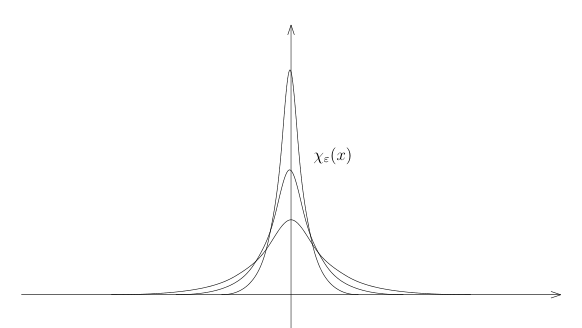
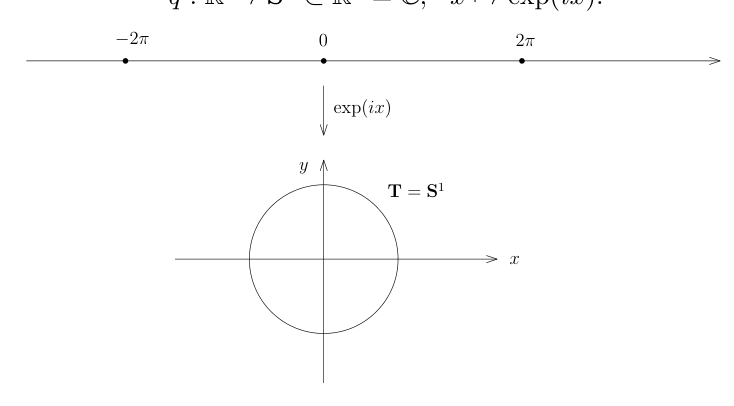
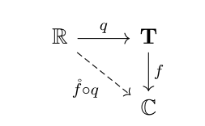

# 52：Hilbert 基与 Fourier 级数

[返回讲义目录](../../math-analysis-lecture-notes.md) · [学期目录](../02-math-analysis-ii.md) · [校勘记录](../errata.md) · [上一篇：51.2：习题课：Riemann积分的定义2](51-convolution-approximation/51-05-p0618-0622.md) · [下一篇：Fourier 级数的 L2 理论](53-fourier-l2/53-01-p0632-0639.md)

<!-- source: PDF 623; printed: 623; transcription: first-pass; proofreading: applied -->

## 光滑函数的积分范数逼近

我们先证明一个经常用到的简单事实：

**引理 341**。假设 $(X, \mathcal{A}, \mu)$ 是有限测度空间，即 $\mu(X) < \infty$，那么，我们有
$$L^2(X, \mathcal{A}, \mu) \subset L^1(X, \mathcal{A}, \mu).$$

**证明：** 这是 Cauchy-Schwarz 定理的标准应用：对任意的 $f \in L^2(X, \mathcal{A}, \mu)$，我们有
$$
\begin{aligned}
\int_X |f|\,d\mu &= \int_X |f| \cdot 1\,d\mu \\
&\leqslant \|f\|_{L^2} \|1\|_{L^2} \\
&= \sqrt{\mu(X)} \|f\|_{L^2}.
\end{aligned}
$$

所以，$f \in L^1(X, \mathcal{A}, \mu)$。 $\quad \square$

**光滑逼近：接上次**

为了证明光滑逼近定理，我们选取我们之前构造的非负函数 $\chi(x) \in C_0^\infty(\mathbb{R}^n)$，其中 $\chi$ 在 $0$ 点附近恒为 $1$。我们不妨假设它的积分为 $1$（通过考虑 $\chi(ax)$ 并选择合适的 $a > 0$），即
$$\int_{\mathbb{R}^n} \chi(x) dx = 1.$$

令
$$\chi_\varepsilon(x) = \frac{1}{\varepsilon^n} \chi\left(\frac{x}{\varepsilon}\right)$$

那么，
$$\int_{\mathbb{R}^n} \chi_\varepsilon(x) dx = 1.$$

当 $\varepsilon$ 变小的时候，函数的支集越来越小，函数本身越来越高，请参考上图。

<!-- source: PDF 624; printed: 624; transcription: first-pass; proofreading: applied -->

**引理 342**。对任意的 $f \in L^1(\mathbb{R}^n)$，当 $\varepsilon \to 0$，我们有
$$\chi_\varepsilon * f \xrightarrow{L^1} f,$$
即
$$\lim_{\varepsilon \to 0} \|\chi_\varepsilon * f - f\|_{L^1(\mathbb{R}^n)} = 0.$$
特别地，$C^\infty(\mathbb{R}^n) \cap L^1(\mathbb{R}^n)$ 是 $L^1(\mathbb{R}^n)$ 的稠密子空间。

**证明：** 我们之前证明了 $\mathcal{E}(\mathbb{R}^n) \subset L^1(\mathbb{R}^n)$ 是稠密的，我们现在说明，只要对于任意的简单函数 $\varphi \in \mathcal{E}(\mathbb{R}^n)$ 来证明命题就足够了：对任意的 $\delta > 0$，我们选取简单函数 $\varphi$，使得
$$\|\varphi - f\|_{L^1} < \delta.$$

假设我们有 $\lim_{\varepsilon \to 0} \|\chi_\varepsilon * \varphi - \varphi\|_{L^1(\mathbb{R}^n)} = 0$。那么，存在某个 $\varepsilon_0 > 0$，当 $\varepsilon < \varepsilon_0$ 时，我们有 $\|\chi_\varepsilon * \varphi - \varphi\|_{L^1} < \delta$。所以，
$$
\begin{aligned}
\|\chi_\varepsilon * f - f\|_{L^1(\mathbb{R}^n)} &\leqslant \|\chi_\varepsilon * (f - \varphi)\|_{L^1(\mathbb{R}^n)} + \|\chi_\varepsilon * \varphi - \varphi\|_{L^1(\mathbb{R}^n)} + \|f - \varphi\|_{L^1(\mathbb{R}^n)} \\
&\leqslant \|\chi_\varepsilon\|_{L^1} \|f - \varphi\|_{L^1(\mathbb{R}^n)} + \|\chi_\varepsilon * \varphi - \varphi\|_{L^1(\mathbb{R}^n)} + \|f - \varphi\|_{L^1(\mathbb{R}^n)} \\
&< 3\delta.
\end{aligned}
$$
这表明 $\lim_{\varepsilon \to 0} \|\chi_\varepsilon * f - f\|_{L^1(\mathbb{R}^n)} = 0$。

我们现在对简单函数证明这个引理。根据线性，只要对 $f = \mathbf{1}_A$ 这样的示性函数证明即可，其中 $A$ 是 Borel 集并且 $m(A) < \infty$（因为这个函数要落在 $L^1$ 中）。另外，由于在 $L^1$ 中，我们有
$$\mathbf{1}_{A \cap B_n} \xrightarrow{L^1} \mathbf{1}_A,$$
所以我们可以假设 $A$ 是有界的 Borel 集合。进一步，根据 Borel 测度的正则性定理[^p0624-15]，我们可以假设 $A = K$ 为紧集（因为我们可以用闭集从内部逼近 $A$，而 $A$ 有界）。

我们现在构造一个光滑函数 $h$，使得 $\|h - \mathbf{1}_K\|_{L^1} < \varepsilon$。为此，我们要再次利用 Stokes 公式第一个证明中的单位分解的技巧：对任意的 $N \geqslant 1$，我们有一族有紧支集的非负的光滑函数 $\{\chi_{\mathbf{k}}(x)\}_{\mathbf{k} \in \Gamma_N}$，其中 $\Gamma_N = 2^{-(N+1)}\mathbb{Z}^n$，使得对每个 $\mathbf{k} \in \Gamma_N$，$\operatorname{supp}(\chi_{\mathbf{k}})$ 落在以 $\mathbf{k}$ 为中心边长为 $2^{-N+1}$ 的正方体中并且：
$$1 = \sum_{\mathbf{k} \in \Gamma_N} \chi_{\mathbf{k}}.$$

<!-- source: PDF 625; printed: 625; transcription: first-pass; proofreading: applied -->

这里，$N$ 是待定的。我们令
$$h(x) = \sum_{\operatorname{supp}(\chi_{\mathbf{k}}) \cap K \neq \emptyset} \chi_{\mathbf{k}}(x)$$
这是个光滑函数。很明显，$h$ 在 $K$ 上恒为 $1$（关键点）。另外，如果 $d(x, K) > 2\sqrt n\cdot 2^{-N}$，那么 $h(x) = 0$。
从而，
$$\int_{\mathbb{R}^n} |h - \mathbf{1}_K| \leqslant m(\{x \notin K \mid d(x, K) \leqslant 2\sqrt n\cdot 2^{-N}\}).$$

由于
$$\bigcap_{N \geqslant 1} \{x \notin K \mid d(x, K) \leqslant 2\sqrt n\cdot 2^{-N}\} = \emptyset,$$
从而，
$$\lim_{N \to \infty} m(\{x \notin K \mid d(x, K) \leqslant 2\sqrt n\cdot 2^{-N}\}) = 0.$$
所以，对充分大的 $N$，我们就有
$$\|h - \mathbf{1}_K\|_{L^1} < \varepsilon.$$
还需验证卷积逼近：对上述 $h\in C_0^\infty$，一致连续性及卷积支集落在固定紧集保证 $\|\chi_\varepsilon*h-h\|_{L^1}\to0$。由卷积范数估计及三角不等式，$\limsup_{\varepsilon\to0}\|\chi_\varepsilon*\mathbf1_K-\mathbf1_K\|_{L^1}\le2\|h-\mathbf1_K\|_{L^1}$。右侧可任意小，故得到示性函数的卷积逼近，再由前面的线性与稠密性论证得到命题。 $\quad \square$

**推论 343**。$C_0^\infty(\mathbb{R}^n) \subset L^1(\mathbb{R}^n)$ 是稠密子空间。

**证明：** 给定函数 $f \in L^1(\mathbb{R}^n)$。对任意的 $\delta > 0$，存在 $R > 0$，使得
$$\|f - f \cdot \mathbf{1}_{|x| \leqslant R}\|_{L^1} \leqslant \frac{1}{2} \delta.$$

实际上，我们有
$$\|f - f \cdot \mathbf{1}_{|x| \leqslant R}\|_{L^1} = \int_{|x| \geqslant R} |f(x)| dx.$$
根据 Lebesgue 控制收敛定理（用 $|f|$ 作为控制函数），当 $R \to +\infty$ 时，上述趋于 $0$。根据刚刚证明的引理，可以选取 $\varepsilon > 0$，使得
$$\|\chi_\varepsilon * (f \cdot \mathbf{1}_{|x| \leqslant R}) - f \cdot \mathbf{1}_{|x| \leqslant R}\|_{L^1} \leqslant \frac{1}{2} \delta.$$

所以，
$$\|\chi_\varepsilon * (f \cdot \mathbf{1}_{|x| \leqslant R}) - f\|_{L^1} \leqslant \delta.$$

最终，我们观察到 $\chi_\varepsilon * (f \cdot \mathbf{1}_{|x| \leqslant R})$ 的支集是紧的，这是因为 $f \cdot \mathbf{1}_{|x| \leqslant R}$ 的支集是紧的，而卷积可以看成局部上用 $\chi_\varepsilon$ 来做平均。命题得证。 $\quad \square$

**注记**。我们还可以证明 $C_0^\infty(\mathbb{R}^n) \subset L^2(\mathbb{R}^n)$ 是稠密的；$C^\infty(\mathbb{R}^n) \cap L^\infty(\mathbb{R}^n)$ 是 $C(\mathbb{R}^n) \cap L^\infty(\mathbb{R}^n)$ 的稠密子空间。然而，$C(\mathbb{R}^n)\cap L^\infty(\mathbb{R}^n)$ 在 $L^\infty(\mathbb{R}^n)$ 中不稠密。我们将在作业中完成它们的证明。

由此可见，逼近的意义下，光滑函数可以用来描述这些空间，所以我们很多理论都致力于光滑函数的研究。

<!-- source: PDF 626; printed: 626; transcription: first-pass; proofreading: applied -->

## Hilbert 空间的基

**命题 344**。假设 $(H, \langle \cdot, \cdot \rangle)$ 是 Hilbert 空间（完备的内积空间）。如果 $\{x_k\}_{k \geqslant 1} \subset H$ 是一族两两正交的向量，即对任意的 $i, j \geqslant 1, i \neq j$，都有 $\langle x_i, x_j \rangle = 0$，那么级数 $\sum_{k=1}^\infty x_k$ 在 $H$ 中收敛等价于 $\sum_{k=1}^\infty \|x_k\|^2$ 收敛。

**证明：** 令 $S_n = \sum_{k=1}^n x_k$。$\sum_{k=1}^\infty x_k$ 在 $H$ 中收敛等价于 $\{S_n\}_{n \geqslant 1}$ 在 $H$ 中收敛，这等价于对任意的 $\varepsilon > 0$，存在 $N > 0$，使得对任意的 $n > m \geqslant N, \|S_n - S_m\| < \varepsilon$。这个不等式等价于
$$\langle x_{m+1} + \cdots + x_n, x_{m+1} + \cdots + x_n \rangle < \varepsilon^2.$$

利用正交性，这个不等式展开之后等价于
$$\langle x_{m+1}, x_{m+1} \rangle + \cdots + \langle x_n, x_n \rangle = \|x_{m+1}\|^2 + \cdots + \|x_n\|^2 < \varepsilon^2.$$
这自然是 $\sum_{k=1}^\infty \|x_k\|^2$ 收敛的等价条件。 $\quad \square$

**定义 345**。给定完备的内积空间 $(H, \langle \cdot, \cdot \rangle)$。如果 $A \subset H$ 是子集，如果它所张成的线性空间（有限个 $A$ 中元素的线性组合）在 $H$ 中是稠密的，即 $\overline{\operatorname{span}(A)} = H$，我们就说 $A$ 在 Hilbert 的意义下张成 $H$。如果 $H$ 可被某个可数（可以有限）子集张成，我们就称 $H$ 是可分的 Hilbert 空间。如果 $A = \{e_k\}_{k \geqslant 1}$（可数）可以张成 $H$，并且对任意的 $i, j \geqslant 1$，我们有 $\langle e_i, e_j \rangle = \delta_{ij}$（Kronecker 符号），我们就称 $\{e_k\}_{k \geqslant 1}$ 是 $H$ 的一个 Hilbert 基。

**注记**。请区分，Hilbert 基一般不是 $H$ 作为线性空间的基。若基有限，以下基向量的求和按有限指标进行。

**定理 346**。每个可分的 Hilbert 空间都有 Hilbert 基。

**证明：** 假定 $A = \{x_k\}_{k \geqslant 1}$ 张成 $H$。我们可以跳过零向量及已被前面向量张成的项，对 $x_1, x_2, \cdots, x_n, \cdots$ 依次做 Gram-Schmidt 正交化（每一步涉及到有限个 $x_k$，从而这和有限维线性空间的理论是一样的），这样，我们就依次得到了 $e_1, e_2, \cdots, e_n, \cdots$。很明显，这是 Hilbert 基，因为它们张成的空间包含了 $A$。 $\quad \square$

**引理 347**。$L^2(\mathbb{R}^n)$ 是可分的。

**证明：** 我们来构造 $L^2(\mathbb{R}^n)$ 的一个可数集合
$$Y = \{ \mathbf{1}_Q \mid Q \text{ 为顶点均为有理数坐标的正方体} \}.$$

由于简单函数空间 $\mathcal{E}(\mathbb{R}^n)$ 在 $L^2(\mathbb{R}^n)$ 中是稠密的，只要证明 $\operatorname{span}(Y)$ 中的元素可以逼近 $\mathbf{1}_A$ 即可，其中 $A$ 是任意选定的 Borel 集并且 $A$ 的测度有限。类似于本次课第一个定理的证明，我们还可以假设 $A$ 是有界的，从而，利用 Borel 集的正则性定理，我们可以假设 $A = K$ 是紧集，此时，对于紧集，我们可以仿照本次课第一个定理的证明用形如 $\mathbf{1}_Q$ 的正方体的示性函数来逼近，其中要求 $Q$ 的边长不超过 $2^{-N}$，$N$ 可以选取的很大，证明的细节我们留作作业。 $\quad \square$

<!-- source: PDF 627; printed: 627; transcription: first-pass; proofreading: applied -->

**注记。** 通过对上述定理中 $Y$ 中的函数做 Gram-Schmidt 正交化，我们可以得到 $L^2(\mathbb{R}^n)$ 的一个 Hilbert 基。然而，通过这种比较随意的方式得到的 Hilbert 基可能不具有好的性质。分析学的一个很重要的话题就是如何对特定的函数空间构造一个具有特殊性质的基，这样的问题在几何和物理中举足轻重。比如说，通过对调和振动的研究，我们可以构造 $L^2(\mathbb{R}^n)$ 的一个好的 Hilbert 基，这个构造的背后既有有意思的分析，还包含了 Lie 代数表示的想法（我们在作业中将研究这个问题？）。再比如说，我们的 Fourier 级数就是周期的 $L^2$ 函数空间上基，它们是自由振动的特征函数。

### 正交展开与帕塞瓦尔等式

**定理 348。** $(H, \langle\cdot, \cdot\rangle)$ 是可分的 Hilbert 空间，$\{e_k\}_{k \geqslant 1}$ 是它一个 Hilbert 基。那么，任意的 $x \in H$ 都可以唯一地写成级数的形式：
$$x = \sum_{k=1}^\infty c_k e_k = c_1 e_1 + c_2 e_2 + \cdots,$$
其中 $c_i \in \mathbb{C}$。进一步，我们有 $c_k = \langle x, e_k \rangle$ 以及 Bessel-Parseval 等式（勾股定理）：
$$\|x\|^2 = \sum_{k=1}^\infty |c_k|^2.$$

在证明之前，我们先证明一个简单的引理：

**引理 349。** $(H, \langle\cdot, \cdot\rangle)$ 是 Hilbert 空间。给定 $v \in H$，我们定义映射
$$L_v : H \to \mathbb{C}, \quad x \mapsto \langle x, v \rangle.$$
那么，$L_v$ 是连续线性泛函（从 $H$ 到 $\mathbb{C}$ 的线性映射被称作是线性泛函）。

**证明：** 用内积的性质可以直接验证 $L_v$ 是线性映射。为了说明 $L_v$ 是连续的，我们用 Cauchy-Schwarz 不等式：
$$|L_v(x)| = |\langle v, x \rangle| \leqslant \|v\| \|x\|.$$
这就完成了证明。 $\square$

**注记。** 在泛函分析的课程中，我们将证明 $H$ 上的每个连续线性泛函都形如 $L_v$，其中 $v \in H$。这是所谓的 Riesz 表示定理。

**证明：** 假设我们有 $x = \sum_{k=1}^\infty c_k e_k$。对任意的 $l$，通过与 $e_l$ 做内积（此时，连续性保证了内积与求和可交换），我们有
$$\begin{aligned}
\langle x, e_l \rangle &= \sum_{k=1}^\infty c_k \langle e_k, e_l \rangle \\
&= \sum_{k=1}^\infty c_k \delta_k^l = c_l.
\end{aligned}$$

<!-- source: PDF 628; printed: 628; transcription: first-pass; proofreading: applied -->

这个计算启发我们如何证明存在性：令 $c_k = \langle x, e_k \rangle$。我们定义部分和 $x_N = \sum_{k \leqslant N} c_k e_k$，其中 $N \geqslant 1$。

根据勾股定理，我们有
$$\|x_N\|^2 = \sum_{i,j \leqslant N} c_i \overline{c_j} \langle e_i, e_j \rangle = \sum_{k \leqslant N} |c_k|^2.$$

另外，我们还有
$$\langle x_N, x \rangle = \sum_{k \leqslant N} c_k \langle e_k, x \rangle = \sum_{k \leqslant N} |c_k|^2.$$

所以，
$$\|x_N\|^2 = |\langle x_N, x \rangle| \leqslant \|x_N\| \|x\|.$$

从而，$\|x_N\| \leqslant \|x\|$，即
$$\sum_{k \leqslant N} |c_k|^2 \leqslant \|x\|^2.$$

根据上面的引理，部分和 $\{x_N\}_{N \geqslant 1}$ 收敛，所以，我们可以定义
$$y = \sum_{k=1}^\infty c_k e_k.$$

按照唯一性的计算，对任意的 $k \geqslant 1$，我们有
$$\langle y, e_k \rangle = \langle x, e_k \rangle \implies \langle y - x, e_k \rangle = 0 \implies x - y \perp e_k.$$

由于 $\{e_k\}_{k \geqslant 1}$ 是一族 Hilbert 基，所以，对任意的 $\varepsilon > 0$，存在 $b_1, \cdots, b_N \in \mathbb{C}$，使得
$$\left\| \sum_{k \leqslant N} b_k e_k - (y - x) \right\| < \varepsilon.$$

从而，
$$\begin{aligned}
\|y - x\|^2 &= \left\langle y - x, (y - x) - \sum_{k \leqslant N} b_k e_k \right\rangle + \sum_{k \leqslant N} \overline{b_k} \langle y - x, e_k \rangle \\
&= \left\langle y - x, (y - x) - \sum_{k \leqslant N} b_k e_k \right\rangle \\
&\leqslant \|y - x\| \left\| (y - x) - \sum_{k \leqslant N} b_k e_k \right\| \\
&\leqslant \varepsilon \|y - x\|.
\end{aligned}$$

令 $\varepsilon \to 0$，这就证明了 $y = x$，从而，$x$ 具有上述级数的形式。Parseval 等式实际上已经蕴含在上面的证明里面：由已经证明的关于 $\|x_N\|^2$ 的等式对 $N \to \infty$ 取极限即可。 $\square$

上面的证明还蕴涵了如下简单的引理：

**引理 350**（稠密性的判断）。$(H, \langle\cdot, \cdot\rangle)$ 是 Hilbert 空间，$V \subset H$ 是线性子空间。那么，$V \subset H$ 稠密当且仅当对任意的 $x \in H$，如果 $x \perp V$（即对任意的 $v \in V$，$\langle v, x \rangle = 0$），那么 $x = 0$。

<!-- source: PDF 629; printed: 629; transcription: first-pass; proofreading: applied -->

## Fourier 级数

我们用 $C_{\text{per}, 2\pi}(\mathbb{R})$ 表示以 $\mathbb{R}$ 为定义域、在 $\mathbb{C}$ 中取值并且以 $2\pi$ 为周期的连续函数所构成的复线性空间（这些函数是一致连续的）。按照定义，对于 $f \in C_{\text{per}, 2\pi}(\mathbb{R})$，对任意的 $x \in \mathbb{R}$，我们有
$$f(x + 2\pi) = f(x).$$

我们考虑映射
$$q : \mathbb{R} \to \mathbf{S}^1 \subset \mathbb{R}^2 = \mathbb{C}, \quad x \mapsto \exp(ix).$$

我们令 $\mathbf{T} = \mathbf{S}^1 \subset \mathbb{R}^2 = \mathbb{C}$（这是一个 1-维的环面），那么，$q$ 是从 $\mathbb{R}$ 到 $\mathbf{T}$ 的满射并且局部上是微分同胚（因为 $\mathrm{d}q(x) \neq 0$）。

通过映射 $q$，我们可以将 $\mathbf{T}$ 上的连续函数 $\mathring{f}$ 拉回来得到 $\mathbb{R}$ 上的连续函数
$$f = q^* \mathring{f} = \mathring{f} \circ q.$$

很显然，这是一个以 $2\pi$ 为周期的函数（因为 $e^{2\pi i} = 1$）。所以，我们得到了映射
$$q^* : C(\mathbf{T}) \longrightarrow C_{\text{per}, 2\pi}(\mathbb{R}), \quad \mathring{f} \mapsto \mathring{f} \circ q,$$
这显然是一个单射。实际上，这还是满射：对任意的 $f \in C_{\text{per}, 2\pi}(\mathbb{R})$，我们令
$$\mathring{f}(e^{i\theta}) = f(\theta)$$
即可，其中 $\theta \in [0, 2\pi]$。很容易看出 $\mathring{f}$ 是 $\mathbf{T}$ 上良好定义的连续函数并且 $q^*(\mathring{f}) = f$。

**命题 351。** 映射
$$q^* : C(\mathbf{T}) \longrightarrow C_{\text{per}, 2\pi}(\mathbb{R})$$
是 $\mathbb{C}$-代数的同构，即这是两个 $\mathbb{C}$-线性空间之间的同构并且对任意的 $\mathring{f}, \mathring{g} \in C(\mathbf{T})$，我们有
$$q^*\left(\mathring{f} \cdot \mathring{g}\right) = q^*\left(\mathring{f}\right) \cdot q^*(\mathring{g}).$$

<!-- source: PDF 630; printed: 630; transcription: first-pass; proofreading: applied -->

证明是平凡的，我们略去。所以，我们可以将 $\mathbb{R}$ 上以 $2\pi$ 为周期的连续函数和圆周 $\mathbf{T}$ 的连续函数看做同一个数学对象。另外，如果不加说明，我们采取下面的约定：我们总是用 $\theta$ 来参数化 $\mathbf{T}$，即考虑
$$[0, 2\pi) \to \mathbf{T}, \quad \theta \mapsto e^{i\theta}.$$
我们还约定 $\mathbf{T}$ 上的测度为 $\mu = \frac{\mathrm{d}x}{2\pi}$，这样子，$\mu(\mathbf{T}) = 1$。

类似地，我们可以考虑 $\mathbb{R}$ 以 $2\pi$ 为周期的连续可微函数，以 $2\pi$ 为周期的光滑函数，以 $2\pi$ 为周期的并且在每个周期上可积的函数、以 $2\pi$ 为周期的并且在每个周期上平方可积的函数和以 $2\pi$ 为周期的 $L^\infty$ 的函数，这些空间分别对应到 $\mathbf{T}$ 上的空间 $C^1(\mathbf{T})$、$C^\infty(\mathbf{T})$、$L^1(\mathbf{T})$、$L^2(\mathbf{T})$ 和 $L^\infty(\mathbf{T})$。

**引理 352。** 对任意的 $p = 1$ 或 $2$，$C^\infty(\mathbf{T}) \subset L^p(\mathbf{T})$ 是稠密的子空间。

**证明：** 有很多可能的证明，我们采取一个从概念上最简单最直接的证明方法：将卷积推广到 $\mathbf{T}$ 上。我们注意到对于 $\mathbf{T}$ 上的参数化的 $\theta \in [0, 2\pi)$（即 $e^{i\theta} \in \mathbf{T}$），我们可以定义他们之间的加法或者减法（用更几何的话说，$\mathbf{T}$ 是一个拓扑群）。首先，我们注意到 $\theta_1 + \theta_2 \in [0, 4\pi)$，据此，我们定义
$$\theta_1 \oplus \theta_2 = \begin{cases} \theta_1 + \theta_2, & \theta_1 + \theta_2 < 2\pi, \\ \theta_1 + \theta_2 - 2\pi, & \theta_1 + \theta_2 \geqslant 2\pi. \end{cases}$$

这对应着点 $e^{i\theta_1} \cdot e^{i\theta_2} \in \mathbf{T}$。类似的，我们可以定义
$$\theta_1 \ominus \theta_2 = \begin{cases} \theta_1 - \theta_2, & \theta_1 - \theta_2 \geqslant 0, \\ \theta_1 - \theta_2 + 2\pi, & \theta_1 - \theta_2 < 0. \end{cases}$$

这对应着点 $e^{i\theta_1} \cdot e^{-i\theta_2} \in \mathbf{T}$。换而言之，我们在 $\mathbf{T}$ 上有自然的加法（从参数的观点来看），这个加法实际上来源于 $\mathbf{T} \subset \mathbb{C}$ 上的乘法（因为任意两个模长为 1 的复数的乘积或者商的模长仍然为 1）。

选取支集长度不超过 $2\pi$ 的实轴单位积分核 $\chi_\varepsilon$，定义其归一化周期化 $\kappa_\varepsilon(\theta)=2\pi\sum_{j\in\mathbb Z}\chi_\varepsilon(\theta+2\pi j)$。这样 $\kappa_\varepsilon\in C^\infty(\mathbf T)$ 且 $\int_{\mathbf T}\kappa_\varepsilon\,d\mu=1$。对任意的 $f \in L^p(\mathbf{T})$，我们定义
$$\kappa_\varepsilon * f(\theta) = \int_0^{2\pi} \kappa_\varepsilon(\theta - \eta) f(\eta) \frac{\mathrm{d}\eta}{2\pi} = \int_{\mathbf{T}} \kappa_\varepsilon(z z'^{-1}) f(z') \mathrm{d}\mu(z').$$

我们现在可以把 $\mathbb{R}$ 上的证明一字不差地照搬过来证明这个结论，证明的细节留给对此仍然持有怀疑态度的同学去验证。我们强调，此时，这个卷积定义对 $L^\infty$ 也成立，但不保证一般 $L^\infty$ 函数在该范数下被光滑函数逼近。 $\square$

我们正式地开始 Fourier 级数的研究。首先，由于在相差一个零测集的情况下，积分理论没有变化，所以，为了研究 $L^2(\mathbf{T})$，我们只要研究 $L^2([0, 2\pi])$ 即可（这是一个区间的情形）。

### 三角函数系的完备性

**定理 353。** 在 $L^2\left([0, 2\pi], \frac{\mathrm{d}x}{2\pi}\right)$ 中，内积 $\langle\cdot, \cdot\rangle$ 的定义为
$$\langle f, g \rangle = \int_0^{2\pi} f(x) \overline{g(x)} \frac{\mathrm{d}x}{2\pi}.$$
函数 $\{e^{ik \cdot x}\}_{k \in \mathbb{Z}}$ 是 Hilbert 基。

<!-- source: PDF 631; printed: 631; transcription: first-pass; proofreading: applied -->

**证明：** 首先，通过直接计算可以说明 $\{e^{ik\cdot x}\}_{k\in\mathbb{Z}}$ 由两两正交的单位向量所构成：
$$
\langle e^{ik\cdot x}, e^{il\cdot x}\rangle = \frac{1}{2\pi}\int_0^{2\pi} e^{i(k-l)\cdot x} dx = \delta_k^l.
$$

令 $V = \operatorname{span}(\{e^{ik\cdot x}\}_{k\in\mathbb{Z}})$，根据我们证明的稠密性判定的引理，为了说明 $V \subset L^2([0, 2\pi])$ 稠密，只需证明对任意的 $f \in L^2([0, 2\pi])$，如果 $f \perp V$，即对任意的 $k \in \mathbb{Z}$，$\langle f, e^{ik\cdot x}\rangle = 0$，那么 $f = 0$（作为 $L^2$ 中的函数为 $0$）。

实际上，对任何形如 $\sum_{|k|\leqslant N} c_k e^{ik\cdot x}$ 的函数，$f$ 都和它垂直。根据 Weierstrass-Stone 定理，对任意的连续函数 $\varphi : [0, 2\pi] \to \mathbb{C}$，如果 $\varphi(0) = \varphi(2\pi)$，那么对任意的 $\varepsilon > 0$，存在形如 $\sum_{|k|\leqslant N} c_k e^{ik\cdot x}$ 三角级数 $S(x)$，使得
$$
\|S(x) - \varphi(x)\|_{L^\infty} \leqslant \varepsilon.
$$

从而
$$
\begin{aligned}
|\langle f, \varphi \rangle| = |\langle f, \varphi - S \rangle| &= \left| \int_0^{2\pi} f(x)\overline{(\varphi - S)(x)} \frac{dx}{2\pi} \right| \\
&\leqslant \varepsilon \int_0^{2\pi} |f(x)| \frac{dx}{2\pi} \\
&\leqslant \varepsilon \|f\|_{L^2} \|1\|_{L^2} = \varepsilon \|f\|_{L^2}.
\end{aligned}
$$

令 $\varepsilon \to 0$，这表明对任意的 $\varphi \in C(\mathbf T)$，$\langle f, \varphi \rangle = 0$，即 $f \perp C(\mathbf T)$。然而，$C(\mathbf T)$ 在 $L^2([0, 2\pi])$ 是稠密的，所以 $f = 0$。 \hfill $\square$

[返回讲义目录](../../math-analysis-lecture-notes.md) · [学期目录](../02-math-analysis-ii.md) · [校勘记录](../errata.md) · [上一篇：51.2：习题课：Riemann积分的定义2](51-convolution-approximation/51-05-p0618-0622.md) · [下一篇：Fourier 级数的 L2 理论](53-fourier-l2/53-01-p0632-0639.md)

[^p0624-15]: 我们已经证明了如下的定理：
    我们在 $\mathbb{R}^n$ 上的 Borel-代数 $\mathcal{B}(\mathbb{R}^n)$ 上给定满足如下条件的测度 $\mu$：
    • 如果 $K \subset \mathbb{R}^n$ 是紧集，我们有 $\mu(K) < \infty$。
    那么，对于任意的 $A \in \mathcal{B}(\mathbb{R}^n)$ 和任意的 $\varepsilon > 0$，存在开集 $U$ 包含 $A$ 和被 $A$ 包含的闭集 $F$（即 $F \subset A \subset U$）使得
    $$\mu(U - F) < \varepsilon.$$
