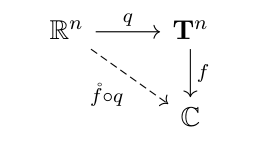

# Fourier 级数的 L2 理论

[返回讲义目录](../../../math-analysis-lecture-notes.md) · [学期目录](../../02-math-analysis-ii.md) · [章节目录](../53-fourier-l2.md) · [校勘记录](../../errata.md) · [上一篇：Hilbert 基与 Fourier 级数](../52-fourier-series.md) · [下一篇：53.1 作业:波动方程的局部能量估计](53-03-p0640-0643.md)

<!-- source: PDF 632; printed: 632; transcription: first-pass; proofreading: applied -->

## 53 Fourier 级数的 $L^2$-理论，高维 Fourier 级数的 $L^2$-理论，绝对收敛的 Fourier 级数

**定理 354**. 函数 $\{e^{ik \cdot x}\}_{k \in \mathbb{Z}}$ 是 $L^2(\mathbb{T})$ 的 Hilbert 基。特别地，对任意的 $f(x) \in L^2(\mathbb{T})$，对任意的 $k \in \mathbb{Z}$，令
$$\widehat{f}(k) = \int_0^{2\pi} f(x) e^{-ik \cdot x} \frac{dx}{2\pi} = \langle f, e^{ik \cdot x} \rangle,$$
那么，在 $L^2(\mathbb{T})$ 中，我们有
$$f(x) = \sum_{k \in \mathbb{Z}} \widehat{f}(k) e^{ik \cdot x}.$$
其中，$\widehat{f}(k) \in \mathbb{C}$ 被称作是 $f$ 的第 $k$ 个 Fourier 系数。进一步，我们还有 Bessel-Parseval 等式（勾股定理）：
$$\int_0^{2\pi} |f(x)|^2 \frac{dx}{2\pi} = \sum_{k=-\infty}^\infty |\widehat{f}(k)|^2.$$

上次课我们用 Weierstrass-Stone 定理给出了上述定理的证明。我们还可以绕过这个定理，直接用积分给出证明：

*第二个证明*. 令 $V = \operatorname{span}(\{e^{ik \cdot x}\}_{k \in \mathbb{Z}})$，只需要证明 $V^\perp = \{0\}$ 即可，现在任选 $f \in V^\perp$，那么，对任意的整数 $k$，我们有 $\langle f, e^{ik \cdot x} \rangle = 0$。证明分为三步：

1) 把问题化归到光滑的情况。

我们将 $f$ 延拓成为 $\mathbb{R}$ 上以 $2\pi$ 为周期的函数 $\widetilde{f}$：实际上，对任意的 $x \in \mathbb{R} - 2\pi\mathbb{Z}$，存在唯一的 $k \in \mathbb{Z}$，使得 $x - 2k\pi \in (0, 2\pi)$，我们就定义 $\widetilde{f}(x) = f(x - 2k\pi)$；在 $2\pi\mathbb{Z}$ 处，我们要求 $\widetilde{f}(2k\pi) = 0$。

我们注意到，对任意的 $x_0$，$\widetilde{f}$ 平移之后所得到的函数仍然与 $V$ 垂直，即 $\widetilde{f}(\cdot - x_0)|_{[0,2\pi]} \in V^\perp$：

实际上，根据换元积分公式以及 $\exp$ 的代数性质，我们有
$$\int_0^{2\pi} \widetilde{f}(x - x_0) e^{ik \cdot x} \frac{dx}{2\pi} = e^{ik \cdot x_0} \int_0^{2\pi} \widetilde{f}(x - x_0) e^{ik \cdot (x - x_0)} \frac{dx}{2\pi}$$
$$= e^{ik \cdot x_0} \int_0^{2\pi} f(x) e^{ik \cdot x} \frac{dx}{2\pi}$$
$$= 0.$$

我们把 $\widetilde{f}$ 打磨成光滑函数：
$$\widetilde{f}_\varepsilon(x) = \chi_\varepsilon * \widetilde{f} \in C^\infty(\mathbb{T}).$$

根据我们之前的结果，我们有
$$\lim_{\varepsilon \to 0} \int_0^{2\pi} |\widetilde{f}_\varepsilon(x) - f(x)|^2 \frac{dx}{2\pi} = 0.$$

<!-- source: PDF 633; printed: 633; transcription: first-pass; proofreading: applied -->

这是 $\widetilde{f}$ 在 $L^2$ 中的一个很好的逼近。实际上，与 $V$ 垂直这个性质也能被保持：
$$\widetilde{f}_\varepsilon(x)|_{[0,2\pi]} \in V^\perp.$$
我们用 Fubini 定理来验证这一点：对任意的 $k \in \mathbb{Z}$，我们有
$$\langle \widetilde{f}_\varepsilon(x), e^{ik \cdot x} \rangle = \int_0^{2\pi} \widetilde{f}_\varepsilon(x) e^{-ik \cdot x} \frac{dx}{2\pi}$$
$$= \int_{\mathbb{R}} \frac{1}{\varepsilon} \chi\left(\frac{y}{\varepsilon}\right) \underbrace{\left(\int_0^{2\pi} \widetilde{f}(x - y) e^{-ik \cdot x} \frac{dx}{2\pi}\right)}_{\text{平移之后的积分}} dy$$
$$= 0.$$
所以如果能证明 $\widetilde{f}_\varepsilon(x)|_{[0,2\pi]}$ 恒为 0，那么通过让 $\varepsilon \to 0$，我们就可以证明 $f = 0$。从此，可以假设 $f \in C^\infty(\mathbb{T})$ 来证明这个命题即可，这里，我们认为 $f$ 是 $\mathbb{R}$ 上的周期函数。

2) 剩下两步基本的构思如下：我们知道 $\chi_\varepsilon * f$ 逐点的收敛到 $f$（实际上，如果 $\chi$ 只是 $L^1$ 的函数并且 $\int_{\mathbb{R}} \chi(x)dx = 1$，那么结论也成立，请参考本周作业），我们利用这个想法构造一族新的 $\chi_\lambda$，使得 $\chi_\lambda$ 与 $f(x)$ 的卷积的极限逐点地收敛到 $f$。然后，再利用 $f$ 在做卷积的时候可以看做是 $f$ 做了一定的平移，从而，$f$ 与三角级数的乘积的积分为零来证明 $f \equiv 0$，当然，我们必须要能够选取 $\chi_\lambda$ 使得它可以用三角级数表示。

对任意的 $\lambda \geqslant 1$，我们定义函数
$$g_\lambda(x) = \sqrt{\frac{\lambda}{2\pi}} \int_{-\pi}^\pi e^{-\lambda(1-\cos(y))} f(x + y) dy.$$

**注记**. 如果我们用 $\chi(x) = \frac{e^{-\frac{x^2}{2}}}{\sqrt{2\pi}}$，那么这个函数的积分是 1。此时，我们可以用令 $\lambda = \varepsilon^{-2}$，那么，利用 $\chi$ 是偶函数，我们有
$$\chi_\varepsilon * f = \sqrt{\frac{\lambda}{2\pi}} \int_{\mathbb{R}} e^{-\frac{\lambda y^2}{2}} f(x - y) dy$$
$$= \sqrt{\frac{\lambda}{2\pi}} \int_{\mathbb{R}} e^{-\frac{\lambda y^2}{2}} f(x + y) dy$$
$$= \sqrt{\frac{\lambda}{2\pi}} \int_{-\pi}^\pi e^{-\frac{\lambda y^2}{2}} f(x + y) dy + \underbrace{\sqrt{\frac{\lambda}{2\pi}} \int_{|y| \geqslant \pi} e^{-\frac{\lambda y^2}{2}} f(x + y) dy}_{\mathbf{I}}.$$

对于 $\mathbf{I}$，我们来说明当 $\lambda$ 很大的时候，它可以被忽略：直观上，这是显然的，因为当 $\varepsilon \to 0$ 时候，几乎所有的 $\chi_\varepsilon$ 的贡献都集中在 0 附近的小邻域中。利用 $f$ 有界，我们有
$$|\mathbf{I}| \leqslant \underbrace{\sqrt{\frac{\lambda}{2\pi}} e^{-\frac{\frac{\lambda}{2}\pi^2}{2}}}_{\text{趋于 } 0,\ \lambda \to \infty} \int_{|y| \geqslant \pi} e^{-\frac{\frac{1}{2}y^2}{2}} |f(x + y)| dy$$
$$\leqslant \underbrace{\sqrt{\frac{\lambda}{2\pi}} e^{-\frac{\frac{\lambda}{2}\pi^2}{2}}}_{\text{趋于 } 0,\ \lambda \to \infty} \underbrace{\int_{|y| \geqslant \pi} e^{-\frac{\frac{1}{2}y^2}{2}} \|f\|_{L^\infty} dy}_{\text{常数}}$$

<!-- source: PDF 634; printed: 634; transcription: first-pass; proofreading: applied -->

所以，当 $\lambda \to \infty$ 时，我们有
$$\sqrt{\frac{\lambda}{2\pi}} \int_{-\pi}^\pi e^{-\frac{\lambda y^2}{2}} f(x + y) dy \to f(x).$$
（多努力一点我们还可以证明这是一致收敛的）然而，在周期的情况下（这是为什么我们要限制到 $[-\pi, \pi]$ 上积分），$e^{-\frac{y^2}{2}}$ 不是周期函数，为此，由于最终当 $\varepsilon \to 0$ 时，上面函数都集中在零点处，所以我们用 $1 - \cos(y)$ 来代替 $\frac{y^2}{2}$（Taylor 展开），这基本上解释了 $g_\lambda$ 的构造。

回到命题本身，证明如下的一致收敛性：
$$\lim_{\lambda \to \infty} g_\lambda(x) = f(x), \quad x \in \mathbb{R}.$$

我们把积分砍成两块：
$$g_\lambda(x) = \underbrace{\sqrt{\frac{\lambda}{2\pi}} \int_{|y| \leqslant \frac{\pi}{4}} e^{-\lambda(1-\cos(y))} f(x + y) dy}_{\mathbf{A}} + \underbrace{\sqrt{\frac{\lambda}{2\pi}} \int_{\pi \geqslant |y| \geqslant \frac{\pi}{4}} e^{-\lambda(1-\cos(y))} f(x + y) dy}_{\mathbf{B}}.$$

我们首先来控制第二项，它与上面注解中的 $\mathbf{I}$ 类似：
$$|\mathbf{B}| \leqslant \sqrt{\lambda} \int_{\pi \geqslant |y| \geqslant \frac{\pi}{4}} e^{-\lambda(1-\frac{\sqrt{2}}{2})} \|f\|_{L^\infty} dy$$
$$= \frac{3\pi}{2} \sqrt{\lambda} e^{-\lambda(1-\frac{\sqrt{2}}{2})} \|f\|_{L^\infty} \to 0.$$

很明显，上面的收敛是不依赖于 $x$ 的，所以是一致的。

对于 $\mathbf{A}$，在 $|y|\le\pi/4$ 上，取有符号的变量替换 $z=\sqrt2\sin(y/2)$，于是 $1-\cos(y)=z^2$ 且逆函数满足 $y\prime(0)=\sqrt2$。令 $z_0 = \sqrt{1 - \frac{\sqrt{2}}{2}}$，那么
$$\mathbf{A} = \sqrt{\frac{\lambda}{2\pi}} \int_{|z| \leqslant z_0} e^{-\lambda z^2} \underbrace{f(x + y(z)) y'(z)}_{F(z)} dz$$
$$= \sqrt{\frac{\lambda}{2\pi}} \int_{\mathbb{R}} e^{-\lambda z^2} F(z) dz,$$
其中 $F(z)$ 在 $|z| \geqslant z_0$ 处用 0 来延拓。从而，我们有
$$\mathbf{A} - \frac{F(0)}{\sqrt2} = \sqrt{\frac{\lambda}{2\pi}} \int_{\mathbb{R}} e^{-\lambda z^2} (F(z) - F(0)) dz$$
$$= \underbrace{\sqrt{\frac{\lambda}{2\pi}} \int_{|z| \leqslant \varepsilon} e^{-\lambda z^2} (F(z) - F(0)) dz}_{\mathbf{C}} + \underbrace{\sqrt{\frac{\lambda}{2\pi}} \int_{|z| \geqslant \varepsilon} e^{-\lambda z^2} (F(z) - F(0)) dz}_{\mathbf{II}}.$$

其中 $\varepsilon$ 是任意选取的。类似于注解中的 $\mathbf{I}$，如果选取好了 $\varepsilon$，那么 $\mathbf{II}$ 一致地收敛到 0（当 $\lambda \to \infty$ 时）；对于 $\mathbf{C}$，利用 $F$ 在 0 附近的 Lagrange 中值定理（$F$ 在 0 附近可微分并且导

<!-- source: PDF 635; printed: 635; transcription: first-pass; proofreading: applied -->

数有界 $M$，这里要求我们选取足够小的 $\varepsilon$），我们有
$$|\mathbf{C}| \leqslant \sqrt{\frac{\lambda}{2\pi}} \int_{|z| \leqslant \varepsilon} e^{-\lambda z^2} M |z| dz$$
$$= \frac{M}{\sqrt{\lambda}} \underbrace{\sqrt{\frac{1}{2\pi}} \int_{|t| \leqslant \varepsilon\sqrt\lambda} e^{-t^2} |t| dt}_{\text{积分有限}} \to 0.$$

所以也一致收敛到 0。从而，我们有如下的一致收敛：
$$\mathbf{A} \to \frac{F(0)}{\sqrt2} = f(x)$$

3) 我们证明，对任意固定的 $\lambda$，我们都有 $g_\lambda(x) \equiv 0$。

实际上，可以用级数的形式将 $g_\lambda$ 展开（从而化成了三角级数的形式）：
$$g_\lambda(x) = \sqrt{\frac{\lambda}{2\pi}} e^{-\lambda} \int_{-\pi}^\pi \sum_{k \geqslant 0} \frac{\lambda^k \cos^k(y)}{k!} f(x + y) dy.$$

利用 Lebesgue 控制收敛定理，我们可以交换积分与求和得到
$$g_\lambda(x) = \sum_{k \geqslant 0} \sqrt{\frac{\lambda}{2\pi}} e^{-\lambda} \int_{-\pi}^\pi \frac{\lambda^k \cos^k(y)}{k!} f(x + y) dy$$
$$= \sum_{k \geqslant 0} \sqrt{\frac{\lambda}{2\pi}} e^{-\lambda} \int_0^{2\pi} \frac{\lambda^k \cos^k(y)}{k!} f(x + y) dy.$$

最后一步用到了周期性。然而，$\cos(y)$ 可以写为 $e^{iy}$ 和 $e^{-iy}$ 的线性组合，所以，$\cos^k(y)$ 是有限个 $e^{ijy}$（$j\in\mathbb Z$）的线性组合，从而，利用 $f(y + x)$（平移了一下）与它们每个都正交，我们就知道每个积分项都是 0，从而 $g_\lambda \equiv 0$

这就给出了第二个证明。 \hfill $\square$

## 高维的 Fourier 级数

假设 $f(x_1, x_2, \cdots, x_n)$ 是 $\mathbb{R}^n$ 上的连续函数，其中，我们在 $\mathbb{R}^n$ 上选好了坐标系统 $(x_1, \cdots, x_n)$。如果对任意的 $(x_1, x_2, \cdots, x_n)$ 和 $1\leqslant i\leqslant n$，我们都有
$$f(x_1, \cdots, x_{i-1}, x_i + 2\pi, x_{i+1}, \cdots, x_n) = f(x_1, \cdots, x_{i-1}, x_i, x_{i+1}, \cdots, x_n),$$
我们就称 $f$ 是以 $2\pi\mathbb{Z}^n$ 为周期的。我们用 $C_{\text{per},2\pi}(\mathbb{R}^n)$ 表示所有这样的函数。

我们考虑映射
$$q : \mathbb{R}^n \to \mathbb{T}^n = \underbrace{\mathbb{T} \times \cdots \times \mathbb{T}}_{n \text{ 个}},$$
$$(x_1, \cdots, x_n) \mapsto (\exp(ix_1), \cdots, \exp(ix_n)).$$

<!-- source: PDF 636; printed: 636; transcription: first-pass; proofreading: applied -->

这里, $\mathbf{T}^n$ 是 $n$-维的环面并且 $q$ 是满射并且局部上是微分同胚。类似于 1 维, 通过映射 $q$ 的拉回, 我们有

**命题 355.** 映射
$$q^* : C(\mathbf{T}^n) \longrightarrow C_{\text{per},2\pi}(\mathbb{R}^n), \quad \mathring{f} \mapsto q^*(\mathring{f}),$$
是 $\mathbb{C}$-代数的同构。

我们总是用 $(\theta_1, \cdots, \theta_n)$ 来参数化 $\mathbf{T}^n$:
$$[0, 2\pi) \times \cdots \times [0, 2\pi) \rightarrow \mathbf{T}^n, \quad (\theta_1, \cdots, \theta_n) \mapsto \left(e^{i\theta_1}, \cdots, e^{i\theta_n}\right).$$

我们约定 $\mathbf{T}^n$ 上的测度为 $\mu = \frac{d\theta_1 \cdots d\theta_n}{(2\pi)^n}$, 这可以保证 $\mu(\mathbf{T}^n) = 1$。

类似地, $\mathbb{R}^n$ 以 $2\pi\mathbb{Z}^n$ 为周期的连续可微函数、光滑函数, 每个周期上可积的函数、在每个周期上平方可积的函数和 $L^\infty$ 的函数分别对应到 $\mathbf{T}^n$ 上的 $C^1(\mathbf{T}^n)$、$C^\infty(\mathbf{T}^n)$、$L^1(\mathbf{T}^n)$、$L^2(\mathbf{T}^n)$ 和 $L^\infty(\mathbf{T}^n)$。

类似于 1 维的情形, 我们很容易证明

**引理 356.** 对任意的 $p = 1$ 或 $2$, $C^\infty(\mathbf{T}^n) \subset L^p(\mathbf{T}^n)$ 是稠密的子空间。

和 1 维类似, 平方可积的 $2\pi\mathbb{Z}^n$ 周期函数的 Fourier 级数理论具有干净的表达:

**定理 357.** 在 $L^2\left([0,2\pi]^n, \frac{dx_1 \cdots dx_n}{(2\pi)^n}\right)$ 中, 内积 $\langle \cdot, \cdot \rangle$ 的定义为
$$\langle f, g \rangle = \int_{[0,2\pi]^n} f(x)\overline{g(x)} \frac{dx}{(2\pi)^n}.$$

那么, 函数 $\{e^{ik\cdot x}\}_{k\in\mathbb{Z}^n}$ 是 Hilbert 基, 其中
$$k = (k_1, \cdots, k_n), \quad x = (x_1, \dots, x_n), \quad k \cdot x = \sum_{i=1}^n k_i x_i.$$

特别地, 对任意的 $f(x) \in L^2(\mathbf{T}^n)$, 对任意的 $k \in \mathbb{Z}^n$, 令
$$\widehat{f}(k) = \int_{[0,2\pi]^n} f(x) e^{-ik\cdot x} \frac{dx}{(2\pi)^n} = \langle f, e^{ik\cdot x} \rangle,$$

那么, 在 $L^2(\mathbf{T}^n)$ 中, 我们有
$$f(x) = \sum_{k\in\mathbb{Z}^n} \widehat{f}(k) e^{ik\cdot x}.$$

其中, $\widehat{f}(k) \in \mathbb{C}$ 被称作是 $f$ 的**第 $k$ 个 Fourier 系数**。进一步, 我们还有 *Bessel-Parseval 等式(勾股定理)*:
$$\int_{[0,2\pi]^n} |f(x)|^2 \frac{dx}{(2\pi)^n} = \sum_{k\in\mathbb{Z}^n} |\widehat{f}(k)|^2.$$

<!-- source: PDF 637; printed: 637; transcription: first-pass; proofreading: applied -->

**证明:** 我们只要证明 $\{e^{ik\cdot x}\}_{k\in\mathbb{Z}^n}$ 是 Hilbert 基即可, 其余的是显然的。令 $V = \text{span}\left(\{e^{ik\cdot x}\}_{k\in\mathbb{Z}^n}\right)$, 假设 $f \in V^\perp$, 我们要说明在 $L^2$ 中, $f = 0$。为了简化书写, 我们采取如下简约的记号:
$$k = (k_1, \underbrace{k_2, \cdots, k_n}_{k'}) = (k_1, k'), \quad x = (x_1, \underbrace{x_2, \cdots, x_n}_{x'}) = (x_1, x').$$

由于 $e^{ik\cdot x} f(x) \in L^2([0,2\pi]^n) \subset L^1([0,2\pi]^n)$, 所以我们可以运用 Fubini 定理从 $\langle f, e^{ik\cdot x} \rangle = 0$ 推出
$$\int_{[0,2\pi]} e^{ik_1 x_1} \underbrace{\left( \int_{[0,2\pi]^{n-1}} e^{ik'\cdot x'} f(x_1, x') dx' \right)}_{F(x_1)} dx_1 = 0.$$

另外, 对 $|f(x)|^2$ 的积分用 Fubini 定理, 我们知道 $F(x_1)$ 对几乎处处的 $x_1$ 有定义并且 $F(x_1) \in L^2([0,2\pi])$, 所以, 根据 1 维的 $L^2$ 的 Fourier 级数的结论, 我们
$$F(x_1) = 0\quad\text{几乎处处}.$$

利用归纳我们就完成了证明。 $\square$

**注记.** 在 $L^2$-空间框架下的 Fourier 级数理论很大程度上类比了我们对于有限维内积空间的理解, 这是用线性代数的观点来研究函数的一个重要例子: 我们可以把每个 $L^2$ 函数 $f$ 看成若干个更基本的函数 $e^{ik\cdot x}$ (简单波) 的线性叠加, 从而期盼对每个 $e^{ik\cdot x}$ (以及它们之间的关系) 的理解能够帮助我们读出 $f$ 的关键信息。特别地, 我们希望通过研究 $f$ 的 Fourier 系数 $\widehat{f}(k)$ 的性质来研究 $f$ 本身, 这就是 Fourier 分析。

如果我们知道函数 $f \in L^2(\mathbf{T}^n)$, 那么, 级数
$$\sum_{k\in\mathbb{Z}^n} \widehat{f}(k) e^{ik\cdot x}$$
在 $L^2$ 中收敛到 $f$。根据我们对 $L^2$ 完备性的证明, 我们知道存在下列函数列的子序列:
$$\{S_N = \sum_{k\in\mathbb{Z}^n,|k|\leqslant N} \widehat{f}(k) e^{ik\cdot x}\}_{N\geqslant 1},$$
它几乎处处收敛到 $f$。然而, 是否整个序列都几乎处处 (不需要选取子序列) 收敛到 $f$ 呢? 在一维情形，这是 Carleson 证明的重要定理, 他本人也因为这项工作获得了 Abel 奖。

实际上, 即使我们假设了 $f \in C(\mathbf{T}^n) \subset L^2(\mathbf{T}^n)$, 我们也只能说
$$\sum_{k\in\mathbb{Z}^n} \widehat{f}(k) e^{ik\cdot x}$$
在 $L^2$ 中收敛到 $f$, 这个级数不见得逐点收敛。这是 Fourier 级数的分析中重要的话题 (我们将要学习), 另一方面, 这也表明了为什么 $L^2$ 的理论是重要的: 因为我们总能保证基本的收敛性!

另外, 对于 $f \in L^1(\mathbf{T}^n, \frac{dx}{(2\pi)^n})$, 它的 Fourier 系数
$$\widehat{f}(k) = \int_{[0,2\pi]^n} f(x) e^{-ik\cdot x} \frac{dx}{(2\pi)^n},$$

<!-- source: PDF 638; printed: 638; transcription: first-pass; proofreading: applied -->

仍然有定义 (可积)。但是, 在 $L^1(\mathbf{T}^n, \frac{dx}{(2\pi)^n})$ 的意义下, 我们却未必有
$$f(x) = \sum_{k\in\mathbb{Z}^n} \widehat{f}(k) e^{ik\cdot x}.$$

*Kolmogorov* 在大学二年级时构造了一个 $L^1$ 的函数 (1 维情形), 使得其 Fourier 级数 (上面等式的右边) 几乎处处发散, 我们会在作业题中研究他所构造的函数 (2019 年数学分析二的期末考试题)。

我们通过下面的简单例子说明 $L^2$ 理论的有效性:

**例子.** 假设 $f \in C(\mathbf{T}^n)$, 如果 $f$ 所有 Fourier 系数都是 0, 那么 $f \equiv 0$:

实际上, 根据 $L^2$ 的理论, Fourier 系数全部消失意味着在 $L^2$ 中 $f = 0$, 所以 $f$ 几乎处处为 0。根据 $f$ 的连续性, 这说明 $f \equiv 0$: 否则, 存在 $x_0 \in \mathbf{T}^n$, $f(x_0) \neq 0$, 那么, $f$ 在 $x_0$ 的一个小的开邻域上不为零, 但是任意开邻域的测度不为 0, 矛盾。

## Fourier 分析

我们现在来学习古典的 Fourier 分析, 大概的思路是通过一个函数的 Fourier 系数 $\{\widehat{f}(k)\}_{k\in\mathbb{Z}^n}$ 来研究函数的性质。一般而言, 我们给定的周期函数 $f$ 都是 $L^1$ 的, 此时, 我们把如下的序列
$$\left\{\widehat{f}(k) \,\middle|\, \widehat{f}(k) = \int_{[0,2\pi]^n} f(x) e^{-ik\cdot x} \frac{dx}{(2\pi)^n} \right\}_{k\in\mathbb{Z}^n}$$
称作是 $f$ 的 **Fourier 系数**。由于我们假设了 $f$ 的可积性, 所以上面序列是良好定义的 (下学期我们还会研究 $f$ 是不可积的情形)。所以, 在后面的讲义中, 我们一般都假设 $f$ 是可积的 (除非有特殊情况)。

**注记.** 我们之后所要证明的定理, 大部分都可以原封不动的推广到 $\mathbf{T}^n$ 上去。为了行文方便, 我们只介绍 1 维的理论。当你遇到高维的例子的时候 (在作业或者考试中), 你应该能够回来验证同样的论证也成立。

我们先从一个上个学期就已经 (隐含地) 证明过的结论开始:

**定理 358.** 对任意的连续函数 $f \in C(\mathbf{T})$, 如果它对应的 Fourier 级数
$$\sum_{k\in\mathbb{Z}} \widehat{f}(k) e^{ikx}$$
是绝对收敛的, 即
$$\sum_{k\in\mathbb{Z}} |\widehat{f}(k)| < \infty, \quad (\text{注意, 这只是对 Fourier 系数的要求})$$
那么部分和定义的函数序列 $\{S_N(x) = \sum_{-N\leqslant k\leqslant N} \widehat{f}(k) e^{ikx}\}_{N\geqslant 1}$ 是一致收敛的: 对任意的 $x \in \mathbf{T}$,
$$\lim_{N\to\infty} S_N(x) = f(x) \quad \text{并且} \quad \lim_{N\to\infty} \|S_N - f\|_{L^\infty} = 0.$$

<!-- source: PDF 639; printed: 639; transcription: first-pass; proofreading: applied -->

**证明:** 我们在 $(C(\mathbf{T}), \|\cdot\|_{L^\infty})$ 上考虑这个问题。我们注意到:
$$\sum_{k\in\mathbb{Z}} |\widehat{f}(k)| = \sum_{k\in\mathbb{Z}} \|\widehat{f}(k)e^{ikx}\|_{L^\infty}.$$

所以, 这个函数级数在 $(C(\mathbf{T}), \|\cdot\|_{L^\infty})$ 中绝对收敛, 从而
$$g(x) = \lim_{N\to\infty} S_N(x) = \lim_{N\to\infty} \sum_{-N\leqslant k\leqslant N} \widehat{f}(k) e^{ikx}$$
是良好定义的并且是 $\mathbf{T}$ 上连续函数 (或者 $\mathbb{R}$ 上的连续周期函数)。以下只要证明 $f = g$ 即可。

由于 $f$ 和 $g$ 都是连续函数 (所以是 $L^2$ 的), 根据 $L^2$ 的理论, 只要验证它们具有相同的 Fourier 系数即可。

我们计算 $g(x)$ 的 Fourier 系数:
$$\begin{aligned}
\widehat{g}(k) &= \int_0^{2\pi} \left( \lim_{N\to\infty} \sum_{-N\leqslant l\leqslant N} \widehat{f}(l) e^{ilx} \right) e^{-ikx} \frac{dx}{2\pi} \\
&= \int_0^{2\pi} \lim_{N\to\infty} \sum_{-N\leqslant l\leqslant N} \widehat{f}(l) e^{-i(k-l)x} \frac{dx}{2\pi} \\
&= \lim_{N\to\infty} \int_0^{2\pi} \sum_{-N\leqslant l\leqslant N} \widehat{f}(l) e^{-i(k-l)x} \frac{dx}{2\pi} \\
&= \lim_{\substack{N\to\infty \\ N\geqslant |k|}} \widehat{f}(k) = \widehat{f}(k).
\end{aligned}$$

上面计算中积分与极限可交换是因为上学期我们证明过一致收敛与积分可交换 (也可以用 Lebesgue 控制收敛定理直接来证明, 取 $\sum_{k\in\mathbb{Z}} |\widehat{f}(k)|$ 作为控制函数)。这就完成了证明。 $\square$

[返回讲义目录](../../../math-analysis-lecture-notes.md) · [学期目录](../../02-math-analysis-ii.md) · [章节目录](../53-fourier-l2.md) · [校勘记录](../../errata.md) · [上一篇：Hilbert 基与 Fourier 级数](../52-fourier-series.md) · [下一篇：53.1 作业:波动方程的局部能量估计](53-03-p0640-0643.md)
