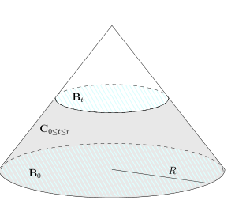

# 53.1 作业:波动方程的局部能量估计

[返回讲义目录](../../../math-analysis-lecture-notes.md) · [学期目录](../../02-math-analysis-ii.md) · [章节目录](../53-fourier-l2.md) · [校勘记录](../../errata.md) · [上一篇：Fourier 级数的 L2 理论](53-01-p0632-0639.md) · [下一篇：53.2 习题课:Riemann积分的定义3](53-04-p0644-0646.md)

<!-- source: PDF 640; printed: 640; transcription: first-pass; proofreading: applied -->

<!-- math-analysis-layout: document-title-normalized -->

>

## 课堂补充

A1) (闭子空间) $(H, \langle \cdot, \cdot \rangle)$ 是 Hilbert 空间，$V \subset H$ 是其线性子空间。我们假设 $V$ 是 $H$ 中的闭集（相对于 $H$ 上由内积所定义的距离函数而言）。证明，对任意的 $v_1, v_2 \in V$，如果我们仍用 $\langle v_1, v_2 \rangle$ 作为 $V$ 上的内积，那么
$$
(V, \langle \cdot, \cdot \rangle)
$$
是 Hilbert 空间。

证明，对于 $H = L^2(\mathbb{R}^n)$，$V = C(\mathbb{R}^n) \cap L^2(\mathbb{R}^n)$ 不是闭子空间。

A2) 给定 $L^2(X, \mathcal{A}, \mu)$ 中的函数序列 $\{f_i\}_{i \geqslant 1}$，我们假设它们在 $L^2$ 范数下收敛到 $f$，即
$$
f_i \xrightarrow{L^2(X, \mathcal{A}, \mu)} f, \quad i \to \infty.
$$
那么，存在子函数序列 $\{f_{i_p}\}_{p \geqslant 1}$，使得对几乎处处的 $x \in X$，我们都有
$$
\lim_{p \to \infty} f_{i_p}(x) = f(x).
$$

A3) 证明，$(L^1(\mathbb{R}^n), *)$ 中没有单位元，即不存在 $e \in L^1(\mathbb{R}^n)$，使得对任意的 $f \in L^1(\mathbb{R}^n)$，都有 $e * f = f$。

A4) 证明，$C_0^\infty(\mathbb{R}^n)$ 是 $L^2(\mathbb{R}^n)$ 的稠密子空间。

A5) 举例说明 $C(\mathbb{R}^n)\cap L^\infty(\mathbb{R}^n)$ 在 $L^\infty(\mathbb{R}^n)$ 中不是稠密的。

A6) 证明，$C^\infty(\mathbb{R}^n) \cap L^\infty(\mathbb{R}^n)$ 在 $C(\mathbb{R}^n) \cap L^\infty(\mathbb{R}^n)$ 中稠密（对 $\|\cdot\|_{L^\infty}$ 而言）。

A7) 假设 $(H, \langle \cdot, \cdot \rangle)$ 是 Hilbert 空间，$V \subset H$ 是线性子空间。证明，$V$ 在 $H$ 中稠密当且仅当对任意的 $x \perp V$ 一定有 $x = 0$。

A8) 试证明，$L^2(\mathbb{R}^n)$ 是可分的。（可以参考讲义中的提示）

A9) (重要) 假设 $f \in L^1(\mathbb{R}^n)$ 并且 $\int_{\mathbb{R}^n} f(x)dx = 1$，我们定义
$$
f_\varepsilon(x) = \frac{1}{\varepsilon^n} f\left(\frac{x}{\varepsilon}\right)
$$
证明，对任意的有紧支集的连续函数 $\varphi$，我们都有如下的一致收敛：
$$
f_\varepsilon * \varphi \to \varphi, \quad \varepsilon \to 0.
$$

<!-- source: PDF 641; printed: 641; transcription: first-pass; proofreading: applied -->

## 控制收敛与 Fubini 定理的复习

### B. 含参数积分的研究

B1) 证明，对任意的 $t \in \mathbb{R}$，如下积分是良好定义的：
$$
F(t) = \int_0^\infty \frac{1 + tx^5 + t^2 x^{11}}{1 + t^4 + x^{13}} dx.
$$

B2) 证明，$F(t)$ 是 $t \in \mathbb{R}$ 的连续函数。

B3) 证明，$F(t)$ 是可导的。

B4) 试计算 $\lim_{t \to +\infty} F(t)$。

B5) 证明，对 $t \neq 0$，如下的积分是发散的：
$$
\int_0^\infty \frac{1 + tx^5 + t^2 x^{11}}{1 + t^4 + x^{12}} dx
$$

B6) 证明，对任意的 $t \in \mathbb{R}$，如下在 Riemann 意义下的反常积分是良好定义的：
$$
G(t) = \int_0^\infty \frac{1 + tx^5 + t^2 x^{11}}{1 + t^4 + x^{12}} e^{ix} dx,
$$
即 $\lim_{T \to \infty} \int_0^T \frac{1 + tx^5 + t^2 x^{11}}{1 + t^4 + x^{12}} e^{ix} dx$ 存在。

B7) 证明，$G(t)$ 是 $t \in \mathbb{R}$ 的连续函数。

B8) 试计算 $\lim_{t \to +\infty} G(t)$。

### C. Laplace 变换的基本性质

C1) 假设 $f(t)$ 是 $\mathbb{R}_{>0}$ 上定义的 Lebesgue 可积函数。我们定义它的 Laplace 变换为：
$$
(\mathcal{L}f)(x) = \int_0^\infty f(t) e^{-xt} dt,
$$
其中 $x > 0$。证明，$(\mathcal{L}f)(x)$ 是 $C^\infty$ 的函数。

C2) 证明，对任意的 $n \in \mathbb{Z}_{\geqslant 0}$，我们都有
$$
\left(\frac{d}{dx}\right)^n (\mathcal{L}f)(x) = \int_0^\infty (-t)^n f(t) e^{-xt} dt.
$$

C3) 假设 $f(t)$ 和 $g(t)$ 是 $\mathbb{R}_{>0}$ 上定义的 Lebesgue 可积函数，我们定义它们的“卷积”为
$$
(f \bullet g)(t) = \int_0^t f(\tau) g(t - \tau) d\tau.
$$
证明，$f \bullet g = g \bullet f$。

C4) 假设 $f(t)$ 和 $g(t)$ 是 $\mathbb{R}_{>0}$ 上定义的 Lebesgue 可积函数。证明，
$$
\mathcal{L}(f \bullet g)(x) = (\mathcal{L}f)(x)(\mathcal{L}g)(x).
$$

<!-- source: PDF 642; printed: 642; transcription: first-pass; proofreading: applied -->

## Stokes 公式的应用：波动方程的局部能量估计

假设 $u(t, x)$ 是 $\mathbb{R} \times \mathbb{R}^3$ 上的光滑函数，这里空间变量 $x \in \mathbb{R}^3$，时间变量 $t \in \mathbb{R}$。我们假设 $u$ 满足波动方程：
$$
\Box u = 0,
$$
其中波动算子的定义如下：
$$
\Box = -\frac{\partial^2}{\partial t^2} + \Delta = -\frac{\partial^2}{\partial t^2} + \frac{\partial^2}{\partial x_1^2} + \frac{\partial^2}{\partial x_2^2} + \frac{\partial^2}{\partial x_3^2}.
$$
我们令 $u_0(x) = u(0, x)$，$u_1(x) = \frac{\partial u}{\partial t}(0, x)$，这样的一对函数 $(u_0, u_1)$ 被称作是波动方程的初始值。

我们做如下的假设：对任意的时间 $t \in \mathbb{R}$，$u(t, x)$ 对 $x$ 而言有紧支集。

D1) 我们定义波动方程的能量函数
$$
E(t) = \frac{1}{2} \int_{\mathbb{R}^3} \left|\frac{\partial u}{\partial t}(t, x)\right|^2 + |\nabla u(t, x)|^2 dx.
$$
证明能量守恒定律：对任意的时刻 $t \in \mathbb{R}$，有
$$
E(t) = E(0).
$$

D2) 对于 $i = 1, 2, 3$，我们定义波动方程的动量函数
$$
P_i(t) = \int_{\mathbb{R}^3} \frac{\partial u}{\partial t} \frac{\partial u}{\partial x_i} dx.
$$
证明动量守恒定律：对任意的时间 $t$，有
$$
P_i(t) = P_i(0).
$$

D3) (解的唯一性) 假设 $u(t, x)$ 和 $v(t, x)$ 都满足波动方程以及上面假设。证明，如果它们具有相同的初始值，即 $u_0(x) = v_0(x)$，$u_1(x) = v_1(x)$，那么 $u(t, x) \equiv v(t, x)$。

D4) 任意给定 $R > 0$，假设 $0\leqslant r\leqslant R$。我们在时空 $\mathbb{R} \times \mathbb{R}^3$ 中定义如下的几何对象：

- 实心锥 $\mathbf{D} = \{(t, x) \mid t \in [0, R], |x| \leqslant R - t\}$。这是顶点在 $(t, x) = (R, 0)$ 处的一个实心锥。

<!-- source: PDF 643; printed: 643; transcription: first-pass; proofreading: applied -->

- 实心圆台 $\mathbf{D}_{0 \leqslant t \leqslant r} = \{(t, x) \mid t \in [0, r], |x| \leqslant R - t\}$（图中两个淡蓝色圆盘之间的区域）。
- 圆锥截面 $\mathbf{C}_{0 \leqslant t \leqslant r} = \{(t, x) \mid t \in [0, r], |x| = R - t\}$（图中的灰色区域所代表的表面）。
- 不同时刻的实心球 $\mathbf{B}_t = \{(t, x) \mid |x| \leqslant R - t\}$（图中淡蓝色的圆盘区域）。

给定 $(t_0, x_0)\in\mathbf{C}_{0\leqslant t\leqslant r}$，且 $t_0<R$，取球坐标中 $0<\theta<\pi$ 的坐标片。证明，$\mathbf{C}_{0 \leqslant t \leqslant r}$ 在这一点处的切空间由以下三个向量张成（球坐标系）
$$
L = \frac{\partial}{\partial t} - \frac{\partial}{\partial r}, \quad e_1 = \frac{1}{r} \frac{\partial}{\partial \theta}, \quad e_2 = \frac{1}{r \sin \theta} \frac{\partial}{\partial \varphi}.
$$
作为传统的记号，我们记 $|/\!\nabla u|^2 = |\nabla_{e_1} u|^2 + |\nabla_{e_2} u|^2$。

D5)** 我们定义局部能量
$$
E_{\text{loc}}(t) = \frac{1}{2} \int_{\mathbf{B}_t} \left|\frac{\partial u}{\partial t}(t, x)\right|^2 + |\nabla u(t, x)|^2 dx.
$$
证明，对任意的 $0\leqslant r\leqslant R$，我们都有
$$
E_{\text{loc}}(0) = E_{\text{loc}}(r) + \frac{1}{2\sqrt2}\int_{\mathbf{C}_{0 \leqslant t \leqslant r}} |\nabla_L u|^2 + |/\!\nabla u|^2 d\sigma.
$$
其中 $d\sigma$ 表示时空 Euclidean 面积元。其锥面参数形式为 $d\sigma=\sqrt2\,dt\,dS_x$，因此边界项也等于 $\frac12\int_0^r\int_{|x|=R-t}(|\nabla_Lu|^2+|/\!\nabla u|^2)\,dS_x\,dt$。

（提示：对 $\Box u = 0$ 两边同时乘以 $\frac{\partial u}{\partial t}$ 并在区域 $\mathbf{D}_{0 \leqslant t \leqslant r}$ 上积分，你需要运用 Stokes 公式来得到边界上的积分）

D6)* (波方程的有限传播速度) 我们现在假设 $u(t,x)$ 光滑并满足波动方程，不再预先假设每一时刻都有紧支集。证明，如果 $u_0$ 和 $u_1$ 有紧支集，那么对任意的时刻 $t$，$u(t, x)$ 对 $x$ 有紧支集。

D7)* 假设 $u(t, x)$ 是光滑函数并且满足非线性波动方程
$$
-\frac{\partial^2}{\partial t^2} u + \Delta u = u^3.
$$
证明，如果 $u_0$ 和 $u_1$ 有紧支集，那么对任意的时刻 $t$，$u(t, x)$ 对 $x$ 有紧支集。

[返回讲义目录](../../../math-analysis-lecture-notes.md) · [学期目录](../../02-math-analysis-ii.md) · [章节目录](../53-fourier-l2.md) · [校勘记录](../../errata.md) · [上一篇：Fourier 级数的 L2 理论](53-01-p0632-0639.md) · [下一篇：53.2 习题课:Riemann积分的定义3](53-04-p0644-0646.md)
