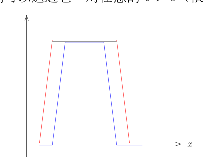

# 56 Bernstein 定理与等分布

[返回讲义目录](../../math-analysis-lecture-notes.md) · [学期目录](../02-math-analysis-ii.md) · [校勘记录](../errata.md) · [上一篇：55.1 作业:Fourier级数的计算,三角函数与球谐函数](55-fourier-convergence/55-03-p0667-0673.md) · [下一篇：Roth 定理与数学分析二期末考试](57-roth-theorem/57-01-p0684-0697.md)

<!-- source: PDF 674; printed: 674; transcription: first-pass; proofreading: applied -->

## 56 Bernstein 定理, Fourier 级数在等分布问题上的应用

### Hölder 连续函数的 Bernstein 定理

我们考虑 $f \in C^\alpha(\mathbf{T})$, 其中 $\alpha \in (0, 1)$。按照定义, 存在 $C > 0$, 使得对任意的 $x, y \in \mathbf{T}$, 我们有
$$ |f(x) - f(y)| \leqslant C|x - y|^\alpha. $$

用 $\|f\|_{C^{0,\alpha}}$ 记 Hölder 半范数，即上述可能的常数 $C$ 的下确界, 即
$$ \|f\|_{C^{0,\alpha}} = \sup_{x,y\in\mathbf{T}, x\neq y} \frac{|f(x) - f(y)|}{|x - y|^\alpha}. $$

从而, 对任意的 $x, y \in \mathbf{T}$, 我们有
$$ |f(x) - f(y)| \leqslant \|f\|_{C^{0,\alpha}} |x - y|^\alpha. $$

**命题 378.** 假设 $f \in C^\alpha(\mathbf{T})$, 其中我们假设 $\alpha \in [0, 1]$（当 $\alpha = 0$ 时, 我们只是假设 $f$ 是连续的；当 $\alpha = 1$ 时, 我们假设 $f$ 是 Lipschitz 函数）。那么, 我们有
$$ |\widehat{f}(k)| = O(|k|^{-\alpha}), $$

即序列 $\{|k|^\alpha |\widehat{f}(k)|\}_{k\in\mathbb Z\setminus\{0\}}$ 是有界的。

**证明:** 我们不妨假设 $\alpha > 0$（否则用 Riemann-Lebesgue 引理即可）, 按照定义, 对任意的 $x, y \in \mathbf{T}$, 我们有
$$ |f(x) - f(y)| \leqslant \|f\|_{C^{0,\alpha}} |x - y|^\alpha. $$

我们将满足对任意的 $k \neq 0$, 我们有
$$
\begin{aligned}
\widehat{f}(k) &= \int_{-\pi}^\pi f(x) e^{-ikx} \frac{dx}{2\pi} \\
&= -\int_{-\pi}^\pi f(x) e^{-ikx+i\pi} \frac{dx}{2\pi} \\
&= -\int_{-\pi}^\pi f(x) e^{-ik(x-\frac{\pi}{k})} \frac{dx}{2\pi} \\
&= -\int_{-\pi}^\pi f(x + \frac{\pi}{k}) e^{-ixk} \frac{dx}{2\pi}.
\end{aligned}
$$

从而,
$$
\begin{aligned}
\widehat{f}(k) &= \frac{1}{2} \left( \int_{-\pi}^\pi f(x) e^{-ikx} \frac{dx}{2\pi} - \int_{-\pi}^\pi f(x + \frac{\pi}{k}) e^{-ixk} \frac{dx}{2\pi} \right) \\
&= \int_{-\pi}^\pi \left(f(x)-f(x+\frac\pi k)\right)e^{-ixk} \frac{dx}{4\pi}.
\end{aligned}
$$

<!-- source: PDF 675; printed: 675; transcription: first-pass; proofreading: applied -->

所以, 利用 Hölder 函数的定义, 我们有
$$
\begin{aligned}
|\widehat{f}(k)| &\leqslant \frac{1}{4\pi} \int_{-\pi}^\pi \left| f(x + \frac{\pi}{k}) - f(x) \right| dx \\
&\leqslant \frac{\|f\|_{C^{0,\alpha}}}{4\pi} \int_{-\pi}^\pi \left( \frac{\pi}{|k|} \right)^\alpha dx = \frac{\pi^\alpha \|f\|_{C^{0,\alpha}}}{2} \cdot \frac{1}{|k|^\alpha}.
\end{aligned} \tag*{$\square$}
$$

**注记.** 上面命题中证明的关于 $C^\alpha$ 函数的 Fourier 系数的衰减估计是最佳的, 其中 $\alpha \in (0, 1)$（这个逐个 Fourier 系数的衰减界是 $C^\alpha$ 的必要条件，一般并非充分条件，不能单凭它刻画 $C^\alpha$）。

假设 $0 < \alpha < 1$, 我们考虑如下的 Fourier 级数:
$$ f_\alpha(x) = \sum_{k=1}^\infty \frac{1}{2^{k\alpha}} e^{i 2^k x}. $$

很显然, 这个级数是绝对收敛的, 所以, $f_\alpha \in C^0(\mathbf{T})$。特别地, $\widehat{f_\alpha}(l)=l^{-\alpha}$ 在 $l=2^k$（$k\ge1$）时成立，其他频率的系数为 $0$ 并且 $\widehat{f_\alpha}(l) = o(|l|^{-\alpha})$ 不成立。

如果我们可以说明 $f_\alpha \in C^\alpha(\mathbf{T})$, 这表明上述性质中对于 Fourier 系数的衰减估计是最佳的:

对于任意的 $x$ 和 $h$, 以 $h$ 为频率的二进制尺度, 我们有
$$ f_\alpha(x+h) - f_\alpha(x) = \underbrace{\sum_{2^k \leqslant \frac{1}{100} |h|^{-1}} \frac{1}{2^{k\alpha}} \left( e^{i 2^k (x+h)} - e^{i 2^k x} \right)}_{I_1} + \underbrace{\sum_{2^k > \frac{1}{100} |h|^{-1}} \frac{1}{2^{k\alpha}} \left( e^{i 2^k (x+h)} - e^{i 2^k x} \right)}_{I_2}. $$

我们注意到第二项可以如下控制
$$ |I_2| \leqslant \sum_{2^k > \frac{1}{100} |h|^{-1}} \frac{2}{2^{k\alpha}} \leqslant C|h|^\alpha. $$

对于第一项, 我们有
$$
\begin{aligned}
|I_1| &\leqslant \sum_{2^k \leqslant \frac{1}{100} |h|^{-1}} \frac{1}{2^{k\alpha}} |e^{i 2^k h} - 1| \\
&\leqslant \sum_{2^k \leqslant \frac{1}{100} |h|^{-1}} \frac{C}{2^{k\alpha}} 2^k |h|.
\end{aligned}
$$

我们用到了当 $|y| < 1$ 时, $|e^{iy} - 1| \leqslant C|y|$。从而,
$$
\begin{aligned}
|I_1| &\leqslant C|h| \sum_{2^k \leqslant \frac{1}{100} |h|^{-1}} 2^{k(1-\alpha)} \\
&\leqslant C|h| \times C' \left( \frac{1}{100} |h|^{-1} \right)^{1-\alpha} \\
&= C'' |h|^\alpha.
\end{aligned}
$$

<!-- source: PDF 676; printed: 676; transcription: first-pass; proofreading: applied -->

在这个估计中, 我们用到了 $\alpha < 1$。所以,
$$ |f_\alpha(x+h) - f_\alpha(x)| \leqslant |I_1| + |I_2| \leqslant C''' |h|^\alpha. $$

这表明, $f_\alpha\in C^\alpha(\mathbf T)$。

我们已经介绍的几个关于 Fourier 级数逐点收敛的经典定理, 都没有涉及到一致收敛性。对于 $f\in C^\alpha(\mathbf T)$，单独使用 $O(|k|^{-\alpha})$ 的逐项衰减界，在 $\alpha\le1$ 时不足以推出系数绝对可求和；Bernstein 在 $\alpha>\frac12$ 时给出如下更强的结论：

**定理 379** (Bernstein). 如果 $\alpha \in (\frac{1}{2}, 1]$, 那么, 对于任意的 $f \in C^\alpha(\mathbf{T})$, 其 Fourier 级数
$$ \sum_{k \in \mathbf{Z}} \widehat{f}(k) e^{ikx} $$
是绝对收敛的。特别地, 对于 $\alpha \in (\frac{1}{2}, 1]$, 函数序列 $\{S_N(f)\}_{N \geqslant 1}$ 一致收敛到 $f$。

**注记.** 我们要强调, $\{S_N(f)\}_{N \geqslant 1}$ 一般不保证在 $C^{0,\alpha}$ 的范数下收敛到 $f$。

**证明:** 受到上面评注里证明的启发, 我们考虑
$$ g_h(x) = f(x+h) - f(x-h). $$

从而, 我们可以计算
$$ \widehat{g_h}(k) = (e^{ikh} - e^{-ikh}) \widehat{f}(k) = 2i \sin(kh) \widehat{f}(k). $$

很明显, 对任意的 $h \in \mathbf{R}$, 我们有 $g_h(x) \in L^2(\mathbf{T})$。根据勾股定理, 我们有
$$ \int_{-\pi}^\pi |g_h(x)|^2 \frac{dx}{2\pi} = 4 \sum_{k \in \mathbf{Z}} |\sin(kh)|^2 |\widehat{f}(k)|^2. $$

另外, 根据 $f \in C^\alpha$, 我们还知道
$$ |g_h(x)| \leqslant \|f\|_{C^{0,\alpha}} (2|h|)^\alpha. $$

所以, 我们得到
$$ \sum_{k \in \mathbf{Z}} |\sin(kh)|^2 |\widehat{f}(k)|^2 \leqslant C|h|^{2\alpha} $$

特别地, 如果令 $h = \frac{\pi}{2^{p+1}}$, 我们得到
$$ \sum_{k \neq 0} \left| \sin \left( \frac{k\pi}{2^{p+1}} \right) \right|^2 |\widehat{f}(k)|^2 \leqslant \frac{C}{2^{2p\alpha}}, $$

其中, 常数 $C$ 可能有所改变, 但是这还是一个不依赖于 $p$ 的常数（可以依赖于 $f$ 和 $\alpha$）。在这个求和中, 我们只选取一部分的和:
$$ \sum_{2^{p-1} \leqslant |k| < 2^p} \left| \sin \left( \frac{k\pi}{2^{p+1}} \right) \right|^2 |\widehat{f}(k)|^2 \leqslant \frac{C}{2^{2p\alpha}}. $$

<!-- source: PDF 677; printed: 677; transcription: first-pass; proofreading: applied -->

此时, 由于 $\left|\frac{k\pi}{2^{p+1}}\right|\in[\frac\pi4,\frac\pi2]$, 从而 $\left| \sin \left( \frac{k\pi}{2^{p+1}} \right) \right|^2 \geqslant 0.5$。从而, 上面的不等式给出
$$ 0.5 \times \sum_{2^{p-1} \leqslant |k| < 2^p} |\widehat{f}(k)|^2 \leqslant \frac{C}{2^{2p\alpha}}. $$

所以,
$$ \sum_{2^{p-1} \leqslant |k| < 2^p} |\widehat{f}(k)|^2 \leqslant \frac{C}{2^{2p\alpha}}. $$

当然, 这里的 $C$ 也改变了。此时, 我们利用 Cauchy-Schwarz 不等式（因为我们想得到 $|\widehat{f}(k)|$ 的和）可以得到
$$ \sum_{2^{p-1} \leqslant |k| < 2^p} |\widehat{f}(k)| \leqslant 2^{p/2} \left( \sum_{2^{p-1} \leqslant |k| < 2^p} |\widehat{f}(k)|^2 \right)^\frac{1}{2} \leqslant \frac{C}{2^{p(\alpha - \frac{1}{2})}}. $$

所以, 当 $\alpha > \frac{1}{2}$ 的时候, 我们有
$$ \sum_{k\in\mathbf Z\setminus\{0\}}|\widehat f(k)|\leqslant \sum_{p=1}^\infty \left( \sum_{2^{p-1} \leqslant |k| < 2^p} |\widehat{f}(k)| \right) \leqslant \sum_{p=1}^\infty \frac{C}{2^{p(\alpha - \frac{1}{2})}} < \infty. $$

由于零频率系数也有限，这表明, $\sum_{k \in \mathbf{Z}} \widehat{f}(k) e^{ikx}$ 绝对收敛。 \hfill $\square$

### Fourier 级数的应用: 等分布问题

考虑 $[0, 1)$ 区间上的数列 $\{\xi_k\}_{k \geqslant 1}$, 我们要用数学的语言来描述这些数是“平均地”分布在 $[0, 1)$ 区间上。

**定义 380.** 如果对任意的 $0\le a<b\le1$, 我们有
$$ \lim_{n \to \infty} \frac{|\{k \leqslant n \mid \xi_k \in [a, b]\}|}{n} = b - a, $$
即该序列中有百分之 $100(b - a)$ 那么多数落在 $[a, b)$ 中, 那么我们就说 $\{\xi_k\}_{k \geqslant 1}$ 在 $[0, 1)$ 上是等分布的。

**注记.** 如果 $\{\xi_k\}_{k \geqslant 1}$ 在 $[0, 1)$ 上是等分布的, 那么 $\{\xi_k\}_{k \geqslant 1}$ 在 $[0, 1)$ 上是稠密的: 否则, 存在开区间 $(a, b) \subset [0, 1)$, 缩小该开区间后，可使 $\{\xi_k\}_{k\ge1}\cap[a,b]=\emptyset$, 此时, 对任意的 $n \in \mathbf{Z}_{\geqslant 1}$, 我们有
$$ \frac{|\{k \leqslant n \mid \xi_k \in [a, b]\}|}{n} = 0, $$
这与定义不符。

反之, 如果 $\{\xi_k\}_{k \geqslant 1}$ 在 $[0, 1)$ 上是稠密的, $\{\xi_k\}_{k \geqslant 1}$ 在 $[0, 1)$ 上是不一定是等分布的, 我们把反例的构造留作本次作业。

<!-- source: PDF 678; printed: 678; transcription: first-pass; proofreading: applied -->

**例子.** 如下的两个例子不是等分布的:

1) 我们用 $\{x\}$ 表示实数 $x$ 的小数部分, 即 $\{x\} = x - \lfloor x \rfloor$。对任意的有理数 $q$, 数列 $\{\{k \cdot q\}\}_{k \geqslant 1}$ 不是等分布的, 这是因为这个数列实际上只取有限多个不同值;

2) 对任意的 $k \geqslant 1$, 我们定义
$$
\xi_k=\left\{\left(\frac{1+\sqrt5}2\right)^k\right\} .
$$
那么, 数列 $\{\xi_k\}_{k \geqslant 1}$ 不是等分布的: 如果令
$$
L_k= \left( \frac{1 + \sqrt{5}}{2} \right)^k + \left( \frac{1 - \sqrt{5}}{2} \right)^k
$$
我们就得到了整数值的 Lucas 数列。由于 $\frac{1 - \sqrt{5}}{2} \approx -0.618$, 所以, $\xi_{2j}\to1$、$\xi_{2j+1}\to0$, 从而不是稠密的。

给定无理数 $\alpha \in \mathbb{R} - \mathbb{Q}$, 数列 $\{\{k \cdot \alpha\}\}_{k \geqslant 1}$ 是等分布的, 这是等分布理论中最基本的例子, 我们仔细研究这个例子并发展一般的理论。令 $\xi_k=\{k\alpha\}$, 其中 $k \geqslant 1$。为了判定 $\{\xi_k\}_{k \geqslant 1}$ 在 $[0, 1)$ 上是否为等分布的, 我们有如下平凡但是重要的观察: 等分布性等价于
$$
\lim_{n \to \infty} \frac{1}{n} \sum_{k=1}^n \mathbf{1}_{[a,b]}(\xi_k) = \int_0^1 \mathbf{1}_{[a,b]}(x) dx .
$$

这是从集合到它的示性函数的过渡。这使得我们联想到我们在积分理论中学到的东西, 从集合的测度过渡到简单函数再过渡到一般的可积函数。据此, 我们猜想可能下面的结论也成立:
$$
\lim_{n \to \infty} \frac{1}{n} \left( \sum_{k=1}^n f(\xi_k) \right) = \int_0^1 f(x) dx, \tag{$\star$}
$$

其中 $f$ 是连续函数或者 Riemann 可积的函数 (请想一下对于 Lebesgue 意义下的 $L^1$ 函数会有什么问题?)。这是这类问题的大思路: 把算术问题转化为分析问题, 从而可以尝试微积分和函数论中的工具。

根据上面的分析, 我们尝试对 $f\in C_{\mathrm{per},1}(\mathbb R)$ 来证明上面的极限 ($\star$)。由于 ($\star$) 左右两边对 $f$ 都是线性的, 根据 Fourier 分析的基本想法, 如果 $f$ 是 $\mathbb{R}$ 上以 $1$ 为周期的函数 (和我们之前的 Fourier 分析差了一个常数), 可以先考虑用有限的三角级数来逼近 $f$ 进行证明。作为出发点, 可以先尝试用最基本的频率函数 $e_\ell(x) = e^{2\pi i \ell x}$ (周期为 $1$) 来验证命题 (之后用线性组合以及逼近来证明一般的情况)。

当 $\ell = 0$ 时, ($\star$) 结论是显然的。

如果 $\ell \neq 0$, 我们注意到 $e_\ell(\{k\alpha\}) = e_\ell(k\alpha)$ (这是因为 $e_\ell$ 以 $1$ 为周期)。利用 $e_\ell(\xi_k)=e_\ell(k\alpha)$, 我们可以直接计算:
$$
\frac{1}{n} \sum_{k=1}^n e_\ell(\xi_k) = \frac{1}{n} \frac{1 - e^{2\pi i n \ell \alpha}}{1 - e^{2\pi i \ell \alpha}} e^{2\pi i \ell \alpha} .
$$

<!-- source: PDF 679; printed: 679; transcription: first-pass; proofreading: applied -->

由于 $\alpha \notin \mathbb{Q}$, 所以上式中的分母不是 $0$。从而,
$$
\left| \frac{1}{n} \sum_{k=1}^n e_l(\xi_k) \right| \leqslant \frac{2}{n} \frac{1}{|1 - e^{2\pi i l \alpha}|},
$$
它的极限显然是 $0$。我们还要指出, 这个证明唯一用到了 $\{\xi_k\}_{k\geqslant 1}$ 算术性质的地方是 $\alpha \notin \mathbb{Q}$（三角级数对此类问题之所以有效就是因为它和这些算术性质有关联）。

利用 $(\star)$ 的线性, 对任何有限的三角级数 $Q$, 结论都成立。对于任意给定的 $\mathbb{R}$ 上的周期连续函数 $f$, 根据 Weierstrass-Stone 定理, 对任意的 $\varepsilon > 0$, 存在有限的三角级数 $Q=\sum_{|l|\leqslant K}c_l e^{2\pi i l x}\quad(K\ge1)$,
使得
$$
\|Q-f\|_{L^\infty}<\frac\varepsilon4.
$$
此时, 根据上面的计算, 选择 $N$, 使得当 $n > N$ 时, 对每个 $l\in\mathbb Z$，$0<|l|\le K$, 我们都有
$$
|c_l|\left|\frac1n\sum_{k=1}^n e_l(\xi_k)\right|<\frac\varepsilon{4K}.
$$
所以,
$$
\left|\frac1n\sum_{k=1}^n Q(\xi_k)-\int_0^1 Q\right|<\frac\varepsilon2.
$$
从而, 当 $n > N$ 时,
$$
\left|\frac1n\sum_{k=1}^n f(\xi_k)-\int_0^1 f\right|\le\left|\frac1n\sum_{k=1}^n Q(\xi_k)-\int_0^1 Q\right|+\|f-Q\|_\infty+\left|\int_0^1(Q-f)\right|<\varepsilon,
$$
从而 $(\star)$ 对于周期连续函数成立。

我们之前要研究的等分布问题是对函数 $f = \mathbf{1}_{[a,b]}$ 来陈述的, 其中先取 $a\in(0,1)$, $b \in (0, 1)$, $a < b$。这个函数非连续函数, 但是我们可以逼近它: 选 $0<\delta<\min(a,1-b,(b-a)/2)$，定义下列函数并作周期延拓；端点区间随后由总质量 $1$ 与内部区间的结论作上下夹逼得到：

$$
f_+(x) =
\begin{cases}
1, & a \leqslant x \leqslant b; \\
0, & x \leqslant a - \delta \text{ 或 } x \geqslant b + \delta; \\
-\frac1\delta(x-b)+1, & b \leqslant x \leqslant b + \delta; \\
\frac1\delta(x-a)+1, & a - \delta \leqslant x \leqslant a.
\end{cases}
$$

<!-- source: PDF 680; printed: 680; transcription: first-pass; proofreading: applied -->

和
$$
f_-(x) =
\begin{cases}
1, & a + \delta \leqslant x \leqslant b - \delta; \\
0, & x \leqslant a \text{ 或 } x \geqslant b; \\
\frac{b-x}{\delta}, & b - \delta \leqslant x \leqslant b; \\
\frac{x-a}{\delta}, & a \leqslant x \leqslant a + \delta.
\end{cases}
$$

很明显, 我们有
$$
f_- \leqslant \mathbf{1}_{[a,b]} \leqslant f_+,
$$
所以
$$
\frac{1}{n} \sum_{k=1}^n f_-(\xi_k) \leqslant \frac{1}{n} \sum_{k=1}^n \mathbf{1}_{[a,b]}(\xi_k) \leqslant \frac{1}{n} \sum_{k=1}^n f_+(\xi_k).
$$
由于
$$
0 \leqslant \int_0^1 f_+(x) dx - \int_0^1 f_-(x) dx \leqslant 2\delta.
$$
所以, 当 $n \to \infty$ 时, 我们有
$$
\limsup_{n\to\infty}\left|\frac1n\sum_{k=1}^n\mathbf1_{[a,b]}(\xi_k)-\int_0^1\mathbf1_{[a,b]}(x)\,dx\right|\le2\delta.
$$
令 $\delta \to 0$, 命题成立。

我们可以进一步对 Riemann 可积的函数 $f \in \mathcal{R}$（根据线性, 只要对实值函数证明）证明
$$
\frac{1}{n} \sum_{k=1}^n f(\xi_k) \longrightarrow \int_0^1 f(x) dx, \quad f \in \mathcal{R}([0, 1])
$$
为此, 选取 $[0, 1]$ 的分划 $\sigma : 0 = x_0 < x_1 < \cdots < x_N = 1$, 我们进一步要求分划点 $x_i$ 都是有理数（仍然可以保证 $|\sigma| \to 0$）。考虑如下两个阶梯函数
$$
f_+(x) = \sum_{k=0}^{N-1} \left( \sup_{y \in [x_k, x_{k+1}]} f(y) \right) \mathbf1_{[x_k,x_{k+1})}(x),
$$
$$
f_-(x) = \sum_{k=0}^{N-1} \left( \inf_{y \in [x_k, x_{k+1}]} f(y) \right) \mathbf1_{[x_k,x_{k+1})}(x).
$$
按照定义, 我们有
$$
\frac{1}{n} \sum_{k=1}^n f_-(\xi_k) \leqslant \frac{1}{n} \sum_{k=1}^n f(\xi_k) \leqslant \frac{1}{n} \sum_{k=1}^n f_+(\xi_k).
$$
由于结论对于 $\mathbf{1}_{[a,b]}$ 型的函数成立, 所以对于 $f_\pm$ 也成立。所以, 对任意的 $\varepsilon > 0$, 先选较小的步长 $|\sigma|$, 使得
$$
\left| \int_0^1 f_\pm - \int_0^1 f \right| < \frac{1}{2}\varepsilon,
$$

<!-- source: PDF 681; printed: 681; transcription: first-pass; proofreading: applied -->

然后选择足够大的 $N$, 使得 $n \geqslant N$ 时,
$$
\left| \frac{1}{n} \left( \sum_{k=1}^n f_\pm(\xi_k) \right) - \int_0^1 f_\pm \right| < \frac{1}{2}\varepsilon.
$$
从而,
$$
\left| \frac{1}{n} \left( \sum_{k=1}^n f(\xi_k) \right) - \int_0^1 f \right| < \varepsilon.
$$
这就证明了结论。

事实上, 上面证明的后半部分与 $\{\xi_k\}_{k\geqslant 1}$ 的具体选择没有关系, 这是一个更一般的结论:

**定理 381** (Weyl 的等分布判别准则). $\{\xi_k\}_{k\geqslant 1}$ 是 $[0, 1)$ 区间上的数列。那么, $\{\xi_k\}_{k\geqslant 1}$ 在 $[0, 1)$ 上等分布当且仅当对任意的 $l\in\mathbb Z\setminus\{0\}$, 我们有
$$
\lim_{n\to\infty} \left( \frac{1}{n} \sum_{k=1}^n e^{2\pi i l \xi_k} \right) = 0.
$$
这个定理的进一步的推广就是动力系统理论中的 Birkhoff 遍历性定理。

有了 Weyl 判别准则, 我们可以相对轻松地证明一些数列在 $[0, 1)$ 区间上是等分布的:

**例子.** 我们有其他几个等分布或者非等分布的例子:

1) 任给非零实数 $a$, 任意的实数 $\sigma \in (0, 1)$, 我们令 $\xi_k = \{a k^\sigma\}$（小数部分）。那么, $\{\xi_k\}_{k\geqslant 1}$ 在 $[0, 1)$ 上等分布。

根据 Weyl 判别准则, 我们需要控制 $\sum_{k=1}^n e^{2\pi i l a k^\sigma}$ 的大小。如果令 $b = 2\pi l a$, 我们要证明
$$
\sum_{k=1}^n e^{i b k^\sigma} = o(n).
$$
我们用积分来逼近求和:
$$
\sum_{k=1}^{n-1} e^{i b k^\sigma} - \int_1^n e^{i b x^\sigma} dx = \sum_{k=1}^{n-1} \int_k^{k+1} \left( e^{i b k^\sigma} - e^{i b x^\sigma} \right) dx.
$$
根据 Lagrange 中值定理（对函数 $e^{i b x^\sigma}$ 的实部和虚部分别来做）, 对 $x \in [k, k+1]$, 存在依赖于 $b$ 和 $\sigma$ 的常数 $C$, 使得
$$
|e^{i b k^\sigma} - e^{i b x^\sigma}| \leqslant C k^{-1+\sigma}.
$$
从而,
$$
\left| \sum_{k=1}^{n-1} e^{i b k^\sigma} - \int_1^n e^{i b x^\sigma} dx \right| \leqslant C \sum_{k=1}^n \int_k^{k+1} k^{-1+\sigma} dx = O(n^\sigma) (= o(n)).
$$

<!-- source: PDF 682; printed: 682; transcription: first-pass; proofreading: applied -->

下面我们估计积分项 $\int_1^n e^{i b x^\sigma} dx$（对于 $n$ 和 $n-1$ 的差别可以忽略, 因为这是 $O(1)$-项）:
$$
\int_1^n e^{i b x^\sigma} dx = \frac{1}{i \sigma b} \int_1^n (e^{i b x^\sigma})' x^{1-\sigma} dx
$$
$$
= \underbrace{\left.\frac1{i\sigma b}e^{ibx^\sigma}x^{1-\sigma} \right|_{x=1}^{x=n}}_{O(n^{1-\sigma})} - \frac{1-\sigma}{i \sigma b} \int_1^n e^{i b x^\sigma} x^{-\sigma} dx.
$$
通过将指数函数用 $1$ 来控制, 我们有
$$
\left| \int_1^n e^{i b x^\sigma} x^{-\sigma} dx \right| \leqslant \int_1^n x^{-\sigma} dx = O(n^{1-\sigma}).
$$
最终, 我们证明了
$$
\sum_{k=1}^n e^{2\pi i l a k^\sigma} = O(n^\sigma) + O(n^{1-\sigma}).
$$
根据 Weyl 判据, 我们就说明了 $\{\xi_k\}_{k\geqslant 1}$ 在 $[0, 1)$ 上等分布。

2) 作为一个例子的推论（$a = 1, \sigma = 0.5$）, 数列 $\{\sqrt{k}\}_{k\geqslant 1}$ 的小数部分在 $[0, 1)$ 上等分布。

3) 任意给定 $a \in \mathbb{R}$, 对任意的 $k \geqslant 1$, 我们定义
$$
\xi_k=\{a\log k\}.
$$
那么, $\{\xi_k\}_{k\geqslant 1}$ 在 $[0, 1)$ 上不是等分布的。

根据 Weyl 判别准则, 我们估计 $\sum_{k=1}^n e^{2\pi i l a \log(k)}$。我们令 $b = 2\pi l a$, 现在用积分逼近求和
$$
\sum_{k=1}^{n-1} e^{i b \log(k)} - \int_1^n e^{i b \log(x)} dx = \sum_{k=1}^{n-1} \int_k^{k+1} \left( e^{ib\log k} - e^{i b \log(x)} \right) dx.
$$
根据 Lagrange 中值定理, 对 $x \in [k, k+1]$, 存在依赖于 $b$ 的常数 $C$, 使得
$$
|e^{i b \log(k)} - e^{i b \log(x)}| \leqslant \frac{C}{k}.
$$
所以,
$$
\left| \sum_{k=1}^{n-1} e^{i b \log(k)} - \int_1^n e^{i b \log(x)} dx \right| \leqslant \sum_{k=1}^{n-1} \int_k^{k+1} \frac{C}{k} dx = O(\log(n)).
$$
下面我们来估计积分 $\int_1^n e^{i b \log x} dx$, 而这个积分可以通过分部积分直接计算:
$$
\int_1^n e^{i b \log x} dx = \left. x e^{i b \log x} \right|_{x=1}^{x=n} - i b \int_1^n e^{i b \log x} dx.
$$

<!-- source: PDF 683; printed: 683; transcription: first-pass; proofreading: applied -->

从而，我们可以算出

$$
\int_1^n e^{ib \log x} dx = \frac{n e^{ib \log(n)}}{1 + ib} + O(1).
$$

所以，

$$
\frac{1}{n} \int_1^n e^{ib \log x} dx + o(1) = \frac{e^{ib \log(n)}}{1 + ib}.
$$

这个复数的模长是固定的，所以 $\int_1^n e^{ib\log x}\,dx\neq o(n)$。

[返回讲义目录](../../math-analysis-lecture-notes.md) · [学期目录](../02-math-analysis-ii.md) · [校勘记录](../errata.md) · [上一篇：55.1 作业:Fourier级数的计算,三角函数与球谐函数](55-fourier-convergence/55-03-p0667-0673.md) · [下一篇：Roth 定理与数学分析二期末考试](57-roth-theorem/57-01-p0684-0697.md)
