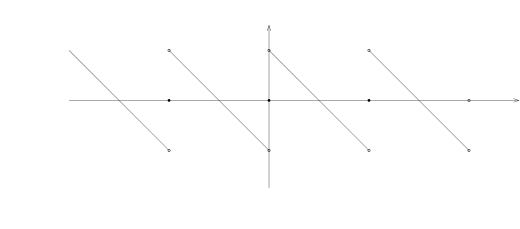
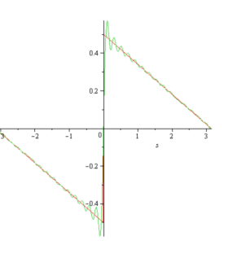

# 57.1：作业：Fourier级数几乎处处发散的L1-函数

[返回讲义目录](../../../math-analysis-lecture-notes.md) · [学期目录](../../02-math-analysis-ii.md) · [章节目录](../57-roth-theorem.md) · [校勘记录](../../errata.md) · [上一篇：Roth 定理与数学分析二期末考试](57-01-p0684-0697.md) · [下一篇：57.2：期末考试：Maass波函数的展开](57-06-p0704-0708.md)

<!-- source: PDF 698; printed: 698; transcription: first-pass; proofreading: applied -->

>

## Gibbs 现象，Fourier 级数

A1) 试构造数列 $\{\xi_k\}_{k \geqslant 1} \subset [0, 1)$，使得它在 $[0, 1)$ 上稠密却不是等分布的。

A2) 对任意的 $f, g \in L^1(\mathbf{T})$，证明，卷积在频率空间来看就是正常的乘积：
$$ \widehat{f * g}(k) = \widehat{f}(k)\widehat{g}(k). $$

A3) $f$ 是 $\mathbb{R}$ 上以 $2\pi$ 为周期的实值函数，它在 $[-\pi,\pi)$ 上是有界的单调函数。证明，存在常数 $C$，使得对任意的 $k \in \mathbb{Z}$，我们都有
$$ |\widehat{f}(k)| \leqslant \frac{C}{1 + |k|}. $$
（先证明 $[-\pi, \pi]$ 上有界的单调函数可以被形如 $\sum_{k=1}^N \alpha_k \mathbf{1}_{[a_{k-1}, a_k]}$ 的函数逼近，其中 $-\pi = a_0 < a_1 < \dots < a_N = \pi, \alpha_1 \leqslant \alpha_2 \leqslant \dots$）

A4) （Gibbs 现象）我们定义墙头草形状的以 $2\pi$ 为周期的函数 $f$，其中，当 $x \in [0, 2\pi)$ 时，我们有
$$ f(x) = \begin{cases} 0, & x = 0; \\ \frac{\pi-x}{2},&0<x<2\pi.\end{cases} $$

此时，在间断点 $0$ 处，我们有 $f_+(0) - f_-(0) = \pi$。证明，$f$ 的 Fourier 级数可以写为
$$ \sum_{k \neq 0} \frac{1}{2ik} e^{ik \cdot x} = \sum_{k=1}^\infty \frac{\sin(kx)}{k}. $$

<!-- source: PDF 699; printed: 699; transcription: first-pass; proofreading: applied -->

证明，对于部分和 $S_N(f)$，我们有
$$ \lim_{N\to\infty}\left(\max_{x\in(0,\frac\pi N]}S_N(f)(x)-\frac\pi2\right) = \int_0^\pi \frac{\sin(y)}{y} dy - \frac{\pi}{2} > 0. $$
这是分段 $C^1$ 函数在第一类间断点处 Fourier 级数部分和的典型行为，Fourier 级数部分和在间断点附近超出右极限的量，约为跳跃高度 $f_+(0)-f_-(0)=\pi$ 的 $8.9\%$。

A5) 假设 $f \in C(\mathbf{T})$，证明，级数
$$ \sum_{k\in\mathbb Z\setminus\{0\}}\frac{\widehat f(k)}k $$
是绝对收敛的。

A6) 我们定义级数
$$ S(x) = \sum_{n=1}^\infty \frac{\sin^3(nx)}{n!}. $$
证明，$S(x)$ 是 $\mathbb{R}$ 上以 $2\pi$ 为周期的光滑函数。利用
$$ A(x) = \sum_{n=1}^\infty \frac{\sin(nx)}{n!}, \quad B(x) = \sum_{n=1}^\infty \frac{\cos(nx)}{n!}, $$
证明，
$$ S(x) = \frac{3}{4} \sin(\sin(x)) e^{\cos(x)} - \frac{1}{4} \sin(\sin(3x)) e^{\cos(3x)}. $$

## 一个含参数积分的研究

B1) 证明，对任意的 $t \in \mathbb{R}$，如下积分是良好定义的：
$$ F(t) = \int_0^\infty \frac{1 + tx^5 + t^2 x^{11}}{1 + t^4 + x^{13}} dx. $$

B2) 证明，$F(t)$ 是 $t \in \mathbb{R}$ 的连续函数。

B3) 证明，$F(t)$ 是可导的。

B4) 试计算 $\lim_{t \to +\infty} F(t)$。

<!-- source: PDF 700; printed: 700; transcription: first-pass; proofreading: applied -->

B5) 证明，对 $t \neq 0$，如下的积分是发散的：
$$\int_0^\infty \frac{1 + tx^5 + t^2x^{11}}{1 + t^4 + x^{12}} dx$$

B6) 证明，对任意的 $t \in \mathbb{R}$，如下在 Riemann 意义下的反常积分是良好定义的：
$$G(t) = \int_0^\infty \frac{1 + tx^5 + t^2x^{11}}{1 + t^4 + x^{12}} e^{ix} dx,$$
即 $\lim_{T \to \infty} \int_0^T \frac{1 + tx^5 + t^2x^{11}}{1 + t^4 + x^{12}} e^{ix} dx$ 存在。

B7) 证明，$G(t)$ 是 $t \in \mathbb{R}$ 的连续函数。

B8) 试计算 $\lim_{t \to +\infty} G(t)$。

## Laplace 变换的基本性质

C1) 假设 $f(t)$ 是 $\mathbb{R}_{>0}$ 上定义的 Lebesgue 可积函数。我们定义它的 Laplace 变换为：
$$(\mathcal{L}f)(x) = \int_0^\infty f(t)e^{-xt}dt,$$
其中 $x > 0$。证明，$(\mathcal{L}f)(x)$ 是 $C^\infty$ 的函数。

C2) 证明，对任意的 $n \in \mathbb{Z}_{\geqslant 0}$，我们都有
$$\left( \frac{d}{dx} \right)^n (\mathcal{L}f)(x) = \int_0^\infty (-t)^n f(t)e^{-xt}dt.$$

C3) 假设 $f(t)$ 和 $g(t)$ 是 $\mathbb{R}_{>0}$ 上定义的 Lebesgue 可积函数，我们定义它们的“卷积”为
$$(f \bullet g)(t) = \int_0^t f(\tau)g(t - \tau)d\tau.$$
证明，$f \bullet g = g \bullet f$。

C4) 假设 $f(t)$ 和 $g(t)$ 是 $\mathbb{R}_{>0}$ 上定义的 Lebesgue 可积函数。证明，
$$\mathcal{L}(f \bullet g)(x) = (\mathcal{L}f)(x)(\mathcal{L}g)(x).$$

## 几乎处处发散函数的构造

**注记。** 1922 年，Kolmogorov（19 岁，还在莫斯科大学读本科）在论文 *Une série de Fourier-Lebesgue divergente presque partout* 中构造一个 $L^1$ 函数，这个函数的 Fourier 级数的部分和几乎处处是发散的。这个问题的目的就是重现这个著名反例的构造。

先固定一个自然数 $n \geqslant 10000$（在接下来的过程中它会变化）。我们任意选取 $n$ 个正的奇数 $1=\lambda_1<\lambda_2<\cdots<\lambda_n$（我们将在接下来的过程中确定它们的大小）。定义如下的数组，函数和区间：

<!-- source: PDF 701; printed: 701; transcription: first-pass; proofreading: applied -->

- $\{m_k\}_{1 \leqslant k \leqslant n}$。我们令 $m_1 = n$，并且归纳地定义 $2m_k + 1 = \lambda_k(2n + 1)$。
- $\{A_k\}_{1 \leqslant k \leqslant n}$，其中 $A_k = \frac{4k\pi}{2n + 1}$。
- $\phi_n(x) = \sum_{k=1}^n \frac{m_k^2}{n} \mathbf{1}_{\Delta_k}(x)$，其中区间 $\Delta_k = [A_k - m_k^{-2}, A_k + m_k^{-2}]$。
- 对于 $k = 2, 3, \cdots, n$，我们定义区间 $\sigma_k = [A_{k-1} + 2n^{-2}, A_k - 2n^{-2}]$。

根据 Dirichlet 核函数的基本性质，我们知道 Fourier 级数的部分和可以由下面的公式计算：
$$S_{m_k}\phi_n(x) = \sum_{|j| \leqslant m_k} \widehat{\phi}_n(j)e^{\sqrt{-1}jx} = \int_0^{2\pi} \phi_n(t) \frac{\sin\left(\left(m_k + \frac{1}{2}\right)(x - t)\right)}{\sin\left(\frac{1}{2}(x - t)\right)} \frac{dt}{2\pi}.$$

仿照这个形式，我们定义
$$I_{m_k, \Delta_s}(x) = \int_{\Delta_s} \frac{m_s^2}{n} \frac{\sin\left(\left(m_k + \frac{1}{2}\right)(x - t)\right)}{\sin\left(\frac{1}{2}(x - t)\right)} \frac{dt}{2\pi}$$

K1) 证明，
$$\int_0^{2\pi}\phi_n(x)\,dx=2 \text{ 并且 } S_{m_k}\phi_n(x) = \sum_{s=1}^n I_{m_k, \Delta_s}(x).$$

K2**) 证明，$\sup_{\substack{N \in \mathbb{Z}_{\geqslant 0} \\ x \in [0, 2\pi]}} |(S_N\phi_n)(x)| < \infty$。（提示：可以参考关于有界变差函数的 Fourier 级数的 Jordan 定理的证明过程）

K3*) 证明，我们可以归纳地选取正奇数 $1=\lambda_1<\lambda_2<\cdots<\lambda_n$（依次将 $\lambda_2,\ldots,\lambda_n$ 取足够大），使得区间 $\{\sigma_\ell:2\leqslant\ell\leqslant n\}\cup\{\Delta_j:1\leqslant j\leqslant n\}$ 两两不相交并且对任意的 $k \geqslant 2$ 和任意的 $x \in \sigma_k$，我们都有
$$\left| \sum_{s=1}^{k-1} I_{m_k, \Delta_s}(x) \right| \leqslant 1.$$
（提示：如果 $\lambda_1, \cdots, \lambda_{k-1}$ 已经选择好了，那么我们通过 $\lambda_k$ 的选择就可以使得 $m_k$ 足够大）

K4) 证明，Dirichlet 核函数 $D_{m_k}(x) = \begin{cases} \frac{\sin\left(\left(m_k + \frac{1}{2}\right)x\right)}{\sin\left(\frac{x}{2}\right)}, & x \neq 0; \\ 2m_k + 1, & x = 0 \end{cases}$ 满足
$$\left| D_{m_k}'(x) \right| \leqslant 2m_k^2.$$

K5) 证明，当 $s \geqslant k$ 的时候，对任意的 $x \in \sigma_k$，我们可以将 $I_{m_k, \Delta_s}(x)$ 写成
$$I_{m_k, \Delta_s}(x) = \frac{1}{n\pi} \frac{\sin\left(\left(m_k + \frac{1}{2}\right)(x - A_s)\right)}{\sin\left(\frac{1}{2}(x - A_s)\right)} + \overbrace{\int_{\Delta_s} \frac{m_s^2}{n} \left( \frac{\sin\left(\left(m_k + \frac{1}{2}\right)(x - t)\right)}{\sin\left(\frac{1}{2}(x - t)\right)} - \frac{\sin\left(\left(m_k + \frac{1}{2}\right)(x - A_s)\right)}{\sin\left(\frac{1}{2}(x - A_s)\right)} \right) \frac{dt}{2\pi}}^{I_{k,s}},$$
并且我们有如下的控制：$|I_{k,s}| \leqslant \frac{4}{n}$。

<!-- source: PDF 702; printed: 702; transcription: first-pass; proofreading: applied -->

K6) 证明，对任意的 $x \in \sigma_k$，我们都有
$$\left| \sum_{s=k}^n I_{m_k, \Delta_s}(x) \right| \geqslant \frac{\left| \sin\left(\left(m_k + \frac{1}{2}\right)(x - A_k)\right) \right|}{n\pi} \left| \sum_{s=k}^n \frac{1}{\sin\left(\frac{1}{2}(x - A_s)\right)} \right| - 4.$$

K7) 证明，对任意的 $x \in \sigma_k$，我们有
$$\frac1n\left|\sum_{s=k}^n\frac1{\sin(\frac12(x-A_s))}\right| \geqslant \frac{1}{\pi} \sum_{\ell=1}^{n-k} \frac{1}{\ell}.$$

K8) 证明，如果 $2 \leqslant k \leqslant n - \sqrt{n}$，对任意的 $x \in \sigma_k$，我们有
$$\left| \sum_{s=k}^n I_{m_k, \Delta_s}(x) \right| \geqslant \frac{\left| \sin\left(\left(m_k + \frac{1}{2}\right)(x - A_k)\right) \right|}{2\pi^2} \log(n) - 8.$$

K9) 证明，如果 $m_2$ 选取的足够大，那么如下集合的 Lebesgue 测度满足
$$m\left( \left\{ x \in [A_{k-1}, A_k] \;\middle|\; \left| \sin\left(\left(m_k + \frac{1}{2}\right)(x - A_k)\right) \right| < \frac{2\pi^2}{\sqrt{\log(n)}} \right\} \right) = O\left( \frac{1}{n\sqrt{\log(n)}} \right).$$

K10) 我们定义
$$E_n = \bigcup_{2 \leqslant k \leqslant n - \sqrt{n}} E_{n,k}, \quad \text{其中 } E_{n,k} = \left\{ x \in \sigma_k \;\middle|\; \left| \sin\left(\left(m_k + \frac{1}{2}\right)(x - A_k)\right) \right| \geqslant \frac{2\pi^2}{\sqrt{\log(n)}} \right\}$$
证明，$\lim_{n \to \infty} m(E_n) = 2\pi$。

K11) 证明，对任意的 $2 \leqslant k \leqslant n - \sqrt{n}$ 和 $x \in E_{n,k}$，我们都有
$$|S_{m_k}\phi_n(x)| \geqslant \sqrt{\log(n)} - 9.$$

K12) 证明，存在以 $2\pi$ 为周期的函数列 $\{\phi_n(x)\}_{n \geqslant 10000}$，使得

a) 对任意的 $n$，我们有 $\phi_n(x) \geqslant 0$，$\int_0^{2\pi} \phi_n = 2$ 并且 $\sup_{\substack{N \in \mathbb{Z}_{\geqslant 0}, \\ x \in [0,2\pi]}} |(S_N\phi_n)(x)| < \infty$；

b) 存在可测集合序列 $\{E_n\}_{n\geqslant10000}$，正整数序列 $\{q_n\}_{n \geqslant 10000}$ 以及单调上升的正数序列 $\{M_n\}_{n \geqslant 10000}$，使得 $\lim_{n \to \infty} M_n = \infty$，$\lim_{n \to \infty} m(E_n) = 2\pi$ 并且对任意的 $x \in E_n$，存在正整数 $N_x \leqslant q_n$，使得 $|S_{N_x}\phi_n(x)| \geqslant M_n$。

（提示：选取 $q_n = m_n$ 即可）

K13) 证明，存在以 $2\pi$ 为周期的函数列 $\{\phi_n(x)\}_{n \geqslant 1}$，可测集合序列 $\{E_n\}_{n\geqslant1}$，正整数序列 $\{q_n\}_{n \geqslant 1}$ 以及单调上升的正数序列 $\{M_n\}_{n \geqslant 1}$，使得

a) $M_1 \geqslant 2$ 并且对任意的 $n\geqslant2$，我们有 $M_n\geqslant2M_{n-1}$；

<!-- source: PDF 703; printed: 703; transcription: first-pass; proofreading: applied -->

b) 对任意的 $n$，我们有 $\phi_n(x) \geqslant 0$，$\int_0^{2\pi} \phi_n = 2$ 并且 $\sum_{1 \leqslant k \leqslant n-1} \sup_{\substack{N \in \mathbb{Z}_{\geqslant 0} \\ x \in [0,2\pi]}} |(S_N\phi_k)(x)| < \frac{\sqrt{M_n}}{2}$；

c) 对 $n\geqslant2$，$\sup_{1 \leqslant k \leqslant n-1} q_k \leqslant \frac{\sqrt{M_n}}{2^n}$；

d) $\lim_{n \to \infty} m(E_n) = 2\pi$ 并且对任意的 $x \in E_n$，存在正整数 $N_x \leqslant q_n$，使得 $|S_{N_x}\phi_n(x)| \geqslant M_n$。

（提示：选取上面的题目中的函数的子序列）

K14) 利用上一个小题的结论，我们构造
$$f(x) = \sum_{n=1}^\infty \frac{\phi_n(x)}{\sqrt{M_n}}.$$
证明，$f$ 在 $L^1([0, 2\pi])$ 中是良好定义的并且这个级数对几乎处处的 $x \in [0, 2\pi]$ 都收敛。

K15) 证明，$f(x)$ 的 Fourier 级数的部分和可以写成
$$(S_N f)(x) = \left(S_N \frac{\phi_n(x)}{\sqrt{M_n}}\right)(x) + \sum_{s \leqslant n-1} \left(S_N \frac{\phi_s(x)}{\sqrt{M_s}}\right)(x) + \sum_{s \geqslant n+1} \left(S_N \frac{\phi_s(x)}{\sqrt{M_s}}\right)(x).$$

K16) 证明，对任意的 $x \in E_n$，都存在一个 $N_x\leqslant q_n\leqslant\frac{\sqrt{M_{n+1}}}{2^{n+1}}$，使得
$$\left| \left( S_{N_x} \frac{\phi_n(x)}{\sqrt{M_n}} \right)(x) \right| \geqslant \sqrt{M_n}.$$

K17) 证明，对任意的 $N$，我们都有
$$\left| \sum_{s \leqslant n-1} \left( S_N \frac{\phi_s(x)}{\sqrt{M_s}} \right)(x) \right| \leqslant \frac{1}{2}\sqrt{M_n}.$$

K18) 证明，对 $0\leqslant N\leqslant q_n$，
$$\left| \sum_{s \geqslant n+1} \left( S_N \frac{\phi_s(x)}{\sqrt{M_s}} \right)(x) \right| \leqslant \frac{100}{2^n}.$$
（提示：把 Dirichlet 核函数用它的最大值来控制）

K19) 证明，对几乎处处的 $x \in [0, 2\pi]$，$\lim_{N \to \infty} (S_N f)(x)$ 都发散。

K20) 证明，$f \notin L^2([0, 2\pi])$。

**注记。** Lennart Carleson 在 1965 年证明了一个著名的定理，这个定理完整地解决了 Lusin 猜想：如果 $f \in L^2([0, 2\pi])$，那么 $\lim_{N \to \infty} (S_N f)(x)$ 几乎处处收敛到 $f(x)$。这一项工作是 Carleson 获得了 Wolf 奖和 Abel 奖的最主要贡献之一。Lusin 是 Kolmogorov 在莫斯科读大学时数学分析的老师。

[返回讲义目录](../../../math-analysis-lecture-notes.md) · [学期目录](../../02-math-analysis-ii.md) · [章节目录](../57-roth-theorem.md) · [校勘记录](../../errata.md) · [上一篇：Roth 定理与数学分析二期末考试](57-01-p0684-0697.md) · [下一篇：57.2：期末考试：Maass波函数的展开](57-06-p0704-0708.md)
