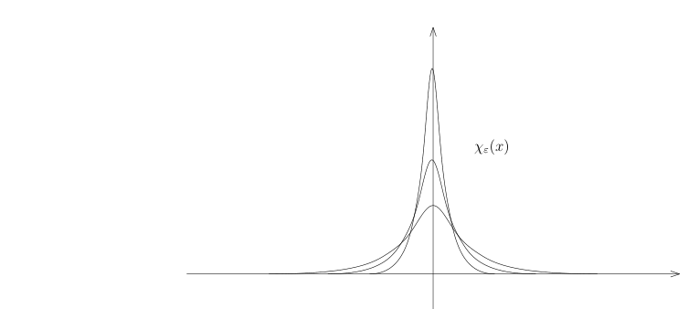

# 58 分布的定义与基本例子

[返回讲义目录](../../math-analysis-lecture-notes.md) · [学期目录](../03-math-analysis-iii.md) · [校勘记录](../errata.md) · [上一篇：数学分析三课程简介](58-00-course-overview.md) · [下一篇：分布的操作与 Stokes 公式](59-distribution-operations.md)

<!-- source: PDF 710; printed: 710; transcription: first-pass; proofreading: applied -->

## 58 分布的定义与例子：Radon 测度，局部可积函数到分布的嵌入，主值部分

分布理论是法国数学家 Laurent M. Schwartz 在上个世纪四十年代引入的，他在 1950 出版了 *Théorie des distributions* 一书总结了分布理论的精要与应用，这项工作也是他获得 1950 年 Fields 奖的核心贡献。中文分布二字是书名中 distributions 的直译，却没有说明这个理论究竟讲了什么。Schwartz 在分布理论方面的第一篇论文的题目可以解答这个疑惑：这篇文章是 *Généralisation de la notion de fonction, de dérivation, de transformation de Fourier et applications mathématiques et physiques*，即对函数、微分和 Fourier 变换的推广及在数学和物理中的应用。我们在第一学年已经详细地学习了函数、微分和 Fourier 变换，这个学期就秉承 Schwartz 的观点通过对之前概念的推广去欣赏分析学在数学和物理中的应用。

### 分布的定义与例子

如果不加说明，我们总假设 $\Omega \subset \mathbb{R}^n$ 是非空开集，其中 $n \geqslant 1$。给定紧集 $K \subset \mathbb{R}^n$，我们用 $C_K^\infty(\Omega)$ 表示 $\Omega$ 上的支集在 $K$ 中的光滑函数所组成的集合，即
$$
C_K^\infty(\Omega) = \{ f \in C^\infty(\Omega) \mid \operatorname{supp}(f) \subset K \}.
$$

给定一个多重指标 $\alpha = (\alpha_1, \dots, \alpha_n)$，其中每个分量都是非负整数，符号 $\partial^\alpha \varphi$ 表示如下多重偏导数
$$
\partial_{x_1}^{\alpha_1} \partial_{x_2}^{\alpha_2} \dots \partial_{x_n}^{\alpha_n} \varphi,
$$
其中 $\partial_{x_i}^{\alpha_i} = \frac{\partial^{\alpha_i}}{\partial x_i^{\alpha_i}}$。另外，我们令
$$
|\alpha| = \sum_{i=1}^n \alpha_i.
$$

我们用 $\mathcal{D}(\Omega) = C_0^\infty(\Omega)$ 表示在 $\Omega$ 上定义并且有紧支集的光滑函数所组成的集合，我们把它称作是试验函数空间。按照定义，对于任意的 $\varphi \in \mathcal{D}(\Omega)$，存在紧集 $K \subset \Omega$（这是 $\mathbb{R}^n$ 中的紧集），使得 $\varphi|_{\Omega - K} \equiv 0$，即对任意的 $x \in \Omega - K$，$\varphi(x) = 0$。

**定义 389** (试验函数空间). 在空间 $\mathcal{D}(\Omega)$ 上，我们规定如下的收敛性（拓扑）：给定函数序列 $\{\varphi_p\}_{p \geqslant 1} \subset \mathcal{D}(\Omega)$，所谓的该序列收敛到 $0 \in \mathcal{D}(\Omega)$（记作 $\varphi_p \xrightarrow{\mathcal{D}(\Omega)} 0$），指的是

1) 存在紧集 $K \subset \Omega$，使得对每个 $p \geqslant 1$，都有 $\operatorname{supp}(\varphi_p) \subset K$；
2) 对每个多重指标 $\alpha$，函数序列 $\{\partial^\alpha \varphi_p\}_{p \geqslant 1}$ 在 $K$ 上一致收敛到 $0$，即
$$
\lim_{p \to \infty} \|\partial^\alpha \varphi_p\|_{L^\infty(K)} = 0.
$$

<!-- source: PDF 711; printed: 711; transcription: first-pass; proofreading: applied -->

**定义 390** (分布). 所谓 $\Omega$ 上的一个分布（也称作广义函数）指的是 $\mathcal{D}(\Omega)$ 上的一个线性泛函（线性映射）：
$$
u : \mathcal{D}(\Omega) \to \mathbb{C}, \quad \varphi \mapsto \langle u, \varphi \rangle,
$$
满足如下两个条件

1) 对任意的 $\varphi, \psi \in \mathcal{D}(\Omega)$ 和 $\alpha, \beta \in \mathbb{C}$，我们有
$$
\langle u, \alpha\varphi + \beta\psi \rangle = \alpha \langle u, \varphi \rangle + \beta \langle u, \psi \rangle.
$$

2) 对任意的紧集 $K \subset \Omega$，存在非负整数 $p$ 和正常数 $C$（$p$ 和 $C$ 依赖于 $K$），使得对任意的 $\varphi \in C_K^\infty(\Omega)$，都有
$$
|\langle u, \varphi \rangle| \leqslant C \sup_{|\alpha| \leqslant p} \|\partial^\alpha \varphi\|_{L^\infty(K)}.
$$
如果上述的 $p$ 的选取不依赖于紧集 $K$ 的选取，那么，我们就把最小的这样的非负整数 $p$ 称作是分布 $u$ 的阶。

我们用 $\mathcal{D}'(\Omega)$ 表示在 $\Omega$ 上定义的分布的全体，并规定如下的收敛性（拓扑）：所谓的分布序列 $\{u_p\}_{p \geqslant 1} \subset \mathcal{D}'(\Omega)$ 在分布的意义下收敛到 $0 \in \mathcal{D}'(\Omega)$（这是把所有函数映射成 $0$ 的线性映射），记作 $u_p \xrightarrow{\mathcal{D}'(\Omega)} 0$，指的是对任意的试验函数 $\varphi \in \mathcal{D}(\Omega)$，我们都有
$$
\lim_{p \to \infty} \langle u_p, \varphi \rangle = 0.
$$

我们通常说一个分布可以和一个（有紧支集的）光滑函数配对得到一个数，即
$$
\mathcal{D}'(\Omega) \times \mathcal{D}(\Omega), \quad (u, \varphi) \mapsto \langle u, \varphi \rangle.
$$

**注记.** 任意给定分布 $u \in \mathcal{D}'(\Omega)$，它实际上是 $\mathcal{D}(\Omega)$ 上的连续线性泛函。我们没有详细讨论和分布有关的拓扑线性空间的理论，所以我们不打算对这一点做太多的展开（这对于理解分布理论也没有影响）。所谓的连续性，可以用下面的序列的语言来描述：对任意的试验函数序列 $\varphi_p \xrightarrow{\mathcal{D}} 0$，我们都有
$$
\lim_{p \to \infty} \langle u, \varphi_p \rangle = 0.
$$
这个命题的证明只需要用到分布概念，我们把它留作作业。

作为例子，我们先学习一些重要的分布：

**例子** (Dirac 函数). 对任意的 $a \in \Omega$，我们可以定义分布 $\delta_a \in \mathcal{D}'(\Omega)$。其中，对于任意的 $\varphi \in \mathcal{D}(\Omega)$，我们定义
$$
\langle \delta_a, \varphi \rangle = \varphi(a).
$$
我们来验证 $\delta_a$ 实际上是分布：
对任意的紧集 $K \subset \Omega$，如果 $a \notin K$，那么，对任意的 $\varphi \in C_K^\infty(\Omega)$，我们都有
$$
\langle \delta_a, \varphi \rangle = 0.
$$

<!-- source: PDF 712; printed: 712; transcription: first-pass; proofreading: applied -->

如果 $a \in K$，那么，使得对任意的 $\varphi \in C_K^\infty(\Omega)$，我们有
$$
|\langle \delta_a, \varphi \rangle| = |\varphi(a)| \leqslant 1 \cdot \sup_{|\alpha| \leqslant 0} \|\partial^\alpha \varphi\|_{L^\infty(K)}.
$$
所以，我们在分布的定义中取 $p = 0$, $C = 1$ 即可。
特别地，我们还知道 $\delta_a$ 的阶为 $0$。

**例子** (局部可积的函数). 给定开集 $\Omega$（总是装配了 Borel 代数和 Lebesgue 测度），所谓局部可积的函数指的是在每个紧的局部上都可积的函数，即可测函数 $f$（所对应的几乎处处相等的函数的等价类），对于任意紧集 $K \subset \Omega$，函数 $f \cdot 1_K \in L^1(\Omega)$。我们用 $L_{\operatorname{loc}}^1(\Omega)$ 表示 $\Omega$ 上局部可积的函数。
对于任意的 $f \in L_{\operatorname{loc}}^1(\Omega)$，我们定义 $\mathcal{D}(\Omega)$ 上的线性泛函：
$$
T_f : \mathcal{D}(\Omega) \to \mathbb{C}, \quad \varphi \mapsto \langle T_f, \varphi \rangle = \int_\Omega f(x)\varphi(x) dx.
$$
由于 $\varphi$ 在它的支集 $K$ 上有界，所以，上面的积分是良好定义的。我们证明 $T_f$ 是 $\Omega$ 上的阶为 $0$ 的分布：对任意的紧集 $K \subset \Omega$，对任意的 $\varphi \in C_K^\infty(\Omega)$，我们有
$$
|\langle T_f, \varphi \rangle| = \left| \int_K f(x)\varphi(x) dx \right| \leqslant \|f\|_{L^1(K)} \|\varphi\|_{L^\infty(K)}.
$$
所以，我们在分布的定义中取 $p = 0$, $C = 1+\|f\|_{L^1(K)}$ 即可。

**注记.** 为了方便起见，我们通常把 $\langle T_f, \varphi \rangle$ 直接写成 $\langle f, \varphi \rangle$。

**命题 391.** 任意选定 $\chi(x) \in \mathcal{D}(\mathbb{R}^n)$（我们通常偏爱之前所构造的那个 $\chi(x)$），我们假定
$$
\int_{\mathbb{R}^n} \chi(x) dx = 1.
$$
对任意的 $\varepsilon > 0$，我们定义
$$
\chi_\varepsilon(x) = \frac{1}{\varepsilon^n} \chi\left(\frac{x}{\varepsilon}\right).
$$
那么，在分布的意义下，当 $\varepsilon \to 0$ 时，我们有 $\chi_\varepsilon \xrightarrow{\mathcal{D}'} \delta_0$。

<!-- source: PDF 713; printed: 713; transcription: first-pass; proofreading: applied -->

**注记.** 由于 $\chi_\varepsilon$ 是局部可积的（因为在紧集上有最大最小值），我们通过
$$
\int \chi_\varepsilon(x) \varphi(x) dx
$$
把 $\chi_\varepsilon$ 视作分布，请参考上一个例子（之后不再重复）。

**证明:** 通过换元积分公式，我们知道对任意的 $\varepsilon > 0$，我们都有
$$
\int_{\mathbb{R}^n} \chi_\varepsilon(x) dx = \int_{\mathbb{R}^n} \chi(x) dx, \quad \int_{\mathbb{R}^n} |\chi_\varepsilon(x)| dx = \int_{\mathbb{R}^n} |\chi(x)| dx.
$$
任意选定试验函数 $\varphi$，我们要证明
$$
\lim_{\varepsilon \to 0} \langle \chi_\varepsilon - \delta_0, \varphi \rangle = 0.
$$
利用 $\int_{\mathbb{R}^n} \chi_\varepsilon(x) dx = 1$，我们有
$$
\begin{aligned}
\langle \chi_\varepsilon - \delta_0, \varphi \rangle &= \int_{\mathbb{R}^n} \chi_\varepsilon(x)\varphi(x) dx - \varphi(0) = \int_{\mathbb{R}^n} \chi_\varepsilon(x)(\varphi(x) - \varphi(0)) dx \\
&= \underbrace{\int_{|x| \leqslant \delta} \chi_\varepsilon(x)(\varphi(x) - \varphi(0)) dx}_{\mathbf{I}_1} + \underbrace{\int_{|x| \geqslant \delta} \chi_\varepsilon(x)(\varphi(x) - \varphi(0)) dx}_{\mathbf{I}_2}
\end{aligned}
$$
对于 $\mathbf{I}_1$ 而言，当 $\delta \to 0$ 时，$\sup_{|x|\leqslant\delta}|\varphi(x)-\varphi(0)|\to0$。因此对任意的 $\varepsilon>0$，我们都有如下估计
$$
|\mathbf{I}_1| \leqslant \sup_{|x|\leqslant\delta}|\varphi(x)-\varphi(0)| \int_{|x| \leqslant \delta} |\chi_\varepsilon(x)| dx \leqslant \sup_{|x|\leqslant\delta}|\varphi(x)-\varphi(0)| \|\chi\|_{L^1}.
$$
所以，可以先选 $\delta$，使得
$$
|\mathbf{I}_1| \leqslant \eta,
$$
其中，$\eta$ 是任意给定的正实数。对于 $\mathbf{I}_2$，现在已经固定了 $\delta$，我们有
$$
\begin{aligned}
|\mathbf{I}_2| &\leqslant 2\|\varphi\|_{L^\infty} \int_{|x| \geqslant \delta} |\chi_\varepsilon(x)| dx = 2\|\varphi\|_{L^\infty} \int_{|x| \geqslant \frac{\delta}{\varepsilon}} |\chi(x)| dx \\
&= 2\|\varphi\|_{L^\infty} \int_{\mathbb{R}^n} |\chi(x)| \mathbf{1}_{|x| \geqslant \frac{\delta}{\varepsilon}} dx.
\end{aligned}
$$
由于当 $\varepsilon \to 0$ 时，$|\chi(x)| \mathbf{1}_{|x| \geqslant \frac{\delta}{\varepsilon}}$ 是逐点收敛到 $0$ 的，所以，根据 Lebesgue 控制收敛定理，
$$
\lim_{\varepsilon \to 0} \mathbf{I}_2 = 0.
$$
特别地，对足够小的 $\varepsilon > 0$，我们就有
$$
|\mathbf{I}_2| \leqslant \eta.
$$
这表明，
$$
|\mathbf{I}_1 + \mathbf{I}_2| \leqslant |\mathbf{I}_1|+|\mathbf{I}_2| \leqslant 2\eta.
$$
从而命题成立。 $\quad \square$

<!-- source: PDF 714; printed: 714; transcription: first-pass; proofreading: applied -->

**例子** (*Radon* 测度). 假设 $\mu$ 是 $(\Omega, \mathcal{B}(\Omega))$ 上的测度, 其中, $\Omega \subset \mathbb{R}^n$ 是开集, $\mathcal{B}(\Omega)$ 是 Borel 代数 (包含所有开集的最小 $\sigma$-代数)。如果每个紧集 $K \subset \Omega$, $\mu(K) < \infty$, 我们就把这种测度称作是一个 *Radon 测度*。

比如说, 对任意的正函数 (几乎处处) $f \in L^1_{\mathrm{loc}}(\Omega)$, 对任意的 $B \in \mathcal{B}(\Omega)$, 我们可以定义
$$
\mu_f(B) = \int_{\Omega} \mathbf{1}_B \cdot f(x) dx.
$$
这就是一个 *Radon 测度*。

任意给定一个 *Radon 测度* $\mu$, 我们可以定义一个分布 $T_\mu$: 对于 $\varphi \in \mathcal{D}(\Omega)$, 我们要求
$$
\langle T_\mu, \varphi \rangle = \int_{\Omega} \varphi(x) d\mu(x).
$$
我们证明 $T_\mu$ 是 $\Omega$ 上阶为 0 的分布:

对任意的紧集 $K \subset \Omega$, 对任意的 $\varphi \in C_K^\infty(\Omega)$, 我们有
$$
\begin{aligned}
|\langle T_\mu, \varphi \rangle| &= \left| \int_K \varphi(x) d\mu(x) \right| \\
&\leqslant \mu(K) \|\varphi\|_{L^\infty(K)}.
\end{aligned}
$$
所以, 我们在分布的定义中取 $p = 0$, $C = 1+\mu(K)$ 即可。

特别地, 我们可以把 $L^1_{\mathrm{loc}}(\Omega)$ 中的元素看作是某个局部有限的复 *Radon 测度* 的密度函数, 从而, 定义出了同样的分布。

**注记**. 利用所谓的 *Riesz 表示定理*, 我们可以证明, $\Omega$ 上所有的 0 阶分布都由复 *Radon 测度* 给出，其全变差在每个紧集上有限。

我们自然还有阶非零的分布, 比如说, 我们可以定义 $\mathcal{D}(\mathbb{R})$ 上的线性泛函:
$$
\langle \delta', \varphi \rangle = -\varphi'(0),
$$
和
$$
\langle u, \varphi \rangle = \sum_{k=0}^\infty \varphi^{(k)}(k).
$$
我们将在作业题中证明两个定义给出了分布, 第一个的阶为 1, 而第二个的阶不能定义 (无穷大)。

**命题 392** (局部可积的函数). 给定开集 $\Omega \subset \mathbb{R}^n$, 我们已经定义如下的线性映射 (把局部可积函数视为分布)
$$
T : L^1_{\mathrm{loc}}(\Omega) \to \mathcal{D}'(\Omega), \quad f \mapsto T_f.
$$
这是单射。

**注记**. 根据这个命题, 局部可积的函数可以看做是分布的子集合。在分析中, 我们把 $L^1_{\mathrm{loc}}(\Omega)$ 的元素称作是 $\Omega$ 上的“函数”(这个类已经足够大了), 由于某些分布不是“函数”, 所以我们也经常把分布称作是“广义函数”。我们在课程中不使用这个名称。

<!-- source: PDF 715; printed: 715; transcription: first-pass; proofreading: applied -->

**证明**: 假设 $T_f \overset{\mathcal{D}'}{=} 0$, 即对任意的 $\varphi \in \mathcal{D}(\Omega)$, 我们都有
$$
\int_\Omega f(x) \varphi(x) dx = 0,
$$
我们要说明 $f = 0$ (几乎处处)。为此, 只需要说明对每个紧集 $K \subset \Omega$, 我们都有 $\left. f \right|_K = 0$ (几乎处处) 即可。

我们定义函数
$$
\varphi_K(x) = \begin{cases} \frac{\overline{f(x)}}{|f(x)|} \mathbf{1}_K(x), & \text{如果 } f(x) \neq 0; \\ 0, & \text{如果 } f(x) = 0. \end{cases}
$$
这是一个有紧支集 $K$ 的函数。在本证明中，取 $\chi$ 为满足 $\int\chi=1$、$\operatorname{supp}\chi\subset\overline{B(0,1)}$ 且 $\chi(-x)=\chi(x)$ 的光滑函数。当 $\varepsilon$ 较小时, $\chi_\varepsilon * \varphi_K$ 的支集仍然在 $\Omega$ 中: 按照卷积的定义, 对任意的 $x \in \operatorname{supp}(\chi_\varepsilon * \varphi_K)$, 这个点距离 $K$ 的不超过 $\varepsilon$, 然而, 距离 $K$ 的不超过 $\varepsilon$ 点是在 $\Omega$ 中的 (利用紧性)。特别地, 我们得到一个试验函数 $\chi_\varepsilon * \varphi_K \in \mathcal{D}(\Omega)$, 从而
$$
\langle T_f, \chi_\varepsilon * \varphi_K \rangle = 0.
$$
我们令 $\varepsilon < \delta$ 并且要求距离 $K$ 的不超过 $\varepsilon$ 点都落在 $\Omega$ 中。我们令
$$
K + B(\delta) = \{ x + y \mid x \in K, |y| \leqslant \delta \}.
$$
根据定义, 我们就有
$$
\begin{aligned}
0 &= \int_\Omega f(x) (\chi_\varepsilon * \varphi_K)(x) dx = \int_{\mathbb{R}^n} f(x) (\chi_\varepsilon * \varphi_K)(x) dx \\
&= \int_{\mathbb{R}^n} (f \cdot \mathbf{1}_{K+B(\delta)}) (\chi_\varepsilon * \varphi_K) dx \\
&\overset{\text{Fubini}}{=} \iint_{\mathbb{R}^n \times \mathbb{R}^n} (f(x) \mathbf{1}_{K+B(\delta)}(x)) \chi_\varepsilon(x-y) \varphi_K(y) dxdy \\
&\overset{\text{Fubini}}{=} \int_{\mathbb{R}^n} \left( \int_{\mathbb{R}^n} (f(x) \mathbf{1}_{K+B(\delta)}(x)) \chi_\varepsilon(x-y) dx \right) \varphi_K(y) dy \\
&= \int_{\mathbb{R}^n} ((f \mathbf{1}_{K+B(\delta)}) * \chi_\varepsilon)(y) \varphi_K(y) dy.
\end{aligned}
$$
然而, 我们上个学期证明过 $(f \mathbf{1}_{K+B(\delta)}) * \chi_\varepsilon \xrightarrow{L^1} f \mathbf{1}_{K+B(\delta)}$, 从而 (由于 $\varphi_K(y)$ 有界) 当 $\varepsilon \to 0$, 我们有
$$
\begin{aligned}
0 &= \lim_{\varepsilon \to 0} \langle T_f, \chi_\varepsilon * \varphi_K \rangle \\
&= \int_{\mathbb{R}^n} (f \mathbf{1}_{K+B(\delta)})(y) \varphi_K(y) dy = \int_K |f(y)| dy.
\end{aligned}
$$
所以对几乎处处的 $x \in K$, 我们有 $f(x) = 0$, 命题得证。 \hfill $\square$

**例子** ($\frac{1}{x}$ 的主值部分). 我们注意到
$$
\frac{1}{x} \notin L^1_{\mathrm{loc}}(\mathbb{R}).
$$

<!-- source: PDF 716; printed: 716; transcription: first-pass; proofreading: applied -->

这是因为我们不能在 0 附近对 $x^{-1}$ 积分 (积出来无穷大)。所以, 我们不能通过直接与试验函数配对积分的方式定义一个分布。我们想用取极限 (逼近) 的方式来定义: 对任意的 $n \geqslant 1$, 我们显然有
$$
\frac{1}{x} \mathbf{1}_{|x| \geqslant \frac{1}{n}}(x) \in L^1_{\mathrm{loc}}(\mathbb{R}).
$$
作为分布, 我们就有
$$
\begin{aligned}
\left\langle \frac{1}{x} \mathbf{1}_{|x| \geqslant \frac{1}{n}}, \varphi \right\rangle &= \int_{-\infty}^{-\frac{1}{n}} \frac{\varphi(x)}{x} dx + \int_{\frac{1}{n}}^\infty \frac{\varphi(x)}{x} dx \\
&= \int_{\frac{1}{n}}^\infty \frac{\varphi(x) - \varphi(-x)}{x} dx.
\end{aligned}
$$
其中, $\varphi$ 是 $\mathbb{R}$ 上的一个试验函数。

我们现在有个简单但是重要的观察:
$$
\left. \varphi(x) - \varphi(-x) \right|_{x=0} = 0.
$$
根据下面的引理 (证明参考第一次作业)

**引理 393**. 假设 $\psi(x) \in C^\infty(\mathbb{R})$ 并且 $\psi(0) = 0$, 那么, $\frac{\psi(x)}{x}$ 也是光滑函数。

所以 $\frac{\varphi(x) - \varphi(-x)}{x}$ 是光滑函数 (自然是局部可积的)。从而, 当 $n \to \infty$ 时, 上述积分的极限存在:
$$
\lim_{n \to \infty} \int_{\frac{1}{n}}^\infty \frac{\varphi(x) - \varphi(-x)}{x} dx = \int_0^\infty \frac{\varphi(x) - \varphi(-x)}{x} dx.
$$
我们现在定义
$$
\left\langle \mathrm{vp}\frac{1}{x}, \varphi \right\rangle = \int_0^\infty \frac{\varphi(x) - \varphi(-x)}{x} dx.
$$
为了证明这是分布, 我们利用 Newton-Leibniz 公式: 对任意的紧集 $K = [-M, M] \subset \mathbb{R}$, 对任意的支集在 $K$ 上的光滑函数 $\varphi$, 我们有
$$
|\varphi(x) - \varphi(-x)| = \left|\int_{-x}^{x}\varphi'(t)\,dt\right| \leqslant 2 \|\varphi'\|_{L^\infty(K)} |x|.
$$
所以,
$$
\left| \left\langle \mathrm{vp}\frac{1}{x}, \varphi \right\rangle \right| \leqslant \int_0^M 2 \|\varphi'\|_{L^\infty(K)} dx = 2M \|\varphi'\|_{L^\infty(K)}.
$$
所以 $\mathrm{vp}\frac{1}{x}$ 是一个阶不超过 1 的分布。在作业中, 我们将证明 $\mathrm{vp}\frac{1}{x}$ 的阶恰好是 1。

另外, $\mathrm{vp}$ 是法语 *valeur principale* 的缩略, 英文文献经常用 $\mathrm{pv}\frac{1}{x}$, 因为他们把主值写为 *principal value*。

[返回讲义目录](../../math-analysis-lecture-notes.md) · [学期目录](../03-math-analysis-iii.md) · [校勘记录](../errata.md) · [上一篇：数学分析三课程简介](58-00-course-overview.md) · [下一篇：分布的操作与 Stokes 公式](59-distribution-operations.md)
