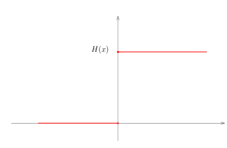
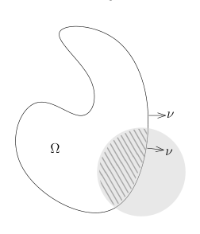

# 59：分布的操作与 Stokes 公式

[返回讲义目录](../../math-analysis-lecture-notes.md) · [学期目录](../03-math-analysis-iii.md) · [校勘记录](../errata.md) · [上一篇：分布的定义与基本例子](58-distributions.md) · [下一篇：跳跃公式、Cauchy 积分与单位分解](60-jump-cauchy.md)

<!-- source: PDF 717; printed: 717; transcription: first-pass; proofreading: applied -->

## 分布的操作

在微积分的学习中，我们可以对一个函数做特定的操作，比如可以把一个函数限制到比较小的定义域上、可以对一个函数求导数、两个函数可以相乘等等。我们现在讨论如何对分布做一些特定的操作。

### 分布的限制

假设 $\Omega' \subset \Omega$ 是开子集，那么，我们可以定义限制映射

$$\operatorname{Res} : \mathcal{D}'(\Omega) \to \mathcal{D}'(\Omega'), u \mapsto \operatorname{Res}(u).$$

其中，对于每个 $\varphi \in \mathcal{D}(\Omega')$，它自然可以看作是 $\mathcal{D}(\Omega)$ 中的元素，从而，我们可以要求

$$\langle \operatorname{Res}(u), \varphi \rangle = \langle u, \varphi \rangle.$$

为了方便起见，除了个别场合，我们总是用 $u$ 来直接表示 $\operatorname{Res}(u)$。

### 求偏导数

我们先考虑一个足够光滑的函数，比如说，$u \in C^1(\mathbb{R})$。$u$ 和 $u'$ 都是局部可积分的函数，我们可以把它们视作分布。通过分部积分，我们有

$$\begin{aligned}
\langle u', \varphi \rangle &= \int_{\mathbb{R}} u'(x)\varphi(x)dx = -\int_{\mathbb{R}} u(x)\varphi'(x)dx \\
&= -\langle u, \varphi' \rangle.
\end{aligned}$$

这个计算启发我们对于 $u \in \mathcal{D}'(\mathbb{R})$，我们可以用下面的等式来定义它的导数：

$$\langle u', \varphi \rangle := -\langle u, \varphi' \rangle.$$

**定义 394**。假设 $\Omega \subset \mathbb{R}^n$ 是有界开集，给定 $u \in \mathcal{D}'(\Omega)$，对于任意的多重指标 $\alpha$，我们定义

$$\langle \partial^\alpha u, \varphi \rangle = (-1)^{|\alpha|}\langle u, \partial^\alpha \varphi \rangle.$$

<!-- source: PDF 718; printed: 718; transcription: first-pass; proofreading: applied -->

我们必须说明 $\partial^\alpha u$ 定义了 $\Omega$ 上的分布：根据分布的定义，对任意的紧集 $K \subset \Omega$，存在非负整数 $p$ 和正常数 $C$（$p$ 和 $C$ 依赖于 $K$），使得对任意的 $\varphi \in C_K^\infty(\Omega)$，都有

$$\begin{aligned}
|\langle \partial^\alpha u, \varphi \rangle| &= |\langle u, \partial^\alpha \varphi \rangle| \\
&\leqslant C \sup_{|\beta| \leqslant p} \|\partial^\beta \partial^\alpha \varphi\|_{L^\infty(K)} \\
&\leqslant C \sup_{|\gamma| \leqslant p+|\alpha|} \|\partial^\gamma \varphi\|_{L^\infty(K)}
\end{aligned}$$

这表明我们对任意的分布都可以求导数，即对任意的多重指标 $\alpha$，我们有（连续）线性映射：

$$\partial^\alpha : \mathcal{D}'(\Omega) \to \mathcal{D}'(\Omega).$$

我们研究两个经典的例子：

**例子**（Heaviside 函数）。我们定义 Heaviside 函数

$$H(x) = \mathbf{1}_{x \geqslant 0}.$$

直观上，这个函数在 $0$ 之外的导数是 $0$，在 $0$ 处函数有很大的跳跃，导数应该是无穷大。我们证明

$$H(x)' = \delta_0.$$

按照定义，我们有

$$\begin{aligned}
\langle H'(x), \varphi(x) \rangle &= -\langle H(x), \varphi'(x) \rangle = -\int_0^\infty \varphi'(x) dx \\
&= -(\varphi(\infty) - \varphi(0)) = \varphi(0) \\
&= \langle \delta_0, \varphi \rangle.
\end{aligned}$$

**例子**。我们考虑 $\mathbb{R}$ 上的 $\log$ 函数，注意到

$$\log |x| \in L_{\text{loc}}^1(\mathbb{R}).$$

我们证明，作为分布，有

$$\left( \log |x| \right)' \overset{\mathcal{D}'}{=} \operatorname{vp}\frac{1}{x}.$$

<!-- source: PDF 719; printed: 719; transcription: first-pass; proofreading: applied -->

实际上，

$$\begin{aligned}
\langle (\log |x|)', \varphi \rangle &= -\lim_{\varepsilon \to 0} \left( \int_{-\infty}^{-\varepsilon} \varphi' \log |x| dx + \int_{\varepsilon}^\infty \varphi' \log |x| dx \right) \\
&= \lim_{\varepsilon \to 0} \left( -\varphi(-\varepsilon) \log(\varepsilon) + \int_{-\infty}^{-\varepsilon} \frac{1}{x} \varphi dx + \varphi(\varepsilon) \log(\varepsilon) + \int_{\varepsilon}^\infty \frac{1}{x} \varphi dx \right).
\end{aligned}$$

我们注意到

$$\varphi(-\varepsilon) - \varphi(\varepsilon) = O(\varepsilon).$$

所以，

$$\lim_{\varepsilon \to 0} \varphi(-\varepsilon) \log(\varepsilon) - \varphi(\varepsilon) \log(\varepsilon) = 0.$$

从而，

$$\begin{aligned}
\langle (\log |x|)', \varphi \rangle &= \lim_{\varepsilon \to 0} \left( \int_{-\infty}^{-\varepsilon} \frac{1}{x} \varphi dx + \int_{\varepsilon}^\infty \frac{1}{x} \varphi dx \right) \\
&= \langle \operatorname{vp}\frac{1}{x}, \varphi \rangle.
\end{aligned}$$

**例子**。我们计算 $\mathbb{R}$ 上的 Dirac 函数 $\delta_a$ 的导数，其中 $a \in \mathbb{R}$。任给 $\varphi \in \mathcal{D}(\mathbb{R})$，我们有

$$\langle \delta'_a, \varphi \rangle = -\langle \delta_a, \varphi' \rangle = -\varphi'(a).$$

### $C^\infty(\Omega)$-模结构

对光滑函数 $f \in C^\infty(\Omega)$ 和分布 $u \in \mathcal{D}'(\Omega)$，我们可以定义它们的乘积 $f \cdot u$：

$$\langle f \cdot u, \varphi \rangle := \langle u, f\varphi \rangle.$$

其中，$\varphi$ 是试验函数。由于 $f\varphi$ 仍然是 $\mathcal{D}(\Omega)$ 中的函数，所以上面的等式是良好定义的。为了说明 $f \cdot u \in \mathcal{D}'(\Omega)$，要对 $u$ 来用分布的定义：对任意的紧集 $K \subset \Omega$，存在非负整数 $p$ 和正常数 $C$（$p$ 和 $C$ 依赖于 $K$），使得对任意的 $\varphi \in C_K^\infty(\Omega)$，都有

$$|\langle f \cdot u, \varphi \rangle| \leqslant C \sup_{|\alpha| \leqslant p} \|\partial^\alpha(f \cdot \varphi)\|_{L^\infty(K)}.$$

根据 Leibniz 法则，我们有

$$\partial^\alpha(f \cdot \varphi) = \sum_{\beta+\gamma=\alpha} \binom{\alpha}{\beta}\partial^\beta f \cdot \partial^\gamma \varphi.$$

所以，

$$\begin{aligned}
|\langle f \cdot u, \varphi \rangle| &\leqslant C \sup_{|\alpha| \leqslant p} \sum_{\beta+\gamma=\alpha} \binom{\alpha}{\beta}\|\partial^\beta f\|_{L^\infty(K)} \|\partial^\gamma \varphi\|_{L^\infty(K)} \\
&\leqslant C 2^p\underbrace{\sum_{|\beta| \leqslant p} \|\partial^\beta f\|_{L^\infty(K)}}_{\text{新的常数 } C'} \times \sup_{|\gamma| \leqslant p} \|\partial^\gamma \varphi\|_{L^\infty(K)}.
\end{aligned}$$

这表明 $f \cdot u \in \mathcal{D}'(\Omega)$。

<!-- source: PDF 720; printed: 720; transcription: first-pass; proofreading: applied -->

**例子**。我们有

$$x \cdot \operatorname{vp}\frac{1}{x} = 1.$$

对任意的 $\varphi \in \mathcal{D}(\mathbb{R})$，我们知道 $\left. x\varphi(x) \right|_{x=0} = 0$。根据第一次作业题的 A6)，我们有

$$\langle x \cdot \operatorname{vp}\frac{1}{x}, \varphi \rangle = \langle \operatorname{vp}\frac{1}{x}, x\varphi \rangle$$

$$=\int_{\mathbb{R}} \frac{1}{x} \cdot x\varphi(x) dx = \int_{\mathbb{R}} 1 \cdot \varphi(x) dx.$$

这就证明了命题。

### 分布的平移

对于 $x_0 \in \mathbb{R}^n$，我们有如下的平移变换：

$$\tau_{x_0} : \mathbb{R}^n \to \mathbb{R}^n, \quad x \mapsto x + x_0.$$

对于局部可积的函数 $f \in L_{\text{loc}}^1(\mathbb{R}^n)$，我们可以定义（这是一种特殊的变量替换）：

$$(\tau_{x_0}f)(x) = f(x + x_0).$$

如果将 $f$ 视为是分布，对于试验函数 $\varphi$ 而言，我们有

$$\begin{aligned}
\langle f(x + x_0), \varphi(x) \rangle &= \int_{\mathbb{R}^n} f(x + x_0)\varphi(x)dx = \int_{\mathbb{R}^n} f(x)\varphi(x - x_0)dx \\
&= \langle f(x), \varphi(x - x_0) \rangle = \langle f(x), \tau_{-x_0}\varphi \rangle.
\end{aligned}$$

对于一般的分布 $u \in \mathcal{D}'(\mathbb{R}^n)$，$x_0 \in \mathbb{R}^n$，我们定义

$$\langle \tau_{x_0}u, \varphi \rangle := \langle u, \varphi(x - x_0) \rangle.$$

容易验证，$\tau_{x_0}u$ 给出了一个分布。实际上，我们稍后在进行变量替换的时候，也会给出这个命题的证明。

下面的命题给出了在分布意义下方向导数的另一个（直观）刻画：

**命题 395**。给定分布 $u \in \mathcal{D}'(\mathbb{R}^n)$，给定向量 $v = (v_1, \dots, v_n) \in \mathbb{R}^n$，在分布意义下，我们有

$$\lim_{t \to 0} \frac{\tau_{tv}u - u}{t} \overset{\mathcal{D}'}{=} \sum_{j=1}^n v_j \partial_j u.$$

**证明：** 按照定义，我们有

$$\langle \frac{\tau_{tv}u - u}{t} - \sum_{j=1}^n v_j \partial_j u, \varphi \rangle = \langle u, \underbrace{\frac{\varphi(x - tv) - \varphi(x)}{t} + \sum_{j=1}^n v_j \partial_j \varphi(x)}_{\varphi_t} \rangle.$$

<!-- source: PDF 721; printed: 721; transcription: first-pass; proofreading: applied -->

根据带有积分余项的 Taylor 展开，我们有
$$
\varphi_t(x) = -\sum_{j=1}^n \int_0^1 v_j \left( \partial_j \varphi(x - tsv) - \partial_j \varphi(x) \right) ds.
$$

当 $|t|\leqslant1$ 时，上述函数 $\varphi_t(x)$ 的支集均包含于同一个紧集 $\operatorname{supp}\varphi+\overline{B(0,|v|)}$，从而第一个等式的右边是良好定义的。我们来证明在 $\mathcal{D}(\mathbb{R}^n)$ 中，上述 $\varphi_t(x)$ 的极限是 0，也就是说对任意的多重指标 $\alpha$，我们有 $\partial^\alpha \varphi_t(x) \xrightarrow{L^\infty} 0$：根据 Lebesgue 控制收敛定理（的推论，积分与求导数可交换，请参考上学期笔记），我们有
$$
\|\partial^\alpha \varphi_t(x)\|_{L^\infty} = \left\| \sum_{j=1}^n \int_0^1 v_j \left( \partial_j \partial^\alpha \varphi \left(x - tsv\right) - \partial_j \partial^\alpha \varphi(x) \right) ds \right\|_{L^\infty}
$$
$$
\leqslant |t|\sum_{j,k=1}^n |v_jv_k|\|\partial_k\partial_j\partial^\alpha\varphi\|_{L^\infty}.
$$

其中，最后一步利用沿线段的 Newton-Leibniz 公式。右边是一个固定常数乘以 $|t|$，所以当 $t\to0$ 时趋于 $0$。命题得证。

### 微分同胚与分布的拉回

给定 $\mathbb{R}^n$ 的两个开集 $\Omega_1$ 和 $\Omega_2$，我们假定
$$
\Phi : \Omega_1 \to \Omega_2
$$
是微分同胚。对任意一个 $\Omega_2$ 上的局部可积的函数 $f$ 和 $\Omega_1$ 上的试验函数 $\varphi$，根据换元积分公式，我们有
$$
\begin{aligned}
\langle \Phi^* f, \varphi(x) \rangle &= \int_{\Omega_1} f(\Phi(x))\varphi(x)dx = \int_{\Omega_2} f(y)\varphi(\Phi^{-1}(y))|J_{\Phi^{-1}}(y)|dy \\
&= \int_{\Omega_2} f(y) \frac{\varphi(\Phi^{-1}(y))}{|J_\Phi(\Phi^{-1}(y))|}dy \\
&= \left\langle f, \frac{\varphi(\Phi^{-1}(y))}{|J_\Phi(\Phi^{-1}(y))|} \right\rangle.
\end{aligned}
$$

根据这个计算，我们定义：
$$
\Phi^* : \mathcal{D}'(\Omega_2) \to \mathcal{D}'(\Omega_1), \quad u \mapsto \Phi^* u.
$$
其中，对于 $u \in \mathcal{D}'(\Omega_2)$ 和 $\varphi \in \mathcal{D}(\Omega_1)$，我们定义 $\Phi^* u$ 如下：
$$
\langle \Phi^* u, \varphi(x) \rangle := \langle u, \varphi(\Phi^{-1}(y))|J_{\Phi^{-1}}(y)| \rangle = \left\langle u, \frac{\varphi(\Phi^{-1}(y))}{|J_\Phi(\Phi^{-1}(y))|} \right\rangle.
$$

为了证明 $\Phi^* u$ 的确定义了 $\Omega_1$ 上的一个分布，我们利用定义：对任意的紧集 $K \subset \Omega_1$，令 $H=\Phi(K)\subset\Omega_2$。由 $u$ 的分布估计，存在非负整数 $p$ 和正常数 $C$（依赖于 $H$），使得对任意的 $\varphi \in C_K^\infty(\Omega_1)$，都有
$$
|\langle \Phi^* u, \varphi \rangle| \leqslant C \sup_{|\alpha| \leqslant p} \left\| \partial^\alpha \left( \frac{\varphi(\Phi^{-1}(y))}{|J_\Phi(\Phi^{-1}(y))|} \right) \right\|_{L^\infty(H)}.
$$

<!-- source: PDF 722; printed: 722; transcription: first-pass; proofreading: applied -->

我们需要利用链式法则多次求导数。重要的观察是上述导数最多给出 $\varphi$ 的不超过 $p$ 次的导数的线性组合，其中，这些线性系数由 $\Phi^{-1}(y)$ 及 $|J_{\Phi^{-1}}(y)|$ 的有限阶导数构成，是光滑函数。由于我们限制在紧集 $H=\Phi(K)$ 上，所以这些系数是一致有界的（这个界可能依赖于 $K$），从而，通过改变一下上面不等式中的常数 $C$，我们最终得到
$$
|\langle \Phi^* u, \varphi \rangle| \leqslant C' \sup_{|\alpha| \leqslant p} \|\partial^\alpha \varphi\|_{L^\infty(K)}.
$$

**注记**（记号）。因为在光滑函数情况下，$\Phi^* u$ 就是函数的复合，我们还把上面的拉回映射写成
$$
u \circ \Phi = \Phi^* u.
$$

给定微分同胚 $\Phi : \Omega_1 \to \Omega_2$，它把 $\Omega_2$ 上的 Dirac 函数拉回，得到 $\Omega_1$ 上的 Dirac 函数，这给出了 Jacobi 行列式的一个精确的解释：这是一点处体积的变化。

**例子**。假设 $x_0 \in \Omega_1$，$y_0 \in \Omega_2$ 并且 $\Phi(x_0) = y_0$。那么，我们有
$$
\Phi^* \delta_{y_0} = \frac{1}{|J_\Phi(x_0)|}\delta_{x_0}.
$$
实际上，利用定义，对于任意的 $\varphi \in \mathcal{D}(\Omega_1)$，我们有
$$
\langle \Phi^* \delta_{y_0}, \varphi(x) \rangle = \left\langle \delta_{y_0}, \frac{\varphi(\Phi^{-1}(y))}{|J_\Phi(\Phi^{-1}(y))|} \right\rangle = \frac{\varphi(\Phi^{-1}(y_0))}{|J_\Phi(\Phi^{-1}(y_0))|} = \frac{\varphi(x_0)}{|J_\Phi(x_0)|}.
$$
很明显，
$$
\frac{\varphi(x_0)}{|J_\Phi(x_0)|} = \left\langle \frac{1}{|J_\Phi(x_0)|}\delta_{x_0}, \varphi \right\rangle.
$$

给定微分同胚 $\Phi$，如果 $u$ 是 $C^1$ 的函数，我们可以对求导数运算运用链式法则：
$$
\partial_j(u \circ \Phi) = \sum_{k=1}^n \partial_j \Phi_k(x_1, \cdots, x_n) \cdot (\partial_k u \circ \Phi)(x_1, \cdots, x_n).
$$
对于一般的分布 $u$，我们实际上（后来）可以先用光滑函数逼近这个分布，然后上面的链式法则在极限的情况下仍然成立。

我们现在给出一个直接的证明：设 $\Psi = \Phi^{-1}$ 是 $\Phi$ 的逆映射。按照分布与一个微分同胚的复合的定义，我们有
$$
\begin{aligned}
\left\langle \sum_{k=1}^n \frac{\partial \Phi_k}{\partial x_j} \cdot \frac{\partial u}{\partial y_k} \circ \Phi, \varphi \right\rangle &= \sum_{k=1}^n \left\langle \frac{\partial u}{\partial y_k} \circ \Phi, \frac{\partial \Phi_k}{\partial x_j} \cdot \varphi \right\rangle \\
&= \sum_{k=1}^n \left\langle \frac{\partial u}{\partial y_k}, \left( \frac{\partial \Phi_k}{\partial x_j} \circ \Psi \right) (\varphi \circ \Psi)|J_\Psi| \right\rangle \\
&= -\sum_{k=1}^n \left\langle u, \frac{\partial}{\partial y_k} \left[ \left( \frac{\partial \Phi_k}{\partial x_j} \circ \Psi \right) (\varphi \circ \Psi)|J_\Psi| \right] \right\rangle
\end{aligned}
$$

<!-- source: PDF 723; printed: 723; transcription: first-pass; proofreading: applied -->

另外，对任意 $g \in C_0^\infty(\Omega_2)$，我们有
$$
\begin{aligned}
0 = \int_{\Omega_1} \frac{\partial}{\partial x_j}(g \circ \Phi) dx &= \sum_{k=1}^n \int_{\Omega_1} \frac{\partial \Phi_k}{\partial x_j} \cdot \frac{\partial g}{\partial y_k} \circ \Phi dx \\
&= \sum_{k=1}^n \int_{\Omega_2} \frac{\partial \Phi_k}{\partial x_j} \circ \Psi \cdot \frac{\partial g}{\partial y_k} \cdot |J_\Psi(y)| dy \\
&= -\sum_{k=1}^n \int_{\Omega_2} g \frac{\partial}{\partial y_k} \left( \frac{\partial \Phi_k}{\partial x_j} \circ \Psi \cdot |J_\Psi(y)| \right) dy
\end{aligned}
$$
根据 $L_{\text{loc}}^1(\Omega_2)$ 到 $\mathcal{D}'(\Omega_2)$ 嵌入的单射性，上面的等式等价于说
$$
\sum_{k=1}^n \frac{\partial}{\partial y_k} \left( \frac{\partial \Phi_k}{\partial x_j} \circ \Psi \cdot |J_\Psi(y)| \right) = 0.
$$
从而
$$
\begin{aligned}
\left\langle \sum_{k=1}^n \frac{\partial \Phi_k}{\partial x_j} \cdot \frac{\partial u}{\partial y_k} \circ \Phi, \varphi \right\rangle &= -\sum_{k=1}^n \left\langle u, \frac{\partial}{\partial y_k} (\varphi \circ \Psi) \left[ \left( \frac{\partial \Phi_k}{\partial x_j} \circ \Psi \right) |J_\Psi| \right] \right\rangle \\
&= -\left\langle u, \frac{\partial \varphi}{\partial x_j} \circ \Psi |J_\Psi| \right\rangle \\
&= -\left\langle u \circ \Phi, \frac{\partial \varphi}{\partial x_j} \right\rangle.
\end{aligned}
$$
这就证明如下关于分布的链式法则：
$$
\partial_j(\Phi^* u) = \sum_{k=1}^n \partial_j \Phi_k \cdot \Phi^*((\partial_k u)).
$$

## 关于分布的 Stokes 公式

我们用分布的语言来表述 Stokes 公式。我们上个学期证明了：

**定理 396**（Stokes 公式）。假设 $\Omega$ 是一个有界带边光滑区域，$\nu(x) = (\nu_1(x), \cdots, \nu_n(x))$ 为 $\partial\Omega$ 的单位外法向量，$d\sigma$ 为 $\partial\Omega$ 上的曲面测度。对任意的 $\varphi \in C^1(\mathbb{R}^n, \mathbb{C})$，我们有
$$
\int_\Omega \frac{\partial \varphi}{\partial x_i}(x) dx = \int_{\partial\Omega} \varphi(x)\nu_i(x) d\sigma.
$$

<!-- source: PDF 724; printed: 724; transcription: first-pass; proofreading: applied -->

给定了上面 Stokes 公式中所述的 $\Omega$，它的边界 $\partial\Omega$ 的曲面测度 $d\sigma$ 在如下的意义下定义了 $\mathbb{R}^n$ 上一个分布：
$$
d\sigma : \mathcal{D}(\mathbb{R}^n) \to \mathbb{C}, \quad \varphi \mapsto \int_{\partial\Omega} \varphi(x)d\sigma(x).
$$
这是一个 0 阶的分布，我们把证明的细节留给不放心的同学来验证。类似地，对每一个 $i \leqslant n$，如下的公式也定义了一个分布：
$$
\nu_i d\sigma : \mathcal{D}(\mathbb{R}^n) \to \mathbb{C}, \quad \varphi \mapsto \int_{\partial\Omega} \varphi(x)\nu_i(x)d\sigma(x).
$$
我们可以把 Stokes 公式改写成如下的形式：
$$
\langle 1_\Omega, \partial_i \varphi \rangle = \int_{\mathbb{R}^n} 1_\Omega(x) \frac{\partial \varphi}{\partial x_i}(x) dx = \int_{\partial\Omega} \varphi(x)\nu_i(x) d\sigma.
$$
所以，用分布的语言来写，我们有

**定理 397**（Stokes 公式）。假设 $\Omega$ 是一个有界带边光滑区域，$\nu(x) = (\nu_1(x), \cdots, \nu_n(x))$ 为 $\partial\Omega$ 的单位外法向量，$d\sigma$ 为 $\partial\Omega$ 上的曲面测度，作为分布，我们有等式
$$
\partial_i 1_\Omega \overset{\mathcal{D}'(\mathbb{R}^n)}{=} -\nu_i d\sigma.
$$
如果用向量值分布的语言（可以望文生义地定义）来写，我们有
$$
\nabla 1_\Omega \overset{\mathcal{D}'(\mathbb{R}^n)}{=} -\nu d\sigma.
$$

### 一维原函数与分布导数

我们现在回到 1 维的情形，此时的 Stokes 公式就是 Newton-Leibniz 公式。

**引理 398**。对于 $f(x) \in L^1((a, b))$，我们定义其原函数为
$$
F(x) = \int_a^x f(y)dy.
$$
那么，$F(x)$ 是连续函数。在分布的意义下，我们有
$$
F(x)' \overset{\mathcal{D}'}{=} f(x).
$$

**证明**：为了证明 $F$ 是连续的，我们把它写成
$$
F(x) = \int_{[a,b]} f \cdot 1_{(a,x]} d\mu,
$$
其中 $d\mu$ 是 Lebesgue 测度。对任意的 $x_k \to x$，我们知道 $f \cdot 1_{(a,x_k]}$ 几乎处处逐点收敛到 $f \cdot 1_{(a,x]}$，利用 $|f|$ 作为控制函数，Lebesgue 控制收敛定理告诉我们
$$
\lim_{k \to \infty} F(x_k) = F(x).
$$

<!-- source: PDF 725; printed: 725; transcription: first-pass; proofreading: applied -->

我们用定义计算 $F'$。对于任意的试验函数 $\varphi \in \mathcal{D}((a,b))$，我们有

$$
\begin{aligned}
\langle F', \varphi \rangle = -\langle F, \varphi' \rangle &= -\int_{(a,b)} \left( \int_{(a,b)} f \cdot \mathbf{1}_{(a,x]}(y) dy \right) \varphi'(x) dx \\
&= -\iint_{(a,b)\times(a,b)} \mathbf{1}_A(x,y) f(y) \varphi'(x) dx dy.
\end{aligned}
$$

这里，$A = \{(x,y) \in (a,b) \times (a,b) \mid y \leqslant x\}$ 并且我们是利用了 Fubini 定理把它化成了 2 维的积分。
再次利用 Fubini 定理，我们先对 $x$ 积分再对 $y$ 积分，就有

$$
\begin{aligned}
\langle F', \varphi \rangle &= -\int_{(a,b)} f(y) \left( \int_y^b \varphi'(x) dx \right) dy \\
&= \int_a^b f(y) \varphi(y) dy = \langle T_f, \varphi \rangle.
\end{aligned}
$$

其中，我们用到了 $\varphi(b) = 0$（因为 $\operatorname{supp}(\varphi) \subset (a,b)$）。这就是说，在分布的意义下，$F' = f$。 \quad $\square$

[返回讲义目录](../../math-analysis-lecture-notes.md) · [学期目录](../03-math-analysis-iii.md) · [校勘记录](../errata.md) · [上一篇：分布的定义与基本例子](58-distributions.md) · [下一篇：跳跃公式、Cauchy 积分与单位分解](60-jump-cauchy.md)
