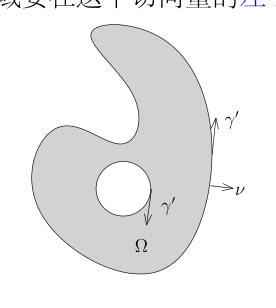

# 60 跳跃公式、Cauchy 积分与单位分解

[返回讲义目录](../../math-analysis-lecture-notes.md) · [学期目录](../03-math-analysis-iii.md) · [校勘记录](../errata.md) · [上一篇：分布的操作与 Stokes 公式](59-distribution-operations.md) · [下一篇：分布的局部刻画与支集](61-distribution-support/61-01-p0735-0741.md)

<!-- source: PDF 726; printed: 726; transcription: first-pass; proofreading: applied -->

## 60 1 维的跳跃公式，Cauchy 积分公式，Cauchy-Riemann 算子的基本解，单位分解

上次课的最后利用 Fubini 定理，我们证明了：对于 $f(x) \in L^1((a, b))$，我们定义其原函数为

$$F(x) = \int_a^x f(y)dy.$$

那么，$F(x)$ 是连续函数。在分布的意义下，我们有

$$F(x)' \overset{\mathcal{D}'}{=} f(x).$$

**引理 399**. 给定分布 $u \in \mathcal{D}'((a, b))$，如果在分布的意义下 $u' = 0$，那么，在分布的意义下，$u$ 为常数，即存在 $c \in \mathbb{C}$，使得

$$u \overset{\mathcal{D}'}{=} c.$$

**注记**. 请参考第一学期第 15 次课的[推论 94](../01-math-analysis-i/15-derivative-applications/15-01-p0151-0157.md#ma-corollary-94)。

**证明**: 我们任意选定一个 $\chi \in C_0^\infty((a, b))$，使得 $\int_a^b \chi(x)dx = 1$。令 $c = \langle u, \chi \rangle$。

对于任意一个试验函数 $\varphi \in \mathcal{D}((a, b))$，我们定义

$$g(x) = \varphi(x) - \left( \int_{-\infty}^\infty \varphi(y)dy \right) \chi(x),$$

那么，我们有

$$\int_{\mathbb{R}} g(x)dx = 0.$$

我们定义函数

$$\psi(x) = \int_a^x g(y)dy.$$

利用 $g$ 的积分消失的性质，我们容易说明（证明支集是紧的）$\psi \in \mathcal{D}((a, b))$。特别地，我们可以用 $\psi$ 作为试验函数。由于 $u' = 0$，所以

$$\begin{aligned}
0 = -\langle u, \psi' \rangle &= -\left\langle u, \varphi(x) - \left( \int_{\mathbb{R}} \varphi(y)dy \right) \chi(x) \right\rangle \\
&= -\langle u, \varphi \rangle + c \int_{\mathbb{R}} \varphi(x)dx.
\end{aligned}$$

所以，

$$\langle u, \varphi \rangle = \int_{\mathbb{R}} c \cdot \varphi(x)dx = \langle c, \varphi \rangle.$$

这说明，作为分布，我们有 $u = c$。 \hfill $\square$

综合上面的两个命题，我们有如下的性质：

<!-- source: PDF 727; printed: 727; transcription: first-pass; proofreading: applied -->

**命题 400**. 假定 $f \in L^1((a, b))$，那么关于分布的常微分方程

$$u' = f$$

在 $\mathcal{D}'((a, b))$ 中所有的解均形如

$$u = c + \int_a^x f(y)dy,$$

其中 $c \in \mathbb{C}$ 为常数。

我们现在来证明所谓的跳跃公式：

**定理 401** (跳跃公式). 给定连续函数 $g \in C(\mathbb{R})$，我们假设它的分布导数 $g' \in L^1_{\text{loc}}(\mathbb{R})$。那么，对任意的 $-\infty < a < b < +\infty$，在分布的意义下，我们有

$$\frac{d}{dx}\left( g(x)\mathbf{1}_{(a,b)}(x) \right) \overset{\mathcal{D}'}{=} g'(x)\mathbf{1}_{(a,b)}(x) - g(b)\delta_b + g(a)\delta_a.$$

**证明**: 根据上一个命题，我们有（作为分布或者连续函数）

$$g(x) = g(a) + \int_a^x g'(y)dy.$$

按定义，对任意的试验函数 $\varphi$，我们还有

$$\begin{aligned}
\left\langle \frac{d}{dx}\left( g(x)\mathbf{1}_{(a,b)}(x) \right), \varphi \right\rangle &= -\int_a^b g(x)\varphi'(x)dx \\
&= -g(a)\int_a^b \varphi'(x)dx + \int_a^b \left[ \int_a^x g'(y)dy \right] (-\varphi'(x))dx \\
&\overset{\text{Fubini}}{=} -g(a)\int_a^b \varphi'(x)dx - \int_a^b \left[ \int_y^b \varphi'(x)dx \right] g'(y)dy \\
&= -g(a) \underbrace{\int_a^b \varphi'(x)dx}_{\varphi(b)-\varphi(a)} - \varphi(b) \underbrace{\int_a^b g'(x)dx}_{g(b)-g(a)} + \int_a^b \varphi(y)g'(y)dy.
\end{aligned}$$

将上面最后一行合并同类项即得。 \hfill $\square$

## 分布与 Stokes 理论的第一个应用：Cauchy 积分公式

考虑复平面 $\mathbb{C}$ 上的开区域 $\Omega$。函数（映射）$F$ 在 $\Omega$ 上定义并且在 $\mathbb{C}$ 中取值：

$$F : \Omega \to \mathbb{C}$$

我们假设 $F$ 连续可微的 ($C^1$)。

如果把 $F$ 视作是从 $\Omega$ 到 $\mathbb{R}^2$ 的映射，我们通常将它写作

$$F(z) = F(x, y) = f(x, y) + ig(x, y).$$

<!-- source: PDF 728; printed: 728; transcription: first-pass; proofreading: applied -->

我们定义微分算子：

$$\bar{\partial} = \frac{\partial}{\partial \bar{z}} = \frac{1}{2}\left( \frac{\partial}{\partial x} + i \frac{\partial}{\partial y} \right).$$

所以，$\bar{\partial}$ 对 $F$ 的作用为：

$$\bar{\partial}F = \frac{1}{2}\left( \frac{\partial f}{\partial x} - \frac{\partial g}{\partial y} \right) + \frac{i}{2}\left( \frac{\partial g}{\partial x} + \frac{\partial f}{\partial y} \right).$$

我们现在定义 $F$ 在复解析意义下的导数（如果极限存在的话）：

$$F'(z_0) = \lim_{z \to z_0} \frac{F(z) - F(z_0)}{z - z_0}.$$

其中，$z_0 \in \Omega$ 是给定的一点。

**定义 402**. 如果 $F'(z)$ 在 $\Omega$ 上处处有定义并且是连续函数，我们就称 $F$ 为 $\Omega$ 上的**复解析函数**。

我们现在证明

**定理 403**. 函数 $F : \Omega \to \mathbb{C}$ 是复解析函数当且仅当 $\bar{\partial}F = 0$。特别地，$F(x, y) = f(x, y) + ig(x, y)$ 在 $\Omega$ 上是复解析的当且仅当如下的偏微分方程组在 $\Omega$ 上成立

$$\begin{cases}
\frac{\partial f}{\partial x} - \frac{\partial g}{\partial y} = 0; \\
\frac{\partial g}{\partial x} + \frac{\partial f}{\partial y} = 0.
\end{cases}$$

这个方程组是所谓的 Cauchy-Riemann 方程。

**证明**: 假设 $F$ 在 $z_0$ 处的复解析导数可定义，我们令它为

$$F'(z_0) = \lim_{z \to z_0} \frac{F(z) - F(z_0)}{z - z_0} = a + bi.$$

根据极限的定义，当 $z \to z_0$ 时，我们有

$$F(z) - F(z_0) - F'(z_0)(z - z_0) = o(|z - z_0|)$$

把 $F$ 看作是从 $\Omega$ 到 $\mathbb{R}^2$ 的映射，用映射微分的语言来写（参考上学期第一部分内容），我们有

$$F(x, y) - F(x_0, y_0) - \begin{pmatrix} a & -b \\ b & a \end{pmatrix} \begin{pmatrix} x - x_0 \\ y - y_0 \end{pmatrix} = o(|x - x_0| + |y - y_0|),$$

其中 $z = x + y\sqrt{-1}$, $z_0 = x_0 + y_0\sqrt{-1}$。这表明矩阵 $\begin{pmatrix} a & -b \\ b & a \end{pmatrix}$ 是映射 $F$ 在 $(x_0, y_0)$ 处的微分，从而是这个映射在这个点处的 Jacobi 矩阵。所以，

$$\begin{pmatrix} a & -b \\ b & a \end{pmatrix} = \text{Jacobi 矩阵} = \begin{pmatrix} \frac{\partial f}{\partial x} & \frac{\partial f}{\partial y} \\ \frac{\partial g}{\partial x} & \frac{\partial g}{\partial y} \end{pmatrix}.$$

<!-- source: PDF 729; printed: 729; transcription: first-pass; proofreading: applied -->

比较系数，我们有

$$\frac{\partial f}{\partial x} = a = \frac{\partial g}{\partial y}, \quad \frac{\partial g}{\partial x} = b = -\frac{\partial f}{\partial y}.$$

所以，Cauchy-Riemann 方程成立。

反之，上述计算表明我们只要取

$$F'(z_0) = \frac{\partial f}{\partial x}(x_0, y_0) + i \frac{\partial g}{\partial x}(x_0, y_0)$$

作为极限

$$\lim_{z \to z_0} \frac{F(z) - F(z_0)}{z - z_0}$$

的取值即可。 \hfill $\square$

我们现在研究 Cauchy-Riemann 方程的基本解，关于基本解这个概念我们后面会进一步阐明。我们考虑在 $\mathbb{C}$ 上几乎处处定义的映射

$$\mathbb{C} - \{0\}, \quad z \mapsto \frac{1}{z}.$$

我们把这个复值函数就记作 $z^{-1}$ 或者 $\frac{1}{z}$。由于 $\left| \frac{1}{z} \right| \leqslant \frac{1}{r}$，其中，$r$ 为平面上的极坐标系中的半径函数，根据换元积分公式，我们很容易看出

$$\frac{1}{z} \in L^1_{\text{loc}}(\mathbb{C}).$$

**引理 404**. 将 $\frac{1}{z}$ 视作是 $\mathbb{C} = \mathbb{R}^2$ 上的分布。那么，在分布的意义下，我们有

$$\bar{\partial}\left( \frac{1}{\pi z} \right) \overset{\mathcal{D}'}{=} \delta_0.$$

特别地，对于任意的 $z_0 \in \mathbb{C}$，我们有

$$\bar{\partial}\left( \frac{1}{\pi(z - z_0)} \right) = \delta_{z_0}.$$

用偏微分方程的语言来描述，$\frac{1}{\pi z}$ 为算子 $\bar{\partial}$ 的基本解。

在证明之前，我们先陈述两个关于分布收敛的基本事实，它们的证明留作作业（请参考第 2 次作业）：

- 假设 $\{f_p\}_{p \geqslant 1}$ 是 $\Omega$ 上的一列局部可积的函数，$f \in L^1_{\text{loc}}(\Omega)$。如果对任意的紧集 $K \subset \Omega$，我们有

$$\lim_{p \to \infty} f_p|_K \overset{L^1(K)}{=} f|_K,$$

那么，作为分布，我们有

$$\lim_{p \to \infty} f_p \overset{\mathcal{D}'}{=} f.$$

<!-- source: PDF 730; printed: 730; transcription: first-pass; proofreading: applied -->

• 假设 $\{u_p\}_{p \geqslant 1}$ 是 $\Omega$ 上分布的序列，$u \in \mathcal{D}'(\Omega)$。如果
$$\lim_{p \to \infty} u_p \overset{\mathcal{D}'}{=} u.$$
那么，对任意的多重指标 $\alpha$，在分布的意义下，我们有
$$\lim_{p \to \infty} \partial^\alpha u_p \overset{\mathcal{D}'}{=} \partial^\alpha u.$$

另外，我们还有

• 对于任意的 $f \in C^\infty(\Omega)$ 和 $u \in \mathcal{D}'(\Omega)$，对任意的 $k \leqslant n$，我们有
$$\partial_k(f \cdot u) \overset{\mathcal{D}'}{=} \partial_k f \cdot u + f \cdot \partial_k u.$$

证明也留作习题。

**证明**：为此，我们定义
$$f_\varepsilon(z) = \begin{cases} \frac{1}{\pi z}, & |z| \geqslant \varepsilon; \\ \frac{\bar{z}}{\pi \varepsilon^2}, & |z| < \varepsilon. \end{cases}$$

所以，
$$g_\varepsilon(z) = f_\varepsilon(z) - \frac{1}{\pi z} = \mathbf{1}_{|z|<\varepsilon}(z) \cdot \left( \frac{|z|^2 - \varepsilon^2}{\pi \varepsilon^2 z} \right).$$

当 $\varepsilon \to 0$ 时，$g_\varepsilon$ 是逐点（几乎处处）收敛到 $0$ 的；我们还可以用 $\frac{2}{\pi |z|} \mathbf{1}_{|z|\leqslant 1}(z)$ 作为 $\varepsilon \leqslant 1$ 时的控制函数。所以，根据 Lebesgue 控制收敛定理，我们有
$$g_\varepsilon(z) \xrightarrow{L^1} 0, \quad \varepsilon \to 0.$$

所以，
$$f_\varepsilon \xrightarrow{\mathcal{D}'} \frac{1}{\pi z}, \quad \varepsilon \to 0.$$

从而，
$$\bar{\partial} f_\varepsilon \xrightarrow{\mathcal{D}'} \bar{\partial}\left(\frac{1}{\pi z}\right), \quad \varepsilon \to 0.$$

现在我们来计算 $\bar{\partial} f_\varepsilon$。我们把 $f_\varepsilon$ 写作
$$f_\varepsilon(z) = \frac{\bar{z}}{\pi \varepsilon^2} \cdot \mathbf{1}_{|z|\leqslant \varepsilon}(z) + \frac{1}{\pi z} \cdot \mathbf{1}_{|z|\geqslant \varepsilon}(z).$$

根据分布意义下的 Stokes 公式，我们有
$$\begin{aligned}
\bar{\partial} f_\varepsilon(z) &= \frac{1}{\pi \varepsilon^2} \cdot \mathbf{1}_{|z|\leqslant \varepsilon}(z) - \frac{\bar{z}}{\pi \varepsilon^2} \cdot \frac{z}{2\varepsilon} d\sigma_{|z|=\varepsilon} + \frac{1}{\pi z} \cdot \frac{z}{2\varepsilon} d\sigma_{|z|=\varepsilon} \\
&= \frac{1}{\pi \varepsilon^2} \cdot \mathbf{1}_{|z|\leqslant \varepsilon}(z).
\end{aligned}$$

<!-- source: PDF 731; printed: 731; transcription: first-pass; proofreading: applied -->

其中，我们用到了
$$\bar{\partial}(\bar{z}) = 1, \quad \bar{\partial}\left(\frac{1}{z}\right) = 0, \ z \neq 0.$$

我们把这两个计算留作习题。我们现在对
$$\bar{\partial} f_\varepsilon(z) = \frac{1}{\pi \varepsilon^2} \mathbf{1}_{|z|\leqslant \varepsilon}(z),$$

取极限。我们发现这就是
$$\frac{1}{\varepsilon^2} h\left(\frac{z}{\varepsilon}\right), \quad h(z) = \frac{1}{\pi} \mathbf{1}_{|z|\leqslant 1}(z),$$

的极限，其中 $h \in L^1(\mathbb{R}^2)$ 并且积分为 $1$。根据我们之前已经学过的例子，我们有
$$\frac{1}{\pi \varepsilon^2} \mathbf{1}_{|z|\leqslant \varepsilon}(z) \xrightarrow{\mathcal{D}'} \delta_0, \quad \varepsilon \to 0.$$

这就证明了引理。 $\square$

这个公式是所谓的 Cauchy 积分公式在一个点处的情况。为了叙述 Cauchy 积分公式，我们先讨论一下复变量（复值）函数在曲线上的积分。

假定 $\gamma : [0, a] \to \mathbb{C}$ 是一个分段光滑（$C^1$）的连续曲线，也就是说，存在 $t_0 = 0 < t_1 < t_2 < \dots < t_{n-1} < a = t_n$，使得 $\gamma : (t_{k-1}, t_k) \to \mathbb{C}$ 是 $C^1$ 的。在每段上面，我们有
$$s \mapsto \gamma(s) = x(s) + i y(s).$$

对于复函数 $F(z)$，我们定义
$$\begin{aligned}
\int_\gamma F(z) dz &= \sum_{k=1}^n \int_{t_{k-1}}^{t_k} F(\gamma(s)) \gamma'(s) ds \\
&= \sum_{k=1}^n \left( \int_{t_{k-1}}^{t_k} F(\gamma(s)) x'(s) ds + i \int_{t_{k-1}}^{t_k} F(\gamma(s)) y'(s) ds \right).
\end{aligned}$$

我们要区分一下这个定义与我们上学期定义的曲线积分的关系。实际上，如果我们假设 $\gamma'(s) \neq 0$，当我们取 $s$ 为弧长参数的时候，我们有
$$\int_\gamma F(z) d\sigma = \int_0^a F(\gamma(s)) |\gamma'(s)| ds.$$

所以，这里的区别在于考虑的曲线的方向：比如说，我们考虑另一条曲线 $\gamma^{-1}$，它是 $\gamma$ 沿着反方向来走，即
$$\gamma^{-1} : [0, a] \to \mathbb{C}, \quad s \mapsto \gamma(a - s).$$

那么，
$$\int_\gamma F(z) dz = -\int_{\gamma^{-1}} F(z) dz.$$

<!-- source: PDF 732; printed: 732; transcription: first-pass; proofreading: applied -->

**例子**. 作为例子，我们来计算
$$\frac{1}{2\pi i} \int_{|z|=r_0} z^k dz, \quad k \in \mathbb{Z}, r_0 > 0.$$

我们用
$$[0, 2\pi] \to \mathbb{C}, \quad \vartheta \mapsto r_0 e^{i\vartheta},$$

来参数化 $|z| = r_0$，所以，我们有
$$\begin{aligned}
\frac{1}{2\pi i} \int_{|z|=r_0} z^k dz &= \frac{1}{2\pi i} \int_0^{2\pi} (r_0)^k e^{i k \vartheta} (-r_0 \sin\vartheta + r_0 i \cos\vartheta) d\vartheta \\
&= \frac{1}{2\pi} \int_0^{2\pi} (r_0)^{k+1} e^{i(k+1)\vartheta} d\vartheta \\
&= \begin{cases} 1, & k = -1; \\ 0, & k \neq -1. \end{cases}
\end{aligned}$$

我们可以对一个复函数用 Green 公式。假定紧集 $\Omega$ 的边界是 $\gamma$，其中我们是按照逆时针或者顺时针来标记其方向的，但是要求区域要在这个切向量的左手边。

我们用弧长参数来参数化边界曲线。我们有
$$\begin{aligned}
\int_\Omega \bar{\partial} F(z) dxdy &= \frac{1}{2} \int_\Omega \overbrace{\frac{\partial}{\partial x} F(z) + \frac{\partial}{\partial y}(i F(z))}^{\text{散度形式}} dxdy \\
&= \frac{1}{2} \int_\gamma (F, iF) \cdot \underbrace{(-i)(\gamma'_x + i \gamma'_y)}_{\text{外法向量}} d\sigma \\
&= \frac{1}{2} \int_\gamma (F, iF) \cdot (\gamma'_y, -\gamma'_x) d\sigma \\
&= \frac{1}{2i} \int_\gamma F(z) dz.
\end{aligned}$$

我们现在来证明 Cauchy 积分公式：

**定理 405** (Cauchy 积分公式). 假设 $\Omega \subset \mathbb{C}$ 是开集，$K \subset \Omega$ 是有界带边区域（特别地，$K$ 是紧的），其边界 $\gamma = \partial K$ 是 $C^1$ 曲线（可以有多个连通分支）。$F(z)$ 是 $\Omega$ 上的复解析函数。那么，对于 $z_0 \in \mathring{K}$（$K$ 的内部），我们有
$$F(z_0) = \frac{1}{2\pi i} \int_\gamma \frac{F(z)}{z - z_0} dz.$$

<!-- source: PDF 733; printed: 733; transcription: first-pass; proofreading: applied -->

**证明**：选取一个支集在 $z_0$ 附近小邻域中的试验函数 $\theta$，要求 $\theta$ 在 $z_0$ 的一个邻域内恒为 $1$ 并且 $\operatorname{supp}(\theta) \subset \mathring{K}$。利用上面的 Stokes 公式，我们有
$$\frac{1}{2i} \int_\gamma \frac{(1 - \theta(z))F(z)}{z - z_0} dz = \int_K \bar{\partial} \left( \frac{(1 - \theta(z))F(z)}{z - z_0} \right) dxdy.$$

由于 $\operatorname{supp}(\theta) \subset \mathring{K}$，所以 $1 - \theta$ 在 $\gamma$ 上恒等于 $1$，从而
$$\frac{1}{2i} \int_\gamma \frac{F(z)}{z - z_0} dz = \int_K \bar{\partial} \left( \frac{(1 - \theta(z))F(z)}{z - z_0} \right) dxdy.$$

根据 Leibniz 公式，我们就有
$$\begin{aligned}
\frac{1}{2i} \int_\gamma \frac{F(z)}{z - z_0} dz &= \int_K -\bar{\partial}\theta(z) \frac{F(z)}{z - z_0} dxdy + \int_K (1 - \theta(z)) \underbrace{\bar{\partial}\left( \frac{F(z)}{z - z_0} \right)}_{\equiv 0} dxdy \\
&= -\left\langle \frac{F(z)}{z - z_0}, \bar{\partial}\theta(z) \right\rangle = \left\langle \bar{\partial}\left(\frac{F(z)}{z - z_0}\right), \theta(z) \right\rangle \\
&= \pi \langle F(z_0)\delta_{z_0}, \theta(z) \rangle = \pi F(z_0).
\end{aligned}$$

这就给出了证明。 $\square$

### 分布的局部刻画

我们来说明分布是局部上可定义的数学对象。为此，我们先回忆一下所谓的单位分解。

**定理 406** (单位分解). 任意给定 $\mathbb{R}^n$ 中的紧集 $K$，假设 $K$ 被有限个开集 $\{U_1, \dots, U_N\}$ 所覆盖。那么，对每个 $j \leqslant N$，存在光滑函数 $\chi_j \in C_0^\infty(U_j)$，满足

1) 对任意 $x \in \mathbb{R}^n$，有 $0 \leqslant \chi_j(x) \leqslant 1$；

2) 存在包含 $K$ 的开集 $V$，对任意 $x \in V$，我们有
$$\chi_1(x) + \dots + \chi_N(x) = 1.$$

为了证明单位分解定理，我们先证明如下的引理：

**引理 407**. 假设 $\Omega \subset \mathbb{R}^n$ 是开集，$K \subset \Omega$ 是紧集，那么，存在 $\varphi \in C_0^\infty(\Omega)$ 和开集 $V$，使得

1) $K \subset V \subset \Omega$;

2) 对任意的 $x \in \Omega$，$0 \leqslant \varphi(x) \leqslant 1$;

3) $\varphi|_V \equiv 1$。

<!-- source: PDF 734; printed: 734; transcription: first-pass; proofreading: applied -->

证明梗概. 首先，我们可以选取 $\delta > 0$，使得
$$
K_{3\delta} = \{x \in \mathbb{R}^n \mid |x - k| < 3\delta, \text{存在 } k \in K\} \subset \Omega.
$$
令 $\phi(x) = \mathbf{1}_{K_{2\delta}}(x)$。我们选取我们常用的 $\chi(x)$，其中，我们要求它的积分为 1。再令
$$
\chi_\varepsilon(x) = \frac{1}{\varepsilon^n} \chi\left(\frac{x}{\varepsilon}\right).
$$
那么，我们可以选取
$$
\varphi = \phi * \chi_\varepsilon, \quad V = K_\delta,
$$
其中 $\varepsilon < \delta$。证明的细节留作作业。 \hfill $\square$

单位分解的证明梗概. 对于每个开集 $U_i$，我们可以选取紧集 $K_i \subset U_i$，使得 $\bigcup_{i \leqslant N} K_i$ 仍然包含 $K$。
此时，我们对每个 $K_i \subset U_i$ 运用上面的引理，那么，我们可以找到 $\varphi_i \in C_0^\infty(U_i)$ 和开集 $V_i$，使得 $K_i \subset V_i \subset U_i$，$\varphi_i$ 的值域落在 $[0, 1]$ 中并且 $\varphi_i|_{V_i} \equiv 1$。

最终，对每个 $i \leqslant N$，我们令
$$
\chi_i(x) = \frac{\varphi_i(x)}{\varphi_1(x) + \cdots + \varphi_N(x)}
$$
即可。证明的细节留作作业。 \hfill $\square$

**注记.** 单位分解的证明并没有任何启发性的意义，我们只要能够运用该结论即可。

[返回讲义目录](../../math-analysis-lecture-notes.md) · [学期目录](../03-math-analysis-iii.md) · [校勘记录](../errata.md) · [上一篇：分布的操作与 Stokes 公式](59-distribution-operations.md) · [下一篇：分布的局部刻画与支集](61-distribution-support/61-01-p0735-0741.md)
