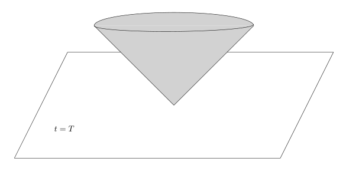
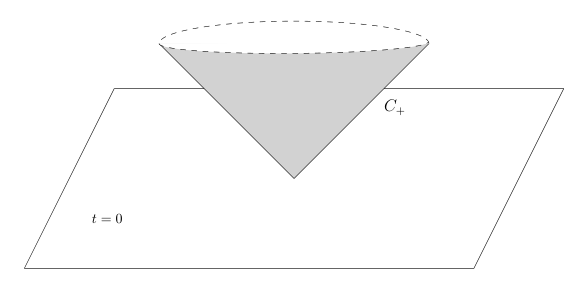
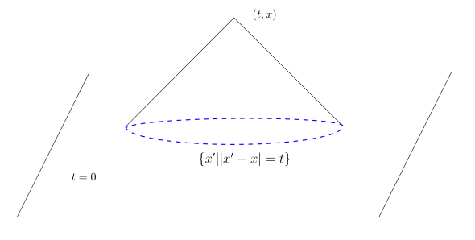

# 64：可卷集与三维波动方程

[返回讲义目录](../../math-analysis-lecture-notes.md) · [学期目录](../03-math-analysis-iii.md) · [校勘记录](../errata.md) · [上一篇：63.1：作业：分布的例子，Laplace算子、位势方程与分布](63-fundamental-solutions/63-03-p0765-0771.md) · [下一篇：复分析选读与 L1 Fourier 变换](65-complex-fourier/65-01-p0781-0789.md)

<!-- source: PDF 772; printed: 772; transcription: first-pass; proofreading: applied -->

## 可卷集与分布卷积

**定义 429**。假设 $F_1$ 和 $F_2$ 是 $\mathbb{R}^n$ 中的两个闭集，如果对任意的 $R > 0$，存在 $R' > 0$（可能依赖于 $R$），使得对任意的 $x_1 \in F_1, x_2 \in F_2$，我们有
$$
|x_1 + x_2| \leqslant R \Rightarrow |x_1| < R', |x_2| < R',
$$
那么，我们称 $F_1$ 与 $F_2$ 是**可卷的**。

更一般地，假设 $\{F_i\}_{i\in I}$ 是 $\mathbb{R}^n$ 中的一族闭集，如果对任意的 $R > 0$，存在 $R' > 0$（可能依赖于 $R$），使得对任意的可数子集 $J \subset I$，对任意的 $x_j \in F_j$，其中 $j \in J$，我们有
$$
\left| \sum_{j\in J} x_j \right| \leqslant R \Rightarrow |x_j| < R' \text{ 对所有 } j \text{ 成立},
$$
那么，我们称闭集族 $\{F_i\}_{i\in I}$ 是**可卷的**。

**引理 430**。假设闭集 $F_1$ 与 $F_2$ 是可卷的，那么，$F_1 + F_2$ 是闭集。

**证明**：令 $F = F_1 + F_2$，考虑 $F$ 中的 Cauchy 列 $\{x_i + y_i\}_{i\geqslant 1} \subset F$，其中，$x_i \in F_1, y_i \in F_2$。
由于 $\{x_i + y_i\}_{i\geqslant 1}$ 是 Cauchy 列，所以是有界的，即存在 $R > 0$，使得 $|x_i + y_i| \leqslant R$，其中 $i \geqslant 1$。
根据可卷集的性质，存在 $R'$，使得对每个 $i$，$|x_i| \leqslant R', |y_i| \leqslant R'$。从而，存在 $\{x_i\}_{i\geqslant 1}$ 的子列 $\{x_{i_p}\}_{p\geqslant 1}$ 和 $\{y_i\}_{i\geqslant 1}$ 的子列 $\{y_{i_p}\}_{p\geqslant 1}$，它们都是 Cauchy 列，从而，存在 $x \in F_1, y \in F_2$（这是两个闭集），使得
$$
\lim_{p\to\infty} x_{i_p} = x, \quad \lim_{p\to\infty} y_{i_p} = y.
$$
所以，$x + y \in F$ 并且
$$
\lim_{i\to\infty} x_i + y_i = x + y.
$$
这说明 $\{x_i + y_i\}_{i\geqslant 1}$ 的极限点仍然在 $F$ 中，即 $F$ 是闭集。 $\square$

**例子**。如下的集合是可卷的：

1) $K_1, \cdots, K_m \subset \mathbb{R}^n$ 是紧集，$K_0$ 是闭集，那么，$\{K_i\}_{0\leqslant i\leqslant m}$ 是可卷的。

2) 对 $i = 1, 2, \cdots, m$，我们令
$$
F_i = [x_i, +\infty).
$$
那么，$\{F_i\}_{1\leqslant i\leqslant m}$ 在 $\mathbb{R}$ 上是可卷的。

3) 我们在时空 $\mathbb{R}^{1+3} = \mathbb{R}^1 \times \mathbb{R}^3$ 上考虑如下两个集合：

<!-- source: PDF 773; printed: 773; transcription: first-pass; proofreading: applied -->

* 实心的未来光锥：
$$
\widehat{C}_+ = \{ (t, x) \in \mathbb{R}^{1+3} \mid t \geqslant |x| \}.
$$

* 平面 $t = T$ 的未来：$T \in \mathbb{R}$，我们定义
$$
\mathbb{R}^{1+3}_{t\geqslant T} = \{ (t, x) \in \mathbb{R}^{1+3} \mid t \geqslant T \}.
$$

那么，$\widehat{C}_+$ 和 $\mathbb{R}^{1+3}_{t\geqslant T}$ 是可卷的。

**命题 431**。对于 $u, v \in \mathcal{D}'(\mathbb{R}^n)$，如果 $\operatorname{supp}(u)$ 和 $\operatorname{supp}(v)$ 是可卷的，那么，我们可以定义
$$
u * v \in \mathcal{D}'(\mathbb{R}^n).
$$
实际上，任意选取一组 $\chi_k \in C_0^\infty(\mathbb{R}^n)$，使得对任意的 $|x| \leqslant k, \chi_k(x) = 1$，其中，$k \geqslant 1$。那么，对任意的试验函数 $\varphi \in \mathcal{D}(\mathbb{R}^n)$，如下的极限定义了 $u * v$：
$$
\langle u * v, \varphi \rangle = \lim_{k\to\infty} \langle (\chi_k u) * (\chi_k v), \varphi \rangle.
$$

**证明**：我们首先证明，当给定了 $\{\chi_k \in C_0^\infty(\mathbb{R}^n)\}_{k\geqslant 1}$ 之后，其中对任意的 $|x| \leqslant k, \chi_k(x) = 1$，极限
$$
\lim_{k\to\infty} \langle (\chi_k u) * (\chi_k v), \varphi \rangle.
$$
存在。实际上，我们证明存在 $N$，使得当 $k \geqslant N$ 时，
$$
\langle (\chi_k u) * (\chi_k v), \varphi \rangle = \langle (\chi_N u) * (\chi_N v), \varphi \rangle.
$$

考虑差
$$
\langle (\chi_k u) * (\chi_k v), \varphi \rangle - \langle (\chi_j u) * (\chi_j v), \varphi \rangle = \underbrace{\langle ((\chi_k - \chi_j)u) * (\chi_k v), \varphi \rangle}_{I_1} + \underbrace{\langle (\chi_j u) * ((\chi_k - \chi_j)v), \varphi \rangle}_{I_2}.
$$

先考虑 $I_1$，我们假设它不是 0，此时，
$$
\operatorname{supp}(\varphi) \cap \left\{ (\operatorname{supp}((\chi_k - \chi_j)u)) + \operatorname{supp}(v) \right\} \neq \emptyset.
$$
特别地，
$$
\operatorname{supp}(\varphi) \cap \left(\operatorname{supp}(u) + \operatorname{supp}(v)\right) \neq \emptyset.
$$

<!-- source: PDF 774; printed: 774; transcription: first-pass; proofreading: applied -->

假设 $\operatorname{supp}(\varphi)$ 在半径不超过 $R$ 的球之内，那么，根据可卷集的性质，存在 $R'$，对于任意的 $x + y \in \operatorname{supp}(\varphi) \cap \left(\operatorname{supp}(u) + \operatorname{supp}(v)\right)$，其中，$x \in \operatorname{supp}(u), y \in \operatorname{supp}(v)$，我们有
$$
|x| \leqslant R', \quad |y| \leqslant R'.
$$

我们取 $N>R'$ 足够大，使得 $\chi_N \vert_{B_{R'}} \equiv 1$。那么，对于 $k, j \geqslant N$，
$$
\operatorname{supp}(\varphi) \cap \left\{ (\operatorname{supp}((\chi_k - \chi_j)u)) + \operatorname{supp}(v) \right\} \neq \emptyset
$$
与 $|x| \leqslant R'$ 矛盾。从而，$I_1 \equiv 0$。类似的，$I_2 \equiv 0$。

上面的论证还表明
$$
\langle u * v, \varphi \rangle = \lim_{k\to\infty} \langle (\chi_k u) * (\chi_k v), \varphi \rangle.
$$
不依赖于 $\{\chi_k\}_{k\geqslant 1}$ 的选取，实际上，我们只要令
$$
\langle u * v, \varphi \rangle = \lim_{R\to\infty} \langle (\chi_R u) * (\chi_R v), \varphi \rangle
$$
即可，其中 $\chi_R \in C_0^\infty(\mathbb{R}^n)$ 在 $B_R$ 上恒为 1。

我们还要说明 $u * v$ 是分布。实际上，假设 $\operatorname{supp}(\varphi) \subset B_R$，我们有
$$
\begin{aligned}
\langle u * v, \varphi \rangle &= \lim_{k\to\infty} \langle u, \chi_k \cdot ((\chi_k v)^\check{} * \varphi) \rangle \\
&= \langle u, \chi_N \cdot ((\chi_N v)^\check{} * \varphi) \rangle,
\end{aligned}
$$
其中，$N$ 如前述。我们把分布定义所要证明的不等式留作作业。 $\square$

**命题 432**。对于 $u, v, w \in \mathcal{D}'(\mathbb{R}^n)$，假设 $\operatorname{supp}(u)$，$\operatorname{supp}(v)$ 和 $\operatorname{supp}(w)$ 是可卷的，那么，我们有

1) $\operatorname{supp}(u * v) \subset \operatorname{supp}(u) + \operatorname{supp}(v)$；

2) $u * v = v * u$；

3) $(u * v) * w = u * (v * w)$；

4) 对任意的多重指标 $\alpha$，我们有
$$
\partial^\alpha (u * v) = (\partial^\alpha u) * v = u * (\partial^\alpha v);
$$

**证明**：我们只证明第四条，其余的留作习题。根据归纳法，我们不妨假设 $|\alpha| = 1$。首先观察到，$\operatorname{supp}(\partial^\alpha u)$ 和 $\operatorname{supp}(v)$ 还是可卷的。我们选取试验函数 $\varphi$。根据卷积的构造，我们知道存在比较大

<!-- source: PDF 775; printed: 775; transcription: first-pass; proofreading: applied -->

的 $k$，使得
$$
\begin{aligned}
\langle \partial^\alpha(u * v), \varphi \rangle &= (-1)^{|\alpha|} \langle u * v, \partial^\alpha \varphi \rangle \\
&= (-1)^{|\alpha|} \langle \chi_k u, (\chi_k v)^\check{} * \partial^\alpha \varphi \rangle \\
&= (-1)^{|\alpha|} \langle \chi_k u, \partial^\alpha ((\chi_k v)^\check{} * \varphi) \rangle \\
&= \langle \partial^\alpha (\chi_k u), (\chi_k v)^\check{} * \varphi \rangle \\
&= \langle \partial^\alpha(\chi_k) u, (\chi_k v)^\check{} * \varphi \rangle + \underbrace{\langle \chi_k \cdot \partial^\alpha(u), (\chi_k v)^\check{} * \varphi \rangle}_{= \langle \partial^\alpha(u) * v, \varphi \rangle} \\
&= \langle (\partial^\alpha(\chi_k) u) * (\chi_k v), \varphi \rangle + \langle \partial^\alpha(u) * v, \varphi \rangle.
\end{aligned}
$$

上面第一项由于 $\partial^\alpha(\chi_k) u$ 的支集在 $|x| \geqslant k$ 上，重复定理中的证明（利用可卷性），我们知道这一项是 0，所以，
$$
\langle \partial^\alpha(u * v), \varphi \rangle = \langle \partial^\alpha(u) * v, \varphi \rangle.
$$

另外一个等号用交换律即可。 $\square$

## $\mathbb{R}^3$ 中的波动方程

波动算子 $\square = -\partial_t^2 + \Delta$ 定义在 $\mathbb{R}^{1+3} = \mathbb{R} \times \mathbb{R}^3$ 上的算子，其中，第一个坐标是时间 $t$ 的坐标。它作用在以 $(t, x) \in \mathbb{R} \times \mathbb{R}^3$ 为变量函数上的。

我们在 $\mathbb{R}^{1+3}$ 中定义未来光锥 $C_+$：
$$
C_+ = \{ (t, x) \in \mathbb{R}^{1+3} \mid t = |x| \}.
$$

除去 $(0, 0)$ 点外，$C_+$ 是 $\mathbb{R}^4$ 中的一个光滑超曲面（请证明这一点！），我们用 $d\sigma$ 表示 $C_+$ 的曲面测度。那么，对于任意的 $\varphi \in \mathcal{D}(\mathbb{R}^{1+3})$，$d\sigma$ 给出了一个 0 阶的分布：
$$
\langle d\sigma, \varphi \rangle = \int_{C_+} \varphi(t, x) \Big\vert_{C_+} d\sigma.
$$

由于 $C_+$ 可以看作是函数图像（$t = |x|$），所以，
$$
\langle d\sigma, \varphi \rangle = \sqrt{2} \int_{\mathbb{R}^3} \varphi(|x|, x) dx.
$$

<!-- source: PDF 776; printed: 776; transcription: first-pass; proofreading: applied -->

**定理 433。** 分布 $W = -\frac{d\sigma}{4\pi\sqrt{t^2+|x|^2}}$ 是 $\square$ 的一个基本解，即
$$ \square \left( -\frac{d\sigma}{4\pi\sqrt{t^2+|x|^2}} \right) = \delta_0. $$

**证明：** 按照定义，对任意的试验函数 $\varphi \in \mathcal{D}(\mathbb{R}^{1+3})$，我们有
$$ \left\langle \square \left( \frac{d\sigma}{\sqrt{t^2+|x|^2}} \right), \varphi \right\rangle = \int_{\mathbb{R}^3} \frac{(\square\varphi)(|x|, x)}{|x|} dx. $$

我们注意到，右边是局部可积的。
根据上学期的作业 11，在球坐标系下，我们有
$$ \square = -\partial_t^2 + \Delta = -\partial_t^2 + \frac{\partial^2}{\partial r^2} + \frac{2}{r}\frac{\partial}{\partial r} + \frac{1}{r^2} \Delta_{\mathbf{S}^2}, $$
其中 $r = |x|$，$\vartheta = \frac{x}{|x|} \in \mathbf{S}^2$ 在单位球面上。所以，利用球坐标系，我们有
$$ \begin{aligned}
\int_{\mathbb{R}^3} \frac{(\square\varphi)(|x|, x)}{|x|} dx &= \int_0^\infty\int_{\mathbf{S}^2} \frac{(\square\varphi)(r,r\vartheta)}{r} r^2 d\sigma_{\mathbf{S}^2}(\vartheta)\,dr \\
&= \int_0^\infty \int_{\mathbf{S}^2} \left( -\partial_t^2 \varphi + \partial_r^2 \varphi + \frac{2}{r}\partial_r \varphi + \frac{1}{r^2}\Delta_{\mathbf{S}^2}\varphi \right)(r, r, \vartheta) r d\sigma_{\mathbf{S}} dr.
\end{aligned} $$

根据上学期的作业 11 的结论（球面上的散度公式），对于固定的 $r > 0$，我们有
$$ \int_{\mathbf{S}^2} (\Delta_{\mathbf{S}^2}\varphi) (r, r, \vartheta) d\sigma_{\mathbf{S}} = 0. $$

所以，
$$ \begin{aligned}
\int_{\mathbb{R}^3} \frac{(\square\varphi)(|x|, x)}{|x|} dx &= \int_0^\infty \int_{\mathbf{S}^2} (-\partial_t^2 \varphi + \partial_r^2 \varphi + \frac{2}{r}\partial_r \varphi) (r, r, \vartheta) r d\sigma_{\mathbf{S}^2} dr \\
&= \int_0^\infty \int_{\mathbf{S}^2} (-\partial_t^2 \varphi + \partial_r^2 \varphi + \frac{2}{r}\partial_r \varphi) (r, r, \vartheta) r d\sigma_{\mathbf{S}^2} dr \\
&= \int_0^\infty \int_{\mathbf{S}^2} -((\partial_t + \partial_r)(\partial_t - \partial_r)(r\varphi))(r, r, \vartheta) d\sigma_{\mathbf{S}^2} dr.
\end{aligned} $$

如果我们令 $\psi = r\varphi$，那么，
$$ \left\langle \square \left( -\frac{d\sigma}{\sqrt{t^2+|x|^2}} \right), \varphi \right\rangle = \int_0^\infty \int_{\mathbf{S}^2} ((\partial_t + \partial_r)(\partial_t - \partial_r)(\psi))(r, r, \vartheta) d\sigma_{\mathbf{S}^2}(\vartheta) dr. $$

我们令 $L = \partial_t + \partial_r$，$\underline{L} = \partial_t - \partial_r$。对任意的光滑函数，$\vartheta$ 固定，我们计算
$$ \frac{d}{dr} (f(r, r, \vartheta)) = (\partial_t f)(r, r, \vartheta) + (\partial_r f)(r, r, \vartheta). $$

<!-- source: PDF 777; printed: 777; transcription: first-pass; proofreading: applied -->

所以，
$$ \begin{aligned}
\left\langle \square \left( -\frac{d\sigma}{\sqrt{t^2+|x|^2}} \right), \varphi \right\rangle &= \int_0^\infty \int_{\mathbf{S}^2} \frac{d}{dr} \left[ (\underline{L}(\psi))(r, r, \vartheta) \right] d\sigma_{\mathbf{S}^2}(\vartheta) dr \\
&= \int_0^\infty \frac{d}{dr} \left[ \int_{\mathbf{S}^2} (\underline{L}(\psi))(r, r, \vartheta) d\sigma_{\mathbf{S}^2}(\vartheta) \right] dr \\
&= -\lim_{\varepsilon \to 0} \int_{\mathbf{S}^2} (\underline{L}\psi)(\varepsilon, \varepsilon, \vartheta) d\sigma_{\mathbf{S}^2}(\vartheta)
\end{aligned} $$

另外，
$$ (\underline{L}\psi)(t, x) = -\varphi(t, x) + |x|\underline{L}(\varphi)(t, x). $$

所以，
$$ \lim_{\varepsilon \to 0} \int_{\mathbf{S}^2} (\underline{L}\psi)(\varepsilon, \varepsilon, \vartheta) d\sigma_{\mathbf{S}^2}(\vartheta) = -\int_{\mathbf{S}^2} \varphi(0, 0) d\sigma_{\mathbf{S}^2}(\vartheta) = -4\pi \varphi(0, 0). $$
这就证明了结论。 $\square$

给定 $f \in \mathcal{D}'(\mathbb{R}^{1+3})$，如果存在 $T \in \mathbb{R}$，使得 $\mathrm{supp}(f) \subset \mathbb{R}^{1+3}_{t \geqslant T}$，我们就说 $f$ 的**过去是零**。

### 过去为零的波动方程解

**命题 434。** 假设 $f \in \mathcal{D}'(\mathbb{R}^{1+3})$ 的过去是零，那么，存在唯一的过去为零的 $u \in \mathcal{D}'(\mathbb{R}^{1+3})$，使得
$$ \square u = f. $$

特别地，$u$ 可以表示为
$$ u = -\frac{d\sigma}{4\pi\sqrt{t^2+|x|^2}} * f. $$

**证明：** 我们注意到 $\mathbb{R}^{1+3}_{t \geqslant T}$ 与 $C_+$ 是两个可卷的闭集，所以，
$$ u = -\frac{d\sigma}{4\pi\sqrt{t^2+|x|^2}} * f $$
是良好定义的（因为 $\mathrm{supp}(d\sigma) \subset C_+$）。由于
$$ \mathbb{R}^{1+3}_{t \geqslant T} + \mathrm{supp}(d\sigma) \subset \mathbb{R}^{1+3}_{t \geqslant T}, $$
所以，$u$ 的过去为零。

现在证明唯一性：假设 $v \in \mathcal{D}'(\mathbb{R}^{1+3})$ 的过去为零，并且
$$ \square v = f. $$

那么，我们有
$$ \begin{aligned}
v &= v * \delta_0 = v * \square \left( -\frac{d\sigma}{4\pi\sqrt{t^2+|x|^2}} \right) \\
&= \square(v) * \left( -\frac{d\sigma}{4\pi\sqrt{t^2+|x|^2}} \right) \\
&= f * \left( -\frac{d\sigma}{4\pi\sqrt{t^2+|x|^2}} \right) = u.
\end{aligned} $$

<!-- source: PDF 778; printed: 778; transcription: first-pass; proofreading: applied -->

这就证明了唯一性，其中，为了使得上面每一个式子都有定义，我们用到了 $v$ 的过去为零这个条件。 $\square$

**推论 435。** 分布 $-\frac{d\sigma}{4\pi\sqrt{t^2+|x|^2}}$ 是 $\square$ 的唯一一个过去为零的基本解。

**证明：** 这是因为这样的基本解都满足
$$ \square u = \delta_0, $$
其中，$\delta_0$ 的过去为零。 $\square$

### 初值问题与解的积分公式

我们现在研究所谓的 Cauchy（初值）问题，这和常微分方程类似，我们要在 $t = 0$ 这个时刻给定 $u$ 的初始值（此时，由于方程对时间是 2 阶的，我们需要给定 $u(0, x)$ 和 $(\partial_t u)(0, x)$），然后解方程。我们假设 $u$ 是 $\mathbb{R}^{1+3}$ 上的光滑函数，它满足如下的波动方程：
$$ \begin{cases}
\square u(t, x) = 0, & (t, x) \in \mathbb{R}^{1+3}; \\
u \big|_{t=0} = u_0(x), & x \in \mathbb{R}^3; \\
\partial_t u \big|_{t=0} = u_1(x), & x \in \mathbb{R}^3.
\end{cases} $$

我们要在 $t \geqslant 0$ 来研究这个问题：给定了 $t = 0$ 的初始值，我们想知道 $u(t, x)$ 在未来 $t \geqslant 0$ 处的演化。考虑过去为零的分布
$$ H(t)u(t, x) \in \mathcal{D}'(\mathbb{R}^{1+3}). $$

那么，利用 Heaviside 函数 $H(t)$ 的导数的计算，我们有
$$ \begin{aligned}
\square(H(t)u(t, x)) &\overset{\mathcal{D}'}{=} -\partial_t (u(t, x)\delta_0(t) + H(t)\partial_t u) + H(t)\Delta u \\
&= -\partial_t (u_0(x)\delta_0(t) + H(t)\partial_t u) + H(t)\Delta u \\
&= -\partial_t (u_0(x)\delta_0(t)) - u_1(x)\delta_0(t) + H(t)\square u.
\end{aligned} $$

按照定义，$u_1(x)\delta_0(t)$ 是如下的分布：
$$ \langle u_1(x)\delta_0(t), \varphi(t, x) \rangle = \int_{\mathbb{R}^3} \varphi(0, x) u_1(x) dx. $$
这实际上是 $t = 0$ 所定义的曲面测度乘以 $u_1(x)$ 所定义的分布。
从而，
$$ \square(H(t)u(t, x)) = -\partial_t (u_0(x)\delta_0(t)) - u_1(x)\delta_0(t). $$

上式的右边是一个过去为零的分布，所以，对于 $t \geqslant 0$，我们有
$$ u(t, x) = -\partial_t \left( W * [u_0(x)\delta_0(t)] \right) - W * [u_1(x)\delta_0(t)]. $$

**注记。** 以上的公式是在假设波动方程有光滑解的情况下所给出的解的表达式！不难看出，我们只要假设 $u(t, x)$ 是 $C^2$ 的，上面的计算就成立。

<!-- source: PDF 779; printed: 779; transcription: first-pass; proofreading: applied -->

下面我们把上面解的表达式显式地用微积分写清楚。我们用 $v$ 表示一个支集在 $t = 0$ 上的分布，在应用的时候，我们将会选取
$$ v = u_0(x)\delta_0(t) \quad \text{或者} \quad u_1(x)\delta_0(t). $$

为了使下面的计算明了，我们这里不妨假设 $u_0$ 和 $u_1$ 都有紧支集（否则，我们将对下面的 $v_\varepsilon$ 加一个 $x$ 方向的截断函数，请参考本次作业）。我们再令
$$ v_\varepsilon = \chi_\varepsilon(t)u_i(x), \quad i = 0, 1. $$

其中 $\chi_\varepsilon$ 是对 $\delta$ 的一个逼近。很容易验证，当 $\varepsilon \to 0$，我们有
$$ v_\varepsilon \overset{\mathcal{D}'}{\longrightarrow} v. $$

从而，
$$ W * v_\varepsilon \overset{\mathcal{D}'}{\longrightarrow} W * v. $$

现在来计算 $W * v_\varepsilon$。按照定义，我们有
$$ \begin{aligned}
(W * v_\varepsilon)(t,x) &= -\left\langle \frac{d\sigma}{4\pi\sqrt{|t'|^2+|x'|^2}}, \chi_\varepsilon(t-t')u_i(x-x') \right\rangle \\
&= -\int_{\mathbb{R}^3} \frac{\chi_\varepsilon(t-|x'|)u_i(x-x')}{4\pi |x'|} dx' \\
&= -\int_0^\infty \int_{\mathbf{S}^2} \frac{\chi_\varepsilon(t-|r'|)u_i(x-x')}{4\pi} r' d\sigma_{\mathbf{S}^2}(\theta) dr' \\
&= -\int_0^\infty \chi_\varepsilon(t-r') \left( r' \int_{\mathbf{S}^2} \frac{u_i(x-x')}{4\pi} d\sigma_{\mathbf{S}^2}(\vartheta') \right) dr' \\
&\longrightarrow -t \int_{\mathbf{S}^2} \frac{u_i(x-t\vartheta')}{4\pi} d\sigma_{\mathbf{S}^2}(\vartheta').
\end{aligned} $$

其中，我们假设了 $t \geqslant 0$ 并且 $x' = r'\vartheta'$。在最后一步中，我们用到了
$$ \chi_\varepsilon(t-r') \overset{\mathcal{D}'}{\longrightarrow} \delta_t(r'). $$

最终，我们得到
$$ (W * v)(t,x) = -t H(t) \int_{\mathbf{S}^2} u_i(x-t\vartheta') \frac{d\sigma_{\mathbf{S}^2}(\vartheta')}{4\pi}. $$

特别地，我们得到了波动方程的解的表达式：对于 $t \geqslant 0$，我们有
$$ u(t, x) = t \int_{\mathbf{S}^2} u_1(x-t\vartheta') \frac{d\sigma_{\mathbf{S}^2}(\vartheta')}{4\pi} + \partial_t \left[ t \int_{\mathbf{S}^2} u_0(x-t\vartheta') \frac{d\sigma_{\mathbf{S}^2}(\vartheta')}{4\pi} \right]. $$

在 $u(t, x)$ 的表达式中，由于 $\vartheta'$ 是长度为 $1$ 的向量，$t\vartheta'$ 的长度为 $t$，所以，积分项只与 $u_0$ 和 $u_1$ 在以 $x$ 为中心以 $t$ 为半径的球面上的值有关系。

<!-- source: PDF 780; printed: 780; transcription: first-pass; proofreading: applied -->

我们还有一个更几何一点的表述，$u$ 在 $(t, x)$ 处的值只和初始值在顶点在 $(t, x)$ 处的倒向的光锥和 $t = 0$ 相截得到的球面 $\{x' \mid |x' - x| = t\}$ 上的值有关。

[返回讲义目录](../../math-analysis-lecture-notes.md) · [学期目录](../03-math-analysis-iii.md) · [校勘记录](../errata.md) · [上一篇：63.1：作业：分布的例子，Laplace算子、位势方程与分布](63-fundamental-solutions/63-03-p0765-0771.md) · [下一篇：复分析选读与 L1 Fourier 变换](65-complex-fourier/65-01-p0781-0789.md)
