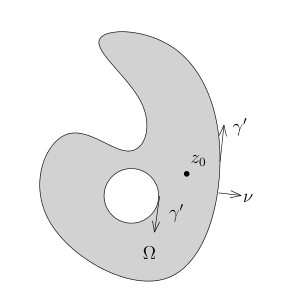
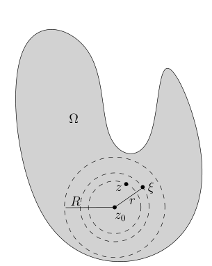
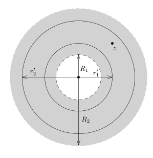
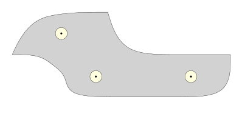
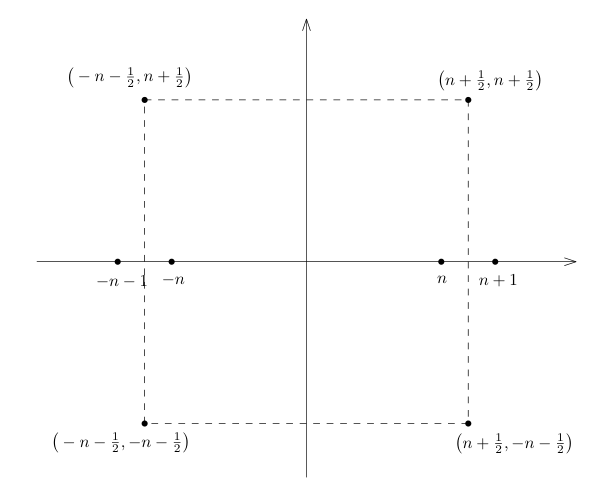

# 复分析选读与 L1 Fourier 变换

[返回讲义目录](../../../math-analysis-lecture-notes.md) · [学期目录](../../03-math-analysis-iii.md) · [章节目录](../65-complex-fourier.md) · [校勘记录](../../errata.md) · [上一篇：可卷集与三维波动方程](../64-wave-equation.md) · [下一篇：65.1：L1 Fourier 变换与逆变换](65-03-p0790-0797.md)

<!-- source: PDF 781; printed: 781; transcription: first-pass; proofreading: applied -->

## 幂级数展开与导数估计

假设 $\Omega \subset \mathbb{C}$ 是开集，$K \subset \Omega$ 是有界带边区域（特别地，$K$ 是紧的），其边界 $\gamma = \partial K$ 是 $C^1$ 曲线（可以有多个连通分支）。

我们已经对复解析函数 $F(z)$ 证明了 Cauchy 积分公式：如果 $F(z)$ 在 $\Omega$ 上是复解析的，那么，对于 $z_0 \in \stackrel{\circ}{K}$（$K$ 的内部），我们有
$$F(z_0) = \frac{1}{2\pi i} \int_\gamma \frac{F(z)}{z - z_0} dz.$$

利用 Cauchy 公式，我们证明，复解析函数是“解析”的，也就是说可以在如下意义下写成幂级数的形式：

**定理 436**。假设 $F$ 为开集 $\Omega \subset \mathbb{C}$ 上的复解析函数并且以 $z_0$ 为圆心以 $R$ 为半径的开球 $B_R(z_0) \subset \Omega$。那么，$F(z)$ 在 $z_0$ 处的**解析半径**至少是 $R$，也就是说，在 $B_R(z_0)$ 上，我们有
$$F(z) = a_0 + a_1(z - z_0) + a_2(z - z_0)^2 + \cdots + a_n(z - z_0)^n + \cdots,$$
其中
$$a_k = \frac{1}{2\pi i} \int_{|\xi - z_0|=r} \frac{F(\xi)}{(\xi - z_0)^{k+1}} d\xi, \quad r < R.$$
这里，等式右边的幂级数对任意的 $z \in B_R(z_0)$ 都是收敛的。上面系数定义中的 $r$ 可以是 $(0, R)$ 中的任意一个数。

证明的想法很简单：我们把 Cauchy 积分公式
$$F(z) = \frac{1}{2\pi i} \int_{|\xi-z_0|=r} \frac{F(\xi)}{\xi - z} d\xi.$$
的右边的积分项强行展开即可。

**证明：** 我们选取一个正实数 $r$，使得 $|z - z_0| < r < R$。我们任意给定 $\xi$，使得 $|\xi - z_0| = r$。

<!-- source: PDF 782; printed: 782; transcription: first-pass; proofreading: applied -->

此时，我们有
$$
\begin{aligned}
\frac{1}{\xi - z} &= \frac{1}{(\xi - z_0) - (z - z_0)} = \frac{1}{\xi - z_0} \frac{1}{1 - \frac{z - z_0}{\xi - z_0}} \\
&= \sum_{k=0}^\infty \frac{(z - z_0)^k}{(\xi - z_0)^{k+1}}.
\end{aligned}
$$

在上面的式子中，由于 $\left| \frac{z - z_0}{\xi - z_0} \right| < 1$，所以，我们有（级数收敛）：
$$
\frac{1}{1 - \frac{z - z_0}{\xi - z_0}} = \sum_{k=0}^\infty \left( \frac{z - z_0}{\xi - z_0} \right)^k.
$$

这些级数显然是绝对收敛的，从而与积分可交换（也可以利用 Lebesgue 控制收敛定理）。所以，代入 Cauchy 积分公式，我们就得到
$$
\begin{aligned}
F(z) &= \frac{1}{2\pi i} \int_{|\xi - z_0|=r} \sum_{k=0}^\infty F(\xi) \frac{(z - z_0)^k}{(\xi - z_0)^{k+1}} d\xi \\
&= \sum_{k=0}^\infty \left( \frac{1}{2\pi i} \int_{|\xi - z_0|=r} \frac{F(\xi)}{(\xi - z_0)^{k+1}} d\xi \right) (z - z_0)^k
\end{aligned}
$$

比较系数，这就给出了定理的证明。 $\quad \square$

**推论 437**（零点的离散性）。这里的假设与定理中是一致的。我们进一步假设 $\Omega$ 是道路连通的，即对任意的 $z_1, z_2 \in \Omega$，存在连续映射
$$
\gamma : [0, 1] \to \Omega, \quad t \mapsto \gamma(t),
$$
使得 $\gamma(0) = z_1, \gamma(1) = z_2$。那么，复解析函数 $F$ 在 $\Omega$ 中的零点是离散的（即如果 $z_0$ 是 $F$ 的一个零点，那么，存在 $\varepsilon > 0$，使得对任意的 $z$，$0<|z - z_0| < \varepsilon$，$F(z) \neq 0$），除非 $F \equiv 0$。

特别地，给定 $\Omega$ 上的两个复解析函数 $F$ 和 $G$，如果 $F$ 和 $G$ 在 $Z \subset \Omega$ 上取值相同，并且 $Z$ 在 $\Omega$ 中有聚点，那么，$F \equiv G$。

<!-- source: PDF 783; printed: 783; transcription: first-pass; proofreading: applied -->

**证明：** 假设 $z_0$ 是 $F$ 的一个零点，即 $F(z_0) = 0$。根据 $F$ 的解析表达式，在 $B_R(z_0) \subset \Omega$ 上，我们有
$$F(z) = a_0 + a_1(z - z_0) + a_2(z - z_0)^2 + \cdots + a_n(z - z_0)^n + \cdots.$$
如果这些系数 $a_i$ 全部为 0，那么，$F$ 在 $B_R(z_0)$ 上恒为 0；否则，假设 $a_m$ 是第一个不是 0 的系数，那么，我们有
$$F(z) = (z - z_0)^m \left( a_m + a_{m+1}(z - z_0) + a_{m+2}(z - z_0)^2 + \cdots \right) = (z - z_0)^m G(z).$$

根据定理的证明，级数
$$G(z) = a_m + a_{m+1}(z - z_0) + a_{m+2}(z - z_0)^2 + \cdots$$
也是绝对收敛的，特别地，这是连续的，所以，当 $z = z_0$ 时，$G(z_0) = a_m \neq 0$。从而，存在 $\delta$，使得 $G$ 在 $B_\delta(z_0)$ 上不会等于 0，此时，我们知道，$F$ 在 $z_0$ 的附近（$B_\delta(z_0)$ 上）恰好有一个零点。

我们现在证明，如果 $F$ 在 $z_0$ 的一个邻域 $B_\delta(z_0)$ 上恒为 0，那么，$F$ 在 $\Omega$ 上恒为 0：任意选取 $z_1 \in \Omega$ 和曲线
$$\gamma : [0, 1] \to \Omega, \quad t \mapsto \gamma(t),$$
使得 $\gamma(0) = z_0, \gamma(1) = z_1$。令
$$t_* = \sup \left\{ t \in [0, 1] \;\middle|\; F(\gamma(t))\big|_{[0, t]} \equiv 0 \right\}.$$

由于 $F$ 在 $z_0$ 的一个邻域 $B_\delta(z_0)$ 上恒为 0，所以，$t_* > 0$。我们现在证明 $t_* = 1$：如果假设 $t_* < 1$，根据连续性，我们知道 $F(\gamma(t_*)) = 0$。根据前面的构造，由于 $F$ 在 $\gamma(t_*)$ 的任意一个小邻域中都有零点（因为和 $\gamma([0, t_*])$ 相交），根据之前的推导，存在 $\gamma(t_*)$ 一个邻域 $B_{\delta_1}(\gamma(t_*))$，使得 $F$ 在 $B_{\delta_1}(\gamma(t_*))$ 上恒为 0，根据连续性，那么，存在 $\varepsilon > 0$，使得 $F(\gamma(t))\big|_{[0, t_* + \varepsilon]} \equiv 0$，这和 $t_*$ 的最大性矛盾。

由于 $t_* = 1$，所以，$F(z_1) = 0$，这就证明了在 $\Omega$ 上，$F \equiv 0$。

定理中的第二个结论考虑 $F - G$ 即可。 $\quad \square$

**推论 438**。这里的假设与定理中是一致的。那么，$F$ 的 $n$ 次导数 $F^{(n)}$ 仍然是解析函数。我们进一步有如下的公式：
$$F^{(n)}(z) = \frac{n!}{2\pi i} \int_{|\xi - z|=r} \frac{F(\xi)}{(\xi - z)^{n+1}} d\xi.$$

特别地，我们有如下的导数估计：
$$|F^{(n)}(z)| \leqslant \frac{n!}{r^n} \sup_{|\xi - z|=r} |F(\xi)|.$$

**证明：** 我们将 $F$ 在 $z_0 = 0$（不妨）处展开为级数
$$F(z) = a_0 + a_1 z + a_2 z^2 + \cdots$$

<!-- source: PDF 784; printed: 784; transcription: first-pass; proofreading: applied -->

其中，我们假设上面的级数的收敛半径至少是 $R > 0$，即对于 $|z| < R$ 都是绝对收敛的。根据定理中系数的计算，我们知道
$$|a_k| \leqslant \frac{1}{r^k} \sup_{|\xi|=r} |F(\xi)| \leqslant \frac{1}{r^k} M, \quad r < R.$$

其中，$M$ 为 $|F|$ 在半径为 $r$ 的圆圈上的最大值。从而，取 $0<r'<r$，对 $|z|\leqslant r'$ 及任意的 $k\geqslant1$，我们有
$$|k a_k z^{k-1}| \leqslant \frac{M}{r} \underbrace{k\left( \frac{r'}{r} \right)^{k-1}}_{b_k}.$$

当 $k$ 足够大的时候，比如说
$$k > k_0 = \left\lfloor \left( 1 - \frac{r'}{r} \right)^{-1} \right\rfloor$$

时，我们有
$$\frac{b_{k+1}}{b_k} = \left( 1 + \frac{1}{k} \right) \frac{r'}{r} < 1,$$

所以，$\{b_k\}_{k \geqslant k_0}$ 可以被一个公比小于 1 几何级数来控制，从而，级数
$$a_1 + 2a_2 z^1 + 3a_3 z^2 + \cdots$$

在 $|z| < r'$ 时是绝对收敛，这表明可以逐项求微分（根据 Lebesgue 控制收敛定理的推论）。这说明
$$F'(z) = a_1 + 2a_2 z^1 + 3a_3 z^2 + \cdots.$$

对于 $|z| < r' < r < R$ 成立。由于 $r'$ 和 $r$ 是任意选取的，所以，上面的式子对于 $|z| < R$ 都成立。特别地，我们证明了
$$F'(z_0) = a_1.$$

由归纳法，对任意的 $k$，我们就有
$$F^{(k)}(z_0) = k! a_k.$$

再根据定理中的计算，这就证明了这个推论叙述中的公式。导数估计是显然的。 $\quad \square$

## 有界性与极大模原理

**定理 439**（Liouville）。假设 $F(z)$ 是在整个 $\mathbb{C}$ 上定义的复解析函数[^p0784-19]。如果 $F$ 是有界函数，那么 $F$ 是常值函数。

**证明：** 我们只要证明 $F'(z) \equiv 0$ 即可：根据 $F$ 在一点处的展开，$F'(z) \equiv 0$，意味着定理中的系数
$$a_1 = 2a_2 = 3a_3 = \cdots = 0.$$

所以，$F$ 在一点附近恒为 $a_0$，从而 $F$ 为常数（一点附近的邻域有聚点）。

我们利用导数估计：
$$|F'(z)| \leqslant \frac{1}{r} \sup_{|\xi - z|=r} |F(\xi)| \leqslant \frac{\|F\|_\infty}{r}.$$

由于 $F$ 在整个 $\mathbb{C}$ 上定义，从而可以将 $r$ 取得任意大，这表明对任意的 $z \in \mathbb{C}$，$F'(z) = 0$。 $\quad \square$

<!-- source: PDF 785; printed: 785; transcription: first-pass; proofreading: applied -->

**推论 440**（代数基本定理）。对任意的次数非零的复系数多项式
$$P(z) = z^n + a_{n-1}z^{n-1} + \dots + a_1 z + a_0,$$
它在 $\mathbb{C}$ 上必有一个根。

**证明：** 我们观察到 $P$ 在整个 $\mathbb{C}$ 上是复解析的，并且当 $|z| \to \infty$ 时，我们有
$$|P(z)| \to \infty.$$
我们用反证法：如若不然，
$$F(z) = P(z)^{-1}$$
是在全平面 $\mathbb{C}$ 上良好定义的函数。另外，我们有
$$\bar{\partial}(F) = -P(z)^{-2}\bar{\partial}P = 0.$$
所以，$F$ 是复解析的。另外，当 $|z| \to \infty$ 时，我们还有
$$|F(z)| \to 0.$$
这说明，$F$ 是有界的。根据 Liouville 定理，$F$ 为常数，从而 $P$ 也是，那么它的次数是 0，矛盾。 $\Box$

Cauchy 积分公式是复分析中最重要的公式，除了用来证明解析性，它还有其他众多重要的推论，比如说关于复解析函数的极大模原理：

**定理 441**（极大模原理）。假设 $F(z)$ 是连通区域 $\Omega \subset \mathbb{C}$ 上的复解析函数。如果 $F$ 非常值，则 $|F|$ 不能在 $\Omega$ 的内部取到最大值；如果 $F$ 还连续延拓到 $\overline{\Omega}$，那么 $|F|$ 在 $\overline{\Omega}$ 上的最大值（如果能取到）只能在边界 $\partial\Omega$ 上取到。进一步，如果 $|F|$ 在 $\Omega$ 的内部有最大值点，那么 $F$ 一定是常值函数。

**证明：** 假设 $z_0 \in \mathring{\Omega}$ 是 $|F|$ 的最大值点，即
$$|F(z_0)| = \sup_{z\in\Omega} |F(z)|.$$
根据 Cauchy 积分公式，（选取较小的 $\varepsilon$，使得 $B_\varepsilon(z_0) \subset \Omega$，下面的 $r$ 只要满足 $r < \varepsilon$ 即可）我们有
$$
\begin{aligned}
|F(z_0)| &= \left| \frac{1}{2\pi} \int_0^{2\pi} F(z_0 + r e^{i\theta}) d\theta \right| \\
&\leqslant \frac{1}{2\pi} \int_0^{2\pi} \|F\|_{L^\infty} d\theta \\
&= \frac{1}{2\pi} \int_0^{2\pi} |F(z_0)| d\theta \\
&= |F(z_0)|.
\end{aligned}
$$

<!-- source: PDF 786; printed: 786; transcription: first-pass; proofreading: applied -->

这表明，上述不等式必须处处取等号，这表明在 $z_0$ 的整个邻域 $B_\varepsilon(z_0)$ 上，$|F(z)|$ 为常数。

我们现在证明 $F$ 在 $B_\varepsilon(z_0)$ 上为常数，不妨假设 $z_0 = 0$。如若不然，那么，我们当 $\varepsilon$ 较小时，我们有解析表达式
$$F(z) = a_0 + z^m(a_m + a_{m+1}z + a_{m+2}z^2 + \dots),$$
其中 $a_m \neq 0$。通过对 $F(z)$ 乘以一个常数，我们还可以假设 $a_0 > 0$（如果 $a_0 = 0$，那么 $|F|$ 在 $z_0$ 附近恒为零）。选取 $\xi$，使得 $\xi^m = \overline{a_m}$，所以，对于比较小的 $\delta$，我们有
$$F(\delta\xi) = a_0 + \delta^m |a_m|^2 + O(\delta^{m+1}).$$
令 $\delta \to 0$，这就和 $|F(z_0)|$ 最大矛盾。所以，$F$ 在 $B_\varepsilon(z_0)$ 上为常数，所以 $F$ 为常数。 $\Box$

## 洛朗展开与留数计算

**定理 442**（Laurent 展开）。$F$ 是环面 $\{z \in \mathbb{C} \mid R_1 < |z| < R_2\}$（我们经常取 $R_1 = 0$）上的复解析函数。对每个整数 $k \in \mathbb{Z}$，对任意的 $R_1 < r < R_2$，我们定义
$$a_k = \frac{1}{2\pi i} \int_{|z|=r} \frac{F(z)}{z^{k+1}} dz = \frac{1}{2\pi r^k} \int_0^{2\pi} e^{-ik\theta} F(r e^{i\theta}) d\theta.$$
那么，对任意满足 $R_1 < |z| < R_2$ 的 $z$，我们有（对每个固定的 $z$，以下的级数绝对收敛）
$$F(z) = \sum_{k=-\infty}^\infty a_k z^k.$$

**证明：** 根据 Cauchy 积分公式，$a_k$ 与 $r$ 在 $(R_1, R_2)$ 中的选择无关。我们选取
$$R_1 < r'_1 < r_1 < |z| < r_2 < r'_2 < R_2$$
并令 $C'_i$ 为半径为 $r'_i$ 并且中心在原点的圆，其中 $i = 1, 2$。根据 Cauchy 积分公式，我们有
$$F(z) = \frac{1}{2\pi i} \int_{C'_2} \frac{F(\xi)}{\xi - z} d\xi - \frac{1}{2\pi i} \int_{C'_1} \frac{F(\xi)}{\xi - z} d\xi.$$
我们重复之前证明复解析函数能做解析展开的做法。

对于第一项，由于对任意的 $\xi \in C'_2$，我们有 $|z| < |\xi|$，我们有
$$\frac{1}{\xi - z} = \frac{1}{\xi} \frac{1}{1 - \frac{z}{\xi}} = \frac{1}{\xi} \sum_{k=0}^\infty \left(\frac{z}{\xi}\right)^k.$$

<!-- source: PDF 787; printed: 787; transcription: first-pass; proofreading: applied -->

第二项之中，由于 $|z| > |\xi|$，其中 $\xi \in C'_1$，我们有
$$\frac{1}{\xi - z} = -\frac{1}{z} \frac{1}{1 - \frac{\xi}{z}} = -\frac{1}{z} \sum_{k=0}^\infty \left(\frac{\xi}{z}\right)^k.$$
将上面的两个展开代入 $F(z)$ 的表达式，我们就有
$$F(z) = \frac{1}{2\pi i} \int_{C'_2} \frac{F(\xi)}{\xi} \sum_{k=0}^\infty \left(\frac{z}{\xi}\right)^k d\xi + \frac{1}{2\pi i} \int_{C'_1} \frac{F(\xi)}{z} \sum_{k=0}^\infty \left(\frac{\xi}{z}\right)^k d\xi.$$
将求和与积分交换就得到了要证明的结论。 $\Box$

**定义 443**。假定 $F(z)$ 在区域 $\{z \mid 0 < |z - z_0| < r\}$ 上是复解析的，其中 $r > 0$，它的 Laurent 展开为
$$F(z) = \sum_{k=-\infty}^\infty a_k (z-z_0)^k.$$
我们称其中的 $(z-z_0)^{-1}$ 的系数 $a_{-1}$ 为 $F$ 在 $z_0$ 处的留数，并记作 $\operatorname{Res}(F; z_0)$。

**注记**。按照定义，我们有
$$\operatorname{Res}(F; z_0) = \frac{1}{2\pi i} \int_{|z-z_0|=\rho} F(z) dz,\quad 0<\rho<r.$$
这是因为 Laurent 展开中其它幂次的积分都是 0。

**定理 444**（留数定理）。假定 $\Omega \subset \mathbb{C}$ 是一个紧区域，$\Omega$ 边界为分段光滑的 $C^1$-曲线。除去点 $z_1, \dots, z_N \in \mathring{\Omega}$ 之外，$F$ 为 $\mathbb{C} - \{z_1, \dots, z_N\}$ 上的复解析函数，那么，
$$\sum_{k=1}^N \operatorname{Res}(F; z_k) = \frac{1}{2\pi i} \int_{\partial\Omega} F(z) dz.$$

**证明：** 对每个 $k \leqslant N$，先将每个 $z_k$ 附近的小圆盘 $B_\varepsilon(z_k)$ 从 $\Omega$ 上抠掉，使得这些小圆盘两两不交，并且其闭包均包含在 $\mathring{\Omega}$ 中。我们在区域 $\Omega - \bigcup_{k\leqslant N} B_\varepsilon(z_k)$ 上用 Cauchy 积分公式。

考虑到曲线的定向，我们有
$$\frac{1}{2\pi i} \int_{\partial\Omega} F(z) dz - \sum_{k=1}^N \frac{1}{2\pi i} \int_{\partial B_\varepsilon(z_k)} F(z) dz = 0.$$
所以，
$$\frac{1}{2\pi i} \int_{\partial\Omega} F(z) dz = \sum_{k=1}^N \frac{1}{2\pi i} \int_{\partial B_\varepsilon(z_k)} F(z) dz = \sum_{k=1}^N \operatorname{Res}(F; z_k).$$
这就证明了留数定理。 $\Box$

<!-- source: PDF 788; printed: 788; transcription: first-pass; proofreading: applied -->

我们试举一个有趣的应用，其它在计算上的应用我们将在 Fourier 变换的一部分再做演示。

**例子**。我们在第一学期已经定义了三角函数
$$\cos(z) = \frac{1}{2}(e^{iz} + e^{-iz}), \quad \sin(z) = \frac{1}{2i}(e^{iz} - e^{-iz}).$$
我们研究 $\sin(z)$ 的零点，即找到 $z_0$，使得
$$e^{iz_0} - e^{-iz_0} = 0 \quad \iff \quad e^{2iz_0} = 1 \quad \iff \quad z_0 \in \pi\mathbb{Z}.$$

对任意的 $a \notin \mathbb{Z}$，我们考虑
$$F(z) = \frac{\pi \cot(\pi z)}{(z - a)^2} = \frac{\pi \cos(\pi z)}{\sin(\pi z)(z - a)^2}.$$
那么，$F(z)$ 不解析的地方只能是 $a$ 和 $n \in \mathbb{Z}$。

在 $z = a$ 处，要想有非平凡的留数，$\cot(\pi z)$ 需要贡献一个 $z - a$ 的因子，所以
$$\operatorname{Res}(F; a) = (\pi \cot(\pi z))'\big|_{z=a} = -\frac{\pi^2}{\sin^2(\pi a)}.$$

在 $z = n$ 处，由于 $\frac{d}{dz}\sin(\pi z)\big|_{z=n} =\pi(-1)^n\neq0$，所以，$\sin(\pi z)$ 的零点是 1 阶的，据此，我们知道
$$\operatorname{Res}(F; n) = \frac{1}{(n - a)^2}.$$

我们对于顶点在 $(\pm(n + \frac{1}{2}), \pm(n + \frac{1}{2}))$ 的正方形 $Q_n$ 上用留数定理，其中，$n$ 足够大使得 $a \in Q_n$。
所以，
$$\sum_{|k|\leqslant n} \frac{1}{(k - a)^2} - \frac{\pi^2}{\sin^2(\pi a)} = \frac{1}{2\pi i} \int_{\partial Q_n} \frac{\pi \cos(\pi z)}{\sin(\pi z)(z - a)^2} dz.$$

对 $z\in\partial Q_n$，利用 $z = x + iy$，我们很容易看出
$$\frac{\pi \cos(\pi z)}{\sin(\pi z)(z - a)^2} = O\left(\frac{1}{n^2}\right).$$

<!-- source: PDF 789; printed: 789; transcription: first-pass; proofreading: applied -->

所以上面的积分项的贡献为
$$
\frac{1}{2\pi i}\int_{\partial Q_n}\frac{\pi \cos(\pi z)}{\sin(\pi z)(z-a)^2}dz = O(\frac{1}{n}).
$$

令 $n \to \infty$，我们就得到了
$$
\sum_{n \in \mathbb{Z}}\frac{1}{(n-a)^2} = \frac{\pi^2}{\sin^2(\pi a)}.
$$

利用上面例子中的分析，我们还可以证明 Euler 的著名公式。首先，在 $\mathbb{C} - \mathbb{Z}$ 上的任意一个紧集上，级数
$$
f(z) = \sum_{n \in \mathbb{Z}}\frac{1}{(z-n)^2}
$$
是一致收敛的，所以，$f(z)$ 是 $\mathbb{C} - \mathbb{Z}$ 上的复解析函数（可逐项求导数）。Euler 观察到，函数
$$
g(z) = \frac{\pi^2}{\sin^2(\pi z)}
$$
也是 $\mathbb{C} - \mathbb{Z}$ 上的复解析函数。进一步，由于 $\sin(\pi z)$ 在每个整数点有单零点，且 $\sin(\pi(n+w))=(-1)^n\sin(\pi w)$ 是 $w$ 的奇函数，所以，$g(z)$ 在每个 $n \in \mathbb{Z}$ 处的 Laurent 展开的负幂和 $f(z)$ 的是一致的。所以，
$$
F(z) = g(z) - f(z) = \frac{\pi^2}{\sin^2(\pi z)} - \sum_{n \in \mathbb{Z}}\frac{1}{(z-n)^2}
$$
是全平面上定义的复解析函数并且具有周期性 $F(z+1) = F(z)$。

对于 $x\in[0,1]$，下面的极限关于 $x$ 一致成立：
$$
\lim_{|y| \to \infty} F(x+iy) = 0.
$$

利用周期性，我们就知道 $F$ 是有界的，从而根据 Liouville 定理，我们得到 $F \equiv 0$。这表明
$$
\frac{\pi^2}{\sin^2(\pi z)} = \sum_{n \in \mathbb{Z}}\frac{1}{(z-n)^2}
$$

稍加变形，我们有
$$
\frac{\pi^2}{\sin^2(\pi z)} - \frac{1}{z^2} = \sum_{n \neq 0}\frac{1}{(z-n)^2}
$$

左右在 $z = 0$ 处取极限，我们就证明了著名的 Euler 公式：
$$
\frac{1}{1^2} + \frac{1}{2^2} + \frac{1}{3^2} + \frac{1}{4^2} + \cdots = \frac{1}{6}\pi^2.
$$

[返回讲义目录](../../../math-analysis-lecture-notes.md) · [学期目录](../../03-math-analysis-iii.md) · [章节目录](../65-complex-fourier.md) · [校勘记录](../../errata.md) · [上一篇：可卷集与三维波动方程](../64-wave-equation.md) · [下一篇：65.1：L1 Fourier 变换与逆变换](65-03-p0790-0797.md)

[^p0784-19]: 这样的函数被称作是整函数。
