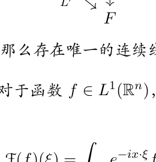
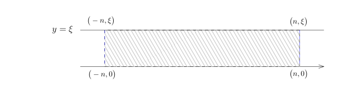

# 65.1：L1 Fourier 变换与逆变换

[返回讲义目录](../../../math-analysis-lecture-notes.md) · [学期目录](../../03-math-analysis-iii.md) · [章节目录](../65-complex-fourier.md) · [校勘记录](../../errata.md) · [上一篇：复分析选读与 L1 Fourier 变换](65-01-p0781-0789.md) · [下一篇：L2 Fourier 变换、Schwartz 空间与缓增分布](../66-schwartz-tempered/66-01-p0798-0804.md)

<!-- source: PDF 790; printed: 790; transcription: first-pass; proofreading: applied -->

## $L^1(\mathbb{R}^n)$ 上的 Fourier 变换

我们在之后会经常用到下面的命题，这在上学期 5 月 1 日的课程中已经证明。

**命题 445**（线性映射的延拓）。给定赋范线性空间 $(E, \|\cdot\|_E)$，$(E', \|\cdot\|_{E'})$ 和 $(F, \|\cdot\|_F)$，其中 $E' \subset E$ 为线性子空间且其范数为诱导范数，即对任意的 $e' \in E'$，我们有
$$ \|e'\|_{E'} = \|e'\|_E. $$
假设 $E'$ 在 $E$ 中是稠密的，并且 $F$ 是完备的。

如果存在连续线性映射 $L' : E' \to F$，那么存在唯一的连续线性映射 $L : E \to F$，使得 $\left.L\right|_{E'} = L'$。

**定义 446**（$L^1$ 函数的 Fourier 变换）。对于函数 $f \in L^1(\mathbb{R}^n)$，我们定义它的 Fourier 变换 $\widehat{f}$（或者 $\mathcal{F}(f)$）为如下的 $\mathbb{R}^n$ 上的函数：
$$ \widehat{f}(\xi) = \mathcal{F}(f)(\xi) = \int_{\mathbb{R}^n} e^{-ix \cdot \xi} f(x) dx. $$
其中 $\xi \in \mathbb{R}^n$。我们通常把 $\widehat{f}$ 的定义域 $\mathbb{R}^n$ 称作是频率空间，它的变量通常用 $\xi$ 来表示。

我们考虑 $C(\mathbb{R}^n)$ 的线性子空间
$$ C_\circ(\mathbb{R}^n) = \left\{ f \in C(\mathbb{R}^n) \;\middle|\; \lim_{|x| \to \infty} f(x) = 0 \right\}. $$
我们先说明 $(C_\circ(\mathbb{R}^n), \|\cdot\|_{L^\infty})$ 是一个完备的赋范线性空间：对任意的一致收敛 $\{f_k\}_{k \geqslant 1} \subset C_\circ(\mathbb{R}^n)$，即
$$ \lim_{k \to \infty} \|f_k - f\|_{L^\infty} = 0, $$
其中，$f$ 明显是连续函数（因为局部上一致收敛给出的极限是连续的）。对任意的 $\varepsilon > 0$，存在 $N$，使得对任意的 $k \geqslant N$，对任意的 $x \in \mathbb{R}^n$，我们有
$$ |f_k(x) - f(x)| < \varepsilon. $$
我们取 $k = N$。由于 $f_N \in C_\circ(\mathbb{R}^n)$，所以，存在 $M > 0$，使得当 $|x| > M$ 时，我们有
$$ |f_N(x)| < \varepsilon. $$

<!-- source: PDF 791; printed: 791; transcription: first-pass; proofreading: applied -->

所以，当 $|x| > M$ 时，我们有
$$ |f(x)| < 2\varepsilon. $$
这表明 $f \in C_\circ(\mathbb{R}^n)$。

作为总结，我们有

**引理 447**。$(C_\circ(\mathbb{R}^n), \|\cdot\|_\infty)$ 是完备赋范线性空间。

**定理 448**。对任意的 $f \in L^1(\mathbb{R}^n)$，$\widehat{f} \in C_\circ(\mathbb{R}^n)$。特别地，线性映射
$$ \mathcal{F} : L^1(\mathbb{R}^n) \longrightarrow C_\circ(\mathbb{R}^n), $$
是连续线性映射，即存在常数 $C$，使得对任意的 $f \in L^1(\mathbb{R}^n)$，我们有
$$ \|\widehat{f}\|_{L^\infty} \leqslant C \|f\|_{L^1}. $$

**证明：** 我们上学期已经证明了 $C_0^\infty(\mathbb{R}^n) \subset L^1(\mathbb{R}^n)$ 是稠密子空间，根据开始提到的命题，我们只要对 $\varphi \in C_0^\infty(\mathbb{R}^n)$ 进行研究即可。

根据定义，对任意的 $f \in L^1(\mathbb{R}^n)$，我们有
$$ |\widehat{f}(\xi)| \leqslant \int_{\mathbb{R}^n} |e^{-ix \cdot \xi} f(x)| dx = \int_{\mathbb{R}^n} |f(x)| dx. $$
所以，对任意的 $f \in L^1(\mathbb{R}^n)$，我们都有
$$ \|\widehat{f}\|_{L^\infty} \leqslant \|f\|_{L^1}. $$

下面只需要证明 $\widehat{\varphi}$ 的连续性及其在无穷远处的衰减（由此说明它属于 $C_\circ(\mathbb{R}^n)$）。为了说明连续性，我们只要用 Lebesgue 控制收敛定理即可：假设 $\mathbb{R}^n$ 中的点列 $\{\xi_k\}_{k \geqslant 1}$ 满足 $\xi_k \to \xi$，我们要证明 $\widehat{f}(\xi_k) \to \widehat{f}(\xi)$，这等价于证明
$$ \int_{\mathbb{R}^n} e^{-ix \cdot \xi_k} f(x) dx \to \int_{\mathbb{R}^n} e^{-ix \cdot \xi} f(x) dx. $$
我们只要用 $|f(x)|$ 作为控制函数即可。

最终，我们只需要证明当 $|\xi| \to \infty$ 时，有 $\widehat{\varphi}(\xi) \to 0$。我们只需要分部积分即可（这里我们用到了 $\varphi$ 的光滑性），这里证明的想法与第一学期我们学过的 Riemann-Lebesgue 引理一致。我们首先证明如下两个重要的性质／观点：

* 物理空间的求导等价于频率空间的乘法：对任意的 $\varphi \in C_0^\infty(\mathbb{R}^n)$，对任意的 $k \leqslant n$，我们有
$$ \widehat{\partial_k \varphi}(\xi) = i\xi_k \widehat{\varphi}(\xi). $$
实际上，我们可以分部积分：
$$ \begin{aligned} \widehat{\partial_k \varphi}(\xi) &= \int_{\mathbb{R}^n} e^{-ix \cdot \xi} \partial_k \varphi(x) dx \\ &= -\int_{\mathbb{R}^n} (-i\xi_k) e^{-ix \cdot \xi} \varphi(x) dx = i\xi_k \widehat{\varphi}(\xi). \end{aligned} $$

<!-- source: PDF 792; printed: 792; transcription: first-pass; proofreading: applied -->

* 物理空间的乘法等价于频率空间的求导：对任意的 $\varphi \in C_0^\infty(\mathbb{R}^n)$，对任意的 $k \leqslant n$，我们有
$$ \widehat{-ix_k \varphi}(\xi) = \partial_{\xi_k} \widehat{\varphi}(\xi). $$
实际上，根据 Lebesgue 控制收敛的推论（积分与求导数可交换，请自行验证细节），我们有
$$ \partial_{\xi_k} \widehat{\varphi}(\xi) = \int_{\mathbb{R}^n} (-ix_k) e^{-ix \cdot \xi} \varphi(x) dx = \widehat{-ix_k \varphi}(\xi). $$

* 物理空间的光滑性等价于频率空间的衰减，光滑性越高衰减就越快。
实际上，对任意的 $\varphi \in C_0^\infty(\mathbb{R}^n)$，对任意的正整数 $N$，利用第一个原则，我们有
$$ (1 + |\xi|^2)^N \widehat{\varphi}(\xi) = \mathcal{F}\left( (1 - \Delta)^N \varphi \right)(\xi), $$
其中 $\Delta$ 是 Laplace 算子。
很明显，$(1 - \Delta)^N \varphi \in L^1(\mathbb{R}^n)$，所以，我们有
$$ |\widehat{\varphi}(\xi)| \leqslant \frac{\|(1 - \Delta)^N \varphi\|_{L^1}}{(1 + |\xi|^2)^N}. $$
这表明 $\widehat{\varphi}$ 是衰减的并且我们对于 $\varphi$ 求的导数越多，那么衰减速度就越快。
特别地，我们还证明了 $\widehat{\varphi} \in C_\circ(\mathbb{R}^n)$。

$$\tag*{$\square$}$$

**注记**。通常为了说明 $f \in L^1(\mathbb{R}^n)$ 时，$\widehat{f}$ 也在无穷远处趋向于 0，我们任选 $\varepsilon > 0$，再选取 $\varphi \in C_0^\infty(\mathbb{R}^n)$，使得
$$ \|f - \varphi\|_{L^1} < \frac{1}{2}\varepsilon. $$
从而，对任意的 $\xi$，我们有
$$ \begin{aligned} |\widehat{f}(\xi)| &\leqslant |\widehat{f}(\xi) - \widehat{\varphi}(\xi)| + |\widehat{\varphi}(\xi)| \\ &\leqslant \|\widehat{f} - \widehat{\varphi}\|_\infty + \frac{\|(1 - \Delta)^N \varphi\|_{L^1}}{(1 + |\xi|^2)^N} \\ &\leqslant \|f - \varphi\|_{L^1} + \frac{\|(1 - \Delta)^N \varphi\|_{L^1}}{(1 + |\xi|^2)^N} \\ &\leqslant \frac{\varepsilon}{2} + \frac{\|(1 - \Delta)^N \varphi\|_{L^1}}{(1 + |\xi|^2)^N}. \end{aligned} $$
所以，当 $|\xi|$ 很大的时候，我们可以使得 $|\widehat{f}(\xi)| < \varepsilon$。

然而，这些过程实际上都被包装在开始的命题上，所以我们通常只对光滑有紧支集的函数（在 $L^1$ 中稠密）来证明即可。

## 卷积与傅里叶变换的配对

我们现在研究卷积与 Fourier 变换的关系：

<!-- source: PDF 793; printed: 793; transcription: first-pass; proofreading: applied -->

**命题 449**。对任意的 $f, g \in L^1(\mathbb{R}^n)$，我们有
$$ \widehat{f * g}(\xi) = \widehat{f}(\xi)\widehat{g}(\xi). $$
也就是说，卷积对应于频率空间的乘积。

**证明：** 我们要运用 Fubini 定理。注意到映射
$$ \mathbb{R}^n \times \mathbb{R}^n \to \mathbb{C}, \quad (x, y) \mapsto e^{-ix \cdot \xi} f(y) g(x - y) $$
是 $\mathbb{R}^n \times \mathbb{R}^n$ 上的可积函数，所以，
$$ \begin{aligned} \widehat{f * g}(\xi) &= \int_{\mathbb{R}^n} e^{-ix \cdot \xi} \left( \int_{\mathbb{R}^n} f(y) g(x - y) dy \right) dx \\ &= \int_{\mathbb{R}^n} f(y) e^{-iy \cdot \xi} \underbrace{\left( \int_{\mathbb{R}^n} e^{-i(x - y) \cdot \xi} g(x - y) dx \right)}_{\widehat{g}(\xi)} dy \\ &= \widehat{f}(\xi)\widehat{g}(\xi). \end{aligned} $$
所以命题成立。

$$\tag*{$\square$}$$

**注记**。我们上个学期已经证明了 $\left(L^1(\mathbb{R}^n), *\right)$ 是乘法封闭的。我们现在说明，这个乘法在 $L^1(\mathbb{R}^n)$ 中没有乘法单位元。假设 $e \in L^1(\mathbb{R}^n)$，使得对任意的 $f \in L^1(\mathbb{R}^n)$，我们都有
$$ e * f = f. $$
那么，我们有
$$ \widehat{e}\widehat{f} = \widehat{f}. $$
我们下面将构造 $L^1$ 的函数 $f$（Gauss 函数的 Fourier 变换），使得 $\widehat{f} > 0$，那么，$\widehat{e} \equiv 1$，这与 $\widehat{e} \in C_\circ(\mathbb{R}^n)$ 矛盾。

**命题 450**。假设 $f \in L^1(\mathbb{R}_x^n)$，$g \in L^1(\mathbb{R}_\xi^n)$。那么，
$$ \int_{\mathbb{R}^n} \widehat{f}(\xi) g(\xi) d\xi = \int_{\mathbb{R}^n} f(x) \widehat{g}(x) dx $$

**证明：** 注意到映射
$$ \mathbb{R}^n \times \mathbb{R}^n \to \mathbb{C}, \quad (x, \xi) \mapsto e^{-ix \cdot \xi} f(x) g(\xi) $$
是 $\mathbb{R}^n \times \mathbb{R}^n$ 上的可积函数，对此函数运用 Fubini 定理，我们得到
$$ \begin{aligned} \int_{\mathbb{R}^n} \widehat{f}(\xi) g(\xi) d\xi &= \int_{\mathbb{R}^{2n}} e^{-ix \cdot \xi} f(x) g(\xi) dx d\xi \\ &= \int_{\mathbb{R}^n} \left( \int_{\mathbb{R}^n} g(\xi) e^{-ix\cdot\xi} d\xi \right) f(x) dx \\ &= \int_{\mathbb{R}^n} f(x) \widehat{g}(x) dx. \end{aligned} $$
命题得证。

$$\tag*{$\square$}$$

<!-- source: PDF 794; printed: 794; transcription: first-pass; proofreading: applied -->

**注记**。这个命题在形式上建议了如何对分布定义 Fourier 变换：对于 $u \in \mathcal{D}'(\mathbb{R}^n_x)$ 和 $\varphi \in \mathcal{D}(\mathbb{R}^n_\xi)$，我们想定义
$$\langle \widehat{u}, \varphi \rangle = \langle u, \widehat{\varphi} \rangle.$$

然而，对于非零的 $\varphi \in \mathcal{D}(\mathbb{R}^n)$，我们知道 $\widehat{\varphi}(\xi) \notin \mathcal{D}(\mathbb{R}^n)$，这是因为它的支集不可能是紧的：对于 $\mathbb{R}^1$ 上的 $\varphi(x)$，如果 $\widehat{\varphi}(\xi)$ 有紧支集，那么，如果把 $\widehat{\varphi}(\xi)$ 视作是 $\mathbb{C}$ 上的函数（即 $\xi \in \mathbb{C}$，此时 Fourier 变换仍然是良好定义），那么，这是一个复解析函数，因为
$$\bar{\partial}\left(\widehat{\varphi}\right) \equiv 0.$$

然而，这个复解析函数的 $\mathbb{R}$ 上的零点集不是离散的，所以只能恒为 $0$，我们也将证明，Fourier 变换为 $0$ 的函数只有零函数。

综上所述，我们不能用上述的方式来定义分布的 Fourier 变换。为了解决这个问题，我们将找一个比 $\mathcal{D}(\mathbb{R}^n)$ 大一些的由光滑函数的空间 $\mathcal{S}(\mathbb{R}^n)$（Schwartz 空间），使得
$$\mathcal{F} : \mathcal{S}(\mathbb{R}^n) \to \mathcal{S}(\mathbb{R}^n).$$

（之前的问题出在 $\mathcal{F}(\mathcal{D}(\mathbb{R}^n)) \not\subset \mathcal{D}(\mathbb{R}^n)$。）

## 仿射变换与高斯函数

**命题 451**（仿射坐标变换与 Fourier 变换之间的关系）。任给 $f \in L^1(\mathbb{R}^n)$，$x_0 \in \mathbb{R}^n$ 和可逆线性变换
$$A : \mathbb{R}^n \to \mathbb{R}^n,$$
我们有

1) *物理空间的平移对应频率空间乘相应的频率*，即
$$\mathcal{F}\left(f(\cdot + x_0)\right)(\xi) = e^{i x_0 \cdot \xi} \widehat{f}(\xi).$$

2) *频率空间应该视作是余切丛*，即
$$\mathcal{F}(f \circ A)(\xi) = |\det(A)|^{-1} \widehat{f}({}^t A^{-1}\xi).$$

**证明：** 第一部分是显然的；为了证明第二部分，我们直接利用换元公式：
$$\begin{aligned}
\mathcal{F}(f \circ A)(\xi) &= \int_{\mathbb{R}^n} e^{-i x \cdot \xi} f(A x) d x \\
&= |\det(A)|^{-1} \int_{\mathbb{R}^n} e^{-i (A^{-1} y) \cdot \xi} f(y) d y \\
&= |\det(A)|^{-1} \int_{\mathbb{R}^n} e^{-i y \cdot {}^t A^{-1} \xi} f(y) d y.
\end{aligned}$$
命题成立。$\square$

<!-- source: PDF 795; printed: 795; transcription: first-pass; proofreading: applied -->

**命题 452**（Gauss 函数的 Fourier 变换）。对任意的正数 $\lambda > 0$，我们有
$$\mathcal{F}\left( e^{-\lambda \frac{|x|^2}{2}} \right)(\xi) = \left( \frac{2\pi}{\lambda} \right)^{\frac{n}{2}} e^{-\frac{|\xi|^2}{2\lambda}}.$$

**证明：** 通过作用变量替换 $y = \sqrt{\lambda} x$，上一个命题表明只要对 $\lambda = 1$ 证明命题即可，即
$$\mathcal{F}\left( e^{-\frac{|x|^2}{2}} \right)(\xi) = (2\pi)^{\frac{n}{2}} e^{-\frac{|\xi|^2}{2}}.$$

根据 Fubini 定理，我们进一步有
$$\begin{aligned}
\mathcal{F}\left( e^{-\frac{|x|^2}{2}} \right)(\xi) &= \int_{\mathbb{R}^n} e^{-i x \cdot \xi} e^{-\frac{|x|^2}{2}} d x \\
&= \prod_{k \le n} \int_{\mathbb{R}} e^{-i x_k \cdot \xi_k} e^{-\frac{x_k^2}{2}} d x_k
\end{aligned}$$
所以，只要对 $n = 1$ 来证明即可。此时，我们就必须去计算
$$F(\xi) = \int_{\mathbb{R}} e^{-i x \xi - \frac{x^2}{2}} d x.$$

我们下面给出两种方式进行计算：

- 按实变量的观点。

  我们对 $\xi$ 求导。根据 Lebesgue 控制收敛定理的推论，以下导数与积分之间的交换都是合理的：根本的原因是 $e^{-\frac{|x|^2}{2}}$ 的衰减足够快。所以
  $$\begin{aligned}
  F'(\xi) &= \int_{\mathbb{R}} -i x e^{-i x \xi} e^{-\frac{x^2}{2}} d x = \int_{\mathbb{R}} i e^{-i x \xi} (e^{-\frac{x^2}{2}})' d x \\
  &= -\int_{\mathbb{R}} (i e^{-i x \xi})' e^{-\frac{x^2}{2}} d x = -\xi F(\xi).
  \end{aligned}$$
  由于一个函数的积分就是其 Fourier 变换在 $0$ 处取值，所以 $F(\xi)$ 满足如下的线性常微分方程（因为 $\int_{\mathbb{R}} e^{-\frac{x^2}{2}} d x = \sqrt{2\pi}$）
  $$\begin{cases}
  F'(\xi) + \xi F(\xi) = 0, \\
  F(0) = \sqrt{2\pi}
  \end{cases}$$
  根据常微分方程的理论，这个方程的解是唯一的。我们只要验证
  $$F(\xi) = \sqrt{2\pi} e^{-\frac{\xi^2}{2}}$$
  是解即可，这是平凡的。

- 按复变量的观点。

  注意到，我们可以按照复变函数的观点来看这个积分：
  $$F(\xi) = e^{-\frac{\xi^2}{2}} \int_{\mathbb{R}} e^{-\frac{(x+i\xi)^2}{2}} d x = e^{-\frac{\xi^2}{2}} \int_{\operatorname{Im}(z)=\xi} e^{-\frac{z^2}{2}} d z.$$

<!-- source: PDF 796; printed: 796; transcription: first-pass; proofreading: applied -->

也就是说，我们需要计算在 $\mathbb{C}$ 上 $y = \xi$ 这条直线上的积分
$$I(\xi) = \int_{\operatorname{Im}(z)=\xi} e^{-\frac{z^2}{2}} d z.$$

当 $\xi = 0$ 时，这就是 Gauss 积分，我们早就知道 $I(0) = \sqrt{2\pi}$。当 $\xi \neq 0$ 时候，我们要用 Cauchy 积分公式把 $y = \xi$ 上的积分化成 $y = 0$ 上的积分。

我们考虑复解析函数 $e^{-\frac{z^2}{2}}$ 以 $(\pm n, 0)$ 和 $(\pm n, \xi)$ 作为顶点的长方形边界上的积分，方向为 $(-n,0)\to(n,0)\to(n,\xi)\to(-n,\xi)\to(-n,0)$。由于 $e^{-\frac{z^2}{2}}$ 是解析的（根据留数定理，在长方形内部没有极点），所以
$$\left( \int_{-n \le x \le n, y=0} + \int_{x=n, y:0\to\xi} - \int_{-n \le x \le n, y=\xi} - \int_{x=-n, y:0\to\xi} \right) e^{-\frac{z^2}{2}} d z = 0.$$

由于
$$e^{-\frac{z^2}{2}} = e^{-\frac{x^2-y^2}{2}} e^{-x y i}, \quad |y| \le |\xi|,$$
这是一个对于 $x$ 是指数衰减的函数，所以上面积分中的第二项和第四项当 $n \to \infty$ 时，为零。从而，对 $n$ 取极限，我们就得到
$$I(\xi) = I(0) = \sqrt{2\pi}.$$

这同样证明了结论。$\square$

## 傅里叶逆变换

利用上面 Gauss 函数的 Fourier 变换，我们可以证明关于 Fourier 逆变换的定理。

**定义 453**。对任意的 $g \in L^1(\mathbb{R}^n_\xi)$，对任意的 $x \in \mathbb{R}^n$ 我们定义
$$\left( \mathcal{F}^{-1}(g) \right)(x) = \frac{1}{(2\pi)^n} \int_{\mathbb{R}^n} e^{i \xi \cdot x} g(\xi) d \xi.$$

与 Fourier 变换的证明一样，上面得到的 $\left( \mathcal{F}^{-1}(g) \right)(x)$ 是一个良好定义的 $C_\circ(\mathbb{R}^n)$ 中的函数，我们不再赘述其证明。

**定理 454**（Fourier 逆变换）。给定 $f \in L^1(\mathbb{R}^n_x)$，如果 $\widehat{f} \in L^1(\mathbb{R}^n_\xi)$，那么，我们有
$$f = \mathcal{F}^{-1} \widehat{f},$$
其中，上面等号成立是在 $L^1(\mathbb{R}^n)$ 的意义下的。

<!-- source: PDF 797; printed: 797; transcription: first-pass; proofreading: applied -->

**证明：** 我们考虑如下的 Gauss 分布函数
$$G_\lambda(x) = \left( \frac{1}{2\pi \lambda^2} \right)^{\frac{n}{2}} e^{-\frac{|x|^2}{2\lambda^2}},$$
其中 $\lambda > 0$。根据上面的计算，我们有
$$\widehat{G}_\lambda(\xi) = e^{-\frac{\lambda^2 |\xi|^2}{2}}.$$

所以，
$$\begin{aligned}
\mathcal{F}^{-1}\left( \widehat{G}_\lambda(\xi) \right)(-x) &= \frac{1}{(2\pi)^n} \int_{\mathbb{R}^n} e^{-\frac{\lambda^2 |\xi|^2}{2}} e^{-i x \cdot \xi} d \xi \\
&= \frac{1}{(2\pi)^n} \left( \mathcal{F}\left( e^{-\frac{\lambda^2 |\xi|^2}{2}} \right) \right)(x) \\
&= G_\lambda(x).
\end{aligned}$$
最后一步我们再一次用到了之前的计算。通过观察 $\widehat{G}_\lambda(\xi)$ 的表达式，我们注意到，对任意的 $\xi \in \mathbb{R}^n$，有
$$\lim_{\lambda \to 0} \widehat{G}_\lambda(\xi) = 1.$$

根据 Lebesgue 控制收敛定理，我们有
$$\begin{aligned}
\mathcal{F}^{-1}(\widehat{f})(x) &= \frac{1}{(2\pi)^n} \int_{\mathbb{R}^n} e^{i \xi \cdot x} \widehat{f}(\xi) d \xi \\
&= \lim_{\lambda \to 0} \frac{1}{(2\pi)^n} \int_{\mathbb{R}^n} \widehat{G}_\lambda(\xi) e^{i \xi \cdot x} \widehat{f}(\xi) d \xi,
\end{aligned}$$
其中，控制函数就选 $|\widehat{f}|$。利用 Fubini 定理可知
$$\begin{aligned}
\mathcal{F}^{-1}(\widehat{f})(x) &= \lim_{\lambda \to 0} \frac{1}{(2\pi)^n} \int_{\mathbb{R}^n} \underbrace{\int_{\mathbb{R}^n} \widehat{G}_\lambda(\xi) e^{i\xi \cdot (x-y)} d\xi}_{\text{Fourier 逆变换}} f(y) d y \\
&= \lim_{\lambda \to 0} \int_{\mathbb{R}^n} G_\lambda(x-y) f(y) d y \\
&= \lim_{\lambda \to 0} G_\lambda * f.
\end{aligned}$$

由于 $G_\lambda$ 的积分恰好为 $1$，所以当 $\lambda \to 0$ 时，在 $L^1$ 的意义下，
$$\lim_{\lambda \to 0} G_\lambda * f \overset{L^1}{=} f.$$

命题成立。$\square$

[返回讲义目录](../../../math-analysis-lecture-notes.md) · [学期目录](../../03-math-analysis-iii.md) · [章节目录](../65-complex-fourier.md) · [校勘记录](../../errata.md) · [上一篇：复分析选读与 L1 Fourier 变换](65-01-p0781-0789.md) · [下一篇：L2 Fourier 变换、Schwartz 空间与缓增分布](../66-schwartz-tempered/66-01-p0798-0804.md)
