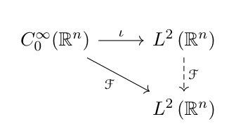

# L2 Fourier 变换、Schwartz 空间与缓增分布

[返回讲义目录](../../../math-analysis-lecture-notes.md) · [学期目录](../../03-math-analysis-iii.md) · [章节目录](../66-schwartz-tempered.md) · [校勘记录](../../errata.md) · [上一篇：65.1：L1 Fourier 变换与逆变换](../65-complex-fourier/65-03-p0790-0797.md) · [下一篇：66.1：作业：Fourier逆变换的另一个计算，一个分布扩张的问题，分布的张量积](66-03-p0805-0810.md)

<!-- source: PDF 798; printed: 798; transcription: first-pass; proofreading: applied -->

## $L^2(\mathbb{R}^n)$ 上的 Fourier 变换

利用 Fourier 逆变换，我们可以在 $L^2$ 上定义 Fourier 变换。注意到，对于 $f \in L^2(\mathbb{R}^n)$，积分
$$
\int_{\mathbb{R}^n} e^{-i x \cdot \xi} f(x) d x
$$
可能并没有定义，比如 $\mathbb{R}^1$ 上的函数
$$
f(x) = \frac{1}{1 + |x|}.
$$
注意到，$C_0^\infty(\mathbb{R}^n) \subset L^2(\mathbb{R}^n)$ 是稠密的子空间。我们任意选取 $f \in C_0^\infty(\mathbb{R}^n)$，很明显，$\widehat{f} \in L^1(\mathbb{R}^n)$（因为光滑性意味着衰减很快，所以可积）。另外，我们有
$$
\overline{\widehat{f}}(\xi) = \int_{\mathbb{R}^n} e^{i x \cdot \xi} \overline{f}(x) d x = (2\pi)^n \mathcal{F}^{-1}(\overline{f})(\xi).
$$
所以，我们有
$$
\begin{aligned}
\|\widehat{f}(\xi)\|_{L^2}^2 &= \int_{\mathbb{R}^n} \widehat{f}(\xi) \overline{\widehat{f}(\xi)} d \xi \\
&= (2\pi)^n \int_{\mathbb{R}^n} \widehat{f}(\xi)(\mathcal{F}^{-1}(\overline{f}))(\xi) d \xi \\
&= (2\pi)^n \int_{\mathbb{R}^n} f(x) \mathcal{F}\left(\mathcal{F}^{-1}(\overline{f})\right)(x) d x \\
&= (2\pi)^n \int_{\mathbb{R}^n} f(x) \overline{f}(x) d x.
\end{aligned}
$$
从而，
$$
\|\widehat{f}(\xi)\|_{L^2} = (2\pi)^{\frac{n}{2}} \|f\|_{L^2}.
$$
这表明定义在 $L^2(\mathbb{R}^n)$ 中稠密的子空间 $C_0^\infty(\mathbb{R}^n)$ 上的 Fourier 变换
$$
\mathcal{F} : C_0^\infty(\mathbb{R}^n) \to L^2(\mathbb{R}^n), \quad f \mapsto \widehat{f}
$$
是连续的。

根据连续线性映射扩张的定理，我们就证明了

<!-- source: PDF 799; printed: 799; transcription: first-pass; proofreading: applied -->

**定理 455**（$L^2$ 上的 Fourier 变换与 Plancherel 公式）。*我们可以定义 Fourier 变换 $\mathcal{F}$：*
$$
\mathcal{F} : L^2(\mathbb{R}^n) \to L^2(\mathbb{R}^n)
$$
*使得*
$$
(2\pi)^{-\frac{n}{2}} \mathcal{F} : L^2(\mathbb{R}^n) \longrightarrow L^2(\mathbb{R}^n)
$$
*是等距同构。*

*特别地，对于 $f \in L^1(\mathbb{R}^n) \cap L^2(\mathbb{R}^n)$，我们有*
$$
\|\widehat{f}\|_{L^2}^2 = (2\pi)^n \|f\|_{L^2}^2.
$$
*通过极化，我们有对任意的 $f, g \in L^2(\mathbb{R}^n)$，我们有*
$$
(\widehat{f}, \widehat{g})_{L^2} = (2\pi)^n (f, g)_{L^2}.
$$

**证明：** 上述一切叙述对 $C_0^\infty(\mathbb{R}^n)$ 是成立的。对一般的 $f \in L^2(\mathbb{R}^n)$，用 $C_0^\infty(\mathbb{R}^n)$ 中函数逼近即可。 $\square$

**注记。** 上面的定理定义了 $f \in L^2(\mathbb{R}^n)$ 的 Fourier 变换，为了行文清楚，我们暂且把 $L^2$ 意义下的 Fourier 变换记作 $\mathcal{F}_2$。另外，对于 $g \in L^1(\mathbb{R}^n)$，它的 Fourier 变换是可以用 Fourier 积分表示的，我们把它记做 $\mathcal{F}_1$，也就是说
$$
\mathcal{F}_1(g) = \int_{\mathbb{R}^n} g(x) e^{-i x \cdot \xi} d x.
$$
那么，对于 $f \in L^1(\mathbb{R}^n) \cap L^2(\mathbb{R}^n)$，我们有
$$
\mathcal{F}_1(f) = \mathcal{F}_2(f).
$$
这个有趣的验证我们留作作业。

**例子。** 考虑 $\mathbb{R}^1$ 上的 $L^2$-函数
$$
u(x) = (1 + |x|)^{-\alpha},
$$
其中，$\frac{1}{2} < \alpha \leqslant 1$。很明显，我们知道 $e^{-i x \xi} u(x) \notin L^1(\mathbb{R}_x)$，所以我们不能直接用 $L^1$-函数的 Fourier 积分来写它的 Fourier 变换。然而，我们知道
$$
u_n(x) = u(x) \mathbf{1}_{|x| \leqslant n}
$$
是 $L^1$ 的，我们可以先显式写下 $u_n$ 的 Fourier 变换。由于序列 $\{u_n\}_{n \geqslant 1}$ 在 $L^2$ 中逼近 $u$，所以，我们有
$$
\widehat{u} \overset{L^2}{=} \lim_{n \to \infty} \widehat{u_n}.
$$

**练习。** 证明，对任意的 $f \in L^2(\mathbb{R}^n)$，我们都有
$$
\widehat{\widehat{f}} = (2\pi)^n\check{f} \quad \Leftrightarrow \quad \mathcal{F}^2(f) = (2\pi)^n\check{f}.
$$

<!-- source: PDF 800; printed: 800; transcription: first-pass; proofreading: applied -->

## Schwartz 空间

对任意的给定的函数 $f$，对任意的多重指标 $\alpha$，我们采用如下的符号：
$$
x^\alpha f(x) = x_1^{\alpha_1} \cdots x_n^{\alpha_n} f(x_1, \cdots, x_n).
$$

**定义 456**（Schwartz 空间）。*函数 $\varphi$ 是 $\mathbb{R}^n$ 上的光滑函数。如果 $\varphi$ 满足如下的条件：对任意的多重指标 $\alpha, \beta$，我们都有*
$$
x^\alpha \partial^\beta \varphi(x) \in L^\infty(\mathbb{R}^n),
$$
*那么，我们就称 $\varphi$ 是一个 Schwartz 函数或者是一个速降的函数。我们把 $\mathbb{R}^n$ 上所有的 Schwartz 函数所构成的线性空间称作是 Schwartz 空间，并记作 $\mathcal{S}(\mathbb{R}^n)$。*

对于每个非负整数 $p \in \mathbb{Z}_{\geqslant 0}$，我们定义如下的（一族）范数：
$$
N_p(\varphi) = \sum_{\substack{|\alpha| \leqslant p, \\ |\beta| \leqslant p}} \|x^\alpha \partial^\beta \varphi(x)\|_{L^\infty(\mathbb{R}^n)}.
$$
在 $\mathcal{S}(\mathbb{R}^n)$ 上，我们规定如下的收敛性（拓扑）：给定 Schwartz 函数的序列 $\{\varphi_k\}_{k=1,2,\cdots} \subset \mathcal{S}(\mathbb{R}^n)$，它收敛到 Schwartz 函数 $\varphi \in \mathcal{S}(\mathbb{R}^n)$，指的是对任意的非负整数 $p$，我们都有
$$
\lim_{k \to \infty} N_p(\varphi_k - \varphi) = 0.
$$
我们把这个极限简写成
$$
\varphi_k \xrightarrow{\mathcal{S}(\mathbb{R}^n)} \varphi.
$$

**例子。** 我们已经见过很多 Schwartz 函数

- $\mathcal{D}(\mathbb{R}^n) \subset \mathcal{S}(\mathbb{R}^n)$；
- $e^{-|x|^2} \in \mathcal{S}(\mathbb{R}^n)$；
- 对于 Schwartz 函数 $\varphi \in \mathcal{S}(\mathbb{R}^n)$，对它求若干次导数或者乘以一个多项式仍然是一个 Schwartz 函数，即对任意的多重指标 $\alpha, \beta$，我们有
$$
x^\alpha : \mathcal{S}(\mathbb{R}^n) \to \mathcal{S}(\mathbb{R}^n),
$$
$$
\partial^\beta : \mathcal{S}(\mathbb{R}^n) \to \mathcal{S}(\mathbb{R}^n).
$$

上面例子的验证我们留作作业。

给定一个 Schwartz 函数，我们对它有如下的估计：对于任何的多重指标 $\alpha$ 和 $\beta$，其中 $|\alpha|, |\beta| \leqslant p$，我们有
$$
|(1 + |x|)^{n+1} x^\alpha \partial^\beta \varphi(x)| \leqslant C_n N_{p+n+1}(\varphi),
$$
其中，$n$ 是空间的维数，可取 $C_n=(n+1)!$。从而，对任意的 $x \in \mathbb{R}^n$，我们有
$$
|x^\alpha \partial^\beta \varphi(x)| \leqslant \frac{C_n N_{p+n+1}(\varphi)}{(1 + |x|)^{n+1}}.
$$

<!-- source: PDF 801; printed: 801; transcription: first-pass; proofreading: applied -->

上式右边的函数是可积的，所以，
$$
\|x^\alpha \partial^\beta \varphi(x)\|_{L^1(\mathbb{R}^n)} \leqslant C_n N_{p+n+1}(\varphi).
$$
特别地，我们可以对 $x^\alpha \partial^\beta \varphi(x)$ 用 Fourier 积分来定义其 Fourier 变换。作为推论，我们还知道
$$
\mathcal{S}(\mathbb{R}^n) \subset L^1(\mathbb{R}^n).
$$
另外，以上的估计是常用的技巧，在后面的不少场合都会用到。

**定理 457。** $\mathcal{D}(\mathbb{R}^n)$ 在 $\mathcal{S}(\mathbb{R}^n)$ 中是稠密的，即对任意的 $\varphi \in \mathcal{S}(\mathbb{R}^n)$，存在函数序列 $\{\varphi_n\}_{n \geqslant 1} \subset \mathcal{D}(\mathbb{R}^n)$，使得
$$
\varphi_k \xrightarrow{\mathcal{S}(\mathbb{R}^n)} \varphi.
$$

**证明：** 我们选取有紧支集的光滑函数 $\chi(x)$，使得
$$
\begin{cases}
\chi(x)=1,&|x|\leqslant1; \\
0 \leqslant \chi(x) \leqslant 1.
\end{cases}
$$
对于 $\varphi(x) \in \mathcal{S}(\mathbb{R}^n)$，我们令
$$
\varphi_k(x) = \chi\left(\frac{x}{k}\right) \varphi(x) \in \mathcal{D}(\mathbb{R}^n).
$$
我们只要证明，对任意的非负整数 $p$，我们有
$$
N_p(\varphi_k - \varphi) \to 0,
$$
即可。对于满足 $|\alpha| \leqslant p, |\beta| \leqslant p$ 的多重指标，我们有
$$
\begin{aligned}
x^\alpha \partial^\beta (\varphi - \varphi_k) &= x^\alpha \partial^\beta \left(\left(1 - \chi\left(\frac{x}{k}\right)\right) \varphi\right) \\
&= \left(1 - \chi\left(\frac{x}{k}\right)\right) x^\alpha \partial^\beta \varphi - \underbrace{\sum_{0 \neq \gamma \leqslant \beta} \frac{1}{k^{|\gamma|}} \frac{\beta!}{\gamma!(\beta - \gamma)!} \underbrace{x^\alpha \partial^{\beta-\gamma} \varphi(x)}_{|\cdot| \leqslant N_p(\varphi)} \left(\partial^\gamma \chi\right)\left(\frac{x}{k}\right)}_{\to 0, \ k \to \infty}
\end{aligned}
$$
上式的第二个求和部分有 $k^{-1}$ 这样的衰减因子，所以极限为 0。对于第一项，由于 $\chi$ 在半径为 1 的球内部为 1，所以然而，我们有
$$
\begin{aligned}
\left|\left(1 - \chi\left(\frac{x}{k}\right)\right) x^\alpha \partial^\beta \varphi\right| &\leqslant \mathbf{1}_{|x| \geqslant k}(x) \cdot |x|^{-2} \cdot \sum_{j=1}^n|x^{\alpha+2e_j}\partial^\beta\varphi| \\
&\leqslant \frac{1}{k^2} N_{p+2}(\varphi) \to 0.
\end{aligned}
$$
这就完成了证明。 $\square$

## 施瓦茨空间上的傅里叶变换

我们现在研究 Schwartz 函数的 Fourier 变换。我们已经证明了 $\mathcal{S}(\mathbb{R}^n) \subset L^1(\mathbb{R}^n)$，所以，$\varphi \in \mathcal{S}(\mathbb{R}^n)$ 的 Fourier 变换还是可以用积分公式
$$
\mathcal{F}(\varphi)(\xi) = \widehat{\varphi}(\xi) = \int_{\mathbb{R}^n} \varphi(x) e^{-i x \cdot \xi} d x
$$
来表示。

<!-- source: PDF 802; printed: 802; transcription: first-pass; proofreading: applied -->

**定理 458**（$\mathcal{S}(\mathbb{R}^n)$ 上的 Fourier 变换）。如果 $\varphi \in \mathcal{S}(\mathbb{R}^n)$ 是 Schwartz 函数，那么，$\widehat{\varphi} \in \mathcal{S}(\mathbb{R}^n)$。在 Schwartz 函数空间上的 Fourier 变换：
$$\mathcal{F} : \mathcal{S}(\mathbb{R}^n) \longrightarrow \mathcal{S}(\mathbb{R}^n), \quad \varphi \mapsto \widehat{\varphi}(\xi),$$
满足如下的性质：对任意的 $p \in \mathbb{Z}_{\geqslant 0}$，存在常数 $C_p > 0$，使得对每个 $\varphi \in \mathcal{S}(\mathbb{R}^n)$，我们都有
$$N_p(\widehat{\varphi}) \leqslant C_p N_{p+n+1}(\varphi).$$

特别的，$\mathcal{F} : \mathcal{S}(\mathbb{R}^n) \longrightarrow \mathcal{S}(\mathbb{R}^n)$ 是连续的线性同构，即对任意的在 $\mathcal{S}(\mathbb{R}^n)$ 中收敛的函数序列
$$\varphi_k \xrightarrow{\mathcal{S}} \varphi, \quad k \to \infty,$$
我们有那
$$\widehat{\varphi}_k \xrightarrow{\mathcal{S}} \widehat{\varphi}, \quad k \to \infty.$$

另外，对任意的 $\varphi \in \mathcal{S}(\mathbb{R}^n)$，我们还有公式
$$\widehat{\partial_k \varphi} = i\xi_k\widehat\varphi, \quad \widehat{x_k \varphi} = i\partial_k \widehat{\varphi}.$$

**证明：** 我们首先证明叙述中的最后两个恒等式。对任意的 Schwartz 函数 $\varphi$，对任意的 $k \leqslant n$，利用分部积分，我们有
$$\widehat{\partial_k \varphi}(\xi) = -\int_{\mathbb{R}^n} (-i\xi_k) e^{-ix \cdot \xi} \varphi(x) dx = i\xi_k \widehat{\varphi}(\xi).$$

第二个等式要用 Lebesgue 控制收敛的推论（积分与求导数可交换），我们有
$$\partial_{\xi_k} \widehat{\varphi}(\xi) = \int_{\mathbb{R}^n} (-ix_k) e^{-ix \cdot \xi} \varphi(x) dx = \widehat{-ix_k \varphi}(\xi).$$

现在证明定理中的不等式（从而证明了 Fourier 变换 $\mathcal{F}$ 的像也落在 $\mathcal{S}(\mathbb{R}^n)$ 中）。固定两个多重指标 $\alpha$ 和 $\beta$，其中 $|\alpha|, |\beta| \leqslant p$。利用已经证明的公式，我们就有
$$|\xi^\alpha \partial_\xi^\beta \widehat{\varphi}(\xi)| = |\widehat{\partial^\alpha(x^\beta \varphi)}(\xi)| \leqslant \|\partial^\alpha(x^\beta \varphi)(x)\|_{L^1}$$
$$\leqslant C_p N_{p+n+1}(\varphi).$$

Fourier 变换的连续性可以通过这个不等式得到：对任意给定 $p$，我们有
$$N_p(\widehat{\varphi}_k - \widehat{\varphi}) \leqslant C_p N_{p+n+1}(\varphi_k - \varphi) \to 0,$$
按照定义，我们就有
$$\widehat{\varphi}_k \xrightarrow{\mathcal{S}} \widehat{\varphi}, \quad k \to \infty.$$

最后，我们来说明 $\mathcal{F}$ 是同构。实际上，我们可以定义直接考虑 Fourier 变换的逆 $\mathcal{F}^{-1}$，因为 $\widehat{\varphi} \in L^1$，所以之前定义的 $\mathcal{F}^{-1}$ 在此也是良好定义的。此时，我们已经证明了 $\mathcal{F}$ 与 $\mathcal{F}^{-1}$ 互为逆映射，所以命题得证（$\mathcal{F}^{-1}$ 也是连续的）。 $\square$

<!-- source: PDF 803; printed: 803; transcription: first-pass; proofreading: applied -->

## 缓增分布与对偶配对

**定义 459**（缓增的分布）。假设 $u \in \mathcal{D}'(\mathbb{R}^n)$ 是一个分布。如果存在非负整数 $p$ 和常数 $C > 0$，使得对每个 $\varphi \in \mathcal{D}(\mathbb{R}^n)$，我们都有
$$|\langle u, \varphi \rangle| \leqslant C N_p(\varphi),$$
我们就说 $u$ 是一个缓增的分布。我们用 $\mathcal{S}'(\mathbb{R}^n)$ 来表示所有缓增分布的集合，很明显
$$\mathcal{S}'(\mathbb{R}^n) \subset \mathcal{D}'(\mathbb{R}^n)$$
是线性子空间。

**定理 460**（$\mathcal S'(\mathbb R^n)\times\mathcal S(\mathbb R^n)\to\mathbb C$）。对任意的 $u \in \mathcal{S}'(\mathbb{R}^n)$，存在唯一一个线性泛函
$$T_u : \mathcal{S}(\mathbb{R}^n) \to \mathbb{C},$$
使得存在非负整数 $p$ 和常数 $C > 0$，对每个 $\varphi\in\mathcal S(\mathbb R^n)$，我们都有
$$|T_u(\varphi)| \leqslant C N_p(\varphi),$$
并且对于任意的 $\psi \in \mathcal{D}(\mathbb{R}^n)$，都有
$$T_u(\psi) = \langle u, \psi \rangle.$$
在后面的场合，为了简单起见，我们仍将此线性泛函的作用记作 $\langle u, \cdot \rangle$。

**证明：** 利用 $\mathcal{D}(\mathbb{R}^n) \subset \mathcal{S}(\mathbb{R}^n)$ 的稠密性，我们用极限的形式来定义 $T_u$：对任意给定的 $\varphi \in \mathcal{S}(\mathbb{R}^n)$，我们选取试验函数序列 $\{\varphi_k\}_{k \geqslant 1} \subset \mathcal{D}(\mathbb{R}^n)$，使得
$$\varphi_k \xrightarrow{\mathcal{S}} \varphi.$$
我们令
$$T_u(\varphi) = \lim_{k \to \infty} \langle u, \varphi_k \rangle.$$
当然，我们需要说明上述极限存在并且不依赖于逼近序列的选取。

利用 $u \in \mathcal{S}'(\mathbb{R}^n)$ 的定义，存在 $C_0$ 和 $p_0$，使得对任意的 $k, \ell \geqslant 1$，我们都有
$$|\langle u, \varphi_k - \varphi_\ell \rangle| \leqslant C_0 N_{p_0}(\varphi_k - \varphi_\ell).$$
再利用 $\varphi_k \xrightarrow{\mathcal{S}} \varphi$ 的定义，我们有
$$N_{p_0}(\varphi_k - \varphi) \to 0.$$
所以，我们有
$$|N_{p_0}(\varphi_k)-N_{p_0}(\varphi_\ell)|\leqslant N_{p_0}(\varphi_k - \varphi_\ell)$$
$$\leqslant N_{p_0}(\varphi_k - \varphi) + N_{p_0}(\varphi_\ell - \varphi) \xrightarrow{k, \ell \to \infty} 0.$$
这说明 $\{\langle u, \varphi_k \rangle\}_{k \geqslant 1}$ 是 Cauchy 列，所以所讨论的极限是存在的。

<!-- source: PDF 804; printed: 804; transcription: first-pass; proofreading: applied -->

下面再说明这个极限不依赖于逼近序列 $\{\varphi_k\}_{k \geqslant 1} \subset \mathcal{D}(\mathbb{R}^n)$ 的选取。假设 $\{\psi_k\}_{k \geqslant 1} \subset \mathcal{D}(\mathbb{R}^n)$ 是另一个逼近序列，那么，我们有
$$|N_{p_0}(\varphi_k)-N_{p_0}(\psi_k)|\leqslant N_{p_0}(\varphi_k - \psi_k)$$
$$\leqslant N_{p_0}(\varphi_k - \varphi) + N_{p_0}(\psi_k-\varphi)\xrightarrow{k\to\infty} 0.$$

所以，
$$|\langle u, \varphi_k \rangle - \langle u, \psi_k \rangle| \leqslant C_0 N_{p_0}(\varphi_k - \psi_k) \to 0.$$

所以，
$$\lim_{k \to \infty} \langle u, \varphi_k \rangle = \lim_{k \to \infty} \langle u, \psi_k \rangle.$$

最后，我们证明 $T_u$ 所满足的不等式：
$$|\langle u, \varphi_k \rangle| \leqslant C_0 N_{p_0}(\varphi_k) \leqslant C_0 \left( \underbrace{N_{p_0}(\varphi_k - \varphi)}_{\to 0, \, k \to \infty} + N_{p_0}(\varphi) \right)$$

两边同时取极限，这就完成了定理的证明。 $\square$

[返回讲义目录](../../../math-analysis-lecture-notes.md) · [学期目录](../../03-math-analysis-iii.md) · [章节目录](../66-schwartz-tempered.md) · [校勘记录](../../errata.md) · [上一篇：65.1：L1 Fourier 变换与逆变换](../65-complex-fourier/65-03-p0790-0797.md) · [下一篇：66.1：作业：Fourier逆变换的另一个计算，一个分布扩张的问题，分布的张量积](66-03-p0805-0810.md)
