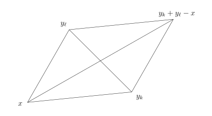

# 71：Riesz 表示、Sobolev 对偶与迹定理

[返回讲义目录](../../math-analysis-lecture-notes.md) · [学期目录](../03-math-analysis-iii.md) · [校勘记录](../errata.md) · [上一篇：70.1：作业：Fourier变换的计算，Heisenberg测不准原理，分数次Sobolev空间的物理空间刻画，1维的等](70-sobolev-embedding/70-03-p0837-0841.md) · [下一篇：有界区域的 Sobolev 空间与 Poincare 不等式](72-bounded-sobolev/72-01-p0851-0857.md)

<!-- source: PDF 842; printed: 842; transcription: first-pass; proofreading: applied -->

## 正交投影与正交分解

最后我们来证明 Sobolev 空间之间的对偶性，为此，我们需要证明关于完备的内积空间的 Riesz 表示定理。我们之后还会运用这个定理来求解偏微分方程。

**引理 482**（向闭子空间的正交投影）。给定完备的内积空间 $(H, (\cdot, \cdot))$，$F \subset H$ 是闭线性子空间。那么，存在唯一的连续的线性映射
$$
\pi : H \to F,
$$
使得
$$
\|x - \pi(x)\| = \min_{y \in F} \|x - y\|.
$$
我们称 $\pi(x)$ 为 $x$ 在 $F$ 上的**正交投影**。特别地，我们还有 $x - \pi(x) \perp F$，即对任意的 $y \in F$，我们有 $(x - \pi(x), y) = 0$。

**证明：** 我们考虑
$$
\inf_{y \in F} \|x - y\|.
$$
根据下确界的定义，存在点列 $\{y_k\}_{k \ge 1} \subset F$，使得
$$
\lim_{k \to \infty} \|x - y_k\| = \inf_{y \in F} \|x - y\| = I.
$$
（我们经常把这样的一个序列称作是 $\inf_{y \in F} \|x - y\|$ 的一个极小化子序列。）

我们回忆平面几何中的平行四边形等式：一个平行四边形的对角线的平方和等于四条边的平方和。
现在考虑由 $x, y_k, y_\ell$ 和 $y_k + y_\ell - x$ 所组成的平行四边形，我们有
$$
4\left|x - \frac{y_k + y_\ell}{2}\right|^2 + |y_k - y_\ell|^2 = 2(|x - y_k|^2 + |x - y_\ell|^2).
$$
另外，我们还有
$$
I\leqslant\left|x-\frac{y_k+y_\ell}{2}\right|\leqslant \frac{1}{2}(|x - y_k| + |x - y_\ell|).
$$
由于，当 $k, \ell \to \infty$ 时，我们有
$$
|x - y_k| \to I, |x - y_\ell| \to I.
$$

<!-- source: PDF 843; printed: 843; transcription: first-pass; proofreading: applied -->

所以，当 $k, \ell \to \infty$，平行四边形等式表明
$$
|y_k - y_\ell|^2 = 2(|x - y_k|^2 + |x - y_\ell|^2) - 4\left|x - \frac{y_k + y_\ell}{2}\right|^2 \to 0.
$$
这说明，$\{y_k\}_{k \ge 1}$ 为 Cauchy 列，利用 $F$ 是闭的，这证明存在 $y \in F$，使得 $I$ 可以被实现。

为了说明，$x - \pi(x) = x - y \perp F$，我们利用变分的想法（请参考第一学期我们证明两点之间线段最短）。对任意的 $z \in F$，对任意的 $s \in \mathbb{R}$，按照定义，我们知道
$$
\|x - y\|^2 \le \|x - y + sz\|^2.
$$
所以，$s = 0$ 是二次函数
$$
f(s) = \|x - y + sz\|^2 = \|x - y\|^2 + 2\operatorname{Re}((x - y, z))s + \|z\|^2 s^2
$$
的最小值点。从而，$f'(0) = 0$，这就说明
$$
\operatorname{Re}((x - y, z)) = 0.
$$
类似地，如果把 $s$ 换成 $is$，我们就有
$$
\operatorname{Im}((x - y, z)) = 0.
$$
这就证明了对任意 $z \in F$，$x - y \perp z$，从而完成了证明。 $\square$

**注记。** 我们注意到，$F$ 中满足 $x - y \perp F$ 的向量是唯一的，就是 $\pi(x)$：实际上，如果 $y \in F$ 是另一个这样的向量，那么，
$$
y - \pi(x) = (x - \pi(x)) - (x - y)
$$
也与 $F$ 垂直，从而，$y - \pi(x) \perp y - \pi(x)$，即
$$
\|y - \pi(x)\|^2 = 0,
$$
所以，$y = \pi(x)$。据此，对任意的 $x \in H$，我们都可以把它唯一地写成
$$
x = x_F + x_\perp,
$$
其中，$x_F \in F$，$x_\perp \perp F$。这被称作是 $x$ 对于 $F$ 的正交分解。

## 里斯表示定理与希尔伯特空间对偶

假设 $H$ 是完备的内积空间，我们用 $H^*$ 表示 $H$ 上的连续线性泛函所构成的空间并把它称作是 $H$ 在 Hilbert 空间的意义下的对偶：
$$
H^* = \{ \text{线性映射 } \ell : H \to \mathbb{C} \mid \ell \text{ 连续（有界）的} \}.
$$
我们需要强调，在线性代数的意义下，所谓的对偶空间指的是 $H$ 上的所有的线性函数所构成的线性空间，此处不同之处在于我们要求这些线性函数还是连续的。当 $H$ 是有限维的内积空间时，这两个概念是一致的。

<!-- source: PDF 844; printed: 844; transcription: first-pass; proofreading: applied -->

**例子。** 对任意的 $v \in H$，我们考虑如下的线性泛函：
$$
\ell_v : H \to \mathbb{C}, \quad x \mapsto (x, v).
$$
根据内积的性质，这是线性映射。另外，根据 Cauchy-Schwarz 不等式，我们有
$$
|\ell(x)| = |(x, v)| \le \|v\| \cdot \|x\|.
$$
所有 $\ell_v$ 是有界的，从而连续，即 $\ell_v \in H^*$。

我们现在来证明，上述的例子给出了所有的 $H^*$ 的元素。

**定理 483**（Riesz 表示定理）。完备内积空间 $(H, (\cdot, \cdot))$ 上的连续线性泛函都可以用内积来实现，即对每个 $\ell \in H^*$，存在唯一的 $v \in H$，使得 $\ell = \ell_v$。换而言之，
$$
H \longrightarrow H^*, \quad v \mapsto \ell_v,
$$
是共轭线性的等距同构。

**证明：** 给定 $\ell$，我们考虑
$$
F = \operatorname{Ker}(\ell) = \{ x \in H \mid \ell(x) = 0 \}.
$$
由于 $\ell$ 是连续的，所以，$F$ 是闭的线性子空间。任选 $x \notin F$（这样的 $x$ 总是存在的，除非 $\ell = 0$），那么，$x - \pi(x)$ 就给出了 $F$ 的一个法向量。通过对这个法向量乘以一个系数，我们可以得到 $v \in F^\perp$，
$$
\|v\|^2 = \ell(v) > 0.
$$
我们声明 $\ell = \ell_v$。

为此，我们先说明 $\dim(F^\perp) = 1$。实际上，若 $w=0$ 则已属 $\mathbb Cv$；若 $0\ne w\in F^\perp$，则 $\ell(w)\ne0$，我们选取 $\lambda$，使得 $\ell(\lambda w) = \ell(v)$。此时，$\lambda w - v \in F$，从而，$\lambda w - v$ 与自身是垂直的，从而，$v = \lambda w$，这就表明 $v$ 可以作为 $F^\perp$ 的基。

我们现在可以完成定理的证明：对任意的 $x \in H$，利用正交投影（及其唯一性），我们有
$$
x = \pi(x) + (x - \pi(x)) = x_F + x_\perp = x_F + \lambda v.
$$
所以，
$$
\ell_v(x) = (x_F, v) + (\lambda v, v) = \lambda \ell(v) = \ell(x_F + \lambda v).
$$
证毕。 $\square$

## 索伯列夫空间的对偶性

利用 Riesz 表示定理，我们来证明 $H^{-s}(\mathbb{R}^n)$ 与 $H^s(\mathbb{R}^n)$ 之间的对偶性。

固定一个 Sobolev 指标 $s$。首先，我们考虑分布 $u \in \mathcal{D}'(\mathbb{R}^n)$，它满足如下的性质：存在常数 $C$，使得对任意的试验函数 $\varphi \in \mathcal{D}(\mathbb{R}^n)$，我们都有
$$
|\langle u, \varphi \rangle| \le C \|\varphi\|_{H^s}.
$$

<!-- source: PDF 845; printed: 845; transcription: first-pass; proofreading: applied -->

由于 $\mathcal{D}(\mathbb{R}^n) \subset H^s(\mathbb{R}^n)$ 是稠密的，所以，分布 $u$ 可以被看作是 $H^s(\mathbb{R}^n)$ 上的连续线性泛函。

反之，对任意的 $H^s(\mathbb{R}^n)$ 上的连续线性泛函 $\ell$，存在常数 $C$，使得对任意的 $f \in H^s(\mathbb{R}^n)$，我们有
$$
|\ell(f)| \le C \|f\|_{H^s}.
$$
特别地，对任意的试验函数 $\varphi \in \mathcal{D}(\mathbb{R}^n)$，我们都有
$$
|\ell(\varphi)| \le C \|\varphi\|_{H^s}.
$$

令 $P_s=\max\{0,\lceil2s+n+1\rceil\}+n+1$。由 Schwartz 半范数估计，
$$
\|\varphi\|_{H^s} \le C' N_{P_s}(\varphi).
$$
所以，对任意的试验函数 $\varphi \in \mathcal{D}(\mathbb{R}^n)$，我们有
$$
|\ell(\varphi)| \le C'' N_{P_s}(\varphi).
$$
所以，$\ell$ 可以被视作是一个 Schwartz 分布。

上面的推理表明，我们可以把 $(H^s(\mathbb{R}^n))^*$ 刻画为
$$
(H^s(\mathbb{R}^n))^* = \{ u \in \mathcal{S}'(\mathbb{R}^n) \mid \text{存在常数 } C, \text{对任意 } \varphi \in \mathcal{D}(\mathbb{R}^n), \text{有 } |\langle u, \varphi \rangle| \le C \|\varphi\|_{H^s} \}.
$$

**命题 484**（$H^{-s}$ 与 $H^s$ 的对偶）。对任意的 Sobolev 指标 $s \in \mathbb{R}$，我们有
$$
\begin{aligned}
H^{-s}(\mathbb{R}^n) &= \{ u \in \mathcal{D}'(\mathbb{R}^n) \mid \text{存在常数 } C, \text{对任意 } \varphi \in \mathcal{D}(\mathbb{R}^n), \text{有 } |\langle u, \varphi \rangle| \le C \|\varphi\|_{H^s} \} \\
&= (H^s(\mathbb{R}^n))^*.
\end{aligned}
$$

**证明：** 后面的一个等号我们已经证明。
对任意的 $u \in H^{-s}(\mathbb{R}^n) \subset \mathcal{S}'(\mathbb{R}^n)$，对任意的试验函数 $\varphi \in \mathcal{D}(\mathbb{R}^n)$，我们有
$$
\langle u, \varphi \rangle = \langle \mathcal{F}^{-1} \widehat{u}, \varphi \rangle = (2\pi)^{-n} \langle \widehat{u}, (\widehat{\varphi})^\check{} \rangle.
$$
由于 $\widehat{u}$ 是局部可积的函数，所以上述的配对就是通常意义下的积分，从而
$$
\begin{aligned}
\langle u, \varphi \rangle &= (2\pi)^{-n} \int_{\mathbb{R}^n} \widehat{u}(\xi) \widehat{\varphi}(-\xi) d\xi \\
&= (2\pi)^{-n} \int_{\mathbb{R}^n} (1 + |\xi|^2)^{-\frac{s}{2}} \widehat{u}(\xi) \cdot (1 + |\xi|^2)^{\frac{s}{2}} \widehat{\varphi}(-\xi) d\xi.
\end{aligned}
$$
根据 Cauchy-Schwarz 不等式，我们就有
$$
|\langle u, \varphi \rangle| \le C \|(1 + |\xi|^2)^{-\frac{s}{2}} \widehat{u}(\xi)\|_{L^2} \|(1 + |\xi|^2)^{\frac{s}{2}} \widehat{\varphi}(\xi)\|_{L^2} = C \|u\|_{H^{-s}} \|\varphi\|_{H^s}.
$$
这就证明了
$$
H^{-s}(\mathbb{R}^n) \subset (H^s(\mathbb{R}^n))^*.
$$

<!-- source: PDF 846; printed: 846; transcription: first-pass; proofreading: applied -->

反之，对任意的分布 $u \in \mathcal{D}'(\mathbb{R}^n)$，如果存在常数 $C$，对任意 $\varphi \in \mathcal{D}(\mathbb{R}^n)$，都有
$$|\langle u, \varphi \rangle| \leqslant C \|\varphi\|_{H^s}.$$
那么，我们有
$$|\langle u, \varphi \rangle| \leqslant C'N_{P_s}(\varphi),$$
这说明，$u$ 是缓增分布。特别地，我们得到
$$\widehat{v} = (1 + |\xi|^2)^{-\frac{s}{2}} \widehat{u} \in \mathcal{S}'(\mathbb{R}^n),$$
其中缓增分布 $v$ 由它的 Fourier 变换定义（在频率空间定义）。从而，
$$v = (1 - \Delta)^{-\frac{s}{2}} u.$$
根据 Sobolev 空间在 Fourier 乘子下的映射性质，我们只需要证明 $v \in L^2(\mathbb{R}^n)$ 即可，根据 Planchrel 等式，这也等价于证明 $\widehat{v} \in L^2(\mathbb{R}^n)$。
对任意的 $\widehat{\varphi} \in \mathcal{S}(\mathbb{R}^n)$，我们有
$$
\begin{aligned}
|\langle \widehat{v}, \widehat{\varphi} \rangle| &= \left| \left\langle \widehat{u}, \mathcal{F}\left((1 - \Delta)^{-\frac{s}{2}} \varphi\right) \right\rangle \right| \\
&= (2\pi)^n \left| \left\langle u,\left((1-\Delta)^{-\frac s2}\varphi\right)^\check{}\right\rangle \right| \\
&\leqslant C \|(1 - \Delta)^{-\frac{s}{2}} \varphi\|_{H^s} = C(2\pi)^{n/2}\|\varphi\|_{L^2} \\
&= C' \|\widehat{\varphi}\|_{L^2}.
\end{aligned}
$$
将 $\widehat{\varphi}$ 换为 $\psi(\xi)$，这说明分布所定义的映射
$$L_v : \mathcal{S}(\mathbb{R}^n) \to \mathbb{C}, \quad \psi \mapsto \langle \widehat{v}, \psi \rangle$$
可以延拓（根据稠密性）称为 $L^2(\mathbb{R}^n)$ 上的连续线性泛函。

$$
\begin{array}{ccc}
\mathcal{S}(\mathbb{R}^n) & \xrightarrow{\quad\iota\quad}&L^2(\mathbb R^n) \\
& \underset{L_v}{\searrow} & \downarrow L_v \\
& & \mathbb{C}
\end{array}
$$

由 Riesz 表示定理，存在 $f(\xi) \in L^2(\mathbb{R}^n)$，使得对任意的 $\varphi(\xi) \in \mathcal{D}(\mathbb{R}^n)$，我们都有
$$\langle \widehat{v}, \varphi \rangle = \int_{\mathbb{R}^n} \varphi(\xi) f(\xi) d\xi.$$
所以，作为分布，我们有
$$\widehat{v} \overset{\mathcal{D}'}{=} f.$$
根据 $L^1_{\text{loc}}(\mathbb{R}^n) \hookrightarrow \mathcal{D}'(\mathbb{R}^n)$ 是单射，我们知道 $\widehat{v}(\xi) = f(\xi)$ 几乎处处成立，命题得证。 $\square$

**注记。** 根据上面的描述，从 $H^{-s}(\mathbb{R}^n)$ 到 $(H^s(\mathbb{R}^n))^*$ 的同构可以如下的构造：
$$
\begin{aligned}
H^{-s}(\mathbb{R}^n) \longrightarrow (H^s(\mathbb{R}^n))^*, \quad u &\mapsto l_u : H^s(\mathbb{R}^n) \to \mathbb{C}, \\
v&\mapsto\frac1{(2\pi)^n}\int_{\mathbb R^n}\widehat u(\xi)\widehat v(-\xi)\,d\xi.
\end{aligned}
$$

<!-- source: PDF 847; printed: 847; transcription: first-pass; proofreading: applied -->

## Sobolev 空间的物理空间描述

当 Sobolev 指标 $0 < s < 1$ 时，假设 $u \in L^2(\mathbb{R}^n)$。我们可以证明 $u \in H^s(\mathbb{R}^n)$ 当且仅当
$$\iint_{\mathbb{R}^n \times \mathbb{R}^n} \frac{|u(x) - u(y)|^2}{|x - y|^{n+2s}} dx dy < \infty.$$
这就直接在物理空间刻画了 $H^s(\mathbb{R}^n)$。这个命题的证明请参考第四次作业。

## Sobolev 空间的限制性定理

这一部分我们证明一个令人惊讶的结果。给定函数 $u \in H^s(\mathbb{R}^n)$，其中，$s > 0$。考虑 $\Sigma \subset \mathbb{R}^n$ 为一个超平面（余维数是 $1$ 的线性子空间）。由于 $u \in L^2(\mathbb{R}^n)$，所以，$u$ 只是几乎处处定义的。特别地，在一个零测集上改变 $u$ 的取值不会改变 $u \in H^s(\mathbb{R}^n)$。所以，我们可以任意地改变 $u$ 在 $\Sigma$ 上的值（因为 $\Sigma$ 是一个零测集）。然而，我们将证明，当 $s > \frac{1}{2}$ 时，我们可以把 $u$ “限制”到 $\Sigma$ 上来得到一个落在 $H^{s-\frac{1}{2}}(\mathbb{R}^{n-1})$ 的函数。当然，我们也可以这么想象这个结果，当 $s$ 足够大的时候（大于空间的维数的一半），此时，根据 Sobolev 嵌入定理，$u$ 是连续函数，自然可以在 $\Sigma$ 上限制。

为了把这个命题说清楚，我们不妨假设
$$\Sigma = \{(x_1, \cdots, x_{n-1}, x_n) \mid x_n = 0\}.$$
为了简单起见，我们用 $x' = (x_1, \cdots, x_{n-1})$ 表示前面 $n-1$ 个坐标；类似地，我们可以在频率空间上用 $\xi'$ 表示 $(\xi_1, \cdots, \xi_{n-1})$。我们首先考虑限制映射
$$\operatorname{Res} : \mathcal{S}(\mathbb{R}^n) \longrightarrow \mathcal{S}(\mathbb{R}^{n-1}), \quad \varphi(x', x_n) \mapsto \varphi(x', 0).$$
当然，我们需要说明对任意的 $\varphi \in \mathcal{S}(\mathbb{R}^n)$，$\operatorname{Res}(\varphi) \in \mathcal{S}(\mathbb{R}^{n-1})$。这是明显的，因为对任意的多重指标 $\alpha$ 和 $\beta$，我们都有
$$\left| x'^\alpha \partial_{x'}^\beta \varphi(x', 0) \right| \leqslant \sup_{x \in \mathbb{R}^n} \left| x^\alpha \partial_x^\beta \varphi(x', x_n) \right| \leqslant N_{|\alpha|+|\beta|}(\varphi).$$
通过复合，

$$
\begin{array}{ccc}
\mathcal{S}(\mathbb{R}^n) & \xrightarrow{\quad \operatorname{Res} \quad} & \mathcal{S}(\mathbb{R}^{n-1}) \\
& \underset{\operatorname{Res}}{\searrow} & \downarrow \iota \\
& & H^{s-\frac{1}{2}}(\mathbb{R}^{n-1})
\end{array}
$$

我就得到
$$\operatorname{Res} : \mathcal{S}(\mathbb{R}^n) \longrightarrow H^{s-\frac{1}{2}}(\mathbb{R}^{n-1}), \quad \varphi(x', x_n) \mapsto \varphi(x', 0).$$
其中，我们假设了 $s > \frac{1}{2}$。如果我们可以证明，存在 $C > 0$，使得对任意的 $\varphi \in \mathcal{S}(\mathbb{R}^n)$，如下的不等式成立（连续性）：
$$\|\operatorname{Res}(\varphi)\|_{H^{s-\frac{1}{2}}(\mathbb{R}^{n-1})} \leqslant C \|\varphi\|_{H^s(\mathbb{R}^n)},$$

<!-- source: PDF 848; printed: 848; transcription: first-pass; proofreading: applied -->

那么，根据 $\mathcal{S}(\mathbb{R}^n)$ 在 $H^s(\mathbb{R}^n)$ 中的稠密性，$\operatorname{Res}$ 就可以延拓成为连续线性映射：
$$\operatorname{Res} : H^s(\mathbb{R}^n) \longrightarrow H^{s-\frac{1}{2}}(\mathbb{R}^{n-1}).$$
这就给出了 $\operatorname{Res}$ 的含义。

**定理 485**。假设 $n \geqslant 1$ 并且 Sobolev 指标 $s > \frac{1}{2}$。限制映射
$$\operatorname{Res} : \mathcal{S}(\mathbb{R}^n) \longrightarrow H^{s-\frac{1}{2}}(\mathbb{R}^{n-1})$$
可以唯一地延拓成连续线性映射
$$\operatorname{Res} : H^s(\mathbb{R}^n) \longrightarrow H^{s-\frac{1}{2}}(\mathbb{R}^{n-1})$$
使得如下的图表是交换的：

$$
\begin{array}{ccc}
\mathcal{S}(\mathbb{R}^n) & \xrightarrow{\quad \operatorname{Res} \quad} & \mathcal{S}(\mathbb{R}^{n-1}) \\
\downarrow \iota & & \downarrow \iota \\
H^s(\mathbb{R}^n) & \xrightarrow{\quad \operatorname{Res} \quad} & H^{s-\frac{1}{2}}(\mathbb{R}^{n-1})
\end{array}
$$

特别地，存在常数 $C > 0$，对任意的 $u \in H^s(\mathbb{R}^n)$，我们有
$$\|\operatorname{Res}(u)\|_{H^{s-\frac{1}{2}}(\mathbb{R}^{n-1})} \leqslant C \|u\|_{H^s(\mathbb{R}^n)}.$$

**注记。** 习惯上，对于 $u \in H^s(\mathbb{R}^n)$，我们把 $\operatorname{Res}(u)$ 写成 $u(x', 0)$。

**证明：** 根据之前的讨论，我们只要对 $\varphi \in \mathcal{S}(\mathbb{R}^n)$，证明
$$\|\varphi(x', 0)\|_{H^{s-\frac{1}{2}}(\mathbb{R}^{n-1})} \leqslant C \|\varphi\|_{H^s(\mathbb{R}^n)}$$
即可，其中 $C$ 是一个待定的常数（不依赖于 $\varphi$ 的选取）。

我们用 $\mathcal{F}'$ 表示仅对前面 $n-1$ 个坐标的 Fourier 变换或者表示在 $\mathbb{R}^{n-1}$ 上的 Fourier 变换，用 $\widehat{\varphi}$ 表示对 $n$ 元函数的 Fourier 变换，那么，我们需要控制如下的积分
$$\int_{\mathbb{R}^{n-1}} (1 + |\xi'|^2)^{s-\frac{1}{2}} \left| \mathcal{F}'(\varphi(\cdot, 0))(\xi') \right|^2 d\xi'.$$
为此，我们先用 $n$ 维的 Fourier 变换来表示 $\mathcal{F}'$：
$$
\begin{aligned}
\mathcal{F}'(\varphi(\cdot, 0))(\xi') &= \int_{\mathbb{R}^{n-1}} \varphi(x', 0) e^{-ix' \cdot \xi'} dx' \\
&= \frac{1}{2\pi} \int_{\mathbb{R}} \widehat{\varphi}(\xi', \xi_n) d\xi_n.
\end{aligned}
$$
所以，
$$
\begin{aligned}
\left| \mathcal{F}'(\varphi(\cdot, 0))(\xi') \right|^2 &\leqslant \left( \frac{1}{2\pi} \right)^2 \left| \int_{\mathbb{R}} \widehat{\varphi}(\xi', \xi_n) d\xi_n \right|^2 \\
&= \left( \frac{1}{2\pi} \right)^2 \left| \int_{\mathbb{R}} \frac{1}{(1 + |\xi|^2)^{\frac{s}{2}}} \cdot (1 + |\xi|^2)^{\frac{s}{2}} \widehat{\varphi}(\xi', \xi_n) d\xi_n \right|^2
\end{aligned}
$$

<!-- source: PDF 849; printed: 849; transcription: first-pass; proofreading: applied -->

根据 Cauchy-Schwarz 不等式，我们得到
$$\left| \mathcal{F}'(\varphi(\cdot, 0))(\xi') \right|^2 \leqslant \left( \frac{1}{2\pi} \right)^2 \left( \int_{\mathbb{R}} \frac{1}{(1 + |\xi|^2)^s} d\xi_n \right) \left( \int_{\mathbb{R}} (1 + |\xi|^2)^s \left| \widehat{\varphi}(\xi', \xi_n) \right|^2 d\xi_n \right).$$
在上面计算中，$\xi = (\xi', \xi_n)$ 中的 $\xi'$ 是固定的。从而，
$$
\begin{aligned}
\int_{\mathbb{R}} \frac{1}{(1 + |\xi|^2)^s} d\xi_n &= \int_{\mathbb{R}} \frac{1}{(1 + |\xi'|^2 + \xi_n^2)^s} d\xi_n \\
&= \frac{1}{(1 + |\xi'|^2)^{s-\frac{1}{2}}} \int_{\mathbb{R}} \frac{1}{\left(1 + \left(\frac{\xi_n}{\sqrt{1+|\xi'|^2}}\right)^2\right)^s} \cdot \frac{d\xi_n}{\sqrt{1 + |\xi'|^2}} \\
&= C_s \frac{1}{(1 + |\xi'|^2)^{s-\frac{1}{2}}}.
\end{aligned}
$$
其中，利用 $s > \frac{1}{2}$，我们知道右边的积分是有限的，我们用 $C_s$ 表示积分
$$C_s = \int_{\mathbb{R}} \frac{dy}{(1 + y^2)^s}.$$
综合上述，我们得到
$$\left| \mathcal{F}'(\varphi(\cdot, 0))(\xi') \right|^2 \leqslant \frac{C_s}{4\pi^2} \frac{1}{(1 + |\xi'|^2)^{s-\frac{1}{2}}} \left( \int_{\mathbb{R}} (1 + |\xi|^2)^s \left| \widehat{\varphi}(\xi', \xi_n) \right|^2 d\xi_n \right).$$
据此，我们得到
$$\int_{\mathbb{R}^{n-1}} (1 + |\xi'|^2)^{s-\frac{1}{2}} \left| \mathcal{F}'(\varphi(\cdot, 0))(\xi') \right|^2 d\xi' \leqslant \frac{C_s}{4\pi^2} \int_{\mathbb{R}^n} (1 + |\xi|^2)^s \left| \widehat{\varphi}(\xi', \xi_n) \right|^2 d\xi' d\xi_n.$$
这等价于
$$\|\varphi(x', 0)\|_{H^{s-\frac{1}{2}}(\mathbb{R}^{n-1})}^2 \leqslant \frac{C_s}{4\pi^2} \|\varphi\|_{H^s(\mathbb{R}^n)}^2.$$
命题得证。 $\square$

**注记。** 我们通常说一个 $H^s$ 的函数限制到余 $1$ 维的子流形上会丢失 $\frac{1}{2}$ 个导数。

**注记。** 上面的证明实际上表明了限制映射
$$\operatorname{Res} : H^s(\mathbb{R}^n) \twoheadrightarrow H^{s-\frac{1}{2}}(\mathbb{R}^{n-1})$$
是满射。

根据
$$\mathcal{F}'(\varphi(\cdot, 0))(\xi') = \frac{1}{2\pi} \int_{\mathbb{R}} \widehat{\varphi}(\xi', \xi_n) d\xi_n,$$
的提示，对任意的 $u\in H^{s-\frac12}(\mathbb R^{n-1})$，我们构造一个 $U \in H^s(\mathbb{R}^n)$，使得
$$\mathcal{F}'(u)(\xi') = \frac{1}{2\pi} \int_{\mathbb{R}} \widehat{U}(\xi', \xi_n) d\xi_n.$$

<!-- source: PDF 850; printed: 850; transcription: first-pass; proofreading: applied -->

实际上，我们定义
$$
\widehat{U}(\xi', \xi_n) = \widehat{u}(\xi') \frac{2\pi (1+|\xi'|^2)^{s-\frac12}}{C_s (1+|\xi|^2)^s}.
$$

据此，我们首先有 $U \in H^s(\mathbb{R}^n)$，这因为
$$
\begin{aligned}
\|U\|_{H^s(\mathbb{R}^n)}^2 &= \frac{4\pi^2}{C_s^2} \int_{\mathbb{R}^n} (1+|\xi|^2)^s |\widehat{u}(\xi')|^2 \frac{(1+|\xi'|^2)^{2s-1}}{(1+|\xi|^2)^{2s}} d\xi \\
&= \frac{4\pi^2}{C_s^2} \int_{\mathbb{R}^{n-1}} |\widehat{u}(\xi')|^2 (1+|\xi'|^2)^{2s-1} \int_{\mathbb{R}} \frac{d\xi_n}{(1+|\xi|^2)^s} d\xi' \\
&= \frac{4\pi^2}{C_s} \int_{\mathbb{R}^{n-1}} |\widehat{u}(\xi')|^2 (1+|\xi'|^2)^{s-\frac{1}{2}} d\xi' \\
&= \frac{4\pi^2}{C_s} \|u\|_{H^{s-\frac12}(\mathbb R^{n-1})}^2 < \infty.
\end{aligned}
$$

所以，$U \in H^s(\mathbb{R}^n)$。

现在证明 $U(x', 0) = u(x')$。实际上，我们只要说明
$$
\begin{aligned}
\frac{1}{2\pi} \int_{\mathbb{R}} \widehat{U}(\xi', \xi_n) d\xi_n &= \frac{1}{2\pi} \int_{\mathbb{R}} \widehat{u}(\xi') \frac{2\pi (1+|\xi'|^2)^{s-\frac12}}{C_s (1+|\xi|^2)^s}\,d\xi_n \\
&= \frac{1}{C_s} \widehat{u}(\xi') (1+|\xi'|^2)^{s-\frac12} \int_{\mathbb{R}} \frac{1}{(1+|\xi|^2)^s}\,d\xi_n \\
&= \widehat{u}(\xi').
\end{aligned}
$$

这就完成了证明。

[返回讲义目录](../../math-analysis-lecture-notes.md) · [学期目录](../03-math-analysis-iii.md) · [校勘记录](../errata.md) · [上一篇：70.1：作业：Fourier变换的计算，Heisenberg测不准原理，分数次Sobolev空间的物理空间刻画，1维的等](70-sobolev-embedding/70-03-p0837-0841.md) · [下一篇：有界区域的 Sobolev 空间与 Poincare 不等式](72-bounded-sobolev/72-01-p0851-0857.md)
