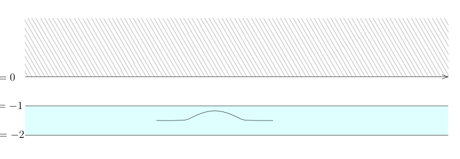

# 73 Dirichlet 问题与半空间扩张

[返回讲义目录](../../math-analysis-lecture-notes.md) · [学期目录](../03-math-analysis-iii.md) · [校勘记录](../errata.md) · [上一篇：72.1 期中测验](72-bounded-sobolev/72-03-p0858-0858.md) · [下一篇：半空间的迹定理与限制正合列](74-trace-theorem.md)

<!-- source: PDF 859; printed: 859; transcription: first-pass; proofreading: applied -->

## 73 Dirichlet 问题的初步研究：存在性与解算子，用全空间上的连续函数逼近上半空间上的 $H^1$ 函数，$H^1$ 函数从半空间到全空间的扩张

在上次课上，我们引入了 Sobolev 空间 $H^1_0(\Omega)$。在这个空间上，我们有两个内积：对任意的 $u, v \in H^1_0(\Omega)$，我们有
$$(u, v)_{H^1} = (u, v)_{L^2} + (\nabla u, \nabla v)_{L^2}, \quad (u, v)_{H^1_0} = (\nabla u, \nabla v)_{L^2}.$$
当 $\Omega$ 是有界区域时，根据 Poincaré 不等式，这两个内积所定义的范数是等价的。

我们首先证明一个在 $H^1_0(\Omega)$ 中的分部积分的结果：

**引理 492**. 对任意的 $u \in H^1_0(\Omega)$，$v \in H^1(\Omega)$，对任意的 $k = 1, 2, \cdots, n$，我们有
$$\int_{\Omega} (\partial_k u) \cdot v \, dx = -\int_{\Omega} u \cdot (\partial_k v) \, dx.$$

**注记**. 直观上，$u$ 在边界上等于 0，所以，边界项的贡献是 0。

**证明：** 当 $u = \varphi \in C^\infty_0(\Omega)$ 时，这个等式就是分布的导数的定义，所以成立。对于一般的 $u$，我们选取一列 $\{\varphi_p\}_{p \geqslant 1} \subset C^\infty_0(\Omega)$，使得 $\varphi_p \xrightarrow{H^1_0(\Omega)} u$。所以，
$$\int_{\Omega} (\partial_k \varphi_p) \cdot v \, dx = -\int_{\Omega} \varphi_p \cdot (\partial_k v) \, dx,$$
从而，推出来
$$\int_{\Omega} (\partial_k u) \cdot v \, dx + \int_{\Omega} u \cdot (\partial_k v) \, dx = -\int_{\Omega} (\partial_k (\varphi_p - u)) \cdot v \, dx - \int_{\Omega} (\varphi_p - u) (\partial_k v) \, dx.$$
由于 $v, \partial_k v \in L^2(\Omega)$ 而 $\varphi_p - u \xrightarrow{L^2(\Omega)} 0$，$\partial_k(\varphi_p - u) \xrightarrow{L^2(\Omega)} 0$，所以当 $p \to \infty$ 时，上面的等式的极限就给出了要证明的等式。 $\square$

另外，这些 Sobolev 空间还有如下的映射性质：
$$H^1(\mathbb{R}^n) \xrightarrow{\quad \partial_k \quad} L^2(\Omega) \xrightarrow{\quad \partial_k \quad} H^{-1}(\Omega),\quad 1\leqslant k\leqslant n.$$
实际上，对任意的 $u \in L^2(\Omega)$，考虑试验函数 $\varphi \in \mathcal{D}(\Omega)$，那么，对任意的 $k \leqslant n$，我们有
$$|\langle \partial_k u, \varphi \rangle| = |\langle u, \partial_k \varphi \rangle| \leqslant \|u\|_{L^2} \|\nabla \varphi\|_{L^2} = C \|\varphi\|_{H^1_0}.$$
这就说明对每个 $k$，$\partial_k u \in H^{-1}(\Omega)$（定义为 $H^1_0(\Omega)$ 的对偶）。

我们现在利用 Poincaré 不等式以及 $H^1_0(\Omega)$ 空间的结构来研究 Dirichlet 问题，即找一个函数 $u$，满足如下微分方程的边值问题：
$$\begin{cases} -\Delta u = f, \\ u|_{\partial \Omega} = 0. \end{cases}$$

<!-- source: PDF 860; printed: 860; transcription: first-pass; proofreading: applied -->

我们采取一种迂回折中的方式来研究上述问题。我们首先给出所求解的一个预设：寻找 $u \in H^1_0(\Omega)$，使得 $-\Delta u = f$。直观上，$H^{-1}$ 可以视作是对 $H^1$ 中的函数求两次导数，此时，我们先要求 $f \in H^{-1}(\Omega)$。我们要求 $u \in H^1_0(\Omega)$ 是出于两个方面的考虑：第一，物理上这个问题来源于经典引力理论或者静电磁理论，这些问题通常要求函数 $u$ 是有限能量的，即 $\nabla u \in L^2(\Omega)$；第二，$H^1_0(\Omega)$ 中的函数可以直观上理解为在 $\partial \Omega$ 上的限制为 0 的函数，所以，在这个类中寻找解可以不再去考虑边界条件（或者说，我们可以自欺欺人地认为这个解满足了边界条件，我们之后会对这个部分做严格讨论）。

由于 $u$ 是分布（按照定义），我们先寻找一个在分布意义下的解，即对任意的试验函数 $\varphi \in \mathcal{D}(\Omega)$，如下的等式成立（这种解在偏微分方程理论中被称作是弱解）：
$$-\langle \Delta u, \varphi \rangle = \langle f, \varphi \rangle \iff \langle \nabla u, \nabla \varphi \rangle = \langle f, \varphi \rangle.$$

由于我们预设的 $u \in H^1_0(\Omega)$，我们把上面的分布等式改写成内积意义下等式：
$$(\nabla \varphi, \overline{\nabla u})_{L^2} = f(\varphi).$$
其中，我们把 $f \in H^{-1}(\Omega)$ 直接写成 $H^1_0(\Omega)$ 上的函数的线性泛函的形式。所以，利用 $H^1_0(\Omega)$ 上的内积，这个问题转化为寻找 $\overline{u} \in H^1_0(\Omega)$，使得
$$(\varphi, \overline{u})_{H^1_0(\Omega)} = f(\varphi).$$
实际上，由于 $f$ 是有界线性泛函，根据 Riesz 表示定理，存在唯一的 $\overline{u} \in H^1_0(\Omega)$，使得对任意的 $v \in H^1_0(\Omega)$，我们都有
$$(v, \overline{u})_{H^1_0(\Omega)} = f(v).$$
所以，我们构造了 Dirichlet 问题的唯一解（在 $H^1_0(\Omega)$ 中的唯一解）。

综上所述，我们得到如下的定理：

**定理 493**. 假设 $\Omega$ 是有界区域（夹在平行的两个超平面之间即可）。那么，对任意的 $f \in H^{-1}(\Omega)$，Dirichlet 问题
$$\begin{cases} -\Delta u = f, \\ u|_{\partial \Omega} = 0. \end{cases}$$
在 $H^1_0(\Omega)$ 中存在唯一的解，即存在唯一的 $u \in H^1_0(\Omega)$，使得在分布的意义下
$$-\Delta u \overset{\mathcal{D}'}{=} f.$$

**注记**. 通过解上述的 Dirichlet 问题，我们可以定义算子
$$(-\Delta)^{-1} : H^{-1}(\Omega) \longrightarrow H^1_0(\Omega), \quad f \mapsto u,$$
其中 $u$ 是 $f$ 所对应的那个唯一的解。对任意的 $v \in H^1_0(\Omega)$，由于
$$|(v, \overline{u})_{H^1_0(\Omega)}| = |f(v)| \leqslant C \|v\|_{H^1_0},$$

<!-- source: PDF 861; printed: 861; transcription: first-pass; proofreading: applied -->

我们总是可以选取 $C = C_2 \|f\|_{H^{-1}}$，所以，当 $v = \overline{u}$ 时，我们有
$$\|u\|^2_{H^1_0} \leqslant C_2 \|f\|_{H^{-1}} \|u\|_{H^1_0} \implies \|u\|_{H^1_0} \leqslant C_2 \|f\|_{H^{-1}},$$
即
$$\|(-\Delta)^{-1}(f)\|_{H^1_0} \leqslant C_2 \|f\|_{H^{-1}}.$$
所以，
$$(-\Delta)^{-1} : H^{-1}(\Omega) \longrightarrow H^1_0(\Omega)$$
是连续线性映射。

**引理 494**. 我们可以将 $L^2(\Omega)$ 实现为 $H^{-1}(\Omega) = \left(H^1_0(\Omega)\right)^*$ 的子空间：对任意的 $f \in L^2(\Omega)$，我们定义
$$T_f : H^1_0(\Omega) \to \mathbb{C}, \quad \psi \mapsto (\psi, \overline{f})_{L^2} = \int_{\Omega} f(x) \psi(x) \, dx.$$
**证明：** 根据 Cauchy-Schwarz 不等式和 Poincaré 不等式，对任意的 $\psi \in H^1_0(\Omega)$ 我们有
$$|T_f(\psi)| \leqslant \|\psi\|_{L^2} \|f\|_{L^2} \leqslant (C \|f\|_{L^2}) \cdot \|\nabla \psi\|_{L^2}.$$
所以，$T_f \in H^{-1}(\Omega)$。 $\square$

我们可以把 $(-\Delta)^{-1}$ 限制在 $L^2(\Omega)$ 上

$$
\begin{array}{ccc}
L^2(\Omega) & \xrightarrow{\quad \iota \quad} & H^{-1}(\Omega) \\
& \underset{(-\Delta)^{-1}}{\searrow} & \quad \downarrow (-\Delta)^{-1} \\
& & H^1_0(\Omega)
\end{array}
$$

这就得到
$$(-\Delta)^{-1} : L^2(\Omega) \longrightarrow H^1_0(\Omega).$$
换而言之，我们把 $f$ 在 $L^2(\Omega)$ 中选取来解 Dirichlet 问题就给出了上述映射。我们还可以进一步把 $H^1_0(\Omega)$ 嵌入到 $L^2(\Omega)$ 中，从而得到

$$
\begin{array}{ccc}
H^{-1}(\Omega) & \xrightarrow{\quad (-\Delta)^{-1} \quad} & H^1_0(\Omega) \\
\uparrow \scriptstyle\iota & & \downarrow \scriptstyle\iota \\
L^2(\Omega) & \xdashrightarrow{\quad (-\Delta)^{-1} \quad} & L^2(\Omega)
\end{array}
$$

这样，我们可以定义 $L^2(\Omega)$ 到自身的**连续线性算子**（因为它是一系列连续算子的复合）：
$$(-\Delta)^{-1} : L^2(\Omega) \longrightarrow L^2(\Omega).$$
我们之后会研究 $(-\Delta)^{-1}$ 的谱理论，即它的特征值和特征向量的性质。

<!-- source: PDF 862; printed: 862; transcription: first-pass; proofreading: applied -->

**命题 495**. 算子
$$(-\Delta)^{-1} : L^2(\Omega) \longrightarrow L^2(\Omega),$$
是连续的正线性算子，即对任意的 $f \in L^2(\Omega)$，我们有
$$\left( (-\Delta)^{-1} f, f \right)_{L^2} \geqslant 0.$$
这个不等式中等号成立当且仅当 $f = 0$。

**证明：** 令 $u = (-\Delta)^{-1} f$，从而 $u \in H^1_0(\Omega)$。按照 $(-\Delta)^{-1}$ 的定义，对任意的 $v \in H^1_0(\Omega)$，我们有
$$(v, \overline{u})_{H^1_0(\Omega)} = f(v).$$
令 $v = \overline{u}$，从而，
$$0 \leqslant (\overline{u}, \overline{u})_{H^1_0(\Omega)} = f(\overline{u}) = \int_{\Omega} f \cdot \overline{(-\Delta)^{-1} f} \, dx.$$
所以，命题中的不等式成立。

进一步，上面不等式中的等号成立当且仅当 $\overline{u} \in H^1_0(\Omega)$ 为 0，这个范数与 $H^1(\Omega)$ 中的范数等价，所以 $u \equiv 0$。 $\square$

**注记** (总结). 我们构造了 Dirichlet 问题的解算子 $(-\Delta)^{-1}$。在这个过程中，我们只是假定了 $H^1_0(\Omega)$ 中的函数满足 $u|_{\partial \Omega}=0$ 的边界条件。我们下面要把这个边界条件讲清楚。为此，我们仍然要回到 $\mathbb{R}^n$ 研究 Sobolev 函数的限制理论。

我们用 $\mathbb{H}^n$ 代表上半空间：
$$\mathbb{H}^n = \left\{ (x', x_n) \in \mathbb{R}^n \;\middle|\; x' = (x_1, \cdots, x_{n-1}) \in \mathbb{R}^{n-1}, x_n > 0 \right\}.$$

**引理 496** (用全空间上的连续函数逼近上半空间上的 $H^1$ 函数). 对任意的 $u \in H^1(\mathbb{H}^n)$，存在 $\{\varphi_k\}_{k \geqslant 1} \subset C^\infty(\mathbb{R}^n)$，使得

1) 对任意的 $k \geqslant 1$，$\varphi_k|_{\mathbb{H}^n} \in H^1(\mathbb{H}^n)$；
2) $u$ 可以被 $\varphi_k|_{\mathbb{H}^n}$ 逼近：
$$\lim_{k \to \infty} \left\| \varphi_k|_{\mathbb{H}^n} - u \right\|_{H^1(\mathbb{H}^n)} = 0.$$

**证明：** 我们首先把 $u$ 延拓成为 $\mathbb{R}^n$ 上的平方可积函数：
$$\widetilde{u}(x) = \begin{cases} u(x), & x_n > 0; \\ 0, & x_n \leqslant 0. \end{cases}$$
我们再把 $\partial_j u$ 延拓成为 $\mathbb{R}^n$ 上的平方可积函数，其中 $j \leqslant n$：
$$\widetilde{\partial_j u}(x) = \begin{cases} \partial_j u(x), & x_n > 0; \\ 0, & x_n \leqslant 0. \end{cases}$$
现在选取截断函数 $\chi$ 使得 $\operatorname{supp}(\chi) \subset \left\{ (x', x_n) \;\middle|\; -2 \leqslant x_n \leqslant -1 \right\}$ 并且 $\int_{\mathbb{R}^n} \chi(x) \, dx = 1$（这个积分的条件保证了各种卷积的收敛性）。

<!-- source: PDF 863; printed: 863; transcription: first-pass; proofreading: applied -->

对任意的 $\varepsilon > 0$, 令
$$
\chi_\varepsilon(x) = \frac{1}{\varepsilon^n} \chi \left( \frac{x}{\varepsilon} \right).
$$

我们定义
$$
\varphi_\varepsilon(x) = \chi_\varepsilon * \tilde{u}.
$$

那么, 对任意的 $j \leqslant n$, 我们有
$$
(\partial_j \varphi_\varepsilon) (x) = (\chi_\varepsilon * (\partial_j \tilde{u})) (x) = \int_{\mathbb{R}^n} (\partial_j\chi_\varepsilon)(x - y) \tilde{u}(y) dy.
$$

当 $x \in \mathbb{H}^n$ 时, 即 $x_n > 0$ 时, 上面的积分中由于 $-2\varepsilon < x_n - y_n < -\varepsilon$ (否则贡献为 0), 所以,
$$
y_n > x_n + \varepsilon.
$$

这表明积分项中我们可以只考虑 $y_n > 0$ 的情况。此时, 我们有
$$
(\partial_j \varphi_\varepsilon) (x) = \int_{\mathbb{R}^n} \chi_\varepsilon(x - y) \widetilde{\partial_j u}(y) dy = \left( \chi_\varepsilon * \widetilde{\partial_j u} \right) (x).
$$

由于
$$
\varphi_\varepsilon = \chi_\varepsilon * \tilde{u} \xrightarrow{L^2(\mathbb{R}^n)} \tilde{u},
$$
$$
\chi_\varepsilon * \widetilde{\partial_j u} \xrightarrow{L^2(\mathbb{R}^n)} \widetilde{\partial_j u},
$$

所以, 限制到 $\mathbb{H}^n$ 上, 我们就有
$$
\varphi_\varepsilon \Big|_{\mathbb{H}^n} \xrightarrow{L^2(\mathbb{H}^n)} u, \quad \partial_j \varphi_\varepsilon \Big|_{\mathbb{H}^n} \xrightarrow{L^2(\mathbb{H}^n)} \partial_j u.
$$
\hfill $\square$

我们现在再证明一个 $H^1$ 的函数从 $\mathbb{H}$ 到 $\mathbb{R}^n$ 的扩张定理:

$$
\begin{array}{c}
H^1 (\mathbb{H}^n) \xrightarrow{\quad \operatorname{Ext}_{\text{Sym}} \quad} H^1 (\mathbb{R}^n) \\
\quad \operatorname{id} \ \searrow \qquad \qquad \downarrow \operatorname{Res} \\
H^1 (\mathbb{H}^n)
\end{array}
$$

<!-- source: PDF 864; printed: 864; transcription: first-pass; proofreading: applied -->

**引理 497** (从 $H^1(\mathbb{H})$ 到 $H^1(\mathbb{R}^n)$ 扩张). 限制映射
$$
\operatorname{Res} : H^1 (\mathbb{R}^n) \to H^1 (\mathbb{H}^n)
$$
是连续的满的线性映射并且存在连续线性的扩张映射
$$
\operatorname{Ext}_{\text{Sym}} : H^1 (\mathbb{H}^n) \to H^1 (\mathbb{R}^n)
$$
使得
$$
\operatorname{Res} \circ \operatorname{Ext}_{\text{Sym}} = \operatorname{id}_{H^1(\mathbb{H}^n)}.
$$

为了证明这个命题, 我们将 Stokes 公式略加推广: 假设 $\Omega$ 是一个有界带边光滑区域, $\nu(x) = (\nu_1(x), \cdots, \nu_n(x))$ 为 $\partial\Omega$ 的单位外法向量, $d\sigma$ 为 $\partial\Omega$ 上的曲面测度, 作为分布, 我们有等式
$$
\partial_k 1_\Omega \overset{\mathcal{D}'(\mathbb{R}^n)}{=} -\nu_k d\sigma,
$$
其中 $k \leqslant n$。

**命题 498** (跳跃公式). 假设 $\Omega \subset \mathbb{R}^n$ 是一个有界带边光滑区域, $\nu(x)$ 为 $\partial\Omega$ 的单位外法向量, $d\sigma$ 为 $\partial\Omega$ 上的曲面测度。假设 $f \in C(\mathbb{R}^n)$ (只要在 $\Omega$ 的一个邻域上定义即可) 并且对某个 $k_0 \leqslant n$, 我们有 $\partial_{k_0} f \in L_{\text{loc}}^1$。那么, 在分布的意义下, 我们有
$$
\partial_{k_0} (f \cdot 1_\Omega) \overset{\mathcal{D}'(\mathbb{R}^n)}{=} (\partial_{k_0} f) \cdot 1_\Omega - (\nu_{k_0} \cdot f) d\sigma.
$$

**证明:** 定理的证明是一系列逼近的过程。首先, 我们选取 $\psi \in C_0^\infty (\mathbb{R}^n)$, 使得 $\psi \Big|_{\Omega_\delta} \equiv 1$ ($\Omega_\delta$ 是到 $\Omega$ 的距离小于 $\delta$ 的点所组成的集合), 我们再令 $g = \psi \cdot f$, 这是一个连续函数, 我们首先说明, 在 $L^1(\mathbb{R}^n)$ 中, 有
$$
\partial_{k_0} g \overset{L^1(\mathbb{R}^n)}{=} f \partial_{k_0} \psi + \psi \partial_{k_0} f.
$$
实际上, 左右两边的项都落在 $L^1(\mathbb{R}^n)$, 所以只要在分布的意义下验证上述式子即可, 这是平凡的。

根据上面的公式, 在 $\Omega$ 上, 我们有
$$
f \equiv g, \quad \partial_{k_0} f \cdot 1_\Omega \equiv \partial_{k_0} g \cdot 1_\Omega,
$$
所以只要对 $g$ 证明跳跃公式即可。

我们用 $g_\varepsilon = \chi_\varepsilon * g$ 来逼近 $g$, 其中 $\chi_\varepsilon$ 是最常用的单位逼近, 此时, 由于 $g$ 是连续有紧支集的函数, 所以, $g_\varepsilon$ 一致地收敛到 $g$。由于 $g_\varepsilon$ 是光滑的, 所以, 根据 Stokes 公式, 我们很容易得到 (把 $g_\varepsilon$ 放到分布配对的右边直接验证即可):
$$
\partial_{k_0} (g_\varepsilon \cdot 1_\Omega) \overset{\mathcal{D}'(\mathbb{R}^n)}{=} (\partial_{k_0} g_\varepsilon) \cdot 1_\Omega - (\nu_{k_0} \cdot g_\varepsilon) d\sigma.
$$

根据 $g_\varepsilon$ 一致地收敛到 $g$, 我们有
$$
g_\varepsilon \cdot 1_\Omega \xrightarrow{\mathcal{D}'(\mathbb{R}^n)} g \cdot 1_\Omega, \quad (\nu_{k_0} \cdot g_\varepsilon) d\sigma \xrightarrow{\mathcal{D}'(\mathbb{R}^n)} (\nu_{k_0} \cdot g) d\sigma,
$$

<!-- source: PDF 865; printed: 865; transcription: first-pass; proofreading: applied -->

所以,
$$
\partial_{k_0} g_\varepsilon \cdot 1_\Omega \xrightarrow{\mathcal{D}'(\mathbb{R}^n)} \partial_{k_0} g \cdot 1_\Omega, \quad (\nu_{k_0} \cdot g_\varepsilon) d\sigma \xrightarrow{\mathcal{D}'(\mathbb{R}^n)} (\nu_{k_0} \cdot g) d\sigma,
$$
只要证明上面等式中右边第一项收敛即可, 实际上, 我们只要证明下面的等式即可:
$$
\partial_{k_0} g_\varepsilon \xrightarrow{L^1(\mathbb{R}^n)} \partial_{k_0} g.
$$
这是因为
$$
\partial_{k_0} g_\varepsilon = (\partial_{k_0} g) * \chi_\varepsilon,
$$
而与 $\chi_\varepsilon$ 卷积在 $L^1$ 中是收敛的。 \hfill $\square$

扩张引理的证明. 限制映射的连续性是显然的。

先假设 $u$ 是 $\mathbb{R}^n$ 上的一个光滑函数 $F$ 的限制 (根据上一个引理, 这样的函数在 $H^1(\mathbb{H}^n)$ 里面是稠密的): $u = F \Big|_{\mathbb{H}^n}$。利用对称扩张, 我们现在构造
$$
\operatorname{Ext}_{\text{Sym}} : C^\infty(\mathbb{R}^n)|_{\mathbb{H}^n} \cap H^1(\mathbb{H}^n) \to H^1(\mathbb{R}^n), \quad u \mapsto \tilde{u}(x', x_n) = \begin{cases} u(x', x_n), & x_n \geqslant 0; \\ u(x', -x_n), & x_n \leqslant 0. \end{cases}
$$

我们注意到 $\tilde{u}$ 是连续映射并且:

- $\tilde{u} \Big|_{x_n \geqslant 0}$ 是光滑函数 $F(x', x_n)$ 的限制;
- $\tilde{u} \Big|_{x_n \leqslant 0}$ 是光滑函数 $F(x', -x_n)$ 的限制;

特别地, 上面这两个限制都将满足跳跃公式中的要求。那么,
$$
\operatorname{Res} \circ \operatorname{Ext}_{\text{Sym}} = \operatorname{id}_{H^1(\mathbb{H}^n)},
$$
明显成立。特别地, 如果 $\operatorname{Ext}_{\text{Sym}}$ 是连续映射, 这个等式表明限制映射 $\operatorname{Res}$ 是满射。

我们下面证明 $\operatorname{Ext}_{\text{Sym}}$ 是连续线性映射。

此时, 根据跳跃公式, 我们显然有
$$
\partial_k \left( \operatorname{Ext}_{\text{Sym}}(u) \right) = \operatorname{Ext}_{\text{Sym}} (\partial_k u), \quad k = 1, 2, \cdots, n - 1.
$$

我们现在计算 $\partial_n \left( \operatorname{Ext}_{\text{Sym}}(u) \right)$:
$$
\begin{aligned}
\partial_n \left( \operatorname{Ext}_{\text{Sym}}(u) \right) &= \partial_n \left( \tilde{u}(x', x_n) \mathbf{1}_{x_n > 0} + \tilde{u}(x', -x_n) \mathbf{1}_{x_n < 0} \right) \\
&= \left( \partial_n F(x', x_n) \mathbf{1}_{x_n > 0} + F dx' \right) - \left( \partial_n F(x', -x_n) \mathbf{1}_{x_n < 0} + F dx' \right) \\
&= (\mathbf{1}_{x_n > 0} - \mathbf{1}_{x_n < 0}) \left( \operatorname{Ext}_{\text{Sym}}(\partial_n u) \right).
\end{aligned}
$$

综合上面的两个等式, 我们自然有
$$
\|\operatorname{Ext}_{\text{Sym}}(u)\|_{H^1(\mathbb{R}^n)} \leqslant \sqrt{2} \|u\|_{H^1(\mathbb{H}^n)}.
$$

<!-- source: PDF 866; printed: 866; transcription: first-pass; proofreading: applied -->

由于 $C^\infty(\mathbb{R}^n)|_{\mathbb{H}^n} \cap H^1(\mathbb{H}^n)$ 在 $H^1(\mathbb{H}^n)$ 是稠密的,

$$
\begin{array}{ccc}
C^\infty (\mathbb{R}^n)|_{\mathbb{H}^n} \cap H^1 (\mathbb{H}^n) & \xrightarrow{\quad \iota \quad} & H^1 (\mathbb{H}^n) \\
\operatorname{Ext}_{\text{Sym}}\Big\downarrow & & \Big\downarrow\operatorname{Ext}_{\text{Sym}} \\
H^1 (\mathbb{R}^n) & \xrightarrow{\quad \operatorname{id} \quad} & H^1 (\mathbb{R}^n)
\end{array}
\qquad
\operatorname{Res}\circ\operatorname{Ext}_{\text{Sym}}=\operatorname{id}_{H^1(\mathbb{H}^n)}.
$$

所以上面 $\operatorname{Ext}_{\text{Sym}}$ 可以被延拓成 $H^1(\mathbb{H}^n)$ 的连续线性映射。证毕。 \hfill $\square$

我们下面要定义到边界上的限制映射
$$
\operatorname{Res} : H^1(\mathbb{H}^n) \to H^{\frac{1}{2}} (\partial(\mathbb{H}^n)).
$$

由于 $H^1(\mathbb{H}^n)$ 中的函数在边界 $\partial\mathbb{H}^n$ (由 $x_n = 0$ 所定义) 上就没有定义, 所以, 如何正确地写下这个映射需要一些仔细的论证。

实际上, 对于每一个 $u \in H^1(\mathbb{H}^n)$, 按照上面的扩张定理, 我们可以找到它在全空间上的扩张
$$
\operatorname{Ext}_{\text{Sym}}(u) \in H^1(\mathbb{R}^n),
$$
所以, 我们可以定义
$$
\operatorname{Res}(u) = \operatorname{Ext}_{\text{Sym}}(u) \Big|_{x_n = 0}.
$$

我们注意到, 尽管我们可以选取一个代表，使得 $\operatorname{Ext}_{\text{Sym}}(u)(x', 0) = 0$, 但是, $\operatorname{Ext}_{\text{Sym}}(u) \Big|_{x_n = 0}$ 未必是 0。当然, 这样的定义也带来了其他的疑问: 我们的扩张映射是人为选取的 (用对称的方法), 如果换一个扩张, 那么得到的结论可能不一样。

我们还有另外一种定义限制映射的方式: 直观上, 对于 $t > 0$, 我们应该不难定义
$$
\operatorname{Res}_t(u) = u \Big|_{x_n = t} \in H^{\frac12}(\mathbb{R}^{n-1}).
$$

这样, 我们得到了映射
$$
\mathbb{R}_{t > 0} \to H^{\frac12}(\mathbb{R}^{n-1}), \quad t \mapsto u \Big|_{x_n = t},
$$
如果我们可以说明这个映射对 $t$ 是连续的, 那么, 我们希望能用下面的极限定义限制映射:
$$
\operatorname{Res}(u) \overset{H^{\frac12}(\mathbb{R}^{n-1})}{=} \lim_{t \to 0^+} u \Big|_{x_n = t}.
$$

我们将看到, 这两种途径在一定意义上是一致的 (第二种途径显然不依赖于扩张的选取而第一种途径更容易计算)。

我们定义如下的空间:
$$
C_b^0 \left( \mathbb{R}, H^s(\mathbb{R}^{n-1}) \right) = \left\{ u : \mathbb{R} \to H^s(\mathbb{R}^{n-1}) \text{连续} \;\middle|\; \text{存在 } M>0, \text{使得对任意 } t \in \mathbb{R}, \text{使得 } \|u(t)\|_{H^s(\mathbb{R}^{n-1})} < M \right\}.
$$

<!-- source: PDF 867; printed: 867; transcription: first-pass; proofreading: applied -->

这里, 由于 $H^s(\mathbb{R}^{n-1})$ 是 (完备) 距离空间, 这里连续性指的就是两个距离空间之间的连续映射。

我们还可以在 $C_b^0\left(\mathbb{R}, H^s(\mathbb{R}^{n-1})\right)$ 上定义如下的范数, 其中, 对任意的 $u \in C_b^0\left(\mathbb{R}, H^s(\mathbb{R}^{n-1})\right)$, 我们令
$$
|||u|||_s = \sup_{t \in \mathbb{R}} \|u(t)\|_{H^s(\mathbb{R}^{n-1})}.
$$

在这个范数下, 我们得到了一个完备的赋范线性空间 $\left(C_b^0\left(\mathbb{R}, H^s(\mathbb{R}^{n-1})\right), |||\cdot|||_s\right)$。实际上, 这是如下抽象结论的推论 (取 $X = H^s(\mathbb{R}^{n-1})$) (这就是一年级关于有界闭区间上连续函数空间是完备的简单推广):

**引理 499**. 假设 $(X, \|\cdot\|)$ 是完备的赋范线性空间, 我们定义
$$
C_b^0(\mathbb{R}, X) = \{u : \mathbb{R} \to X \text{连续} \mid \text{存在 } M>0, \text{使得对任意 } t \in \mathbb{R}, \text{使得 } \|u(t)\| < M\}.
$$

我们在 $C_b^0(\mathbb{R}, X)$ 上定义范数:
$$
|||u||| = \sup_{t \in \mathbb{R}} \|u(t)\|_X,
$$
其中 $u \in C_b^0(\mathbb{R}, X)$, 那么, $\left(C_b^0(\mathbb{R}, X), |||\cdot|||\right)$ 是完备的赋范线性空间。

**证明**: 验证 $\left(C_b^0(\mathbb{R}, X), |||\cdot|||\right)$ 是赋范线性空间是平凡的, 我们现在来证明它的完备性。根据第二学期 (五月七日的课) 关于完备性的级数判定, 我们任选绝对收敛的级数 $\sum_{k=1}^\infty u_k(t)$, 其中, 对任意的 $k \geqslant 1$, $u_k \in C_b^0(\mathbb{R}, X)$, 并且
$$
\sum_{k=1}^\infty |||u_k||| < \infty,
$$

我们要证明 $\sum_{k=1}^\infty u_k(t)$ 在 $C_b^0(\mathbb{R}, X)$ 收敛即可。

首先, 对任意固定的 $t_0 \in \mathbb{R}$, 按照 $|||\cdot|||$ 的定义, 我们有
$$
\sum_{k=1}^\infty \|u_k(t_0)\| \leqslant \sum_{k=1}^\infty |||u_k|||,
$$
所以,
$$
u(t_0) = \sum_{k=1}^\infty u_k(t_0) \in X
$$
是良好定义的 (用到了 $X$ 的完备性)。

现在证明映射
$$
u : \mathbb{R} \to X, \quad t \mapsto u(t)
$$

<!-- source: PDF 868; printed: 868; transcription: first-pass; proofreading: applied -->

是连续的: 实际上, 对任意的 $t_0, \delta \in \mathbb{R}$, 我们有
$$
\begin{aligned}
u(t_0 + \delta) - u(t_0) &= \sum_{k=1}^\infty (u_k(t_0 + \delta) - u_k(t_0)) \\
&= \underbrace{\sum_{k=1}^N (u_k(t_0 + \delta) - u_k(t_0))}_{\text{对 }\delta \to 0\text{ 是连续的}} + \underbrace{\sum_{k \geqslant N+1} (u_k(t_0 + \delta) - u_k(t_0))}_{\|\cdot\| \leqslant 2 \sum_{k \geqslant N+1} |||u_k|||}.
\end{aligned}
$$

对任意的 $\varepsilon > 0$, 利用级数 $\sum_{k=1}^\infty u_k$ 的一致收敛性, 存在 $N$, 使得
$$
\sum_{k \geqslant N+1} |||u_k||| < \frac{\varepsilon}{4}.
$$
固定这个 $N$。利用 $u_k(t)$ 在 $t_0$ 处的连续性, 存在 $\delta_0 > 0$, 使得当 $|\delta| < \delta_0$ 时, 对每个 $k \leqslant N$, 我们有
$$
\|u_k(t_0 + \delta) - u_k(t_0)\| < \frac{\varepsilon}{2N}.
$$
据此, 对任意的 $\varepsilon > 0$, 存在 $\delta_0 > 0$, 使得当 $|\delta| < \delta_0$ 时, 我们有
$$
\|u(t_0 + \delta) - u(t_0)\| < N \times \frac{\varepsilon}{2N} + 2 \times \frac{\varepsilon}{4} = \varepsilon.
$$
这就证明了 $u(t)$ 的连续性。很明显, 对任意的 $t$, 我们还有
$$
\|u(t)\| \leqslant \sum_{k=1}^\infty |||u_k|||.
$$
从而, $u \in C_b^0(\mathbb{R},X)$。

最终, 我们还要说明部分和的收敛:
$$
\lim_{N \to \infty} \left|\left|\left| u(t) - \sum_{k=1}^N u_k(t) \right|\right|\right| = 0.
$$
这是因为对于每个 $t$, 我们有一致的上界:
$$
\left\| u(t) - \sum_{k=1}^N u_k(t) \right\| = \left\| \sum_{k \geqslant N+1} u_k(t) \right\| \leqslant \sum_{k \geqslant N+1} |||u_k|||.
$$
命题得证。 \hfill $\square$

我们下次课程将要证明, 对于 $s>\frac12$，对任意的 $u \in H^s(\mathbb{R}^n)$, 通过把它限制到 $x_n = t$ 这个超平面上, 我们就得到映射
$$
u : \mathbb{R} \to H^{s-\frac{1}{2}}(\mathbb{R}^{n-1}), \quad t \mapsto u\Big|_{x_n=t}.
$$
这个映射是连续并且一致有界的。换而言之, 我们有如下的连续嵌入
$$
\iota : H^s(\mathbb{R}^n) \hookrightarrow C_b^0\left(\mathbb{R}, H^{s-\frac{1}{2}}(\mathbb{R}^{n-1})\right), \quad u \mapsto \left(t \mapsto u\Big|_{x_n=t}\right).
$$

[返回讲义目录](../../math-analysis-lecture-notes.md) · [学期目录](../03-math-analysis-iii.md) · [校勘记录](../errata.md) · [上一篇：72.1 期中测验](72-bounded-sobolev/72-03-p0858-0858.md) · [下一篇：半空间的迹定理与限制正合列](74-trace-theorem.md)
