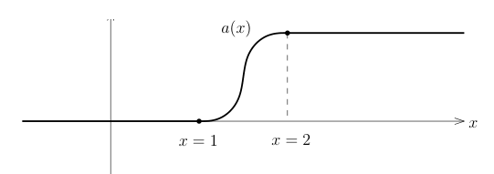

# 74 半空间的迹定理与限制正合列

[返回讲义目录](../../math-analysis-lecture-notes.md) · [学期目录](../03-math-analysis-iii.md) · [校勘记录](../errata.md) · [上一篇：Dirichlet 问题与半空间扩张](73-dirichlet.md) · [下一篇：Sobolev 扩张、局部刻画与曲面上的空间](75-sobolev-extension/75-01-p0876-0884.md)

<!-- source: PDF 869; printed: 869; transcription: first-pass; proofreading: applied -->

## 74 限制（迹）定理的连续性，半空间上 Sobolev 空间的限制（迹）定理，限制的正合列

我们下面说明 $C^0_b \left( \mathbb{R}, H^s(\mathbb{R}^{n-1}) \right)$ 中元素可以被视作是缓增的分布，实际上，我们有嵌入
$$C^0_b \left( \mathbb{R}, H^s(\mathbb{R}^{n-1}) \right) \hookrightarrow \mathcal{S}'(\mathbb{R}^n).$$

首先，对任意的 $u \in C^0_b \left( \mathbb{R}, H^s(\mathbb{R}^{n-1}) \right)$，对任意的 $\varphi \in \mathcal{D}(\mathbb{R}^{n-1} \times \mathbb{R})$，我们定义
$$\langle u, \varphi \rangle = \int_{\mathbb{R}} \langle u(x_n), \varphi(\cdot, x_n) \rangle dx_n.$$

根据 $H^s$ 与 $H^{-s}$ 之间的对偶性，我们有
$$|\langle u, \varphi \rangle| \leqslant \int_{\mathbb{R}} \|u(x_n)\|_{H^s(\mathbb{R}^{n-1})} \|\varphi(x', x_n)\|_{H^{-s}(\mathbb{R}^{n-1}_{x'})} dx_n.$$

此时，存在只依赖于 $s$ 和 $n$ 的常数 $C_0>0$，使得
$$\|\varphi(x', x_n)\|_{H^{-s}(\mathbb{R}^{n-1}_{x'})} \leqslant \frac{C_0}{x_n^2 + 1} N_{\max\{0,\lfloor -s \rfloor\} + 2n + 4}(\varphi).$$

所以，
$$|\langle u,\varphi\rangle|\leqslant C_0|||u|||_s N_{\max\{0,\lfloor -s\rfloor\}+2n+4}(\varphi)\int_{\mathbb R}\frac{dx_n}{x_n^2+1}=C|||u|||_s N_{\max\{0,\lfloor -s\rfloor\}+2n+4}(\varphi).$$

这说明上述定义的配对 $\langle u, \varphi \rangle$ 不仅是分布还是缓增的分布。

下面证明，$C^0_b \left( \mathbb{R}, H^s(\mathbb{R}^{n-1}) \right)$ 中元素到缓增分布的映射是嵌入，即给定 $u \in C^0_b \left( \mathbb{R}, H^s(\mathbb{R}^{n-1}) \right)$，如果对任意的 $\varphi \in \mathcal{D}(\mathbb{R}^n)$，我们都有 $\langle u, \varphi \rangle = 0$，那么，对任意的 $x_n \in \mathbb{R}$，$u(x', x_n) \overset{H^s(\mathbb{R}^{n-1})}{=} 0$。我们选取 $\varphi$ 形如
$$\varphi(x', x_n) = \psi(x') \phi(x_n), \quad \psi(x') \in \mathcal{D}(\mathbb{R}^{n-1}), \; \phi(x_n) \in \mathcal{D}(\mathbb{R}).$$

所以，
$$\langle u, \varphi \rangle = \int_{\mathbb{R}} \langle u(x_n), \psi \rangle \phi(x_n) dx_n.$$

另外，根据
$$|\langle u(x_n), \psi \rangle| \leqslant \|u(x_n)\|_{H^s(\mathbb{R}^{n-1})} \|\psi(x')\|_{H^{-s}(\mathbb{R}^{n-1}_{x'})}$$
所以，$\langle u(x_n), \psi \rangle$ 是 $x_n$ 的有界函数（从而局部上是可积的）。由于这个函数和任意的 $\phi(x_n)$ 配对积分得 $0$，所以，对任意的 $\psi(x') \in \mathcal{D}(\mathbb{R}^{n-1})$，有
$$\langle u(x_n), \psi \rangle \overset{L^1_{\text{loc}}}{=} 0.$$

所以，对几乎处处的 $x_n \in \mathbb{R}$，我们有
$$u(x_n) \overset{\mathcal{D}'}{=} 0.$$

<!-- source: PDF 870; printed: 870; transcription: first-pass; proofreading: applied -->

从而，对几乎处处的 $x_n \in \mathbb{R}$，我们有
$$u(x_n) \overset{H^s(\mathbb{R}^{n-1})}{=} 0.$$

再利用 $u$ 对 $x_n$ 的连续性，我们就证明了 $u \overset{C^0_b(\mathbb{R}, H^s(\mathbb{R}^{n-1}))}{=} 0$。

我们之前已经证明了，对于 $n \geqslant 1, s > \frac{1}{2}$，通过对 $\mathcal{S}(\mathbb{R}^n)$ 上定义的函数进行扩张，我们可以得到有界的限制映射
$$\text{Res} : H^s(\mathbb{R}^n) \longrightarrow H^{s-\frac{1}{2}}(\mathbb{R}^{n-1}_{x_n=0}).$$

这个证明自然和 $x_n = 0$ 的选取没有关系，所以，对任意的 $t$，存在一致的常数 $C > 0$，对任意的 $u \in H^s(\mathbb{R}^n)$，我们有
$$\|\text{Res}(u)\|_{H^{s-\frac{1}{2}}(\mathbb{R}^{n-1}_{x_n=t})} \leqslant C \|u\|_{H^s(\mathbb{R}^n)}.$$

这个 $\text{Res}(u)$ 和 $x_n = t$ 相关，我们把它记做是 $\left. u \right|_{x_n=t}$，于是，我们得到了有界的映射
$$u : \mathbb{R} \rightarrow H^{s-\frac{1}{2}}(\mathbb{R}^{n-1}), \quad t \mapsto \left. u \right|_{x_n=t}.$$

**定理 500**. 设 $s>\frac12$。对任意的 $u \in H^s(\mathbb{R}^n)$，映射
$$u : \mathbb{R} \rightarrow H^{s-\frac{1}{2}}(\mathbb{R}^{n-1}), \quad t \mapsto \left. u \right|_{x_n=t}$$
是连续的，换而言之，我们有如下的连续嵌入
$$\iota : H^s(\mathbb{R}^n) \hookrightarrow C^0_b \left( \mathbb{R}, H^{s-\frac{1}{2}}(\mathbb{R}^{n-1}) \right), \; u \mapsto \left( t \mapsto \left. u \right|_{x_n=t} \right).$$

特别地，存在常数 $C$，使得对任意的 $u \in H^s(\mathbb{R}^n)$，我们有
$$|||\iota(u)|||_{s-\frac{1}{2}} \leqslant C \|u\|_{H^s(\mathbb{R}^n)}.$$

**证明**: 根据之前已有的结论，我们只需要证明
$$u : \mathbb{R} \rightarrow H^{s-\frac{1}{2}}(\mathbb{R}^{n-1}), \quad t \mapsto \left. u \right|_{x_n=t}$$
对 $t$ 的连续性。仿照之前在 $x_n = 0$ 上的限制定理的证明，我们有（我们可以将下面的计算理解为对 Schwartz 函数来做的，一般的情况需要利用逼近来得到，因为这只是例行公事，所以我们不再给出细节）：
$$\mathcal{F}'(u(x', t))(\xi') = \frac{1}{2\pi} \int_{\mathbb{R}} \widehat{u}(\xi', \tau) e^{it\tau} d\tau,$$
其中，$\mathcal{F}'$ 是对前面 $n-1$ 个变量的 Fourier 变换。所以，
$$\mathcal{F}'(u)(\xi', t_1) - \mathcal{F}'(u)(\xi', t_2) = \frac{1}{2\pi} \int_{\mathbb{R}} \widehat{u}(\xi', \tau) \left( e^{it_1\tau} - e^{it_2\tau} \right) d\tau.$$

<!-- source: PDF 871; printed: 871; transcription: first-pass; proofreading: applied -->

所以，如果令 $\sigma = s - \frac{1}{2}$，那么
$$\begin{aligned}
\|u(x', t_1) - u(x', t_2)\|^2_{H^{s-\frac{1}{2}}(\mathbb{R}^{n-1})} &= \int_{\mathbb{R}^{n-1}} (1 + |\xi'|^2)^\sigma |\mathcal{F}'(u)(\xi', t_1) - \mathcal{F}'(u)(\xi', t_2)|^2 d\xi' \\
&= \frac{1}{4\pi^2} \int_{\mathbb{R}^{n-1}} (1 + |\xi'|^2)^\sigma \left| \int_{\mathbb{R}} \widehat{u}(\xi', \tau) \left( e^{it_1\tau} - e^{it_2\tau} \right) d\tau \right|^2 d\xi'.
\end{aligned}$$

根据 Cauchy-Schwarz 不等式，我们有
$$\left| \int_{\mathbb{R}} \widehat{u}(\xi', \tau) \left( e^{it_1\tau} - e^{it_2\tau} \right) d\tau \right|^2 \leqslant \left( \int_{\mathbb{R}} \frac{|e^{it_1\xi_n} - e^{it_2\xi_n}|^2}{(1 + |\xi|^2)^s} d\xi_n \right) \left( \int_{\mathbb{R}} (1 + |\xi|^2)^s |\widehat{u}(\xi', \xi_n)|^2 d\xi_n \right).$$

在上面计算中，$\xi = (\xi', \xi_n)$ 中的 $\xi'$ 是固定的。从而，
$$\begin{aligned}
\int_{\mathbb{R}} \frac{|e^{it_1\xi_n} - e^{it_2\xi_n}|^2}{(1 + |\xi|^2)^s} d\xi_n &= \int_{\mathbb{R}} \frac{|e^{it_1\xi_n} - e^{it_2\xi_n}|^2}{(1 + |\xi'|^2 + \xi_n^2)^s} d\xi_n \\
&= \frac{1}{(1 + |\xi'|^2)^{s-\frac{1}{2}}} \int_{\mathbb{R}} \frac{\left| e^{it_1 \sqrt{1+|\xi'|^2} \frac{\xi_n}{\sqrt{1+|\xi'|^2}}} - e^{it_2 \sqrt{1+|\xi'|^2} \frac{\xi_n}{\sqrt{1+|\xi'|^2}}} \right|^2}{\left( 1 + \left( \frac{\xi_n}{\sqrt{1+|\xi'|^2}} \right)^2 \right)^s} \cdot \frac{d\xi_n}{\sqrt{1+|\xi'|^2}} \\
&= \frac{1}{(1 + |\xi'|^2)^{s-\frac{1}{2}}} \underbrace{\int_{\mathbb{R}} \frac{\left| e^{it_1 \sqrt{1+|\xi'|^2} y} - e^{it_2 \sqrt{1+|\xi'|^2} y} \right|^2}{(1 + |y|^2)^s} dy}_{I(\xi; t_1, t_2)}.
\end{aligned}$$

所以，
$$\begin{aligned}
\|u(x', t_1) - u(x', t_2)\|^2_{H^{s-\frac{1}{2}}(\mathbb{R}^{n-1})} &\leqslant \frac{1}{4\pi^2} \int_{\mathbb{R}^{n-1}} I(\xi; t_1, t_2) \int_{\mathbb{R}} (1 + |\xi|^2)^s |\widehat{u}(\xi', \xi_n)|^2 d\xi_n d\xi' \\
&= \frac{1}{4\pi^2} \int_{\mathbb{R}^n} I(\xi; t_1, t_2) (1 + |\xi|^2)^s |\widehat{u}(\xi)|^2 d\xi.
\end{aligned}$$

我们注意到，按照定义，
$$I(\xi; t_1, t_2) \leqslant \int_{\mathbb{R}} \frac{4}{(1 + |y|^2)^s} dy = 4C_s.$$
是一致有界的（对 $t_1, t_2$ 而言），所以，根据 Lebesgue 控制收敛定理，当 $t_2 \rightarrow t_1$ 时，对任意的 $\xi \in \mathbb{R}^n$，我们都有
$$\lim_{t_2 \rightarrow t_1} I(\xi; t_1, t_2) = 0.$$

再根据
$$\|u(x', t_1) - u(x', t_2)\|^2_{H^{s-\frac{1}{2}}(\mathbb{R}^{n-1})} \leqslant \frac{1}{4\pi^2} \int_{\mathbb{R}^n} I(\xi; t_1, t_2)(1 + |\xi|^2)^s |\widehat{u}(\xi)|^2 d\xi.$$
由于 $I(\xi; t_1, t_2) \leqslant 4C_s$，所以右边是一个可积函数（因为 $u \in H^s(\mathbb{R}^n)$），由于 $\lim_{t_2 \rightarrow t_1} I(\xi; t_1, t_2) = 0$，再次利用 Lebesgue 控制收敛定理，上面不等式的右边就趋向于 $0$。这就完成了连续性的证明。$\square$

<!-- source: PDF 872; printed: 872; transcription: first-pass; proofreading: applied -->

我们现在可以完整地陈述并证明如下的限制性定理
$$\text{Res} : H^1(\mathbb{H}^n) \rightarrow H^{\frac{1}{2}}(\partial(\mathbb{H}^n)).$$

我们提过，由于 $H^1(\mathbb{H}^n)$ 中的函数在边界 $\partial \mathbb{H}^n$ 上就没有定义，这个映射有时候（在英文和法文的文献中总是）被称作是**迹映射**，迹大约代表的是从 $x_n > 0$ 上面取极限所留下的痕迹。

为了定义 $u \in H^1(\mathbb{H}^n)$ 在 $x_n = 0$ 上的迹，根据扩张定理，我们选取 $u$ 在全空间上的扩张
$$\text{Ext}_{\text{Sym}}(u) \in H^1(\mathbb{R}^n),$$
所以，我们令
$$\text{Res}(u) = \left. \text{Ext}_{\text{Sym}}(u) \right|_{x_n=0}.$$

根据我们证明的连续性，我们自然有
$$\text{Res}(u) = \lim_{t \rightarrow 0^+} \left. \text{Ext}_{\text{Sym}}(u) \right|_{x_n=t}.$$

如果我们能说明，当 $t > 0$ 时，
$$\left. \text{Ext}_{\text{Sym}}(u) \right|_{x_n=t} = \left. u \right|_{x_n=t},$$
那么，我们就有
$$\text{Res}(u) = \lim_{t \rightarrow 0^+} \left. u \right|_{x_n=t}.$$
这就给出了 $\text{Res}(u)$ 的定义，而且，这个定义不依赖于扩张的选取。

最终，为了说明当 $t > 0$ 时，我们有
$$\left. \text{Ext}_{\text{Sym}}(u) \right|_{x_n=t} = \left. u \right|_{x_n=t},$$
我们注意到这个等式对于满足 $u = \left. U \right|_{\mathbb{H}^n}$ 是成立的，其中 $U \in C^\infty(\mathbb{R}^n)$。由于这样的函数在 $H^1(\mathbb{H}^n)$ 中是稠密的并且要证明的等式对于 $u \in H^1(\mathbb{H}^n)$ 也是连续的，所以根据连续性，这个等式对于所有 $u \in H^1(\mathbb{H}^n)$ 成立。

**定理 501**. 迹映射
$$\text{Res} : H^1(\mathbb{H}^n) \rightarrow H^{\frac{1}{2}}(\partial(\mathbb{H}^n)),$$
是连续线性映射。进一步，我们有正合列
$$0 \rightarrow H^1_0(\mathbb{H}^n) \xrightarrow{\iota} H^1(\mathbb{H}^n) \xrightarrow{\text{Res}} H^{\frac{1}{2}}(\partial(\mathbb{H}^n)) \rightarrow 0,$$
也就是说 $\text{Res}$ 是满射并且对任意的 $u \in H^1(\mathbb{H}^n)$，$\text{Res}(u) = 0$ 当且仅当 $u \in H^1_0(\mathbb{H}^n)$。

**证明**: 首先证明 $\text{Res}$ 的连续性。实际上，根据
$$\text{Res}(u) = \lim_{t \rightarrow 0^+} \left. u \right|_{x_n=t},$$

<!-- source: PDF 873; printed: 873; transcription: first-pass; proofreading: applied -->

我们知道
$$ \|\mathrm{Res}(u)\|_{H^{\frac12}(\mathbb{R}^{n-1})}=\lim_{t\to0^+}\|u|_{x_n=t}\|_{H^{\frac12}(\mathbb{R}^{n-1})}\leqslant C\|u\|_{H^1(\mathbb{H}^n)}. $$

下面证明上面的序列是正合的：我们注意到 $\iota$ 显然是单射；另外，如果 $u \in H_0^1(\mathbb{H}^n)$，那么，它可以被 $C_0^\infty(\mathbb{H}^n)$ 中的函数逼近，这些函数的迹显然是 $0$，所以，利用 $\mathrm{Res}$ 的连续性，我们就知道 $\mathrm{Res}\vert_{H_0^1(\mathbb{H}^n)} \equiv 0$。

下面假设 $\mathrm{Res}(u) \overset{H^{\frac{1}{2}}(\mathbb{R}^{n-1})}{=} 0$，其中 $u \in H^1(\mathbb{H}^n)$，我们来说明 $u \in H_0^1(\mathbb{H}^n)$。这一部分的证明并不容易，我们分成两步来完成。

第一步，构造 $\underline{u}$ 如下：
$$ \underline{u}(x) = \begin{cases} u(x', x_n), & x_n > 0; \\ 0, & x_n \leqslant 0. \end{cases} $$

最重要的观察是
$$ \mathrm{Res}(u) = \lim_{t\to 0^+} u|_{x_n=t} \overset{H^{\frac{1}{2}}(\mathbb{R}^{n-1})}{=} 0 $$
意味着
$$ \underline{u}(\cdot, x_n) \in C^0_b(\mathbb{R}, H^{\frac{1}{2}}(\mathbb{R}^{n-1})). $$

我们声明，$\underline{u} \in H^1(\mathbb{R}^n)$ 并且对任意的 $k \leqslant n$，我们有
$$ \partial_k \underline{u} = \partial_k u \cdot \mathbf{1}_{x_n > 0}. $$

实际上，我们选取一个光滑截断函数 $a(x)$ 使得对任意的 $x \in \mathbb{R}$，$0 \leqslant a(x) \leqslant 1$；如果 $x \geqslant 2$，那么 $a(x) \equiv 1$；如果 $x \leqslant 1$，那么 $a(x) \equiv 0$。

为了计算 $\partial_k \underline{u}$，我们任选试验函数 $\varphi \in \mathcal{D}(\mathbb{R}^n)$，此时，我们有
$$ \begin{aligned} \langle \partial_k \underline{u}, \varphi \rangle &= -\langle \underline{u}, \partial_k \varphi \rangle = -\int_{\mathbb{R}^n} \underline{u}(x) \partial_k \varphi(x) dx \\ &= -\lim_{\varepsilon \to 0} \int_{\mathbb{R}^n} \underline{u}(x) \underbrace{a\left(\frac{x_n}{\varepsilon}\right)}_{\text{support }\subset \mathbb{H}^n} \partial_k \varphi(x) dx \\ &= -\lim_{\varepsilon \to 0} \int_{\mathbb{H}^n} u(x) a\left(\frac{x_n}{\varepsilon}\right) \partial_k \varphi(x) dx \\ &= \lim_{\varepsilon \to 0} \int_{\mathbb{H}^n} \partial_k u(x) a\left(\frac{x_n}{\varepsilon}\right) \varphi(x) dx + \lim_{\varepsilon \to 0} \int_{\mathbb{H}^n} u(x) \frac{1}{\varepsilon} a'\left(\frac{x_n}{\varepsilon}\right) \delta_k^n \varphi(x) dx. \end{aligned} $$

<!-- source: PDF 874; printed: 874; transcription: first-pass; proofreading: applied -->

根据 Lebesgue 控制收敛定理，我们有
$$ \lim_{\varepsilon \to 0} \int_{\mathbb{H}^n} \partial_k u(x) a\left(\frac{x_n}{\varepsilon}\right) \varphi(x) dx = \int_{\mathbb{H}^n} \partial_k u(x) \varphi(x) dx = \langle \partial_k u \cdot \mathbf{1}_{x_n > 0}, \varphi \rangle. $$

我们需要证明第二个极限消失：
$$ \begin{aligned} \left| \int_{\mathbb{H}^n} u(x) \frac{1}{\varepsilon} a'\left(\frac{x_n}{\varepsilon}\right) \delta_k^n \varphi(x) dx \right| &= \left| \int_{\varepsilon}^{2\varepsilon} \int_{\mathbb{R}^{n-1}} u(x', x_n) \frac{1}{\varepsilon} a'\left(\frac{x_n}{\varepsilon}\right) \delta_k^n \varphi(x', x_n) dx' dx_n \right| \\ &\leqslant \frac{1}{\varepsilon} \int_{\varepsilon}^{2\varepsilon} \underbrace{\left| a'\left(\frac{x_n}{\varepsilon}\right) \right|}_{O(1)} \underbrace{\| u(x', x_n) \|_{H^{\frac{1}{2}}}}_{o(1),\ \varepsilon \to 0} \underbrace{\| \varphi(x', x_n) \|_{H^{-\frac{1}{2}}}}_{O(1)} dx_n \\ &= o(1). \end{aligned} $$

这里，我们用到了 $\mathrm{Res}(u) = 0$ 的条件。这就完成了第一步的证明。

第二步，对任意的 $\delta > 0$，我们定义
$$ u_\delta(x) = \underline{u}(x', x_n - \delta). $$

很容易证明，在 $H^1(\mathbb{R}^n)$ 中，我们有
$$ u_\delta(x) \xrightarrow[\delta\to0^+]{H^1(\mathbb{R}^n)} \underline{u}(x). $$

所以，
$$ v_\delta(x) = u_\delta(x)|_{\mathbb{H}^n} \xrightarrow{H^1(\mathbb{H}^n)} \underline{u}(x)|_{\mathbb{H}^n} = u(x). $$

按照定义，我们有
$$ v_\delta(x) = \begin{cases} u(x', x_n - \delta), & x_n > \delta; \\ 0, & x_n \leqslant \delta. \end{cases} $$

所以，只要证明 $v_\delta \in H_0^1(\mathbb{H}^n)$ 即可，其中，$\delta > 0$ 是固定的。为此，我们先选取 $\{\varphi_p\}_{p \geqslant 1} \subset C_0^\infty(\mathbb{R}^n)$，使得
$$ \varphi_p \xrightarrow{H^1} u_\delta, \quad p \to \infty. $$

我们考虑
$$ \tilde{\varphi}_p(x) = a\left(\frac{2x_n}{\delta}\right) \varphi_p(x). $$

很显然，我们有
$$ \tilde{\varphi}_p \xrightarrow{L^2(\mathbb{R}^n)} u_\delta, \quad p \to \infty. $$

由于
$$ \partial_k \tilde{\varphi}_p = a\left(\frac{2x_n}{\delta}\right) \partial_k \varphi_p(x) + \frac2\delta\delta_k^n a'\left(\frac{2x_n}{\delta}\right) \varphi_p(x), $$

所以，
$$ \partial_k \tilde{\varphi}_p \to a\left(\frac{2x_n}{\delta}\right) \partial_k u_\delta(x) + \frac2\delta\delta_k^n a'\left(\frac{2x_n}{\delta}\right) u_\delta(x), $$

<!-- source: PDF 875; printed: 875; transcription: first-pass; proofreading: applied -->

后一项为 $0$，因为 $a'\left(\frac{2x_n}{\delta}\right)$ 在 $x_n\geqslant\delta$ 时为 $0$，而 $u_\delta$ 在 $x_n\leqslant\delta$ 时为 $0$（几乎处处）。所以，
$$ \tilde{\varphi}_p \xrightarrow{H^1(\mathbb{R}^n)} u_\delta, \quad p \to \infty. $$

从而，(看支集)
$$ H_0^1(\mathbb{H}^n) \ni \tilde{\varphi}_p \xrightarrow{H^1(\mathbb{H}^n)} v_\delta, \quad p \to \infty. $$

这就说明了 $\mathrm{Res}(u) = 0$ 当且仅当 $u \in H_0^1(\mathbb{H}^n)$。

最终，我们还需要证明迹映射
$$ \mathrm{Res} : H^1(\mathbb{H}^n) \twoheadrightarrow H^{\frac{1}{2}}(\partial(\mathbb{H}^n)) $$
是满射。实际上，我们已经证明了
$$ \mathrm{Res} : H^1(\mathbb{R}^n) \twoheadrightarrow H^{\frac{1}{2}}(\partial(\mathbb{H}^n)) $$
是满射。所以，对任意的 $v \in H^{\frac{1}{2}}(\partial(\mathbb{H}^n))$，我们选取 $u \in H^1(\mathbb{R}^n)$ 为它的一个原像，那么 $u|_{\mathbb{H}^n}$ 就是 $v$ 在 $H^1(\mathbb{H}^n)$ 中的一个原像。

综合上述，命题得证。 $\square$

[返回讲义目录](../../math-analysis-lecture-notes.md) · [学期目录](../03-math-analysis-iii.md) · [校勘记录](../errata.md) · [上一篇：Dirichlet 问题与半空间扩张](73-dirichlet.md) · [下一篇：Sobolev 扩张、局部刻画与曲面上的空间](75-sobolev-extension/75-01-p0876-0884.md)
