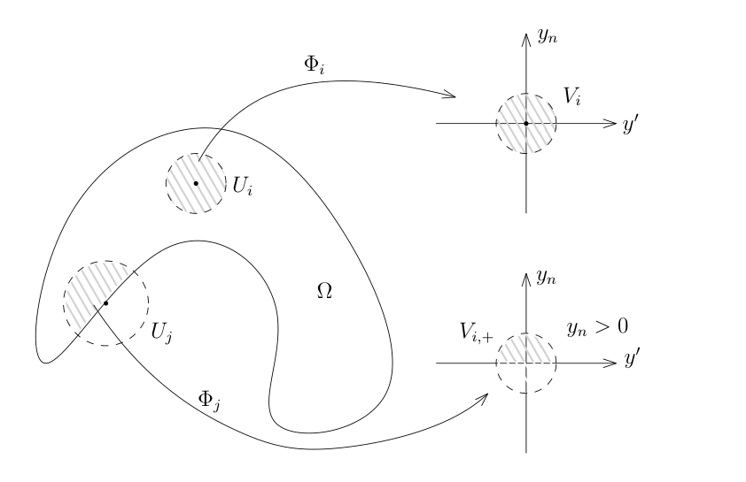

# Sobolev 扩张、局部刻画与曲面上的空间

[返回讲义目录](../../../math-analysis-lecture-notes.md) · [学期目录](../../03-math-analysis-iii.md) · [章节目录](../75-sobolev-extension.md) · [校勘记录](../../errata.md) · [上一篇：半空间的迹定理与限制正合列](../74-trace-theorem.md) · [下一篇：75.1：作业：二维波动方程的基本解，Airy函数与线性KdV方程](75-03-p0885-0888.md)

<!-- source: PDF 876; printed: 876; transcription: first-pass; proofreading: applied -->

## 高阶半空间扩张与迹

前面的课程中，我们对 $H^1(\mathbb{H}^n)$ 中的函数构造了到边界的限制映射并且证明如下的正合列：
$$0 \to H^1_0(\mathbb{H}^n) \xrightarrow{\iota} H^1(\mathbb{H}^n) \xrightarrow{\mathrm{Res}} H^{\frac{1}{2}}(\partial(\mathbb{H}^n)) \to 0.$$

实际上，对于更高的正则性 $H^k$，其中 $k \geqslant 2$，正合列中的迹映射应包含 $0,\ldots,k-1$ 阶法向导数的全部迹。我们回忆一下证明的要点：

- 限制映射（连续线性，满射）：
$$\mathrm{Res} : H^s(\mathbb{R}^n) \twoheadrightarrow H^{s-\frac{1}{2}}(\mathbb{R}^{n-1})$$
对所有的正则性 $s > \frac{1}{2}$ 都成立。

- 用全空间上的连续函数逼近上半空间上的 $H^1$ 函数的引理：对任意的 $u \in H^1(\mathbb{H}^n)$，存在 $\{\varphi_k\}_{k \geqslant 1} \subset C^\infty(\mathbb{R}^n)$，使得

  1) 对任意的 $k \geqslant 1$，$\varphi_k|_{\mathbb{H}^n} \in H^1(\mathbb{H}^n)$；
  2) $u$ 可以被 $\varphi_k|_{\mathbb{H}^n}$ 逼近：
$$\lim_{k \to \infty} \|\varphi_k|_{\mathbb{H}^n} - u\|_{H^1(\mathbb{H}^n)} = 0.$$
这个引理的证明对于任意的 $u \in H^k(\mathbb{H}^n)$ 是一样的（同学们可以自行验证细节）。所以，我们说
$$H^k(\mathbb{H}^n) \cap C^\infty(\mathbb{R}^n)|_{\mathbb{H}^n} \subset H^k(\mathbb{H}^n)$$
是稠密的。

- 关于 $H^k$ 的函数从 $\mathbb{H}$ 到 $\mathbb{R}^n$ 的扩张定理，其中 $k \geqslant 1$。
在 $k = 1$ 时，我们用了对称的延拓 $\mathrm{Ext}_{\mathrm{Sym}}$。

$$\begin{array}{ccc}
H^1(\mathbb{H}^n) & \xrightarrow{\mathrm{Ext}_{\mathrm{Sym}}} & H^1(\mathbb{R}^n) \\
& \underset{\mathrm{id}}{\searrow} & \quad \downarrow \mathrm{Res} \\
& & H^1(\mathbb{H}^n)
\end{array}$$

我们的证明是假设 $u$ 是 $\mathbb{R}^n$ 上的一个光滑函数 $F$ 的限制（一般情况逼近即可）：$u = F|_{\mathbb{H}^n}$。
所谓的对称延拓是：
$$\mathrm{Ext}_{\mathrm{Sym}} : C^\infty(\mathbb{R}^n)|_{\mathbb{H}^n} \cap H^1(\mathbb{H}^n) \to H^1(\mathbb{R}^n), \quad u \mapsto \tilde{u}(x', x_n) = \begin{cases} u(x', x_n), & x_n \geqslant 0; \\ u(x', -x_n), & x_n \leqslant 0. \end{cases}$$

<!-- source: PDF 877; printed: 877; transcription: first-pass; proofreading: applied -->

为了计算它的导数，我们需要验证跳跃公式中的要求，其中，$\tilde{u}$ 在 $x_n = 0$ 处的连续性是重要的。根据跳跃公式，我们证明了
$$\partial_k \left( \mathrm{Ext}_{\mathrm{Sym}}(u) \right) = \mathrm{Ext}_{\mathrm{Sym}} (\partial_k u), \quad k = 1, 2, \cdots, n-1.$$

并且
$$\partial_n \left( \mathrm{Ext}_{\mathrm{Sym}}(u) \right) = (\mathbf{1}_{x_n > 0} - \mathbf{1}_{x_n < 0}) \left( \mathrm{Ext}_{\mathrm{Sym}}(\partial_n u) \right).$$

从而，我们有
$$\|\mathrm{Ext}_{\mathrm{Sym}}(u)\|_{H^1(\mathbb{R}^n)} \leqslant \sqrt{2} \|u\|_{H^1(\mathbb{H}^n)}.$$

由于 $C^\infty(\mathbb{R}^n)|_{\mathbb{H}^n} \cap H^1(\mathbb{H}^n)$ 在 $H^1(\mathbb{H}^n)$ 是稠密的，

然而，我们观察到
$$\partial_n \left( \mathrm{Ext}_{\mathrm{Sym}}(u) \right) = (\mathbf{1}_{x_n > 0} - \mathbf{1}_{x_n < 0}) \left( \mathrm{Ext}_{\mathrm{Sym}}(\partial_n u) \right)$$
在 $x_n = 0$ 处一般并不连续，所以，如果要对 $H^k$ 的函数做同样的延拓，那么，在继续进行第二次求导数的时候，跳跃公式已经不再适用。所以，我们需要适当地修改延拓方式。不管怎么样，如下的定理是成立的：

**引理 502**（从 $H^k(\mathbb{H})$ 到 $H^k(\mathbb{R}^n)$ 扩张）。假设 $k \geqslant 1$ 是整数，那么限制映射
$$\mathrm{Res} : H^k(\mathbb{R}^n) \to H^k(\mathbb{H}^n)$$
是连续的满的线性映射并且存在连续线性的扩张映射
$$\mathrm{Ext} : H^k(\mathbb{H}^n) \to H^k(\mathbb{R}^n)$$
使得
$$\mathrm{Res} \circ \mathrm{Ext} = \mathrm{id}_{H^k(\mathbb{H}^n)}.$$

**证明：** 我们构造一种延拓方式：假设 $u$ 是 $\mathbb{R}^n$ 上光滑函数的限制
$$\mathrm{Ext} : C^\infty(\mathbb{R}^n)|_{\mathbb{H}^n} \cap H^k(\mathbb{H}^n) \to H^k(\mathbb{R}^n), \quad u \mapsto \tilde{u}(x', x_n) = \begin{cases} u(x', x_n), & x_n \geqslant 0; \\ \displaystyle\sum_{0 \leqslant j \leqslant k-1} a_j u(x', -b_j x_n), & x_n < 0. \end{cases}$$

在这个表达式中，我们要求 $0 < b_0 < b_1 < \cdots < b_{k-1}$ 是任意给定的正实数，$\{a_j\}_{0 \leqslant j \leqslant k-1}$ 目前待定。

此时，对关于前面 $n-1$ 个分量的任意多重指标 $\alpha'$，我们都有
$$\partial_{x'}^{\alpha'} \tilde{u}(x', x_n) = \begin{cases} \partial_{x'}^{\alpha'} u(x', x_n), & x_n \geqslant 0; \\ \displaystyle\sum_{0 \leqslant j \leqslant k-1} a_j \partial_{x'}^{\alpha'} u(x', -b_j x_n), & x_n < 0. \end{cases}$$

<!-- source: PDF 878; printed: 878; transcription: first-pass; proofreading: applied -->

再对 $x_n$ 分量求 $\ell$ 次导数（后面的证明我们来验证这一点），我们就得到
$$\partial_{x_n}^\ell \partial_{x'}^{\alpha'} \tilde{u}(x', x_n) = \begin{cases} \partial_{x_n}^\ell \partial_{x'}^{\alpha'} u(x', x_n), & x_n \geqslant 0; \\ \displaystyle\sum_{0 \leqslant j \leqslant k-1} a_j (-b_j)^\ell \partial_{x_n}^\ell \partial_{x'}^{\alpha'} u(x', -b_j x_n), & x_n < 0. \end{cases}$$

为了保证这个函数在 $x_n = 0$ 处是连续的，我们需要
$$\partial_{x_n}^\ell \partial_{x'}^{\alpha'} u(x', 0) = \sum_{0 \leqslant j \leqslant k-1} a_j (-b_j)^\ell \partial_{x_n}^\ell \partial_{x'}^{\alpha'} u(x', 0),$$
即
$$\sum_{0 \leqslant j \leqslant k-1} a_j (-b_j)^\ell = 1.$$

我们要求上面的等式对 $\ell = 0, 1, \cdots, k-1$ 都成立，此时，利用 Vandermonde 行列式，我们知道存在唯一的 $a_0, \cdots, a_{k-1}$ 使得上面的等式均成立。

此时，对任意的 $\alpha'$ 和 $\ell$，只要 $0 \leqslant \ell \leqslant k-1$，$|\alpha'| + \ell \leqslant k$，$\partial_{x_n}^\ell \partial_{x'}^{\alpha'} \tilde{u}(x', x_n)$ 在 $x_n = 0$ 处都是连续的，那么，我们就可以用跳跃公式求它的导数并且保证它们在边界上的贡献恰好消掉。我们下面只计算它们对于 $\partial_n$ 方向的导数，其余方向的导数是更加简单的：

$$\begin{aligned}
& \partial_n \left( \partial_{x_n}^\ell \partial_{x'}^{\alpha'} \tilde{u}(x', x_n) \right) \\
= & \partial_n \left( \partial_{x_n}^\ell \partial_{x'}^{\alpha'} u(x', x_n) \mathbf{1}_{x_n \geqslant 0} \right) + \partial_n \left( \sum_{0 \leqslant j \leqslant k-1} a_j (-b_j)^\ell \partial_{x_n}^\ell \partial_{x'}^{\alpha'} u(x', -b_j x_n) \mathbf{1}_{x_n < 0} \right) \\
= & \partial_{x_n}^{\ell+1} \partial_{x'}^{\alpha'} u(x', x_n) \mathbf{1}_{x_n \geqslant 0} + \partial_{x_n}^\ell \partial_{x'}^{\alpha'} u(x', 0) d\sigma_{x_n=0} \\
& + \sum_{0 \leqslant i \leqslant k-1} a_i (-b_i)^{\ell+1} \partial_{x_n}^{\ell+1} \partial_{x'}^{\alpha'} u(x', -b_i x_n) \mathbf{1}_{x_n < 0} - \sum_{0 \leqslant i \leqslant k-1} a_i (-b_i)^\ell \partial_{x_n}^\ell \partial_{x'}^{\alpha'} u(x', 0) d\sigma_{x_n=0} \\
= & \partial_{x_n}^{\ell+1} \partial_{x'}^{\alpha'} u(x', x_n) \mathbf{1}_{x_n \geqslant 0} + \sum_{0 \leqslant i \leqslant k-1} a_i (-b_i)^{\ell+1} \partial_{x_n}^{\ell+1} \partial_{x'}^{\alpha'} u(x', -b_i x_n) \mathbf{1}_{x_n < 0}.
\end{aligned}$$

这就给出对所有的 $|\alpha'| + \ell \leqslant k$ 的导数的计算，很明显，
$$\left\| \partial_{x_n}^\ell \partial_{x'}^{\alpha'} u(x', x_n) \mathbf{1}_{x_n \geqslant 0} + \sum_{0 \leqslant j \leqslant k-1} a_j (-b_j)^\ell \partial_{x_n}^\ell \partial_{x'}^{\alpha'} u(x', -b_j x_n) \mathbf{1}_{x_n < 0} \right\|_{L^2(\mathbb{R}^n)} \leqslant C \left\| \partial_{x_n}^\ell \partial_{x'}^{\alpha'} u(x', x_n) \right\|_{L^2(\mathbb{H}^n)}.$$

这就证明了延拓的连续性。 $\hfill \square$

- 基于上面几个引理，我们就可以重复上次的证明来说明对任意的整数 $k \geqslant 1$，我们都有如下的正合列：
$$0 \to H^k_0 (\mathbb{H}^n) \xrightarrow{\iota} H^k(\mathbb{H}^n) \xrightarrow{(\mathrm{Res}\,\partial_n^j)_{j=0}^{k-1}} \bigoplus_{j=0}^{k-1} H^{k-j-\frac{1}{2}}(\partial(\mathbb{H}^n)) \to 0.$$

<!-- source: PDF 879; printed: 879; transcription: first-pass; proofreading: applied -->

## 索伯列夫函数的局部刻画

我们现在给出 Sobolev 函数的局部刻画。假设 $\Omega$ 是有界光滑带边的区域（$\bar{\Omega}$ 是紧集），$\mathcal{U} = \{U_j\}_{j \leqslant N}$ 是 $\bar{\Omega}$ 的一个开覆盖，$\{\chi_j\}_{j \leqslant N}$ 是相应的一族单位分解。

**命题 503**。给定 $u \in \mathcal{D}'(\Omega)$，那么如下等价：

1) $u \in H^1(\Omega)$；
2) 对任意的 $j \leqslant N$，$\chi_j \cdot u \in H^1(\Omega)$。

**证明：** 先证明 1) $\Rightarrow$ 2)：很明显，我们有
$$\|\chi_j u\|_{L^2} \leqslant C \|u\|_{L^2},$$
根据分布求导的 Leibniz 公式，我们有
$$\|\nabla(\chi_j u)\|_{L^2} = \|(\nabla \chi_j)u + \chi_j \nabla u\|_{L^2} \leqslant C (\|u\|_{L^2} + \|\nabla u\|_{L^2}).$$
所以，这个方向是成立的。

再证明 2) $\Rightarrow$ 1)：由于
$$u = \sum_{j \leqslant N} \chi_j \cdot u,$$
是有限个 $H^1(\Omega)$ 中元素的线性组合，所以落在 $H^1(\Omega)$ 中。 $\hfill \square$

**注记**。这个命题对于空间 $H^1_0(\Omega)$ 也成立：假设 $\{\varphi_p\}_{p \geqslant 1} \subset C_0^\infty(\Omega)$，使得 $\lim_{p \to \infty} \varphi_p \xrightarrow{H^1} u$，那么，
$$\lim_{p \to \infty} \chi_j \cdot \varphi_p \xrightarrow{H^1} \chi_j \cdot u.$$
证明是平凡的。

对于 $x \in \bar{\Omega}$，我们选取包含 $x$ 的一个开的小球 $U$，这些开集覆盖了 $\bar{\Omega}$。对于 $x \in \partial\Omega$，我们要求 $U$ 选取的足够小，使得存在微分同胚
$$\Phi : U \to V \subset \mathbb{R}^{n-1} \times \mathbb{R}, \quad x \mapsto (y', y_n) = (\Phi'(x), \Phi_n(x)),$$
其中，$V$ 是 $\mathbb{R}^n_y$ 中的开球，并且

- $\Phi(U \cap \Omega) = V_+ = V \cap \{(y', y_n) \mid y_n > 0\}$；
- $\Phi(x)$ 的 $y_n$ 坐标是 $0$。

此时，$\Phi(U \cap \partial\Omega) \subset \{y_n = 0\}$ 被实现为 $\mathbb{R}^n$ 的超平面。

<!-- source: PDF 880; printed: 880; transcription: first-pass; proofreading: applied -->

从这些开集中，我们可以选取 $\overline{\Omega}$ 的一个有限开覆盖 $\{U_j\}_{j\leqslant N}$，与之对应的 $\Phi$ 我们记做是 $\Phi_j$。我们注意到，这些 $U_j$ 们分两种，一种是边界点给出的，另一种是内点给出的（与边界不相交）。

利用与 $\{U_j\}_{j\leqslant N}$ 相适应的单位分解 $\{\chi_j\}_{j\leqslant N}$，对任意的 $u \in H^1(\Omega)$ 和 $u_0 \in H_0^1(\Omega)$，我们知道 $\chi_j \cdot u \in H^1(\Omega)$，$\chi_j \cdot u_0 \in H_0^1(\Omega)$，通过复合，我们得到了 $(\chi_j \cdot u) \circ \Phi_j^{-1}$ 和 $(\chi_j \cdot u_0) \circ \Phi_j^{-1}$，这都是 $V_j$ 或者 $V_{j,+}$ 上的函数。我们不妨研究 $u$ 和 $V_{j,+}$ 的情形（其余类似）。我们现在来说明

$$
(\chi_j \cdot u) \circ \Phi_j^{-1} \in H^1(V_{j,+}).
$$

以下我们用 $U_{j,+}$ 表示 $U_j \cap \Omega$。根据换元积分公式，我们有

$$
\int_{V_{j,+}} \left| (\chi_j \cdot u) \circ \Phi_j^{-1}(y) \right|^2 dy = \int_{U_{j,+}} |(\chi_j \cdot u)(x)|^2 |\operatorname{Jac}(\Phi_j)(x)| dx.
$$

由于上述 Jacobi 行列式是有界的，所以

$$
\int_{V_{j,+}} \left| (\chi_j \cdot u) \circ \Phi_j^{-1}(y) \right|^2 dy \leqslant C \int_{U_{j,+}} |(\chi_j \cdot u)(x)|^2 dx.
$$

另外，根据链式求导公式，我们有

$$
\left| \partial_k \left( (\chi_j \cdot u) \circ \Phi_j^{-1}(y) \right) \right| = \left| \sum_{\ell \leqslant n} \partial_\ell (\chi_j \cdot u) \cdot \partial_k \left( \Phi_j^{-1} \right)_\ell \right| \leqslant C |\nabla(\chi_j \cdot u)|.
$$

所以，重复上面的计算就知道

$$
\int_{V_{j,+}} \left| \nabla \left( (\chi_j \cdot u) \circ \Phi_j^{-1}(y) \right) \right|^2 dy \leqslant C \int_{U_{j,+}} |\nabla(\chi_j \cdot u)(x)|^2 dx.
$$

综合上面的不等式，实际上我们证明了

$$
(\chi_j \cdot u) \circ \Phi_j^{-1} \in H^1(V_{j,+}) \quad \Leftrightarrow \quad \chi_j \cdot u \in H^1(U_{j,+}).
$$

<!-- source: PDF 881; printed: 881; transcription: first-pass; proofreading: applied -->

## 有界区域的扩张与光滑逼近

通过限制，显然有连续线性映射

$$
\operatorname{Res} : H^1(\mathbb{R}^n) \to H^1(\Omega).
$$

利用上述关于 Sobolev 函数的局部描述，我们可以构造扩张映射：

**引理 504**（从 $H^1(\Omega)$ 到 $H^1(\mathbb{R}^n)$ 扩张）。限制映射

$$
\operatorname{Res} : H^1(\mathbb{R}^n) \to H^1(\Omega)
$$

是连续的满的线性映射并且存在连续线性的扩张映射

$$
\operatorname{Ext} : H^1(\Omega) \to H^1(\mathbb{R}^n)
$$

使得

$$
\operatorname{Res} \circ \operatorname{Ext} = \operatorname{id}_{H^1(\Omega)}.
$$

**注记**。上述扩张映射未必是唯一的，它依赖于局部坐标描述的选取等等，请参考证明。

**证明：** 我们把上述构造的覆盖 $\mathcal{U} = \{U_j\}_{j\leqslant N}$ 分成两个部分

$$
\mathcal{U} = \mathcal{U}' \cup \mathcal{U}'' = \{U'_{j'}\}_{j'\leqslant N'} \cup \{U''_{j''}\}_{j''\leqslant N''}.
$$

其中，$\mathcal{U}'$ 中的开集和边界不相交，$\mathcal{U}''$ 中的开集和边界相交。那么，对任意的 $u \in H^1(\Omega)$，我们有

$$
u = \sum_{j'\leqslant N'} \chi'_{j'} u + \sum_{j''\leqslant N''} \chi''_{j''} u.
$$

我们只要能对每个 $\chi'_{j'} u$ 和 $\chi''_{j''} u$ 进行延拓即可。

首先，由于 $\chi'_{j'} u$ 的支集在 $\Omega$ 中，所以我们用 $0$ 进行延拓即可。下面研究 $\chi''_{j''} u$，为了书写简洁，我们仍然用 $\chi_j u$ 表示这个函数，那么，

$$
v_j = (\chi_j u) \circ \Phi_j^{-1} \in H^1(V_{j,+}).
$$

在构造这些覆盖的时候，我们总是可以要求 $V_j$ 是对称的，即 $V_j = \{(y',-y_n)\mid (y',y_n)\in V_j\}$。把 $v_j$ 在 $\mathbb{H}^n\setminus V_{j,+}$ 上用 $0$ 延拓后，我们可以用之前构造的对称的扩张 $\operatorname{Ext}_{\text{sym}}(v_j)$。此时，由于 $\operatorname{supp}(v_j) \subset V_{j,+}$，所以，

$$
\operatorname{supp} \left( \operatorname{Ext}_{\text{sym}}(v_j) \right) \subset V_j = \Phi_j(U_j)
$$

并且是 $H^1$ 的函数。那么，

$$
\tilde{u}_j = \left( \operatorname{Ext}_{\text{sym}}(v_j) \right) \circ \Phi_j
$$

是支集在 $U_j$ 中的具有紧支集的 $H^1(U_j)$ 中的函数，我们可以再把它延拓到 $\mathbb{R}^n$ 上去。

由于上述的覆盖是事先选定的，所以，上述构造的算子是线性的（每一步都是确定的）。 $\square$

作为推论，我们有

<!-- source: PDF 882; printed: 882; transcription: first-pass; proofreading: applied -->

**推论 505**（用全空间上的光滑函数逼近的 $H^1(\Omega)$）。对任意的 $u \in H^1(\Omega)$，存在 $\{\varphi_k\}_{k\geqslant 1} \subset C_0^\infty(\mathbb{R}^n)$，使得 $u$ 可以被 $\left\{ \left. \varphi_k \right|_\Omega \right\}_{k\geqslant 1}$ 逼近：

$$
\lim_{k\to\infty} \left\| \left. \varphi_k \right|_\Omega - u \right\|_{H^1(\Omega)} = 0.
$$

**证明：** 首先，在全空间中，我们能够找到 $\{\varphi_k\}_{k\geqslant 1} \subset C_0^\infty(\mathbb{R}^n)$，使得

$$
\lim_{k\to\infty} \|\varphi_k - \operatorname{Ext}(u)\|_{H^1(\mathbb{R}^n)} = 0.
$$

所以，

$$
\lim_{k\to\infty} \left\| \left. \varphi_k \right|_\Omega - \left. \operatorname{Ext}(u) \right|_\Omega \right\|_{H^1(\Omega)} = 0.
$$

而 $\left. \operatorname{Ext}(u) \right|_\Omega = u$，这就给出了证明。 $\square$

## 曲面上的分数阶索伯列夫空间

我们现在来定义 $H^{\frac{1}{2}}(\partial\Omega)$ 空间。

一种可行的方式是利用局部覆盖：我们上面构造了一族关于 $\overline{\Omega}$ 的覆盖，我们现在只考虑那些和 $\partial\Omega$ 相交的覆盖，不妨还记作是 $\mathcal{U} = \{U_j\}_{j\leqslant N}$，那么，对每个 $j \leqslant N$，我们有微分同胚

$$
\phi_j : U_j \cap (\partial\Omega) \to V'_j \subset \mathbb{R}^{n-1}.
$$

这是之前的 $\Phi_j$ 在 $U_j \cap \partial\Omega$ 上的限制。假设 $u \in L^2(\partial\Omega)$，利用与 $\mathcal{U}$ 相适应的单位分解 $\{\chi_j\}_{j\leqslant N}$，我们就有

$$
u = \sum_{j\leqslant N} \chi_j \cdot u = \sum_{j\leqslant N} u_j,
$$

其中 $\operatorname{supp}(u_j) \subset U_j \cap \partial\Omega$。

那么，当我们说 $u \in H^{\frac{1}{2}}(\partial\Omega)$ 指的是对任意的 $j \leqslant N$，函数 $u_j \circ \phi_j^{-1}$ 作为 $V'_j$ 上的函数是 $H^{\frac{1}{2}}$ 的，这里，因为 $\operatorname{supp}(u_j \circ \phi_j^{-1}) \subset V'_j$，所以，我们可以通过延拓把 $u_j \circ \phi_j^{-1}$ 看作是 $\mathbb{R}^{n-1}$ 上的函数，这就可以谈论 $u_j \circ \phi_j^{-1}$ 是否是 $H^{\frac{1}{2}}$ 的。在此基础上，我们定义

$$
\|u\|_{H^{\frac{1}{2}}(\partial\Omega), \mathcal{U}} = \sum_{j\leqslant N} \|u_j \circ \phi_j^{-1}\|_{H^{\frac{1}{2}}(\mathbb{R}^{n-1})}.
$$

当然，这样定义的 $\|u\|_{H^{\frac{1}{2}}(\partial\Omega)}$ 依赖于覆盖 $\mathcal{U}$ 以及单位分解的选取。我们不难证明（习题），如果采取另一种覆盖 $\mathcal{U}$ 和单位分解，新定义出来的范数与这种定义是等价的，所以，它们所定义的收敛（拓扑）概念是一致的。

我们现在采取另一种方式来定义 $H^{\frac{1}{2}}(\partial\Omega)$ 并且证明上面定义的范数与将要定义的范数是等价的（这就给出了 $\|u\|_{H^{\frac{1}{2}}(\partial\Omega)}$ 不依赖于覆盖 $\mathcal{U}$ 以及单位分解的选取的一种证明）。这个定义依赖于我们已经证明过的命题：当 Sobolev 指标 $0 < s < 1$ 时，$u \in L^2(\mathbb{R}^n)$，那么 $u \in H^s(\mathbb{R}^n)$ 当且仅当

$$
\iint_{\mathbb{R}^n \times \mathbb{R}^n} \frac{|u(x) - u(y)|^2}{|x - y|^{n+2s}} dx dy < \infty.
$$

其中，我们

$$
\|u\|_{H^s(\mathbb{R}^n)}^2 \approx \|u\|_{L^2(\mathbb{R}^n)}^2 + \iint_{\mathbb{R}^n \times \mathbb{R}^n} \frac{|u(x) - u(y)|^2}{|x - y|^{n+2s}} dx dy.
$$

<!-- source: PDF 883; printed: 883; transcription: first-pass; proofreading: applied -->

**定义 506**。我们用 $d\sigma$ 表示 $\partial\Omega$ 上的曲面测度。对于任意的 $u \in L^2(\partial\Omega)$，如果如下的积分是有限的（注意到 $\operatorname{dim}\partial\Omega = n - 1$）：

$$
\iint_{\partial\Omega \times \partial\Omega} \frac{|u(x) - u(y)|^2}{|x - y|^n} d\sigma(x)d\sigma(y) < \infty,
$$

我们就说 $u \in H^{\frac{1}{2}}(\partial\Omega)$。对于 $u \in H^{\frac{1}{2}}(\partial\Omega)$，我们定义范数

$$
\|u\|_{H^{\frac{1}{2}}(\partial\Omega)}^2 = \|u\|_{L^2(\partial\Omega)}^2 + \iint_{\partial\Omega \times \partial\Omega} \frac{|u(x) - u(y)|^2}{|x - y|^n} d\sigma(x)d\sigma(y).
$$

我们可以很容易地验证三角不等式，从而，我们得到了一个范数。

对任意的 $\delta > 0$，很明显，这个范数的定义等价于

$$
\|u\|_{H^{\frac{1}{2}}(\partial\Omega),\delta}^2 = \|u\|_{L^2(\partial\Omega)}^2 + \iint_{\partial\Omega \times \partial\Omega} \frac{|u(x) - u(y)|^2}{|x - y|^n} \mathbf{1}_{|x-y|<\delta} d\sigma(x)d\sigma(y).
$$

（差一个大约是 $\delta^{-(n+1)}$ 的常数）

我们选取 $\partial\Omega$ 的开覆盖 $\mathcal{U}$，我们要求对任意的 $U \in \mathcal{U}$，都有 $\operatorname{diam}(U) < \frac{1}{2}\delta$（直径）。此时，我们有

$$
\|u\|_{H^{\frac{1}{2}}(\partial\Omega)}^2 \leqslant N \sum_{j\leqslant N} \|\chi_j \cdot u\|_{H^{\frac{1}{2}}(\partial\Omega)}^2.
$$

另外，

$$
\iint_{\partial\Omega \times \partial\Omega} \frac{|\chi_j(x)u(x) - \chi_j(y)u(y)|^2}{|x - y|^n} d\sigma(x)d\sigma(y)
$$

$$
\leqslant 2 \iint_{\partial\Omega \times \partial\Omega} \frac{|\chi_j(x)|^2|u(x) - u(y)|^2}{|x - y|^n} d\sigma(x)d\sigma(y) + 2 \iint_{\partial\Omega \times \partial\Omega} \frac{|\chi_j(x) - \chi_j(y)|^2}{|x - y|^n} |u(y)|^2 d\sigma(x)d\sigma(y)
$$

$$
\leqslant 2 \iint_{\partial\Omega \times \partial\Omega} \frac{|u(x) - u(y)|^2}{|x - y|^n} d\sigma(x)d\sigma(y) + C \iint_{\partial\Omega \times \partial\Omega} \frac{1}{|x - y|^{n-2}} |u(y)|^2 d\sigma(x)d\sigma(y).
$$

在上面的估计中，根据 Lagrange 中值定理，我们用 $C|x - y|$ 来控制了 $\chi_j(x) - \chi_j(y)$（这里用到了截断函数的光滑性，$u$ 没有这种光滑性）。

所以，

$$
\|\chi_j \cdot u\|_{H^{\frac{1}{2}}(\partial\Omega)}^2 \leqslant C \|u\|_{H^{\frac{1}{2}}(\partial\Omega)}^2 + C \int_{\partial\Omega} |u(y)|^2 \left( \int_{\partial\Omega} \frac{1}{|x - y|^{n-2}} d\sigma(x) \right) d\sigma(y).
$$

**练习**。证明，存在常数 $C$，使得对任意的 $y$，我们都有

$$
\int_{\partial\Omega} \frac{1}{|x - y|^{n-2}} d\sigma(x) \leqslant C.
$$

据此，

$$
\|\chi_j \cdot u\|_{H^{\frac{1}{2}}(\partial\Omega)}^2 \leqslant C \|u\|_{H^{\frac{1}{2}}(\partial\Omega)}^2.
$$

<!-- source: PDF 884; printed: 884; transcription: first-pass; proofreading: applied -->

所以，如果我们定义

$$
|||u|||_{H^{\frac{1}{2}}(\partial\Omega),\mathcal{U}}^2 = \sum_{j \leqslant N} \|\chi_j \cdot u\|_{H^{\frac{1}{2}}(\partial\Omega)}^2,
$$

那么，范数 $|||\cdot|||_{H^{\frac{1}{2}}(\partial\Omega),\mathcal{U}}$ 与范数 $\|\cdot\|_{H^{\frac{1}{2}}(\partial\Omega)}$ 是等价的。我们下面说明它们都与下面已经定义的范数等价：

$$
\|u\|_{H^{\frac{1}{2}}(\partial\Omega),\mathcal{U}} = \sum_{j \leqslant N} \|u_j \circ \phi_j^{-1}\|_{H^{\frac{1}{2}}(\mathbb{R}^{n-1})}.
$$

[返回讲义目录](../../../math-analysis-lecture-notes.md) · [学期目录](../../03-math-analysis-iii.md) · [章节目录](../75-sobolev-extension.md) · [校勘记录](../../errata.md) · [上一篇：半空间的迹定理与限制正合列](../74-trace-theorem.md) · [下一篇：75.1：作业：二维波动方程的基本解，Airy函数与线性KdV方程](75-03-p0885-0888.md)
