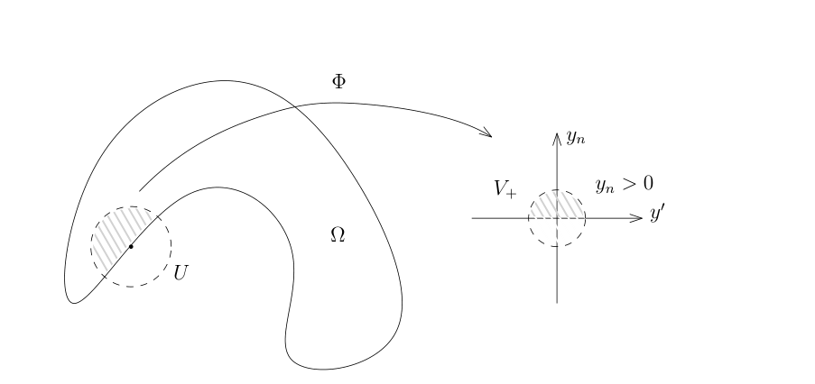

# 子流形的 Sobolev 空间与椭圆边值问题

[返回讲义目录](../../../math-analysis-lecture-notes.md) · [学期目录](../../03-math-analysis-iii.md) · [章节目录](../76-elliptic-boundary.md) · [校勘记录](../../errata.md) · [上一篇：75.1 作业:二维波动方程的基本解,Airy函数与线性KdV方程](../75-sobolev-extension/75-03-p0885-0888.md) · [下一篇：76.1 习题(利用变分与Riesz表示定理解微分方程):一个弹性力学的模型](76-03-p0899-0899.md)

<!-- source: PDF 889; printed: 889; transcription: first-pass; proofreading: applied -->

## 76 子流形上的 Sobolev 空间的定义与等价定义，有界区域上 Sobolev 空间的限制（迹）定理以及限制正合列，Dirichlet 问题的边值的确切含义以及 Dirichlet 问题的解决，位势方程的边值问题的高阶椭圆正则性定理

我们上次课用两种方式定义了 $\partial\Omega$ 上的 $H^{\frac{1}{2}}(\partial\Omega)$ 空间，一种是直接在物理空间里定义的，它所对应的范数是
$$
\|u\|_{H^{\frac{1}{2}}(\partial\Omega)}^2 = \|u\|_{L^2(\partial\Omega)}^2 + \iint_{\partial\Omega \times \partial\Omega} \frac{|u(x) - u(y)|^2}{|x - y|^n} d\sigma(x)d\sigma(y),
$$
其中，我们假设了 $u \in L^2(\partial\Omega)$。

另一种利用了局部覆盖：假设 $\mathcal{U} = \{U_j\}_{j \le N}$ 是 $\partial\Omega$ 的一个开覆盖，那么，对每个 $j \le N$，我们有微分同胚
$$
\Phi_j : U_j \cap \overline{\Omega} \to V_j^+ \subset \mathbb{R}^n_{x_n \ge 0},
$$
是 $\partial\Omega$ 附近的微分同胚，而
$$
\phi_j = \Phi_j\big|_{\partial\Omega \cap U_j} : \partial\Omega \cap U_j \to V_j \subset \mathbb{R}^{n-1}
$$
是微分同胚。假设 $u \in L^2(\partial\Omega)$，利用与 $\mathcal{U}$ 相适应的单位分解 $\{\chi_j\}_{j \le N}$，我们定义
$$
\|u\|_{H^{\frac{1}{2}}(\partial\Omega), \mathcal{U}} = \sum_{j \le N} \|u_j \circ \phi_j^{-1}\|_{H^{\frac{1}{2}}(\mathbb{R}^{n-1})},
$$
其中 $u_j = \chi_j \cdot u$。

利用单位分解我们还可以定义第一种范数的一个局部的版本：
$$
|||u|||_{H^{\frac{1}{2}}(\partial\Omega), \mathcal{U}}^2 = \sum_{j \le N} \|\chi_j \cdot u\|_{H^{\frac{1}{2}}(\partial\Omega)}^2,
$$
我们上次证明了 $|||\cdot|||_{H^{\frac{1}{2}}(\partial\Omega), \mathcal{U}}$ 与范数 $\|\cdot\|_{H^{\frac{1}{2}}(\partial\Omega)}$ 是等价的。

我们这次证明 $|||\cdot|||_{H^{\frac{1}{2}}(\partial\Omega), \mathcal{U}}$ 与 $\|\cdot\|_{H^{\frac{1}{2}}(\partial\Omega), \mathcal{U}}$ 等价。为此，只要对任意的 $j$，证明
$$
\|u_j \circ \phi_j^{-1}\|_{H^{\frac{1}{2}}(\mathbb{R}^{n-1})} \approx \|u_j\|_{H^{\frac{1}{2}}(\partial\Omega)}
$$
即可。这里，$\operatorname{supp}(u_j) \subset U_j \cap \partial\Omega$ 是紧的。通过将覆盖加细，我们总是可以假设局部上 $\partial\Omega$ 是函数的图像。

我们利用微分同胚
$$
\phi_j : U_j \cap (\partial\Omega) \to V' \subset \mathbb{R}^{n-1}.
$$

<!-- source: PDF 890; printed: 890; transcription: first-pass; proofreading: applied -->

其中，$\phi_j$ 是 $\Phi_j$ 在 $\partial\Omega$ 上的限制。实际上，我们有
$$
\|u_j\|_{H^{\frac{1}{2}}(\partial\Omega)}^2 \approx \|u_j\|_{L^2(\partial\Omega)}^2 + \iint_{\phi_j^{-1}(V') \times \phi_j^{-1}(V')} \frac{|u_j(x) - u_j(x')|^2}{|x - x'|^n} d\sigma(x)d\sigma(x')
$$
$$
\approx \|u_j \circ \phi_j^{-1}\|_{L^2(V')}^2 + \iint_{V' \times V'} \frac{\left| \left( u_j \circ \phi_j^{-1} \right)(y) - \left( u_j \circ \phi_j^{-1} \right)(y') \right|^2}{\left| \phi_j^{-1}(y) - \phi_j^{-1}(y') \right|^n} dy dy'
$$
在上一个约等于号中，我们实际上先把测度用函数图像的形式表达，然后利用再乘上坐标变换的 Jacobi 矩阵。这些操作只是在 $dy$ 之前乘了一个上下有界的正的函数，所以我们有上面的约等于号。另外，由于 $\phi_j^{-1}$ 是微分同胚，所以
$$
\left| \phi_j^{-1}(y) - \phi_j^{-1}(y') \right| \approx |y - y'|.
$$
据此，我们知道
$$
\|u_j\|_{H^{\frac{1}{2}}(\partial\Omega)}^2 \approx \|u_j \circ \phi_j^{-1}\|_{L^2(V')}^2 + \iint_{V' \times V'} \frac{\left| \left( u_j \circ \phi_j^{-1} \right)(y) - \left( u_j \circ \phi_j^{-1} \right)(y') \right|^2}{|y - y'|^{n-1+2 \times \frac{1}{2}}} dy dy' \approx \|u_j \circ \phi_j^{-1}\|_{H^{\frac{1}{2}}(\mathbb{R}^{n-1})}^2.
$$
这就证明了两个范数的等价性。

特别地，我们利用范数
$$
\|u\|_{H^{\frac{1}{2}}(\partial\Omega), \mathcal{U}} = \sum_{j \le N} \|\left( \chi_j \cdot u \right) \circ \phi_j^{-1}\|_{H^{\frac{1}{2}}(\mathbb{R}^{n-1})},
$$
可以很方便地证明 $H^{\frac{1}{2}}(\partial\Omega)$ 的完备性：假设 $\{u_p\}_{p \ge 1} \subset H^{\frac{1}{2}}(\partial\Omega)$ 是 Cauchy 列，那么，按照定义，对任意的 $j \le N$，$\{(\chi_j \cdot u_p) \circ \phi_j^{-1}\}_{p \ge 1} \subset H^{\frac{1}{2}}(\mathbb{R}^{n-1})$ 是 Cauchy 列，所以，对每个 $j$，存在具有紧支集的 $v_j \in H^{\frac{1}{2}}(V')$，使得
$$
\lim_{p \to \infty} \left\| (\chi_j \cdot u_p) \circ \phi_j^{-1} - v_j \right\|_{H^{\frac{1}{2}}(\mathbb{R}^{n-1})} = 0.
$$
我们令
$$
u = \sum_{j \le N} v_j \circ \phi_j.
$$
利用 $\|\cdot\|_{H^{\frac{1}{2}}(\partial\Omega)}$ 这个范数，很明显每个 $v_j \circ \phi_j$ 都落在 $H^{\frac{1}{2}}(\partial\Omega)$ 中，所以，$u \in H^{\frac{1}{2}}(\partial\Omega)$。仍然利用这个范数，我们就有
$$
\|u_p - u\|_{H^{\frac{1}{2}}(\partial\Omega)} \le \sum_{j \le N} \|\chi_j \cdot u_p - v_j \circ \phi_j\|_{H^{\frac{1}{2}}(\partial\Omega)}
$$
$$
\approx \sum_{j \le N} \|(\chi_j \cdot u_p) \circ \phi_j^{-1} - v_j\|_{H^{\frac{1}{2}}(\mathbb{R}^{n-1})} \to 0
$$
从而，我们证明了

<!-- source: PDF 891; printed: 891; transcription: first-pass; proofreading: applied -->

**命题 507**. 函数空间 $\left( H^{\frac{1}{2}}(\partial\Omega), \|\cdot\|_{H^{\frac{1}{2}}(\partial\Omega)} \right)$ 是完备内积空间，其中，我们用如下物理空间上的内积
$$
(u_1, u_2)_{H^{\frac{1}{2}}(\partial\Omega)} = (u_1, u_2)_{L^2(\partial\Omega)} + \iint_{\partial\Omega \times \partial\Omega} \frac{(u_1(x) - u_1(y))\left( \overline{u_2(x) - u_2(y)} \right)}{|x - y|^n} d\sigma(x)d\sigma(y).
$$
其中，$u_1, u_2 \in H^{\frac{1}{2}}(\partial\Omega)$。

我们现在来定义限制（迹）映射：

**定理 508**. 假设 $n \ge 1$，$\Omega \subset \mathbb{R}^n$ 是有界带边区域。那么，限制映射
$$
\operatorname{Res} : \mathcal{D}(\mathbb{R}^n) \longrightarrow C^\infty(\partial\Omega)
$$
可以唯一地延拓成连续线性映射
$$
\operatorname{Res} : H^1(\Omega) \longrightarrow H^{\frac{1}{2}}(\partial\Omega)
$$
使得如下的图表是交换的：

$$
\begin{array}{ccc}
\mathcal{D}(\mathbb{R}^n) \cap H^1(\Omega) & \xrightarrow{\operatorname{Res}} & C^\infty(\partial\Omega) \\
\iota \Big\downarrow & & \Big\downarrow \iota \\
H^1(\Omega) & \xrightarrow{\operatorname{Res}} & H^{\frac{1}{2}}(\partial\Omega)
\end{array}
$$
$$
0 \to H_0^1(\Omega) \xrightarrow{\iota} H^1(\Omega) \xrightarrow{\operatorname{Res}} H^{\frac{1}{2}}(\partial\Omega) \to 0,
$$
也就是说 $\operatorname{Res}$ 是满射并且对任意的 $u \in H^1(\Omega)$，$\operatorname{Res}(u) = 0$ 当且仅当 $u \in H_0^1(\Omega)$。

**证明：** 由于我们之前已经证明了 $\mathcal{D}(\mathbb{R}^n) \cap H^1(\Omega)$ 是 $H^1(\Omega)$ 的稠密子空间，所以，我们只要证明存在常数 $C > 0$，使得对任意的光滑函数 $u \in \mathcal{D}(\mathbb{R}^n)$，我们有如下的不等式
$$
\|u\big|_{\partial\Omega}\|_{H^{\frac{1}{2}}(\partial\Omega)} \le C \|u\|_{H^1(\Omega)}.
$$
首先，利用单位分解，我们把 $u$ 写成
$$
u = \sum_{j \le N} \chi_j \cdot u = \sum_{j \le N} u_j.
$$
如果 $\operatorname{supp}(u_j) \cap \partial\Omega = \emptyset$，那么它对限制映射没有贡献。所以，我们可以假设所有的 $\operatorname{supp}(u_j)$ 都与边界相交。对于一个特定的 $u_j$，我们知道
$$
u_j\big|_{\partial\Omega} \circ \phi_j^{-1} = (u_j \circ \Phi_j^{-1})\big|_{y_n=0}.
$$
所以，
$$
\|u_j\big|_{\partial\Omega}\|_{H^{\frac{1}{2}}(\partial\Omega)} \approx \|u_j\big|_{\partial\Omega} \circ \phi_j^{-1}\|_{H^{\frac{1}{2}}(\mathbb{R}^{n-1})} = \|(u_j \circ \Phi_j^{-1})\big|_{y_n=0}\|_{H^{\frac{1}{2}}(\mathbb{R}^{n-1})}
$$
$$
\le C \|u_j \circ \Phi_j^{-1}\|_{H^1(\mathbb{H}^n)} \le C' \|u_j\|_{H^1(\Omega)} \le C'' \|u\|_{H^1(\Omega)}.
$$

<!-- source: PDF 892; printed: 892; transcription: first-pass; proofreading: applied -->

对 $j$ 求和，我们就得到了要证明的不等式。特别地，这就构造了连续的限制映射
$$
\operatorname{Res} : H^1(\Omega) \longrightarrow H^{\frac{1}{2}}(\partial\Omega).
$$
正合列的单射部分是平凡的，我们现在证明如果 $\operatorname{Res}(u) = 0$，那么 $u \in H_0^1(\Omega)$：实际上，我们有
$$
\operatorname{Res}(\chi_j \cdot u) = \chi_j \operatorname{Res}(u) = 0.
$$
所以，只要对 $u_j$ 证明即可。此时，考虑 $u_j \circ \Phi_j^{-1}$，它可以被 $\{\varphi_p\}_{p \ge 1} \subset C_0^\infty(\mathbb{H}^n)$ 在 $H^1(\mathbb{H}^n)$ 中逼近，所以，$\{\varphi_p \circ \Phi_j\}_{p \ge 1}$ 在 $H^1(\Omega)$ 中逼近 $u_j$。这说明 $u_j \in H_0^1(\Omega)$，所以，
$$
u = \sum_{j \le N} u_j \in H_0^1(\Omega).
$$
最后一个关于 $\operatorname{Res}$ 的满射性也可以同样的证明：对任意的 $f \in H^{\frac{1}{2}}(\partial\Omega)$，我们把它写成
$$
f = \sum_{j \le N} \chi_j \cdot f = \sum_{j \le N} f_j.
$$
我们只要对任意的 $j$，找到一个 $u_j \in H^1(\Omega)$，使得 $u_j\big|_{\partial\Omega} = f_j$ 即可。

由于 $f_j \in H^{\frac{1}{2}}(\partial\Omega \cap U_j)$，我们要转化到 $V_j^+$ 上考虑问题，那么，$f_j \circ \phi_j^{-1} \in H^{\frac{1}{2}}(V_j)$。根据半空间上的限制定理，我们知道存在 $u \in H^1(V_j^+)$ 并且 $u$ 的支集避开图域的人工边界，从而可以在拉回后于图外作零延拓，使得 $u\big|_{y_n=0} = f_j \circ \phi_j^{-1}$，所以，$u_j = u \circ \Phi_j$ 即为所求。 $\square$

这个定理的证明可以原封不动地用来证明：

**定理 509**. 假设 $n \ge 1$，$k \ge 1$ 是整数，$\Omega \subset \mathbb{R}^n$ 是有界带边区域。那么，限制映射
$$
\operatorname{Res} : \mathcal{D}(\mathbb{R}^n) \longrightarrow C^\infty(\partial\Omega)
$$
可以唯一地延拓成连续线性映射
$$
\operatorname{Res} : H^k(\Omega) \longrightarrow H^{k-\frac{1}{2}}(\partial\Omega)
$$
记 $\nu$ 为边界外单位法向的光滑延拓，$\operatorname{Res}_j u=(\partial_\nu^j u)|_{\partial\Omega}$。我们还有如下的正合列：
$$
0 \to H_0^k(\Omega) \xrightarrow{\iota} H^k(\Omega) \xrightarrow{(\operatorname{Res}_j)_{0\le j\le k-1}} \bigoplus_{j=0}^{k-1} H^{k-j-\frac{1}{2}}(\partial\Omega) \to 0.
$$

作为这些函数空间理论的应用，我们可以精确地叙述 Dirichlet 边值问题（指的是边界值为 0）：
对于光滑的带边区域 $\Omega \subset \mathbb{R}^n$，对任意的 $f \in H^{-1}(\Omega)$，我们已经证明了存在 $u \in H_0^1(\Omega)$，使得
$$
-\Delta u \overset{\mathcal{D}'}{=} f.
$$
根据我们对 $\operatorname{Res}$ 的了解，我们知道
$$
u\big|_{\partial\Omega} := \operatorname{Res}(u) = 0.
$$
所以，我们证明了如下的定理：

<!-- source: PDF 893; printed: 893; transcription: first-pass; proofreading: applied -->

**定理 510**. 对于有界光滑的带边区域 $\Omega \subset \mathbb{R}^n$, 对任意的 $f \in H^{-1}(\Omega)$, 存在唯一的 $u \in H^1(\Omega)$ 解如下的 Dirichlet 边值问题
$$
\begin{cases}
-\Delta u = f, \\
u\vert_{\partial \Omega} = 0.
\end{cases}
$$

我们还有如下关于边值问题的定理:

**定理 511**. 对于有界光滑的带边区域 $\Omega \subset \mathbb{R}^n$, 对任意的 $g \in H^{\frac{1}{2}}(\partial\Omega)$, 存在唯一的 $u \in H^1(\Omega)$, 使得
$$
\begin{cases}
-\Delta u = 0, \\
u\vert_{\partial \Omega} = g.
\end{cases}
$$

**证明:** 由于
$$
\operatorname{Res} : H^1(\Omega) \twoheadrightarrow H^{\frac{1}{2}}(\partial\Omega)
$$
是满射, 我们选取 $v \in H^1(\Omega)$, 使得 $v\vert_{\partial\Omega} = g$。所以, 上述的问题转化为求解
$$
\begin{cases}
-\Delta \tilde{u} = \tilde{f}, \\
\tilde{u}\vert_{\partial\Omega} = 0.
\end{cases}
$$
其中, $\tilde{u} = u - v$, $\tilde{f} = \Delta v \in H^{-1}(\Omega)$。此时, 我们运用 Dirichlet 边值问题的结论即可。 \hfill $\square$

## 位势方程的椭圆正则性定理

**定理 512**. $\Omega \subset \mathbb{R}^n$ 是有界光滑带边区域, $k \geqslant 1$ 是整数。假设 $u \in H^1(\Omega)$ 满足如下的边值问题:
$$
\begin{cases}
-\Delta u = f, \\
u\vert_{\partial\Omega} = g.
\end{cases}
$$
如果 $f \in H^{k-1}(\Omega)$ 并且 $g \in H^{k+\frac{1}{2}}(\partial\Omega)$, 那么, $u \in H^{k+1}(\Omega)$。

**证明:** 我们先对问题做如下的化简:

- 约化为 Dirichlet 边值: 根据我们限制的正合列, 我们可以选取 $\tilde{g} \in H^{k+1}(\Omega)$, 使得 $\tilde{g}\vert_{\partial\Omega} = g$。通过考虑 $u - \tilde{g}$ (特别地, $\Delta \tilde{g} \in H^{k-1}(\Omega)$), 我们可以在这个问题中假设 $g \equiv 0$。
- 局部化: 我们可以假设 $u$ 的支集很小。实际上, 我们可以选取之前用过的 $\Omega$ 的开覆盖以及相应的单位分解 $\{\chi_j\}_{j \leqslant N}$, 只要说明 $\chi_j \cdot u \in H^{k+1}(\Omega)$ 即可, 这是因为, 此时我们仍有
$$
\chi_j \cdot u\vert_{\partial\Omega} = 0
$$
并且
$$
-\Delta(\chi_j \cdot u) = \chi_j \cdot f - 2\nabla \chi_j \cdot \nabla u - u \cdot \Delta \chi_j.
$$

<!-- source: PDF 894; printed: 894; transcription: first-pass; proofreading: applied -->

我们之后的证明是对 $k$ 进行归纳。$k = 0$ 这个命题是成立的, 如果我们假设了对于一切 $\leqslant k-1$ 的整数命题成立, 此时, 利用归纳假设, $u \in H^k(\Omega)$, 所以, $\nabla \chi_j \cdot \nabla u, u \cdot \Delta\chi_j \in H^{k-1}$, 我们仍然有
$$
-\Delta(\chi_j \cdot u) \in H^{k-1},
$$
所以, 我们只要对这种情况进行证明即可。

我们现在假设 $\operatorname{supp}(u) \subset U$, 其中 $U \subset \mathbb{R}^n$ 是一个开集。利用局部化的结论, 我们只要考虑两种情况: $U \cap \partial\Omega = \emptyset$; $U$ 是某个边界点处的开集。第一种情况的证明可以被第二种情况的证明过程所包含 (请在下面的证明中注意这一点), 所以我们只考虑第二种情况。

此时, 我们选取微分同胚 $\Phi : U \cap \Omega \to V_+ \subset \mathbb{H}^n$, 我们要把问题转化为半空间上的问题 (下面的证明是非常值得推敲)。

我们令 $v = u \circ \Phi^{-1}$, 那么, $u \in H^{k+1}(\Omega)$ 等价于 $v \in H^{k+1}(V_+)$。然而, 我们注意到, 此时, 方程的形式发生了很大的变化: $v$ 在分布的意义下所满足的方程为
$$
-\sum_{1 \leqslant i, j \leqslant n} \delta^{ij} \partial_{x^i} \partial_{x^j}(v\circ\Phi)(x) = f(x),
$$
亦即
$$
-\sum_{1 \leqslant i, j \leqslant n} \delta^{ij} \left( \sum_{1 \leqslant k, l \leqslant n} \frac{\partial \Phi^k}{\partial x^i}(x) \frac{\partial \Phi^l}{\partial x^j}(x) \frac{\partial^2 v}{\partial y^k \partial y^l}(\Phi(x)) + \sum_{1 \leqslant k \leqslant n} \frac{\partial^2 \Phi^k}{\partial x^i \partial x^j}(x) \frac{\partial v}{\partial y^k}(\Phi(x)) \right) = f(x).
$$
这是一个变系数的二阶微分方程, 它看起来很不友好。实际上, 我们对于问题的理解都是在分布意义下的, 所以, 我需要在分布意义下 (或者变分意义下) 理解解的变化, 上面的复杂方程实际上对我们没有用处。

我们的解有如下刻画: 对任意的 $\varphi \in H^1_0(\Omega)$, 我们都有
$$
\int_{\Omega} \nabla u(x) \cdot \overline{\nabla \varphi(x)} dx = \int_{\Omega} f(x) \overline{\varphi(x)} dx.
$$

<!-- source: PDF 895; printed: 895; transcription: first-pass; proofreading: applied -->

通过转换为 $V_+$ 上 $y$ 的坐标系并且令 $\psi(y) = \varphi(\Phi^{-1}(y))$, 其中 $x=\Phi^{-1}(y)$，我们有
$$
\int_{V_+} \nabla(v \circ \Phi(x)) \cdot \overline{\nabla(\psi \circ \Phi(x))} |\operatorname{Jac} \Phi^{-1}(y)| dy = \int_{V_+} f(\Phi^{-1}(y)) \overline{\varphi(\Phi^{-1}(y))} |\operatorname{Jac} \Phi^{-1}(y)| dy.
$$
即
$$
\sum_{1 \leqslant j, k, l \leqslant n} \int_{V_+} \frac{\partial \Phi^k(x)}{\partial x^j} \frac{\partial \Phi^l(x)}{\partial x^j} \frac{\partial v(y)}{\partial y^k} \overline{\frac{\partial \psi(y)}{\partial y^l}} |\operatorname{Jac} \Phi^{-1}(y)| dy = \int_{V_+} f(\Phi^{-1}(y)) \overline{\varphi(\Phi^{-1}(y))} |\operatorname{Jac} \Phi^{-1}(y)| dy.
$$
我们令
$$
b^{kl}(y) = \sum_{1 \leqslant j \leqslant n} \frac{\partial \Phi^k(\Phi^{-1}(y))}{\partial x^j} \frac{\partial \Phi^l(\Phi^{-1}(y))}{\partial x^j} |\operatorname{Jac} \Phi^{-1}(y)| \in C^{\infty}(V_+),
$$
$$
F(y) = f(\Phi^{-1}(y)) |\operatorname{Jac} \Phi^{-1}(y)| \in H^{k-1}(V_+),
$$
我们有
$$
\boxed{ \sum_{1 \leqslant k, l \leqslant n} \int_{V_+} b^{kl}(y) \frac{\partial v(y)}{\partial y^k} \overline{\frac{\partial \psi(y)}{\partial y^l}} dy = \int_{V_+} F(y) \overline{\psi(y)} dy, }
$$
其中, 上面的等式对任意的 $\psi(y) \in H^1_0(V_+)$ 都成立, 这是因为 $\psi(y) = \varphi(\Phi^{-1}(y))$ 可以表示任意 $H^1_0(V_+)$ 中的元素。上面的方框是我们对换坐标之后的表述。我们把方框的左边用一个二次型来记:
$$
B(v, \psi) = \sum_{1 \leqslant k, l \leqslant n} \int_{V_+} b^{kl}(y) \frac{\partial v(y)}{\partial y^k} \overline{\frac{\partial \psi(y)}{\partial y^l}} dy
$$
另一个重要的观察是矩阵 $(b^{kl})_{1 \leqslant k, l \leqslant n}$ 是正定矩阵, 实际上,
$$
(b^{kl}(y)) = |\operatorname{Jac}\Phi^{-1}(y)| J(y)\,{}^tJ(y), \qquad J_{kj}(y)=\frac{\partial\Phi^k}{\partial x^j}(\Phi^{-1}(y)).
$$
所以, 存在常数 $c > 0$, 使得 $(b^{kl}(y))$ 的所有特征值都至少是 $c$ (对任意的 $y \in V_+$ 成立)。这是问题所谓的椭圆性。特别地, 对于 $w \in H^1_0(V_+)$, 我们就有
$$
B(w, w) \geqslant c \|w\|_{H^1_0}^2.
$$

我们现在来证明 $v$ 的正则性, 我们先对 $k = 1$ 来证明 ($k = 0$ 的情况已经完成), 然后对 $k$ 进行归纳。我们要证明 $v \in H^2(V_+)$。这个证明的方法通常被称作是差分方法。

我们考虑平行方向的导数 $\partial_{y_j} v(y', y_n)$, 其中, $j \leqslant n - 1$ (当 $j = n$ 时, 我们将利用方程的结构)。不妨假设 $j = 1$, 那么, 根据分布的知识, 我们知道
$$
\partial_1 v \overset{D'}{=} \lim_{t \to 0} \frac{\tau_t v - v}{t},
$$
其中,
$$
\tau_t v(y_1, \cdots, y_{n-1}, y_n) = v(y_1 + t, \cdots, y_{n-1}, y_n).
$$

<!-- source: PDF 896; printed: 896; transcription: first-pass; proofreading: applied -->

我们的目标是控制 $\|\partial_1 v\|_{H^1}$ (从而, $v$ 才可能落在 $H^2$ 中)。

我们要把 $\frac{\tau_t v - v}{t}$ 代入到方框中的方程里, 所以, 我们先计算
$$
\begin{aligned}
B(\tau_t v, \psi) &= \sum_{1 \leqslant k, l \leqslant n} \int_{V_+} b^{kl}(y) \frac{\partial v(y_1 + t, \cdots)}{\partial y^k} \overline{\frac{\partial \psi(y)}{\partial y^l}} dy \\
&= \sum_{1 \leqslant k, l \leqslant n} \int_{V_+} b^{kl}(y_1 - t, \cdots) \frac{\partial v(y)}{\partial y^k} \overline{\frac{\partial \psi(y_1 - t, \cdots)}{\partial y^l}} dy \\
&= \sum_{1 \leqslant k, l \leqslant n} \int_{V_+} b^{kl}(y) \frac{\partial v(y)}{\partial y^k} \overline{\frac{\partial \tau_{-t}\psi(y)}{\partial y^l}} dy \\
&\quad + \sum_{1 \leqslant k, l \leqslant n} \int_{V_+} (\tau_{-t}b^{kl}(y) - b^{kl}(y)) \frac{\partial v(y)}{\partial y^k} \overline{\frac{\partial \tau_{-t}\psi(y)}{\partial y^l}} dy.
\end{aligned}
$$
从而,
$$
B\left(\frac{\tau_t v - v}{t}, \psi\right) = B\left(v, \frac{\tau_{-t}\psi - \psi}{t}\right) + \underbrace{\sum_{1 \leqslant k, l \leqslant n} \int_{V_+} \frac{\tau_{-t}b^{kl}(y) - b^{kl}(y)}{t} \frac{\partial v(y)}{\partial y^k} \overline{\frac{\partial \tau_{-t}\psi(y)}{\partial y^l}} dy}_{I_t}.
$$
利用 $b$ 的光滑性, $v, \psi \in H^1$ 以及 Cauchy-Schwarz 不等式, 我们得到如下的一致估计:
$$
|I_t| \leqslant C \|v\|_{H^1} \|\psi\|_{H^1}.
$$
所以, 根据
$$
B\left(v, \frac{\tau_{-t}\psi - \psi}{t}\right) = \int_{V_+} F(y) \overline{\frac{\tau_{-t}\psi(y) - \psi(y)}{t}} dy,
$$
我们就有
$$
\begin{aligned}
\left|B\left(\frac{\tau_t v - v}{t}, \psi\right)\right| &\leqslant \left| B\left(v, \frac{\tau_{-t}\psi - \psi}{t}\right) \right| + |I_t| \\
&\leqslant C \left( \|v\|_{H^1} \|\psi\|_{H^1} + \|F\|_{L^2} \left\| \frac{\tau_{-t}\psi(y) - \psi(y)}{t} \right\|_{L^2} \right).
\end{aligned}
$$
利用 Fourier 变换, 我们有
$$
\begin{aligned}
\left\| \frac{\tau_{-t}\psi(y) - \psi(y)}{t} \right\|_{L^2}^2 &\leqslant \frac{1}{(2\pi)^n}\int_{\mathbb{R}^n} \left| \frac{e^{i t \xi_1} - 1}{t} \right|^2 |\hat{\psi}(\xi)|^2 d\xi \\
&\leqslant \frac{1}{(2\pi)^n}\int_{\mathbb{R}^n} |\xi_1|^2 |\hat{\psi}(\xi)|^2 d\xi \leqslant \|\psi\|_{H^1_0}^2.
\end{aligned}
$$
从而, 对任意的 $\psi \in H^1_0(V_+)$, 我们都有如下的不等式
$$
\left|B\left(\frac{\tau_t v - v}{t}, \psi\right)\right| \leqslant C (\|v\|_{H^1} + \|F\|_{L^2}) \|\psi\|_{H^1_0}.
$$

<!-- source: PDF 897; printed: 897; transcription: first-pass; proofreading: applied -->

由于 $v \in H_0^1(V_+)$ 且其支集避开图域的人工边界，对充分小的非零 $t$，我们知道 $\frac{\tau_t v - v}{t} \in H_0^1(V_+)$，我们在上面把 $\psi$ 取成 $\frac{\tau_t v - v}{t}$，利用椭圆性，我们就有
$$
c \left\| \frac{\tau_t v - v}{t} \right\|_{H_0^1}^2 \leqslant C \left( \|v\|_{H^1} + \|F\|_{L^2} \right) \left\| \frac{\tau_t v - v}{t} \right\|_{H_0^1}.
$$
从而，存在常数 $C'$，使得对任意充分小的非零 $t$，我们都有
$$
\left\| \frac{\tau_t v - v}{t} \right\|_{H_0^1} \leqslant C' \left( \|v\|_{H^1} + \|F\|_{L^2} \right).
$$

为了让 $t \to 0$，我们考虑配对
$$
\left| \left\langle \frac{\tau_t \partial_k v - \partial_k v}{t}, \psi \right\rangle \right| \leqslant \left\| \frac{\tau_t \partial_k v - \partial_k v}{t} \right\|_{L^2} \|\psi\|_{L^2} \leqslant C \|\psi\|_{L^2},
$$
其中，$\psi$ 是试验函数，$k \leqslant n$。从而，当 $t \to 0$ 时（此时在分布的意义下有极限），我们得到
$$
|\langle \partial_1 \partial_k v, \psi \rangle| \leqslant C \|\psi\|_{L^2}.
$$

根据 Riesz 表示定理，$\partial_1 \partial_k v \in L^2(V_+)$。

综合上述，我们证明 $\partial_j \partial_k v \in L^2(V_+)$，其中 $j \neq n$。我们现在证明 $\partial_n \partial_n v \in L^2(V_+)$：注意到，$v$ 所满足的方程为
$$
-\sum_{1 \leqslant i,j \leqslant n} \delta^{ij} \left( \sum_{1 \leqslant k,l \leqslant n} \frac{\partial \Phi^k}{\partial x^i}(x) \frac{\partial \Phi^l}{\partial x^j}(x) \frac{\partial^2 v}{\partial y^k \partial y^l}(\Phi(x)) + \sum_{1 \leqslant k \leqslant n} \frac{\partial^2 \Phi^k}{\partial x^i \partial x^j}(x) \frac{\partial v}{\partial y^k}(\Phi(x)) \right) = f(x).
$$
利用矩阵 $(b^{kl})$，我们有
$$
\sum_{1 \leqslant k,l \leqslant n} \left( b^{kl}(y) \frac{\partial^2 v}{\partial y^k \partial y^l}(y) + \underbrace{(\partial_{y^l}b^{kl})(y) \frac{\partial v}{\partial y^k}(y)}_{\in L^2} \right) = \underbrace{-F(y)}_{\in L^2}.
$$
所以，
$$
b^{nn}(y) \frac{\partial^2 v}{\partial y_n^2}(y) + \sum_{k,l \neq (n,n)} b^{kl}(y) \frac{\partial^2 v}{\partial y^k \partial y^l}(y) \in L^2.
$$
由于 $\partial_j \partial_k v \in L^2(V_+)$，其中 $j \neq n$ 并且 $(b^{kl})$ 的正定性意味着 $b^{nn}(y)$ 是有正的下界的光滑函数，所以 $\partial_n^2 v \in L^2(V_+)$。

这就完成了 $k = 1$ 的情况的证明。

对于一般的 $k$，我们进行归纳：假设对于 $\leqslant k - 1$ 的时候，命题都成立，利用方程
$$
\sum_{1 \leqslant k,l \leqslant n} \left( b^{kl}(y) \frac{\partial^2 v}{\partial y^k \partial y^l}(y) + (\partial_{y^l}b^{kl})(y) \frac{\partial v}{\partial y^k}(y) \right) = -F(y),
$$
对任意的 $j \leqslant n - 1$，我们都有
$$
\sum_{1 \leqslant k,l \leqslant n} b^{kl}(y) \frac{\partial^2 (\partial_j v)}{\partial y^k \partial y^l}(y) = - \sum_{1 \leqslant k,l \leqslant n} (\partial_j b^{kl})(y) \frac{\partial^2 v}{\partial y^k \partial y^l}(y) - \partial_j \left( \sum_{1 \leqslant k,l \leqslant n} (\partial_{y^l}b^{kl})(y) \frac{\partial v}{\partial y^k}(y) \right) - \partial_j F(y).
$$

<!-- source: PDF 898; printed: 898; transcription: first-pass; proofreading: applied -->

根据归纳假设 $v \in H^k(V_+) \cap H_0^1(V_+)$，这表明上面表达式的右边落在空间 $H^{k-2}(V_+)$ 中；由于 $\partial_j$ 是和平面边界 $\{y_n=0\}$ 平行方向的导数，我们有 $\partial_j v \in H_0^1(V_+)$，这是因为对于任意的 $\varphi \in C^\infty(\mathbb{R}^n) \cap H^2(\mathbb{H})$，我们有
$$
\operatorname{Res} \circ \partial_j = \partial_j \circ \operatorname{Res},
$$
（这个等式对于 $j = n$ 不成立）利用 $\operatorname{Res}$ 连续性及我们所证明的正合列，如果 $v \in H^k(V_+) \cap H_0^1(V_+)$ 且 $k\ge2$，那么，$\operatorname{Res}(\partial_j v) = 0$，所以 $\partial_j v \in H_0^1(V_+)$。此时，$\partial_j v \in H_0^1(V_+)$ 满足如下的方程：
$$
\sum_{1 \leqslant k,l \leqslant n} b^{kl}(y) \frac{\partial^2 (\partial_j v)}{\partial y^k \partial y^l}(y) \in H^{k-2}(V_+),
$$
并且这个函数满足归纳假设的要求（特别是 $\partial_j v \in H_0^1(V_+)$），从而，对任意的 $j \leqslant n - 1$，我们都有 $\partial_j v \in H^k(V_+)$。最终，为了说明 $v \in H^{k+1}(V_+)$，只需要证明（只差了这一个导数的控制）$\partial_n^{k+1} v \in L^2$。

我们再次利用方程：
$$
b^{nn}(y) \frac{\partial^2 v}{\partial y_n \partial y_n}(y) = - \sum_{(k,l) \neq (n,n)} b^{kl}(y) \frac{\partial^2 v}{\partial y^k \partial y^l}(y) - \sum_{1 \leqslant k,l \leqslant n} (\partial_{y^l}b^{kl})(y) \frac{\partial v}{\partial y^k}(y) - F(y).
$$
对这个方程求 $k - 1$ 次 $\partial_n$ 方向的导数，除了 $b^{nn}(y) \partial_n^{k+1} v(y)$ 之外，其余的项都落在 $L^2$ 中，这就完成了证明。
$\hfill \square$

**推论 513**. $\Omega \subset \mathbb{R}^n$ 是有界光滑带边区域，$u \in H^1(\Omega)$ 满足如下的边值问题：
$$
\begin{cases}
-\Delta u = f, \\
u \big|_{\partial \Omega} = g.
\end{cases}
$$
如果 $f \in C^\infty(\Omega')$，其中 $\Omega'$ 是包含 $\bar{\Omega}$ 的开集，$g \in C^\infty(\partial \Omega)$，那么，$u \in C^\infty(\bar{\Omega})$。

[返回讲义目录](../../../math-analysis-lecture-notes.md) · [学期目录](../../03-math-analysis-iii.md) · [章节目录](../76-elliptic-boundary.md) · [校勘记录](../../errata.md) · [上一篇：75.1 作业:二维波动方程的基本解,Airy函数与线性KdV方程](../75-sobolev-extension/75-03-p0885-0888.md) · [下一篇：76.1 习题(利用变分与Riesz表示定理解微分方程):一个弹性力学的模型](76-03-p0899-0899.md)
