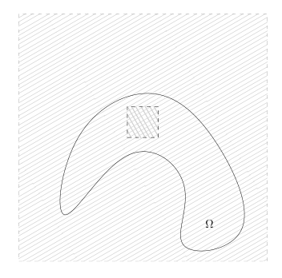

# 79：特征函数、变分原理与特征值增长

[返回讲义目录](../../math-analysis-lecture-notes.md) · [学期目录](../03-math-analysis-iii.md) · [校勘记录](../errata.md) · [上一篇：紧算子谱理论与 Laplace 算子](78-spectral-decomposition.md) · [下一篇：边界正则性与热核的谱构造](80-heat-kernel-spectral.md)

<!-- source: PDF 917; printed: 917; transcription: first-pass; proofreading: applied -->

## 特征函数与函数空间

上次课程，我们证明了如果 $\Omega \subset \mathbb{R}^n$ 是有界的开区域，那么，存在单调上升的无界序列
$$ 0 < \lambda_1 \leqslant \lambda_2 \leqslant \lambda_3 \leqslant \cdots, \quad \lim_{k \to \infty} \lambda_k = +\infty, $$
以及 $L^2(\Omega)$ 的一组 Hilbert 基 $\{\varphi_k\}_{k \geqslant 1}$，使得
$$ -\Delta \varphi_k = \lambda_k \varphi_k. $$
进一步，对任意的 $k \geqslant 1$，我们有 $\varphi_k \in H^1_0(\Omega)$。

**注记。** 我们现在说明，特征函数 $\varphi_k(x)$ 是 $\Omega$ 上的光滑函数。

由于光滑性是局部性质，所以，我们只要证明对任意的 $\chi \in C^\infty_0(\Omega)$，我们都有 $\chi(x)\varphi_k(x) \in C^\infty(\Omega)$ 即可。为了书写方便，我们令 $u = \varphi_k(x)$ 并且 $\lambda = \lambda_k$，所以，
$$ -\Delta u = \lambda u. $$
所以，
$$ -\Delta (\chi \cdot u) = \chi \lambda u - 2 \nabla \chi \cdot \nabla u - u \Delta \chi = \underbrace{(\lambda \chi - \Delta \chi) u}_{\in L^2} - \underbrace{2 \nabla \chi \cdot \nabla u}_{\in L^2}. $$
按照定义，由于 $u \in H^1(\Omega)$，所以右边都是 $L^2$ 的函数，根据 $\Delta$ 的正则性（注意到，由于 $\chi \cdot u$ 的支集远离 $\partial \Omega$，我们不妨假设 $\partial \Omega$ 是光滑的即可），我们知道 $\chi \cdot u \in H^2$。所以，根据 $\chi$ 选取的任意性，$u$ 限制在任意的紧集 $K \subset \Omega$ 上都是 $H^2$ 的。

重复这个做法，由于
$$ -\Delta (\chi \cdot u) = \underbrace{(\lambda \chi - \Delta \chi) u}_{\in H^1} - \underbrace{2 \nabla \chi \cdot \nabla u}_{\in H^1}, $$
所以，$u$ 限制在任意的紧集 $K \subset \Omega$ 上都是 $H^3$ 的。

以此类推，对任意的 $\chi \in C^\infty_0(\Omega)$，$\chi u \in H^k(\mathbb{R}^n)$。根据 Sobolev 嵌入定理，我们就知道 $\chi \cdot u$ 是光滑的。

由于 $\{\varphi_k\}_{k \geqslant 1}$ 是 $L^2(\Omega)$ 的一族 Hilbert 基，所以
$$ L^2(\Omega) = \Big\{ f = \sum_{k=1}^\infty c_k \varphi_k \Big| \sum_{k=1}^\infty |c_k|^2 < \infty \Big\}. $$
利用这些特征函数，我们可以刻画 $L^2(\Omega)$ 的子空间：

<!-- source: PDF 918; printed: 918; transcription: first-pass; proofreading: applied -->

**推论 527**（利用特征函数刻画函数空间）。作为 $L^2(\Omega)$ 的子空间，我们有
$$ H^1_0(\Omega) = \Big\{ f = \sum_{k=1}^\infty c_k \varphi_k \Big| \sum_{k=1}^\infty |c_k|^2 < \infty, \sum_{k=1}^\infty \lambda_k |c_k|^2 < \infty \Big\}. $$
进一步，$\Big\{ \frac{1}{\sqrt{\lambda_k}} \varphi_k \Big\}_{k \geqslant 1}$ 是 $H^1_0(\Omega)$ 的 Hilbert 基，其中，我们在 $H^1_0(\Omega)$ 上用如下的内积：
$$ (f, g)_{H^1_0} = \int_\Omega \nabla f \cdot \overline{\nabla g} dx. $$

**证明：** 这个命题的证明表面上是平凡的，其实蕴涵着分析上很容易被忽略的一个细微但是重要的细节。我们首先回忆 $(-\Delta)^{-1}$ 是自伴算子的证明：对任意的 $f_1, f_2 \in L^2(\Omega)$，令 $u_1 = (-\Delta)^{-1} f_1$，$u_2 = (-\Delta)^{-1} f_2$，我们知道，$u_1, u_2 \in H^1_0(\Omega)$，所以，
$$ ((-\Delta)^{-1} f_1, f_2) = (u_1, -\Delta u_2) = (\nabla u_1, \nabla u_2), $$
这里，我们用到了 $u_1 \in H^1_0(\Omega)$ 事实，请参考[引理 492](73-dirichlet.md#ma-lemma-492)。这一部分的论断表明，对任意的 $u_1, u_2 \in H^1_0(\Omega)$，我们有
$$ (\Delta u_1, u_2)_{L^2} = -(\nabla u_1, \nabla u_2)_{L^2} = (u_1, \Delta u_2)_{L^2}, $$
这个等式的成立强烈地依赖于 $u_1, u_2 \in H^1_0(\Omega)$。

利用上面的等式，我们对每个 $f \in H^1_0(\Omega)$，我们有
$$ (f, \varphi_k)_{H^1_0} = (\nabla f, \nabla \varphi_k)_{L^2} = (f, (-\Delta)\varphi_k)_{L^2} = \lambda_k (f, \varphi_k)_{L^2}. $$
令 $f = \varphi_l$，我们得到
$$ \left( \frac{1}{\sqrt{\lambda_l}} \varphi_l, \frac{1}{\sqrt{\lambda_k}} \varphi_k \right)_{H^1_0} = \delta_{lk}. $$
这表明 $\Big\{ \frac{1}{\sqrt{\lambda_k}} \varphi_k \Big\}_{k \geqslant 1}$ 是一族两两正交的向量，为了说明它们是一族 Hilbert 基，我们只要说明如果对任意的 $k \geqslant 1$，$\left( f, \frac{\varphi_k}{\sqrt{\lambda_k}} \right)_{H^1_0} = 0$，那么 $f = 0$。实际上，根据上面的公式（以及 $\lambda_k > 0$），$\left( f, \frac{\varphi_k}{\sqrt{\lambda_k}} \right)_{H^1_0} = 0$ 意味着 $(f, \varphi_k)_{L^2} = 0$，由于 $\{\varphi_k\}_{k \geqslant 1}$ 是 $L^2(\Omega)$ 的 Hilbert 基，所以，$f = 0$。

现在，每个 $f \in H^1_0$ 都可以写成
$$ f = \sum_{k=1}^\infty c_k \varphi_k = \sum_{k=1}^\infty (\sqrt{\lambda_k} c_k) \cdot \frac{\varphi_k}{\sqrt{\lambda_k}}, $$
从而，
$$ \|f\|_{H^1_0}^2 = \sum_{k \geqslant 1} \lambda_k |c_k|^2. $$
这就完成了证明。 $\square$

<!-- source: PDF 919; printed: 919; transcription: first-pass; proofreading: applied -->

**注记。** 给定 $f \in H^1(\Omega)$，我们自然可以把它写成
$$ f = \sum_{k=1}^\infty c_k \varphi_k, $$
其中 $c_k=(f,\varphi_k)_{L^2}$ 且 $\|f\|_{L^2}^2 = \sum_{k \geqslant 1} |c_k|^2$，因为 $f$ 先验的是 $L^2$ 的。但是，我们未必有
$$ \sum_{k \geqslant 1} \lambda_k |c_k|^2 < \infty. $$
比如说，当 $\Omega = (0, d)$ 时，我们有
$$ \varphi_k(x) = \sqrt{\frac2d}\sin\left(\frac{k\pi}{d} x\right), \quad \lambda_k = \frac{\pi^2 k^2}{d^2}. $$
为了计算方便，我们令 $d = \pi$，即 $\Omega = (0, \pi)$，所以
$$ \varphi_k(x) = \sqrt{\frac2\pi}\sin(kx), \quad \lambda_k = k^2. $$
令 $f(x) \equiv 1$，很明显，$f \in H^1(\Omega) - H^1_0(\Omega)$（它在端点处不为 0）。我们首先计算它在 $L^2$ 意义下的展开：
$$ (f, \varphi_k)_{L^2} = \sqrt{\frac2\pi}\int_0^\pi \sin(kx) dx = \sqrt{\frac2\pi}\frac{1-(-1)^k}{k}. $$
从而，$c_k = \sqrt{\frac2\pi}\frac{1-(-1)^k}{k}$。特别地，我们知道
$$ \sum_{k \geqslant 1} \lambda_k |c_k|^2 = \sum_{k \geqslant 1} k^2 \frac{2(1-(-1)^k)^2}{\pi k^2} = +\infty $$

**注记。** 对任意的 $u_1, u_2 \in H^1_0(\Omega)$，我们有
$$ (\Delta u_1, u_2)_{L^2} = -(\nabla u_1, \nabla u_2)_{L^2} = (u_1, \Delta u_2)_{L^2}, $$
我们令 $u_1 = f, u_2 = \varphi_k$，这表明
$$ (\Delta f, \varphi_k)_{L^2} = (f, \Delta \varphi_k)_{L^2} = -\lambda_k c_k. $$
注意到 $\Delta f \in H^{-1}(\Omega)$ 未必是 $L^2$ 中的元，所以，等式
$$ -\Delta f \stackrel{?}{=} \sum_{k \geqslant 1} \lambda_k c_k \varphi_k, $$
未必有意义。然而，对于任意的 $g \in H^1_0(\Omega)$，由于 $H^{-1}$ 可以实现为 $H^1_0(\Omega)$ 的对偶（连续），所以，如果
$$ g=\sum_{k \geqslant 1} b_k \varphi_k, $$
那么，
$$ \langle -\Delta f, \overline g \rangle = \sum_{k \geqslant 1} \lambda_k c_k \overline{b_k}, $$
这由 $\langle-\Delta f,\overline{\varphi_k}\rangle = \lambda_k c_k$ 以及 $H^{-1}$ 作为 $H^1_0(\Omega)$ 上的连续线性泛函的性质所决定。

<!-- source: PDF 920; printed: 920; transcription: first-pass; proofreading: applied -->

## 特征值的变分原理

我们可以对 $-\Delta$ 的特征值进行如下的变分表述：

**定理 528。** 假设 $u \in H^1_0(\Omega)$ 并且 $u \neq 0$，我们令
$$ R(u) = \frac{\langle -\Delta u, \overline u \rangle_{L^2}}{\|u\|^2} \stackrel{\text{形式上}}{=} \frac{(-\Delta u, u)_{L^2}}{\|u\|^2}. $$
上面的定义之所以有意义是因为 $-\Delta u \in H^{-1}(\Omega)$ 而 $u \in H^1_0(\Omega)$。记 $H = H^1_0(\Omega)$，那么，我们有

1) 对于 $\lambda_1$，我们有
$$ \lambda_1 = \inf_{u \in H, u \neq 0} R(u). $$

2) 对于 $k \geqslant 2$，我们有
$$ \lambda_k = \inf_{\substack{u \perp \varphi_1, \dots, u \perp \varphi_{k-1}, \\ u \neq 0}} R(u), $$
其中，上面的垂直关系是（可以是）用 $L^2$-内积来定义的。

3) 令 $\operatorname{Gr}_{k-1}(H)$ 为 $H$ 的所有 $k-1$ 维线性子空间所构成的集合，其中 $k \geqslant 1$。对于 $P \in \operatorname{Gr}_{k-1}(H)$，令
$$ \mu(P) = \inf_{u \perp P, u \neq 0} R(u). $$
那么，
$$ \lambda_k = \sup_{P \in \operatorname{Gr}_{k-1}(H)} \mu(P). $$

4) 对于 $Q \in \operatorname{Gr}_k(H)$，定义
$$ \nu(Q) = \sup_{u \in Q, u \neq 0} R(u). $$
那么，
$$ \lambda_k = \inf_{Q \in \operatorname{Gr}_k(H)} \nu(Q). $$

**证明：** 我们先证明 1) 和 2)：

考虑 $u = \sum_{k \geqslant 1} c_k \varphi_k \in H^1_0(\Omega)-\{0\}$。由于 $u \perp \varphi_1, \dots, u \perp \varphi_{k-1}$，所以，
$$ u = \sum_{j \geqslant k} \alpha_j \varphi_j $$
从而，（根据定理之前的注记），我们可以计算
$$ \begin{aligned} R(u) &= \frac{\lambda_k |\alpha_k|^2 + \lambda_{k+1} |\alpha_{k+1}|^2 + \cdots}{|\alpha_k|^2 + |\alpha_{k+1}|^2 + \cdots} \\ &\geqslant \frac{\lambda_k |\alpha_k|^2 + \lambda_k |\alpha_{k+1}|^2 + \cdots}{|\alpha_k|^2 + |\alpha_{k+1}|^2 + \cdots} \\ &= \lambda_k. \end{aligned} $$

<!-- source: PDF 921; printed: 921; transcription: first-pass; proofreading: applied -->

另外，$R(\varphi_k) = \lambda_k$，这就给出了 1) 和 2)。

为了证明 3)，我们先选取 $P_k = \varphi_1 \wedge \cdots \wedge \varphi_{k-1}$，这个符号代表的是由 $\varphi_1, \cdots, \varphi_{k-1}$ 所张成的 $k - 1$-维线性子空间。根据上面的计算，我们知道
$$\mu(P_k) = \lambda_k.$$

所以，
$$\sup_{P \in \operatorname{Gr}_{k-1}(H)} \mu(P) \geqslant \lambda_k.$$

为了证明反过来的不等式，我们利用下面的观察：

- 对每一个 $P \in \operatorname{Gr}_{k-1}$，总有不全为零的 $\alpha_1, \cdots, \alpha_k$，使得 $\alpha_1\varphi_1 + \cdots + \alpha_k\varphi_k \perp P$。

这是一道标准的线性代数习题：为了让 $\alpha_1\varphi_1 + \cdots + \alpha_k\varphi_k \perp P$，我们假设 $v_1, \cdots, v_{k-1}$ 是 $P$ 的一组基，那么，这个垂直的条件等价于
$$
\begin{cases}
\alpha_1 \cdot (\varphi_1, v_1) + \cdots + \alpha_k \cdot (\varphi_k, v_1) = 0, \\
\cdots \cdots, \\
\alpha_1 \cdot (\varphi_1, v_{k-1}) + \cdots + \alpha_k \cdot (\varphi_k, v_{k-1}) = 0.
\end{cases}
$$
这是 $k$ 个未知数 $k - 1$ 个方程，所以有解。

利用这个观察，我们有
$$
\begin{aligned}
\mu(P) &\leqslant R(\alpha_1\varphi_1 + \cdots + \alpha_k\varphi_k) \\
&= \frac{\lambda_1|\alpha_1|^2 + \cdots + \lambda_k|\alpha_k|^2}{|\alpha_1|^2 + \cdots + |\alpha_k|^2} \\
&\leqslant \frac{\lambda_k|\alpha_1|^2 + \cdots + \lambda_k|\alpha_k|^2}{|\alpha_1|^2 + \cdots + |\alpha_k|^2} = \lambda_k.
\end{aligned}
$$

所以，
$$\sup_{P \in \operatorname{Gr}_{k-1}(H)} \mu(P) \leqslant \lambda_k.$$

这就证明了 3)。

最后，我们来证明 4)。通过选取 $Q_k = \varphi_1 \wedge \cdots \wedge \varphi_k$，那么，我们有
$$
\begin{aligned}
\nu(Q_k) &= \sup_{\alpha_1, \cdots, \alpha_k \in \mathbb{C}} \frac{(-\Delta(\sum_{j \leqslant k} \alpha_j\varphi_j), \sum_{j \leqslant k} \alpha_j\varphi_j)}{(\sum_{j \leqslant k} \alpha_j\varphi_j, \sum_{j \leqslant k} \alpha_j\varphi_j)} \\
&= \sup_{\alpha_1, \cdots, \alpha_k \in \mathbb{C}} \frac{\lambda_1|\alpha_1|^2 + \cdots + \lambda_k|\alpha_k|^2 + \cdots}{|\alpha_1|^2 + \cdots + |\alpha_k|^2} \\
&\leqslant \sup_{\alpha_1, \cdots, \alpha_k \in \mathbb{C}} \frac{\lambda_k|\alpha_1|^2 + \cdots + \lambda_k|\alpha_k|^2 + \cdots}{|\alpha_1|^2 + \cdots + |\alpha_k|^2} \\
&= \lambda_k.
\end{aligned}
$$

<!-- source: PDF 922; printed: 922; transcription: first-pass; proofreading: applied -->

又因为 $\varphi_k$ 可以实现上面的最大值，所以
$$\nu(Q_k) = \lambda_k.$$

从而，
$$\inf_{Q \in \operatorname{Gr}_k(H)} \nu(Q) \leqslant \lambda_k.$$

为了证明反过来的不等式，我们利用下面的线性代数事实（证明仿照前述）：

- 对每一个 $Q \in \operatorname{Gr}_k$，总有不为零的 $u \in Q$，使得 $u \perp \varphi_1, \cdots, u \perp \varphi_{k-1}$。

据此以及 1) 和 2) 证明的过程，我们有
$$\nu(Q) \geqslant R(u) \geqslant \lambda_k.$$

也就是说，
$$\inf_{Q \in \operatorname{Gr}_k(H)} \nu(Q) \geqslant \lambda_k.$$

这就完成了证明 $\square$

**注记**（$\lambda_1$ 与 Poincaré 不等式）。根据 1)，我们知道对任意的 $u \in H_0^1(\Omega)$，有
$$\|\nabla u\|_{L^2(\Omega)}^2 \geqslant \lambda_1 \|u\|_{L^2(\Omega)}^2.$$

这表明 $\lambda_1$ 是使得 Poincaré 不等式成立的最佳常数。

## 区域比较与特征值增长

**推论 529**（相互包含区域的特征值比较）。给定两个有界开区域 $\Omega_1 \subset \Omega_2 \subset \mathbb{R}^n$，对于每个 $k \geqslant 1$，我们都有
$$\lambda_k(\Omega_1) \geqslant \lambda_k(\Omega_2).$$

**证明：** 通过将函数用零来延拓，我们已经构造了自然的（连续）嵌入映射：
$$\iota : H_0^1(\Omega_1) \to H_0^1(\Omega_2).$$

我们用 $\{\varphi_j\}_{j \geqslant 1}$ 表示 Laplace 算子在小区域 $\Omega_1$ 上的特征函数。根据上面的定理，我们有
$$\lambda_k(\Omega_1) = \sup_{\substack{u \in \varphi_1 \wedge \cdots \wedge \varphi_k \\ u \neq 0}} R(u) = \sup_{\substack{u \in \iota(\varphi_1) \wedge \cdots \wedge \iota(\varphi_k) \\ u \neq 0}} R(u).$$

其中，第二个等号已经开始在 $H_0^1(\Omega_2)$ 中进行计算。所以，
$$
\begin{aligned}
\lambda_k(\Omega_1) &= \sup_{\substack{u \in \iota(\varphi_1) \wedge \cdots \wedge \iota(\varphi_k) \\ u \neq 0}} R(u) \\
&= \nu\left(\iota(\varphi_1) \wedge \cdots \wedge \iota(\varphi_k)\right) \\
&\geqslant \lambda_k(\Omega_2).
\end{aligned}
$$

最后一个不等号利用的是 $\lambda_k(\Omega_2)$ 在 4) 中的表述。证明完毕。 $\square$

<!-- source: PDF 923; printed: 923; transcription: first-pass; proofreading: applied -->

**推论 530**（弱化版本的 Weyl 渐近公式）。对任意的有界开区域 $\Omega$，我们可以找到常数 $c_1$ 和 $c_2$，使得当 $k \to \infty$ 时，我们有
$$c_1 k^{\frac{2}{n}} \leqslant \lambda_k(\Omega) \leqslant c_2 k^{\frac{2}{n}}, \quad k \to \infty.$$

**证明：** 由于 $\Omega$ 是有界开区域，所以我们总能找到 $d, D > 0$，使得 $x_1+(0, d)^n \subset \Omega \subset x_2+(0, D)^n$（分别通过平行移动，这不改变特征值）。从而，根据特征值的比较定理，我们有
$$\lambda_k((0, D)^n) \leqslant \lambda_k(\Omega) \leqslant \lambda_k((0, d)^n).$$

根据我们之前的例子，
$$\lambda_k((0, D)^n) \sim \frac{(2\pi)^2}{|B_n(1)|^{\frac{2}{n}} |D|^2} k^{\frac{2}{n}}, \quad \lambda_k((0, d)^n) \sim \frac{(2\pi)^2}{|B_n(1)|^{\frac{2}{n}} |d|^2} k^{\frac{2}{n}},$$

所以，我们选取
$$c_1 = \frac{(2\pi)^2}{2|B_n(1)|^{\frac{2}{n}} |D|^2}, \quad c_2 = \frac{2(2\pi)^2}{|B_n(1)|^{\frac{2}{n}} |d|^2},$$

即可。 $\square$

[返回讲义目录](../../math-analysis-lecture-notes.md) · [学期目录](../03-math-analysis-iii.md) · [校勘记录](../errata.md) · [上一篇：紧算子谱理论与 Laplace 算子](78-spectral-decomposition.md) · [下一篇：边界正则性与热核的谱构造](80-heat-kernel-spectral.md)
