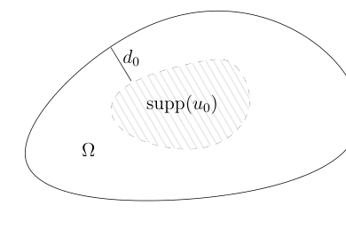

# 81：热核、极大值原理与比较定理

[返回讲义目录](../../math-analysis-lecture-notes.md) · [学期目录](../03-math-analysis-iii.md) · [校勘记录](../errata.md) · [上一篇：边界正则性与热核的谱构造](80-heat-kernel-spectral.md) · [下一篇：热核渐近、Weyl 公式与波前集](82-weyl-wavefront.md)

<!-- source: PDF 936; printed: 936; transcription: first-pass; proofreading: applied -->

## 热核解线性热方程

利用热核，我们可以解热方程：
$$
\begin{cases}
\partial_t u - \Delta u = 0, \\
u \vert_{t=0} = u_0.
\end{cases}
\tag{2}
$$

**注记**。这个基本的想法很可能就是 Fourier 本人的观点：我们把 $u_0$ 分解为最基本的波函数的组合：
$$
u_0 = \sum_{k=1}^{\infty} c_k \varphi_k(x).
$$

对一个基本的频率而言，我们知道
$$
(\partial_t - \Delta) \left( e^{-t\lambda_k} \varphi_k(x) \right) = 0.
$$

所以，我们希望 $u(t, x)$ 就是这些基本的波函数的组合，从而，
$$
\begin{aligned}
u(t, x) &= \sum_{k=1}^{\infty} c_k e^{-t\lambda_k} \varphi_k(x) \\
&= \sum_{k=1}^{\infty} (u_0(y), \varphi_k(y))_{L^2} e^{-t\lambda_k} \varphi_k(x) \\
&= \sum_{k=1}^{\infty} \int_{\Omega} u_0(y) \overline{\varphi_k(y)} dy e^{-t\lambda_k} \varphi_k(x).
\end{aligned}
$$

所以，在形式上，我们就有
$$
\begin{aligned}
u(t, x) &= \int_{\Omega} \sum_{k=1}^{\infty} u_0(y) \overline{\varphi_k(y)} e^{-t\lambda_k} \varphi_k(x) dy \\
&= \int_{\Omega} p(t, x, y) u_0(y) dy.
\end{aligned}
$$

我们现在做严格的推导。

如果 $u_0 \in L^2(\Omega)$，我们假设
$$
u_0(x) = \sum_{k=1}^{\infty} c_k \varphi_k(x),
$$

<!-- source: PDF 937; printed: 937; transcription: first-pass; proofreading: applied -->

其中，$\sum_{k=1}^{\infty} |c_k|^2 < \infty$。此时，对任意的 $t \geqslant 0$，我们首先定义
$$
u(t, x) = \sum_{k=1}^{\infty} c_k e^{-t\lambda_k} \varphi_k(x).
$$
很明显，对任意的 $t \geqslant 0$，$u(t, x) \in L^2(\Omega)$（算系数的平方和）。其次，由于 $t > 0$ 时，$\{e^{-t\lambda_k}\}_{k \geqslant 1}$ 对于 $k$ 是指数衰减的，所以，$u(t, x) \in H_0^1(\Omega)$，其中 $t > 0$（用 $H_0^1(\Omega)$ 的刻画）。

我们现在把 $u(t, x)$ 视作是 $(0, +\infty) \times \Omega$ 上的分布：对于任意的试验函数 $\phi(t, x) \in \mathcal{D}\left((0, \infty) \times \Omega\right)$，我们可以定义
$$
\begin{aligned}
\langle u, \phi \rangle = \left\langle \sum_{k \geqslant 1} c_k e^{-\lambda_k t} \varphi_k(x), \phi(t, x) \right\rangle &:= \sum_{k \geqslant 1} c_k \int_0^{\infty} e^{-\lambda_k t} \langle \varphi_k(x), \phi(t, x) \rangle dt \\
&= \lim_{m \to \infty} \sum_{k=1}^m c_k \int_0^{\infty} e^{-\lambda_k t} \langle \varphi_k(x), \phi(t, x) \rangle dt.
\end{aligned}
$$

我们假设 $\operatorname{supp}(\phi(t, x)) \subset J \times K$，其中 $J = [t_*, T^*] \subset (0, \infty)$ 是紧集，$K \subset \Omega$ 是紧集。那么，根据 Cauchy-Schwarz 不等式
$$
|\langle \varphi_k(x), \phi(t, x) \rangle| \leqslant \|\phi(t, x)\|_{L^2(K)} \leqslant |K|^{\frac{1}{2}} \sup_{x \in K} |\phi(t, x)|.
$$

从而，我们有如下估计：
$$
\begin{aligned}
\left| \int_0^{\infty} e^{-\lambda_k t} \langle \varphi_k(x), \phi(t, x) \rangle dt \right| &\leqslant |K|^{\frac{1}{2}} \sup_{(t, x) \in J \times K} |\phi(t, x)| \int_{t_*}^{T^*} e^{-\lambda_k t}dt \\
&\leqslant \frac{|K|^{\frac{1}{2}} e^{-\lambda_k t_*}}{\lambda_k} \sup_{(t, x) \in J \times K} |\phi(t, x)|.
\end{aligned}
$$

因为 $e^{-\lambda_k t_*}$ 仍然提供了指数衰减，所以下面式子右边对 $k$ 是绝对可和的。从而
$$
\begin{aligned}
\left| \left\langle \sum_{k \geqslant 1} c_k e^{-\lambda_k t} \varphi_k(x), \phi(t, x) \right\rangle \right| &\leqslant \sum_{k \geqslant 1} |c_k| \frac{|K|^{\frac{1}{2}} e^{-\lambda_k t_*}}{\lambda_k} \sup_{(t, x) \in J \times K} |\phi(t, x)| \\
&\leqslant C(J, K, u_0) \sup_{(t, x) \in J \times K} |\phi(t, x)|.
\end{aligned}
$$

这说明
$$
u(t, x) \in \mathcal{D}'\left( (0, \infty) \times \Omega \right).
$$

类似地，利用求导数与分布的极限可以交换，作为 $(0, \infty) \times \Omega$ 的分布，我们就有
$$
(\partial_t - \Delta) u(t, x) \overset{\mathcal{D}'}{=} 0.
$$

我们可以采用上次课上证明 $p(t, x, y)$ 在 $(0, \infty) \times \Omega \times \Omega$ 上光滑的同样方法（仿照 Cauchy-Riemann 方程的情况）直接说明 $u(t, x) \in C^{\infty}((0, \infty) \times \Omega)$，证明的细节留给不放心的同学来验证。

<!-- source: PDF 938; printed: 938; transcription: first-pass; proofreading: applied -->

我们再来证明
$$
\lim_{t \to 0^+} u(t, x) \overset{L^2}{=} u_0(x).
$$

实际上，我们有
$$
\|u(t, x) - u_0(x)\|_{L^2(\Omega)}^2 = \sum_{k=1}^{\infty} |c_k|^2 (e^{-\lambda_k t} - 1)^2.
$$

利用 Lebesgue 控制收敛，我们就有
$$
\lim_{t \to 0^+} \|u(t, x) - u_0(x)\|_{L^2(\Omega)} = 0.
$$

很明显，对任意的 $t > 0$，我们有 $u(t, x) \in L^2(\Omega)$，所以，同样的证明给出了
$$
u(t, x) \in C^0 \left( [0, +\infty), L^2(\Omega) \right).
$$

如果假设 $u_0(x) \in C_0^{\infty}(\Omega)$，我们将 $u_0(x)$ 用特征函数展开：
$$
u_0(x) = \sum_{k=1}^{\infty} c_k \varphi_k(x),
$$

此时，我们可以利用 $u_0(x)$ 的光滑性得到
$$
\begin{aligned}
c_k = \int_{\Omega} u_0(x) \overline{\varphi_k(x)} dx &= \frac{-1}{\lambda_k} \int_{\Omega} u_0(x) \overline{\Delta \varphi_k(x)} dx \\
&= \frac{-1}{\lambda_k} \int_{\Omega} \Delta u_0(x) \overline{\varphi_k(x)} dx.
\end{aligned}
$$

所以，
$$
c_k = \frac{(-1)^N}{\lambda_k^N} \int_{\Omega} \Delta^N u_0(x) \overline{\varphi_k(x)} dx.
$$

从而，对任意的 $N \geqslant 1$，我们有
$$
|c_k| \leqslant \frac{\|\Delta^N u_0\|_{L^2(\Omega)}}{\lambda_k^N}.
$$

据此，对任意的自然数 $m$，我们都有
$$
\sum_{k=1}^{\infty} \lambda_k^m |c_k|^2 < \infty.
$$

**注记**。如果假设 $\Omega$ 是光滑的，那么，对任意的 $t \geqslant 0$，我们都有
$$
u(t, x) \in H^m(\Omega)
$$
并且 $u(t, x)$ 的 $H^m$ 范数是一致有界的（其上界不依赖于 $t$）。特别地，我们可以重复上面的关于 $L^2$ 的计算，这就可以证明
$$
u(t, x) \in C^0\left( [0, +\infty), H^m(\Omega) \right),
$$

<!-- source: PDF 939; printed: 939; transcription: first-pass; proofreading: applied -->

其中，$m$ 是任意的正整数。特别地，我们知道对任意的 $t \geqslant 0$，$u \in C^0(\overline{\Omega})$（先把 $u(t, x)$ 延拓成 $H^m(\mathbb{R}^n)$ 中的函数然后用 Sobolev 嵌入定理）。

实际上，我们还可以说的更多：考虑复合映射
$$
\begin{array}{ccc}
\mathbb{R}_{\geqslant 0} & \longrightarrow & H^m(\Omega) \\
& \searrow & \downarrow \\
& & C^0(\overline{\Omega})
\end{array}
$$

所以，我们知道
$$
u(t, x) \in C^0\left( [0, +\infty), C^0(\overline{\Omega}) \right),
$$

由于上面的复合用到了 Sobolev 嵌入，所以，当 $t_j \to t_0$ 时，我们知道
$$
\|u(t_j, x) - u(t_0, x)\|_{L^{\infty}} \to 0.
$$

这个一致连续性是非常重要的。

我们现在说明，$u$ 是 $[0, \infty) \times \overline{\Omega}$ 上的连续函数：任选 $(t_j, x_j) \in [0, \infty) \times \overline{\Omega}$，使得 $(t_j, x_j) \to (t_0, x_0)$，那么，
$$
\begin{aligned}
|u(t_j, x_j) - u(t_0, x_0)| &\leqslant |u(t_j, x_j) - u(t_0, x_j)| + |u(t_0, x_j) - u(t_0, x_0)| \\
&\leqslant \|u(t_j, \cdot) - u(t_0, \cdot)\|_{L^{\infty}} + |u(t_0, x_j) - u(t_0, x_0)|.
\end{aligned}
$$

对任意的 $\varepsilon > 0$，先选取 $N_1$，当 $j \geqslant N_1$ 时，我们有
$$
\|u(t_j, \cdot) - u(t_0, \cdot)\|_{L^{\infty}} < \frac{1}{2}\varepsilon.
$$

利用 $u(t_0, \cdot)$ 的连续性，再选取 $N_2$，当 $j \geqslant N_2$ 时，我们有
$$
|u(t_0, x_j) - u(t_0, x_0)| < \frac{1}{2}\varepsilon.
$$

所以，当 $j > \max(N_1, N_2)$ 时，我们就有
$$
|u(t_j, x_j) - u(t_0, x_0)| < \varepsilon.
$$

即 $u(t_j, x_j) \to u(t_0, x_0)$。

另外，如果 $u_0 \in \mathcal{D}(\Omega)$，我们还可以用热核来构造热方程的解
$$
u(t, x) = \int_{\Omega} p(t, x, y) u_0(y) dy.
$$

对于每个 $t, x$，这显然是良好定义的，因为 $u_0(y)$ 具有紧支集。实际上，仿照我们上次课程对热核的构造，当 $(t, x)$ 固定时，我们有
$$
p(t, x, \cdot) := \lim_{m \to \infty} \sum_{k \leqslant m} e^{-\lambda_k t} \varphi_k(x) \overline{\varphi_k(y)}.
$$

<!-- source: PDF 940; printed: 940; transcription: first-pass; proofreading: applied -->

所以，上面的定义恰好是

$$
u(t, x) = \langle p(t, x, y), u_0(y) \rangle = \sum_{k=1}^{\infty} c_k e^{-\lambda_k t} \varphi_k(x),
$$

其中 $c_k = (u_0, \varphi_k)_{L^2}$。

利用 $p(t, x, y) \in C^0 ([0, \infty),\mathcal{D}'(\Omega \times \Omega))$，我们计算 $\lim_{t \to 0} u(t)$。

我们任选 $\phi(x) \in \mathcal{D}(\Omega)$，我们考虑

$$
\begin{aligned}
\lim_{t \to 0} \langle u(t, x), \phi(x) \rangle &= \lim_{t \to 0} \langle \langle p(t, x, y), u_0(y) \rangle, \phi(x) \rangle \\
&= \lim_{t \to 0} \langle p(t, x, y), \phi(x) \otimes u_0(y) \rangle \\
&= \langle p(0, x, y), \phi(x) \otimes u_0(y) \rangle \\
&= \sum_{k=1}^{\infty} \langle \varphi_k(x) \overline{\varphi_k(y)}, \phi(x) \otimes u_0(y) \rangle \\
&= \sum_{k=1}^{\infty} (u_0, \varphi_k)_{L^2} \overline{(\overline{\phi}, \varphi_k)_{L^2}} \\
&= (u_0, \overline{\phi})_{L^2} = \int_{\Omega} u_0(x) \phi(x) dx.
\end{aligned}
$$

所以，作为分布，我们有

$$
\lim_{t \to 0} u(t) \overset{\mathcal{D}'}{=} u_0(x).
$$

## 热核的比较定理

我们用特征函数 $\varphi_k$ 构造了热核。特征函数可以看作是特殊频率的波，所以，目前我们对热核的刻画是从频率空间的视角来做的。我们下面要在物理空间上刻画 $p(t, x, y)$。

我们注意到，任意给定 $u_0(x) \in \mathcal{D}(\Omega)$，我们构造的

$$
u(t, x) = \int_{\Omega} p(t, x, y) u_0(y) dy
$$

解如下的热方程：

$$
\left\{
\begin{aligned}
& \partial_t u - \Delta u = 0, \\
& u \big|_{t=0} = u_0.
\end{aligned}
\right.
$$

并且 $u(t, x) \in C^\infty ((0, \infty) \times \Omega) \cap C^0 ([0, \infty) \times \overline{\Omega})$。所以，当 $p(t, x, y)$ 与试验函数 $u_0(y)$ 配对之后，我们得到的函数就有了物理空间上的描述。我们要利用这个方程来了解 $p(t, x, y)$，这就是对热核在物理空间上进行描述的基本想法。

### 极大值原理与解的唯一性

我们试举一例来说明这个基本的想法并借此机会引入关于热传导方程极大值原理

**命题 534**。假设 $u(t, x) \in C^\infty ((0, \infty) \times \Omega) \cap C^0 ([0, \infty) \times \overline{\Omega})$ 并且 $u$ 在 $(0, \infty) \times \Omega$ 中满足热方程型的不等式：

$$
\partial_t u - \Delta u \leqslant 0.
$$

<!-- source: PDF 941; printed: 941; transcription: first-pass; proofreading: applied -->

如果 $u \big|_{\partial ([0, \infty) \times \overline{\Omega})} \leqslant 0$，那么，在 $[0, \infty) \times \overline{\Omega}$ 上，$u(t, x) \leqslant 0$。

**证明：** 我们考虑 $u$ 的一个扰动：

$$
u_\varepsilon(t, x) = u(t, x) + \varepsilon (|x-a|^2-M),\quad M>\max_{x\in\overline{\Omega}}|x-a|^2.
$$

此时，通过选取 $a \notin \overline{\Omega}$（然后固定这个 $a$），我们知道 $u_\varepsilon \big|_{\partial ([0, \infty) \times \overline{\Omega})} < 0$。通过直接计算，我们还有

$$
\partial_t u_\varepsilon - \Delta u_\varepsilon < 0.
$$

我们只要证明在 $[0, \infty) \times \overline{\Omega}$ 上，$u_\varepsilon(t, x) \leqslant 0$ 即可，因为我们令 $\varepsilon \to 0$ 就可以给出我们要证明的结论。

用反证法：如若不然，一定存在 $(t_0, x_0) \in (0, \infty) \times \Omega$，使得 $u_\varepsilon(t_0, x_0) > 0$。我们现在考虑区域 $[0, t_0] \times \overline{\Omega}$，由于 $u$ 在这个区域上是连续的，所以，存在 $(t_*, x_*) \in [0, t_0] \times \overline{\Omega}$，使得

$$
u_\varepsilon(t_*, x_*) = \sup_{(t, x) \in [0, t_0] \times \overline{\Omega}} u_\varepsilon(t, x).
$$

根据 $u_\varepsilon$ 的构造，我们知道 $t_* > 0$ 并且 $x_* \in \Omega$。根据最大性，我们还知道 $\partial_t u_\varepsilon(t_*, x_*) \geqslant 0$ 并且 $\Delta u_\varepsilon(t_*, x_*) \leqslant 0$，所以，

$$
\partial_t u_\varepsilon - \Delta u_\varepsilon \geqslant 0.
$$

这就得到了矛盾。 \hfill $\square$

类似地，我们有

**推论 535**。假设 $u(t, x) \in C^\infty ((0, \infty) \times \Omega) \cap C^0 ([0, \infty) \times \overline{\Omega})$ 并且 $u$ 在 $(0, \infty) \times \Omega$ 中满足热方程型的不等式：

$$
\partial_t u - \Delta u \geqslant 0.
$$

如果 $u \big|_{\partial ([0, \infty) \times \overline{\Omega})} \geqslant 0$，那么，在 $[0, \infty) \times \overline{\Omega}$ 上，$u(t, x) \geqslant 0$。

**推论 536**。假设 $u(t, x) \in C^\infty ((0, \infty) \times \Omega) \cap C^0 ([0, \infty) \times \overline{\Omega})$ 并且 $u$ 在 $(0, \infty) \times \Omega$ 中满足热方程：

$$
\partial_t u - \Delta u = 0.
$$

如果 $u \big|_{\partial ([0, \infty) \times \overline{\Omega})} = 0$，那么，$u(t, x) \equiv 0$。

**注记**。假设 $u(t, x) \in C^\infty ((0, \infty) \times \Omega) \cap C^0 ([0, \infty) \times \overline{\Omega})$，那么，用同样的证明，我们可以说明

1) 如果 $u$ 在 $(0, \infty) \times \Omega$ 上满足

$$
\partial_t u - \Delta u \leqslant 0,
$$

那么，

$$
\sup_{(t, x) \in [0, \infty) \times \overline{\Omega}} u(t, x) = \sup_{(t, x) \in \partial ([0, \infty) \times \overline{\Omega})} u(t, x).
$$

<!-- source: PDF 942; printed: 942; transcription: first-pass; proofreading: applied -->

2) 如果 $u$ 在 $(0, \infty) \times \Omega$ 上满足

$$
\partial_t u - \Delta u \geqslant 0,
$$

那么，

$$
\inf_{(t, x) \in [0, \infty) \times \overline{\Omega}} u(t, x) = \inf_{(t, x) \in \partial ([0, \infty) \times \overline{\Omega})} u(t, x).
$$

3) 如果 $u$ 在 $(0, \infty) \times \Omega$ 上满足

$$
\partial_t u - \Delta u = 0,
$$

那么，

$$
\begin{aligned}
\inf_{(t, x) \in [0, \infty) \times \overline{\Omega}} u(t, x) &= \inf_{(t, x) \in \partial ([0, \infty) \times \overline{\Omega})} u(t, x), \\
\sup_{(t, x) \in [0, \infty) \times \overline{\Omega}} u(t, x) &= \sup_{(t, x) \in \partial ([0, \infty) \times \overline{\Omega})} u(t, x).
\end{aligned}
$$

### 热核的正性、对称性与唯一性

我们现在选取 $u_0(x) \geqslant 0$ 为处处非负的光滑的有紧支集的函数，我们并且假设 $\Omega$ 的边界是光滑的。那么，我们所构造的热方程的解 $u(t, x)$ 落在 $C^\infty ((0, \infty) \times \Omega) \cap C^0 ([0, \infty) \times \overline{\Omega})$ 中，并且在 $t = 0$ 处是非负的，在 $\partial \Omega$ 上一直取 $0$。根据上面的极值原理，我们知道

$$
u(t, x) \geqslant 0.
$$

作为总结，我们有

$$
u_0 \in C_0^\infty(\Omega), \quad u_0 \geqslant 0 \implies \int_{\Omega} p(t, x, y) u_0(y) dy \geqslant 0.
$$

我们固定 $(t, x) \in (0, \infty) \times \Omega$，那么，由于 $p(t, x, y)$ 对于 $y \in \Omega$ 是连续的，所以，上面的等式意味着 $p(t, x, y) \geqslant 0$，这就给出了热核的正性。特别的，$p(t, x, y)$ 是实值的。

**注记**。我们也可以从代数的角度来证明这个结论：我们要说明，总是可以把 $\varphi_k(x)$ 选做实函数。对任意的特征值 $\lambda$，我们考虑 $-\Delta$ 的特征子空间 $E_\lambda \subset L^2(\Omega)$。这是一个有限维的特征子空间，如果 $\varphi \in E_\lambda$，那么，

$$
-\Delta \varphi = \lambda \varphi \implies -\Delta \overline{\varphi} = \lambda \overline{\varphi}.
$$

所以，我们可以用选 $\operatorname{Re}(\varphi)$ 或者 $\operatorname{Im}(\varphi)$ 作为一个非零实特征函数。

然后在 $E_\lambda$ 中考虑这个函数的正交补空间就可以用归纳法把 $E_\lambda$ 中的所有特征函数都取成实特征函数。

特别的，按照定义，我们就有

$$
p(t, x, y) = \sum_{k=1}^{\infty} e^{-\lambda_k t} \varphi_k(x) \varphi_k(y)
$$

是实值的并且 $p(t, x, y) = p(t, y, x)$。

<!-- source: PDF 943; printed: 943; transcription: first-pass; proofreading: applied -->

当然，我们对于热核的构造是基于特征函数的选取的，我们现在说明，即使换成另一组特征函数作为 Hilbert 基，它们所定义的

$$
\widetilde{p}(t, x, y) = \sum_{k=1}^{\infty} e^{-\lambda_k t} \widetilde{\varphi}_k(x) \overline{\widetilde{\varphi}_k(y)}
$$

与 $p(t, x, y)$ 是一致的。

对于任意的 $u_0(x) \in \mathcal{D}(\Omega)$，我们定义（这里我们假设 $\Omega$ 是光滑的）

$$
\widetilde{u}(t, x) = \int_{\Omega} \widetilde{p}(t, x, y) u_0(y) dy.
$$

那么，对这个新的热核重复之前的构造，我们就知道 $\widetilde{u}(t, x)$ 与 $u(t, x)$ 都在 $(0,+\infty)\times\Omega$ 上解热方程并且这两个函数在边界上的值是一样的，所以，对任意的试验函数 $u_0(x) \in \mathcal{D}(\Omega)$，我们就有

$$
\int_{\Omega} p(t, y, x) u_0(x) dx = \int_{\Omega} \widetilde{p}(t, y, x) u_0(x) dx,
$$

所以，$p(t, x, y) = \widetilde{p}(t, y, x)$。

综上所述，我们证明了

**命题 537**。热核 $p(t, x, y)$ 的构造不依赖于具体的由 $-\Delta$ 的特征函数所给出的 $L^2(\Omega)$ Hilbert 基的选取。进一步，我们有

1) 正性：对任意的 $(t, x, y) \in (0, +\infty) \times \Omega \times \Omega$，$p(t, x, y) \geqslant 0$；

2) 对称性：对任意的 $(t, x, y) \in (0, +\infty) \times \Omega \times \Omega$，$p(t, x, y) = p(t, y, x)$。

### 区域热核与全空间热核的比较

我们现在将热核与全空间 $\mathbb{R}^n$ 上的热核进行比较。在 $\mathbb{R}^n$ 上，我们已经构造了（物理空间上描述的）热核：

$$
E(t, x) = \frac{H(t)}{(4\pi t)^{\frac{n}{2}}} e^{-\frac{|x|^2}{4t}}.
$$

我们记

$$
E(t, x, y) = \frac{H(t)}{(4\pi t)^{\frac{n}{2}}} e^{-\frac{|x-y|^2}{4t}}.
$$

我们要比较 $p(t, x, y)$ 和 $E(t, x, y)$。类似地，我们也要将 $E(t, x, y)$ 与 $u_0(x)$ 进行配对，所以，我们定义

$$
v(t, x) = \int_{\Omega} E(t, x, y) u_0(y) dy = (E(t, \cdot) * u_0) (x).
$$

此时，根据 Lebesgue 控制收敛定理，当 $t > 0$ 时，我们就有

$$
(\partial_t - \Delta_x) v(t, x) = \int_{\Omega} (\partial_t - \Delta_x) E(t, x - y) u_0(y) dy = 0.
$$

另外，也很容易证明（利用 $\int_{\mathbb{R}^n} E(t, x) dx = 1$）$v(t, x)$ 在 $[0, \infty) \times \overline{\Omega}$ 上连续并且

$$
\lim_{t \to 0^+} \|v(t, x) - u_0(x)\|_{L^\infty} = 0.
$$

<!-- source: PDF 944; printed: 944; transcription: first-pass; proofreading: applied -->

我们进一步要求 $u_0(x) \geqslant 0$。

那么，根据 $v$ 的表达式，我们自然有
$$
v(t,x) \geqslant 0, \quad \text{对任意的 } (t,x) \in [0,\infty) \times \bar{\Omega}.
$$

此时，$u(t,x)$ 也解热方程并且 $u$ 与 $v$ 在 $t=0$ 处的初始值是一样的。这两个函数的不同之处可能在于对任意的 $t > 0$，$u(t,\cdot)|_{\partial\Omega} = 0$。特别的，如果我们定义
$$
U(t,x) = v(t,x) - u(t,x),
$$
那么，$U\in C^\infty((0,\infty)\times\Omega) \cap C^0([0,\infty)\times\bar{\Omega})$，$U(t,x)$ 在 $(0,\infty)\times\Omega$ 中解热方程并且 $U(t,x)|_{\partial([0,\infty)\times\Omega)} \geqslant 0$。所以，对任意的 $(t,x) \in (0,\infty) \times \Omega$，我们都有 $U(t,x) \geqslant 0$，从而，
$$
u_0 \in C_0^\infty(\Omega), \ u_0 \geqslant 0 \implies \int_\Omega (E(t,x,y) - p(t,x,y)) u_0(y) dy \geqslant 0.
$$
这表明，对任意的 $(t,x,y) \in (0,\infty) \times \Omega \times \Omega$，我们有
$$
0 \leqslant p(t,x,y) \leqslant E(t,x,y).
$$

**练习。** 假设 $\Omega_1 \subset \Omega_2$ 是两个光滑的有界带边光滑区域，我们用 $p_1(t,x,y)$ 和 $p_2(t,x,y)$ 分别代表它们的热核。那么，对于任意的 $(t,x,y) \in (0,\infty) \times \Omega_1 \times \Omega_1$，我们有
$$
0 \leqslant p_1(t,x,y) \leqslant p_2(t,x,y).
$$

我们下面想对 $E(t,x,y) - p(t,x,y)$ 的上界进行控制，这样子，我们就可以对 $p(t,x,y)$ 有较为精确的控制。为此，我们需要对 $U(t,x)$ 的上界进行控制。

令 $d_0 = d(\operatorname{supp}(u_0), \partial\Omega)$，这是 $u_0$ 的支集与 $\partial\Omega$ 之间的距离：

我们需要计算 $U(t,x)$ 在边界上 $\partial\Omega$ 的最大可能值。对任意的 $t > 0$ 和 $x \in \partial\Omega$，我们有
$$
\begin{aligned}
U(t,x) = v(t,x) &= \frac{1}{(4\pi t)^{\frac{n}{2}}} \int_\Omega e^{-\frac{|x-y|^2}{4t}} u_0(y) dy \\
&\leqslant \frac{1}{(4\pi t)^{\frac{n}{2}}} \int_\Omega e^{-\frac{d_0^2}{4t}} u_0(y) dy.
\end{aligned}
$$
即
$$
U(t,x) \leqslant \frac{e^{-\frac{d_0^2}{4t}}}{(4\pi t)^{\frac{n}{2}}} \int_\Omega u_0(y) dy.
$$

<!-- source: PDF 945; printed: 945; transcription: first-pass; proofreading: applied -->

我们考虑能使得上式右边值尽可能大的 $t$。通过对 $t$ 求导数，我们当 $t = t_0 = \frac{d_0^2}{2n}$ 我们能取到最大值，并且在 $t < t_0$ 时，上式右边对 $t$ 是递增的，在 $t > t_0$ 时，上式右边对 $t$ 是递减的。所以，
$$
U(t,x) \leqslant \begin{cases} \frac{e^{-\frac{d_0^2}{4t}}}{(4\pi t)^{\frac{n}{2}}} \int_\Omega u_0(y) dy, & \text{若 } t \leqslant \frac{d_0^2}{2n}; \\ \frac{e^{-\frac{d_0^2}{4t_0}}}{(4\pi t_0)^{\frac{n}{2}}} \int_\Omega u_0(y) dy, & \text{若 } t \geqslant \frac{d_0^2}{2n}. \end{cases}
$$
从而，
$$
u_0 \in C_0^\infty(\Omega), \ u_0 \geqslant 0 \implies \int_\Omega (E(t,x,y) - p(t,x,y)) u_0(y) dy \leqslant \begin{cases} \frac{e^{-\frac{d_0^2}{4t}}}{(4\pi t)^{\frac{n}{2}}} \int_\Omega u_0(y) dy, & \text{若 } t \leqslant \frac{d_0^2}{2n}; \\ \frac{e^{-\frac{d_0^2}{4t_0}}}{(4\pi t_0)^{\frac{n}{2}}} \int_\Omega u_0(y) dy, & \text{若 } t \geqslant \frac{d_0^2}{2n}. \end{cases}
$$

对任意的 $x_0, y_0 \in \Omega$ 固定，我们选取 $\chi(x)$ 使得 $\chi \geqslant 0$，$\|\chi\|_{L^1} = 1$ 并且 $\operatorname{supp}(\chi)$ 落在原点处半径为 $1$ 的球中。令 $u_0(y) = \chi_\varepsilon(y - y_0)$。当 $\varepsilon \to 0$ 时，我们显然有
$$
d(\operatorname{supp}(u_0), \partial\Omega) = d(y_0, \partial\Omega) + O(\varepsilon).
$$
我们也有
$$
\lim_{\varepsilon \to 0} \int_\Omega (E(t,x_0,y) - p(t,x_0,y)) \chi_\varepsilon(y - y_0) dy = E(t,x_0,y_0) - p(t,x_0,y_0).
$$
所以，我们就有（把 $(x_0, y_0)$ 换成 $(x,y)$），我们就证明了如下的结论

**定理 538。** 假设 $\Omega \subset \mathbb{R}^n$ 是光滑的有界带边区域。那么，对任意的 $(t,x,y) \in (0,+\infty) \times \Omega \times \Omega$，我们有如下的热核比较公式：
$$
0 \leqslant E(t,x,y) - p(t,x,y) \leqslant \begin{cases} \frac{1}{(4\pi t)^{\frac{n}{2}}} e^{-\frac{d(y,\partial\Omega)^2}{4t}}, & \text{若 } t \leqslant \frac{d(y,\partial\Omega)^2}{2n}; \\ \frac{1}{(4\pi t_0(y))^{\frac{n}{2}}} e^{-\frac{d(y,\partial\Omega)^2}{4t_0(y)}}, & \text{若 } t \geqslant \frac{d(y,\partial\Omega)^2}{2n}, \end{cases}
$$
其中，$t_0(y) = \frac{d(y,\partial\Omega)^2}{2n}$。

特别的，当我们把 $p(t,x,y)$ 限制到对角线 $\Delta = \{(x,x) \mid x \in \Omega\}$ 上，我们有
$$
0 \leqslant (4\pi t)^{-\frac{n}{2}} - p(t,x,x) \leqslant \frac{1}{(4\pi t)^{\frac{n}{2}}} e^{-\frac{d(x,\partial\Omega)^2}{4t}}, \quad \text{若 } t \leqslant \frac{d(x,\partial\Omega)^2}{2n}.
$$

我们将证明，如果对 $x \in \Omega$ 积分，当 $t \to 0^+$ 时，
$$
\int_\Omega \frac{1}{(4\pi t)^{\frac{n}{2}}} e^{-\frac{d(x,\partial\Omega)^2}{4t}} dx = O(t^{-\frac{n}{2}+\frac12}),
$$
然而，
$$
\int_\Omega (4\pi t)^{-\frac{n}{2}} dx = (4\pi t)^{-\frac{n}{2}} |\Omega|
$$

<!-- source: PDF 946; printed: 946; transcription: first-pass; proofreading: applied -->

并且
$$
\begin{aligned}
\int_\Omega p(t,x,x) dx &= \sum_{k=1}^\infty \int_\Omega e^{-\lambda_k t} |\varphi_k(x)|^2 dx \\
&= \sum_{k=1}^\infty e^{-\lambda_k t}.
\end{aligned}
$$
所以，我们就给出了
$$
\sum_{k=1}^\infty e^{-\lambda_k t} = (4\pi t)^{-\frac{n}{2}} \left( |\Omega| + O(t^{\frac{1}{2}}) \right), \quad t \to 0^+.
$$
利用这个渐近公式，我们就可以证明 Weyl 关于特征值的渐近公式。

[返回讲义目录](../../math-analysis-lecture-notes.md) · [学期目录](../03-math-analysis-iii.md) · [校勘记录](../errata.md) · [上一篇：边界正则性与热核的谱构造](80-heat-kernel-spectral.md) · [下一篇：热核渐近、Weyl 公式与波前集](82-weyl-wavefront.md)
