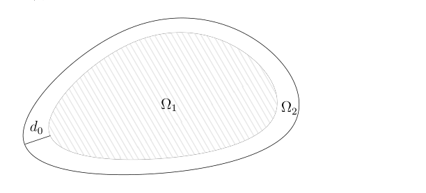
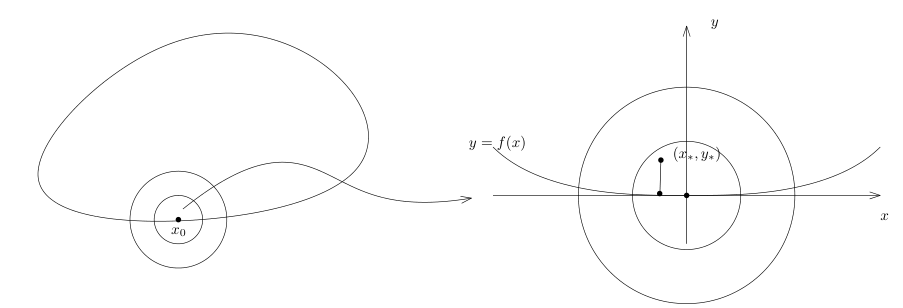
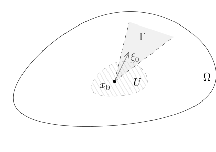

# 82 热核渐近、Weyl 公式与波前集

[返回讲义目录](../../math-analysis-lecture-notes.md) · [学期目录](../03-math-analysis-iii.md) · [校勘记录](../errata.md) · [上一篇：热核、极大值原理与比较定理](81-heat-kernel-pde.md) · [下一篇：波前集与非驻相法](83-wavefront.md)

<!-- source: PDF 947; printed: 947; transcription: first-pass; proofreading: applied -->

## 82 热核的渐近展开，热核在对角线上的积分，Karamata 的 Tauber 型渐近公式，Weyl 渐近公式的证明，波前集的定义

上次课我们证明了 $\mathbb{R}^n$ 中有界带边区域的热核在对角线上的限制 $p(t, x, x)$ 满足如下的估计：
$$0 \leqslant E(t, x, x) - p(t, x, x) \leqslant \begin{cases} \frac{1}{(4\pi t)^{\frac{n}{2}}} e^{-\frac{d(x, \partial \Omega)^2}{4t}}, & \text{如果 } t \leqslant \frac{d(x, \partial \Omega)^2}{2n}; \\ \frac{1}{(4\pi t_0(x))^{\frac{n}{2}}} e^{-\frac{d(x, \partial \Omega)^2}{4t_0(x)}}, & \text{如果 } t \geqslant \frac{d(x, \partial \Omega)^2}{2n}, \end{cases}$$
其中 $t_0(x) = \frac{d(x, \partial \Omega)^2}{2n}$。

假定 $t$ 是给定的，我们令 $d_0 = \sqrt{2nt}$。

我们把 $\Omega$ 分成两个区域：

$$\Omega = \underbrace{\{x \in \Omega \mid d(x, \partial \Omega) \geqslant d_0\}}_{\Omega_1} \cup \underbrace{\{x \in \Omega \mid d(x, \partial \Omega) < d_0\}}_{\Omega_2}.$$

那么，我们把积分也分成两个部分
$$\int_\Omega E(t, x, x) - p(t, x, x) dx = \underbrace{\int_{\Omega_1} E(t, x, x) - p(t, x, x) dx}_{I_1} + \underbrace{\int_{\Omega_2} E(t, x, x) - p(t, x, x) dx}_{I_2}.$$

我们首先估计 $I_1$，此时，我们用热核比较估计的第一种情形，从而，
$$E(t, x, x) - p(t, x, x) \leqslant \frac{1}{(4\pi t)^{\frac{n}{2}}} e^{-\frac{d(x, \partial \Omega)^2}{4t}}.$$

此时，利用 Newton-Leibniz 公式，我们有
$$\begin{aligned}
I_1 &\leqslant \frac{1}{(4\pi t)^{\frac{n}{2}}} \int_{\Omega_1} e^{-\frac{d(x, \partial \Omega)^2}{4t}} dx \\
&= -\frac{1}{(4\pi t)^{\frac{n}{2}}} \int_{\Omega_1} \left( \int_{d(x, \partial \Omega)}^\infty \frac{d}{d\tau} \left( e^{-\frac{\tau^2}{4t}} \right) d\tau \right) dx \\
&= \frac{1}{(4\pi t)^{\frac{n}{2}}} \frac{1}{2t} \int_{\Omega_1} \int_{d(x, \partial \Omega)}^\infty e^{-\frac{\tau^2}{4t}} \tau d\tau dx.
\end{aligned}$$

<!-- source: PDF 948; printed: 948; transcription: first-pass; proofreading: applied -->

根据 Fubini 公式以及 $\Omega_1$ 的定义 ($d(x, \partial \Omega) \geqslant d_0$)，我们有
$$\begin{aligned}
I_1 &\leqslant \frac{1}{(4\pi t)^{\frac{n}{2}}} \frac{1}{2t} \int_{\Omega_1} \int_{d(x, \partial \Omega)}^\infty e^{-\frac{\tau^2}{4t}} \tau d\tau dx \\
&= \frac{1}{(4\pi t)^{\frac{n}{2}}} \frac{1}{2t} \int_{\Omega_1} \int_0^\infty \mathbf{1}_{\tau \geqslant d(x, \partial \Omega)}(\tau, x) e^{-\frac{\tau^2}{4t}} \tau d\tau dx \\
&\leqslant \frac{1}{(4\pi t)^{\frac{n}{2}}} \frac{1}{2t} \int_0^\infty e^{-\frac{\tau^2}{4t}} \tau S(\tau) d\tau.
\end{aligned}$$

这里，
$$S(\tau) = |\{x \in \Omega \mid d(x, \partial \Omega) \leqslant \tau\}|.$$

**引理 539**. 假设 $\Omega$ 是光滑的有界带边区域，那么，存在只依赖于 $\Omega$ 的常数 $C$，使得
$$S(\tau) \leqslant C\tau.$$

我们把引理的证明留到后面来处理。利用这个引理，我们就有
$$\begin{aligned}
I_1 &\leqslant \frac{C}{(4\pi t)^{\frac{n}{2}}} \frac{1}{2t} \int_0^\infty e^{-\frac{\tau^2}{4t}} \tau^2 d\tau \\
&\leqslant \frac{C}{(4\pi t)^{\frac{n}{2}}} \frac{\sqrt{t}}{2} \underbrace{\int_0^\infty e^{-\frac{\tau^2}{4}} \tau^2 d\tau}_{\text{常数}}.
\end{aligned}$$

所以，存在常数 $C_1$，使得
$$I_1 \leqslant C_1 t^{-\frac{n}{2}} t^{\frac{1}{2}}.$$

现在来处理 $I_2$，也就是在区域 $\Omega_2$ 中的积分。此时，我们用热核的非负性，从而，
$$E(t, x, x) - p(t, x, x) \leqslant \frac{1}{(4\pi t)^{\frac{n}{2}}} e^{0} \leqslant \frac{1}{(4\pi t)^{\frac{n}{2}}}.$$

所以，
$$\begin{aligned}
I_2 &\leqslant \int_{\Omega_2} \frac{1}{(4\pi t)^{\frac{n}{2}}} dx = \frac{1}{(4\pi t)^{\frac{n}{2}}} S(\sqrt{2nt}) \\
&\leqslant \frac{1}{(4\pi t)^{\frac{n}{2}}} C\sqrt{2nt} = C_2 t^{-\frac{n}{2}} t^{\frac{1}{2}}.
\end{aligned}$$

综合 $I_1$ 和 $I_2$ 的估计，我们就证明了存在常数 $C > 0$，使得
$$\int_\Omega \bigl(E(t, x, x) - p(t, x, x)\bigr)\,dx \leqslant Ct^{-\frac{n}{2}} t^{\frac{1}{2}}.$$

我们现在来证明[引理539](#ma-lemma-539)。为此我们先证明如下的引理：

**引理 540**. 假设 $\Omega \subset \mathbb{R}^n$ 是光滑的有界带边区域，我们令
$$\Omega_\alpha = \{x \in \Omega \mid d(x, \partial \Omega) < \alpha\}, \quad \Sigma_\alpha = \{x \in \Omega \mid d(x, \partial \Omega) = \alpha\}.$$

那么，存在 $\alpha_0 > 0$，使得

<!-- source: PDF 949; printed: 949; transcription: first-pass; proofreading: applied -->

1) 函数
$$\Omega_{\alpha_0} \to \mathbb{R}_{>0}, \quad x \mapsto d(x, \partial \Omega)$$
是 $\Omega_{\alpha_0}$ 上的光滑函数。

2) 对任意的 $\alpha < \alpha_0$, $\Sigma_\alpha$ 是光滑的超曲面。

**证明**: 对任意的 $x_0 \in \partial \Omega$，我们考虑
$$B_{\frac{1}{2}\varepsilon}(x_0) \cap \Omega \subset B_\varepsilon(x_0) \cap \Omega \subset \Omega.$$

我们要证明如下的论断：存在 $\varepsilon$，使得函数 $d(\cdot, \partial \Omega \cap B_\varepsilon(x_0))$ 满足

1) $d(\cdot, \partial \Omega \cap B_\varepsilon(x_0))$ 是 $B_{\frac{1}{2}\varepsilon}(x_0) \cap \Omega$ 上的光滑函数。

2) 对任意的 $\alpha < \frac{1}{2}\varepsilon$, $\Sigma_\alpha \cap B_{\frac{1}{2}\varepsilon}(x_0) \cap \Omega$ 是光滑的超曲面。

我们指出，在上面的构造中，我们之所以选取 $B_{\frac{1}{2}\varepsilon}(x_0)$ 和 $B_\varepsilon(x_0)$ 两个小球是因为对任意的 $x \in B_{\frac{1}{2}\varepsilon}(x_0) \cap \Omega$，我们有
$$d(x, \partial \Omega) = d(x, \partial \Omega \cap B_\varepsilon(x_0)).$$

假设上面的论断成立，根据紧性，我们总是可以选取有限个 $x_1, \cdots, x_m \in \partial \Omega$，对应这些点，我们有相应的 $\varepsilon_1, \cdots, \varepsilon_m > 0$，满足上面的性质并且 $B_{\frac{1}{2}\varepsilon_1}(x_1), B_{\frac{1}{2}\varepsilon_2}(x_2), \cdots, B_{\frac{1}{2}\varepsilon_m}(x_m)$ 是 $\partial \Omega$ 的开覆盖。此时，我们令 $\alpha_0 = \frac{1}{2} \min_{i \leqslant m} (\varepsilon_1, \cdots, \varepsilon_m)$ 即可。这就完成了命题的证明。

由于 $\varepsilon$ 可以选取的足够小，所以，我们总是可以假设 $\partial \Omega$ 在 $B_\varepsilon(x_0)$ 上是函数图像（这里，我们用到了 $\partial \Omega$ 的光滑性）。另外，通过适当的选取直角坐标系（复合上一个 $\mathbb{R}^n$ 上的等距变换），我们总是可以假设 $x_0 = (0, 0) = (x, y)$ 是原点，其中，$x \in \mathbb{R}^{n-1}$, $y \in \mathbb{R}$。在 $B_\varepsilon(0)$ 上，$\partial \Omega$ 是 $y = f(x)$ 的图像，其中，$f$ 是 $\mathbb{R}^{n-1}$ 上的光滑函数并且 $\left. df \right|_{x=0} = 0$（此时，$\partial \Omega$ 在 $x_0$ 的切平面恰好是 $y = 0$ 这个平面）。

我们现在任选 $(x_*, y_*) \in \Omega \cap B_{\frac{1}{2}\varepsilon}(0)$，我们证明存在唯一的 $(x', y') \in \partial \Omega \cap B_\varepsilon(0)$，使得
$$d((x_*, y_*), \partial \Omega) = d((x_*, y_*), (x', y')).$$

这个问题等价于我们要找 $(x, f(x)) \in \partial \Omega$，使得如下的函数达到最小值：
$$F(x) = |x_* - x|^2 + |y_* - f(x)|^2.$$

<!-- source: PDF 950; printed: 950; transcription: first-pass; proofreading: applied -->

这显然是关于 $x$ 的光滑函数并且它的最小值一定能取到并且只能在 $B_\varepsilon(0)$ 中取到。如果 $x'$ 是这样的一个极值点，那么，
$$\left. dF \right|_{x=x'} = 0 \iff 2(x_* - x') + 2(y_* - f(x')) \left. df \right|_{x=x'} = 0.$$

这等价于
$$x_* + (y_* - f(x')) df(x') - x' = 0.$$

当 $(x_*, y_*) = (0, 0)$ 时，这个方程显然只有唯一的解。另外，考虑映射
$$\Phi : x' \mapsto x_* + (y_* - f(x')) df(x') - x'.$$

此时，
$$d_{x'}\Phi(x') = \underbrace{(y_* - f(x'))}_{O(\varepsilon)} \underbrace{\nabla^2 f(x')}_{\text{在 } B_\varepsilon(0) \text{ 上有界}} - \underbrace{\nabla f(x') \otimes \nabla f(x')}_{\text{根据连续性，在 } B_\varepsilon(0) \text{ 上为 } O(\varepsilon^2)} - \mathrm{Id}.$$

所以，当 $\varepsilon$ 足够小的时候，$d_{x'}\Phi(x')$ 是可逆的。进一步缩小 $\varepsilon$，根据反函数定理，我们就知道存在唯一的 $(x', f(x')) \in B_\varepsilon(0) \cap \partial \Omega$，使得
$$x_* + (y_* - f(x')) df(x') - x' = 0 \iff \left. dF \right|_{x=x'} = 0.$$

这表明，$(x', f(x'))$ （唯一地）实现了 $(x_*, y_*)$ 到 $\partial \Omega$ 的距离。特别地，反函数定理表明 $x'$ 对于 $(x_*, y_*)$ 是光滑依赖的，所以，
$$d((x_*, y_*), \partial \Omega) = d((x_*, y_*), (x', y')) = \sqrt{|x_* - x'|^2 + |y_* - y'|^2}$$
是 $(x_*, y_*)$ 的光滑函数。

另外，假设 $d((x_*, y_*), \partial \Omega) = \alpha$，我们用直线段 $L$ 连接 $(x_*, y_*)$ 与 $(x', y')$，那么，在这个线段上的每个点到 $\partial \Omega$ 的距离都被 $(x', y')$ 所实现。此时，我们知道对任意的 $v \in T_{(x_*, y_*)}\Sigma_\alpha$，
$$\nabla_v d((x_*, y_*), \partial \Omega) = 0;$$
但是沿着 $L$ 方向对 $d((x_*, y_*), \partial \Omega)$ 求导数必然为 $\pm 1$。从而，
$$|\nabla d(\cdot, \partial \Omega)| \equiv 1.$$

这就表明到边界距离为定值的点所构成的超曲面是光滑的。这就完成了引理的证明。 $\hfill \square$

**[引理539](#ma-lemma-539)的证明**. 我们选取上面引理中的 $\alpha_0$。我们只要对于 $\alpha < \alpha_0$，证明存在常数 $C_1$，使得
$$S(\alpha) = |\{x \in \Omega \mid d(x, \partial \Omega) < \alpha\}| \leqslant C_1 \alpha$$
即可。实际上，我们可以选取
$$C = \max \left( C_1, \frac{|\Omega|}{\alpha_0} \right).$$

因为当 $\alpha \geqslant \alpha_0$ 时，我们有
$$S(\alpha) \leqslant |\Omega| \leqslant \frac{|\Omega|}{\alpha_0} \alpha.$$

<!-- source: PDF 951; printed: 951; transcription: first-pass; proofreading: applied -->

对于任意的 $\alpha < \alpha_0$, 我们有
$$ \Omega_\alpha = \bigcup_{t < \alpha} \Sigma_t. $$

根据扭曲版本的 Fubini 定理（第二学期作业 8 问题 A6）, 我们有
$$ S(\alpha) = \int_{\Omega_\alpha} 1 dx = \int_0^\alpha \left( \int_{\Sigma_t} \frac{1}{|\nabla d(\cdot, \partial \Omega)|} d\sigma_t \right) dt $$
$$ = \int_0^\alpha |\Sigma_t| dt. $$

根据反函数定理, 每个 $\Sigma_t$ 在局部上都可以由一族光滑依赖于 $t$ 的函数图像实现, 所以, 当 $t < \alpha$ 较小的时候, 我们知道 $\Sigma_t$ 与 $\Sigma_0$ 的差别不大, 从而,
$$ |\Sigma_t| \leqslant C_1. $$

$$ S(\alpha) \leqslant \int_0^\alpha C_1 dt = C_1 \alpha. $$

命题得证。 $\square$

## Karamata 的 Tauber 型渐近公式

**定理 541**. 假设 $\mu$ 是 $(\mathbb{R}_{>0}, \mathcal{B})$ 上的一个（正）测度, 其中 $\mathcal{B}$ 为 Borel 代数。我们假设对任意的 $t > 0$, 它的 Laplace 变换
$$ (\mathcal{L}\mu) (t) = \int_0^\infty e^{-\lambda t} d\mu(\lambda) $$
是良好定义的。

假设对于 $t \to 0^+$, 存在正常数 $C_0$ 和 $\alpha$, 使得
$$ (\mathcal{L}\mu) (t) \sim C_0 t^{-\alpha}, \quad t \to 0^+. $$
即
$$ \lim_{t \to 0^+} t^\alpha \int_0^\infty e^{-t\lambda} d\mu(\lambda) = C_0, $$
那么, 对任意的 $f \in C^0([0, 1])$, 我们都有
$$ \lim_{t \to 0^+} t^\alpha \int_0^\infty f\left(e^{-t\lambda}\right) e^{-t\lambda} d\mu(\lambda) = \frac{C_0}{\Gamma(\alpha)} \int_0^\infty f\left(e^{-t}\right) t^{\alpha-1} e^{-t} dt, $$
其中,
$$ \Gamma(\alpha) = \int_0^\infty x^{\alpha-1} e^{-x} dx. $$

**证明**: 我们首先说明如下简单的观察: 所要证明的不等式如果对一致收敛的函数列 $\{f_k(x)\}_{k \geqslant 1} \subset C^0([0, 1])$ 成立, 那么, 这个不等式对于这个函数列的极限函数 $f(x)$ 也成立。实际上, 作为 $\mathbb{R}_{>0}$ 上的函数列, 我们也有一致收敛性:
$$ f_k(e^{-t\lambda}) \xrightarrow{\text{一致}} f(e^{-t\lambda}). $$

<!-- source: PDF 952; printed: 952; transcription: first-pass; proofreading: applied -->

所以,
$$ \left| \frac{C_0}{\Gamma(\alpha)} \int_0^\infty f_k\left(e^{-t}\right) t^{\alpha-1} e^{-t} dt - \frac{C_0}{\Gamma(\alpha)} \int_0^\infty f\left(e^{-t}\right) t^{\alpha-1} e^{-t} dt \right| $$
$$ \leqslant \frac{C_0}{\Gamma(\alpha)} \int_0^\infty \|f_k - f\|_{L^\infty} t^{\alpha-1} e^{-t} dt $$
$$ = C_0 \|f_k - f\|_{L^\infty} \to 0. $$

这说明要证明的不等式的右边是收敛的。为了处理左边, 我们先研究
$$ \left| t^\alpha \int_0^\infty f_k\left(e^{-t\lambda}\right) e^{-t\lambda} d\mu(\lambda) - t^\alpha \int_0^\infty f\left(e^{-t\lambda}\right) e^{-t\lambda} d\mu(\lambda) \right| $$
$$ \leqslant t^\alpha \int_0^\infty \|f_k - f\|_{L^\infty} e^{-t\lambda} d\mu(\lambda) $$
$$ = \|f_k - f\|_{L^\infty} \times t^\alpha \mathcal{L}\mu(t). $$

根据 $(\mathcal{L}\mu) (t) \sim C_0 t^{-\alpha}$, 我们知道当 $k \to \infty$ 时, 上面的式子的极限为零, 这就说明
$$ \limsup_{t \to 0^+} \left|t^\alpha \int_0^\infty \bigl(f_k-f\bigr)\left(e^{-t\lambda}\right) e^{-t\lambda} d\mu(\lambda)\right| \leqslant C_0\|f_k-f\|_{L^\infty}=o_k(1). $$
这就证明了上述的观察。

根据要证明的不等式的线性以及 Weierstrass-Stone 逼近定理, 我们只需要对 $f(x) = x^k$ 来证明命题即可: 此时, 要证明的等式等价于
$$ \lim_{t \to 0^+} t^\alpha \int_0^\infty e^{-tk\lambda} e^{-t\lambda} d\mu(\lambda) = \frac{C_0}{\Gamma(\alpha)} \int_0^\infty e^{-kt} t^{\alpha-1} e^{-t} dt, $$
左边可以写成
$$ t^\alpha \int_0^\infty e^{-((k+1)t)\lambda} d\mu(\lambda) \to \frac{C_0}{(k+1)^\alpha}. $$
右边可以如下计算
$$ \int_0^\infty e^{-kt} t^{\alpha-1} e^{-t} dt = \frac{1}{(k+1)^\alpha} \int_0^\infty e^{-(k+1)t} ((k+1)t)^{\alpha-1} (k+1) dt = \frac{\Gamma(\alpha)}{(k+1)^\alpha}. $$
所以, 命题成立。 $\square$

为了应用这个定理, 我们假设令
$$ \mu = \sum_{k=1}^\infty \delta_{\lambda_k}(\lambda). $$

那么, 根据
$$ \sum_{k=1}^\infty e^{-\lambda_k t} = (4\pi t)^{-\frac{n}{2}} \left( |\Omega| + O(t^{\frac{1}{2}}) \right), \quad t \to 0^+, $$
我们知道
$$ (\mathcal{L}\mu) (t) \sim C_0 t^{-\alpha}, \quad t \to 0^+, $$

<!-- source: PDF 953; printed: 953; transcription: first-pass; proofreading: applied -->

其中
$$ \alpha = \frac{n}{2}, \quad C_0 = \frac{|\Omega|}{(4\pi)^{\frac{n}{2}}}. $$

我们现在选取如下的 $f$:
$$ f(x) = x^{-1} \mathbf{1}_{[e^{-1}, 1]}(x). $$

我们注意到, $f$ 并不是连续函数, 我们后面会用逼近的方式证明对于这个特殊的 $f$, 定理的结论仍然成立。此时, 定理结论的左边可以写成:
$$ \lim_{t \to 0^+} t^\alpha \int_0^{t^{-1}} e^{t\lambda} \times e^{-t\lambda} d\mu(\lambda) = \lim_{t \to 0^+} t^\alpha |\{k\geqslant1 \mid \lambda_k \leqslant t^{-1}\}| $$
$$ = \lim_{\lambda \to \infty} \lambda^{-\alpha} |\{k\geqslant1 \mid \lambda_k \leqslant \lambda\}|. $$

右边可以写成
$$ \frac{C_0}{\Gamma(\alpha)} \int_0^\infty f\left(e^{-t}\right) t^{\alpha-1} e^{-t} dt = \frac{C_0}{\Gamma(\alpha)} \int_0^1 e^t \times t^{\alpha-1} e^{-t} dt $$
$$ = \frac{C_0}{\alpha \Gamma(\alpha)} = \frac{C_0}{\Gamma(\alpha+1)}. $$

综上所述, 我们就有
$$ \lim_{\lambda \to \infty} \lambda^{-\frac{n}{2}} |\{k\geqslant1 \mid \lambda_k \leqslant \lambda\}| = \frac{|\Omega|}{(4\pi)^{\frac{n}{2}} \Gamma\left(\frac{n}{2} + 1\right)}. $$

这就给出了 Weyl 关于特征值的渐近公式。

最后, 我们用连续函数来逼近 $f$。我们构造两族函数:
$$ f_\varepsilon^+(x) = \begin{cases} 0, & x \leqslant e^{-(1+\varepsilon)}; \\ \text{线性地连接}; & \\ \frac{1}{x}, & x \geqslant e^{-1}. \end{cases} \qquad f_\varepsilon^-(x) = \begin{cases} 0, & x \leqslant e^{-1}; \\ \text{线性地连接}; & \\ \frac{1}{x}, & x \geqslant e^{-(1-\varepsilon)}. \end{cases} $$

我们知道,
$$ f^-(x) \leqslant f(x) \leqslant f^+(x). $$

所以,
$$ \lim_{t \to 0^+} t^\alpha \int_0^\infty f_\varepsilon^-\left(e^{-t\lambda}\right) e^{-t\lambda} d\mu(\lambda) \leqslant \liminf_{t \to 0^+} \left( t^\alpha \int_0^\infty f\left(e^{-t\lambda}\right) e^{-t\lambda} d\mu(\lambda) \right). $$
从而,
$$ \frac{C_0}{\Gamma(\alpha)} \int_0^\infty f_\varepsilon^-\left(e^{-t}\right) t^{\alpha-1} e^{-t} dt \leqslant \liminf_{t \to 0^+} \left( t^\alpha \int_0^\infty f\left(e^{-t\lambda}\right) e^{-t\lambda} d\mu(\lambda) \right). $$
类似地, 我们有
$$ \limsup_{t \to 0^+} \left( t^\alpha \int_0^\infty f\left(e^{-t\lambda}\right) e^{-t\lambda} d\mu(\lambda) \right) \leqslant \frac{C_0}{\Gamma(\alpha)} \int_0^\infty f_\varepsilon^+\left(e^{-t}\right) t^{\alpha-1} e^{-t} dt. $$

<!-- source: PDF 954; printed: 954; transcription: first-pass; proofreading: applied -->

所以, 我们只要证明
$$ \lim_{\varepsilon \to 0} \left( \int_0^\infty f_\varepsilon^\pm \left(e^{-t}\right) t^{\alpha-1} e^{-t} dt \right) = \int_0^\infty f\left(e^{-t}\right) t^{\alpha-1} e^{-t} dt $$
即可。我们有
$$ \left|\int_0^\infty \left(f_\varepsilon^\pm - f\right)\left(e^{-t}\right) t^{\alpha-1} e^{-t} dt\right| = \left|\int_0^\infty \left(f_\varepsilon^\pm - f\right)\left(e^{-t}\right) t^{\alpha-1} e^{-t} dt\right| $$
$$ = \int_{1-\varepsilon}^{1+\varepsilon} \left|\left(f_\varepsilon^\pm - f\right)\left(e^{-t}\right)\right| t^{\alpha-1} e^{-t} dt $$
$$ \leqslant \int_{1-\varepsilon}^{1+\varepsilon} 2e t^{\alpha-1} e^{-t} dt \to 0. $$

这就完成了全部的证明。 $\square$

## 微局部分析一瞥: 微分算子的奇性传播定理

### 光滑性与波前集

我们知道一个分布的光滑性是一个局部的性质。给定一个分布 $u \in \mathcal{D}'(\Omega)$, $u$ 在 $x_0 \in \Omega$ 处附近是光滑当且仅当对任意的支集在 $x_0$ 附近的光滑函数 $f$, 我们有 $f \cdot u \in C_0^\infty(\mathbb{R}^n)$。进一步, $u$ 在 $x_0 \in \Omega$ 处附近是光滑当且仅当对某一个支集在 $x_0$ 附近的光滑函数 $f$, $f(x_0) \neq 0$, 我们有 $f \cdot u \in C_0^\infty(\mathbb{R}^n)$。从 Fourier 分析的角度来看, 函数的光滑性等价于它在频率空间上的衰减。实际上, 根据 Sobolev 嵌入定理（或者直接证明）, 在我们刚刚谈论的场合下, 如下两个论述显然是等价的:

1) $f \cdot u \in C_0^\infty(\mathbb{R}^n)$;

2) 对任意的正整数 $N \geqslant 1$, 存在常数 $C_N$, 使得对任意的 $\xi \in \mathbb{R}^n$, 我们有
$$ |\widehat{fu}(\xi)| \leqslant \frac{C_N}{\left(1 + |\xi|^2\right)^{\frac{N}{2}}}. $$

我们现在考察一个特殊的例子: $u = \mathbf{1}_{x_n \geqslant 0}$。这是半空间 $\mathbb{H}^n$ 上的示性函数。它在 $x_n > 0$ 或者 $x_n < 0$ 上显然是光滑的。在 $x_n = 0$ 这个集合上, 尽管 $u$ 不光滑, 我们发现沿着 $x_1, \cdots, x_{n-1}$ 的方向求导数总是可以的, 唯一不光滑（连续）的方向实际上是变量 $x_n$ 造成的。我们下面要引入一个概念, 它不仅能说明函数在一个点处不光滑, 而且能说明这个函数沿着哪些方向不光滑。

我们通常用所谓的锥型集来标记方向的集合:

**定义 542**. $\Gamma \subset \mathbb{R}_\xi^n$ 是频率空间中的一个子集, 如果下面的两个性质成立:

1) 对任意的 $\lambda > 0$, 对任意的 $\xi \in \Gamma$, 我们有 $\lambda \cdot \xi \in \Gamma$;

2) $\Gamma \cap S_\xi^{n-1}$ 是 $S_\xi^{n-1}$ 上的开集（闭集）。这里, $S_\xi^{n-1}$ 是频率空间 $\mathbb{R}_\xi^n$ 中的单位球面。

<!-- source: PDF 955; printed: 955; transcription: first-pass; proofreading: applied -->

那么，我们就称 $\Gamma$ 是一个**锥型开集（闭集）**。

另外，为了方便起见，我们引入如下的记号：
$$
(T^*\Omega)^\times = \{(x, \xi) \in \Omega \times \mathbb{R}^n \mid \xi \neq 0\}.
$$

我们现在引入波前集的概念，目的是说明分布沿着哪些方向不光滑：

**定义 543**. $\Omega \subset \mathbb{R}^n$ 是开集，$u \in \mathcal{D}'(\Omega)$ 是 $\Omega$ 上的分布。给定 $(x_0, \xi_0) \in (T^*\Omega)^\times$，假设开集 $U \subset \Omega$，锥型开集 $\Gamma \subset \mathbb{R}^n_\xi$ 以及 $f \in C_0^\infty(\Omega)$，使得

1) $x_0 \in U$，$\operatorname{supp}(f) \subset U$ 并且 $f(x_0) \neq 0$；

2) $\xi_0 \in \Gamma$；

3) 对任意的正整数 $N \geqslant 1$，存在常数 $C_N$，使得对任意的 $\xi \in \Gamma$，我们有
$$
\left|\widehat{fu}(\xi)\right| \leqslant \frac{C_N}{(1 + |\xi|^2)^\frac{N}{2}}.
$$

我们就称 $(x_0, \xi_0)$ **不落在** $u$ **的波前集里**。我们用 $WF(u)$ 表示不满足上述要求的 $(x_0, \xi_0) \in (T^*\Omega)^\times$ 的点的集合。按照定义，我们知道
$$
WF(u) \subset (T^*\Omega)^\times.
$$

[返回讲义目录](../../math-analysis-lecture-notes.md) · [学期目录](../03-math-analysis-iii.md) · [校勘记录](../errata.md) · [上一篇：热核、极大值原理与比较定理](81-heat-kernel-pde.md) · [下一篇：波前集与非驻相法](83-wavefront.md)
