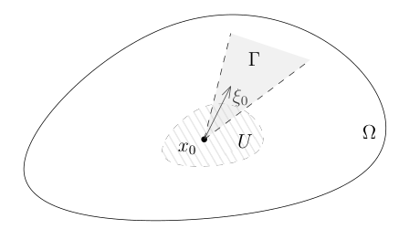
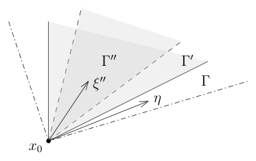

# 83 波前集与非驻相法

[返回讲义目录](../../math-analysis-lecture-notes.md) · [学期目录](../03-math-analysis-iii.md) · [校勘记录](../errata.md) · [上一篇：热核渐近、Weyl 公式与波前集](82-weyl-wavefront.md) · [下一篇：微局部椭圆正则性与奇性传播](84-microlocal-ellipticity.md)

<!-- source: PDF 956; printed: 956; transcription: first-pass; proofreading: applied -->

## 83 波前集以及其等价定义，微局部光滑性意味着局部光滑性，一个非驻相法的引理（理论的技术核心），波前集在微分同胚下的变换

假设 $\Omega \subset \mathbb{R}^n$ 是开集，$u \in \mathcal{D}'(\Omega)$ 是 $\Omega$ 上的分布。

上次课我们引入了 $u$ 的波前集 $WF(u) \subset (T^*\Omega)^\times$：按照定义，对于 $(x_0, \xi_0) \in (T^*\Omega)^\times$，$(x_0, \xi_0) \notin WF(u)$ 当且仅当存在开集 $U \subset \Omega$，锥型开集 $\Gamma \subset \mathbb{R}^n_\xi$ 以及 $f \in C_0^\infty(\Omega)$，使得

1) $x_0 \in U$，$\operatorname{supp}(f) \subset U$ 并且 $f(x_0) \neq 0$；

2) $\xi_0 \in \Gamma$；

3) 对任意的正整数 $N \ge 1$，存在常数 $C_N$，使得对任意的 $\xi \in \Gamma$，我们有
$$|\widehat{fu}(\xi)| \le \frac{C_N}{(1 + |\xi|^2)^{\frac{N}{2}}}.$$

### 波前集的等价定义

**引理 544**. 给定锥型开集 $\Gamma \subset \mathbb{R}^n_\xi$，$s_0 > 0$ 和 $u \in H^{-s_0}(\mathbb{R}^n)$。如果对任意的锥型闭集 $\Gamma' \subset \Gamma$，对任意的正整数 $N \ge 1$，存在常数 $C_N'$，使得对任意的 $\xi' \in \Gamma'$，我们有
$$|\widehat{u}(\xi')| \le \frac{C_N'}{(1 + |\xi'|^2)^{\frac{N}{2}}}.$$
那么，对任意的 $f \in C_0^\infty(\Omega)$ ($\approx$ 物理空间的任意截断函数)，对任意的锥型闭集 $\Gamma'' \subset \Gamma$，对任意的正整数 $N \ge 1$，存在常数 $C_N''$，使得对任意的 $\xi'' \in \Gamma''$，我们有
$$|\widehat{fu}(\xi'')| \le \frac{C_N''}{(1 + |\xi''|^2)^{\frac{N}{2}}}.$$

**证明**: 选定 $f \in C_0^\infty(\Omega)$ 和锥型闭集 $\Gamma'' \subset \Gamma$，根据 $\Gamma''$ 在 $\mathbb{S}^{n-1}$ 上的闭性，存在锥型闭集 $\Gamma' \subset \Gamma$，使得 $\Gamma'' \subset \mathring{\Gamma}'$ (落在 $\Gamma'$ 的内部)。我们计算 $\widehat{fu}(\xi'')$:
$$\begin{aligned}
\widehat{fu}(\xi'') &= \frac{1}{(2\pi)^n} \int_{\mathbb{R}^n} \widehat{f}(\xi'' - \eta) \widehat{u}(\eta) d\eta \\
&= \underbrace{\frac{1}{(2\pi)^n} \int_{\Gamma'} \widehat{f}(\xi'' - \eta) \widehat{u}(\eta) d\eta}_{I} + \underbrace{\frac{1}{(2\pi)^n} \int_{\mathbb{R}^n - \Gamma'} \widehat{f}(\xi'' - \eta) \widehat{u}(\eta) d\eta}_{II}.
\end{aligned}$$

<!-- source: PDF 957; printed: 957; transcription: first-pass; proofreading: applied -->

对于 $I$，我们用引理的条件，对任意的正整数 $N \ge 1$，存在常数 $C_N(\Gamma')$，使得对任意的 $\xi' \in \Gamma'$，我们有
$$|\widehat{u}(\xi')| \le \frac{C_N(\Gamma')}{(1 + |\xi'|^2)^{\frac{N}{2}}}.$$
所以，
$$\begin{aligned}
(1 + |\xi''|)^N |I| &\le \frac{1}{(2\pi)^n} \int_{\Gamma'} (1 + |\xi'' - \eta| + |\eta|)^N |\widehat{f}(\xi'' - \eta)| |\widehat{u}(\eta)| d\eta \\
&\le \frac{1}{(2\pi)^n} \int_{\Gamma'} (1 + |\xi'' - \eta|)^N |\widehat{f}(\xi'' - \eta)| (1 + |\eta|)^N |\widehat{u}(\eta)| d\eta \\
&\le \frac{1}{(2\pi)^n} \int_{\Gamma'} (1 + |\xi'' - \eta|)^N |\widehat{f}(\xi'' - \eta)| C_N(\Gamma') d\eta \\
&\le \frac{C_N(\Gamma')}{(2\pi)^n} \int_{\mathbb{R}^n} (1 + |\eta|)^N |\widehat{f}(\eta)| d\eta.
\end{aligned}$$
由于 $f \in C_0^\infty$，所以上面的积分是有限的，从而，
$$(1 + |\xi''|)^N |I| \le C_N.$$

在 $II$ 这一项中，$\eta$ 落在 $\Gamma'$ 之外。

我们注意到，此时，存在 $\delta > 0$，使得
$$|\xi''| \le \frac{1}{\delta} |\xi'' - \eta|.$$
这是因为从 $\xi''$ 到 $\eta$ 的距离不会小于 $\xi''$ 到 $\partial\Gamma'$ 的距离，而后面这个距离与 $|\xi''|$ 是成正比的（投影到 $\partial\Gamma'$ 上），这表明
$$|\xi'' - \eta| \ge |\xi''|\delta.$$
类似地，我们还有
$$|\xi'' - \eta| \ge |\eta|\delta.$$
据此，我们有
$$\begin{aligned}
(1 + |\xi''|)^N |II| &\le \frac{1}{(2\pi)^n} \int_{\mathbb{R}^n - \Gamma'} (1 + |\xi''|)^N |\widehat{f}(\xi'' - \eta)| |\widehat{u}(\eta)| d\eta \\
&\le C_\delta \int_{\mathbb{R}^n - \Gamma'} (1 + |\xi'' - \eta|)^N |\widehat{f}(\xi'' - \eta)| |\widehat{u}(\eta)| d\eta \\
&\le C'_\delta \int_{\mathbb{R}^n - \Gamma'} (1 + |\xi'' - \eta|)^{-s_0 - n} |\widehat{u}(\eta)| d\eta.
\end{aligned}$$

<!-- source: PDF 958; printed: 958; transcription: first-pass; proofreading: applied -->

最后一步是因为
$$(1 + |\xi'' - \eta|)^N |\widehat{f}(\xi'' - \eta)| \le C'' (1 + |\xi'' - \eta|)^{-s_0 - n}.$$
从而，
$$\begin{aligned}
(1 + |\xi''|)^N |II| &\le C'_\delta \int_{\mathbb{R}^n - \Gamma'} (1 + |\eta|)^{-s_0} |\widehat{u}(\eta)| \times (1 + |\eta|)^{-n} d\eta \\
&\le C'_\delta \left( \int_{\mathbb{R}^n - \Gamma'} (1 + |\eta|)^{-2s_0} |\widehat{u}(\eta)|^2 d\eta \right)^{\frac{1}{2}} \times \left( \int_{\mathbb{R}^n - \Gamma'} (1 + |\eta|)^{-2n} d\eta \right)^{\frac{1}{2}} \\
&\le C''_\delta \|u\|_{H^{-s_0}}.
\end{aligned}$$
综合上面两个不等式，我们就得到了
$$|I| + |II| \le \frac{C_N}{(1 + |\xi''|)^N}.$$
命题得到证明。 $\hfill \Box$

根据这个引理，我们有如下重要的推论：

**推论 545**. 给定 $\Omega \subset \mathbb{R}^n$，$u \in \mathcal{D}'(\Omega)$。对任意的 $\psi(x) \in C^\infty(\Omega)$，我们有
$$WF(\psi \cdot u) \subset WF(u).$$

**证明**: 我们只要证明如果 $(x_0, \xi_0) \notin WF(u)$，那么 $(x_0, \xi_0) \notin WF(\psi \cdot u)$ 即可。根据定义，存在锥型开集 $\xi_0 \in \Gamma \subset \mathbb{R}^n_\xi$，$f \in C_0^\infty(\Omega)$，$f(x_0) \neq 0$ 并且对任意的正整数 $N \ge 1$，存在常数 $C_N$，使得对任意的 $\xi \in \Gamma$，有
$$|\widehat{fu}(\xi)| \le \frac{C_N}{(1 + |\xi|)^N}.$$
取 $\chi\in C_0^\infty(\Omega)$ 在 $\operatorname{supp}(f)$ 的邻域恒为 $1$。我们对 $(u, f) = (fu, \chi\psi)$ 用上面的引理：存在一个锥型开集 $\Gamma'' \subset \Gamma$ 包含 $\xi_0$ (这里用到了引理中 $\Gamma''$ 的任意性) 并且 $\mathring{\Gamma}'' \neq \emptyset$，使得对任意的正整数 $N \ge 1$，存在常数 $C_N''$，使得对任意的 $\xi'' \in \Gamma''$，我们有
$$\left| \widehat{f(\psi \cdot u)}(\xi'') \right| = \left| \widehat{\psi \cdot fu}(\xi'') \right| \le \frac{C_N''}{(1 + |\xi''|^2)^{\frac{N}{2}}}.$$
这表明 $(x_0, \xi_0) \notin WF(\psi \cdot u)$ $\hfill \Box$

作为这个引理的另一个推论，我们给出波前集的等价定义：

**定理 546**. $\Omega \subset \mathbb{R}^n$ 是开集，$u \in \mathcal{D}'(\Omega)$ 是 $\Omega$ 上的分布。给定 $(x_0, \xi_0) \in (T^*\Omega)^\times$。那么，如下的论断是等价的：

1) $(x_0, \xi_0) \notin WF(u)$；

2) 存在包含 $x_0$ 的开集 $U \subset \Omega$，包含 $\xi_0$ 的锥型开集 $\Gamma \subset \mathbb{R}^n_\xi$，使得对任意的 $f \in C_0^\infty(U)$，对任意的正整数 $N \ge 1$，存在常数 $C_{N,f}$，使得对任意的 $\xi \in \Gamma$，我们有
$$|\widehat{fu}(\xi)| \le \frac{C_{N,f}}{(1 + |\xi|)^N}.$$

<!-- source: PDF 959; printed: 959; transcription: first-pass; proofreading: applied -->

**证明**: 2) $\Rightarrow$ 1) 是明显的：我们只要任意选取一个 $f \in C_0^\infty(U)$ 并且 $f(x_0) \neq 0$ 即可。反之，我们假设 1) 成立来证明 2)：根据定义，$(x_0, \xi_0) \notin WF(u)$ 意味着存在锥型开集 $\xi_0 \in \Gamma \subset \mathbb{R}^n_\xi$，$F \in C_0^\infty(\Omega)$，$F(x_0) \neq 0$ 并且对任意的正整数 $N \ge 1$，存在常数 $C_N$，使得对任意的 $\xi \in \Gamma$，有
$$|\widehat{Fu}(\xi)| \le \frac{C_N}{(1 + |\xi|)^N}.$$
由于 $F(x_0) \neq 0$，所以存在开集 $U$，$x_0 \in U$ 并且对任意的 $x \in U$，$|F(x)| > \delta > 0$。我们选定这个开集 $U$。对任意的 $f \in C_0^\infty(U)$，我们考虑：
$$fu = \frac{f}{F} Fu.$$
我们对 $(u, f) = \left( Fu, \frac{f}{F} \right)$ 来运用引理：存在一个锥型开集 $\Gamma'' \subset \Gamma$ 包含 $\xi_0$ (这里用到了引理中 $\Gamma''$ 的任意性) 并且 $\mathring{\Gamma}'' \neq \emptyset$，使得对任意的正整数 $N \ge 1$，存在常数 $C_N''$，使得对任意的 $\xi'' \in \Gamma''$，我们有
$$\left| \widehat{fu}(\xi'') \right| = \left| \widehat{\frac{f}{F} Fu}(\xi'') \right| \le \frac{C_N''}{(1 + |\xi''|)^N}.$$
此时，在 2) 中我们选取的锥型开集是 $\Gamma''$。命题得证。 $\hfill \Box$

**推论 547** (从微局部到局部: 光滑性). 给定 $\Omega \subset \mathbb{R}^n$，$u \in \mathcal{D}'(\Omega)$。假设 $x_0 \in \Omega$ 使得对任意的 $\xi \in \mathbb{R}^n_\xi$，$(x_0, \xi) \notin WF(u)$ (即 $u$ 在 $(x_0, \xi)$ 处是在微局部意义下光滑的)。那么，存在 $x_0$ 在 $\Omega$ 中的开邻域 $U$，使得 $\left.u\right|_U$ 是光滑的。

**证明**: 对任意的 $\xi \in \mathbb{S}^{n-1}$ (单位长的向量)，$(x_0, \xi) \notin WF(u)$，从而，存在锥型开集 $\Gamma \subset \mathbb{R}^n_\xi$ 和开集 $U$，其中 $x_0 \in U$，$\xi \in \Gamma$，对任意的 $f \in C_0^\infty(U)$，对任意的正整数 $N \ge 1$，存在常数 $C_{N,f}$，使得对任意的 $\xi \in \Gamma$，有
$$|\widehat{fu}(\xi)| \le \frac{C_{N,f}}{(1 + |\xi|)^N}.$$
当 $\xi$ 取遍整个 $\mathbb{S}^{n-1}$ 时，它们所对应的上述的 $\Gamma$ 是 $\mathbb{S}^{n-1}$ 的一个开覆盖，所以，我们可以选出有限个 $\xi_1, \cdots, \xi_m \in \mathbb{S}^{n-1}$，使得对每个 $j = 1, \cdots, m$，存在锥型开集 $\Gamma_j \subset \mathbb{R}^n_\xi$ 和开集 $U_j$，其中 $x_0 \in U_j$，$\xi_j \in \Gamma_j$，对任意的 $f \in C_0^\infty(U_j)$，对任意的正整数 $N \ge 1$，存在常数 $C_{j,N,f}$，使得对任意的 $\xi \in \Gamma_j$，有
$$|\widehat{fu}(\xi)| \le \frac{C_{j,N,f}}{(1 + |\xi|)^N}$$
并且
$$\bigcup_{j=1}^m \Gamma_j \supset \mathbb{S}^{n-1} \implies \bigcup_{j=1}^m \Gamma_j \supset \mathbb{R}^n_\xi - \{0\}.$$
此时，我们令 $U = \bigcap_{j \le m} U_j$，这也包含 $x_0$ 的开集。我们任意选取 $f \in C_0^\infty(U) \subset C_0^\infty(U_j)$，其中 $f(x_0) \neq 0$。那么，对任意的 $\xi \in \mathbb{R}^n-\{0\}$，存在 $j$，使得 $\xi \in \Gamma_j$，此时，如果令 $C_N = \max_{j \le m} C_{j,N,f}$，那

<!-- source: PDF 960; printed: 960; transcription: first-pass; proofreading: applied -->

么，对任意的 $N \geqslant 1$，我们就有
$$
|\widehat{fu}(\xi)| \leqslant \frac{C_{j,N,f}}{(1+|\xi|)^N} \leqslant \frac{C_N}{(1+|\xi|)^N}.
$$
这表明 $fu$ 是光滑函数（因为它的 Fourier 变换是衰减得比任意的多项式都要快）。 \hfill $\square$

我们给出这个推论的一个应用。我们先回忆微分算子的定义：给定区域 $\Omega$ 上的一个 $m$-次微分算子（变系数），即
$$
P = \sum_{|\alpha| \leqslant m} p_\alpha(x) \partial^\alpha,
$$
其中，对每个 $\alpha$，$p_\alpha \in C^\infty(\Omega)$ 并且至少有一个 $\alpha$ 使得 $|\alpha| = m$ 并且 $p_\alpha \neq 0$（不恒为 0）。我们定义 $P$ 的**主象征**为
$$
p_m(x, \xi) = \sum_{|\alpha|=m} p_\alpha(x) (-i\xi)^\alpha.
$$
那么，$p_m(x, \xi)$ 是 $T^*\Omega = \Omega \times \mathbb{R}^n_\xi$ 上的光滑函数。我们把 $p_m$ 的零点集记作
$$
Z(p_m) = \{ (x, \xi) \in T^*\Omega \mid p_m(x, \xi) = 0 \}.
$$

我们先不加证明的接受如下的定理（下节课给出完整证明）：

**定理 548** (微局部椭圆正则性). 给定区域 $\Omega$ 上的一个 $m$-次微分算子
$$
P = \sum_{|\alpha| \leqslant m} p_\alpha(x) \partial^\alpha
$$
假设 $u \in D'(\Omega)$ 满足微分方程
$$
P u \overset{D'}{=} f,
$$
其中 $f \in D'(\Omega)$。那么，我们有
$$
WF(u) \subset Z(p_m) \cup WF(f).
$$

我们现在证明 $-\Delta$ 算子的正则性：假设分布 $u \in D'(\Omega)$，满足 $-\Delta u \in C^\infty(\Omega)$，我们现在来证明 $u \in C^\infty(\Omega)$。实际上，
$$
p_2(-\Delta) = |\xi|^2 \implies Z(p_2) = \Omega\times\{0\}.
$$
由于 $-\Delta u$ 光滑，所以 $WF(-\Delta u) = \emptyset$。利用上述微局部正则性定理，我们就有
$$
WF(u) \subset \bigl(\Omega\times\{0\}\bigr) \cup \emptyset = \Omega\times\{0\}.
$$
然而，$WF(u) \subset (T^*\Omega)^\times$，所以，$WF(u) = \emptyset$。我们刚刚证明的推论表明 $u$ 是光滑的。

<!-- source: PDF 961; printed: 961; transcription: first-pass; proofreading: applied -->

## 波前集在微分同胚下的变换

我们下面研究波前集在微分同胚下的变换法则。假设
$$
\Phi : \Omega \to \Omega'
$$
是 $\mathbb{R}^n$ 中两个开区域之间的微分同胚，其中，我们用 $x = (x_1, \cdots, x_n)$ 和 $y = (y_1, \cdots, y_n)$ 分别表示 $\Omega$ 和 $\Omega'$ 上的坐标。假设 $u(y)$ 是 $\Omega'$ 上的分布，我们不难验证，$u$ 在 $y_0$ 的附近光滑当且仅当 $u \circ \Phi$ 在 $x_0$ 处光滑，其中 $y_0 = \Phi(x_0)$。

给定了上述的微分同胚，我们定义 $T^*\Omega$ 与 $T^*\Omega'$ 之间的微分同胚：
$$
(d\Phi)^* : T^*\Omega \to T^*\Omega', \quad (x_0, \xi_0) \mapsto \left(\Phi(x_0), {}^t \left(\left. d\Phi \right|_{x=x_0}\right)^{-1}(\xi_0)\right).
$$
其中，${}^t \left(\left. d\Phi \right|_{x=x_0}\right)^{-1}$ 表示的是 Jacobi 矩阵 $\left. d\Phi \right|_{x=x_0}$ 转置取逆。

**练习**. 证明，$(d\Phi)^*$ 是微分同胚。

**定理 549**. 给定开区域 $\Omega \subset \mathbb{R}^n$ 和 $\widetilde{\Omega} \subset \mathbb{R}^n$，用 $x = (x_1, \cdots, x_n)$ 和 $y = (y_1, \cdots, y_n)$ 分别表示 $\Omega$ 和 $\widetilde{\Omega}$ 上的坐标，我们假设
$$
\Phi : \Omega \to \widetilde{\Omega}
$$
是微分同胚。对任意的 $\widetilde{u} \in D'(\widetilde{\Omega})$，任意的 $x_0 \in \Omega$，令 $y_0 = \Phi(x_0) \in \widetilde{\Omega}$，那么，$(y_0, \widetilde{\xi}) \in WF(\widetilde{u})$ 当且仅当 $\left(x_0, {}^t \left(\left. d\Phi \right|_{x=x_0}\right) (\widetilde{\xi})\right) \in WF(\widetilde{u} \circ \Phi)$。换而言之，如果令 $u = \Phi^*(\widetilde{u})$，那么，
$$
WF(\widetilde{u}) = (d\Phi)^*(WF(u)).
$$

**注记**. 这个变换与流形上余切丛的转移函数的形式是一致的，这建议说频率空间应该被视作是余切丛的纤维。

## 一个非驻相法的引理

给定如下的基本数据：

(a) (相函数) 假设 $\phi(x, \xi) \in C^\infty\left(\mathbb{R}^n_x \times (\mathbb{R}^n_\xi - \{0\})\right)$ 是实值函数，使得

- $\phi(x, \xi)$ 对变量 $\xi$ 是 1 次齐次函数；
- 对任意的 $(x, \xi) \in \mathbb{R}^n_x \times (\mathbb{R}^n_\xi - \{0\})$，$\xi \neq 0$，我们有 $\nabla_x \phi(x, \xi) \neq 0$（作为 $n$-维的向量）。

(b) (振幅函数) 假设 $a(x, \xi) \in C^\infty\left(\mathbb{R}^n_x \times (\mathbb{R}^n_\xi - \{0\})\right)$，使得存在 $N_0 \in \mathbb{R}$，使得对任意的多重指标 $\alpha$，存在常数 $C_\alpha$，使得对任意的 $(x, \xi) \in \mathbb{R}^n_x \times (\mathbb{R}^n_\xi - \{0\})$，我们都有
$$
|\partial_x^\alpha a(x, \xi)| \leqslant C_\alpha (1 + |\xi|)^{N_0}.
$$

<!-- source: PDF 962; printed: 962; transcription: first-pass; proofreading: applied -->

(c) (被作用函数) 假设 $K \subset \mathbb{R}^n$ 是紧集，$u \in \mathcal{E}'(\mathbb{R}^n)$ 使得 $\operatorname{supp}(u) \subset K$。如果存在 $\alpha_0 > 0$ 和 $\eta_0 \in S^{n-1}$，使得对任意的 $N \geqslant 1$，存在常数 $C_N$，使得对任意的 $\xi \in \Gamma(\eta_0, \alpha_0)$，我们就有
$$
|\widehat{u}(\xi)| \leqslant \frac{C_N}{(1 + |\xi|)^N}.
$$

其中，锥型开集 $\Gamma(\eta_0, \alpha_0)$ 的定义如下
$$
\Gamma(\eta_0, \alpha_0) = \left\{ \xi \in \mathbb{R}^n - \{0\} \ \middle|\  \left| \frac{\xi}{|\xi|} - \frac{\eta_0}{|\eta_0|} \right| < \alpha_0 \right\}.
$$

我们想要定义积分
$$
I(\xi) = \left\langle u(x), e^{-i\phi(x,\xi)} a(x, \xi) \right\rangle = \int_{\mathbb{R}^n} e^{-i\phi(x,\xi)} a(x, \xi) u(x) dx.
$$
上面的第一个等号自然是良好定义的，因为 $u$ 具有紧支集，所以这就是如下的自然配对：
$$
\mathcal{E}'(\mathbb{R}^n_x) \times C^\infty(\mathbb{R}^n_x) \to \mathbb{C}.
$$
由于 $u(x)$ 并没有关于 $x$ 的控制，尽管所以上面的积分至少在形式上并不是良好定义的。我们下面用积分的形式来逼近上述的 $I(\xi)$。任意选取 $\chi(x) \in C^\infty_0(\mathbb{R}^n)$，其中 $\chi \geqslant 0$ 并且在原点附近恒为 1，令 $\chi_\varepsilon(\eta)=\chi(\varepsilon\eta)$。那么，在频率空间，我们知道在缓增分布的意义下，有
$$
\chi_\varepsilon(\eta) \widehat{u} \overset{\mathcal{S}'}{\longrightarrow} \widehat{u}, \quad \varepsilon \to 0^+.
$$

我们令
$$
u_\varepsilon = \mathcal{F}^{-1}(\chi_\varepsilon \cdot \widehat{u}),
$$
从而，
$$
u_\varepsilon \overset{\mathcal{D}'}{\longrightarrow} u, \quad \varepsilon \to 0^+.
$$
取 $\psi\in C_0^\infty(\mathbb{R}^n)$ 在 $K$ 的邻域恒为 $1$。特别地，我们就有
$$
I_\varepsilon(\xi) = \left\langle u_\varepsilon(x), e^{-i\phi(x,\xi)} \psi(x)a(x, \xi) \right\rangle \to I(\xi).
$$
由于 $\widehat{u}_\varepsilon$ 具有紧支集（并且是光滑函数），所以，$u_\varepsilon(x)$ 对于 $x$ 比任意的多项式衰减的都要快，从而，
$$
\int_{\mathbb{R}^n} e^{-i\phi(x,\xi)} \psi(x)a(x, \xi) u_\varepsilon(x) dx
$$
是良好定义的（被积分函数是 $L^1$ 的），所以，
$$
I_\varepsilon(\xi) = \int_{\mathbb{R}^n} e^{-i\phi(x,\xi)} \psi(x)a(x, \xi) u_\varepsilon(x) dx \to I(\xi), \quad \varepsilon \to 0^+.
$$
由于一开始 $u$ 具有紧支集，我们再利用一个有紧支集的函数来记住这个事实：选取 $\psi(x) \in C^\infty_0(\mathbb{R}^n)$，使得 $\psi(x)$ 在 $K$ 的邻域恒为 $1$，我们就给出了 $I(\xi)$ 的积分表示：
$$
\begin{aligned}
I(\xi) &= \left\langle u(x), e^{-i\phi(x,\xi)} \psi(x) a(x, \xi) \right\rangle \\
&= \lim_{\varepsilon \to 0^+} \int_{\mathbb{R}^n} e^{-i\phi(x,\xi)} \psi(x) a(x, \xi) u_\varepsilon(x) dx \\
&= \lim_{\varepsilon \to 0^+} \frac{1}{(2\pi)^n} \int_{\mathbb{R}^n} \int_{\mathbb{R}^n} e^{-i\phi(x,\xi) + i x \cdot \eta} \psi(x) a(x, \xi) \chi_\varepsilon(\eta) \widehat{u}(\eta) dx d\eta.
\end{aligned}
$$

<!-- source: PDF 963; printed: 963; transcription: first-pass; proofreading: applied -->

上面我们用到了 Fubini 定理，这是因为
$$
\left| e^{-i\phi(x,\xi) + ix \cdot \eta} \psi(x) a(x, \xi) \chi_\varepsilon(\eta) \widehat{u}(\eta) \right| = |\psi(x) a(x, \xi) \chi_\varepsilon(\eta) \widehat{u}(\eta)|
$$
是光滑的可积函数。令
$$
\widetilde{a}(x, \xi) = \psi(x) a(x, \xi),
$$
我们就有
$$
I(\xi) = \lim_{\varepsilon \to 0^+} \frac{1}{(2\pi)^n} \int_{\mathbb{R}^n} \int_{\mathbb{R}^n} e^{-i\phi(x,\xi) + ix \cdot \eta} \widetilde{a}(x, \xi) \chi_\varepsilon(\eta) \widehat{u}(\eta) dx d\eta.
$$

**引理 550** (非驻相法). 假设相函数 $\phi(x, \xi)$，振幅函数 $a(x, \xi)$ 和被作用函数 $u(x)$ 满足前面所要求的 (a)，(b) 和 (c) 三个条件。

给定 $\xi_0 \in \mathbb{R}^n_\xi - \{0\}$，$\Gamma_0$ 是包含 $\xi_0$ 的一个锥型开集，$\alpha_1 < \alpha_0$，其中 $\alpha_0$ 在条件 (c) 中出现。假设对任意的 $(x, \xi) \in K \times \Gamma_0$，我们都有
$$
\left| \frac{\nabla_x \phi(x, \xi)}{|\nabla_x \phi(x, \xi)|} - \eta_0 \right| < \alpha_1.
$$
那么，我们可以对任意的 $N \geqslant 1$，存在 $C_N > 0$，使得对任意的 $\xi \in \Gamma_0$，有
$$
|I(\xi)| \leqslant \frac{C_N}{(1 + |\xi|)^N}.
$$

**证明**: 假设 $\xi \in \Gamma_0$。我们现在考虑如下的集合
$$
\Omega_1 = \left\{ \eta \in \mathbb{R}^n \mid |\eta - \nabla_x \phi(x, \xi)| < \varepsilon_1 |\nabla_x \phi(x, \xi)| \text{ 或者 } |\eta - \nabla_x \phi(x, \xi)| < \varepsilon_1 |\eta| \right\}.
$$
这显然是一个有界开集。如果 $\varepsilon_1$ 选取的足够小，对于 $\eta \in \Omega_1$，我们知道
$$
\left| \frac{\nabla_x \phi(x, \xi)}{|\nabla_x \phi(x, \xi)|} - \frac{\eta}{|\eta|} \right| = O(\varepsilon_1).
$$
所以，利用 $\alpha_1 < \alpha_0$，我们知道如果 $\varepsilon_1$ 足够小，那么，引理中的条件意味着
$$
\left| \frac{\nabla_x \phi(x, \xi)}{|\nabla_x \phi(x, \xi)|} - \eta_0 \right| < \alpha_1 \implies \eta \in \Gamma(\eta_0, \alpha_0).
$$
所以，通过选取足够小的 $\varepsilon_1$（由 $\alpha_0$ 和 $\alpha_1$ 决定，这是一个只依赖于 $\alpha_0$ 和 $\alpha_1$ 的绝对参数），我们就有
$$
\Omega_1 \subset \Gamma(\eta_0, \alpha_0).
$$
另外，根据 $\Omega_1$ 的定义，我们知道 ($\varepsilon_1 < 0.5$)，对任意的 $\eta \in \Omega_1$，我们都有
$$
\frac{1}{2} |\eta| \leqslant |\nabla_x \phi(x, \xi)| \leqslant 2 |\eta|.
$$
从而，利用 $\phi$ 对频率分量的齐次性质，我们就有
$$
\frac{1}{2} |\eta| \leqslant \left| \nabla_x \phi \left( x, \frac{\xi}{|\xi|} \right) \right| |\xi| \leqslant 2 |\eta|.
$$

<!-- source: PDF 964; printed: 964; transcription: first-pass; proofreading: applied -->

由于光滑函数 $\nabla_x \phi(x, \xi')$ 在紧集 $K \times \mathbf{S}^{n-1}$ 上具有最大最小值, 根据 (a) 中第二点的要求, 上面这个不等式意味着存在常数 $C_1 > 0$, 使得对任意的 $\eta \in \Omega_1$, 我们都有
$$
\frac{1}{C_1}|\eta| \leqslant |\xi| \leqslant C_1 |\eta|.
$$

我们令 $\Omega_2 = \mathbb{R}^n_\eta - \Omega_1$, 那么, 我们将积分对 $\eta$ 分量进行区域分解
$$
\begin{aligned}
I_\varepsilon(\xi) &= \frac{1}{(2\pi)^n} \int_{\mathbb{R}^n} \int_{\mathbb{R}^n} e^{-i\phi(x,\xi)+ix\cdot\eta} \tilde{a}(x, \xi)\chi_\varepsilon(\eta)\widehat{u}(\eta) dxd\eta \\
&= \frac{1}{(2\pi)^n} \left( \int_{\mathbb{R}^n} \int_{\Omega_1} + \int_{\mathbb{R}^n} \int_{\Omega_2} \right) e^{-i\phi(x,\xi)+ix\cdot\eta} \tilde{a}(x, \xi)\chi_\varepsilon(\eta)\widehat{u}(\eta) dxd\eta \\
&= I_{\varepsilon,1}(\xi) + I_{\varepsilon,2}(\xi).
\end{aligned}
$$

我们分别控制这两项:

• 控制 $I_{\varepsilon,1}(\xi)$。

此时, 积分因子中的 $\eta \in \Omega_1$, 根据前面的讨论, 我们就有 $\eta \in \Gamma(\eta_0, \alpha_0)$, 所以, 根据条件 (c), 我们就有
$$
|\widehat{u}(\eta)| \leqslant \frac{C_N}{(1 + |\eta|)^N},
$$
其中 $N$ 待定。另外, 根据 $C_1^{-1}|\eta| \leqslant |\xi| \leqslant C_1|\eta|$, 所以, 我们就有
$$
|\widehat{u}(\eta)| \leqslant \frac{C_N}{(1 + |\eta| + |\xi|)^N}.
$$
上面的常数 $C_N$ 可能有所改变, 但是这对我们的推理没有影响。再利用 (b) 中的界来控制 $a(x,\xi)$, 我们就得到
$$
\begin{aligned}
|I_{\varepsilon,1}(\xi)| &\leqslant \frac{1}{(2\pi)^n} \int_{\mathbb{R}^n} \int_{\Omega_1} |\psi(x)a(x, \xi)||\chi_\varepsilon(\eta)||\widehat{u}(\eta)| dxd\eta \\
&\leqslant \frac{1}{(2\pi)^n} \int_{\mathbb{R}^n} \int_{\Omega_1} |\psi(x)| C_0 (1 + |\xi|)^{N_0} \frac{C_N}{(1 + |\eta| + |\xi|)^N} dxd\eta \\
&\leqslant C' \int_{\mathbb{R}^n} \int_{\Omega_1} \frac{|\psi(x)|}{(1 + |\eta| + |\xi|)^{N-N_0}} dxd\eta \\
&\leqslant \frac{C'}{(1 + |\xi|)^m} \int_{\mathbb{R}^n} \int_{\Omega_1} \frac{|\psi(x)|}{(1 + |\eta| + |\xi|)^{N-N_0-m}} dxd\eta.
\end{aligned}
$$
所以, 当 $N$ 选取的足够大时 ($N > N_0 + m + n + 1$), 对任意的 $m$, 我们就有
$$
|I_{\varepsilon,1}(\xi)| \leqslant \frac{C'}{(1 + |\xi|)^m}.
$$
特别地, 这个估计对 $\varepsilon$ 是一致的。

• 控制 $I_{\varepsilon,2}(\xi)$。

<!-- source: PDF 965; printed: 965; transcription: first-pass; proofreading: applied -->

此时, $\eta \notin \Omega_1$。所以, 按照定义, 我们知道
$$
|\eta - \nabla_x \phi(x, \xi)| \geqslant \varepsilon_1 |\nabla_x \phi(x, \xi)| \quad \text{并且} \quad |\eta - \nabla_x \phi(x, \xi)| \geqslant \varepsilon_1 |\eta|.
$$
所以,
$$
|\eta - \nabla_x \phi(x, \xi)| \geqslant \frac{\varepsilon_1}{2} (|\nabla_x \phi(x, \xi)| + |\eta|).
$$
利用 $\phi(x, \xi)$ 对 $\xi$ 的齐次性, 我们就有
$$
|\eta - \nabla_x \phi(x, \xi)| \geqslant c\varepsilon_1 (1 + |\xi| + |\eta|),
$$
在这里, $c>0$ 是由紧集上的相函数梯度下界决定的常数，我们假设了 $|\xi| \geqslant 1$, 实际上, 我们总是可以做这个假设, 因为我们只对这种情况感兴趣 (证明积分对 $|\xi| \to \infty$ 的衰减)。

我们把 $I_{\varepsilon,2}$ 重新写成
$$
I_{\varepsilon,2}(\xi) = \frac{1}{(2\pi)^n} \int_{\mathbb{R}^n} \int_{\Omega_2} e^{-i\widetilde{\phi}(x,\xi,\eta)} \tilde{a}(x, \xi) \chi_\varepsilon(\eta) \widehat{u}(\eta) dxd\eta,
$$
其中,
$$
\widetilde{\phi}(x, \xi, \eta) = \phi(x, \xi) - x \cdot \eta.
$$
所以, 上面的推导表明, 对任意的 $\eta \in \Omega_2$, 我们有
$$
|\nabla_x \widetilde{\phi}(x, \xi, \eta)| \geqslant c\varepsilon_1 (1 + |\xi| + |\eta|).
$$
所以, 这个函数对 $x$ 的导数是有下界的, 我们将用我们第一学期学过的振荡积分的想法。

我们定义微分算子
$$
L = \sum_{j \leqslant n} \frac{i\partial_{x_j}\widetilde{\phi}}{|\nabla_x \widetilde{\phi}|^2} \partial_{x_j},
$$
很明显, 我们有
$$
L \left( e^{-i\widetilde{\phi}} \right) = e^{-i\widetilde{\phi}}.
$$
对任意的光滑有紧支集的函数 $f(x)$ 和 $g(x)$, 通过分部积分, 我们有
$$
\int_{\mathbb{R}^n} (Lf)(x) \cdot g(x) dx = \int_{\mathbb{R}^n} f(x) \cdot ({}^t Lg)(x) dx,
$$
其中,
$$
({}^t Lg)(x) = -\sum_{j \leqslant n} \partial_{x_j} \left( \frac{i\partial_{x_j}\widetilde{\phi} g(x)}{|\nabla_x \widetilde{\phi}|^2} \right).
$$
据此, 我们有
$$
\begin{aligned}
I_{\varepsilon,2}(\xi) &= \frac{1}{(2\pi)^n} \int_{\mathbb{R}^n} \int_{\Omega_2} L^N \left( e^{-i\widetilde{\phi}(x,\xi,\eta)} \right) \tilde{a}(x, \xi) \chi_\varepsilon(\eta) \widehat{u}(\eta) dxd\eta \\
&= \frac{1}{(2\pi)^n} \int_{\mathbb{R}^n} \int_{\Omega_2} e^{-i\widetilde{\phi}(x,\xi,\eta)} \times ({}^t L)^N (\tilde{a}(x, \xi)) \times \chi_\varepsilon(\eta) \widehat{u}(\eta) dxd\eta
\end{aligned}
$$

<!-- source: PDF 966; printed: 966; transcription: first-pass; proofreading: applied -->

根据 (b), 由于对任意的多重指标 $\alpha$, 我们都有
$$
|\partial_x^\alpha a(x, \xi)| \leqslant C_\alpha (1 + |\xi|)^{N_0}.
$$
所以, 对任意的 $|\alpha| \leqslant N$, 我们就有
$$
|\partial_x^\alpha \tilde{a}(x, \xi)| = |\partial_x^\alpha [\psi(x) \cdot a(x, \xi)]| \leqslant C_\alpha (1 + |\xi|)^{N_0}.
$$
另外, 对任意的 $|\alpha| \leqslant N$, 利用 $\phi(x, \xi)$ 对频率分量的齐次性 (以及 $x \in \operatorname{supp}\psi$), 我们还有
$$
|\partial_x^\alpha \phi(x, \xi)| = \left| \partial_x^\alpha \phi \left( x, \frac{\xi}{|\xi|} \right) \right| |\xi| \leqslant C_N |\xi|.
$$
根据这些性质以及
$$
|\nabla_x \widetilde{\phi}(x, \xi, \eta)| \geqslant c\varepsilon_1 (1 + |\xi| + |\eta|),
$$
其中 $\varepsilon_1$ 是一个只依赖于 $\alpha_0$ 和 $\alpha_1$ 的常数, 我们就有
$$
|({}^t L)^N (\tilde{a}(x, \xi))| \leqslant C_N (1 + |\xi|)^{N_0} (1 + |\xi| + |\eta|)^{-N} \mathbf{1}_{\operatorname{supp}\psi}(x).
$$
所以,
$$
\begin{aligned}
|I_{\varepsilon,2}(\xi)| &\leqslant C_N \int_{\mathbb{R}^n} \int_{\Omega_2} (1 + |\xi|)^{N_0} (1 + |\xi| + |\eta|)^{-N} \mathbf{1}_{\operatorname{supp}\psi}(x) |\chi_\varepsilon(\eta) \widehat{u}(\eta)| dxd\eta \\
&\leqslant C' \int_{\Omega_2} (1 + |\xi| + |\eta|)^{-N+N_0} |\widehat{u}(\eta)| d\eta.
\end{aligned}
$$
由于 $u \in \mathcal{E}'(\mathbb{R}^n)\subset\mathcal{S}'(\mathbb{R}^n)$ 的 Fourier 变换是至多多项式增长的光滑函数，存在 $s_0>0$ 使得 $u\in H^{-s_0}(\mathbb{R}^n)$。从而,
$$
\begin{aligned}
|I_{\varepsilon,2}(\xi)| &\leqslant \frac{C'}{(1 + |\xi|)^m} \int_{\mathbb{R}^n} (1 + |\xi| + |\eta|)^{-N+N_0+m+s_0} \times (1 + |\eta|)^{-s_0} |\widehat{u}(\eta)| d\eta \\
&\leqslant \frac{C'}{(1 + |\xi|)^m} \left( \int_{\mathbb{R}^n} (1 + |\xi| + |\eta|)^{-2N+2N_0+2m+2s_0} d\eta \right)^{\frac12} \|u\|_{H^{-s_0}} \\
&\leqslant \frac{C''}{(1 + |\xi|)^m}.
\end{aligned}
$$
其中, 我们只要选取 $2N > 2N_0 + 2m + 2s_0 + n$ 即可。这个估计仍然不依赖于 $\varepsilon$。

综合上面的论证, 对任意的 $m$, 我们都有 $C(m)$, 使得
$$
|I(\xi)| \leqslant \limsup_{\varepsilon \to 0^+}\bigl(|I_{\varepsilon,1}(\xi)|+|I_{\varepsilon,2}(\xi)|\bigr) \leqslant \frac{C(m)}{(1 + |\xi|)^m}.
$$
这就完成了证明。 $\square$

我们利用这个引理来证明波前集在微分同胚下的变化:

<!-- source: PDF 967; printed: 967; transcription: first-pass; proofreading: applied -->

波前集在微分同胚下的变化. 根据波前集的定义, 我们选取 $f(x)$ 是支撑集在 $x_0 \in \Omega$ 附近的光滑函数, 我们需要计算 $\widehat{f \cdot \Phi^* \tilde{u}}$ 的 Fourier 变换, 其中 $u = \Phi^* \tilde{u}$。我们有
$$
\begin{aligned}
\widehat{f \Phi^* \tilde{u}}(\xi) &= \int_{\mathbb{R}^n_x} e^{-ix\cdot\xi} f(x)\tilde{u}(\Phi(x)) dx \\
&= \int_{\mathbb{R}^n_x} e^{-i\Phi^{-1}(y)\cdot\xi} \underbrace{f(\Phi^{-1}(y))|d\Phi^{-1}(y)|}_{F(y)}\tilde{u}(y) dy \\
&= \int_{\mathbb{R}^n_x} e^{-i\Phi^{-1}(y)\cdot\xi} \underbrace{f(\Phi^{-1}(y))|d\Phi^{-1}(y)|}_{F(y)} \tilde{u}(y) dy.
\end{aligned}
$$
这里, $F(y)$ 是支撑集在 $y_0 \in \widetilde{\Omega}$ 附近的光滑函数。由于 $F$ 具有紧支集, 所以我们不妨假设 $\tilde{u}$ 也具有紧支集。

我们现在假设 $(y_0, \eta_0) \notin WF(\tilde{u})$, 所以, 根据定义波前集, $\tilde{u}$ 满足引理中 (c) 的要求。同样, 相函数 $\phi(y, \xi) = \Phi^{-1}(y) \cdot \xi$ 满足引理中 (a) 的要求; 振幅函数 $a(y, \xi) = F(y)$ 满足引理中 (b) 的要求。我们现在要找到满足引理中的条件的 $\xi$。实际上, 我们有
$$
\nabla_y \phi(y, \xi) = {}^t d\Phi^{-1}(y) \cdot \xi.
$$
所以, 对于 ${}^t d\Phi^{-1}(y_0)(\xi_0) = \eta_0$, 只要 $\xi$ 落在 $\xi_0$ 附近的锥 $\Gamma_0 = \Gamma(\xi_0, \alpha_1)$, 其中 $\alpha_1$ 足够小, 那么,
$$
\left|\frac{\nabla_y \phi(y, \xi)}{|\nabla_y \phi(y, \xi)|}-\frac{\eta_0}{|\eta_0|}\right|
$$
就足够小, 所以, 引理的条件成立, 引理的结论表明 $(x_0, \xi_0) \notin WF(u)$, 这就证明了命题。 $\square$

[返回讲义目录](../../math-analysis-lecture-notes.md) · [学期目录](../03-math-analysis-iii.md) · [校勘记录](../errata.md) · [上一篇：热核渐近、Weyl 公式与波前集](82-weyl-wavefront.md) · [下一篇：微局部椭圆正则性与奇性传播](84-microlocal-ellipticity.md)
