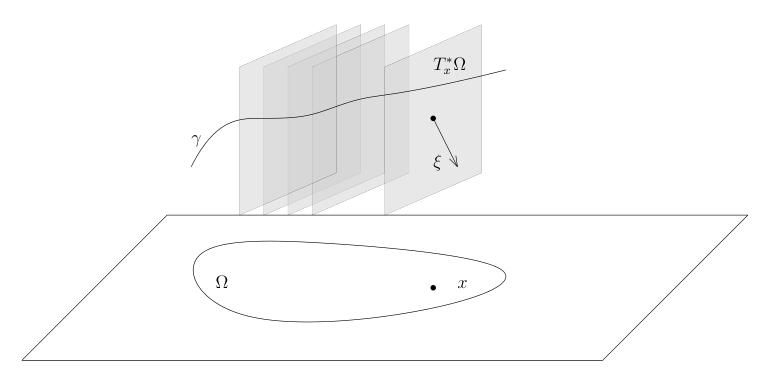

# 84 微局部椭圆正则性与奇性传播

[返回讲义目录](../../math-analysis-lecture-notes.md) · [学期目录](../03-math-analysis-iii.md) · [校勘记录](../errata.md) · [上一篇：波前集与非驻相法](83-wavefront.md) · [下一篇：奇性传播定理的证明](85-propagation.md)

<!-- source: PDF 968; printed: 968; transcription: first-pass; proofreading: applied -->

## 84 微局部的椭圆正则性定理，拟解 (parametrix) 的构造，双特征曲线 (bicharacteristics)，奇性传播定理的叙述

给定区域 $\Omega$ 上的一个 $m$-次微分算子
$$
P = \sum_{|\alpha| \leqslant m} p_\alpha(x) \partial^\alpha,
$$
它的**主象征** $\sigma_m(P)$ 是 $T^* \Omega$ 上的光滑函数，其定义为
$$
p_m(x, \xi) = \sum_{|\alpha|=m} p_\alpha(x) (-i\xi)^\alpha.
$$
我们可以利用单色波来计算 $P$ 的主象征：
$$
\begin{aligned}
e^{ix \cdot \xi} P(e^{-ix \cdot \xi}) &= \sum_{|\alpha| \leqslant m} e^{ix \cdot \xi} p_\alpha(x) \partial^\alpha \left( e^{-ix \cdot \xi} \right) \\
&= \sum_{|\alpha| \leqslant m} p_\alpha(x) (-i\xi)^\alpha.
\end{aligned}
$$
所以，我们只要取 $\xi$ 的 $m$-次齐次部分即可。

另外，如果我们用 ${}^t P$ 表示 $P$ 的对偶算子（这里，我们不用 $L^2$ 的内积），即对任意的 $f, g \in C_0^\infty$，我们有
$$
\langle f, Pg \rangle = \langle {}^t Pf, g \rangle,
$$
那么，
$$
{}^t Pf = \sum_{|\alpha| \leqslant m} (-1)^\alpha \partial^\alpha (p_\alpha(x) \cdot f(x)).
$$
特别地，这也是 $m$-次的微分算子并且我们有
$$
\sigma_m({}^t P) = \sum_{|\alpha|=m} p_\alpha(x) (i\xi)^\alpha = (-1)^m \sigma_m(P).
$$

我们要证明如下的定理：

**定理 551** (微局部椭圆正则性). 给定区域 $\Omega$ 上的 $m$-次微分算子 $P$ 和分布 $u \in \mathcal{D}'(\Omega)$。那么，我们有
$$
WF(u) \subset Z(\sigma_m(P)) \cup WF(P(u)),
$$
其中，$Z(\sigma_m(P))$ 是 $P$ 的主象征的零点集。

<!-- source: PDF 969; printed: 969; transcription: first-pass; proofreading: applied -->

我们先来把证明的目标讲清楚：假设 $(x_0, \xi_0) \notin Z(\sigma_m(P)) \cup WF(P(u))$，我们要证明 $(x_0, \xi_0) \notin WF(u)$。由于 $p_m(x, \xi) = \sigma_m(P)(x, \xi)$ 对 $\xi$ 是齐次的，所以，$(x_0, \xi_0) \notin Z(\sigma_m(P))$ 意味着存在紧集 $K_1 \subset \Omega$ ($x_0 \in K_1$)，常数 $\alpha_1 > 0$ 和 $C_1 > 0$，使得对任意的 $(x, \xi) \in K_1 \times \Gamma(\xi_0, \alpha_1)$，我们都有 $|p_m(x, \xi)| \geqslant C_1 |\xi|^m$；$(x_0, \xi_0) \notin WF(P(u))$，意味着存在紧集 $K_2 \subset \Omega$ ($x_0 \in K_2$) 和 $\alpha_2 > 0$ 使得对任意的 $\varphi \in C_0^\infty(K_2)$，对任意的整数 $N \geqslant 1$，存在 $C_N$，使得对任意的 $\xi \in \Gamma(\xi_0, \alpha_2)$，使得 $(1+|\xi|)^N |\widehat{\varphi \cdot Pu}(\xi)| \leqslant C_N$。所以，综合这些表述，我们就有：

存在紧集 $K \subset \Omega$，$x_0 \in K$，存在常数 $\beta > 0$，$C > 0$，使得

- 对任意的 $(x, \xi) \in K \times \Gamma(\xi_0, \beta)$，我们有
$$
|p_m(x, \xi)| \geqslant C |\xi|^m.
$$

- 对任意的 $\varphi \in C_0^\infty(K)$，对任意的整数 $N \geqslant 1$，存在 $C_N > 0$，使得对任意的 $\xi \in \Gamma(\xi_0, \beta)$，使得
$$
|\widehat{\varphi \cdot Pu}(\xi)| \leqslant \frac{C_N}{(1+|\xi|)^N}.
$$

我们要证明存在紧集合 $K' \subset K$，$x_0 \in K'$ 和常数 $\beta' < \beta$，使得对任意的 $\varphi \in C_0^\infty(K')$，对任意的整数 $N \geqslant 1$，存在 $C'_N > 0$，使得对任意的 $\xi \in \Gamma(\xi_0, \beta')$，使得
$$
|\widehat{\varphi \cdot u}(\xi)| \leqslant \frac{C'_N}{(1+|\xi|)^N},
$$
这就说明了 $(x_0, \xi_0) \notin WF(u)$。

**注记** (一个“直观的”证明思路). 我们实际上关心的是 $\widehat{\varphi \cdot u}(\xi)$（在某个锥形邻域里）的衰减。形式上，我们有
$$
\widehat{\varphi \cdot u}(\xi) = \int_{\mathbb{R}^n} e^{-ix \cdot \xi} \varphi(x) u(x) dx.
$$
我们希望能至少对 $e^{-ix \cdot \xi} \varphi(x)$ 定义 ${}^t P$ 的逆，即找到 $a(x, \xi)$，使得（只对 $x$ 作用，$\xi$ 视作是参数）
$$
{}^t P \left( e^{-ix \cdot \xi} a(x, \xi) \right) = e^{-ix \cdot \xi} \varphi(x).
$$
那么，我们就有
$$
\begin{aligned}
\widehat{\varphi \cdot u}(\xi) &= \int_{\mathbb{R}^n} {}^t P \left( e^{-ix \cdot \xi} a(x, \xi) \right) u(x) dx \\
&= \int_{\mathbb{R}^n} e^{-ix \cdot \xi} a(x, \xi) Pu(x) dx \\
&= \langle e^{-ix \cdot \xi} a(x, \xi), Pu(x) \rangle.
\end{aligned}
$$
此时，$\widehat{Pu}$ 在特定的锥之内有衰减，我们可以选取相函数为 $x \cdot \xi$，从而，我们可以用上次课所提到的非驻相法的引理。

另外，根据
$$
\widehat{\varphi \cdot u}(\xi) = \langle e^{-ix \cdot \xi} a(x, \xi), Pu(x) \rangle.
$$
我们知道 $a(x, \xi)$ 对 $\xi$ 的衰减越快越好。

<!-- source: PDF 970; printed: 970; transcription: first-pass; proofreading: applied -->

### 拟解 (parametrix) 的构造

我们首先做一番计算上的准备：

**引理 552**. 假设 $c(x, \xi) \in C^\infty(K \times \Gamma(\xi_0, \beta))$，$c(x, \xi)$ 对每个固定的 $x$ 都是 $\xi$ 的 $d$-次齐次函数并且如果 $x \notin K$，那么 $c(x, \xi) = 0$。那么，我们有
$$
{}^t P \left( e^{-ix \cdot \xi} c(x, \xi) \right) = e^{-ix \cdot \xi} (-1)^m p_m(x, \xi) c(x, \xi) + e^{-ix \cdot \xi} \sum_{1 \leqslant k \leqslant m} c_k(x, \xi),
$$
其中，对每个 $k = 1, \cdots, m$，函数 $c_k(x, \xi) \in C^\infty(K \times \Gamma(\xi_0, \beta))$，$c_k(x, \xi)$ 对每个固定的 $x$ 都是 $\xi$ 的 $d+m-k$-次齐次函数并且如果 $x \notin K$，那么 $c_k(x, \xi) = 0$。

**注记**. 我们认为
$$
c_0(x, \xi) = p_m(x, \xi) c(x, \xi).
$$
它的次数是 $d+m$。根据前一个注解，$k$ 越大，$c_k(x, \xi)$ 对 $\xi$ 的衰减就越好，所以，我们认为 $c_k$ ($k \geqslant 1$) 是比首项 $p_m(x, \xi) c(x, \xi)$ 要“好”的。

**证明**: 实际上，我们有
$$
\begin{aligned}
{}^t P \left( e^{-ix \cdot \xi} c(x, \xi) \right) &= \sum_{|\alpha| \leqslant m} (-1)^\alpha \partial^\alpha \left( e^{-ix \cdot \xi} \underbrace{p_\alpha(x) c(x, \xi)}_{c_\alpha(x,\xi)} \right) \\
&= \sum_{|\alpha| \leqslant m} (-1)^\alpha \sum_{\gamma \leqslant \alpha} \binom{\alpha}{\gamma} \partial^\gamma \left( e^{-ix \cdot \xi} \right) \partial^{\alpha-\gamma} \left( c_\alpha(x, \xi) \right) \\
&= \left( \sum_{|\alpha|=m} + \sum_{|\alpha|<m} \right) (-1)^\alpha \sum_{\gamma \leqslant \alpha} \binom{\alpha}{\gamma} \partial^\gamma \left( e^{-ix \cdot \xi} \right) \partial^{\alpha-\gamma} \left( c_\alpha(x, \xi) \right) \\
&= \sum_{|\gamma|=m} (-1)^m \partial^\gamma \left( e^{-ix \cdot \xi} \right) \cdot c_\gamma(x) + \sum_{\gamma \leqslant \alpha, |\gamma| \leqslant m-1, |\alpha| \leqslant m} (-1)^{|\alpha|} \binom{\alpha}{\gamma} \partial^\gamma \left( e^{-ix \cdot \xi} \right) \partial^{\alpha-\gamma} \left( c_\alpha(x, \xi) \right) \\
&= \sum_{|\alpha|=m} (i\xi)^\alpha e^{-ix \cdot \xi} p_\alpha(x) c(x, \xi) + \sum_{0 \leqslant k \leqslant m-1} \sum_{\substack{|\gamma|=k,\ \gamma\leqslant\alpha\\|\alpha|\leqslant m}} (-1)^{|\alpha|}(-i)^k \binom{\alpha}{\gamma} e^{-ix \cdot \xi} \underbrace{\xi^\gamma \partial^{\alpha-\gamma} \left( c_\alpha(x, \xi) \right)}_{d+k \text{ 次}} \\
&= e^{-ix \cdot \xi} (-1)^m p_m(x, \xi) c(x, \xi) + e^{-ix \cdot \xi} \sum_{1 \leqslant k \leqslant m} c_k(x, \xi).
\end{aligned}
$$
按照定义，每个 $c_\alpha(x, \xi)$ 与 $c(x, \xi)$ 满足同样的性质，从而命题成立。 \hfill $\square$

注意到，我们想构造 $a(x, \xi)$，使得
$$
{}^t P \left( e^{-ix \cdot \xi} a(x, \xi) \right) = e^{-ix \cdot \xi} \varphi(x).
$$
假设 $a(x, \xi)$ 是 $d$-次的，根据上面的计算，我们有
$$
e^{-ix \cdot \xi} (-1)^m p_m(x, \xi) a(x, \xi) + e^{-ix \cdot \xi} O(d+m-1) = e^{-ix \cdot \xi} \varphi(x),
$$

<!-- source: PDF 971; printed: 971; transcription: first-pass; proofreading: applied -->

其中，$O(d+m-1)$ 代表的是一些次数至多为 $d+m-1$ 次（关于 $\xi$）的齐次函数的和。我们如果令
$$
a(x, \xi) = a_0(x, \xi) = \frac{(-1)^m}{p_m(x, \xi)} \varphi(x),
$$
其中，我们假设 $(x, \xi) \in K \times \Gamma(\xi_0, \beta)$（从而，$p_m(x, \xi) \neq 0$）那么，（此时 $d = -m$）
$$
{}^t P \left( e^{-ix \cdot \xi} a_0(x, \xi) \right) - e^{-ix \cdot \xi} \varphi(x) = e^{-ix \cdot \xi} R_0(x, \xi),
$$
那么，$R_0(x, \xi) \in C^\infty(K \times \Gamma(\xi_0, \beta))$ 并且如果 $x \notin K$，那么 $R_0(x, \xi) = 0$。进一步，$R_0(x, \xi)$ 是有限个 $\xi$ 的次数 $\leqslant -1$ 的齐次函数的和。

我们对 $a_0(x, \xi)$ 再加上一个低一次的扰动 $a_1(x, \xi)$（从而，次数为 $-m-1$），使得
$$
{}^t P \left( e^{-ix \cdot \xi} [a_0(x, \xi) + a_1(x, \xi)] \right) - e^{-ix \cdot \xi} \varphi(x) = e^{-ix \cdot \xi} R_1(x, \xi),
$$
并且 $R_1(x, \xi) \in C^\infty(K \times \Gamma(\xi_0, \beta))$ 并且如果 $x \notin K$，那么 $R_1(x, \xi) = 0$。进一步，$R_1(x, \xi)$ 是有限个 $\xi$ 的次数 $\leqslant -2$ 的齐次函数的和。为此，我们计算
$$
\begin{aligned}
& {}^t P \left( e^{-ix \cdot \xi} [a_0(x, \xi) + a_1(x, \xi)] \right) - e^{-ix \cdot \xi} \varphi(x) \\
=& e^{-ix \cdot \xi} R_0(x, \xi) + {}^t P \left( e^{-ix \cdot \xi} a_1(x, \xi) \right) \\
=& e^{-ix \cdot \xi} R_0(x, \xi) + e^{-ix \cdot \xi} (-1)^m p_m(x, \xi) a_1(x, \xi) + e^{-ix\cdot\xi} O((-m-1)+m-1)
\end{aligned}
$$
由于 $R_0(x, \xi)$ 是一些次数不超过 $-1$ 的齐次函数的线性组合，我们单独把 $-1$ 次（如果存在）的齐次函数部分拿出来记作是 $R_0^{(-1)}(x, \xi)$。所以，如果令
$$
a_1(x, \xi) = \frac{(-1)^{m+1} R_0^{(-1)}(x, \xi)}{p_m(x, \xi)},
$$
我们就消去了所有最高次（$-1$ 次）的项（次数恰好满足要求）。我们强调，我们是在 $(x, \xi) \in K \times \Gamma(\xi_0, \beta)$ 中做的计算。

重复上述计算，对于每个整数 $k \geqslant 0$，我们都可以构造 $b_k(x, \xi)$ 和 $R_k(x, \xi)$，使得

- $b_k(x, \xi) \in C^\infty(K \times \Gamma(\xi_0, \beta))$ 并且如果 $x \notin K$，那么 $b_k(x, \xi) = 0$。进一步，$b_k(x, \xi)$ 对 $\xi$ 是次数为 $-m-k$ 的齐次函数。

- $R_k(x, \xi) \in C^\infty(K \times \Gamma(\xi_0, \beta))$ 并且如果 $x \notin K$，那么 $R_k(x, \xi) = 0$。进一步，$R_k(x, \xi)$ 是有限个 $\xi$ 的次数 $\leqslant -k-1$ 的齐次函数的和。

- 我们有
$$
{}^t P \left( e^{-ix \cdot \xi} \sum_{0 \leqslant j \leqslant k} b_j(x, \xi) \right) - e^{-ix \cdot \xi} \varphi(x) = e^{-ix \cdot \xi} R_k(x, \xi).
$$

这里，
$$
a_k(x, \xi) = \sum_{0 \leqslant j \leqslant k} b_j(x, \xi)
$$
是我们要找的 $a(x, \xi)$ 的一个好的逼近，我们称作是**拟解**。

**注记**. 在下面的应用中，我们把 $K$ 将换成略小的紧集 $K' \subset K$。

<!-- source: PDF 972; printed: 972; transcription: first-pass; proofreading: applied -->

## 微局部椭圆正则性定理的证明

我们假设 $p_m(x_0, \xi_0) \neq 0$ 并且 $(x_0, \xi_0) \notin WF(Pu)$, 那么, 存在紧集 $K \subset \Omega$, $x_0 \in \mathring K$, 存在常数 $\beta > 0, C > 0$, 使得

- 对任意的 $(x, \xi) \in K \times \Gamma(\xi_0, \beta)$, 我们有
$$ |p_m(x, \xi)| \ge C|\xi|^m. $$

- 对任意的 $\varphi \in C_0^\infty(K)$, 对任意的整数 $N \ge 1$, 存在 $C_N > 0$, 使得对任意的 $\xi \in \Gamma(\xi_0, \beta)$, 使得
$$ |\widehat{\varphi \cdot Pu}(\xi)| \le \frac{C_N}{(1 + |\xi|)^N}. $$

我们要证明存在紧集合 $K' \subset \mathring K$, $x_0 \in \mathring K'$ 和常数 $\beta' < \beta$, 使得对任意的 $\varphi \in C_0^\infty(K')$, 对任意的整数 $N \ge 1$, 存在 $C'_N > 0$, 使得对任意的 $\xi \in \Gamma(\xi_0, \beta')$, 使得
$$ |\widehat{\varphi \cdot u}(\xi)| \le \frac{C'_N}{(1 + |\xi|)^N}. $$

利用前面构造的拟解, 我们有
$$
\begin{aligned}
\widehat{\varphi \cdot u}(\xi) &= \langle u(x), e^{-i x \cdot \xi} \varphi(x) \rangle \\
&= \left\langle u(x), {}^t P \left( e^{-i x \cdot \xi} a_k(x, \xi) \right) - e^{-i x \cdot \xi} R_k(x, \xi) \right\rangle \\
&= \underbrace{\left\langle (Pu)(x), e^{-i x \cdot \xi} a_k(x, \xi) \right\rangle}_{I(\xi)} - \underbrace{\left\langle u(x), e^{-i x \cdot \xi} R_k(x, \xi) \right\rangle}_{J(\xi)}
\end{aligned}
$$

首先处理 $J(\xi)$。固定 $\xi\in\Gamma(\xi_0,\beta')$ 且 $|\xi|\ge1$, 我们知道 $R_k(x, \xi)$ 对于 $x$ 是光滑的有紧支集的函数。利用 $u$ 是分布(的定义), 存在非负整数 $M$ 和常数 $C_0$, 使得,
$$ |J(\xi)| \le C \sup_{\substack{|\alpha| \le M, \\ x \in K}} \left| \partial^\alpha \left( e^{-i x \cdot \xi} R_k(x, \xi) \right) \right|. $$

另外, $R_k(x, \xi)$ 是有限个 $\xi$ 的次数 $\le -k - 1$ 的齐次函数的和, 所以, 根据 Leibniz 法则, 上面右端的模可由一些次数不超过 $M - k - 1$ 的齐次函数的模之和控制。利用 $R_k$ 的光滑性, 我们知道存在常数 $C_{M,k}$, 使得
$$ \sup_{\substack{|\alpha|\le M,\\(x,\xi)\in K\times(S^{n-1}\cap\overline{\Gamma(\xi_0,\beta')})}}|\partial^\alpha R_k(x,\xi)|\le C_{M,k}. $$

所以,
$$ |J(\xi)| \le \frac{C'_{M,k}}{(1 + |\xi|)^{k + 1 - M}}, $$

其中, $k$ 是任意的正整数。

<!-- source: PDF 973; printed: 973; transcription: first-pass; proofreading: applied -->

最后处理 $I(\xi)$。为运用非驻相引理，先把 $a_k$ 在较小闭锥之外用光滑角向截断延拓，并乘一个在 $|\xi|\ge1$ 恒为 $1$、在原点附近恒为 $0$ 的频率截断；这不改变较小锥内的大频率估计。我们有
$$
\begin{aligned}
I(\xi) &= \left\langle (Pu)(x), e^{-i x \cdot \xi} a_k(x, \xi) \right\rangle \\
&= \left\langle \psi(x) (Pu)(x), e^{-i x \cdot \xi} a_k(x, \xi) \right\rangle,
\end{aligned}
$$
其中, $\psi(x) \in C_0^\infty(K)$ 在 $K'$ 的邻域恒为 1。

我们选取相函数 $\phi(x, \xi) = x \cdot \xi$, 振幅函数 $a_k(x, \xi)$ 以及被作用函数 $f(x) = \psi \cdot Pu(x)$, 我们来验证它们满足上次证明的非驻相法的引理所要求的基本数据的条件:

(a) $\phi(x, \xi) \in C^\infty \left( \mathbb{R}_x^n \times (\mathbb{R}_\xi^n - \{0\}) \right)$ 是实值的, 变量 $\xi$ 是 1 次齐次的并且当 $\xi \neq 0$ 时, 有 $\nabla_x \phi(x, \xi) \neq 0$。

(b) 按照构造, $b_j(x, \xi) \in C^\infty \left( \mathbb{R}_x^n \times (\mathbb{R}_\xi^n - \{0\}) \right)$, 所以, $a_k(x, \xi) \in C^\infty \left( \mathbb{R}_x^n \times (\mathbb{R}_\xi^n - \{0\}) \right)$。另外, 在原锥内的大频率处, $a_k(x, \xi)$ 是一些次数不超过 $-m$ 的齐次函数的和, 并且当 $x \notin K'$ 时, $a_k(x, \xi) = 0$。类似于上面对 $J(\xi)$ 的估计, 取 $N_0 = -m$, 使得对任意的多重指标 $\alpha$, 存在常数 $C_\alpha$, 使得对任意的 $(x, \xi) \in \mathbb{R}_x^n \times (\mathbb{R}_\xi^n - \{0\})$, 我们都有
$$ |\partial_x^\alpha a_k(x, \xi)| \le C_\alpha (1 + |\xi|)^{N_0}. $$

(c) 很明显, $\operatorname{supp}(f) \subset K$。又因为 $(x_0, \xi_0) \notin WF(Pu)$, 根据我们已知的条件, 对任意的 $N \ge 1$, 存在常数 $C_N$, 使得对任意的 $\xi \in \Gamma(\xi_0, \beta)$, 我们就有
$$ |\widehat{f}(\xi)| \le \frac{C_N}{(1 + |\xi|)^N}. $$

这里, $\eta_0 = \frac{\xi_0}{|\xi_0|}$, $\alpha_0 = \beta$。

现在我们任意选定 $\alpha_1 = \beta' < \beta = \alpha_0$, $\Gamma_0 = \Gamma(\xi_0, \beta')$。我们只要验证非驻相法的引理的条件即可, 即证明对任意的 $(x, \xi) \in K \times \Gamma_0$, 我们都有
$$ \left| \frac{\nabla_x \phi(x, \xi)}{|\nabla_x \phi(x, \xi)|} - \eta_0 \right| < \beta' = \alpha_1. $$

实际上, 由于
$$ \frac{\nabla_x \phi(x, \xi)}{|\nabla_x \phi(x, \xi)|} = \frac{\xi}{|\xi|}, $$
所以, 这是显然的。

此时, 引理的结论表明, 对任意的 $N \ge 1$, 存在 $C_N > 0$, 使得对任意的 $\xi \in \Gamma_0$, 有
$$ |I(\xi)| \le \frac{C_N}{(1 + |\xi|)^N}. $$

综合 $I(\xi)$ 和 $J(\xi)$ 的估计, 我们就证明了微局部版本的椭圆正则性定理。

<!-- source: PDF 974; printed: 974; transcription: first-pass; proofreading: applied -->

## 奇性传播定理

给定区域 $\Omega$ 上的 $m$-次微分算子 $P$ 和分布 $u \in \mathcal{D}'(\Omega)$, 假设 $Pu = f$ 是光滑的, 那么,
$$ WF(u) \subset Z(\sigma_m(P)), $$
其中, $Z(\sigma_m(P))$ 是 $P$ 的主象征的零点集。我们现在要进一步刻画 $WF(u)$ 的几何结构, 这就是所谓的奇性传播定理。

我们先引入一些定义:

**定义 553**. 给定区域 $\Omega$ 上的 $m$-次微分算子 $P$, 我们把
$$ \operatorname{Char}(P) := Z(\sigma_m(P))\cap(T^*\Omega)^\times \subset (T^*\Omega)^\times $$
称作是 $P$ 的**特征簇** (characteristic variety)。

给定 $(x_0, \xi_0) \in \operatorname{Char}(P)$, 如果 $p_m(x, \xi) = \sigma_m(P)$ 在 $(x_0, \xi_0)$ 的一个邻域上是实值的并且 $\nabla_{x, \xi} p_m(x_0, \xi_0)$ 与 $(\xi_0, 0)$ 是线性无关的, 我们就称 $\operatorname{Char}(P)$ 在 $(x_0, \xi_0)$ 处是**简单的**, 也称 $P$ 在 $(x_0, \xi_0)$ 处具有**简单特征**。

如果 $P$ 在每个 $\operatorname{Char}(P)$ 上的点处都是简单的, 我们就称 $P$ 具有**简单的特征簇**。

**注记**. 假设微分算子 $P$ 具有简单的特征簇, 那么, 对每个 $(x_0, \xi_0) \in \operatorname{Char}(P)$, $p_m(x, \xi)$ 在 $(x_0, \xi_0)$ 处的微分不是 0, 这说明 $\operatorname{Char}(P) \subset T^* \Omega$ 是光滑子流形(余维数为 1)。

**注记**. 之前, 我们按照如下的方式定义了主特征: 如果
$$ P = \sum_{|\alpha| \le m} p_\alpha(x) \partial^\alpha, $$
那么,
$$ p_m(x, \xi) = \sigma_m(P)(x, \xi) = \sum_{|\alpha| = m} p_\alpha(x) (-i\xi)^\alpha. $$
从此之后, 因为有上述关于 $p_m(x, \xi)$ 是实值的要求, 我们令
$$ p_m(x, \xi) = \sigma_m(P)(x, \xi) = \sum_{|\alpha| = m} p_\alpha(x) (\xi)^\alpha. $$
这对之前的证明没有影响。

**定义 554**. 给定区域 $\Omega$ 上的 $m$-次微分算子 $P$, 我们假设它的象征 $p_m(x, \xi)$ 是实数值的函数, 那么如下定义的 $T^* \Omega$ 上的向量场
$$ \mathbf{H}_P = \left( \frac{\partial p_m}{\partial \xi_1}, \cdots, \frac{\partial p_m}{\partial \xi_n}, -\frac{\partial p_m}{\partial x_1}, \cdots, -\frac{\partial p_m}{\partial x_n} \right) $$
被称作是 $P$ 所定义的 **Hamilton 向量场**。形式上, 我们经常把这个向量场写成
$$ \mathbf{H}_P = \left( \frac{\partial p_m}{\partial \xi}, -\frac{\partial p_m}{\partial x} \right). $$
我们通常把 $H(x, \xi) = p_m(x, \xi)$ 称作是 $T^* \Omega$ 上的一个 **Hamilton 作用量**。

<!-- source: PDF 975; printed: 975; transcription: first-pass; proofreading: applied -->

假设
$$ \gamma : (-a, b) \to T^* \Omega $$
是过 $(x_0, \xi_0) \in T^* \Omega$ 的 $\mathbf{H}_p$ 的一条积分曲线, 其中 $a, b > 0$。这指的是
$$ \gamma(t) = (x_1(t), x_2(t), \cdots, x_n(t), \xi_1(t), \xi_2(t), \cdots, \xi_n(t)) $$
并且
$$
\begin{cases}
x_1'(t) &= \frac{\partial p_m}{\partial \xi_1}(x_1(t), \cdots, x_n(t), \xi_1(t), \cdots, \xi_n(t)), \\
x_2'(t) &= \frac{\partial p_m}{\partial \xi_2}(x_1(t), \cdots, x_n(t), \xi_1(t), \cdots, \xi_n(t)), \\
\cdots\cdots \\
x_n'(t) &= \frac{\partial p_m}{\partial \xi_n}(x_1(t), \cdots, x_n(t), \xi_1(t), \cdots, \xi_n(t)), \\
\xi_1'(t) &= -\frac{\partial p_m}{\partial x_1}(x_1(t), \cdots, x_n(t), \xi_1(t), \cdots, \xi_n(t)), \\
\xi_2'(t) &= -\frac{\partial p_m}{\partial x_2}(x_1(t), \cdots, x_n(t), \xi_1(t), \cdots, \xi_n(t)), \\
\cdots\cdots \\
\xi_n'(t) &= -\frac{\partial p_m}{\partial x_n}(x_1(t), \cdots, x_n(t), \xi_1(t), \cdots, \xi_n(t)), \\
\gamma(0) &= (x_0, \xi_0).
\end{cases}
$$

在上面这个图中, 我们把每个点 $x \in \Omega$ 处的 $\{x\} \times \mathbb{R}^n$ 记作是 $T_x^* \Omega$。我们经常把这个方程组简写成
$$
\begin{cases}
x'(t) &= \frac{\partial p_m}{\partial \xi}(x(t), \xi(t)), \\
\xi'(t) &= -\frac{\partial p_m}{\partial x}(x(t), \xi(t)), \\
\gamma(0) &= (x_0, \xi_0).
\end{cases}
$$

关于 Hamilton 向量场, 我们有如下熟知的性质:

**引理 555**. *Hamilton 作用量 $p_m(x, \xi)$ 沿着 $\mathbf{H}_P$ 的积分曲线是常数, 即对任意的 $\mathbf{H}_p$ 的积分曲线*
$$ \gamma : (-a, b) \to T^* \Omega, $$
*我们有*
$$ \frac{d}{dt} (p_m(x(t), \xi(t))) = 0. $$

<!-- source: PDF 976; printed: 976; transcription: first-pass; proofreading: applied -->

**证明:** 我们只要利用 $\gamma$ 的方程进行计算即可:
$$
\begin{aligned}
\frac{d}{dt} (p_m(x(t), \xi(t))) &= \frac{\partial p_m}{\partial x}(x(t), \xi(t)) x'(t) + \frac{\partial p_m}{\partial \xi}(x(t), \xi(t)) \xi'(t) \\
&= \frac{\partial p_m}{\partial x}(x(t), \xi(t)) \frac{\partial p_m}{\partial \xi}(x(t), \xi(t)) + \frac{\partial p_m}{\partial \xi}(x(t), \xi(t)) \left( -\frac{\partial p_m}{\partial x}(x(t), \xi(t)) \right) \\
&= 0.
\end{aligned}
$$

命题成立。 $\square$

假设 $\gamma$ 是 $\mathbf{H}_P$ 的一条积分曲线，如果 $\gamma \cap \operatorname{Char}(P) \neq \emptyset$，根据上面的引理，那么，$p_m$ 在 $\gamma$ 的每个点上的取值都是 $0$，所以，$\gamma \subset \operatorname{Char}(P)$。

**定义 556**. 我们把落在 $\operatorname{Char}(P)$ 中的 $\mathbf{H}_P$ 的极大的一条积分曲线称作是微分算子 $P$ 的一条**双特征曲线**（*bicharacteristics*）。

有了双特征曲线的概念，我们就可以陈述奇性传播定理了：

**定理 557** (奇性传播定理). 给定区域 $\Omega$ 上的 $m$-次微分算子 $P$，我们假设 $P$ 具有简单的特征簇。如果 $\gamma$ 是 $P$ 的一条双特征曲线并且
$$
\gamma \cap WF(Pu) = \emptyset,
$$
其中 $u \in \mathcal{D}'(\Omega)$ 是分布，那么如下两种情形必居（且只居）其一：

- $\gamma \subset WF(u)$;
- $\gamma \cap WF(u) = \emptyset$.

**推论 558** (奇性传播定理). 算子 $P$ 是区域 $\Omega$ 上的 $m$-次微分算子并且具有简单的特征簇，$u \in \mathcal{D}'(\Omega)$ 是分布。如果 $Pu$ 是光滑的，那么 $WF(u)$ 是双特征曲线的无交并。

[返回讲义目录](../../math-analysis-lecture-notes.md) · [学期目录](../03-math-analysis-iii.md) · [校勘记录](../errata.md) · [上一篇：波前集与非驻相法](83-wavefront.md) · [下一篇：奇性传播定理的证明](85-propagation.md)
