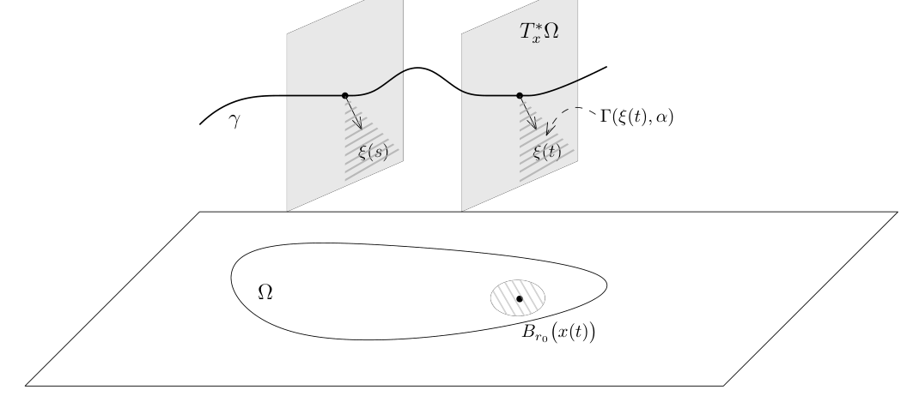

# 85：奇性传播定理的证明

[返回讲义目录](../../math-analysis-lecture-notes.md) · [学期目录](../03-math-analysis-iii.md) · [校勘记录](../errata.md) · [上一篇：微局部椭圆正则性与奇性传播](84-microlocal-ellipticity.md) · [下一篇：86.1：分布理论期末复习题第一套](86-revision/86-01-p0988-0991.md)

<!-- source: PDF 977; printed: 977; transcription: first-pass; proofreading: applied -->

<!-- math-analysis-layout: document-title-normalized -->

## 定理陈述与证明准备

我们上次课陈述了如下的定理：

**定理 559**（奇性传播定理）。给定区域 $\Omega$ 上的 $m$-次微分算子 $P$，我们假设 $P$ 具有简单的特征簇。如果 $\gamma$ 是 $P$ 的一条双特征曲线并且
$$\gamma \cap WF(Pu) = \emptyset,$$
其中 $u \in \mathcal{D}'(\Omega)$ 是分布，那么如下两种情形必居（且只居）其一：

- $\gamma \subset WF(u)$；
- $\gamma \cap WF(u) = \emptyset$。

我们回忆一下其中出现的几个定义：

给定区域 $\Omega$ 上的 $m$-次微分算子 $P$，$P$ 的特征簇 $\operatorname{Char}(P)$ 是它的主象征的零点集合。我们假设 $P$ 具有简单的特征簇，特别地，$\operatorname{Char}(P) \subset T^*\Omega$ 是光滑子流形。利用 $P$ 的主特征 $p_m(x, \xi)$，我们可以定义它的 Hamilton 向量场：
$$H_P = \left( \frac{\partial p_m}{\partial \xi}, -\frac{\partial p_m}{\partial x} \right).$$
我们把落在 $\operatorname{Char}(P)$ 中的 $H_P$ 的极大积分曲线称作是双特征曲线。

### 相函数与双特征曲线

为了证明这个定理，我们先做一番准备。我们定义相函数
$$\phi(s, x, \xi) : \mathbb{R} \times T^*\Omega \to \mathbb{R}.$$
这是一个对于 $\xi$ 是 $1$ 次齐次的函数，它由如下的一阶偏微分方程所定义：
$$\begin{cases} |\xi|^{m-1} \dfrac{\partial \phi}{\partial s}(s, x, \xi) = -p_m(x, \nabla_x \phi(s, x, \xi)), \\ \phi(0, x, \xi) = x \cdot \xi. \end{cases}$$
其中，$m$ 为 $P$ 的次数。特别地，由于 $\phi$ 对于 $\xi$ 的次数为 $1$，所以，$\phi$ 可以被下面的方程刻画：
$$\begin{cases} \dfrac{\partial \phi}{\partial s}(s, x, \xi) = -p_m(x, \nabla_x \phi(s, x, \xi)), \\ \phi(0, x, \xi) = x \cdot \xi, \end{cases}$$
其中，$\xi \in S^{n-1}$。这是因为
$$p_m(x, \nabla_x \phi(s, x, \xi)) = p_m\left(x, \nabla_x \phi\left(s, x, \frac{\xi}{|\xi|}\right) |\xi|\right) = |\xi|^m p_m\left(x, \nabla_x \phi\left(s, x, \frac{\xi}{|\xi|}\right)\right).$$
利用相函数 $\phi(s, x, \xi)$，我们可以刻画双特征曲线：

<!-- source: PDF 978; printed: 978; transcription: first-pass; proofreading: applied -->

**引理 560**。假设 $\gamma(t) = (x(t), \xi(t))$ 是 $P$ 的一条双特征曲线，那么，对任意的 $t \in \mathbb{R}$，我们有
$$\xi(t) = (\nabla_x \phi)(t, x(t), \xi_0),$$
其中，$\gamma(0) = (x_0, \xi_0)$。

我们定义
$$\zeta(t) = (\nabla_x \phi)(t, x(t), \xi_0).$$
很明显，
$$\zeta(0) = \nabla_x (x \cdot \xi_0) = \xi_0 = \xi(0).$$
我们将证明，对任意的 $t$，我们都有
$$\xi(t) = \zeta(t).$$

**证明：** 假设 $|\xi| = 1$，我们考虑 $\zeta(t)$ 所满足的微分方程：
$$\zeta'(t) = \frac{\partial^2 \phi}{\partial t \partial x}(t, x(t), \xi_0) + \frac{\partial^2 \phi}{\partial x^2}(t, x(t), \xi_0) x'(t).$$
利用方程，我们有
$$\frac{\partial^2 \phi}{\partial t \partial x}(t, x(t), \xi_0) = -\frac{\partial p_m}{\partial x}\left(x, \frac{\partial \phi}{\partial x}(t, x(t), \xi_0)\right) - \frac{\partial p_m}{\partial \xi}\left(x, \frac{\partial \phi}{\partial x}(t, x(t), \xi_0)\right) \frac{\partial^2 \phi}{\partial x^2}(t, x(t), \xi_0).$$
所以，
$$\zeta'(t) = -\frac{\partial p_m}{\partial x}(x(t), \zeta(t)) + \underbrace{\frac{\partial^2 \phi}{\partial x^2}(t, x(t), \xi_0) \cdot \left[ x'(t) - \frac{\partial p_m}{\partial \xi}(x(t), \zeta(t)) \right]}_{\text{矩阵乘法}}$$
另外，根据定义，我们还有
$$\begin{cases} x'(t) &= \dfrac{\partial p_m}{\partial \xi}(x(t), \xi(t)), \\ \xi'(t) &= -\dfrac{\partial p_m}{\partial x}(x(t), \xi(t)). \end{cases}$$
所以，
$$\zeta'(t) - \xi'(t) = -\left[ \frac{\partial p_m}{\partial x}(x(t), \zeta(t)) - \frac{\partial p_m}{\partial x}(x(t), \xi(t)) \right] - \frac{\partial^2 \phi}{\partial x^2}(t, x(t), \xi_0) \cdot \left[ \frac{\partial p_m}{\partial \xi}(x(t), \zeta(t)) - \frac{\partial p_m}{\partial \xi}(x(t), \xi(t)) \right].$$
根据 Lagrange 中值定理（我们用到了 $p_m$ 是光滑函数并且其导数在 $\gamma$ 附近是有界的），我们就有
$$|\zeta'(t) - \xi'(t)| \leqslant C |\zeta(t) - \xi(t)|.$$
由于
$$|\zeta(t) - \xi(t)|\Big|_{t=0} = 0,$$
上面的微分不等式表明
$$\zeta(t) \equiv \xi(t).$$
命题得证。 $\square$

<!-- source: PDF 979; printed: 979; transcription: first-pass; proofreading: applied -->

利用微分方程的解对初始值的光滑依赖性以及紧性，我们有如下的推论：

**推论 561**。我们考虑一段双特征曲线
$$\gamma : [0, t_0] \to T^*\Omega.$$
对任意给定 $\alpha_0 > 0$，存在 $r_0 > 0$ 和 $\beta > 0$，使得对任意的 $t \in [0, t_0]$，对任意的 $(x, \xi) \in B_{r_0}(x(t)) \times \Gamma(\xi(t), \beta)$，我们都有
$$\frac{\partial \phi}{\partial x}(t, x, \xi) \in \Gamma(\xi(t), \alpha_0).$$

**证明：** 对任意的 $t \in [0, t_0]$，根据定理，上述关系对于 $(x(t), \xi(t)) \in B_{r_0}(x(t)) \times \Gamma(\xi(t), \beta)$ 成立，利用连续性，就对 $B_{r_0}(x(t)) \times \Gamma(\xi(t), \beta)$ 中所有的点都成立。由于所有可能的 $t$ 所给出的 $\{B_{r_0}(x(t)) \times \Gamma(\xi(t), \beta)\}$ 是 $\gamma$ 的开覆盖，利用紧性，我们就得到了结论。 $\square$

## 证明所需的局部条件

我们首先把条件
$$\gamma \cap WF(Pu) = \emptyset,$$
用分析的语言写清楚。

对任意的 $0\leqslant t \leqslant t_0$，$\gamma(t) = (x(t), \xi(t)) \notin WF(Pu)$，从而，存在 $\psi_0(x) \in C_0^\infty(\Omega)$，$\alpha(t) > 0$，使得 $\psi_0$ 在 $x(t)$ 附近恒为 $1$ 并且对任意的 $N > 0$，存在 $C_N$，对任意的 $\xi \in \Gamma(\xi(t), 2\alpha(t))$，我们有
$$\left| \widehat{\psi_0 \cdot Pu}(\xi) \right| \leqslant \frac{C_N}{(1 + |\xi|)^N}.$$
所以，对任意的 $\varphi \in C_0^\infty(B_{r(t)}(x(t)))$（半径 $r(t)$ 很小），其中 $\psi_0\Big|_{B_{r(t)}(x(t))} \equiv 1$，对任意的 $\xi \in$

<!-- source: PDF 980; printed: 980; transcription: first-pass; proofreading: applied -->

$\Gamma(\xi(t), \alpha(t))$，我们有
$$\left| \widehat{\varphi \cdot Pu}(\xi) \right| = |\mathcal{F}(\varphi \cdot \psi_0 Pu)(\xi)| \leqslant \frac{C_N'}{(1 + |\xi|)^N} \sup_{|\mu| \leqslant M(N)} \|\partial^\mu \varphi\|_{L^\infty}.$$
最后的一步，我们用了[引理 544](83-wavefront.md#ma-lemma-544)，其中，$M(N)$ 是依赖于 $N$ 的常数。当 $t$ 遍历 $[0, t_0]$ 时（我们可以假设 $t_0 = 1$），我们知道 $B_{r(t)}(x(t)) \times \Gamma(\xi(t), \alpha(t))$ 覆盖了 $\gamma([0, 1])$，所以，我们可以选出有限个 $t_1, \cdots, t_l$，使得
$$\gamma \subset \bigcup_{j \leqslant l} B_{r(t_j)}(x(t_j)) \times \Gamma(\xi(t_j), \alpha(t_j)) := \Gamma(\gamma).$$
所以，存在 $r_0 > 0$ 和 $\alpha_0 > 0$，对任意的 $t \in [0, 1]$，$B_{r_0}(x(t)) \times \Gamma(\xi(t), \alpha_0) \subset \Gamma(\gamma)$。特别地，根据 Lebesgue 数的存在性（第一学期第 11 次课），对任意的 $t$，$B_{r_0}(x(t)) \times \Gamma(\xi(t), \alpha_0)$ 必然落在某个 $B_{r(t_j)}(x(t_j)) \times \Gamma(\xi(t_j), \alpha(t_j))$ 中（这里我们可以先在 $\Omega \times S^{n-1}$ 中的归一化曲线像这个紧集上考虑）。通过选取最大的 $C_N$ 和最大的 $M(N)$，我们就得到了如下的结论：

**引理 562**。存在 $r_0 > 0$ 和 $\alpha_0 > 0$，对任意的 $t \in [0, 1]$，使得对任意的 $N > 0$，存在常数 $C_N$ 和 $M_N$，使得对任意的 $\varphi \in C_0^\infty(B_{r_0}(x(t)))$，对任意的 $\xi \in \Gamma(\xi(t), \alpha_0)$，我们有
$$\left| \widehat{\varphi \cdot Pu}(\xi) \right| \leqslant \frac{C_N}{(1 + |\xi|)^N} \sup_{|\mu| \leqslant M_N} \|\partial^\mu \varphi\|_{L^\infty}.$$

我们不妨假设 $\gamma(1) \notin WF(u)$，我们只要说明在另一个端点处 $\gamma(0) \notin WF(u)$ 即可。我们先来翻译 $\gamma(1) \notin WF(u)$ 这个条件：存在 $r_1 > 0$ 和 $\alpha_1 > 0$，对任意的 $N > 0$，存在常数 $C_N$ 和 $M_N$，使得对任意的 $\varphi \in C_0^\infty(B_{r_1}(x(1)))$，对任意的 $\xi \in \Gamma(\xi(1), \alpha_1)$，我们有
$$\left| \widehat{\varphi \cdot u}(\xi) \right| \leqslant \frac{C_N}{(1 + |\xi|)^N} \sup_{|\mu| \leqslant M_N} \|\partial^\mu \varphi\|_{L^\infty}.$$

作为总结（缩小 $r_0$ 和 $r_1$ 等），我们把奇性传播定理的条件总结如下：

存在 $r_0 > 0$ 和 $\alpha_0 > 0$，对任意的 $t \in [0, 1]$，使得对任意的 $N > 0$，存在常数 $C_N$ 和 $M_N$，使得

- 对任意的 $\varphi \in C_0^\infty(B_{r_0}(x(t)))$，对任意的 $\xi \in \Gamma(\xi(t), \alpha_0)$，我们有
$$\left| \widehat{\varphi \cdot Pu}(\xi) \right| \leqslant \frac{C_N}{(1 + |\xi|)^N} \sup_{|\mu| \leqslant M_N} \|\partial^\mu \varphi\|_{L^\infty}.$$

- 对任意的 $\varphi \in C_0^\infty(B_{r_0}(x(1)))$，对任意的 $\xi \in \Gamma(\xi(1), \alpha_0)$，我们有
$$\left| \widehat{\varphi \cdot u}(\xi) \right| \leqslant \frac{C_N}{(1 + |\xi|)^N} \sup_{|\mu| \leqslant M_N} \|\partial^\mu \varphi\|_{L^\infty}.$$

<!-- source: PDF 981; printed: 981; transcription: first-pass; proofreading: applied -->

## 拟解的构造

我们需要计算如下形式的导数：

$$
-e^{i\phi}\left(|\xi|^{m-1}i\frac{\partial}{\partial t}+{}^tP\right)\left(e^{-i\phi}c\right)
$$

假设 $c(t,x,\xi)$ 是阶为 $d$，那么，我们要将上面的式子写成三个部分，第一个部分的阶为 $d+m$，第二个部分的阶为 $d+m-1$，第三个部分的阶 $\leqslant d+m-2$。

我们令 $Q={}^tP$，那么

$$
\begin{aligned}
Qf={}^tPf&=\sum_{|\alpha|\leqslant m}q_\alpha(x)\partial^\alpha f(x)\\
&=\sum_{|\alpha|\leqslant m}(-1)^\alpha\partial^\alpha\big(p_\alpha(x)\cdot f(x)\big).
\end{aligned}
$$

利用归纳法，我们不难证明，对任意的多重指标 $\mu$，我们有

$$
e^{i\phi}\partial^m u\left(e^{-i\phi}\right)=\sum_{\substack{\mu_1+\cdots+\mu_l=\mu,\\|\mu_1|\geqslant1,\ldots,|\mu_l|\geqslant1}}(-1)^l\partial^{\mu_1}\phi\cdot\partial^{\mu_2}\phi\cdots\partial^{\mu_l}\phi.
$$

所以，

$$
\begin{aligned}
e^{i\phi}{}^tP\left(e^{-i\phi}c\right)&=e^{i\phi}\sum_{|\alpha|\leqslant m}q_\alpha(x)\partial^\alpha\left(e^{-i\phi}c\right)\\
&=\sum_{|\alpha|\leqslant m}\sum_{\mu\leqslant\alpha}\binom\alpha\mu q_\alpha(x)e^{i\phi}\partial^\mu\left(e^{-i\phi}\right)\partial^{\alpha-\mu}c\\
&=\sum_{|\alpha|\leqslant m}\sum_{\mu\leqslant\alpha}\sum_{\substack{\mu_1+\cdots+\mu_l=\mu,|\mu_j|\geqslant1}}(-1)^l\binom\alpha\mu q_\alpha(x)\left(\partial^{\mu_1}\phi\cdots\partial^{\mu_l}\phi\right)\partial^{\alpha-\mu}c.
\end{aligned}
$$

在这个表达式中，每个 $\partial^{\mu_j}\phi(t,x,\xi)$ 对于 $\xi$ 都是 $1$ 次的，所以，上面所出现的关于 $\xi$ 的最高阶项是 $d+m$ 阶的，最低阶项是 $d$ 阶的。我们下面将对不同的阶数进行合并同类项。

- $d+m$ 阶项。

此时，我们必须有 $l=|\mu|=|\alpha|=m$，所以，这些项为

$$
\begin{aligned}
&\sum_{|\alpha|=m}(-1)^m\sum_{\mu_1+\cdots+\mu_m=\alpha}q_\alpha(x)\left(\partial^{\mu_1}\phi\cdots\partial^{\mu_l}\phi\right)c\\
&=\sum_{|\alpha|=m}(-1)^mq_\alpha(x)\left(\frac{\partial\phi}{\partial x}\right)^\alpha c(t,x,\xi)\\
&=\sum_{|\alpha|=m}(-1)^mq_\alpha(x)\left(\frac{\partial\phi}{\partial x}\right)^\alpha c(t,x,\xi)\\
&=p_m\left(x,\frac{\partial\phi}{\partial x}\right)\cdot c(t,x,\xi).
\end{aligned}
$$

<!-- source: PDF 982; printed: 982; transcription: first-pass; proofreading: applied -->

- $d+m-1$ 阶项。

此时，我们必须有 $l=m-1$。所以，$|\mu|\geqslant m-1$。

- 如果 $|\mu|=m$，此时，$|\alpha|=m$，所以，这些项为

$$
\begin{aligned}
&\sum_{|\mu|=m}\sum_{\mu_1+\cdots+\mu_{m-1}=\mu}(-1)^{m-1}q_\mu(x)\left(\partial^{\mu_1}\phi\cdots\partial^{\mu_l}\phi\right)c\\
&=M_{\phi,P}\cdot c(t,x,\xi).
\end{aligned}
$$

这里，

$$
M_{\phi,P}(t,x,\xi)=\sum_{|\mu|=m}\sum_{\mu_1+\cdots+\mu_{m-1}=\mu}(-1)^{m-1}q_\mu(x)\left(\partial^{\mu_1}\phi\cdots\partial^{\mu_l}\phi\right)
$$

对于 $\xi$ 是一个次数为 $m-1$ 的齐次函数，它的构造只依赖于 $\phi$ 和 $p_m$（主象征！）。

- 如果 $|\mu|=m-1$。我们定义多重指标 $\delta_j=(0,\cdots,0,1,0,\cdots,0)$，其中只有在第 $j$ 个位置是 $1$。这些项为

$$
\sum_{|\alpha|\leqslant m}\sum_{\substack{\mu\leqslant\alpha,|\mu|=m-1}}(-1)^{m-1}\binom\alpha\mu q_\alpha(x)\left(\frac{\partial\phi}{\partial x}\right)^\mu\partial^{\alpha-\mu}c.
$$

如果 $|\alpha|=m-1$，这一类的项可以合并到上面的一项中（此时，我们要对 $M_{\phi,P}(t,x,\xi)$ 进行修正，它的构造变得依赖于 $\phi$ 和 $P$）。所以，除去这些项之外，此时没有处理的项形如

$$
\begin{aligned}
&\sum_{|\alpha|=m}\sum_{j=1}^n(-1)^{m-1}\binom{\alpha}{\alpha-\delta_j}q_\alpha(x)\left(\frac{\partial\phi}{\partial x}\right)^{\alpha-\delta_j}\partial^{\delta_j}c\\
&=i\sum_{j=1}^n\frac{\partial p_m}{\partial\xi_j}\left(x,\frac{\partial\phi}{\partial x}\right)\frac{\partial c}{\partial x_j}.
\end{aligned}
$$

综上所述，我们就有

$$
e^{i\phi}{}^tP\left(e^{-i\phi}c\right)=\underbrace{p_m\left(x,\frac{\partial\phi}{\partial x}\right)\cdot c}_{d+m\text{ 次}}+\underbrace{M_{\phi,P}\cdot c+i\sum_{j=1}^n\frac{\partial p_m}{\partial\xi_j}\left(x,\frac{\partial\phi}{\partial x}\right)\frac{\partial c}{\partial x_j}}_{d+m-1\text{ 次}}+c_{\leqslant d+m-2},
$$

其中，$c_{\leqslant d+m-2}(t,x,\xi)$ 是一些次数不超过 $d+m-2$ 次的齐次函数的（有限）线性组合。

<!-- source: PDF 983; printed: 983; transcription: first-pass; proofreading: applied -->

利用这个公式，我们就有

$$
\begin{aligned}
&-e^{i\phi}\left(|\xi|^{m-1}i\frac{\partial}{\partial t}+{}^tP\right)\left(e^{-i\phi}c\right)\\
&=-|\xi|^{m-1}i\frac{\partial c}{\partial t}-|\xi|^{m-1}\frac{\partial\phi}{\partial t}c\\
&\quad-p_m\left(x,\frac{\partial\phi}{\partial x}\right)\cdot c-M_{\phi,P}\cdot c-i\sum_{j=1}^n\frac{\partial p_m}{\partial\xi_j}\left(x,\frac{\partial\phi}{\partial x}\right)\frac{\partial c}{\partial x_j}+c_{\leqslant d+m-2}\\
&=\frac1i\left(|\xi|^{m-1}\partial_t+\sum_{j=1}^n\frac{\partial p_m}{\partial\xi_j}\left(x,\frac{\partial\phi}{\partial x}\right)\partial_{x_j}\right)c-\underbrace{\left(|\xi|^{m-1}\frac{\partial\phi}{\partial t}+p_m\left(x,\frac{\partial\phi}{\partial x}\right)\right)}_{=0,\ \text{根据 }\phi\text{ 的定义}}c\\
&\quad-M_{\phi,P}\cdot c-c_{\leqslant d+m-2}.
\end{aligned}
$$

所以，

$$
-e^{i\phi}\left(|\xi|^{m-1}i\frac{\partial}{\partial t}+{}^tP\right)\left(e^{-i\phi}c\right)=\frac1i L(c)+M_{\phi,P}\cdot c+c_{\leqslant d+m-2},
$$

其中，

$$
L=|\xi|^{m-1}\partial_t+\sum_{j=1}^n\frac{\partial p_m}{\partial\xi_j}\partial_{x_j}.
$$

作为总结，我们有

**引理 563。** 假设 $c(t,x,\xi)$ 是关于 $\xi$ 为 $d$ 次齐次的光滑函数，那么，我们有

$$
-e^{i\phi}\left(|\xi|^{m-1}i\frac{\partial}{\partial t}+{}^tP\right)\left(e^{-i\phi}c\right)=\frac1i L(c)+\frac1i M_{\phi,P}\cdot c+c_{\leqslant d+m-2},
$$

其中，$L(c)$ 是 $d+m-1$ 次的，$M_{\phi,P}$ 是次数为 $m-1$ 的齐次函数（只依赖于 $\phi$ 和 $P$）。

**注记。** 我们注意到 $\phi$ 的构造方式恰好消去了上面可能出现的 $d+m$ 次的项。

**引理 564**（拟解的构造）。对给定的正数 $(r_0,\alpha_0)$，存在 $\rho_0>0$，使得 $\rho_0<r_0$ 并且如下成立：对任意的 $\varphi\in C_0^\infty(B_{\rho_0}(x(0)))$，存在函数序列

$$
\{b_k(t,x,\xi)\}_{k\geqslant0},\quad\{R_k(t,x,\xi)\}_{k\geqslant0}\subset C^\infty([0,1]\times B(x(t),r_0)\times\Gamma(\xi(t),\alpha_0)),
$$

- $b_k(t,x,\xi)$ 对于 $\xi$ 是次数为 $-k$ 的齐次函数并且对任意的 $t$ 和 $\xi$，如果 $x\notin B(x(t),r_0)$，那么 $b_k(t,x,\xi)=0$；
- $R_k(t,x,\xi)$ 是有限个次数不超过 $m-k-2$ 的齐次函数（对于 $\xi$）的和并且对任意的 $t$ 和 $\xi$，如果 $x\notin B(x(t),r_0)$，那么 $R_k(t,x,\xi)=0$；

<!-- source: PDF 984; printed: 984; transcription: first-pass; proofreading: applied -->

- 我们令

$$
a_k(t,x,\xi)=\sum_{j=0}^k b_j(t,x,\xi).
$$

那么，我们有

$$
\begin{cases}
-ie^{i\phi}|\xi|^{m-1}\dfrac{\partial}{\partial t}\left(e^{-i\phi}a_k\right)=e^{i\phi}\cdot{}^tP\left(e^{-i\phi}a_k\right)+R_k,\\
a_k(0,x,\xi)=\varphi(x).
\end{cases}
$$

**证明：** 我们归纳地来构造。先考虑 $k=0$ 的情形。此时，我们定义 $b_0(t,x,\xi)$ 为如下（常）微分方程的解：

$$
\begin{cases}
L(b_0)+M_{\phi,P}\cdot b_0=0,\\
b_0(0,x,\xi)=\varphi(x).
\end{cases}
$$

那么，$b_0$ 对于 $\xi$ 是 $0$ 次的齐次函数（可以先对 $|\xi|=1$ 来解，然后进行齐次的扩张）。

假设对于 $\leqslant k$ 的指标 $j$，我们已经构造了 $b_j$，那么，我们考虑

$$
\begin{aligned}
&-ie^{i\phi}|\xi|^{m-1}\frac{\partial}{\partial t}\left(e^{-i\phi}(a_k+b_{k+1})\right)-e^{i\phi}\cdot{}^tP\left(e^{-i\phi}(a_k+b_{k+1})\right)\\
&=R_k+\big(L(b_{k+1})+M_{\phi,P}\cdot b_{k+1}\big)+c_{d+m-2}.
\end{aligned}
$$

其中 $d$ 为 $b_{k+1}$ 的次数。

由归纳假设，$R_k$ 是次数不超过 $m-k-2$ 的齐次函数的线性组合，我们假设它的 $m-k-2$ 次分量为 $R_k^{(m-k-2)}$。那么，我们令

$$
\begin{cases}
L(b_{k+1})+M_{\phi,P}\cdot b_{k+1}=-R_k^{(m-k-2)},\\
b_{k+1}(0,x,\xi)=0.
\end{cases}
$$

那么，$d=-(k+1)$，从而 $c_{d+m-2}$ 的次数不超过 $m-k-3$。这就完成了证明。$\square$

## 利用拟解完成奇性传播的证明

我们对方程

$$
\frac{\partial}{\partial t}\left(e^{-i\phi}a_k\right)=i|\xi|^{1-m}\cdot{}^tP\left(e^{-i\phi}a_k\right)+i|\xi|^{1-m}e^{-i\phi}R_k
$$

对 $t$ 从 $0$ 到 $1$ 积分，由于 $\phi(0,x,\xi)=x\cdot\xi$，我们就得到

$$
\begin{aligned}
e^{-ix\cdot\xi}\varphi(x)&=e^{-i\phi(1,x,\xi)}a_k(1,x,\xi)-i|\xi|^{1-m}\int_0^1{}^tP\left(e^{-i\phi(t,x,\xi)}a_k(t,x,\xi)\right)dt\\
&\quad-i|\xi|^{1-m}\int_0^1 e^{-i\phi(t,x,\xi)}R_k(t,x,\xi)dt.
\end{aligned}
$$

<!-- source: PDF 985; printed: 985; transcription: first-pass; proofreading: applied -->

所以，我们有

$$
\begin{aligned}
\widehat{\varphi\cdot u}(\xi)&=\langle u,e^{-ix\cdot\xi}\varphi(x)\rangle\\
&=\left\langle u,e^{-i\phi(1,x,\xi)}a_k(1,x,\xi)\right\rangle-i|\xi|^{1-m}\int_0^1\left\langle u,{}^tP\left(e^{-i\phi(t,x,\xi)}a_k(t,x,\xi)\right)\right\rangle dt\\
&\quad-i|\xi|^{1-m}\int_0^1\left\langle u,e^{-i\phi(t,x,\xi)}R_k(t,x,\xi)\right\rangle dt\\
&=\underbrace{\left\langle u,e^{-i\phi(1,x,\xi)}a_k(1,x,\xi)\right\rangle}_{H(\xi)}-i|\xi|^{1-m}\int_0^1\underbrace{\left\langle Pu,e^{-i\phi(t,x,\xi)}a_k(t,x,\xi)\right\rangle}_{I(\xi,t)}dt\\
&\quad-i|\xi|^{1-m}\int_0^1\underbrace{\left\langle u,e^{-i\phi(t,x,\xi)}R_k(t,x,\xi)\right\rangle}_{J(\xi,t)}dt.
\end{aligned}
$$

我们逐一地控制上面的三项：

- 控制 $H(\xi)$。

首先，由于 $a_k(t,x,\xi)$ 对于 $x\notin B(x(t),r_0)$ 是消失的，所以，我们可以用一个光滑紧支集截断函数 $\chi(x)$ 来记住这个事实（它在 $B(x(1),r_0)$ 上恒为 $1$）：

$$
\begin{aligned}
H(\xi)&=\left\langle u,e^{-i\phi(1,x,\xi)}\chi(x)a_k(1,x,\xi)\right\rangle\\
&=\int_{\mathbb{R}^n}e^{-i\phi(1,x,\xi)}a_k(1,x,\xi)\chi(x)u(x)dx.
\end{aligned}
$$

我们选取相函数 $\phi(1,x,\xi)$，振幅函数 $a_k(1,x,\xi)$ 以及被作用函数 $f(x)=\chi\cdot u(x)$，我们来验证它们满足非驻相法引理的基本数据的条件：

(a) $\phi(1,x,\xi)\in C^\infty(\mathbb{R}_x^n\times(\mathbb{R}_\xi^n-\{0\}))$ 是实值的，变量 $\xi$ 是 $1$ 次齐次的并且当 $\xi\neq0$ 时，有 $\nabla_x\phi(1,x,\xi)\neq0$：

为了说明后者，我们用 $\phi(t,x,\xi)$ 满足的方程：

$$
\begin{cases}
\dfrac{\partial\phi}{\partial s}(s,x,\xi)=-p_m(x,\nabla_x\phi(s,x,\xi)),\\
\phi(0,x,\xi)=x\cdot\xi,
\end{cases}
$$

其中 $|\xi|=1$。对 $x$ 求导数，我们就有

$$
\frac{\partial^2\phi}{\partial s\partial x}(s,x,\xi)=-\frac{\partial p_m}{\partial x}(x,\nabla_x\phi(s,x,\xi))-\underbrace{\frac{\partial p_m}{\partial\xi}(x,\nabla_x\phi(s,x,\xi))}_{F(s,x,\xi)}\frac{\partial^2\phi}{\partial x^2}(s,x,\xi).
$$

所以，

$$
\left|\left(\frac{\partial}{\partial s}+F\frac{\partial}{\partial x}\right)\frac{\partial\phi}{\partial x}\right|=\left|-\frac{\partial p_m}{\partial x}(x,\nabla_x\phi(s,x,\xi))\right|\leqslant C\left|\frac{\partial\phi}{\partial x}\right|.
$$

如果 $\nabla_x\phi(1,x,\xi)=0$，上述微分不等式表明 $\nabla_x\phi(0,x,\xi)=\xi=0$，矛盾！

上面的推理对于 $t\neq1$ 也成立。

<!-- source: PDF 986; printed: 986; transcription: first-pass; proofreading: applied -->

(b) 按照构造，对于任意的 $t$，$b_j(t,x,\xi)$ 光滑，所以 $a_k(t,x,\xi)$ 也光滑。另外，$a_k(t,x,\xi)$ 是一些次数不超过 $0$ 的齐次函数的和，利用紧性，使得对任意的多重指标 $\alpha$，存在常数 $C_\alpha$，我们都有

$$
|\partial_x^\alpha a_k(t,x,\xi)|\leqslant C_\alpha.
$$

(c) 由于 $(x(1),\xi(1))\notin WF(u)$，对任意的 $N\geqslant1$，存在常数 $C_N$，使得对任意的 $\xi\in\Gamma(\xi(1),\beta)$，我们有

$$
|\widehat{f}(\xi)|\leqslant\frac{C_N}{(1+|\xi|)^N}.
$$

这里，$\eta_0=\frac{\xi(1)}{|\xi(1)|}$。

根据[推论 561](#ma-corollary-561) 以及连续性，对任意的 $(x,\xi)\in B(x(1),r_0)\times\Gamma(\xi(1),\alpha_0)$，我们有

$$
\left|\frac{\nabla_x\phi(1,x,\xi)}{|\nabla_x\phi(1,x,\xi)|}-\eta_0\right|<\beta.
$$

所以我们可以运用非驻相法引理，从而，

此时，引理的结论表明，对任意的 $N\geqslant1$，存在 $C_N>0$，使得对任意的 $\xi\in\Gamma(\xi(0),\alpha_0)$，有

$$
|H(\xi)|\leqslant\frac{C_N}{(1+|\xi|)^N}.
$$

- 控制 $I(\xi,t)$。

这一部分的控制和 $H(\xi)$ 是完全一致的，唯一的不同在于把 $u$ 换成了 $Pu$。另外，我们可以对 $t$ 一致地选取 $\chi$。重复上面的过程，我们就得到对任意的 $N\geqslant1$，存在 $C_N>0$，使得对任意的 $\xi\in\Gamma(\xi(0),\alpha_0)$，有

$$
|I(\xi,t)|\leqslant\frac{C_N}{(1+|\xi|)^N}.
$$

- 控制 $J(\xi,t)$。

利用分布的定义，存在非负整数 $M$ 和常数 $C$，使得，

$$
|J(\xi,t)|\leqslant C\sup_{\substack{|\alpha|\leqslant M,\\x\in B_{r_0}(x(t))}}\left|\partial^\alpha\left(e^{-i\phi(t,x,\xi)}R_k(t,x,\xi)\right)\right|.
$$

$R_k(t,x,\xi)$ 是有限个 $\xi$ 的次数 $\leqslant m-k-2$ 的齐次函数的和，所以，根据 Leibniz 法则（以及 $\phi$ 对 $\xi$ 的次数为 $1$），上面右端可由一些次数不超过 $m-k-2+M$ 的齐次函数的模之和控制。利用 $R_k$ 的光滑性，我们知道存在常数 $C_{M,k}$，使得

$$
\sup_{\substack{|\alpha|\leqslant M,\\(x,\xi)\in B_{r_0}(x(t))\times S^{n-1}}}|\partial^\alpha R_k(t,x,\xi)|\leqslant C_{M,k}.
$$

所以，

$$
|J(\xi,t)|\leqslant\frac{C_{M,k}'}{(1+|\xi|)^{k+2-M-m}},
$$

其中，$k$ 是任意的正整数。

<!-- source: PDF 987; printed: 987; transcription: first-pass; proofreading: applied -->

综合上面的所有估计，我们就证明了对任意的 $N\geqslant1$，存在 $C_N>0$，使得对任意的 $\xi\in\Gamma(\xi(0),\alpha_0)$，有

$$
|\widehat{\varphi\cdot u}(\xi)|\leqslant\frac{C_N}{(1+|\xi|)^N}.
$$

这说明 $(x_0,\xi_0)\notin WF(u)$，从而完成了奇性传播定理的证明。

[返回讲义目录](../../math-analysis-lecture-notes.md) · [学期目录](../03-math-analysis-iii.md) · [校勘记录](../errata.md) · [上一篇：微局部椭圆正则性与奇性传播](84-microlocal-ellipticity.md) · [下一篇：86.1：分布理论期末复习题第一套](86-revision/86-01-p0988-0991.md)
