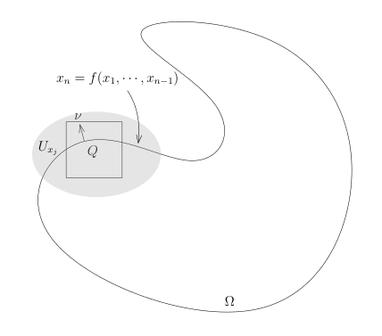

# 数学分析讲义勘误与未决问题

[返回讲义目录](../math-analysis-lecture-notes.md)

## 数学分析 1

### 1 实数的公理化描述

[相关正文：实数的公理化描述](./01-math-analysis-i/01-real-number-axioms.md)

#### 数学修正

**原文：**

> **练习.** 证明，$x \neq 0$ 乘法逆元 $x^{-1}$ 是唯一的，即若 $x' \in \mathbb{R}$ 也满足 $x \cdot x' = 1$，那么 $x' = x^{-1}$。

**修正：**

> **练习.** 证明，$x \neq 0$ 的乘法逆元 $x^{-1}$ 是唯一的，即若 $x' \in \mathbb{R}$ 也满足 $x \cdot x' = 1$，那么 $x' = x^{-1}$。

**理由：** [实数的公理化描述](./01-math-analysis-i/01-real-number-axioms.md)原图末行“x非零乘法逆元”确漏结构助词，补的字明确所属关系，练习假设及乘法逆元唯一性不变。

[相关正文：实数的公理化描述](./01-math-analysis-i/01-real-number-axioms.md)

#### 数学修正

**原文：**

> **注记.** (F5)-(F9) 这四条公理表明 $(\mathbb{R}^{\times} := \mathbb{R} - \{0\}, \cdot)$ 是一个（交换）群。

**修正：**

> **注记.** (F5)-(F8) 这四条公理表明 $(\mathbb{R}^{\times} := \mathbb{R} - \{0\}, \cdot)$ 是一个（交换）群。

**理由：** 已查看19、[实数的公理化描述](./01-math-analysis-i/01-real-number-axioms.md)原图。[实数的公理化描述](./01-math-analysis-i/01-real-number-axioms.md)F5、F6、F7、F8分别列出乘法结合律、交换律、单位元和逆元，共四条；[实数的公理化描述](./01-math-analysis-i/01-real-number-axioms.md)F9另列分配律。编号区间末端8唯一吻合“四条”和群公理列表。此处仅校正所引编号，后续使用域公理的结论保留。

**原文：**

> $$
> \frac{x}{y} + \frac{z}{w} = \frac{xw + zx}{yw}, \quad \frac{x}{y} \cdot \frac{z}{w} = \frac{x \cdot z}{y \cdot w}.
> $$

**修正：**

> $$
> \frac{x}{y} + \frac{z}{w} = \frac{xw + yz}{yw}, \quad \frac{x}{y} \cdot \frac{z}{w} = \frac{x \cdot z}{y \cdot w}.
> $$

**理由：** [实数的公理化描述](./01-math-analysis-i/01-real-number-axioms.md)源图分子为xw+zx。通分得到xw+zy，乘法交换律F6给zy=yz，所以模型的xw+yz修复正确，y,w非零假设保留。与私有missing_errata的zy只是等价写法，最终只保留该实际候选。

**原文：**

> $$
> \mathbb{R} \to \mathbb{R}, \quad x \mapsto x^n.
> $$

**修正：**

> $$
> D_n \to \mathbb{R}, \quad x \mapsto x^n, \qquad D_n=\begin{cases}\mathbb{R},&n\geqslant0;\\ \mathbb{R}^{\times},&n<0.\end{cases}
> $$

**理由：** [实数的公理化描述](./01-math-analysis-i/01-real-number-axioms.md)原图把所有整数幂的函数域写成R。[实数的公理化描述](./01-math-analysis-i/01-real-number-axioms.md)F8仅为非零实数定义乘法逆元，[实数的公理化描述](./01-math-analysis-i/01-real-number-axioms.md)负整数幂正是x^{-1}的重复乘积，所以n<0时必须以R×为域；n>=0时本页已经规定x^0=1且正幂对所有实数定义。此处分段写出唯一合法定义域，没有改变0^0=1的原书约定。

**原文：**

> $x^{n+m} = x^n \cdot x^m$。特别地，$nx+(-n)x = 0$，$x^n \cdot x^{-n} = 1$。

**修正：**

> $x^{n+m} = x^n \cdot x^m$（涉及负整数幂时要求 $x \neq 0$）。特别地，$nx+(-n)x = 0$；当 $x \neq 0$ 时，$x^n \cdot x^{-n} = 1$。

**理由：** [实数的公理化描述](./01-math-analysis-i/01-real-number-axioms.md)原图该段没有非零底数限制；负幂使用F8仅对非零底数定义的逆元。加法恒等式对任意实数成立，需保留；幂的乘法律遇到负指数及x^n x^{-n}必须在非零底数条件下使用。n=0时原约定也允许x=0，但“当x非零时成立”仍正确且不把原有效情形改成错误命题。

[相关正文：实数的公理化描述](./01-math-analysis-i/01-real-number-axioms.md)

#### 数学修正

**原文：**

> 如果 $x > 0$，我们就称 $x$ 是负实数并且称它的符号是负的，记做 $\operatorname{sign}(x) = -$。

**修正：**

> 如果 $x < 0$，我们就称 $x$ 是负实数并且称它的符号是负的，记做 $\operatorname{sign}(x) = -$。

**理由：** 已对照[实数的公理化描述](./01-math-analysis-i/01-real-number-axioms.md)原图，负数句印x>0，同段正数条件也是x>0，后文R_<0明确为负实数。因此负数条件必须为x<0，符号映射才一致。

[相关正文：实数的公理化描述](./01-math-analysis-i/01-real-number-axioms.md)

#### 数学修正

**原文：**

> 其中 $+_{\mathbb{Q}}$ 和 $\cdot_{\mathbb{Q}}$ 分别为有理数 $\mathbb{Q}$ 上的乘法和加法。

**修正：**

> 其中 $+_{\mathbb{Q}}$ 和 $\cdot_{\mathbb{Q}}$ 分别为有理数 $\mathbb{Q}$ 上的加法和乘法。

**理由：** [实数的公理化描述](./01-math-analysis-i/01-real-number-axioms.md)原图中名称顺序确印“乘法和加法”。紧邻公式iota(x+_Q y)=iota(x)+iota(y)、iota(x·_Q y)=iota(x)·iota(y)，并与[实数的公理化描述](./01-math-analysis-i/01-real-number-axioms.md)两个运算定义一致，唯一确定+_Q为加法、·_Q为乘法。

#### 原讲义笔误（正文已订正）

**原讲义片段：**

> 0，如果n>0（iota(n)分段定义第二支）

**正文：**

> $$
> \iota(n) =
> \begin{cases}
> \overbrace{1 + 1 + \cdots + 1}^{n\text{个}}, & \text{如果 } n > 0; \\
> 0, & \text{如果 } n = 0; \\
> \underbrace{(-1) + (-1) + \cdots + (-1)}_{-n\text{个}}, & \text{如果 } n < 0.
> \end{cases}
> $$

**理由：** 已查看[实数的公理化描述](./01-math-analysis-i/01-real-number-axioms.md)原图，第二支条件确印n>0，与第一支重叠且缺少n=0。[实数的公理化描述](./01-math-analysis-i/01-real-number-axioms.md)加法单位元、[实数的公理化描述](./01-math-analysis-i/01-real-number-axioms.md)iota(n)从正负整数的重复和构造，唯一确定零分支为n=0。canonical已经正确录为n=0，不虚构替换候选。

[相关正文：实数的公理化描述](./01-math-analysis-i/01-real-number-axioms.md)

#### 数学修正

**原文：**

> 按照定义，就有 $k = m - n$（因为对任意的 $k > 0, \overbrace{1 + 1 + \cdots + 1}^{k\text{个}} > 0, \overbrace{(-1) + 1 + \cdots + (-1)}^{k\text{个}} < 0$）。

**修正：**

> 按照定义，就有 $m = n$（因为对任意的 $k > 0, \overbrace{1 + 1 + \cdots + 1}^{k\text{个}} > 0, \overbrace{(-1) + (-1) + \cdots + (-1)}^{k\text{个}} < 0$）。

**理由：** 已对照22、[实数的公理化描述](./01-math-analysis-i/01-real-number-axioms.md)原图。22末行证明iota(m-n)=0，正整数像为正，负整数像为负，故m-n=0等价于m=n；[实数的公理化描述](./01-math-analysis-i/01-real-number-axioms.md)负和中间+1也必须为+(-1)，与[实数的公理化描述](./01-math-analysis-i/01-real-number-axioms.md)负整数定义一致。两处修复均正确，但模型声称原图印m=n错误：原图实际印k=m-n，属于原书缺漏结论的源笔误，应采用本独立依据。

**原文：**

> $$
> [ \iota(p) \cdot \iota(t) > \iota(q) \cdot \iota(s) \Leftrightarrow \iota(pt - qs) > 0.
> $$

**修正：**

> $$
> \iota(p) \cdot \iota(t) > \iota(q) \cdot \iota(s) \Leftrightarrow \iota(pt - qs) > 0.
> $$

**理由：** [实数的公理化描述](./01-math-analysis-i/01-real-number-axioms.md)原图排序证明的显示公式前有孤立左方括号且没有右方括号，括号没有数学运算意义。移除左方括号后，iota(p)iota(t)>iota(q)iota(s)等价于iota(pt-qs)>0，由环同态与序关系直接验证。

**原文：**

> 我们用 $n$ 来表示 $\mathbb{R}$ 中的 $\overbrace{1 + 1 + \cdots + 1}^{k\text{个}}$

**修正：**

> 我们用 $n$ 来表示 $\mathbb{R}$ 中的 $\overbrace{1 + 1 + \cdots + 1}^{n\text{个}}$

**理由：** [实数的公理化描述](./01-math-analysis-i/01-real-number-axioms.md)原图该注记以n表示实数中的正整数重复和，计数标k；[实数的公理化描述](./01-math-analysis-i/01-real-number-axioms.md)iota(n)定义明确为n个1，故下标计数改为n。

#### 未决数学问题

**原文：**

> 我们有 $n \cdot x = nx, n \cdot x = nx$。

**问题：** 原稿中重复写了两次 $n \cdot x = nx$，可能是笔误，意图可能是 $x \cdot n = nx$ 或 $(-n) \cdot x = -nx$，但无法唯一确定。

[相关正文：实数的公理化描述](./01-math-analysis-i/01-real-number-axioms.md)

#### 数学修正

**原文：**

> （等价于对任意的 $n \geqslant 1$ 都有 $a_n \leqslant a_{n+1}$ 并且 $b_{n+1} \geqslant b_n$）

**修正：**

> （等价于对任意的 $n \geqslant 1$ 都有 $a_n \leqslant a_{n+1}$ 并且 $b_{n+1} \leqslant b_n$）

**理由：** [实数的公理化描述](./01-math-analysis-i/01-real-number-axioms.md)原图下降闭区间套的右端条件印>=。I_{n+1}包含于I_n要求b_{n+1}属于[a_n,b_n]，所以b_{n+1}<=b_n，唯一正确方向为<=。

### 2 区间套、确界与距离空间

[相关正文：区间套、确界与距离空间](./01-math-analysis-i/02-nested-intervals.md)

#### 数学修正

**原文：**

> **引理 3.** 对任意的正实数 $A$，总存 $M$，使得 $M > A$；

**修正：**

> **引理 3.** 对任意的正实数 $A$，总存在 $M$，使得 $M > A$；

**理由：** 补回“存在”的漏字，源图“总存M”缺在；证明已构造M=A+1，原命题含义明确。

**原文：**

> $\mathbb{R}$ 的有限子集都有唯一的最大元和唯一的最小元

**修正：**

> $\mathbb{R}$ 的非空有限子集都有唯一的最大元和唯一的最小元

**理由：** [区间套、确界与距离空间](./01-math-analysis-i/02-nested-intervals.md)原图只印“有限子集”，但空集也是有限子集且没有元素，不能拥有最大元或最小元；同段随后写A={a_1,...,a_n}并比较a_1和a_n，只有n>=1适用。补入非空是极值存在结论必需的最小条件，不添加练习解答。

[相关正文：区间套、确界与距离空间](./01-math-analysis-i/02-nested-intervals.md)

#### 数学修正

**原文：**

> 特别地，我们有 $|x_1 + \cdots x_n| \leqslant |x_1| + \cdots + |x_n|$

**修正：**

> 特别地，我们有 $|x_1 + \cdots + x_n| \leqslant |x_1| + \cdots + |x_n|$

**理由：** 源图多项和的省略号后缺加号；三角不等式对x1+…+xn归纳成立，恢复求和运算。

**原文：**

> 大小关系可以两点的一左一右来确定；区间就是两点之前的线段，诸如此类。

**修正：**

> 大小关系可以两点的一左一右来确定；区间就是两点之间的线段，诸如此类。

**理由：** 源图实际印“之前”，属于source_typo；实直线上区间表示两端点之间的点，校正为之间。

[相关正文：区间套、确界与距离空间](./01-math-analysis-i/02-nested-intervals.md)

#### 数学修正

**原文：**

> 即 $a_n \geqslant b_{n+1}$，从而 $a_n$ 也是 $X$ 的上界，矛盾。

**修正：**

> 即 $a_{n+1} \geqslant b_n$，从而 $a_{n+1}$ 也是 $X$ 的上界，矛盾。

**理由：** [区间套、确界与距离空间](./01-math-analysis-i/02-nested-intervals.md)原图右端点比较的末句指标与前一句相反。已由(k_{n+1}-1)2^{-(n+1)}>=k_n2^{-n}推出I_{n+1}的左端a_{n+1}在I_n右端b_n右侧，必须写a_{n+1}>=b_n。b_n是上界，故a_{n+1}也是上界，矛盾其构造；原a_n>=b_{n+1}并非由前式得出。

**原文：**

> 使得 $b - a > 2^{-n}$（即 $2^n(b - a) < 1$）

**修正：**

> 使得 $b - a > 2^{-n}$（即 $2^n(b - a) > 1$）

**理由：** [区间套、确界与距离空间](./01-math-analysis-i/02-nested-intervals.md)原图同时写b-a>2^{-n}和括号中2^n(b-a)<1。两边乘正数2^n保持方向，所以括号唯一等价形式为>1；该段需要区间长度小于两点距离，故前面的>正确。

**原文：**

> （按照 $I_n$ 的构造方式，它的右端点 $b_n$ 是 $X$ 的上届）。

**修正：**

> （按照 $I_n$ 的构造方式，它的右端点 $b_n$ 是 $X$ 的上界）。

**理由：** 已查看[区间套、确界与距离空间](./01-math-analysis-i/02-nested-intervals.md)原图，本句确印“上届”；[区间套、确界与距离空间](./01-math-analysis-i/02-nested-intervals.md)构造b_n为X的上界，[区间套、确界与距离空间](./01-math-analysis-i/02-nested-intervals.md)证明也反复引用该定义。恢复数学名词“上界”有明确上下文。

#### 原讲义笔误（正文已订正）

**原讲义片段：**

> y > M0 + y >= b_n

**正文：**

> $y > \overline{M_0} + 2^{-n} \geqslant b_n$

**理由：** 原图错印第二个加数y；同段2^{-n}<y-M0、b_n-M0<=2^{-n}唯一推出现Markdown不等式。保留第一遍已有正确修复，拒绝恢复印刷错误。

[相关正文：区间套、确界与距离空间](./01-math-analysis-i/02-nested-intervals.md)

#### 数学修正

**原文：**

> *c)* 三角不等式：对任意的 $x, y, z \in X$，我们有 $d(x, z) \geqslant d(x, y) + d(y, z)$。

**修正：**

> *c)* 三角不等式：对任意的 $x, y, z \in X$，我们有 $d(x, z) \leqslant d(x, y) + d(y, z)$。

**理由：** 源图定义6三角不等式误印≥；取x=z、y≠x即成0≥2d(x,y)矛盾。正确距离三角不等式为≤，与后文绝对值距离相符。

**原文：**

> $b_{n+1} \geqslant b_n$

**修正：**

> $b_{n+1} \leqslant b_n$

**理由：** 源图区间套右端点误印≥。由I_{n+1}⊂I_n且b_{n+1}∈I_n必得b_{n+1}≤b_n，与[实数的公理化描述](./01-math-analysis-i/01-real-number-axioms.md)相同错。

[相关正文：区间套、确界与距离空间](./01-math-analysis-i/02-nested-intervals.md)

#### 数学修正

**原文：**

> 4) 加法逆元的存在性：对任意 $v \in V$，存在 $-v \in \mathbb{R}$，使得 $v + (-v) = 0$；

**修正：**

> 4) 加法逆元的存在性：对任意 $v \in V$，存在 $-v \in V$，使得 $v + (-v) = 0$；

**理由：** [区间套、确界与距离空间](./01-math-analysis-i/02-nested-intervals.md)原图第4条确印-v属于R。此处加法是V×V→V，v+(-v)只有-v属于V才有定义；V可以是R^n等非标量集合，改回向量空间V恢复同段定义类型。

### 3 Dedekind 分割与实数构造

[相关正文：Dedekind 分割与实数构造](./01-math-analysis-i/03-dedekind-cuts/03-01-p0030-0035.md)

#### 数学修正

**原文：**

> - 第二条 3) 指的是对任意

**修正：**

> - 第三条 3) 指的是对任意

**理由：** [Dedekind 分割与实数构造](./01-math-analysis-i/03-dedekind-cuts/03-01-p0030-0035.md)原图该条释义标号3)却称第二条；刚列的定义8第3条是X无最大元，释义也描述X中每一点后有更大一点。改称第三条与标号及内容相符。

#### 原讲义笔误（正文已订正）

**原讲义片段：**

> 如果 $x'_1 \in X$，那么对任意的 $x'_2 > x'_1$，我们就有 $x'_2 \in X'$。

**正文：**

> 如果 $x'_1 \in X'$，那么对任意的 $x'_2 > x'_1$，我们就有 $x'_2 \in X'$。

**理由：** 定义8第2条给出下段X、上段X′。原释义第一处错印集合补集撇号，canonical已正确修复上段向上封闭条件；恢复错印可被负数切割直接否证。

**原讲义片段：**

> 第二条 3) 指的是对任意 $x \in X'$，总存在 $x' \in X$，使得 $x' > x$。

**正文：**

> - 第三条 3) 指的是对任意 $x \in X$，总存在 $x' \in X$，使得 $x' > x$。

**理由：** 定义8第3条要求下段X无最大元，原释义x所属集合错添补集撇号，canonical已正确修复；恢复错印会使下段点大于上段点，与第2条矛盾。另需改“第二条”为“第三条”，记在missing_errata。

[相关正文：Dedekind 分割与实数构造](./01-math-analysis-i/03-dedekind-cuts/03-01-p0030-0035.md)

#### 数学修正

**原文：**

> 我们假设 $X \not\subset Y$，只要说明 $Y \subset X$ 即可。根据假设，存在 $x \in X$，使得 $x \notin Y$，根据序的定义中的 2)，对任意的 $y \in Y$，都有 $y \leqslant x$（否则 $x < y$，$y \in Y$，就可以推出 $x \in Y$，矛盾！），从而 $y \in X$（因为 $x \in X$），所以 $Y \subset X$。

**修正：**

> 我们假设 $X \not\subset Y$，只要说明 $Y \subset X$ 即可。根据假设，存在 $x \in X$，使得 $x \notin Y$，根据 Dedekind 分割的定义中的 2)，对任意的 $y \in Y$，都有 $y \leqslant x$（否则 $x < y$，$y \in Y$，就可以推出 $x \in Y$，矛盾！），从而 $y \in X$（因为 $x \in X$），所以 $Y \subset X$。

**理由：** [Dedekind 分割与实数构造](./01-math-analysis-i/03-dedekind-cuts/03-01-p0030-0035.md)原图“根据序的定义中的2)”所用性质是[Dedekind 分割与实数构造](./01-math-analysis-i/03-dedekind-cuts/03-01-p0030-0035.md)定义8第2条，即切割下段元素小于上段元素；同页“序关系”定义仅按集合包含，没有所谓第2条。改指Dedekind分割的定义保留证明步骤并修复引用对象。

#### 原讲义笔误（正文已订正）

**原讲义片段：**

> 那么X必须是X的最大元

**正文：**

> 那么 $x$ 必须是 $X$ 的最大元

**理由：** x为M0最大元且x属于子集X，故x是X最大元；原图把元素x错成集合X，canonical已正确修复。

[相关正文：Dedekind 分割与实数构造](./01-math-analysis-i/03-dedekind-cuts/03-01-p0030-0035.md)

#### 数学修正

**原文：**

> 任意选定 $x_0 \in X, x'_0 \in X'$，我们通过归纳的方式来构造一些列的 $(x_k, x'_k)$，其中 $k \geqslant 0$，$x_k \in X$，$x'_k \in X'$。

**修正：**

> 任意选定 $x_0 \in X, x'_0 \in X'$，我们通过归纳的方式来构造一系列的 $(x_k, x'_k)$，其中 $k \geqslant 0$，$x_k \in X$，$x'_k \in X'$。

**理由：** 已看[Dedekind 分割与实数构造](./01-math-analysis-i/03-dedekind-cuts/03-01-p0030-0035.md)原图，确印“一些列”，下面按照k递归构造点对(x_k,x_k′)，表示一系列点对，改“一系列”是字误修复，构造和条件均保持。

**原文：**

> $\bar{0} + X = \{ x + (-a) \mid a \in \mathbb{Q}_{>0} \}$

**修正：**

> $\bar{0} + X = \{ x + (-a) \mid x \in X, a \in \mathbb{Q}_{>0} \}$

**理由：** [Dedekind 分割与实数构造](./01-math-analysis-i/03-dedekind-cuts/03-01-p0030-0035.md)原图该集合描述漏掉x的范围，故x成为自由变量。由前页加法定义X+Y={x+y|x∈X,y∈Y}及0切割为负有理数组成，本式必须约束x∈X、a>0；同句后文也明确x∈X。补入所属集合仅恢复已定义加法的量词域。

[相关正文：Dedekind 分割与实数构造](./01-math-analysis-i/03-dedekind-cuts/03-01-p0030-0035.md)

#### 数学修正

**原文：**

> 由于 $X + Z$ 中的元素形如 $x + (y - x')$，其中 $x \in X$，$y \in Y$，$x' \in X$，根据 $x < x'$，所以这

**修正：**

> 由于 $X + Z$ 中的元素形如 $x + (y - x')$，其中 $x \in X$，$y \in Y$，$x' \in X'$，根据 $x < x'$，所以这

**理由：** 已查看[Dedekind 分割与实数构造](./01-math-analysis-i/03-dedekind-cuts/03-01-p0030-0035.md)原图，X+Z元素中的x′条件漏补集撇号；同页Z={y−x′|y∈Y,x′∈X′}唯一确定，只有上段x′与下段x比较才能推出x<x′。

**原文：**

> 其中 $-X$ 是使得 $X + Z = \bar{0}$ 的（唯一的）那一个 $Z$。按照定义，我们有 $-X = \{ y - x' \mid y \in \bar{0}, x \in X' \}$。

**修正：**

> 其中 $-X$ 是使得 $X + Z = \bar{0}$ 的（唯一的）那一个 $Z$。按照定义，我们有 $-X = \{ y - x' \mid y \in \bar{0}, x' \in X' \}$。

**理由：** [Dedekind 分割与实数构造](./01-math-analysis-i/03-dedekind-cuts/03-01-p0030-0035.md)原图负切割定义的元素为y−x′，条件错写x∈X′；由前文Z定义取Y=0，变量必须一致为x′∈X′。

**原文：**

> 是公理 (F5)。

**修正：**

> 是公理 (F4)。

**理由：** [Dedekind 分割与实数构造](./01-math-analysis-i/03-dedekind-cuts/03-01-p0030-0035.md)原图称Y=0时X+Z=Y为公理F5，但[实数的公理化描述](./01-math-analysis-i/01-real-number-axioms.md)F4为加法逆元存在、F5为乘法结合律。本页该证明段也标F4；唯一正确引用为F4。

**原文：**

> 对任意 $y$，由于 $Y$ 没有最

**修正：**

> 对任意 $y \in Y$，由于 $Y$ 没有最

**理由：** [Dedekind 分割与实数构造](./01-math-analysis-i/03-dedekind-cuts/03-01-p0030-0035.md)源图漏写y所属集合。正在证明Y⊂X+Z，需对每个y属于Y构造分解；只有y属于Y且Y无最大元才可选更大tilde y属于Y。补入集合归属恢复必要的量词域，不改变构造。

#### 原讲义笔误（正文已订正）

**原讲义片段：**

> 存在x′属于X，使得x>x′，令a=x′−x属于Q>0

**正文：**

> 存在 $x' \in X$，使得 $x < x'$，我们令 $a = x' - x \in \mathbb{Q}_{>0}$

**理由：** 原图首行比较号为>，但X无最大元只能保证更大的x′且a=x′−x为正；canonical已正确录成<。

[相关正文：Dedekind 分割与实数构造](./01-math-analysis-i/03-dedekind-cuts/03-01-p0030-0035.md)

#### 数学修正

**原文：**

> 实际上，根据上面习题的结论，我们先选一个有理数 $x \in X$，并且 $x > 0$。我们任意选取一个有理数 $y' \in Y$。我们当然可以找到 $n$，使得 $n \cdot x > y'$，此时，$n \cdot x \in \underbrace{X + \cdots + X}_{n \text{ 个}}$ 并且比 $Y$ 中的一个元素还要大，这说明 $\underbrace{X + \cdots + X}_{n \text{ 个}} > Y$。

**修正：**

> 实际上，根据上面习题的结论，我们先选一个有理数 $x \in X$，并且 $x > 0$。我们任意选取一个有理数 $y' \in Y'$。我们当然可以找到 $n$，使得 $n \cdot x > y'$，此时，$n \cdot x \in \underbrace{X + \cdots + X}_{n \text{ 个}}$ 并且比 $Y'$ 中的一个元素还要大，这说明 $\underbrace{X + \cdots + X}_{n \text{ 个}} > Y$。

**理由：** [Dedekind 分割与实数构造](./01-math-analysis-i/03-dedekind-cuts/03-01-p0030-0035.md)原图第一处y′∈Y确漏补集撇号，而下一处“比Y′中一个元素大”已经有撇号（canonical漏录），故拟改两处整体正确。数学上需选Y′的点y′，n·x>y′且n·x∈nX才能推出nX>Y；超过Y中一元素不够。第一处为源笔误，应使用独立reason/kind说明，不称两处皆OCR。

**原文：**

> 关于实数的唯一性，我们将在后面课程的展开中顺便讨论

**修正：**

> 关于实数的唯一性，我们将会在后面课程的展开中顺便讨论

**理由：** [Dedekind 分割与实数构造](./01-math-analysis-i/03-dedekind-cuts/03-01-p0030-0035.md)原图最后一句确有“将会在”，canonical漏录“会”。v2复合候选同时强改花体R为黑板R，复合候选拒绝后仅恢复这个独立漏字。

[相关正文：3.1 作业:可数与不可数,Schroeder-Bernstein定理](./01-math-analysis-i/03-dedekind-cuts/03-03-p0036-0039.md)

#### 数学修正

**原文：**

> B7-1) $J \subset \mathbb{R}$ 是闭区间并且它的长度 $|J| > 0$。证明，对任意的 $x \in \mathbb{R}$，总存在闭区间，使得 $I \subset J$，$|I| > 0$ 且 $x \notin I$。

**修正：**

> B7-1) $J \subset \mathbb{R}$ 是闭区间并且它的长度 $|J| > 0$。证明，对任意的 $x \in \mathbb{R}$，总存在闭区间 $I$，使得 $I \subset J$，$|I| > 0$ 且 $x \notin I$。

**理由：** [3.1 作业:可数与不可数,Schroeder-Bernstein定理](./01-math-analysis-i/03-dedekind-cuts/03-03-p0036-0039.md)原图B7-1后续立即使用区间I⊂J与|I|，前面“总存在闭区间”漏变量I。只补区间名称，不改变题设或添加解答。

**原文：**

> 如果 $X$ 是可数集，那么我们总可以将 $X$ 写成

**修正：**

> 如果 $X$ 是非空可数集，那么我们总可以将 $X$ 写成

**理由：** [3.1 作业:可数与不可数,Schroeder-Bernstein定理](./01-math-analysis-i/03-dedekind-cuts/03-03-p0036-0039.md)本段按存在单射到N定义可数集，故空集也可数；B3所写{x1,x2,...}至少含x1，不能表示空集。补入非空使有限非空集合也可用重复尾项列出，与本页B1及定义一致；未添加练习解答。

### 4 极限、级数与 Cauchy 列

[相关正文：极限、级数与 Cauchy 列](./01-math-analysis-i/04-limits.md)

#### 数学修正

**原文：**

> 那么就称点列 $\{x_n\}$ 在 $(X, d)$ 中有**极限**的，$x$ 称作是它的极限，记为 $\lim_{n\to\infty} x_n = x$。

**修正：**

> 那么就称点列 $\{x_n\}$ 在 $(X, d)$ 中**有极限**的，$x$ 称作是它的极限，记为 $\lim_{n\to\infty} x_n = x$。

**理由：** [极限、级数与 Cauchy 列](./01-math-analysis-i/04-limits.md)原图定义11末句“有极限”三字使用同样粗体字，canonical仅“极限”粗体；补完整术语加粗符合源图，公式/量词无变动。

[相关正文：极限、级数与 Cauchy 列](./01-math-analysis-i/04-limits.md)

#### 数学修正

**原文：**

> 通过这个例子，我们发现极限的定义对于判断极限是否存并没有太大的帮助。

**修正：**

> 通过这个例子，我们发现极限的定义对于判断极限是否存在并没有太大的帮助。

**理由：** [极限、级数与 Cauchy 列](./01-math-analysis-i/04-limits.md)原图第一段确漏“在”，该段正在讨论极限是否存在；恢复“是否存在”是漏字修正，其他内容不动。

**原文：**

> 所以，对任意的一个数 $M$，总能选到 $n$，使得 $\lambda^n > N$（Archimedes 原理）。

**修正：**

> 所以，对任意的一个数 $M$，总能选到 $n$，使得 $\lambda^n > M$（Archimedes 原理）。

**理由：** [极限、级数与 Cauchy 列](./01-math-analysis-i/04-limits.md)原图末句量词给任意M却写lambda^n>N，N不是此句指定的阈值。前文lambda^n>=1+n delta，Archimedes取n使1+n delta>M即lambda^n>M，换阈值M唯一吻合论证。

**原文：**

> $|x_n - 0| = \frac{1}{n} < \frac{1}{N} < \varepsilon$

**修正：**

> $|x_n - 0| = \frac{1}{n} \leqslant \frac{1}{N} < \varepsilon$

**理由：** [极限、级数与 Cauchy 列](./01-math-analysis-i/04-limits.md)原图在n>=N条件下写1/n<1/N，但n=N时相等。选N>1/epsilon保证第二个严格不等式正确，首个应为<=，不影响极限证明。

[相关正文：极限、级数与 Cauchy 列](./01-math-analysis-i/04-limits.md)

#### 数学修正

**原文：**

> 根据之前的定义，我们可以想当然地定义 $\sum_{i=1}^\infty a_i = +\infty$ 或者 $\sum_{i=1}^\infty a_i = +\infty$ 并称这个级数是收敛到正无穷或者负无穷的。

**修正：**

> 根据之前的定义，我们可以想当然地定义 $\sum_{i=1}^\infty a_i = +\infty$ 或者 $\sum_{i=1}^\infty a_i = -\infty$ 并称这个级数是收敛到正无穷或者负无穷的。

**理由：** [极限、级数与 Cauchy 列](./01-math-analysis-i/04-limits.md)原图两种极限均印正无穷，末尾却说明正或负无穷，且定义12第1项已分别定义两种极限；第二个求和极限必须为负无穷，与同段列举一致。

**原文：**

> 根据定义，对于 $\varepsilon = 0.1$（因为对与任意的 $\varepsilon$ 都成立，特别地，我们就取这个数），存在 $N_0$，使得当 $n \geqslant N_0$ 时，$|x_n - x| < 0.1$。

**修正：**

> 根据定义，对于 $\varepsilon = 0.1$（因为对于任意的 $\varepsilon$ 都成立，特别地，我们就取这个数），存在 $N_0$，使得当 $n \geqslant N_0$ 时，$|x_n - x| < 0.1$。

**理由：** [极限、级数与 Cauchy 列](./01-math-analysis-i/04-limits.md)原图“对与任意”确错用与；任意epsilon是根据定义选取epsilon=0.1的量词条件，固定介词应“对于”，修复字误无数学改动。

**原文：**

> $|x_n - 0| = \frac{1}{\lambda^n} < \frac{1}{\lambda^N} < \varepsilon$

**修正：**

> $|x_n - 0| = \frac{1}{\lambda^n} \leqslant \frac{1}{\lambda^N} < \varepsilon$

**理由：** [极限、级数与 Cauchy 列](./01-math-analysis-i/04-limits.md)原图在n>=N条件下写lambda^{-n}<lambda^{-N}，n=N时两者相等。lambda>1保证递减，只能给首个<=；N已选lambda^N>1/epsilon，第二个<epsilon正确。

[相关正文：极限、级数与 Cauchy 列](./01-math-analysis-i/04-limits.md)

#### 数学修正

**原文：**

> $$
> \begin{aligned}
> \sum_{j=1}^{n-1} \frac{1}{j} &= \underbrace{\frac{1}{1}}_{1\text{个，}\geqslant \frac{1}{2}} + \underbrace{\left(\frac{1}{2} + \frac{1}{3}\right)}_{2\text{个，}\geqslant \frac{1}{4}} + \underbrace{\left(\frac{1}{4} + \frac{1}{5} + \frac{1}{6} + \frac{1}{7}\right)}_{4\text{个，}\geqslant \frac{1}{8}} + \cdots + \underbrace{\left(\frac{1}{2^{k-1}} + \frac{1}{2^{k-1}+1} + \cdot + \cdot + \frac{1}{2^k-1}\right)}_{2^{k-1}\text{个，}\geqslant \frac{1}{2^k}} \\
> &> 1 \times \frac{1}{2} + 2 \times \frac{1}{4} + 4 \times \frac{1}{8} + \cdots + 2^{k-1} \times \frac{1}{2^k} = \frac{k}{2}.
> \end{aligned}
> $$

**修正：**

> $$
> \begin{aligned}
> \sum_{j=1}^{n-1} \frac{1}{j} &= \underbrace{\frac{1}{1}}_{1\text{个，}\geqslant \frac{1}{2}} + \underbrace{\left(\frac{1}{2} + \frac{1}{3}\right)}_{2\text{个，}\geqslant \frac{1}{4}} + \underbrace{\left(\frac{1}{4} + \frac{1}{5} + \frac{1}{6} + \frac{1}{7}\right)}_{4\text{个，}\geqslant \frac{1}{8}} + \cdots + \underbrace{\left(\frac{1}{2^{k-1}} + \frac{1}{2^{k-1}+1} + \cdots + \frac{1}{2^k-1}\right)}_{2^{k-1}\text{个，}\geqslant \frac{1}{2^k}} \\
> &> 1 \times \frac{1}{2} + 2 \times \frac{1}{4} + 4 \times \frac{1}{8} + \cdots + 2^{k-1} \times \frac{1}{2^k} = \frac{k}{2}.
> \end{aligned}
> $$

**理由：** [极限、级数与 Cauchy 列](./01-math-analysis-i/04-limits.md)原图最后一组调和和的省略号确印“+点+点+”，既非完整项也非正确省略号；由前面四项/八项分组及下方2^{k-1}个求和可知意为连续分母项，恢复cdots省略号保持原求和。

**原文：**

> 所以，对任意的 $M$，我们总可以选取很大的 $n$，使得 $a_n \geqslant M$，这说明调和级数是发散的。

**修正：**

> 所以，对任意的 $M$，我们总可以选取很大的 $n$，使得 $x_n \geqslant M$，这说明调和级数是发散的。

**理由：** [极限、级数与 Cauchy 列](./01-math-analysis-i/04-limits.md)原图a_n>=M所指分组部分和，[极限、级数与 Cauchy 列](./01-math-analysis-i/04-limits.md)定义12以x_n记部分和、a_n记通项，调和通项1/n有界且趋0无法>=任意M。分组证明得x_{2^k-1}>k/2，故此处应x_n。

**原文：**

> 可计算性将在很多数学问题中都是头等重要的事情，我们后面会数次遇到类似地事情。

**修正：**

> 可计算性将在很多数学问题中都是头等重要的事情，我们后面会数次遇到类似的事情。

**理由：** [极限、级数与 Cauchy 列](./01-math-analysis-i/04-limits.md)原图“类似地事情”，名词事情的定语“类似的”使用的，恢复字误不变更数学断言。

**原文：**

> 它们自然的对实数的序列也成立：

**修正：**

> 它们自然地对实数的序列也成立：

**理由：** [极限、级数与 Cauchy 列](./01-math-analysis-i/04-limits.md)原图“自然的对…成立”，此处自然修饰成立用地，修改语法字误不变更适用范围。

**原文：**

> 证明：我们逐条的进行论证。

**修正：**

> 证明：我们逐条地进行论证。

**理由：** [极限、级数与 Cauchy 列](./01-math-analysis-i/04-limits.md)原图“逐条的进行论证”，逐条作进行的状语应用地，修复字误不改变证明。

**原文：**

> $$d(x, y) < d(x_{n_0}, x) + d(x_{n_0}, y) < 2\varepsilon.$$

**修正：**

> $$d(x, y) \leqslant d(x_{n_0}, x) + d(x_{n_0}, y) < 2\varepsilon.$$

**理由：** [极限、级数与 Cauchy 列](./01-math-analysis-i/04-limits.md)原图首个不等号实为<，所以模型声称源图<=不正确；但数学修复<=是必需的三角不等式。取x=y=x_n即得0<=0而0<0错误。接受改动、kind应source_typo并以此独立来源说明。

[相关正文：极限、级数与 Cauchy 列](./01-math-analysis-i/04-limits.md)

#### 数学修正

**原文：**

> 我们在课程上会尽量的按照这种习惯来学习。

**修正：**

> 我们在课程上会尽量地按照这种习惯来学习。

**理由：** [极限、级数与 Cauchy 列](./01-math-analysis-i/04-limits.md)原图“尽量的按照”，尽量作按照的状语应为地，是句内语法字误；修改保持学习说明含义。

**原文：**

> **命题 14** (四则运算与序关系的交换性). 假设 $\{x_n\}_{n\geqslant 1}$ 和 $\{y_n\}_{n\geqslant 1}$ 是实数数列

**修正：**

> **命题 14** (四则运算与序关系的交换性). 假设 $\{x_n\}_{n\geqslant 1}$ 和 $\{y_n\}_{n\geqslant 1}$ 是收敛的实数数列

**理由：** [极限、级数与 Cauchy 列](./01-math-analysis-i/04-limits.md)原图题设漏收敛条件，却断言和差积商收敛，取x_n=n、y_n=0即可否证第一条。[极限、级数与 Cauchy 列](./01-math-analysis-i/04-limits.md)证明1)开头明确令lim x_n=x、lim y_n=y，随后应用两列的极限定义，证明唯一确定前提为两实数数列收敛。补“收敛的”恢复证明实际使用的条件。

[相关正文：极限、级数与 Cauchy 列](./01-math-analysis-i/04-limits.md)

#### 数学修正

**原文：**

> 因为 $y_n \to y$，所以存在 $N_2$，使得对所有的 $n \geqslant N_1$，我们都有 $|y_n - y| < \frac{1}{2}\varepsilon$。此时，我们可以选取 $N = \max(N_1, N_2)$，所以当 $n \geqslant N$ 时，我们有

**修正：**

> 因为 $y_n \to y$，所以存在 $N_2$，使得对所有的 $n \geqslant N_2$，我们都有 $|y_n - y| < \frac{1}{2}\varepsilon$。此时，我们可以选取 $N = \max(N_1, N_2)$，所以当 $n \geqslant N$ 时，我们有

**理由：** [极限、级数与 Cauchy 列](./01-math-analysis-i/04-limits.md)源图y序列的epsilon/2阈值命名N2，适用条件却写n>=N1；N1来自x序列而不能控制y。换为n>=N2与下一句N=max(N1,N2)同时满足两列估计的构造吻合。

[相关正文：极限、级数与 Cauchy 列](./01-math-analysis-i/04-limits.md)

#### 数学修正

**原文：**

> 简单的四则运算问题（四则运算我们更熟悉）比说，我们要计算 $\lim_{n\to\infty} \frac{n^2 + 3n + 2}{n^2 + 1}$，我们可以按照下面的步骤来做：

**修正：**

> 简单的四则运算问题（四则运算我们更熟悉）比如说，我们要计算 $\lim_{n\to\infty} \frac{n^2 + 3n + 2}{n^2 + 1}$，我们可以按照下面的步骤来做：

**理由：** [极限、级数与 Cauchy 列](./01-math-analysis-i/04-limits.md)原图确漏“如”而写“比说”，后续是在给四则运算求极限的例子，补为“比如说”恢复引例介词。

**原文：**

> **定理 15** (Cauchy 列与 Caucy 判别准则). 假设 $\{x_n\}_{n\geqslant 1}$ 是实数的数列，那么如下命题等价：

**修正：**

> **定理 15** (Cauchy 列与 Cauchy 判别准则). 假设 $\{x_n\}_{n\geqslant 1}$ 是实数的数列，那么如下命题等价：

**理由：** [极限、级数与 Cauchy 列](./01-math-analysis-i/04-limits.md)原图标题第二个Caucy漏h，同一标题第一个Cauchy及下文均为Cauchy，补h恢复统一人名术语。

[相关正文：极限、级数与 Cauchy 列](./01-math-analysis-i/04-limits.md)

#### 数学修正

**原文：**

> 我们有 $x_n \geqslant x_{n_0} > x - \varepsilon$。另外，根据上确界的定义，我们还有 $x_n \leqslant x$。所以，对任意的 $n \geqslant N$，都有 $|x_n - x| \leqslant \varepsilon$。

**修正：**

> 我们有 $x_n \geqslant x_{n_0} > s - \varepsilon$。另外，根据上确界的定义，我们还有 $x_n \leqslant s$。所以，对任意的 $n \geqslant N$，都有 $|x_n - s| \leqslant \varepsilon$。

**理由：** 源图设s为上确界，后面的三处自由x均未定义。由s−ε不是上界，xn0>s−ε，再由单调性及上界xn≤s得|xn−s|≤ε；三处统一到s正确。

### 5 收敛判别与常数 e

[相关正文：收敛判别与常数 e](./01-math-analysis-i/05-convergence-tests.md)

#### 数学修正

**原文：**

> （$\lim_{n \to \infty} B_k$ 可逆表明存在

**修正：**

> （$\lim_{k \to \infty} B_k$ 可逆表明存在

**理由：** 源图倒数极限分母求和下标印n，变量却为Bk。此极限对Bk取k→∞，修复未绑定指标，且其非零假设在前段已给出。

[相关正文：收敛判别与常数 e](./01-math-analysis-i/05-convergence-tests.md)

#### 数学修正

**原文：**

> 我们知道存在 $x_{s(n+1)}$，其中 $s(n+1) > s(n)$ 并且 $x_m > y_n$，那么我们令 $y_{n+1} = x_{s(n+1)}$。

**修正：**

> 我们知道存在 $x_{s(n+1)}$，其中 $s(n+1) > s(n)$ 并且 $x_{s(n+1)} > y_n$，那么我们令 $y_{n+1} = x_{s(n+1)}$。

**理由：** 源图从非峰值位置s(n)选出较大值的位置s(n+1)，故该比较必须使用x_{s(n+1)}>yn。原xm未绑定这一所选位置，校正与紧接着yn+1定义一致。

**原文：**

> 特别地，我们令 $m = 1$，这表明对所有的 $n \geqslant M$，都有 $|x_n - X_N| \leqslant 1$

**修正：**

> 特别地，我们令 $m = N$，这表明对所有的 $n \geqslant N$，都有 $|x_n - x_N| \leqslant 1$

**理由：** 源图实际印m=1、n≥M、X_N，属于source_typo。Cauchy条件仅覆盖m,n≥N，取m=N得到|xn−xN|≤1，不能取1且未定义M。修复选择的锚点及大小写。

**原文：**

> $$d(x_n, x_m) < d(x, x_n) + d(x, x_m) < \frac{1}{2}\varepsilon + \frac{1}{2}\varepsilon = \varepsilon.$$

**修正：**

> $$d(x_n, x_m) \leqslant d(x, x_n) + d(x, x_m) < \frac{1}{2}\varepsilon + \frac{1}{2}\varepsilon = \varepsilon.$$

**理由：** 源图三角不等式误严格号，x=xn时可等号，所有点相同成0<0。改≤而末端<ε仍由两项<ε/2保证。

**原文：**

> 那么存在 $N$，使得对任意的 $m, n$，我们都有 $|x_n - x_m| < 1$。

**修正：**

> 那么存在 $N$，使得对任意的 $m, n \geqslant N$，我们都有 $|x_n - x_m| < 1$。

**理由：** 源图漏Cauchy尾部量词限制；只保证m,n足够大时差<1，不保证全序列，补≥N与随后选m=N匹配。

#### 未决数学问题

**原文：**

> $$X = \left\{x_k \mid \text{对任意的 } \ell \geqslant k,\text{ 都有 } x_k \geqslant x_\ell\right\}.$$

**问题：** 峰值集合是值而非位置，常数列X={1}有限却无峰值以外点，有限分支失效。应以峰值指标集合分类，需同步多处结构修复，尚不强改。

[相关正文：收敛判别与常数 e](./01-math-analysis-i/05-convergence-tests.md)

#### 数学修正

**原文：**

> $$
> 1 - \frac{1}{2} + \frac{1}{3} - \cdots + \frac{(-1)^{n+1}}{n} + \cdots = \frac{1}{4}\pi.
> $$

**修正：**

> $$
> 1 - \frac{1}{2} + \frac{1}{3} - \cdots + \frac{(-1)^{n+1}}{n} + \cdots = \ln 2.
> $$

**理由：** 源图交错调和级数误印π/4。积分有限等比和∑j0^(n−1)(−t)^j在[0,1]得到部分和；积分余项绝对值≤1/(n+1)→0，极限∫0^1dt/(1+t)=ln2。π/4对应仅奇数分母的另一交错级数。

**原文：**

> （而不需要知道最终是 $\frac{1}{4}\pi$）

**修正：**

> （而不需要知道最终是 $\ln 2$）

**理由：** 源图括号中的同一交错调和级数值π/4也需改ln2；由有限等比和积分及趋零余项独立确认，与该页数列完全相同。

**原文：**

> $x_m - x_n > \frac{1}{n+1} - \frac{1}{n+2}$

**修正：**

> $x_m - x_n \geqslant \frac{1}{n+1} - \frac{1}{n+2}$

**理由：** 源图分组尾和可能为空：m=n+2时等于首两项差，不能严格>，其余配对非负故≥。

**原文：**

> $$
> \frac{1}{n(n+1)} < |x_m - x_n| < \frac{1}{n}.
> $$

**修正：**

> $$
> \frac{1}{(n+1)(n+2)} \leqslant |x_m - x_n| < \frac{1}{n}.
> $$

**理由：** 源图下界指标错且严格号不成立。首对差1/((n+1)(n+2))，其余配对非负，奇偶n改符号绝对值同理。m=n+2取等号；n=2,m=4原1/6<1/12直接反例。

#### 未决数学问题

**原文：**

> 其中 $k \geqslant N_1$ 可以任意选取

**问题：** 证明将k>N1、i_k≥N1混用且N2用>而结论≥；固定k应同时k>N1及i_k>N2，当前任意k≥N1不够。三角公式canonical已正确。

[相关正文：收敛判别与常数 e](./01-math-analysis-i/05-convergence-tests.md)

#### 数学修正

**原文：**

> ```text
> *3) 对复数和 \mathbb{R}^n 也成立。*
> ```

**修正：**

> *3) 对复数和 $\mathbb{R}^n$ 也成立。*

**理由：** [收敛判别与常数 e](./01-math-analysis-i/05-convergence-tests.md)原图注记第3项显示R^n为数学上标公式；canonical裸写TeX命令，缺少$定界会以文本输出。仅补数学环境恢复同一公式，未改变命题或TeX符号。

[相关正文：收敛判别与常数 e](./01-math-analysis-i/05-convergence-tests.md)

#### 数学修正

**原文：**

> 2) 级数 $\sum_{k=1}^{\infty} \frac{1}{k^2}$ 是收敛的：我们可以用 $\sum_{k=1}^{\infty} \frac{1}{(k-1)k}$ 作为控制级数，此时，通过将后一个级数中的单项写成 $\frac{1}{k-1} - \frac{1}{k}$ 的形式很容易算出部分和（望远镜求和法）。

**修正：**

> 2) 级数 $\sum_{k=1}^{\infty} \frac{1}{k^2}$ 是收敛的：我们可以用 $\sum_{k=2}^{\infty} \frac{1}{(k-1)k}$ 作为控制级数，此时，通过将后一个级数中的单项写成 $\frac{1}{k-1} - \frac{1}{k}$ 的形式很容易算出部分和（望远镜求和法）。

**理由：** [收敛判别与常数 e](./01-math-analysis-i/05-convergence-tests.md)原图控制级数写从k=1，但1/((k−1)k)在k=1未定义。k>=2时分解为1/(k−1)−1/k，尾级数望远镜收敛并控制原级数从k=2的尾项；有限首项不影响收敛。起点2唯一修复分母为零。

### 6 指数函数与三角函数

[相关正文：指数函数与三角函数](./01-math-analysis-i/06-exponential-trigonometric/06-01-p0059-0064.md)

#### 数学修正

**原文：**

> $$
> \frac{a_n}{n} \leqslant \frac{\ell a_k + a_r}{n} = \frac{\ell a_k + a_r}{\ell k + r}.
> $$

**修正：**

> $$
> \frac{x_n}{n} \leqslant \frac{\ell x_k + x_r}{n} = \frac{\ell x_k + x_r}{\ell k + r}.
> $$

**理由：** [指数函数与三角函数](./01-math-analysis-i/06-exponential-trigonometric/06-01-p0059-0064.md)原图题目和数列有界性都用x_n，证明显示式突然用未定义a_n,a_k,a_r。由次可加性重复ell次得到x_n<=ell x_k+x_r，恢复所有指标为x统一同一数列，不更改证明结构。

**原文：**

> $$
> \lim_{i \to \infty} \frac{a_{n_i}}{n_i} \to \limsup \frac{a_n}{n}.
> $$

**修正：**

> $$
> \lim_{i \to \infty} \frac{x_{n_i}}{n_i} = \limsup_{n \to \infty} \frac{x_n}{n}.
> $$

**理由：** [指数函数与三角函数](./01-math-analysis-i/06-exponential-trigonometric/06-01-p0059-0064.md)原图此处使用未定义a数列并写极限值“趋向”上极限。正在选取实现上极限的子列，前面已证明x_n/n有界，因此子列的极限应等于其上极限；改x指标并用等号恢复同一极限关系。

**原文：**

> 从而，$\frac{\ell_i a_k + a_{r_i}}{\ell_i k + r_i} \to \frac{a_k}{k}$。所以，我们得到
>
> $$
> \limsup_{n \to \infty} \frac{a_n}{n} \leqslant \frac{a_k}{k}.
> $$

**修正：**

> 从而，$\frac{\ell_i x_k + x_{r_i}}{\ell_i k + r_i} \to \frac{x_k}{k}$。所以，我们得到
>
> $$
> \limsup_{n \to \infty} \frac{x_n}{n} \leqslant \frac{x_k}{k}.
> $$

**理由：** [指数函数与三角函数](./01-math-analysis-i/06-exponential-trigonometric/06-01-p0059-0064.md)原图题设为x_n，证明仍用未定义a_k,a_{r_i},a_n；这一复合候选仅在相邻两个极限式统一为x。k固定时r_i取有限余数，分子商趋x_k/k；子列极限取得limsup(x_n/n)，故上下文唯一使用同一x数列。两处变量修复都正确。

**原文：**

> $$
> \limsup_{n \to \infty} \frac{a_n}{n} \leqslant \liminf_{k \to \infty} \frac{a_k}{k}.
> $$

**修正：**

> $$
> \limsup_{n \to \infty} \frac{x_n}{n} \leqslant \liminf_{k \to \infty} \frac{x_k}{k}.
> $$

**理由：** [指数函数与三角函数](./01-math-analysis-i/06-exponential-trigonometric/06-01-p0059-0064.md)原图最终上、下极限仍误用a，需统一为题设x，才使上下极限不等式证明x_n/n收敛。没有新增证明步骤。

**原文：**

> 假设对任意的自然数 $m$ 和 $n$，都有 $x_{m+n} \leqslant x_m + x_n$

**修正：**

> 假设对任意的正整数 $m$ 和 $n$，都有 $x_{m+n} \leqslant x_m + x_n$

**理由：** [指数函数与三角函数](./01-math-analysis-i/06-exponential-trigonometric/06-01-p0059-0064.md)原图数列指标n>=1，课程[3.1 作业:可数与不可数,Schroeder-Bernstein定理](./01-math-analysis-i/03-dedekind-cuts/03-03-p0036-0039.md)约定自然数含0，因此本句对任意自然数会引用尚未定义x_0。次可加性条件实际只需正整数m,n；证明对r=0的余项可以另约定x_0=0安全扩展。此处修正量词域。

**原文：**

> 证明：先固定一个自然数 $k$。对任意的 $n = \ell k + r$

**修正：**

> 证明：约定 $x_0 = 0$，先固定一个正整数 $k$。对任意的 $n = \ell k + r$

**理由：** [指数函数与三角函数](./01-math-analysis-i/06-exponential-trigonometric/06-01-p0059-0064.md)原图k用于整数除法n=ell k+r及后文x_k/k，故必须k>=1；原自然数含0。r可以为0，原数列仅有正整数指标，在不引入新证明的前提下须声明x_0=0，该扩展与正整数次可加性兼容（x_{m+0}=x_m<=x_m+0）。

[相关正文：指数函数与三角函数](./01-math-analysis-i/06-exponential-trigonometric/06-01-p0059-0064.md)

#### 数学修正

**原文：**

> **练习.** （重要！）证明，我们可以我们 $\mathbb{C}$ 上的指数函数：

**修正：**

> **练习.** （重要！）证明，我们可以定义 $\mathbb{C}$ 上的指数函数：

**理由：** [指数函数与三角函数](./01-math-analysis-i/06-exponential-trigonometric/06-01-p0059-0064.md)源图重复“我们可以我们”，紧邻显示式给exp:C→C以级数定义，而段首“指数函数的构造”、上段“我们可以定义”皆明确本练习要求证明此定义良好。因此改为“我们可以定义”恢复句子且不提供解答。

**原文：**

> 一个双指标序列的重排 $\{y_n\}_{n \geqslant 1}$ 直观上说的我们要求当每个 $a_{i,j}$（位置不同的时候视作是不同的）都在数列 $\{y_n\}_{n \geqslant 1}$ 中出现且只出现一次并且 $\{y_n\}_{n \geqslant 1}$ 中不再出现别的项。

**修正：**

> 一个双指标序列的重排 $\{y_n\}_{n \geqslant 1}$ 直观上说的我们要求当每个 $x_{i,j}$（位置不同的时候视作是不同的）都在数列 $\{y_n\}_{n \geqslant 1}$ 中出现且只出现一次并且 $\{y_n\}_{n \geqslant 1}$ 中不再出现别的项。

**理由：** [指数函数与三角函数](./01-math-analysis-i/06-exponential-trigonometric/06-01-p0059-0064.md)前一显示式已定义F(i,j)=x_{i,j}且后面y_n=x_{Phi(n)}，重排直观释义中的a_{i,j}没有定义；源图确印a，用x与同一双指标序列一致，仅名称修复。

**原文：**

> 所谓的**重排**指的是一个双射 $\Phi : \mathbb{Z}_{\geqslant 1} \to \mathbb{Z}_{\geqslant 1} \times \mathbb{Z}$，从而对任意的 $n \geqslant 1$，我们令 $y_n = x_{\Phi(n)}$，其中 $\Phi(n) \in \mathbb{Z}_{\geqslant 1} \times \mathbb{Z}$ 是一个双指标。

**修正：**

> 所谓的**重排**指的是一个双射 $\Phi : \mathbb{Z}_{\geqslant 1} \to \mathbb{Z}_{\geqslant 1} \times \mathbb{Z}_{\geqslant 1}$，从而对任意的 $n \geqslant 1$，我们令 $y_n = x_{\Phi(n)}$，其中 $\Phi(n) \in \mathbb{Z}_{\geqslant 1} \times \mathbb{Z}_{\geqslant 1}$ 是一个双指标。

**理由：** [指数函数与三角函数](./01-math-analysis-i/06-exponential-trigonometric/06-01-p0059-0064.md)原图先声明双指标x_{i,j},i,j>=1，并给F域为Z>=1×Z>=1；Phi全域枚举这些指标，因此第二因子必须正整数集合。拟改两处补>=1消除负数/零指标未定义，与已经声明的F域一致。

**原文：**

> $$
> \left| \frac{x^k}{k!} \right| \leqslant \frac{1}{2^k} \quad (\Leftrightarrow (2M)^k \leqslant k!, \text{ 如果 } k \ge M)
> $$

**修正：**

> $$
> \left| \frac{x^k}{k!} \right| \leqslant \frac{1}{2^k} \quad (\Leftrightarrow (2M)^k \leqslant k!, \text{ 如果 } k \geqslant N)
> $$

**理由：** [指数函数与三角函数](./01-math-analysis-i/06-exponential-trigonometric/06-01-p0059-0064.md)原图不等式(2M)^k<=k!后写“如果k>=M”，该阈值不成立，如M=2,k=2时16>2。前文刚选择N使所有k>=N满足|x^k/k!|<=2^{-k}，等价的阶乘式也适用于同一阈值N。替M为N恢复明确已有条件，未替练习增加解答。

[相关正文：指数函数与三角函数](./01-math-analysis-i/06-exponential-trigonometric/06-01-p0059-0064.md)

#### 数学修正

**原文：**

> 为了证明绝对收敛的情形，我们要把级数分拆成两个部分。首先对于任意的实数其中给定实数 $x$，我们定义

**修正：**

> 为了证明绝对收敛的情形，我们要把级数分拆成两个部分。首先对于给定实数 $x$，我们定义

**理由：** 源图实际含“任意的实数其中给定实数”这一重复语病，属于source_typo；保持指定实数x后定义正负部分的数学内容，删重复片段。

[相关正文：指数函数与三角函数](./01-math-analysis-i/06-exponential-trigonometric/06-01-p0059-0064.md)

#### 数学修正

**原文：**

> $$
> \begin{aligned}
> \sum_{k=1}^{\infty} c_n &= \Big(\sum_{k=1}^{\infty} a_k^+\Big)\Big(\sum_{k=1}^{\infty} b_k^+\Big) + \Big(\sum_{k=1}^{\infty} a_k^-\Big)\Big(\sum_{k=1}^{\infty} b_k^-\Big) - \Big(\sum_{k=1}^{\infty} a_k^+\Big)\Big(\sum_{k=1}^{\infty} b_k^-\Big) - \Big(\sum_{k=1}^{\infty} a_k^-\Big)\Big(\sum_{k=1}^{\infty} b_k^+\Big) \\
> &= \Big(\sum_{k=1}^{\infty} a_k^+ + \sum_{k=1}^{\infty} a_k^-\Big)\Big(\sum_{k=1}^{\infty} b_k^+ + \sum_{k=1}^{\infty} b_k^-\Big) \\
> &= \Big(\sum_{k=1}^{\infty} a_k\Big)\Big(\sum_{k=1}^{\infty} b_k\Big).
> \end{aligned}
> $$

**修正：**

> $$
> \begin{aligned}
> \sum_{k=1}^{\infty} c_n &= \Big(\sum_{k=1}^{\infty} a_k^+\Big)\Big(\sum_{k=1}^{\infty} b_k^+\Big) + \Big(\sum_{k=1}^{\infty} a_k^-\Big)\Big(\sum_{k=1}^{\infty} b_k^-\Big) - \Big(\sum_{k=1}^{\infty} a_k^+\Big)\Big(\sum_{k=1}^{\infty} b_k^-\Big) - \Big(\sum_{k=1}^{\infty} a_k^-\Big)\Big(\sum_{k=1}^{\infty} b_k^+\Big) \\
> &= \Big(\sum_{k=1}^{\infty} a_k^+ - \sum_{k=1}^{\infty} a_k^-\Big)\Big(\sum_{k=1}^{\infty} b_k^+ - \sum_{k=1}^{\infty} b_k^-\Big) \\
> &= \Big(\sum_{k=1}^{\infty} a_k\Big)\Big(\sum_{k=1}^{\infty} b_k\Big).
> \end{aligned}
> $$

**理由：** 源图括号内确印加号，属于source_typo。[指数函数与三角函数](./01-math-analysis-i/06-exponential-trigonometric/06-01-p0059-0064.md)定义x=x^+−x^-，且本行前一展开为A+B+ + A−B− − A+B− − A−B+，因式分解必为(A+−A−)(B+−B−)，两处负号由展开独立验证。

**原文：**

> **练习.** 试证明级数形式的 *Funibi* 定理：假设级数

**修正：**

> **练习.** 试证明级数形式的 *Fubini* 定理：假设级数

**理由：** 源图实际人名Funibi转置字母；该换序求和定理指Fubini，修正拼写不增添练习解答。

#### 未决数学问题

**原文：**

> 假设级数 $\sum_{k=2}^{\infty} \Big(\sum_{j=1}^{k} a_j b_{k-j}\Big)$ 是绝对收敛的（复数）级数

**问题：** Fubini练习只假设对角先求和所得级数绝对收敛，不能推出绝对双重和。a1=1,a2=−1其他0、bj=1时对角仅首项非零但∑bj发散；需∑k∑j|a_j b_(k−j)|<∞，原意不唯一。

[相关正文：指数函数与三角函数](./01-math-analysis-i/06-exponential-trigonometric/06-01-p0059-0064.md)

#### 数学修正

**原文：**

> $$
> \cos z = \frac{e^{iz} + e^{-iz}}{2} = \sum_{k=0}^{\infty} \frac{(-1)^k x^{2k}}{(2k)!}, \quad \sin z = \frac{e^{iz} - e^{-iz}}{2i} = \sum_{k=0}^{\infty} \frac{(-1)^k x^{2k+1}}{(2k+1)!}.
> $$

**修正：**

> $$
> \cos z = \frac{e^{iz} + e^{-iz}}{2} = \sum_{k=0}^{\infty} \frac{(-1)^k z^{2k}}{(2k)!}, \quad \sin z = \frac{e^{iz} - e^{-iz}}{2i} = \sum_{k=0}^{\infty} \frac{(-1)^k z^{2k+1}}{(2k+1)!}.
> $$

**理由：** 源图确印x幂，属于source_typo。定义cos z、sin z的自变量为任意复数z，由exp(±iz)的幂级数相加相减，偶/奇次项均须z幂，x未绑定。

**原文：**

> 目前 $\sin(z)$ 和 $\cos(z)$ 使用级数来定义的。

**修正：**

> 目前 $\sin(z)$ 和 $\cos(z)$ 是使用级数来定义的。

**理由：** 源图缺系词“是”，属于source_typo；恢复“是使用级数来定义的”保持定义说明。

**原文：**

> 3 中学数学里我们是这样定义三角函数的：

**修正：**

> 2) 中学数学里我们是这样定义三角函数的：

**理由：** 源图注记首项1)、下一项单独3且没有第二项；此处应顺序2)，修正源编号误印。

[相关正文：6.1 作业:Riemann重排,Cesàro求和,Banach-Mazur游戏](./01-math-analysis-i/06-exponential-trigonometric/06-03-p0065-0070.md)

#### 数学修正

**原文：**

> $$
> a_n = \prod_{k=1}^n (1 + \frac{1}{p_n}).
> $$

**修正：**

> $$
> a_n = \prod_{k=1}^n (1 + \frac{1}{p_k}).
> $$

**理由：** 源图连乘分母确印p_n，属于source_typo。若每因子固定p_n，快速增长条件使(1+1/p_n)^n→1，违背H1极限属于(1,2]；使用p_k才是累积前n项的乘积，与H2编码全部序列相符。

**原文：**

> I1) 对任意 $s = \{s_n\}_{n \geqslant 1} \in \mathcal{S}$，我们定义数列

**修正：**

> I1) 对任意 $s = \{s_n\}_{n \geqslant 0} \in \mathcal{S}$，我们定义数列

**理由：** 源图I1印n≥1，而同页集合S定义n≥0且[6.1 作业:Riemann重排,Cesàro求和,Banach-Mazur游戏](./01-math-analysis-i/06-exponential-trigonometric/06-03-p0065-0070.md)用s0，属于source_typo。统一序列从0起，仍需另补公式漏s0，不能仅改范围就声称全部练习正确。

**原文：**

> $$
> c_n = \sum_{k=0}^n \frac{s_1 s_2 \cdots s_k}{2^k}.
> $$

**修正：**

> $$
> c_n = \sum_{k=0}^n \frac{s_0 s_1 s_2 \cdots s_k}{2^k}.
> $$

**理由：** 源图分子漏s0。原空乘积1导致c0=1、极限独立s0只能在[0,2]，与[-2,2]满射及[6.1 作业:Riemann重排,Cesàro求和,Banach-Mazur游戏](./01-math-analysis-i/06-exponential-trigonometric/06-03-p0065-0070.md)根式前因子s0矛盾。补s0后c0=s0，半角递推恰给I3根式。

[相关正文：6.1 作业:Riemann重排,Cesàro求和,Banach-Mazur游戏](./01-math-analysis-i/06-exponential-trigonometric/06-03-p0065-0070.md)

#### 数学修正

**原文：**

> I3) 对于 $s = \{s_n\}_{n \geqslant 1} \in \mathcal{S}$，证明，

**修正：**

> I3) 对于 $s = \{s_n\}_{n \geqslant 0} \in \mathcal{S}$，证明，

**理由：** 源图I3印n≥1，而根式明确用s0且集合S定义n≥0；属于source_typo，统一指标域。

#### 原讲义笔误（正文已订正）

**原讲义片段：**

> h:S→(1,2]

**正文：**

> $h : \mathcal{S} \to [-2, 2]$

**理由：** 源图值域沿用H，canonical已正确恢复二进制值域。

### 7 级数判别、完备空间与不动点

[相关正文：级数判别、完备空间与不动点](./01-math-analysis-i/07-complete-spaces/07-01-p0071-0080.md)

#### 数学修正

**原文：**

> $|P_n| \geqslant \frac{P}{2}$

**修正：**

> $|P_n| \geqslant \frac{|P|}{2}$

**理由：** 源图分子P没有模，属于source_typo。P为非零复数无法与实数有序比较；由Pn→P≠0及反三角不等式最终|Pn|≥|P|/2，修复右侧模。

**原文：**

> $$
> |a_n \cdot a_{n+1} \cdot \cdots \cdot a_{n+p} - 1| < \frac{\varepsilon}{P_{n-1}} < \frac{2\varepsilon}{|P|}.
> $$

**修正：**

> $$
> |a_n \cdot a_{n+1} \cdot \cdots \cdot a_{n+p} - 1| < \frac{\varepsilon}{|P_{n-1}|} < \frac{2\varepsilon}{|P|}.
> $$

**理由：** 源图分母没有模，属于source_typo。取绝对值后的乘积恒等式|Pn−1−Pn+p|=|Pn−1||a_n…a_n+p−1|，除以正实数|Pn−1|得到正确上界。

**原文：**

> $P_{N+p} < 2P_N$

**修正：**

> $|P_{N+p}| < 2|P_N|$

**理由：** 源图两处Pn没有模，属于source_typo。复数序列有界是模的上界；应用乘积尾项的|乘积|<2与恒等式PN+p=PN×尾乘积可得|PN+p|<2|PN|，p=0也直接满足。

**原文：**

> 如果不然，那么 $\lim_{n\to\infty} P_n \neq 0$，首先取 $\varepsilon = \frac{1}{2}$

**修正：**

> 如果不然，那么 $\lim_{n\to\infty} P_n = 0$，首先取 $\varepsilon = \frac{1}{2}$

**理由：** 源图反证假设确印≠0，属于source_typo。已证明极限存在，此处要证明非零，其否定须极限=0，才与固定非零PN后的|Pn/PN−1|<1/2取极限1≤1/2矛盾。

**原文：**

> 固定 $N$，$\lim_{n\to\infty} P_n \neq 0$，在上面不等式中令 $n \to \infty$ 就得到了矛盾。

**修正：**

> 固定 $N$，$\lim_{n\to\infty} P_n = 0$，在上面不等式中令 $n \to \infty$ 就得到了矛盾。

**理由：** 源图固定N后的假设也印≠0，属于source_typo。继承反证极限=0，左侧趋1，与<1/2给出的≤1/2矛盾；修复反证条件。

[相关正文：级数判别、完备空间与不动点](./01-math-analysis-i/07-complete-spaces/07-01-p0071-0080.md)

#### 数学修正

**原文：**

> 是复数的数列，如果 $\prod_{n=1}^\infty (1 + |a_n|)$ 收敛

**修正：**

> 是复数的数列，且对任意的 $n$ 都有 $a_n \neq -1$。如果 $\prod_{n=1}^\infty (1 + |a_n|)$ 收敛

**理由：** 源图推论30遗漏乘积各因子非零的条件。[级数判别、完备空间与不动点](./01-math-analysis-i/07-complete-spaces/07-01-p0071-0080.md)定义要求无限乘积的因子非零且极限非零，应用到因子 $1+a_n$ 即要求 $a_n\neq-1$。取 $a_1=-1$、其余 $a_n=0$，绝对乘积等于2而原乘积恒为0，直接否证原无条件断言。补入条件才能使用所引乘积Cauchy准则。

**原文：**

> $$
> (1 - a_1) \cdots (1 - a_n) \leqslant \frac{1}{(1 + a_1) \cdots (1 + a_n)} \leqslant \frac{1}{1 + a_1 + \cdots a_n} \to 0.
> $$

**修正：**

> $$
> (1 - a_1) \cdots (1 - a_n) \leqslant \frac{1}{(1 + a_1) \cdots (1 + a_n)} \leqslant \frac{1}{1 + a_1 + \cdots + a_n} \to 0.
> $$

**理由：** 源图分母省略号后漏加号，表示正项级数的部分和，需为 $1+a_1+\cdots+a_n$ 才与前面展开乘积的下界及级数发散趋零的论证一致。

**原文：**

> 反过从级数收敛证明乘积收敛是显然的。

**修正：**

> 反过来，从级数收敛证明乘积收敛是显然的。

**理由：** 源图末句漏“来”字，“反过来”引出逆向蕴含。仅恢复连接词，保留原书将该逆向证明交给读者的结构，不补写练习解答。

[相关正文：级数判别、完备空间与不动点](./01-math-analysis-i/07-complete-spaces/07-01-p0071-0080.md)

#### 数学修正

**原文：**

> 熟悉算数基本定理

**修正：**

> 熟悉算术基本定理

**理由：** 源图确印“算数基本定理”，所述正整数唯一素因数分解的标准术语为算术基本定理。仅校正术语字误。

**原文：**

> $$
> \frac{1}{1 - (p_k)^{-s}} = \sum_{e=1}^{\infty} \frac{1}{p_k^{es}},
> $$

**修正：**

> $$
> \frac{1}{1 - (p_k)^{-s}} = \sum_{e=0}^{\infty} \frac{1}{p_k^{es}},
> $$

**理由：** 源图下限确印 $e=1$。当 $q=p_k^{-s}\in(0,1)$，几何和 $(1-q)^{-1}$ 包括常数项1，因此指数必须从0开始；从1开始的和为 $q/(1-q)$，相差1。

**原文：**

> $$
> P_N = \prod_{k \leqslant N} \frac{1}{1 - p_k^{-s}} = \sum_{e_1, e_2, \cdots, e_N = 1}^{\infty} \frac{1}{p_1^{e_1 s} p_2^{e_2 s} \cdots p_N^{e_N s}} = \sum_{e_1, e_2, \cdots, e_N = 1}^{\infty} \frac{1}{\left(p_1^{e_1} p_2^{e_2} \cdots p_N^{e_N}\right)^s}.
> $$

**修正：**

> $$
> P_N = \prod_{k \leqslant N} \frac{1}{1 - p_k^{-s}} = \sum_{e_1, e_2, \cdots, e_N = 0}^{\infty} \frac{1}{p_1^{e_1 s} p_2^{e_2 s} \cdots p_N^{e_N s}} = \sum_{e_1, e_2, \cdots, e_N = 0}^{\infty} \frac{1}{\left(p_1^{e_1} p_2^{e_2} \cdots p_N^{e_N}\right)^s}.
> $$

**理由：** 源图两处多重求和下限都印1。每个几何因子包括指数0，乘积展开必须允许各 $e_j\geqslant0$；否则既遗漏整数1，也遗漏不含全部前N个素数的整数，与下一行 $\mathbf N_N$ 的定义矛盾。

**原文：**

> $$
> P_N = \prod_{k \leqslant n} \frac{1}{1 - p_k^{-s}} = \sum_{n \in \mathbf{N}_N} \frac{1}{n^s}.
> $$

**修正：**

> $$
> P_N = \prod_{k \leqslant N} \frac{1}{1 - p_k^{-s}} = \sum_{n \in \mathbf{N}_N} \frac{1}{n^s}.
> $$

**理由：** 源图该乘积上限印小写n，而 $P_N$ 及前面定义均为前N个素数的乘积，求和中的n只是整数变量。乘积上限应为N，与 $\mathbf N_N$ 的素因数限制一致。

**原文：**

> 上式的右端是零

**修正：**

> 上式的左端是零

**理由：** 源图备注印“右端是零”，但右端 $\sum_{n>p_N}n^{-s}$ 始终有正项。若只有有限个素数且已列全，含有 $>p_N$ 素因子的整数集合为空，因此中间的和及左端差 $\zeta(s)-P_N$ 为零。只改所指位置。

**原文：**

> $$
> \begin{aligned}
> \sum_{k=1}^{\infty} \frac{1}{n^s} &= \underbrace{\frac{1}{1^s}}_{1\text{个，} \geqslant \frac{1}{2^s}} + \underbrace{\left(\frac{1}{2^s} + \frac{1}{3^s}\right)}_{2\text{个，} \geqslant \frac{1}{4^s}} + \cdots + \underbrace{\left(\frac{1}{2^{(k-1)s}} + \frac{1}{\left(2^{k-1} + 1\right)^s} + \cdot + \frac{1}{\left(2^k - 1\right)^s}\right)}_{2^{k-1}\text{个，} \geqslant \frac{1}{2^{ks}}} + \cdots \\
> &\geqslant \sum_{k=1}^{\infty} \frac{1}{2^{ks}} \times 2^{k-1} = \frac{1}{2} \frac{1}{1 - \frac{1}{2^{s-1}}}.
> \end{aligned}
> $$

**修正：**

> $$
> \begin{aligned}
> \sum_{n=1}^{\infty} \frac{1}{n^s} &= \underbrace{\frac{1}{1^s}}_{1\text{个，} \geqslant \frac{1}{2^s}} + \underbrace{\left(\frac{1}{2^s} + \frac{1}{3^s}\right)}_{2\text{个，} \geqslant \frac{1}{4^s}} + \cdots + \underbrace{\left(\frac{1}{2^{(k-1)s}} + \frac{1}{\left(2^{k-1} + 1\right)^s} + \cdots + \frac{1}{\left(2^k - 1\right)^s}\right)}_{2^{k-1}\text{个，} \geqslant \frac{1}{2^{ks}}} + \cdots \\
> &\geqslant \sum_{k=1}^{\infty} \frac{1}{2^{ks}} \times 2^{k-1} = \frac{1}{2} \frac{1}{2^{s-1} - 1}.
> \end{aligned}
> $$

**理由：** 源图求和指标印k而分母使用未绑定n；正在展开 $\zeta(s)=\sum_{n=1}^\infty n^{-s}$。把求和指标改为n绑定同一变量，分组中的k作为组号保留。

**原文：**

> $$
> \begin{aligned}
> \sum_{k=1}^{\infty} \frac{1}{n^s} &= \underbrace{\frac{1}{1^s}}_{1\text{个，} \geqslant \frac{1}{2^s}} + \underbrace{\left(\frac{1}{2^s} + \frac{1}{3^s}\right)}_{2\text{个，} \geqslant \frac{1}{4^s}} + \cdots + \underbrace{\left(\frac{1}{2^{(k-1)s}} + \frac{1}{\left(2^{k-1} + 1\right)^s} + \cdot + \frac{1}{\left(2^k - 1\right)^s}\right)}_{2^{k-1}\text{个，} \geqslant \frac{1}{2^{ks}}} + \cdots \\
> &\geqslant \sum_{k=1}^{\infty} \frac{1}{2^{ks}} \times 2^{k-1} = \frac{1}{2} \frac{1}{1 - \frac{1}{2^{s-1}}}.
> \end{aligned}
> $$

**修正：**

> $$
> \begin{aligned}
> \sum_{n=1}^{\infty} \frac{1}{n^s} &= \underbrace{\frac{1}{1^s}}_{1\text{个，} \geqslant \frac{1}{2^s}} + \underbrace{\left(\frac{1}{2^s} + \frac{1}{3^s}\right)}_{2\text{个，} \geqslant \frac{1}{4^s}} + \cdots + \underbrace{\left(\frac{1}{2^{(k-1)s}} + \frac{1}{\left(2^{k-1} + 1\right)^s} + \cdots + \frac{1}{\left(2^k - 1\right)^s}\right)}_{2^{k-1}\text{个，} \geqslant \frac{1}{2^{ks}}} + \cdots \\
> &\geqslant \sum_{k=1}^{\infty} \frac{1}{2^{ks}} \times 2^{k-1} = \frac{1}{2} \frac{1}{2^{s-1} - 1}.
> \end{aligned}
> $$

**理由：** 源图单点缺完整省略号，括号下标声明有 $2^{k-1}$ 个连续分母项，恢复三点表示这些项，不改变分组范围。

**原文：**

> $$
> \begin{aligned}
> \sum_{k=1}^{\infty} \frac{1}{n^s} &= \underbrace{\frac{1}{1^s}}_{1\text{个，} \geqslant \frac{1}{2^s}} + \underbrace{\left(\frac{1}{2^s} + \frac{1}{3^s}\right)}_{2\text{个，} \geqslant \frac{1}{4^s}} + \cdots + \underbrace{\left(\frac{1}{2^{(k-1)s}} + \frac{1}{\left(2^{k-1} + 1\right)^s} + \cdot + \frac{1}{\left(2^k - 1\right)^s}\right)}_{2^{k-1}\text{个，} \geqslant \frac{1}{2^{ks}}} + \cdots \\
> &\geqslant \sum_{k=1}^{\infty} \frac{1}{2^{ks}} \times 2^{k-1} = \frac{1}{2} \frac{1}{1 - \frac{1}{2^{s-1}}}.
> \end{aligned}
> $$

**修正：**

> $$
> \begin{aligned}
> \sum_{n=1}^{\infty} \frac{1}{n^s} &= \underbrace{\frac{1}{1^s}}_{1\text{个，} \geqslant \frac{1}{2^s}} + \underbrace{\left(\frac{1}{2^s} + \frac{1}{3^s}\right)}_{2\text{个，} \geqslant \frac{1}{4^s}} + \cdots + \underbrace{\left(\frac{1}{2^{(k-1)s}} + \frac{1}{\left(2^{k-1} + 1\right)^s} + \cdots + \frac{1}{\left(2^k - 1\right)^s}\right)}_{2^{k-1}\text{个，} \geqslant \frac{1}{2^{ks}}} + \cdots \\
> &\geqslant \sum_{k=1}^{\infty} \frac{1}{2^{ks}} \times 2^{k-1} = \frac{1}{2} \frac{1}{2^{s-1} - 1}.
> \end{aligned}
> $$

**理由：** 源图最后几何和少了从k=1开始所需的首项因子。令 $q=2^{1-s}$，上一式和为 $\frac12\sum_{k=1}^{\infty}q^k=\frac{q}{2(1-q)}=\frac1{2(2^{s-1}-1)}$。当s=2时原等号右边1，真实几何和为1/2，验证需要修正。

[相关正文：级数判别、完备空间与不动点](./01-math-analysis-i/07-complete-spaces/07-01-p0071-0080.md)

#### 数学修正

**原文：**

> 如果 $\mathscr{P}$ 时有限集合

**修正：**

> 如果 $\mathscr{P}$ 是有限集合

**理由：** 源图误印“时有限集合”，假设谓语应为“是有限集合”，数学条件与反证结构不变。

**原文：**

> $$
> \zeta(s_\ell) = \prod_{p \in \mathscr{P}} \frac{1}{1 - p^{-s_\ell}} \xrightarrow{\ell \to \infty} \prod_{p \in \mathscr{P}} \frac{1}{1 - p^{-1}} = 1.
> $$

**修正：**

> $$
> \zeta(s_\ell) = \prod_{p \in \mathscr{P}} \frac{1}{1 - p^{-s_\ell}} \xrightarrow{\ell \to \infty} \prod_{p \in \mathscr{P}} \frac{1}{1 - p^{-1}} < +\infty.
> $$

**理由：** 源图把有限素数乘积极限写成1。每个因子 $p/(p-1)>1$，且至少有素数2，乘积不能为1。有限集合下各因子都是有限正数，乘积必有限；此有限性才与上一页修正后的 $\zeta(s)\to+\infty$ 矛盾。保留原乘积，校正其结论为有限。

**原文：**

> 素数的个数的渐进公式

**修正：**

> 素数的个数的渐近公式

**理由：** 源图所述素数计数及第n个素数的大规模近似属于渐近公式，原“渐进”是数学术语字误。原年份、人名和叙述保持。

[相关正文：级数判别、完备空间与不动点](./01-math-analysis-i/07-complete-spaces/07-01-p0071-0080.md)

#### 数学修正

**原文：**

> 作为上判别法的应用

**修正：**

> 作为上述判别法的应用

**理由：** 源图此处漏“述”，句子承接刚证明的Dirichlet与Abel判别法，应为“上述判别法”。只补漏字。

[相关正文：级数判别、完备空间与不动点](./01-math-analysis-i/07-complete-spaces/07-01-p0071-0080.md)

#### 数学修正

**原文：**

> $$
> \sum_{b=1}^{\infty} \frac{(-1)^n}{n} \left(1 + \frac{1}{n}\right)^n, \quad \sum_{n=1}^{\infty} \frac{(-1)^n}{n} \cos(\frac{1}{n}).
> $$

**修正：**

> $$
> \sum_{n=1}^{\infty} \frac{(-1)^n}{n} \left(1 + \frac{1}{n}\right)^n, \quad \sum_{n=1}^{\infty} \frac{(-1)^n}{n} \cos(\frac{1}{n}).
> $$

**理由：** 源图下限确印b=1，通项仅使用n，恢复求和绑定n，不改变题目内容。

**原文：**

> $d(f, g) = \sup_{x \in [0, 1]} |f(x)|$

**修正：**

> $d(f, g) = \sup_{x \in [0, 1]} |f(x)-g(x)|$

**理由：** 源图距离漏g，f=g=1时原d(f,f)=1违背对角零。sup|f−g|与后面函数空间定义相符，恢复度量。

[相关正文：级数判别、完备空间与不动点](./01-math-analysis-i/07-complete-spaces/07-01-p0071-0080.md)

#### 数学修正

**原文：**

> 在分析学习中，最经常用到的距离空间的实际上都是赋范线性空间

**修正：**

> 在分析学习中，最经常用到的距离空间实际上都是赋范线性空间

**理由：** 源图实印多余“的”，属于source_typo。删掉“距离空间的实际上”中的冗字，保持原论述。

#### 原讲义笔误（正文已订正）

**原讲义片段：**

> xn=T(x)

**正文：**

> $x_n = T^n(x_0)$

**理由：** 源图迭代点误印，canonical已修复，与随后的迭代等式一致。

[相关正文：级数判别、完备空间与不动点](./01-math-analysis-i/07-complete-spaces/07-01-p0071-0080.md)

#### 数学修正

**原文：**

> $$
> \|x\|_2 \leqslant C_1 \|x\|_1, \quad \|x\|_1 \leqslant C_2 \|x\|_1,
> $$

**修正：**

> $$
> \|x\|_2 \leqslant C_1 \|x\|_1, \quad \|x\|_1 \leqslant C_2 \|x\|_2,
> $$

**理由：** 源图第二个控制范数误印1。等价须双向控制；只自控||x||1≤C2||x||1不能推导相同收敛（如无限维不等价范数），恢复右侧||x||2与前向互为约束。

**原文：**

> 我们对极限所研究的第一个有意义的就问题是求极限这个操作

**修正：**

> 我们对极限所研究的第一个有意义的问题是求极限这个操作

**理由：** 源图确印“有意义的就问题”，属于source_typo；删冗字就保留原语义。

[相关正文：级数判别、完备空间与不动点](./01-math-analysis-i/07-complete-spaces/07-01-p0071-0080.md)

#### 未决数学问题

**原文：**

> $\|A^k\| \leqslant C^{k-1}\|A\|^k$

**问题：** 矩阵幂范数C^(k−1)||A||^k仅k≥1，k=0时||I||≤1/C一般不成立。应单列||I||从k=1求和，一般范数下所列总界也需相应常数。

[相关正文：7.1 作业:素数的倒数和,Basel问题的Euler“证明”](./01-math-analysis-i/07-complete-spaces/07-03-p0081-0085.md)

#### 数学修正

**原文：**

> | 3) $\sum_{n=1}^{\infty} (-1)^n \frac{n-1}{n+1} \frac{1}{\sqrt[3]{n}}$ | (4)

**修正：**

> | (3) $\sum_{n=1}^{\infty} (-1)^n \frac{n-1}{n+1} \frac{1}{\sqrt[3]{n}}$ | (4)

**理由：** 源图第3项左括号实际缺失，属于source_typo；恢复成同组(3)编号，不改变级数。

[相关正文：7.1 作业:素数的倒数和,Basel问题的Euler“证明”](./01-math-analysis-i/07-complete-spaces/07-03-p0081-0085.md)

#### 数学修正

**原文：**

> 都是的收敛。

**修正：**

> 都是收敛的。

**理由：** 源图确印“都是的收敛”，属于source_typo；“都是收敛的”只改错置系词。

### 8 函数的连续性

[相关正文：函数的连续性](./01-math-analysis-i/08-continuity.md)

#### 数学修正

**原文：**

> 如果假设 $f: I \to \mathbb{R}$ 在 $x$ 处有极限并且 $\lim\limits_{n \to \infty} f(x_n) = f(x_0)$，我们就称 $f$ 在 $x_0$ 处**连续**。

**修正：**

> 如果假设 $f: I \to \mathbb{R}$ 在 $x_0$ 处有极限并且 $\lim\limits_{x \to x_0} f(x) = f(x_0)$，我们就称 $f$ 在 $x_0$ 处连续。

**理由：** 源图实际也是x与数列极限的错式，主要属于source_typo。定义41在x0处连续要求函数极限lim_{x→x0}f(x)=f(x0)，数列xn并未在该定义绑定；统一点与变量恢复ε−δ定义。候选顺带取消加粗无须专门修正。

**原文：**

> 所以，当 $n \geqslant N$ 时，$|f(x_n) - f(x_0)| < \varepsilon_0$，从而 $f(x_n) \to f(x_0)$。

**修正：**

> 所以，当 $n \geqslant N$ 时，$|f(x_n) - f(x_0)| < \varepsilon$，从而 $f(x_n) \to f(x_0)$。

**理由：** 源图确印ε0，属于source_typo。该正向论证从任意ε>0开始，δ和N为此ε而取；只有|f(xn)−f(x0)|<ε才能得任意精度收敛。ε0仅下一段反证另设，不能用在本段。

[相关正文：函数的连续性](./01-math-analysis-i/08-continuity.md)

#### 数学修正

**原文：**

> 2) (局部决定了整体假设 $\{I_k\}_{k \in K}$ 一族**开区间**，

**修正：**

> 2) (局部决定了整体) 假设 $\{I_k\}_{k \in K}$ 一族**开区间**，

**理由：** 源图也漏右括号，属于source_typo；补上“局部决定了整体)”并分开假设语句。

**原文：**

> 如果 $x_0$ 属于另一个 $I_j$，我们需要说明 $f_j(x) = f_k(x)$，

**修正：**

> 如果 $x$ 属于另一个 $I_j$，我们需要说明 $f_j(x) = f_k(x)$，

**理由：** 源图实际印x0，属于source_typo。此段正在给任意x定义f(x)=fk(x)，需在同一点x属于Ij∩Ik处检查兼容性；x0未绑定。

[相关正文：函数的连续性](./01-math-analysis-i/08-continuity.md)

#### 数学修正

**原文：**

> （比方说在 $(x_0 - \delta, x_0) \cup (x_0, x_0 + \delta)$ 上定义）$x_0 \in I$ 处有极限，

**修正：**

> （比方说在 $(x_0 - \delta, x_0) \cup (x_0, x_0 + \delta)$ 上定义）在 $x_0 \in I$ 处有极限，

**理由：** 源图缺“在”，属于source_typo。恢复地点介词，函数极限条件不变；分母极限条件另有漏错需补。

**原文：**

> 2) 如果在 $x_0$ 附近，$g(x) \neq 0$，那么 $\frac{f}{g}$ 在 $x_0 \in I$ 处有极限并且

**修正：**

> 3) 如果 $\lim\limits_{x \to x_0} g(x) \neq 0$，那么 $\frac{f}{g}$ 在 $x_0 \in I$ 处有极限并且

**理由：** 重新核对完整源图：命题44编号为1、2、2、4，商极限应为第三项；源条件仅要求附近分母非零仍不足，取 $f=1,g=x,x_0=0$ 即无有限商极限。由题设两函数已有极限，分母极限非零唯一恢复商定理；合并编号与分母条件，两处均保留。

**原文：**

> $$
> \begin{aligned}
> |e^x - e^{x_0}| &\leqslant e^{x_0} \sum_{k=1}^\infty \frac{|x - x_0|^k}{k!} < e^{x_0} \sum_{k=1}^\infty \frac{\delta^k}{k!} \\
> &= \delta e^{x_0} \sum_{k=1}^\infty \frac{\delta^{k-1}}{k!} \leqslant \delta (e^{x_0} \sum_{k=0}^\infty \frac{1^{k-1}}{(k-1)!}) = \delta e^{x_0+1} < \varepsilon.
> \end{aligned}
> $$

**修正：**

> $$
> \begin{aligned}
> |e^x - e^{x_0}| &\leqslant e^{x_0} \sum_{k=1}^\infty \frac{|x - x_0|^k}{k!} < e^{x_0} \sum_{k=1}^\infty \frac{\delta^k}{k!} \\
> &= \delta e^{x_0} \sum_{k=1}^\infty \frac{\delta^{k-1}}{k!} \leqslant \delta (e^{x_0} \sum_{k=1}^\infty \frac{1^{k-1}}{(k-1)!}) = \delta e^{x_0+1} < \varepsilon.
> \end{aligned}
> $$

**理由：** 源图求和下限0使(−1)!未定义，原和k≥1，放大各项不改变下限；j=k−1从0起才等于e。

#### 未决数学问题

**原文：**

> 2) 常值函数 $f(x) = c$ 和 $f(x) = x$ 是连续函数。

**问题：** 原印本中例子第 2 条完整重复了第 1 条的内容。由于无法唯一推断作者原本想写的内容（如将 1 拆分为常值函数与恒等映射，或直接删除第 2 条），故保持 Markdown 与原印本一致并列入不确定项。

[相关正文：函数的连续性](./01-math-analysis-i/08-continuity.md)

#### 数学修正

**原文：**

> 1) 对任意的多项式 $P \in \mathbb{R}[X]$，即 $P(X) = a_d X^d + a_{d-1} X^{d-1} + \cdots + d_0$，

**修正：**

> 1) 对任意的多项式 $P \in \mathbb{R}[X]$，即 $P(X) = a_d X^d + a_{d-1} X^{d-1} + \cdots + a_0$，

**理由：** 源图确印d0，属于source_typo。系数已定义ai、0≤i≤d，常数项应为a0以绑定该系数列表。

**原文：**

> 我们令 $P(x) = a_d x^d + a_{d-1} x^{d-1} + \cdots + d_0$。

**修正：**

> 我们令 $P(x) = a_d x^d + a_{d-1} x^{d-1} + \cdots + a_0$。

**理由：** 源图函数求值处也印d0，属于source_typo；P(x)为同一多项式的求值，需要与P(X)一致a0。

**原文：**

> 那么复合函数 $(f \circ g)(x) = f(g(x)) \in C(I)$。

**修正：**

> 那么复合函数 $(g \circ f)(x) = g(f(x)) \in C(I)$。

**理由：** 源图f:I→J,g:J→R，唯一类型相容复合g∘f，后文yn=f(xn),g(yn)实际证明它。

**原文：**

> $(f \circ g)(x_n) = f(g(x_n)) \to f(g(x_0))$

**修正：**

> $(g \circ f)(x_n) = g(f(x_n)) \to g(f(x_0))$

**理由：** 源图证明首句亦逆序，由yn=f(xn)→f(x0)，g连续给g(f(xn))→g(f(x0))，统一实际论证。

#### 未决数学问题

**原文：**

> 给定 $f \in C(I; J)$（即 $f : I \to \mathbb{R}$ 是连续函数并且 $f$ 的值域落在区间 $J$ 中）和 $g \in C(J)$，那么复合函数 $(f \circ g)(x) = f(g(x)) \in C(I)$。

**问题：** 原印本中映射定义为 $f: I \to J$, $g: J \to \mathbb{R}$，其复合函数按标准记号应为 $g \circ f$ 且 $(g \circ f)(x) = g(f(x))$。但原印本在叙述和证明第一句中均印为 $(f \circ g)(x) = f(g(x))$。因 Markdown 忠实记录了原印本文字，且涉及多处符号改动，故保留原文并标记不确定。

**原文：**

> $$
> e^f := \sum_{n=0}^\infty \frac{f^k}{n!}.
> $$

**问题：** 原印本该公式分子印为 $f^k$，而求和指标与分母均为 $n$，存在印刷错误。因改写为 $\sum_{n=0}^\infty \frac{f^n}{n!}$ 或 $\sum_{k=0}^\infty \frac{f^k}{k!}$ 均可成立，具体符号修复方式不唯一，故列入不确定项。

### 9 连续映射与介值定理

[相关正文：连续映射与介值定理](./01-math-analysis-i/09-continuous-maps.md)

#### 数学修正

**原文：**

> 说明这个两个定义方式是等价的。

**修正：**

> 说明这两个定义方式是等价的。

**理由：** 源图确印“这个两个”，属于source_typo；删冗余量词个为“这两个”。

**原文：**

> 我们用 $d'$ 表示 $d$ 在 $X$ 上诱导出来的距离函数

**修正：**

> 我们用 $d'$ 表示 $d$ 在 $X'$ 上诱导出来的距离函数

**理由：** 源图该处实际印X，属于source_typo。诱导度量d′必须是原度量限制到子集X′×X′，与前面X′⊂X以及其后(X′,d′)一致。

**原文：**

> 那么，$f'$ 是 $(X', d')$ 和 $(Y, d_2)$ 之间的连续映射。

**修正：**

> 那么，$f\big|_{X'}$ 是 $(X', d')$ 和 $(Y, d_Y)$ 之间的连续映射。

**理由：** 源图实际印f′和d2，属于source_typo。已定义限制映射f|X′，目标度量在该页开头定义dY；恢复已经给定的限制及目标度量变量，不是导数。

[相关正文：连续映射与介值定理](./01-math-analysis-i/09-continuous-maps.md)

#### 数学修正

**原文：**

> 这个函数在 $0$ 处是不连续性的

**修正：**

> 这个函数在 $0$ 处是不连续的

**理由：** 源图确印“不连续性的”，属于source_typo；给定f=1/x,x≠0且f(0)=0在0不连续，校正谓语“不连续的”。

**原文：**

> **练习.** 是否存在 $\mathbb{R}$ 上的函数 $f$，它在任和一个点处都不连续，但是 $|f|$ 是连续的？。

**修正：**

> **练习.** 是否存在 $\mathbb{R}$ 上的函数 $f$，它在任何一个点处都不连续，但是 $|f|$ 是连续的？

**理由：** 源图确印任和与问号后句号，属于source_typo。恢复“任何”与单个问号，保留存在性练习不加解答。

[相关正文：连续映射与介值定理](./01-math-analysis-i/09-continuous-maps.md)

#### 数学修正

**原文：**

> 对于任意 $y \in Y$，按照定义，$\lim_{x\to x_0^-} f(x) \neq \lim_{x\to x_0^+} f(x)$。再利用上面推论中的结论，我们知道，

**修正：**

> 对于任意 $y \in Y$，按照定义，$\lim_{x\to y^-} f(x) \neq \lim_{x\to y^+} f(x)$。再利用上面推论中的结论，我们知道，

**理由：** 源图印x0，属于source_typo。此段遍历不连续点y∈Y，左右极限须在各y取；只讨论固定x0不能对Y中全部跳跃构造区间。

[相关正文：连续映射与介值定理](./01-math-analysis-i/09-continuous-maps.md)

#### 数学修正

**原文：**

> 如果 $f(\frac{a+b}{2}) > 0$，我们就令 $I_1 = [a, \frac{a+b}{2}]$；如果 $f(\frac{a+b}{2}) > 0$，我们就令 $I_1 = [\frac{a+b}{2}, b]$。假设我们已经有了区间 $I_k = [a_k, b_k]$，区间 $I_{k+1}$ 的构造如下：考虑 $\frac{a_k+b_k}{2}$，根据反证假设，$f(\frac{a_k+b_k}{2}) \neq 0$。如果 $f(\frac{a_k+b_k}{2}) > 0$，我们就令 $I_{k+1} = [a_k, \frac{a_k+b_k}{2}]$；如果 $f(\frac{a_k+b_k}{2}) > 0$，我们就令 $I_{k+1} = [\frac{a_k+b_k}{2}, b_k]$。

**修正：**

> 如果 $f(\frac{a+b}{2}) > 0$，我们就令 $I_1 = [a, \frac{a+b}{2}]$；如果 $f(\frac{a+b}{2}) < 0$，我们就令 $I_1 = [\frac{a+b}{2}, b]$。假设我们已经有了区间 $I_k = [a_k, b_k]$，区间 $I_{k+1}$ 的构造如下：考虑 $\frac{a_k+b_k}{2}$，根据反证假设，$f(\frac{a_k+b_k}{2}) \neq 0$。如果 $f(\frac{a_k+b_k}{2}) > 0$，我们就令 $I_{k+1} = [a_k, \frac{a_k+b_k}{2}]$；如果 $f(\frac{a_k+b_k}{2}) < 0$，我们就令 $I_{k+1} = [\frac{a_k+b_k}{2}, b_k]$。

**理由：** 源图两处第二分支实际都>0。保持左端函数值负、右端正的不变量，右半区间的中点值必须<0；二分迭代同理，替换唯一吻合不变量。

[相关正文：连续映射与介值定理](./01-math-analysis-i/09-continuous-maps.md)

#### 数学修正

**原文：**

> 事实上，考虑函数 $F(x) = f(x) - x$，按照 $f$ 的要求，$F(0) \geqslant 0$，$F(1) \leqslant 1$，所以根据介值定理，

**修正：**

> 事实上，考虑函数 $F(x) = f(x) - x$，按照 $f$ 的要求，$F(0) \geqslant 0$，$F(1) \leqslant 0$，所以根据介值定理，

**理由：** 源图F(1)确印≤1，属于source_typo。F(1)=f(1)−1且f(1)≤1，推出F(1)≤0，这才与F(0)≥0用介值定理得到零点。

[相关正文：连续映射与介值定理](./01-math-analysis-i/09-continuous-maps.md)

#### 数学修正

**原文：**

> 对于任意的 $y < y_0$，$f^{-1}(y) \leqslant \inf_{z < y_0} f^{-1}(z) = x_1$

**修正：**

> 对于任意的 $y < y_0$，$f^{-1}(y) \leqslant \sup_{z < y_0} f^{-1}(z) = x_1$

**理由：** 源图误印inf，[连续映射与介值定理](./01-math-analysis-i/09-continuous-maps.md)x1定义为左侧像的sup。任意f逆(y)≤所有这些值的最小上界sup，通常不≤inf；如恒等函数直接反例，所以恢复sup。

**原文：**

> 证明，$f$ 是严格递增的的。

**修正：**

> 证明，$f$ 是严格递增的。

**理由：** 源图也重复“的”，属于source_typo；删重字保持严格递增练习。

[相关正文：连续映射与介值定理](./01-math-analysis-i/09-continuous-maps.md)

#### 数学修正

**原文：**

> 宇宙际 Techimüller 理论的论文

**修正：**

> 宇宙际 Teichmüller 理论的论文

**理由：** 源图Techi拼写错置字母；Teichmüller人名应为Teich，校正理论名称，不对该历史陈述作新结论。

**原文：**

> 对于 $a, x \in \mathbb{R}_{>0}$，我们定义对数函数

**修正：**

> 对于 $a, x \in \mathbb{R}_{>0}$ 且 $a \neq 1$，我们定义对数函数

**理由：** 源图对数底数漏排除1，loga=0使分母未定义，[开闭集、紧集与连续性](./01-math-analysis-i/10-topology/10-01-p0102-0106.md)已有此条件，补定义域。

### 10 开闭集、紧集与连续性

[相关正文：开闭集、紧集与连续性](./01-math-analysis-i/10-topology/10-01-p0102-0106.md)

#### 数学修正

**原文：**

> 在 $\mathbb{R}_{>0,\neq 1} \times \mathbb{R}_{>0} \to \mathbb{R}$ 有自然的距离函数

**修正：**

> 在 $\mathbb{R}_{>0,\neq 1} \times \mathbb{R}_{>0}$ 有自然的距离函数

**理由：** 源图实际把箭头与值域写入距离空间对象，属于source_typo；距离定义在乘积集合本身，应删去→R保持前面LOG映射仍有该值域。

**原文：**

> $$
> D : \mathbb{R}_{>0,\neq 1} \times \mathbb{R}_{>0} \longrightarrow \mathbb{R}, \quad (y, x) \mapsto \frac{y}{x}.
> $$

**修正：**

> $$
> D : \mathbb{R}_{\neq 0} \times \mathbb{R} \longrightarrow \mathbb{R}, \quad (y, x) \mapsto \frac{x}{y}.
> $$

**理由：** 源图D的定义域与分式都错误，属于source_typo。F(a,x)=(log a,log x)∈R≠0×R，故D(y,x)=x/y才得到log_a x；原D无法复合且给倒数。

[相关正文：开闭集、紧集与连续性](./01-math-analysis-i/10-topology/10-01-p0102-0106.md)

#### 数学修正

**原文：**

> 都存在 $x' \in X$，使得 $d(x', x) < \varepsilon$

**修正：**

> 都存在 $x' \in X'$，使得 $d(x', x) < \varepsilon$

**理由：** 源图误印X。稠密定义须从指定子集X′找逼近点，原X条件对任意子集都自动成立（取x′=x）而不等价稠密。

**原文：**

> 即 $x$ 中的每个点都可以用 $X'$ 中的点来逼近

**修正：**

> 即 $X$ 中的每个点都可以用 $X'$ 中的点来逼近

**理由：** 源图小写x指代集合错误；此解释需大写空间X中每个点，类型修复。

**原文：**

> 对任意的连续映射 $F_1 : X' \to Y$ 和 $F_2 : X' \to Y$

**修正：**

> 对任意的连续映射 $F_1 : X \to Y$ 和 $F_2 : X \to Y$

**理由：** 源图错误定义域X′，属于source_typo。限制F_i|X′且证明在X任意x取极限，只有定义在X上的连续映射才有该全局结论。

[相关正文：开闭集、紧集与连续性](./01-math-analysis-i/10-topology/10-01-p0102-0106.md)

#### 数学修正

**原文：**

> (1) 如果 $U \subset \mathbb{R}$ 是开区间的并，即 $U = \bigcup\limits_{\alpha \in A} I_\alpha$，其中 $I_\alpha$ 是开区间（指标集 $A$ 是任意的），就称 $X$ 是**开集**。

**修正：**

> (1) 如果 $U \subset \mathbb{R}$ 是开区间的并，即 $U = \bigcup\limits_{\alpha \in A} I_\alpha$，其中 $I_\alpha$ 是开区间（指标集 $A$ 是任意的），就称 $U$ 是**开集**。

**理由：** 源图称X，但被定义集合为U，X未绑定；恢复开集对象U。

**原文：**

> 1) $\emptyset \in \mathcal{T}$，$X \in \mathcal{T}$。

**修正：**

> 1) $\emptyset \in \mathcal{T}$，$\mathbb{R} \in \mathcal{T}$。

**理由：** 源图写X而命题是R的标准拓扑，X未定义；全集须R，完整拓扑满足空集及全集都是开集。

[相关正文：开闭集、紧集与连续性](./01-math-analysis-i/10-topology/10-01-p0102-0106.md)

#### 数学修正

**原文：**

> 从而 $(x_1, x_2) \in \mathcal{I}_x$ 中，所以 $(x_1, x_2) \subset \mathbf{I}_x$。

**修正：**

> 从而 $I_1 \cup I_2 \in \mathcal{I}_x$，所以 $(x_1, x_2) \subset \mathbf{I}_x$。

**理由：** 源图(x1,x2)∈I_x错误，因为x未必在这两个点之间。I1,I2都含x，其并是含x且属于U的开区间，故I1∪I2∈I_x；这推出(x1,x2)包含于该并再包含于大区间。

[相关正文：开闭集、紧集与连续性](./01-math-analysis-i/10-topology/10-01-p0102-0106.md)

#### 数学修正

**原文：**

> 由于 $U$ 是开集，存在 $\delta > 0$，是的对任意满足 $|y - y_0| < \delta$ 的 $y$，我们都有 $y \in U$。

**修正：**

> 由于 $U$ 是开集，存在 $\delta > 0$，使得对任意满足 $|y - y_0| < \delta$ 的 $y$，我们都有 $y \in U$。

**理由：** 源图“是的”错字，恢复存在δ使得的量词句。

**原文：**

> 这说明对任意的 $\delta$，存在 $\varepsilon$，使得当 $x - x_0| < \varepsilon$ 时，我们有 $|f(x) - f(x_0)| < \delta$

**修正：**

> 这说明对任意的 $\delta$，存在 $\varepsilon$，使得当 $|x - x_0| < \varepsilon$ 时，我们有 $|f(x) - f(x_0)| < \delta$

**理由：** 源图左绝对值符号已正确，canonical漏录，恢复|x−x0|<ε与函数连续的邻域条件。

**原文：**

> 根据 $\overline{X}$ 是闭区间，所以 $x \in \overline{X}$。

**修正：**

> 根据 $\overline{X}$ 是闭集，所以 $x \in \overline{X}$。

**理由：** 源图实际写闭区间，属于source_typo。任意子集闭包是闭集但可以不连通，如X={0,2}，不能称区间；闭集对序列极限封闭才是所用性质。

**原文：**

> 不妨假设 $x \notin X$。那么，对任意的任意 $n > 0$

**修正：**

> 不妨假设 $x \notin X$。那么，对任意 $n > 0$

**理由：** 源图也重复任意，属于source_typo；删冗字量词不变。

[相关正文：10.1 数学分析一作业4](./01-math-analysis-i/10-topology/10-02-p0107-0110.md)

#### 数学修正

**原文：**

> 就称 $X$ 是距离空间 $(X, d)$ 中的**开集**。

**修正：**

> 就称 $U$ 是距离空间 $(X, d)$ 中的**开集**。

**理由：** 源图称X，属于source_typo。开集定义对象为球的并U，之后也是证明U开条件，故统一为U。

[相关正文：10.1 数学分析一作业4](./01-math-analysis-i/10-topology/10-02-p0107-0110.md)

#### 数学修正

**原文：**

> 2) 对任意 $Y$ 中的闭集 $F$，其逆像 $f^{-1}(F)$ 为 $X$ 中的闭集。

**修正：**

> 3) 对任意 $Y$ 中的闭集 $F$，其逆像 $f^{-1}(F)$ 为 $X$ 中的闭集。

**理由：** 源图重复编号2)，属于source_typo。三条等价陈述依次1、2、3，闭集逆像为第三项。

[相关正文：10.1 数学分析一作业4](./01-math-analysis-i/10-topology/10-02-p0107-0110.md)

#### 数学修正

**原文：**

> C8) 假设连续函数 $f : [a, b] \to \mathbb{R}$ 是单射。如果 $f(a) < f(b)$，证明，$f$ 是严格递增的的。

**修正：**

> C8) 假设连续函数 $f : [a, b] \to \mathbb{R}$ 是单射。如果 $f(a) < f(b)$，证明，$f$ 是严格递增的。

**理由：** 源图也重复的，属于source_typo；删除重复不变练习。

### 11 紧性、一致连续与一致收敛

[相关正文：紧性、一致连续与一致收敛](./01-math-analysis-i/11-compactness.md)

#### 数学修正

**原文：**

> 我们还可以讲这个函数用极坐标系 $(r, \vartheta)$ 来表达：

**修正：**

> 我们还可以将这个函数用极坐标系 $(r, \vartheta)$ 来表达：

**理由：** 源图“讲”误字，属于source_typo；改将即用极坐标表达该函数，不改数学。

[相关正文：紧性、一致连续与一致收敛](./01-math-analysis-i/11-compactness.md)

#### 数学修正

**原文：**

> 列 $\{x_n\}_{n \geqslant 1} \in F$，如果 $\lim_{n \to \infty} x_n = x$，那么 $x \in F$。

**修正：**

> 列 $\{x_n\}_{n \geqslant 1} \subset F$，如果 $\lim_{n \to \infty} x_n = x$，那么 $x \in F$。

**理由：** 源图误用∈，属于source_typo。记号{x_n}指点列全部项的集合，应包含于F，而每个xn属于F；整列不作为F的单个点。

**原文：**

> 我们考虑 $\mathcal{U}$ 的子集 $\mathcal{U}'$，即 $\mathcal{U}' = \{U_{\alpha'}\}_{\alpha' \in A'}$，其中 $A' \subset A$。如果 $X \subset \bigcup_{\alpha' \in A'} U_{\alpha'}$，我们就把 $\mathcal{U}' = \{U_{\alpha'}\}_{\alpha' \in A'}$ 称作是 $\mathcal{U} = \{U_\alpha\}_{\alpha \in A}$ 的一个子覆盖。

**修正：**

> 我们考虑 $\mathcal{U}$ 的子集 $\mathcal{U}'$，即 $\mathcal{U}' = \{U_{\alpha'}\}_{\alpha' \in A'}$，其中 $A' \subset A$。如果 $S \subset \bigcup_{\alpha' \in A'} U_{\alpha'}$，我们就把 $\mathcal{U}' = \{U_{\alpha'}\}_{\alpha' \in A'}$ 称作是 $\mathcal{U} = \{U_\alpha\}_{\alpha \in A}$ 的一个子覆盖。

**理由：** 源图误写X，属于source_typo。子覆盖须覆盖原目标子集S，可无需覆盖整个环境空间X，修正与本定义上一段一致。

**原文：**

> 证明：我们利用反证法：如果不然，那么每个 $\delta = \frac{1}{n}$，存在 $x_n, y_n \subset K$（不妨假设 $x_n < y_n$），使得

**修正：**

> 证明：我们利用反证法：如果不然，那么对每个 $\delta = \frac{1}{n}$，存在 $x_n, y_n \in K$（不妨假设 $x_n < y_n$），使得

**理由：** 源图缺对且误用⊂，属于source_typo。所选xn,yn为K中的两个点须∈K；δ=1/n遍历正整数，补介词。

[相关正文：紧性、一致连续与一致收敛](./01-math-analysis-i/11-compactness.md)

#### 数学修正

**原文：**

> 据此，我们得到据此 $K$ 的开覆盖 $\mathcal{U} = \{U_n | n = 1, 2, \cdots\}$，所以

**修正：**

> 据此，我们得到 $K$ 的开覆盖 $\mathcal{U} = \{U_n | n = 1, 2, \cdots\}$，所以

**理由：** 源图同样重复据此，属于source_typo；删重复连接词。

**原文：**

> **推论 69** (紧性和列紧性的等价性). $K \subset \mathbb{R}$ 是子集，如果对任意 $K$ 中的子序列 $\{x_k\}_{k \geqslant 1} \subset K$，都存在收敛的子序列 $\{x_{k_j}\}_{j \geqslant 1}$，使得 $\lim_{j \to \infty} x_{k_j} \in K$，我们就称 $X$ 是列紧的。

**修正：**

> **推论 69** (紧性和列紧性的等价性). $K \subset \mathbb{R}$ 是子集，如果对任意 $K$ 中的序列 $\{x_k\}_{k \geqslant 1} \subset K$，都存在收敛的子序列 $\{x_{k_j}\}_{j \geqslant 1}$，使得 $\lim_{j \to \infty} x_{k_j} \in K$，我们就称 $K$ 是列紧的。

**理由：** 源图确“子序列”及X，属于source_typo。列紧是K中任意序列有子序列极限仍在K；须称K列紧，X未定义。

[相关正文：紧性、一致连续与一致收敛](./01-math-analysis-i/11-compactness.md)

#### 数学修正

**原文：**

> 我们这些命题整理为如下几条，其中 $(X, d)$ 是距离空间：

**修正：**

> 我们将这些命题整理为如下几条，其中 $(X, d)$ 是距离空间：

**理由：** 源图漏将，属于source_typo；补动词不变命题。

**原文：**

> 据此，我们得到据此 $K$ 的开覆盖 $\mathcal{U} = \{U_n | n = 1, 2, \cdots\}$，所以

**修正：**

> 据此，我们得到 $K$ 的开覆盖 $\mathcal{U} = \{U_n | n = 1, 2, \cdots\}$，所以

**理由：** 源图同样重复据此，属于source_typo；删重复连接词。

**原文：**

> 2) **定理** 假设 $(X, d)$ 列紧的度量空间（即如果对任意 $X$ 中的点列 $\{x_k\}_{k \geqslant 1}$，

**修正：**

> 2) **定理** 假设 $(X, d)$ 是列紧的度量空间（即如果对任意 $X$ 中的点列 $\{x_k\}_{k \geqslant 1}$，

**理由：** 源图也缺是，属于source_typo；补系词为假设(X,d)列紧，与本项结论相符。

[相关正文：紧性、一致连续与一致收敛](./01-math-analysis-i/11-compactness.md)

#### 数学修正

**原文：**

> 3) **定理** 假设 $(X, d)$ 度量空间，它是列紧的当且仅当它是紧的。

**修正：**

> 3) **定理** 假设 $(X, d)$ 是度量空间，它是列紧的当且仅当它是紧的。

**理由：** 源图缺是，属于source_typo；补系词保留任意度量空间紧与列紧等价命题。

**原文：**

> - 如果 $B(x_0, \delta) \cup B(x_1, \delta) \cup \cdots \cup B(x_k, \delta) = X$，那么我们已经找到了有限子覆盖 $U_1, \cdots, U_k \in \mathcal{U}$，这个过程到此结束。

**修正：**

> - 如果 $B(x_0, \delta) \cup B(x_1, \delta) \cup \cdots \cup B(x_k, \delta) = X$，那么我们已经找到了有限子覆盖 $U_0, U_1, \cdots, U_k \in \mathcal{U}$，这个过程到此结束。

**理由：** 源图有限子覆盖漏U0，属于source_typo。球覆盖从x0起，须包含U0才能覆盖其对应B(x0,δ)，与归纳构造一致。

#### 未决数学问题

**原文：**

> $\left(\frac{2M}{N}\right)^n$

**问题：** 方体数量(2M/N)^n可非整数，边长1/N的n维直径sqrt(n)/N超Lebesgue数。应选整数L>sqrt(n)N，边长1/L、数量(2ML)^n，需较长段落修补。

[相关正文：紧性、一致连续与一致收敛](./01-math-analysis-i/11-compactness.md)

#### 数学修正

**原文：**

> **定义 71 (一致收敛性).** 假设 $f : X \to \mathbb{R}$ 是连续函数

**修正：**

> **定义 71 (一致连续性).** 假设 $f : X \to \mathbb{R}$ 是连续函数

**理由：** 源图标题也是一致收敛性，属于source_typo。定义单个函数的ε−δ对全部x,y统一，正是一致连续，未涉及函数列；恢复标题。

[相关正文：紧性、一致连续与一致收敛](./01-math-analysis-i/11-compactness.md)

#### 数学修正

**原文：**

> 1) $I = (0, 1)$，$f_n(x) = \frac{1}{nx}$，对于每个 $x$，$\lim_{n \to \infty} f_n(x) = 0$，所以 $f_n(x)$ 逐点收敛到 $0$（函数）；然
> 而，对任意的 $\sup_{x \in I} |f_n(x) - 0| = \infty$，所以 $\{f_n\}_{n \geqslant 1}$ 不一致收敛。

**修正：**

> 1) $I = (0, 1)$，$f_n(x) = \frac{1}{nx}$，对于每个 $x$，$\lim_{n \to \infty} f_n(x) = 0$，所以 $f_n(x)$ 逐点收敛到 $0$（函数）；然
> 而，$\sup_{x \in I} |f_n(x) - 0| = \infty$，所以 $\{f_n\}_{n \geqslant 1}$ 不一致收敛。

**理由：** 源图确有悬空的“对任意的”，属于source_typo。其后sup为值无量词对象，删冗词仍陈述每个n对应上确界∞，不改函数列。

[相关正文：紧性、一致连续与一致收敛](./01-math-analysis-i/11-compactness.md)

#### 数学修正

**原文：**

> 首先定义函数 $f$：对任意 $x \in I$，按照定义，对任意的 $m$ 和 $n$，我们的都有 $|f_n(x) - f_m(x)| \leqslant d(f_n, f_m)$，所以 $\{f_n(x)\}_{n\geqslant 1}$ 是 Cauchy 数列，据此，可以定义

**修正：**

> 首先定义函数 $f$：对任意 $x \in I$，按照定义，对任意的 $m$ 和 $n$，我们都有 $|f_n(x) - f_m(x)| \leqslant d(f_n, f_m)$，所以 $\{f_n(x)\}_{n\geqslant 1}$ 是 Cauchy 数列，据此，可以定义

**理由：** 源图“我们的都有”多的，属于source_typo；恢复我们都有。

**原文：**

> 对任意的 $x \in [a, b]$，根据逐点收敛性，存在 $N_x \geqslant N_0$，使得当 $n \geqslant N_x$ 时，我们有 $|f_n(x) - f(x)| < \frac{1}{4}\varepsilon$，利用连续性，存在开区间 $I_x$，使得对任意的 $y \in I_x$，我们都有 $|f_n(y) - f(y)| < \frac{1}{2}\varepsilon$。根据上面 $N_0$ 的选取，我们知道对任意的 $m \geqslant N_x$，任意的 $y \in I_x$，我们都有

**修正：**

> 对任意的 $x \in [a, b]$，根据逐点收敛性，存在 $N_x \geqslant N_0$，使得当 $n \geqslant N_x$ 时，我们有 $|f_n(x) - f(x)| < \frac{1}{4}\varepsilon$，利用连续性，存在开区间 $I_x$，使得对任意的 $y \in I_x$，我们都有 $|f_{N_x}(y) - f(y)| < \frac{1}{2}\varepsilon$。根据上面 $N_0$ 的选取，我们知道对任意的 $m \geqslant N_x$，任意的 $y \in I_x$，我们都有

**理由：** 源图该处确印fn，属于source_typo。连续性仅对固定f_{Nx}与f选邻域；为全部无限n共同选邻域未经证明，改为已选Nx后用Cauchy界控制全部m。

**原文：**

> $$
> |f_m(x) - f(x)| \leqslant |f_m(y) - f_{N_x}(y)| + |f_{N_x}(y) - f(y)| < \varepsilon.
> $$

**修正：**

> $$
> |f_m(y) - f(y)| \leqslant |f_m(y) - f_{N_x}(y)| + |f_{N_x}(y) - f(y)| < \varepsilon.
> $$

**理由：** 源图左边实印x，属于source_typo。右边三角不等式在任意y∈Ix控制fm(y)−f(y)，须同一y；不能从右侧的y控制任意x。

**原文：**

> $$
> |f_n(y) - f(y)| < \varepsilon, \quad \forall y \in I_{N_j}.
> $$

**修正：**

> $$
> |f_n(y) - f(y)| < \varepsilon, \quad \forall y \in I_{x_j}.
> $$

**理由：** 源图区间下标实印Nj，属于source_typo。有限覆盖为Ixj，与Nxj为阈值是不同对象，恢复Ixj，结论覆盖全闭区间。

### 12 连续函数的构造与完备化

[相关正文：连续函数的构造与完备化](./01-math-analysis-i/12-continuous-functions/12-01-p0119-0125.md)

#### 数学修正

**原文：**

> 证明：我们已经构造了 $(\overline{X}, \overline{d})$，所以只需要验证第二条：对任意完备的距离空间 $(Y, d_Y)$ 以及连续映射 $\phi : X \to Y$，

**修正：**

> 证明：我们已经构造了 $(\overline{X}, \overline{d})$，所以只需要验证第二条：对任意完备的距离空间 $(Y, d_Y)$ 以及一致连续的映射 $\phi : X \to Y$，

**理由：** 源图证明实际仅称连续，属于source_typo。只有一致连续可把任意Cauchy列送为Cauchy列，如1/x在(0,1)连续但不可延拓其完备化到R；恢复与本页蓝色定理假设一致。

**原文：**

> 在这个定义中，我们用到了两个基本的事实：一致连续的连续映射把 Cauchy 列映为 Cauchy 列；$\overline{X}$ 是完备的。

**修正：**

> 在这个定义中，我们用到了两个基本的事实：一致连续的映射把 Cauchy 列映为 Cauchy 列；$Y$ 是完备的。

**理由：** 源图重复连续且写Xbar完备，属于source_typo。定义ψ(xbar)=limφ(xn)是在目标空间Y取极限，须Y完备；一致连续送Cauchy性加Y完备才确保存在。

[相关正文：连续函数的构造与完备化](./01-math-analysis-i/12-continuous-functions/12-01-p0119-0125.md)

#### 数学修正

**原文：**

> 我们习惯上把上述构造称作是 $(\overline{X}, \overline{d})$ 称作是 $(X, d)$ 的**完备化**，

**修正：**

> 我们习惯上把上述构造 $(\overline{X}, \overline{d})$ 称作是 $(X, d)$ 的**完备化**，

**理由：** 源图重复称作是，属于source_typo；删重复谓语以称所构造空间为完备化。

[相关正文：12.1 作业:有无穷多素数的拓扑证明](./01-math-analysis-i/12-continuous-functions/12-03-p0126-0131.md)

#### 数学修正

**原文：**

> **注记.** 和式 $S_n$ 直观上计算的是下图中阴影柱形表的面积：

**修正：**

> **注记.** 和式 $S_n$ 直观上计算的是下图中阴影柱形图的面积：

**理由：** 源图确印柱形表，属于source_typo；随文图的阴影矩形表示Riemann和面积，术语柱形图。

**原文：**

> A9)* 证明 Cauchy 的一个定理：任给函数 $f : [a, +\infty) \to \mathbb{R}$，我们假设 $f$ 任意闭子区间 $[a, b]$ 上有界（上界可能依赖于 $b$），那么下面两个式自当等号右边极限存在时成立：

**修正：**

> A9)* 证明 Cauchy 的一个定理：任给函数 $f : [a, +\infty) \to \mathbb{R}$，我们假设 $f$ 在任意闭子区间 $[a, b]$ 上有界（上界可能依赖于 $b$），那么下面两个式子当等号右边极限存在时成立：

**理由：** 源图缺在、式自，属于source_typo；恢复局部有界的地点介词与式子名词，不加练习解答。

[相关正文：12.1 作业:有无穷多素数的拓扑证明](./01-math-analysis-i/12-continuous-functions/12-03-p0126-0131.md)

#### 数学修正

**原文：**

> 6) 证明，$U_{a,b}$ 即时开集也是闭集。

**修正：**

> 6) 证明，$U_{a,b}$ 既是开集也是闭集。

**理由：** 源图即时字误，既是…也是…表达同一集同时开闭，恢复既是。

#### 未决数学问题

**原文：**

> 我们就称 $F$ 是在拓扑 $\mathcal{T}$ 下的）闭集。

**问题：** 印本此处写为“是在拓扑 $\mathcal{T}$ 下的）闭集”，存在未匹配的右括号“）”。可能意图为修正“在”字为前括号“（”（即“是（拓扑 $\mathcal{T}$ 下的）闭集”，与上文“（拓扑 $\mathcal{T}$ 下的）开集”对应），亦可能意图为删去右括号（即“是在拓扑 $\mathcal{T}$ 下的闭集”）。由于存在两种可行的数学与语法修饰方式，无法唯一确定原作者意图。

[相关正文：12.2 期中考试:连续函数环的极大理想](./01-math-analysis-i/12-continuous-functions/12-05-p0132-0135.md)

#### 数学修正

**原文：**

> A2) 试用 $\varepsilon - \delta$ 语言说明函数 $\mathbb{R}$ 上的函数 $f(x) = \begin{cases} \sin(\frac{1}{x}), & x \neq 0; \\ 0, & x = 0 \end{cases}$ 在 $x = 0$ 处不连续。

**修正：**

> A2) 试用 $\varepsilon - \delta$ 语言说明 $\mathbb{R}$ 上的函数 $f(x) = \begin{cases} \sin(\frac{1}{x}), & x \neq 0; \\ 0, & x = 0 \end{cases}$ 在 $x = 0$ 处不连续。

**理由：** 源图重复函数，属于source_typo；删冗余第一次函数。

[相关正文：12.2 期中考试:连续函数环的极大理想](./01-math-analysis-i/12-continuous-functions/12-05-p0132-0135.md)

#### 数学修正

**原文：**

> 其中 $\mathfrak{m}_x = \{f \in C(X) | f(x) = 0\}$。据此，我们把可以把环 $C(X)$ 中的极大理想想象成空间的点，

**修正：**

> 其中 $\mathfrak{m}_x = \{f \in C(X) | f(x) = 0\}$。据此，我们可以把环 $C(X)$ 中的极大理想想象成空间的点，

**理由：** 源图我们把可以把多把，属于source_typo；删重复动词保留极大理想与点的对应说明。

### 13 导数与初等函数

[相关正文：导数与初等函数](./01-math-analysis-i/13-derivatives.md)

#### 数学修正

**原文：**

> 并用用 $f'(x_0)$ 记这个极限。

**修正：**

> 并用 $f'(x_0)$ 记这个极限。

**理由：** 源图并用用重复，属于source_typo；删重复字。

**原文：**

> $$
> f'(x_0) = \lim_{x \to 0} \frac{f(x) - f(x_0)}{x - x_0}.
> $$

**修正：**

> $$
> f'(x_0) = \lim_{x \to x_0} \frac{f(x) - f(x_0)}{x - x_0}.
> $$

**理由：** 源图极限实际为x→x0而canonical录x→0，此项应extraction_error。由h=x−x0→0等价x→x0，且函数在指定点取导数，修复有数学依据。

[相关正文：导数与初等函数](./01-math-analysis-i/13-derivatives.md)

#### 数学修正

**原文：**

> 假设 $f$ 在 $x_0$ 处可维，我们令

**修正：**

> 假设 $f$ 在 $x_0$ 处可微，我们令

**理由：** 源图可维错字，导数存在的性质为可微，恢复术语。

[相关正文：导数与初等函数](./01-math-analysis-i/13-derivatives.md)

#### 数学修正

**原文：**

> 我们按照导数的定义计算 $f \circ g$ 的导数：

**修正：**

> 我们按照导数的定义计算 $g \circ f$ 的导数：

**理由：** 源图写f∘g错误，给定f:I→J,g:J→R且正在计算g(f(x0+h))，须g∘f，唯一匹配类型及公式。

**原文：**

> 我们只要证明最后一项当 $h \to$ 时，极限为 $0$ 即可：

**修正：**

> 我们只要证明最后一项当 $h \to 0$ 时，极限为 $0$ 即可：

**理由：** 源图漏0；本段差商h→0，补0恢复极限条件。后续Δ/h等式还有独立漏因子，不将此局部改字当全部证明正确。

#### 原讲义笔误（正文已订正）

**原讲义片段：**

> Δ(ℓ)/h=μ(ℓ)

**正文：**

> $$
> \frac{\Delta(f'(x_0)h + \delta(h))}{h} = \mu(f'(x_0)h + \delta(h)) \frac{f'(x_0)h + \delta(h)}{h}.
> $$

**理由：** 源图链式余项漏因子，canonical已补，ℓ/h→f′有界乘μ→0。

[相关正文：导数与初等函数](./01-math-analysis-i/13-derivatives.md)

#### 数学修正

**原文：**

> 假设 $f$ 是可微函数。如果 $f'(x_0) \neq 0$，那么 $f^{-1}$ 在 $x_0$ 处可微分并且

**修正：**

> 假设 $f$ 是可微函数。如果 $f'(x_0) \neq 0$，那么 $f^{-1}$ 在 $f(x_0)$ 处可微分并且

**理由：** 源图称反函数在x0求导，反函数定义域J，实际应在f(x0)∈J，与所列(f逆)′(f(x0))吻合。

[相关正文：导数与初等函数](./01-math-analysis-i/13-derivatives.md)

#### 数学修正

**原文：**

> （$\cos x = \frac{1}{2}(e^{ix} + e^{-x})$）

**修正：**

> （$\cos x = \frac{1}{2}(e^{ix} + e^{-ix})$）

**理由：** 源图第二指数漏i，复指数偶部分给cosx=(e^ix+e^-ix)/2；用x=1可见原式虚部不为0，必须补i。

#### 原讲义笔误（正文已订正）

**原讲义片段：**

> (cos x)′=sin x

**正文：**

> $(\sin x)' = \cos x,\ (\cos x)' = -\sin x$

**理由：** 源图最终漏负号，canonical已正确，与前−(e^ix−e^-ix)/(2i)相符。

### 14 导数公式与中值定理

[相关正文：导数公式与中值定理](./01-math-analysis-i/14-mean-value-theorems.md)

#### 数学修正

**原文：**

> $$
> \Gamma_m = \{ (k_1, \cdots, k_n \mid k_1, \cdots, k_n \in \mathbb{Z}_{\geqslant 0}, k_1 + k_2 + \cdots + k_n = m, k_1 + 2k_2 + \cdots + nk_n = n \}.
> $$

**修正：**

> $$
> \Gamma_m = \{ (k_1, \cdots, k_n) \mid k_1, \cdots, k_n \in \mathbb{Z}_{\geqslant 0}, k_1 + k_2 + \cdots + k_n = m, k_1 + 2k_2 + \cdots + nk_n = n \}.
> $$

**理由：** 源图Γm元组缺右括号，集合元素为n元整数向量，补括号不改条件。

**原文：**

> $$
> \begin{aligned}
> (f \cdot g)^{(n+1)} &= \frac{d}{dx} (f \cdot g)^{(n)} = \left( \sum_{k=0}^n \binom{n}{k} f^{(k)}(x) g^{(n-k)}(x) \right)' \\
> &= \sum_{k=0}^n \binom{n}{k} f^{(k+1)}(x) g^{(n-k)}(x) + f^{(k)}(x) g^{(n-k+1)}(x) \\
> &= \sum_{k=0}^{n+1} \left( \binom{n}{k-1} + \binom{n}{k} \right) f^{(k)}(x) g^{(n+1-k)}(x) \\
> &= \sum_{k=0}^{n+1} \binom{n+1}{k} f^{(k)}(x) g^{(n+1-k)}(x)
> \end{aligned}
> $$

**修正：**

> $$
> \begin{aligned}
> (f \cdot g)^{(n+1)} &= \frac{d}{dx} (f \cdot g)^{(n)} = \left( \sum_{k=0}^n \binom{n}{k} f^{(k)}(x) g^{(n-k)}(x) \right)' \\
> &= \sum_{k=0}^n \binom{n}{k} \big(f^{(k+1)}(x) g^{(n-k)}(x) + f^{(k)}(x) g^{(n-k+1)}(x)\big) \\
> &= \sum_{k=0}^{n+1} \left( \binom{n}{k-1} + \binom{n}{k} \right) f^{(k)}(x) g^{(n+1-k)}(x) \\
> &= \sum_{k=0}^{n+1} \binom{n+1}{k} f^{(k)}(x) g^{(n+1-k)}(x)
> \end{aligned}
> $$

**理由：** 源图Leibniz归纳缺括号，积求导两项必须同在求和且乘binom(n,k)，否则第二项k未绑定并漏系数。

[相关正文：导数公式与中值定理](./01-math-analysis-i/14-mean-value-theorems.md)

#### 数学修正

**原文：**

> 在 $x_0$ 的附近（很小的领域）应该是 $f$ 的很好的逼近。

**修正：**

> 在 $x_0$ 的附近（很小的邻域）应该是 $f$ 的很好的逼近。

**理由：** 源图实印领域而语境是x0附近的邻域，属于source_typo，修正数学术语。

**原文：**

> $$
> \lim_{h \to 0} \frac{E_2(h)}{E_1(h)} = \lim_{h \to 0} \frac{f'(x_0) - a)h + o(1)h}{h} = +\infty.
> $$

**修正：**

> $$
> \lim_{h \to 0} \frac{E_2(h)}{E_1(h)} = \lim_{h \to 0} \frac{(f'(x_0) - a)h + o(1)h}{h} = +\infty.
> $$

**理由：** 源图f′−a)h漏左括号；E2已定义(f′−a)h+o1h，恢复一致分子。该候选只修局部括号，本行分母与极限断言另需独立审校，不能自动认可整式。

#### 未决数学问题

**原文：**

> $$
> \lim_{h \to 0} \frac{E_2(h)}{E_1(h)} = \lim_{h \to 0} \frac{f'(x_0) - a)h + o(1)h}{h} = +\infty.
> $$

**问题：** E2/E1可能未定义（线性f时E1恒0）；有符号比也未必+∞。源第二分母h给有限极限f′−a，不能仅补括号修复。可以用E1=o(h),E2/h→f′−a≠0表达优劣，需要重组而非唯一小片段。

[相关正文：导数公式与中值定理](./01-math-analysis-i/14-mean-value-theorems.md)

#### 数学修正

**原文：**

> $$
> f'(x) = (f'_1(x), \cdots, f'_n(x)).
> $$

**修正：**

> $$
> f'(x_0) = (f'_1(x_0), \cdots, f'_n(x_0)).
> $$

**理由：** 源图也写x，属于source_typo。这里只假定在x0导数存在，结论只能在x0各分量导数，不能称全部x都可微。

[相关正文：导数公式与中值定理](./01-math-analysis-i/14-mean-value-theorems.md)

#### 数学修正

**原文：**

> 在本次课的一开始关于关于反函数导数的结论中

**修正：**

> 在本次课的一开始关于反函数导数的结论中

**理由：** 源图实际重复关于，属于source_typo；删重复词。

**原文：**

> 根据可谓函数的复合仍然可微

**修正：**

> 根据可微函数的复合仍然可微

**理由：** 源图可谓错字，属于source_typo；可微函数复合可微，恢复术语。

[相关正文：导数公式与中值定理](./01-math-analysis-i/14-mean-value-theorems.md)

#### 数学修正

**原文：**

> 连续性不能退出可微性

**修正：**

> 连续性不能推出可微性

**理由：** 源图不能退出字误，连续不推出可微，恢复推出。

**原文：**

> 找一列点 $\{y_n\}_{n \geqslant q}$，使得

**修正：**

> 找一列点 $\{y_n\}_{n \geqslant 1}$，使得

**理由：** 源图下标确印q但q未定义，序列一般正整数n≥1，下段构造zn、yn对每个正整数n，统一起点。

[相关正文：导数公式与中值定理](./01-math-analysis-i/14-mean-value-theorems.md)

#### 数学修正

**原文：**

> 另外，如果令 $\vartheta_k = b^k y_0 - z_k \in [0.1, 1.1)$，我们有

**修正：**

> 另外，如果令 $\vartheta_n = b^n y_0 - z_n \in [0.1, 1.1)$，我们有

**理由：** 源图vk=b^k y0−zk，但已选逼近点yn=zn/b^n、且所有后续公式用vn。修复绑定为vn=b^ny0−zn；k是尾和另用指标，不能混同。

**原文：**

> 根据 $\vartheta_n \in [0.1, 1.1)$，我们知道 $1 - \cos(\pi\vartheta_n) \geqslant \delta_0$，并且 $\vartheta_n \geqslant 0.1$，所以

**修正：**

> 根据 $\vartheta_n \in [0.1, 1.1)$，我们知道 $1 - \cos(\pi\vartheta_n) \geqslant \delta_0$，并且 $\vartheta_n \leqslant 1.1$，所以

**理由：** 源图确印vn≥0.1，属于source_typo。要给(1−cosπvn)/vn下界，需分母上界vn≤1.1，下界vn≥0.1不能推出此界；源范围已保证所改上界。

**原文：**

> 利用 $\vartheta_n \geqslant 1$（注意 $\vartheta_k$ 的选取）

**修正：**

> 利用 $\vartheta_n \geqslant 0.1$（注意 $\vartheta_n$ 的选取）

**理由：** 源图范围[0.1,1.1)不能推出≥1，下式非负和只需分母正，改已有下界0.1并统一n。

**原文：**

> $$
> \left|\sum_{k=0}^{\infty} a^k \frac{1-\cos(b^k\pi\vartheta_n)}{\vartheta_n}\right| \geqslant 1.1^{-1}\delta_0 = \frac{\delta_0}{10}.
> $$

**修正：**

> $$
> \left|\sum_{k=0}^{\infty} a^k \frac{1-\cos(b^k\pi\vartheta_n)}{\vartheta_n}\right| \geqslant 1.1^{-1}\delta_0 \geqslant \frac{\delta_0}{10}.
> $$

**理由：** 源图误等号，10δ0/11>δ0/10；用≥放松已有下界保持后续常数正确。

**原文：**

> $$
> \lim_{y_n \to y_0} \frac{f(y_n)-f(y_0)}{y_n - y_0} = +\infty,
> $$

**修正：**

> $$
> \lim_{n \to \infty} \left|\frac{f(y_n)-f(y_0)}{y_n - y_0}\right| = +\infty,
> $$

**理由：** 源图仅证绝对值下界∞，S2符号(−1)^(zn+1)未必正；如y0=1、奇b则zn=b^n−1偶数给负主项。随n取差商绝对值→∞足以否证有限导数。

### 15 中值定理、微分方程与圆周率

[相关正文：中值定理、微分方程与圆周率](./01-math-analysis-i/15-derivative-applications/15-01-p0151-0157.md)

#### 数学修正

**原文：**

> $$
> f'(x_0) = \lim_{x \to x} \frac{f(x) - f(x_0)}{x - x_0}.
> $$

**修正：**

> $$
> f'(x_0) = \lim_{x \to x_0} \frac{f(x) - f(x_0)}{x - x_0}.
> $$

**理由：** 源图limx→x漏下标，属于source_typo。差商定义在x0需x→x0，与分母及函数值一致。

**原文：**

> $$
> \Big\| \sum_{k=1}^{\infty} \frac{1}{(k+1)!} h^k A^{k+1} \Big\| \leqslant h \sum_{k=1}^{\infty} \frac{1}{(k+1)!} c^k \|A\|^{k+1} \leqslant \frac{h}{c} e^{c\|A\|}.
> $$

**修正：**

> $$
> \Big\| \sum_{k=1}^{\infty} \frac{1}{(k+1)!} h^k A^{k+1} \Big\| \leqslant |h| \sum_{k=1}^{\infty} \frac{1}{(k+1)!} c^k \|A\|^{k+1} \leqslant \frac{|h|}{c} e^{c\|A\|}, \qquad |h|\leqslant1.
> $$

**理由：** 源图范数上界用有符号h，负h使非负范数≤负数不成立。导数只需|h|≤1，|h|^k≤|h|，乘幂范数界与指数和得到右界趋0。

#### 原讲义笔误（正文已订正）

**原讲义片段：**

> e^((x0+h)A)−e^x0

**正文：**

> $$
> \frac{f(x_0 + h) - f(x_0)}{h} = \frac{e^{(x_0+h)A} - e^{x_0A}}{h} = e^{x_0A} \frac{e^{hA} - 1}{h},
> $$

**理由：** 源第二指数漏A，canonical已恢复同一矩阵差。

[相关正文：中值定理、微分方程与圆周率](./01-math-analysis-i/15-derivative-applications/15-01-p0151-0157.md)

#### 数学修正

**原文：**

> 如果我们有 Leibeniz 法则的话（两个函数相乘之后求导数的法则），那么就有

**修正：**

> 如果我们有 Leibniz 法则的话（两个函数相乘之后求导数的法则），那么就有

**理由：** 源图印Leibeniz，属于source_typo；正确积求导人名Leibniz，同页后段也采用这一拼写。

**原文：**

> $$
> \begin{cases}
> f'(x) = A \cdot f(x), \\
> f\big|_{x=a} = \mathbf{I}_n,
> \end{cases}
> $$

**修正：**

> $$
> \begin{cases}
> f'(x) = A \cdot f(x), \\
> f\big|_{x=0} = \mathbf{I}_n,
> \end{cases}
> $$

**理由：** 源图写初点a却称exp(xA)为单位初值解，一般exp(aA)≠I。其后exp(−xA)f≡I及既有解只对应初点0，改初点恢复原证明。

**原文：**

> $$
> f'(x) = (f'_1(x), \cdots, f'_n(x)) = c \iff f'_k(x) \equiv c_k, \text{ 任意的 } k = 1, \cdots, n.
> $$

**修正：**

> $$
> f'(x) = (f'_1(x), \cdots, f'_n(x)) = 0 \iff f'_k(x) \equiv 0, \text{ 任意的 } k = 1, \cdots, n.
> $$

**理由：** 源图命题假设f′≡0，而c是初值；分量导数都应0才能利用常数定理得到fk≡ck。

#### 未决数学问题

**原文：**

> $$
> \begin{cases}
> f'(x) = A \cdot f(x), \\
> f\big|_{x=a} = \mathbf{I}_n,
> \end{cases}
> $$

**问题：** 图像[中值定理、微分方程与圆周率](./01-math-analysis-i/15-derivative-applications/15-01-p0151-0157.md)打印为 $f\big|_{x=a} = \mathbf{I}_n$，但下文指出 $x \mapsto e^{xA}$ 为该方程的解。对一般矩阵 $A$，仅在 $a=0$ 时才有 $e^{aA} = \mathbf{I}_n$。原版此处 $x=a$ 可能系 $x=0$ 之打印错误，但因上下文证据不足以确定唯一修正方案（初值条件 $x=0$ 或解的形式），按规则保持原状并陈述不确定性。

[相关正文：中值定理、微分方程与圆周率](./01-math-analysis-i/15-derivative-applications/15-01-p0151-0157.md)

#### 数学修正

**原文：**

> 从而，$C(x)$ 是严格递减。；在区间

**修正：**

> 从而 $C(x)$ 是严格递减；在区间

**理由：** 源图。；重复标点，属于source_typo；合为分号衔接左右区间单调性，数学内容不变。

**原文：**

> 所以 $S$ 是 $(0, +\infty)$ 是严格递增的函数。

**修正：**

> 所以 $S$ 是 $(0, +\infty)$ 上严格递增的函数。

**理由：** 源第二个是误作介词，改上；API候选无依据加开拓，应拒绝而使用此精确纠错。

**原文：**

> $$
> S(x) \geqslant s \Leftrightarrow \big(C(x) + sx\big)' < 0.
> $$

**修正：**

> $$
> S(x) \geqslant s \Leftrightarrow \big(C(x) + sx\big)' \leqslant 0.
> $$

**理由：** 源C′=−S故导数s−S，S≥s恰等价≤0；x=δ取等号，非正导数仍推出非增。

[相关正文：中值定理、微分方程与圆周率](./01-math-analysis-i/15-derivative-applications/15-01-p0151-0157.md)

#### 数学修正

**原文：**

> 使得 $S(0) = 1$，$S(A) = 1$ 并且 $S$ 在 $[0, A]$ 上严格递增

**修正：**

> 使得 $S(0) = 0$，$S(A) = 1$ 并且 $S$ 在 $[0, A]$ 上严格递增

**理由：** 源图S(0)=1错印，前页S=sinx且初值0。若起终都1则不能严格递增，恢复S(0)=0。

**原文：**

> 并且 $g$ 在 $[0, A]$ 上严格递减。

**修正：**

> 并且 $C$ 在 $[A, A + B]$ 上严格递减。

**理由：** 重新核对源图：该句确印未定义的 $g$ 与重复区间 $[0,A]$。由同句 $C(A)=0,C(A+B)=-1$ 和方程 $C\prime=-S$，正在延拓的第二象限上 $S>0$，故递减对象是 $C$、区间是 $[A,A+B]$；合并局部区间修正与函数名修正。

**原文：**

> 另外，$S$ 在 $[0, \pi]$ 上面为正，在 $[\pi, 2\pi]$ 上面为负表明 $2\pi$ 是 $S$ 的最小周期；

**修正：**

> 另外，$S$ 在 $(0, \pi)$ 上面为正，在 $(\pi, 2\pi)$ 上面为负表明 $2\pi$ 是 $S$ 的最小周期；

**理由：** 源图用闭区间但S(0)=S(π)=S(2π)=0，严格正负只能在开区间，改两处端点以符合已给零点。

**原文：**

> 并且 $f$ 在 $[A, A + B]$ 上严格递减；

**修正：**

> 并且 $S$ 在 $[A, A + B]$ 上严格递减；

**理由：** 源图S被canonical误录f，恢复已定义函数。

[相关正文：15.1 作业:高木贞治函数](./01-math-analysis-i/15-derivative-applications/15-03-p0158-0165.md)

#### 数学修正

**原文：**

> $$
> f'(x) = (f'_1(x), \cdots, f'_n(x)).
> $$

**修正：**

> $$
> f'(x_0) = (f'_1(x_0), \cdots, f'_n(x_0)).
> $$

**理由：** 源图写x，但题目只假定在x0可导，各分量导数也只在x0；限定已假设的点避免无条件全域可微。

[相关正文：15.1 作业:高木贞治函数](./01-math-analysis-i/15-derivative-applications/15-03-p0158-0165.md)

#### 数学修正

**原文：**

> 不能推出存在该点的领域 $U$

**修正：**

> 不能推出存在该点的邻域 $U$

**理由：** 源图领域字误，同句后半使用邻域，修复同一数学术语。

[相关正文：15.1 作业:高木贞治函数](./01-math-analysis-i/15-derivative-applications/15-03-p0158-0165.md)

#### 数学修正

**原文：**

> (g) $f \in C^2([-1, 1])$ 上有界当且仅当 $a > 2 + 2b$。

**修正：**

> (g) $f \in C^2([-1, 1])$ 当且仅当 $a > 2 + 2b$。

**理由：** 源图也多上有界，属于source_typo。此项要刻画f属于C²的参数条件，不是已经把f设为C²再说有界；删除多字使其与(d)一致连续可微类型。任意实幂在负x上的定义另有疑点须留。

**原文：**

> （其注意我们用的“或者”这个词的含义）

**修正：**

> （请注意我们用的“或者”这个词的含义）

**理由：** 源图其注意错字（此为提醒读者），属于source_typo，恢复请注意。

#### 未决数学问题

**原文：**

> $$
> f(x) = \begin{cases} x^a \sin(x^{-b}), & \text{如果} x \neq 0, \\ 0, & \text{如果} x = 0. \end{cases}
> $$

**问题：** a实数b>0，在[-1,1]定义x^a sin(x^-b)，负x一般无实幂定义，a=1/2反例。可改绝对值幂或半轴单侧版本，原意不唯一，保留疑点不加练习解答。

[相关正文：15.1 作业:高木贞治函数](./01-math-analysis-i/15-derivative-applications/15-03-p0158-0165.md)

#### 数学修正

**原文：**

> T8) 假设 $x \in [0, 1]$，使得对任意的正整数 $n$，$2^n x$ 都不是整数，我们沿用 E7) 中的符号，证明，数列 $\left\{ \frac{T(x + h_n) - T(x - h'_n)}{h_n + h'_n} \right\}_{n \geqslant 1}$ 不收敛。

**修正：**

> T8) 假设 $x \in [0, 1]$，使得对任意的正整数 $n$，$2^n x$ 都不是整数，我们沿用 T7) 中的符号，证明，数列 $\left\{ \frac{T(x + h_n) - T(x - h'_n)}{h_n + h'_n} \right\}_{n \geqslant 1}$ 不收敛。

**理由：** 源图T8引用E7但前题T7刚定义hn,h′n，所用同号差商，因此唯一引用T7，不补解答。

#### 未决数学问题

**原文：**

> T4) 假设 $x_0 = \frac{k_0}{2^{m_0}} \in (0, 1]$，其中 $k_0 \in \mathbb{Z}_{\geqslant 1}$ 是奇数，$m_0 \in \mathbb{Z}_{\geqslant 0}$。令 $h_n = \frac{1}{2^n}$，其中 $n \in \mathbb{Z}_{\geqslant m_0}$。证明，数列 $\left\{ \frac{T(x + h_n) - T(x)}{h_n} \right\}_{n \geqslant m_0}$ 不收敛。

**问题：** 题干前半句定义了点 $x_0 = \frac{k_0}{2^{m_0}}$，但在后半句的差商公式中原书印为 $\frac{T(x + h_n) - T(x)}{h_n}$（使用 $x$ 而非 $x_0$）。这可能是原书将分子中的 $x_0$ 误印为 $x$，也可能是将假设条件中的 $x$ 误写为了 $x_0$。Markdown 忠实记录了印本中的符号 $x$。由于无法完全排除这两种修正意图中的哪一种为原作者本意，故保留 Markdown 原文并记录疑点。

### 16 空间填充曲线、L’Hôpital 法则与 Taylor 展开

[相关正文：空间填充曲线、L’Hôpital 法则与 Taylor 展开](./01-math-analysis-i/16-lhopital-taylor.md)

#### 未决数学问题

**原文：**

> 类似地，我们定义 $\left(0, \frac{1}{a}\right)$ 上的函数 $\widetilde{g} = g \circ \varphi$ 是。

**问题：** 原文印刷为“类似地，我们定义 $(0, \frac{1}{a})$ 上的函数 $\tilde{g} = g \circ \varphi$ 是。”，句末多出“是”字，可能是拟稿时的遗留用词。由于修改方式（删除“是”或改动动词“定义”）未在上下文中获得唯一证明，故保留原文并在此记录。

[相关正文：空间填充曲线、L’Hôpital 法则与 Taylor 展开](./01-math-analysis-i/16-lhopital-taylor.md)

#### 数学修正

**原文：**

> $$\lim_{x \to \infty} \frac{x^n}{e^x} = \lim_{x \to 0} \frac{nx^{n-1}}{e^x} = \lim_{x \to \infty} \frac{n(n-1)x^{n-2}}{e^x} = \cdots = \lim_{x \to \infty} \frac{n!}{e^x} = 0.$$

**修正：**

> $$\lim_{x \to \infty} \frac{x^n}{e^x} = \lim_{x \to \infty} \frac{nx^{n-1}}{e^x} = \lim_{x \to \infty} \frac{n(n-1)x^{n-2}}{e^x} = \cdots = \lim_{x \to \infty} \frac{n!}{e^x} = 0.$$

**理由：** [空间填充曲线、L’Hôpital 法则与 Taylor 展开](./01-math-analysis-i/16-lhopital-taylor.md)原图该中间极限确误印x趋于0；本例标题及其余每个极限均为x趋于无穷。对正整数n逐次微分得到n!/e^x，趋于0，所以该唯一孤立的端点需统一为无穷，属于源笔误。

#### 未决数学问题

**原文：**

> $$\lim_{x \to 0} \frac{\cos x}{x^2} = \lim_{x \to 0} \frac{-2\cos x \sin x}{x} = \lim_{x \to 0} \frac{-2(\cos x)^2 + 2(\sin x)^2}{1} = -\frac{1}{2}.$$

**问题：** [空间填充曲线、L’Hôpital 法则与 Taylor 展开](./01-math-analysis-i/16-lhopital-taylor.md)例2原图与canonical均有三重冲突：cos x/x²实际趋+∞、第一微分写-2cos x sin x/x却对应cos²原函数且分母缺2、末值-1/2不等于倒数第二式-2。可重建(cos x-1)/x²的经典例或其他平方例，多处源错不能唯一小改，标uncertain等待独立复核。

[相关正文：空间填充曲线、L’Hôpital 法则与 Taylor 展开](./01-math-analysis-i/16-lhopital-taylor.md)

#### 数学修正

**原文：**

> 如果我们不检验 $f(x)$ 和 $g(x)$ 在 $\infty$ 处是否是零

**修正：**

> 如果我们不检验 $f(x)$ 和 $g(x)$ 在 $0$ 处是否是零

**理由：** [空间填充曲线、L’Hôpital 法则与 Taylor 展开](./01-math-analysis-i/16-lhopital-taylor.md)原图例6标题确写x趋于0，下文故意展示错误使用洛必达的结果，检查条件应在0处而非无穷处；sin0=0、e^0=1说明0/0条件不成立。原图末句确误印无穷处，应改0，属于源笔误。

**原文：**

> 2) **Cauchy 余项**.

**修正：**

> 3) **Cauchy 余项**.

**理由：** [空间填充曲线、L’Hôpital 法则与 Taylor 展开](./01-math-analysis-i/16-lhopital-taylor.md)Taylor定理同一列已列1)Lagrange、2)Peano余项，随后Cauchy余项再次印2)。独立编号应为3)，原图确重复，属于源笔误。

**原文：**

> 其中 $\overline{R}_n(x) = \frac{f^{(n+1)}(\xi)}{(n+1)!}(x-\xi)^n(x-a)$

**修正：**

> 其中 $\overline{R}_n(x) = \frac{f^{(n+1)}(\xi)}{n!}(x-\xi)^n(x-a)$

**理由：** [空间填充曲线、L’Hôpital 法则与 Taylor 展开](./01-math-analysis-i/16-lhopital-taylor.md)原图Cauchy余项分母确印(n+1)!。取H(t)=f(x)-Σ_{k=0}^n f^(k)(t)(x-t)^k/k!，直接微分得H′(t)=-f^(n+1)(t)(x-t)^n/n!，Cauchy中值定理给余项f^(n+1)(ξ)(x-ξ)^n(x-a)/n!。原分母会差因子n+1，属于源笔误。

[相关正文：空间填充曲线、L’Hôpital 法则与 Taylor 展开](./01-math-analysis-i/16-lhopital-taylor.md)

#### 未决数学问题

**原文：**

> 使得 $f^{(n+1)}(c) = 0$。

**问题：** 引理 105 叙述中设存在性变量为 $x_0 \in (a, b)$，但结论处写为 $f^{(n+1)}(c) = 0$，而后文证明结尾给出“选取 $x_0 = x_{n+1}$ 即可”。因无法唯一确定应将结论中的 $c$ 修改为 $x_0$ 还是将条件及证明结尾的 $x_0$ 修改为 $c$，故保留原文并作不确定记录。

[相关正文：空间填充曲线、L’Hôpital 法则与 Taylor 展开](./01-math-analysis-i/16-lhopital-taylor.md)

#### 数学修正

**原文：**

> *Peono*

**修正：**

> *Peano*

**理由：** 已查看[空间填充曲线、L’Hôpital 法则与 Taylor 展开](./01-math-analysis-i/16-lhopital-taylor.md)原图，同页其他位置使用Peano，标题处Peono是明确拼写笔误，修正不改余项公式。

### 17 凸函数与 Jensen 不等式

[相关正文：凸函数与 Jensen 不等式](./01-math-analysis-i/17-convexity/17-01-p0175-0182.md)

#### 数学修正

**原文：**

> 按照 $\Gamma_{\geqslant f}$ 的定义，我们有 $f(tx + (1-t)y) \leqslant tf(x) + (1-t)f(y))$。

**修正：**

> 按照 $\Gamma_{\geqslant f}$ 的定义，我们有 $f(tx + (1-t)y) \leqslant tf(x) + (1-t)f(y)$。

**理由：** [凸函数与 Jensen 不等式](./01-math-analysis-i/17-convexity/17-01-p0175-0182.md)原图该凸集定义推论行确有多余右括号。f(tx+(1-t)y)≤tf(x)+(1-t)f(y)已完整配对，末尾多余括号删除属于源笔误。

**原文：**

> 其中 $t_1 + t_2 + \cdots + t_{n+1} = 1$，我们有

**修正：**

> 其中 $t_1 + t_2 + \cdots + t_{n+1} = 1$。当 $t_{n+1}=1$ 时结论显然；以下设 $t_{n+1}<1$，我们有

**理由：** [凸函数与 Jensen 不等式](./01-math-analysis-i/17-convexity/17-01-p0175-0182.md)源证明遗漏边界权重情形，在允许tn+1=1时各个除以1-tn+1的式子无定义。由于其余权重非负且和0，此时原Jensen两边都f(xn+1)；补该分支条件后归纳的所有分母正且归一化权重合法。

[相关正文：凸函数与 Jensen 不等式](./01-math-analysis-i/17-convexity/17-01-p0175-0182.md)

#### 数学修正

**原文：**

> 根据凸性的第三个等价定义，由于上述不等式的右边是 $h_2$ 的增函数，令 $h_2 \to 0$，我们立即得到右导数的存在性；类似地，如果令 $h_1 \to 0$，我们就得到左右导数存在性。既然左右导数都存在，那么，$f$ 自然在 $\mathring{I}$ 上连续。

**修正：**

> 根据凸性的第三个等价定义，由于上述不等式的右边是 $h_2$ 的增函数，令 $h_2 \to 0$，我们立即得到右导数的存在性；类似地，如果令 $h_1 \to 0$，我们就得到左导数存在性。既然左右导数都存在，那么，$f$ 自然在 $\mathring{I}$ 上连续。

**理由：** [凸函数与 Jensen 不等式](./01-math-analysis-i/17-convexity/17-01-p0175-0182.md)原图确写令h1趋于0得到左右导数，但h1只在左差商(f(x0)-f(x0-h1))/h1中出现，所证明是左导数存在；右导数已由前句h2极限得到。改为左导数属于源笔误。

**原文：**

> 其中 $x < z < y$，后一个不等式是运用凸性的第三个等价定义。再令 $z \to x$（$z < x$）就证明了结论。$\square$

**修正：**

> 其中 $x < z < y$，后一个不等式是运用凸性的第三个等价定义。再令 $z \to x$（$z > x$）就证明了结论。$\square$

**理由：** [凸函数与 Jensen 不等式](./01-math-analysis-i/17-convexity/17-01-p0175-0182.md)原图同段明确x<z<y，却在z趋于x时注z<x，与已选范围矛盾，须从右侧z>x趋近。原图确有此源笔误；注意同段前面的斜率不等式仍存在另外的方向错误，不能仅凭这一局部修正声称证明正确。

#### 未决数学问题

**原文：**

> $$f'_-(x) \leqslant \frac{f(x) - f(y)}{x - y} \leqslant \frac{f(x) - f(z)}{x - z},$$

**问题：** [凸函数与 Jensen 不等式](./01-math-analysis-i/17-convexity/17-01-p0175-0182.md)凸函数证明4同段取x<z<y，却写secant(x,y)≤secant(x,z)。f(t)=t²时x+y>x+z直接否证；仅把z<x改z>x不足以证明左右导数单调。可用左右导数强夹逼另写短证明，但原三项链及其极限不能唯一单字符修复，保留结构疑点。

[相关正文：凸函数与 Jensen 不等式](./01-math-analysis-i/17-convexity/17-01-p0175-0182.md)

#### 数学修正

**原文：**

> 由于 $X = [a, b] \cap (\varphi_\varepsilon)^{-1}\bigl((-\infty, \varepsilon]\bigr)$ 是闭集，所以它的上确界 $c = \sup X_\varepsilon \in X_\varepsilon$。我们想证明 $b \in X$（从而，$\varepsilon \geqslant \varphi_\varepsilon(b)$，令 $\varepsilon \to 0$，过渡性结论就成立了），即要证明 $c = b$。

**修正：**

> 由于 $X_\varepsilon = [a, b] \cap (\varphi_\varepsilon)^{-1}\bigl((-\infty, \varepsilon]\bigr)$ 是闭集，所以它的上确界 $c = \sup X_\varepsilon \in X_\varepsilon$。我们想证明 $b \in X_\varepsilon$（从而，$\varepsilon \geqslant \varphi_\varepsilon(b)$，令 $\varepsilon \to 0$，过渡性结论就成立了），即要证明 $c = b$。

**理由：** [凸函数与 Jensen 不等式](./01-math-analysis-i/17-convexity/17-01-p0175-0182.md)原图定义X_ε后两处却使用未加下标X。后续用M0=sup X_ε以及ε扰动函数性质进行开闭论证，必须操作同一集合X_ε；恢复绑定下标属于源笔误。

[相关正文：凸函数与 Jensen 不等式](./01-math-analysis-i/17-convexity/17-01-p0175-0182.md)

#### 数学修正

**原文：**

> 其中，$x = (x_1, \cdots, x_p)$。

**修正：**

> 其中，$x = (x_1, \cdots, x_n)$。

**理由：** [凸函数与 Jensen 不等式](./01-math-analysis-i/17-convexity/17-01-p0175-0182.md)原图Rn范数定义后向量坐标末项写xp，然而求和k=1至n、空间V=Rn，p是任意实数指数甚至非整数，不能当坐标维数。坐标必须为xn，属于源笔误。

**原文：**

> $$f'(x) = -px^{\frac{1}{p}-1}\bigl(1 - x^{\frac{1}{p}}\bigr)^{p-1}$$

**修正：**

> $$f'(x) = -x^{\frac{1}{p}-1}\bigl(1 - x^{\frac{1}{p}}\bigr)^{p-1}$$

**理由：** [凸函数与 Jensen 不等式](./01-math-analysis-i/17-convexity/17-01-p0175-0182.md)源图导数多因子p。链式法则的外层p与x^(1/p)导数的1/p相消，正确负系数为1；例如p=2直接微分(1-sqrt x)²=1-2sqrt x+x得1-1/sqrt x，与修式相同。

**原文：**

> $$\|x\|_p = \Bigl(\sum_{k=1}^{n}x_k^p\Bigr)^{\frac{1}{p}},$$

**修正：**

> $$\|x\|_p = \Bigl(\sum_{k=1}^{n}|x_k|^p\Bigr)^{\frac{1}{p}},$$

**理由：** [凸函数与 Jensen 不等式](./01-math-analysis-i/17-convexity/17-01-p0175-0182.md)源图范数定义漏绝对值，前面Minkowski只对非负ai,bi证明，推到任意Rn须取绝对值。p=1、x=(-1)原值-1不满足非负性，非整数p还可能不定义；绝对值恢复所有p≥1有效范数。

[相关正文：17.1 作业:Émile Borel引理,Peano的证明](./01-math-analysis-i/17-convexity/17-03-p0183-0188.md)

#### 数学修正

**原文：**

> A2)（Taylor 展开式的唯一性，Peano 余项）。假设 $f$ 在 $x_0$ 附近的函数，并且当 $x \to x_0$ 是，满足

**修正：**

> A2)（Taylor 展开式的唯一性，Peano 余项）。假设 $f$ 是 $x_0$ 附近的函数，并且当 $x \to x_0$ 时，满足

**理由：** 已查看[17.1 作业:Émile Borel引理,Peano的证明](./01-math-analysis-i/17-convexity/17-03-p0183-0188.md)原图，该注记原句确有“在”代系词及“是”代时间条件的错字。有限可微阶与无限可微阶两种情况的数学结论保持，修正为“是”“时”恢复原句意思，属于源笔误。

[相关正文：17.1 作业:Émile Borel引理,Peano的证明](./01-math-analysis-i/17-convexity/17-03-p0183-0188.md)

#### 数学修正

**原文：**

> $$f'(x) = \begin{cases} < 0, & \text{对所有的} \ x \in (x_0 - \delta, x_0); \\ > 0, & \text{对所有的} \ x \in (x_0, x_0 + \delta). \end{cases}$$

**修正：**

> $$f'(x) = \begin{cases} > 0, & \text{对所有的} \ x \in (x_0 - \delta, x_0); \\ < 0, & \text{对所有的} \ x \in (x_0, x_0 + \delta). \end{cases}$$

**理由：** [17.1 作业:Émile Borel引理,Peano的证明](./01-math-analysis-i/17-convexity/17-03-p0183-0188.md)定理描述极大值而原图给左侧f′<0右侧f′>0。中值定理表明极大值的充分符号条件是左侧递增f′>0、右侧递减f′<0；原条件给局部极小值，如x²。故两符号必须一起互换，属于源笔误。

[相关正文：17.1 作业:Émile Borel引理,Peano的证明](./01-math-analysis-i/17-convexity/17-03-p0183-0188.md)

#### 数学修正

**原文：**

> $\chi\big|_{\{x\,|\,|x|\geqslant 2\}} \equiv 0$

**修正：**

> $\psi\big|_{\{x\,|\,|x|\geqslant 2\}} \equiv 0$

**理由：** [17.1 作业:Émile Borel引理,Peano的证明](./01-math-analysis-i/17-convexity/17-03-p0183-0188.md)原图多维截断函数ψ的第二条件却写χ，χ为上文一维截断函数且定义域R，不能作用于一般Rn变量x。该条件对应同一ψ:Rn→[0,1]，故恢复ψ为源笔误。

[相关正文：17.1 作业:Émile Borel引理,Peano的证明](./01-math-analysis-i/17-convexity/17-03-p0183-0188.md)

#### 数学修正

**原文：**

> F8) 对任意给定的正数 $\lambda_k > 0$，试计算函数 $f_k(x) = \dfrac{a_k}{k!} x^k \chi(t_k x)$ 在 $x = 0$ 处的任意阶导数（包括零阶）。

**修正：**

> F8) 对任意给定的正数 $t_k > 0$，试计算函数 $f_k(x) = \dfrac{a_k}{k!} x^k \chi(t_k x)$ 在 $x = 0$ 处的任意阶导数（包括零阶）。

**理由：** [17.1 作业:Émile Borel引理,Peano的证明](./01-math-analysis-i/17-convexity/17-03-p0183-0188.md)原图练习式用tk(x-x0)^k但条件写λk>0，λk未出现于级数。约束已在式中使用的参数tk恢复变量绑定，不增加练习解答，属于源笔误。

[相关正文：17.1 作业:Émile Borel引理,Peano的证明](./01-math-analysis-i/17-convexity/17-03-p0183-0188.md)

#### 数学修正

**原文：**

> $$\frac{f^{(n)}(0)}{n!} = d_n + \sum_{j=1}^{\lfloor n/2 \rfloor} (-1)^j c_{n-2j} b_{n-2j}^j.$$

**修正：**

> $$\frac{f^{(n)}(0)}{n!} = c_n + \sum_{j=1}^{\lfloor n/2 \rfloor} (-1)^j c_{n-2j} b_{n-2j}^j.$$

**理由：** [17.1 作业:Émile Borel引理,Peano的证明](./01-math-analysis-i/17-convexity/17-03-p0183-0188.md)原图级数系数为ck，展开各项ck x^k/(1+bkx²)的最低次幂x^k系数就是ck。n阶系数含cn以及k=n-2j产生的低阶贡献，原dn未定义，故应cn，属于源笔误。

### 18 Riemann 积分的定义

[相关正文：Riemann 积分的定义](./01-math-analysis-i/18-riemann-integral.md)

#### 数学修正

**原文：**

> 和明显，$(\mathcal{S}, \prec)$

**修正：**

> 很明显，$(\mathcal{S}, \prec)$

**理由：** [Riemann 积分的定义](./01-math-analysis-i/18-riemann-integral.md)原图确印“和明显”，本句要引出由分割点包含关系直接得到的偏序三性质，恢复“很明显”属于源笔误。

**原文：**

> 3) 对任意的 $\sigma, \sigma \in \mathcal{S}$

**修正：**

> 3) 对任意的 $\sigma, \sigma' \in \mathcal{S}$

**理由：** [Riemann 积分的定义](./01-math-analysis-i/18-riemann-integral.md)原图第3条量词两次写σ，结论却用σ′。取两个任意分划的公共加细需分别量化σ、σ′，以分割点并集即可核验存在，恢复第二个撇号属于源笔误。

[相关正文：Riemann 积分的定义](./01-math-analysis-i/18-riemann-integral.md)

#### 数学修正

**原文：**

> 映射 $V\varphi : V \to V'$

**修正：**

> 映射 $\varphi : V \to V'$

**理由：** [Riemann 积分的定义](./01-math-analysis-i/18-riemann-integral.md)先给φ:V→V′，性质2需要将连续线性映射φ作用于积分，Vφ不是已定义映射或乘积。原图确多出V，删去后Σφ(fk)Δa=φ(ΣfkΔa)，由线性直接验证，属于源笔误。

[相关正文：Riemann 积分的定义](./01-math-analysis-i/18-riemann-integral.md)

#### 数学修正

**原文：**

> 使得我们仍然能够定义它们图像像下的面积。

**修正：**

> 使得我们仍然能够定义它们图像下的面积。

**理由：** [Riemann 积分的定义](./01-math-analysis-i/18-riemann-integral.md)原图确重复“图像像”，删除重复字恢复名词“图像”，不改逼近函数与图示说明，属于源笔误。

[相关正文：Riemann 积分的定义](./01-math-analysis-i/18-riemann-integral.md)

#### 数学修正

**原文：**

> $$\left| \int_a^b f_n - \int_a^b f_m \right| \leqslant \int_a^b \left| f_n - \int_a^b f_m \right| \leqslant \int_a^b \psi_n + \int_a^b \psi_m \to 0.$$

**修正：**

> $$\left| \int_a^b f_n - \int_a^b f_m \right| \leqslant \int_a^b |f_n - f_m| \leqslant \int_a^b \psi_n + \int_a^b \psi_m \to 0.$$

**理由：** [Riemann 积分的定义](./01-math-analysis-i/18-riemann-integral.md)原图右侧把∫fm错误嵌进绝对值。线性后应为|∫(fn-fm)|≤∫|fn-fm|，再以ψn+ψm控制。原式fn=fm=1、区间长度2时反而给右侧2，不能提供趋零的Cauchy控制，恢复差的积分为源笔误。

[相关正文：Riemann 积分的定义](./01-math-analysis-i/18-riemann-integral.md)

#### 数学修正

**原文：**

> 我们来研究 Riemann 可积函数空间的 $\mathcal{R}(I)$ 的基本性质：

**修正：**

> 我们来研究 Riemann 可积函数空间 $\mathcal{R}(I)$ 的基本性质：

**理由：** [Riemann 积分的定义](./01-math-analysis-i/18-riemann-integral.md)原图空间名词后确多出“的”，造成“空间的的基本性质”；删除多余的恢复原句，属于源笔误。

**原文：**

> 1) $E(I) \subset \mathcal{R}(I)$。

**修正：**

> 1) $\mathcal{E}(I) \subset \mathcal{R}(I)$。

**理由：** [Riemann 积分的定义](./01-math-analysis-i/18-riemann-integral.md)原图此处使用花体E，[Riemann 积分的定义](./01-math-analysis-i/18-riemann-integral.md)定义阶梯函数全体为mathcal E(I)。普通E(I)是未绑定记号，恢复同一个已定义集合符号保证此处包含关系与紧随阶梯函数解释相符，属于提取错误。

**原文：**

> 当 $|x - y| < \dfrac{1}{n}$ 时

**修正：**

> 当 $|x - y| \leqslant \dfrac{b-a}{n}$ 时

**理由：** [Riemann 积分的定义](./01-math-analysis-i/18-riemann-integral.md)源证明用长度(b-a)/n的分划，却只要求连续模小于1/n；b-a可大于1且子区间左端点到采样右端的距离等于其长度。由一致连续性可以选n使(b-a)/n小于连续模阈值，所以改为≤(b-a)/n使实际全部取样距离满足已选估计。

**原文：**

> $$F(x) = \sum_{k=1}^n f\!\left(a + k\frac{b-a}{n}\right) \mathbf{1}_{[a+(k-1)\frac{b-a}{n},\, a+k\frac{b-a}{n}]}(x),$$

**修正：**

> $$F(x) = \sum_{k=1}^n f\!\left(a + k\frac{b-a}{n}\right) \mathbf{1}_{[a+(k-1)\frac{b-a}{n},\, a+k\frac{b-a}{n})}(x) + f(b)\mathbf{1}_{\{b\}}(x),$$

**理由：** [Riemann 积分的定义](./01-math-analysis-i/18-riemann-integral.md)源图闭区间指标使内分割点处重复计数；f≡1时内点F=2无法满足任意小ε的点态误差。半开子区间互不相交并覆盖[a,b)，额外端点b取f(b)，每点仅一个样本，恢复后续一致逼近所需的全区间点态估计。

**原文：**

> 其中，$\mathbf{1}_{[a+(k-1)\frac{b-a}{n},\, a+k\frac{b-a}{n}]}$ 是示性函数。

**修正：**

> 其中，$\mathbf{1}_{[a+(k-1)\frac{b-a}{n},\, a+k\frac{b-a}{n})}$ 和 $\mathbf{1}_{\{b\}}$ 均为相应集合的示性函数。

**理由：** 与同页独立核验的半开子区间构造绑定：原闭区间在内分割点重复计数，须改为互不交叠的半开子区间，并在单点 $b$ 单独取值。此处仍明确给出原区间公式及新增端点的示性函数解释，保留内容而不缩写为泛指记号。

**原文：**

> $\displaystyle\int_a^b \Psi_x = \varepsilon$

**修正：**

> $\displaystyle\int_a^b \Psi = \varepsilon$

**理由：** [Riemann 积分的定义](./01-math-analysis-i/18-riemann-integral.md)源图在误差控制函数Ψ后误加下标x，未定义Ψx；已定义Ψ(x)恒ε/(b-a)，积分Ψ才等于ε。

[相关正文：Riemann 积分的定义](./01-math-analysis-i/18-riemann-integral.md)

#### 数学修正

**原文：**

> $\displaystyle\left\|\int_a^b f\right\| \leqslant \left|\int_a^b f\right|$

**修正：**

> $\displaystyle\left\|\int_a^b f\right\| \leqslant \int_a^b |f|$

**理由：** [Riemann 积分的定义](./01-math-analysis-i/18-riemann-integral.md)原图三角不等式右侧确写|∫f|，需改∫|f|。分段常数逼近下有||ΣfkΔa||≤Σ||fk||Δa，极限得到||∫f||≤∫||f||；对标量则为∫|f|。相消函数的积分绝对值不能代替非相消的上界，属于源笔误，API声称图中已正确不实。

**原文：**

> 上的限制都是阶梯函数，并且

**修正：**

> 上的限制都是 Riemann 可积函数，并且

**理由：** [Riemann 积分的定义](./01-math-analysis-i/18-riemann-integral.md)原图把可积函数的限制误称阶梯；f(x)=x是连续可积函数而任意非退化限制都非阶梯。可加性仅需要两段Riemann可积，须与同样错误的[20.1 作业:Dini定理,多项式逼近与Weierstrass-Stone定理](./01-math-analysis-i/20-fundamental-theorem/20-03-p0219-0223.md)练习一起修。

#### 未决数学问题

**原文：**

> 4)（对区间的可加性）假设 $a < c < b$，那么对于任意的 $f \in \mathcal{R}(I)$，我们有 $f$ 在 $[a, c]$ 和 $[c, b]$ 上的限制都是阶梯函数，并且

**问题：** 源码印刷文本写有“限制都是阶梯函数”，但对于一般的 Riemann 可积函数 $f \in \mathcal{R}(I)$，其在子区间上的限制应为 Riemann 可积函数而非阶梯函数。虽然此处可能为原书印刷错误，但由于修正的具体用词（如“Riemann 可积函数”或“可积函数”）无法唯一确定，故保留原文并列入不确定项。

### 19 Riemann 和与 Darboux 上下和

[相关正文：Riemann 和与 Darboux 上下和](./01-math-analysis-i/19-darboux-sums/19-01-p0199-0203.md)

#### 数学修正

**原文：**

> $$S(f; \sigma, \xi) = (a_1 - a_0)f(\xi_i) + (a_2 - a_1)f(\xi_i) + \cdots + (a_n - a_{n-1})f(\xi_n).$$

**修正：**

> $$S(f; \sigma, \xi) = (a_1 - a_0)f(\xi_1) + (a_2 - a_1)f(\xi_2) + \cdots + (a_n - a_{n-1})f(\xi_n).$$

**理由：** [Riemann 和与 Darboux 上下和](./01-math-analysis-i/19-darboux-sums/19-01-p0199-0203.md)原图展开Riemann和第一、第二项都写ξi，然而这两项分别来自区间[a0,a1]与[a1,a2]，定义采样点ξ1、ξ2，必须对应各自子区间，属于源笔误。

#### 未决数学问题

**原文：**

> $\sigma = \{a = a_0 < a_1 < \cdots < x_{n-1} < a_n = b\}$

**问题：** 源码图片中分割点序列印为了 $x_{n-1}$（按上下文习惯可能为 $a_{n-1}$），但图中两处分划表达均清晰印为 $x_{n-1}$，无法仅凭借上下文证据百分之百排除作者特定符号习惯，故列入不确定项。

[相关正文：Riemann 和与 Darboux 上下和](./01-math-analysis-i/19-darboux-sums/19-01-p0199-0203.md)

#### 数学修正

**原文：**

> **注记.** 我们们通常将定理写作 $\displaystyle\lim_{|\sigma| \to 0} S(f; \sigma, \xi) = \int_a^b f$，其中 $f \in \mathcal{R}(I)$。实际上，任意选取一个序列 $\{(\sigma_n, \xi_n)\}_{n \geqslant 1} \subset \mathcal{S}'(I)$，上面的定理表明只要当 $|\sigma_n| \to 0$，我们就有 $\lim_{n \to} S(f; \sigma_n, \xi_n) = \int_a^b f$。

**修正：**

> **注记.** 我们通常将定理写作 $\displaystyle\lim_{|\sigma| \to 0} S(f; \sigma, \xi) = \int_a^b f$，其中 $f \in \mathcal{R}(I)$。实际上，任意选取一个序列 $\{(\sigma_n, \xi_n)\}_{n \geqslant 1} \subset \mathcal{S}'(I)$，上面的定理表明只要当 $|\sigma_n| \to 0$，我们就有 $\lim_{n \to \infty} S(f; \sigma_n, \xi_n) = \int_a^b f$。

**理由：** [Riemann 和与 Darboux 上下和](./01-math-analysis-i/19-darboux-sums/19-01-p0199-0203.md)原图确重复“我们们”且极限下标漏无穷。该序列积分在n趋于无穷时逼近目标积分，上文已给趋零误差；删重复字并补n→∞恢复完整语句和有效极限，属于源笔误。

[相关正文：Riemann 和与 Darboux 上下和](./01-math-analysis-i/19-darboux-sums/19-01-p0199-0203.md)

#### 未决数学问题

**原文：**

> $$\underline{S}(f; \sigma) \leqslant \overline{S}(f; \sigma'), \quad \underline{S}(f; \sigma') \leqslant \overline{S}(f; \sigma),$$

**问题：** 原书图像中此处公式打印为 $\overline{S}(f; \sigma) \leqslant \overline{S}(f; \sigma'), \quad \underline{S}(f; \sigma') \leqslant \overline{S}(f; \sigma)$，且后续段落中关于细分 $\sigma \prec \sigma'$ 与上下和单调性的符号表达存在前后不一致，无法 uniquely 判定原作者对符号 $\prec$ 的定义及该处的具体修改意图。

[相关正文：19.1 作业:Sturm-Louville理论的一个例子](./01-math-analysis-i/19-darboux-sums/19-02-p0204-0209.md)

#### 数学修正

**原文：**

> ；D3) $f(x) = x^{\frac{1}{3}}(1-x)^{\frac{2}{3}}$

**修正：**

> ；D4) $f(x) = x^{\frac{1}{3}}(1-x)^{\frac{2}{3}}$

**理由：** [19.1 作业:Sturm-Louville理论的一个例子](./01-math-analysis-i/19-darboux-sums/19-02-p0204-0209.md)源图习题D3重复，两项函数不同，下一项D5，故第二D3应D4，恢复顺序编号不增加练习答案，属于源笔误。

[相关正文：19.1 作业:Sturm-Louville理论的一个例子](./01-math-analysis-i/19-darboux-sums/19-02-p0204-0209.md)

#### 数学修正

**原文：**

> 证明：$M_1 \leq 4M_0 M_2$。

**修正：**

> 证明：$M_1^2 \leqslant 4M_0 M_2$。

**理由：** [19.1 作业:Sturm-Louville理论的一个例子](./01-math-analysis-i/19-darboux-sums/19-02-p0204-0209.md)源图向量值Landau练习确漏M1平方。标量练习有M1²≤4M0M2；向量情形取任意x处导数方向的单位向量投影，标量估计给||f′(x)||²≤4M0M2，取sup仍成立。把f乘小常数会使原一次M1与二次右侧尺度不一致，平方是必要的源笔误修正。

[相关正文：19.1 作业:Sturm-Louville理论的一个例子](./01-math-analysis-i/19-darboux-sums/19-02-p0204-0209.md)

#### 数学修正

**原文：**

> - 如果 $t'_1$ 和 $t'_2$ 是 $x'$ 的两个相邻的零点，那么存在唯一的 $t'_3 \in [t_1, t_2]$，使得 $x(t'_3) = 0$。

**修正：**

> - 如果 $t'_1$ 和 $t'_2$ 是 $x'$ 的两个相邻的零点，那么存在唯一的 $t'_3 \in [t'_1, t'_2]$，使得 $x(t'_3) = 0$。

**理由：** [19.1 作业:Sturm-Louville理论的一个例子](./01-math-analysis-i/19-darboux-sums/19-02-p0204-0209.md)源图第二项两个相邻零点是x′的t1′、t2′，结论区间却写第一项x零点的t1,t2。该存在唯一性命题应在已选相邻导数零点之间讨论x的零点，两个端点补撇号绑定当前量词，属于源笔误。

### 20 Newton-Leibniz 公式与积分计算

[相关正文：Newton-Leibniz 公式与积分计算](./01-math-analysis-i/20-fundamental-theorem/20-01-p0210-0218.md)

#### 数学修正

**原文：**

> 4. $f$ 是有界函数并且 $\displaystyle\int_{-a}^{b} f = \overline{\int_a^b} f$。

**修正：**

> 4. $f$ 是有界函数并且 $\underline{\int_a^b} f = \overline{\int_a^b} f$。

**理由：** [Newton-Leibniz 公式与积分计算](./01-math-analysis-i/20-fundamental-theorem/20-01-p0210-0218.md)原图下积分的下划线延伸在积分号和下标下面，确不是负下限-a。恢复下积分与上积分相等才是Darboux可积性判据，属于提取错误。

**原文：**

> $$\underline{D}(f) = \overline{D}(f) = \int_{-a}^{b} f = \overline{\int_a^b} f = \int_a^b f.$$

**修正：**

> $$\underline{D}(f) = \overline{D}(f) = \underline{\int_a^b} f = \overline{\int_a^b} f = \int_a^b f.$$

**理由：** [Newton-Leibniz 公式与积分计算](./01-math-analysis-i/20-fundamental-theorem/20-01-p0210-0218.md)原图下积分下划线确被误当成负号。全链给出Darboux上下和、上下积分、Riemann积分在可积时相同，恢复下积分是必要提取纠错。

**原文：**

> 我们选定一个 $\sigma_0 = \{b_0 < b_1 < \cdots < b_0\}$，使得 $|\sigma_0| < \delta$。

**修正：**

> 我们选定一个 $\sigma_0 = \{a_0 < a_1 < \cdots < a_n\}$，使得 $|\sigma_0| < \delta$。

**理由：** [Newton-Leibniz 公式与积分计算](./01-math-analysis-i/20-fundamental-theorem/20-01-p0210-0218.md)源图实际印b0<b1<…<b0，本身首末重复违反严格递增，且后续固定此分划后立即使用ai,ai0。改为a0<…<an同时恢复合法分划与本证明已用的指标，属于源笔误，API所谓图中已是a不实。

**原文：**

> 根据 $|S(f; \sigma, \xi)| < \mathbf{I} + \varepsilon$

**修正：**

> 根据 $|S(f; \sigma, \xi)| < |\mathbf{I}| + \varepsilon$

**理由：** [Newton-Leibniz 公式与积分计算](./01-math-analysis-i/20-fundamental-theorem/20-01-p0210-0218.md)源图从|S-I|<ε推出|S|<I+ε漏I绝对值；当常数函数f=-1时I<0，原上界可负而绝对值非负，矛盾。三角不等式唯一给|I|+ε。

**原文：**

> $$|(a_{i_0} - a_{i_0-1})f(x)| \leqslant |\sum_{i \neq i_0} (a_i - a_{i-1})|f(\xi_i)| + |S(f; \sigma, \xi)|$$

**修正：**

> $$|(a_{i_0} - a_{i_0-1})f(x)| \leqslant \sum_{i \neq i_0} (a_i - a_{i-1})|f(\xi_i)| + |S(f; \sigma, \xi)|$$

**理由：** [Newton-Leibniz 公式与积分计算](./01-math-analysis-i/20-fundamental-theorem/20-01-p0210-0218.md)该第一估计的求和前多一个无匹配绝对值竖线，源图实际求和前没有竖线。每项长度正且已有|fξi|，和非负，删除游离竖线恢复明确三角不等式。

**原文：**

> $$\leqslant |\sum_{i \neq i_0} (a_i - a_{i-1})|f(a_i)| + \mathbf{I} + \varepsilon.$$

**修正：**

> $$\leqslant \sum_{i \neq i_0} (a_i - a_{i-1})|f(a_i)| + |\mathbf{I}| + \varepsilon.$$

**理由：** [Newton-Leibniz 公式与积分计算](./01-math-analysis-i/20-fundamental-theorem/20-01-p0210-0218.md)第二行同样多游离求和前竖线，源图没有；另源式I+ε漏I绝对值，在负积分时不成立。修成每项绝对值之和+|I|+ε由前式和|S-I|<ε直接推出，必须与上句界同步。

[相关正文：Newton-Leibniz 公式与积分计算](./01-math-analysis-i/20-fundamental-theorem/20-01-p0210-0218.md)

#### 数学修正

**原文：**

> 实际上，一个可微函数的导数未必是 Rieman 可积的：比如说，在区间

**修正：**

> 实际上，一个可微函数的导数未必是 Riemann 可积的：比如说，在区间

**理由：** [Newton-Leibniz 公式与积分计算](./01-math-analysis-i/20-fundamental-theorem/20-01-p0210-0218.md)原图对应Riemann拼写本身正确，Markdown漏末字母n。恢复统一数学家名称为提取错误，不改Newton-Leibniz条件。

[相关正文：Newton-Leibniz 公式与积分计算](./01-math-analysis-i/20-fundamental-theorem/20-01-p0210-0218.md)

#### 数学修正

**原文：**

> 2) $\pi = \pi$ 的第一个证明。

**修正：**

> 2) $\bar{\pi} = \pi$ 的第一个证明。

**理由：** [Newton-Leibniz 公式与积分计算](./01-math-analysis-i/20-fundamental-theorem/20-01-p0210-0218.md)原图首个π确有上划线，区分先前几何定义的bar π与三角函数周期定义π；π=π本身不能表达此处需要证明两种定义一致，恢复上划线是提取错误。

**原文：**

> $$\int \sec^2 ax = \frac{\tan ax}{a}; \qquad \int \frac{1}{\cos x} = \log\left|\tan\frac{x}{2}\right|.$$

**修正：**

> $$\int \sec^2 ax = \frac{\tan ax}{a}; \qquad \int \frac{1}{\sin x} = \log\left|\tan\frac{x}{2}\right|.$$

**理由：** [Newton-Leibniz 公式与积分计算](./01-math-analysis-i/20-fundamental-theorem/20-01-p0210-0218.md)源图被积函数错写cos。直接求导log|tan(x/2)|=(1/2)sec²(x/2)/tan(x/2)=1/sin x，且上面一行已经单列sec原函数。因此改cos为sin是此函数表中唯一相符原函数对。

**原文：**

> $$\int_a^b x^n = \int_a^b \frac{1}{n+1} x^{n+1} = \frac{1}{n+1} x^{n+1}\Big|_a^b = \frac{1}{n+1}(b^{n+1} - a^{n+1}).$$

**修正：**

> $$\int_a^b x^n = \int_a^b \left(\frac{1}{n+1} x^{n+1}\right)\!\prime = \frac{1}{n+1} x^{n+1}\Big|_a^b = \frac{1}{n+1}(b^{n+1} - a^{n+1}).$$

**理由：** [Newton-Leibniz 公式与积分计算](./01-math-analysis-i/20-fundamental-theorem/20-01-p0210-0218.md)源图错误将原函数本身再次积分。Newton-Leibniz应先把被积函数认作所列原函数的导数；例如n=0,a=0,b=1原第二项1/2而正确1。补导数符号保留原链的原函数与边界差，不改结论。

**原文：**

> $$\int_{-r}^{r} f = \int_{-r}^{r} \sqrt{1 - x^2}.$$

**修正：**

> $$\int_{-r}^{r} f = \int_{-r}^{r} \sqrt{r^2 - x^2}.$$

**理由：** [Newton-Leibniz 公式与积分计算](./01-math-analysis-i/20-fundamental-theorem/20-01-p0210-0218.md)源图f已定义为sqrt(r²-x²)，等式却误变单位圆sqrt(1-x²)。r任意正数，r>1时原右被积函数在部分区间不实；恢复r²与本图半径r及面积r²π/2一致。

[相关正文：Newton-Leibniz 公式与积分计算](./01-math-analysis-i/20-fundamental-theorem/20-01-p0210-0218.md)

#### 数学修正

**原文：**

> $$S_k \longrightarrow f, \quad b_k \longrightarrow f, \quad \mathbb{Z}_{\geqslant 1} \longrightarrow [a, b],$$

**修正：**

> $$S_k \longrightarrow f, \quad b_k \longrightarrow g, \quad \mathbb{Z}_{\geqslant 1} \longrightarrow [a, b],$$

**理由：** [Newton-Leibniz 公式与积分计算](./01-math-analysis-i/20-fundamental-theorem/20-01-p0210-0218.md)源图Abel对应表两函数都标f，分部积分表明部分和Sk对应原函数f，另bk必须对应第二独立因子g，才能a=f′、差bk-bk+1对应-g′。恢复g绑定前面的f,g。

**原文：**

> 连续的单调递增的可微映射

**修正：**

> 连续可微的单调递增的映射

**理由：** [Newton-Leibniz 公式与积分计算](./01-math-analysis-i/20-fundamental-theorem/20-01-p0210-0218.md)源命题只要求可微，而证明直接假设Φ∈C¹。仅可微单调不保证Φ′有界/Riemann可积，左积分未必定义；补连续可微使被积函数连续且满足本书Riemann框架与证明。

**原文：**

> 根据 $f \in C(I)$ 和 $\Phi \in C^1(I)$

**修正：**

> 根据 $f \in C(J)$ 和 $\Phi \in C^1(I)$

**理由：** [Newton-Leibniz 公式与积分计算](./01-math-analysis-i/20-fundamental-theorem/20-01-p0210-0218.md)源图f定义域是J=[c,d]而非I=[a,b]，复合f∘Φ须f连续于J。

**原文：**

> $$F(x) = \int_a^x f.$$

**修正：**

> $$F(x) = \int_c^x f.$$

**理由：** [Newton-Leibniz 公式与积分计算](./01-math-analysis-i/20-fundamental-theorem/20-01-p0210-0218.md)f仅在J=[c,d]定义，a为Φ域I端点，可能不属于J。以f域左端c作下限才有定义。

**原文：**

> $$F(\Phi(\beta)) - F(\Phi(\alpha)) = \int_a^{\Phi(\beta)} f - \int_a^{\Phi(\alpha)} f = \int_{\Phi(\alpha)}^{\Phi(\beta)} f.$$

**修正：**

> $$F(\Phi(\beta)) - F(\Phi(\alpha)) = \int_c^{\Phi(\beta)} f - \int_c^{\Phi(\alpha)} f = \int_{\Phi(\alpha)}^{\Phi(\beta)} f.$$

**理由：** [Newton-Leibniz 公式与积分计算](./01-math-analysis-i/20-fundamental-theorem/20-01-p0210-0218.md)源式继承错误原函数下限a，应与已修F(x)=∫c^x f一致用c，差仍为∫Φα^Φβ。

[相关正文：Newton-Leibniz 公式与积分计算](./01-math-analysis-i/20-fundamental-theorem/20-01-p0210-0218.md)

#### 数学修正

**原文：**

> 这里，我们已经默认了 $a > b$ 的假设。

**修正：**

> 这里，我们已经默认了 $a < b$ 的假设。

**理由：** [Newton-Leibniz 公式与积分计算](./01-math-analysis-i/20-fundamental-theorem/20-01-p0210-0218.md)源图确把区间I=[a,b]常用积分默认顺序写a>b，然而之前定义仅对a<b，随后才引入反向积分约定。改a<b恢复已存在积分的定义域，属于源笔误。

[相关正文：Newton-Leibniz 公式与积分计算](./01-math-analysis-i/20-fundamental-theorem/20-01-p0210-0218.md)

#### 数学修正

**原文：**

> $$
> \int_{\frac{1}{2}}^1 \frac{1}{\sqrt{1+y^2}}\,dy = \log\frac{2+2\sqrt{2}}{2\sqrt{5}}.
> $$

**修正：**

> $$
> \int_{\frac{1}{2}}^1 \frac{1}{\sqrt{1+y^2}}\,dy = \log\frac{2+2\sqrt{2}}{1+\sqrt{5}}.
> $$

**理由：** [Newton-Leibniz 公式与积分计算](./01-math-analysis-i/20-fundamental-theorem/20-01-p0210-0218.md)源图确印分母2sqrt5。独立原函数asinh y=log(y+sqrt(1+y²))给在1与1/2的值差log((2+2sqrt2)/(1+sqrt5))，分母唯一确定，属于源笔误而非API声称源图正确。

**原文：**

> $$
> \int_{\frac{1}{2}}^1 \frac{1}{\sqrt{1+y^2}}\,dy. = \int_{\alpha}^{\beta} \frac{1}{\cosh z}\cosh z\,dz = \beta - \alpha,
> $$

**修正：**

> $$
> \int_{\frac{1}{2}}^1 \frac{1}{\sqrt{1+y^2}}\,dy = \int_{\alpha}^{\beta} \frac{1}{\cosh z}\cosh z\,dz = \beta - \alpha,
> $$

**理由：** [Newton-Leibniz 公式与积分计算](./01-math-analysis-i/20-fundamental-theorem/20-01-p0210-0218.md)原图dy后确有孤立句点而等式继续，相同积分换元y=sinh z后dy=cosh z dz与后续β-α相符；删中途句点恢复一个连续的等式，属于源笔误。

#### 未决数学问题

**原文：**

> $$
> = \frac{1}{3} - \frac{1}{3} + \frac{1}{3} = 1.
> $$

**问题：** 印刷原版中此处印有 `= \frac{1}{3} - \frac{1}{3} + \frac{1}{3} = 1.`。算术上 $\frac{1}{3} - \frac{1}{3} + \frac{1}{3} = \frac{1}{3}$，但考虑到例2中分段积分上下限与具体数值前文推导存在多处不一致，无法单凭局部算术推导唯一确定原作者意图，故保持 Markdown 原样并提出不确定性。

[相关正文：20.1 作业:Dini定理,多项式逼近与Weierstrass-Stone定理](./01-math-analysis-i/20-fundamental-theorem/20-03-p0219-0223.md)

#### 数学修正

**原文：**

> 我们有 $f$ 在 $[a, c]$ 和 $[c, b]$ 上的限制都是阶梯函数，并且

**修正：**

> 我们有 $f$ 在 $[a, c]$ 和 $[c, b]$ 上的限制都是 Riemann 可积函数，并且

**理由：** [20.1 作业:Dini定理,多项式逼近与Weierstrass-Stone定理](./01-math-analysis-i/20-fundamental-theorem/20-03-p0219-0223.md)原图确误称任意Riemann可积f的两段限制是阶梯函数。反例f(x)=x在任意非退化段都非阶梯，但可积；局部积分可加性应声称两段仍Riemann可积，属于源笔误。

[相关正文：20.1 作业:Dini定理,多项式逼近与Weierstrass-Stone定理](./01-math-analysis-i/20-fundamental-theorem/20-03-p0219-0223.md)

#### 数学修正

**原文：**

> $\mu_x = \sum_{k=0}^{n} \binom{n}{j} x^k (1-x)^{n-k} \delta_{\frac{k}{n}}$

**修正：**

> $\mu_x = \sum_{k=0}^{n} \binom{n}{k} x^k (1-x)^{n-k} \delta_{\frac{k}{n}}$

**理由：** [20.1 作业:Dini定理,多项式逼近与Weierstrass-Stone定理](./01-math-analysis-i/20-fundamental-theorem/20-03-p0219-0223.md)源图Bernstein权重二项式下标确误印j，而求和及x幂和Dirac点均以k为指标。修成n choose k，权重由二项式定理总和1，并对应此前W4定义pn,k，属于源笔误。

[相关正文：20.1 作业:Dini定理,多项式逼近与Weierstrass-Stone定理](./01-math-analysis-i/20-fundamental-theorem/20-03-p0219-0223.md)

#### 未决数学问题

**原文：**

> 固定 $x_0 \in X$

**问题：** 第三部分开头定义 $K \subset \mathbb{R}^n$ 为紧集，此处的函数与点集均在 $K$ 上讨论。印稿中写为 $x_0 \in X$，其中 $X$ 未在本节中定义，可能是 $x_0 \in K$ 的笔误。由于印稿明确印为 $X$，缺少证明其必然为 $K$ 的绝对证据，故保留原文并提出不确定性。

### 21 振幅、零测集与 Lebesgue 定理

[相关正文：振幅、零测集与 Lebesgue 定理](./01-math-analysis-i/21-lebesgue-criterion.md)

#### 数学修正

**原文：**

> 我们定义 $f$ 在 $x$ 出的**振幅** $\omega(f, x_0)$ 为

**修正：**

> 我们定义 $f$ 在 $x_0$ 处的**振幅** $\omega(f, x_0)$ 为

**理由：** 重新核对源图：原句同时印 $x$ 和“出”，前文固定点为 $x_0$，后接的振幅记号也为 $\omega(f,x_0)$。邻域中的 $x$ 是变化变量，定义所指应为固定点 $x_0$；“出”改“处”恢复语义。合并下标与文字修正，其他定义内容保留。

**原文：**

> $$\omega(f, x_0) = \inf_{\delta > 0} \left( \sup_{\substack{|x - x_0| < \delta, \\ |y - x_0| < \delta}} |x - y| \right) = \lim_{\delta \to 0} \sup_{\substack{|x - x_0| < \delta, \\ |y - x_0| < \delta}} |x - y|.$$

**修正：**

> $$\omega(f, x_0) = \inf_{\delta > 0} \left( \sup_{\substack{|x - x_0| < \delta, \\ |y - x_0| < \delta}} |f(x) - f(y)| \right) = \lim_{\delta \to 0} \sup_{\substack{|x - x_0| < \delta, \\ |y - x_0| < \delta}} |f(x) - f(y)|.$$

**理由：** [振幅、零测集与 Lebesgue 定理](./01-math-analysis-i/21-lebesgue-criterion.md)源图确两处印|x-y|，这只测定义域邻域直径而所有函数都得0，不能测sin(1/x)例在0的振幅2。必须用|f(x)-f(y)|，与同页推广diam(f(U))及连续性刻画一致，属于源笔误。

**原文：**

> $$\operatorname{diam}\bigl(f(U)\bigr) < \delta.$$

**修正：**

> $$\operatorname{diam}\bigl(f(U)\bigr) < \varepsilon.$$

**理由：** [振幅、零测集与 Lebesgue 定理](./01-math-analysis-i/21-lebesgue-criterion.md)原图该处确为δ，但此δ尚未选取；从振幅0及任意给定ε>0应先选U使diam f(U)<ε，再利用U开选δ。恢复ε是必要源笔误，API声称图中ε不实。

**原文：**

> 我们定义 $f$ 在 $x$ 处的**振幅**为：

**修正：**

> 我们定义 $f$ 在 $x_0$ 处的**振幅**为：

**理由：** [振幅、零测集与 Lebesgue 定理](./01-math-analysis-i/21-lebesgue-criterion.md)距离空间推广同样给定x0且inf取x0∈U，所以振幅定义点必须x0，源图漏下标。

**原文：**

> 从而 $\operatorname{diam} f(U) < 2\varepsilon$

**修正：**

> 从而 $\operatorname{diam} f(U) \leqslant 2\varepsilon$

**理由：** [振幅、零测集与 Lebesgue 定理](./01-math-analysis-i/21-lebesgue-criterion.md)源图严格界错用于上确界：开球内任意两像点距离<2ε只能得直径≤2ε，可能上确界等于2ε（实数开球恒等映射）。弱不等式仍足以令ε任意推出振幅0。

[相关正文：振幅、零测集与 Lebesgue 定理](./01-math-analysis-i/21-lebesgue-criterion.md)

#### 数学修正

**原文：**

> 所以，我们可以选取开区间 $\{\overline{I_k}\}_{k \geqslant 1}$ 来覆盖 $X$。

**修正：**

> 所以，我们可以选取开区间 $\{I_k\}_{k \geqslant 1}$ 来覆盖 $X$。

**理由：** [振幅、零测集与 Lebesgue 定理](./01-math-analysis-i/21-lebesgue-criterion.md)原图末句确有overline Ik，前面已把开区间Ik构造为放大后的闭区间Kk，覆盖应使用开区间Ik。bar Ik为其闭包，与“开区间”冲突；删上划线属于源笔误。

[相关正文：振幅、零测集与 Lebesgue 定理](./01-math-analysis-i/21-lebesgue-criterion.md)

#### 未决数学问题

**原文：**

> $$\Omega_\varepsilon(f) = \left\{ x \in X \mid \omega(f, x) \geqslant \varepsilon \right\}$$

**问题：** 引理 135 针对 $f \in \mathcal{R}([a,b])$ 讨论，定义集合应为 $\{ x \in [a,b] \mid \omega(f,x) \geqslant \varepsilon \}$（[振幅、零测集与 Lebesgue 定理](./01-math-analysis-i/21-lebesgue-criterion.md)即写作 $x \in [a,b]$）。源码图像中此处打印为 $x \in X$，Markdown 忠实保留了印刷文本，鉴于属于源码印错且无直接修改证据，保留为不确定项。

[相关正文：振幅、零测集与 Lebesgue 定理](./01-math-analysis-i/21-lebesgue-criterion.md)

#### 数学修正

**原文：**

> 对于 $A$，由于它是零测集，所以可以选取可数个开区间 $I_{i\,i\geqslant 1}$ 作为 $A$ 的一个开覆盖，并且它们的总长度小于 $\dfrac{\varepsilon}{2M}$，即

**修正：**

> 对于 $A$，由于它是零测集，所以可以选取可数个开区间 $\{I_i\}_{i \geqslant 1}$ 作为 $A$ 的一个开覆盖，并且它们的总长度小于 $\dfrac{\varepsilon}{2M}$，即

**理由：** [振幅、零测集与 Lebesgue 定理](./01-math-analysis-i/21-lebesgue-criterion.md)原图开区间序列下标为Ii≥1，没有花括号，Markdown把整个i,i≥1吞进I单个下标。恢复族{Ii}_{i≥1}绑定求和/开覆盖的序列指标是提取纠错，不改变集合。

#### 未决数学问题

**原文：**

> 由于 $\delta$ 是任意选取的并且 $\Omega_\varepsilon(f) \subset \bigcup_{i=1}^{n} I_m$，所以 $\Omega_\varepsilon(f)$ 是零测集。

**问题：** 源码第一行打印为 $\Omega_\varepsilon(f) \subset \bigcup_{i=1}^{n} I_m$。前页表明覆盖 $\Omega_\varepsilon(f)$ 的小区间为 $m$ 个（即 $I_1, \cdots, I_m$），正确的并集应为 $\bigcup_{i=1}^{m} I_i$。因属于源码印错且包含下/标索引符号的选择，记为不确定项。

### 22 反常积分、Euler 常数与 Stirling 公式

[相关正文：反常积分、Euler 常数与 Stirling 公式](./01-math-analysis-i/22-improper-integrals.md)

#### 数学修正

**原文：**

> $[b, b^-]$

**修正：**

> $[a, b^-]$

**理由：** [反常积分、Euler 常数与 Stirling 公式](./01-math-analysis-i/22-improper-integrals.md)源图确印[b,b^-]，b^-<b而未定义倒序闭区间，随后截断积分下限a上限b^-。正确局部可积条件应在[a,b^-]，属于源笔误。

**原文：**

> （其中 $a$ 和 $b$）可以取正负无穷：

**修正：**

> （其中 $a$ 和 $b$ 可以取正负无穷）：

**理由：** [反常积分、Euler 常数与 Stirling 公式](./01-math-analysis-i/22-improper-integrals.md)原图括号确在正负无穷后，恢复整段a,b可为无穷的注解范围是提取纠错。

[相关正文：反常积分、Euler 常数与 Stirling 公式](./01-math-analysis-i/22-improper-integrals.md)

#### 数学修正

**原文：**

> $$\int_{100}^M \frac{1}{x \log x \log\log x} dx = \int_2^M \frac{1}{\log\log x} d\log\log x = \log\log\log M - \log\log\log(100).$$

**修正：**

> $$\int_{100}^M \frac{1}{x \log x \log\log x} dx = \int_{100}^M \frac{1}{\log\log x} d\log\log x = \log\log\log M - \log\log\log(100).$$

**理由：** [反常积分、Euler 常数与 Stirling 公式](./01-math-analysis-i/22-improper-integrals.md)源图第二积分确误从2开始，前后等式下限100且常数logloglog100，2至M跨越loglog x=0的点e并不具有所写有限反常积分。下限100恢复同一次换元及原函数差，属于源笔误。

**原文：**

> 5) $\displaystyle\int_1^{\infty} \frac{1}{x \log^\alpha(x)}$

**修正：**

> 5) $\displaystyle\int_2^{\infty} \frac{1}{x \log^\alpha(x)}$

**理由：** [反常积分、Euler 常数与 Stirling 公式](./01-math-analysis-i/22-improper-integrals.md)原图例5标题确印1，但推导从2开始且α>1；以1为下限在1附近因log x~x-1必发散，若要表达本段无穷端收敛实例只能改2，属于源笔误。注意本例最后误说极限无穷/不收敛，需另补。

**原文：**

> 当 $M \to \infty$ 时，上式的极限是无穷大，从而这个反常积分不收敛。
>
> 6) 在假设函数 $f$ 在 $[0, \infty)$ 上可积分

**修正：**

> 当 $M \to \infty$ 时，上式的极限为 $\dfrac{1}{(\alpha-1)(\log 2)^{\alpha-1}}$，从而这个反常积分收敛。
>
> 6) 假设函数 $f$ 在 $[0, \infty)$ 上可积分

**理由：** 重新核对源图：例5假设 $\alpha>1$，已有原函数差在 $M\to\infty$ 时趋于 $1/((\alpha-1)(\log2)^{\alpha-1})$，故该尾积分收敛。例6印“在假设函数”，删孤立在字。原两个匹配片段仅因都包含编号6而交叠；组合保留两项修订及完整分段。

**原文：**

> $$f(x) = \frac{1}{n}, \quad x \in \left[n - \frac{1}{n^3}, n\right].$$

**修正：**

> $$f(x) = n, \quad x \in \left[n - \frac{1}{n^3}, n\right].$$

**理由：** [反常积分、Euler 常数与 Stirling 公式](./01-math-analysis-i/22-improper-integrals.md)源图高度1/n趋0且面积1/n⁴，与本例声称f不趋0及积分Σ1/n²均矛盾。给定宽度1/n³及面积1/n²唯一强制高度n，修后f(n)=n不趋0且可积，恢复本例指定反例。

#### 未决数学问题

**原文：**

> $\displaystyle\int_1^{\infty} \frac{1}{x^\alpha}$

**问题：** [反常积分、Euler 常数与 Stirling 公式](./01-math-analysis-i/22-improper-integrals.md)例1、2源图与canonical被积函数1/x^α，而原函数、排除α=-1、判别α<-1/α>-1均属于x^α。若保留被积函数则应系统改原函数为1-α并改临界值1，若保留整个推导則把四处被积函数改x^α。两种数学正确意图都可，标uncertain不能随意选择。

[相关正文：反常积分、Euler 常数与 Stirling 公式](./01-math-analysis-i/22-improper-integrals.md)

#### 数学修正

**原文：**

> $$\sum_{1 \leqslant n \leqslant N} n^\alpha \leqslant \int_2^{N+1} x^\alpha dx = \frac{(N+1)^\alpha - 2^\alpha}{\alpha + 1}.$$

**修正：**

> $$\sum_{1 \leqslant n \leqslant N} n^\alpha \leqslant \int_1^{N+1} x^\alpha dx = \frac{(N+1)^{\alpha+1} - 1}{\alpha + 1}.$$

**理由：** 重新核对源图：原积分下限2漏了第一段，取 $N=1$ 原上界为零而左侧为1；对递增的 $x^\alpha$ 逐段有 $k^\alpha\leqslant\int_k^{k+1}x^\alpha dx$，求和给下限1。原函数为 $x^{\alpha+1}/(\alpha+1)$，故结果分子为 $(N+1)^{\alpha+1}-1$；组合保留指数与下限修正。

#### 未决数学问题

**原文：**

> $$\underline{f} = \sum_{k=1}^{n-1} f(k) \mathbf{1}_{[k,k+1]}(x), \quad \overline{f} = \sum_{k=1}^{n-1} f(k+1) \mathbf{1}_{[k,k+1]}(x).$$

**问题：** [反常积分、Euler 常数与 Stirling 公式](./01-math-analysis-i/22-improper-integrals.md)面积法的闭区间指示函数在整数内点重复相加，f≡1时underline f(k)=2>f，原点态下上夹逼错误。积分本身不受有限点影响。可改半开区间并定义端点值或将不等式限于非整数点，需统一两函数及后文pointwise声称，不能只盲改一个括号。

[相关正文：反常积分、Euler 常数与 Stirling 公式](./01-math-analysis-i/22-improper-integrals.md)

#### 数学修正

**原文：**

> $(N+1)^{\alpha+1} - N^\alpha \leqslant CN^\alpha$

**修正：**

> $(N+1)^{\alpha+1} - N^{\alpha+1} \leqslant CN^\alpha$

**理由：** [反常积分、Euler 常数与 Stirling 公式](./01-math-analysis-i/22-improper-integrals.md)原图被减项确是N^α，原左侧为阶N^(α+1)无法有界于CN^α。中值定理应作用u↦u^(α+1)在[N,N+1]，得差≤C N^α，指数补+1为必要源笔误。

**原文：**

> $$1 + \sum_{2 \leqslant n \leqslant N} n^\alpha \geqslant 1 + \int_1^N x^\alpha dx = 1 + \frac{(N-1)^\alpha - 1}{\alpha + 1}.$$

**修正：**

> $$1 + \sum_{2 \leqslant n \leqslant N} n^\alpha \geqslant 1 + \int_1^N x^\alpha dx = 1 + \frac{N^{\alpha+1} - 1}{\alpha + 1}.$$

**理由：** [反常积分、Euler 常数与 Stirling 公式](./01-math-analysis-i/22-improper-integrals.md)源图原函数上端值错(N-1)^α，实际积分明确从1至N，直接积分为(N^(α+1)-1)/(α+1)。原左两项为Σk1N k^α，正确下界足以与上页上界完成数量级估计。

#### 未决数学问题

**原文：**

> $$\sum_{1 \leqslant n \leqslant N} n^\alpha - \frac{N^{\alpha+1} - 1}{\alpha + 1} \leqslant N^{\alpha+1} - (N-1)^{\alpha+1} + O(1) = O(N^\alpha).$$

**问题：** [反常积分、Euler 常数与 Stirling 公式](./01-math-analysis-i/22-improper-integrals.md)所谓下界后的“这表明”仍写≤正差，不能由紧前正确的下界推出；缺少分母与负号也使意图不唯一。已修前式∑≥1+∫1N后可直接得差≥1完成下界，原此行应重建或删除，但不自动改写数学证明。

[相关正文：反常积分、Euler 常数与 Stirling 公式](./01-math-analysis-i/22-improper-integrals.md)

#### 数学修正

**原文：**

> $$1 + \frac{1}{2} + \frac{1}{3} + \cdots + \frac{1}{n} \leqslant 1 + \int_2^{n+1} \frac{dx}{x} = \log(n+1) - \log 2 + 1.$$

**修正：**

> $$1 + \frac{1}{2} + \frac{1}{3} + \cdots + \frac{1}{n} \leqslant 1 + \int_1^n \frac{dx}{x} = \log n + 1.$$

**理由：** [反常积分、Euler 常数与 Stirling 公式](./01-math-analysis-i/22-improper-integrals.md)源图递减函数的上界用了错误平移：n=2时1.5>1+log(3/2)。每项1/k≤∫k-1^k 1/x对k≥2成立，求和得1+∫1^n，恢复真实上界。

**原文：**

> $$\log\left(1 + \frac{1}{n}\right) \leqslant 1 + \frac{1}{2} + \frac{1}{3} + \cdots + \frac{1}{n} - \log n \leqslant \log\left(1 + \frac{1}{n}\right) - \log 2 + 1$$

**修正：**

> $$\log\left(1 + \frac{1}{n}\right) \leqslant 1 + \frac{1}{2} + \frac{1}{3} + \cdots + \frac{1}{n} - \log n \leqslant 1$$

**理由：** [反常积分、Euler 常数与 Stirling 公式](./01-math-analysis-i/22-improper-integrals.md)此上界继承前一个错误积分上界；以已独立修正Hn≤1+log n减去log n唯一得到an≤1，左下界正确保留。

**原文：**

> $$a_n = \sum_{k=1}^{\infty} \left(\frac{1}{k} - \int_k^{k+1} \frac{dx}{x}\right) = \sum_{k=1}^{\infty} \int_k^{k+1} \left(\frac{1}{k} - \frac{1}{x}\right) dx.$$

**修正：**

> $$a_n = \frac{1}{n} + \sum_{k=1}^{n-1} \left(\frac{1}{k} - \int_k^{k+1} \frac{dx}{x}\right) = \frac{1}{n} + \sum_{k=1}^{n-1} \int_k^{k+1} \left(\frac{1}{k} - \frac{1}{x}\right) dx.$$

**理由：** [反常积分、Euler 常数与 Stirling 公式](./01-math-analysis-i/22-improper-integrals.md)源图两处无穷和不能等于变动an，定义[反常积分、Euler 常数与 Stirling 公式](./01-math-analysis-i/22-improper-integrals.md)an=Hn-log n。k1至n-1的积分和为log n、1/k和为Hn-1，必须再加1/n。API有限和候选遗漏此项已拒绝，本完整式由望远镜精确核验。

**原文：**

> 由此可见，这是一个单调递增的序列

**修正：**

> 由此可见，这是一个单调递减的序列

**理由：** [反常积分、Euler 常数与 Stirling 公式](./01-math-analysis-i/22-improper-integrals.md)源图递增错误；an+1-an=1/(n+1)-log(1+1/n)<0，因为∫n^{n+1}1/x>1/(n+1)。依据[反常积分、Euler 常数与 Stirling 公式](./01-math-analysis-i/22-improper-integrals.md)定义明确为递减，连同本页正确表达式与上下界仍证明收敛。

### 23 微积分历史与含参积分

[相关正文：微积分历史与含参积分](./01-math-analysis-i/23-parameter-integrals/23-01-p0239-0245.md)

#### 未决数学问题

**原文：**

> $$f'(x) = a_1 + 2a_2 x^1 + 3a_3 x^2 + \cdots, \quad \int_0^1 f = a_1 + \frac{a_2}{2} + \frac{a_3}{3} + \cdots.$$

**问题：** 对于 $f(x) = a_0 + a_1 x + a_2 x^2 + a_3 x^3 + \cdots$，逐项积分 $\int_0^1 f(x)dx$ 应为 $a_0 + \frac{a_1}{2} + \frac{a_2}{3} + \frac{a_3}{4} + \cdots$。影印件中打印为 $a_1 + \frac{a_2}{2} + \frac{a_3}{3} + \cdots$，遗漏了 $a_0$ 且系数下标错位。因无法单从上下文百分之百确定作者是漏写 $a_0$ 还是原级数定义省略了常数项，故列入不确定项。

[相关正文：微积分历史与含参积分](./01-math-analysis-i/23-parameter-integrals/23-01-p0239-0245.md)

#### 数学修正

**原文：**

> $$\frac{1}{\pi} = \int_0^1 y(x)dx = \int_0^1 \sqrt{2x - x^2}\,dx.$$

**修正：**

> $$\frac{\pi}{4} = \int_0^1 y(x)dx = \int_0^1 \sqrt{2x - x^2}\,dx.$$

**理由：** [微积分历史与含参积分](./01-math-analysis-i/23-parameter-integrals/23-01-p0239-0245.md)原图确写1/π，但同段单位圆四分之一面积为π/4且下一式又用π/4。换元x=1-cosθ，积分sqrt(2x-x²)从0至1为∫0^{π/2}sin²θ dθ=π/4。修复明显源笔误，API声称图中π/4不实。

[相关正文：微积分历史与含参积分](./01-math-analysis-i/23-parameter-integrals/23-01-p0239-0245.md)

#### 数学修正

**原文：**

> $$\frac{d}{dt}\bigg|_{t=t_0}\left(\int_a^b f(x, t)dx\right) = \int_0^1 \frac{df}{dt}(x, t_0)dx.$$

**修正：**

> $$\frac{d}{dt}\bigg|_{t=t_0}\left(\int_a^b f(x, t)dx\right) = \int_a^b \frac{df}{dt}(x, t_0)dx.$$

**理由：** [微积分历史与含参积分](./01-math-analysis-i/23-parameter-integrals/23-01-p0239-0245.md)源图确写右侧0至1，左侧积分区间[a,b]，任意常数被积函数f(x,t)=t给左导数b-a，原右侧1；右侧也应a至b，属于源笔误。

**原文：**

> $$\frac{F(t + h) - F(t)}{h} = \int_a^b \frac{df}{dt}\left(x, t_0 + \theta(x, h)h\right),$$

**修正：**

> $$\frac{F(t_0 + h) - F(t_0)}{h} = \int_a^b \frac{df}{dt}\left(x, t_0 + \theta(x, h)h\right),$$

**理由：** [微积分历史与含参积分](./01-math-analysis-i/23-parameter-integrals/23-01-p0239-0245.md)求t0处导数，而右边中值点及减去积分均用t0，左差商错误用任意t。令f(x,t)=t²可直接看两边为2t+h与2t0+θh不符，须统一左侧t0。省略dx仍是合法记法，不接受API纯补dx候选。

**原文：**

> $$\frac{F(t + h) - F(t)}{h} - \int_a^b \frac{df}{dt}(x, t_0)dx = \int_a^b \left(\frac{df}{dt}\left(x, t_0 + \theta(x, h)h\right) - \frac{df}{dt}(x, t_0)\right).$$

**修正：**

> $$\frac{F(t_0 + h) - F(t_0)}{h} - \int_a^b \frac{df}{dt}(x, t_0)dx = \int_a^b \left(\frac{df}{dt}\left(x, t_0 + \theta(x, h)h\right) - \frac{df}{dt}(x, t_0)\right).$$

**理由：** [微积分历史与含参积分](./01-math-analysis-i/23-parameter-integrals/23-01-p0239-0245.md)求t0处导数，而右边中值点及减去积分均用t0，左差商错误用任意t。令f(x,t)=t²可直接看两边为2t+h与2t0+θh不符，须统一左侧t0。省略dx仍是合法记法，不接受API纯补dx候选。

**原文：**

> $$\left|\frac{F(t + h) - F(t)}{h} - \int_a^b \frac{df}{dt}(x, t_0)dx\right| < \int_a^b \varepsilon = (b - a)\varepsilon.$$

**修正：**

> $$\left|\frac{F(t_0 + h) - F(t_0)}{h} - \int_a^b \frac{df}{dt}(x, t_0)dx\right| < \int_a^b \varepsilon = (b - a)\varepsilon.$$

**理由：** [微积分历史与含参积分](./01-math-analysis-i/23-parameter-integrals/23-01-p0239-0245.md)求t0处导数，而右边中值点及减去积分均用t0，左差商错误用任意t。令f(x,t)=t²可直接看两边为2t+h与2t0+θh不符，须统一左侧t0。省略dx仍是合法记法，不接受API纯补dx候选。

**原文：**

> 即 $\lim_{h \to 0}\left|\dfrac{F(t + h) - F(t)}{h} - \int_a^b \dfrac{df}{dt}(x, t_0)dx\right| = 0$，这就证明命题。$\square$

**修正：**

> 即 $\lim_{h \to 0}\left|\dfrac{F(t_0 + h) - F(t_0)}{h} - \int_a^b \dfrac{df}{dt}(x, t_0)dx\right| = 0$，这就证明命题。$\square$

**理由：** [微积分历史与含参积分](./01-math-analysis-i/23-parameter-integrals/23-01-p0239-0245.md)求t0处导数，而右边中值点及减去积分均用t0，左差商错误用任意t。令f(x,t)=t²可直接看两边为2t+h与2t0+θh不符，须统一左侧t0。省略dx仍是合法记法，不接受API纯补dx候选。

**原文：**

> 就有 $|f(x, t) - f(x', t')| < \varepsilon$

**修正：**

> 就有 $|\frac{df}{dt}(x, t) - \frac{df}{dt}(x', t')| < \varepsilon$

**理由：** [微积分历史与含参积分](./01-math-analysis-i/23-parameter-integrals/23-01-p0239-0245.md)源证明需控制df/dt的差，却误引用f连续模；前句已给df/dt在紧集连续，应使用导数的一致连续性。

**原文：**

> 当 $h < \delta$ 时

**修正：**

> 当 $|h| < \delta$ 时

**理由：** [微积分历史与含参积分](./01-math-analysis-i/23-parameter-integrals/23-01-p0239-0245.md)双侧h趋0，负h不能仅h<δ保证点距δ内，中值点距为|θh|≤|h|，需绝对值。

**原文：**

> $$|f(y) - f(x)| < \frac{1}{2}\varepsilon, \quad |f(y') - f(x)| < \frac{1}{2}\varepsilon \quad \Rightarrow \quad |f(y) - f(y')| < \varepsilon.$$

**修正：**

> $$|f(y) - f(x_{i_0})| < \frac{1}{2}\varepsilon, \quad |f(y') - f(x_{i_0})| < \frac{1}{2}\varepsilon \quad \Rightarrow \quad |f(y) - f(y')| < \varepsilon.$$

**理由：** [微积分历史与含参积分](./01-math-analysis-i/23-parameter-integrals/23-01-p0239-0245.md)一致连续性有限子覆盖选定中心xi0，末式却用先前任意x（没有保证y/y′在它球内）；两处中心必须xi0，已证y、y′∈B(xi0,2δi0)。

[相关正文：微积分历史与含参积分](./01-math-analysis-i/23-parameter-integrals/23-01-p0239-0245.md)

#### 数学修正

**原文：**

> $$\int_0^\infty x^n e^{-tx} dx = n! \frac{1}{t^n}.$$

**修正：**

> $$\int_0^\infty x^n e^{-tx} dx = n! \frac{1}{t^{n+1}}.$$

**理由：** [微积分历史与含参积分](./01-math-analysis-i/23-parameter-integrals/23-01-p0239-0245.md)原图确印t^n，独立换元u=tx使dx=du/t，xn=u^n/t^n，得到n!/t^(n+1)（t>0），故应补指数1，属于源笔误。

**原文：**

> *2) 我们研究积分 $\displaystyle\int_0^\infty e^{-tx} \frac{\sin x}{x} dx$，其中 $t \in [0, \infty)$。*

**修正：**

> *3) 我们研究积分 $\displaystyle\int_0^\infty e^{-tx} \frac{\sin x}{x} dx$，其中 $t \in [0, \infty)$。*

**理由：** [微积分历史与含参积分](./01-math-analysis-i/23-parameter-integrals/23-01-p0239-0245.md)原图底部第三例也印2)，上面Gauss例已2)，故顺序应3)。修复重复源编号并保留原例内容。

**原文：**

> $$\int_0^\infty \frac{e^{-\frac{t^2(1+x^2)}{2}}}{1 + x^2} \leqslant \int_0^\infty \frac{2}{t^2(1+x^2)^2} = \frac{1}{t^2} \times \int_0^\infty \frac{dx}{(1+x^2)^2} = O\!\left(\frac{1}{t^2}\right).$$

**修正：**

> $$\int_0^\infty \frac{e^{-\frac{t^2(1+x^2)}{2}}}{1 + x^2} \leqslant \int_0^\infty \frac{2}{t^2(1+x^2)^2} = \frac{2}{t^2} \times \int_0^\infty \frac{dx}{(1+x^2)^2} = O\!\left(\frac{1}{t^2}\right).$$

**理由：** [微积分历史与含参积分](./01-math-analysis-i/23-parameter-integrals/23-01-p0239-0245.md)源图上一项积分2/[t²(1+x²)²]提出常因子漏2，线性直接给2/t²。末阶O(t^-2)仍正确。

**原文：**

> $$\frac{\pi}{2} = \int_0^\infty F'(t) dt = (-I)^2.$$

**修正：**

> $$\frac{\pi}{2} = -\int_0^\infty F'(t) dt = I^2.$$

**理由：** [微积分历史与含参积分](./01-math-analysis-i/23-parameter-integrals/23-01-p0239-0245.md)原式积分F′=F(∞)-F(0)=-π/2，且F′=-I exp(-t²/2)积分=-I²，左正数应负积分。修正符号后π/2=I²，得到所述Gauss积分。

#### 未决数学问题

**原文：**

> 一致连续的函数，所以命题仍然成立

**问题：** [微积分历史与含参积分](./01-math-analysis-i/23-parameter-integrals/23-01-p0239-0245.md)将紧区间上的微分积分交换直接推广无穷区间，只以一致连续为理由，条件不足。对本例x^n exp(-tx)在t∈[1/2,3/2]可另用可积支配x^n exp(-x/2)严格证，但此为证明补充，先标结构疑点。Gauss F(t)在t=0亦不能用所述同一理由逐点微分，需端点限制t>0。

[相关正文：23.1 作业：ζ(2) 的无理性](./01-math-analysis-i/23-parameter-integrals/23-03-p0246-0249.md)

#### 数学修正

**原文：**

> **第一部分：数列 $\left\{\displaystyle\sum_{k=1}^n \dfrac{1}{k^p}\right\}_{\geqslant 1}$**

**修正：**

> **第一部分：数列 $\left\{\displaystyle\sum_{k=1}^n \dfrac{1}{k^p}\right\}_{n \geqslant 1}$**

**理由：** [23.1 作业：ζ(2) 的无理性](./01-math-analysis-i/23-parameter-integrals/23-03-p0246-0249.md)原图下标确漏n，只写≥1，序列元素表达式使用上限n，需要n≥1量化序列指标。补入n为源笔误，不添加习题答案。

### 24 常微分方程、Kepler 定律与变分法

[相关正文：常微分方程、Kepler 定律与变分法](./01-math-analysis-i/24-ode-variation.md)

#### 未决数学问题

**原文：**

> $$\begin{aligned} \left| T\left(x(t)\right) - T\left(y(t)\right) \right| &\leqslant \int_{t_0}^{t} |f(x(\tau), \tau) - f(y(\tau), \tau)| d\tau \\ &\leqslant \int_{t_0}^{t} C|x(\tau) - y(\tau)| d\tau \leqslant C \sup_{x \in [t_0 - \delta, t_0 + \delta]} \int_{t_0}^{t} d\tau \\ &\leqslant C\delta\, d_\infty\left(x(t), y(t)\right). \end{aligned}$$

**问题：** 影印页在此处打印为 $\leqslant C \sup_{x \in [t_0 - \delta, t_0 + \delta]} \int_{t_0}^{t} d\tau$，漏写了被积分/求上确界的项 $|x(\tau) - y(\tau)|$，且上确界下标变量写作 $x$（应为积分变量 $\tau$）。因纠正方式有多种表达（例如补全 $|x(\tau)-y(\tau)|$ 或直接简化为范数 $d_\infty(x, y)$），改动缺乏唯一确定性，故保持 Markdown 对印本的忠实记录。

[相关正文：常微分方程、Kepler 定律与变分法](./01-math-analysis-i/24-ode-variation.md)

#### 数学修正

**原文：**

> $$\begin{cases} x''(t) = f(x'(t), x(t), t), \\ \big(x(t_0), x'(t_0)\big) = (x_0, t_0) \end{cases}$$

**修正：**

> $$\begin{cases} x''(t) = f(x'(t), x(t), t), \\ \big(x(t_0), x'(t_0)\big) = (x_0, v_0) \end{cases}$$

**理由：** [常微分方程、Kepler 定律与变分法](./01-math-analysis-i/24-ode-variation.md)二阶初始速度误记t0，与随后的X初值列向量(x0,v0)不一致；第二坐标必须v0。

**原文：**

> $$\begin{cases} X'(t) = f(X(t), t), \\ X(t_0) = \begin{pmatrix} x_0 \\ v_0 \end{pmatrix}. \end{cases}$$

**修正：**

> $$\begin{cases} X'(t) = F(X(t), t), \\ X(t_0) = \begin{pmatrix} x_0 \\ v_0 \end{pmatrix}, \end{cases} \qquad F\!\left(\begin{pmatrix}u\\v\end{pmatrix},t\right)=\begin{pmatrix}v\\f(v,u,t)\end{pmatrix}.$$

**理由：** [常微分方程、Kepler 定律与变分法](./01-math-analysis-i/24-ode-variation.md)二阶改一阶仍写标量f(X,t)，原f输入(x′,x,t)，X′为二维向量。按X=(x,x′)逐坐标微分唯一得到F((u,v),t)=(v,f(v,u,t))，补必要向量场定义修复现有转换，不给练习解答。

[相关正文：常微分方程、Kepler 定律与变分法](./01-math-analysis-i/24-ode-variation.md)

#### 数学修正

**原文：**

> 反比于质量的平方

**修正：**

> 反比于距离的平方

**理由：** [常微分方程、Kepler 定律与变分法](./01-math-analysis-i/24-ode-variation.md)万有引力文字误印质量，紧接Gm1m2/r²且r为距离，分母唯一对应距离平方。

**原文：**

> 假设行星之间的并没有相互引力

**修正：**

> 假设行星之间并没有相互引力

**理由：** [常微分方程、Kepler 定律与变分法](./01-math-analysis-i/24-ode-variation.md)原句多的字，删除孤立字保持理想假设。

[相关正文：常微分方程、Kepler 定律与变分法](./01-math-analysis-i/24-ode-variation.md)

#### 数学修正

**原文：**

> 。所以，如果初始时刻

**修正：**

> 所以，如果初始时刻

**理由：** [常微分方程、Kepler 定律与变分法](./01-math-analysis-i/24-ode-variation.md)显示公式已有句点，段首再次游离句点；删除不改结论。

**原文：**

> 根据这些推到

**修正：**

> 根据这些推导

**理由：** [常微分方程、Kepler 定律与变分法](./01-math-analysis-i/24-ode-variation.md)数学推导误写推到，校正术语。

**原文：**

> 我们不在追究

**修正：**

> 我们不再追究

**理由：** [常微分方程、Kepler 定律与变分法](./01-math-analysis-i/24-ode-variation.md)在代再，指不继续追究原因，恢复同音误字。

**原文：**

> 用复数的形势表达

**修正：**

> 用复数的形式表达

**理由：** [常微分方程、Kepler 定律与变分法](./01-math-analysis-i/24-ode-variation.md)形式误写形势，x=r exp(iθ)是表达形式。

**原文：**

> $$x''(t) = -\left[r''(t) - r(t)|\theta'(t)|^2 + i\left(2r'(t)\theta'(t) + r(t)\theta''(t)\right)\right]e^{i\theta(t)}.$$

**修正：**

> $$x''(t) = \left[r''(t) - r(t)|\theta'(t)|^2 + i\left(2r'(t)\theta'(t) + r(t)\theta''(t)\right)\right]e^{i\theta(t)}.$$

**理由：** [常微分方程、Kepler 定律与变分法](./01-math-analysis-i/24-ode-variation.md)极坐标二次求导前多负号；独立求导得x″=(r″-rθ′²+i(2r′θ′+rθ″))exp(iθ)。下方正确径向方程也要求无此前负号。

**原文：**

> 特别地，我们 $\theta$ 局部上是

**修正：**

> 特别地，$\theta$ 局部上是

**理由：** [常微分方程、Kepler 定律与变分法](./01-math-analysis-i/24-ode-variation.md)源句多我们，θ局部严格递增由θ′=c/r²>0，删误入主语。

**原文：**

> $$r'(t) = -\frac{s'(t)}{s^2(t)} = -\frac{c}{s'(t)}\theta'(t) = -c\frac{ds}{d\theta}(t).$$

**修正：**

> $$r'(t) = -\frac{s'(t)}{s^2(t)} = -\frac{1}{s(t)^2}\frac{ds}{d\theta}(\theta(t))\theta'(t) = -c\frac{ds}{d\theta}(t).$$

**理由：** [常微分方程、Kepler 定律与变分法](./01-math-analysis-i/24-ode-variation.md)中间式-c/s′(t)θ′错误且s′=0时无定义。由s_t′=s_θ′θ_t′及r′=-s_t′/s²得修式，再代θ′=cs²恰为-c ds/dθ，与两侧一致。

**原文：**

> $$r''(t) = \left(-c\frac{ds}{d\theta}(\theta(t))\right)' = -c^2 s(t)^2 \frac{d^2 s}{d^2\theta}(\theta(t)) \quad \Leftrightarrow \quad r''(t) = -c^2 s^2 \frac{d^2 s}{d^2\theta}.$$

**修正：**

> $$r''(t) = \left(-c\frac{ds}{d\theta}(\theta(t))\right)' = -c^2 s(t)^2 \frac{d^2 s}{d\theta^2}(\theta(t)) \quad \Leftrightarrow \quad r''(t) = -c^2 s^2 \frac{d^2 s}{d\theta^2}.$$

**理由：** [常微分方程、Kepler 定律与变分法](./01-math-analysis-i/24-ode-variation.md)二阶θ导数分母d²θ错误，应dθ²，两处统一，与下页dot表示θ导数一致。

[相关正文：常微分方程、Kepler 定律与变分法](./01-math-analysis-i/24-ode-variation.md)

#### 数学修正

**原文：**

> $$s(\theta) = A\cos\theta + B\sin\theta + \frac{GM}{c^2},$$

**修正：**

> $$s(\theta) = B\cos\theta + A\sin\theta + \frac{GM}{c^2},$$

**理由：** [常微分方程、Kepler 定律与变分法](./01-math-analysis-i/24-ode-variation.md)初始Acos+Bsin在s′(0)=0时强制B=0，后文却将B用作非负cos系数及离心率。交换初次任意系数名字后s′(0)=A=0，s″(0)=-B≤0，所有后文B公式统一；修复源常数标号笔误。

**原文：**

> 带入 $s(\theta)$ 的待定表达式

**修正：**

> 代入 $s(\theta)$ 的待定表达式

**理由：** [常微分方程、Kepler 定律与变分法](./01-math-analysis-i/24-ode-variation.md)数学操作代入误写带入，校正术语。

[相关正文：常微分方程、Kepler 定律与变分法](./01-math-analysis-i/24-ode-variation.md)

#### 数学修正

**原文：**

> 这就是面积的变化率

**修正：**

> 它的一半就是面积的变化率

**理由：** [常微分方程、Kepler 定律与变分法](./01-math-analysis-i/24-ode-variation.md)源文把r²θ′=c称面积变化率，下一句小三角形面积明确为r²θ′Δt/2；独立极坐标面积元给dA/dt=c/2，故应其一半。

**原文：**

> 周期 $T = \dfrac{\pi ab}{c}$（因为 $c$ 是面积的变化率）

**修正：**

> 周期 $T = \dfrac{2\pi ab}{c}$（因为 $c/2$ 是面积的变化率）

**理由：** [常微分方程、Kepler 定律与变分法](./01-math-analysis-i/24-ode-variation.md)扫一圈面积πab、面积速度c/2，故T=2πab/c。利用b²=aℓ、c²=GMℓ得T²=4π²a³/(GM)，与页内第三定律一致；原T少2。

[相关正文：常微分方程、Kepler 定律与变分法](./01-math-analysis-i/24-ode-variation.md)

#### 数学修正

**原文：**

> 他将讲看到

**修正：**

> 他将看到

**理由：** [常微分方程、Kepler 定律与变分法](./01-math-analysis-i/24-ode-variation.md)原句讲字重复误入，删后恢复观测句。

**原文：**

> $$\frac{\frac{1}{2}AB}{AV} = \sin\!\left(\frac{1}{2}\gamma\right) \approx \frac{1}{2}\gamma, \qquad \frac{\frac{1}{2}AB}{AS} = \sin\!\left(\frac{1}{2}\alpha\right) \approx \alpha.$$

**修正：**

> $$\frac{\frac{1}{2}AB}{AV} = \sin\!\left(\frac{1}{2}\gamma\right) \approx \frac{1}{2}\gamma, \qquad \frac{\frac{1}{2}AB}{AS} = \sin\!\left(\frac{1}{2}\alpha\right) \approx \frac{1}{2}\alpha.$$

**理由：** [常微分方程、Kepler 定律与变分法](./01-math-analysis-i/24-ode-variation.md)源图小角公式少1/2；sin u~u取u=α/2，正确≈α/2，与同页最末重复关系一致。

[相关正文：常微分方程、Kepler 定律与变分法](./01-math-analysis-i/24-ode-variation.md)

#### 数学修正

**原文：**

> $I = [a, b] \subset$ 是有界区间

**修正：**

> $I = [a, b] \subset \mathbb{R}$ 是有界区间

**理由：** [常微分方程、Kepler 定律与变分法](./01-math-analysis-i/24-ode-variation.md)源图子集关系右集合缺失，区间定义域为实数，补R使关系完整，且下文γ定义于实区间。

**原文：**

> $$|\gamma'(t)| = \sqrt{\sum_{j=1}^n |\gamma_i'(t)|^2}.$$

**修正：**

> $$|\gamma'(t)| = \sqrt{\sum_{j=1}^n |\gamma_j'(t)|^2}.$$

**理由：** [常微分方程、Kepler 定律与变分法](./01-math-analysis-i/24-ode-variation.md)源式求和指标j而被加数为未绑定i，应γj′；由欧氏范数唯一确定。

**原文：**

> $$\ell(\gamma \circ \varphi) = \int_{a'}^{b'} |\varphi(t) \cdot \gamma'(\varphi(t))| dt = \int_{a'}^{b'} |\gamma'(\varphi(t))| \varphi'(t) dt \overset{\tau = \gamma(t)}{=} \int_a^b |\gamma'(\tau)| d\tau = \ell(\gamma).$$

**修正：**

> $$\ell(\gamma \circ \varphi) = \int_{a'}^{b'} |\varphi'(t) \cdot \gamma'(\varphi(t))| dt = \int_{a'}^{b'} |\gamma'(\varphi(t))| \varphi'(t) dt \overset{\tau = \varphi(t)}{=} \int_a^b |\gamma'(\tau)| d\tau = \ell(\gamma).$$

**理由：** [常微分方程、Kepler 定律与变分法](./01-math-analysis-i/24-ode-variation.md)源图复合导数漏φ撇号，链式法则(γ∘φ)′=(γ′∘φ)φ′；随后換元应τ=φ(t)，γ(t)为Rn向量不能作为标量积分变量。两处修后φ递增使|φ′|=φ′并可换元得到同一长度。

**原文：**

> 如果我们仅仅和要求

**修正：**

> 如果我们仅仅要求

**理由：** [常微分方程、Kepler 定律与变分法](./01-math-analysis-i/24-ode-variation.md)源句多和字，删除不改连续曲线说明。

[相关正文：常微分方程、Kepler 定律与变分法](./01-math-analysis-i/24-ode-variation.md)

#### 数学修正

**原文：**

> 其中 $x \in \left[0, \dfrac{\pi}{2}\right]$

**修正：**

> 其中 $\theta \in \left[0, \dfrac{\pi}{2}\right]$

**理由：** [常微分方程、Kepler 定律与变分法](./01-math-analysis-i/24-ode-variation.md)源图参数x=Rsinθ的角范围误标x；x的范围[0,R]，θ才在[0,π/2]。

**原文：**

> $$\ell = \int_0^{\frac{\pi}{2}} \left|(R\cos(\theta), -R\sin(\theta))\right| d\theta = \frac{1}{2}\pi.$$

**修正：**

> $$\ell = \int_0^{\frac{\pi}{2}} \left|(R\cos(\theta), -R\sin(\theta))\right| d\theta = \frac{1}{2}\pi R.$$

**理由：** [常微分方程、Kepler 定律与变分法](./01-math-analysis-i/24-ode-variation.md)原图半径R圆弧速度范数恒R，积分0至π/2为πR/2；结果少R。

**原文：**

> 周长公式为 $4 \times \dfrac{1}{2}\pi = 2\pi$

**修正：**

> 周长公式为 $4 \times \dfrac{1}{2}\pi R = 2\pi R$

**理由：** [常微分方程、Kepler 定律与变分法](./01-math-analysis-i/24-ode-variation.md)源圆半径任意R，两处周长结果遗漏R，应四倍πR/2=2πR，与前一弧长一致。

[相关正文：常微分方程、Kepler 定律与变分法](./01-math-analysis-i/24-ode-variation.md)

#### 数学修正

**原文：**

> $$
> \ell(\gamma_s) = \int_a^b \sqrt{\left(\dot{\gamma}_1(s,t)\right)^2 + \left(\dot{\gamma}_2(s,t)\right)^2 + \cdots + \left(\dot{\gamma}_n(s,t)\right)^2}\, dt.
> $$

**修正：**

> $$
> \ell(\gamma_s) = \int_0^1 \sqrt{\left(\dot{\gamma}_1(t,s)\right)^2 + \left(\dot{\gamma}_2(t,s)\right)^2 + \cdots + \left(\dot{\gamma}_n(t,s)\right)^2}\, dt.
> $$

**理由：** [常微分方程、Kepler 定律与变分法](./01-math-analysis-i/24-ode-variation.md)曲线族域为[0,1]×[-ε,ε]、两端0和1固定，所有长度及变分积分上下限应0、1。源图保留前页旧a,b未定义；此式按已定义域修。首长度式亦把γ分量参数(s,t)改为定义所用(t,s)。

**原文：**

> $$
> \left.\frac{d\ell(\gamma_s)}{ds}\right|_{s=0} = \int_a^b \frac{\dot{\gamma}(t,0)}{|\dot{\gamma}(t,0)|} \cdot \frac{d}{ds}(\dot{\gamma}(t,0))\, dt
> $$

**修正：**

> $$
> \left.\frac{d\ell(\gamma_s)}{ds}\right|_{s=0} = \int_0^1 \frac{\dot{\gamma}(t,0)}{|\dot{\gamma}(t,0)|} \cdot \frac{d}{ds}(\dot{\gamma}(t,0))\, dt
> $$

**理由：** [常微分方程、Kepler 定律与变分法](./01-math-analysis-i/24-ode-variation.md)曲线族域为[0,1]×[-ε,ε]、两端0和1固定，所有长度及变分积分上下限应0、1。源图保留前页旧a,b未定义；此式按已定义域修。首长度式亦把γ分量参数(s,t)改为定义所用(t,s)。

**原文：**

> $$
> = \int_a^b \frac{\dot{\gamma}(t,0)}{|\dot{\gamma}(t,0)|} \cdot \frac{d}{dt}\left(\frac{d}{ds}(\gamma(t,0))\right) dt
> $$

**修正：**

> $$
> = \int_0^1 \frac{\dot{\gamma}(t,0)}{|\dot{\gamma}(t,0)|} \cdot \frac{d}{dt}\left(\frac{d}{ds}(\gamma(t,0))\right) dt
> $$

**理由：** [常微分方程、Kepler 定律与变分法](./01-math-analysis-i/24-ode-variation.md)曲线族域为[0,1]×[-ε,ε]、两端0和1固定，所有长度及变分积分上下限应0、1。源图保留前页旧a,b未定义；此式按已定义域修。首长度式亦把γ分量参数(s,t)改为定义所用(t,s)。

**原文：**

> $$
> = -\int_a^b \frac{d}{dt}\left(\frac{\dot{\gamma}(t,0)}{|\dot{\gamma}(t,0)|}\right) \cdot \frac{d}{ds}(\gamma(t,0))\, dt.
> $$

**修正：**

> $$
> = -\int_0^1 \frac{d}{dt}\left(\frac{\dot{\gamma}(t,0)}{|\dot{\gamma}(t,0)|}\right) \cdot \frac{d}{ds}(\gamma(t,0))\, dt.
> $$

**理由：** [常微分方程、Kepler 定律与变分法](./01-math-analysis-i/24-ode-variation.md)曲线族域为[0,1]×[-ε,ε]、两端0和1固定，所有长度及变分积分上下限应0、1。源图保留前页旧a,b未定义；此式按已定义域修。首长度式亦把γ分量参数(s,t)改为定义所用(t,s)。

**原文：**

> $$
> \int_a^b \frac{d}{dt}\left(\frac{\dot{\gamma}(t,0)}{|\dot{\gamma}(t,0)|}\right) \cdot X(t)\, dt = 0.
> $$

**修正：**

> $$
> \int_0^1 \frac{d}{dt}\left(\frac{\dot{\gamma}(t,0)}{|\dot{\gamma}(t,0)|}\right) \cdot X(t)\, dt = 0.
> $$

**理由：** [常微分方程、Kepler 定律与变分法](./01-math-analysis-i/24-ode-variation.md)曲线族域为[0,1]×[-ε,ε]、两端0和1固定，所有长度及变分积分上下限应0、1。源图保留前页旧a,b未定义；此式按已定义域修。首长度式亦把γ分量参数(s,t)改为定义所用(t,s)。

**原文：**

> $$
> \int_a^b \left|\frac{d}{dt}\left(\frac{\dot{\gamma}(t,0)}{|\dot{\gamma}(t,0)|}\right)\right|^2 dt = 0.
> $$

**修正：**

> $$
> \int_0^1 \left|\frac{d}{dt}\left(\frac{\dot{\gamma}(t,0)}{|\dot{\gamma}(t,0)|}\right)\right|^2 dt = 0.
> $$

**理由：** [常微分方程、Kepler 定律与变分法](./01-math-analysis-i/24-ode-variation.md)曲线族域为[0,1]×[-ε,ε]、两端0和1固定，所有长度及变分积分上下限应0、1。源图保留前页旧a,b未定义；此式按已定义域修。首长度式亦把γ分量参数(s,t)改为定义所用(t,s)。

**原文：**

> 在每个点 $\dot{\gamma}(t_0, 0)$ 处

**修正：**

> 在每个点 $\gamma(t_0, 0)$ 处

**理由：** [常微分方程、Kepler 定律与变分法](./01-math-analysis-i/24-ode-variation.md)源图变分向量的基点错写速度dotγ，实际s↦γ(t0,s)在s=0的点为γ(t0,0)。

**原文：**

> $$
> [0,1] \times [-\varepsilon, \varepsilon] \to \mathbb{R}^n, \quad (t, x) \to \gamma_0(t) + sX(t)
> $$

**修正：**

> $$
> [0,1] \times [-\varepsilon, \varepsilon] \to \mathbb{R}^n, \quad (t, s) \to \gamma_0(t) + sX(t)
> $$

**理由：** [常微分方程、Kepler 定律与变分法](./01-math-analysis-i/24-ode-variation.md)源图映射参数写(t,x)却右侧使用未绑定s，曲线族第二变量为s，恢复绑定。

#### 未决数学问题

**原文：**

> 特别地，我们可以取 $X = \frac{d}{dt}\left(\frac{\dot{\gamma}(t,0)}{|\dot{\gamma}(t,0)|}\right)$

**问题：** [常微分方程、Kepler 定律与变分法](./01-math-analysis-i/24-ode-variation.md)源证明缺|dotγ|非零（否则单位切向量无定义）及足够二阶/三阶正则性；允许扰动须X(0)=X(1)=0，原任意X与选X=(单位切向量)′一般违反固定端点。可用端点为0的正权χ=t(1-t)乘该导数并采用足够光滑条件，或变分基本引理重写。此为结构条件问题，不盲写多个局部片段声称证明已完整。

### 25 最速降线与积分第一中值定理

[相关正文：最速降线与积分第一中值定理](./01-math-analysis-i/25-brachistochrone/25-01-p0262-0266.md)

#### 数学修正

**原文：**

> 在 $(y, f(y))$ 处，小球的速度应该是 $\sqrt{-2Gf(x)}$

**修正：**

> 在 $(x, f(x))$ 处，小球的速度应该是 $\sqrt{-2Gf(x)}$

**理由：** [最速降线与积分第一中值定理](./01-math-analysis-i/25-brachistochrone/25-01-p0262-0266.md)源句位置y而势能及后续相邻段均用x，须同一点(x,f(x))才能使用该速度。

**原文：**

> $$\Delta t = \frac{\sqrt{1 + f'(x)^2}\Delta y}{\sqrt{-2Gf(x)}}$$

**修正：**

> $$\Delta t = \frac{\sqrt{1 + f'(x)^2}\Delta x}{\sqrt{-2Gf(x)}}$$

**理由：** [最速降线与积分第一中值定理](./01-math-analysis-i/25-brachistochrone/25-01-p0262-0266.md)已选两个横坐标x、x+Δx，弧长局部量为sqrt(1+f′²)Δx，源式误Δy与全部后续积分dx不符。

**原文：**

> $$\gamma_s : [0, a] \to (x, f_s(x)).$$

**修正：**

> $$\gamma_s : [0, a] \to \mathbb{R}^2, \quad x\mapsto (x, f_s(x)).$$

**理由：** [最速降线与积分第一中值定理](./01-math-analysis-i/25-brachistochrone/25-01-p0262-0266.md)原曲线表示式将点当作箭头右侧定义域，又未量化x；补Rn目标及x映射符使已给函数图像参数化有完整类型，不改运动式。

[相关正文：最速降线与积分第一中值定理](./01-math-analysis-i/25-brachistochrone/25-01-p0262-0266.md)

#### 数学修正

**原文：**

> $$\frac{dL}{dX} = G\frac{(1 + V^2)^{\frac{1}{2}}}{(-2GV)^{\frac{3}{2}}}, \quad \frac{dL}{dV} = \frac{V}{\left(-2GX(1 + V^2)\right)^{\frac{1}{2}}}.$$

**修正：**

> $$\frac{dL}{dX} = G\frac{(1 + V^2)^{\frac{1}{2}}}{(-2GX)^{\frac{3}{2}}}, \quad \frac{dL}{dV} = \frac{V}{\left(-2GX(1 + V^2)\right)^{\frac{1}{2}}}.$$

**理由：** [最速降线与积分第一中值定理](./01-math-analysis-i/25-brachistochrone/25-01-p0262-0266.md)L(X,V)=sqrt(1+V²)(-2GX)^-1/2，独立求X偏导为G sqrt(1+V²)(-2GX)^-3/2；原分母V可能正或0导致非实/无定义，应X，与L域X<0一致。

#### 未决数学问题

**原文：**

> 所以，通过选取
>
> $$g(x) = \left(\frac{dL}{dX}\right)(f, f') - \frac{d}{dx}\left(\frac{dL}{dV}\right)(f, f'),$$

**问题：** [最速降线与积分第一中值定理](./01-math-analysis-i/25-brachistochrone/25-01-p0262-0266.md)允许变分g须g(0)=g(a)=0，却取Euler-Lagrange残差，未说明残差端点为0；而L在f=0的起点本来奇异，积分交换也需反常端控制。可用内部紧支测试函数及变分基本引理，但不能仅靠“足够光滑”解决源端点问题，保留结构疑点。

[相关正文：最速降线与积分第一中值定理](./01-math-analysis-i/25-brachistochrone/25-01-p0262-0266.md)

#### 数学修正

**原文：**

> $$\theta \mapsto \left(\frac{C_1}{2}(2\theta - \sin(2\theta)) + C_2,\ \frac{1}{2}(1 - \cos(2\theta))\right)$$

**修正：**

> $$\theta \mapsto \left(\frac{C_1}{2}(2\theta - \sin(2\theta)) + C_2,\ -\frac{C_1}{2}(1 - \cos(2\theta))\right)$$

**理由：** [最速降线与积分第一中值定理](./01-math-analysis-i/25-brachistochrone/25-01-p0262-0266.md)此前t=g=C1 sin²θ、f=-g，所以曲线纵坐标是-C1(1-cos2θ)/2，原式漏负号及C1。下一条c=C1/2的标准向下摆线相符。

**原文：**

> 可以确定 $\Theta \in [0, \frac{\pi}{2}]$ 和 $c$

**修正：**

> 可以确定 $\Theta \in (0, 2\pi)$ 和 $c$

**理由：** [最速降线与积分第一中值定理](./01-math-analysis-i/25-brachistochrone/25-01-p0262-0266.md)任意a,h>0的终点需a/h=(Θ-sinΘ)/(1-cosΘ)。此比值在(0,2π)从0严格增至无穷：导数[(1-cosΘ)²-(Θ-sinΘ)sinΘ]/(1-cosΘ)²正（下半区显然，上半区用2tan(Θ/2)>Θ）；限制π/2会排除大量终点，完整第一摆线弧范围是(0,2π)。

**原文：**

> $$\gamma : \left[0, \frac{\pi}{2}\right] \to \mathbb{R}^2, \quad \theta \mapsto \left(c(\theta - \sin\theta),\ -c(1 - \cos\theta)\right).$$

**修正：**

> $$\gamma : \left[0, \pi\right] \to \mathbb{R}^2, \quad \theta \mapsto \left(c(\theta - \sin\theta),\ -c(1 - \cos\theta)\right).$$

**理由：** [最速降线与积分第一中值定理](./01-math-analysis-i/25-brachistochrone/25-01-p0262-0266.md)Huygens定理源参数域只有0至π/2，却下一页滚到γ(π)=(cπ,-2c)，终点不在定义域。需半摆线0至π，才能定义全过程和底点。

#### 未决数学问题

**原文：**

> $$g'(x) = \sqrt{\frac{C_1 - g}{g}}$$

**问题：** [最速降线与积分第一中值定理](./01-math-analysis-i/25-brachistochrone/25-01-p0262-0266.md)将平方关系g(1+g′²)=C1直接选正根，隐含初下降支路；一般终点需Θ可超过π，后半弧g′<0。前半局部正根积分可延续标准摆线，但原文未交待转折与全局最速性，必要条件不等于已经证明全局极小；保留说明问题，勿仅强制全程正根。

[相关正文：最速降线与积分第一中值定理](./01-math-analysis-i/25-brachistochrone/25-01-p0262-0266.md)

#### 数学修正

**原文：**

> 从任意一点 $\gamma(\theta_0)$ 出发的小球

**修正：**

> 从任意一点 $\gamma(\theta_0)$（$0\leqslant\theta_0<\pi$）出发的小球

**理由：** [最速降线与积分第一中值定理](./01-math-analysis-i/25-brachistochrone/25-01-p0262-0266.md)若从底点θ0=π出发，到底点时间0而前面T为正，等时性只适用于从非底点静止释放。排除底点是必要条件，与积分换元cosθ0/2>0一致。

**原文：**

> $$= \sqrt{\frac{2c}{G}} \int_{\theta_0}^{\pi} \frac{\sin\left(\frac{\theta}{2}\right)}{\sqrt{\cos^2\left(\frac{\theta_0}{2}\right) - \cos^2\left(\frac{\theta}{2}\right)}}\, d\theta$$

**修正：**

> $$= \sqrt{\frac{c}{G}} \int_{\theta_0}^{\pi} \frac{\sin\left(\frac{\theta}{2}\right)}{\sqrt{\cos^2\left(\frac{\theta_0}{2}\right) - \cos^2\left(\frac{\theta}{2}\right)}}\, d\theta$$

**理由：** [最速降线与积分第一中值定理](./01-math-analysis-i/25-brachistochrone/25-01-p0262-0266.md)分子1-cosθ=2sin²θ/2、分母cosθ0-cosθ=2(cos²θ0/2-cos²θ/2)，两个2相消，源式多sqrt2；正确系数换元s=cosθ/2后给πsqrt(c/G)，与末值一致。

**原文：**

> $$m = \inf_{x \in I} f(x), \quad M = \sup_{x \in I} f(x).$$

**修正：**

> $$m = \inf_{x \in [a,b]} f(x), \quad M = \sup_{x \in [a,b]} f(x).$$

**理由：** [最速降线与积分第一中值定理](./01-math-analysis-i/25-brachistochrone/25-01-p0262-0266.md)定理只给区间[a,b]，这里I未绑定，需在同一区间取函数上下界，积分夹逼才适用。

[相关正文：25.1 作业:可写成两个完全平方数的和的整数的密度](./01-math-analysis-i/25-brachistochrone/25-02-p0267-0274.md)

#### 数学修正

**原文：**

> Darboux 上下颌

**修正：**

> Darboux 上下和

**理由：** [25.1 作业:可写成两个完全平方数的和的整数的密度](./01-math-analysis-i/25-brachistochrone/25-02-p0267-0274.md)提示源图上下颌为同音错字，所用概念Darboux上下和，修正不增习题解答。

[相关正文：25.1 作业:可写成两个完全平方数的和的整数的密度](./01-math-analysis-i/25-brachistochrone/25-02-p0267-0274.md)

#### 数学修正

**原文：**

> $\int_0^\infty f'(x)$

**修正：**

> $\int_1^\infty f'(x)$

**理由：** [25.1 作业:可写成两个完全平方数的和的整数的密度](./01-math-analysis-i/25-brachistochrone/25-02-p0267-0274.md)f仅定义在[1,∞)，下限0的f′反常积分没有定义；同命题f积分下限1且原函数极限从1起算，恢复1。

**原文：**

> $$\begin{aligned}
> &(1)\; \int_0^1 \log x\, dx && (2)\; \int_{-\infty}^{+\infty} \frac{dx}{1 + x^2} \\
> &(3)\; \int_0^{+\infty} \frac{dx}{1 + x^4} && (4)\; \int_0^{+\infty} \frac{1 + x^2}{1 + x^4}\, dx \\
> &(5)\; \int_{-\infty}^0 x e^x\, dx && (6)\; \int_0^{+\infty} e^{-\sqrt{x}}\, dx \\
> &(7)\; \int_0^{+\infty} \frac{dx}{(a^2 + x^2)^{3/2}} && (8)\; \int_2^{+\infty} \frac{dx}{x^2 + x - 2} \\
> &(9)\; \int_{-\infty}^{+\infty} \frac{dx}{(x^2 + x + 1)^2} && (10)\; \int_{-1}^1 \frac{dx}{\sqrt{1 - x^2}} \\
> &(11)\; \int_{-1}^1 \frac{\arcsin x}{\sqrt{1 - x^2}}\, dx && (12)\; \int_{-1}^1 \frac{dx}{(2 - x)^2 \sqrt{1 - x^2}} \\
> &(13)\; \int_0^1 \frac{\arcsin \sqrt{x}}{x(1 - x)}\, dx && (14)\; \int_0^1 \frac{(1 - x)^n}{\sqrt{x}}\, dx,\ n \in \mathbb{N}_+ \\
> &(15)\; \int_0^1 \frac{x^n}{\sqrt{1 - x^2}}\, dx,\ n \in \mathbb{N}_+ && (16)\; \int_0^1 x^m (\log x)^n\, dx,\ n \in \mathbb{N}_+,\ m \geqslant 0 \\
> &(17)\; \int_2^{+\infty} \frac{dx}{x(\log x)^p},\ p > 1 && (18)\; \int_0^{+\infty} \frac{\log x}{x^2 + a^2}\, dx \\
> &(19)\; \int_0^{+\infty} x^n e^{-x}\, dx,\ n \in \mathbb{N}_+ && (20)\; \int_{-\infty}^{+\infty} \frac{dx}{(ax^2 + 2bx + c)^n},\ ac - b^2 > 0 \\
> &(21)\; \int_0^{+\infty} x^{2n-1} e^{-x^2}\, dx,\ n \in \mathbb{N}_+ && (22)\; \int_{-\pi}^\pi \frac{1 - r^2}{1 - 2r\cos x + r^2}\, dx,\ 0 < r < 1 \\
> &(23)\; \int_0^{+\infty} e^{-ax} \cos bx\, dx,\ a > 0 && (24)\; \int_0^{+\infty} e^{-ax} \sin bx\, dx,\ a > 0 \\
> &(25)\; \int_0^{+\infty} \frac{dx}{x(x+1)\cdots(x+n)} && (26)\; \int_0^{2\pi} \log \sin x\, dx \\
> &(27)\; \int_0^{+\infty} e^{-x^2}\, dx
> \end{aligned}$$

**修正：**

> $$\begin{aligned}
> &(1)\; \int_0^1 \log x\, dx && (2)\; \int_{-\infty}^{+\infty} \frac{dx}{1 + x^2} \\
> &(3)\; \int_0^{+\infty} \frac{dx}{1 + x^4} && (4)\; \int_0^{+\infty} \frac{1 + x^2}{1 + x^4}\, dx \\
> &(5)\; \int_{-\infty}^0 x e^x\, dx && (6)\; \int_0^{+\infty} e^{-\sqrt{x}}\, dx \\
> &(7)\; \int_0^{+\infty} \frac{dx}{(a^2 + x^2)^{3/2}} && (8)\; \int_2^{+\infty} \frac{dx}{x^2 + x - 2} \\
> &(9)\; \int_{-\infty}^{+\infty} \frac{dx}{(x^2 + x + 1)^2} && (10)\; \int_{-1}^1 \frac{dx}{\sqrt{1 - x^2}} \\
> &(11)\; \int_{-1}^1 \frac{\arcsin x}{\sqrt{1 - x^2}}\, dx && (12)\; \int_{-1}^1 \frac{dx}{(2 - x)^2 \sqrt{1 - x^2}} \\
> &(13)\; \int_0^1 \frac{\arcsin \sqrt{x}}{x(1 - x)}\, dx && (14)\; \int_0^1 \frac{(1 - x)^n}{\sqrt{x}}\, dx,\ n \in \mathbb{N}_+ \\
> &(15)\; \int_0^1 \frac{x^n}{\sqrt{1 - x^2}}\, dx,\ n \in \mathbb{N}_+ && (16)\; \int_0^1 x^m (\log x)^n\, dx,\ n \in \mathbb{N}_+,\ m \geqslant 0 \\
> &(17)\; \int_2^{+\infty} \frac{dx}{x(\log x)^p},\ p > 1 && (18)\; \int_0^{+\infty} \frac{\log x}{x^2 + a^2}\, dx \\
> &(19)\; \int_0^{+\infty} x^n e^{-x}\, dx,\ n \in \mathbb{N}_+ && (20)\; \int_{-\infty}^{+\infty} \frac{dx}{(ax^2 + 2bx + c)^n},\ ac - b^2 > 0 \\
> &(21)\; \int_0^{+\infty} x^{2n-1} e^{-x^2}\, dx,\ n \in \mathbb{N}_+ && (22)\; \int_{-\pi}^\pi \frac{1 - r^2}{1 - 2r\cos x + r^2}\, dx,\ 0 < r < 1 \\
> &(23)\; \int_0^{+\infty} e^{-ax} \cos bx\, dx,\ a > 0 && (24)\; \int_0^{+\infty} e^{-ax} \sin bx\, dx,\ a > 0 \\
> &(25)\; \int_0^{+\infty} \frac{dx}{x(x+1)\cdots(x+n)} && (26)\; \int_0^{2\pi} \log |\sin x|\, dx \\
> &(27)\; \int_0^{+\infty} e^{-x^2}\, dx
> \end{aligned}$$

**理由：** [25.1 作业:可写成两个完全平方数的和的整数的密度](./01-math-analysis-i/25-brachistochrone/25-02-p0267-0274.md)实分析练习在π至2π上sin x<0，实log未定义。以|sin x|为正输入只留有限零点的可积对数奇点，恢复全周期反常积分实定义，不提供求值答案。

#### 未决数学问题

**原文：**

> $$\begin{aligned}
> &(1)\; \int_0^1 \log x\, dx && (2)\; \int_{-\infty}^{+\infty} \frac{dx}{1 + x^2} \\
> &(3)\; \int_0^{+\infty} \frac{dx}{1 + x^4} && (4)\; \int_0^{+\infty} \frac{1 + x^2}{1 + x^4}\, dx \\
> &(5)\; \int_{-\infty}^0 x e^x\, dx && (6)\; \int_0^{+\infty} e^{-\sqrt{x}}\, dx \\
> &(7)\; \int_0^{+\infty} \frac{dx}{(a^2 + x^2)^{3/2}} && (8)\; \int_2^{+\infty} \frac{dx}{x^2 + x - 2} \\
> &(9)\; \int_{-\infty}^{+\infty} \frac{dx}{(x^2 + x + 1)^2} && (10)\; \int_{-1}^1 \frac{dx}{\sqrt{1 - x^2}} \\
> &(11)\; \int_{-1}^1 \frac{\arcsin x}{\sqrt{1 - x^2}}\, dx && (12)\; \int_{-1}^1 \frac{dx}{(2 - x)^2 \sqrt{1 - x^2}} \\
> &(13)\; \int_0^1 \frac{\arcsin \sqrt{x}}{x(1 - x)}\, dx && (14)\; \int_0^1 \frac{(1 - x)^n}{\sqrt{x}}\, dx,\ n \in \mathbb{N}_+ \\
> &(15)\; \int_0^1 \frac{x^n}{\sqrt{1 - x^2}}\, dx,\ n \in \mathbb{N}_+ && (16)\; \int_0^1 x^m (\log x)^n\, dx,\ n \in \mathbb{N}_+,\ m \geqslant 0 \\
> &(17)\; \int_2^{+\infty} \frac{dx}{x(\log x)^p},\ p > 1 && (18)\; \int_0^{+\infty} \frac{\log x}{x^2 + a^2}\, dx \\
> &(19)\; \int_0^{+\infty} x^n e^{-x}\, dx,\ n \in \mathbb{N}_+ && (20)\; \int_{-\infty}^{+\infty} \frac{dx}{(ax^2 + 2bx + c)^n},\ ac - b^2 > 0 \\
> &(21)\; \int_0^{+\infty} x^{2n-1} e^{-x^2}\, dx,\ n \in \mathbb{N}_+ && (22)\; \int_{-\pi}^\pi \frac{1 - r^2}{1 - 2r\cos x + r^2}\, dx,\ 0 < r < 1 \\
> &(23)\; \int_0^{+\infty} e^{-ax} \cos bx\, dx,\ a > 0 && (24)\; \int_0^{+\infty} e^{-ax} \sin bx\, dx,\ a > 0 \\
> &(25)\; \int_0^{+\infty} \frac{dx}{x(x+1)\cdots(x+n)} && (26)\; \int_0^{2\pi} \log \sin x\, dx \\
> &(27)\; \int_0^{+\infty} e^{-x^2}\, dx
> \end{aligned}$$

**问题：** [25.1 作业:可写成两个完全平方数的和的整数的密度](./01-math-analysis-i/25-brachistochrone/25-02-p0267-0274.md)习题D7,D18未给a非零；a=0导致D7发散、D18在0附近发散，可能题目意图包含判敛，无法假定a>0。D20未给n整数/正数，ac-b²>0允许a,c<0，非整数n时负底幂不实。保留条件疑点，不额外替用户作练习答案。

[相关正文：25.1 作业:可写成两个完全平方数的和的整数的密度](./01-math-analysis-i/25-brachistochrone/25-02-p0267-0274.md)

#### 数学修正

**原文：**

> $$f_A(x) = \sum_{n\geqslant 0^+} a_n e^{-nx}.$$

**修正：**

> $$f_A(x) = \sum_{n\geqslant 0} a_n e^{-nx}.$$

**理由：** [25.1 作业:可写成两个完全平方数的和的整数的密度](./01-math-analysis-i/25-brachistochrone/25-02-p0267-0274.md)源图离散指标n≥0后误带极限用的+，应包括n=0，与同页IA、指示序列及下一页E15恒等式一致。a0若为1则漏首项会令恒等式错误。

[相关正文：25.1 作业:可写成两个完全平方数的和的整数的密度](./01-math-analysis-i/25-brachistochrone/25-02-p0267-0274.md)

#### 数学修正

**原文：**

> 令 $F$ 为 $[0,1]$ 上的全体实值函数的所构成的线性空间

**修正：**

> 令 $F$ 为 $(0,+\infty)$ 上的全体实值函数的所构成的线性空间

**理由：** [25.1 作业:可写成两个完全平方数的和的整数的密度](./01-math-analysis-i/25-brachistochrone/25-02-p0267-0274.md)源图目标F域写[0,1]，下一页Lψ的变量为x>0且在0可能发散，譬如an=1、ψ=1。必须将目标函数域设正半轴，ψ本身的E仍是[0,1]上的函数，区分输入函数与输出函数域。

[相关正文：25.1 作业:可写成两个完全平方数的和的整数的密度](./01-math-analysis-i/25-brachistochrone/25-02-p0267-0274.md)

#### 数学修正

**原文：**

> 那么对任意的 $x\in[0,1]$，证明

**修正：**

> 那么对任意的 $x>0$，证明

**理由：** [25.1 作业:可写成两个完全平方数的和的整数的密度](./01-math-analysis-i/25-brachistochrone/25-02-p0267-0274.md)Lψ只定义于正半轴，原序比较的输出变量包含0（可能发散）；输入ψ1≤ψ2仍在[0,1]，输出比较应x>0，因各权重非负。

### 26 第二积分中值定理与 Stieltjes 积分

[相关正文：第二积分中值定理与 Stieltjes 积分](./01-math-analysis-i/26-stieltjes-integral.md)

#### 数学修正

**原文：**

> 线段 $[G(a), G(\xi)]$ 或者 $[G(\xi), G(a)]$

**修正：**

> 线段 $[G(b), G(\xi)]$ 或者 $[G(\xi), G(b)]$

**理由：** [第二积分中值定理与 Stieltjes 积分](./01-math-analysis-i/26-stieltjes-integral.md)前式凸组合明确用G(b)、Gξ，源文误将b写a。因0≤f(b)/f(a)≤1，组合在这两个值之间，应G(b)。

**原文：**

> $c \in [a, \xi]$

**修正：**

> $c \in [\xi, b]$

**理由：** [第二积分中值定理与 Stieltjes 积分](./01-math-analysis-i/26-stieltjes-integral.md)连续函数G在ξ和b之间取前式凸组合值，不能保证a至ξ。原区间与前面的两个取值不符，修成ξ至b，仍包含于定理[a,b]。

[相关正文：第二积分中值定理与 Stieltjes 积分](./01-math-analysis-i/26-stieltjes-integral.md)

#### 数学修正

**原文：**

> 此时定理显然成立。我们定义

**修正：**

> 此时定理显然成立）。我们定义

**理由：** [第二积分中值定理与 Stieltjes 积分](./01-math-analysis-i/26-stieltjes-integral.md)源图否则说明有左括号缺右括号，恢复条件分支解释范围，不改f(a)=0蕴含f≡0（非负递减）。

[相关正文：第二积分中值定理与 Stieltjes 积分](./01-math-analysis-i/26-stieltjes-integral.md)

#### 数学修正

**原文：**

> $\rho \in \mathbb{R}\bigl([a, b]\bigr)$

**修正：**

> $\rho \in \mathcal{R}\bigl([a, b]\bigr)$

**理由：** [第二积分中值定理与 Stieltjes 积分](./01-math-analysis-i/26-stieltjes-integral.md)源图R类型误为实数记号，此处rho是非负Riemann可积函数，mathcal R([a,b])才是定义的函数集合，与[第二积分中值定理与 Stieltjes 积分](./01-math-analysis-i/26-stieltjes-integral.md)同一练习明确mathcal R一致。

**原文：**

> $\sigma = \{a = a_0 < a_1 < \cdots < x_n - 1 < a_n = b\}$

**修正：**

> $\sigma = \{a = a_0 < a_1 < \cdots < a_{n-1} < a_n = b\}$

**理由：** [第二积分中值定理与 Stieltjes 积分](./01-math-analysis-i/26-stieltjes-integral.md)分划全用ai，倒数第二分割点错成xn-1；源图也同误，恢复a_(n-1)与随后区间/求和对应。

**原文：**

> 所定义的的 Darboux

**修正：**

> 所定义的 Darboux

**理由：** [第二积分中值定理与 Stieltjes 积分](./01-math-analysis-i/26-stieltjes-integral.md)源图重复的字，删除重复不改定义。

**原文：**

> 我们 j 记

**修正：**

> 我们记

**理由：** [第二积分中值定理与 Stieltjes 积分](./01-math-analysis-i/26-stieltjes-integral.md)原图“我们j记”误入孤立拉丁字j，j在此不充当数学变量，删除。

[相关正文：第二积分中值定理与 Stieltjes 积分](./01-math-analysis-i/26-stieltjes-integral.md)

#### 数学修正

**原文：**

> $\sigma = \{a = a_0 < a_1 < \cdots < x_{n-1} < a_n = b\}$

**修正：**

> $\sigma = \{a = a_0 < a_1 < \cdots < a_{n-1} < a_n = b\}$

**理由：** [第二积分中值定理与 Stieltjes 积分](./01-math-analysis-i/26-stieltjes-integral.md)源图分割点指标用a，仅倒数第二误写x，恢复已定义分划ai。

**原文：**

> $$\left|\sum_{i=1}^n f(\xi_i) \cdot l([a_{i_1}, a_i]) - \int_a^b f d\mu\right| < \varepsilon.$$

**修正：**

> $$\left|\sum_{i=1}^n f(\xi_i) \cdot \ell_\mu([a_{i-1}, a_i]) - \int_a^b f d\mu\right| < \varepsilon.$$

**理由：** [第二积分中值定理与 Stieltjes 积分](./01-math-analysis-i/26-stieltjes-integral.md)源式区间端点下标误i1，且权重必须是重新定义的长度ell_mu=μ(ai)-μ(ai-1)，不能用普通长度。该式近似Stieltjes积分，从Darboux权重唯一确定。

[相关正文：第二积分中值定理与 Stieltjes 积分](./01-math-analysis-i/26-stieltjes-integral.md)

#### 数学修正

**原文：**

> $$\underline{S}_\mu(f; \sigma) \leqslant \sum_{i=1}^n f(\xi_i) \cdot \ell([a_{i_1}, a_i]) \leqslant \overline{S}_\mu(f; \sigma).$$

**修正：**

> $$\underline{S}_\mu(f; \sigma) \leqslant \sum_{i=1}^n f(\xi_i) \cdot \ell_\mu([a_{i-1}, a_i]) \leqslant \overline{S}_\mu(f; \sigma).$$

**理由：** [第二积分中值定理与 Stieltjes 积分](./01-math-analysis-i/26-stieltjes-integral.md)源式继承错误区间端点i1与缺μ权重，恢复ell_mu使上下和夹逼中间项合法；普通长度时任意μ不成立。

**原文：**

> $$< \varepsilon \sum_{i=1}^n (\mu(a_i) - \mu(a_{i-1})) = \ell_\mu([a, b])\varepsilon.$$

**修正：**

> $$\leqslant \varepsilon \sum_{i=1}^n (\mu(a_i) - \mu(a_{i-1})) = \ell_\mu([a, b])\varepsilon.$$

**理由：** [第二积分中值定理与 Stieltjes 积分](./01-math-analysis-i/26-stieltjes-integral.md)μ允许常函数，全部增量0时原0<0错误；由各正增量估计一般应≤，仍可将ε任意小证明可积。

**原文：**

> $$< \sum_{i=1}^n \frac{\mu(b) - \mu(a)}{n}(f(a_i) - f(a_{i-1}))$$

**修正：**

> $$= \sum_{i=1}^n \frac{\mu(b) - \mu(a)}{n}(f(a_i) - f(a_{i-1}))$$

**理由：** [第二积分中值定理与 Stieltjes 积分](./01-math-analysis-i/26-stieltjes-integral.md)已选择μ(ai)-μ(ai-1)恰等于(μb-μa)/n，替换得到等号，源严格小于错误（f或μ常函数时0<0）。

[相关正文：第二积分中值定理与 Stieltjes 积分](./01-math-analysis-i/26-stieltjes-integral.md)

#### 数学修正

**原文：**

> 那么对于 $|f| \in \mathcal{R}([a, b]; \mu)$

**修正：**

> 那么 $|f| \in \mathcal{R}([a, b]; \mu)$

**理由：** [第二积分中值定理与 Stieltjes 积分](./01-math-analysis-i/26-stieltjes-integral.md)源句多对于导致命题谓语不通，保持绝对值可积结论。

[相关正文：第二积分中值定理与 Stieltjes 积分](./01-math-analysis-i/26-stieltjes-integral.md)

#### 数学修正

**原文：**

> 等式取极限立的

**修正：**

> 等式取极限成立的

**理由：** [第二积分中值定理与 Stieltjes 积分](./01-math-analysis-i/26-stieltjes-integral.md)源句缺成字，恢复取极限成立。

### 27 Stieltjes 积分的中值定理

[相关正文：Stieltjes 积分的中值定理](./01-math-analysis-i/27-stieltjes-mean-value/27-01-p0283-0289.md)

#### 数学修正

**原文：**

> 对于 Steiltjes 积分

**修正：**

> 对于 Stieltjes 积分

**理由：** [Stieltjes 积分的中值定理](./01-math-analysis-i/27-stieltjes-mean-value/27-01-p0283-0289.md)源图Stieltjes正确拼写，Markdown元音顺序误录，恢复人名。

**原文：**

> $\sigma = \{a = a_0 < a_1 < \cdots < x_{n-1} < a_n = b\}$

**修正：**

> $\sigma = \{a = a_0 < a_1 < \cdots < a_{n-1} < a_n = b\}$

**理由：** [Stieltjes 积分的中值定理](./01-math-analysis-i/27-stieltjes-mean-value/27-01-p0283-0289.md)源图再次分划倒数第二字母x误a，统一合法a指标。

[相关正文：Stieltjes 积分的中值定理](./01-math-analysis-i/27-stieltjes-mean-value/27-01-p0283-0289.md)

#### 数学修正

**原文：**

> $$= \mu(a_n)f(a_n) - \mu(a_1)f(a_0) + \sum_{i=1}^{n-1} f(a_i)(\mu(a_{i+1}) - \mu(a_i))$$

**修正：**

> $$= \mu(a_n)f(a_n) - \mu(a_1)f(a_0) - \sum_{i=1}^{n-1} f(a_i)(\mu(a_{i+1}) - \mu(a_i))$$

**理由：** [Stieltjes 积分的中值定理](./01-math-analysis-i/27-stieltjes-mean-value/27-01-p0283-0289.md)源Abel展开内和符号错。逐项展开Σμi(fi-fi-1)=μnfn-μ1f0-Σi1n-1 fi(μi+1-μi)，积分分部主定理也要求负Stieltjes项。

**原文：**

> $$= \underbrace{\mu(a_n)f(a_n) - \mu(a_0)f(a_0)}_{=f\cdot\mu\big|_a^b} + \underbrace{\sum_{i=0}^{n-1} f(a_i)(\mu(a_{i+1}) - \mu(a_i))}_{\mathbf{I}}.$$

**修正：**

> $$= \underbrace{\mu(a_n)f(a_n) - \mu(a_0)f(a_0)}_{=f\cdot\mu\big|_a^b} - \underbrace{\sum_{i=0}^{n-1} f(a_i)(\mu(a_{i+1}) - \mu(a_i))}_{\mathbf{I}}.$$

**理由：** [Stieltjes 积分的中值定理](./01-math-analysis-i/27-stieltjes-mean-value/27-01-p0283-0289.md)合并i=0项后同样应边界项减ΣfiΔμ，前后展开及分部公式一致；原加号错误。

**原文：**

> 使得 $f$ 与 $\displaystyle\int_a^b f d\mu$ 的差距是

**修正：**

> 使得 $\mathbf{I}$ 与 $\displaystyle\int_a^b f d\mu$ 的差距是

**理由：** [Stieltjes 积分的中值定理](./01-math-analysis-i/27-stieltjes-mean-value/27-01-p0283-0289.md)f为函数而积分为数，不能用上式o(1)描述两者差；上行定义I为近似Riemann和，实际I与积分之差o(1)。

**原文：**

> 这既是所谓的 Dirac

**修正：**

> 这就是所谓的 Dirac

**理由：** [Stieltjes 积分的中值定理](./01-math-analysis-i/27-stieltjes-mean-value/27-01-p0283-0289.md)既误就是的就，恢复引出例子的句子。

**原文：**

> $c \in [a, b]$

**修正：**

> $c \in (a, b]$

**理由：** [Stieltjes 积分的中值定理](./01-math-analysis-i/27-stieltjes-mean-value/27-01-p0283-0289.md)μc=1_{x≥c}在c=a时整区间常1，所有μ增量0、Stieltjes积分0，与下一页f(c)结论冲突。该定义只给(a,b]的原子，需排除a；c=b仍有最后一段增量1。

**原文：**

> $$a = a_0 < a_1 < \cdots < a_k = c < a_{k+1} < \cdots < a_n = b.$$

**修正：**

> $$a = a_0 < a_1 < \cdots < a_k = c \leqslant a_n = b, \qquad 1\leqslant k\leqslant n.$$

**理由：** [Stieltjes 积分的中值定理](./01-math-analysis-i/27-stieltjes-mean-value/27-01-p0283-0289.md)原分划强写c<后一分割点排除合法c=b。以1≤k≤n且c=ak表明c可为末点，全序分划已由σ定义，后续空和亦可处理b原子。

**原文：**

> $$\overline{S}_{\mu_c}(f;\sigma) - \underline{S}_{\mu_c}(f;\sigma) = \underbrace{\sum_{i=1}^{k-2}(M_i - m_i)\big(\mu(a_i) - \mu(a_{i+1})\big)}_{=0} + (M_k - m_k)(\mu(a_k) - \mu(a_{k-1}))$$

**修正：**

> $$\overline{S}_{\mu_c}(f;\sigma) - \underline{S}_{\mu_c}(f;\sigma) = \underbrace{\sum_{i=1}^{k-1}(M_i - m_i)\big(\mu(a_i) - \mu(a_{i-1})\big)}_{=0} + (M_k - m_k)(\mu(a_k) - \mu(a_{k-1}))$$

**理由：** [Stieltjes 积分的中值定理](./01-math-analysis-i/27-stieltjes-mean-value/27-01-p0283-0289.md)源原子Darboux拆分漏k-1项、又重复k项，并用越界ai+1与反向差。全Σi1n按唯一非零增量i=k拆为1至k-1、单项k、k+1至n；每权重必须μai-μai-1，其余均0，k=n时末和空。

**原文：**

> $$+ \underbrace{\sum_{i=k}^{n}(M_i - m_i)\big(\mu(a_i) - \mu(a_{i+1})\big)}_{=0}$$

**修正：**

> $$+ \underbrace{\sum_{i=k+1}^{n}(M_i - m_i)\big(\mu(a_i) - \mu(a_{i-1})\big)}_{=0}$$

**理由：** [Stieltjes 积分的中值定理](./01-math-analysis-i/27-stieltjes-mean-value/27-01-p0283-0289.md)源原子Darboux拆分漏k-1项、又重复k项，并用越界ai+1与反向差。全Σi1n按唯一非零增量i=k拆为1至k-1、单项k、k+1至n；每权重必须μai-μai-1，其余均0，k=n时末和空。

[相关正文：Stieltjes 积分的中值定理](./01-math-analysis-i/27-stieltjes-mean-value/27-01-p0283-0289.md)

#### 数学修正

**原文：**

> $$\sum_{i=1}^{k-2} f(a_i)\bigl(\mu(a_i) - \mu(a_{i+1})\bigr) + f(a_k)(\mu(a_k) - \mu(a_{k-1})) + \sum_{i=k}^{n} f(a_i)\bigl(\mu(a_i) - \mu(a_{i+1})\bigr) = f(c).$$

**修正：**

> $$\sum_{i=1}^{k-1} f(a_i)\bigl(\mu(a_i) - \mu(a_{i-1})\bigr) + f(a_k)(\mu(a_k) - \mu(a_{k-1})) + \sum_{i=k+1}^{n} f(a_i)\bigl(\mu(a_i) - \mu(a_{i-1})\bigr) = f(c).$$

**理由：** [Stieltjes 积分的中值定理](./01-math-analysis-i/27-stieltjes-mean-value/27-01-p0283-0289.md)与[Stieltjes 积分的中值定理](./01-math-analysis-i/27-stieltjes-mean-value/27-01-p0283-0289.md)同一原子求和拆分：正确全范围1至n、权重Δμi，仅i=k为1，三块应1至k-1/k/k+1至n，原逆差及越界不成立。

**原文：**

> $$\mu = \underbrace{\sum_{i=1}^{N} \alpha_n \mu_{x_n}}_{\mu_{\leqslant N}} + \underbrace{\sum_{i=N+1}^{\infty} \alpha_n \mu_{x_n}}_{\mu_{\geqslant N+1}}.$$

**修正：**

> $$\mu = \underbrace{\sum_{i=1}^{N} \alpha_i \mu_{x_i}}_{\mu_{\leqslant N}} + \underbrace{\sum_{i=N+1}^{\infty} \alpha_i \mu_{x_i}}_{\mu_{\geqslant N+1}}.$$

**理由：** [Stieltjes 积分的中值定理](./01-math-analysis-i/27-stieltjes-mean-value/27-01-p0283-0289.md)源拆分求和指标i、项仍αnμxn导致n未绑定，原μ定义为各n原子之和，拆成前N与尾必须αiμxi。

[相关正文：Stieltjes 积分的中值定理](./01-math-analysis-i/27-stieltjes-mean-value/27-01-p0283-0289.md)

#### 数学修正

**原文：**

> $$\int_a^b f d\mu_{\geqslant N+1} \leqslant \|f\|_\infty \int_a^b d\mu_{\geqslant N+1}$$

**修正：**

> $$\left|\int_a^b f d\mu_{\geqslant N+1}\right| \leqslant \|f\|_\infty \int_a^b d\mu_{\geqslant N+1}$$

**理由：** [Stieltjes 积分的中值定理](./01-math-analysis-i/27-stieltjes-mean-value/27-01-p0283-0289.md)尾部误差需要绝对值，f可正可负，三角不等式给|∫f dμtail|≤||f||∞∫dμtail；仅单侧上界不足以推出下方绝对误差界。

**原文：**

> 并没有跟深刻的数学含义

**修正：**

> 并没有更深刻的数学含义

**理由：** [Stieltjes 积分的中值定理](./01-math-analysis-i/27-stieltjes-mean-value/27-01-p0283-0289.md)源图更误写跟，恢复比较副词。

**原文：**

> $$\int_1^\infty f d\mu = \sum_{n=1}^\infty \alpha_n f(n).$$

**修正：**

> $$\int_0^\infty f d\mu = \sum_{n=1}^\infty \alpha_n f(n).$$

**理由：** [Stieltjes 积分的中值定理](./01-math-analysis-i/27-stieltjes-mean-value/27-01-p0283-0289.md)本书Stieltjes增量为μb-μa，若下限1会排除位于1的原子α1；源上下文在[0,∞)定义，所有n≥1应从0积分。常数f=1可验原左sum从2起，恢复0包括首项。

[相关正文：Stieltjes 积分的中值定理](./01-math-analysis-i/27-stieltjes-mean-value/27-01-p0283-0289.md)

#### 数学修正

**原文：**

> $$= f(b)G(b) - G(c)\mu([a, b])$$

**修正：**

> $$= f(b)G(b) - G(c)\ell_\mu([a, b])$$

**理由：** [Stieltjes 积分的中值定理](./01-math-analysis-i/27-stieltjes-mean-value/27-01-p0283-0289.md)μ是点的函数，μ([a,b])未定义；前面新长度ell_mu([a,b])=μ(b)-μ(a)才等于f(b)-f(a)，用于第一中值定理的常函数积分。

**原文：**

> $$\int_a^b G d\mu = G(c)\mu([a, b]).$$

**修正：**

> $$\int_a^b G d\mu = G(c)\ell_\mu([a, b]).$$

**理由：** [Stieltjes 积分的中值定理](./01-math-analysis-i/27-stieltjes-mean-value/27-01-p0283-0289.md)μ是点的函数，μ([a,b])未定义；前面新长度ell_mu([a,b])=μ(b)-μ(a)才等于f(b)-f(a)，用于第一中值定理的常函数积分。

[相关正文：Stieltjes 积分的中值定理](./01-math-analysis-i/27-stieltjes-mean-value/27-01-p0283-0289.md)

#### 数学修正

**原文：**

> 是实值 Riemann 可积函数

**修正：**

> 是实值 Stieltjes 可积函数

**理由：** [Stieltjes 积分的中值定理](./01-math-analysis-i/27-stieltjes-mean-value/27-01-p0283-0289.md)假设属于R([a,b];μ)表明Stieltjes可积，不能自动Riemann可积，如μ常函数时所有有界函数可积；恢复此处类型。

**原文：**

> **证明：** 我们定义函数 $\mu(x) = \lfloor x \rfloor$

**修正：**

> **证明：** 不妨设 $f$ 递增；递减时对 $-f$ 应用相同结论。我们定义函数 $\mu(x) = \lfloor x \rfloor$

**理由：** [Stieltjes 积分的中值定理](./01-math-analysis-i/27-stieltjes-mean-value/27-01-p0283-0289.md) lemma只要求单调，末证需使用由f定义的正Stieltjes测度df，因此需先不妨f递增。递减时-f递增、将恒等式乘-1保持同θ∈[0,1]。此为必要符号分支条件而非新增习题解答。

[相关正文：Stieltjes 积分的中值定理](./01-math-analysis-i/27-stieltjes-mean-value/27-01-p0283-0289.md)

#### 数学修正

**原文：**

> 为什么要对积分理论的加以推广

**修正：**

> 为什么要对积分理论加以推广

**理由：** [Stieltjes 积分的中值定理](./01-math-analysis-i/27-stieltjes-mean-value/27-01-p0283-0289.md)原句多的字，删除恢复动宾结构。

**原文：**

> 这既是代数上称之为万有性质的性质

**修正：**

> 这就是代数上称之为万有性质的性质

**理由：** [Stieltjes 积分的中值定理](./01-math-analysis-i/27-stieltjes-mean-value/27-01-p0283-0289.md)既代就错字，恢复解释连接词。

[相关正文：27.1 作业:振荡积分](./01-math-analysis-i/27-stieltjes-mean-value/27-03-p0290-0295.md)

#### 数学修正

**原文：**

> $$\int_1^\infty f d\mu = \sum_{n=1}^\infty \alpha_n f(n).$$

**修正：**

> $$\int_0^\infty f d\mu = \sum_{n=1}^\infty \alpha_n f(n).$$

**理由：** [27.1 作业:振荡积分](./01-math-analysis-i/27-stieltjes-mean-value/27-03-p0290-0295.md)A7重复[Stieltjes 积分的中值定理](./01-math-analysis-i/27-stieltjes-mean-value/27-01-p0283-0289.md)原子首项错误，Stieltjes下限1排除α1原子，题目明在[0,∞)定义，应0至∞才包括所有n≥1。

**原文：**

> 使得对任意 $b', b'' > b(\varepsilon)$

**修正：**

> 使得对任意 $b(\varepsilon)<b', b''<b$

**理由：** [27.1 作业:振荡积分](./01-math-analysis-i/27-stieltjes-mean-value/27-03-p0290-0295.md)Cauchy准则必须b′、b″属于f域[a,b)，当b有限原条件只下界允许越出定义域，补上b使尾积分定义完整。

#### 未决数学问题

**原文：**

> 证明，如果 $|f(x)| \leqslant F(x)$

**问题：** [27.1 作业:振荡积分](./01-math-analysis-i/27-stieltjes-mean-value/27-03-p0290-0295.md)比较准则未明写f在每个截断闭区间Riemann可积，仅|f|≤可积F不蕴含局部可积（可取Dirichlet函数乘正可积包络）。可能沿用B1默认条件，但原文字未明确；需补局部可积前提方能直接断言反常积分存在，保留条件疑点。

[相关正文：27.1 作业:振荡积分](./01-math-analysis-i/27-stieltjes-mean-value/27-03-p0290-0295.md)

#### 未决数学问题

**原文：**

> $$
> (4)\int_0^{+\infty}\frac{\sin^2 x}{x}dx \qquad (5)\int_0^{2\pi}\frac{dx}{\cos^p x\cos^q x},\ p,q>0 \qquad (6)\int_0^{+\infty}x^p\sin(x^q)dx
> $$

**问题：** [27.1 作业:振荡积分](./01-math-analysis-i/27-stieltjes-mean-value/27-03-p0290-0295.md)例(5)两因子同为cos且p,q任意正实数，半周负cos的非整数幂不实。可能想写sin/cos并限制第一象限，或保留全周期加绝对值；源图就是cos cos，不能唯一替换，保留uncertain。本章均阶定义另仅允许趋0，但[27.1 作业:振荡积分](./01-math-analysis-i/27-stieltjes-mean-value/27-03-p0290-0295.md)相位φ(a)可负使比较函数指数增长，与后面~记号用途冲突，需扩展均阶定义或补相位条件。

[相关正文：27.1 作业:振荡积分](./01-math-analysis-i/27-stieltjes-mean-value/27-03-p0290-0295.md)

#### 数学修正

**原文：**

> C5) 假设 $\varphi \in C^1([a, b])$，并且对任意 $x \in [a, b]$，$\varphi'(x) \neq 0$。

**修正：**

> C5) 假设 $\varphi \in C^1([a, b])$，并且对任意 $x \in [a, b]$，$\varphi'(x) > 0$。

**理由：** [27.1 作业:振荡积分](./01-math-analysis-i/27-stieltjes-mean-value/27-03-p0290-0295.md)C5沿用C4左端Laplace渐近式必须φ递增；仅φ′非零也允许递减，f≡1、φ=-x时主贡献在b而原式在a。补φ′>0与C4换元提示一致，保持题目，不提供答案。

[相关正文：27.1 作业:振荡积分](./01-math-analysis-i/27-stieltjes-mean-value/27-03-p0290-0295.md)

#### 数学修正

**原文：**

> 我们的都有

**修正：**

> 我们都有

**理由：** 原图亦印成“我们的都有”，此处主语为“我们”，删除多余“的”字恢复句意。

### 28 Baire 纲定理与 Liouville 定理

[相关正文：Baire 纲定理与 Liouville 定理](./01-math-analysis-i/28-baire-liouville.md)

#### 数学修正

**原文：**

> 我们注意到，$U$ 未必是开集

**修正：**

> 我们注意到，$U_\infty$ 未必是开集

**理由：** 这里讨论可数个稠密开集的交，源图变量U漏掉下标∞；有限交封闭性的说明指向U∞。

**原文：**

> 任选 $x \in X$ 和 $\varepsilon_0$

**修正：**

> 任选 $x \in X$ 和 $\varepsilon_0 > 0$

**理由：** 稠密性需要任意正半径；源图未明确ε0正性，且后文要求0<2ε1<ε0，须补充。

**原文：**

> $\overline{B(x_1, 2\varepsilon_1)} = \left\{ y \in X \mid d(y, x) \leqslant 2\varepsilon_1 \right\}$

**修正：**

> $\overline{B(x_1, 2\varepsilon_1)} = \left\{ y \in X \mid d(y, x_1) \leqslant 2\varepsilon_1 \right\}$

**理由：** 闭球B(x1,2ε1)的中心必须是x1；源图错误写x，与紧邻的球名及构造不一致。

**原文：**

> （其中 $x_0 = x$，$\varepsilon_0 = \varepsilon$）

**修正：**

> （其中 $x_0 = x$，$\varepsilon_0$ 是一开始选取的正半径）

**理由：** 证明一开始只选取ε0，ε并未定义；统一使用已有初始半径ε0而不引入悬空变量。

**原文：**

> 对任意的自然数 $n$ 和 $p$，我们有

**修正：**

> 对任意的 $n \geqslant 0$ 和 $p \geqslant 1$，我们有

**理由：** 后续严格求和估计需要至少一步，p=0的零和无法满足严格小于；源图将p写任意自然数。

**原文：**

> $$d(x_{n+p}, x_n) \leqslant d(x_{n+p}, x_{n+p-1}) + d(x_{n+p-2}, x_{n+p-2}) + \cdots + d(x_{n+1}, x_n)$$
>
> $$< \varepsilon_{n+p} + \varepsilon_{n+p-1} + \cdots + \varepsilon_{n+1}$$
>
> $$< 2^{-p-1}\varepsilon_n + 2^{-p-2}\varepsilon_n + \cdots + \varepsilon_n$$

**修正：**

> $$d(x_{n+p}, x_n) \leqslant d(x_{n+p}, x_{n+p-1}) + d(x_{n+p-1}, x_{n+p-2}) + \cdots + d(x_{n+1}, x_n)$$
>
> $$< \varepsilon_{n+p-1} + \varepsilon_{n+p-2} + \cdots + \varepsilon_n$$
>
> $$\leqslant 2^{-(p-1)}\varepsilon_n + 2^{-(p-2)}\varepsilon_n + \cdots + \varepsilon_n$$

**理由：** 源图把一个距离项写成d(xn+p−2,xn+p−2)，半径和也错移一位，幂次并非几何级数。由d(xj+1,xj)<εj及εn+k≤2^-k εn得所列有限和，再与下一行<2εn衔接。

**原文：**

> $$d(x_{n+p}, x_n) < 2^{-n+p}\varepsilon + 2^{-n+p-1}\varepsilon + \cdots + 2^{-n+1}\varepsilon = 2^{-n}\varepsilon.$$

**修正：**

> $$d(x_{n+p}, x_n) < \sum_{k=0}^{p-1} 2^{-(n+k)}\varepsilon_0 < 2^{1-n}\varepsilon_0.$$

**理由：** 实际每步距离受εn+k控制，且εn+k≤2^-(n+k)ε0。有限几何和小于2^(1−n)ε0；源图正负幂与等号均错误。

[相关正文：Baire 纲定理与 Liouville 定理](./01-math-analysis-i/28-baire-liouville.md)

#### 数学修正

**原文：**

> 特别地，在最后一个不等式中取 $n = 0$，我们有
>
> $$d(x_p, x_0) < \varepsilon.$$
>
> 令 $p \to \infty$，我们就得到 $d(x_\infty, x) < 2\varepsilon$。$\square$

**修正：**

> 特别地，利用 $x_\infty \in \overline{B(x_1, 2\varepsilon_1)}$，我们有
>
> $$d(x_\infty, x) \leqslant d(x_\infty, x_1) + d(x_1, x) < 2\varepsilon_1 + \varepsilon_0 < 2\varepsilon_0.$$
>
> 因此找到了所需的点 $x_\infty$。$\square$

**理由：** 上一页的有限几何和只能给出2ε0的界，源图d(xp,x0)<ε不成立。用已有闭球x∞∈B闭(x1,2ε1)和d(x1,x)<ε0、2ε1<ε0直接严格证明原目标，保持原构造。

**原文：**

> 即对于每个点 $x \in [a, b]$，$f'(x) = \displaystyle\lim_{n \to \infty} f_n(x)$ 存在。

**修正：**

> 即对于每个点 $x \in [a, b)$，$f'(x) = \displaystyle\lim_{n \to \infty} f_n(x)$ 存在；在 $x=b$ 处，$f_n(b)=0$。

**理由：** 源图右端点截断差商fn(b)恒为0，通常不等于f′(b)，例如f(x)=x；内点逐点收敛正确，b处仍然有界且不影响Baire证明。

[相关正文：Baire 纲定理与 Liouville 定理](./01-math-analysis-i/28-baire-liouville.md)

#### 数学修正

**原文：**

> 即对任意的 $x \in (c, d)$,对任意的 $n \geqslant 1$,我们都有

**修正：**

> 即对任意的 $x \in (c, d)$,当 $n$ 足够大以使 $x+1/n \leqslant b$ 时,我们都有

**理由：** 源图显示未截断差商但量词写任意n；靠近b时x+1/n会超出定义域。对每个内点限制充分大的n即可用于后面的极限。

**原文：**

> **命题 163.** 不存在 $[0, 1]$ 上的连续函数序列 $\{f_n\}_{n \geqslant 1} \in C([0, 1])$,使得 $f_n$ 逐点收敛到 $\mathbf{1}_{\mathbb{Q}}$（即有理数的示性函数）。

**修正：**

> **命题 163.** 不存在 $[0, 1]$ 上的连续函数序列 $\{f_n\}_{n \geqslant 1} \subset C([0, 1])$,使得 $f_n$ 逐点收敛到 $\mathbf{1}_{\mathbb{Q}}$（即有理数的示性函数）。

**理由：** 源图把函数序列整体写为单个函数空间的元素；这里每个fn属于C([0,1])，故用子集符号。

**原文：**

> **证明:** 如若不然,我们假设存在 $\{f_n\}_{n \geqslant 1} \in C([0, 1])$,使得对任意的 $x \in [0, 1]$,我们都有

**修正：**

> **证明:** 如若不然,我们假设存在 $\{f_n\}_{n \geqslant 1} \subset C([0, 1])$,使得对任意的 $x \in [0, 1]$,我们都有

**理由：** 源图把函数序列整体写为单个函数空间的元素；这里每个fn属于C([0,1])，故用子集符号。

[相关正文：Baire 纲定理与 Liouville 定理](./01-math-analysis-i/28-baire-liouville.md)

#### 数学修正

**原文：**

> 实际上,假设 $v \in V$

**修正：**

> 实际上,假设 $v \in V_k$

**理由：** 证明Vk没有内点应从v∈Vk出发；对任意v∈V，v+εek+1不在Vk的断言为假，例如v=−εek+1。源图亦写V。

**原文：**

> 的子空间 $D$

**修正：**

> 的子集 $D$

**理由：** 至少一点可微的连续函数集合不对加法封闭；可将一个处处不可微函数用互补光滑截断分成两个在不同开区间恒零的函数，二者各属于D但和不属于D。源图“子空间”错误。

[相关正文：Baire 纲定理与 Liouville 定理](./01-math-analysis-i/28-baire-liouville.md)

#### 数学修正

**原文：**

> $$\mathbb{C}(f_1, \cdots, f_n) = \left\{ \frac{\displaystyle\sum_{0 \leqslant i_1, i_2, \cdots, i_n \leqslant k} a_{i_1, i_2, \cdots, i_k} (f_1)^{i_1}(f_2)^{i_2} \cdots (f_k)^{i_k}}{\displaystyle\sum_{0 \leqslant j_1, j_2, \cdots, j_n \leqslant \ell} b_{j_1, j_2, \cdots, j_\ell} (f_1)^{j_1}(f_2)^{j_2} \cdots (f_\ell)^{j_\ell}} \,\middle|\, k, \ell \in \mathbb{Z}_{\geqslant 0},\, a_{i_1, i_2, \cdots, i_k},\, b_{j_1, j_2, \cdots, j_\ell} \in \mathbb{C} \right\}.$$

**修正：**

> $$\mathbb{C}(f_1, \cdots, f_n) = \left\{ \frac{\displaystyle\sum_{0 \leqslant i_1, i_2, \cdots, i_n \leqslant k} a_{i_1, i_2, \cdots, i_n} (f_1)^{i_1}(f_2)^{i_2} \cdots (f_n)^{i_n}}{\displaystyle\sum_{0 \leqslant j_1, j_2, \cdots, j_n \leqslant \ell} b_{j_1, j_2, \cdots, j_n} (f_1)^{j_1}(f_2)^{j_2} \cdots (f_n)^{j_n}} \,\middle|\, k, \ell \in \mathbb{Z}_{\geqslant 0},\, a_{i_1, i_2, \cdots, i_n},\, b_{j_1, j_2, \cdots, j_n} \in \mathbb{C},\ \text{分母不恒为零} \right\}.$$

**理由：** 源图混淆变量个数n与次数上界k、ℓ：每个单项式应有n个指数及fn尾项，系数也有n个下标。商函数需排除恒零分母，否则不是域元素。

**原文：**

> 所新添进去的元素 $f_k$

**修正：**

> 所新添进去的元素 $f_{k+1}$

**理由：** 从已有f1,…,fk向下一层扩张所添元素是fk+1，源图下标漏加1。

**原文：**

> 使得 $P(f) = 0$，即存在 $m \geqslant 1$，

**修正：**

> 使得 $P(f_{k+1}) = 0$，即存在 $m \geqslant 1$ 且 $\alpha_m\neq0$，

**理由：** 本项应约束新元素fk+1为非零多项式的根；源图P(f)未定义f且未排除零多项式，否则任意函数都符合条件，最小次数论证也失效。

**原文：**

> $(f_{n+1})' \in K = \mathbb{C}(x, f_1, \cdots, f_n)$

**修正：**

> $(f_{n+1})' \in K = \mathbb{C}(x, f_1, \cdots, f_n, f_{n+1})$

**理由：** 归纳步应证明导数属于新扩张域；指数例f1=ex导数ex不属于C(x)，源图K漏掉新元素fn+1。

[相关正文：Baire 纲定理与 Liouville 定理](./01-math-analysis-i/28-baire-liouville.md)

#### 数学修正

**原文：**

> 3) 存在 $m \geqslant 1$，$\alpha_0, \cdots, \alpha_m \in \mathbb{C}(x, f_1, \cdots, f_k)$，使得

**修正：**

> 3) 存在 $m \geqslant 1$，$\alpha_0, \cdots, \alpha_m \in \mathbb{C}(x, f_1, \cdots, f_n)$，使得

**理由：** 该页归纳假设已取n层，代数关系及其求导必须统一为fn+1，系数属于C(x,f1,…,fn)；源图误沿用k。导数项属于K所用的是归纳假设αi′∈K。

**原文：**

> $$\alpha_m(f_{k+1})^m + \alpha_{m-1}(f_{k+1})^{m-1} + \cdots + \alpha_1 f_{k+1} + \alpha_0 = 0.$$

**修正：**

> $$\alpha_m(f_{n+1})^m + \alpha_{m-1}(f_{n+1})^{m-1} + \cdots + \alpha_1 f_{n+1} + \alpha_0 = 0.$$

**理由：** 该页归纳假设已取n层，代数关系及其求导必须统一为fn+1，系数属于C(x,f1,…,fn)；源图误沿用k。导数项属于K所用的是归纳假设αi′∈K。

**原文：**

> $$\overbrace{(\alpha_m)'(f_{k+1})^m + (\alpha_{m-1})'(f_{k+1})^{m-1} + \cdots + (\alpha_1)'f_{k+1} + (\alpha_0)'}^{\text{根据归纳假设，}\alpha_i \in K\text{，所以这是 }K\text{ 中的元素}}$$

**修正：**

> $$\overbrace{(\alpha_m)'(f_{n+1})^m + (\alpha_{m-1})'(f_{n+1})^{m-1} + \cdots + (\alpha_1)'f_{n+1} + (\alpha_0)'}^{\text{根据归纳假设，}\alpha_i' \in K\text{，所以这是 }K\text{ 中的元素}}$$

**理由：** 该页归纳假设已取n层，代数关系及其求导必须统一为fn+1，系数属于C(x,f1,…,fn)；源图误沿用k。导数项属于K所用的是归纳假设αi′∈K。

**原文：**

> $$= - \underbrace{\left(m\alpha_m(f_{k+1})^{m-1} + (m-1)\alpha_{m-1}(f_{k+1})^{m-2} + \cdots + \alpha_1\right)}_{\text{这是 }K\text{ 中的元素，记作 }F} \left(f_{k+1}\right)'.$$

**修正：**

> $$= - \underbrace{\left(m\alpha_m(f_{n+1})^{m-1} + (m-1)\alpha_{m-1}(f_{n+1})^{m-2} + \cdots + \alpha_1\right)}_{\text{这是 }K\text{ 中的元素，记作 }F} \left(f_{n+1}\right)'.$$

**理由：** 该页归纳假设已取n层，代数关系及其求导必须统一为fn+1，系数属于C(x,f1,…,fn)；源图误沿用k。导数项属于K所用的是归纳假设αi′∈K。

**原文：**

> $m$ 时最小的

**修正：**

> $m$ 是最小的

**理由：** 源图亦印为“时最小”，此处表达选取最小次数m，应为“是最小”。

**原文：**

> Louville

**修正：**

> Liouville

**理由：** 该页定理标题已正确拼写Liouville，但此处源图漏字母；统一更正数学家姓名为Liouville。

**原文：**

> Liouvile

**修正：**

> Liouville

**理由：** 该页定理标题已正确拼写Liouville，但此处源图漏字母；统一更正数学家姓名为Liouville。

**原文：**

> 如果 $R' + g'R = f'$

**修正：**

> 如果 $R' + g'R = f$

**理由：** 充分性需要R′+g′R=f才能推出(Re^g)′=fe^g；源图把右侧误加导数符号。

**原文：**

> $$\left(R \cdot e^f\right)' = (R' + g'R)e^g = fe^g.$$

**修正：**

> $$\left(R \cdot e^g\right)' = (R' + g'R)e^g = fe^g.$$

**理由：** 由乘积法则(Re^g)′=(R′+g′R)e^g；源图原函数的指数错写f。

**原文：**

> $K = \mathbb{C}(x, e^f)$

**修正：**

> $K = \mathbb{C}(x, e^g)$

**理由：** 后续全式均在含e^g的域中展开，源图K错写e^f；所研究被积函数为fe^g。

**原文：**

> 假设 $f, g \in \mathbb{C}(X)$ 是有理函数，那么函数

**修正：**

> 假设 $f, g \in \mathbb{C}(X)$ 是有理函数且 $g$ 不是常数，那么函数

**理由：** 源图推论漏了g非常数条件，而[Baire 纲定理与 Liouville 定理](./01-math-analysis-i/28-baire-liouville.md)证明明确用到它。若g=0、f=1/x，则原函数log x初等但有理R的导数不可能有简单极点，因此原推论不成立。

[相关正文：Baire 纲定理与 Liouville 定理](./01-math-analysis-i/28-baire-liouville.md)

#### 数学修正

**原文：**

> $$Y^m + a_{n-1}(X)Y^{m-1} + \cdots + a_0(x),$$

**修正：**

> $$Y^m + a_{m-1}(X)Y^{m-1} + \cdots + a_0(X),$$

**理由：** 首一多项式次数为m，次高项系数下标应m−1，自由变量为X；源图n−1和小写x错误。

**原文：**

> 其中 $r_k(X)$ 和 $a_i(X)$ 均为 $\mathbb{C}[X]$ 中的元素

**修正：**

> 其中 $r_k(X)$ 和 $a_i(X)$ 均为 $\mathbb{C}(X)$ 中的元素

**理由：** 在有理函数域C(X)上分解后首一化系数及常数因子一般为有理函数，如XY+1首一化为Y+1/X。源图误写C[X]。

**原文：**

> $$\frac{R_k'(x, e^{g(x)})}{R_k(x, e^{g(x)})} = \left(\log(R_k(x, e^{g(x)}))\right)' = r_k(x) + \sum \frac{p_{k,i}'(x, e^{g(x)})}{p_{k,i}(x, e^{g(x)})} - \sum \frac{q_{k,j}'(x, e^{g(x)})}{q_{k,j}(x, e^{g(x)})}.$$

**修正：**

> $$\frac{R_k'(x, e^{g(x)})}{R_k(x, e^{g(x)})} = \left(\log(R_k(x, e^{g(x)}))\right)' = \frac{r_k'(x)}{r_k(x)} + \sum \frac{p_{k,i}'(x, e^{g(x)})}{p_{k,i}(x, e^{g(x)})} - \sum \frac{q_{k,j}'(x, e^{g(x)})}{q_{k,j}(x, e^{g(x)})}.$$

**理由：** 分解取对数导数，常数因子rk(x)贡献rk′/rk而非rk；源图漏导数与除法。

**原文：**

> $$\left. f(X)Y - D(R_0(X, Y)) + \sum_{k=1}^{m} c_k \frac{D(R_k(X, Y))}{R_k(X, Y)} \right|_{X=x, Y=e^g} = 0.$$

**修正：**

> $$\left. f(X)Y - D(R_0(X, Y)) - \sum_{k=1}^{m} c_k \frac{D(R_k(X, Y))}{R_k(X, Y)} \right|_{X=x, Y=e^g} = 0.$$

**理由：** 由fe^g=R0′+Σck Rk′/Rk移项，求和必须取负；源图错写加号。

**原文：**

> $$f(X)Y - D(R_0(X, Y)) + \sum_{k=1}^{m} c_k \frac{D(R_k(X, Y))}{R_k(X, Y)} = 0.$$

**修正：**

> $$f(X)Y - D(R_0(X, Y)) - \sum_{k=1}^{m} c_k \frac{D(R_k(X, Y))}{R_k(X, Y)} = 0.$$

**理由：** 由fe^g=R0′+Σck Rk′/Rk移项，求和必须取负；源图错写加号。

**原文：**

> $$D(R_k(X, Y)) = D\!\left(\sum r(X)Y^l\right) = \sum \left(r(X)' + kr(X)g'(X)\right) Y^l.$$

**修正：**

> $$D(R_k(X, Y)) = D\!\left(\sum r(X)Y^l\right) = \sum \left(r(X)' + \ell r(X)g'(X)\right) Y^l.$$

**理由：** 单项式为r(X)Y^ℓ且D(Y)=g′Y，乘积法则给ℓrg′；源图误用k。

**原文：**

> 我们对 $n$ 进行归纳。

**修正：**

> 不妨设 $r_0\neq0$（否则除去 $Y$ 的因子以降低次数）。我们对 $n$ 进行归纳。

**理由：** 303要除以r0，源图漏排除r0恒零。因e^g永不为零，可除去Y因子使常数项不为零，保留归纳证明。

#### 未决数学问题

**原文：**

> 其中 $P(X, Y)$ 和 $Q(X, Y)$ 也是首一的不可约多项式

**问题：** 一般互素分子分母可以可约，乘系数不能使其不可约。完整证明还需处理Rk=Y的可约对数导数和吸收系数导数项；这些步骤互相依赖，需重整302–304证明，不宜局部强改。

[相关正文：Baire 纲定理与 Liouville 定理](./01-math-analysis-i/28-baire-liouville.md)

#### 数学修正

**原文：**

> $$g'(X) = \frac{r'_k(X)}{nr_k(X)} = \sum_{i=1}^{m} \frac{1}{X - a_i}.$$

**修正：**

> $$g'(X) = \frac{r'_0(X)}{nr_0(X)} = \sum_{i=1}^{m} \frac{c_i}{X - a_i}.$$

**理由：** 比较的是k=0系数；对数导数极点留数为零、极点的整数重数除以n，可为负或非1。源图下标与全为1的留数错误。

**原文：**

> $$g(X) = \sum_{k=1}^{M}(X - a_k)^{b_k}$$

**修正：**

> $$g(X) = \sum_{k=1}^{M} c_k(X - a_k)^{b_k}$$

**理由：** 有理函数的部分分式和多项式项必须允许任意复系数；源图省略系数，不能表示2/X等函数。

**原文：**

> 其中 $b_k \in \mathbb{Z}$，它的导数不可能是上述的形式，矛盾。

**修正：**

> 其中 $b_k \in \mathbb{Z}$，$c_k\in\mathbb{C}$。其导数的每个有限极点阶数至少为 $2$；非零的有理函数对数导数只有简单极点，若没有极点则恒为 $0$。这与 $g$ 非常数矛盾。

**理由：** 有理函数导数无简单极点；rk′/rk为纯简单极点部分分式，无极点时恒零并推出g常数。补足源图矛盾步骤的依据。

**原文：**

> $$f(X)Y - \frac{D(P(X,Y))Q(X,Y) - P(X,Y)D(P(X,Y))}{Q(X,Y)^2} + \sum_{k=1}^{m} c_k \frac{D(R_k(X,Y))}{R_k(X,Y)} = 0 \quad \cdots\cdots \quad (\star)$$

**修正：**

> $$f(X)Y - \frac{D(P(X,Y))Q(X,Y) - P(X,Y)D(Q(X,Y))}{Q(X,Y)^2} - \sum_{k=1}^{m} c_k \frac{D(R_k(X,Y))}{R_k(X,Y)} = 0 \quad \cdots\cdots \quad (\star)$$

**理由：** 商求导分子为D(P)Q−PD(Q)，源图第二个P误写；由fe^g=R0′+Σ对数导数移项，和项为负。

**原文：**

> $$= Ng'(X)Y^N + \sum_{\ell < N}\left(r(X)' + kr(X)g'(X)\right)Y^\ell.$$

**修正：**

> $$= Ng'(X)Y^N + \sum_{\ell < N}\left(r(X)' + \ell r(X)g'(X)\right)Y^\ell.$$

**理由：** 所求导单项式指数为ℓ，D(rYℓ)=(r′+ℓrg′)Yℓ；源图误用k。

**原文：**

> 如果要分母上的 $D(R_k(X,Y))$ 与分子上的不可约多项式 $R_k(X,Y)$ 能约分的话

**修正：**

> 如果要分子上的 $D(R_k(X,Y))$ 与分母上的不可约多项式 $R_k(X,Y)$ 能约分的话

**理由：** 显示分式D(Rk)/Rk，源图把分子与分母位置说反。

**原文：**

> $$D(R_n(X,Y)) = Ng'(X)R_k(X,Y).$$

**修正：**

> $$D(R_k(X,Y)) = Ng'(X)R_k(X,Y).$$

**理由：** 所研究因子始终为Rk，整除后左端也应D(Rk)；源图错写Rn。

**原文：**

> 于上面完全一致

**修正：**

> 与上面完全一致

**理由：** 源图亦误写“于”，此处表达比较一致，应为“与”。

#### 未决数学问题

**原文：**

> 所以，每个 $\dfrac{D(R_k(X,Y))}{R_k(X,Y)}$ 都是不可约分的

**问题：** 源图漏例外Rk=Y：D(Y)=g′Y可约为g′，不贡献Y极点。相同因子的对数导数也可先合并抵消。须重整302–304论证，才能安全处理所有对数导数项。

[相关正文：Baire 纲定理与 Liouville 定理](./01-math-analysis-i/28-baire-liouville.md)

#### 数学修正

**原文：**

> $$= \underbrace{\frac{D(P)}{R_k^s \widetilde{Q}} - \frac{PD(\widetilde{Q})}{R_k^s \widetilde{Q}^2}}_{\text{分母上贡献了}R_k^t\text{ 的项，其中}t \leqslant s} - \frac{sP\widetilde{Q}D(R_k)}{R_k^{s+1}}$$

**修正：**

> $$= \underbrace{\frac{D(P)}{R_k^s \widetilde{Q}} - \frac{PD(\widetilde{Q})}{R_k^s \widetilde{Q}^2}}_{\text{分母上贡献了}R_k^t\text{ 的项，其中}t \leqslant s} - \frac{sPD(R_k)}{R_k^{s+1}\widetilde{Q}}$$

**理由：** 展开P D(Q)/Q²该项后Qtilde一次因子应在分母；源图约分错误放在分子。

**原文：**

> $Q(X,Y = 1)$

**修正：**

> $Q(X,Y)=1$

**理由：** 前文将Q吸收到P，实际设Q(X,Y)恒等1；源图把等号写入函数参数括号。

#### 未决数学问题

**原文：**

> 同理，$Q(X,Y)$ 也不能有不可约因子

**问题：** 303不可约分断言存在Y例外；例如R0=1/Y时D(R0)=−g′/Y，需另析Laurent负幂排除Y，当前“同理”不能直接推出。

[相关正文：Baire 纲定理与 Liouville 定理](./01-math-analysis-i/28-baire-liouville.md)

#### 数学修正

**原文：**

> 很明显，$R$ 不是多项式，即 $\deg Q \geqslant 1$。上面的式子表明 $Q$ 整除 $xPQ'$，然而，$Q$ 与 $PQ'$ 互素，所以 $Q$ 整除 $x$，从而 $Q(x) = x$。代入上面的等式，我们得到

**修正：**

> 很明显，$R$ 不是多项式，即 $\deg Q \geqslant 1$。上面的式子表明 $Q$ 整除 $xPQ'$，然而，$Q$ 与 $P$ 互素，所以 $Q$ 整除 $xQ'$。比较各根的重数可知，$Q$ 的所有根只能是 $0$，从而 $Q(x)=x^m$，其中 $m\geqslant1$。代入上面的等式并约去 $x^m$，我们得到

**理由：** 源图Q与PQ′互素不成立（Q可有重根）。只能由Q、P互素推出Q|xQ′，故Q=x^m，重数m任意，再由原方程排除。

**原文：**

> $$x^2P'Q + x^2P - Q^2 = xP.$$

**修正：**

> $$xP' +(x-m)P=x^m.$$

**理由：** 代入Q=x^m至xP′Q+xPQ−Q²=xPQ′，約去x^(2m)得到xP′+(x−m)P=x^m；源图代入式留有Q且因子错。

**原文：**

> 这表明 $x$ 整除 $Q^2$，这和 $P(x)$ 与 $Q(x)$ 互素相矛盾。

**修正：**

> 令 $x=0$，得到 $-mP(0)=0$，所以 $x$ 整除 $P$。这和 $P(x)$ 与 $Q(x)=x^m$ 互素相矛盾。

**理由：** Q=x^m时x|Q²当然成立，不能矛盾；修正方程在0处给P(0)=0，与P、Q互素冲突。

### 29 振荡与衰减、期末考试与寒假作业

[相关正文：振荡与衰减、期末考试与寒假作业](./01-math-analysis-i/29-oscillation-decay/29-01-p0306-0312.md)

#### 数学修正

**原文：**

> $f^2+f=0$

**修正：**

> $f^2-f=0$

**理由：** [振荡与衰减、期末考试与寒假作业](./01-math-analysis-i/29-oscillation-decay/29-01-p0306-0312.md)原图确印f²+f=0，所指函数是1_Q，值域{0,1}。代入f=1时原式左边2，改减号后在0和1都等于0，因此这个符号由同句指定的特征函数唯一确定。

[相关正文：振荡与衰减、期末考试与寒假作业](./01-math-analysis-i/29-oscillation-decay/29-01-p0306-0312.md)

#### 数学修正

**原文：**

> 我们先假设假设 $f\in C^k([a,b])$

**修正：**

> 我们先假设 $f\in C^k([a,b])$

**理由：** [振荡与衰减、期末考试与寒假作业](./01-math-analysis-i/29-oscillation-decay/29-01-p0306-0312.md)原图确连续出现“假设假设”，删除一次重复词不改变数学假设。

**原文：**

> $$
> |A_n|\leqslant\frac1n\left(\int_a^b|f'|+2\right).
> $$

**修正：**

> $$
> |A_n|\leqslant\frac1n\left(\int_a^b|f'|+|f(a)|+|f(b)|\right).
> $$

**理由：** [振荡与衰减、期末考试与寒假作业](./01-math-analysis-i/29-oscillation-decay/29-01-p0306-0312.md)原图无|f|<=1假设，上一行分部积分给边界项[f(a)cos(na)-f(b)cos(nb)]/n。利用|cos|<=1只能界成(|f(a)|+|f(b)|)/n。取f恒为10、a=0、b=pi、n=1，积分20而原界2，直接反例验证必须恢复端点系数。

[相关正文：振荡与衰减、期末考试与寒假作业](./01-math-analysis-i/29-oscillation-decay/29-01-p0306-0312.md)

#### 数学修正

**原文：**

> Weierstrasss-Stone

**修正：**

> Weierstrass-Stone

**理由：** 源图为Weierstrass-Stone，转录多s。

**原文：**

> $$\left| \int_a^b P(x) \sin(nx) dx \right| \leqslant \frac{1}{n} \left( \int_a^b |P'| + 2 \right).$$

**修正：**

> $$\left| \int_a^b P(x) \sin(nx) dx \right| \leqslant \frac{1}{n} \left( \int_a^b |P'| + |P(a)| + |P(b)| \right).$$

**理由：** 承接307边界估计，多项式P端点无≤1条件，须用|P(a)|+|P(b)|；源图沿用错误2。

**原文：**

> 任意选取 $N$，使得 $N > \dfrac{2\left( \int_a^b |P'| + 2 \right)}{\varepsilon}$，从而当 $n \geqslant N$ 时，我们有

**修正：**

> 任意选取 $N$，使得 $N > \dfrac{2\left( \int_a^b |P'| + |P(a)| + |P(b)| \right)}{\varepsilon}$，从而当 $n \geqslant N$ 时，我们有

**理由：** 承接307边界估计，多项式P端点无≤1条件，须用|P(a)|+|P(b)|；源图沿用错误2。

**原文：**

> $$\left| \int_a^b f(x) \sin(nx) dx \right| \leqslant \left| \int_a^b P(x) \sin(nx) \right| + \int_a^b |f(x) - P(x)| |\sin(nx)| dx$$

**修正：**

> $$\left| \int_a^b f(x) \sin(nx) dx \right| \leqslant \left| \int_a^b P(x) \sin(nx) dx \right| + \int_a^b |f(x) - P(x)| |\sin(nx)| dx$$

**理由：** 源图积分漏dx；所估计积分与上一显示式相同，补齐变量。

**原文：**

> $$< \frac{\varepsilon}{2} + \frac{1}{2} \frac{\varepsilon}{b - a} \int_a^b = \varepsilon.$$

**修正：**

> $$< \frac{\varepsilon}{2} + \frac{1}{2} \frac{\varepsilon}{b - a} \int_a^b 1\,dx = \varepsilon.$$

**理由：** 源图只有上下限的空积分；由|sin(nx)|≤1，应为∫a^b1 dx=b−a才能得到ε。

**原文：**

> $$\int_a^b \mathbf{1}_{[c,d]} f = \int_c^d \sin(nx) dx = O\!\left(\frac{1}{n}\right).$$

**修正：**

> $$\int_a^b \mathbf{1}_{[c,d]}(x)\sin(nx)\,dx = \int_c^d \sin(nx) dx = O\!\left(\frac{1}{n}\right).$$

**理由：** 正在证明振幅f=1[c,d]情形，源图∫1[c,d] f将成为区间长度；正确被积项应1[c,d] sin(nx)以获得衰减。

[相关正文：振荡与衰减、期末考试与寒假作业](./01-math-analysis-i/29-oscillation-decay/29-01-p0306-0312.md)

#### 数学修正

**原文：**

> $$\left|\int_a^b f(x)\sin(nx)dx\right| \leqslant \left|\int_a^b \varphi(x)\sin(nx)\right| + \int_a^b |f(x) - \varphi(x)||\sin(nx)|dx$$

**修正：**

> $$\left|\int_a^b f(x)\sin(nx)dx\right| \leqslant \left|\int_a^b \varphi(x)\sin(nx)\,dx\right| + \int_a^b |f(x) - \varphi(x)||\sin(nx)|dx$$

**理由：** 源图漏该积分dx；阶梯函数估计积分变量为x，补齐微分。

**原文：**

> $$\leqslant \underbrace{\left|\int_a^b \varphi(x)\sin(nx)\right|}_{\text{阶梯函数的极限} = 0} + \underbrace{\int_a^b |f(x) - \varphi(x)|dx}_{<\varepsilon}.$$

**修正：**

> $$\leqslant \underbrace{\left|\int_a^b \varphi(x)\sin(nx)\,dx\right|}_{\text{阶梯函数的极限} = 0} + \underbrace{\int_a^b |f(x) - \varphi(x)|dx}_{<\varepsilon}.$$

**理由：** 源图漏该积分dx；阶梯函数估计积分变量为x，补齐微分。

**原文：**

> 那么，对任意的 $N \in \mathbb{Z}_{>0}$，存在常数 $N$，使得

**修正：**

> 那么，对任意的 $N \in \mathbb{Z}_{>0}$，存在常数 $C_N>0$，使得当 $\lambda\geqslant1$ 时

**理由：** 源图误重复指数N当估计常数，应为公式CN；若负λ且N奇数则右侧为负，须明确正频率λ≥1的衰减区间。

[相关正文：振荡与衰减、期末考试与寒假作业](./01-math-analysis-i/29-oscillation-decay/29-01-p0306-0312.md)

#### 数学修正

**原文：**

> 假设对任意的 $x \in I$，$|\phi'(x)| \geqslant 1$。如果

**修正：**

> 假设对任意的 $x \in I=[a,b]$，$|\phi'(x)| \geqslant 1$。如果

**理由：** 本页积分区间已换为[a,b]，源图命题171沿用上一页I却未定义为[a,b]；补齐定义使非驻相条件覆盖积分区间。

**原文：**

> $$I = I_1 \cup I_2 \cup I_3 = [a, c-\delta] \cup [c-\delta, c+\delta] \cup [c+\delta, b].$$

**修正：**

> $$I_1=I\cap(-\infty,c-\delta],\quad I_2=I\cap[c-\delta,c+\delta],\quad I_3=I\cap[c+\delta,\infty),\quad I=I_1\cup I_2\cup I_3.$$

**理由：** 源图c可在端点附近甚至端点，c±δ可超出[a,b]，原分拆会含定义域外区间；各区间与I相交，空区间积分取0。

#### 未决数学问题

**原文：**

> $$|J(\lambda)| \leqslant \frac{2\sqrt{3}}{(\lambda)^{\frac{1}{2}}}.$$

**问题：** [振荡与衰减、期末考试与寒假作业](./01-math-analysis-i/29-oscillation-decay/29-01-p0306-0312.md)由所给界2δ+6/(δλ)优化得到4√3/√λ，无法推出本页印刷2√3。仅该证明不足以确定最优常数，须另核验172与173、174的常数，不能自动当成已证明。

[相关正文：振荡与衰减、期末考试与寒假作业](./01-math-analysis-i/29-oscillation-decay/29-01-p0306-0312.md)

#### 数学修正

**原文：**

> $$\left|\int_{I_2} e^{i\lambda\phi(x)}dx\right| \leqslant \int_{I_2} 1dx = 2\delta.$$
>
> 所以，
>
> $$|J(\lambda)| \leqslant \left|\int_{I_1} e^{i\lambda\phi(x)}dx\right| + \left|\int_{I_2} e^{i\lambda\phi(x)}dx\right| + \left|\int_{I_3} e^{i\lambda\phi(x)}dx\right|$$
>
> $$= 2\delta + \frac{6}{\delta\lambda}.$$

**修正：**

> $$\left|\int_{I_2} e^{i\lambda\phi(x)}dx\right| \leqslant \int_{I_2} 1dx \leqslant 2\delta.$$
>
> 所以，
>
> $$|J(\lambda)| \leqslant \left|\int_{I_1} e^{i\lambda\phi(x)}dx\right| + \left|\int_{I_2} e^{i\lambda\phi(x)}dx\right| + \left|\int_{I_3} e^{i\lambda\phi(x)}dx\right|$$
>
> $$\leqslant 2\delta + \frac{6}{\delta\lambda}.$$

**理由：** 各子积分只被上界控制，不等于上界之和；且截取至I后中间段长度≤2δ。源图两处等号都应为≤。

**原文：**

> $$\left|\int_{I_2} e^{i\lambda\phi(x)}dx\right| \leqslant \int_{I_2} 1dx = 2\delta.$$
>
> 所以，
>
> $$|J(\lambda)| \leqslant \left|\int_{I_1} e^{i\lambda\phi(x)}dx\right| + \left|\int_{I_2} e^{i\lambda\phi(x)}dx\right| + \left|\int_{I_3} e^{i\lambda\phi(x)}dx\right|$$
>
> $$= \frac{2^k}{(\delta\lambda)^{\frac{1}{k-1}}} + 2\delta.$$

**修正：**

> $$\left|\int_{I_2} e^{i\lambda\phi(x)}dx\right| \leqslant \int_{I_2} 1dx \leqslant 2\delta.$$
>
> 所以，
>
> $$|J(\lambda)| \leqslant \left|\int_{I_1} e^{i\lambda\phi(x)}dx\right| + \left|\int_{I_2} e^{i\lambda\phi(x)}dx\right| + \left|\int_{I_3} e^{i\lambda\phi(x)}dx\right|$$
>
> $$\leqslant \frac{2^k}{(\delta\lambda)^{\frac{1}{k-1}}} + 2\delta.$$

**理由：** 各子积分只被上界控制，不等于上界之和；且截取至I后中间段长度≤2δ。源图两处等号都应为≤。

**原文：**

> 证明：我们用归纳法。当 $k = 2$ 时，命题已经证明。现在假设 $k \geqslant 3$ 并且结论对 $k-1$ 成立，我们仿照上面的证明，不妨假设 $\phi^{(k)}(x) \geqslant 1$，从而 $\phi^{(k-1)}(x)$ 是单调递增的函数。假设存在 $c \in [a,b]$ 使得 $\phi'(c) = 0$。此时，我们将 $[a,b]$ 分成三个区间

**修正：**

> 证明：我们用归纳法。当 $k = 2$ 时，命题已经证明。现在假设 $k \geqslant 3$ 并且结论对 $k-1$ 成立，我们仿照上面的证明，不妨假设 $\phi^{(k)}(x) \geqslant 1$，从而 $\phi^{(k-1)}(x)$ 是单调递增的函数。假设存在 $c \in [a,b]$ 使得 $\phi^{(k-1)}(c) = 0$。此时，我们将 $[a,b]$ 分成三个区间

**理由：** 高阶归纳从φ^(k)≥1推出φ^(k−1)单调，选取的零点应是φ^(k−1)的零点；源图误写φ′。

**原文：**

> 所以在 $I_1$ 和 $I_3$ 上，我们有 $|\phi'(x)| \geqslant \delta$。

**修正：**

> 所以在 $I_1$ 和 $I_3$ 上，我们有 $|\phi^{(k-1)}(x)| \geqslant \delta$。

**理由：** 由φ^(k)≥1及φ^(k−1)(c)=0得远区φ^(k−1)≥δ，才能用k−1阶归纳；源图误用φ′。

**原文：**

> $$I = I_1 \cup I_2 \cup I_3 = [a, c-\delta] \cup [c-\delta, c+\delta] \cup [c+\delta, b].$$

**修正：**

> $$I_1=I\cap(-\infty,c-\delta],\quad I_2=I\cap[c-\delta,c+\delta],\quad I_3=I\cap[c+\delta,\infty),\quad I=I_1\cup I_2\cup I_3.$$

**理由：** 源图允许驻点c靠近端点，分拆必须与I相交，不能积分到[a,b]之外；空段取零。

#### 未决数学问题

**原文：**

> 当 $\delta = \sqrt{\dfrac{3}{\lambda}}$，上面的表达式取得最小值，这恰好是要证明的结论。

**问题：** 代入源图2δ+6/(δλ)得4√3/√λ，不是[振荡与衰减、期末考试与寒假作业](./01-math-analysis-i/29-oscillation-decay/29-01-p0306-0312.md)结论2√3/√λ。只能证明较大常数，源图跨步不成立；需统一复核整节常数而非直接替换一句。

**原文：**

> 当 $\delta = 2^{\frac{(k-1)^2}{k}} \lambda^{-\frac{1}{k}}$ 时，上面的表达式取得最小值，这就完成了证明。

**问题：** 对F(δ)=2^k(δλ)^(-1/(k−1))+2δ求导，最小点为δ=[2^(k−1)/(k−1)]^((k−1)/k)λ^(-1/k)，源图缺(k−1)因子且二次指数错。最小值2kδ仍大于印刷2^k λ^(-1/k)，当前归纳不能完成此结论；需另给更强证明或统一常数。

[相关正文：振荡与衰减、期末考试与寒假作业](./01-math-analysis-i/29-oscillation-decay/29-01-p0306-0312.md)

#### 数学修正

**原文：**

> $$J_\lambda(x) = \int_a^x e^{i\lambda\phi(t)} dt.$$

**修正：**

> $$J_\lambda(x) = \int_{-M}^x e^{i\lambda\phi(t)} dt.$$

**理由：** 本命题只保证相函数在[-M,M]上二阶导数下界，a是振幅函数而不是已定义下端点；原图沿用a。取−M使全部原函数子区间都受估计。

**原文：**

> $$I(\lambda) \leqslant \frac{2\sqrt{3}}{\lambda^{\frac{1}{2}}} \int_{\mathbb{R}} |a(x)'| dx.$$

**修正：**

> $$|I(\lambda)| \leqslant \frac{2\sqrt{3}}{\lambda^{\frac{1}{2}}} \int_{\mathbb{R}} |a(x)'| dx.$$

**理由：** 振荡积分一般为复数，不能比较大小；分部积分三角估计控制的是模，源图漏绝对值。

#### 未决数学问题

**原文：**

> $C = 2\sqrt{3} \displaystyle\int_{\mathbb{R}} |a'(x)| dx$

**问题：** 常数沿用172的2√3，但310–311给出的证明只达4√3。振幅估计结构正确，具体常数需跟随172单独核验，当前不确定。

[相关正文：29.1–29.2 建议阅读与数学分析一期末考试](./01-math-analysis-i/29-oscillation-decay/29-03-p0313-0319.md)

#### 数学修正

**原文：**

> C10）（3 分）证明

**修正：**

> C10）（3 分）证明，对于 $x\in(0,\pi]$，

**理由：** 源图余弦和恒等式在0处右侧为0/0，需限制x不为0；此题后续积分可在端点按连续延拓理解。

[相关正文：29.3 寒假作业](./01-math-analysis-i/29-oscillation-decay/29-05-p0320-0333.md)

#### 数学修正

**原文：**

> 证明 Hölder 不等式并确定取等号的条件

**修正：**

> 证明 Young 不等式并确定取等号的条件

**理由：** 该显示式ab≤a^p/p+b^q/q是题目A本身的Young不等式，Hölder是范数/积分乘积估计；源图误称Hölder。

[相关正文：29.3 寒假作业](./01-math-analysis-i/29-oscillation-decay/29-05-p0320-0333.md)

#### 数学修正

**原文：**

> 证明，上述反常积分收敛并确定它们的比值。

**修正：**

> 证明，上述反常积分收敛；当 $f$ 不恒为 $0$ 时，确定它们的比值。

**理由：** 原图量词任意f∈E包含零函数，两积分均0导致比值未定义；补充非零时求比值，零函数仍需证明收敛。

**原文：**

> 如果 $\displaystyle\int_0^{2\pi} f(x)dx = 0$，那么

**修正：**

> 如果 $f(0)=f(2\pi)$ 且 $\displaystyle\int_0^{2\pi} f(x)dx = 0$，那么

**理由：** 源图周期版Wirtinger漏端点相等条件。反例f(x)=x−π有零平均但∫f²=2π³/3>2π=∫f′²；补周期端点条件恢复周期版本及sin、cos等号情形。

**原文：**

> $$A = \int_0^{2\pi} x'(t)y(t)dt.$$

**修正：**

> $$A = \left|\int_0^{2\pi} x'(t)y(t)dt\right|.$$

**理由：** 未规定闭曲线绕行方向，源图积分为有向面积可负，几何面积应取绝对值；否则相反方向的圆不满足所陈述等号条件。

**原文：**

> 存在正整数 $N$ 和实数 $c_1, c_2, \cdots, c_N$，使得

**修正：**

> 存在正整数 $N$ 和实数 $c_0, c_1, c_2, \cdots, c_N$，使得

**理由：** 源图逼近和漏常数P0；所有Pk(k≥1)与常数正交，不能一致逼近φ=1，需要包含c0。

**原文：**

> $$\left\|\varphi(x) - \sum_{k=1}^N c_k P_k(x)\right\|_\infty < \varepsilon.$$

**修正：**

> $$\left\|\varphi(x) - \sum_{k=0}^N c_k P_k(x)\right\|_\infty < \varepsilon.$$

**理由：** 源图从1求和缺P0=1，所有n≥1的Legendre多项式积分为0，故不可能一致逼近非零常数；下限应0。

[相关正文：29.3 寒假作业](./01-math-analysis-i/29-oscillation-decay/29-05-p0320-0333.md)

#### 数学修正

**原文：**

> $$
> S_n([a,b]) = \left| \{ x_k \mid k \leqslant n,\, x_k \in [a,b] \} \right|.
> $$

**修正：**

> $$
> S_n([a,b]) = \left| \{ k \mid 1\leqslant k \leqslant n,\, x_k \in [a,b] \} \right|.
> $$

**理由：** 统计前n个数的命中次数必须计指标，源图值集合会将重复项去重，例如xk恒为1/2则原集合基数始终1而非n。

[相关正文：29.3 寒假作业](./01-math-analysis-i/29-oscillation-decay/29-05-p0320-0333.md)

#### 数学修正

**原文：**

> $$
> \lim_{n \to \infty} \frac{1}{n} \sum_{k=1}^{n} e^{2\pi p x_k} = 0.
> $$

**修正：**

> $$
> \lim_{n \to \infty} \frac{1}{n} \sum_{k=1}^{n} e^{2\pi i p x_k} = 0.
> $$

**理由：** Weyl判据为振荡的复指数，源图漏虚数i；原实指数对xk∈[0,1]恒≥1，平均不可能趋0。

[相关正文：29.3 寒假作业](./01-math-analysis-i/29-oscillation-decay/29-05-p0320-0333.md)

#### 数学修正

**原文：**

> F7) 假设 $P(x) = x^n + c_{n-1}x^{n-1} + \cdots + c_1 x + c_0$ 是一个 $n$ 次的首一复系数多项式，假设 $P(0) \neq 0$，证明，存在 $\varepsilon_0 > 0$，使得对任意的 $\varepsilon \in (0, \varepsilon_0)$，函数 $f_\varepsilon(x) = P(\varepsilon e^{\pi ix}) \in E$ 并计算 $d(f_\varepsilon)$。

**修正：**

> F7) 假设 $P(x) = x^n + c_{n-1}x^{n-1} + \cdots + c_1 x + c_0$ 是一个 $n$ 次的首一复系数多项式，假设 $P(0) \neq 0$，证明，存在 $\varepsilon_0 > 0$，使得对任意的 $\varepsilon \in (0, \varepsilon_0)$，函数 $f_\varepsilon(x) = P(\varepsilon e^{ix}) \in E$ 并计算 $d(f_\varepsilon)$。

**理由：** E要求2π周期，源图e^(πix)周期为2，通常并无2π周期，不能属于E；改为e^(ix)使x∈[0,2π]绕一整圈，衔接F1及环绕数计算。

**原文：**

> F8) 假设 $P(x) = x^n + c_{n-1}x^{n-1} + \cdots + c_1 x + c_0$ 是一个 $n$ 次的首一复系数多项式，假设 $P(0) \neq 0$，证明，存在 $R_0 > 0$，使得对任意的 $R \in (R_0, \infty)$，函数 $f_R(x) = P(Re^{\pi ix}) \in E$ 并计算 $d(f_R)$。

**修正：**

> F8) 假设 $P(x) = x^n + c_{n-1}x^{n-1} + \cdots + c_1 x + c_0$ 是一个 $n$ 次的首一复系数多项式，假设 $P(0) \neq 0$，证明，存在 $R_0 > 0$，使得对任意的 $R \in (R_0, \infty)$，函数 $f_R(x) = P(Re^{ix}) \in E$ 并计算 $d(f_R)$。

**理由：** E要求2π周期，源图e^(πix)周期为2，通常并无2π周期，不能属于E；改为e^(ix)使x∈[0,2π]绕一整圈，衔接F1及环绕数计算。

**原文：**

> 对任意 $n$ 次的复系数多项式 $P(x)$，它至少有一个根

**修正：**

> 对任意 $n\geqslant1$ 次的复系数多项式 $P(x)$，它至少有一个根

**理由：** 代数基本定理只对非常数多项式成立；源图未排除n=0，非零常数无根，补次数n≥1。

**原文：**

> 对于 $n \geqslant 0$ 且 $0 \leqslant k \leqslant 3^n$，我们有

**修正：**

> 对于 $n \geqslant 0$ 且整数 $0 \leqslant k < 3^n$，我们有

**理由：** 后两定义点k/3^n+1/3^(n+1)、+2/3^(n+1)要求≤1，源图k=3^n超出定义域。限制子区间指标k<3^n并单独定义右端点。

**原文：**

> 并且 $f_{n+1}$ 在形如

**修正：**

> 另令 $f_{n+1}(1)=f_n(1)$，并且 $f_{n+1}$ 在形如

**理由：** 限制k<3^n以修正越界后，需单独保持右端点值，此为源图第一条原本合法的k=3^n情形，保留原构造。

[相关正文：29.3 寒假作业](./01-math-analysis-i/29-oscillation-decay/29-05-p0320-0333.md)

#### 数学修正

**原文：**

> 对于 $x \in \mathbb{R}$，我们定义 $x^z := e^{z \log x}$

**修正：**

> 对于 $x > 0$，我们定义 $x^z := e^{z \log x}$

**理由：** 该定义用实对数log x，负实数及0无定义；源图误写所有实数，后续Euler求和实际仅在正半轴。

[相关正文：29.3 寒假作业](./01-math-analysis-i/29-oscillation-decay/29-05-p0320-0333.md)

#### 数学修正

**原文：**

> 1-2-7) 证明，存在常数 $B_2$

**修正：**

> I-2-7) 证明，存在常数 $B_3$

**理由：** 源图题号错以数字1代I，且结论估计常数为B3；B2已用于上一题，恢复本题自己的常数记号B3。

**原文：**

> 1-2-4)

**修正：**

> I-2-4)

**理由：** 这组题属于题目I第二部分，源图漏写字母I为数字1；统一到前文I-2-1、I-2-2的编号。

**原文：**

> 1-2-5)

**修正：**

> I-2-5)

**理由：** 这组题属于题目I第二部分，源图漏写字母I为数字1；统一到前文I-2-1、I-2-2的编号。

**原文：**

> 1-2-6)

**修正：**

> I-2-6)

**理由：** 这组题属于题目I第二部分，源图漏写字母I为数字1；统一到前文I-2-1、I-2-2的编号。

[相关正文：29.3 寒假作业](./01-math-analysis-i/29-oscillation-decay/29-05-p0320-0333.md)

#### 数学修正

**原文：**

> 对任意的 $T > 0$，都有

**修正：**

> 对任意的 $T \geqslant 2$，都有

**理由：** 源图CT log T在0<T<1为负而左侧积分非负，断言不可能成立；前文均值估计n≥2，限制T≥2恢复所需大参数结论。

**原文：**

> $F = \left\{f \in C(\mathbb{R})\mid \text{存在}\{f_n\}_{n\geqslant 1}\text{ 使得}f_n\text{ 一致收敛到}f\right\}$

**修正：**

> $F = \left\{f \in C(\mathbb{R})\mid \text{存在}\{f_n\}_{n\geqslant 1}\subset E\text{ 使得}f_n\text{ 一致收敛到}f\right\}$

**理由：** 源图定义闭包漏要求逼近序列来自E，否则任取fn=f便有F=C(R)，后续x²等连续函数的平均极限不成立。

**原文：**

> $F$ 维 $E$ 在 $(C(\mathbb{R}), \|\cdot\|_\infty)$ 中的闭包

**修正：**

> $F$ 为 $E$ 在 $(C_b(\mathbb{R}), \|\cdot\|_\infty)$ 中的闭包，其中 $C_b(\mathbb{R})$ 表示有界连续函数空间

**理由：** 源图“维”应“为”，且C(R)包含x等无穷sup范数函数，不能配成该赋范空间；三角多项式及其一致极限均有界，实际闭包在Cb(R)中。

[相关正文：29.3 寒假作业](./01-math-analysis-i/29-oscillation-decay/29-05-p0320-0333.md)

#### 数学修正

**原文：**

> 对于任意的 $x \in \mathbb{R}$，我们令 $f(x) = \lim_{n \to \infty} \sum_{k=-n}^{n} \dfrac{1}{x+k}$

**修正：**

> 对于任意的 $x \in \mathbb{R}-\mathbb{Z}$，我们令 $f(x) = \lim_{n \to \infty} \sum_{k=-n}^{n} \dfrac{1}{x+k}$

**理由：** 整点时对称和包含1/0，源图开头误宣称所有实数；L1已明确函数定义域为R−Z。

**原文：**

> 对任意的 $\mathbb{R} - \dfrac{1}{2}\mathbb{Z}$

**修正：**

> 对任意的 $x\in\mathbb{R} - \dfrac{1}{2}\mathbb{Z}$

**理由：** 源图量词漏变量x∈；倍角关系在避开半整点的实数x上讨论。

**原文：**

> Pau Lévy

**修正：**

> Paul Lévy

**理由：** 源图数学家名字漏末尾l，万有弦定理为Paul Lévy的结果，恢复姓名。

**原文：**

> $$\Lambda(f) = \{\sigma \in [0,1] \mid \text{存在} x \in [0,1]，\text{使得} f(x+\sigma) = f(x)\}.$$

**修正：**

> $$\Lambda(f) = \{\sigma \in [0,1] \mid \text{存在} x \in [0,1-\sigma]，\text{使得} f(x+\sigma) = f(x)\}.$$

**理由：** f仅定义在[0,1]，水平弦两端都须在定义域；源图x∈[0,1]允许x+σ越界，应限制x≤1−σ。

[相关正文：29.3 寒假作业](./01-math-analysis-i/29-oscillation-decay/29-05-p0320-0333.md)

#### 数学修正

**原文：**

> $$[0,\varepsilon]\cup\left\{\frac{1}{n}\,\middle|\,n\in\mathbb{Z}_{\geqslant 1}\right\}\subset\bigcap_{f\in E}\Lambda(f).$$

**修正：**

> $$[0,\varepsilon]\cup\left\{\frac{1}{n}\,\middle|\,n\in\mathbb{Z}_{\geqslant 1}\right\}\subset\Lambda(f).$$

**理由：** 源图N2量词为每个固定f存在ε，却将结论写全体f的交；这与N3所求离散集合直接矛盾。正确应属于该固定函数Λ(f)。

[相关正文：29.3 寒假作业](./01-math-analysis-i/29-oscillation-decay/29-05-p0320-0333.md)

#### 数学修正

**原文：**

> W2) 假设存在整数 $a_0, a_2, \cdots, a_n$，$a_0 \neq 0$，使得

**修正：**

> W2) 假设存在整数 $a_0, a_1, a_2, \cdots, a_n$，$a_0 \neq 0$，使得

**理由：** 源图给定系数列表漏a1，但紧接着的方程含a1e；a1同样需为整数，补齐列表。

**原文：**

> W5) 证明 $e$ 是超越数，即不存在整数 $a_0, a_2, \cdots, a_n$，$a_0 \neq 0$，使得

**修正：**

> W5) 证明 $e$ 是超越数，即不存在整数 $a_0, a_1, a_2, \cdots, a_n$，$a_0 \neq 0$，使得

**理由：** 源图给定系数列表漏a1，但紧接着的方程含a1e；a1同样需为整数，补齐列表。

**原文：**

> 对于 $p \in \mathbb{Z}_{\geqslant 0}$

**修正：**

> 对于 $p \in \mathbb{Z}_{\geqslant 1}$

**理由：** 原图此处写p为正整数，转录错成≥0；p=0会出现X^-1而非多项式及(-1)!，须恢复正整数。

**原文：**

> $J \geqslant (p-1)!$

**修正：**

> $|J| \geqslant (p-1)!$

**理由：** 非零整数且被(p−1)!整除只能给绝对值下界；所有ai同时取负会使J变号，源图漏模。

## 数学分析 2

### 30 方向导数、偏导数与微分

[相关正文：方向导数、偏导数与微分](./02-math-analysis-ii/30-multivariable-derivatives.md)

#### 数学修正

**原文：**

> $$
> \frac{\partial}{\partial x_i} = \underbrace{(0, \cdots, 0, 1, 0, \cdots, 0)}_{\text{第 } i \text{ 个位置上为 } 0 \text{，其余为 } 1}.
> $$

**修正：**

> $$
> \frac{\partial}{\partial x_i} = \underbrace{(0, \cdots, 0, 1, 0, \cdots, 0)}_{\text{第 } i \text{ 个位置上为 } 1 \text{，其余为 } 0}.
> $$

**理由：** 原图下括号把0与1写反；前一行明确ei第i位置为1，列出的向量也只有第i位为1，故说明必须同步为其余位置0。

**原文：**

> 这个映射是与 $\mathbb{R}^n$ 上的线性结构相容的，即这是一个线性映射：

**修正：**

> 我们希望这个映射与 $\mathbb{R}^n$ 上的线性结构相容，即成为一个线性映射：

**理由：** 仅所有方向导数存在可得齐次性，[方向导数、偏导数与微分](./02-math-analysis-ii/30-multivariable-derivatives.md)明确加法性还需要额外条件，[方向导数、偏导数与微分](./02-math-analysis-ii/30-multivariable-derivatives.md)给出方向导数v2²/v1的非线性反例。将提前断言改成这里正在探讨的希望，与后页实际结论一致。

[相关正文：方向导数、偏导数与微分](./02-math-analysis-ii/30-multivariable-derivatives.md)

#### 数学修正

**原文：**

> 那么，$f(x, y)$ 的两个偏导数

**修正：**

> 那么，$f(x, y)$ 在 $(0,0)$ 处的两个偏导数

**理由：** 原图未限定基点而说两个偏导数均为0；在原点沿坐标轴确为0，但例如(1,0)处对y的偏导为1。补足原点限定，与紧随沿v在0处的计算一致。

**原文：**

> $L = \ell((-\varepsilon, \varepsilon))$

**修正：**

> $L = \ell((-a, a))$

**理由：** 该段及上一行直线映射定义域为(-a,a)，下一页限制f到L再与同一映射复合；未定义的ε将使L和该映射的像不一定一致。统一为已经给定的整个参数域。

[相关正文：方向导数、偏导数与微分](./02-math-analysis-ii/30-multivariable-derivatives.md)

#### 数学修正

**原文：**

> 比如说

**修正：**

> 比如取 $\lambda>0$，并令

**理由：** 所写参数域(-a/λ,a/λ)在λ为0时未定义、λ为负时为空；明确λ>0即可保证与原(-a,a)直线段的像相同。

**原文：**

> 2) 更一般的，给定 $C^1$-曲线
>
> $$\gamma : (-a, a) \to \mathbb{R}^n, \quad t \mapsto \gamma(t).$$

**修正：**

> 2) 更一般的，给定取值于 $\Omega$ 的 $C^1$-曲线，并假设 $f$ 在 $\gamma(0)$ 处可微：
>
> $$\gamma : (-a, a) \to \Omega, \quad t \mapsto \gamma(t).$$

**理由：** 原图任意f及C1曲线不满足所写链式关系；甚至所有方向导数存在也不足。f=x³y/(x⁶+y²)在0定义0，所有原点方向导数为0，但沿γ(t)=(t,t³)跳到1/2。补f基点可微和曲线像包含于定义域为现式所需条件，不增加习题解答。

**原文：**

> 所有偏导数 $\frac{\partial f}{\partial x_i}$ 在 $\Omega$ 上都有定义。

**修正：**

> 所有偏导数 $\frac{\partial f}{\partial x_i}$ 在 $\Omega$ 上都有定义且连续。

**理由：** 下一段称函数图像为超曲面、[方向导数、偏导数与微分](./02-math-analysis-ii/30-multivariable-derivatives.md)赋予由坐标曲线张成的切空间，需要C1正则性。仅偏导存在允许[方向导数、偏导数与微分](./02-math-analysis-ii/30-multivariable-derivatives.md)y²/x一类不连续函数，图像未必是该光滑几何对象。连续偏导保证C1，且不添加图像以外的结论。

[相关正文：方向导数、偏导数与微分](./02-math-analysis-ii/30-multivariable-derivatives.md)

#### 数学修正

**原文：**

> $$
> (\nabla_v f)(x_0)=\lim_{h\to0}\frac{h(df(x_0))(v))+o(hv)}h=(df(x_0))(v).
> $$

**修正：**

> $$
> (\nabla_v f)(x_0)=\lim_{h\to0}\frac{h(df(x_0))(v)+o(hv)}h=(df(x_0))(v).
> $$

**理由：** 原图分子多一个右括号；由上一行 f(x0+hv)-f(x0)=h df(x0)(v)+o(hv)，分子唯一应为 h df(x0)(v)+o(hv)。

**原文：**

> **注记.** 在微分的定义中，我们根本就没有用到 $\mathbb{R}^n$ 上的坐标系：我们只用到了 $v$ 的长度的概念。所以，可以自然地对在一个赋范线性空间 $(V,\|\cdot\|)$ 上定义的函数来定义其微分：给定函数 $f:V\to\mathbb{R}$ 和 $x_0\in V$，其中 $(V,\|\cdot\|)$ 是一个（$\mathbb{R}$ 或者 $\mathbb{C}$ 上的）赋范线性空间。如果存在 $\mathbb{R}$（或者 $\mathbb{C}$）-线性映射 $A:V\to\mathbb{R}$，使得

**修正：**

> **注记.** 在微分的定义中，我们根本就没有用到 $\mathbb{R}^n$ 上的坐标系：我们只用到了 $v$ 的长度的概念。所以，可以自然地对在一个赋范线性空间 $(V,\|\cdot\|)$ 上定义的函数来定义其微分：给定函数 $f:V\to\mathbb{R}$ 和 $x_0\in V$，其中 $(V,\|\cdot\|)$ 是一个（$\mathbb{R}$ 或者 $\mathbb{C}$ 上的）赋范线性空间；复赋范空间在此视为实赋范空间。如果存在连续的 $\mathbb{R}$-线性映射 $A:V\to\mathbb{R}$，使得

**理由：** 本段函数和值域始终是R，R没有与实标量相容的复向量空间结构，不能称到R的映射为复线性微分。以复空间的实化定义实值函数微分，保持原函数和值域不变；一般赋范空间还需连续线性条件，[映射的微分与 Jacobi 矩阵](./02-math-analysis-ii/31-differential-maps/31-01-p0344-0351.md)已明确补充该要求。

[相关正文：方向导数、偏导数与微分](./02-math-analysis-ii/30-multivariable-derivatives.md)

#### 数学修正

**原文：**

> $$
> A:\mathbb{R}^n\to\mathbb{R},\quad\frac{\partial}{\partial x_j}\mapsto\begin{cases}
> 0,&i\neq j;\\
> \dfrac{\partial}{\partial x_i},&i=j.
> \end{cases}.
> $$

**修正：**

> $$
> A:\mathbb{R}^n\to\mathbb{R},\quad\frac{\partial}{\partial x_j}\mapsto\begin{cases}
> 0,&i\neq j;\\
> 1,&i=j.
> \end{cases}.
> $$

**理由：** 原图把坐标投影的微分取值写成向量；A:R^n→R的值必须是标量，紧随的Kronecker公式明确dπ_i(e_j)=δ_j^i，i=j时唯一为1。

[相关正文：方向导数、偏导数与微分](./02-math-analysis-ii/30-multivariable-derivatives.md)

#### 数学修正

**原文：**

> $$
> \begin{aligned}
> r(v)&=f((x_{0,1}+v_1,\cdots,x_{0,n}+v_n))-f((x_{0,1},\cdots,x_{0,n}))-\sum_{j=1}^n\frac{\partial f}{\partial x_j}(x_0)v_j\\
> &=f((x_{0,1}+v_1,x_{0,2},\cdots,x_{0,n}))-f((x_{0,1},\cdots,x_{0,n}))-\frac{\partial f}{\partial x_1}(x_0)v_1\\
> &\quad+f((x_{0,1}+v_1,x_{0,2}+v_2,x_{0,3},\cdots,x_{0,n}))-f((x_{0,1}+v_1,x_{0,2},\cdots,x_{0,n}))-\frac{\partial f}{\partial x_2}(x_0)v_2\\
> &\quad+\cdots\\
> &\quad+f((x_{0,1}+v_1,\cdots,x_{0,n}+v_n))-f((x_{0,1}+v_1,\cdots,x_{0,n-1}+v_{n-1},x_{0,n}))-\frac{\partial f}{\partial x_n}(x_0)v_n\\
> &=\sum_{j=1}^n\left[\underbrace{\big(f(\cdots,x_{0,j}+v_j,x_{0,j+1},\cdots)-f(\cdots,x_{0,j-1}+v_{j-1},x_{0,j},x_{0,j+1},\cdots)\big)}_{\text{Lagrange 中值定理}}-\frac{\partial f}{\partial x_j}(x_0)v_j\right]\\
> &=\sum_{j=1}^n\frac{\partial f}{\partial x_j}(\widetilde{x}_j)v_j-\frac{\partial f}{\partial x_j}(x_0)v_j.
> \end{aligned}
> $$

**修正：**

> $$
> \begin{aligned}
> r(v)&=f((x_{0,1}+v_1,\cdots,x_{0,n}+v_n))-f((x_{0,1},\cdots,x_{0,n}))-\sum_{j=1}^n\frac{\partial f}{\partial x_j}(x_0)v_j\\
> &=f((x_{0,1}+v_1,x_{0,2},\cdots,x_{0,n}))-f((x_{0,1},\cdots,x_{0,n}))-\frac{\partial f}{\partial x_1}(x_0)v_1\\
> &\quad+f((x_{0,1}+v_1,x_{0,2}+v_2,x_{0,3},\cdots,x_{0,n}))-f((x_{0,1}+v_1,x_{0,2},\cdots,x_{0,n}))-\frac{\partial f}{\partial x_2}(x_0)v_2\\
> &\quad+\cdots\\
> &\quad+f((x_{0,1}+v_1,\cdots,x_{0,n}+v_n))-f((x_{0,1}+v_1,\cdots,x_{0,n-1}+v_{n-1},x_{0,n}))-\frac{\partial f}{\partial x_n}(x_0)v_n\\
> &=\sum_{j=1}^n\left[\underbrace{\big(f(\cdots,x_{0,j}+v_j,x_{0,j+1},\cdots)-f(\cdots,x_{0,j-1}+v_{j-1},x_{0,j},x_{0,j+1},\cdots)\big)}_{\text{Lagrange 中值定理}}-\frac{\partial f}{\partial x_j}(x_0)v_j\right]\\
> &=\sum_{j=1}^n\left(\frac{\partial f}{\partial x_j}(\widetilde{x}_j)-\frac{\partial f}{\partial x_j}(x_0)\right)v_j.
> \end{aligned}
> $$

**理由：** 原图最后求和漏括号，第二项的j游离于求和号；前面的逐坐标望远镜分解和后面的余项估计均要求对两项差一同求和。

**原文：**

> $(x_{0,1}+v_1,\cdots,x_{0,j}+v_j,x_{0,j},\cdots,x_{0,n})$

**修正：**

> $(x_{0,1}+v_1,\cdots,x_{0,j}+v_j,x_{0,j+1},\cdots,x_{0,n})$

**理由：** 原图线段第二端点在第j坐标加v_j后重复x_{0,j}，出现多一维；与第一端点只改变第j坐标及前面的望远镜分解相比，后续应从x_{0,j+1}开始。

**原文：**

> 假设出了第 $i$ 个位置的其它变量都是固定的

**修正：**

> 假设除了第 $j$ 个位置的其它变量都是固定的

**理由：** 本段中值定理逐第j坐标应用，后述线段与tilde{x}_j都使用j；原图“出了”和游离i为笔误。

**原文：**

> 假设函数 $f$ 在 $p$ 处的微分存在

**修正：**

> 假设函数 $f$ 在 $x_0$ 处的微分存在

**理由：** 命题178基点为x0，本页全部公式也使用x0；p在本证明中没有定义，开头回顾假设微分存在时的形式应采用同一x0。

[相关正文：方向导数、偏导数与微分](./02-math-analysis-ii/30-multivariable-derivatives.md)

#### 数学修正

**原文：**

> 任意给定方向 $v\in\mathbb{R}^m$

**修正：**

> 任意给定方向 $v\in\mathbb{R}^n$

**理由：** [方向导数、偏导数与微分](./02-math-analysis-ii/30-multivariable-derivatives.md)全学期约定Ω为R^n中开集；γ(t)=x0+tv和本页结尾均以R^n为定义域，原图R^m是不一致的维数。

**原文：**

> 很明显，$x_0$ 是 $f\circ\gamma$ 的最大值

**修正：**

> 很明显，$0$ 是 $f\circ\gamma$ 的最大值点

**理由：** γ的参数域为(-ε,ε)，γ(0)=x0；因而原函数的极大点x0对应复合函数的极大参数0，不能称x0为复合函数的最大值。

### 31 映射的微分与 Jacobi 矩阵

[相关正文：映射的微分与 Jacobi 矩阵](./02-math-analysis-ii/31-differential-maps/31-01-p0344-0351.md)

#### 数学修正

**原文：**

> 假设 $f$ 在 $x \in \Omega$ 处可微分

**修正：**

> 假设 $f$ 在 $x_0 \in \Omega$ 处可微分

**理由：** 紧随的微分df(x0)及两个切空间基点都为x0，原图首句漏下标，统一基点以避免在一个点假设可微而取另一点微分。

**原文：**

> 用 $T_{f(x_0)}\Omega'$ 代表它的定义域的线性空间 $\mathbb{R}^m$

**修正：**

> 用 $T_{f(x_0)}\Omega'$ 代表它的值域的线性空间 $\mathbb{R}^m$

**理由：** df(x0):Rn→Rm的目标切空间对应值域，前一个Tx0Ω已代表定义域；原图第二次写定义域，与紧随箭头及Rn/Rm维数均矛盾。

[相关正文：映射的微分与 Jacobi 矩阵](./02-math-analysis-ii/31-differential-maps/31-01-p0344-0351.md)

#### 数学修正

**原文：**

> 可以用 $n \times m$ 的矩阵

**修正：**

> 可以用 $m \times n$ 的矩阵

**理由：** df:R^n→R^m以列向量作用，输入n坐标、输出m坐标；原图紧随Jacobi条目也是i≤m、j≤n，因此矩阵有m行n列。

**原文：**

> $(J_{ij})_{\substack{i \leqslant n, \\ j \leqslant m}}$

**修正：**

> $(J_{ji})_{\substack{j \leqslant m, \\ i \leqslant n}}$

**理由：** 本段输入基编号i≤n、输出基编号j≤m，后续第j输出分量明确是Σ_i J_ji v_i；故矩阵条目应以输出j为行、输入i为列。

**原文：**

> $$
> \begin{aligned}
> \frac{|f(x_0 + v) - f(x_0) - df(x_0)v|}{|v|} &= \frac{\big|(\cdots, f_j(x_0 + v) - f_j(x_0), \cdots) - (\cdots, \sum_{i=1}^n J_{ji}v_i, \cdots)\big|}{|v|} \\
> &= \frac{\sqrt{\sum_{j=1}^n \big|f_j(x_0 + v) - f_j(x_0) - \sum_{i=1}^n J_{ji}v_i\big|^2}}{|v|}
> \end{aligned}
> $$

**修正：**

> $$
> \begin{aligned}
> \frac{|f(x_0 + v) - f(x_0) - df(x_0)v|}{|v|} &= \frac{\big|(\cdots, f_j(x_0 + v) - f_j(x_0), \cdots) - (\cdots, \sum_{i=1}^n J_{ji}v_i, \cdots)\big|}{|v|} \\
> &= \frac{\sqrt{\sum_{j=1}^m \big|f_j(x_0 + v) - f_j(x_0) - \sum_{i=1}^n J_{ji}v_i\big|^2}}{|v|}
> \end{aligned}
> $$

**理由：** 这里对输出分量f_j求Euclidean范数和逐分量估计，输出数为m而不是输入维数n；该页前提已明定j=1,…,m，原图上下界和最终项数n均误。输入i求和仍保留上界n。

**原文：**

> $$
> \begin{aligned}
> \frac{|f(x_0 + v) - f(x_0) - df(x_0)v|}{|v|} &= \frac{\sqrt{\sum_{j=1}^n \big|f_j(x_0 + v) - f_j(x_0) - \sum_{i=1}^n J_{ji}v_i\big|^2}}{|v|} \\
> &\leqslant \sum_{j=1}^n \frac{\big|f_j(x_0 + v) - f_j(x_0) - \sum_{i=1}^n J_{ji}v_i\big|}{|v|} = n \times o(1) = o(1),
> \end{aligned}
> $$

**修正：**

> $$
> \begin{aligned}
> \frac{|f(x_0 + v) - f(x_0) - df(x_0)v|}{|v|} &= \frac{\sqrt{\sum_{j=1}^m \big|f_j(x_0 + v) - f_j(x_0) - \sum_{i=1}^n J_{ji}v_i\big|^2}}{|v|} \\
> &\leqslant \sum_{j=1}^m \frac{\big|f_j(x_0 + v) - f_j(x_0) - \sum_{i=1}^n J_{ji}v_i\big|}{|v|} = m \times o(1) = o(1),
> \end{aligned}
> $$

**理由：** 这里对输出分量f_j求Euclidean范数和逐分量估计，输出数为m而不是输入维数n；该页前提已明定j=1,…,m，原图上下界和最终项数n均误。输入i求和仍保留上界n。

[相关正文：映射的微分与 Jacobi 矩阵](./02-math-analysis-ii/31-differential-maps/31-01-p0344-0351.md)

#### 数学修正

**原文：**

> $$
> o(1) = \frac{\sqrt{\sum_{j=1}^n \Big| f_j\big(x_0 + \overbrace{(0, \cdots, 0, t, 0 \cdots, 0)}^{\text{只有第 } i_0 \text{ 个位置非 } 0}\big) - f_j(x_0) - J_{ji_0}t \Big|^2}}{t}.
> $$

**修正：**

> $$
> o(1) = \frac{\sqrt{\sum_{j=1}^m \Big| f_j\big(x_0 + \overbrace{(0, \cdots, 0, t, 0 \cdots, 0)}^{\text{只有第 } i_0 \text{ 个位置非 } 0}\big) - f_j(x_0) - J_{ji_0}t \Big|^2}}{|t|}.
> $$

**理由：** 继续前页R^m值映射，平方和覆盖m个输出分量；若分母出现t，输入增量v=t e_i的长度应为|t|，以保持微分定义中的非负范数商。

**原文：**

> $$
> \begin{aligned}
> &\sqrt{\sum_{j=1}^n \Big| f_j\big(x_0 + (0, \cdots, 0, t, 0 \cdots, 0)\big) - f_j(x_0) - J_{ji_0}t \Big|^2} \\
> \geqslant &\Big| f_{j_0}\big(x_0 + (0, \cdots, 0, t, 0 \cdots, 0)\big) - f_{j_0}(x_0) - J_{j_0i_0}t \Big|.
> \end{aligned}
> $$

**修正：**

> $$
> \begin{aligned}
> &\sqrt{\sum_{j=1}^m \Big| f_j\big(x_0 + (0, \cdots, 0, t, 0 \cdots, 0)\big) - f_j(x_0) - J_{ji_0}t \Big|^2} \\
> \geqslant &\Big| f_{j_0}\big(x_0 + (0, \cdots, 0, t, 0 \cdots, 0)\big) - f_{j_0}(x_0) - J_{j_0i_0}t \Big|.
> \end{aligned}
> $$

**理由：** 继续前页R^m值映射，平方和覆盖m个输出分量；若分母出现t，输入增量v=t e_i的长度应为|t|，以保持微分定义中的非负范数商。

**原文：**

> $$
> o(1) = \Big| f_{j_0}\big(x_0 + (0, \cdots, 0, t, 0 \cdots, 0)\big) - f_{j_0}(x_0) - J_{j_0i_0}t \Big| / t.
> $$

**修正：**

> $$
> o(1) = \Big| f_{j_0}\big(x_0 + (0, \cdots, 0, t, 0 \cdots, 0)\big) - f_{j_0}(x_0) - J_{j_0i_0}t \Big| / |t|.
> $$

**理由：** 这里是上文范数余项比值，v=t e_i的长度为|t|；原图除以带符号t并非原微分定义的范数商。

**原文：**

> **命题 183**. (链式法则) *假设 $\Omega_j \subset \mathbb{R}^{m_j}$ 是开集，其中 $j = 1, 2, 3$，$f : \Omega_1 \to \Omega_2$，$g : \Omega_2 \to \Omega_3$ 是映射。假设 $f$ 在点 $x_1 \in \Omega_1$ 处可微，$g$ 在点 $x_2 = f(x_1) \in \Omega_2$ 处可微，那么复合映射 $g \circ f$ 在 $x_0$ 处可微，并且*
>
> $$
> \big(d(g \circ f)\big)(x_0) = (dg)(f(x_0)) \circ df(x_0).
> $$

**修正：**

> **命题 183**. (链式法则) *假设 $\Omega_j \subset \mathbb{R}^{m_j}$ 是开集，其中 $j = 1, 2, 3$，$f : \Omega_1 \to \Omega_2$，$g : \Omega_2 \to \Omega_3$ 是映射。假设 $f$ 在点 $x_1 \in \Omega_1$ 处可微，$g$ 在点 $x_2 = f(x_1) \in \Omega_2$ 处可微，那么复合映射 $g \circ f$ 在 $x_1$ 处可微，并且*
>
> $$
> \big(d(g \circ f)\big)(x_1) = (dg)(f(x_1)) \circ df(x_1).
> $$

**理由：** 命题假设仅在x1处f可微、在x2=f(x1)处g可微；结论中的x0没有定义，且次页所有交换图与证明均以x1为基点。统一结论和公式为x1，不扩大可微性量词。

[相关正文：映射的微分与 Jacobi 矩阵](./02-math-analysis-ii/31-differential-maps/31-01-p0344-0351.md)

#### 数学修正

**原文：**

> $$
> \begin{aligned}
> g(f(x_1 + h)) - g(f(x_1)) &= g(f(x_1) + df(x_1)h + \delta(h)) - g(f(x_1)) \\
> &= df(x_2)(df(x_1)h + \delta(h)) + \Delta(f'(x_0)h + \delta(h)) \\
> &= \underbrace{df(x_2)(df(x_1)h)}_{=dg(x_2) \circ df(x_1)(h)} + df(x_2)(\delta(h)) + \Delta(f'(x_0)h + \delta(h)).
> \end{aligned}
> $$

**修正：**

> $$
> \begin{aligned}
> g(f(x_1 + h)) - g(f(x_1)) &= g(f(x_1) + df(x_1)h + \delta(h)) - g(f(x_1)) \\
> &= dg(x_2)(df(x_1)h + \delta(h)) + \Delta(df(x_1)h + \delta(h)) \\
> &= \underbrace{dg(x_2)(df(x_1)h)}_{=dg(x_2) \circ df(x_1)(h)} + dg(x_2)(\delta(h)) + \Delta(df(x_1)h + \delta(h)).
> \end{aligned}
> $$

**理由：** 本页上一行g(x2+ℓ)展开的线性项为dg(x2)，不是df(x2)；x2甚至未必属于f的定义域。内层增量为df(x1)h+δ(h)，原图f′(x0)是未定义的一维记号与基点。逐处换成同一已定义增量。

**原文：**

> $$
> \begin{aligned}
> &\frac{g(f(x_1 + h)) - g(f(x_1)) - dg(x_2) \circ df(x_1)(h)}{h} \\
> =&\frac{df(x_2)(\delta(h))}{h} + \frac{\Delta(f'(x_0)h + \delta(h))}{h} \\
> \leqslant& C \left| \frac{\delta(h)}{h} \right| + \underbrace{\left| \frac{\Delta(f'(x_0)h + \delta(h))}{f'(x_0)h + \delta(h)} \right|}_{o(1)} \underbrace{\left| \frac{f'(x_0)h + \delta(h)}{h} \right|}_{\leqslant C_1}.
> \end{aligned}
> $$

**修正：**

> 令 $k(h)=df(x_1)h+\delta(h)$，并令 $\eta(\ell)=|\Delta(\ell)|/|\ell|$（$\ell\neq0$），$\eta(0)=0$，则 $\eta(\ell)\to0$。所以，
>
> $$
> \begin{aligned}
> &\frac{\left|g(f(x_1+h))-g(f(x_1))-dg(x_2)\circ df(x_1)(h)\right|}{|h|}\\
> \leqslant& C\frac{|\delta(h)|}{|h|}+\eta(k(h))\frac{|k(h)|}{|h|}\\
> \leqslant& C\frac{|\delta(h)|}{|h|}+\eta(k(h))\left(\|df(x_1)\|+\frac{|\delta(h)|}{|h|}\right).
> \end{aligned}
> $$

**理由：** 原图将向量除以向量h或内层增量，并对向量商写≤，在一般维数无定义。须以标量范数商估计余项。k(h)=df(x1)h+δ(h)=O(|h|)，Δ(k)=o(|k|)；η(0)=0处理k(h)=0的情形，不引入不可除零量。线性dg有界，故右侧趋零。只是修复已有链式法则证明。

[相关正文：映射的微分与 Jacobi 矩阵](./02-math-analysis-ii/31-differential-maps/31-01-p0344-0351.md)

#### 数学修正

**原文：**

> $$
> e^{A+V} - e^V = \sum_{n=0}^{\infty} \frac{1}{n!} \left( (A+V)^n - A^n \right)
> $$

**修正：**

> $$
> e^{A+V} - e^A = \sum_{n=0}^{\infty} \frac{1}{n!} \left( (A+V)^n - A^n \right)
> $$

**理由：** 右边幂级数逐项减去A^n，且所求是exp在A处的增量；原图左边误写exp(V)。令V=0时原式左exp(A)−I、右0即可反证。

**原文：**

> $$
> (A+V)^n - A^n = \sum_{k=0}^n A^k V A^{n-1-k} + Q_n(V).
> $$

**修正：**

> $$
> (A+V)^n - A^n = \sum_{k=0}^{n-1} A^k V A^{n-1-k} + Q_n(V),\quad n\geqslant1.
> $$

**理由：** 一次V项只有n个位置，左右A的指数和为n−1，故k=0,…,n−1；原图多出k=n项，含A^-1且A不假设可逆。n=0时增量及余项均为0。

[相关正文：映射的微分与 Jacobi 矩阵](./02-math-analysis-ii/31-differential-maps/31-01-p0344-0351.md)

#### 数学修正

**原文：**

> 我们可以要求 $\|V\| \leqslant \|A\|$，因为最终我们会令 $V \to 0$（除非 $A=0$，此时 $Q_n(V) = V^n$，下面的结论仍然成立），所以

**修正：**

> 增大上页乘法估计的常数使 $c\geqslant1$，令 $M=\max(1,\|A\|)$。因为最终令 $V\to0$，我们只需考虑 $\|V\|\leqslant1$。其中 $Q_0=Q_1=0$，对于 $n\geqslant2$，每个至少有两个 $V$ 的通项，其余因子的范数都不超过 $M$，所以

**理由：** 原图用||A||^{n−2}再漏掉||A||^-2因子，且A=0时该估计未定义。取固定M≥1并限制小增量，统一覆盖所有A和n≥2的余项；c可增大到≥1以允许用c^n界n−1次乘法。

**原文：**

> $$
> \|Q_v(V)\| \leqslant 2^n \times (c^n \|V\|^2 \|A\|^{n-2}).
> $$

**修正：**

> $$
> \|Q_n(V)\| \leqslant 2^n c^n \|V\|^2 M^{n-2},\quad n\geqslant2.
> $$

**理由：** Q的下标应为n。每项有至少两个V，其余至多n−2个因子均受M=max(1,||A||)控制；不再让A=0或n<2出现负幂。

**原文：**

> $$
> \begin{aligned}
> &\left\| \exp(A+V) - \exp(A) - \sum_{n=0}^{\infty} \frac{1}{n!} \left( \sum_{k=0}^n A^k V A^{n-1-k} \right) \right\| \\
> \leqslant& \sum_{n=0}^{\infty} \left\| \frac{1}{n!} Q_n(V) \right\| \leqslant \left( \sum_{n=0}^{\infty} \frac{(2c\|A\|)^n}{n!} \right) \|V\|^2 = e^{2c\|A\|} \|V\|^2.
> \end{aligned}
> $$

**修正：**

> $$
> \begin{aligned}
> &\left\| \exp(A+V)-\exp(A)-\sum_{n=1}^{\infty}\frac1{n!}\left(\sum_{k=0}^{n-1}A^kVA^{n-1-k}\right)\right\|\\
> \leqslant&\sum_{n=2}^{\infty}\frac1{n!}\|Q_n(V)\|\\
> \leqslant&\left(\sum_{n=2}^{\infty}\frac{(2c)^nM^{n-2}}{n!}\right)\|V\|^2
> \leqslant\frac{e^{2cM}}{M^2}\|V\|^2.
> \end{aligned}
> $$

**理由：** 一次项须外层n≥1、内层k≤n−1；Q0=Q1=0，余项从n=2起。按修复后的M估计严格求和得M^-2 e^{2cM}||V||²，固定A时仍为O(||V||²)。原图从||A||^{n−2}直接写e^{2c||A||}丢失因子，不能由其上一界推出。

**原文：**

> $\sum_{n=0}^{\infty} \frac{1}{n!} \left( \sum_{k=0}^n A^k V A^{n-1-k} \right)$ 是收敛的

**修正：**

> $\sum_{n=1}^{\infty} \frac{1}{n!} \left( \sum_{k=0}^{n-1} A^k V A^{n-1-k} \right)$ 是收敛的

**理由：** 与前页正确的一次V项保持一致：n≥1且k≤n−1，否则出现A的负幂。每层n项，阶乘保证绝对收敛。

**原文：**

> $$
> d\exp(A)(V) = \sum_{n=0}^{\infty} \frac{1}{n!} \left( \sum_{k=0}^n A^k V A^{n-1-k} \right)
> $$

**修正：**

> $$
> d\exp(A)(V) = \sum_{n=1}^{\infty} \frac{1}{n!} \left( \sum_{k=0}^{n-1} A^k V A^{n-1-k} \right)
> $$

**理由：** 矩阵指数微分由每个A^n的一次V项构成，共n个插入位置；原图两层边界多算并出现负幂。修后A=0仅n=1项为V，恰与下行d exp(0)=Id相符；A、V交换时也给exp(A)V。

[相关正文：映射的微分与 Jacobi 矩阵](./02-math-analysis-ii/31-differential-maps/31-01-p0344-0351.md)

#### 数学修正

**原文：**

> $$
> \Phi : \Omega_2 \to \Omega_2, \quad (r, \vartheta) \mapsto (r \cos \vartheta, r \sin \vartheta).
> $$

**修正：**

> $$
> \Phi : \Omega_2 \to \Omega_1, \quad (r, \vartheta) \mapsto (r \cos \vartheta, r \sin \vartheta).
> $$

**理由：** [映射的微分与 Jacobi 矩阵](./02-math-analysis-ii/31-differential-maps/31-01-p0344-0351.md)Ω2是极坐标(r,θ)域，Ω1是去正轴的平面点域；值(r cosθ,r sinθ)落在Ω1，原图误写Ω2，比如r=1、θ=π时输出(-1,0)不在Ω2。

[相关正文：31.1 作业:齐次函数与Euler公式](./02-math-analysis-ii/31-differential-maps/31-03-p0352-0356.md)

#### 数学修正

**原文：**

> (2) $f:\mathbb{R}_{>0}\times(0,2\pi)\times\mathbb{R}\to\mathbb{R}^2,\quad(r,\theta,z)\mapsto(r\cos\theta,r\sin\theta,z)$

**修正：**

> (2) $f:\mathbb{R}_{>0}\times(0,2\pi)\times\mathbb{R}\to\mathbb{R}^3,\quad(r,\theta,z)\mapsto(r\cos\theta,r\sin\theta,z)$

**理由：** 同一条映射的值是(r cosθ,r sinθ,z)三元组，且C2明确相同柱面映射值域R^3；原图值域R^2为笔误。

**原文：**

> (6) $f:\mathbb{R}^2\to\mathbb{R}^2,\quad(u,v)\mapsto(\frac{u}{u^2+v^2},\frac{v}{u^2+v^2})$

**修正：**

> (6) $f:\mathbb{R}^2\setminus\{(0,0)\}\to\mathbb{R}^2,\quad(u,v)\mapsto(\frac{u}{u^2+v^2},\frac{v}{u^2+v^2})$

**理由：** 该条两个分量均以u²+v²为分母，原点无定义；唯一必要的定义域排除点为(0,0)。不添加题目解答。

**原文：**

> $x=r\cos\theta,y=\sin\theta,z=z$

**修正：**

> $x=r\cos\theta,y=r\sin\theta,z=z$

**理由：** 原图此处漏r；紧随的Φ(r,θ,z)=(r cosθ,r sinθ,z)和∂_r、∂_θ式均唯一确定y=r sinθ。

**原文：**

> $$
> \frac{\partial^2f}{\partial x^2}+\frac{\partial^2f}{\partial y^2}+\frac{\partial^2f}{\partial z^2}=\frac1{r^2}\frac{\partial}{\partial r}\left(r^2\frac{\partial f}{\partial\theta}\right)+\frac1{r^2\sin\theta}\left(\sin\theta\frac{\partial f}{\partial r}\right)+\frac1{r^2\sin^2\theta}\frac{\partial^2f}{\partial\varphi^2}.
> $$

**修正：**

> $$
> \frac{\partial^2f}{\partial x^2}+\frac{\partial^2f}{\partial y^2}+\frac{\partial^2f}{\partial z^2}=\frac1{r^2}\frac{\partial}{\partial r}\left(r^2\frac{\partial f}{\partial r}\right)+\frac1{r^2\sin\theta}\frac{\partial}{\partial\theta}\left(\sin\theta\frac{\partial f}{\partial\theta}\right)+\frac1{r^2\sin^2\theta}\frac{\partial^2f}{\partial\varphi^2}.
> $$

**理由：** 从同页球坐标映射求得正交尺度h_r=1,h_θ=r,h_φ=r sinθ，体积因子r²sinθ；div grad的径向项为r^-2 ∂_r(r² f_r)，θ项为(r²sinθ)^-1 ∂_θ(sinθ f_θ)。原图径向内误f_θ、θ项漏外导数且内误f_r；代入f=r²可验证原式不等于Δf=6。只修题中公式，不添加作业解答。

**原文：**

> 证明，下面的函数 $f:\mathbb{R}^n\to\mathbb{R}$ 是齐次函数：

**修正：**

> 证明，下面的函数 $f:\mathbb{R}^n\setminus\{0\}\to\mathbb{R}$ 是齐次函数：

**理由：** 同段齐次函数定义域明确是Rn去原点，D1第四题商函数只假设h(x)在x非0时非零，原点可能为0/0。统一题目列表到已有的非零定义域，不改变四个题目的齐次断言。

[相关正文：31.1 作业:齐次函数与Euler公式](./02-math-analysis-ii/31-differential-maps/31-03-p0352-0356.md)

#### 数学修正

**原文：**

> 对任意 $v\in\mathbb{R}^2$

**修正：**

> 对任意 $v\in\mathbb{R}^n$

**理由：** D组一直是Rn去原点上的齐次函数，方向v应属于同一Rn；此题没有n=2限制，原图二维方向与一般定义域不匹配。

**原文：**

> $T_p\Omega_1$

**修正：**

> $T_p\Omega$

**理由：** 习题T定义的开集只有Ω，曲线类C(p)就在Ω中，Ω1未在该题定义；T4及后续也均用TpΩ，故删误加的下标1。

[相关正文：31.1 作业:齐次函数与Euler公式](./02-math-analysis-ii/31-differential-maps/31-03-p0352-0356.md)

#### 数学修正

**原文：**

> T5) 在 $\Omega$ 上考虑曲线
>
> $$
> \ell_k : (-1, 1) \to \Omega', \ \ t \mapsto p + \underbrace{(0, 0, \cdots, 0, t, 0, \cdots, 0)}_{\text{只有第 } k \text{ 个位置非 } 0}
> $$

**修正：**

> T5) 在 $\Omega$ 上取 $\varepsilon>0$ 足够小，考虑曲线
>
> $$
> \ell_k : (-\varepsilon, \varepsilon) \to \Omega, \ \ t \mapsto p + \underbrace{(0, 0, \cdots, 0, t, 0, \cdots, 0)}_{\text{只有第 } k \text{ 个位置非 } 0}
> $$

**理由：** T5曲线在Ω中通过p，原图目标Ω′写错；任意开Ω不保证p沿坐标方向走1单位仍在其中。Ω开可选ε>0使曲线落Ω，保留同一基向量和待证等式。

**原文：**

> T6) 在 $\Omega$ 上考虑曲线
>
> $$
> \ell'_{k'} : (-1, 1) \to \Omega', \ \ t \mapsto p + \underbrace{(0, 0, \cdots, 0, t, 0, \cdots, 0)}_{\text{只有第 } k' \text{ 个位置非 } 0}
> $$

**修正：**

> T6) 在 $\Omega'$ 上考虑曲线
>
> $$
> \ell'_{k'} : (-1, 1) \to \Omega', \ \ t \mapsto p' + \underbrace{(0, 0, \cdots, 0, t, 0, \cdots, 0)}_{\text{只有第 } k' \text{ 个位置非 } 0}
> $$

**理由：** T6需以目标曲线类作为Tp′Ω′的基来表达f_*，应在Ω′经过p′=f(p)。原图错在Ω并用p，可能维数不同，不能作为C(p′)的元素；Ω′已明定Rm，原(-1,1)可保留。

**原文：**

> $[0, \pi)$

**修正：**

> $[0, \pi]$

**理由：** 允许任意两个非零切向量，包括互为负数，余弦为-1时角为π；半开区间遗漏此合法情况，须包含右端点。

#### 原讲义笔误（正文已订正）

**原讲义片段：**

> ```text
> f:x\mapsto x/|x|
> ```

**正文：**

> $$
> f : \mathbb{R}^n - \{0\} \to \mathbb{R}^n - \{0\}, \ \ x \mapsto \frac{x}{|x|^2}.
> $$

**理由：** 原图反演错写除以|x|，它把整个射线压到单位球、微分在径向为零，不能保非零向量角。canonical已有x/|x|²的正确反演，保持该数学修复。

**原讲义片段：**

> 交换图右上T_{f(x1)}Ω2、左下T_{x1}Ω1、右下T_{g(f(x1))}Ω3

**正文：**

> $$
> \begin{array}{ccc}
> T_p\Omega & \xrightarrow[\approx]{\iota_p} & \mathbb{R}^n \\
> \downarrow f_{*p} & & \downarrow df(p) \\
> T_{p'}\Omega' & \xrightarrow[\approx]{\iota_{p'}} & \mathbb{R}^m
> \end{array}
> $$

**理由：** 原图复制链式法则的旧交换图标签，题中只有Ω、Ω′及p、p′=f(p)，iota_p应到Rn、iota_p′应从Tp′Ω′到Rm。canonical四顶点已正确按本题定义录入，保持，不恢复旧错标签。

### 32 坐标变换、多元 Taylor 展开与子流形

[相关正文：坐标变换、多元 Taylor 展开与子流形](./02-math-analysis-ii/32-coordinate-changes.md)

#### 数学修正

**原文：**

> 如果对任意的 $x \in \Omega$，$f(x) \neq 0$

**修正：**

> 如果对任意的 $x \in \Omega_1$，$f(x) \neq 0$

**理由：** 本组三条性质的函数域均为Ω1，f∈C∞(Ω1)，原图条件误用未在该段指定的Ω；非零量词必须遍历f的同一域。

[相关正文：坐标变换、多元 Taylor 展开与子流形](./02-math-analysis-ii/32-coordinate-changes.md)

#### 数学修正

**原文：**

> 这个等价性是用光滑的双射定义的

**修正：**

> 这个等价性是用双射及其光滑的逆映射定义的，且双射本身也光滑

**理由：** [坐标变换、多元 Taylor 展开与子流形](./02-math-analysis-ii/32-coordinate-changes.md)定义要求正逆都光滑，并立即给出x↦x³的光滑双射但逆不光滑反例；本页仅光滑双射的复述缺少逆条件，补足双向光滑要求而不改变定义。

**原文：**

> 第二种是 $f^{-1}(p)$

**修正：**

> 第二种是 $\Phi^{-1}(p)$

**理由：** 本段坐标变换记为Φ，同一句坐标公式明确使用Φ^-1(p)；f在下段才被定义为Ω2上的实值函数，不能以其逆来给参数点。

#### 原讲义笔误（正文已订正）

**原讲义片段：**

> ```text
> \Phi(x_1,\cdots,x_2)
> ```

**正文：**

> $\Phi(x_1, \cdots, x_n)$

**理由：** 原图给n维参数坐标后写Phi的最后变量x2，紧随同页第二次用xn且地图定义为n维。canonical已有xn，保留正确输入数。

[相关正文：坐标变换、多元 Taylor 展开与子流形](./02-math-analysis-ii/32-coordinate-changes.md)

#### 数学修正

**原文：**

> 连续映射的符合仍然连续

**修正：**

> 连续映射的复合仍然连续

**理由：** 该句用的是f与Φ的复合函数连续性，原图数学操作名称误写符合，统一为前后一直使用的复合。

[相关正文：坐标变换、多元 Taylor 展开与子流形](./02-math-analysis-ii/32-coordinate-changes.md)

#### 未决数学问题

**原文：**

> Hasse 算子

**问题：** 二阶微分对称通常称Hesse/Hessian，原图用Hasse；仅专名拼写差异暂不强改数学正文。

[相关正文：坐标变换、多元 Taylor 展开与子流形](./02-math-analysis-ii/32-coordinate-changes.md)

#### 数学修正

**原文：**

> 对任意的 $h, \ell \in \mathbb{R}$，定义

**修正：**

> 对充分小的 $h, \ell \in \mathbb{R}$，定义

**理由：** f只定义在开集Ω，固定(x,y,Z)后四点需均在Ω；选局部充分小增量可保证四点合法，原图全体实增量无此保证。

**原文：**

> $\lim_{(k, \ell) \to 0} \frac{\Delta(h, \ell)}{h\ell}$

**修正：**

> $\lim_{(h, \ell) \to 0} \frac{\Delta(h, \ell)}{h\ell}$

**理由：** 四点差商自始至终以h和ℓ为变量，k没有在该证明中定义，原图联合极限变量需统一为h、ℓ。

**原文：**

> $$
> \mathbb{R}^2 - (0, 0) \to \mathbb{R}, \ \ (h, \ell) \to \frac{\Delta(h, \ell)}{h\ell},
> $$

**修正：**

> $$
> \{(h,\ell):0<|h|<\delta,\ 0<|\ell|<\delta\}\to\mathbb{R}, \ \ (h, \ell) \to \frac{\Delta(h, \ell)}{h\ell},
> $$

**理由：** 差商分母为hℓ，两个坐标轴上的点都不能直接代入，仅删原点仍包含非法分母零；δ选足够小还保证四个f取值属于Ω。

**原文：**

> 来运用前面的引理。我们可以先令

**修正：**

> 其中 $\delta>0$ 选得足够小，来运用前面引理的去坐标轴局部版本（其证明完全相同）。我们可以先令

**理由：** 本函数只在小邻域中hℓ非零时定义；[坐标变换、多元 Taylor 展开与子流形](./02-math-analysis-ii/32-coordinate-changes.md)引理证明通过固定一个非零坐标和半径控制成立于同样的去坐标轴局部域。说明所用版本，避免把差商宣称在两条轴上有原值。

**原文：**

> $$
> \begin{aligned}
> \lim_{h \to 0} \left( \lim_{\ell \to 0} \frac{\Delta(h, \ell)}{h\ell} \right) &= \lim_{h \to 0} \left( \frac{1}{h} \left( \frac{f(x + h, y + \ell, Z) - f(x + h, y, Z)}{\ell} - \frac{f(x, y + \ell, Z) - f(x, y)}{\ell} \right) \right) \\
> &= \lim_{h \to 0} \frac{1}{h} \left( \frac{\partial f}{\partial y}(x + h, y, Z) - \frac{\partial f}{\partial y}(x, y, Z) \right) \\
> &= \frac{\partial}{\partial x}\left(\frac{\partial f}{\partial y}\right)(x, y, Z).
> \end{aligned}
> $$

**修正：**

> $$
> \begin{aligned}
> \lim_{h \to 0} \left( \lim_{\ell \to 0} \frac{\Delta(h, \ell)}{h\ell} \right) &= \lim_{h \to 0} \left(\lim_{\ell\to0} \frac{1}{h} \left( \frac{f(x + h, y + \ell, Z) - f(x + h, y, Z)}{\ell} - \frac{f(x, y + \ell, Z) - f(x, y, Z)}{\ell} \right) \right) \\
> &= \lim_{h \to 0} \frac{1}{h} \left( \frac{\partial f}{\partial y}(x + h, y, Z) - \frac{\partial f}{\partial y}(x, y, Z) \right) \\
> &= \frac{\partial}{\partial x}\left(\frac{\partial f}{\partial y}\right)(x, y, Z).
> \end{aligned}
> $$

**理由：** 原图等号右端遗漏内层ℓ→0却仍留下自由ℓ，不能作为迭代极限；第二个差值中的f(x,y)还漏固定参数Z。补足内层极限和统一参数，与下一行两个y偏导的定义对应。

**原文：**

> 反过来，我们也可以先令 $h \to 0$。类似的，我们得到

**修正：**

> 反过来，我们也可以先令 $h \to 0$。由同一引理，外层极限存在，因而反向混合偏导存在，并且我们得到

**理由：** 定理假设没有提前给出反向混合偏导，固定ℓ后的h极限来自fx存在，外层极限则由已证联合差商极限及引理保证。显式写存在性来源，避免在证明中提前假设待证偏导存在。

[相关正文：坐标变换、多元 Taylor 展开与子流形](./02-math-analysis-ii/32-coordinate-changes.md)

#### 数学修正

**原文：**

> $$
> |\alpha| = \alpha_1 + \cdots + \alpha_n \leqslant k,
> $$

**修正：**

> $$
> |\alpha| = \alpha_1 + \cdots + \alpha_n,
> $$

**理由：** 此处定义任意非负多重指标的总阶数，k没有在本段定义；其阶数不应受未指定的上界约束，阶数上界在下一页Taylor求和中才给出。

[相关正文：坐标变换、多元 Taylor 展开与子流形](./02-math-analysis-ii/32-coordinate-changes.md)

#### 数学修正

**原文：**

> $$
> f(y_1, \cdots, y_n) = \sum_{|\alpha| \leqslant k} \frac{\partial^\alpha f(x)}{\alpha!} (x - y)^\alpha + \sum_{|\alpha| = k + 1} \frac{\partial^\alpha f(x + \vartheta(y - x))}{\alpha!} (x - y)^\alpha,
> $$

**修正：**

> $$
> f(y_1, \cdots, y_n) = \sum_{|\alpha| \leqslant k} \frac{\partial^\alpha f(x)}{\alpha!} (y - x)^\alpha + \sum_{|\alpha| = k + 1} \frac{\partial^\alpha f(x + \vartheta(y - x))}{\alpha!} (y - x)^\alpha,
> $$

**理由：** 展开点为x、目标点为y，证明g(t)=f(x+t(y−x))且所有g导数使用y−x。原图定理两处用x−y使奇数次项反号，取一元f(t)=t即可否定。

**原文：**

> $$
> (x - y)^\alpha = (x_1 - y_1)^{\alpha_1} \cdots (x_n - y_n)^{\alpha_n}, \ \ \alpha! = \alpha_1! \cdots \alpha_n!.
> $$

**修正：**

> $$
> (y - x)^\alpha = (y_1 - x_1)^{\alpha_1} \cdots (y_n - x_n)^{\alpha_n}, \ \ \alpha! = \alpha_1! \cdots \alpha_n!.
> $$

**理由：** 与同页从x到y的Taylor增量修复同步，定理后解释的单项式也必须采用y−x，避免定义和定理新式互相冲突。

**原文：**

> 对任意的函数 $f$，我们有

**修正：**

> 对任意的可微函数 $f$，我们有

**理由：** 沿直线方向导数等于微分在v上的值需要f在该点可微，原图任意函数未保证导数存在。当前归纳中实际使用的函数已有该可微性。

**原文：**

> 有如下 $n$ 中可能性：

**修正：**

> 对满足 $\beta_m>0$ 的指标 $m$，有如下可能性（只取非负的多重指标）：

**理由：** 当βm=0时β−em具有负分量，不属于前一步求和的多重指标，且αm!不可取负整数阶乘；实际只计βm正的插入方向。

**原文：**

> $$
> \sum_{m=1}^n \frac{(k - 1)!}{\alpha_m!} = \frac{k!}{\beta!}.
> $$

**修正：**

> $$
> \sum_{\substack{1\leqslant m\leqslant n\\\beta_m>0}} \frac{(k - 1)!}{\alpha_m!} = \frac{k!}{\beta!}.
> $$

**理由：** 与前一句非负多重指标修复联动，系数等式只对βm>0求和；每项等于(k−1)!βm/β!，和为k!/β!，零βm不贡献且不定义负阶乘。

[相关正文：坐标变换、多元 Taylor 展开与子流形](./02-math-analysis-ii/32-coordinate-changes.md)

#### 数学修正

**原文：**

> $\gamma_n'(0) > 0$

**修正：**

> $\gamma_1'(0) > 0$

**理由：** 后文使用x1分量严格递增、γ1逆及x1轴，原图条件误写第n分量；非零γ′可经重排坐标选第1分量非零，与整个拉直构造一致。

**原文：**

> $$
> \Phi : \mathbb{R}^n \to \mathbb{R}^n, \quad (x_1, x_2, \cdots, x_n) \mapsto (\gamma_1^{-1}(x_1), x_2 - \gamma_2(\gamma_1^{-1}(x_1)), , \cdots, x_n - \gamma_n(\gamma_1^{-1}(x_1))).
> $$

**修正：**

> $$
> \Phi : \gamma_1((-\varepsilon,\varepsilon))\times\mathbb{R}^{n-1}\to(-\varepsilon,\varepsilon)\times\mathbb{R}^{n-1}, \quad (x_1, x_2, \cdots, x_n) \mapsto (\gamma_1^{-1}(x_1), x_2 - \gamma_2(\gamma_1^{-1}(x_1)), , \cdots, x_n - \gamma_n(\gamma_1^{-1}(x_1))).
> $$

**理由：** γ1仅在给定的小参数区间上严格单调，γ1逆定义在其像区间，并非全部R。给定公式正好将这个像区间乘Rn−1映至参数区间乘Rn−1。

**原文：**

> $$
> \Phi^{-1} : \mathbb{R}^n \to \mathbb{R}^n, \quad (y_1, y_2, \cdots, y_n) \mapsto (\gamma_1(y_1), y_2 + \gamma_2(y_1), , \cdots, y_n + \gamma_n(y_1)).
> $$

**修正：**

> $$
> \Phi^{-1} : (-\varepsilon,\varepsilon)\times\mathbb{R}^{n-1}\to\gamma_1((-\varepsilon,\varepsilon))\times\mathbb{R}^{n-1}, \quad (y_1, y_2, \cdots, y_n) \mapsto (\gamma_1(y_1), y_2 + \gamma_2(y_1), , \cdots, y_n + \gamma_n(y_1)).
> $$

**理由：** 逆公式需y1在γ的参数区间中，输出第一坐标在γ1的像中；与Φ局部定义域和值域相互对应，不能宣称两个映射在整个Rn定义。

**原文：**

> 在 $0$ 附近，这是一个良好定义并且是可逆的映射

**修正：**

> 在 $\gamma(0)$ 附近，这是一个良好定义并且是可逆的映射

**理由：** 曲线没有假定γ(0)=0，Φ的x端邻域位于γ(0)，映至的y端邻域才位于0。原图把源端基点混为原点。

**原文：**

> 不难看出，这是一个微分同胚。所在，

**修正：**

> 不难看出，这是一个微分同胚（若 $\gamma$ 只为 $C^1$，这里及以下拉直结论取 $C^1$ 类别）。所以，

**理由：** 本页允许C1曲线，而[坐标变换、多元 Taylor 展开与子流形](./02-math-analysis-ii/32-coordinate-changes.md)光滑微分同胚定义为双向C∞；C1输入只保证构造双向C1。明确类别可保留原C1条件和局部拉直结论，避免无根据提升正则性。

[相关正文：坐标变换、多元 Taylor 展开与子流形](./02-math-analysis-ii/32-coordinate-changes.md)

#### 数学修正

**原文：**

> 给定函数 $f : \mathbb{R}^{n-1} \to \mathbb{R}$

**修正：**

> 给定光滑函数 $f : \mathbb{R}^{n-1} \to \mathbb{R}$

**理由：** 紧随宣称Φ及其逆显然光滑，两个映射包含f，原图遗漏f光滑的条件；任意函数如绝对值不能给出光滑图像拉直。

**原文：**

> $$
> \Gamma_f = \{(x, f(x)) \in \mathbb{R}^{n-1} \times \mathbb{R} \subset \mathbb{R}^n \mid x \in \Omega\}.
> $$

**修正：**

> $$
> \Gamma_f = \{(x, f(x)) \in \mathbb{R}^{n-1} \times \mathbb{R} \subset \mathbb{R}^n \mid x \in \mathbb{R}^{n-1}\}.
> $$

**理由：** 本例f明定于全部Rn−1，Ω未作为该例的域给出，且后文Φ是全局映射。图像的x应遍历已给定的函数定义域Rn−1。

**原文：**

> $$
> \mathbf{S}^2_{y<0} = \{(x, z, f(x, z)) \mid f(x, z) = -\sqrt{1 - x^2 - z^2}, x^2 + z^2 < 1\},
> $$

**修正：**

> $$
> \mathbf{S}^2_{y<0} = \{(x, f(x, z), z) \mid f(x, z) = -\sqrt{1 - x^2 - z^2}, x^2 + z^2 < 1\},
> $$

**理由：** 球面点全程按(x,y,z)排序，负平方根是y坐标，原图把它放第三坐标使y负半球标记失真；应将f(x,z)置于第二坐标。

**原文：**

> $\Omega \subset$ 以及

**修正：**

> $\Omega$ 以及

**理由：** 前一句已规定Ω是R²中的区域，原图此处留下没有右端集合的包含号，删去悬空符号以恢复完整条件，并不改变已有域。

**原文：**

> $$
> \Gamma_f = \{(y_1, y_2, f(y_1, y_2) \in \mathbb{R}^2_{y_1, y_2} \times \mathbb{R}^1_{y_3} \mid (y_1, y_2) \in \Omega\}.
> $$

**修正：**

> $$
> \Gamma_f = \{(y_1, y_2, f(y_1, y_2)) \in \mathbb{R}^2_{y_1, y_2} \times \mathbb{R}^1_{y_3} \mid (y_1, y_2) \in \Omega\}.
> $$

**理由：** 函数图像元为三元组，需要在f的函数括号之后再闭合元组括号；原图少一个右括号使成员关系位置不完整。

#### 原讲义笔误（正文已订正）

**原讲义片段：**

> ```text
> y_m+f(y_1,\cdots,y_{m-1})
> ```

**正文：**

> $$
> \Phi^{-1} : \mathbb{R}^n \to \mathbb{R}^n, \quad (y_1, y_2, \cdots, y_n) \mapsto (x_1, \cdots, x_n) = (y_1, y_2, \cdots, y_n + f(y_1, \cdots, y_{n-1})).
> $$

**理由：** 原图逆映射使用未在本例定义的维数m，Φ的环境和最后坐标都是n。canonical已经正确录为yn及yn−1，保留同一全局图像逆公式。

[相关正文：坐标变换、多元 Taylor 展开与子流形](./02-math-analysis-ii/32-coordinate-changes.md)

#### 数学修正

**原文：**

> 整数 $d \geqslant 0$

**修正：**

> 整数 $0\leqslant d\leqslant n$

**理由：** 定义随后使用Rn−d及后n−d个坐标；维数d在0到环境维数n之间，补上该范围保证所写空间和坐标有定义。

**原文：**

> $d' \geqslant 0$

**修正：**

> $0\leqslant d'\leqslant n$

**理由：** 第二套坐标同样要使用Rn−d′，其维数也必须不超过环境n；与第一套定义一致。

**原文：**

> $$
> \Phi : U \cap M = V \cap (\mathbb{R}^d \times \{0\}),
> $$

**修正：**

> $$
> \Phi(U \cap M) = V \cap (\mathbb{R}^d \times \{0\}),
> $$

**理由：** 微分同胚Φ在U上定义，子流形条件是U∩M的像等于V内线性片；原图用冒号代替集合像，使Φ没有作用于其左端集合。

**原文：**

> $$
> \Phi' : U' \cap M = V' \cap (\mathbb{R}^{d'} \times \{0\}),
> $$

**修正：**

> $$
> \Phi'(U' \cap M) = V' \cap (\mathbb{R}^{d'} \times \{0\}),
> $$

**理由：** 第二套坐标的条件同样是Φ′对U′∩M取像，原图与第一套条件同样误用冒号，需联动保持维数比较有效。

**原文：**

> 它有着如下具体的含义：存在 $\operatorname{codim} M$ 个函数，使得 $M$ 恰好是这些函数的公共零点集合。

**修正：**

> 它有着如下局部的含义：在 $U$ 上存在 $\operatorname{codim} M$ 个函数，使得 $M\cap U$ 恰好是这些函数的公共零点集合。

**理由：** Phi及拉回坐标函数仅在U定义，所刻画零点集为M∩U。不能一般宣称整个M是全局连续函数零点集，例如Rn中非闭的开线段子流形就无法作为全空间连续函数零点集。

[相关正文：坐标变换、多元 Taylor 展开与子流形](./02-math-analysis-ii/32-coordinate-changes.md)

#### 数学修正

**原文：**

> $$
> \Psi : V \cap (\mathbb{R}^{d'} \times \{0\}) \to V' \cap (\mathbb{R}^{d'} \times \{0\}).
> $$

**修正：**

> $$
> \Psi : V \cap (\mathbb{R}^d \times \{0\}) \to V' \cap (\mathbb{R}^{d'} \times \{0\}).
> $$

**理由：** 上一句限制Ψ到V∩Rd，目标为V′∩Rd′，需要比较两种可能维数，原图源端误写d′使论证提前把两个维数相同化。

### 33 子流形与反函数定理

[相关正文：子流形与反函数定理](./02-math-analysis-ii/33-inverse-function/33-01-p0368-0374.md)

#### 数学修正

**原文：**

> 整数 $d \geqslant 0$

**修正：**

> 整数 $0\leqslant d\leqslant n$

**理由：** 定义190复述定义189，后n−d坐标的表达要求d不超过n；与前页同一维数范围一致。

**原文：**

> $\Phi : U \cap M = V \cap (\mathbb{R}^d \times \{0\})$

**修正：**

> $\Phi(U \cap M) = V \cap (\mathbb{R}^d \times \{0\})$

**理由：** 子流形定义要求取集合U∩M在Φ下的像，原图复述时再次将取像错成冒号；与定义189联动修正。

**原文：**

> 局部上 $M$ 是 $\mathbb{R}^n$

**修正：**

> 局部上 $M$ 是 $\mathbb{R}^d$

**理由：** 前后都已明确M局部微分同胚于Rd中的开集/开球，n是环境维数不能代替M维数；d<n的曲线或曲面即可反证原句。

#### 原讲义笔误（正文已订正）

**原讲义片段：**

> ```text
> y_{d+1},\cdots,y_d 以及 \Phi^*y_{d+1},\cdots,\Phi^*y_d
> ```

**正文：**

> $\Phi^*y_{d+1}, \cdots, \Phi^*y_n$

**理由：** 原图两份n−d个函数列表的末指标都错为d；同段零点公式及前页定义要求d+1到n。canonical已正确录为yn，保持该修复。

[相关正文：子流形与反函数定理](./02-math-analysis-ii/33-inverse-function/33-01-p0368-0374.md)

#### 数学修正

**原文：**

> $$ \begin{aligned} y + h &= f(g(y + h)) = f(x + \overbrace{B(h) + \Delta(h)}^{o(1)}) \\ &= y + A(\underbrace{B(h)}_{=h} + \Delta(h)) + \delta(B(h) + \Delta(h)). \end{aligned} $$

**修正：**

> $$ \begin{aligned} y + h &= f(g(y + h)) = f(x + \overbrace{B(h) + \Delta(h)}^{o(1)}) \\ &= y + A(B(h) + \Delta(h)) + \delta(B(h) + \Delta(h)). \end{aligned} $$

**理由：** B=A^-1一般不是Id，故B(h)=h的原图括号注记错误；实际在A作用后才有A(B(h))=h。删除错误注记，保留完整的正确A(B(h)+Delta)运算。

**原文：**

> 对任意的 $x, y \in X$

**修正：**

> 对任意的 $x, x' \in X$

**理由：** 紧随压缩不等式使用x及x′，原图量词只写x、y而未绑定x′；统一量化与公式同一对点，保持Banach定理条件。

[相关正文：子流形与反函数定理](./02-math-analysis-ii/33-inverse-function/33-01-p0368-0374.md)

#### 数学修正

**原文：**

> $$
> F:\mathbb{R}^n\to\mathbb{R}^n,\quad x\mapsto df(x_0)^{-1}\big((f(x_0+x)-f(x_0))\big).
> $$

**修正：**

> $$
> F:\{x\in\mathbb{R}^n:x_0+x\in\Omega\}\to\mathbb{R}^n,\quad x\mapsto df(x_0)^{-1}\big((f(x_0+x)-f(x_0))\big).
> $$

**理由：** [子流形与反函数定理](./02-math-analysis-ii/33-inverse-function/33-01-p0368-0374.md)f仅定义于开集Ω；F(x)含f(x0+x)，必须满足x0+x∈Ω，即平移域Ω-x0，不能无条件宣称在整个R^n定义。

**原文：**

> $f=\tau_{f(x_0)}\circ df(x_0)^{-1}\circ F\circ\tau_{-x_0}$

**修正：**

> $f=\tau_{f(x_0)}\circ df(x_0)\circ F\circ\tau_{-x_0}$

**理由：** 按原图F定义，F(x-x0)=df(x0)^-1(f(x)-f(x0))；左乘df(x0)再平移才能还原f，再乘逆矩阵将额外引入第二个逆因子。

**原文：**

> $$
> dT(0)=df(0)-\mathrm{Id}=0.
> $$

**修正：**

> $$
> dT(0)=\mathrm{Id}-df(0)=0.
> $$

**理由：** T(x)=x-f(x)+y，直接求微分为Id-df(x)；归一化点上两者都为0不使错误的微分表达变正确。

**原文：**

> 根据 $df$ 的连续性，存在 $r>0$，使得对任意的 $x\in B(0,r)$

**修正：**

> 根据 $df$ 的连续性，存在 $r>0$，使得 $\overline{B(0,r)}\subset\Omega$，并且对任意的 $x\in\overline{B(0,r)}$

**理由：** 后页在闭球X上用Banach定理，要求f、T在闭球所有点定义并有统一导数界。Ω开且0∈Ω、dT(0)=0，由连续性可先取较大邻域再缩半径，获得闭球包含关系和同一严格界。

**原文：**

> 其中，矩阵的范数 $\|dT(x)\|$ 我们可以任意地事先取定。

**修正：**

> 其中，矩阵的范数 $\|dT(x)\|$ 取为所选向量范数诱导的算子范数。

**理由：** 下页直接使用||dT(x)v||≤||dT(x)|| ||v||，需与向量范数相容的诱导算子范数。任意缩放矩阵范数不保证该常数为1；若坚持任意矩阵范数须另写等价常数并相应缩小导数界。此改法保留现有1/10估计。

**原文：**

> $$
> g(t)=f(tx+(1-t)x')-(x+(1-t)x').
> $$

**修正：**

> $$
> g(t)=f(tx+(1-t)x')-(tx+(1-t)x').
> $$

**理由：** 原图减项漏t。g需是f-Id在x′到x线段上的限制，才能有g(1)-g(0)=(f(x)-x)-(f(x′)-x′)及其导数式。

**原文：**

> $$
> \begin{aligned}
> T(x)-T(x')&=(f(x)-x)-(f(x')-x')\\
> &=g(1)-g(0)=\int_0^1g'(t)dt\\
> &=\int_0^1 df(tx+(1-t)x')(x-x')-(x-x')dt.
> \end{aligned}
> $$

**修正：**

> $$
> \begin{aligned}
> T(x)-T(x')&=(x-f(x))-(x'-f(x'))\\
> &=-(g(1)-g(0))=-\int_0^1g'(t)dt\\
> &=\int_0^1\big(\mathrm{Id}-df(tx+(1-t)x')\big)(x-x')dt.
> \end{aligned}
> $$

**理由：** 保留T=x-f+y和修复后的g=f-Id，则T(x)-T(x′)=-(g(1)-g(0))；原图整条等号链反号。末项即积分dT(path)(x-x′)，与后页压缩估计一致，必须联动更正。

[相关正文：子流形与反函数定理](./02-math-analysis-ii/33-inverse-function/33-01-p0368-0374.md)

#### 数学修正

**原文：**

> $$
> \begin{aligned}
> \|T(x)-T(x')\|&=\int_0^1\|T(tx+(1-t)x')(x-x')\|dt\\
> &\leqslant\int_0^1\frac1{10}\|(x-x')\|dt\\
> &=\frac1{10}\|(x-x')\|.
> \end{aligned}
> $$

**修正：**

> $$
> \begin{aligned}
> \|T(x)-T(x')\|&\leqslant\int_0^1\|dT(tx+(1-t)x')(x-x')\|dt\\
> &\leqslant\int_0^1\frac1{10}\|(x-x')\|dt\\
> &=\frac1{10}\|(x-x')\|.
> \end{aligned}
> $$

**理由：** 上一页的向量积分取范数必须使用积分三角不等式，不能一般取等号；被积分算子是dT，T(path)本身是向量不能再作用于(x-x′)。

**原文：**

> 使得 $f(X)\subset X$

**修正：**

> 使得 $T(X)\subset X$

**理由：** 压缩映像定理用于T而非f，T的不动点才对应f(x)=y；同段后文明确写T:X→X。

**原文：**

> 实际上，我们取 $X=B(0,r)$

**修正：**

> 实际上，我们取 $X=\overline{B(0,r)}$

**理由：** 实际应用Banach定理的空间在本页随后明确是闭球，开球一般不完备；提前统一为同一闭球以避免更换X时遗漏边界。与上一页闭球包含Ω的修复联动。

**原文：**

> 对于 $x'=0$ 和 $x\in B(0,r)$

**修正：**

> 对于 $x'=0$ 和 $x\in\overline{B(0,r)}$

**理由：** 要证明T把实际使用的闭球X映入自身，估计须包含边界；导数界在上一页已取于闭球，|y|<r/2使边界仍得到0.1r+r/2<r。

**原文：**

> $$
> \begin{aligned}
> \|T(x)\|&\leqslant\|T(x)-T(0)\|+\|T(0)\|\\
> &=\frac1{10}|x|+|y|\\
> &<r.
> \end{aligned}
> $$

**修正：**

> $$
> \begin{aligned}
> \|T(x)\|&\leqslant\|T(x)-T(0)\|+\|T(0)\|\\
> &\leqslant\frac1{10}|x|+|y|\\
> &<r.
> \end{aligned}
> $$

**理由：** 由压缩估计仅知||T(x)-T(0)||≤0.1||x||，并非一般相等；原图此处误用了等号。

**原文：**

> $$
> U=B(0,r)\cap T^{-1}(B(0,\frac r2)),\quad V=B(0,\frac r2).
> $$

**修正：**

> $$
> U=B(0,r)\cap f^{-1}(B(0,\frac r2)),\quad V=B(0,\frac r2).
> $$

**理由：** 定义U是为了得到f:U→V，而T依赖事先给定的y且不是f。所需原像应为f^-1(V)；例如f=Id时T恒等于参数y，原写法让U为整球，f(U)不等于V。

**原文：**

> $$
> \begin{aligned}
> 0&=\|f(x)-f(x')\|=\int_0^1df(tx+(1-t)x')(x-x')dt\\
> &=x-x'+\int_0^1\big(df(tx+(1-t)x')-\mathrm{Id}\big)(x-x').
> \end{aligned}
> $$

**修正：**

> $$
> \begin{aligned}
> 0&=f(x)-f(x')=\int_0^1df(tx+(1-t)x')(x-x')dt\\
> &=x-x'+\int_0^1\big(df(tx+(1-t)x')-\mathrm{Id}\big)(x-x')dt.
> \end{aligned}
> $$

**理由：** 这是由f(x)=f(x′)得到的向量恒等式；原图把标量范数与向量积分直接相等，且最后积分漏dt。先写向量差为0，再在下一行取范数即可恢复论证。

[相关正文：子流形与反函数定理](./02-math-analysis-ii/33-inverse-function/33-01-p0368-0374.md)

#### 数学修正

**原文：**

> $$
> |g(y)-g(y')|\leqslant1.1\times|y-y'|.
> $$

**修正：**

> $$
> |g(y)-g(y')|\leqslant\frac{10}{9}|y-y'|.
> $$

**理由：** 本页上一行a≤a/10+b唯一推出a≤10b/9，而10/9>1.1。取一维f(x)=0.905x，dT=0.095<0.1但逆的Lipschitz常数1/0.905>1.1，足以排除原常数。

**原文：**

> $$
> B_{ij}(y)=\sum\frac{A_{i'j'}(g(y))A_{i''j''}(g(y))\cdots A_{i'''j'''}(g(y))}{\det A(y)}.
> $$

**修正：**

> $$
> B_{ij}(y)=\sum\frac{A_{i'j'}(g(y))A_{i''j''}(g(y))\cdots A_{i'''j'''}(g(y))}{\det A(g(y))}.
> $$

**理由：** 原图A定义在U上且B(y)=A^-1(g(y))，逆矩阵的分母必须与分子同样在g(y)求值；y位于V，不保证属于A的定义域U。

**原文：**

> 在求 $\ell$ 次导数的时候，分母上只会出现 $\det A$，而导数都出现在分子上面，而由链式法导致的 $g$ 的导数至多出现到 $\ell-1$ 阶。据此，我们知道 $B_{ij}(y)$ 是 $C^{k-1}$ 的，从而 $g=f^{-1}$ 是 $C^k$ 的。

**修正：**

> 由链式法则，在求 $\ell$ 次导数的时候，$g$ 的导数至多出现到 $\ell$ 阶。已知 $g\in C^1$，由 $dg=A^{-1}\circ g$ 逐阶归纳：若 $g\in C^j$ 且 $1\leqslant j\leqslant k-1$，则 $dg\in C^j$，因而 $g\in C^{j+1}$。据此，我们知道 $B_{ij}(y)$ 是 $C^{k-1}$ 的，从而 $g=f^{-1}$ 是 $C^k$ 的。

**理由：** 一阶求导已出现DA^-1(g)·dg，故声称g最多出现ℓ−1阶错误。A∈C^{k−1}且det A≠0给出A^-1∈C^{k−1}；从正则性引理已知g∈C^1，再以dg=A^-1∘g逐阶归纳至C^k，避免把尚未得到的高阶导数作为前提。这只修复已有定理证明，不添加作业解答。

[相关正文：子流形与反函数定理](./02-math-analysis-ii/33-inverse-function/33-01-p0368-0374.md)

#### 数学修正

**原文：**

> $(x,\cdots,x_n)$

**修正：**

> $(x_1,\cdots,x_n)$

**理由：** 前页及图中的U坐标为(x1,…,xn)，原图本页漏首个下标1；x若指整向量不能与x2,…,xn组成坐标系。

[相关正文：33.1 习题课:拓扑空间](./02-math-analysis-ii/33-inverse-function/33-03-p0375-0377.md)

#### 数学修正

**原文：**

> $\mathcal{T} = \{U | U \subset X\}$

**修正：**

> $\mathcal{T}\subseteq\{U | U \subset X\}$

**理由：** 原图等号把T固定为全部子集即离散拓扑，却说是某些子集并随后讨论一般拓扑；初始条件应T是幂集的子集，公理再决定哪些子集为开集。

[相关正文：33.1 习题课:拓扑空间](./02-math-analysis-ii/33-inverse-function/33-03-p0375-0377.md)

#### 数学修正

**原文：**

> $$
> \overline{d}(\iota(x), \iota(y)) = d(x, y),
> $$

**修正：**

> $$
> \overline{d}(f(x), f(y)) = d(x, y),
> $$

**理由：** 等距同构定义取定的双射为f，iota是前页子集包含映射且这里没有到目标空间的iota；距离保持条件应作用于同一双射f。

[相关正文：33.2 作业:反函数和隐函数定理](./02-math-analysis-ii/33-inverse-function/33-04-p0378-0383.md)

#### 数学修正

**原文：**

> B3) $\Omega = \{(x, y) \in \mathbb{R}^2 | x > 0\} \subset \mathbb{R}^2$

**修正：**

> B2) $\Omega = \{(x, y) \in \mathbb{R}^2 | x > 0\} \subset \mathbb{R}^2$

**理由：** 本组先B1，接着有两个不同的B3；第一条压力函数问题位于B1和下一条B3映射之间，按相邻题序其编号唯一应B2，避免两个不同题目共享同一定位标签。

**原文：**

> $(x_0, y_0 \in \Omega)$

**修正：**

> $(x_0, y_0)\in\Omega$

**理由：** Ω是二维点组成的开集，条件应二维元组(x0,y0)属于Ω；原图把成员关系放在元组括号中导致点的两个分量未正确绑定。

**原文：**

> 存在 $p_0$ 点处的一个开邻域 $U$ 以及 $U$ 上的 $C^1$ 函数 $\phi$，使得

**修正：**

> 存在 $x_0$ 点处的一个开邻域 $U$、$y_0$ 点处的一个开邻域 $V$，以及从 $U$ 到 $V$ 的 $C^1$ 函数 $\phi$，使得对任意的 $(x,y)\in U\times V$，

**理由：** F在(x0,y0)为0且Fy在该点为1，隐函数的自变量邻域应围绕x0。p0是p函数值而非x基点；一般p可在远处产生别的根，等价关系须限定局部y邻域，不可宣称Ω全域只有一根。

**原文：**

> 3) 证明，对任意的 $(x, y) \in \mathbb{R}^2$，总能开集 $U$ 和 $V$，使得 $(x, y) \in U$，$f(x, y) \in V$，$f : U \to V$ 是光滑的微分同胚。

**修正：**

> 3) 证明，对任意的 $(x, y) \in \mathbb{R}^2$，总能找到开集 $U$ 和 $V$，使得 $(x, y) \in U$，$\varphi(x, y) \in V$，$\varphi : U \to V$ 是光滑的微分同胚。

**理由：** 该题唯一给定的映射是varphi，前两问均检验它的Jacobi矩阵。原图本条复制反函数定理时误用f，改回varphi并保留同一局部结论。

[相关正文：33.2 作业:反函数和隐函数定理](./02-math-analysis-ii/33-inverse-function/33-04-p0378-0383.md)

#### 数学修正

**原文：**

> 其中 $|x| = \sqrt{|x_1|^2 + \cdots + |x_n|^2}$。假设 $\lambda_1, \cdots, \lambda_n$ 是 $A$ 的特征值。
>
> D1) 试证明，$\|A\| = \sup_{k=1,\cdots,n} |\lambda_k|$。

**修正：**

> 其中 $|x| = \sqrt{|x_1|^2 + \cdots + |x_n|^2}$。假设 $\lambda_1, \cdots, \lambda_n$ 是 $A^{\mathsf T}A$ 的特征值。
>
> D1) 试证明，$\|A\| = \sqrt{\max_{k=1,\cdots,n}\lambda_k}$。

**理由：** 原图M_n是全部实矩阵，没有对称或自伴条件。A=[[0,1],[0,0]]的欧氏算子范数为1而所有特征值为0，否定原式。定义给出||A||²=sup_{|x|=1}xᵀAᵀAx，AᵀA对称半正定，故唯一通用谱表达为其最大特征值平方根。保留所有实矩阵的原量词及后续范数等价任务，不添加解答；若仅加A对称，将改变原问题空间。

**原文：**

> 是 $\mathbb{R}^2$ 上的 $C^1$ 的群结构 $(\mathbb{R}, \star)$

**修正：**

> 是 $\mathbb{R}^2$ 上的 $C^1$ 的群结构 $(\mathbb{R}^2, \star)$

**理由：** 同一题映射及元素均为二维向量，原图结尾群的底集误写R，应为R²。

**原文：**

> $$\|d\mathcal{C}(A) - \mathbf{I}_{n^2 \times n^2}\| \leqslant 6\|A - \mathbf{I}_{n \times n}\| + 3\|A - \mathbf{I}_{n \times n}\|^2.$$

**修正：**

> $$\|d\mathcal{C}(A) - 3\mathbf{I}_{n^2 \times n^2}\| \leqslant 6\|A - \mathbf{I}_{n \times n}\| + 3\|A - \mathbf{I}_{n \times n}\|^2.$$

**理由：** C(A)=A³的微分是X↦A²X+AXA+XA²，在A=I时为3X。原图用Id作差，在A=I使左边2、右边0，直接矛盾；将基准改为3Id后，令E=A−I，差算子为3EX+3XE+E²X+EXE+XE²，恰给出题中的6||E||+3||E||²。只修题中公式，不添加公开解答。

[相关正文：33.2 作业:反函数和隐函数定理](./02-math-analysis-ii/33-inverse-function/33-04-p0378-0383.md)

#### 数学修正

**原文：**

> 计算它的微分 $d\mathcal{C}(A)$

**修正：**

> 计算它的微分 $d\Theta(A)$

**理由：** D5定义平方映射Theta并将它用于平方根的反函数定理，C是前题立方映射，原图微分记号未切换。应求本题的dTheta。

#### 未决数学问题

**原文：**

> E4)

**问题：** E组跳过E3且下一题E5，题目内容无缺失证据，保留原编号，不据题序补造缺题或强改两个后继编号。

### 34 隐函数定理与子流形参数化

[相关正文：隐函数定理与子流形参数化](./02-math-analysis-ii/34-implicit-function.md)

#### 数学修正

**原文：**

> $$f(\cdot, y) : \mathbb{R}^n \to \mathbb{R}^m,$$

**修正：**

> $$f(\cdot,y):\{x\in\mathbb{R}^n:(x,y)\in\Omega\}\to\mathbb{R}^m,$$

**理由：** f仅定义在Ω，固定y的函数只能在对应切片{x:(x,y)∈Ω}定义；开Ω可以为有界小球，原图不能对全部Rn取值。

**原文：**

> 映射 $\phi : U \to V$, 使得

**修正：**

> 映射 $\phi : U \to V$, 并可取 $U\times V\subset\Omega$，使得

**理由：** 隐函数定理需在函数定义域内给出产品邻域，使每个x∈U的phi(x)以及局部零点条件均有定义；Ω开可缩小U、V保证产品包含关系。

**原文：**

> $d\phi(x) = -(d_y f(x, y))^{-1} \circ d_x f(x, y)$

**修正：**

> $d\phi(x)=-(d_y f(x,\phi(x)))^{-1}\circ d_x f(x,\phi(x))$

**理由：** 由f(x,phi(x))=0求微分，dy和dx须在图像点(x,phi(x))求值。原图自由y没有绑定，也不保证dy在图像外可逆，需明确同一求值点。

[相关正文：隐函数定理与子流形参数化](./02-math-analysis-ii/34-implicit-function.md)

#### 数学修正

**原文：**

> $\phi(x) = G_2(x, 0) : V \to \mathbb{R}^p$

**修正：**

> $\phi(x) = G_2(x,0):\widetilde V_1\to \mathbb{R}^p$

**理由：** G只定义在产品邻域V1乘V2，0属于V2，故G2(x,0)的自变量域是V1，后文V另为隐函数的值域邻域。

**原文：**

> 所以, 我们可以取 $U = \widetilde{U}, V = \widetilde{V}_1$, 这就证明了隐函数定理的主要论述。

**修正：**

> 所以, 由 $\phi(x^*)=y^*$ 和连续性，我们可以取 $x^*$ 的开邻域 $U\subset\widetilde V_1$ 与 $y^*$ 的开邻域 $V\subset\mathbb R^p$，使得 $U\times V\subset\widetilde U$ 且 $\phi(U)\subset V$。这就证明了隐函数定理的主要论述。

**理由：** 原图U取在Rn加p中的U波浪而V取在Rn中的V1波浪，与定理U属于Rn和V属于Rp冲突。局部逆及phi连续可先取小产品邻域再缩小U，保证局部等价与图像包含。

**原文：**

> $\mathbb{R}^n$ 中的开集 $V$

**修正：**

> $\mathbb{R}^N$ 中的开集 $V$

**理由：** 同一微分同胚的两端均为Rn的大写N维开集；这里小写n尚未引入，须与M的环境维数N一致。

**原文：**

> $$\phi : U \cap M = V \cap (\mathbb{R}^d \times \{0\}),$$

**修正：**

> $$\phi(U\cap M)= V \cap (\mathbb{R}^d \times \{0\}),$$

**理由：** 子流形定义的等式是U与M交集的像等于平面切片；冒号没有对集合施加映射，需补全像的括号。

**原文：**

> $$M = \{ (x, y) \in \mathbb{R}^n \times \mathbb{R}^p \mid f(x, y) = 0 \}.$$

**修正：**

> $$M = \{ (x, y) \in \Omega \mid f(x, y) = 0 \}.$$

**理由：** 前述f只定义在Ω，零点集只能从Ω取点，原图写全部乘积可能包含f没有定义的点。

[相关正文：隐函数定理与子流形参数化](./02-math-analysis-ii/34-implicit-function.md)

#### 数学修正

**原文：**

> $f : \mathbb{R}^{n+p} \to \mathbb{R}^p$

**修正：**

> $f:\Omega\to\mathbb{R}^p$

**理由：** f沿用隐函数定理的开定义域Ω，一般不在全部Rn加p定义，p个分量的论述保持不变。

**原文：**

> $\Phi : \mathbb{R}^{n+p} \to \mathbb{R}^{n+p}$, 使得 $\phi$

**修正：**

> $\Phi:\Omega\to\mathbb{R}^{n+p}$, 使得 $\Phi$

**理由：** 构造的F只定义在Ω，局部微分同胚是大写Phi而非从Rn到Rp的隐函数phi；两者维数不同不能互换。

**原文：**

> $$M = \{ (x, y) \in \mathbb{R}^n \times \mathbb{R}^p \mid f(x, y) = 0 \}.$$

**修正：**

> $$M = \{ (x,y)\in\Omega\subset\mathbb R^{n\prime}\times\mathbb R^p\mid f(x,y) = 0 \}.$$

**理由：** 定理已规定n等于n撇加p，原图Rn乘Rp总维数额外多p；f的零点只能在Ω中，坐标拆分为n撇和p。

**原文：**

> 存在开集 $U \subset \mathbb{R}^n$ 使得

**修正：**

> 存在包含 $(x^*,y^*)$ 的开集 $U\subset\Omega$ 使得

**理由：** 局部子流形结论必须围绕满秩基点且位于定义域，否则任取空交邻域会使定理失去所声明的局部含义。

**原文：**

> 对于 $c \in \mathbb{R}^p$

**修正：**

> 对于 $c\in f(\Omega)\subset\mathbb R^p$

**理由：** 前文子流形定义排除空集，正则值条件对空纤维为空真。限制c属于像保证纤维非空，同时保留全部非空纤维判据。

**原文：**

> $$f^{-1}(c) = \{ x \in \mathbb{R}^{n+p} \mid f(x) = c \}.$$

**修正：**

> $$f^{-1}(c) = \{ x\in\Omega\mid f(x) = c \}.$$

**理由：** 本推论的f定义于Rn中的Ω，没有额外p个自变量，原图Rn加p和函数定义均不相容。

**原文：**

> $$\left( \frac{\partial f_i}{\partial x_{n+1-j}} \right)_{1 \leqslant i,j \leqslant p}(x) \neq 0,$$

**修正：**

> $$\det\left(\frac{\partial f_i}{\partial x_{n+1-j}}\right)_{1\leqslant i,j\leqslant p}(x)\neq0,$$

**理由：** 满秩要求一个p阶子式行列式非零；矩阵本身非零仅给秩至少1，无法适用隐函数定理的可逆条件。

**原文：**

> 任意选定的 $x \in f^{-c}$

**修正：**

> 任意选定的 $x\in f^{-1}(c)$

**理由：** 纤维始终是c的逆像，指数负c没有该集合的定义，按前后同一逆像记号修正。

**原文：**

> 纤维 $f^{-c}$ 在任意一点附近都是 $p$ 维子流形, 所以 $f^{-1}(c)$ 是 $p$-维子流形。

**修正：**

> 纤维 $f^{-1}(c)$ 在任意一点附近都是 $n-p$ 维子流形, 所以 $f^{-1}(c)$ 是 $n-p$-维子流形。

**理由：** p个独立方程在n维空间的零集维数为n减p，定理199自由坐标维数及本页最后线性代数类比均确认这一结果。

[相关正文：隐函数定理与子流形参数化](./02-math-analysis-ii/34-implicit-function.md)

#### 数学修正

**原文：**

> 每个 $c \in \Omega$

**修正：**

> 每个 $c\in f(\Omega)$

**理由：** 纤维的底点属于目标像而非定义域Ω，下面无交并指标也明确为fΩ，须使用同一集合。

**原文：**

> $$M^d = \{x \in U \mid f_1(x) = \dots = f_{n-d}(x) = 0\}.$$

**修正：**

> $$M^d\cap U=\{x\in U \mid f_1(x) = \dots = f_{n-d}(x) = 0\}.$$

**理由：** 局部定义方程只描述M与U的交集，一般M可跨越多个坐标图；原图全体M等于U内零集超过了局部结论。

**原文：**

> 在每个点 $x \in M$ 处

**修正：**

> 在每个点 $x\in M\cap U$ 处

**理由：** 所选f只定义于坐标邻域U，微分可在M与U交集求值，不能在U外其他流形点求值。

#### 原讲义笔误（正文已订正）

**原讲义片段：**

> f_{n-d}(d)

**正文：**

> $$M^d\cap U=\{x\in U \mid f_1(x) = \dots = f_{n-d}(x) = 0\}.$$

**理由：** 定义映射同一自变量是x，原图末分量误写d，正文已正确转录x且不应改回维数变量。

#### 未决数学问题

**原文：**

> 比如纤维是紧的

**问题：** 紧的正则纤维只使其附近有统一满秩邻域，不能排除远处临界点逃向无穷而临界值趋近c。原书没有proper或对附近纤维局部限制的确切条件，需作者意图裁定，保留疑点。

[相关正文：隐函数定理与子流形参数化](./02-math-analysis-ii/34-implicit-function.md)

#### 数学修正

**原文：**

> $$
> \varphi : U \cap M = V \cap (\mathbb{R}^d \times \{0\}).
> $$

**修正：**

> $$
> \varphi(U\cap M)= V \cap (\mathbb{R}^d \times \{0\}).
> $$

**理由：** 子流形坐标图需要集合的像等式，冒号未表达映射作用，前述定义中同一等式确定括号。

**原文：**

> $f_i = \varphi^* y_i = y_i \circ \varphi$ 即可，其中 $i = d+1, \cdots, n$

**修正：**

> $f_i=\varphi^*y_{d+i}=y_{d+i}\circ\varphi$ 即可，其中 $i=1,\cdots,n-d$

**理由：** 命题及下一注记的函数标号为1至n减d，法向坐标标号为d加1至n，需要把两种指标对应，避免后文f1没有定义。

**原文：**

> 我们沿用命题中的记号，如果令

**修正：**

> 我们沿用上述由坐标拉回选取的函数，对整数 $0\leqslant k\leqslant n-d$，如果令

**理由：** 任意局部定义函数仅在M上满秩，较少方程在其他点未必满秩；刚构造的坐标拉回在整个U独立，故使用这组选定函数及合法整数范围保证注记成立。

[相关正文：隐函数定理与子流形参数化](./02-math-analysis-ii/34-implicit-function.md)

#### 数学修正

**原文：**

> 存在开集 $U \subset \mathbb{R}^n$，$x^* \in U$

**修正：**

> 存在开集 $U\subset\Omega$，$x^* \in U$

**理由：** f只定义在Ω，参数化结论中的U必须包含于Ω，证明也是取Ω中的局部逆邻域。

**原文：**

> 通过调换 $\{x_i\}$ 坐标的指标

**修正：**

> 通过调换目标空间坐标及 $\{f_i\}$ 分量的指标

**理由：** n加p乘n的Jacobi矩阵满列秩给出n个独立行；排列自变量只调列，不能将原来依赖的前n行变独立，例如f(t)等于(0,t)。应选择并排列目标分量。

**原文：**

> 其中 $\pi : \mathbb{R}^{n+p} \to \mathbb{R}^n$

**修正：**

> 其中 $\pi_y : \mathbb{R}^{n+p} \to \mathbb{R}^n$

**理由：** 前文复合和图示均使用pi下标y表示取前n个目标坐标，这里定义须采用同一个映射名称。

#### 原讲义笔误（正文已订正）

**原讲义片段：**

> ```text
> 图示F目标为\mathbb R^p
> ```

**正文：**

> $$
> \begin{array}{ccc}
> \Omega & \xrightarrow{\quad f \quad} & \mathbb{R}^{n+p} \\
> & \underset{F}{\searrow} & \downarrow \pi_y \\
> & & \mathbb{R}^n
> \end{array}
> $$

**理由：** F取前n个目标分量，图示终点应Rn，当前正文已纠正源图的Rp。

**原讲义片段：**

> ```text
> F:V\to F(U)
> ```

**正文：**

> $F : U \to F(U)$

**理由：** 局部逆定理的原像域为U，V被定义为F的像；当前正文已纠正原图源域V。

**原讲义片段：**

> ```text
> f(x)\in\mathbb R^{n+1}
> ```

**正文：**

> $f(x) \in \mathbb{R}^{n+p}$

**理由：** f有n加p个分量，源图n加1只对p等于1成立；正文已按本定理一般p修正。

[相关正文：隐函数定理与子流形参数化](./02-math-analysis-ii/34-implicit-function.md)

#### 数学修正

**原文：**

> 任意选定 $x \in \Omega$

**修正：**

> 任意选定 $x\in f^{-1}(0)$

**理由：** 由正方向导数推出小幅两侧函数异号必须有f(x)等于0；例如f(x)等于x加1在x等于1的微小邻域不会异号。

**原文：**

> $v \in \mathbb{R}^n$

**修正：**

> $v\in\mathbb R^3$

**理由：** 本段函数和曲面均在三维欧氏空间，方向向量属于同一切空间R3，小写n无对应定义。

**原文：**

> $\gamma : [0, 1] \to X$

**修正：**

> $\gamma:[0,1]\to\mathbb R^3$

**理由：** X未定义且f在R3定义，介值定理复合曲线需在函数定义域中；这里只要求连接端点的连续R3曲线。

**原文：**

> 被 $f$ 的图像分成了两个部分

**修正：**

> 被 $M=f^{-1}(0)$ 分成了两个部分

**理由：** R3上的函数图像在R4，不能分割R3中的小邻域；局部隐函数定理分割邻域的是该函数的零点曲面M。

**原文：**

> $$\beta : [0, 2\pi] \to \mathbb{R}^3, \quad (\cos \theta, \sin \theta, 0) + \varepsilon \nu(\theta).$$

**修正：**

> $$\beta : [0, 2\pi] \to \mathbb{R}^3, \quad\theta\mapsto(\cos\theta,\sin\theta,0)+\varepsilon\nu(\theta).$$

**理由：** beta为角度到三维点的曲线，原图公式缺映射自变量及箭头，补全前述参数表达不改变曲线点。

**原文：**

> $\beta(2\pi) = \beta(0)$，曲线所对应的 $\varepsilon$ 却变换了符号

**修正：**

> $\beta(2\pi)=\gamma(0)-\varepsilon\nu(0)$，而 $\beta(0)=\gamma(0)+\varepsilon\nu(0)$，两点位于曲面的相反侧

**理由：** gamma两端相同但半角法向量nu两端互为相反数，固定非零epsilon使beta端点不同且处于相反侧；若端点相同则函数值无法一正一负。

#### 原讲义笔误（正文已订正）

**原讲义片段：**

> ```text
> \nu(\theta)=\cos\frac\theta2e_0(\theta)-\sin\frac\theta2e_1(\theta)
> ```

**正文：**

> $$\nu(\theta) = \cos \frac{\theta}{2} e_2(\theta) - \sin \frac{\theta}{2} e_1(\theta)$$

**理由：** 图上首项e0是中心圆切向，与法向要求冲突；e2是垂直轴，和带的径向切向量正交，正文已正确纠正为e2。

### 35 原像定理、切空间与法向量

[相关正文：原像定理、切空间与法向量](./02-math-analysis-ii/35-tangent-spaces/35-01-p0394-0400.md)

#### 数学修正

**原文：**

> 那么反函数定理等价于说

**修正：**

> 那么隐函数定理等价于说

**理由：** 一般n到m满秩映射的零纤维为n减m维子流形是隐函数定理几何版本；反函数定理只直接覆盖等维可逆微分的情形。

**原文：**

> 它在 $\mathbb{R}^n$ 中的余维数

**修正：**

> 它在 $\mathbb{R}^m$ 中的余维数

**理由：** 该句所述0点是Rm中的零维子流形，其余维为m；原图Rn与结论m不一致。

**原文：**

> 可以被 $n-s$ 个函数定义

**修正：**

> 可以被 $m-s$ 个函数定义

**理由：** S位于m维目标且维数s，独立法向定义函数个数应m减s，后文函数列表和秩计算均采用此数。

**原文：**

> $$\begin{cases}
> 1) & S \cap V = g_1^{-1}(0) \cap \cdots \cap g_s^{-1}(0); \\
> 2) & \text{对任意 } y' \in S \cap V, dg_1(y'), \cdots, dg_{m-s}(y') \text{ 线性无关.}
> \end{cases}$$

**修正：**

> $$\begin{cases}
> 1) & S \cap V = g_1^{-1}(0) \cap \cdots \cap g_{m-s}^{-1}(0); \\
> 2) & \text{对任意 } y' \in S \cap V, dg_1(y'), \cdots, dg_{m-s}(y') \text{ 线性无关.}
> \end{cases}$$

**理由：** S的局部零集需要全部m减s个独立定义函数，索引s是维数而非余维数，与紧接的微分列表不一致。

**原文：**

> $$\begin{aligned}
> f^{-1}(S) \cap U &= \{ x \in \Omega \mid f(x) \in S \cap V \} \\
> &= \{ x \in \mathbb{R}^n \mid g_1(f(x)), \cdots, g_{m-s}(f(x)) = 0 \} \\
> &= (g_1 \circ f)^{-1}(0) \cap \cdots \cap (g_{m-s} \circ f)^{-1}(0).
> \end{aligned}$$

**修正：**

> $$\begin{aligned}
> f^{-1}(S) \cap U &= \{ x \in \Omega \mid f(x) \in S \cap V \} \\
> &= \{ x\in U\mid g_1(f(x))=\cdots=g_{m-s}(f(x))=0 \} \\
> &= (g_1 \circ f)^{-1}(0) \cap \cdots \cap (g_{m-s} \circ f)^{-1}(0).
> \end{aligned}$$

**理由：** 这些复合函数仅定义在U等于f逆像V，在全部Rn会包含f或g没有定义的点；并明确所有分量同时等于零与下行逆像交集一致。

[相关正文：原像定理、切空间与法向量](./02-math-analysis-ii/35-tangent-spaces/35-01-p0394-0400.md)

#### 数学修正

**原文：**

> $$d(f^*G)(x) = df(x) \circ dG(y)$$

**修正：**

> $$d(f^*G)(x)=dG(y)\circ df(x)$$

**理由：** G与f复合的微分先作用df从Rn到Rm，再作用dG从Rm到Rm减s；原图顺序相反导致维数不匹配。

**原文：**

> $\operatorname{rank} dG(x) = m-s$

**修正：**

> $\operatorname{rank} dG(y) = m-s$

**理由：** G的定义域是目标邻域V中的y，x属于Ω且维数可能不同，秩必须在y等于f(x)求值。

**原文：**

> $$P(z_1(c_1, \cdots, c_n), z_2(c_1, \cdots, c_n), \cdots, z_n(c_1, \cdots, c_n)) = 0.$$

**修正：**

> $$P_c(z_1(c_1,\cdots,c_n))=P_c(z_2(c_1,\cdots,c_n))=\cdots=P_c(z_n(c_1,\cdots,c_n))=0.$$

**理由：** 给定的是单变量多项式，各个z_i分别是同一系数c的根；原图将n个根同时填入单变量P导致表达式没有定义，应分别对每个根求值为零。

#### 原讲义笔误（正文已订正）

**原讲义片段：**

> ```text
> G:V\to\mathbb R^m
> ```

**正文：**

> $G : V \to \mathbb{R}^{m-s}$

**理由：** G只有m减s个分量，正文已正确修正源目标Rm，不应恢复到错误维数。

[相关正文：原像定理、切空间与法向量](./02-math-analysis-ii/35-tangent-spaces/35-01-p0394-0400.md)

#### 数学修正

**原文：**

> $p = (p_1, \cdots, p_d)$

**修正：**

> $p=(p_1,\cdots,p_d,0,\cdots,0)$

**理由：** M在Rn中且后n减d坐标为零，基点p须保留全部n个坐标，才能和后面Rn内曲线及向量相加。

**原文：**

> $$\gamma_i : (-1, 1) \to \mathbb{R}^n, \quad t \mapsto (0, \cdots, t, 0, \cdots),$$

**修正：**

> $$\gamma_i : (-1, 1) \to \mathbb{R}^n, \quad t\mapsto p+(0,\cdots,t,0,\cdots),$$

**理由：** 用于定义TpM的曲线必须过p，原图过原点只能给T0M，平移p保持曲线落在同一线性子空间并保留导数。

**原文：**

> 所以，$\mathbb{R}^d \times \{0\} \subset T_p M$。

**修正：**

> 进一步，对任意 $v\in\mathbb R^d\times\{0\}$，曲线 $t\mapsto p+tv$ 落在 $M$ 中且在零点导数为 $v$。所以，$\mathbb{R}^d\times\{0\}\subset T_pM$。

**理由：** 切向量集合的线性性质尚待证明，只得到基向量不足以推出整个线性空间包含关系；同一平移直线构造对任意v成立，补齐原证明遗漏的包含步骤。

**原文：**

> 为了说明 $\mathbb{R}^d \times \{0\} \subset T_p M$

**修正：**

> 为了说明 $T_pM\subset\mathbb R^d\times\{0\}$

**理由：** 本段取任意流形内曲线并证明导数后面坐标为零，是前段包含关系的反向；原图两次写同一方向不能推出相等。

**原文：**

> 这显然是 $\mathbb{R}^d \times \{0\}$ 中的一条曲线。

**修正：**

> 这显然是 $\mathbb{R}^d\times\{0\}$ 中的一个向量。

**理由：** gamma在零点的导数是固定向量，已经不含参数t，称作曲线混淆对象类型，按公式修正。

**原文：**

> $p \in U$，其中

**修正：**

> $p\in M$，其中

**理由：** TpM及Phi(p)处的Phi(M)切空间要求p属于M，仅在包含M的U内不够，证明一直取M上经过p的曲线。

[相关正文：原像定理、切空间与法向量](./02-math-analysis-ii/35-tangent-spaces/35-01-p0394-0400.md)

#### 数学修正

**原文：**

> $\left. d\Phi \right|_{x=p}(T_p M) \supset T_{\Phi(p)}\Phi(M)$

**修正：**

> $\left.d\Phi\right|_{x=p}(T_pM)\subset T_{\Phi(p)}\Phi(M)$

**理由：** 由M上任意曲线复合得到Phi(M)内曲线先给出像包含于目标切空间；再以全部目标曲线来自此构造得到反向，原图第一方向颠倒。

**原文：**

> $\Phi : U \cap M = V \cap (\mathbb{R}^d \times \{0\})$

**修正：**

> $\Phi(U\cap M)=V \cap (\mathbb{R}^d \times \{0\})$

**理由：** 局部坐标图的集合等式应是交集的像，冒号未表达Phi作用，前述定义唯一确定该修正。

**原文：**

> $$T_p M = (d\Phi)^{-1}\Big|_{\Phi(p)}(\mathbb{R}^d \times \{0\}).$$

**修正：**

> $$T_p M = d(\Phi^{-1})\Big|_{\Phi(p)}(\mathbb{R}^d \times \{0\}).$$

**理由：** 在Phi(p)处需要逆映射的微分，等于在p处dPhi的逆；原图把dPhi自身的逆标在Phi(p)处，Phi甚至可能不在那里定义。

[相关正文：原像定理、切空间与法向量](./02-math-analysis-ii/35-tangent-spaces/35-01-p0394-0400.md)

#### 数学修正

**原文：**

> $$M = \{x \in U \mid f_1(x) = \cdots = f_{n-d}(x) = 0\}$$

**修正：**

> $$M\cap U=\{x\in U \mid f_1(x) = \cdots = f_{n-d}(x) = 0\}$$

**理由：** 这组选定函数只局部定义M，故零集描述M与U交集，不能把整个M限制为同一坐标邻域内。

**原文：**

> 对任意的 $x \in M$, $n - d$ 个线性函数 $f_1, \cdots, f_{n-d}$

**修正：**

> 对任意的 $x\in M\cap U$，$n-d$ 个线性函数 $df_1(x),\cdots,df_{n-d}(x)$

**理由：** f_i是光滑定义函数，满秩条件是它们在x处的线性微分独立，函数本身通常非线性；并须限制在函数定义域U。

**原文：**

> $$T_p M = \bigcap_{k=1}^{n-d} \ker df_i \Big|_{x=p} = \ker df \Big|_{x=p}.$$

**修正：**

> $$T_p M = \bigcap_{i=1}^{n-d}\ker df_i\Big|_{x=p} = \ker df \Big|_{x=p}.$$

**理由：** 交集指标必须绑定被取核的微分i，原图用k而核中仍有自由i，不能表示全部独立定义函数。

**原文：**

> 由于 $\Phi(M)$ 为

**修正：**

> 由于 $\Phi(M\cap U)$ 为

**理由：** Phi只定义于局部U，M一般不包含U内，证明所用像应限于局部流形部分M与U交集。

**原文：**

> $$\mathbb{R}^d \times \{0\} = T_{\Phi(p)}\Phi(M) = d\Phi \Big|_{x=p}(T_p M).$$

**修正：**

> $$\mathbb{R}^d \times \{0\} = T_{\Phi(p)}\Phi(M\cap U)=d\Phi \Big|_{x=p}(T_p M).$$

**理由：** 同一局部坐标图只作用于M与U交集，其在p处切空间和M相同，原式Phi(M)可能在U外没有定义。

**原文：**

> $T_p M \subset \bigcap_{k=1}^{n-d} \ker df_i$

**修正：**

> $T_pM\subset\bigcap_{i=1}^{n-d}\ker df_i(p)$

**理由：** 包含关系需要同时取所有定义函数的微分核，交集索引必须和函数下标一致且在共同基点p求值。

**原文：**

> $\dim \bigcap_{k=1}^{n-d} \ker df_i \geqslant d$

**修正：**

> $\dim\bigcap_{i=1}^{n-d}\ker df_i(p)=d$

**理由：** n减d个独立线性微分给秩n减d，秩零度定理给共同核维数恰为d；仅大于等于d不能由TpM包含推出相等。

[相关正文：原像定理、切空间与法向量](./02-math-analysis-ii/35-tangent-spaces/35-01-p0394-0400.md)

#### 数学修正

**原文：**

> 对于 $p = (x_1, \dots, x_n)$

**修正：**

> 对于 $p=(x_1,\dots,x_n)\in M$

**理由：** TpM与非零法向量仅在流形上的基点定义，这里需要明确p属于零曲面而非任意Rn点。

[相关正文：原像定理、切空间与法向量](./02-math-analysis-ii/35-tangent-spaces/35-01-p0394-0400.md)

#### 数学修正

**原文：**

> 不同点的切空间是不同的

**修正：**

> 不同点的切空间可以不同

**理由：** 同柱面相同角度的不同高度具有同一切空间，不能宣称任意不同点都不同；下面原文也承认作为Rn子空间可能相同。

#### 原讲义笔误（正文已订正）

**原讲义片段：**

> (-x,y,0)

**正文：**

> $(-y, x, 0)$

**理由：** 源图所给向量与柱面法向量(2x,2y,0)一般不正交；正文已正确改为(-y,x,0)，内积恒为0。

[相关正文：35.1 作业:隐函数与反函数定理,隐函数定理在多项式和矩阵上的一个重要应用,经典群的子流形结构](./02-math-analysis-ii/35-tangent-spaces/35-03-p0401-0405.md)

#### 数学修正

**原文：**

> $\bigcap_{i \leqslant \ell} Z_i$ 是维数

**修正：**

> $U\cap\bigcap_{i\leqslant\ell}Z_i$ 是维数

**理由：** 只假设共同零点x处独立，隐函数定理给x附近的局部结论，原图整体零集在远处可有奇点，必须使用刚声明的邻域U。

**原文：**

> $$\Gamma_f = \{(x, y) \in \mathbb{R}^{n+m} \mid x \in \mathbb{R}^n, y \in \mathbb{R}^m, y = f(x)\}$$

**修正：**

> $$\Gamma_f = \{(x, y) \in \mathbb{R}^{n+m} \mid x\in\Omega,y\in\mathbb{R}^m, y = f(x)\}$$

**理由：** f只定义在Ω，图像的第一坐标须属于Ω，原图对全部Rn取值超出定义域。

[相关正文：35.1 作业:隐函数与反函数定理,隐函数定理在多项式和矩阵上的一个重要应用,经典群的子流形结构](./02-math-analysis-ii/35-tangent-spaces/35-03-p0401-0405.md)

#### 数学修正

**原文：**

> $$\omega : (-\varepsilon, \varepsilon) \to V, \quad \lambda \mapsto \omega(\lambda),$$

**修正：**

> $$\omega:(-\varepsilon,\varepsilon)\to U, \quad \lambda \mapsto \omega(\lambda),$$

**理由：** 题目唯一选定零点邻域是U，V没有引入，隐函数的固定点分支应落在同一U中。

**原文：**

> $f_\lambda$ 在 $V$ 中

**修正：**

> $f_\lambda$ 在 $U$ 中

**理由：** 参数固定点的唯一性须指刚声明的U，原图未定义V，和分支映射值域使用相同邻域。

#### 原讲义笔误（正文已订正）

**原讲义片段：**

> ```text
> t\in(-0.5,0,5)
> ```

**正文：**

> $t \in (-0.5, 0.5)$

**理由：** 源标点使区间端点多出逗号，题目压缩参数应为绝对值小于0.5，正文已按唯一实数区间修正。

[相关正文：35.1 作业:隐函数与反函数定理,隐函数定理在多项式和矩阵上的一个重要应用,经典群的子流形结构](./02-math-analysis-ii/35-tangent-spaces/35-03-p0401-0405.md)

#### 数学修正

**原文：**

> 使得 $M$ 是 $\phi$ 的图像

**修正：**

> 使得 $M$ 在 $(0,1)$ 的一个邻域内是 $\phi$ 的图像

**理由：** 隐函数定理只给该点附近图像，整条三次曲线一般不能由0附近的小区间函数表示，保留原题已声明的局部含义。

#### 未决数学问题

**原文：**

> B8)

**问题：** 原题B6后直接B8且B9延续，无法仅从编号判定是否漏印B7，保留源编号，不凭空补题。

[相关正文：35.1 作业:隐函数与反函数定理,隐函数定理在多项式和矩阵上的一个重要应用,经典群的子流形结构](./02-math-analysis-ii/35-tangent-spaces/35-03-p0401-0405.md)

#### 数学修正

**原文：**

> $$P(z_1(c_1, \cdots, c_n), z_2(c_1, \cdots, c_n), \cdots, z_n(c_1, \cdots, c_n)) = 0.$$

**修正：**

> $$P_c(z_1(c_1,\cdots,c_n))=P_c(z_2(c_1,\cdots,c_n))=\cdots=P_c(z_n(c_1,\cdots,c_n))=0.$$

**理由：** 给定的是单变量多项式，各个z_i分别是同一系数c的根；原图将n个根同时填入单变量P导致表达式没有定义，应分别对每个根求值为零。

**原文：**

> $$\mathbb{R}^{n+1} \to \mathbb{R}[X], \quad c \mapsto X^n + c_1 X^{n-1} + \cdots + c_n.$$

**修正：**

> $$\mathbb{R}^n\to\mathbb{R}[X], \quad c \mapsto X^n + c_1 X^{n-1} + \cdots + c_n.$$

**理由：** 首一n次多项式自由系数仅c1至cn共n个，题首c与b均在Rn，原图域维数多加1。

#### 原讲义笔误（正文已订正）

**原讲义片段：**

> -x_0^2+x_0^2+x^2=0

**正文：**

> $$C = \{(x_0, x_1, x_2) \mid -x_0^2 + x_1^2 + x_2^2 = 0\}.$$

**理由：** 原图漏下标并重复x0，正文采用图示及后续锥尖题面确定的双锥方程，数学上已正确。

**原讲义片段：**

> ```text
> V\to\mathbb R,\quad c\mapsto z(c)
> ```

**正文：**

> $$U \to \mathbb{R}, \quad c \mapsto z(c)$$

**理由：** 根分支自变量是系数c属于U，V是实根邻域，正文已把源域V改为U。

### 36 切丛与 Lagrange 乘子法

[相关正文：切丛与 Lagrange 乘子法](./02-math-analysis-ii/36-tangent-bundles.md)

#### 数学修正

**原文：**

> $f$ 在 $M$ 上的限制

**修正：**

> $F$ 在 $M$ 上的限制

**理由：** 本注记给的是环境光滑映射F，再限制到M得到f，原图小写f已经以M为域，不能作为构造前的环境映射。

[相关正文：切丛与 Lagrange 乘子法](./02-math-analysis-ii/36-tangent-bundles.md)

#### 数学修正

**原文：**

> 我们通常把它称为是 $\mathbf{S}^2$ 上的一个旋转。

**修正：**

> 这是 $\mathbf S^2$ 上的一个正交变换；当 $\det A=1$ 时，我们通常把它称为旋转。

**理由：** O3包含行列式负1的反射，旋转对应SO3；长度保持只能推出正交变换，补充正行列式条件保持例子的全部光滑结论。

**原文：**

> $f_{\Phi'}$ 是 $f_\Phi$ 与 $\Psi$ 的复合

**修正：**

> $f_{\Phi\prime}=f_\Phi\circ\Psi^{-1}$

**理由：** 正文Psi从旧坐标到新坐标，f新坐标应先用Psi逆回旧坐标再作用f旧坐标，直接与Psi复合会错定义域。

#### 原讲义笔误（正文已订正）

**原讲义片段：**

> ```text
> \Phi(U\prime\cap M)=V\prime\cap(\mathbb R^d\times\{0\})
> ```

**正文：**

> $\Phi'(U' \cap M) = V' \cap (\mathbb{R}^d \times \{0\})$

**理由：** 源新坐标图条件遗漏Phi撇，正文已用新图Phi撇保持域和值域对应。

**原讲义片段：**

> ```text
> \Psi=\Phi\prime{}^{-1}\circ\Phi
> ```

**正文：**

> $$
> \begin{array}{ccccc}
> & & \stackrel{\Psi = \Phi' \circ \Phi^{-1}}{\curvearrowright} & &
> \\
> \tilde{V} \cap (\mathbb{R}^d \times \{0\}) & \xrightarrow{\Phi^{-1}} & M \cap \tilde{U} & \xleftarrow{\Phi'^{-1}} & \tilde{V}' \cap (\mathbb{R}^d \times \{0\}) \\
> & \searrow_{f_\Phi} & \downarrow f & \swarrow_{f_{\Phi'}} &
> \\
> & & N \subset \mathbb{R}^n & &
> \end{array}
> $$

**理由：** 源图组合顺序和各映射域均不相容，正文已选从旧坐标到新坐标的转换Phi撇复合Phi逆，后文需用其逆进行函数换坐标。

[相关正文：切丛与 Lagrange 乘子法](./02-math-analysis-ii/36-tangent-bundles.md)

#### 数学修正

**原文：**

> $$
> V \cap \mathbb{R}^m \times \{0\} \to \mathbb{R}^n, \quad (x_1, \dots, x_d) \mapsto f_\Phi(x_1, \dots, x_d).
> $$

**修正：**

> $$
> V\cap(\mathbb R^d\times\{0\})\to \mathbb{R}^n, \quad (x_1, \dots, x_d) \mapsto f_\Phi(x_1, \dots, x_d).
> $$

**理由：** V是m维坐标图，M对应d维平面，原图与Rm乘零相交会把M切片错写成整个背景空间。

**原文：**

> 我们可以把 $f_\Phi$ 拓展成 $V$ 上的函数：

**修正：**

> 把 $V$ 缩小为切向坐标与法向坐标的乘积邻域，使得 $(x_1,\dots,x_d,0,\dots,0)\in V$ 对每个 $x\in V$ 成立后，我们可以把 $f_\Phi$ 拓展成 $V$ 上的函数：

**理由：** 任意开V向平面投影不一定仍在V，所写延拓可能未定义。局部性允许围绕Phi(p)缩小为产品邻域，后续忽略法向坐标的公式才有效。

**原文：**

> $$
> \tilde{F} : V \to \mathbb{R}^n, \quad (x_1, \dots, x_d, x_{d+1}, \dots, x_n) \mapsto f_\Phi(x_1, \dots, x_d).
> $$

**修正：**

> $$
> \tilde{F} : V \to \mathbb{R}^n, \quad (x_1, \dots, x_d, x_{d+1},\dots,x_m) \mapsto f_\Phi(x_1, \dots, x_d).
> $$

**理由：** 延拓定义域V在Rm中，共m个坐标，n是目标维数，原图混淆域和目标指标。

**原文：**

> $V \cap \mathbb{R}^m \times \{0\}$ 上的限制

**修正：**

> $V\cap(\mathbb R^d\times\{0\})$ 上的限制

**理由：** 局部延拓应限制回d维流形坐标平面，原图Rm乘零不是该平面，与同页fPhi域相同修正。

**原文：**

> $f, g \in C^\infty(\Omega_1)$

**修正：**

> $f,g\in C^\infty(M)$

**理由：** 本注记证明M上光滑函数代数结构，Ω1没有引入，须对同一空间M上函数作加法乘法。

**原文：**

> $$
> V = \{(x, y) \subset \mathbb{R}^2 \mid y = |x|\}.
> $$

**修正：**

> $$
> V = \{(x,y)\in\mathbb R^2 \mid y = |x|\}.
> $$

**理由：** 平面坐标对是点，属于R2，原图用子集关系混淆点和集合。

#### 原讲义笔误（正文已订正）

**原讲义片段：**

> ```text
> R^2\times\{0\}上用x_1,\dots,x_d
> ```

**正文：**

> $\mathbb{R}^d \times \{0\}$ 上用

**理由：** 正文已将源固定二维误字改为通用d维切向平面，符合定义212。

[相关正文：切丛与 Lagrange 乘子法](./02-math-analysis-ii/36-tangent-bundles.md)

#### 数学修正

**原文：**

> 使得 $\gamma(0) = p$ 且

**修正：**

> 使得 $\gamma(( -\varepsilon,\varepsilon))\subset M$、$\gamma(0)=p$ 且

**理由：** 微分定义需要M内曲线代表切向量，f只定义于M；仅指定Rn内曲线的零点与导数不能保证复合f有定义。

**原文：**

> 子流形之间的映射 $F$ 是由

**修正：**

> 子流形之间的映射 $f$ 是由

**理由：** 子流形映射为f，环境延拓为F，原图此处把两个不同域的映射用了同一个大写名称。

[相关正文：切丛与 Lagrange 乘子法](./02-math-analysis-ii/36-tangent-bundles.md)

#### 数学修正

**原文：**

> 其中我们假设了 $f$ 是背景空间上某个光滑映射 $F : \mathbb{R}^m \to N \subset \mathbb{R}^n$ 的限制。

**修正：**

> 其中按定义可在 $p$ 的某个开邻域 $U\subset\mathbb R^m$ 上选取光滑映射 $F:U\to\mathbb R^n$，使得 $F|_{M\cap U}=f|_{M\cap U}$。

**理由：** 定义212只保证局部延拓到目标背景Rn，不保证全Rm延拓，更不保证延拓值都在N；证明线性只需要基点附近一个环境延拓。

[相关正文：切丛与 Lagrange 乘子法](./02-math-analysis-ii/36-tangent-bundles.md)

#### 数学修正

**原文：**

> 我证明 $TM$ 在 $p$ 附近是子流形

**修正：**

> 我证明 $TM$ 在 $(p,v)$ 附近是子流形

**理由：** TM的点是基点与切向量的二元组，p本身是M的点，原图在TM的局部判断须使用(p,v)。

**原文：**

> 其中 $p \in M$ 以及

**修正：**

> 其中 $p\in U$ 以及

**理由：** p属于M已由v属于TpM确定，选定局部定义函数的U必须含p，原图遗漏了坐标邻域基点条件。

**原文：**

> $M \cap U = \bigcap_{i \leqslant n-1} f_i^{-1}(0)$

**修正：**

> $M \cap U = \bigcap_{i\leqslant n-d}f_i^{-1}(0)$

**理由：** 定义M的独立函数共n减d个，n减1只对d等于1成立，与本页一般d的列表不一致。

**原文：**

> 对任意的 $q$, 该点处的切空间

**修正：**

> 对任意的 $q\in M\cap U$，该点处的切空间

**理由：** TqM只在M上定义，函数微分也仅在U求值，原图遗漏取点范围。

**原文：**

> $$T_q M = \bigcap_{i \leqslant n-d} \ker d_i f(q),$$

**修正：**

> $$T_q M = \bigcap_{i \leqslant n-d} \ker df_i(q),$$

**理由：** 应取每个标量定义函数fi的微分核，d_i f未定义且没有这样的分量记号，与后文df_i列表一致。

**原文：**

> $$TM \cap (U \times \mathbb{R}^n) = \left\{ (x, y) \in U \times \mathbb{R}^n \;\middle|\; \begin{cases} f_1(x) = 0, \cdots, f_{n-d}(x), \\ df_1(x)(y) = 0, \cdots, df_{n-d}(x)(y) = 0. \end{cases} \right\}.$$

**修正：**

> $$TM \cap (U \times \mathbb{R}^n) = \left\{ (x, y) \in U \times \mathbb{R}^n \;\middle|\; \begin{cases} f_1(x)=\cdots=f_{n-d}(x)=0, \\ df_1(x)(y) = 0, \cdots, df_{n-d}(x)(y) = 0. \end{cases} \right\}.$$

**理由：** 切丛约束需要x属于M即全部定义函数为零，源首行末项遗漏等于零，改为明确的共同零点等式。

#### 原讲义笔误（正文已订正）

**原讲义片段：**

> df_{n-i}(q)

**正文：**

> $df_1(q), \cdots, df_{n-d}(q)$

**理由：** 源图两处末定义函数下标误写n减i，正文已用独立函数个数n减d纠正。

[相关正文：切丛与 Lagrange 乘子法](./02-math-analysis-ii/36-tangent-bundles.md)

#### 数学修正

**原文：**

> 所以, 我们任意选取 $F \in C^\infty(\mathbb{R}^n)$ 和 $X \in C^\infty(\mathbb{R}^n; \mathbb{R}^n)$, 使得 $\left.F\right|_M = f$, $\left.X\right|_M = X$。那么, 上面的定义就是在计算 $F$ 在 $\mathbb{R}^n$ 沿着 $X$ 的方向导数, 所以 $\nabla_X F$ 光滑的, 它的限制就给出了 $\nabla_X f$, 从而光滑。

**修正：**

> 所以, 对每个 $p\in M$，在它的某个开邻域 $U\subset\mathbb R^m$ 上选取光滑函数 $F$ 和光滑向量值函数 $Y:U\to\mathbb R^m$，使得 $F|_{M\cap U}=f|_{M\cap U}$、$Y|_{M\cap U}=X|_{M\cap U}$。那么, 上面的定义就是在计算 $F$ 在 $U$ 沿着 $Y$ 的方向导数, 所以 $\nabla_Y F$ 光滑的, 它的限制就给出了 $\nabla_X f$, 从而光滑。

**理由：** M在Rm而非Rn，定义只保证逐点局部延拓；非闭子流形光滑函数未必全空间可延拓。局部延拓足以逐点验证方向导数光滑，用Y区分环境函数与原切场。

[相关正文：切丛与 Lagrange 乘子法](./02-math-analysis-ii/36-tangent-bundles.md)

#### 数学修正

**原文：**

> 由于 $p$ 是 $f \circ \gamma$ 的最大值

**修正：**

> 由于 $0$ 是 $f\circ\gamma$ 的局部最大值点

**理由：** 复合函数的自变量是实参数t，p是M上的点，gamma(0)等于p，因此复合的极值点是0。

**原文：**

> $\operatorname{rank} dg(p) = m$

**修正：**

> $\operatorname{rank}dg(x)=m$

**理由：** 假设量词绑定的是任意x属于M，没有定义p，满秩条件须在同一x求值。

**原文：**

> Lagrange 乘子法的结论说的是 $f$ 的约束条件极值问题等价于 $L$ 的无条件极值问题, 即我们要找 $(x_1, \cdots, x_n, \lambda_1, \cdots, \lambda_m) \in \mathbb{R}^n \times \mathbb{R}^m$ 来实现 $L$ 的极值就可以了。

**修正：**

> Lagrange 乘子法给出 $f$ 的约束极值的必要条件：存在 $(x_1,\cdots,x_n,\lambda_1,\cdots,\lambda_m)\in\mathbb R^n\times\mathbb R^m$，使得 $dL(x,\lambda)=0$。因此先找 $L$ 的临界点，再检查所对应的 $x$ 是否为约束极值。

**理由：** 约束极值的Lagrange函数临界点通常是无约束鞍点，例如f(x)等于x而约束x等于0。源声明极值等价错误，后一页实际证明的是dL等于零的必要条件。

#### 原讲义笔误（正文已订正）

**原讲义片段：**

> 使得x是g的局部极大值

**正文：**

> 使得 $x$ 是 $f$ 的局部极大值

**理由：** g定义约束且在约束集恒为0，待求目标是f，正文已纠正源目标函数名。

[相关正文：切丛与 Lagrange 乘子法](./02-math-analysis-ii/36-tangent-bundles.md)

#### 数学修正

**原文：**

> $df(T_pM) \equiv 0$, 这表明, $T_pM \subset \operatorname{ker} df(p)$。然而, $T_pM = \operatorname{ker} dg(x)$

**修正：**

> $df(x)(T_xM)\equiv0$，这表明，$T_xM\subset\operatorname{ker}df(x)$。然而，$T_xM=\operatorname{ker}dg(x)$

**理由：** 本段给定极值基点为x，原图突然切换未定义p，切空间与两个微分必须在同一基点x。

**原文：**

> $$\frac{\partial f}{\partial x_i}(x_1, \cdots, x_n) - \lambda \frac{\partial g_k}{\partial x_i}(x_1, \cdots, x_n) = 0,$$

**修正：**

> $$\frac{\partial f}{\partial x_i}(x_1, \cdots, x_n) - \lambda\frac{\partial g}{\partial x_i}(x_1, \cdots, x_n) = 0,$$

**理由：** 例子只给一个约束函数g，不存在带自由k下标的函数gk；同一公式即grad f减lambda grad g。

**原文：**

> $f(x) = d(x, z)^2 = \sqrt{(x_1 - z_1)^2 + \cdots + (x_n - z_n)^2}$

**修正：**

> $f(x) = d(x, z)^2 = (x_1 - z_1)^2 + \cdots + (x_n - z_n)^2$

**理由：** 本例声明平方距离并随后计算梯度2(x减z)，源误加根号变成距离且在z不可微。平方距离公式须去根号，与后面梯度吻合。

#### 原讲义笔误（正文已订正）

**原讲义片段：**

> dL(x,L)=0

**正文：**

> $$dL(x, \lambda) = 0.$$

**理由：** L的第二组自变量为乘子lambda，不是函数自身L，正文已正确修正。

[相关正文：切丛与 Lagrange 乘子法](./02-math-analysis-ii/36-tangent-bundles.md)

#### 数学修正

**原文：**

> $uv = vw = wz$

**修正：**

> $uv=vw=uw$

**理由：** 面积变量只有u、v、w，梯度相等给vw等于uw等于uv，源wz含未定义z。

**原文：**

> 这表明这个点到三边的距离是一样的, 所以是三角形的内心。

**修正：**

> 这表明这个点到三边的距离分别与对应的高成比例，所以是三角形的重心。

**理由：** 三块面积相等给三条重心坐标均为三分之一，点为重心；距离分别等于对应高的三分之一，不等边三角形距离不相等，内心结论错误。

[相关正文：切丛与 Lagrange 乘子法](./02-math-analysis-ii/36-tangent-bundles.md)

#### 数学修正

**原文：**

> $$\frac{\partial f}{\partial v_{i_0 j}} - \lambda_{i_0} \frac{\partial g_{i_0}}{v_{i_0 j}} = 0 \quad \Leftrightarrow \quad v_{i_0 j} \text{ 的余子式与 } v_{i_0 j} \text{ 成比例。}$$

**修正：**

> $$\frac{\partial f}{\partial v_{i_0 j}} - \lambda_{i_0} \frac{\partial g_{i_0}}{\partial v_{i_0j}} = 0 \quad \Leftrightarrow \quad v_{i_0 j} \text{ 的代数余子式与 } v_{i_0 j} \text{ 成比例。}$$

**理由：** Lagrange条件是约束函数对坐标偏导数，源分母遗漏partial，原式不是偏微分记号。

**原文：**

> $$\frac{\partial f}{\partial v_{i_0 j}} - \lambda_{i_0} \frac{\partial g_{i_0}}{v_{i_0 j}} = 0 \quad \Leftrightarrow \quad v_{i_0 j} \text{ 的余子式与 } v_{i_0 j} \text{ 成比例。}$$

**修正：**

> $$\frac{\partial f}{\partial v_{i_0 j}} - \lambda_{i_0} \frac{\partial g_{i_0}}{\partial v_{i_0j}} = 0 \quad \Leftrightarrow \quad v_{i_0 j} \text{ 的代数余子式与 } v_{i_0 j} \text{ 成比例。}$$

**理由：** 行列式对矩阵元素的偏导是带正负号的代数余子式，普通去行列的余子式缺符号不能保证该比例关系。

**原文：**

> 表示 $v_{ij}$ 的余子式, 那么

**修正：**

> 表示 $v_{ij}$ 的代数余子式。在最大值点，由单位矩阵可行可知 $f\geqslant1$，将第 $i$ 行的比例关系与该行内积并用 Laplace 展开，得到 $2\lambda_i=f>0$。那么

**理由：** 从余子式比例关系推出各行正交须除以非零lambda_i，原证明省略了这个必要条件；最大值至少1和同一行Laplace展开给其非零。

**原文：**

> $f$ 的最大值是 1 且等号成立当且仅当

**修正：**

> $f$ 的最大值是 1；对 $|f|$ 而言，等号成立当且仅当

**理由：** 正交矩阵行列式可为负1，仅行正交不能保证f达到最大正1；Hadamard等号针对绝对值，须区分有向行列式与其绝对值。

**原文：**

> 开邻域 $U \subset M$

**修正：**

> 开邻域 $U\subset\mathbb R^m$

**理由：** 定理采用环境开邻域后与M取交，一般低维M不包含环境开集，原图U属于M不符后文交集形式。

**原文：**

> 开邻域 $V \subset M$

**修正：**

> 开邻域 $V\subset\mathbb R^n$

**理由：** 目标邻域围绕q在Rn，后文和N取交，原图误写属于源M且一般无法包含目标点。

**原文：**

> $\Psi : V \to V' \subset \mathbb{R}^m$

**修正：**

> $\Psi:V\to V\prime\subset\mathbb R^n$

**理由：** 目标子流形N位于Rn，目标环境坐标图两端维数须为n，源图误沿用源M的m。

[相关正文：切丛与 Lagrange 乘子法](./02-math-analysis-ii/36-tangent-bundles.md)

#### 原讲义笔误（正文已订正）

**原讲义片段：**

> ```text
> S\subset M也是R^m的子流形
> ```

**正文：**

> $S \subset N$

**理由：** 原像定理的S属于目标N，正文已纠正源把S放在源M的错误。

**原讲义片段：**

> ```text
> f^{-1}(S)\subset\Omega
> ```

**正文：**

> $f^{-1}(S) \subset M$

**理由：** 本页f定义在M且没有Ω，正文已把源未定义Ω改为M。

### 37 Hesse 矩阵、极值与凸函数

[相关正文：Hesse 矩阵、极值与凸函数](./02-math-analysis-ii/37-hessian-convexity/37-01-p0418-0424.md)

#### 数学修正

**原文：**

> 对任意的 $v \in \mathbb{R}^n$, $H_f(v, v) > 0$

**修正：**

> 对任意的非零 $v\in\mathbb R^n$，$H_f(v,v)>0$

**理由：** 正定必须只对非零向量严格为正，零向量的二次型恒为0，原图全体向量量词使任何矩阵都不满足。

**原文：**

> $\nabla^2 f(p_0) \geqslant 0$

**修正：**

> $\nabla^2f(x_0)\geqslant0$

**理由：** 极值点是x0，p0未定义，二阶必要条件在同一基点x0求值，证明也是如此。

#### 原讲义笔误（正文已订正）

**原讲义片段：**

> ```text
> \frac{\partial^2f}{\partial x_1^2}(p)作为第二对角项
> ```

**正文：**

> $$
> \nabla^2 f(p) = H_f(p) = \left( \frac{\partial^2 f}{\partial x_i \partial x_j}(p) \right) = \begin{pmatrix}
> \frac{\partial^2 f}{\partial x_1^2}(p) & \frac{\partial^2 f}{\partial x_1 \partial x_2}(p) & \cdots & \frac{\partial^2 f}{\partial x_1 \partial x_n}(p) \\
> \frac{\partial^2 f}{\partial x_2 \partial x_1}(p) & \frac{\partial^2 f}{\partial x_2^2}(p) & \cdot & \frac{\partial^2 f}{\partial x_2 \partial x_n}(p) \\
> \cdots & \cdot & \cdots & \cdot \\
> \frac{\partial^2 f}{\partial x_n \partial x_1}(p) & \frac{\partial^2 f}{\partial x_n \partial x_2}(p) & \cdots & \frac{\partial^2 f}{\partial x_n^2}(p)
> \end{pmatrix}
> $$

**理由：** Hesse矩阵第2行第2列为对x2二次导数，源图重复x1，正文已经正确修正。

[相关正文：Hesse 矩阵、极值与凸函数](./02-math-analysis-ii/37-hessian-convexity/37-01-p0418-0424.md)

#### 数学修正

**原文：**

> 当 $|t| < \varepsilon$ 时

**修正：**

> 当 $0<|t|<\varepsilon$ 时

**理由：** 严格负二阶差值及严格余项界只对非零t成立，t等于0时两边均零且点等于基点，不能有严格小于。

**原文：**

> 并且 $\nabla^2 f(p_0) > 0$

**修正：**

> 并且 $\nabla^2 f(x_0) > 0$

**理由：** 命题中的临界基点是x0，p0未定义，正定Hesse及其特征值须都在x0处。

**原文：**

> 由于 $\nabla^2 f(p_0) > 0$

**修正：**

> 由于 $\nabla^2 f(x_0) > 0$

**理由：** 命题中的临界基点是x0，p0未定义，正定Hesse及其特征值须都在x0处。

**原文：**

> 使得 $x_0$ 是 $f$ 在 $\Omega$ 上的最小值

**修正：**

> 使得 $x_0$ 是 $f$ 在 $U$ 上的最小值

**理由：** 正定Hesse只保证局部严格极小而非Ω全域极小，刚取的U才是二阶判定得到的邻域。

**原文：**

> 其中 $\lambda_1$ 是最小的特征向量

**修正：**

> 其中 $\lambda_1$ 是最小的特征值

**理由：** lambda1是正实特征值而v_i才是特征向量，源图把数值和向量名称混淆。

**原文：**

> 我们可以把 $x$ 写成

**修正：**

> 我们可以把 $w$ 写成

**理由：** 该段展开的任意向量为w，下式左边也是w，x在Taylor中另作附近点，须统一对象。

**原文：**

> $$
> w = a_1 v_1 + \cdots + a_n v_n, \quad \sqrt{\sum_{i \leqslant n} (a_i)^2} = |x|.
> $$

**修正：**

> $$
> w = a_1 v_1 + \cdots + a_n v_n, \quad \sqrt{\sum_{i \leqslant n}(a_i)^2}=|w|.
> $$

**理由：** 标准正交基下展开的是w，其系数欧氏长度等于w长度，原图误用了未展开的x。

**原文：**

> 根据 Taylor 公式 (一阶导数项自动为零), 我们有

**修正：**

> 另外，$\langle w,\nabla^2f(x_0)(w)\rangle=\sum_i\lambda_i a_i^2\geqslant\lambda_1|w|^2$。根据 Taylor 公式 (一阶导数项自动为零), 我们有

**理由：** 前面的矩阵作用范数下界本身不能推出二次型下界，正定特征分解给该二次型下界，保留原范数计算并补齐后续使用的式子。

**原文：**

> $$
> \begin{aligned}
> f(x) &= f(x_0) + \frac{1}{2} \langle x - x_0, \nabla^2 f(x_0)(x - x_0) \rangle + o(|x - x_0|^2) \\
> &\geqslant f(x_0) + \lambda_1 |x - x_0|^2 + o(|x - x_0|^2)
> \end{aligned}
> $$

**修正：**

> $$
> \begin{aligned}
> f(x) &= f(x_0) + \frac{1}{2} \langle x - x_0, \nabla^2 f(x_0)(x - x_0) \rangle + o(|x - x_0|^2) \\
> &\geqslant f(x_0)+\frac{\lambda_1}{2}|x-x_0|^2+o(|x - x_0|^2)
> \end{aligned}
> $$

**理由：** Taylor二阶项有二分之一，二次型下界必须保留同一系数，原图漏一半导致该不等式一般不成立。

**原文：**

> 当 $|x - x_0| < \varepsilon$ 时

**修正：**

> 当 $0<|x-x_0|<\varepsilon$ 时

**理由：** 严格极小差值的正下界只对不同于x0的点成立，基点自身只能等号。

**原文：**

> $o(|x - x_0|^2) < \frac{1}{2} |\lambda| \frac{|x - x_0|^2}{2}$

**修正：**

> $|o(|x-x_0|^2)|<\frac{1}{2}\lambda_1\frac{|x-x_0|^2}{2}$

**理由：** 正二阶主项需要控制余项绝对值才能获得下界，仅余项小于正数不能排除很负的余项；lambda未定义，应为最小正特征值lambda1。

**原文：**

> $$
> f(x) > f(x_0) + \lambda \times \frac{|x - x_0|^2}{4} > f(x_0)
> $$

**修正：**

> $$
> f(x) > f(x_0)+\lambda_1\times\frac{|x-x_0|^2}{4} > f(x_0)
> $$

**理由：** 本证明正下界由lambda1最小正特征值提供，lambda属于上一反证例的负特征值，不能在此使用。

[相关正文：Hesse 矩阵、极值与凸函数](./02-math-analysis-ii/37-hessian-convexity/37-01-p0418-0424.md)

#### 数学修正

**原文：**

> 另外, 如果对任意的 $x, y \in \Omega$

**修正：**

> 另外, 如果对任意不同的 $x,y\in\Omega$

**理由：** 严格凸定义必须排除x等于y，否则任意函数都会被要求f(x)严格小于自身。

**原文：**

> 是 $\Omega$ 上的线性函数

**修正：**

> 是 $\Omega$ 上的仿射函数

**理由：** 含常数b的函数一般不保持零点和加法，是仿射函数；仿射函数仍为凸函数，数学例子结论保持。

[相关正文：Hesse 矩阵、极值与凸函数](./02-math-analysis-ii/37-hessian-convexity/37-01-p0418-0424.md)

#### 数学修正

**原文：**

> 选取 $\varepsilon \pm e_i$

**修正：**

> 选取 $\pm\varepsilon e_i$

**理由：** 要将标准基缩小进入Ω应乘epsilon，源epsilon加减向量既不做缩放且数向量加法无定义。

**原文：**

> 我们还可以用 $x, -e_1, \cdots, -e_n$

**修正：**

> 仍假设 $x$ 在第一象限（其他象限相应改变基向量的符号），我们还可以用 $x,-e_1, \cdots, -e_n$

**理由：** 下面凸组合权重lambda_i等于lambda0乘xi，非负性需要xi非负；上段已把上界推广所有象限，此处须重新声明第一象限再同样推广。

**原文：**

> $$\begin{aligned}
> f(0) &\leqslant \lambda_0 f(x) + \lambda_1 f(-e_1) + \lambda_2 f(-e_2) + \cdots + \lambda_n f(-e_n) \\
> &= \lambda_0 (f(x) + x_1 f(-e_1) + x_1 f(-e_2) + \cdots + x_n f(-e_n)).
> \end{aligned}$$

**修正：**

> $$\begin{aligned}
> f(0) &\leqslant \lambda_0 f(x) + \lambda_1 f(-e_1) + \lambda_2 f(-e_2) + \cdots + \lambda_n f(-e_n) \\
> &= \lambda_0(f(x)+x_1f(-e_1)+x_2f(-e_2) + \cdots + x_n f(-e_n)).
> \end{aligned}$$

**理由：** lambda_i等于lambda0乘xi，所以e2项系数为x2，源重复x1导致不等式与上一行权重不一致。

**原文：**

> $$f(0) - f(x) \leqslant \underbrace{(\lambda_0 - 1)f(x) + \lambda_0 (x_1 f(-e_1) + x_1 f(-e_2) + \cdots + x_n f(-e_n))}_{\text{类似前述, } \leqslant C'|x|}.$$

**修正：**

> $$f(0) - f(x) \leqslant \underbrace{(\lambda_0 - 1)f(x) + \lambda_0(x_1f(-e_1)+x_2f(-e_2) + \cdots + x_n f(-e_n))}_{\text{类似前述, } \leqslant C'|x|}.$$

**理由：** 第二个公式的e2项亦误用x1，须与定义lambda2等于lambda0乘x2保持一致。

[相关正文：Hesse 矩阵、极值与凸函数](./02-math-analysis-ii/37-hessian-convexity/37-01-p0418-0424.md)

#### 数学修正

**原文：**

> $$|(\lambda_0 - 1)f(x)| \leqslant \frac{x_1 + \cdots + x_2}{1 + x_1 + \cdots + x_n} |f(x)| \leqslant C''|x||f(x)|.$$

**修正：**

> $$|(\lambda_0 - 1)f(x)| \leqslant \frac{x_1+\cdots+x_n}{1+x_1+\cdots+x_n} |f(x)| \leqslant C''|x||f(x)|.$$

**理由：** lambda0减1的分子是全部n个坐标和，源末下标写2与lambda0定义不同，一般n不等2。

**原文：**

> $$T\Gamma_f(x_0) = \{(x_0, f(x_0)) + df(x_0)(x - x_0) \mid x \in \mathbb{R}^n\}.$$

**修正：**

> $$T\Gamma_f(x_0) = \{(x,f(x_0)+df(x_0)(x-x_0)) \mid x \in \mathbb{R}^n\}.$$

**理由：** 图像切平面属于Rn加1，由自变量x及线性化函数值配对构成；源把Rn加1的点和标量df值直接相加，缺自变量位移分量。

**原文：**

> 都在切平面 $T\Gamma_f(x_0)$，即

**修正：**

> 都在切平面 $T\Gamma_f(x_0)$ 上方，即

**理由：** 凸函数的支撑平面不等式为函数值大于等于线性化值，图像一般不是落在平面自身，源句遗漏上方一词。

[相关正文：Hesse 矩阵、极值与凸函数](./02-math-analysis-ii/37-hessian-convexity/37-01-p0418-0424.md)

#### 数学修正

**原文：**

> $$\begin{aligned}
> f(x) &= \underbrace{f(x_0) + \langle \nabla f(x_0), x - x_0 \rangle}_{L_{x_0}(x - x_0)} + \frac{1}{2}\langle x - x_0, \nabla^2 f(x_0)(x - x_0)\rangle + o(|x - x_0|^2) \\
> &\geqslant L_{x_0}(x - x_0).
> \end{aligned}$$

**修正：**

> $$\begin{aligned}
> f(x) &= \underbrace{f(x_0) + \langle \nabla f(x_0), x - x_0 \rangle}_{L_{x_0}(x)} + \frac{1}{2}\langle x - x_0, \nabla^2 f(x_0)(x - x_0)\rangle + o(|x - x_0|^2) \\
> &\geqslant L_{x_0}(x).
> \end{aligned}$$

**理由：** 前页L_x0(x)定义为f(x0)加df作用x减x0，下划线的同一线性化值参数应x，再代x减x0会重复平移。

**原文：**

> $$\begin{aligned}
> f(x) &= \underbrace{f(x_0) + \langle \nabla f(x_0), x - x_0 \rangle}_{L_{x_0}(x - x_0)} + \frac{1}{2}\langle x - x_0, \nabla^2 f(x_0)(x - x_0)\rangle + o(|x - x_0|^2) \\
> &\geqslant L_{x_0}(x - x_0).
> \end{aligned}$$

**修正：**

> $$\begin{aligned}
> f(x) &= \underbrace{f(x_0) + \langle \nabla f(x_0), x - x_0 \rangle}_{L_{x_0}(x)} + \frac{1}{2}\langle x - x_0, \nabla^2 f(x_0)(x - x_0)\rangle + o(|x - x_0|^2) \\
> &\geqslant L_{x_0}(x).
> \end{aligned}$$

**理由：** 凸支撑平面不等式作用当前点x，源把线性化函数参数二次平移，与本段Taylor恒等式不符。

#### 原讲义笔误（正文已订正）

**原讲义片段：**

> ```text
> df(x)(y-x)\leqslant f(x)
> ```

**正文：**

> $$df(x)(y - x) \leqslant f(y) - f(x).$$

**理由：** 对凸组合不等式减f(x)除正t得到方向导数不大于f(y)减f(x)，正文已正确补全源右边遗漏的差值。

[相关正文：Hesse 矩阵、极值与凸函数](./02-math-analysis-ii/37-hessian-convexity/37-01-p0418-0424.md)

#### 数学修正

**原文：**

> 所以 $\nabla^2 f(x_0)$ 是正定的

**修正：**

> 所以 $\nabla^2f(x_0)$ 是半正定的

**理由：** 对所有单位向量仅得二次型大于等于零，允许零特征值，如常数凸函数；不能据此推出正定。

**原文：**

> $$f(x) - L_{x_0}(x - x_0) = \frac{1}{2}\langle x - x_0, \nabla^2 f(x')(x - x_0)\rangle \geqslant 0,$$

**修正：**

> $$f(x)-L_{x_0}(x) = \frac{1}{2}\langle x - x_0, \nabla^2 f(x')(x - x_0)\rangle \geqslant 0,$$

**理由：** 二阶Lagrange余项是函数减同点x的一阶线性化，前页L定义已包含减x0，源重复平移。

[相关正文：37.1 习题课:球极投影](./02-math-analysis-ii/37-hessian-convexity/37-03-p0425-0427.md)

#### 数学修正

**原文：**

> $$
> \omega : (-\varepsilon, \varepsilon) \to V, \quad \lambda \mapsto \omega(\lambda),
> $$

**修正：**

> $$
> \omega:(-\varepsilon,\varepsilon)\to U, \quad \lambda \mapsto \omega(\lambda),
> $$

**理由：** 重复题面只声明零点邻域U，没有V，分支值域须属于同一U。

**原文：**

> $f_\lambda$ 在 $V$ 中

**修正：**

> $f_\lambda$ 在 $U$ 中

**理由：** 参数不动点唯一性限制在声明的U，原图未定义V，和402同一题一致纠正。

**原文：**

> $$
> P(z_1(c_1, \cdots, c_n), z_2(c_1, \cdots, c_n), \cdots, z_n(c_1, \cdots, c_n)) = 0.
> $$

**修正：**

> $$
> P_c(z_1(c_1,\cdots,c_n))=P_c(z_2(c_1,\cdots,c_n))=\cdots=P_c(z_n(c_1,\cdots,c_n))=0.
> $$

**理由：** 单变量Pc的n个根应分别代入得到零，原图把所有根作为多元参数一起代入，和395及404重复题面同一错误。

[相关正文：37.1 习题课:球极投影](./02-math-analysis-ii/37-hessian-convexity/37-03-p0425-0427.md)

#### 数学修正

**原文：**

> 计算了 $f(p)$ 处

**修正：**

> 计算了 $\Phi(p)$ 处

**理由：** 本段唯一坐标图是Phi，未定义f，映射切空间不变性也在Phi(p)处计算。

**原文：**

> $T_{f(p)} \mathbb{R}^n$

**修正：**

> $T_{\Phi(p)}\mathbb R^n$

**理由：** 目标切空间应以坐标图Phi的像点为基点，源f没有定义，和同段公式Phi(p)统一。

**原文：**

> $d\Phi(p) : T_p \mathbb{R}^n \to T_p \mathbb{R}^n$

**修正：**

> $d\Phi(p):T_p\mathbb R^n\to T_{\Phi(p)}\mathbb R^n$

**理由：** 微分把源基点p切空间送到像点Phi(p)切空间，两端虽然同构Rn但基点不能相同误标。

**原文：**

> 我们知道，$T_S S^2$ 就是平面 $z = -1$

**修正：**

> 我们知道，过南极的仿射切平面 $S+T_SS^2$ 就是平面 $z=-1$

**理由：** 前文TpM定义为原点处的向量子空间，因此TSS2是z等于0；z等于负1是将这个子空间平移到南极后的仿射平面。

**原文：**

> $d\pi(p) : T_p S^2 \to \Sigma$

**修正：**

> $d\pi(p):T_pS^2\to T_{\pi(p)}\Sigma=\mathbb R^2\times\{0\}$

**理由：** 微分的值是切向量，不能落到不含零向量的仿射平面z等于负1；目标应Sigma在像点的向量切空间。

#### 原讲义笔误（正文已订正）

**原讲义片段：**

> S=(0,0,1)为南极

**正文：**

> $S = (0, 0, -1)$

**理由：** 图示南极和z负1切平面确定负号，正文已纠正源重复北极坐标。

**原讲义片段：**

> ```text
> 对于p\in S,p\ne N
> ```

**正文：**

> $p \in S^2$

**理由：** 此处点在球面S2而S是单个南极，正文已经纠正源省略平方上标。

[相关正文：37.1 习题课:球极投影](./02-math-analysis-ii/37-hessian-convexity/37-03-p0425-0427.md)

#### 数学修正

**原文：**

> 对于任意的 $v, w \in T_p S^2$

**修正：**

> 对于任意非零的 $v,w\in T_pS^2$

**理由：** 夹角公式分母含两向量长度，零向量使表达式未定义；微分同构保持非零，明确非零量词。

[相关正文：37.2 作业:Lagrange乘子法,Morse引理,横截相交性](./02-math-analysis-ii/37-hessian-convexity/37-04-p0428-0432.md)

#### 数学修正

**原文：**

> $g \circ f$ 是 $U$ 上的凸函数

**修正：**

> $g\circ f$ 是 $\Omega$ 上的凸函数

**理由：** 该题给定f定义在Ω，没有U，凸复合也应在同一凸定义域Ω讨论。

**原文：**

> $d : TM \to TN$

**修正：**

> $df:TM\to TN$

**理由：** 该题研究光滑映射f的切映射，单独符号d没有定义，正确对象是此前定义的df。

**原文：**

> ```text
> 图像 \{(x, y, z) \mid z = \varphi(x, y), (x, y) \in U\}
> ```

**修正：**

> 图像 $\{(x,y,z)\mid z=\varphi(x,y),(x,y)\in U\}$

**理由：** 该集合公式原图是数学式，转录漏掉行内数学界定符使TeX命令直接显示，补齐数学渲染而不改变集合内容。

[相关正文：37.2 作业:Lagrange乘子法,Morse引理,横截相交性](./02-math-analysis-ii/37-hessian-convexity/37-04-p0428-0432.md)

#### 数学修正

**原文：**

> 求 $f$ 在单位球面 $\mathbf{S}^2$ 上

**修正：**

> 求 $f$ 在单位球面 $\mathbf S^{n-1}$ 上

**理由：** 二次型有n个变量，Rn单位球面维数为n减1，源固定二维只对n等于3适用。

**原文：**

> $\alpha_1 \alpha_2 \cdots \alpha_n = 1$

**修正：**

> $\alpha_1+\alpha_2+\cdots+\alpha_n=1$

**理由：** 乘积归一化不能保证所述加权AMGM，例如n等于2且权均1、两变量均3时9大于6。对所有共同缩放必须齐次次数一致，唯一需权和1。

**原文：**

> $$f : \mathbb{R}^n - \{0\} \to, \quad x \mapsto f(x) = \frac{\langle A \cdot x, x \rangle}{|x|^2}.$$

**修正：**

> $$f : \mathbb R^n-\{0\}\to\mathbb R, \quad x \mapsto f(x) = \frac{\langle A \cdot x, x \rangle}{|x|^2}.$$

**理由：** Rayleigh商是实值函数，源箭头后遗漏目标空间，后续df也明确取实数值。

#### 未决数学问题

**原文：**

> 试求其最大值

**问题：** 实log要求各x正；n大于1时开单纯形上只有上确界，没有最大值。若允许0需规定0log0的连续延拓，若原题应求最小值又是另一题意；不能唯一选取，保留疑点。

[相关正文：37.2 作业:Lagrange乘子法,Morse引理,横截相交性](./02-math-analysis-ii/37-hessian-convexity/37-04-p0428-0432.md)

#### 数学修正

**原文：**

> $$f(x) = f(\bar{x}) + \frac{\partial^2 f}{\partial x_i \partial x_j}(\bar{x})(x_i - \bar{x}_i)(x_j - \bar{x}_j) + o(|x - \bar{x}|^2).$$

**修正：**

> $$f(x) = f(\bar{x})+\frac12\sum_{i,j=1}^n\frac{\partial^2f}{\partial x_i\partial x_j}(\bar{x})(x_i-\bar{x}_i)(x_j-\bar{x}_j) + o(|x - \bar{x}|^2).$$

**理由：** 二阶Taylor须二分之一及全部矩阵分量求和，源公式遗漏系数且i、j未绑定，简单f等于x平方即可验证源系数错误。

[相关正文：37.2 作业:Lagrange乘子法,Morse引理,横截相交性](./02-math-analysis-ii/37-hessian-convexity/37-04-p0428-0432.md)

#### 数学修正

**原文：**

> $$(f \cdot \varphi_1)(u) = c_1 (u_1)^2 + \sum_{i,j=2}^n u_i u_j H_{ij}(u), \quad u = (u_1, \cdots, u_n) \in U_1.$$

**修正：**

> $$(f\circ\varphi_1)(u) = c_1 (u_1)^2 + \sum_{i,j=2}^n u_i u_j H_{ij}(u), \quad u=(u_1,\cdots,u_n)\in V_1.$$

**理由：** Morse坐标变换是函数复合，f与向量值坐标图的乘积没有该标量函数意义，源点乘符号误写。

**原文：**

> $$(f \cdot \varphi_r)(u) = \sum_{k=1}^r c_k (u_k)^2 + \sum_{i,j=r+1}^n u_i u_j H_{ij}(u), \quad u = (u_1, \cdots, u_n) \in U_r,$$

**修正：**

> $$(f\circ\varphi_r)(u) = \sum_{k=1}^r c_k (u_k)^2 + \sum_{i,j=r+1}^n u_i u_j H_{ij}(u), \quad u=(u_1,\cdots,u_n)\in V_r,$$

**理由：** 归纳坐标变换同样为复合函数，保持和430引理声明相同的复合记号。

**原文：**

> $$(f \cdot \varphi_1)(u) = c_1 (u_1)^2 + \sum_{i,j=2}^n u_i u_j H_{ij}(u), \quad u = (u_1, \cdots, u_n) \in U_1.$$

**修正：**

> $$(f\circ\varphi_1)(u) = c_1 (u_1)^2 + \sum_{i,j=2}^n u_i u_j H_{ij}(u), \quad u=(u_1,\cdots,u_n)\in V_1.$$

**理由：** phi1的域为新坐标V1、像为旧坐标U1，u自变量须在V1，源误把像域标为自变量域。

**原文：**

> $$(f \cdot \varphi_r)(u) = \sum_{k=1}^r c_k (u_k)^2 + \sum_{i,j=r+1}^n u_i u_j H_{ij}(u), \quad u = (u_1, \cdots, u_n) \in U_r,$$

**修正：**

> $$(f\circ\varphi_r)(u) = \sum_{k=1}^r c_k (u_k)^2 + \sum_{i,j=r+1}^n u_i u_j H_{ij}(u), \quad u=(u_1,\cdots,u_n)\in V_r,$$

**理由：** phir从Vr到Ur，复合f(phir(u))只有当u属于Vr才按定义成立，源域写反。

[相关正文：37.2 作业:Lagrange乘子法,Morse引理,横截相交性](./02-math-analysis-ii/37-hessian-convexity/37-04-p0428-0432.md)

#### 数学修正

**原文：**

> $i_1 : M_1 \subset M$

**修正：**

> $i_1:M_1\hookrightarrow M$

**理由：** 包含映射的箭头应表达点到同一点的函数，源用集合包含符号代箭头，需和本题讨论映射横截对应。

**原文：**

> 其中 $g : \mathbb{R}^m \to \mathbb{R}^{m-\operatorname{dim} S}$

**修正：**

> 其中 $g$ 是 $M$ 的某个开邻域到 $\mathbb R^{\operatorname{dim}M-\operatorname{dim}S}$ 的光滑映射

**理由：** 横截判据在目标M内使用S的定义函数，函数数目为M内余维；M可低于环境m维，使用环境余维会加入df无法跨越的法向条件，不能给满秩复合判据。

**原文：**

> T9) 如果 $N$ 是紧的, $f \pitchfork S$

**修正：**

> T9) 如果 $N$ 是紧的、$S$ 在 $M$ 中是闭的，$f\pitchfork S$

**理由：** 非闭S时稳定性可失败：N取紧圆，f恒为原点，S为平面正横轴且不含原点，F(x,t)等于(t,0)在t正时不横截。S闭配合N紧才保证远离原交集的统一分离。

### 38 σ-代数与可测映射

[相关正文：σ-代数与可测映射](./02-math-analysis-ii/38-measurability.md)

#### 数学修正

**原文：**

> 对任意的 $x \in A$, $\{x\} \in \mathcal{A}$

**修正：**

> 对任意的 $x\in X$，$\{x\} \in \mathcal{A}$

**理由：** 单点生成可数集合全部子集的条件应覆盖X中每个点，源A既未定义也不能替代整个X。

[相关正文：σ-代数与可测映射](./02-math-analysis-ii/38-measurability.md)

#### 数学修正

**原文：**

> $\bigcup_{i=1}^\infty A_i \in \bigcup_{j \in J} \mathcal{A}_j = \mathcal{A}$

**修正：**

> $\bigcup_{i=1}^\infty A_i \in\bigcap_{j\in J}\mathcal A_j=\mathcal A$

**理由：** 命题定义A为所有sigma代数的交，结论在每个Aj中属于元素的逻辑为交集，源误用并集且其一般不为代数。

**原文：**

> $\mathcal{P}(X) \in \Sigma(\mathcal{M})$

**修正：**

> $\mathcal P(X)\in\Sigma$

**理由：** 本段定义的集合名为Sigma，没有引入取函数值的Sigma(M)，幂集属于刚定义Sigma以证明非空。

**原文：**

> 在开、并的可数操作以及取逆下是封闭的

**修正：**

> 在交、并的可数操作以及取补下是封闭的

**理由：** sigma代数的集合操作是可数交、可数并及补集，开操作和取逆未定义，源文字应与定义229一致。

[相关正文：σ-代数与可测映射](./02-math-analysis-ii/38-measurability.md)

#### 数学修正

**原文：**

> 这因为
>
> $$
> \begin{aligned}
> A \cup B &= \bigcup_{i,j} ((A_i^{(1)} \times A_i^{(2)}) \cup (B_j^{(1)} \times B_j^{(2)})) \\
> &= \bigcup_{i,j} \left[ ((A_i^{(1)} \cap B_j^{(1)}) \times (A_i^{(2)} \cap B_j^{(2)})) \cup ((A_i^{(1)} \cap B_j^{(1)}) \times (A_i^{(2)} - B_j^{(2)})) \right. \\
> &\qquad \left. \cup ((A_i^{(1)} - B_j^{(1)}) \times (A_i^{(2)} \cap B_j^{(2)})) \cup ((A_i^{(1)} - B_j^{(1)}) \times (A_i^{(2)} - B_j^{(2)})) \right],
> \end{aligned}
> $$

**修正：**

> 这因为（空集也可写成一个空矩形，以保持有限指标集非空）
>
> $$
> \begin{aligned}
> A \cup B &= \bigcup_{i,j} ((A_i^{(1)} \times A_i^{(2)}) \cup (B_j^{(1)} \times B_j^{(2)})) \\
> &= \bigcup_{i,j} \left[ ((A_i^{(1)} \cap B_j^{(1)}) \times (A_i^{(2)} \cap B_j^{(2)})) \cup ((A_i^{(1)} \cap B_j^{(1)}) \times (A_i^{(2)} - B_j^{(2)})) \right. \\
> &\qquad \left. \cup ((A_i^{(1)} - B_j^{(1)}) \times (A_i^{(2)} \cap B_j^{(2)})) \cup((A_i^{(1)}-B_j^{(1)})\times(A_i^{(2)}-B_j^{(2)}))\cup(B_j^{(1)}\times B_j^{(2)})\right],
> \end{aligned}
> $$

**理由：** 双重并对i和j都要求非空指标族，若某集合为空可用一个空矩形表示，使原有双指标分解覆盖另一集合。

**原文：**

> 这因为
>
> $$
> \begin{aligned}
> A \cup B &= \bigcup_{i,j} ((A_i^{(1)} \times A_i^{(2)}) \cup (B_j^{(1)} \times B_j^{(2)})) \\
> &= \bigcup_{i,j} \left[ ((A_i^{(1)} \cap B_j^{(1)}) \times (A_i^{(2)} \cap B_j^{(2)})) \cup ((A_i^{(1)} \cap B_j^{(1)}) \times (A_i^{(2)} - B_j^{(2)})) \right. \\
> &\qquad \left. \cup ((A_i^{(1)} - B_j^{(1)}) \times (A_i^{(2)} \cap B_j^{(2)})) \cup ((A_i^{(1)} - B_j^{(1)}) \times (A_i^{(2)} - B_j^{(2)})) \right],
> \end{aligned}
> $$

**修正：**

> 这因为（空集也可写成一个空矩形，以保持有限指标集非空）
>
> $$
> \begin{aligned}
> A \cup B &= \bigcup_{i,j} ((A_i^{(1)} \times A_i^{(2)}) \cup (B_j^{(1)} \times B_j^{(2)})) \\
> &= \bigcup_{i,j} \left[ ((A_i^{(1)} \cap B_j^{(1)}) \times (A_i^{(2)} \cap B_j^{(2)})) \cup ((A_i^{(1)} \cap B_j^{(1)}) \times (A_i^{(2)} - B_j^{(2)})) \right. \\
> &\qquad \left. \cup ((A_i^{(1)} - B_j^{(1)}) \times (A_i^{(2)} \cap B_j^{(2)})) \cup((A_i^{(1)}-B_j^{(1)})\times(A_i^{(2)}-B_j^{(2)}))\cup(B_j^{(1)}\times B_j^{(2)})\right],
> \end{aligned}
> $$

**理由：** 源列的四项只是把Ai矩形按Bj坐标切分，其并仍等于Ai，遗漏整个B矩形；补Bj矩形后才等于两矩形的并。

**原文：**

> 它们两两不交，所以 $A \cup B \in \widetilde{R}$。

**修正：**

> 每组中的前四项两两不交，但各组之间及它们与 $B$ 矩形未必不交。用所有出现的坐标集合及其补在两个 $X_i$ 中分别作有限共同分割，再选取落在 $A\cup B$ 内的乘积格子，就得到两两不交的矩形并，所以 $A\cup B\in\widetilde R$。

**理由：** 原文不同i、j组的矩形可能相交，不能直接据此称不交并；有限坐标集合取交及补产生共同分割，各乘积格子不交并仍在坐标代数中，补齐源证明的独立化步骤。

[相关正文：σ-代数与可测映射](./02-math-analysis-ii/38-measurability.md)

#### 数学修正

**原文：**

> $$
> \mathcal{B}(\mathbb{R}) \otimes \mathcal{B}(\mathbb{R}) = \sigma\left( \{ A \times B \mid A, B \subset \text{是 } \mathbb{R}^1 \text{ 上的 Borel 集} \} \right).
> $$

**修正：**

> $$
> \mathcal{B}(\mathbb{R}) \otimes \mathcal{B}(\mathbb{R}) = \sigma\left( \{ A \times B \mid A,B\text{ 是 }\mathbb R^1 \text{ 上的 Borel 集} \} \right).
> $$

**理由：** 该定义要求A、B是实线上Borel集合，源subset后没有集合，去掉错误包含符号保留集合类别。

[相关正文：σ-代数与可测映射](./02-math-analysis-ii/38-measurability.md)

#### 数学修正

**原文：**

> 如果 $B \in \mathcal{A}$

**修正：**

> 如果 $B\in\mathcal B$

**理由：** 本段验证B类闭于补集，A类在后半页才引入，假设须取当前B类元素。

**原文：**

> 我们就有 $A^c \in \mathcal{B}$

**修正：**

> 我们就有 $A^c\in\mathcal A$

**理由：** 第二辅助类为A，按其定义证明补集仍属于A，源误沿用第一类B。

[相关正文：σ-代数与可测映射](./02-math-analysis-ii/38-measurability.md)

#### 数学修正

**原文：**

> 我们已经证明了 $\mathcal{A}_1 \otimes \mathcal{A}_2 = \sigma(\mathcal{R})$ 而 $\sigma(\mathcal{R})$ 是代数。

**修正：**

> 我们已经证明了 $\mathcal A_1\otimes\mathcal A_2=\sigma(\widetilde{\mathcal R})$ 而 $\widetilde{\mathcal R}$ 是代数，所以由定理 240 得到结论。

**理由：** 单调类定理需要生成族本身是代数，R仅单矩形族一般不闭于并，R波浪为有限不交矩形并代数；sigmaR自身为代数是恒真，不能据此证明由R波浪生成的单调类等式。

[相关正文：σ-代数与可测映射](./02-math-analysis-ii/38-measurability.md)

#### 数学修正

**原文：**

> 这两个测度空间的乘积

**修正：**

> 这两个可测空间的乘积

**理由：** 尚未给定任何测度，此处只有sigma代数的可测空间乘积，不宜误称含测度结构的测度空间。

[相关正文：σ-代数与可测映射](./02-math-analysis-ii/38-measurability.md)

#### 数学修正

**原文：**

> 那么 $B(x_k, \frac{r}{2}) \subset U$ (从而属于 $\mathfrak{B}_U$) 包含 $x$

**修正：**

> 再选取有理数 $q\in(r/4,r/2)$，那么 $B(x_k,q)\subset U$（从而属于 $\mathfrak B_U$）包含 $x$

**理由：** 所建可数基只包含有理半径球，r由开集给出不必有理，r半球未必属于基。取r四分之一与r二分之一间有理q同时确保含x和包含U。

**原文：**

> 对每个 $B \subset \mathfrak{B}$

**修正：**

> 对每个 $B\in\mathfrak B$

**理由：** B是可数基族中的一个开球，而非基族的子集；原式成员关系误写包含关系，逆像判据需要X中集合。

**原文：**

> $$d((x_1, x_2), (x'_1, x'_2)) = \sqrt{d(x_1, x'_1)^2 + d(x_2, x'_2)^2}.$$

**修正：**

> $$d((x_1, x_2), (x'_1, x'_2)) = \sqrt{d_1(x_1,x_1\prime)^2+d_2(x_2,x_2\prime)^2}.$$

**理由：** 乘积距离由两个不同因子的d1及d2构成，统一d尚未在单个因子定义，原图漏下标。

[相关正文：σ-代数与可测映射](./02-math-analysis-ii/38-measurability.md)

#### 数学修正

**原文：**

> $$d((x_1, x_2), (x'_1, x'_2)) = d(x_1, x'_1) + d(x_2, x'_2)$$

**修正：**

> $$d((x_1, x_2), (x'_1, x'_2)) = d_1(x_1,x_1\prime)+d_2(x_2,x_2\prime)$$

**理由：** 和距离分别使用因子d1和d2，原图缺下标，乘积d与因子域不同。

**原文：**

> $$d((x_1, x_2), (x'_1, x'_2)) = \sup \{d(x_1, x'_1), d(x_2, x'_2)\}.$$

**修正：**

> $$d((x_1, x_2), (x'_1, x'_2)) = \sup\{d_1(x_1,x_1\prime),d_2(x_2,x_2\prime)\}.$$

**理由：** 最大距离也分别使用两个因子距离，原图省略下标可能在不同空间无法求值。

**原文：**

> $(Y_2, d_2)$

**修正：**

> $(X_2,d_2)$

**理由：** 定理始终以X1与X2作为两个因子，没有定义Y2，须使用同一个第二距离空间。

**原文：**

> $$\mathcal{B}_Y = \mathcal{B}_{Y_1} \otimes \mathcal{B}_{Y_2},$$

**修正：**

> $$\mathcal B_X=\mathcal B_{X_1}\otimes\mathcal B_{X_2},$$

**理由：** 定理定义X等于X1乘X2，原图从别处复制Y及Yi下标，Borel等式须绑定本定理三个空间。

**原文：**

> 分别是 $X_1$ 和 $X$ 的可数稠密子集

**修正：**

> 分别是 $X_1$ 和 $X_2$ 的可数稠密子集

**理由：** P2用于选择第二因子点p2及构造P1乘P2，不能取在整个乘积X中，源遗漏第二因子下标。

**原文：**

> $$d_1(p_1, x_1) < \frac{\varepsilon}{\sqrt{2}}, \quad d_1(p_2, x_2) < \frac{\varepsilon}{\sqrt{2}}.$$

**修正：**

> $$d_1(p_1, x_1) < \frac{\varepsilon}{\sqrt{2}}, \quad d_2(p_2,x_2) < \frac{\varepsilon}{\sqrt{2}}.$$

**理由：** p2和x2属于第二距离空间，必须使用d2，原图误用第一因子距离d1。

**原文：**

> $(\pi_i \circ \iota)^{-1}(U_i) = U_i \times X \in \mathcal{B}_X$

**修正：**

> 当 $i=1$ 时，$(\pi_1\circ\iota)^{-1}(U_1)=U_1\times X_2\in\mathcal B_X$；当 $i=2$ 时，$(\pi_2\circ\iota)^{-1}(U_2)=X_1\times U_2\in\mathcal B_X$

**理由：** 投影的逆像为对应柱集，i等于2时Ui位于第二坐标，另一因子分别X2或X1；源Ui乘整个X既多一组维数且第二投影次序错误。

[相关正文：σ-代数与可测映射](./02-math-analysis-ii/38-measurability.md)

#### 数学修正

**原文：**

> 如果 $E \subset Y$ 是一个子集

**修正：**

> 如果 $E\subset Y$ 是一个非空子集

**理由：** 到集合距离取下确界，空集时等于正无穷不能作为实值函数，因此该实值定义须要求非空。

**原文：**

> 任取 $Y$ 中的开集 $U$, 我们定义

**修正：**

> 任取 $Y$ 中的开集 $U$；$U=Y$ 的逆像显然可测，以下设 $U\ne Y$，我们定义

**理由：** 后续使用到Uc的实值距离，若U等于Y则补集为空；全空间逆像为X可直接处理，无须对空集距离求实值。

### 39 测度与 Carathéodory 扩张定理

[相关正文：测度与 Carathéodory 扩张定理](./02-math-analysis-ii/39-measure-extension.md)

#### 数学修正

**原文：**

> $\{A_i\}_{i \geqslant 1} \in \mathcal{A}$

**修正：**

> $\{A_i\}_{i \geqslant 1}\subset\mathcal A$

**理由：** 序列的每个集合属于代数，整个序列是代数中的元素族，成员符号会把序列本身误当作X的可测子集。

**原文：**

> 2) 我们有如下的等式:

**修正：**

> 2) 我们有如下的不等式:

**理由：** 该项所列为可数次可加性的上界不等式，重叠集合时一般不能取等号。

[相关正文：测度与 Carathéodory 扩张定理](./02-math-analysis-ii/39-measure-extension.md)

#### 数学修正

**原文：**

> 的不相交矩形的并。不难验证, 如果我们令

**修正：**

> 及各坐标端点可开可闭、区间可无界的矩形的不相交有限并，这些集合构成代数。各类矩形均按边长乘积赋值；例如，令

**理由：** 有限开矩形并不闭于补集，无法作为X上的代数；需要包括闭、半开及无界坐标区间，保持后列开矩形边长公式作为例子。

#### 原讲义笔误（正文已订正）

**原讲义片段：**

> B_n = A_n - A_n-1

**正文：**

> $B_n = A_n - A_{n-1}$

**理由：** 原图下标排版将前一项写成An后再减一，canonical已准确采用前一集合A下标n减一，保留该正确数学表达。

[相关正文：测度与 Carathéodory 扩张定理](./02-math-analysis-ii/39-measure-extension.md)

#### 数学修正

**原文：**

> $\bigcup_{i \to \infty} X_i = X$

**修正：**

> $\bigcup_{i\geqslant1}X_i=X$

**理由：** 集合并的指标需给出实际整数范围，趋于无穷是极限符号而不能作为并集索引。

**原文：**

> $\lim_{i \to \infty} \mu(A_i) \to 0$

**修正：**

> $\lim_{i\to\infty}\mu(A_i)=0$

**理由：** 条件C规定数值极限等于零，极限号取值后不再随i变化，应使用等号。

**原文：**

> 根据 $\mathcal{M}$ 的定义, $M \in \mathcal{M}$, 所以 $\mathcal{M}$ 为单调类。

**修正：**

> 根据 $\mathcal M$ 的定义，$M\in\mathcal M$。若 $M_j$ 单调下降，则 $A\cap M_j$ 的测度不超过有限数 $\mu(A)$，由从上连续性同样得到两测度在 $A\cap\bigcap_jM_j$ 上相等。因此 $\mathcal M$ 对两种单调极限均封闭，为单调类。

**理由：** 单调类须同时对上升和下降序列极限封闭，源只验证上升；定义中A有限正好提供从上连续性所需有限测度假设，补齐下降情况。

#### 原讲义笔误（正文已订正）

**原讲义片段：**

> 从而A包含σ(A)

**正文：**

> 从而 $\mathcal{M}$ 包含 $\sigma(\mathcal{A})$

**理由：** 原图结尾误以原代数A包含它生成的sigma代数，canonical已正确采用单调类M包含sigmaA，保留该正确证明。

[相关正文：测度与 Carathéodory 扩张定理](./02-math-analysis-ii/39-measure-extension.md)

#### 数学修正

**原文：**

> $$\lim_{n \to \infty} \mu(C_n) = 0 \iff \lim_{i \to \infty} \mu\left(A - \bigcup_{i \leqslant n} A_i\right) = \mu(A) - \lim_{i \to \infty} \mu\left(\bigcup_{i \leqslant n} A_i\right) = 0.$$

**修正：**

> $$\lim_{n \to \infty} \mu(C_n) = 0 \iff \lim_{n\to\infty}\mu\left(A-\bigcup_{i\leqslant n}A_i\right) = \mu(A) - \lim_{n\to\infty}\mu\left(\bigcup_{i\leqslant n}A_i\right) = 0.$$

**理由：** 有限并的上界n随极限变化，i在并号内为绑定指标，原极限指标i不改变该有限并。

**原文：**

> $$\lim_{n \to \infty} \mu(C_n) = 0 \iff \lim_{i \to \infty} \mu\left(A - \bigcup_{i \leqslant n} A_i\right) = \mu(A) - \lim_{i \to \infty} \mu\left(\bigcup_{i \leqslant n} A_i\right) = 0.$$

**修正：**

> $$\lim_{n \to \infty} \mu(C_n) = 0 \iff \lim_{n\to\infty}\mu\left(A-\bigcup_{i\leqslant n}A_i\right) = \mu(A) - \lim_{n\to\infty}\mu\left(\bigcup_{i\leqslant n}A_i\right) = 0.$$

**理由：** 该极限同样取有限并上界n趋于无穷，不能使用并号内已绑定的i作为极限变量。

[相关正文：测度与 Carathéodory 扩张定理](./02-math-analysis-ii/39-measure-extension.md)

#### 数学修正

**原文：**

> 那么这些区间一定会覆盖 $[0, 1]$

**修正：**

> 那么这些区间的闭包一定覆盖 $[0, 1]$，且取闭包不改变各区间的长度

**理由：** 有限开区间可以覆盖有理点却遗漏一个无理点，原覆盖结论不成立；有限闭包的并是闭集并含稠密的有理点，故覆盖整个单位区间且长度不变。

**原文：**

> $\mu^*(\bigcup_{i \geqslant} E_i) \leqslant \sum_{i=1}^\infty \mu^*(E_i)$

**修正：**

> $\mu^*(\bigcup_{i\geqslant1}E_i) \leqslant \sum_{i=1}^\infty \mu^*(E_i)$

**理由：** 并集指标缺少下界，序列从一开始，应补齐正整数索引范围。

**原文：**

> 不妨假设每个 $E_i$ 的外测度是有限的 (否则没什么需要证明的)。

**修正：**

> 不妨假设 $\sum_{i\geqslant1}\mu^*(E_i)<\infty$（否则所需上界为无穷，不等式显然成立）。

**理由：** 每项有限不能保证级数有限，后续作两个级数的差需要排除无穷减无穷；直接假设所需右边总和有限既充分也不损失一般性。

**原文：**

> 是 $\bigcup_{i \geqslant} E_i$ 的覆盖

**修正：**

> 是 $\bigcup_{i\geqslant1}E_i$ 的覆盖

**理由：** 此处覆盖对象的可数并也缺少指标下界，须与Ei序列正整数范围一致。

**原文：**

> $$0 \leqslant \mu\left(\bigcup_{i \geqslant} E_i\right) - \sum_{i \geqslant 1} \mu^*(E_i) < \sum_{i \geqslant 1} 2^{-i}\varepsilon = \varepsilon.$$

**修正：**

> $$\mu^*\left(\bigcup_{i\geqslant1}E_i\right)\leqslant\sum_{i,j=1}^\infty\mu(A_{i,j}) < \sum_{i\geqslant1}\mu^*(E_i)+\sum_{i\geqslant1}2^{-i}\varepsilon=\sum_{i\geqslant1}\mu^*(E_i)+\varepsilon.$$

**理由：** 原mu未定义在任意Ei的并上，必须用外测度mu星；重叠集合的并外测度可小于各项和，不能断言差非负。由覆盖代价上界直接得到需要的不等式。

[相关正文：测度与 Carathéodory 扩张定理](./02-math-analysis-ii/39-measure-extension.md)

#### 数学修正

**原文：**

> 为了验证 $\mu$-可测性

**修正：**

> 为了验证 $\mu^*$-可测性

**理由：** 此处使用Caratheodory外测度分割判据，尚未把mu定义到可测集合族，必须保留外测度上标星。

[相关正文：测度与 Carathéodory 扩张定理](./02-math-analysis-ii/39-measure-extension.md)

#### 数学修正

**原文：**

> 两个不交的 $\mu$-可测集

**修正：**

> 两个不交的 $\mu^*$-可测集

**理由：** 第六步仍讨论外测度可测集合族B，符号应与第三步定义的mu星可测一致。

### 40 Lebesgue 测度与测度空间的完备化

[相关正文：Lebesgue 测度与测度空间的完备化](./02-math-analysis-ii/40-lebesgue-measure.md)

#### 数学修正

**原文：**

> $\lim_{i\to\infty} \mu(A_i) \to 0$

**修正：**

> $\lim_{i\to\infty}\mu(A_i)=0$

**理由：** 复述条件C时同样须说极限等于零，不能令已经取值的极限再趋于零。

**原文：**

> $E \subset \sigma(\mathcal{A})$

**修正：**

> $E\in\sigma(\mathcal A)$

**理由：** 扩张测度作用于sigma代数中的集合，E应为该族的元素，原包含关系错误地把E当作一族可测集合。

[相关正文：Lebesgue 测度与测度空间的完备化](./02-math-analysis-ii/40-lebesgue-measure.md)

#### 数学修正

**原文：**

> 它们的并为 $(1, \infty)$

**修正：**

> 它们的并为 $[1,\infty)$

**理由：** 给定的第二区间包含端点1，合并后仍包含1，因此左端点必须闭。

**原文：**

> 任意的 $A_i$ 都是分离的

**修正：**

> 任意的 $I_i$ 都是分离的

**理由：** 本段仅定义了P的区间Ii，并未定义Ai；去掉端点后讨论I与各组成区间的分离。

[相关正文：Lebesgue 测度与测度空间的完备化](./02-math-analysis-ii/40-lebesgue-measure.md)

#### 数学修正

**原文：**

> $\{X_p\}_{p\geqslant 1} \subset \mathcal{A}^1$

**修正：**

> $\{X_p\}_{p\geqslant1}\subset\mathcal A(\mathbb R^1)$

**理由：** 实线区间代数在上页定义为A(R1)，A上标1没有定义，C无穷条件需要绑定原代数。

**原文：**

> $I_i' = \left[a_i + \frac{\varepsilon}{2^i}, b_i - \frac{\varepsilon}{2^i}\right] \subset I_i$

**修正：**

> 对于 $a_i<b_i$，令 $\eta_i=\min\{\varepsilon/2^{i+2},(b_i-a_i)/4\}$，取 $I_i'=[a_i+\eta_i,b_i-\eta_i]\subset I_i$；若 $I_i$ 是单点则保留 $I_i'=I_i$（空区间略去）

**理由：** 原缩进每边epsilon除以2的i次方，所有区间长度损失可接近2epsilon且短区间会产生反向端点；较小eta按区间长度截断保证内部非空并总损失小于epsilon，单点需单独保留。

**原文：**

> $$
> m(P) - \varepsilon < m(P') < m(P).
> $$

**修正：**

> $$
> m(P)-\varepsilon<m(P')\leqslant m(P).
> $$

**理由：** 有限区间并可能仅由单点组成且测度为零，紧近似可以等于原集合，故上界必须容许等号。

**原文：**

> $$
> \begin{aligned}
> m(A_i - \widetilde{A}_i) & < \sum_{j\leqslant i} m(A_i - A_j') \\
> & \leqslant \sum_{j\leqslant i} m(A_j - A_j') \leqslant \sum_{j\leqslant i} \frac{a}{2^{j+1}} = \frac{a}{2}.
> \end{aligned}
> $$

**修正：**

> $$
> \begin{aligned}
> m(A_i-\widetilde A_i)&\leqslant\sum_{j\leqslant i} m(A_i - A_j') \\
> & \leqslant \sum_{j\leqslant i} m(A_j - A_j') \leqslant \sum_{j\leqslant i} \frac{a}{2^{j+1}} < \frac{a}{2}.
> \end{aligned}
> $$

**理由：** 由有限次次可加性得到不严格上界，i等于一时左边与第一个和式完全相等，原严格小于不成立。

**原文：**

> $$
> \begin{aligned}
> m(A_i - \widetilde{A}_i) & < \sum_{j\leqslant i} m(A_i - A_j') \\
> & \leqslant \sum_{j\leqslant i} m(A_j - A_j') \leqslant \sum_{j\leqslant i} \frac{a}{2^{j+1}} = \frac{a}{2}.
> \end{aligned}
> $$

**修正：**

> $$
> \begin{aligned}
> m(A_i-\widetilde A_i)&\leqslant\sum_{j\leqslant i} m(A_i - A_j') \\
> & \leqslant \sum_{j\leqslant i} m(A_j - A_j') \leqslant \sum_{j\leqslant i} \frac{a}{2^{j+1}} < \frac{a}{2}.
> \end{aligned}
> $$

**理由：** 这里只求j不超过i的有限几何和，严格小于从一到无穷的和a二分之一，原等号遗漏有限截断。

[相关正文：Lebesgue 测度与测度空间的完备化](./02-math-analysis-ii/40-lebesgue-measure.md)

#### 数学修正

**原文：**

> $$\lim_{i\to\infty} m(\widetilde{A}_i) > \frac{a}{2} > 0.$$

**修正：**

> $$\lim_{i\to\infty}m(\widetilde A_i)\geqslant\frac a2 > 0.$$

**理由：** 每一项严格大于a二分之一不能保证极限仍严格大于它，极限保持不严格下界足以推出矛盾。

**原文：**

> 后面的 $A_i$ 全为空集

**修正：**

> 后面的 $\widetilde A_i$ 全为空集

**理由：** 区间套原理应用于已构造的下降紧集Ai波浪，原Ai未必紧，结论只适用于波浪序列。

**原文：**

> 区间 $I \in \mathbb{R}$

**修正：**

> 区间 $I\subset\mathbb R$

**理由：** 区间是实线的子集而非一个实数，成员符号类型错误。

**原文：**

> $|I_j|$ 是区间 $I_i$ 的长度

**修正：**

> $|I_j|$ 是区间 $I_j$ 的长度

**理由：** 所列边长符号下标j应指对应第j个坐标区间，原i与j不一致。

[相关正文：Lebesgue 测度与测度空间的完备化](./02-math-analysis-ii/40-lebesgue-measure.md)

#### 数学修正

**原文：**

> $$m : \mathcal{B}(\mathbb{R}^n) \to [0, \infty].$$

**修正：**

> $$m:\mathcal A(\mathbb R^n)\to[0,\infty].$$

**理由：** 此时只定义了有限方块并代数上的加性函数，尚未扩张到Borel代数，定义域须与本段及下一段扩张步骤一致。

**原文：**

> 是有限个闭的方块的并

**修正：**

> 是有限个有界闭方块的并（因而为紧集）

**理由：** 下一页调用引理构造紧子集，Rn闭方块可能无界，须明确选取有界闭方块；有限正体积方块必有界，零体积方块可以丢弃，故加强成立。

**原文：**

> 对于方块 $C$ 而言, 这是显然的, 只要把每条边稍微缩短一点即可。

**修正：**

> 对于零体积方块可以取空集；正有限体积方块的各边均有界且长度为正，取稍短的闭区间即可使体积损失任意小。

**理由：** 零体积方块可能含无界边，缩短一点不能得到紧集；先丢弃零体积方块再对正体积有界方块内缩可严谨获得紧内近似。

**原文：**

> $\{X_p\}_{p \geqslant 1} \subset \mathcal{A}(\mathbb{R}^1)$

**修正：**

> $\{X_p\}_{p\geqslant1}\subset\mathcal A(\mathbb R^n)$

**理由：** Xp是n个区间的乘积，属于Rn的方块代数，误沿用实线维数。

**原文：**

> $S = C_1 \cup C_2 \cup \dots \cup C_m \in \mathcal{A}(\mathbb{R}^1)$, 假设 $m(S) = +\infty$

**修正：**

> $S = C_1 \cup C_2 \cup \dots \cup C_m \in\mathcal A(\mathbb R^n)$，假设 $m(S) = +\infty$

**理由：** S为n维方块的有限并，C无穷条件的代数维数必须与Rn一致。

[相关正文：Lebesgue 测度与测度空间的完备化](./02-math-analysis-ii/40-lebesgue-measure.md)

#### 数学修正

**原文：**

> $\{\widetilde{A}_i\}_{i \geqslant 1} \subset \mathcal{A}(\mathbb{R}^1)$ 是下降

**修正：**

> $\{\widetilde{A}_i\}_{i \geqslant 1} \subset\mathcal A(\mathbb R^n)$ 是下降

**理由：** 构造的紧集序列在n维空间，不属于一维区间代数。

**原文：**

> $$\begin{aligned}
> m(A_i - \widetilde{A}_i) &< \sum_{j \leqslant i} m(A_i - A_j') \\
> &\leqslant \sum_{j \leqslant i} m(A_j - A_j') \leqslant \sum_{j \leqslant i} \frac{a}{2^{j+1}} = \frac{a}{2}.
> \end{aligned}$$

**修正：**

> $$\begin{aligned}
> m(A_i-\widetilde A_i)&\leqslant \sum_{j \leqslant i} m(A_i - A_j') \\
> &\leqslant \sum_{j \leqslant i} m(A_j - A_j') \leqslant \sum_{j \leqslant i} \frac{a}{2^{j+1}} < \frac a2.
> \end{aligned}$$

**理由：** 第一次由次可加性给出的上界可等号成立，例如i等于一，不能使用严格小于。

**原文：**

> $$\begin{aligned}
> m(A_i - \widetilde{A}_i) &< \sum_{j \leqslant i} m(A_i - A_j') \\
> &\leqslant \sum_{j \leqslant i} m(A_j - A_j') \leqslant \sum_{j \leqslant i} \frac{a}{2^{j+1}} = \frac{a}{2}.
> \end{aligned}$$

**修正：**

> $$\begin{aligned}
> m(A_i-\widetilde A_i)&\leqslant \sum_{j \leqslant i} m(A_i - A_j') \\
> &\leqslant \sum_{j \leqslant i} m(A_j - A_j') \leqslant \sum_{j \leqslant i} \frac{a}{2^{j+1}} < \frac a2.
> \end{aligned}$$

**理由：** 有限几何和严格小于无穷几何和a二分之一，原等号混淆截断和与完整级数。

**原文：**

> $$\lim_{i \to \infty} m(\widetilde{A}_i) > \frac{a}{2} > 0.$$

**修正：**

> $$\lim_{i\to\infty}m(\widetilde A_i)\geqslant\frac a2 > 0.$$

**理由：** 各项严格下界在极限中只能保证不严格下界，保留正下界仍足以导出矛盾。

**原文：**

> 后面的 $A_i$ 全为空集

**修正：**

> 后面的 $\widetilde A_i$ 全为空集

**理由：** 区间套性质使用下降紧集Ai波浪，原Ai仅是代数元素不保证紧。

**原文：**

> 任意的区间 $C \subset \mathbb{R}^n$

**修正：**

> 任意的方块 $C\subset\mathbb R^n$

**理由：** C在定理中为n个区间的乘积，前页将其定义为方块，n维对象不宜误称一维区间。

**原文：**

> $E \in \mathcal{B}(\mathbb{R}^1)$

**修正：**

> $E\in\mathcal B(\mathbb R^n)$

**理由：** 该定理构造Rn上的Lebesgue测度，覆盖由n维方块构成，E须为Rn中的Borel集合。

[相关正文：Lebesgue 测度与测度空间的完备化](./02-math-analysis-ii/40-lebesgue-measure.md)

#### 数学修正

**原文：**

> $$\mu \Big( \underbrace{[0, 1] \times \dots \times [1, 1]}_{n \text{ 个}} \Big) = 1,$$

**修正：**

> $$\mu \Big( \underbrace{[0,1]\times\dots\times[0,1]}_{n \text{ 个}} \Big) = 1,$$

**理由：** 归一化应在n维单位正方体上取值一，最后一边若为单点则零体积，不符合Lebesgue测度。

[相关正文：Lebesgue 测度与测度空间的完备化](./02-math-analysis-ii/40-lebesgue-measure.md)

#### 数学修正

**原文：**

> 它的测度 $m(C_{\frac{1}{k}})$

**修正：**

> 它的测度 $\mu(C_{\frac1k})$

**理由：** 正在刻画的是未知平移不变测度mu，已知Lebesgue测度m不需要重新求值。

**原文：**

> $\left\{\tau_{\frac{i}{N k}}(E)\right\}_{i=0,1,\cdots,N}$ 放到 $E$ 中去

**修正：**

> $\left\{\tau_{\frac{i}{Nk}e_1}(E)\right\}_{i=0,1,\cdots,N}$ 放到 $C_{1/k}$ 中去

**理由：** 将面沿第一坐标平移N加一次，才会形成不交切片并落入正方体；原标量平移及放到同一个面E均不可能。

**原文：**

> $$\mu(C_1) \geqslant \mu(C_{\frac{1}{k}}) \geqslant \sum_{i=0}^{N+1} \mu\left(\tau_{\frac{i}{N k}}(E)\right) = (N+1)E.$$

**修正：**

> $$\mu(C_1) \geqslant \mu(C_{\frac{1}{k}}) \geqslant \sum_{i=0}^{N}\mu\left(\tau_{\frac{i}{Nk}e_1}(E)\right)=(N+1)\mu(E).$$

**理由：** 索引零到N有N加一项，零到N加一多一项且最后切片越出正方体；右端必须是数值测度mu(E)，不能乘集合E。

**原文：**

> $C_1 = \underbrace{[0, 1] \times \cdots \times [1, 1]}_{n \text{ 个}}$

**修正：**

> $C_1 = \underbrace{[0,1]\times\cdots\times[0,1]}_{n \text{ 个}}$

**理由：** k的n次方小正方体拼成完整n维单位方体，最后一个坐标区间不能是单点。

**原文：**

> 上面的 4) 表明，那么 $m$ 和 $\mu$ 在 $\mathcal{A}(\mathbb{R}^n)$ 上面的取值是一样的

**修正：**

> 上面的 4) 表明 $m$ 和 $\mu$ 在有理端点方块生成的代数上取值相同；该代数生成 $\mathcal B(\mathbb R^n)$，且可由有限测度的有理方块覆盖

**理由：** 第四步只证明有理边长方块相同，不能直接断言在任意实端点方块代数上相同；改用有理方块代数生成Borel且sigma有限，唯一性定理即可推出结论。

[相关正文：Lebesgue 测度与测度空间的完备化](./02-math-analysis-ii/40-lebesgue-measure.md)

#### 数学修正

**原文：**

> $\mu = \lambda^{-n}(\rho_{\lambda})_* m$

**修正：**

> $\mu=\lambda^n(\rho_\lambda)_*m$

**理由：** 推出测度在方块上计算其逆像体积，逆像各边缩短lambda倍，因子为lambda的负n次方，归一化需乘lambda正n次方。

#### 原讲义笔误（正文已订正）

**原讲义片段：**

> 对于A⊂A，如果μ(A)0

**正文：**

> 对于 $A \in \mathcal{A}$，如果 $\mu(A) = 0$

**理由：** 原图可测集关系写为包含且零测条件缺等号，canonical已正确采用成员关系和等于零，不得还原错误。

**原讲义片段：**

> A1⊂A⊂A2

**正文：**

> $A_1 \subset A' \subset A_2$

**理由：** 原图中间元素漏撇，完备化要求夹住新的A撇；canonical已正确，保持此规范化。

[相关正文：Lebesgue 测度与测度空间的完备化](./02-math-analysis-ii/40-lebesgue-measure.md)

#### 数学修正

**原文：**

> $$m(C - B) \leqslant \sum_{i=1}^{\infty} m(C_i - B_i) = 0,$$

**修正：**

> $$\mu(C-B)\leqslant\sum_{i=1}^{\infty}\mu(C_i-B_i) = 0,$$

**理由：** 一般测度空间的原测度记为mu，m仅用于Lebesgue测度且该空间未定义m，须统一原测度符号。

**原文：**

> $$\mu(B - B \cap \overline{B}) \leqslant m(C \cup \overline{C} - B \cap \overline{B}) \leqslant \mu(C - B) + \mu(\overline{C} - \overline{B}) = 0.$$

**修正：**

> $$\mu(B - B \cap \overline{B}) \leqslant \mu(C\cup\overline C-B\cap\overline B) \leqslant \mu(C - B) + \mu(\overline{C} - \overline{B}) = 0.$$

**理由：** 完备化在任意原测度mu上证明良好定义，不能使用未定义的Lebesgue符号m。

**原文：**

> 这说明 $\mu$ 是测度。

**修正：**

> 这说明 $\mu\prime$ 是测度。

**理由：** 本段新证明可数可加性的对象是扩张mu撇，原测度mu在定理前提中已经给定。

#### 原讲义笔误（正文已订正）

**原讲义片段：**

> Bc⊃A′c⊂Cc

**正文：**

> $B^c \supset {A'}^c \supset C^c$

**理由：** 集合取补反转两次包含关系，原图第二个方向错误；canonical已经两次supset，保持正确关系。

**原讲义片段：**

> A′′⊂A；所以A′′∈A

**正文：**

> $A'' \subset A'$

**理由：** 原图末段两处漏撇，新完备空间的零集子集应属于A撇；canonical正确使用A撇和A双撇，保持此修复。

[相关正文：Lebesgue 测度与测度空间的完备化](./02-math-analysis-ii/40-lebesgue-measure.md)

#### 数学修正

**原文：**

> 其中，当 $i \geqslant 1$ 时，$\lambda_i \neq 0$。所以

**修正：**

> 其中 $\lambda_0=0$（必要时补上零取值），当 $i\geqslant1$ 时，$\lambda_i\ne0$。所以

**理由：** 零值集合允许无限测度，所以未施加测度限制的第零项系数必须为零，即使f不取零也可加入空零值集合。

**原文：**

> （要求当 $i \geqslant 1$ 时，$\lambda_i \neq 0$）

**修正：**

> （要求 $\lambda_0=0$，当 $i\geqslant1$ 时，$\lambda_i\ne0$）

**理由：** 反向任意表出式没有限制A0的测度，若lambda0非零则可能得到非简单函数，必须明确零系数。

**原文：**

> $\lambda_0, \lambda_1, \cdots, \lambda_m \in \mathbb{C}$ 并且当

**修正：**

> $\lambda_0=0,\lambda_1,\cdots,\lambda_m\in\mathbb C$ 并且当

**理由：** 引理中的表示同样以第零项容纳无限测度的零值集合，须明确lambda0等于零。

**原文：**

> $$f(x) = \sum_{i=0}^{n} \lambda_i \cdot \mathbf{1}_{A_i}(x),$$
> 其中，

**修正：**

> $$f(x) = \sum_{i=0}^{m} \lambda_i \cdot \mathbf{1}_{A_i}(x),$$
> 其中，

**理由：** 值和集合列只编号到m，公式求和上界n未定义，须与m加一个系数一致。

**原文：**

> $$f(x) = \sum_{i=0}^{n} \lambda_i \cdot \mathbf{1}_{A_i}(x).$$
> 这是显然

**修正：**

> $$f(x) = \sum_{i=0}^{m} \lambda_i \cdot \mathbf{1}_{A_i}(x).$$
> 这是显然

**理由：** 值和集合列只编号到m，公式求和上界n未定义，须与m加一个系数一致。

**原文：**

> $$f(x) = \sum_{i=0}^{n} \lambda_i \cdot \mathbf{1}_{A_i}(x).$$
> 的形式，

**修正：**

> $$f(x) = \sum_{i=0}^{m} \lambda_i \cdot \mathbf{1}_{A_i}(x).$$
> 的形式，

**理由：** 值和集合列只编号到m，公式求和上界n未定义，须与m加一个系数一致。

### 41 抽象积分与 Beppo Levi 定理

[相关正文：抽象积分与 Beppo Levi 定理](./02-math-analysis-ii/41-abstract-integrals/41-01-p0470-0477.md)

#### 数学修正

**原文：**

> $$f(x) = \sum_{i=0}^n \lambda_i \cdot \mathbf{1}_{A_i}(x).$$

**修正：**

> $$f(x)=\sum_{i=0}^m\lambda_i \cdot \mathbf{1}_{A_i}(x).$$

**理由：** 摘要中给出m加一个系数，求和上界n未定义，应为m。

**原文：**

> 其中 $\alpha_0, \alpha_1, \cdots, \alpha_m \in \mathbb{C}$ 并且当

**修正：**

> 其中 $\alpha_0=0,\alpha_1,\cdots,\alpha_m\in\mathbb C$ 并且当

**理由：** 第零项集合可无限测度，alpha0必须为零才能直接代入有限复积分公式；后文也明确不妨alpha0等于零。

[相关正文：抽象积分与 Beppo Levi 定理](./02-math-analysis-ii/41-abstract-integrals/41-01-p0470-0477.md)

#### 数学修正

**原文：**

> $$f(x) + g(x) = \sum_{i=0}^m \alpha_i \cdot \mathbf{1}_{A_i}(x) + \sum_{j=0}^n \beta_i \cdot \mathbf{1}_{B_j}(x).$$

**修正：**

> $$f(x) + g(x) = \sum_{i=0}^m \alpha_i \cdot \mathbf{1}_{A_i}(x) + \sum_{j=0}^n\beta_j\cdot\mathbf1_{B_j}(x).$$

**理由：** g的展开使用j作为求和指标，系数下标i为未绑定变量，须为beta_j。

**原文：**

> $$\begin{aligned}
> \int_X f + g d\mu &= \sum_{i=1}^m \alpha_i \mu(A_i) + \sum_{j=1}^m \beta_j \mu(B_j) \\
> &= \int_X f d\mu + \int_X g d\mu.
> \end{aligned}$$

**修正：**

> $$\begin{aligned}
> \int_X f + g d\mu &= \sum_{i=1}^m \alpha_i \mu(A_i) + \sum_{j=1}^n\beta_j\mu(B_j) \\
> &= \int_X f d\mu + \int_X g d\mu.
> \end{aligned}$$

**理由：** g的系数与集合有n项，源误沿用f的上界m，导致多求或遗漏。

[相关正文：抽象积分与 Beppo Levi 定理](./02-math-analysis-ii/41-abstract-integrals/41-01-p0470-0477.md)

#### 数学修正

**原文：**

> $h = f - g \geqslant 0$

**修正：**

> $h=g-f\geqslant0$

**理由：** 前页假定f不超过g，为由正积分推出单调性需取g减f，原差符号方向相反。

**原文：**

> $$\int_X j d\mu := \sum_{\lambda \in \mathbb{C}} \lambda \cdot \mu \left( h^{-1}(\lambda) \right).$$

**修正：**

> $$\int_X h d\mu := \sum_{\lambda \in \mathbb{C}} \lambda \cdot \mu \left( h^{-1}(\lambda) \right).$$

**理由：** 该积分由h的取值逆像求和，j未定义，左侧应为h。

**原文：**

> 我们就称它为**正的简单函数**或者**非负简单函数**。

**修正：**

> 我们就称它为**正的简单函数**或者**非负简单函数**，用 $\mathcal E_+(X)$ 表示它们的全体。

**理由：** 定义278须区别正简单函数与此前有限测度支撑的E(X)，在本注记明确命名无需支撑有限条件的正简单函数族，以保证任意测度空间积分定义一致。

**原文：**

> $$\int_X f d\mu := \sup_{\substack{\varphi \in \mathcal{E}(X) \\ 0 \leqslant \varphi \leqslant f}} \int_X \varphi d\mu.$$

**修正：**

> $$\int_X f d\mu := \sup_{\substack{\varphi\in\mathcal E_+(X) \\ 0 \leqslant \varphi \leqslant f}} \int_X \varphi d\mu.$$

**理由：** 前文E(X)要求非零值逆像有限，若单点测度为无穷，则E仅有零函数，会把常数一积分误为零。按本页注记使用不限制测度的非负简单函数才能定义任意空间的积分。

[相关正文：抽象积分与 Beppo Levi 定理](./02-math-analysis-ii/41-abstract-integrals/41-01-p0470-0477.md)

#### 数学修正

**原文：**

> $$\mathcal{E}_f = \{ \varphi \in \mathcal{E}(X) \mid 0 \leqslant \varphi \leqslant f \},$$

**修正：**

> $$\mathcal E_f=\{\varphi\in\mathcal E_+(X) \mid 0 \leqslant \varphi \leqslant f \},$$

**理由：** 积分定义应采用所有非负有限取值可测函数，Ef相应使用前页新增的E正族，不能限制于有限支撑测度。

**原文：**

> $$\mathcal{E}_g = \{ \varphi \in \mathcal{E}(X) \mid 0 \leqslant \varphi \leqslant g \}.$$

**修正：**

> $$\mathcal E_g=\{\varphi\in\mathcal E_+(X) \mid 0 \leqslant \varphi \leqslant g \}.$$

**理由：** 同理Eg必须以所有非负简单函数为上确界候选，和任意测度空间积分定义保持一致。

**原文：**

> $$\int_X f d\mu := \sup_{\substack{\varphi \in \mathcal{E}(X) \\ 0 \leqslant \varphi \leqslant f}} \int_X \varphi d\mu,$$

**修正：**

> $$\int_X f d\mu := \sup_{\substack{\varphi\in\mathcal E_+(X) \\ 0 \leqslant \varphi \leqslant f}} \int_X \varphi d\mu,$$

**理由：** 零测性质证明引用非负积分的上确界定义，须使用不限支撑测度的E正族。

[相关正文：抽象积分与 Beppo Levi 定理](./02-math-analysis-ii/41-abstract-integrals/41-01-p0470-0477.md)

#### 数学修正

**原文：**

> $$
> \int_X f(x) d\mu = \sum_{i=0}^m \lambda \mu(f^{-1}(\lambda)) > 0.
> $$

**修正：**

> $$
> \int_X\varphi(x)d\mu=\sum_{i=0}^m\lambda_i\mu(\varphi^{-1}(\lambda_i))>0.
> $$

**理由：** 有限值简单函数是phi而非原f，取值求和需相应phi逆像及带i的有限取值lambda_i，否则不能引用简单积分定义。

**原文：**

> ```text
> 使得 \(\mu(f^{-1}(\lambda)) > 0\)，所以在测度非零集合 \(f^{-1}(\lambda)\) 上
> ```

**修正：**

> 使得 $\mu(\varphi^{-1}(\lambda))>0$，所以在测度非零集合 $\varphi^{-1}(\lambda)$ 上

**理由：** 由phi积分正推出phi某个正水平集测度正，原f未必是简单函数，其相同水平集不能由此结论推得。

**原文：**

> $f = \operatorname{Re}(f) + \operatorname{Im}(f)$

**修正：**

> $f=\operatorname{Re}(f)+i\operatorname{Im}(f)$

**理由：** 复数实虚部分解必须乘虚数单位i，原漏i改变函数本身。

#### 原讲义笔误（正文已订正）

**原讲义片段：**

> ∫f0dμ

**正文：**

> $$
> \int_X f d\mu = \int_X f_+ d\mu - \int_X f_- d\mu = 0 - 0 = 0.
> $$

**理由：** 原图负部积分误写f下标零，canonical已经采用负部f下标减号，保持正确表达。

[相关正文：抽象积分与 Beppo Levi 定理](./02-math-analysis-ii/41-abstract-integrals/41-01-p0470-0477.md)

#### 数学修正

**原文：**

> **证明**：由于对任意的 $i \geqslant 1$，我们有 $f(x) \geqslant f_i(x)$，所以（已经证明），
> $$
> \lim_{i\to\infty} \int_X f_i d\mu \leqslant \int_X f d\mu.
> $$
>
> 我们只要证明下面的不等式即可：
> $$
> \lim_{i\to\infty} \int_X f_i d\mu \geqslant \int_X f d\mu.
> $$
>
> 利用积分的定义，对任意的 $\varepsilon > 0$，选取简单函数 $\varphi(x) = \sum_{i=0}^m \lambda_i \mathbf{1}_{X_i} \leqslant f(x)$，其中 $0 = \lambda_0 < \lambda_1 < \lambda_2 < \dots < \dots < \lambda_m$ 并且当 $i \neq 0$ 时，$\mu(X_i) < \infty$。我们还可以假设 $\bigcup_{i\leqslant m} X_i = X$ 并且
> $$
> \left| \int_X f d\mu - \int_X \varphi d\mu \right| < \frac{1}{2}\varepsilon.
> $$
>
> 根据 $\varphi(x) \leqslant f(x)$，所以在每个 $X_i$ 上，$f(x) \geqslant \lambda_i$。令 $A = \sum_{i=1}^m \mu(X_i)$。如果 $i \neq 0$，我们可以将 $\varphi$ 中的 $\lambda_i$ 替换成 $\lambda_i - \frac{\varepsilon}{2A}$。此时，在每个 $X_i$ 上 $f(x) > \lambda_i$ 并且
> $$
> \left| \int_X f d\mu - \int_X \varphi d\mu \right| < \varepsilon.
> $$
>
> 现在，对每个指标 $i \geqslant 0$，定义集合
> $$
> A_i = \{x \mid f_i(x) \leqslant \varphi(x)\}.
> $$
>
> 由于 $A_i \subset \bigcup_{k=1}^n X_k$，所以 $\mu(A_i)$ 的测度有限。另外，根据 $\{f_i\}_{i\geqslant 1}$ 是上升的，所以 $\{A_i\}_{i\geqslant 1}$ 是下降的子集序列。由于在 $f(x) \neq 0$ 处，$f(x) > \varphi(x)$ 并且 $f(x) = \lim_{i\to\infty} f_i(x)$，所以
> $$
> \lim_{i\to\infty} A_i = \emptyset \quad \Leftrightarrow \quad \lim_{i\to\infty} (A_i)^c = X.
> $$

**修正：**

> **证明**：首先，$f$ 可测，因为对任意实数 $t$ 有 $\{f>t\}=\bigcup_{i\geqslant1}\{f_i>t\}$。由积分的单调性，$\int_X f_i\,d\mu$ 单调上升，因而其极限 $L\in[0,+\infty]$ 存在，并且
> $$
> L=\lim_{i\to\infty}\int_X f_i\,d\mu\leqslant\int_X f\,d\mu.
> $$
> 我们只须证明反向不等式。
>
> 任取处处有限的非负可测简单函数
> $$
> \varphi=\sum_{k=0}^m\lambda_k\mathbf1_{X_k}\leqslant f,
> \qquad 0=\lambda_0<\lambda_1<\cdots<\lambda_m,
> $$
> 其中各 $X_k$ 两两不交且并为 $X$。这里不要求 $\mu(X_k)$ 有限。固定 $0<\theta<1$，对每个 $i\geqslant1$ 定义
> $$
> A_i=\{x\in X\mid f_i(x)\geqslant\theta\varphi(x)\}.
> $$
> 由于 $f_i$ 单调上升，$A_i$ 也单调上升。若 $\varphi(x)>0$，则 $f_i(x)\to f(x)\geqslant\varphi(x)>\theta\varphi(x)$，故 $x$ 最终属于 $A_i$；若 $\varphi(x)=0$，则 $x$ 一直属于 $A_i$。因此
> $$
> A_i\nearrow X,\qquad X_k\cap A_i\nearrow X_k.
> $$

**理由：** 原证明要求正水平集有限测度并与可能为无穷的积分做差，定理却无此限制；固定比例theta和上升达标集合可在任意测度空间证明同一定理。

#### 原讲义笔误（正文已订正）

**原讲义片段：**

> f_i(x)≤f_{p+1}(x)

**正文：**

> $$
> f_i(x) \leqslant f_{i+1}(x), \quad \forall i, \quad \forall x.
> $$

**理由：** 原图单调条件误写p加一，canonical正确采用相邻指标i与i加一，保持已正确表达。

[相关正文：抽象积分与 Beppo Levi 定理](./02-math-analysis-ii/41-abstract-integrals/41-01-p0470-0477.md)

#### 数学修正

**原文：**

> 对固定的指标 $i$，我们定义简单函数
> $$
> \varphi_i(x) = \mathbf{1}_{(A_i)^c}(x)\varphi(x).
> $$
>
> 很明显，我们有 $f_i \geqslant \varphi_i$。按照积分的定义，我们有
> $$
> \int_X \varphi_i d\mu \geqslant \int_X \sum_{k=1}^n \lambda_k \mathbf{1}_{X_k - A_i} d\mu = \sum_{i=1}^n \lambda_k \mu(X_k - A_i).
> $$
>
> 当 $i \to \infty$，我们可以用集合取极限和测度可交换的性质，所以右边的极限恰好就是 $\int_X \varphi d\mu$。从而，
> $$
> \int_X \varphi_i d\mu \geqslant \int_X \varphi d\mu.
> $$
>
> 再根据
> $$
> \left| \int_X f d\mu - \int_X \varphi d\mu \right| < \varepsilon
> $$
> 并且 $\varepsilon$ 是任选的，不等式得证。

**修正：**

> 对固定的 $i$，定义简单函数
> $$
> \varphi_i=\theta\mathbf1_{A_i}\varphi.
> $$
> 在 $A_i$ 上由定义有 $f_i\geqslant\theta\varphi$，在其补集上 $\varphi_i=0\leqslant f_i$。按照简单函数积分的定义，
> $$
> \int_X f_i\,d\mu\geqslant\int_X\varphi_i\,d\mu
> =\theta\sum_{k=1}^m\lambda_k\mu(X_k\cap A_i).
> $$
> 对每个 $k$ 使用测度的从下连续性，再对有限个非负项取极限，得到
> $$
> L\geqslant\theta\sum_{k=1}^m\lambda_k\mu(X_k)
> =\theta\int_X\varphi\,d\mu.
> $$
> 由于 $\theta\in(0,1)$ 任意，令 $\theta\nearrow1$，再对所有不超过 $f$ 的非负简单函数 $\varphi$ 的积分取上确界，便得到
> $$
> L\geqslant\int_X f\,d\mu.
> $$
> 这对简单函数积分有限或为 $+\infty$ 均成立，所需不等式得证。

**理由：** 原下降集合可能有无穷测度且零水平点永远不离开，取极限后还误留下有限i不等式；上升达标集合、theta加权水平积分和简单函数上确界完成无额外条件证明。

**原文：**

> **证明**：由于 $(X, \mathcal{A}, \mu)$ 是 $\sigma$-有限的，我们选取上升序列 $\{X_i\}_{i\geqslant 1}$，使得对每个 $i$ 都有 $\mu(X_i) < \infty$ 并且 $\bigcup_{i\geqslant 1} X_i = X$。我们定义
> $$
> \varphi_i(x) = \begin{cases}
> 0, & x \notin X_i; \\
> i, & x \in X_i \text{ 且 } f(x) \geqslant i; \\
> \frac{k}{2^i}, & x \in X_i, f(x) < i \text{ 且 } \frac{k}{2^i} \leqslant f(x) < \frac{k+1}{2^i}.
> \end{cases}
> $$
>
> 这是上升的函数序列。对任给定的 $x \in X$，不妨设 $x \in X_{i_0}$ 并且 $f(x) < i_0$。根据 $\varphi_i$ 的定义，对任意的 $i \geqslant i_0$，我们有
> $$
> 0 \leqslant f(x) - \varphi_i(x) \leqslant 2^{-i}.
> $$
>
> 这说明 $\{\varphi_i\}_{i\geqslant 1}$ 逐点收敛到 $f$。 $\square$

**修正：**

> **证明**：不需要 $\sigma$-有限性。对每个 $i\geqslant1$，定义非负可测简单函数
> $$
> \varphi_i(x)=\begin{cases}
> i,&f(x)\geqslant i;\\
> \dfrac{k}{2^i},&f(x)<i\text{ 且 }\dfrac{k}{2^i}\leqslant f(x)<\dfrac{k+1}{2^i},\quad k\in\{0,1,\ldots,i2^i-1\}.
> \end{cases}
> $$
> 每个 $\varphi_i$ 只有有限个取值。二进网格逐步加细且截断高度逐步增加，故 $0\leqslant\varphi_i\leqslant\varphi_{i+1}\leqslant f$。若 $f(x)=+\infty$，则 $\varphi_i(x)=i\to+\infty$；若 $f(x)<\infty$，取整数 $i_0>f(x)$，对所有 $i\geqslant i_0$ 都有
> $$
> 0\leqslant f(x)-\varphi_i(x)<2^{-i}.
> $$
> 因此 $\varphi_i\nearrow f$，再由 Beppo Levi 定理得到积分的收敛。 $\square$

**理由：** 推论281对任意测度空间成立，原证明凭空加入sigma有限性并遗漏f无穷值情形；全空间截断及向下二进量化无需有限支撑条件。

[相关正文：抽象积分与 Beppo Levi 定理](./02-math-analysis-ii/41-abstract-integrals/41-01-p0470-0477.md)

#### 数学修正

**原文：**

> 即如下简单函数的积分

**修正：**

> 即如下可测非负函数的积分（其有限截断是非负简单函数）

**理由：** 可数个方块上不同下确界的无限和一般有无限多个值，不能称简单函数；有限截断才为简单函数。

**原文：**

> 我们自然期盼 $\varphi(x)$ 给出上升到 $f$ 的简单函数序列

**修正：**

> 在方块边界组成的零测集之外，加细分划并取有限截断可得到几乎处处上升到 $f$ 的非负简单函数序列

**理由：** 无限方块下和不一定有限取值，闭方块在边界重叠会重复取值而破坏逐点上升比较；限定零边界之外并取有限截断，保留Darboux类比的正确内容。

[相关正文：41.1 作业:子流形与零测集,Stieltjies 测度的构造,Borel-Cantelli 定理和无理数的逼近](./02-math-analysis-ii/41-abstract-integrals/41-03-p0478-0483.md)

#### 数学修正

**原文：**

> $U_1 \in \mathbb{R}^m$, $U_2 \in \mathbb{R}^n$

**修正：**

> $U_1\subset\mathbb R^m$, $U_2\subset\mathbb R^n$

**理由：** 开集是各实空间的子集而非其中的点，成员符号类型错误。

**原文：**

> $F_1 \in \mathbb{R}^m$, $F_2 \in \mathbb{R}^n$

**修正：**

> $F_1\subset\mathbb R^m$, $F_2\subset\mathbb R^n$

**理由：** 闭集同样应为实空间子集，乘积集合结论需要该正确类型。

[相关正文：41.1 作业:子流形与零测集,Stieltjies 测度的构造,Borel-Cantelli 定理和无理数的逼近](./02-math-analysis-ii/41-abstract-integrals/41-03-p0478-0483.md)

#### 数学修正

**原文：**

> 存在可数个方块 $C_k$

**修正：**

> 存在可数个方块 $R_k$

**理由：** 下列覆盖与体积求和始终使用Rk，前文写Ck导致覆盖集合未绑定，统一方块变量。

#### 原讲义笔误（正文已订正）

**原讲义片段：**

> A<,A>,A+∈A

**正文：**

> $A_<, A_>, A_= \in \mathcal{A}$

**理由：** 原图等值集合最后误写加号，canonical已正确采用等号下标，保持正确引用。

[相关正文：41.1 作业:子流形与零测集,Stieltjies 测度的构造,Borel-Cantelli 定理和无理数的逼近](./02-math-analysis-ii/41-abstract-integrals/41-03-p0478-0483.md)

#### 数学修正

**原文：**

> $\mathbb{R}^1$ 上的左连续的增函数的空间

**修正：**

> $\mathbb R^1$ 上满足 $F(0)=0$ 的左连续增函数的空间

**理由：** 测度只由F的增量确定，任意加常数给出同一测度；D2所定义F已经以F零等于零归一化，加入归一化后才是空间一一对应。

[相关正文：41.1 作业:子流形与零测集,Stieltjies 测度的构造,Borel-Cantelli 定理和无理数的逼近](./02-math-analysis-ii/41-abstract-integrals/41-03-p0478-0483.md)

#### 数学修正

**原文：**

> 对每个实数 $\alpha$

**修正：**

> 对每个无理数 $\alpha$

**理由：** 若alpha为既约有理数a/b，任何不同p/q误差至少1/(bq)，q充分大时不小于1/q平方，故不同有理逼近只有有限个；Dirichlet无限逼近结论须限于无理alpha。

### 42 Lebesgue 积分与控制收敛定理

[相关正文：Lebesgue 积分与控制收敛定理](./02-math-analysis-ii/42-dominated-convergence.md)

#### 数学修正

**原文：**

> $$
> \int_X f d\mu := \sup_{\substack{\varphi \in \mathcal{E}(X) \\ 0 \leqslant \varphi \leqslant f}} \int_X \varphi d\mu.
> $$

**修正：**

> $$
> \int_X f d\mu := \sup_{\substack{\varphi\in\mathcal E_+(X) \\ 0 \leqslant \varphi \leqslant f}} \int_X \varphi d\mu.
> $$

**理由：** 复述任意空间非负积分定义应使用不限制支撑测度的非负简单族，有限支撑E在非sigma有限空间不能定义正确积分。

**原文：**

> $$
> \mu : \mathbb{Z}_{\geqslant 1} \to [0, \infty], \quad A \mapsto \mu(A) = |A|.
> $$

**修正：**

> $$
> \mu:\mathcal P(\mathbb Z_{\geqslant1})\to[0,\infty], \quad A \mapsto \mu(A) = |A|.
> $$

**理由：** 计数测度以正整数集合的子集A为输入，定义域为幂集，原误写正整数点集。

#### 原讲义笔误（正文已订正）

**原讲义片段：**

> (Z≥1,P(Z≥1,μ))

**正文：**

> $(\mathbb{Z}_{\geqslant 1}, \mathcal{P}(\mathbb{Z}_{\geqslant 1}), \mu)$

**理由：** 原测度空间三元组括号把mu误放入幂集，canonical已正确将其作为第三项，保持排版规范化。

[相关正文：Lebesgue 积分与控制收敛定理](./02-math-analysis-ii/42-dominated-convergence.md)

#### 数学修正

**原文：**

> $$
> \int_X |f| d\mu := \sup_{\substack{\varphi \in \mathcal{E}(X) \\ 0 \leqslant \varphi \leqslant |f|}} \int_X \varphi d\mu.
> $$

**修正：**

> $$
> \int_X |f| d\mu := \sup_{\substack{\varphi\in\mathcal E_+(X) \\ 0 \leqslant \varphi \leqslant |f|}} \int_X \varphi d\mu.
> $$

**理由：** 比较判别法调用非负积分上确界，须以不要求非零水平集测度有限的族为候选。

**原文：**

> $\varphi \in \mathcal{E}(X)$ 并且 $0 \leqslant \varphi \leqslant |f|$ 意味着 $\varphi \in \mathcal{E}(X)$

**修正：**

> $\varphi\in\mathcal E_+(X)$ 并且 $0\leqslant\varphi\leqslant|f|$ 意味着 $\varphi\in\mathcal E_+(X)$

**理由：** 本段置零后的非负简单函数仍属于不限支撑的E正族，两个引用同步正确非负积分定义。

**原文：**

> $C_k = B_{2^{k+1}} - B_{2^k}$

**修正：**

> $C_k=B_{2^k}-B_{2^{k-1}}$

**理由：** 分解从B1及C1开始，原C1是半径二到四的环却漏半径一到二；改为k第一环B2减B1同时与次页边长四方块覆盖一致。

#### 原讲义笔误（正文已订正）

**原讲义片段：**

> B={x∈X|f(x)>g(x)}

**正文：**

> $B = \{x \in X \mid |f(x)| > h(x)\}$

**理由：** 原证明首行比较的g未定义且f可为复值，canonical已正确以模f超过给定h作为异常集，保留该修复。

[相关正文：Lebesgue 积分与控制收敛定理](./02-math-analysis-ii/42-dominated-convergence.md)

#### 数学修正

**原文：**

> $$
> \mathbb{R}^n \to \mathbb{R}^n, \quad x \mapsto 2^k x,
> $$

**修正：**

> $$
> \mathbb{R}^n \to \mathbb{R}^n, \quad x\mapsto2^{k-1}x,
> $$

**理由：** 第一环自身在k等于一应伸缩因子一，改环定义后从C1到Ck的半径比为2的k减一次方。

**原文：**

> $$
> m(C_k) = (2^k)^n m(C_1) \leqslant 2^{kn} a.
> $$

**修正：**

> $$
> m(C_k)=(2^{k-1})^nm(C_1)\leqslant2^{(k-1)n}a.
> $$

**理由：** 测度缩放系数按正确半径比取n次方，原k等于一即给C1体积乘2的n次方错误。

**原文：**

> $$
> f(x) = \frac{C}{1 + |x|^{n+\varepsilon}} \leqslant \frac{C}{1 + |2^k|^{n+\varepsilon}} \leqslant \frac{C}{|2^k|^{n+\varepsilon}}.
> $$

**修正：**

> $$
> f(x)=\frac C{1+|x|^{n+\varepsilon}}\leqslant\frac C{1+|2^{k-1}|^{n+\varepsilon}}\leqslant\frac C{|2^{k-1}|^{n+\varepsilon}}.
> $$

**理由：** Ck中半径下界为2的k减一次方，控制函数上界须采用这一正确内半径。

**原文：**

> 我们构造简单函数

**修正：**

> 我们构造可测非负函数（有限截断为非负简单函数）

**理由：** 无限环带上系数互异，h通常有无限多个值，不符合有限取值简单函数定义；其积分可由Beppo Levi对有限截断计算。

**原文：**

> $$
> h(x) = C \mathbf{1}_{B_1} + \sum_{k=1}^\infty \frac{C}{|2^k|^{n+\varepsilon}} \mathbf{1}_{C_k}.
> $$

**修正：**

> $$
> h(x)=C\mathbf1_{B_1}+\sum_{k=1}^\infty\frac C{|2^{k-1}|^{n+\varepsilon}}\mathbf1_{C_k}.
> $$

**理由：** 包住B1以外每一环的系数需按内半径2的k减一次方计算，原系数在第一环不足以保证f不超过h。

**原文：**

> $$
> \begin{aligned}
> \int_{\mathbb{R}^n} h dm &= C m(B_1) + \sum_{k=1}^\infty \frac{C}{|2^k|^{n+\varepsilon}} m(C_k) \\
> &\leqslant C m(B_1) + \sum_{k=1}^\infty \frac{C}{|2^k|^{n+\varepsilon}} 2^{kn} a = C m(B_1) + C a \sum_{k=1}^\infty \frac{1}{2^{k\varepsilon}}.
> \end{aligned}
> $$

**修正：**

> $$
> \begin{aligned}
> \int_{\mathbb{R}^n} h dm &= C m(B_1) + \sum_{k=1}^\infty \frac{C}{|2^{k-1}|^{n+\varepsilon}} m(C_k) \\
> &\leqslant C m(B_1) + \sum_{k=1}^\infty \frac{C}{|2^{k-1}|^{n+\varepsilon}} 2^{(k-1)n} a = C m(B_1) + C a \sum_{k=1}^\infty \frac{1}{2^{(k-1)\varepsilon}}.
> \end{aligned}
> $$

**理由：** 按统一的第一环及内半径修复积分计算，系数和体积指数共同减一，最后几何级数仍因epsilon正而收敛。

[相关正文：Lebesgue 积分与控制收敛定理](./02-math-analysis-ii/42-dominated-convergence.md)

#### 数学修正

**原文：**

> 那么 $f$ 是 Lebesgue 可测的并且其 Lebesgue 积分恰为其 Riemann 积分。

**修正：**

> 那么 $f$ 在 Lebesgue 测度的完备化上可测并且其 Lebesgue 积分恰为其 Riemann 积分。本定理中的 Lebesgue 可测性及积分均在该完备化上理解。

**理由：** Riemann可积函数可能在一个不可数零测集合任意取值而非Borel可测；本页前文只构造Borel测度，源次页已指出要用完备性，此处必须明确使用完备化。

**原文：**

> 我们现在用 Borel-可测的简单函数来代替 Darboux 上下和：

**修正：**

> 我们现在用 Borel-可测的简单函数来代替 Darboux 上下和：令 $I_k=[x_{k-1},x_k)$（$k<n$），$I_n=[x_{n-1},x_n]$，使各 $I_k$ 两两不交。

**理由：** 闭区间示性函数在分点重复计数，导致上下函数不夹住f且逐点单调性错误；改用不交半开区间并保留终点b，积分与Darboux和不变。

**原文：**

> $$
> \overline{F}_{\mathcal{J}}(x) = \sum_{k=1}^n M_k \mathbf{1}_{[x_{k-1}, x_k]}, \quad \underline{F}_{\mathcal{J}}(x) = \sum_{k=1}^n m_k \mathbf{1}_{[x_{k-1}, x_k]}.
> $$

**修正：**

> $$
> \overline F_{\mathcal J}(x)=\sum_{k=1}^nM_k\mathbf1_{I_k}(x),\quad\underline F_{\mathcal J}(x)=\sum_{k=1}^nm_k\mathbf1_{I_k}(x).
> $$

**理由：** 上下和使用不交分划的示性函数，避免分点有两个区间时重复两次f值，保证全点上下界和单调性。

[相关正文：Lebesgue 积分与控制收敛定理](./02-math-analysis-ii/42-dominated-convergence.md)

#### 数学修正

**原文：**

> 根据 Beppo Levi 定理，我们就有

**修正：**

> 上下函数一致有界，可先加减常数化为非负上升列：对下函数应用 Beppo Levi，对上函数用常数减去它后应用 Beppo Levi。于是

**理由：** Beppo Levi仅直接适用于非负上升列，上函数下降且f可取负值；一致有界和有限区间测度允许加常数、以常数减上函数来准确调用定理。

#### 原讲义笔误（正文已订正）

**原讲义片段：**

> 由于上F=下F≥0

**正文：**

> $\overline{F} - \underline{F} \geqslant 0$

**理由：** 原图此处用等号替代两函数差，canonical正确使用非负差推积分零，保持正确表达。

[相关正文：Lebesgue 积分与控制收敛定理](./02-math-analysis-ii/42-dominated-convergence.md)

#### 数学修正

**原文：**

> 这里的“函数”的取值可以取 $\pm\infty$ 或者 $\sqrt{-1} \times \pm\infty$。

**修正：**

> 非负积分的定义允许 $+\infty$ 值；可积的扩展值函数只可能在零测集上取无穷值。为使这里的 $\mathcal L^1$ 具有处处定义的线性运算，先在这些零测集上置零，取处处有限的复值代表。这样的修改不改变后面的 $L^1$ 等价类与积分。

**理由：** 若允许原函数在零测点取正负无穷，则点态相加可能产生无穷减无穷而非线性空间。可积性保证无穷值仅在零测集，先置零取有限代表后线性空间及商空间严格成立。

**原文：**

> $$|\alpha f(x)| + |\beta g(x)| \leqslant |\alpha||f(x)| + |\beta||g(x)|,$$

**修正：**

> $$|\alpha f(x)+\beta g(x)|\leqslant |\alpha||f(x)| + |\beta||g(x)|,$$

**理由：** 证明线性组合可积需要三角不等式控制组合的绝对值，原左式只是右式的恒等分拆，未对组合函数给出上界。

**原文：**

> $f = 0$ 当且仅当 $\int_X |f|d\mu = 0$

**修正：**

> $[f]=0$ 当且仅当 $\int_X|f|\,d\mu=0$

**理由：** 原f作为函数可在非空零测集上非零，积分零只能推出商空间等价类零，不能推出处处零函数。

[相关正文：Lebesgue 积分与控制收敛定理](./02-math-analysis-ii/42-dominated-convergence.md)

#### 数学修正

**原文：**

> $$\int_X -f d\mu = \int_X f_- d\mu - \int_X f_+ d\mu = -\left( \int_X f_- d\mu - \int_X f_+ d\mu \right) = -\int_X f d\mu.$$

**修正：**

> $$\int_X -f d\mu = \int_X f_- d\mu - \int_X f_+ d\mu = -\left(\int_X f_+\,d\mu-\int_X f_-\,d\mu\right) = -\int_X f d\mu.$$

**理由：** 负号后括号应为f自身积分的正部减负部，原括号顺序反过来导致两次负号恢复正积分。

#### 原讲义笔误（正文已订正）

**原讲义片段：**

> ∫f=∫f+−∫f−=−(∫f−−∫f+)=−∫f

**正文：**

> $$\int_X -f d\mu = \int_X f_- d\mu - \int_X f_+ d\mu = -\left(\int_X f_+\,d\mu-\int_X f_-\,d\mu\right) = -\int_X f d\mu.$$

**理由：** 原图开头漏负号且正负部方向错误，canonical已正确采用负函数与负部减正部，保留该规范化；剩余括号方向另修。

[相关正文：Lebesgue 积分与控制收敛定理](./02-math-analysis-ii/42-dominated-convergence.md)

#### 数学修正

**原文：**

> $A \cap Y \subset \mathcal{A}|_Y$

**修正：**

> $A\cap Y\in\mathcal A|_Y$

**理由：** 限制sigma代数以子空间中的集合为元素，交集是成员而非这族集合的子族。

**原文：**

> 当 $X = \mathbb{R}^n$, $Y$ 是子流形时

**修正：**

> 当 $X=\mathbb R^n$ 且 $\mu$ 为 Lebesgue 测度，$Y$ 是子流形时

**理由：** 余维正的子流形对Lebesgue测度为零，对任意测度如Dirac未必为零；需要明确该注记的测度假设。

**原文：**

> 几乎处处收敛到函数 $f$

**修正：**

> 几乎处处收敛到可测函数 $f$

**理由：** 非完备测度空间中只在零集外定义极限并不能确保任意补值f可测，DCT被积函数需要可测，或须声明空间完备；添加可测前提更局部且符合先前课程约定。

**原文：**

> 证明: 我们要应用 Beppo Levi 定理。首先, 定义正函数序列

**修正：**

> 证明: 我们要应用 Beppo Levi 定理。先在零测集 $N\cup\bigcup_iN_i\cup\{h<0\}$ 上把 $f_i,f,h$ 全部置零；取处处有限的可积控制函数代表，这不改变各积分。于是所有点上都有 $|f_i|\leqslant h$、$|f|\leqslant h$，且 $f_i\to f$。首先, 定义正函数序列

**理由：** 原构造gi仅在公共例外集之外非负，不能直接把它作为全空间正函数用BeppoLevi；可测零集上统一置零并取有限控制代表后每点比较与收敛成立且积分不变。

#### 原讲义笔误（正文已订正）

**原讲义片段：**

> a,b∈L1

**正文：**

> $f, g \in L^1(X, \mathcal{A}, \mu)$

**理由：** 原范数证明把函数f、g误写为标量a、b，canonical已正确采用函数变量，保持正确参数。

[相关正文：Lebesgue 积分与控制收敛定理](./02-math-analysis-ii/42-dominated-convergence.md)

#### 数学修正

**原文：**

> 在 $X - N \cup \bigcup_{i \geqslant 1} N_i$ 上

**修正：**

> 在 $X-\left(N\cup\bigcup_{i\geqslant1}N_i\right)$ 上

**理由：** 应在全部例外集合之并的补集上应用控制与收敛，原无括号表达可能把Ni再并回有效域。

### 43 积分与求导交换、乘积测度

[相关正文：积分与求导交换、乘积测度](./02-math-analysis-ii/43-product-measures/43-01-p0496-0502.md)

#### 数学修正

**原文：**

> 几乎处处收敛到函数 $f$

**修正：**

> 几乎处处收敛到可测函数 $f$

**理由：** 重复DCT的前提也须说明极限函数可测，非完备空间在零集上的任意值未必可测。

[相关正文：积分与求导交换、乘积测度](./02-math-analysis-ii/43-product-measures/43-01-p0496-0502.md)

#### 数学修正

**原文：**

> $$F'(t) = \int_X \frac{\partial f}{\partial t}(t, x) d\mu(x).$$

**修正：**

> $$F'(t)=\int_X\frac{\partial f}{\partial t}(x,t)\,d\mu(x).$$

**理由：** 函数f先接受空间变量x后接受参数t，导数公式不能交换两个一般不同类型的自变量。

**原文：**

> 我们知道 $\frac{\partial f}{\partial t}(t, x)$

**修正：**

> 我们知道 $\frac{\partial f}{\partial t}(x,t)$

**理由：** 差商保持空间点x固定、参数t变化，其极限必须是同一次序的偏导。

**原文：**

> 从而 $\frac{\partial f}{\partial t}(t, x)$ 是可测函数

**修正：**

> 从而 $\frac{\partial f}{\partial t}(x,t)$ 是可测函数

**理由：** 可测性在x变量上，保持函数已定义的输入次序。

**原文：**

> 所以 $\frac{\partial f}{\partial t}(t, x)$ 是可积的

**修正：**

> 所以 $\frac{\partial f}{\partial t}(x,t)$ 是可积的

**理由：** 控制函数h约束的是(x,t)点的偏导，不能据此对交换实参的另一表达求可积性。

**原文：**

> $$t \mapsto \int_X \frac{\partial f}{\partial t}(t, x) d\mu(x).$$

**修正：**

> $$t\mapsto\int_X\frac{\partial f}{\partial t}(x,t)\,d\mu(x).$$

**理由：** 参数积分始终固定t且积分空间变量x，修复实参倒置。

**原文：**

> 使得 $\lim_{k \to \infty} \varepsilon_k = 0$。

**修正：**

> 使得 $\varepsilon_k\ne0$、$t+\varepsilon_k\in I$ 且 $\lim_{k\to\infty}\varepsilon_k=0$。

**理由：** 导数差商分母不能为零，t加增量还必须留在开区间内，任意序列趋零需补这两个使用条件。

**原文：**

> 根据中值定理，我们知道最后一式的被积函数可写为 $f'(x, t + \theta \varepsilon_k)$，其中 $\theta \in [0, 1]$。据此，我们有

**修正：**

> 对于固定 $x$，把差值乘模为一的复数使其为非负实数，再对所得函数的实部使用实值中值定理。实部导数的绝对值不超过 $|\partial_tf(x,s)|\leqslant h(x)$，因而有

**理由：** 复值函数的一元中值定理没有同一个中间点实现差商等于复导数，源论断错误。把差值旋转为实数后对实部使用实值定理可获得所需模长上界，不要求复导数等号。

**原文：**

> $$\left| \frac{f(x, t + \varepsilon_k) - f(x, t)}{\varepsilon_k} \right| = |f'(x, t + \theta \varepsilon_k)| \leqslant h(x).$$

**修正：**

> $$\left| \frac{f(x, t + \varepsilon_k) - f(x, t)}{\varepsilon_k} \right| \leqslant\sup_{s\text{ 位于 }t\text{ 与 }t+\varepsilon_k\text{ 之间}}|\partial_tf(x,s)|\leqslant h(x).$$

**理由：** 复差商没有实值中值定理的导数等号，但模长不超过区间上的导数模长上界；这是DCT控制函数所需的正确估计。

**原文：**

> $$\begin{aligned}
> \lim_{k \to \infty} \frac{F(t + \varepsilon_k) - F(t)}{\varepsilon_k} &= \int_X \frac{f(x, t + \varepsilon_k) - f(x, t)}{\varepsilon_k} d\mu(x) \\
> &= \int_X \frac{\partial f(x, t)}{\partial t} d\mu(x).
> \end{aligned}$$

**修正：**

> $$\begin{aligned}
> \lim_{k\to\infty}\frac{F(t+\varepsilon_k)-F(t)}{\varepsilon_k}&=\lim_{k\to\infty}\int_X\frac{f(x,t+\varepsilon_k)-f(x,t)}{\varepsilon_k}\,d\mu(x) \\
> &= \int_X \frac{\partial f(x, t)}{\partial t} d\mu(x).
> \end{aligned}$$

**理由：** 左边已取k极限，第一等号右边还保留有限k差商积分，须补对应极限后才能与偏导积分相等。

[相关正文：积分与求导交换、乘积测度](./02-math-analysis-ii/43-product-measures/43-01-p0496-0502.md)

#### 数学修正

**原文：**

> $$\begin{aligned}
> \mu(A)\nu(B) &= \left( \sum_{j \le n} \mu(A_j) \right) \left( \sum_{j \le n} \nu(B_j) \right) \\
> &= \sum_{j,j' \le m} \mu(A_j)\mu(B_{j'}).
> \end{aligned}$$

**修正：**

> $$\begin{aligned}
> \mu(A)\nu(B) &= \left( \sum_{j \le n} \mu(A_j) \right) \left( \sum_{j \le n} \nu(B_j) \right) \\
> &= \sum_{j,j\prime\le n}\mu(A_j)\nu(B_{j\prime}).
> \end{aligned}$$

**理由：** 第二因子测度为nu，且两族长度n，原mu(B)没有对应定义且上界m沿用上一页变量。

**原文：**

> 它们是两两不交的并且可以把 $A_j$ 都并出来。

**修正：**

> 它们是两两不交的并且可以把 $A_j$ 都并出来。在 $B$ 中同样对所有 $B_j$ 及其补作共同分割；这些坐标分割的乘积格子两两不交。原每个 $A_j\times B_j$ 是若干格子的并，且 $A\times B$ 的格子恰好各出现一次，按有限可加性逐格求和便得到所需等式。

**理由：** 单独细分A不能同时处理两个坐标上的交叠；补充B中的共同分割与乘积格子，才能使矩形的体积乘积展开严格证明分解独立性。

[相关正文：积分与求导交换、乘积测度](./02-math-analysis-ii/43-product-measures/43-01-p0496-0502.md)

#### 数学修正

**原文：**

> $\{A_i\}_{i \ge 1} \subset \mathcal{A}, X_i \nearrow X, \{B_i\}_{i \ge 1} \subset \mathcal{B}, B_j \nearrow Y$

**修正：**

> $\{A_i\}_{i \ge 1} \subset\mathcal A,A_i\nearrow X, \{B_i\}_{i \ge 1} \subset \mathcal{B}, B_i\nearrow Y$

**理由：** 本段使用Ai的有限测度穷尽，Xi没有定义，原沿用错误符号。

**原文：**

> $\{A_i\}_{i \ge 1} \subset \mathcal{A}, X_i \nearrow X, \{B_i\}_{i \ge 1} \subset \mathcal{B}, B_j \nearrow Y$

**修正：**

> $\{A_i\}_{i \ge 1} \subset\mathcal A,A_i\nearrow X, \{B_i\}_{i \ge 1} \subset \mathcal{B}, B_i\nearrow Y$

**理由：** 第二序列也以i编号，配对形成Ai乘Bi的上升穷尽，j未绑定。

**原文：**

> $\mu(A_i)$ 和 $\nu(B_j)$

**修正：**

> $\mu(A_i)$ 和 $\nu(B_i)$

**理由：** 有限性按相同序列索引i逐项成立，后续乘积测度体积需相同Bi。

**原文：**

> 我们可以进一步要求 $A_i$ 们两两不交。

**修正：**

> 先以所有 $A_i$ 及其补作共同坐标分割，再把同一分割块对应的各 $B_i$ 并在一起作为新的第二因子；这样重写后，可以进一步要求 $A_i$ 们两两不交。

**理由：** 仅把Ai细分会产生同一A原子在不同矩形中重复，不能直接说Ai两两不交；合并同一第一坐标原子对应的B因子后才得到该形式，截面公式随之成立。

[相关正文：积分与求导交换、乘积测度](./02-math-analysis-ii/43-product-measures/43-01-p0496-0502.md)

#### 数学修正

**原文：**

> $\{A_i\}_{i \ge 1} \subset \mathcal{A}, A_i \nearrow X, \{B_i\}_{i \ge 1} \subset \mathcal{B}, B_j \nearrow Y$

**修正：**

> $\{A_i\}_{i \ge 1} \subset \mathcal{A}, A_i \nearrow X, \{B_i\}_{i \ge 1} \subset \mathcal{B}, B_i\nearrow Y$

**理由：** 两个穷尽集合列均以i为索引，修复第二族自由j。

**原文：**

> $\mu(A_i)$ 和 $\nu(B_j)$

**修正：**

> $\mu(A_i)$ 和 $\nu(B_i)$

**理由：** 同一配对穷尽矩形Zi需要两个i项测度有限，原j未定义。

**原文：**

> $\theta(S \cap X_i) \to \infty$

**修正：**

> $\theta(S\cap Z_i)\to\infty$

**理由：** 乘积空间穷尽为Zi等于Ai乘Bi，Xi既未定义也不是乘积集合。

**原文：**

> $$\lim_{i \to \infty} \theta(Z_i \cap (A \times B)) \to \infty.$$

**修正：**

> $$\lim_{i\to\infty}\theta(Z_i\cap(A\times B))=\infty.$$

**理由：** 已经取极限的表达是一个扩展数值，须说等于无穷，不能再次让它趋于无穷。

**原文：**

> $\theta(S_0) < \infty$

**修正：**

> $\theta(S_1)<\infty$

**理由：** 下降序列从一开始，S0未定义，从第一项有限即可用从上连续性。

**原文：**

> 当 $x \in X$ 固定时，由于 $S_i \searrow \emptyset$，所以 $(S_i)_x \searrow \emptyset$，从而，$\nu((S_i)_x) \searrow 0$。那么，从而对任意的 $x$，$f_i(x) \to 0$，即函数列 $\{f_i\}_{i \ge 1}$ 逐点收敛到 $0$。

**修正：**

> 由粗糙 Fubini 公式，$\int_X f_1\,d\mu=\theta(S_1)<\infty$，故 $f_1$ 几乎处处有限。对这样的 $x$，$\nu((S_1)_x)<\infty$，而 $(S_i)_x\searrow\emptyset$，由测度从上连续性得到 $f_i(x)=\nu((S_i)_x)\searrow0$。因此函数列几乎处处收敛到零。

**理由：** 下降集合的测度不保证降零，需首截面测度有限；整体theta有限只保证首截面几乎处处有限，从上连续性和DCT恰需几乎处处收敛，补齐该必要限制。

**原文：**

> 第一项 $f_0$ 可以作为控制函数

**修正：**

> 第一项 $f_1$ 可以作为控制函数

**理由：** 函数序列从一开始，f0未定义；上条证明f1可积且在下降列中逐项控制fi。

[相关正文：43.1 作业:Lebesgue 控制收敛,十进制小数的研究](./02-math-analysis-ii/43-product-measures/43-03-p0503-0508.md)

#### 原讲义笔误（正文已订正）

**原讲义片段：**

> A∩Y⊂A|Y

**正文：**

> $A \cap Y \in \mathcal{A}|_Y$

**理由：** 原图限制代数的交集误用包含符号，canonical已经采用正确成员关系，保持正确修复。

[相关正文：43.1 作业:Lebesgue 控制收敛,十进制小数的研究](./02-math-analysis-ii/43-product-measures/43-03-p0503-0508.md)

#### 数学修正

**原文：**

> 都存在阶梯函数序列

**修正：**

> 都存在有限取值可测函数序列（此处不要求非零取值的逆像测度有限）

**理由：** 一般测度空间未假定sigma有限，单点无限测度时此前有限非零支撑阶梯函数只有零，无法逼近常数一；不限制支撑的有限取值可测函数可以点态量化逼近。

[相关正文：43.1 作业:Lebesgue 控制收敛,十进制小数的研究](./02-math-analysis-ii/43-product-measures/43-03-p0503-0508.md)

#### 数学修正

**原文：**

> $$ \tilde{f} : [0, 1] \mapsto \mathbb{C}, \quad x \mapsto \sum_{k \in \mathbb{Z}} f(x + k). $$

**修正：**

> $$ \tilde f:[0,1]\to\mathbb C, \quad x \mapsto \sum_{k \in \mathbb{Z}} f(x + k). $$

**理由：** 定义映射的域与陪域之间用普通箭头，mapsto用于自变量与像的对应。

**原文：**

> 证明, $\tilde{f}$ 是良定义的可测函数并且 $\tilde{f}$ 在 $[0, 1]$ 上可积

**修正：**

> 证明，该级数几乎处处绝对收敛；在不收敛的零测集上把 $\tilde f$ 置零后，它是良定义的可测函数并且在 $[0,1]$ 上可积

**理由：** 可积函数可以在全部整数处非零但积分为零，此时周期求和在零处发散。Tonelli仅保证几乎处处绝对收敛，需指定例外零集上的补值。

[相关正文：43.1 作业:Lebesgue 控制收敛,十进制小数的研究](./02-math-analysis-ii/43-product-measures/43-03-p0503-0508.md)

#### 数学修正

**原文：**

> E1) 证明, 对 $x \in [0, 1)$

**修正：**

> E1) 证明, 对 $x\in(0,1)$

**理由：** 零只有全零小数展开，没有全九尾的第二种非负小数展开；四项等价须排除零端点。

[相关正文：43.1 作业:Lebesgue 控制收敛,十进制小数的研究](./02-math-analysis-ii/43-product-measures/43-03-p0503-0508.md)

#### 数学修正

**原文：**

> E8) 对于 $\alpha_1, \cdots, \alpha_n \in \{0, 1, 2, \cdots\}$

**修正：**

> E8) 对于 $\alpha_1,\cdots,\alpha_n\in\{0,1,\cdots,9\}$

**理由：** 所禁止的字符串必须由十进制数字构成；若包含十，则禁串集为全区间，下一问计数减少一的不等式为假。

[相关正文：43.2 习题课:硬币空间的测度理论](./02-math-analysis-ii/43-product-measures/43-05-p0509-0511.md)

#### 数学修正

**原文：**

> $\mathcal{F}_\infty \neq \Omega$

**修正：**

> $\mathcal F_\infty\ne\mathcal P(\Omega)$

**理由：** 代数是Omega的子集所组成的集合族，比较对象应是其幂集；下一问单点不属于该代数也证明它严格小于幂集。

**原文：**

> 总存在 $n$ 和 $s_1, \cdots, s_k \in \{0, 1\}^n$

**修正：**

> 总存在 $n$ 和互不相同的 $s_1,\cdots,s_k\in\{0,1\}^n$

**理由：** k必须计数不同的柱集，重复字符串不会增加并集却会增加k，导致所定义概率不唯一。

[相关正文：43.2 习题课:硬币空间的测度理论](./02-math-analysis-ii/43-product-measures/43-05-p0509-0511.md)

#### 数学修正

**原文：**

> 为单调上升的自然数序列

**修正：**

> 为严格递增的正整数序列

**理由：** 不同硬币位置的个数决定概率指数；允许重复或零指标会使二的负N次方公式或坐标定义失败。

#### 原讲义笔误（正文已订正）

**原讲义片段：**

> {Mp}∈F∞

**正文：**

> $\{M_p\}_{p \geqslant 1} \subset \mathcal{F}_\infty$

**理由：** 集合序列逐项属于代数，canonical已经采用集合族包含符号，保留正确规范化。

**原讲义片段：**

> Ψ*m=P=m

**正文：**

> $\Psi_* m = P$

**理由：** 推前测度在硬币空间上等于P，末尾再等于实区间Lebesgue测度类型不一致，canonical已删除错误等号。

[相关正文：43.2 习题课:硬币空间的测度理论](./02-math-analysis-ii/43-product-measures/43-05-p0509-0511.md)

#### 数学修正

**原文：**

> $s = (s_1, s_2, \cdots, s_n) \in \{0, 1\}^{\mathbb{Z}_{>0}}$

**修正：**

> $s = (s_1, s_2, \cdots, s_n) \in \{0, 1\}^{n}$

**理由：** 长度n的有限字符串属于n次直积，不能属于无限序列空间。

### 44 Fubini 定理与积分降维

[相关正文：Fubini 定理与积分降维](./02-math-analysis-ii/44-fubini/44-01-p0512-0519.md)

#### 数学修正

**原文：**

> 对任意上升的集合序列 $\{S_i\}_{i \geqslant 1} \in \mathcal{M}$

**修正：**

> 对任意上升的集合序列 $\{S_i\}_{i\geqslant1}\subset\mathcal M$

**理由：** 单调类中的成员是集合Si，序列构成子族，不把整个序列视为一个成员。

**原文：**

> 对任意下降的集合序列 $\{S_i\}_{i \geqslant 1} \in \mathcal{M}$

**修正：**

> 对任意下降的集合序列 $\{S_i\}_{i\geqslant1}\subset\mathcal M$

**理由：** 单调类中的成员是集合Si，序列构成子族，不把整个序列视为一个成员。

**原文：**

> $\nu < \infty$

**修正：**

> $\nu(Y)<\infty$

**理由：** 有限测度是全空间测度有限，测度函数本身不能直接与数值无穷比较。

**原文：**

> $$\begin{aligned}
> \int_X \nu(S_x) d\mu(x) &= \int_X f(x) d\mu(x) \\
> &\overset{\text{Beppo Levi}}{=} \lim_{i \to \infty} \int_X f_i(x) d\mu(x) \\
> &= \lim_{i \to \infty} \int_X \nu(S_{ix}) d\mu(x) \\
> &= \lim_{i \to \infty} \mu \otimes \nu(S_i) \\
> &= \mu \otimes \nu(S).
> \end{aligned}$$

**修正：**

> $$\begin{aligned}
> \int_X \nu(S_x) d\mu(x) &= \int_X f(x) d\mu(x) \\
> &\overset{\text{Beppo Levi}}{=} \lim_{i \to \infty} \int_X f_i(x) d\mu(x) \\
> &= \lim_{i \to \infty} \int_X \nu((S_i)_x) d\mu(x) \\
> &= \lim_{i \to \infty} \mu \otimes \nu(S_i) \\
> &= \mu \otimes \nu(S).
> \end{aligned}$$

**理由：** 截面符号对集合Si取下标x，原ix合并下标没有此前定义。

[相关正文：Fubini 定理与积分降维](./02-math-analysis-ii/44-fubini/44-01-p0512-0519.md)

#### 数学修正

**原文：**

> $$\begin{aligned}
> \int_X \nu(S_x) d\mu(x) &= \int_X f(x) d\mu(x) \\
> &\overset{\text{Lebesgue}}{=} \lim_{i \to \infty} \int_X f_i(x) d\mu(x) \\
> &= \lim_{i \to \infty} \int_X \nu(S_{ix}) d\mu(x) \\
> &= \lim_{i \to \infty} \mu \otimes \nu(S_i) \\
> &= \mu \otimes \nu(S).
> \end{aligned}$$

**修正：**

> $$\begin{aligned}
> \int_X \nu(S_x) d\mu(x) &= \int_X f(x) d\mu(x) \\
> &\overset{\text{Lebesgue}}{=} \lim_{i \to \infty} \int_X f_i(x) d\mu(x) \\
> &= \lim_{i \to \infty} \int_X \nu((S_i)_x) d\mu(x) \\
> &= \lim_{i \to \infty} \mu \otimes \nu(S_i) \\
> &= \mu \otimes \nu(S).
> \end{aligned}$$

**理由：** 截面符号对集合Si取下标x，原ix合并下标没有此前定义。

**原文：**

> 从而 $S \in \mathcal{B}$

**修正：**

> 从而 $S_x\in\mathcal B$

**理由：** 此处推出的是Y中的截面可测，S在乘积空间中，不能归入Y的sigma代数。

**原文：**

> 利用已经证明的有限测度的情况, 我们有

**修正：**

> 先在有限测度情形完成上述单调类论证，得到引理在整个有限乘积空间成立。再将测度限制到 $X_p$ 与 $Y_p$，由这个有限测度结论及零延拓可知 $S\cap(X_p\times Y_p)$ 满足引理三条性质；于是我们有

**理由：** 原文在完成一般情形的单调类闭性之前就使用有限情形结论，须先独立完成有限空间的单调类论证；限制空间上的截面及积分再零延拓即可回到全空间。

**原文：**

> $$S \cap (X_p \times Y_p) \in \mathcal{M} = \lim_{i \to \infty} S_i \cap (X_p \times Y_p) \in \mathcal{M}$$

**修正：**

> $$S\cap(X_p\times Y_p)=\lim_{i\to\infty}\bigl(S_i\cap(X_p\times Y_p)\bigr)\in\mathcal M$$

**理由：** 成员关系不能与集合极限串成等号，删除误插的第一次属于M并明确极限作用于交集。

[相关正文：Fubini 定理与积分降维](./02-math-analysis-ii/44-fubini/44-01-p0512-0519.md)

#### 数学修正

**原文：**

> $1 \leqslant i \leqslant m$

**修正：**

> $1\leqslant i\leqslant n$

**理由：** 简单函数求和上界为n，系数和集合范围必须使用同一指标。

**原文：**

> $$\int_Y f(x, y) d\nu(y) = \lim_{i \to \infty} \int_Y f_i(x, y) d\mu(y).$$
>
> 由于

**修正：**

> $$\int_Y f(x,y)\,d\nu(y)=\lim_{i\to\infty}\int_Y f_i(x,y)\,d\nu(y).$$
>
> 由于

**理由：** Y因子的测度为nu，单调收敛等号两边必须在同一测度上积分，mu是X因子的测度。

**原文：**

> $$\int_Y f(x, y) d\nu(y) = \lim_{i \to \infty} \int_Y f_i(x, y) d\mu(y).$$
>
> 右端

**修正：**

> $$\int_Y f(x,y)\,d\nu(y)=\lim_{i\to\infty}\int_Y f_i(x,y)\,d\nu(y).$$
>
> 右端

**理由：** Y因子的测度为nu，单调收敛等号两边必须在同一测度上积分，mu是X因子的测度。

**原文：**

> $\int_Y f_i(x, y) d\mu(y)$ 是 $\mathcal{A}$-可测的, 所以 $x \mapsto \int_Y f(x, y) d\mu(y)$

**修正：**

> $\int_Y f_i(x,y)\,d\nu(y)$ 是 $\mathcal A$-可测的，所以 $x\mapsto\int_Y f(x,y)\,d\nu(y)$

**理由：** 对Y变量积分使用nu，所得函数对X可测；两个mu(y)都属于因子测度混用。

[相关正文：Fubini 定理与积分降维](./02-math-analysis-ii/44-fubini/44-01-p0512-0519.md)

#### 数学修正

**原文：**

> 在 $X$ 上几乎处处有定义，这个函数是

**修正：**

> 在 $X$ 上几乎处处有定义；在 $N_X$ 上置零后，这个函数是

**理由：** 例外零集上截面积分可能出现无穷减无穷，明确零延拓后才能作为全X上的可测可积函数。

[相关正文：Fubini 定理与积分降维](./02-math-analysis-ii/44-fubini/44-01-p0512-0519.md)

#### 数学修正

**原文：**

> $\Omega \subset \mathbb{R}^n$。对任意

**修正：**

> $\Omega\subset\mathbb R^n$，以及其上的实值可积函数 $f:\Omega\to\mathbb R$。对任意

**理由：** 推论原文未定义f及其可积性，降维可积结论需要从给定可积函数开始，不能对任意函数成立。

**原文：**

> $$\Omega_{x_n} = \{ (x_1, \cdots, x_n) \in \mathbb{R}^{n-1} \mid (x_1, \cdots, x_{n-1}, x_n) \in \Omega \}.$$

**修正：**

> $$\Omega_{x_n} = \{(x_1,\cdots,x_{n-1})\in\mathbb R^{n-1} \mid (x_1, \cdots, x_{n-1}, x_n) \in \Omega \}.$$

**理由：** 固定最后一个坐标后截面由前n减一坐标构成，n元组不能属于n减一维空间。

**原文：**

> $\Omega_{x_n} \subset \mathbb{R}^n$

**修正：**

> $\Omega_{x_n}\subset\mathbb R^{n-1}$

**理由：** 截面所在空间维数为n减一，最后坐标是固定参数。

#### 原讲义笔误（正文已订正）

**原讲义片段：**

> 内层f(x1,...,xn−1)dx1dx1...dxn

**正文：**

> $$\int_\Omega f(x_1, \cdots, x_{n-1}, x_n) dx_1 \cdots dx_n = \int_{\mathbb{R}} \left( \int_{\Omega_{x_n}} f(x_1, \cdots, x_{n-1}, x_n) dx_1 \cdots dx_{n-1} \right) dx_n,$$

**理由：** 原图内层被积函数漏固定末坐标且微分重复并多出末坐标，canonical已正确保留全部自变量并仅积分前n减一维。

[相关正文：Fubini 定理与积分降维](./02-math-analysis-ii/44-fubini/44-01-p0512-0519.md)

#### 数学修正

**原文：**

> $$F : \Omega \to \mathbb{R}, \quad x \mapsto f(x) \mathbf{1}_\Omega(x).$$

**修正：**

> $$F:\mathbb R^n\to\mathbb R,\qquad F(x)=\begin{cases}f(x),&x\in\Omega,\\0,&x\notin\Omega.\end{cases}$$

**理由：** 要在全欧氏空间使用Fubini，F的定义域必须为Rn，且f仅在Omega定义，零延拓应分段定义。

**原文：**

> 由于 $|F(x)| \le |f(x)|$，所以，$F$ 是可积的。

**修正：**

> 由零延拓及 $f$ 在 $\Omega$ 上可积，$\int_{\mathbb R^n}|F|\,dm=\int_\Omega|f|\,dm<\infty$，所以 $F$ 是可积的。

**理由：** 原f在Omega外未定义，不能在全空间比较F与f；零延拓的绝对值积分相等严格保证可积。

**原文：**

> $$\begin{aligned}
> \int_{[1,2] \times [0,2]} f(x, y) dxdy &= \int_0^2 y \left( \int_1^2 e^{xy} dx \right) dy \\
> &= \int_0^3 e^{2y} - e^y dy = \frac{1}{2} e^{6y} + e^y - 1.5.
> \end{aligned}$$

**修正：**

> $$\begin{aligned}
> \int_{[1,2] \times [0,2]} f(x, y) dxdy &= \int_0^2 y \left( \int_1^2 e^{xy} dx \right) dy \\
> &= \int_0^2(e^{2y}-e^y)\,dy=\left[\frac12e^{2y}-e^y\right]_0^2=\frac12e^4-e^2+\frac12.
> \end{aligned}$$

**理由：** 积分区域y上界是二；逐项原函数为半个e的二y次方减e的y次方，定积分结果必须不含自由变量y。

[相关正文：Fubini 定理与积分降维](./02-math-analysis-ii/44-fubini/44-01-p0512-0519.md)

#### 数学修正

**原文：**

> $m_3 = m_2 \otimes m_2$

**修正：**

> $m_3=m_2\otimes m_1$

**理由：** 三维柱体是二维圆盘与一维区间的乘积，二加二维张量积属于四维而非三维。

**原文：**

> $$\Omega_z = \{ (x, y) \in \mathbb{R} \mid x^2 + y^2 \le 1 - z^2 \}.$$

**修正：**

> $$\Omega_z = \{(x,y)\in\mathbb R^2\mid x^2+y^2 \le 1 - z^2 \}.$$

**理由：** 二维坐标对的截面是平面中的圆盘，不能属于一维实数。

**原文：**

> 的球面，它的面积是

**修正：**

> 的圆盘，它的面积是

**理由：** 固定球体高度所得截面为平面圆盘，面积pi乘半径平方属于圆盘面积，球面面积公式不同。

**原文：**

> $$\begin{aligned}
> m_3(B(1)) &= \int_\Omega 1 dxdy = \int_{-1}^1 m_2(\Omega_z) dx \\
> &= \pi \int_{-1}^1 1 - z^2 dx = \frac{4}{3} \pi.
> \end{aligned}$$

**修正：**

> $$\begin{aligned}
> m_3(B(1))&=\int_\Omega1\,dx\,dy\,dz=\int_{-1}^1m_2(\Omega_z)\,dz \\
> &= \pi\int_{-1}^1(1-z^2)\,dz = \frac{4}{3} \pi.
> \end{aligned}$$

**理由：** 三维体积须三重微分，降维后固定参数z为外积分变量，原dx与截面下标不一致。

**原文：**

> $$\begin{aligned}
> m_3(B(1)) &= \int_\Omega 1 dxdy = \int_{-1}^1 m_2(\Omega_z) dx \\
> &= \pi \int_{-1}^1 1 - z^2 dx = \frac{4}{3} \pi.
> \end{aligned}$$

**修正：**

> $$\begin{aligned}
> m_3(B(1))&=\int_\Omega1\,dx\,dy\,dz=\int_{-1}^1m_2(\Omega_z)\,dz \\
> &= \pi\int_{-1}^1(1-z^2)\,dz = \frac{4}{3} \pi.
> \end{aligned}$$

**理由：** 截面面积是z的函数，外积分必须对z积分。

[相关正文：44.1 作业:Archimedes对抛物线面积的计算,Gauss积分](./02-math-analysis-ii/44-fubini/44-03-p0520-0523.md)

#### 数学修正

**原文：**

> 证明,
> $$
> \int_0^1 \left( \int_0^1 f(x, y) dy \right) dx \neq \int_0^1 \left( \int_0^1 f(x, y) dx \right) dy.
> $$
> Fubini

**修正：**

> 证明,
> $$
> \int_{[0,1]}\left(\int_{[0,1]}f(x,y)\,d\mu(y)\right)\,dm(x)\ne\int_{[0,1]}\left(\int_{[0,1]}f(x,y)\,dm(x)\right)\,d\mu(y).
> $$
> Fubini

**理由：** 这个反例的y测度是计数测度，x测度是Lebesgue测度，统一写dxdy会误作两个Lebesgue积分而都为零，必须写明两个测度。

[相关正文：44.1 作业:Archimedes对抛物线面积的计算,Gauss积分](./02-math-analysis-ii/44-fubini/44-03-p0520-0523.md)

#### 数学修正

**原文：**

> A4) 假设 $(X, \mathcal{A}, \mu)$ 和 $(Y, \mathcal{B}, \nu)$ 是测度空间并且 $\mu$ 和 $\nu$ 是 $\sigma$-有限的。

**修正：**

> A4) 假设 $X=Y=\mathbb R$，$\mathcal A=\mathcal B=\mathcal B(\mathbb R)$，$\mu$ 和 $\nu$ 是这两个 Borel 测度空间上的 $\sigma$-有限测度。

**理由：** 一般测度空间的单点未必可测且实平面对角线不一定属于X乘Y，须按下文实对角线限制为实轴Borel测度空间，才能定义原子并由连续差映射证明对角线可测。

**原文：**

> $A, B \in \Gamma$ 是给定的两点

**修正：**

> $A,B\in\Gamma$ 是给定的两个不同的点

**理由：** 同一点时弦的方向未定义，唯一平行切线与三角形面积比均需两个端点不同。

[相关正文：44.1 作业:Archimedes对抛物线面积的计算,Gauss积分](./02-math-analysis-ii/44-fubini/44-03-p0520-0523.md)

#### 数学修正

**原文：**

> $(\pi, 0), (2\pi, 0), (\pi, 2\pi), (0, \pi)$

**修正：**

> $(\pi,0),(2\pi,\pi),(\pi,2\pi),(0,\pi)$

**理由：** 另三个顶点组成以pi、pi为中心的半个菱形，第四点唯一应为二pi、pi；原二pi、零使相邻边长度不同且不垂直，无法构成所称正方形。

### 45 换元积分公式

[相关正文：换元积分公式](./02-math-analysis-ii/45-change-of-variables.md)

#### 数学修正

**原文：**

> 上的正函数，其中

**修正：**

> 上的正可测函数，其中

**理由：** 积分及超水平集测度需要f可测，正取值本身不能保证这些表达有定义。

**原文：**

> $$
> \begin{aligned}
> \int_X g \circ f d\mu &= \int_X (g(f(x)) - g(0)) d\mu \\
> &= \int_X \left( \int_{[0, f(x)]} g'(x) ds \right) d\mu \\
> &= \int_X \left( \int_{[0, \infty)} g'(s) \mathbf{1}_{[0, f(x)]}(s) ds \right) d\mu.
> \end{aligned}
> $$

**修正：**

> $$
> \begin{aligned}
> \int_X g \circ f d\mu &= \int_X (g(f(x)) - g(0)) d\mu \\
> &= \int_X \left( \int_{[0, f(x)]} g'(s) ds \right) d\mu \\
> &= \int_X \left( \int_{[0, \infty)} g'(s) \mathbf{1}_{[0, f(x)]}(s) ds \right) d\mu.
> \end{aligned}
> $$

**理由：** NewtonLeibniz的内积分变量是s，导数应在s点求值，x一般甚至不属于实数域。

[相关正文：换元积分公式](./02-math-analysis-ii/45-change-of-variables.md)

#### 数学修正

**原文：**

> 根据正函数版本的 Fubini 定理，我们有

**修正：**

> 当 $\mu$ 是 $\sigma$-有限测度时，根据正函数版本的 Fubini 定理，我们有以下等式。对任意测度，等式同样可先对有限取值非负简单函数直接验证，再用单调收敛延拓；其中各超水平集的测度随逼近列上升，至多在可数个跳跃水平上需区分严格与非严格不等号，这不影响 $dt$ 积分。

**理由：** 此前Fubini要求两个因子sigma有限，而推论未作此假设；一般测度下层析公式可由简单函数与单调收敛直接证明，明确两个情形避免非法套用。

**原文：**

> $$
> \begin{aligned}
> \int_X g \circ f d\mu &= \int_{X \times [0, \infty)} (g'(s) \mathbf{1}_{[0, f(x)]}(s)) ds \otimes d\mu \\
> &= \int_{[0, \infty)} \left( \int_X g'(s) \mathbf{1}_{[0, f(x)]}(s) d\mu \right) ds \\
> &= \int_{[0, \infty)} g'(s) \mu(\{x \mid f(x) \geqslant s\}) ds.
> \end{aligned}
> $$

**修正：**

> $$
> \begin{aligned}
> \int_X g \circ f d\mu &= \int_{X \times [0, \infty)} (g'(s) \mathbf{1}_{[0, f(x)]}(s)) d\mu\otimes ds \\
> &= \int_{[0, \infty)} \left( \int_X g'(s) \mathbf{1}_{[0, f(x)]}(s) d\mu \right) ds \\
> &= \int_{[0, \infty)} g'(s) \mu(\{x \mid f(x) \geqslant s\}) ds.
> \end{aligned}
> $$

**理由：** 积分域顺序为X乘非负实轴，乘积测度应先X测度后实轴测度。

**原文：**

> 我们假设这个函数是几乎处处有界的，即在一个零测集之外，$\rho$ 是有界的，即存在

**修正：**

> 我们假设这个函数几乎处处取有限值，即在一个零测集之外，$\rho$ 处处取有限值，即存在

**理由：** 每点小于无穷称有限值，不能推出一个统一有界常数；后续分层穷尽只需要几乎处处有限。

**原文：**

> 要点是用 $\rho$ 是几乎处处有界的

**修正：**

> 要点是用 $\rho$ 几乎处处取有限值

**理由：** sigma有限密度分层只要求几乎处处有限，不要求统一本性上界，与定义的逐点小于无穷条件一致。

[相关正文：换元积分公式](./02-math-analysis-ii/45-change-of-variables.md)

#### 数学修正

**原文：**

> 是上升的并且 $Y_p \nearrow X$

**修正：**

> 是上升的并且 $Y_p\nearrow X-N_\infty$，其中 $N_\infty=\{\rho=\infty\}$ 为 $\mu$-零测集；将 $N_\infty$ 并入每个 $Y_p$ 后所得上升列覆盖 $X$ 且各项 $\nu$-测度不变

**理由：** 无穷密度点不属于任何rho小于p的层，原穷尽只覆盖有限值集合；无穷密度零集的nu积分仍为零，加入它即可真正覆盖全空间。

**原文：**

> 为了说明 $\nu(Y_p) \leqslant \infty$

**修正：**

> 为了说明 $\nu(Y_p)<\infty$

**理由：** sigma有限性需要每个穷尽层测度严格有限，小于等于无穷对任何测度都恒真。

**原文：**

> 正可测函数 $\rho$ 几乎处处有界

**修正：**

> 正可测函数 $\rho$ 几乎处处取有限值

**理由：** 密度定义与前一页分层证明对应有限值条件，几乎处处有界比所需条件更强且不等同逐点有限。

**原文：**

> $\mathbb{R}^1$ 上的 Lebesgue 测度 $\Phi_* m_2$

**修正：**

> $\mathbb R^1$ 上由二维 Lebesgue 测度推前得到的测度 $\Phi_*m_2$

**理由：** 投影推前在正长度集合上取无穷，不是通常一维Lebesgue测度，需区分来源测度与推前结果。

**原文：**

> 对任意的 $A \subset \mathbb{R}^1$

**修正：**

> 对任意的 Borel 集 $A\subset\mathbb R^1$

**理由：** 推前在给定可测代数上定义，任意非可测子集不能直接代入测度。

[相关正文：换元积分公式](./02-math-analysis-ii/45-change-of-variables.md)

#### 原讲义笔误（正文已订正）

**原讲义片段：**

> lim_i∫Y f dν

**正文：**

> $$
> \begin{aligned}
> \int_Y f d\nu &= \lim_{i \to \infty} \int_Y f_i d\nu \\
> &= \lim_{i \to \infty} \int_X f_i \circ \Phi d\mu \\
> &= \int_X f \circ \Phi d\mu.
> \end{aligned}
> $$

**理由：** 原图单调收敛右端漏下标i，canonical已正确以逼近列fi积分。

[相关正文：换元积分公式](./02-math-analysis-ii/45-change-of-variables.md)

#### 原讲义笔误（正文已订正）

**原讲义片段：**

> 右端∫X

**正文：**

> $$
> \int_{\Omega_2} f(y)dy = \int_{\Omega_1} (f \circ \Phi)(x)|J_\Phi(x)|dx.
> $$

**理由：** 微分同胚定义域为Omega1，canonical已将源图未定义X替换为正确区域。

[相关正文：换元积分公式](./02-math-analysis-ii/45-change-of-variables.md)

#### 数学修正

**原文：**

> $S$ 为对称矩阵

**修正：**

> $S$ 为正定对称矩阵

**理由：** 正特征值对角化与极分解唯一性要求取正定平方根，任意对称平方根可带负号而不唯一。

**原文：**

> $O$ 对应着旋转而 $A$ 对应着不同方向上的伸缩

**修正：**

> $O$ 对应着正交变换（旋转或反射），而 $S$ 对应着不同方向上的伸缩

**理由：** O可有负行列式而包含反射；纯各向伸缩由正定S承担，原A还包括O的作用。

**原文：**

> 我们可以取对称矩阵 $S$ 使得

**修正：**

> 我们可以取正定对称矩阵 $S$ 使得

**理由：** 正定平方根唯一，若仅要求对称则例如单位矩阵的正负单位平方根都满足方程，原脚注唯一性不成立。

[相关正文：换元积分公式](./02-math-analysis-ii/45-change-of-variables.md)

#### 数学修正

**原文：**

> 存在开集 $U$ 包含 $K$ 和被 $K$ 包含的闭集 $F$

**修正：**

> 存在开集 $U$ 包含 $A$ 和被 $A$ 包含的闭集 $F$

**理由：** 正则性定理量词是任意Borel集A，K仅出现在测度局部有限假设中，包围对象须为A。

[相关正文：换元积分公式](./02-math-analysis-ii/45-change-of-variables.md)

#### 数学修正

**原文：**

> $$
> F_i \subset A_i \subset U_i, \quad \mu(U_i - F_i) < \frac{\varepsilon}{2^i}.
> $$

**修正：**

> $$
> F_i \subset A_i \subset U_i, \quad \mu(U_i-F_i)<\frac{\varepsilon}{2^{i+1}}.
> $$

**理由：** 把外开近似预算减半，留另一半用于把闭集可数并改成闭集，最终总误差才能小于给定epsilon。

**原文：**

> $$
> \begin{aligned}
> \mu(U - \tilde{F}) & \leqslant \sum_{i \geqslant 1} \mu(U_i - F_i) \\
> & < \sum_{i \geqslant 1} \frac{\varepsilon}{2^i} = \varepsilon.
> \end{aligned}
> $$

**修正：**

> $$
> \begin{aligned}
> \mu(U - \tilde{F}) & \leqslant \sum_{i \geqslant 1} \mu(U_i - F_i) \\
> & < \sum_{i \geqslant 1} \frac{\varepsilon}{2^{i+1}}=\frac\varepsilon2.
> \end{aligned}
> $$

**理由：** 采用前述减半的几何误差预算，其和为epsilon的一半。

**原文：**

> 我们只要能证明下述引理即可（从而完成正则性定理的证明）

**修正：**

> 我们只要能证明下述引理，并对 $G=\tilde F$ 以误差 $\varepsilon/2$ 选取闭集 $F\subset\tilde F$ 即可：此时 $\mu(U-F)\leqslant\mu(U-\tilde F)+\mu(\tilde F-F)<\varepsilon$，从而完成正则性定理的证明

**理由：** 原文字用两次epsilon误差直接宣称原预算，需明确闭近似也只用一半并相加控制总差集。

**原文：**

> 对任意的 $j \geqslant 1$，我们定义
>
> $$
> F_j = \bigcup_{i \leqslant j} F_i.
> $$
>
> 这是一列上升的闭集序列并且 $F_j \nearrow G$。特别地，我们有 $\lim_{j \to \infty} F_j = G$，从而当 $j \to \infty$ 时，$\mu(G - F_j) \to 0$。据此，只需要取 $F = F_{k_0}$，其中 $k_0$ 比较大即可。

**修正：**

> 对任意的 $j \geqslant 1$，我们定义
>
> $$
> E_j = \bigcup_{i \leqslant j} F_i.
> $$
>
> 这是一列上升的闭集序列并且 $E_j \nearrow G$。特别地，我们有 $\lim_{j \to \infty} E_j = G$，从而当 $j \to \infty$ 时，$\mu(G - E_j) \to 0$。据此，只需要取 $F = E_{k_0}$，其中 $k_0$ 比较大即可。

**理由：** 原Fj既是给定闭集族的第j项又被重定义为前j项并，产生自指及符号冲突；新Ej表示有限并并用于穷尽与最后选择。

[相关正文：换元积分公式](./02-math-analysis-ii/45-change-of-variables.md)

#### 数学修正

**原文：**

> 任意一个 $F$ 中的收敛点列一定会落在某个

**修正：**

> 任意一个 $F$ 中的收敛点列的充分靠后的各项一定会落在某个

**理由：** 收敛列的有限初项可能分布在任意远的环层，局部有限环层控制只适用于尾部，尾部属于闭集足以推出极限在F。

**原文：**

> 我们分成五个步骤

**修正：**

> 我们分成六个步骤

**理由：** 后文明确列到第六步，修复证明步骤数量的直接编号不一致。

**原文：**

> 假定 $Q$ 是一个边长为 $h > 0$ 的闭正方体

**修正：**

> 假定 $Q\subset\Omega_1$ 是一个边长为 $h>0$ 的闭正方体

**理由：** 微分同胚仅在Omega1定义，正方体须完整包含其中才能对任意点、中心及线段使用映射和导数。

[相关正文：换元积分公式](./02-math-analysis-ii/45-change-of-variables.md)

#### 数学修正

**原文：**

> $$ \begin{aligned} \|\Phi(x) - \Phi(x^*)\| &= \sup_{i \leqslant n} |\Phi_i(x) - \Phi_i(x^*)| \\ &\overset{\text{Lagrange}}{\leqslant} \sup_i \sum_{j \leqslant n} \left| \frac{\partial \Phi_i}{\partial x_j}(\xi_j) \right| |(x_j - x_j^*)| \\ &\leqslant \|x - x^*\| \sup_{i \leqslant n} \sum_{j \leqslant n} \left| \frac{\partial \Phi_i}{\partial x_j}(\xi_j) \right| \\ &\leqslant \frac{h}{2} \sup_{x \in Q} \|\operatorname{Jac}(\Phi)(x)\|. \end{aligned} $$

**修正：**

> $$ \begin{aligned} \|\Phi(x) - \Phi(x^*)\| &= \sup_{i \leqslant n} |\Phi_i(x) - \Phi_i(x^*)| \\ &\overset{\text{Lagrange}}{\leqslant} \sup_i \sum_{j \leqslant n} \left| \frac{\partial \Phi_i}{\partial x_j}(\xi_i) \right| |(x_j - x_j^*)| \\ &\leqslant \|x - x^*\| \sup_{i \leqslant n} \sum_{j \leqslant n} \left| \frac{\partial \Phi_i}{\partial x_j}(\xi_i) \right| \\ &\leqslant \frac{h}{2} \sup_{x \in Q} \|\operatorname{Jac}(\Phi)(x)\|. \end{aligned} $$

**理由：** 每个分量i的Lagrange中间点为xi_i，行求和所有偏导须在同一个点计算，换成随j变化的点不能用单个Jacobian行范数控制。

**原文：**

> $$ \begin{aligned} \|\Phi(x) - \Phi(x^*)\| &= \sup_{i \leqslant n} |\Phi_i(x) - \Phi_i(x^*)| \\ &\overset{\text{Lagrange}}{\leqslant} \sup_i \sum_{j \leqslant n} \left| \frac{\partial \Phi_i}{\partial x_j}(\xi_j) \right| |(x_j - x_j^*)| \\ &\leqslant \|x - x^*\| \sup_{i \leqslant n} \sum_{j \leqslant n} \left| \frac{\partial \Phi_i}{\partial x_j}(\xi_j) \right| \\ &\leqslant \frac{h}{2} \sup_{x \in Q} \|\operatorname{Jac}(\Phi)(x)\|. \end{aligned} $$

**修正：**

> $$ \begin{aligned} \|\Phi(x) - \Phi(x^*)\| &= \sup_{i \leqslant n} |\Phi_i(x) - \Phi_i(x^*)| \\ &\overset{\text{Lagrange}}{\leqslant} \sup_i \sum_{j \leqslant n} \left| \frac{\partial \Phi_i}{\partial x_j}(\xi_i) \right| |(x_j - x_j^*)| \\ &\leqslant \|x - x^*\| \sup_{i \leqslant n} \sum_{j \leqslant n} \left| \frac{\partial \Phi_i}{\partial x_j}(\xi_i) \right| \\ &\leqslant \frac{h}{2} \sup_{x \in Q} \|\operatorname{Jac}(\Phi)(x)\|. \end{aligned} $$

**理由：** 每个分量i的Lagrange中间点为xi_i，行求和所有偏导须在同一个点计算，换成随j变化的点不能用单个Jacobian行范数控制。

**原文：**

> $$ \begin{aligned} m\left( (\operatorname{Jac}_{\Phi}(q_0))^{-1} (\Phi(Q_i)) \right) &= m\left( (\operatorname{Jac}_{\Phi}(q_0))^{-1} \circ \Phi(Q_i) \right) \\ &\leqslant \left( \sup_{x \in Q_i} \| ((\operatorname{Jac}_{\Phi}(q_0))^{-1} \circ \operatorname{Jac}_{\Phi}(x) \| \right)^n m(Q_i) \\ &\leqslant (1 + \varepsilon) m(Q_i). \end{aligned} $$

**修正：**

> $$ \begin{aligned} m\left( (\operatorname{Jac}_{\Phi}(q_0))^{-1} (\Phi(Q_i)) \right) &= m\left( (\operatorname{Jac}_{\Phi}(q_0))^{-1} \circ \Phi(Q_i) \right) \\ &\leqslant \left( \sup_{x \in Q_i} \| (\operatorname{Jac}_{\Phi}(q_0))^{-1} \cdot \operatorname{Jac}_{\Phi}(x) \| \right)^n m(Q_i) \\ &\leqslant (1 + \varepsilon) m(Q_i). \end{aligned} $$

**理由：** 矩阵乘积范数多出一个未闭合左括号；用矩阵乘法点号明确复合导数并使括号成对。

[相关正文：换元积分公式](./02-math-analysis-ii/45-change-of-variables.md)

#### 数学修正

**原文：**

> $$ \begin{aligned} m(Q) &= \sum_i m(\Phi(Q_i)) \\ &\leqslant \sum_i (1 + \varepsilon) \int_{Q_i} |\mathbf{J}_{\Phi}(x)| dx \\ &= (1 + \varepsilon) \int_{\bigcup_i Q_i} |\mathbf{J}_{\Phi}(x)| dx \\ &= (1 + \varepsilon) \int_Q |\mathbf{J}_{\Phi}(x)| dx. \end{aligned} $$

**修正：**

> $$ \begin{aligned} m(\Phi(Q)) &= \sum_i m(\Phi(Q_i)) \\ &\leqslant \sum_i (1 + \varepsilon) \int_{Q_i} |\mathbf{J}_{\Phi}(x)| dx \\ &= (1 + \varepsilon) \int_{\bigcup_i Q_i} |\mathbf{J}_{\Phi}(x)| dx \\ &= (1 + \varepsilon) \int_Q |\mathbf{J}_{\Phi}(x)| dx. \end{aligned} $$

**理由：** 各像小正方体覆盖的是Phi(Q)，原左边Q体积一般不等于像体积，伸缩映射可直接反证。

**原文：**

> 对任意的 $i$ 和 $j$，$Q_i \cap Q_j$

**修正：**

> 对任意不同的 $i$ 和 $j$，$Q_i\cap Q_j$

**理由：** 同一正方体与自身的交有正体积，零测边界交只对不同分块成立。

[相关正文：换元积分公式](./02-math-analysis-ii/45-change-of-variables.md)

#### 数学修正

**原文：**

> 每个紧集在这个测度下是有限值

**修正：**

> $\Omega_1$ 中的每个紧集在这个测度下是有限值；上述正则性论证在开子空间上同样成立，可用其紧集穷尽来证明

**理由：** 密度只在Omega1定义，靠近边界可能无界，不能将它直接当作整个Rn上的局部有限密度测度；相对开子空间上的紧集与正则性才是此处所需。

**原文：**

> $$ \mu(U) \leqslant (1 + \varepsilon)\mu(B). $$

**修正：**

> $$ \mu(U)\leqslant\mu(B)+\varepsilon. $$

**理由：** 当B测度为零且非空时，不存在包含B的零测开集，正则性只能保证任意小的加性外误差，乘性近似失效。

**原文：**

> $$ \int_U |\mathbf{J}_{\Phi}(x)| dx \leqslant (1 + \varepsilon) \int_B |\mathbf{J}_{\Phi}(x)| dx. $$

**修正：**

> $$ \int_U |\mathbf{J}_{\Phi}(x)| dx \leqslant \int_B |\mathbf{J}_{\Phi}(x)| dx+\varepsilon. $$

**理由：** 外正则性的加性预算转换为密度积分后仍为加性误差，包含零测集的情形。

**原文：**

> $$ \begin{aligned} m(\Phi(B)) &\leqslant m(\Phi(U)) \leqslant \int_U |\mathbf{J}_{\Phi}(x)| dx \\ &\leqslant (1 + \varepsilon) \int_B |\mathbf{J}_{\Phi}(x)| dx. \end{aligned} $$

**修正：**

> $$ \begin{aligned} m(\Phi(B)) &\leqslant m(\Phi(U)) \leqslant \int_U |\mathbf{J}_{\Phi}(x)| dx \\ &\leqslant \int_B |\mathbf{J}_{\Phi}(x)| dx+\varepsilon. \end{aligned} $$

**理由：** 由开集外近似得到的上界须采用相同加性误差，令epsilon趋零才能同时覆盖正测和零测B。

**原文：**

> $f$ 是 $\Omega_1$ 上定义的正可测函数

**修正：**

> $f$ 是 $\Omega_2$ 上定义的正可测函数

**理由：** 左积分在Omega2且右边复合Phi，f必须在像空间定义。

[相关正文：换元积分公式](./02-math-analysis-ii/45-change-of-variables.md)

#### 数学修正

**原文：**

> （严格单调的 $C^1$ 函数）

**修正：**

> （双射的 $C^1$ 函数且 $\varphi\prime$ 处处非零）

**理由：** 严格单调C1函数如三次函数在零点导数零，逆函数不C1；微分同胚需非零导数以保证逆的可微性。

### 46 常用换元与子流形上的积分

[相关正文：常用换元与子流形上的积分](./02-math-analysis-ii/46-submanifold-integrals/46-01-p0537-0546.md)

#### 数学修正

**原文：**

> $$\Phi : \Omega_1 \to \Omega_2.$$

**修正：**

> $$\Phi:\Omega_1\to\Omega_2\quad\text{为微分同胚。}$$

**理由：** 换元积分公式不能对任意映射成立，需恢复上一讲定理的微分同胚假设。

**原文：**

> $\Omega_2 = \mathbb{R}^2 - \{(x, 0) \mid x \ge 0\}$

**修正：**

> $\Omega_2 = \mathbb{R}^2 - \{(x,0)\mid x\le0\}$

**理由：** 角度开区间负pi到pi的极坐标像包含正实轴而排除负实轴，割线符号应小于等于零。

#### 原讲义笔误（正文已订正）

**原讲义片段：**

> 球坐标排除{x=y≥0}

**正文：**

> $\Omega_2 = \mathbb{R}^3 - \{(x, y, z) \mid x \le 0, y = 0, z \in \mathbb{R}\}$

**理由：** 原图排除正对角半平面与角度范围不符，canonical已正确排除负实轴方向乘全部高度，保持正确修复。

[相关正文：常用换元与子流形上的积分](./02-math-analysis-ii/46-submanifold-integrals/46-01-p0537-0546.md)

#### 数学修正

**原文：**

> $$\iiint_{\mathbb{R}^3} f(x, y, z) dxdydz = \iiint_{\Omega_1} f(r \cos(\varphi) \cos(\theta), r \cos(\varphi) \sin(\theta), r \sin(\varphi)) r^2 \cos(\varphi) dr d\theta.$$

**修正：**

> $$\iiint_{\mathbb{R}^3} f(x, y, z) dxdydz = \iiint_{\Omega_1} f(r \cos(\varphi) \cos(\theta), r \cos(\varphi) \sin(\theta), r \sin(\varphi)) r^2 \cos(\varphi) dr d\theta d\varphi.$$

**理由：** 三参数球坐标换元须三个微分，原式漏纬度phi的积分微分。

**原文：**

> $$\begin{aligned}
> I^2 &= \left( \int_{\mathbb{R}} e^{-x^2} dx \right) \left( \int_{\mathbb{R}} e^{-y^2} dy \right) \\
> &= \iint_{\mathbb{R}^2} e^{-(x^2+y^2)} dxdy \\
> &= \int_0^\infty \int_0^{2\pi} e^{-r^2} r dr d\theta \\
> &= 2\pi \int_0^\infty e^{-r^2} r dr = \pi.
> \end{aligned}$$

**修正：**

> $$\begin{aligned}
> I^2 &= \left( \int_{\mathbb{R}} e^{-x^2} dx \right) \left( \int_{\mathbb{R}} e^{-y^2} dy \right) \\
> &= \iint_{\mathbb{R}^2} e^{-(x^2+y^2)} dxdy \\
> &= \int_0^\infty \int_0^{2\pi} e^{-r^2} r d\theta dr \\
> &= 2\pi \int_0^\infty e^{-r^2} r dr = \pi.
> \end{aligned}$$

**理由：** 内界零到二pi属于角度，外界零到无穷属于半径，微分次序必须与各积分上下限对应。

**原文：**

> 首先考虑由顶点在原点

**修正：**

> 先假设 $A$ 可逆。首先考虑由顶点在原点

**理由：** 后续使用A逆与Jacobian逆，必须先限定可逆，再单独处理奇异映射。

**原文：**

> $$m(A(\Omega)) = |\det A| m(\Omega).$$

**修正：**

> $$m(A(\Omega))=|\det A|m(\Omega).$$
>
> 若 $A$ 不可逆，则 $A(\Omega)$ 包含在低维线性子空间中，故其 $n$ 维 Lebesgue 测度为零；此时 $\det A=0$，同一公式仍成立。

**理由：** 奇异A没有逆不能用换元证明，但像落在零测低维线性空间且行列式为零，可补全原定理对所有线性映射的范围。

#### 原讲义笔误（正文已订正）

**原讲义片段：**

> I²=...=2π，I=√(2π)

**正文：**

> $$\begin{aligned}
> I^2 &= \left( \int_{\mathbb{R}} e^{-x^2} dx \right) \left( \int_{\mathbb{R}} e^{-y^2} dy \right) \\
> &= \iint_{\mathbb{R}^2} e^{-(x^2+y^2)} dxdy \\
> &= \int_0^\infty \int_0^{2\pi} e^{-r^2} r d\theta dr \\
> &= 2\pi \int_0^\infty e^{-r^2} r dr = \pi.
> \end{aligned}$$

**理由：** 源图把半个径向积分误算为一，canonical已正确采用pi及其平方根。

**原讲义片段：**

> m(AΩ)=∫Ω1；m(AΩ)=|detA|m(AΩ)

**正文：**

> $$\begin{aligned}
> 1 = \int_{\Omega} 1 dx &= \int_{A(\Omega)} 1 |\mathbf{J}_{A^{-1}}| dy \\
> &= |\det A|^{-1} \int_{A(\Omega)} 1 dy = |\det A|^{-1} m(A(\Omega)).
> \end{aligned}$$

**理由：** 单位方块的积分为一，canonical已修复源图第一个m(AOmega)误写，随后结论也正确以m(Omega)为因子。

[相关正文：常用换元与子流形上的积分](./02-math-analysis-ii/46-submanifold-integrals/46-01-p0537-0546.md)

#### 数学修正

**原文：**

> $$\begin{cases}
> A(e_1) &= (A_{11}, A_{12}, \cdots, A_{1n}), \\
> A(e_2) &= (A_{21}, A_{22}, \cdots, A_{2n}), \\
> &\quad \cdots \quad \cdots \quad \cdots \\
> A(e_n) &= (A_{n1}, A_{n2}, \cdots, A_{nn}).
> \end{cases}$$

**修正：**

> $$\begin{cases}
> A(e_1) &= (A_{11},A_{21},\cdots,A_{n1}), \\
> A(e_2) &= (A_{12},A_{22},\cdots,A_{n2}), \\
> &\quad \cdots \quad \cdots \quad \cdots \\
> A(e_n) &= (A_{1n},A_{2n},\cdots,A_{nn}).
> \end{cases}$$

**理由：** 本章约定向量为列向量，A作用于标准基ei得到第i列，原式把行向量误作该像。

**原文：**

> $$\begin{cases}
> A(e_1) &= (A_{11}, A_{12}, \cdots, A_{1n}), \\
> A(e_2) &= (A_{21}, A_{22}, \cdots, A_{2n}), \\
> &\quad \cdots \quad \cdots \quad \cdots \\
> A(e_n) &= (A_{n1}, A_{n2}, \cdots, A_{nn}).
> \end{cases}$$

**修正：**

> $$\begin{cases}
> A(e_1) &= (A_{11},A_{21},\cdots,A_{n1}), \\
> A(e_2) &= (A_{12},A_{22},\cdots,A_{n2}), \\
> &\quad \cdots \quad \cdots \quad \cdots \\
> A(e_n) &= (A_{1n},A_{2n},\cdots,A_{nn}).
> \end{cases}$$

**理由：** 本章约定向量为列向量，A作用于标准基ei得到第i列，原式把行向量误作该像。

**原文：**

> $$\begin{cases}
> A(e_1) &= (A_{11}, A_{12}, \cdots, A_{1n}), \\
> A(e_2) &= (A_{21}, A_{22}, \cdots, A_{2n}), \\
> &\quad \cdots \quad \cdots \quad \cdots \\
> A(e_n) &= (A_{n1}, A_{n2}, \cdots, A_{nn}).
> \end{cases}$$

**修正：**

> $$\begin{cases}
> A(e_1) &= (A_{11},A_{21},\cdots,A_{n1}), \\
> A(e_2) &= (A_{12},A_{22},\cdots,A_{n2}), \\
> &\quad \cdots \quad \cdots \quad \cdots \\
> A(e_n) &= (A_{1n},A_{2n},\cdots,A_{nn}).
> \end{cases}$$

**理由：** 本章约定向量为列向量，A作用于标准基ei得到第i列，原式把行向量误作该像。

**原文：**

> 以 $(A_{i1}, A_{i2}, \cdots, A_{in})$ 为顶点

**修正：**

> 以位置向量 $(A_{1i},A_{2i},\cdots,A_{ni})$ 为从原点出发的边

**理由：** 线性映射的平行多面体由各列像向量作边生成，应与前面的标准基像保持同一列向量约定。

[相关正文：常用换元与子流形上的积分](./02-math-analysis-ii/46-submanifold-integrals/46-01-p0537-0546.md)

#### 数学修正

**原文：**

> $\Psi_* m$ 为 $\frac{1}{2}dx_2$

**修正：**

> $\Psi_* m$ 在参数 $x_2$ 下为 $dx_2$

**理由：** Psi推前的原始参数测度就是dx2，在线段的参数区间零到二分之一上积分为二分之一，不能再乘二分之一密度。

**原文：**

> $A \subset \mathcal{B}(E)$

**修正：**

> $A\in\mathcal B(E)$

**理由：** A是E的Borel集合，应是Borel代数成员而非其子族。

#### 原讲义笔误（正文已订正）

**原讲义片段：**

> Psi(x2)=(2x2,x2)

**正文：**

> $$\Psi : \mathbb{R} \to \mathbb{R}^2, \quad x_2 \mapsto (2x_2, 2x_2).$$

**理由：** 原图第二分量漏二，与先前同一直线及Gram八相冲突，canonical已正确补二。

**原讲义片段：**

> m2=2sqrt2 dx1

**正文：**

> $m_2 = 2\sqrt{2}dx_2$

**理由：** 第二参数化的密度使用x2坐标，canonical已修复源图x1错下标。

**原讲义片段：**

> Phi_*mp

**正文：**

> $\Phi_* m_d$

**理由：** 参数空间维数d，canonical已正确将未定义测度下标p修复为d。

[相关正文：常用换元与子流形上的积分](./02-math-analysis-ii/46-submanifold-integrals/46-01-p0537-0546.md)

#### 数学修正

**原文：**

> $A \in E$

**修正：**

> $A\in\mathcal B(E)$

**理由：** 测度的输入为Borel子集，E中的单个点不能直接代入集合测度公式。

**原文：**

> $$
> \begin{aligned}
> |\det(G_\Psi)|^{\frac{1}{2}} \Psi_* m_p(A) &= |\det(G_\Phi)|^{\frac{1}{2}} |\det J_L| m_p \left( L^{-1}(\Phi^{-1}(A)) \right) \\
> &= |\det(G_\Phi)|^{\frac{1}{2}} |\det J_L| |\det J_{L^{-1}}| m_p (\Phi^{-1}(A)) \\
> &= |\det(G_\Phi)|^{\frac{1}{2}} m_p (\Phi^{-1}(A)) \\
> &= |\det(G)|^{\frac{1}{2}} \Phi_* m_p(A).
> \end{aligned}
> $$

**修正：**

> $$
> \begin{aligned}
> |\det(G_\Psi)|^{\frac{1}{2}} \Psi_* m_d(A) &= |\det(G_\Phi)|^{\frac{1}{2}} |\det J_L| m_d \left( L^{-1}(\Phi^{-1}(A)) \right) \\
> &= |\det(G_\Phi)|^{\frac{1}{2}} |\det J_L| |\det J_{L^{-1}}| m_d (\Phi^{-1}(A)) \\
> &= |\det(G_\Phi)|^{\frac{1}{2}} m_d (\Phi^{-1}(A)) \\
> &= |\det(G_\Phi)|^{\frac{1}{2}} \Phi_* m_d(A).
> \end{aligned}
> $$

**理由：** 参数空间是Rd，其Lebesgue测度记md，p在这段证明中没有定义。

**原文：**

> $$
> \begin{aligned}
> |\det(G_\Psi)|^{\frac{1}{2}} \Psi_* m_p(A) &= |\det(G_\Phi)|^{\frac{1}{2}} |\det J_L| m_p \left( L^{-1}(\Phi^{-1}(A)) \right) \\
> &= |\det(G_\Phi)|^{\frac{1}{2}} |\det J_L| |\det J_{L^{-1}}| m_p (\Phi^{-1}(A)) \\
> &= |\det(G_\Phi)|^{\frac{1}{2}} m_p (\Phi^{-1}(A)) \\
> &= |\det(G)|^{\frac{1}{2}} \Phi_* m_p(A).
> \end{aligned}
> $$

**修正：**

> $$
> \begin{aligned}
> |\det(G_\Psi)|^{\frac{1}{2}} \Psi_* m_d(A) &= |\det(G_\Phi)|^{\frac{1}{2}} |\det J_L| m_d \left( L^{-1}(\Phi^{-1}(A)) \right) \\
> &= |\det(G_\Phi)|^{\frac{1}{2}} |\det J_L| |\det J_{L^{-1}}| m_d (\Phi^{-1}(A)) \\
> &= |\det(G_\Phi)|^{\frac{1}{2}} m_d (\Phi^{-1}(A)) \\
> &= |\det(G_\Phi)|^{\frac{1}{2}} \Phi_* m_d(A).
> \end{aligned}
> $$

**理由：** 参数空间是Rd，其Lebesgue测度记md，p在这段证明中没有定义。

**原文：**

> $$
> \begin{aligned}
> |\det(G_\Psi)|^{\frac{1}{2}} \Psi_* m_p(A) &= |\det(G_\Phi)|^{\frac{1}{2}} |\det J_L| m_p \left( L^{-1}(\Phi^{-1}(A)) \right) \\
> &= |\det(G_\Phi)|^{\frac{1}{2}} |\det J_L| |\det J_{L^{-1}}| m_p (\Phi^{-1}(A)) \\
> &= |\det(G_\Phi)|^{\frac{1}{2}} m_p (\Phi^{-1}(A)) \\
> &= |\det(G)|^{\frac{1}{2}} \Phi_* m_p(A).
> \end{aligned}
> $$

**修正：**

> $$
> \begin{aligned}
> |\det(G_\Psi)|^{\frac{1}{2}} \Psi_* m_d(A) &= |\det(G_\Phi)|^{\frac{1}{2}} |\det J_L| m_d \left( L^{-1}(\Phi^{-1}(A)) \right) \\
> &= |\det(G_\Phi)|^{\frac{1}{2}} |\det J_L| |\det J_{L^{-1}}| m_d (\Phi^{-1}(A)) \\
> &= |\det(G_\Phi)|^{\frac{1}{2}} m_d (\Phi^{-1}(A)) \\
> &= |\det(G_\Phi)|^{\frac{1}{2}} \Phi_* m_d(A).
> \end{aligned}
> $$

**理由：** 参数空间是Rd，其Lebesgue测度记md，p在这段证明中没有定义。

**原文：**

> $$
> \begin{aligned}
> |\det(G_\Psi)|^{\frac{1}{2}} \Psi_* m_p(A) &= |\det(G_\Phi)|^{\frac{1}{2}} |\det J_L| m_p \left( L^{-1}(\Phi^{-1}(A)) \right) \\
> &= |\det(G_\Phi)|^{\frac{1}{2}} |\det J_L| |\det J_{L^{-1}}| m_p (\Phi^{-1}(A)) \\
> &= |\det(G_\Phi)|^{\frac{1}{2}} m_p (\Phi^{-1}(A)) \\
> &= |\det(G)|^{\frac{1}{2}} \Phi_* m_p(A).
> \end{aligned}
> $$

**修正：**

> $$
> \begin{aligned}
> |\det(G_\Psi)|^{\frac{1}{2}} \Psi_* m_d(A) &= |\det(G_\Phi)|^{\frac{1}{2}} |\det J_L| m_d \left( L^{-1}(\Phi^{-1}(A)) \right) \\
> &= |\det(G_\Phi)|^{\frac{1}{2}} |\det J_L| |\det J_{L^{-1}}| m_d (\Phi^{-1}(A)) \\
> &= |\det(G_\Phi)|^{\frac{1}{2}} m_d (\Phi^{-1}(A)) \\
> &= |\det(G_\Phi)|^{\frac{1}{2}} \Phi_* m_d(A).
> \end{aligned}
> $$

**理由：** 维数固定为d，全部原像测度都须用同一个d维Lebesgue测度。

**原文：**

> $$
> \begin{aligned}
> |\det(G_\Psi)|^{\frac{1}{2}} \Psi_* m_p(A) &= |\det(G_\Phi)|^{\frac{1}{2}} |\det J_L| m_p \left( L^{-1}(\Phi^{-1}(A)) \right) \\
> &= |\det(G_\Phi)|^{\frac{1}{2}} |\det J_L| |\det J_{L^{-1}}| m_p (\Phi^{-1}(A)) \\
> &= |\det(G_\Phi)|^{\frac{1}{2}} m_p (\Phi^{-1}(A)) \\
> &= |\det(G)|^{\frac{1}{2}} \Phi_* m_p(A).
> \end{aligned}
> $$

**修正：**

> $$
> \begin{aligned}
> |\det(G_\Psi)|^{\frac{1}{2}} \Psi_* m_d(A) &= |\det(G_\Phi)|^{\frac{1}{2}} |\det J_L| m_d \left( L^{-1}(\Phi^{-1}(A)) \right) \\
> &= |\det(G_\Phi)|^{\frac{1}{2}} |\det J_L| |\det J_{L^{-1}}| m_d (\Phi^{-1}(A)) \\
> &= |\det(G_\Phi)|^{\frac{1}{2}} m_d (\Phi^{-1}(A)) \\
> &= |\det(G_\Phi)|^{\frac{1}{2}} \Phi_* m_d(A).
> \end{aligned}
> $$

**理由：** 维数固定为d，全部原像测度都须用同一个d维Lebesgue测度。

**原文：**

> $$
> \begin{aligned}
> |\det(G_\Psi)|^{\frac{1}{2}} \Psi_* m_p(A) &= |\det(G_\Phi)|^{\frac{1}{2}} |\det J_L| m_p \left( L^{-1}(\Phi^{-1}(A)) \right) \\
> &= |\det(G_\Phi)|^{\frac{1}{2}} |\det J_L| |\det J_{L^{-1}}| m_p (\Phi^{-1}(A)) \\
> &= |\det(G_\Phi)|^{\frac{1}{2}} m_p (\Phi^{-1}(A)) \\
> &= |\det(G)|^{\frac{1}{2}} \Phi_* m_p(A).
> \end{aligned}
> $$

**修正：**

> $$
> \begin{aligned}
> |\det(G_\Psi)|^{\frac{1}{2}} \Psi_* m_d(A) &= |\det(G_\Phi)|^{\frac{1}{2}} |\det J_L| m_d \left( L^{-1}(\Phi^{-1}(A)) \right) \\
> &= |\det(G_\Phi)|^{\frac{1}{2}} |\det J_L| |\det J_{L^{-1}}| m_d (\Phi^{-1}(A)) \\
> &= |\det(G_\Phi)|^{\frac{1}{2}} m_d (\Phi^{-1}(A)) \\
> &= |\det(G_\Phi)|^{\frac{1}{2}} \Phi_* m_d(A).
> \end{aligned}
> $$

**理由：** 最后一行表示Phi参数化的测度，其Gram矩阵须带Phi下标，G未在双参数化比较中单独绑定。

**原文：**

> 以 $A$ 为底高为 $h$ 的柱体

**修正：**

> 以 $A$ 为底高为 $h>0$ 的柱体

**理由：** 正高度保证区间零到h的长度为h，若h负则集合为空且右侧出现负测度。

[相关正文：常用换元与子流形上的积分](./02-math-analysis-ii/46-submanifold-integrals/46-01-p0537-0546.md)

#### 数学修正

**原文：**

> $$m_n(\tilde{A}) = m_E(A) \times h.$$

**修正：**

> $$m_n(\widetilde A_h) = m_E(A) \times h.$$

**理由：** 上页定义的柱体带高度下标h，避免未定义的无下标集合。

**原文：**

> 符合一个 $\mathbb{R}^n$ 中的正交变换

**修正：**

> 复合一个 $\mathbb R^n$ 中的正交变换及平移

**理由：** 任意仿射超平面未必通过原点，仅正交变换无法移到yn零，还需要保持测度的平移。

**原文：**

> 给定线性函数

**修正：**

> 给定仿射函数

**理由：** 含常数a的表达是仿射函数，保持全体仿射超平面范围与后式一致。

**原文：**

> 由于 $f$ 是线性的

**修正：**

> 由于 $f$ 是仿射的

**理由：** 后式容許任意常数a，函数类型应相应为仿射。

**原文：**

> $$f(x) = f_1 x_1 + \cdots + f_n x_n + a, \quad f_i \in \mathbb{R}, a \in \mathbb{R}, i = 1, \cdots, n.$$

**修正：**

> $$f(x)=f_1x_1+\cdots+f_{n-1}x_{n-1}+a,\quad f_i\in\mathbb R,\ a\in\mathbb R,\ i=1,\cdots,n-1.$$

**理由：** f定义域n减一维，只有n减一坐标及系数，原xn超出其定义域。

**原文：**

> $\nabla f = (f_1, \cdots, f_n)$

**修正：**

> $\nabla f=(f_1,\cdots,f_{n-1})$

**理由：** n减一元函数的梯度包含n减一偏导，与后续法向量n个分量吻合。

**原文：**

> $$\nu = \frac{1}{(1 + |\nabla f|^2)^\frac{1}{2}} (-\nabla f, 1) = \frac{(-f_1, \cdots, -f_{n-1}, 1)}{(1 + |f_1|^2 + \cdots + |f_{n-1}|^2)^\frac{1}{2}}.$$

**修正：**

> $$\nu = \pm\frac{1}{(1 + |\nabla f|^2)^\frac{1}{2}} (-\nabla f, 1) = \frac{(-f_1, \cdots, -f_{n-1}, 1)}{(1 + |f_1|^2 + \cdots + |f_{n-1}|^2)^\frac{1}{2}}.$$

**理由：** 文中声明两个单位法向量，需给正负两种取向而非单一方向。

**原文：**

> $J = (1, f_1, f_2, \cdots, f_{n-1}) = (1, \nabla f)$

**修正：**

> $J=J_\Phi=\begin{pmatrix}\mathbf I_{n-1}\\f_1\quad f_2\quad\cdots\quad f_{n-1}\end{pmatrix}$

**理由：** 图像参数化Jacobian为n行n减一列，上块单位矩阵下块梯度行，原一行数字仅在曲线特例可用。

**原文：**

> $$\det({}^t J \cdot J_\Phi) = 1 + |\nabla f|^2.$$

**修正：**

> $$\det({}^t J_\Phi\cdot J_\Phi) = 1 + |\nabla f|^2.$$

**理由：** 两矩阵均是该参数化的Jacobian，与重新明确的J记号一致。

**原文：**

> $$F = F(x, f(x)), \quad x \in \mathbb{R}^{n-1}.$$

**修正：**

> $$ (F\circ\Phi)(x)=F(x,f(x)), \quad x \in \mathbb{R}^{n-1}.$$

**理由：** 函数F定义在E，复合才定义于参数空间，左边不能直接把整个函数与点值相等。

[相关正文：常用换元与子流形上的积分](./02-math-analysis-ii/46-submanifold-integrals/46-01-p0537-0546.md)

#### 数学修正

**原文：**

> $y \in S \subset \mathbb{R}^n$

**修正：**

> $y\in M\subset\mathbb R^n$

**理由：** 本段子流形名为M，未定义S，局部参数化围绕M上的任意点。

**原文：**

> $$d\sigma = \sqrt{\det({}^t(\operatorname{Jac}(\Phi)) \cdot \operatorname{Jac}(\Phi))} \Phi_*(dx_1 \cdots dx_d),$$

**修正：**

> $$d\sigma=\Phi_*\left(\sqrt{\det({}^t(\operatorname{Jac}(\Phi))\cdot\operatorname{Jac}(\Phi))}\,(dx_1\cdots dx_d)\right),$$

**理由：** Gram密度是参数空间上的函数，应先乘参数测度再推前；直接乘目标测度须另复合Phi逆，原式未表达这一依赖。

**原文：**

> $$\sigma = \sqrt{\det({}^t(\operatorname{Jac}(\Phi)) \cdot \operatorname{Jac}(\Phi))} \cdot \Phi_*(m)$$

**修正：**

> $$\sigma=\Phi_*\left(\sqrt{\det({}^t(\operatorname{Jac}(\Phi))\cdot\operatorname{Jac}(\Phi))}\,m\right)$$

**理由：** 局部密度在U上，置于推前括号内才能准确表示在V交M上的曲面测度。

[相关正文：常用换元与子流形上的积分](./02-math-analysis-ii/46-submanifold-integrals/46-01-p0537-0546.md)

#### 数学修正

**原文：**

> $$\operatorname{Jac}(\Psi) = \operatorname{Jac}(\Phi) \circ \operatorname{Jac}(L),$$

**修正：**

> $$\operatorname{Jac}(\Psi)(x\prime)=\operatorname{Jac}(\Phi)(L(x\prime))\cdot\operatorname{Jac}(L)(x\prime),$$

**理由：** 复合微分中Phi的Jacobian在L(xprime)求值，两个不同域的矩阵函数不能在同一未注明参数处直接复合。

**原文：**

> 那么，根据对 $L$ 的换元积分公式，我们有

**修正：**

> 那么，以下各式中 $\operatorname{Jac}(\Psi)$ 与 $\operatorname{Jac}(L)$ 在 $x\prime$ 处取值，第二行的 $\operatorname{Jac}(\Phi)$ 在 $L(x\prime)$ 处取值，第三行则在 $x$ 处取值。根据对 $L$ 的换元积分公式，我们有

**理由：** 明确每行矩阵密度的求值点，换元前后坐标不同，缺此说明容易把两个域的Gram函数误作同一点。

**原文：**

> $$\begin{aligned}
> \sigma'(A) &= \int_{U'} \mathbf{1}_{\Psi^{-1}(A)}(x') \sqrt{\det({}^t(\operatorname{Jac}(\Psi)) \cdot \operatorname{Jac}(\Psi))} dx'_1 \cdots dx'_d \\
> &= \int_{L^{-1}(U)} \mathbf{1}_{L^{-1}(\Phi^{-1}(A))}(x') \sqrt{\det({}^t(\operatorname{Jac}(\Phi)) \cdot \operatorname{Jac}(\Phi))} |\det(\operatorname{Jac}(L))| dx'_1 \cdots dx'_d \\
> &= \int_U \mathbf{1}_{\Phi^{-1}(A)}(x') \sqrt{\det({}^t(\operatorname{Jac}(\Phi)) \cdot \operatorname{Jac}(\Phi))} dx_1 \cdots dx_d \\
> &= \sigma(A).
> \end{aligned}$$

**修正：**

> $$\begin{aligned}
> \sigma'(A) &= \int_{U'} \mathbf{1}_{\Psi^{-1}(A)}(x') \sqrt{\det({}^t(\operatorname{Jac}(\Psi)) \cdot \operatorname{Jac}(\Psi))} dx'_1 \cdots dx'_d \\
> &= \int_{L^{-1}(U)} \mathbf{1}_{L^{-1}(\Phi^{-1}(A))}(x') \sqrt{\det({}^t(\operatorname{Jac}(\Phi)) \cdot \operatorname{Jac}(\Phi))} |\det(\operatorname{Jac}(L))| dx'_1 \cdots dx'_d \\
> &= \int_U \mathbf{1}_{\Phi^{-1}(A)}(x) \sqrt{\det({}^t(\operatorname{Jac}(\Phi)) \cdot \operatorname{Jac}(\Phi))} dx_1 \cdots dx_d \\
> &= \sigma(A).
> \end{aligned}$$

**理由：** 换元后积分变量是U中的x而非Uprime中的xprime，示性函数须与微分坐标对应。

**原文：**

> $$\int_S f d\sigma = \int_U f(\Phi(x)) \sqrt{\det({}^t(\operatorname{Jac}(\Phi)) \cdot \operatorname{Jac}(\Phi))} dx_1 \cdots dx_d.$$

**修正：**

> $$\int_{V\cap M} f\,d\sigma = \int_U f(\Phi(x)) \sqrt{\det({}^t(\operatorname{Jac}(\Phi)) \cdot \operatorname{Jac}(\Phi))} dx_1 \cdots dx_d.$$

**理由：** Phi仅覆盖局部V交M，右积分不包含其余图册，左域须明确为这一局部曲面，S未定义。

[相关正文：常用换元与子流形上的积分](./02-math-analysis-ii/46-submanifold-integrals/46-01-p0537-0546.md)

#### 数学修正

**原文：**

> 其中对任意的 $t \in (-1, 1)$

**修正：**

> 其中 $\gamma$ 是该曲线的单射参数化，并且对任意的 $t \in (-1, 1)$

**理由：** 仅非零导数允许多次绕行或自交，几何曲段测度等于参数长度需使用单射图册，防止重复计数。

**原文：**

> $$\begin{aligned}
> \sigma(C_a^b) &= \int_{(-1,1)} \mathbf{1}_{\gamma^{-1}(S_a^b)} \sqrt{\gamma'(t) \cdot \gamma'(t)} dt \\
> &= \int_a^b |\gamma'(t)| dt.
> \end{aligned}$$

**修正：**

> $$\begin{aligned}
> \sigma(C_a^b) &= \int_{(-1,1)} \mathbf{1}_{\gamma^{-1}(C_a^b)} \sqrt{\gamma'(t) \cdot \gamma'(t)} dt \\
> &= \int_a^b |\gamma'(t)| dt.
> \end{aligned}$$

**理由：** 上文定义曲段为C_a^b，S_a^b未定义，示性函数须对正确曲段原像。

**原文：**

> $$\int_{S_a^b} f d\sigma = \int_a^b f(\gamma(t)) |\gamma'(t)| dt.$$

**修正：**

> $$\int_{C_a^b} f d\sigma = \int_a^b f(\gamma(t)) |\gamma'(t)| dt.$$

**理由：** 曲段名称与前面的长度公式一致，修复未定义集合符号。

**原文：**

> $${}^t \operatorname{Jac}(\Phi) \cdot \operatorname{Jac}(\Phi) = \mathbf{I} + \nabla f \otimes \nabla f = \begin{pmatrix} 1 + \left(\frac{\partial f}{\partial x_1}\right)^2 & \frac{\partial f}{\partial x_1}\frac{\partial f}{\partial x_2} & \cdots & \frac{\partial f}{\partial x_1}\frac{\partial f}{\partial x_{n-1}} \\ \frac{\partial f}{\partial x_2}\frac{\partial f}{\partial x_1} & 1 + \left(\frac{\partial f}{\partial x_2}\right)^2 & \cdots & \frac{\partial f}{\partial x_1}\frac{\partial f}{\partial x_{n-1}} \\ \cdots & \cdots & \cdots & \cdots \\ \frac{\partial f}{\partial x_n}\frac{\partial f}{\partial x_1} & \frac{\partial f}{\partial x_n}\frac{\partial f}{\partial x_2} & \cdots & 1 + \left(\frac{\partial f}{\partial x_{n-1}}\right)^2 \end{pmatrix}$$

**修正：**

> $${}^t \operatorname{Jac}(\Phi) \cdot \operatorname{Jac}(\Phi) = \mathbf{I} + \nabla f \otimes \nabla f = \begin{pmatrix} 1 + \left(\frac{\partial f}{\partial x_1}\right)^2 & \frac{\partial f}{\partial x_1}\frac{\partial f}{\partial x_2} & \cdots & \frac{\partial f}{\partial x_1}\frac{\partial f}{\partial x_{n-1}} \\ \frac{\partial f}{\partial x_2}\frac{\partial f}{\partial x_1} & 1 + \left(\frac{\partial f}{\partial x_2}\right)^2 & \cdots & \frac{\partial f}{\partial x_2}\frac{\partial f}{\partial x_{n-1}} \\ \cdots & \cdots & \cdots & \cdots \\ \frac{\partial f}{\partial x_{n-1}}\frac{\partial f}{\partial x_1} & \frac{\partial f}{\partial x_{n-1}}\frac{\partial f}{\partial x_2} & \cdots & 1 + \left(\frac{\partial f}{\partial x_{n-1}}\right)^2 \end{pmatrix}$$

**理由：** Gram矩阵第二行最后一项是梯度第二分量乘最后分量，原第一分量属于第一行。

**原文：**

> $${}^t \operatorname{Jac}(\Phi) \cdot \operatorname{Jac}(\Phi) = \mathbf{I} + \nabla f \otimes \nabla f = \begin{pmatrix} 1 + \left(\frac{\partial f}{\partial x_1}\right)^2 & \frac{\partial f}{\partial x_1}\frac{\partial f}{\partial x_2} & \cdots & \frac{\partial f}{\partial x_1}\frac{\partial f}{\partial x_{n-1}} \\ \frac{\partial f}{\partial x_2}\frac{\partial f}{\partial x_1} & 1 + \left(\frac{\partial f}{\partial x_2}\right)^2 & \cdots & \frac{\partial f}{\partial x_1}\frac{\partial f}{\partial x_{n-1}} \\ \cdots & \cdots & \cdots & \cdots \\ \frac{\partial f}{\partial x_n}\frac{\partial f}{\partial x_1} & \frac{\partial f}{\partial x_n}\frac{\partial f}{\partial x_2} & \cdots & 1 + \left(\frac{\partial f}{\partial x_{n-1}}\right)^2 \end{pmatrix}$$

**修正：**

> $${}^t \operatorname{Jac}(\Phi) \cdot \operatorname{Jac}(\Phi) = \mathbf{I} + \nabla f \otimes \nabla f = \begin{pmatrix} 1 + \left(\frac{\partial f}{\partial x_1}\right)^2 & \frac{\partial f}{\partial x_1}\frac{\partial f}{\partial x_2} & \cdots & \frac{\partial f}{\partial x_1}\frac{\partial f}{\partial x_{n-1}} \\ \frac{\partial f}{\partial x_2}\frac{\partial f}{\partial x_1} & 1 + \left(\frac{\partial f}{\partial x_2}\right)^2 & \cdots & \frac{\partial f}{\partial x_2}\frac{\partial f}{\partial x_{n-1}} \\ \cdots & \cdots & \cdots & \cdots \\ \frac{\partial f}{\partial x_{n-1}}\frac{\partial f}{\partial x_1} & \frac{\partial f}{\partial x_{n-1}}\frac{\partial f}{\partial x_2} & \cdots & 1 + \left(\frac{\partial f}{\partial x_{n-1}}\right)^2 \end{pmatrix}$$

**理由：** 梯度只有n减一维，最后行应取最后分量n减一，xn不是f的自变量。

**原文：**

> $${}^t \operatorname{Jac}(\Phi) \cdot \operatorname{Jac}(\Phi) = \mathbf{I} + \nabla f \otimes \nabla f = \begin{pmatrix} 1 + \left(\frac{\partial f}{\partial x_1}\right)^2 & \frac{\partial f}{\partial x_1}\frac{\partial f}{\partial x_2} & \cdots & \frac{\partial f}{\partial x_1}\frac{\partial f}{\partial x_{n-1}} \\ \frac{\partial f}{\partial x_2}\frac{\partial f}{\partial x_1} & 1 + \left(\frac{\partial f}{\partial x_2}\right)^2 & \cdots & \frac{\partial f}{\partial x_1}\frac{\partial f}{\partial x_{n-1}} \\ \cdots & \cdots & \cdots & \cdots \\ \frac{\partial f}{\partial x_n}\frac{\partial f}{\partial x_1} & \frac{\partial f}{\partial x_n}\frac{\partial f}{\partial x_2} & \cdots & 1 + \left(\frac{\partial f}{\partial x_{n-1}}\right)^2 \end{pmatrix}$$

**修正：**

> $${}^t \operatorname{Jac}(\Phi) \cdot \operatorname{Jac}(\Phi) = \mathbf{I} + \nabla f \otimes \nabla f = \begin{pmatrix} 1 + \left(\frac{\partial f}{\partial x_1}\right)^2 & \frac{\partial f}{\partial x_1}\frac{\partial f}{\partial x_2} & \cdots & \frac{\partial f}{\partial x_1}\frac{\partial f}{\partial x_{n-1}} \\ \frac{\partial f}{\partial x_2}\frac{\partial f}{\partial x_1} & 1 + \left(\frac{\partial f}{\partial x_2}\right)^2 & \cdots & \frac{\partial f}{\partial x_2}\frac{\partial f}{\partial x_{n-1}} \\ \cdots & \cdots & \cdots & \cdots \\ \frac{\partial f}{\partial x_{n-1}}\frac{\partial f}{\partial x_1} & \frac{\partial f}{\partial x_{n-1}}\frac{\partial f}{\partial x_2} & \cdots & 1 + \left(\frac{\partial f}{\partial x_{n-1}}\right)^2 \end{pmatrix}$$

**理由：** 梯度只有n减一维，最后行应取最后分量n减一，xn不是f的自变量。

[相关正文：常用换元与子流形上的积分](./02-math-analysis-ii/46-submanifold-integrals/46-01-p0537-0546.md)

#### 数学修正

**原文：**

> $${}^t \operatorname{Jac}(\Phi) \cdot \operatorname{Jac}(\Phi) = 1 + |\nabla f|^2.$$

**修正：**

> $$\det\left({}^t\operatorname{Jac}(\Phi)\cdot\operatorname{Jac}(\Phi)\right)=1+|\nabla f|^2.$$

**理由：** 左边为矩阵右边为标量，前文明确计算行列式，须补det；秩一矩阵行列式公式给一加梯度模平方。

[相关正文：46.1 期中考试:非Borel集的构造](./02-math-analysis-ii/46-submanifold-integrals/46-03-p0547-0552.md)

#### 数学修正

**原文：**

> $$P : \mathbb{R}^2 \times \mathbb{R}, \quad (a, b, x) \mapsto P(a, b, x) = x^3 + bx^2 + ax + 1.$$

**修正：**

> $$P:\mathbb R^2\times\mathbb R\to\mathbb R, \quad (a, b, x) \mapsto P(a, b, x) = x^3 + bx^2 + ax + 1.$$

**理由：** 三次多项式映射需要说明标量陪域，原仅列定义域无映射箭头与陪域。

**原文：**

> $x = \varphi(a', b')$

**修正：**

> $x' = \varphi(a', b')$

**理由：** 等价条件量词针对新参数和新根xprime，旧根x固定，不能等于所有新参数下的根。

[相关正文：46.1 期中考试:非Borel集的构造](./02-math-analysis-ii/46-submanifold-integrals/46-03-p0547-0552.md)

#### 数学修正

**原文：**

> $$
> f(x, y) = \begin{cases}
> n, & \text{如果 } (x, y) = \left(\cos\left(\frac{1}{n}\right), \sin\left(\frac{1}{n}\right)\right),\ n \in \mathbb{Z}_{n \geqslant 1}; \\
> 0, & \text{其余情况}
> \end{cases}
> $$

**修正：**

> $$
> f(x, y) = \begin{cases}
> n, & \text{如果 } (x, y) = \left(\cos\left(\frac{1}{n}\right), \sin\left(\frac{1}{n}\right)\right),\ n\in\mathbb Z_{\geqslant1}; \\
> 0, & \text{其余情况}
> \end{cases}
> $$

**理由：** 集合下标应表示整数范围，原把元素n重复插入Z下标导致未约定符号。

#### 原讲义笔误（正文已订正）

**原讲义片段：**

> 函数定义域非负、E1却写正象限

**正文：**

> $\mathbb{R}_{\geqslant 0} \times \mathbb{R}_{\geqslant 0} \times \mathbb{R}_{\geqslant 0}$

**理由：** 源图E1连续性域与函数定义和零点说明相冲突，canonical已正确包括闭象限边界。

[相关正文：46.1 期中考试:非Borel集的构造](./02-math-analysis-ii/46-submanifold-integrals/46-03-p0547-0552.md)

#### 原讲义笔误（正文已订正）

**原讲义片段：**

> H:R4→R2

**正文：**

> $$H : \mathbb{R}^4 \to \mathbb{R}^3, \quad (x, y, z, w) \mapsto (x^2 + y^2 - z^2 - w^2, 2(xw + yz), 2(yw - xz))$$

**理由：** Hopf映射输出三分量，canonical已修正源陪域二维误写为三维。

[相关正文：46.1 期中考试:非Borel集的构造](./02-math-analysis-ii/46-submanifold-integrals/46-03-p0547-0552.md)

#### 数学修正

**原文：**

> $$H_a(x) = \frac{1}{2}\sqrt{\frac{\pi}{a}} e^{-2\sqrt{a}x}.$$

**修正：**

> $$H_a(x) = \frac{1}{2}\sqrt{\frac{\pi}{a}} e^{-2\sqrt{ax}}.$$

**理由：** 源图根号覆盖a和x，提取把x移到根号外；缩放t及配方也严格给指数负二sqrt(ax)。

#### 未决数学问题

**原文：**

> H2) (3 分) 证明，函数

**问题：** 原文两个不同小问都标H2，后续H3和H4顺接。保留原编号，重复编号属于版式问题，若统一重编号需同时核对所有引用。

[相关正文：46.1 期中考试:非Borel集的构造](./02-math-analysis-ii/46-submanifold-integrals/46-03-p0547-0552.md)

#### 原讲义笔误（正文已订正）

**原讲义片段：**

> H4)或H5)

**正文：**

> I4) 或者 I5)

**理由：** 统一可积性属于I组第四第五问，canonical已修复源图错引H组。

### 47 球体积与 Stokes 公式的第一个证明

[相关正文：球体积与 Stokes 公式的第一个证明](./02-math-analysis-ii/47-stokes-first-proof.md)

#### 数学修正

**原文：**

> 对于 $n \geqslant 1$, 我们令

**修正：**

> 以 $c_1=2$ 为初值；对于 $n\geqslant2$ 以及 $a\in[-1,1]$，我们令

**理由：** 球体截面递推使用n减一维球，从一维初值起对n大于等于二使用，截面半径公式还要求高度绝对值不超过一。

**原文：**

> $$
> \begin{aligned}
> c_n = m(B(1)) &= \int_{-1}^1 m(B'_{x_n}) d x_n \\
> &= 2 \int_0^1 (1 - x_n^2)^{\frac{n-1}{2}} c_{n-1} d x_n \\
> &= 2 c_{n-1} \int_0^{\frac{\pi}{2}} \sin^n \theta d\theta.
> \end{aligned}
> $$

**修正：**

> $$
> \begin{aligned}
> c_n = m_n(B(1)) &= \int_{-1}^1 m_{n-1}\bigl(\{x'\mid(x',x_n)\in B(1)\}\bigr) d x_n \\
> &= 2 \int_0^1 (1 - x_n^2)^{\frac{n-1}{2}} c_{n-1} d x_n \\
> &= 2 c_{n-1} \int_0^{\frac{\pi}{2}} \sin^n \theta d\theta.
> \end{aligned}
> $$

**理由：** Rn中超平面截面对n维Lebesgue测度为零，降维体积应使用前n减一坐标的Lebesgue测度。

#### 原讲义笔误（正文已订正）

**原讲义片段：**

> (1−xn²)^(n−1)

**正文：**

> $$
> \begin{aligned}
> c_n = m_n(B(1)) &= \int_{-1}^1 m_{n-1}\bigl(\{x'\mid(x',x_n)\in B(1)\}\bigr) d x_n \\
> &= 2 \int_0^1 (1 - x_n^2)^{\frac{n-1}{2}} c_{n-1} d x_n \\
> &= 2 c_{n-1} \int_0^{\frac{\pi}{2}} \sin^n \theta d\theta.
> \end{aligned}
> $$

**理由：** 截面半径为sqrt一减高度平方，n减一维体积缩放指数应为其半次，canonical已修复源图漏二分母。

[相关正文：球体积与 Stokes 公式的第一个证明](./02-math-analysis-ii/47-stokes-first-proof.md)

#### 数学修正

**原文：**

> 对于 $a, b \in [-1, 1]$, 我们令
> $$\mathbb{S}^2(a, b) = \{(x, y, z) \in \mathbb{S}^2 \mid a \leqslant z \leqslant b\}.$$

**修正：**

> 对于 $-1\leqslant a\leqslant b\leqslant1$，我们令
> $$\mathbb{S}^2(a, b) = \{(x, y, z) \in \mathbb{S}^2 \mid a \leqslant z \leqslant b\}.$$

**理由：** 后文面积公式为二pi乘b减a，必须规定上下界顺序，反序的带状区域为空而公式为负。

[相关正文：球体积与 Stokes 公式的第一个证明](./02-math-analysis-ii/47-stokes-first-proof.md)

#### 数学修正

**原文：**

> $$
> \begin{aligned}
> \sigma(\mathbb{S}^2(0, b)) &= \int_{(0,\pi) \times (0,2\pi)} \sin\theta d\theta d\varphi \\
> &= 2\pi \int_{\arccos b}^{\arccos a} \sin\theta d\theta \\
> &= 2\pi (b - a).
> \end{aligned}
> $$

**修正：**

> $$
> \begin{aligned}
> \sigma(\mathbb S^2(a,b))&=\int_{[\arccos b,\arccos a]\times(0,2\pi)} \sin\theta d\theta d\varphi \\
> &= 2\pi \int_{\arccos b}^{\arccos a} \sin\theta d\theta \\
> &= 2\pi (b - a).
> \end{aligned}
> $$

**理由：** 此处计算一般a到b的球带，角度须限制在两个高度对应区间，原全角度积分是整球面积且左下界误写零。

[相关正文：球体积与 Stokes 公式的第一个证明](./02-math-analysis-ii/47-stokes-first-proof.md)

#### 数学修正

**原文：**

> 我们可以类似地计算 $\mathbf{C}(0, b)$

**修正：**

> 我们可以类似地计算 $\mathbf C(a,b)$

**理由：** 参数高度从a到b，所计算的柱带应带同样两个高度而非零到b。

**原文：**

> $$\Phi : (0, 2\pi) \times (a, b) \to \sigma(\mathbf{C}(0, b)), \quad (\theta, s) \mapsto (\cos(\theta), \sin(\theta), s).$$

**修正：**

> $$\Phi : (0, 2\pi) \times (a, b) \to\mathbf C(a,b), \quad (\theta, s) \mapsto (\cos(\theta), \sin(\theta), s).$$

**理由：** 参数映射输出三维点，应以柱面带集合为陪域，不能映到其标量面积。

**原文：**

> $$\sigma(\mathbf{C}(0, b)) = \int_{(0,2\pi) \times (a,b)} d\theta ds = 2\pi(b - a).$$

**修正：**

> $$\sigma(\mathbf C(a,b))=\int_{(0,2\pi)\times(a,b)} d\theta ds = 2\pi(b - a).$$

**理由：** 积分域高度a到b，对应一般柱带面积；原左边零到b与二pi乘b减a不等。

**原文：**

> 中心在 $x$ 处边长为 $4$

**修正：**

> 中心在 $-x$ 处边长为 $4$

**理由：** 求和项chi(x+k)非零要求k接近负x，原将格点中心误写为正x。

[相关正文：球体积与 Stokes 公式的第一个证明](./02-math-analysis-ii/47-stokes-first-proof.md)

#### 数学修正

**原文：**

> 对任意的 $\mathbf{k} \in \mathbb{Z}$

**修正：**

> 对任意的 $\mathbf{k} \in \mathbb{Z}^n$

**理由：** 粗体k为n个整数坐标组成的格点，须属于n维整数格而非整数本身。

**原文：**

> 对每个 $\mathbf{k} \in \mathbb{Z}$

**修正：**

> 对每个 $\mathbf{k} \in \mathbb{Z}^n$

**理由：** 粗体k为n个整数坐标组成的格点，须属于n维整数格而非整数本身。

**原文：**

> 那么，$\chi_{\mathbf{k}}$ 在某个边长为 $2^{-N}$ 的正方体上恒为 $1$，把这个正方体扩大一倍之后（边长为 $2^{-N+1}$），$\chi_{\mathbf{k}}$ 在这个大正方体之外恒为 $0$。特别地，这两个正方体的中心落在 $2^{-N+1}\mathbb{Z}^n$ 中（这是更密的格点）。

**修正：**

> 那么，$\chi_{\mathbf k}$ 的支集落在以 $2^{-(N+1)}\mathbf k$ 为中心、边长为 $2^{-N+1}$ 的正方体中，并且在这个正方体之外恒为零。除以 $F$ 后，较小的同心正方体（边长为 $2^{-N}$）上一般不再恒为一。特别地，这些正方体的中心落在 $2^{-(N+1)}\mathbb Z^n$ 中（这是更密的格点）。

**理由：** Fk除以非恒常的F后已无恒一平台，缩放也不会恢复该性质；中心是k除以二的N加一次方，支集边长四除以同一尺度，修复矛盾平台与格点尺度。

**原文：**

> 3) 常值函数 $1$ 可以分解为

**修正：**

> 2) 常值函数 $1$ 可以分解为

**理由：** 引理声明两个条件，应依次编号一和二，第三项编号为源排版误号。

[相关正文：球体积与 Stokes 公式的第一个证明](./02-math-analysis-ii/47-stokes-first-proof.md)

#### 数学修正

**原文：**

> $\operatorname{supp}(\chi) \subset [-M, M]$。

**修正：**

> $\operatorname{supp}(\chi)\subset[-M,M]$，其中 $M>0$。令 $C=\int_{\mathbb R}|\chi(s)|\,ds<\infty$。

**理由：** 引理未假设chi非负，估计需使用有限L1绝对值常数；M取正以便除法delta除M。

**原文：**

> $$\left| \int_{\mathbb{R}^1} \frac{1}{\varepsilon}\chi \left( \frac{x}{\varepsilon} \right) f(x)dx - f(0) \right| \leqslant \int_{-\varepsilon M}^{\varepsilon M} \frac{1}{\varepsilon}\chi \left( \frac{x}{\varepsilon} \right) \epsilon dx = \epsilon.$$

**修正：**

> $$\left| \int_{\mathbb{R}^1} \frac{1}{\varepsilon}\chi \left( \frac{x}{\varepsilon} \right) f(x)dx - f(0) \right| \leqslant \int_{-\varepsilon M}^{\varepsilon M}\frac1\varepsilon\left|\chi\left(\frac x\varepsilon\right)\right|\epsilon\,dx=C\epsilon.$$

**理由：** 控制绝对值积分必须取核绝对值，带符号核积分一并不意味着绝对值积分一；C为固定有限常数，epsilon任意小仍得到极限零。

**原文：**

> $\Phi(U \cap \Omega) = V_+ = V \cap \{(x_1, \cdots, x_n) \mid x_n \geqslant 0\}$

**修正：**

> $\Phi(U \cap \Omega) = V_+ = V\cap\{(y_1,\cdots,y_n)\mid y_n\geqslant0\}$

**理由：** V上的坐标约定为y，标准半空间限制应在目标y坐标上。

[相关正文：球体积与 Stokes 公式的第一个证明](./02-math-analysis-ii/47-stokes-first-proof.md)

#### 数学修正

**原文：**

> $V \in \mathbb{R}^n$

**修正：**

> $V\subset\mathbb R^n$

**理由：** V是欧氏空间的开子集而非其中一个点，修复成员符号。

**原文：**

> $$\Omega = \{x \in U \mid f(x) \geqslant 0\}.$$

**修正：**

> $$\Omega\cap U=\{x\in U\mid f(x)\geqslant0\}.$$

**理由：** 定义函数f只在局部U上，不能表示整个全局Omega，局部水平集只等于交U部分。

**原文：**

> $$f(p - t\nu(p)) = f(p) - t(\nabla_{\nu(p)} f)(p) + O(t^2) > 0.$$

**修正：**

> $$f(p - t\nu(p)) = f(p) - t(\nabla_{\nu(p)} f)(p) +o(t)>0.$$

**理由：** 区域允许仅C1坐标，一级Taylor余项为o(t)，二阶有界余项需更多光滑性；o(t)足以维持线性主项正号。

[相关正文：球体积与 Stokes 公式的第一个证明](./02-math-analysis-ii/47-stokes-first-proof.md)

#### 数学修正

**原文：**

> $$\Omega = \{(x, x_n) \mid x \in \mathbb{R}^n, x_n \in \mathbb{R}, x_n \leqslant f(x)\}.$$

**修正：**

> $$\Omega = \{(x,x_{n+1})\mid x\in\mathbb R^n,\ x_{n+1}\in\mathbb R,\ x_{n+1}\leqslant f(x)\}.$$

**理由：** 图像环境维数n加一，额外高度坐标是xn加一，不能与x内部第n坐标同名。

**原文：**

> $h(x_1, \cdots, x_n) = x_{n+1} - f(x_1, \cdots, x_n)$

**修正：**

> $h(x_1,\cdots,x_n,x_{n+1})=x_{n+1} - f(x_1, \cdots, x_n)$

**理由：** 水平集定义函数需要全部n加一坐标，原左实参漏高度变量。

**原文：**

> 通过限制到更小的局部 $U$ 上，我们可以假设

**修正：**

> 经过必要的坐标置换并限制到更小的局部 $U$ 上，我们可以假设

**理由：** 非零微分只保证至少一个偏导非零，单纯缩小邻域不能让指定末坐标偏导从零变非零，须先置换坐标。

[相关正文：球体积与 Stokes 公式的第一个证明](./02-math-analysis-ii/47-stokes-first-proof.md)

#### 数学修正

**原文：**

> $\partial\Omega = U_{x_1} \cup \cdots \cup U_{x_m}$

**修正：**

> $\partial\Omega\subset U_{x_1}\cup\cdots\cup U_{x_m}$

**理由：** 开邻域并包含紧边界，不能等于余维一闭子流形，紧性结论是有限子覆盖。

[相关正文：球体积与 Stokes 公式的第一个证明](./02-math-analysis-ii/47-stokes-first-proof.md)

#### 数学修正

**原文：**

> 由于 $\frac{\partial\varphi}{\partial x_i}$ 在 $\partial\Omega$ 上为 0

**修正：**

> 由于 $\varphi$ 及 $\frac{\partial\varphi}{\partial x_i}$ 在 $\partial\Omega$ 上为零

**理由：** Stokes右边的被积函数是phi乘法向分量，需指出phi本身在边界为零；其支集远离边界恰保证该性质。

**原文：**

> **第四步**, 正方体 $Q$ 与边界 $\partial\Omega$ 相交的情况: $Q \cap \mathring{\Omega} \neq \emptyset$, 此时, 我们可以假设 $Q \subset U_{x_j}$, 其中, $U_{x_j}$ 是第一步中构造的开集。
>
> 
>
> 由于 $\partial\Omega \cap U_{x_j}$ 为函数的图像, 我们不妨假设
> $$
> \partial\Omega \cap U_{x_j} = \{(x_1, \cdots, x_{n-1}, x_n) \mid x_n = f(x_1, \cdots, x_{n-1})\}.
> $$
> 我们还假设 $\Omega$ 是函数图像下的部分, 即 $x_n \leqslant f(x_1, \cdots, x_{n-1})$。我们定义
> $$
> \rho(x_1, \cdots, x_n) = x_n - f(x_1, \cdots, x_{n-1}).
> $$
> 并且选取函数光滑递增的单变量实函数 $\theta(x)$:
> $$
> \theta(t) = \begin{cases}
> 1, & x \geqslant 1; \\
> 0, & x \leqslant -1.
> \end{cases}
> $$

**修正：**

> **第四步**，正方体 $Q$ 与边界 $\partial\Omega$ 相交的情况：$Q\cap\partial\Omega\ne\emptyset$。此时可以假设 $Q\subset U_{x_j}$，其中 $U_{x_j}$ 是第一步构造的图像邻域，并且 $\operatorname{supp}\varphi\subset Q$。
>
> 
>
> 记 $x'=(x_1,\ldots,x_{n-1})$。经过必要的坐标置换、反向并缩小邻域，可设
> $$
> \partial\Omega\cap U_{x_j}=\{(x',x_n)\in U_{x_j}\mid x_n=f(x')\},
> \qquad
> \Omega\cap U_{x_j}=\{(x',x_n)\in U_{x_j}\mid x_n\leqslant f(x')\}.
> $$
> 在此邻域定义
> $$
> \rho(x)=x_n-f(x').
> $$
> 所以 $\Omega$ 在局部位于 $\rho\leqslant0$ 的一侧，外法向沿着 $\nabla\rho$ 的方向。选取光滑非递减函数 $\theta$，满足 $0\leqslant\theta\leqslant1$ 以及
> $$
> \theta(t)=\begin{cases}1,&t\geqslant1;\\0,&t\leqslant-1.\end{cases}
> $$

**理由：** 图像下方区域须用交边界条件与局部一侧定义，rho正侧是外部；明确此方向后统一采用一减theta逼近内部，消除后页整体符号矛盾。

[相关正文：球体积与 Stokes 公式的第一个证明](./02-math-analysis-ii/47-stokes-first-proof.md)

#### 数学修正

**原文：**

> (函数的存在性请参考上个学期作业七习题 F) 我们知道, 当 $\varepsilon \to 0$ 时, 我们有函数的逐点收敛:
> $$
> \theta \left( \frac{\rho(x)}{\varepsilon} \right) \longrightarrow \mathbf{1}_{\Omega \cap Q}.
> $$
> 根据 Lebesgue 控制收敛定理, 我们有
> $$
> \begin{aligned}
> \int_{\Omega} -\frac{\partial\varphi}{\partial x_i}(x) dx &= \int_Q -\frac{\partial\varphi}{\partial x_i}(x) dx \\
> &\overset{\text{Lebesgue}}{=} \lim_{\varepsilon \to 0} \int_Q -\frac{\partial\varphi}{\partial x_i}(x) \theta \left( \frac{\rho(x)}{\varepsilon} \right) dx \\
> &= \lim_{\varepsilon \to 0} \int_Q \frac{1}{\varepsilon} \theta' \left( \frac{\rho(x)}{\varepsilon} \right) \frac{\partial\rho}{\partial x_i}(x) \varphi(x) dx.
> \end{aligned}
> $$
> 最后一个等号我们利用 Fubini 公式可以对 $x_i$ 变量进行分部积分, 这和第三步中的计算一模一样。
>
> 为了可以利用 Newton-Leibniz 公式, 我们构造一个微分同胚(坐标变换)把 $\Omega \cap Q$ 变成矩形。我们变量替换
> $$
> H : \Omega \cap Q \to \mathbb{R}^n_- = \{(y_1 \cdots, y_n) \mid y_n \leqslant 0\}, \quad \begin{pmatrix} x_1 \\ \cdots \\ x_{n-1} \\ x_n \end{pmatrix} \mapsto \begin{pmatrix} y_1 \\ \cdots \\ y_{n-1} \\ y_n \end{pmatrix} = \begin{pmatrix} x_1 \\ \cdots \\ x_{n-1} \\ x_n - f(x_1, \cdots, x_{n-1}) \end{pmatrix}.
> $$
> 显然, 我们有 $\mathbf{J}_{\Phi} \equiv 1$, 利用换元积分公式, 我们有
> $$
> \begin{aligned}
> \int_{\Omega} -\frac{\partial\varphi}{\partial x_i}(x) dx &= \lim_{\varepsilon \to 0} \int_Q \frac{1}{\varepsilon} \theta' \left( \frac{y_n}{\varepsilon} \right) \left( \frac{\partial\rho}{\partial x_i} \right) (H^{-1}(y)) \varphi(H^{-1}(y)) dy \\
> &\overset{\text{Fubini}}{=} \lim_{\varepsilon \to 0} \int_{I_1 \times \cdots \times I_{n-1}} \left( \int_{I_n} \frac{1}{\varepsilon} \theta' \left( \frac{y_n}{\varepsilon} \right) \left( \frac{\partial\rho}{\partial x_i} \right) (H^{-1}(y)) \varphi(H^{-1}(y)) dy_n \right) dy_1 \cdots dy_{n-1}.
> \end{aligned}
> $$
> 蓝色项具有特殊的形式。注意到 $\theta'(y_n)$ 这个函数的积分为 1, 所以, 根据我们证明的第二个技术性引理 (Dirac $\delta$-函数), 我们就有
> $$
> \begin{aligned}
> &\lim_{\varepsilon \to 0} \int_{I_n} \frac{1}{\varepsilon} \theta' \left( \frac{y_n}{\varepsilon} \right) \left( \frac{\partial\rho}{\partial x_i} \right) (H^{-1}(y)) \varphi(H^{-1}(y)) dy_n \\
> = &\left( \frac{\partial\rho}{\partial x_i} \right) (H^{-1}(y_1, \cdots, y_{n-1}, 0)) \varphi(H^{-1}(y_1, \cdots, y_{n-1}, 0)).
> \end{aligned}
> $$
> 我们注意到, $y_n = 0$ 实际上就是超曲面 $\partial\Omega$。为了书写简单, 我们令 $Q' = I_1 \times \cdots \times I_{n-1}$, $x' = (x_1, \cdots, x_{n-1})$。所以, 根据 Lebesgue 控制收敛定理 (交换积分和极限), 我们有
> $$
> \begin{aligned}
> \int_{\Omega} -\frac{\partial\varphi}{\partial x_i}(x) dx &= \int_{Q'} \left( \frac{\partial\rho}{\partial x_i} \right) (H^{-1}(y_1, \cdots, y_{n-1}, 0)) \varphi(H^{-1}(y_1, \cdots, y_{n-1}, 0)) dy_1 \cdots dy_{n-1} \\
> &= \int_{Q'} \left. \left( \frac{\partial\rho}{\partial x_i} \right) (x_1, \cdots, x_{n-1}, x_n) \right|_{\rho=0} \left. \varphi(x_1, \cdots, x_n) \right|_{\rho=0} dx_1 \cdots dx_{n-1} \\
> &= \int_{Q'} \left. \left( \frac{\partial\rho}{\partial x_i} \right) (x', x_n) \right|_{\partial\Omega} \varphi(x', f(x')) dx' \\
> &= \int_{Q'} \frac{1}{\sqrt{1+|\nabla f(x')|^2}} \left. \left( \frac{\partial\rho}{\partial x_i} \right) (x', x_n) \right|_{\partial\Omega} \varphi(x', f(x')) \sqrt{1+|\nabla f(x')|^2} dx'.
> \end{aligned}
> $$

**修正：**

> （函数的存在性请参考上个学期作业七习题 F。）设 $Q'$ 为 $Q$ 在前 $n-1$ 个坐标上的投影。因为 $Q$ 紧含于图像邻域，可在 $Q'$ 的一个邻域上保持 $f$ 不变，再乘适当的截断函数，将 $f$ 延拓为 $\mathbb R^{n-1}$ 上的 $C^1$ 函数。将局部函数 $\varphi$ 在其支集之外按零延拓到全空间，它仍为 $C^1$ 紧支集函数。下文的 $\rho(x)=x_n-f(x')$ 使用这个全域延拓；在 $\varphi$ 及其导数可能非零的地方，原区域仍由 $\rho\leqslant0$ 描述。
>
> 由于 $\partial\Omega$ 为局部 $C^1$ 图像，它在 $\mathbb R^n$ 中为零测集。因此在被积函数的支集上，
> $$
> 1-\theta\left(\frac{\rho(x)}\varepsilon\right)\longrightarrow\mathbf1_\Omega(x)
> \quad\text{几乎处处},\qquad\varepsilon\downarrow0.
> $$
> 由控制收敛定理，再利用紧支集消去分部积分的边界项，得到
> $$
> \begin{aligned}
> \int_\Omega\frac{\partial\varphi}{\partial x_i}(x)\,dx
> &=\lim_{\varepsilon\downarrow0}\int_{\mathbb R^n}\frac{\partial\varphi}{\partial x_i}(x)\left[1-\theta\left(\frac{\rho(x)}\varepsilon\right)\right]dx\\
> &=\lim_{\varepsilon\downarrow0}\int_{\mathbb R^n}\varphi(x)\frac1\varepsilon\theta'\left(\frac{\rho(x)}\varepsilon\right)\frac{\partial\rho}{\partial x_i}(x)\,dx.
> \end{aligned}
> $$
> 这里使用全空间积分，无需把 $\Omega\cap Q$ 的像误认为矩形。
>
> 作全域坐标变换
> $$
> H:\mathbb R^n\to\mathbb R^n,\qquad H(x',x_n)=(x',x_n-f(x')).
> $$
> 它的逆为 $H^{-1}(y',y_n)=(y',y_n+f(y'))$，Jacobian 行列式 $J_H\equiv1$。令
> $$
> B_i(y)=\frac{\partial\rho}{\partial x_i}(H^{-1}(y))\,\varphi(H^{-1}(y)).
> $$
> $B_i$ 连续且紧支撑。由换元和 Fubini 公式，
> $$
> \int_\Omega\frac{\partial\varphi}{\partial x_i}(x)\,dx
> =\lim_{\varepsilon\downarrow0}\int_{\mathbb R^{n-1}}\left[\int_\mathbb R\frac1\varepsilon\theta'\left(\frac{y_n}\varepsilon\right)B_i(y',y_n)\,dy_n\right]dy'.
> $$
> 因为 $\theta'\geqslant0$、$\operatorname{supp}\theta'\subset[-1,1]$ 且 $\int_\mathbb R\theta'(t)\,dt=1$，由近似单位引理，对每个 $y'$，内积分趋于 $B_i(y',0)$。这些内积分的绝对值不超过 $\|B_i\|_\infty\mathbf1_{Q'}(y')$，后者可积。再由控制收敛定理，
> $$
> \begin{aligned}
> \int_\Omega\frac{\partial\varphi}{\partial x_i}(x)\,dx
> &=\int_{\mathbb R^{n-1}}B_i(y',0)\,dy'\\
> &=\int_{Q'}\frac{\partial\rho}{\partial x_i}(x',f(x'))\,\varphi(x',f(x'))\,dx'.
> \end{aligned}
> $$

**理由：** 源证明用递增theta逼近图像下方内部，符号方向相反；将非矩形H像仍写成Q还导致变换域错误。紧支集全域零延拓、一减theta内侧逼近、全空间坐标变换和两次控制收敛构成一致证明。

#### 原讲义笔误（正文已订正）

**原讲义片段：**

> 控制积分行−phi(x)theta(rho/epsilon)

**正文：**

> （函数的存在性请参考上个学期作业七习题 F。）设 $Q'$ 为 $Q$ 在前 $n-1$ 个坐标上的投影。因为 $Q$ 紧含于图像邻域，可在 $Q'$ 的一个邻域上保持 $f$ 不变，再乘适当的截断函数，将 $f$ 延拓为 $\mathbb R^{n-1}$ 上的 $C^1$ 函数。将局部函数 $\varphi$ 在其支集之外按零延拓到全空间，它仍为 $C^1$ 紧支集函数。下文的 $\rho(x)=x_n-f(x')$ 使用这个全域延拓；在 $\varphi$ 及其导数可能非零的地方，原区域仍由 $\rho\leqslant0$ 描述。
>
> 由于 $\partial\Omega$ 为局部 $C^1$ 图像，它在 $\mathbb R^n$ 中为零测集。因此在被积函数的支集上，
> $$
> 1-\theta\left(\frac{\rho(x)}\varepsilon\right)\longrightarrow\mathbf1_\Omega(x)
> \quad\text{几乎处处},\qquad\varepsilon\downarrow0.
> $$
> 由控制收敛定理，再利用紧支集消去分部积分的边界项，得到
> $$
> \begin{aligned}
> \int_\Omega\frac{\partial\varphi}{\partial x_i}(x)\,dx
> &=\lim_{\varepsilon\downarrow0}\int_{\mathbb R^n}\frac{\partial\varphi}{\partial x_i}(x)\left[1-\theta\left(\frac{\rho(x)}\varepsilon\right)\right]dx\\
> &=\lim_{\varepsilon\downarrow0}\int_{\mathbb R^n}\varphi(x)\frac1\varepsilon\theta'\left(\frac{\rho(x)}\varepsilon\right)\frac{\partial\rho}{\partial x_i}(x)\,dx.
> \end{aligned}
> $$
> 这里使用全空间积分，无需把 $\Omega\cap Q$ 的像误认为矩形。
>
> 作全域坐标变换
> $$
> H:\mathbb R^n\to\mathbb R^n,\qquad H(x',x_n)=(x',x_n-f(x')).
> $$
> 它的逆为 $H^{-1}(y',y_n)=(y',y_n+f(y'))$，Jacobian 行列式 $J_H\equiv1$。令
> $$
> B_i(y)=\frac{\partial\rho}{\partial x_i}(H^{-1}(y))\,\varphi(H^{-1}(y)).
> $$
> $B_i$ 连续且紧支撑。由换元和 Fubini 公式，
> $$
> \int_\Omega\frac{\partial\varphi}{\partial x_i}(x)\,dx
> =\lim_{\varepsilon\downarrow0}\int_{\mathbb R^{n-1}}\left[\int_\mathbb R\frac1\varepsilon\theta'\left(\frac{y_n}\varepsilon\right)B_i(y',y_n)\,dy_n\right]dy'.
> $$
> 因为 $\theta'\geqslant0$、$\operatorname{supp}\theta'\subset[-1,1]$ 且 $\int_\mathbb R\theta'(t)\,dt=1$，由近似单位引理，对每个 $y'$，内积分趋于 $B_i(y',0)$。这些内积分的绝对值不超过 $\|B_i\|_\infty\mathbf1_{Q'}(y')$，后者可积。再由控制收敛定理，
> $$
> \begin{aligned}
> \int_\Omega\frac{\partial\varphi}{\partial x_i}(x)\,dx
> &=\int_{\mathbb R^{n-1}}B_i(y',0)\,dy'\\
> &=\int_{Q'}\frac{\partial\rho}{\partial x_i}(x',f(x'))\,\varphi(x',f(x'))\,dx'.
> \end{aligned}
> $$

**理由：** 原图该行漏导数，canonical已恢复与前后分部积分对应的偏导，但示性函数方向和变换域的结构性错误另列整段修复。

[相关正文：球体积与 Stokes 公式的第一个证明](./02-math-analysis-ii/47-stokes-first-proof.md)

#### 数学修正

**原文：**

> 我们注意到, $\varphi(x', f(x'))\sqrt{1+|\nabla f(x')|^2} dx'$ 就是 $\partial\Omega$ 的曲面测度 $d\sigma$。另外, 根据之前的计算,
> $$
> \nu = \frac{1}{(1+|\nabla f|^2)^{\frac{1}{2}}} (-\nabla f, 1),
> $$
> 所以,
> $$
> \left. \frac{1}{\sqrt{1+|\nabla f(x')|^2}} \left( \frac{\partial\rho}{\partial x_i} \right) (x', x_n) \right|_{\partial\Omega} = -\nu_i.
> $$
> 上式就可以写成
> $$
> \int_{\Omega} -\frac{\partial\varphi}{\partial x_i}(x) dx = \int_{\partial\Omega} -\nu_i \varphi d\sigma.
> $$
> 这就对这种情况证明了 Stokes 公式, 从而命题得证。 $\hfill \square$

**修正：**

> 图像下方区域的单位外法向为
> $$
> \nu=\frac{\nabla\rho}{|\nabla\rho|}
> =\frac{(-\nabla f,1)}{\sqrt{1+|\nabla f|^2}},
> $$
> 因此
> $$
> \frac{\partial\rho}{\partial x_i}(x',f(x'))
> =\nu_i(x',f(x'))\sqrt{1+|\nabla f(x')|^2}.
> $$
> 另一方面，图像曲面测度为
> $$
> d\sigma=\sqrt{1+|\nabla f(x')|^2}\,dx'.
> $$
> 故上页最后的积分就是 $\varphi\nu_i$ 对曲面测度的积分：
> $$
> \int_\Omega\frac{\partial\varphi}{\partial x_i}(x)\,dx
> =\int_{\partial\Omega}\nu_i\varphi\,d\sigma.
> $$
> 在局部图像之外 $\varphi$ 为零，所以右侧可以写成整个边界积分。这就对该小块证明了 Stokes 公式；由此前的单位分解求和，命题得证。 $\hfill\square$

**理由：** rho在图像下方非正，外法向是正的grad rho归一化，源负号与已写法向矛盾；曲面测度本身不含phi，正确密度和上页正号推导给出完整Stokes公式。

### 48 Sard 型引理与 Stokes 公式

[相关正文：Sard 型引理与 Stokes 公式](./02-math-analysis-ii/48-stokes-topological-proof/48-01-p0565-0572.md)

#### 数学修正

**原文：**

> $$\begin{aligned}
> \|\Phi(x) - \Phi(a) - d\Phi(a)(x - a)\| &= \sup_{k \leqslant n} |\Phi_k(x) - \Phi_i(a) - d\Phi_k(a)(x - a)| \\
> &\overset{\text{Lagrange}}{\leqslant} \sup_{k \leqslant n} \sum_{j \leqslant n} \left| \frac{\partial \Phi_k}{\partial x_j}(\xi_k) - \frac{\partial \Phi_k}{\partial x_j}(a) \right| |(x_j - a_j)| \\
> &\leqslant \|x - a\| \sup_{k \leqslant n} \sum_{j \leqslant n} \left| \frac{\partial \Phi_i}{\partial x_j}(\xi_k) - \frac{\partial \Phi_i}{\partial x_j}(a) \right| \\
> &= \|d\Phi(x) - d\Phi(a)\| \|x - a\| \\
> &\leqslant \frac{\delta}{N}.
> \end{aligned}$$

**修正：**

> $$\begin{aligned}
> \|\Phi(x) - \Phi(a) - d\Phi(a)(x - a)\| &= \sup_{k \leqslant n} |\Phi_k(x)-\Phi_k(a)-d\Phi_k(a)(x-a)| \\
> &\overset{\text{Lagrange}}{\leqslant} \sup_{k \leqslant n} \sum_{j \leqslant n} \left| \frac{\partial \Phi_k}{\partial x_j}(\xi_k) - \frac{\partial \Phi_k}{\partial x_j}(a) \right| |(x_j - a_j)| \\
> &\leqslant \|x - a\| \sup_{k \leqslant n} \sum_{j \leqslant n} \left| \frac{\partial\Phi_k}{\partial x_j}(\xi_k)-\frac{\partial\Phi_k}{\partial x_j}(a) \right| \\
> &\leqslant\left(\sup_{z\in Q_i}\|d\Phi(z)-d\Phi(a)\|\right)\|x-a\| \\
> &\leqslant \frac{\delta}{N}.
> \end{aligned}$$

**理由：** k分量Taylor差中三个项都应为同一分量，i在上确界中未绑定。

**原文：**

> $$\begin{aligned}
> \|\Phi(x) - \Phi(a) - d\Phi(a)(x - a)\| &= \sup_{k \leqslant n} |\Phi_k(x) - \Phi_i(a) - d\Phi_k(a)(x - a)| \\
> &\overset{\text{Lagrange}}{\leqslant} \sup_{k \leqslant n} \sum_{j \leqslant n} \left| \frac{\partial \Phi_k}{\partial x_j}(\xi_k) - \frac{\partial \Phi_k}{\partial x_j}(a) \right| |(x_j - a_j)| \\
> &\leqslant \|x - a\| \sup_{k \leqslant n} \sum_{j \leqslant n} \left| \frac{\partial \Phi_i}{\partial x_j}(\xi_k) - \frac{\partial \Phi_i}{\partial x_j}(a) \right| \\
> &= \|d\Phi(x) - d\Phi(a)\| \|x - a\| \\
> &\leqslant \frac{\delta}{N}.
> \end{aligned}$$

**修正：**

> $$\begin{aligned}
> \|\Phi(x) - \Phi(a) - d\Phi(a)(x - a)\| &= \sup_{k \leqslant n} |\Phi_k(x)-\Phi_k(a)-d\Phi_k(a)(x-a)| \\
> &\overset{\text{Lagrange}}{\leqslant} \sup_{k \leqslant n} \sum_{j \leqslant n} \left| \frac{\partial \Phi_k}{\partial x_j}(\xi_k) - \frac{\partial \Phi_k}{\partial x_j}(a) \right| |(x_j - a_j)| \\
> &\leqslant \|x - a\| \sup_{k \leqslant n} \sum_{j \leqslant n} \left| \frac{\partial\Phi_k}{\partial x_j}(\xi_k)-\frac{\partial\Phi_k}{\partial x_j}(a) \right| \\
> &\leqslant\left(\sup_{z\in Q_i}\|d\Phi(z)-d\Phi(a)\|\right)\|x-a\| \\
> &\leqslant \frac{\delta}{N}.
> \end{aligned}$$

**理由：** 上确界及中间点均按k行，差分偏导也须取k行而非小方块指标i。

**原文：**

> $$\begin{aligned}
> \|\Phi(x) - \Phi(a) - d\Phi(a)(x - a)\| &= \sup_{k \leqslant n} |\Phi_k(x) - \Phi_i(a) - d\Phi_k(a)(x - a)| \\
> &\overset{\text{Lagrange}}{\leqslant} \sup_{k \leqslant n} \sum_{j \leqslant n} \left| \frac{\partial \Phi_k}{\partial x_j}(\xi_k) - \frac{\partial \Phi_k}{\partial x_j}(a) \right| |(x_j - a_j)| \\
> &\leqslant \|x - a\| \sup_{k \leqslant n} \sum_{j \leqslant n} \left| \frac{\partial \Phi_i}{\partial x_j}(\xi_k) - \frac{\partial \Phi_i}{\partial x_j}(a) \right| \\
> &= \|d\Phi(x) - d\Phi(a)\| \|x - a\| \\
> &\leqslant \frac{\delta}{N}.
> \end{aligned}$$

**修正：**

> $$\begin{aligned}
> \|\Phi(x) - \Phi(a) - d\Phi(a)(x - a)\| &= \sup_{k \leqslant n} |\Phi_k(x)-\Phi_k(a)-d\Phi_k(a)(x-a)| \\
> &\overset{\text{Lagrange}}{\leqslant} \sup_{k \leqslant n} \sum_{j \leqslant n} \left| \frac{\partial \Phi_k}{\partial x_j}(\xi_k) - \frac{\partial \Phi_k}{\partial x_j}(a) \right| |(x_j - a_j)| \\
> &\leqslant \|x - a\| \sup_{k \leqslant n} \sum_{j \leqslant n} \left| \frac{\partial\Phi_k}{\partial x_j}(\xi_k)-\frac{\partial\Phi_k}{\partial x_j}(a) \right| \\
> &\leqslant\left(\sup_{z\in Q_i}\|d\Phi(z)-d\Phi(a)\|\right)\|x-a\| \\
> &\leqslant \frac{\delta}{N}.
> \end{aligned}$$

**理由：** 各行中间点xi_k不同，不能等于在端点x的单个Jacobian差范数；对小块内所有点取上确界可用一致连续delta控制。

**原文：**

> $$\{ x \in Q_i \mid \Phi(a) + d\Phi(a)(x - a) \}$$

**修正：**

> $$\{\Phi(a)+d\Phi(a)(x-a)\mid x\in Q_i\}$$

**理由：** 集合应由仿射像点组成，竖线右边须为限制条件而非一个向量表达。

**原文：**

> $\frac{\delta}{N}$ 距离的地方（这里我们用 Euclid 距离，上述用的范数很明显是不超过 Euclid 的范数的（$=$ 平方和再开方））

**修正：**

> $\sqrt n\frac\delta N$ 距离的地方（这里使用 Euclid 距离，由 $|v|\leqslant\sqrt n\|v\|$ 把最大坐标范数的误差转换为 Euclid 距离）

**理由：** 最大坐标误差delta除N只控制Euclid误差sqrt n乘delta除N，原使用相反方向范数不等式遗漏维数因子。

**原文：**

> $$\|\Phi(x) - \Phi(a)\| \leqslant \|d\Phi(a)\| \|x - a\| + \|d\Phi(x) - d\Phi(a)\| \|x - a\| \leqslant M \|x - a\|.$$

**修正：**

> $$\|\Phi(x) - \Phi(a)\| \leqslant \left(\sup_{k\leqslant n}\sum_{j\leqslant n}\left|\frac{\partial\Phi_k}{\partial x_j}(\xi_k)\right|\right)\|x-a\|\leqslant M\|x-a\|.$$

**理由：** 三角估计得到的导数基点范数加导数差未必小于最大导数M；直接逐分量中值定理在同一行中间点取行和，才可用整个Q上的最大范数M。

[相关正文：Sard 型引理与 Stokes 公式](./02-math-analysis-ii/48-stokes-topological-proof/48-01-p0565-0572.md)

#### 数学修正

**原文：**

> $2 \times \frac{\delta}{N}$ 为高

**修正：**

> $2\sqrt n\frac\delta N$ 为高

**理由：** 圆柱厚度由Euclid距离的双侧误差控制，须带上一页已修复的sqrt n维数因子。

**原文：**

> $$\left( c_{n-1} \sqrt{n}\frac{M}{N} \right)^{n-1} \times \left( 2 \times \frac{\delta}{N} \right) = C_n M^{n-1} \frac{\delta}{N^n}.$$

**修正：**

> $$c_{n-1}\left(\sqrt n\frac MN\right)^{n-1}\times\left(2\sqrt n\frac\delta N\right) = C_n M^{n-1} \frac{\delta}{N^n}.$$

**理由：** 底球体积为单位n减一维体积常数乘半径的n减一次方，常数不能也乘该次方；高度还须sqrt n转换因子，所有维数常数并入Cn。

**原文：**

> 由于至多有 $N^n$ 个这样的 $Q_i$

**修正：**

> 这里在 $n=1$ 时约定 $c_0=1$；维数常数 $C_n$ 取上述圆柱体积式所给出的值。由于至多有 $N^n$ 个这样的 $Q_i$

**理由：** 一维Sard估计也适用，零维底球体积约定一即可；Cn随此前正确Euclid厚度调整，仍只依赖维数。

**原文：**

> $$\begin{aligned}
> m(\Phi(\operatorname{Sing}(\Phi))) &\leqslant \sum_{Q_i \cap \operatorname{Sing}\Phi \neq \emptyset} m(\Phi(Q_i)) \\
> &\leqslant N^n \times \left[ C_n M^{n-1} \frac{\delta}{N^n} \right] \\
> &= C_n M^{n-1} \delta.
> \end{aligned}$$

**修正：**

> $$\begin{aligned}
> m(\Phi(Q\cap\operatorname{Sing}(\Phi)))&\leqslant \sum_{Q_i \cap \operatorname{Sing}\Phi \neq \emptyset} m(\Phi(Q_i)) \\
> &\leqslant N^n \times \left[ C_n M^{n-1} \frac{\delta}{N^n} \right] \\
> &= C_n M^{n-1} \delta.
> \end{aligned}$$

**理由：** 本步小方块只覆盖固定Q，不能用其有限和控制整个U上的临界值集；每个Q结论再可数并。

**原文：**

> 所以 $\Phi(\operatorname{Sing}(\Phi))$ 是零测集

**修正：**

> 所以 $\Phi(Q\cap\operatorname{Sing}(\Phi))$ 是零测集。再对覆盖 $U$ 的可数个闭正方体取并，得到 $\Phi(\operatorname{Sing}(\Phi))$ 是零测集

**理由：** 将固定方块局部估计与全域结论分开，以开头可数方块覆盖完成全域零测性。

**原文：**

> 讨论到 $\mathbb{R}^1$ 的映射

**修正：**

> 讨论到 $\mathbb R^{n-1}$ 的映射

**理由：** 此处投影目标是n减一维，与后面映射和秩阈值一致，原一维表述只在n等于二成立。

**原文：**

> $F : U \to \mathbb{R}$

**修正：**

> $F:\Omega\to\mathbb R$

**理由：** 余面积公式左积分域Omega，F必须在同一开区域定义，U在该段未给定。

**原文：**

> 对任意的 $x \in U$，$dF(x) \neq 0$

**修正：**

> 对任意的 $x\in\Omega$，$dF(x) \neq 0$

**理由：** 非退化前提应覆盖给定开区域Omega，保持定义域一致。

**原文：**

> 对任意的 $U$ 上的可积函数 $f$

**修正：**

> 对任意的 $\Omega$ 上的可积函数 $f$

**理由：** 可积性区域与左边体积分必须相同，消除未定义U。

[相关正文：Sard 型引理与 Stokes 公式](./02-math-analysis-ii/48-stokes-topological-proof/48-01-p0565-0572.md)

#### 数学修正

**原文：**

> $$\Phi : U \cap \partial\Omega = V \cap (\mathbb{R}^{n-1} \times \{0\}).$$

**修正：**

> $$\Phi(U\cap\partial\Omega)=V\cap(\mathbb R^{n-1}\times\{0\}).$$

**理由：** 微分同胚将局部边界映到标准超平面，应写集合像的等式，原域集合与目标集合不能直接相等。

#### 原讲义笔误（正文已订正）

**原讲义片段：**

> 积分Rm

**正文：**

> $$\begin{aligned}
> \int_{\Omega} \frac{\partial \varphi}{\partial x_1}(x)dx &= \int_{\mathbb{R}^n} 1_{\Omega}(x) \frac{\partial \varphi}{\partial x_1}(x)dx \\
> &\overset{\text{Fubini}}{=} \int_{\mathbb{R}^{n-1}} \left( \int_{\mathbb{R}} 1_{\Omega}(x_1, \cdots, x_n) \frac{\partial \varphi}{\partial x_1}(x_1, \cdots, x_n) dx_1 \right) dx_2 \cdots dx_n \\
> &= \int_{\mathbb{R}^{n-1} - \pi(\operatorname{Sing}(\pi))} \left( \int_{\mathbb{R}} 1_{\Omega}(x_1, \cdots, x_n) \frac{\partial \varphi}{\partial x_1}(x_1, \cdots, x_n) dx_1 \right) dx_2 \cdots dx_n.
> \end{aligned}$$

**理由：** 背景维数n，canonical已修复源图未定义m维积分区域。

[相关正文：Sard 型引理与 Stokes 公式](./02-math-analysis-ii/48-stokes-topological-proof/48-01-p0565-0572.md)

#### 数学修正

**原文：**

> 附近必然有一个开集 $U$

**修正：**

> 附近必然有一个 $\partial\Omega$ 中的相对开集 $U$

**理由：** 边界是余维一子流形，不含背景空间的非空开集；满秩点集合在边界的相对拓扑中开放。

**原文：**

> 这给出了从 $x$ 到 $x'$ 的道路。

**修正：**

> 这给出了从 $x$ 到 $x''$ 的道路。

**理由：** 拼接道路的终点是beta的一端x双撇，不能仍为两段连接处x单撇。

**原文：**

> $X$ 的一个**连通分支**。

**修正：**

> $X$ 的一个**道路连通分支**。

**理由：** 任意欧氏子集的道路等价类只定义道路连通分支，普通连通集合未必道路连通；开子集时两种分支才一致。

**原文：**

> 那么每个连通 $U$ 的连通分支都是开集

**修正：**

> 那么 $U$ 的每个道路连通分支都是开集，且与通常的连通分支一致

**理由：** Euclid开集局部道路连通，使道路分支开放且闭于U；一个连通分支不能跨越这些相对开闭道路分支。

[相关正文：Sard 型引理与 Stokes 公式](./02-math-analysis-ii/48-stokes-topological-proof/48-01-p0565-0572.md)

#### 数学修正

**原文：**

> $$\gamma : [0, 1] \to X \subset \mathbb{R}^n,$$

**修正：**

> $$\gamma : [0, 1] \to U \subset \mathbb{R}^n,$$

**理由：** 道路必须留在函数f的定义域U内，X未定义且不能据此复合f。

**原文：**

> 我们考虑 $x'$ 在 $\pi$ 下的逆向

**修正：**

> 我们考虑 $x'$ 在背景空间投影 $\pi:\mathbb R^n\to\mathbb R^{n-1}$ 下的逆像

**理由：** 本行直线为整个背景空间投影的纤维；此前限制于边界的投影纤维仅为有限个边界交点。

[相关正文：Sard 型引理与 Stokes 公式](./02-math-analysis-ii/48-stokes-topological-proof/48-01-p0565-0572.md)

#### 数学修正

**原文：**

> 假设 $\Omega$ 在 $V$ 上由

**修正：**

> 假设 $\partial\Omega\cap V$ 由

**理由：** 局部零水平集定义的是边界，区域自身由一侧不等式定义。

**原文：**

> 定义了 $\Omega$。

**修正：**

> 定义了 $\Omega\cap V$。

**理由：** 定义函数只在局部V给定，不等式只能表述Omega在V内的部分。

**原文：**

> $$a_1(x'), b_1(x'), a_2(x'), b_2(x'), \dots, a_k(x'), b_k(x') \in L_{x'}.$$

**修正：**

> $$a_1(x'), b_1(x'), a_2(x'), b_2(x'), \dots, a_k(x'), b_k(x') \in\mathbb R.$$

**理由：** 端点随后作为实数积分限并与x撇配成坐标，须将线上的交点以第一坐标记为实数。

**原文：**

> 这里我们一共有 $2k$（偶数个点）

**修正：**

> 这里各 $a_j,b_j$ 表示对应交点的 $x_1$ 坐标；我们一共有 $2k$（偶数个点）

**理由：** 明确端点函数为实数坐标，避免点与实数在图像及积分上下限中混用。

**原文：**

> $\nabla_{\frac{\partial}{\partial x_1}} f(a_j(x')) \neq 0, f(x', a_j(x')) = 0$

**修正：**

> $\nabla_{\frac{\partial}{\partial x_1}} f(a_j(x'),x')\neq0,\ f(a_j(x'),x')=0$

**理由：** 定义函数按第一坐标在前排列，偏导的计算点和零水平式都须按同一坐标序排列。

**原文：**

> 所以在 $x'$ 附近，区间的个数 $k(x')$ 是常数

**修正：**

> 此外，若附近出现其它交点，可由紧边界中取收敛子列，其极限仍在原纤维上，违背原交点邻域中隐函数分支的唯一性。因此在 $x'$ 附近，区间的个数 $k(x')$ 是常数

**理由：** 隐函数只保证已有交点的分支存在，排除逃逸的新交点须补充紧边界的收敛子列与局部唯一性。

**原文：**

> $$
> \begin{aligned}
> & \int_{U_i} \left( \int_{\mathbb{R}} \mathbf{1}_{\Omega}(x_1, \dots, x_n) \frac{\partial \varphi}{\partial x_1}(x_1, \dots, x_n) dx_1 \right) dx_2 \cdots dx_n \\
> = & \int_{U_i} \left( \int_{\mathbb{R} \cap L_{x'}} \frac{\partial \varphi}{\partial x_1}(x_1, \dots, x_n) dx_1 \right) dx_2 \cdots dx_n \\
> = & \sum_{j=1}^k \int_{U_i} \left( \int_{a_i(x')}^{b_i(x')} \frac{\partial \varphi}{\partial x_1}(x_1, x') dx_1 \right) dx'.
> \end{aligned}
> $$

**修正：**

> $$
> \begin{aligned}
> & \int_{U_i} \left( \int_{\mathbb{R}} \mathbf{1}_{\Omega}(x_1, \dots, x_n) \frac{\partial \varphi}{\partial x_1}(x_1, \dots, x_n) dx_1 \right) dx_2 \cdots dx_n \\
> = & \int_{U_i} \left( \int_{\Omega\cap L_{x'}} \frac{\partial \varphi}{\partial x_1}(x_1, \dots, x_n) dx_1 \right) dx_2 \cdots dx_n \\
> = & \sum_{j=1}^k \int_{U_i} \left( \int_{a_j(x')}^{b_j(x')} \frac{\partial \varphi}{\partial x_1}(x_1, x') dx_1 \right) dx'.
> \end{aligned}
> $$

**理由：** Fubini内积分保留区域示性函数，删除示性函数后积分域必须是区域与纤维相交部分。

**原文：**

> $$
> \begin{aligned}
> & \int_{U_i} \left( \int_{\mathbb{R}} \mathbf{1}_{\Omega}(x_1, \dots, x_n) \frac{\partial \varphi}{\partial x_1}(x_1, \dots, x_n) dx_1 \right) dx_2 \cdots dx_n \\
> = & \int_{U_i} \left( \int_{\mathbb{R} \cap L_{x'}} \frac{\partial \varphi}{\partial x_1}(x_1, \dots, x_n) dx_1 \right) dx_2 \cdots dx_n \\
> = & \sum_{j=1}^k \int_{U_i} \left( \int_{a_i(x')}^{b_i(x')} \frac{\partial \varphi}{\partial x_1}(x_1, x') dx_1 \right) dx'.
> \end{aligned}
> $$

**修正：**

> $$
> \begin{aligned}
> & \int_{U_i} \left( \int_{\mathbb{R}} \mathbf{1}_{\Omega}(x_1, \dots, x_n) \frac{\partial \varphi}{\partial x_1}(x_1, \dots, x_n) dx_1 \right) dx_2 \cdots dx_n \\
> = & \int_{U_i} \left( \int_{\Omega\cap L_{x'}} \frac{\partial \varphi}{\partial x_1}(x_1, \dots, x_n) dx_1 \right) dx_2 \cdots dx_n \\
> = & \sum_{j=1}^k \int_{U_i} \left( \int_{a_j(x')}^{b_j(x')} \frac{\partial \varphi}{\partial x_1}(x_1, x') dx_1 \right) dx'.
> \end{aligned}
> $$

**理由：** 外层对j求和，每一项的上下限必须取同一j号区间。

**原文：**

> 在每个区间 $[a_i(x'), b_i(x')]$

**修正：**

> 在每个区间 $[a_j(x'), b_j(x')]$

**理由：** Newton-Leibniz作用于j号区间，与相邻求和指标对应。

[相关正文：Sard 型引理与 Stokes 公式](./02-math-analysis-ii/48-stokes-topological-proof/48-01-p0565-0572.md)

#### 数学修正

**原文：**

> $$
> \begin{aligned}
> \int_{U_i} \varphi(b_j(x'), x') dx' &= \int_{\partial\Omega_{i, b_j}} \frac{1}{\sqrt{1 + |\nabla b_j|^2}} \varphi(b_j(x'), x') d\sigma \\
> &= \int_{\partial\Omega_{i, b_j}} \nu_1 f d\sigma.
> \end{aligned}
> $$

**修正：**

> $$
> \begin{aligned}
> \int_{U_i} \varphi(b_j(x'), x') dx' &= \int_{\partial\Omega_{i, b_j}} \frac{1}{\sqrt{1 + |\nabla b_j|^2}} \varphi(b_j(x'), x') d\sigma \\
> &= \int_{\partial\Omega_{i, b_j}} \nu_1\varphi\,d\sigma.
> \end{aligned}
> $$

**理由：** 公式的被积函数始终为phi，f是前页局部边界定义函数，此处误用符号。

**原文：**

> $$\int_{U_i} \varphi(a_j(x'), x') dx' = \int_{\partial\Omega_{i, a_j}} \nu_1 \varphi d\sigma.$$

**修正：**

> $$\int_{U_i} \varphi(a_j(x'), x') dx' = -\int_{\partial\Omega_{i, a_j}} \nu_1 \varphi d\sigma.$$

**理由：** 下端点外法向第一分量为负，图像密度与正的底积分相等时须有负号；与上下端点差合成正的边界通量。

**原文：**

> $$\partial\Omega \cap \pi^{-1}(U_i) = \bigcup_{i \leqslant k} \left( \partial\Omega_{i, a_j} \cup \partial\Omega_{i, b_j} \right),$$

**修正：**

> $$\partial\Omega \cap \pi^{-1}(U_i) = \bigcup_{j\leqslant k} \left( \partial\Omega_{i, a_j} \cup \partial\Omega_{i, b_j} \right),$$

**理由：** i表示固定的基底连通分支，组成该分支上边界的上下图像应遍历端点指标j。

**原文：**

> 再对所有的连通分支 $U_i$ 求和，根据 $\pi^{-1}(\mathbb{R}^{n-1} - \pi(\operatorname{Sing}(\pi))) = \partial\Omega - \operatorname{Sing}(\pi)$，我们就有

**修正：**

> 再对所有的连通分支 $U_i$ 求和。令 $A=\{x\in\partial\Omega\mid\pi(x)\in\pi(\operatorname{Sing}(\pi))\}$，于是限制在边界上的投影满足 $\pi^{-1}(\mathbb R^{n-1}-\pi(\operatorname{Sing}(\pi)))=\partial\Omega-A$，我们就有

**理由：** 临界值的原像可能包含投影同值的正则点，不能与临界点集合等同；须用完整临界值原像A。

**原文：**

> $$\int_{\Omega} \frac{\partial \varphi}{\partial x_1}(x) dx = \int_{\partial\Omega - \operatorname{Sing}(\pi)} \nu_1 \cdot \varphi d\sigma.$$

**修正：**

> $$\int_{\Omega}\frac{\partial\varphi}{\partial x_1}(x)\,dx=\int_{\partial\Omega-A} \nu_1 \cdot \varphi d\sigma.$$

**理由：** 对非临界基底分支求和仅得到边界排除临界值原像A上的积分。

**原文：**

> 存在 $w \in T_x \partial\Omega$

**修正：**

> 存在非零向量 $w\in T_x\partial\Omega$

**理由：** 秩亏保证核中存在非零向量，只有非零的第一坐标轴方向才能由正交推出法向第一分量为零。

**原文：**

> 所以，
>
> $$\int_{\partial\Omega - \operatorname{Sing}(\pi)} \nu_1 \cdot \varphi d\sigma = \int_{\partial\Omega} \nu_1 \cdot \varphi d\sigma.$$

**修正：**

> 对于 $A-\operatorname{Sing}(\pi)$，投影在每个点附近给出边界的图像坐标。其基底属于零测集 $\pi(\operatorname{Sing}(\pi))$，图像曲面测度有连续的密度，故每个局部图像中的这部分曲面测度为零。由可数个图像邻域覆盖，得到 $\sigma(A-\operatorname{Sing}(\pi))=0$。结合 $\nu_1$ 在临界点上为零，可知 $\int_A\nu_1\varphi\,d\sigma=0$。所以，
>
> $$\int_{\partial\Omega-A} \nu_1 \cdot \varphi d\sigma = \int_{\partial\Omega} \nu_1 \cdot \varphi d\sigma.$$

**理由：** 被排除的A中含有正则点，须利用局部图像密度和临界值零测证明额外部分曲面零测，才能恢复全边界积分。

[相关正文：48.1 作业:曲面曲线积分的计算](./02-math-analysis-ii/48-stokes-topological-proof/48-03-p0573-0577.md)

#### 数学修正

**原文：**

> 正可测函数 $\rho$ 几乎处处有界

**修正：**

> 正可测函数 $\rho$ 几乎处处取有限值

**理由：** sigma有限性只要求密度几乎处处有限，各密度水平截断与原空间有限测度覆盖构成可数有限新测度覆盖。

**原文：**

> $\mathbb{R}^1$ 上的 Lebesgue 测度 ${\pi_1}_* m_2$

**修正：**

> 由二维 Lebesgue 测度推前到 $\mathbb R$ 上的测度 ${\pi_1}_*m_2$

**理由：** 整条无限竖直纤维的推前测度在正长度基底集上为无穷，不能称为一维Lebesgue测度，原措辞自相矛盾。

**原文：**

> A4) （换元积分公式，条件更弱）如果

**修正：**

> A4) （换元积分公式，条件更弱）给定 $\mathbb R^n$ 中的两个开集 $\Omega_1,\Omega_2$。如果

**理由：** 普通同维换元公式和Jacobian的可微定义需要给定同维欧氏开域，补回已知公式沿用的条件。

[相关正文：48.1 作业:曲面曲线积分的计算](./02-math-analysis-ii/48-stokes-topological-proof/48-03-p0573-0577.md)

#### 数学修正

**原文：**

> 我们定义直线

**修正：**

> 这里将 $\pi$ 也用于相同公式定义的背景空间投影；我们定义直线

**理由：** M上投影的逆像只为M内交点，整条直线使用背景空间投影，明确两种同符号映射的作用域。

**原文：**

> $F : U \to \mathbb{R}$

**修正：**

> $F:\Omega\to\mathbb R$

**理由：** 余面积公式积分区域为Omega，函数的定义域必须与之相同。

**原文：**

> 对任意的 $x \in U$

**修正：**

> 对任意的 $x\in\Omega$

**理由：** 微分非退化前提应覆盖同一Omega，U在该题未定义。

**原文：**

> 对任意的 $U$ 上的可积函数

**修正：**

> $\Omega$ 上的任意可积函数

**理由：** 被积函数可积性须在左端积分域Omega上假定，消除未定义U。

[相关正文：48.1 作业:曲面曲线积分的计算](./02-math-analysis-ii/48-stokes-topological-proof/48-03-p0573-0577.md)

#### 数学修正

**原文：**

> $V$ 的质心坐标 $(\bar{x}_1, \cdots, \bar{x}_n)$ 由下式确定：

**修正：**

> 若 $0<\int_V\rho(x)\,dx<\infty$ 且各 $\int_V|x_i|\rho(x)\,dx<\infty$，$V$ 的质心坐标 $(\bar x_1,\cdots,\bar x_n)$ 由下式确定：

**理由：** 质心分母必须非零有限，各分子需要绝对有限以定义实坐标；任意密度区域并不自动满足这些条件。

**原文：**

> 由下式给出：
> $$ \Phi(x) = -\int_{\mathbb{R}^3} \frac{\rho(y)}{|x - y|} dy, \quad G(x) = -\nabla \Phi(x) $$

**修正：**

> 在下列积分有限且势函数可微的点，由下式给出：
> $$ \Phi(x) = -\int_{\mathbb{R}^3} \frac{\rho(y)}{|x - y|} dy, \quad G(x) = -\nabla \Phi(x) $$

**理由：** 非负L1密度不足以保证Newton势在每一点有限或经典可微，例如局部径向二次奇性在中心导致势发散。

#### 原讲义笔误（正文已订正）

**原讲义片段：**

> (c cosh u cos v,c sinh u,sin v)

**正文：**

> $(u, v) \mapsto (x, y) = (c \cosh u \cos v, c \sinh u \sin v)$

**理由：** 所称二维椭圆坐标须有两分量，源图第二分量中多余逗号导致三分量，canonical已恢复乘积。

[相关正文：48.1 作业:曲面曲线积分的计算](./02-math-analysis-ii/48-stokes-topological-proof/48-03-p0573-0577.md)

#### 数学修正

**原文：**

> $$ \rho(x) = \begin{cases} f(|x|), & r < |x| < R; \\ 0, & |x| > R \text{ 或 } |x| < r. \end{cases} $$

**修正：**

> $$ \rho(x) = \begin{cases} f(|x|), & r < |x| < R; \\ 0, & |x|\geqslant R\text{ 或 }|x|\leqslant r. \end{cases} $$

**理由：** 分段密度应在两个边界球面也有定义；赋零不影响三维Lebesgue积分及引力。

**原文：**

> 其中 $f$ 是在 $[r, R]$

**修正：**

> 其中 $0\leqslant r<R$，$f$ 是在 $[r, R]$

**理由：** 球壳内外半径须非负且有序，才能符合该区域及一维密度的定义。

**原文：**

> 证明，$C$ 的长度为

**修正：**

> 证明，该参数曲线 $C$ 按遍历次数计的长度为

**理由：** 极坐标参数可能重复走过同一曲线，速度积分计算参数曲线长度带遍历重数，不能无条件等于几何像的一次子流形测度。

#### 未决数学问题

**原文：**

> $\int_C \frac{z^2}{x^2 + y^2} ds$

**问题：** 原图C1(a)分母为x+y平方，canonical已添加x的平方。原式可出现非可积极点，但题目可能允许广义发散答案，无法仅凭标准形式唯一确认作者意图；须独立裁定此首次转录改动。

**原文：**

> $$ [0, 2\pi] \times [0, 2\pi] \to \mathbb{R}^3, \quad (\theta, \varphi) \mapsto ((b + a \cos \theta) \cos \varphi, (b + a \cos \theta) \sin \varphi, a \sin \theta), $$

**问题：** 原图C2(b)第二分量半径为b加a乘sin theta，canonical改成cos形成标准环面。题目只说参数曲面而未指定环面，原参数可另定义曲面，不能只凭习惯题型改题；需作者意图或最终人工裁定。

[相关正文：48.2 习题课:Riemann积分的定义1](./02-math-analysis-ii/48-stokes-topological-proof/48-04-p0578-0584.md)

#### 数学修正

**原文：**

> 形如 $[a_1, b_1] \times \cdots [a_n, b_n]$

**修正：**

> 形如 $[a_1,b_1]\times\cdots\times[a_n,b_n]$

**理由：** 矩形是笛卡尔积，省略号后须仍使用乘积运算符以完整表示各坐标区间。

**原文：**

> $(a_1, b_1) \times \cdots (a_n, b_n)$

**修正：**

> $(a_1,b_1)\times\cdots\times(a_n,b_n)$

**理由：** 矩形内部同样是开区间的笛卡尔积，补回末因子前的乘积符号。

**原文：**

> $$P_{\sigma_1,\cdots,\sigma_n} = \left\{ [a_{\ell_1}, a_{\ell_1+1}] \times \cdots \times [a_{\ell_n}, a_{\ell_n+1}] \;\middle|\; 0 \leqslant \ell_1 \leqslant n_1 - 1, \cdots, 0 \leqslant \ell_n \leqslant n_n - 1 \right\}.$$

**修正：**

> $$P_{\sigma_1,\cdots,\sigma_n} = \left\{ [a_{1,\ell_1},a_{1,\ell_1+1}]\times\cdots\times[a_{n,\ell_n},a_{n,\ell_n+1}] \;\middle|\; 0 \leqslant \ell_1 \leqslant n_1 - 1, \cdots, 0 \leqslant \ell_n \leqslant n_n - 1 \right\}.$$

**理由：** 每一坐标使用独立分划节点ai,j，节点必须保留第一指标所属坐标。

**原文：**

> $P$ 的一个分划是一些更小的矩形的并。

**修正：**

> $P$ 的一个分划是一些更小矩形组成的有限集合，这些矩形的并为 $P$。

**理由：** 分划是矩形族而非并集合本身，否则所有分划都等于同一个P且加细关系失去定义。

**原文：**

> $P = [a_1, b_1] \times \cdots [a_n, b_n]$

**修正：**

> $P=[a_1,b_1]\times\cdots\times[a_n,b_n]$

**理由：** 体积定义的矩形仍是笛卡尔积，补回末区间前遗漏的乘积运算。

[相关正文：48.2 习题课:Riemann积分的定义1](./02-math-analysis-ii/48-stokes-topological-proof/48-04-p0578-0584.md)

#### 数学修正

**原文：**

> 如果存在有限个矩形 $P_1, \cdots, P_m$

**修正：**

> 如果存在有限个闭矩形 $P_1,\cdots,P_m$（这里允许退化矩形，其体积仍由 R1 的乘积公式给出；也允许空的矩形族）

**理由：** 可铺集对交封闭须包含低维交界及空集，A减B内部也可能只剩边界；允许退化闭矩形及空族才能使随后R3与R4成立。

[相关正文：48.2 习题课:Riemann积分的定义1](./02-math-analysis-ii/48-stokes-topological-proof/48-04-p0578-0584.md)

#### 数学修正

**原文：**

> 存在 $\Phi_\varepsilon, \Psi_\varepsilon \in \mathcal{E}(P)$，

**修正：**

> 存在 $\Phi_\varepsilon,\Psi_\varepsilon\in\mathcal E(P)$，其中 $\Psi_\varepsilon$ 为实值非负函数，

**理由：** 复杂值空间没有全序，误差上界Psi必须实值非负，才能定义后续逐点及积分不等式。

**原文：**

> $\{\phi_k\}_{k \geqslant 1}, \{\psi_k\}_{k \geqslant 1} \subset \mathcal{E}(P)$，

**修正：**

> $\{\phi_k\}_{k\geqslant1},\{\psi_k\}_{k\geqslant1}\subset\mathcal E(P)$，其中每个 $\psi_k$ 为实值非负函数，

**理由：** 序列条件也必须明确实值非负误差控制函数，原允许复值的E(P)不能直接比较大小。

[相关正文：48.2 习题课:Riemann积分的定义1](./02-math-analysis-ii/48-stokes-topological-proof/48-04-p0578-0584.md)

#### 数学修正

**原文：**

> $$ \overline{D}(f) = \overline{\int_Q} f, \quad \underline{D}(f) = \underline{\int_Q} f. $$

**修正：**

> $$ \overline{D}(f) = \overline{\int_P} f, \quad \underline{D}(f) = \underline{\int_P} f. $$

**理由：** 本题已经固定函数的定义域为矩形P；Q只是分划中的小矩形，不能作为整个函数的上下积分区域。原图两处下标均误写Q，统一为P。

**原文：**

> 给定实值函数 $f : Q \to \mathbb{R}$。

**修正：**

> 给定实值函数 $f : P \to \mathbb{R}$。

**理由：** 上下文固定总矩形P，本题丁及下一题的积分也都在P上；Q在乙中表示分划的小矩形。将函数定义域统一为P，避免同一字母同时代表总区域和分划元素。

**原文：**

> 甲) $f \in \mathcal{R}(Q);$

**修正：**

> 甲) $f \in \mathcal{R}(P);$

**理由：** 本题函数的定义域及丁中的上下积分均在总矩形P上，甲的Riemann可积性也必须在P上，与定义域勘误共同应用。

**原文：**

> 我们假设它们是 Riemann 可积德。

**修正：**

> 我们假设它们是 Riemann 可积的。

**理由：** 原图在表达两函数可积这一假设时误用同音字德，改为结构助词的。

[相关正文：48.2 习题课:Riemann积分的定义1](./02-math-analysis-ii/48-stokes-topological-proof/48-04-p0578-0584.md)

#### 数学修正

**原文：**

> Cauchy-Shwarz 不等式

**修正：**

> Cauchy-Schwarz 不等式

**理由：** 原文缺少Schwarz姓名中的字母c，积分内积估计的标准名称应为Cauchy-Schwarz不等式，公式无需改动。

### 49 散度定理与 Green 公式

[相关正文：散度定理与 Green 公式](./02-math-analysis-ii/49-vector-calculus.md)

#### 数学修正

**原文：**

> 与 $y = 0$ 所围成的区域。

**修正：**

> 与 $y = 0$ 所围成的区域，其中 $a>0$。

**理由：** 后面的上半平面区域、积分次序及正向x参数化使用了a为正这一条件；a=0使区域退化，a为负会改变区域位置与积分限，故明确这一参数条件。

**原文：**

> $x \in [0, 2\pi]$

**修正：**

> $x \in [0, 2\pi a]$

**理由：** 摆线参数化给出x(0)=0、x(2π)=2πa，且a为正时x单调，所以图像的横坐标区间终点应为2πa。原文漏乘a。

**原文：**

> ```text
> 
> ```

**修正：**

> 图示对应 $a=1$。
>
> 

**理由：** 原图横坐标终点标成2π，而一般参数的终点为2πa；将图明确为a=1的示意图，使图中标注与一般参数化相容。

**原文：**

> $$\int_{\Omega} y^2 dxdy = \int_{0}^{2\pi} \left( \int_{0}^{f(x)} y^2 dy \right) dx$$
> $$= \int_{0}^{2\pi} \frac{1}{3} f(x)^3 dx.$$

**修正：**

> $$\int_{\Omega} y^2 dxdy = \int_{0}^{2\pi a} \left( \int_{0}^{f(x)} y^2 dy \right) dx$$
> $$= \int_{0}^{2\pi a} \frac{1}{3} f(x)^3 dx.$$

**理由：** 这两行都是按横坐标x积分，摆线的横坐标范围为0到2πa；参数t的范围才是0到2π。两处x积分上限共同补上a。

**原文：**

> $$x = a \arccos\left(1 - \frac{y}{a}\right) - \sqrt{y(2a - y)}.$$

**修正：**

> $$x = \begin{cases}
> a\arccos\left(1-\frac{y}{a}\right)-\sqrt{y(2a-y)}, & 0\le t\le\pi,\\
> 2\pi a-a\arccos\left(1-\frac{y}{a}\right)+\sqrt{y(2a-y)}, & \pi\le t\le2\pi.
> \end{cases}$$

**理由：** 原公式只适用于摆线的左半支，因为arccos的主值属于0到π且此处正弦非负。右半支应取t=2π−arccos(1−y/a)，正弦变号；补全两支才可按y使用Fubini公式。

**原文：**

> $$\int_{0}^{2\pi} \left( \int_{0}^{f(x)} y^2 dy \right) dx = \int_{0}^{2\pi} \frac{1}{3} f(x)^3 dx.$$

**修正：**

> $$\int_{0}^{2\pi a} \left( \int_{0}^{f(x)} y^2 dy \right) dx = \int_{0}^{2\pi a} \frac{1}{3} f(x)^3 dx.$$

**理由：** 该等式的两个积分变量都是x，区域在x轴上的投影是0到2πa；原文把参数t的终点2π误用于x积分。

**原文：**

> $$\int_{\Omega} y^2 dxdy = \int_{0}^{2\pi} \varphi(x, f(x)) dx,$$

**修正：**

> $$\int_{\Omega} y^2 dxdy = \int_{0}^{2\pi a} \varphi(x, f(x)) dx,$$

**理由：** 被积函数写作φ(x,f(x))且积分变量为x，因此积分上限应为横坐标终点2πa；与本页其他x积分限一起修正。

[相关正文：散度定理与 Green 公式](./02-math-analysis-ii/49-vector-calculus.md)

#### 数学修正

**原文：**

> $$\int_{\Omega} y^2 dxdy = \int_{0}^{2\pi} \varphi(x, f(x)) dx$$

**修正：**

> $$\int_{\Omega} y^2 dxdy = \int_{0}^{2\pi a} \varphi(x, f(x)) dx$$

**理由：** 换元前是横坐标x积分，应在0到2πa上积分；换元之后的参数t仍取0到2π，后一行保持正确的参数积分限。

**原文：**

> $$\int_{\Omega} y^2 dxdy = \int_{0}^{2\pi} \frac{1}{3} f(x)^3 dx$$

**修正：**

> $$\int_{\Omega} y^2 dxdy = \int_{0}^{2\pi a} \frac{1}{3} f(x)^3 dx$$

**理由：** 这里仍然是沿x的积分，摆线横坐标终点为2πa。下一行t积分从0到2π正确，不作改变。

**原文：**

> 此时，$\Omega$ 的下边界对积分没有贡献，因为 $\nu_2$，这个边界落在向 $y$ 轴投影的奇异点集中。

**修正：**

> 此时，$\Omega$ 的下边界对积分没有贡献，因为在 $y=0$ 上有 $\varphi(x,0)=0$，所以 $\varphi\nu_2=0$。

**理由：** 下边界的单位外法向量为(0,−1)，其第二分量并非零，且向x轴的投影并不奇异。该通量消失的正确原因是选取的φ=y³/3在下边界为零。原图的ν₂后句残缺且归因错误。

**原文：**

> $$\int_{D} y^2 dxdy = \int_{D} \operatorname{div}(0, \frac{1}{3}y^3) dxdy.$$

**修正：**

> $$\int_{\Omega} y^2 dxdy = \int_{\Omega} \operatorname{div}(0, \frac{1}{3}y^3) dxdy.$$

**理由：** 本例始终把积分区域记作Ω，D没有定义；同一散度计算中的两处区域下标统一为Ω，不改变散度恒等式。

**原文：**

> $\Omega$ 为 $\mathbb{R}^n$ 的标准球面

**修正：**

> $\Omega$ 为 $\mathbb{R}^n$ 的标准球

**理由：** 本段研究带边区域Ω并把它的边界上的积分分解为图像积分，所以应以标准球为Ω、以标准球面为其边界；若Ω本身是球面，则不符合这里的区域及边界维数。

[相关正文：散度定理与 Green 公式](./02-math-analysis-ii/49-vector-calculus.md)

#### 数学修正

**原文：**

> $X$ 是区域 $U \subset \mathbb{R}^n$ 上的光滑向量场。

**修正：**

> $X$ 是区域 $\Omega \subset \mathbb{R}^n$ 上的光滑向量场。

**理由：** 后面的曲线C及其参数化都位于Ω，X必须在Ω上定义才能评价X(γ(t))；本段的U未与Ω建立任何关系，统一为已固定的Ω。

**原文：**

> 我们它可以用光滑的参数化

**修正：**

> 我们假设它可以用光滑的参数化

**理由：** 原图这一句话遗漏假设两字，补全后明确本定义采用给定曲线的光滑参数化，后面的积分定义保持不变。

[相关正文：散度定理与 Green 公式](./02-math-analysis-ii/49-vector-calculus.md)

#### 数学修正

**原文：**

> $$X = \sum_{i=1}^{n} X_k \frac{\partial}{\partial x_k},$$

**修正：**

> $$X = \sum_{k=1}^{n} X_k \frac{\partial}{\partial x_k},$$

**理由：** 原图求和指标写i而被求和项使用k，导致k自由且i未出现在项中。向量场坐标展开应对分量指标k求和。

[相关正文：散度定理与 Green 公式](./02-math-analysis-ii/49-vector-calculus.md)

#### 数学修正

**原文：**

> $$ \nabla \cdot X = \operatorname{div} X, \quad (X \cdot \nabla) Y = \nabla_X Y = \sum_{i=1}^3 X_i \frac{\partial Y_i}{\partial x_i}, \quad \Delta \varphi = \sum_{i=1}^3 \frac{\partial^2 \varphi}{\partial x_i^2}, $$

**修正：**

> $$ \nabla \cdot X = \operatorname{div} X, \quad (X \cdot \nabla) Y = \nabla_X Y = \sum_{i=1}^3 X_i \frac{\partial Y}{\partial x_i}, \quad \Delta \varphi = \sum_{i=1}^3 \frac{\partial^2 \varphi}{\partial x_i^2}, $$

**理由：** 沿X的方向导数应为向量场Y的方向导数，逐分量结果是ΣX_i∂Y_j/∂x_i。原图误把Y加上求和指标i而得到标量，去掉此下标才与左侧及后续旋度恒等式类型一致。

[相关正文：散度定理与 Green 公式](./02-math-analysis-ii/49-vector-calculus.md)

#### 数学修正

**原文：**

> 是 $\partial \gamma$ 的外法向量

**修正：**

> 是 $\partial \Omega$ 的外法向量

**理由：** γ是局部参数化而Ω是区域，外法向量属于区域边界∂Ω；∂γ并没有本段所需的外法向量含义，原图的边界记号误用γ。

**原文：**

> $$ \begin{aligned} \int_{\partial \Omega} Pdx + Qdy &= \int_{\partial \Omega} \left\langle X, \frac{\gamma'(t)}{|\gamma'(t)|} \right\rangle d\sigma \\ &= \int_{\partial \Omega} -P\nu_1 + Q\nu_2 d\sigma. \end{aligned} $$

**修正：**

> $$ \begin{aligned} \int_{\partial \Omega} Pdx + Qdy &= \int_{\partial \Omega} \left\langle X, \frac{\gamma'(t)}{|\gamma'(t)|} \right\rangle d\sigma \\ &= \int_{\partial \Omega} -P\nu_2 + Q\nu_1 d\sigma. \end{aligned} $$

**理由：** 本页已经给出正向单位切向量为(−ν₂,ν₁)，与(P,Q)的内积应为−Pν₂+Qν₁。原图下标互换，修正后才与下一页散度(Q,−P)的边界通量一致。

[相关正文：散度定理与 Green 公式](./02-math-analysis-ii/49-vector-calculus.md)

#### 数学修正

**原文：**

> $$ f_i(\gamma(0)) = f(p_0) = 0. $$

**修正：**

> $$ f_i(\gamma(0)) = f_i(p_0) = 0. $$

**理由：** 定义M用的是各个函数f_i的零点，本处也在逐个固定i计算，原图右侧漏掉函数下标i。

**原文：**

> 因为 $X \in T_p M$

**修正：**

> 因为 $X(p) \in T_p M$

**理由：** 向量场X整体不属于一个点的切空间，属于T_pM的是X在p处的值X(p)，与上一页给出的向量场定义一致。

**原文：**

> $$ \Phi_{t_0} : \mathbb{R}^n \to \mathbb{R}^n, \quad x \mapsto \Phi_{t_0}(x), $$

**修正：**

> $$ \Phi_{t_0} : M \to M, \quad x \mapsto \Phi_{t_0}(x), $$

**理由：** 此处讨论的是一般子流形M上的向量场，解的初始点x取于M；只有特例M等于整个Rn才有原写的定义域。将流映射的定义域写为M。

**原文：**

> $$ \Phi_{t_0} : \mathbb{R}^n \to \mathbb{R}^n, \quad x \mapsto \Phi_{t_0}(x), $$

**修正：**

> $$ \Phi_{t_0} : M \to M, \quad x \mapsto \Phi_{t_0}(x), $$

**理由：** 一般子流形M上的流把初值x映射到仍在M上的解的位置，故值域应为M；与本式定义域的修正配套。

**原文：**

> $\Phi_t(p_0) = \gamma(t_0)$

**修正：**

> $\Phi_{t_0}(x) = \gamma(t_0)$

**理由：** 本段固定时间t₀并以初值x定义Φ_t₀(x)，右侧也评价γ(t₀)。原图混用了t、p₀，统一为本段已固定的时间和初值。

**原文：**

> 我们考虑考虑两条曲线

**修正：**

> 我们考虑两条曲线

**理由：** 原图重复了考虑一词，去掉重复后保留流的群性质证明及两条曲线。

**原文：**

> $$ \begin{aligned} \gamma_1 : \mathbb{R} &\to M, \quad t \mapsto \Phi_{t_0+t}(p_0), \\ \gamma_2 : \mathbb{R} &\to M, \quad t \mapsto \Phi_t (\Phi(p_0)). \end{aligned} $$

**修正：**

> $$ \begin{aligned} \gamma_1 : \mathbb{R} &\to M, \quad t \mapsto \Phi_{t_0+t}(p_0), \\ \gamma_2 : \mathbb{R} &\to M, \quad t \mapsto \Phi_t (\Phi_{t_0}(p_0)). \end{aligned} $$

**理由：** 原图内层Φ漏掉时间下标，必须取Φ_t₀(p₀)才能使第二条曲线在t=0时与第一条Φ_t₀+t(p₀)有相同初值。

#### 未决数学问题

**原文：**

> $$ f_i(\gamma(t))' = \nabla_{\gamma'(t)} f_i(\gamma(t)) = \nabla_{X(\gamma(t))} f_i = 0, $$

**问题：** 本段用X(p)切于M说明最后一个导数为零，但这只能在γ(t)已属于M时使用，恰好又是本段待证的结论；而X起初只在M上定义。若从环境空间求解，需先选局部延拓并用唯一性证明M不变；若在M的坐标图内求解，则需明确该构造。现有文字不足以唯一确定作者采用哪一种构造，保留为证明缺口。

[相关正文：散度定理与 Green 公式](./02-math-analysis-ii/49-vector-calculus.md)

#### 数学修正

**原文：**

> $$ \Phi_{t*} m = e^{\int_0^t \operatorname{div}(\Phi_\tau(x)) d\tau} m $$

**修正：**

> $$ \Phi_{t*} m = e^{\int_0^{-t} (\operatorname{div}X)(\Phi_\tau(x))\,d\tau} m $$

**理由：** 推前测度在像点x处的密度是逆流Φ_−t的Jacobian，所以积分时间应为−t，被积函数应为(div X)(Φ_τ(x))。取X(x)=x时Φ_t(x)=e^t x，推前Lebesgue测度的密度为e^−nt，可直接检验此符号。下一页对固定区域计算也给出了相应负号。

[相关正文：散度定理与 Green 公式](./02-math-analysis-ii/49-vector-calculus.md)

#### 数学修正

**原文：**

> $$
> \left. \frac{d}{dt} \right|_{t=0} \Phi_{t*}m(\Omega) = \int_{\partial\Omega} X \cdot (-\nu) \, dx.
> $$

**修正：**

> $$
> \left. \frac{d}{dt} \right|_{t=0} \Phi_{t*}m(\Omega) = \int_{\partial\Omega} X \cdot (-\nu) \, d\sigma.
> $$

**理由：** 右侧积分在边界超曲面∂Ω上，应使用本章定义的子流形测度dσ；n维Lebesgue测度dx不能表示此边界通量。原图末尾测度误写dx。

### 50 Brouwer 不动点定理与 Hilbert 空间

[相关正文：Brouwer 不动点定理与 Hilbert 空间](./02-math-analysis-ii/50-hilbert-spaces.md)

#### 数学修正

**原文：**

> 用传统的第二型曲面积分的记法

**修正：**

> 用传统的第二型曲线积分的记法

**理由：** 该积分沿单位圆周∂D进行，且写成Pdx+Qdy，属于第二型曲线积分；原文曲面积分的维数名称错误。

#### 原讲义笔误（正文已订正）

**原讲义片段：**

> ```text
> \oint_{\partial D}(uv_y-vu_y)_x-(uv_x-vu_x)_y\,dxdy
> ```

**正文：**

> $$ \begin{aligned} I &= \oint_{\partial D} (uv_x - vu_x)dx + (uv_y - vu_y)dy \\ &= \int_{D} (uv_y - vu_y)_x - (uv_x - vu_x)_y \, dxdy \\ &= 0, \end{aligned} $$

**理由：** 源图在Green公式第二步把二维面积积分误标为沿一维边界的积分；Markdown已给正确的D上面积积分，保持正确式。

[相关正文：Brouwer 不动点定理与 Hilbert 空间](./02-math-analysis-ii/50-hilbert-spaces.md)

#### 数学修正

**原文：**

> 我们下个学期的学期也会

**修正：**

> 我们下个学期也会

**理由：** 原图重复学期词组，删去重复后保留函数空间分析的数学说明。

[相关正文：Brouwer 不动点定理与 Hilbert 空间](./02-math-analysis-ii/50-hilbert-spaces.md)

#### 数学修正

**原文：**

> 是范数，我们通常称它为 $L^1$-范数。

**修正：**

> 是半范数；它在商空间 $L^1(X,\mathcal A,\mu)$ 上诱导范数，我们通常称此范数为 $L^1$-范数。

**理由：** 本页该映射的定义域写为未取商的𝓛¹，非零但几乎处处为零的函数也取值零，所以它在𝓛¹上仅是半范数。除去零空间N取商后才是范数，与本页开头的商空间定义一致。

**原文：**

> 其次，我们内积空间

**修正：**

> 其次，我们定义内积空间

**理由：** 原图定义L²的语句缺少动词定义，补字后保留全部定义与内积公式。

**原文：**

> $$\mathcal{L}^\infty(X, \mathcal{A}, \mu) = \{ f : X \to \mathbb{C} \mid \text{存在 } M \in \mathbb{R}_{\geqslant 0}\text{，使得 } |f(x)| \leqslant M \text{ 几乎处处成立} \}.$$

**修正：**

> $$\mathcal{L}^\infty(X, \mathcal{A}, \mu) = \{ f : X \to \mathbb{C} \mid f\text{ 可测，且存在 } M \in \mathbb{R}_{\geqslant 0}\text{，使得 } |f(x)| \leqslant M \text{ 几乎处处成立} \}.$$

**理由：** 本质有界函数空间必须由可测函数构成，否则在不完备的测度空间上可能出现不可测但几乎处处为零的函数，零半范数核与前面定义的N不一致。补齐可测条件，和𝓛¹、𝓛²的定义相容。

[相关正文：Brouwer 不动点定理与 Hilbert 空间](./02-math-analysis-ii/50-hilbert-spaces.md)

#### 数学修正

**原文：**

> 存在正整数 $N_p$，使得当

**修正：**

> 可以选取严格递增的正整数 $N_p$（并令 $N_0=1$），使得当

**理由：** 后面称x_Np为子列并使用未定义的N₀，需显式递增选取指标并给出N₀。Cauchy条件的阈值可以任意增大，递归如此选取合法；首项有限，其余差项以2^(−p+1)界定，级数绝对收敛。

[相关正文：Brouwer 不动点定理与 Hilbert 空间](./02-math-analysis-ii/50-hilbert-spaces.md)

#### 数学修正

**原文：**

> $$F : X \to \mathbb{C}, \quad x \mapsto F(x) = \sum_{i=1}^\infty |f_i(x)|.$$

**修正：**

> $$F : X \to [0,+\infty], \quad x \mapsto F(x) = \sum_{i=1}^\infty |f_i(x)|.$$

**理由：** F由非负级数定义，未证明收敛之前可以取正无穷，后文也使用F取无穷的零测集。因此最初的值域应是扩展非负实数，而不能先声明为复数。

**原文：**

> $$\lim_{N \to \infty} \left\| \sum_{i=1}^N f_i(x) - f(x) \right\|_{L^1} = \int_X \left| \sum_{i=1}^N f_i(x) - f(x) \right| d\mu = 0.$$

**修正：**

> $$\lim_{N \to \infty} \left\| \sum_{i=1}^N f_i(x) - f(x) \right\|_{L^1} = \lim_{N\to\infty}\int_X \left| \sum_{i=1}^N f_i(x) - f(x) \right| d\mu = 0.$$

**理由：** 控制收敛结论是差函数绝对值的积分随N趋于无穷时趋于零；原图把中间含N的积分直接写成零，漏掉该项前的极限。补齐极限后与左侧L¹收敛完全相同。

### 51 函数空间、连续算子与卷积逼近

[相关正文：函数空间、连续算子与卷积逼近](./02-math-analysis-ii/51-convolution-approximation/51-01-p0602-0611.md)

#### 数学修正

**原文：**

> $n-1 = 2k-1$ 是偶数

**修正：**

> $n-1 = 2k-1$ 是奇数

**理由：** 2k−1是奇数，且本段给出的非零单位切向量场正好生活在奇数维球面S^(2k−1)上。原图偶字错误，与接下来的偶数维无非零切向量场定理相矛盾。

**原文：**

> 我们假设 $dV$ 是有界的（把 $V$ 看成映射）。

**修正：**

> 我们假设 $dV$ 是有界的（把 $V$ 看成映射），并且存在 $M>0$，使 $V$ 在 $\Omega$ 上是 $M$-Lipschitz 映射。

**理由：** 一般有界开集可以不凸，导数有界不能直接推出对任意两点的全局Lipschitz估计。补齐证明实际使用的Lipschitz条件；下文环形区域上的径向延拓V可再光滑延拓并截断为Rn上的紧支集光滑向量场，因此满足该条件。

**原文：**

> $$
> \begin{aligned}
> |x - y| &= |\Phi_t(x) - \Phi_t(y) - t(V(x) - V(y))| \\
> &\leqslant |\Phi_t(x) - \Phi_t(y)| + t|V(x) - V(y)| \\
> &\leqslant |\Phi_t(x) - \Phi_t(y)| + tM|x - y|.
> \end{aligned}
> $$

**修正：**

> $$
> \begin{aligned}
> |x - y| &= |\Phi_t(x) - \Phi_t(y) - t(V(x) - V(y))| \\
> &\leqslant |\Phi_t(x) - \Phi_t(y)| + |t|\,|V(x) - V(y)| \\
> &\leqslant |\Phi_t(x) - \Phi_t(y)| + |t|M|x - y|.
> \end{aligned}
> $$

**理由：** 三角不等式对t(V(x)−V(y))取模时系数是|t|，原文t可为负，不能直接把t移到范数外。

**原文：**

> $$
> \begin{aligned}
> |x - y| &= |\Phi_t(x) - \Phi_t(y) - t(V(x) - V(y))| \\
> &\leqslant |\Phi_t(x) - \Phi_t(y)| + t|V(x) - V(y)| \\
> &\leqslant |\Phi_t(x) - \Phi_t(y)| + tM|x - y|.
> \end{aligned}
> $$

**修正：**

> $$
> \begin{aligned}
> |x - y| &= |\Phi_t(x) - \Phi_t(y) - t(V(x) - V(y))| \\
> &\leqslant |\Phi_t(x) - \Phi_t(y)| + |t|\,|V(x) - V(y)| \\
> &\leqslant |\Phi_t(x) - \Phi_t(y)| + |t|M|x - y|.
> \end{aligned}
> $$

**理由：** 这一步接续三角不等式和Lipschitz估计，时间系数必须为|t|，才能对零附近的正负时间共同成立。

**原文：**

> 我们用了 $dV$ 的有界性，从而

**修正：**

> 我们用了 $V$ 的 Lipschitz 性质，从而

**理由：** 本段Ω未假设为凸集，导数有界本身不足以推出所写的两点估计。该估计直接来自补充的全局Lipschitz条件。

**原文：**

> $t < (2M)^{-1}$

**修正：**

> $|t| < (2M)^{-1}$

**理由：** 要由两点估计得到至少一半距离的下界，需要1−|t|M大于1/2；仅t小于正数会错误容许任意大的负时间。

[相关正文：函数空间、连续算子与卷积逼近](./02-math-analysis-ii/51-convolution-approximation/51-01-p0602-0611.md)

#### 数学修正

**原文：**

> 将行列展开

**修正：**

> 将行列式展开

**理由：** 这里计算的是Jacobian矩阵的行列式关于t的多项式展开，原图遗漏式字。

**原文：**

> 我们现在用反正法

**修正：**

> 我们现在用反证法

**理由：** 该证明假设偶数维球面存在非零向量场后导出体积表达式矛盾，所用方法为反证法，原图同音字错误。

**原文：**

> 我们不妨假设 $V$ 在每个点处都是单位长度的。

**修正：**

> 我们不妨假设 $X$ 在每个点处都是单位长度的。

**理由：** 正在归一化的是球面上的X；后面定义的环形区域向量场V(x)=|x|X(x/|x|)的长度为|x|，一般不等于1。原图将X误写成尚未定义的V。

**原文：**

> $$
> \Omega = \bigcup_{\frac{1}{2} < r < 2} S_r = \bigcup_{\frac{1}{2} < r < 2} (r S^{n-1}).
> $$

**修正：**

> $$
> \Omega = \bigcup_{\frac{1}{\sqrt2} < r < \sqrt2} S_r = \bigcup_{\frac{1}{\sqrt2} < r < \sqrt2} (r S^{n-1}).
> $$

**理由：** 本页Ω的定义是1/2<|x|²<2，所对应的半径范围应开平方，得到1/√2<r<√2。原图的两个并集都漏掉平方根。

**原文：**

> 当 $r$ 足够小的时候

**修正：**

> 当 $t$ 足够小的时候

**理由：** 半径r遍历固定环形区域，其范围已被确定；使用局部微分同胚及单射结论时要求足够小的是参数t。原图误用了r。

**原文：**

> $$
> \Phi_t(\Omega) = \left\{ (x_1, \cdots, x_n) \in \mathbb{R}^n \;\middle|\; \frac{1}{2}t\sqrt{1+t^2} < x_1^2 + \cdots + x_n^2 < 2t\sqrt{1+t^2} \right\}.
> $$

**修正：**

> $$
> \Phi_t(\Omega) = \left\{ (x_1, \cdots, x_n) \in \mathbb{R}^n \;\middle|\; \frac{1}{2}(1+t^2) < x_1^2 + \cdots + x_n^2 < 2(1+t^2) \right\}.
> $$

**理由：** X为单位切向量，故x与V(x)正交且|V(x)|=|x|，所以|x+tV(x)|²=(1+t²)|x|²。应将原平方半径界同时乘1+t²；原图t√(1+t²)在t=0时甚至把像区域变为空集。小时间时每个球面上的映射为局部微分同胚，像既开又闭，确实覆盖目标球面。

[相关正文：函数空间、连续算子与卷积逼近](./02-math-analysis-ii/51-convolution-approximation/51-01-p0602-0611.md)

#### 数学修正

**原文：**

> $$
> \begin{aligned}
> \int_X |F| &= \int_X \sum_{i=1}^\infty \sum_{j=1}^\infty |f_i(x)||f_j(x)|d\mu(x) \\
> &= \sum_{i=1}^\infty \sum_{j=1}^\infty \int_X |f_i(x)||f_j(x)|d\mu(x) \\
> &\leqslant \sum_{i=1}^\infty \sum_{j=1}^\infty \|f_i\|_{L^2} \|f_j\|_{L^2} \\
> &= \left( \sum_{i=1}^\infty \|f_i(x)\|_{L^2} \right)^2 < \infty.
> \end{aligned}
> $$

**修正：**

> $$
> \begin{aligned}
> \int_X |F| &= \int_X \sum_{i=1}^\infty \sum_{j=1}^\infty |f_i(x)||f_j(x)|d\mu(x) \\
> &= \sum_{i=1}^\infty \sum_{j=1}^\infty \int_X |f_i(x)||f_j(x)|d\mu(x) \\
> &\leqslant \sum_{i=1}^\infty \sum_{j=1}^\infty \|f_i\|_{L^2} \|f_j\|_{L^2} \\
> &= \left( \sum_{i=1}^\infty \|f_i\|_{L^2} \right)^2 < \infty.
> \end{aligned}
> $$

**理由：** L²范数作用于整个函数f_i；f_i(x)已是一个复数值，不能再作为此测度空间中的函数取L²范数。原图多写了点值自变量。

**原文：**

> $\lim_{N \to \infty} |S_N(x) - f(x)|^2 = 0$

**修正：**

> $\lim_{N \to \infty} |S_N(x) - S(x)|^2 = 0$

**理由：** 本证明刚定义的逐点极限是S，尚未定义f；前一行控制函数和后一行收敛积分也都使用S，故中间的f应统一为S。

[相关正文：函数空间、连续算子与卷积逼近](./02-math-analysis-ii/51-convolution-approximation/51-01-p0602-0611.md)

#### 数学修正

**原文：**

> 它在 $L^2([0, 1])$ 上收敛到 $0$，在 $L^1([0, 1])$ 上不收敛。

**修正：**

> 它满足 $\|f_n\|_{L^2([0,1])}=n^{-3/2}$、$\|f_n\|_{L^1([0,1])}=n^{-2}$，所以在这两个空间中都收敛到 $0$；该例没有表现出两种收敛性的差异。

**理由：** 按原图给出的高度1/n和支集长度1/n，直接积分得到L¹范数n^(−2)和L²范数n^(−3/2)，两者都趋零。有限测度上L²收敛本就蕴含L¹收敛，不能保留原写的相反结论；保留函数定义，仅修正确定错误的结论。

#### 原讲义笔误（正文已订正）

**原讲义片段：**

> ```text
> \|f_i-f\|_{L^\infty}<\varepsilon
> ```

**正文：**

> $$
> \|f_i - f_j\|_{L^\infty} < \varepsilon.
> $$

**理由：** 此步骤尚未证明极限f在L∞中，须先使用Cauchy条件比较fi与fj，随后令j趋无穷。源图少j，Markdown已正确。

[相关正文：函数空间、连续算子与卷积逼近](./02-math-analysis-ii/51-convolution-approximation/51-01-p0602-0611.md)

#### 数学修正

**原文：**

> $$
> \begin{aligned}
> d_F ((L(x), L(e)) &= \|L(x) - L(e)\|_F = \|L(x - e)\|_F \\
> &\leqslant C\|x - e\|_E = C d_E(x, e).
> \end{aligned}
> $$

**修正：**

> $$
> \begin{aligned}
> d_F (L(x), L(e)) &= \|L(x) - L(e)\|_F = \|L(x - e)\|_F \\
> &\leqslant C\|x - e\|_E = C d_E(x, e).
> \end{aligned}
> $$

**理由：** 距离函数d_F有两个自变量，原图左括号多写一个，使表达式括号不配对，删去这一重复括号。

**原文：**

> 那么，对任意的 $e \in E$，我们有

**修正：**

> 那么，对任意的 $e\in E\setminus\{0\}$，我们有

**理由：** 下一式除以∥e∥，仅对非零向量有定义。零向量因线性性满足L(0)=0，所需有界估计直接成立，故把本次归一化的对象明确限定为非零。

**原文：**

> 假设 $E'$ 在 $E$ 中是稠密的。

**修正：**

> 假设 $E'$ 在 $E$ 中是稠密的，并且 $F$ 是完备的。

**理由：** 连续线性映射延拓需要目标空间F完备，才能保证像Cauchy列的极限存在。若E为ℓ²、E′=c₀₀、F=c₀₀并均用ℓ²范数，L′为恒等映射，则没有取值于F的连续延拓，直接反驳缺条件的原命题。

**原文：**

> 如果存在连续线性映射 $L' : E' \to F$

**修正：**

> 图中左上角应标作 $E'$，且 $i:E'\hookrightarrow E$ 为包含映射。若存在连续线性映射 $L' : E' \to F$

**理由：** 原图交换图左上角误标E，但沿斜箭头的L′定义域是E′，横箭头是E′到E的包含映射。补充正确图注，保留原图和连续延拓的全部命题内容。

**原文：**

> 我们就定义
> $$
> L(e) := \lim_{i \to \infty} L'(e'_i)
> $$

**修正：**

> 由于 $L'$ 有界，$\{L'(e'_i)\}$ 是 Cauchy 列；$F$ 的完备性保证其极限存在。因此定义
> $$
> L(e) := \lim_{i \to \infty} L'(e'_i)
> $$

**理由：** 原证明直接定义像列的极限而未说明它存在。连续线性映射有界使像列Cauchy，补充的目标完备性确保极限存在，后面的序列选择无关性证明才能继续。

#### 原讲义笔误（正文已订正）

**原讲义片段：**

> ```text
> \|L(e)\|_F\leqslant\lim_i\|e_i\|_E
> ```

**正文：**

> $$
> \|L(e)\|_F = \lim_{i \to \infty} \|L'(e'_i)\|_F \leqslant \lim_{i \to \infty} C \|e'_i\|_E = C \|e\|_E.
> $$

**理由：** 有界线性映射只保证以算子界C控制范数，原图漏常数C；Markdown已保留必需的常数。

[相关正文：函数空间、连续算子与卷积逼近](./02-math-analysis-ii/51-convolution-approximation/51-01-p0602-0611.md)

#### 数学修正

**原文：**

> $$
> \begin{aligned}
> (f * g)(x) &= \int_{\mathbb{R}^n} f(x-y)g(y)dy \\
> &= \int_{\mathbb{R}^n} f(z)g(x-z)dy \\
> &= (g * f)(x).
> \end{aligned}
> $$

**修正：**

> $$
> \begin{aligned}
> (f * g)(x) &= \int_{\mathbb{R}^n} f(x-y)g(y)dy \\
> &= \int_{\mathbb{R}^n} f(z)g(x-z)dz \\
> &= (g * f)(x).
> \end{aligned}
> $$

**理由：** 这里已经换元z=x−y，积分变量应同步改成dz；原图保留dy但被积函数已经使用z。Lebesgue换元的Jacobian绝对值为1，无需加负号。

[相关正文：函数空间、连续算子与卷积逼近](./02-math-analysis-ii/51-convolution-approximation/51-01-p0602-0611.md)

#### 数学修正

**原文：**

> 我们有考虑正函数

**修正：**

> 利用卷积交换律，我们考虑非负函数

**理由：** 原证明后面的估计使用L²平移函数和L¹权函数，需借助上一引理的交换律将g放在平移位置、f放在权函数位置；同步说明这一用法，保留原来的Fubini与Cauchy-Schwarz证明。

**原文：**

> $$
> F : \mathbb{R}^n \to \mathbb{R}_{\geqslant 0}, \quad x \mapsto \int_{\mathbb{R}^n} |f(x-y)||g(y)|dy.
> $$

**修正：**

> $$
> F : \mathbb{R}^n \to [0,+\infty], \quad x \mapsto \int_{\mathbb{R}^n} |g(x-y)||f(y)|dy.
> $$

**理由：** 已知f属于L¹、g属于L²，应将g用于平移的L²内积估计，f用于外层L¹积分。F在证明可积之前可以取正无穷，故同时使用扩展非负实数值域；交换律保证它仍控制|f*g|。

**原文：**

> $$
> \begin{aligned}
> |(f * g)(x)| &= \left| \int_{\mathbb{R}^n} f(x-y)g(y)dy \right| \\
> &\leqslant \int_{\mathbb{R}^n} |f(x-y)||g(y)|dy \\
> &\leqslant \|g\|_{L^\infty} \int_{\mathbb{R}^n} |f(x-y)|dy \\
> &= \|f\|_{L^1} \|g\|_{L^\infty}.
> \end{aligned}
> $$

**修正：**

> $$
> \begin{aligned}
> |(f * g)(x)| &= \left| \int_{\mathbb{R}^n} f(x-y)g(y)dy \right| \\
> &\leqslant \int_{\mathbb{R}^n} |g(x-y)||f(y)|dy \\
> &\leqslant \|f\|_{L^\infty} \int_{\mathbb{R}^n} |g(x-y)|dy \\
> &= \|f\|_{L^1} \|g\|_{L^\infty}.
> \end{aligned}
> $$

**理由：** 这行是同一组卷积L¹×L²估计的联动修正：g为L²平移函数，f为L¹权函数，故同时交换两者在该行中的角色。逐步Fubini及Cauchy-Schwarz后得到∥g∥₂²∥f∥₁²，避免原证明使用未经假设的∥f∥₂和∥g∥₁。

**原文：**

> $$
> \begin{aligned}
> |(f * g)(x)| &= \left| \int_{\mathbb{R}^n} f(x-y)g(y)dy \right| \\
> &\leqslant \int_{\mathbb{R}^n} |f(x-y)||g(y)|dy \\
> &\leqslant \|g\|_{L^\infty} \int_{\mathbb{R}^n} |f(x-y)|dy \\
> &= \|f\|_{L^1} \|g\|_{L^\infty}.
> \end{aligned}
> $$

**修正：**

> $$
> \begin{aligned}
> |(f * g)(x)| &= \left| \int_{\mathbb{R}^n} f(x-y)g(y)dy \right| \\
> &\leqslant \int_{\mathbb{R}^n} |g(x-y)||f(y)|dy \\
> &\leqslant \|f\|_{L^\infty} \int_{\mathbb{R}^n} |g(x-y)|dy \\
> &= \|f\|_{L^1} \|g\|_{L^\infty}.
> \end{aligned}
> $$

**理由：** 这行是同一组卷积L¹×L²估计的联动修正：g为L²平移函数，f为L¹权函数，故同时交换两者在该行中的角色。逐步Fubini及Cauchy-Schwarz后得到∥g∥₂²∥f∥₁²，避免原证明使用未经假设的∥f∥₂和∥g∥₁。

**原文：**

> $$
> \begin{aligned}
> \int_{\mathbb{R}^n} |F(x)|^2 &= \int_{\mathbb{R}^n} \left( \int_{\mathbb{R}^n} |f(x-y)||g(y)|dy \int_{\mathbb{R}^n} |f(x-z)||g(z)|dz \right) dx \\
> &= \int_{\mathbb{R}^{3n}} |f(x-y)||g(y)||f(x-z)||g(z)|dxdydz \\
> &= \int_{\mathbb{R}^{2n}} \left( \int_{\mathbb{R}^n} |f(x-y)||f(x-z)|dx \right) |g(y)||g(z)|dydz \\
> &\leqslant \int_{\mathbb{R}^{2n}} \left( \int_{\mathbb{R}^n} |f(x-y)|^2dx \right)^{\frac{1}{2}} \left( \int_{\mathbb{R}^n} |f(x-z)|^2dx \right)^{\frac{1}{2}} |g(y)||g(z)|dydz \\
> &= \|f\|_{L^2}^2 \int_{\mathbb{R}^{2n}} |g(y)||g(z)|dydz \\
> &= \|f\|_{L^2}^2 \int_{\mathbb{R}^n} |g(y)|dy \int_{\mathbb{R}^n} |g(z)|dz.
> \end{aligned}
> $$

**修正：**

> $$
> \begin{aligned}
> \int_{\mathbb{R}^n} |F(x)|^2 &= \int_{\mathbb{R}^n} \left( \int_{\mathbb{R}^n} |g(x-y)||f(y)|dy \int_{\mathbb{R}^n} |g(x-z)||f(z)|dz \right) dx \\
> &= \int_{\mathbb{R}^{3n}} |g(x-y)||f(y)||g(x-z)||f(z)|dxdydz \\
> &= \int_{\mathbb{R}^{2n}} \left( \int_{\mathbb{R}^n} |g(x-y)||g(x-z)|dx \right) |f(y)||f(z)|dydz \\
> &\leqslant \int_{\mathbb{R}^{2n}} \left( \int_{\mathbb{R}^n} |g(x-y)|^2dx \right)^{\frac{1}{2}} \left( \int_{\mathbb{R}^n} |g(x-z)|^2dx \right)^{\frac{1}{2}} |f(y)||f(z)|dydz \\
> &= \|g\|_{L^2}^2 \int_{\mathbb{R}^{2n}} |f(y)||f(z)|dydz \\
> &= \|g\|_{L^2}^2 \int_{\mathbb{R}^n} |f(y)|dy \int_{\mathbb{R}^n} |f(z)|dz.
> \end{aligned}
> $$

**理由：** 这行是同一组卷积L¹×L²估计的联动修正：g为L²平移函数，f为L¹权函数，故同时交换两者在该行中的角色。逐步Fubini及Cauchy-Schwarz后得到∥g∥₂²∥f∥₁²，避免原证明使用未经假设的∥f∥₂和∥g∥₁。

**原文：**

> $$
> \begin{aligned}
> \int_{\mathbb{R}^n} |F(x)|^2 &= \int_{\mathbb{R}^n} \left( \int_{\mathbb{R}^n} |f(x-y)||g(y)|dy \int_{\mathbb{R}^n} |f(x-z)||g(z)|dz \right) dx \\
> &= \int_{\mathbb{R}^{3n}} |f(x-y)||g(y)||f(x-z)||g(z)|dxdydz \\
> &= \int_{\mathbb{R}^{2n}} \left( \int_{\mathbb{R}^n} |f(x-y)||f(x-z)|dx \right) |g(y)||g(z)|dydz \\
> &\leqslant \int_{\mathbb{R}^{2n}} \left( \int_{\mathbb{R}^n} |f(x-y)|^2dx \right)^{\frac{1}{2}} \left( \int_{\mathbb{R}^n} |f(x-z)|^2dx \right)^{\frac{1}{2}} |g(y)||g(z)|dydz \\
> &= \|f\|_{L^2}^2 \int_{\mathbb{R}^{2n}} |g(y)||g(z)|dydz \\
> &= \|f\|_{L^2}^2 \int_{\mathbb{R}^n} |g(y)|dy \int_{\mathbb{R}^n} |g(z)|dz.
> \end{aligned}
> $$

**修正：**

> $$
> \begin{aligned}
> \int_{\mathbb{R}^n} |F(x)|^2 &= \int_{\mathbb{R}^n} \left( \int_{\mathbb{R}^n} |g(x-y)||f(y)|dy \int_{\mathbb{R}^n} |g(x-z)||f(z)|dz \right) dx \\
> &= \int_{\mathbb{R}^{3n}} |g(x-y)||f(y)||g(x-z)||f(z)|dxdydz \\
> &= \int_{\mathbb{R}^{2n}} \left( \int_{\mathbb{R}^n} |g(x-y)||g(x-z)|dx \right) |f(y)||f(z)|dydz \\
> &\leqslant \int_{\mathbb{R}^{2n}} \left( \int_{\mathbb{R}^n} |g(x-y)|^2dx \right)^{\frac{1}{2}} \left( \int_{\mathbb{R}^n} |g(x-z)|^2dx \right)^{\frac{1}{2}} |f(y)||f(z)|dydz \\
> &= \|g\|_{L^2}^2 \int_{\mathbb{R}^{2n}} |f(y)||f(z)|dydz \\
> &= \|g\|_{L^2}^2 \int_{\mathbb{R}^n} |f(y)|dy \int_{\mathbb{R}^n} |f(z)|dz.
> \end{aligned}
> $$

**理由：** 这行是同一组卷积L¹×L²估计的联动修正：g为L²平移函数，f为L¹权函数，故同时交换两者在该行中的角色。逐步Fubini及Cauchy-Schwarz后得到∥g∥₂²∥f∥₁²，避免原证明使用未经假设的∥f∥₂和∥g∥₁。

**原文：**

> $$
> \begin{aligned}
> \int_{\mathbb{R}^n} |F(x)|^2 &= \int_{\mathbb{R}^n} \left( \int_{\mathbb{R}^n} |f(x-y)||g(y)|dy \int_{\mathbb{R}^n} |f(x-z)||g(z)|dz \right) dx \\
> &= \int_{\mathbb{R}^{3n}} |f(x-y)||g(y)||f(x-z)||g(z)|dxdydz \\
> &= \int_{\mathbb{R}^{2n}} \left( \int_{\mathbb{R}^n} |f(x-y)||f(x-z)|dx \right) |g(y)||g(z)|dydz \\
> &\leqslant \int_{\mathbb{R}^{2n}} \left( \int_{\mathbb{R}^n} |f(x-y)|^2dx \right)^{\frac{1}{2}} \left( \int_{\mathbb{R}^n} |f(x-z)|^2dx \right)^{\frac{1}{2}} |g(y)||g(z)|dydz \\
> &= \|f\|_{L^2}^2 \int_{\mathbb{R}^{2n}} |g(y)||g(z)|dydz \\
> &= \|f\|_{L^2}^2 \int_{\mathbb{R}^n} |g(y)|dy \int_{\mathbb{R}^n} |g(z)|dz.
> \end{aligned}
> $$

**修正：**

> $$
> \begin{aligned}
> \int_{\mathbb{R}^n} |F(x)|^2 &= \int_{\mathbb{R}^n} \left( \int_{\mathbb{R}^n} |g(x-y)||f(y)|dy \int_{\mathbb{R}^n} |g(x-z)||f(z)|dz \right) dx \\
> &= \int_{\mathbb{R}^{3n}} |g(x-y)||f(y)||g(x-z)||f(z)|dxdydz \\
> &= \int_{\mathbb{R}^{2n}} \left( \int_{\mathbb{R}^n} |g(x-y)||g(x-z)|dx \right) |f(y)||f(z)|dydz \\
> &\leqslant \int_{\mathbb{R}^{2n}} \left( \int_{\mathbb{R}^n} |g(x-y)|^2dx \right)^{\frac{1}{2}} \left( \int_{\mathbb{R}^n} |g(x-z)|^2dx \right)^{\frac{1}{2}} |f(y)||f(z)|dydz \\
> &= \|g\|_{L^2}^2 \int_{\mathbb{R}^{2n}} |f(y)||f(z)|dydz \\
> &= \|g\|_{L^2}^2 \int_{\mathbb{R}^n} |f(y)|dy \int_{\mathbb{R}^n} |f(z)|dz.
> \end{aligned}
> $$

**理由：** 这行是同一组卷积L¹×L²估计的联动修正：g为L²平移函数，f为L¹权函数，故同时交换两者在该行中的角色。逐步Fubini及Cauchy-Schwarz后得到∥g∥₂²∥f∥₁²，避免原证明使用未经假设的∥f∥₂和∥g∥₁。

**原文：**

> $$
> \begin{aligned}
> \int_{\mathbb{R}^n} |F(x)|^2 &= \int_{\mathbb{R}^n} \left( \int_{\mathbb{R}^n} |f(x-y)||g(y)|dy \int_{\mathbb{R}^n} |f(x-z)||g(z)|dz \right) dx \\
> &= \int_{\mathbb{R}^{3n}} |f(x-y)||g(y)||f(x-z)||g(z)|dxdydz \\
> &= \int_{\mathbb{R}^{2n}} \left( \int_{\mathbb{R}^n} |f(x-y)||f(x-z)|dx \right) |g(y)||g(z)|dydz \\
> &\leqslant \int_{\mathbb{R}^{2n}} \left( \int_{\mathbb{R}^n} |f(x-y)|^2dx \right)^{\frac{1}{2}} \left( \int_{\mathbb{R}^n} |f(x-z)|^2dx \right)^{\frac{1}{2}} |g(y)||g(z)|dydz \\
> &= \|f\|_{L^2}^2 \int_{\mathbb{R}^{2n}} |g(y)||g(z)|dydz \\
> &= \|f\|_{L^2}^2 \int_{\mathbb{R}^n} |g(y)|dy \int_{\mathbb{R}^n} |g(z)|dz.
> \end{aligned}
> $$

**修正：**

> $$
> \begin{aligned}
> \int_{\mathbb{R}^n} |F(x)|^2 &= \int_{\mathbb{R}^n} \left( \int_{\mathbb{R}^n} |g(x-y)||f(y)|dy \int_{\mathbb{R}^n} |g(x-z)||f(z)|dz \right) dx \\
> &= \int_{\mathbb{R}^{3n}} |g(x-y)||f(y)||g(x-z)||f(z)|dxdydz \\
> &= \int_{\mathbb{R}^{2n}} \left( \int_{\mathbb{R}^n} |g(x-y)||g(x-z)|dx \right) |f(y)||f(z)|dydz \\
> &\leqslant \int_{\mathbb{R}^{2n}} \left( \int_{\mathbb{R}^n} |g(x-y)|^2dx \right)^{\frac{1}{2}} \left( \int_{\mathbb{R}^n} |g(x-z)|^2dx \right)^{\frac{1}{2}} |f(y)||f(z)|dydz \\
> &= \|g\|_{L^2}^2 \int_{\mathbb{R}^{2n}} |f(y)||f(z)|dydz \\
> &= \|g\|_{L^2}^2 \int_{\mathbb{R}^n} |f(y)|dy \int_{\mathbb{R}^n} |f(z)|dz.
> \end{aligned}
> $$

**理由：** 这行是同一组卷积L¹×L²估计的联动修正：g为L²平移函数，f为L¹权函数，故同时交换两者在该行中的角色。逐步Fubini及Cauchy-Schwarz后得到∥g∥₂²∥f∥₁²，避免原证明使用未经假设的∥f∥₂和∥g∥₁。

**原文：**

> $$
> \begin{aligned}
> \int_{\mathbb{R}^n} |F(x)|^2 &= \int_{\mathbb{R}^n} \left( \int_{\mathbb{R}^n} |f(x-y)||g(y)|dy \int_{\mathbb{R}^n} |f(x-z)||g(z)|dz \right) dx \\
> &= \int_{\mathbb{R}^{3n}} |f(x-y)||g(y)||f(x-z)||g(z)|dxdydz \\
> &= \int_{\mathbb{R}^{2n}} \left( \int_{\mathbb{R}^n} |f(x-y)||f(x-z)|dx \right) |g(y)||g(z)|dydz \\
> &\leqslant \int_{\mathbb{R}^{2n}} \left( \int_{\mathbb{R}^n} |f(x-y)|^2dx \right)^{\frac{1}{2}} \left( \int_{\mathbb{R}^n} |f(x-z)|^2dx \right)^{\frac{1}{2}} |g(y)||g(z)|dydz \\
> &= \|f\|_{L^2}^2 \int_{\mathbb{R}^{2n}} |g(y)||g(z)|dydz \\
> &= \|f\|_{L^2}^2 \int_{\mathbb{R}^n} |g(y)|dy \int_{\mathbb{R}^n} |g(z)|dz.
> \end{aligned}
> $$

**修正：**

> $$
> \begin{aligned}
> \int_{\mathbb{R}^n} |F(x)|^2 &= \int_{\mathbb{R}^n} \left( \int_{\mathbb{R}^n} |g(x-y)||f(y)|dy \int_{\mathbb{R}^n} |g(x-z)||f(z)|dz \right) dx \\
> &= \int_{\mathbb{R}^{3n}} |g(x-y)||f(y)||g(x-z)||f(z)|dxdydz \\
> &= \int_{\mathbb{R}^{2n}} \left( \int_{\mathbb{R}^n} |g(x-y)||g(x-z)|dx \right) |f(y)||f(z)|dydz \\
> &\leqslant \int_{\mathbb{R}^{2n}} \left( \int_{\mathbb{R}^n} |g(x-y)|^2dx \right)^{\frac{1}{2}} \left( \int_{\mathbb{R}^n} |g(x-z)|^2dx \right)^{\frac{1}{2}} |f(y)||f(z)|dydz \\
> &= \|g\|_{L^2}^2 \int_{\mathbb{R}^{2n}} |f(y)||f(z)|dydz \\
> &= \|g\|_{L^2}^2 \int_{\mathbb{R}^n} |f(y)|dy \int_{\mathbb{R}^n} |f(z)|dz.
> \end{aligned}
> $$

**理由：** 这行是同一组卷积L¹×L²估计的联动修正：g为L²平移函数，f为L¹权函数，故同时交换两者在该行中的角色。逐步Fubini及Cauchy-Schwarz后得到∥g∥₂²∥f∥₁²，避免原证明使用未经假设的∥f∥₂和∥g∥₁。

**原文：**

> $$
> \begin{aligned}
> \int_{\mathbb{R}^n} |F(x)|^2 &= \int_{\mathbb{R}^n} \left( \int_{\mathbb{R}^n} |f(x-y)||g(y)|dy \int_{\mathbb{R}^n} |f(x-z)||g(z)|dz \right) dx \\
> &= \int_{\mathbb{R}^{3n}} |f(x-y)||g(y)||f(x-z)||g(z)|dxdydz \\
> &= \int_{\mathbb{R}^{2n}} \left( \int_{\mathbb{R}^n} |f(x-y)||f(x-z)|dx \right) |g(y)||g(z)|dydz \\
> &\leqslant \int_{\mathbb{R}^{2n}} \left( \int_{\mathbb{R}^n} |f(x-y)|^2dx \right)^{\frac{1}{2}} \left( \int_{\mathbb{R}^n} |f(x-z)|^2dx \right)^{\frac{1}{2}} |g(y)||g(z)|dydz \\
> &= \|f\|_{L^2}^2 \int_{\mathbb{R}^{2n}} |g(y)||g(z)|dydz \\
> &= \|f\|_{L^2}^2 \int_{\mathbb{R}^n} |g(y)|dy \int_{\mathbb{R}^n} |g(z)|dz.
> \end{aligned}
> $$

**修正：**

> $$
> \begin{aligned}
> \int_{\mathbb{R}^n} |F(x)|^2 &= \int_{\mathbb{R}^n} \left( \int_{\mathbb{R}^n} |g(x-y)||f(y)|dy \int_{\mathbb{R}^n} |g(x-z)||f(z)|dz \right) dx \\
> &= \int_{\mathbb{R}^{3n}} |g(x-y)||f(y)||g(x-z)||f(z)|dxdydz \\
> &= \int_{\mathbb{R}^{2n}} \left( \int_{\mathbb{R}^n} |g(x-y)||g(x-z)|dx \right) |f(y)||f(z)|dydz \\
> &\leqslant \int_{\mathbb{R}^{2n}} \left( \int_{\mathbb{R}^n} |g(x-y)|^2dx \right)^{\frac{1}{2}} \left( \int_{\mathbb{R}^n} |g(x-z)|^2dx \right)^{\frac{1}{2}} |f(y)||f(z)|dydz \\
> &= \|g\|_{L^2}^2 \int_{\mathbb{R}^{2n}} |f(y)||f(z)|dydz \\
> &= \|g\|_{L^2}^2 \int_{\mathbb{R}^n} |f(y)|dy \int_{\mathbb{R}^n} |f(z)|dz.
> \end{aligned}
> $$

**理由：** 这行是同一组卷积L¹×L²估计的联动修正：g为L²平移函数，f为L¹权函数，故同时交换两者在该行中的角色。逐步Fubini及Cauchy-Schwarz后得到∥g∥₂²∥f∥₁²，避免原证明使用未经假设的∥f∥₂和∥g∥₁。

**原文：**

> $$
> \int_{\mathbb{R}^n} |F(x)|^2 \leqslant \|f\|_{L^2}^2 \|g\|_{L^1}^2.
> $$

**修正：**

> $$
> \int_{\mathbb{R}^n} |F(x)|^2 \leqslant \|g\|_{L^2}^2 \|f\|_{L^1}^2.
> $$

**理由：** 这行是同一组卷积L¹×L²估计的联动修正：g为L²平移函数，f为L¹权函数，故同时交换两者在该行中的角色。逐步Fubini及Cauchy-Schwarz后得到∥g∥₂²∥f∥₁²，避免原证明使用未经假设的∥f∥₂和∥g∥₁。

[相关正文：函数空间、连续算子与卷积逼近](./02-math-analysis-ii/51-convolution-approximation/51-01-p0602-0611.md)

#### 数学修正

**原文：**

> Lebesgue 控制收敛定义

**修正：**

> Lebesgue 控制收敛定理

**理由：** 后面的含参数积分求导依据Lebesgue控制收敛定理，原图将定理误写为定义。

**原文：**

> 所有存在 $M$

**修正：**

> 所以存在 $M$

**理由：** 紧支集光滑导函数在全空间有界，此处应表达由此推出存在M，原图所有是同音字笔误。

**原文：**

> 在任意一个点 $x$ 处都有的定义, 这是因为 $|\varphi(x - y)g(y)| \leqslant A|g(y)|$ 是可积函数, 我们不需要用 Fubini 定理的结论来说明 $\varphi * g(x)$ 的存在性了。

**修正：**

> 在任意一个点 $x$ 处都有定义。令 $K=\operatorname{supp}\varphi$，则 $|\varphi(x-y)g(y)|\le A\mathbf1_{x-K}(y)|g(y)|$；$x-K$ 是有限测度的紧集，而 $g\in L^p$（$p=1,2,\infty$）均保证右侧可积。因此不需要借助 Fubini 定理的几乎处处结论来说明 $\varphi*g(x)$ 的存在性。

**理由：** 原注记承接p=1、2、∞三个情形，但g属于L²或L∞时A|g|通常不在全空间可积，例如g恒为1。φ的紧支集将积分限定在x−K内，有限测度集上由Hölder不等式可得局部可积，从而每个点的卷积都有定义。

[相关正文：51.1 作业:Stokes公式的应用](./02-math-analysis-ii/51-convolution-approximation/51-03-p0612-0617.md)

#### 数学修正

**原文：**

> $$\operatorname{div}(X) = \lim_{\varepsilon \to 0} \frac{1}{m(B_\varepsilon(x))} \int_{\partial B_\varepsilon(x)} X \cdot \nu \, \mathrm{d}\sigma.$$

**修正：**

> $$\operatorname{div}(X)(x) = \lim_{\varepsilon \to 0} \frac{1}{m(B_\varepsilon(x))} \int_{\partial B_\varepsilon(x)} X \cdot \nu \, \mathrm{d}\sigma.$$

**理由：** 右侧是以x为球心的局部通量极限，返回散度在点x的值；原图左侧只写整个散度函数，需补出评价点x。

**原文：**

> 我们用 $\nu$ 表示其边界的单位法向量场。证明，

**修正：**

> 设 $X$ 是圆盘邻域内的光滑向量场，$\gamma$ 沿 $\partial D_\varepsilon(x)$ 顺时针定向。证明，

**理由：** 本题原图没有定义积分曲线γ及其方向。正文二维旋度采用∂₂X₁−∂₁X₂的符号约定，所以顺时针边界环量除以面积才返回该旋度；同时明确所需向量场及曲线。

**原文：**

> $$\operatorname{curl}(X) = \lim_{\varepsilon \to 0} \frac{1}{\sigma(D_\varepsilon)} \oint_{\gamma} X \cdot \mathrm{d}\gamma$$

**修正：**

> $$\operatorname{curl}(X)(x) = \lim_{\varepsilon \to 0} \frac{1}{m(D_\varepsilon(x))} \oint_{\gamma} X \cdot \mathrm{d}\gamma$$

**理由：** 环量的局部极限应除以圆盘的面积，并评价旋度在圆心x处的值。用m明确二维Lebesgue面积，保持与本题梯度、散度的体积归一化一致；配合顺时针定向符合正文既定的二维旋度符号。

**原文：**

> 它的的运动轨迹

**修正：**

> 它的运动轨迹

**理由：** 描述粒子运动轨迹的原图重复结构助词的，去掉重复字后保留整道物理积分题。

#### 原讲义笔误（正文已订正）

**原讲义片段：**

> ```text
> \partial\Sigma
> ```

**正文：**

> $\partial \Omega$

**理由：** Green边界积分域应为已定义区域Ω的边界，原图该题改用了未定义Σ，Markdown已一致为∂Ω。

[相关正文：51.1 作业:Stokes公式的应用](./02-math-analysis-ii/51-convolution-approximation/51-03-p0612-0617.md)

#### 数学修正

**原文：**

> $$F : \mathbb{R}^3 - \{(0, 0, 0)\} \to \mathbb{R}, \quad x \mapsto f(|x|)x.$$

**修正：**

> $$F : \mathbb{R}^3 - \{(0, 0, 0)\} \to \mathbb{R}^3, \quad x \mapsto f(|x|)x.$$

**理由：** 有心力场F(x)=f(|x|)x是三维向量，随后也与三维曲线切向量作内积；原图把值域误写成标量实数，改为R³。

[相关正文：51.1 作业:Stokes公式的应用](./02-math-analysis-ii/51-convolution-approximation/51-03-p0612-0617.md)

#### 数学修正

**原文：**

> $\gamma_1 : [a, b] \to \mathbb{R}^n$

**修正：**

> $\gamma_1 : [a, b] \to U$

**理由：** 本题力场F及势P仅定义在区域U上，第一条运动路径必须落在U内，才能评价沿路径的力场并应用势函数微积分基本定理。

**原文：**

> $\gamma_2 : [a, b] \to \mathbb{R}^n$

**修正：**

> $\gamma_2 : [a, b] \to U$

**理由：** 本题力场与势函数只在U上定义，第二条曲线也需落在U内；与第一条路径的定义域修正配套。

**原文：**

> 不自交指的是 $\gamma$ 是单射

**修正：**

> 不自交指的是 $\gamma$ 在 $[a,b)$ 上是单射

**理由：** 闭曲线满足γ(a)=γ(b)，因此在整个闭区间上不可能单射。除去最后一个重复端点后单射才表达不自交的简单闭曲线。

[相关正文：51.1 作业:Stokes公式的应用](./02-math-analysis-ii/51-convolution-approximation/51-03-p0612-0617.md)

#### 数学修正

**原文：**

> $\operatorname{supp}\rho \in \mathring{\Omega}$

**修正：**

> $\operatorname{supp}\rho \subset \mathring{\Omega}$

**理由：** ρ的支集是点的集合，Gauss定律的假设应要求这个集合包含在Ω内部；原图误用点属于集合的∈符号。

**原文：**

> 是有界光滑带边区域 $\Omega \subset \mathbb{R}^2$ 的边界。

**修正：**

> 一次遍历有界光滑带边区域 $\Omega \subset \mathbb{R}^2$ 的边界。

**理由：** 面积公式按边界积分，需要参数曲线一次遍历边界。只要求曲线像等于边界会容许多次绕行，从而将有向面积积分乘上绕行次数。

**原文：**

> $$ m(\Omega) = \frac{1}{2} \int_a^b \left| \det \begin{pmatrix} x & y \\ x'(t) & y'(t) \end{pmatrix} \right| dt $$

**修正：**

> $$ m(\Omega) = \frac{1}{2} \left|\int_a^b \det \begin{pmatrix} x(t) & y(t) \\ x'(t) & y'(t) \end{pmatrix} dt\right| $$

**理由：** Green公式给出的面积是有向边界积分的绝对值。一般非星形区域或原点在区域外时行列式会变号，不能逐点取绝对值后积分；绝对值应放到整个积分外。原图位置错误，修正后任意一次遍历方向均给同样面积。

[相关正文：51.2 习题课:Riemann积分的定义2](./02-math-analysis-ii/51-convolution-approximation/51-05-p0618-0622.md)

#### 数学修正

**原文：**

> Rimeann 积分

**修正：**

> Riemann 积分

**理由：** 原图把Riemann姓名中的两个字母次序颠倒，统一为全文使用的Riemann积分名称。

**原文：**

> $$ \tilde{f} : \mathbb{R}^n \to \mathbb{R}, \quad x \mapsto \tilde{f}(x) = \begin{cases} f(x), & x \in A; \\ 0, & x \notin A. \end{cases} $$

**修正：**

> $$ \tilde{f} : \mathbb{R}^n \to \mathbb{C}, \quad x \mapsto \tilde{f}(x) = \begin{cases} f(x), & x \in A; \\ 0, & x \notin A. \end{cases} $$

**理由：** 本页明确f为复值函数，零延拓保留f在A上的复数取值，所以延拓函数的值域仍为C。原图误写R。

[相关正文：51.2 习题课:Riemann积分的定义2](./02-math-analysis-ii/51-convolution-approximation/51-05-p0618-0622.md)

#### 数学修正

**原文：**

> Cauchy-Shwarz 不等式

**修正：**

> Cauchy-Schwarz 不等式

**理由：** 积分内积估计的名称是Cauchy-Schwarz不等式，原图Schwarz姓名漏掉字母c；数学公式保留。

[相关正文：51.2 习题课:Riemann积分的定义2](./02-math-analysis-ii/51-convolution-approximation/51-05-p0618-0622.md)

#### 原讲义笔误（正文已订正）

**原讲义片段：**

> m(C)-m(B)

**正文：**

> $$ B \supset A \supset C, \quad m(B) - m(C) < \varepsilon. $$

**理由：** 此处C包含于B，误差应为大集合测度减小集合测度，原图顺序反转；Markdown已给非负差m(B)−m(C)。

[相关正文：51.2 习题课:Riemann积分的定义2](./02-math-analysis-ii/51-convolution-approximation/51-05-p0618-0622.md)

#### 数学修正

**原文：**

> 和闭包为 $\overline{A}$ 为

**修正：**

> 和闭包 $\overline{A}$ 为

**理由：** 原图在引出内部与闭包的定义时重复为字，去掉重复后保留两条集合定义。

### 52 Hilbert 基与 Fourier 级数

[相关正文：Hilbert 基与 Fourier 级数](./02-math-analysis-ii/52-fourier-series.md)

#### 数学修正

**原文：**

> $$
> \begin{aligned}
> \int_X |f| \mu &= \int_X |f| \cdot 1 \mu \\
> &\leqslant \|f\|_{L^2} \|1\|_{L^2} \\
> &= \sqrt{\mu(X)} \|f\|_{L^2}.
> \end{aligned}
> $$

**修正：**

> $$
> \begin{aligned}
> \int_X |f|\,d\mu &= \int_X |f| \cdot 1\,d\mu \\
> &\leqslant \|f\|_{L^2} \|1\|_{L^2} \\
> &= \sqrt{\mu(X)} \|f\|_{L^2}.
> \end{aligned}
> $$

**理由：** 测度空间上的积分应写dμ，原图两处在被积函数后直接乘μ，漏掉测度积分的微分记号。

[相关正文：Hilbert 基与 Fourier 级数](./02-math-analysis-ii/52-fourier-series.md)

#### 数学修正

**原文：**

> 简单函数 $\varphi \in \mathcal{E}(\mathbb{R})$

**修正：**

> 简单函数 $\varphi \in \mathcal{E}(\mathbb{R}^n)$

**理由：** 本引理在Rn上用简单函数逼近L¹函数f，因此φ也必须定义在Rn上；原图这里漏掉维数n。

**原文：**

> 我嗯选取简单函数

**修正：**

> 我们选取简单函数

**理由：** 原图我嗯是我们一词的输入笔误，改正后保留δ精度的简单函数选择。

[相关正文：Hilbert 基与 Fourier 级数](./02-math-analysis-ii/52-fourier-series.md)

#### 数学修正

**原文：**

> 这是个光滑函数。很明显，$h$ 在 $K$ 上恒为 $1$（关键点）。另外，如果 $d(x, K) > 2 \cdot 2^{-N}$，那么 $h(x) = 0$。

**修正：**

> 这是个光滑函数。很明显，$h$ 在 $K$ 上恒为 $1$（关键点）。另外，如果 $d(x, K) > 2\sqrt n\cdot 2^{-N}$，那么 $h(x) = 0$。

**理由：** 支集落在边长2^(−N+1)的n维正方体内，欧氏直径为2√n·2^(−N)。对与K相交的同一支集中的两点，用这个直径界定距离；原图漏掉维数因子，补上后后续邻域积分界与递减集合论证仍成立。

**原文：**

> $$\int_{\mathbb{R}^n} |h - \mathbf{1}_K| \leqslant m(\{x \notin K \mid d(x, K) \leqslant 2 \cdot 2^{-N}\}).$$

**修正：**

> $$\int_{\mathbb{R}^n} |h - \mathbf{1}_K| \leqslant m(\{x \notin K \mid d(x, K) \leqslant 2\sqrt n\cdot 2^{-N}\}).$$

**理由：** 支集落在边长2^(−N+1)的n维正方体内，欧氏直径为2√n·2^(−N)。对与K相交的同一支集中的两点，用这个直径界定距离；原图漏掉维数因子，补上后后续邻域积分界与递减集合论证仍成立。

**原文：**

> $$\bigcap_{N \geqslant 1} \{x \notin K \mid d(x, K) \leqslant 2 \cdot 2^{-N}\} = \emptyset,$$

**修正：**

> $$\bigcap_{N \geqslant 1} \{x \notin K \mid d(x, K) \leqslant 2\sqrt n\cdot 2^{-N}\} = \emptyset,$$

**理由：** 支集落在边长2^(−N+1)的n维正方体内，欧氏直径为2√n·2^(−N)。对与K相交的同一支集中的两点，用这个直径界定距离；原图漏掉维数因子，补上后后续邻域积分界与递减集合论证仍成立。

**原文：**

> $$\lim_{N \to \infty} m(\{x \notin K \mid d(x, K) \leqslant 2 \cdot 2^{-N}\}) = 0.$$

**修正：**

> $$\lim_{N \to \infty} m(\{x \notin K \mid d(x, K) \leqslant 2\sqrt n\cdot 2^{-N}\}) = 0.$$

**理由：** 支集落在边长2^(−N+1)的n维正方体内，欧氏直径为2√n·2^(−N)。对与K相交的同一支集中的两点，用这个直径界定距离；原图漏掉维数因子，补上后后续邻域积分界与递减集合论证仍成立。

**原文：**

> 这就证明了命题。

**修正：**

> 还需验证卷积逼近：对上述 $h\in C_0^\infty$，一致连续性及卷积支集落在固定紧集保证 $\|\chi_\varepsilon*h-h\|_{L^1}\to0$。由卷积范数估计及三角不等式，$\limsup_{\varepsilon\to0}\|\chi_\varepsilon*\mathbf1_K-\mathbf1_K\|_{L^1}\le2\|h-\mathbf1_K\|_{L^1}$。右侧可任意小，故得到示性函数的卷积逼近，再由前面的线性与稠密性论证得到命题。

**理由：** 原证明到此只构造了紧支集光滑函数对1_K的L¹逼近，尚未证明本引理要求的固定卷积核χ_ε的逼近。补上紧支光滑函数的卷积收敛和范数三角估计这一缺失步骤，不改变已完成的单位分解构造。

**原文：**

> $R \to 0$

**修正：**

> $R \to +\infty$

**理由：** 正在用越来越大的球截断L¹函数，其球外积分随半径趋正无穷才趋零；原图把极限方向误写为趋零。

**原文：**

> $C(\mathbb{R}) \cap L^\infty(\mathbb{R}^n)$

**修正：**

> $C(\mathbb{R}^n) \cap L^\infty(\mathbb{R}^n)$

**理由：** 两侧讨论同一个Rn上的有界连续函数空间，原图连续函数空间漏掉维数n，导致两个相交空间的函数定义域不相同。

**原文：**

> $C(\mathbb{R}^n) \subset L^\infty(\mathbb{R}^n)$ 不稠密

**修正：**

> $C(\mathbb{R}^n)\cap L^\infty(\mathbb{R}^n)$ 在 $L^\infty(\mathbb{R}^n)$ 中不稠密

**理由：** 一般连续函数在Rn上未必有界，例如坐标函数，所以C(Rn)本身不是L∞的子空间。本段正确的不稠密命题涉及有界连续函数，即二者的交。

#### 原讲义笔误（正文已订正）

**原讲义片段：**

> ```text
> \mathbb R^b
> ```

**正文：**

> $$\int_{\mathbb{R}^n} |h - \mathbf{1}_K| \leqslant m(\{x \notin K \mid d(x, K) \leqslant 2\sqrt n\cdot 2^{-N}\}).$$

**理由：** 量化练习所在空间为n维，原图将维数n误写b，Markdown已用Rn。

[相关正文：Hilbert 基与 Fourier 级数](./02-math-analysis-ii/52-fourier-series.md)

#### 数学修正

**原文：**

> $$\langle S_{m+1} + \cdots + S_n, S_{m+1} + \cdots + S_n \rangle < \varepsilon^2.$$

**修正：**

> $$\langle x_{m+1} + \cdots + x_n, x_{m+1} + \cdots + x_n \rangle < \varepsilon^2.$$

**理由：** 部分和之差为x_(m+1)+…+x_n，其两两正交的项是x_k。原图在这两行把各求和项写成部分和S_k，部分和通常不正交，改回x_k才能使用勾股定理。

**原文：**

> $$\langle S_{m+1}, S_{m+1} \rangle + \cdots + \langle S_n, S_n \rangle = \|S_{m+1}\|^2 + \cdots + \|S_n\|^2 < \varepsilon^2.$$

**修正：**

> $$\langle x_{m+1}, x_{m+1} \rangle + \cdots + \langle x_n, x_n \rangle = \|x_{m+1}\|^2 + \cdots + \|x_n\|^2 < \varepsilon^2.$$

**理由：** 部分和之差为x_(m+1)+…+x_n，其两两正交的项是x_k。原图在这两行把各求和项写成部分和S_k，部分和通常不正交，改回x_k才能使用勾股定理。

**原文：**

> 是自己，如果它所张成

**修正：**

> 是子集，如果它所张成

**理由：** 定义正在讨论H的子集A张成的线性空间，原图自己为子集的输入笔误。

**原文：**

> 我们可以 $x_1, x_2, \cdots, x_n, \cdots$

**修正：**

> 我们可以跳过零向量及已被前面向量张成的项，对 $x_1, x_2, \cdots, x_n, \cdots$

**理由：** 任意可数张成集可以含零向量和线性相关项，Gram–Schmidt需跳过这些项才不会除以零；只对新的独立方向正交化仍张成相同稠密子空间。

**原文：**

> **注记**. 请区分，Hilbert 基一般不是 $H$ 作为线性空间的基。

**修正：**

> **注记**. 请区分，Hilbert 基一般不是 $H$ 作为线性空间的基。若基有限，以下基向量的求和按有限指标进行。

**理由：** 有限维Hilbert空间的正交化会在有限步停止，不能得到无限多个正交单位向量。明确有限基的求和约定，使接下来统一的可数求和记法兼容定义允许的有限情况。

**原文：**

> $L^2(\mathbb{R}^n)$ 得一个可数集合

**修正：**

> $L^2(\mathbb{R}^n)$ 的一个可数集合

**理由：** 原图构造可数集合一句把所属关系的的误写为得，改为的。

**原文：**

> $Q$ 的变长不超过

**修正：**

> $Q$ 的边长不超过

**理由：** 此处控制用于逼近紧集的正方体边长，变长为边长的笔误。

[相关正文：Hilbert 基与 Fourier 级数](./02-math-analysis-ii/52-fourier-series.md)

#### 数学修正

**原文：**

> $$\begin{aligned}
> \|y - x\|^2 &= \left\langle y - x, (y - x) - \sum_{k \leqslant N} b_k e_k \right\rangle + \sum_{k \leqslant N} b_k \langle y - x, e_k \rangle \\
> &= \left\langle y - x, (y - x) - \sum_{k \leqslant N} b_k e_k \right\rangle \\
> &\leqslant \|y - x\| \left\| (y - x) - \sum_{k \leqslant N} b_k e_k \right\| \\
> &\leqslant \varepsilon \|y - x\|.
> \end{aligned}$$

**修正：**

> $$\begin{aligned}
> \|y - x\|^2 &= \left\langle y - x, (y - x) - \sum_{k \leqslant N} b_k e_k \right\rangle + \sum_{k \leqslant N} \overline{b_k} \langle y - x, e_k \rangle \\
> &= \left\langle y - x, (y - x) - \sum_{k \leqslant N} b_k e_k \right\rangle \\
> &\leqslant \|y - x\| \left\| (y - x) - \sum_{k \leqslant N} b_k e_k \right\| \\
> &\leqslant \varepsilon \|y - x\|.
> \end{aligned}$$

**理由：** 本讲义内积第一变量线性、第二变量共轭线性。这里b_k处于第二变量，展开时需取复共轭；原图遗漏共轭。

#### 原讲义笔误（正文已订正）

**原讲义片段：**

> ```text
> \langle y,e_k\rangle=\langle y,e_k\rangle
> ```

**正文：**

> $$\langle y, e_k \rangle = \langle x, e_k \rangle \implies \langle y - x, e_k \rangle = 0 \implies x - y \perp e_k.$$

**理由：** 正交投影应保持x沿子空间正交基的坐标；源图把等式两边都写y成为恒等式，Markdown已写正确的x坐标。

[相关正文：Hilbert 基与 Fourier 级数](./02-math-analysis-ii/52-fourier-series.md)

#### 数学修正

**原文：**

> 拉回来得到 $\mathbf{T}$ 上的连续函数

**修正：**

> 拉回来得到 $\mathbb{R}$ 上的连续函数

**理由：** q的定义域是实数轴，圆周上函数经q拉回后定义在实数轴；原图把拉回函数的定义域仍写成T。

[相关正文：Hilbert 基与 Fourier 级数](./02-math-analysis-ii/52-fourier-series.md)

#### 数学修正

**原文：**

> 考虑 $\mathbb{R}^2$ 以 $2\pi$ 为周期

**修正：**

> 考虑 $\mathbb{R}$ 以 $2\pi$ 为周期

**理由：** 本段是一维圆周上函数与实数轴周期函数的对应，高维情形另行讨论；原图此处实数轴被误标成二维。

**原文：**

> $p = 1, 2$ 或 $\infty$

**修正：**

> $p = 1$ 或 $2$

**理由：** 光滑周期函数在L¹及L²中稠密，但在L∞中不稠密。例如半圆示性函数的跳跃不能按本质上确界范数用连续函数任意逼近；删去错误的p=∞范围。

**原文：**

> $$\theta_1 \ominus \theta_2 = \begin{cases} \theta_1 + \theta_2, & \theta_1 - \theta_2 \geqslant 0, \\ \theta_1 + \theta_2 + 2\pi, & \theta_1 - \theta_2 < 0. \end{cases}$$

**修正：**

> $$\theta_1 \ominus \theta_2 = \begin{cases} \theta_1 - \theta_2, & \theta_1 - \theta_2 \geqslant 0, \\ \theta_1 - \theta_2 + 2\pi, & \theta_1 - \theta_2 < 0. \end{cases}$$

**理由：** 模2π的减法应以θ1−θ2为基础，负值分支再加2π；原图两个分支把减法写成加法，与随后复数商对应不符。

**原文：**

> 我们可以把 $\chi_\varepsilon$（选取比较小的 $\varepsilon$ 是的它的支撑集很小（长度不超过 $2\pi$））以 $2\pi$ 为周期延拓成 $\mathbb{R}$ 上的以 $2\pi$ 为周期的函数，那么，我们就可以认为 $\chi_\varepsilon \in C^\infty(\mathbf{T})$。

**修正：**

> 选取支集长度不超过 $2\pi$ 的实轴单位积分核 $\chi_\varepsilon$，定义其归一化周期化 $\kappa_\varepsilon(\theta)=2\pi\sum_{j\in\mathbb Z}\chi_\varepsilon(\theta+2\pi j)$。这样 $\kappa_\varepsilon\in C^\infty(\mathbf T)$ 且 $\int_{\mathbf T}\kappa_\varepsilon\,d\mu=1$。

**理由：** 环面测度被约定为dθ/(2π)，直接周期化实轴单位积分核的环面积分为1/(2π)，卷积不会逼近恒等映射。周期化后需乘2π以保证单位积分。

**原文：**

> $$\chi_\varepsilon * f(\theta) = \int_0^{2\pi} \chi_\varepsilon(\theta - \eta) f(\theta) \frac{\mathrm{d}\theta}{2\pi} = \int_{\mathbf{T}} \chi_\varepsilon(z z'^{-1}) f(z') \mathrm{d}\mu(z').$$

**修正：**

> $$\kappa_\varepsilon * f(\theta) = \int_0^{2\pi} \kappa_\varepsilon(\theta - \eta) f(\eta) \frac{\mathrm{d}\eta}{2\pi} = \int_{\mathbf{T}} \kappa_\varepsilon(z z'^{-1}) f(z') \mathrm{d}\mu(z').$$

**理由：** 卷积中积分变量为η，被积函数应取f(η)，微分应为dη；核同时采用按环面测度归一化的κ_ε。原图错写f(θ)dθ并漏核的2π归一化。

**原文：**

> 我们强调，此时，这个定义对 $L^\infty$ 也成立。

**修正：**

> 我们强调，此时，这个卷积定义对 $L^\infty$ 也成立，但不保证一般 $L^\infty$ 函数在该范数下被光滑函数逼近。

**理由：** 卷积可以作用于L∞与光滑函数的L∞稠密性是不同结论；原文注记紧接错误范围，补明适用范围，避免把存在卷积误读为L∞范数逼近。

[相关正文：Hilbert 基与 Fourier 级数](./02-math-analysis-ii/52-fourier-series.md)

#### 数学修正

**原文：**

> 令 $\varepsilon \to 0$, 这表明对任意的 $\varphi \in C([0, 2\pi])$, $\langle f, \varphi \rangle = 0$, 即 $f \perp C([0, 2\pi])$。然而, $C([0, 2\pi])$ 在 $L^2([0, 2\pi])$ 是稠密的, 所以 $f = 0$。 \hfill $\square$

**修正：**

> 令 $\varepsilon \to 0$, 这表明对任意的 $\varphi \in C(\mathbf T)$, $\langle f, \varphi \rangle = 0$, 即 $f \perp C(\mathbf T)$。然而, $C(\mathbf T)$ 在 $L^2([0, 2\pi])$ 是稠密的, 所以 $f = 0$。 \hfill $\square$

**理由：** 前面的Stone–Weierstrass逼近只针对两端取值相同的连续函数，即C(T)。这个子空间在L²中稠密已由引理352保证，故结论仍成立；原图把得到的正交范围扩大成全部闭区间连续函数。

### 53 Fourier 级数的 L2 理论

[相关正文：Fourier 级数的 L2 理论](./02-math-analysis-ii/53-fourier-l2/53-01-p0632-0639.md)

#### 数学修正

**原文：**

> $$\int_0^{2\pi} f(x - x_0) e^{ik \cdot x} \frac{dx}{2\pi} = e^{ik \cdot x_0} \int_0^{2\pi} f(x - x_0) e^{ik \cdot (x - x_0)} \frac{dx}{2\pi}$$

**修正：**

> $$\int_0^{2\pi} \widetilde{f}(x - x_0) e^{ik \cdot x} \frac{dx}{2\pi} = e^{ik \cdot x_0} \int_0^{2\pi} \widetilde{f}(x - x_0) e^{ik \cdot (x - x_0)} \frac{dx}{2\pi}$$

**理由：** 平移后的x−x0可能落在原区间外，需要使用已定义的周期延拓函数。原图公式在这两处遗漏延拓记号。

[相关正文：Fourier 级数的 L2 理论](./02-math-analysis-ii/53-fourier-l2/53-01-p0632-0639.md)

#### 数学修正

**原文：**

> $$= \int_{\mathbb{R}} \frac{1}{\varepsilon} \chi\left(\frac{y}{\varepsilon}\right) \underbrace{\left(\int_0^{2\pi} \widetilde{f}(x - y) e^{ik \cdot x} \frac{dx}{2\pi}\right)}_{\text{平移之后的积分}} \frac{dy}{2\pi}$$

**修正：**

> $$= \int_{\mathbb{R}} \frac{1}{\varepsilon} \chi\left(\frac{y}{\varepsilon}\right) \underbrace{\left(\int_0^{2\pi} \widetilde{f}(x - y) e^{-ik \cdot x} \frac{dx}{2\pi}\right)}_{\text{平移之后的积分}} dy$$

**理由：** 计算Fourier系数时指数应为−ikx，与上一行一致；实轴卷积对dy积分，只有内层周期内积含1/(2π)，外层再除2π会错误缩小结果。

**原文：**

> $\lambda = \frac{1}{\sqrt{\varepsilon}}$

**修正：**

> $\lambda = \varepsilon^{-2}$

**理由：** 高斯核χ_ε(y)=ε^−1 exp(−y²/(2ε²))/√(2π)，与√(λ/(2π))exp(−λy²/2)比较得λ=ε^−2；原图尺度关系错误。

**原文：**

> $$\mathbf{I} \leqslant \underbrace{\sqrt{\frac{\lambda}{2\pi}} e^{-\frac{\frac{\lambda}{2}\pi^2}{2}}}_{\text{趋于 } 0,\ \lambda \to \infty} \int_{|y| \geqslant \pi} e^{-\frac{\frac{1}{2}y^2}{2}} f(x + y) dy$$

**修正：**

> $$|\mathbf{I}| \leqslant \underbrace{\sqrt{\frac{\lambda}{2\pi}} e^{-\frac{\frac{\lambda}{2}\pi^2}{2}}}_{\text{趋于 } 0,\ \lambda \to \infty} \int_{|y| \geqslant \pi} e^{-\frac{\frac{1}{2}y^2}{2}} |f(x + y)| dy$$

**理由：** f可以为复值，尾积分自身不能作大小比较；应先取尾积分和被积函数的绝对值，再用L∞范数给出实数上界。

[相关正文：Fourier 级数的 L2 理论](./02-math-analysis-ii/53-fourier-l2/53-01-p0632-0639.md)

#### 数学修正

**原文：**

> $$g_\lambda(x) = \underbrace{\sqrt{\lambda} \int_{|y| \leqslant \frac{\pi}{4}} e^{-\lambda(1-\cos(y))} f(x + y) dy}_{\mathbf{A}} + \underbrace{\sqrt{\lambda} \int_{\pi \geqslant |y| \geqslant \frac{\pi}{4}} e^{-\lambda(1-\cos(y))} f(x + y) dy}_{\mathbf{B}}.$$

**修正：**

> $$g_\lambda(x) = \underbrace{\sqrt{\frac{\lambda}{2\pi}} \int_{|y| \leqslant \frac{\pi}{4}} e^{-\lambda(1-\cos(y))} f(x + y) dy}_{\mathbf{A}} + \underbrace{\sqrt{\frac{\lambda}{2\pi}} \int_{\pi \geqslant |y| \geqslant \frac{\pi}{4}} e^{-\lambda(1-\cos(y))} f(x + y) dy}_{\mathbf{B}}.$$

**理由：** A与B是前页定义的同一个g_λ拆分，两项必须保留√(λ/(2π))。原图把两项的归一化系数写成√λ，与原定义不等。

**原文：**

> 由于 $1 - \cos(y) > 0$，我们做变量替换 $1 - \cos(y) = z^2$。

**修正：**

> 在 $|y|\le\pi/4$ 上，取有符号的变量替换 $z=\sqrt2\sin(y/2)$，于是 $1-\cos(y)=z^2$ 且逆函数满足 $y\prime(0)=\sqrt2$。

**理由：** y=0时1−cos y=0，不能声明严格正。仅定义z²有两个分支，需选保留正负且可逆的z=√2sin(y/2)，才能正确使用从−z0到z0的换元。

**原文：**

> $$\mathbf{A} - F(0) = \sqrt{\frac{\lambda}{2\pi}} \int_{\mathbb{R}} e^{-\lambda z^2} (F(z) - F(0)) dz$$

**修正：**

> $$\mathbf{A} - \frac{F(0)}{\sqrt2} = \sqrt{\frac{\lambda}{2\pi}} \int_{\mathbb{R}} e^{-\lambda z^2} (F(z) - F(0)) dz$$

**理由：** 换元后的核√(λ/(2π))exp(−λz²)在实轴的积分为1/√2；从A减去常数核贡献时应减F(0)/√2，不能减F(0)。

**原文：**

> $$= \underbrace{\sqrt{\frac{\lambda}{2\pi}} \int_{|z| \leqslant \varepsilon} e^{-\lambda z^2} (F(z) - F(0)) dz}_{\mathbf{C}} + \underbrace{\sqrt{\frac{\lambda}{2\pi}} \int_{|x| \geqslant \varepsilon} e^{-\lambda z^2} (F(z) - F(0)) dz}_{\mathbf{II}}.$$

**修正：**

> $$= \underbrace{\sqrt{\frac{\lambda}{2\pi}} \int_{|z| \leqslant \varepsilon} e^{-\lambda z^2} (F(z) - F(0)) dz}_{\mathbf{C}} + \underbrace{\sqrt{\frac{\lambda}{2\pi}} \int_{|z| \geqslant \varepsilon} e^{-\lambda z^2} (F(z) - F(0)) dz}_{\mathbf{II}}.$$

**理由：** 分割的是换元后的积分变量z的邻域，原图尾积分域把z误写成未积分的参数x。

[相关正文：Fourier 级数的 L2 理论](./02-math-analysis-ii/53-fourier-l2/53-01-p0632-0639.md)

#### 数学修正

**原文：**

> $$\mathbf{C} \leqslant \sqrt{\frac{\lambda}{2\pi}} \int_{|z| \leqslant \varepsilon} e^{-\lambda z^2} M |z| dz$$

**修正：**

> $$|\mathbf{C}| \leqslant \sqrt{\frac{\lambda}{2\pi}} \int_{|z| \leqslant \varepsilon} e^{-\lambda z^2} M |z| dz$$

**理由：** F和C可为复值，对C的大小估计应取绝对值，才能用实数积分作上界。

**原文：**

> $$= \frac{M}{\sqrt{\lambda}} \underbrace{\sqrt{\frac{1}{2\pi}} \int_{|t| \leqslant \varepsilon} e^{-t^2} M |t| dt}_{\text{积分有限}} \to 0.$$

**修正：**

> $$= \frac{M}{\sqrt{\lambda}} \underbrace{\sqrt{\frac{1}{2\pi}} \int_{|t| \leqslant \varepsilon\sqrt\lambda} e^{-t^2} |t| dt}_{\text{积分有限}} \to 0.$$

**理由：** 换元t=√λz后积分域应放大为|t|≤ε√λ，M已提到外面，不应再乘一次M。该积分统一不超过全实轴的∫e^−t²|t|dt，故外面的M/√λ保证趋零。

**原文：**

> $$\mathbf{A} \to F(0) = f(x)$$

**修正：**

> $$\mathbf{A} \to \frac{F(0)}{\sqrt2} = f(x)$$

**理由：** 换元导数y′(0)=√2，故F(0)=√2 f(x)。结合核积分为1/√2得到A趋于F(0)/√2=f(x)，修正与前页归一化配套。

**原文：**

> 有限个 $e^{ik \cdot y}$ 的线性组合

**修正：**

> 有限个 $e^{ijy}$（$j\in\mathbb Z$）的线性组合

**理由：** cos^k y展开含k,k−2,…,−k等多个整数频率，而非只含固定的k。各项与f平移后的正交性仍成立，修改频率指标。

**原文：**

> 和 $i \leqslant 1$

**修正：**

> 和 $1\leqslant i\leqslant n$

**理由：** 高维周期性需对每一个坐标方向成立，原图将坐标指标范围误写成i≤1。

**原文：**

> $$(x_1, \cdots, x_n) \mapsto (\exp(ix_1), \cdots, \exp(ix_2)).$$

**修正：**

> $$(x_1, \cdots, x_n) \mapsto (\exp(ix_1), \cdots, \exp(ix_n)).$$

**理由：** n维环面映射的最后坐标应为第n个坐标的指数，原图错重复第2个坐标。

[相关正文：Fourier 级数的 L2 理论](./02-math-analysis-ii/53-fourier-l2/53-01-p0632-0639.md)

#### 数学修正

**原文：**

> 类似地, $\mathbb{R}^n$ 以 $2\pi\mathbb{Z}$ 为周期的连续可微函数、光滑函数, 每个周期上可积的函数、在每个周期上平方可积的函数和 $L^\infty$ 的函数分别对应到 $\mathbf{T}^n$ 上的 $C^1(\mathbf{T}^n)$、$C^\infty(\mathbf{T}^n)$、$L^1(\mathbf{T}^n)$、$L^2(\mathbf{T}^n)$ 和 $L^\infty(\mathbf{T}^n)$。

**修正：**

> 类似地, $\mathbb{R}^n$ 以 $2\pi\mathbb{Z}^n$ 为周期的连续可微函数、光滑函数, 每个周期上可积的函数、在每个周期上平方可积的函数和 $L^\infty$ 的函数分别对应到 $\mathbf{T}^n$ 上的 $C^1(\mathbf{T}^n)$、$C^\infty(\mathbf{T}^n)$、$L^1(\mathbf{T}^n)$、$L^2(\mathbf{T}^n)$ 和 $L^\infty(\mathbf{T}^n)$。

**理由：** Rn上每个坐标均以2π为周期，周期格为2πZ^n；原图漏掉格的维数。

**原文：**

> 和 1 维类似, 平方可积的 $2\pi\mathbb{Z}$ 周期函数的 Fourier 级数理论具有干净的表达:

**修正：**

> 和 1 维类似, 平方可积的 $2\pi\mathbb{Z}^n$ 周期函数的 Fourier 级数理论具有干净的表达:

**理由：** Rn上每个坐标均以2π为周期，周期格为2πZ^n；原图漏掉格的维数。

**原文：**

> $$f(x) = \sum_{k\in\mathbb{Z}} \widehat{f}(k) e^{ik\cdot x}.$$

**修正：**

> $$f(x) = \sum_{k\in\mathbb{Z}^n} \widehat{f}(k) e^{ik\cdot x}.$$

**理由：** 高维Fourier级数的频率k是n维整数向量，求和应遍历Z^n，原图求和范围漏掉n。

[相关正文：Fourier 级数的 L2 理论](./02-math-analysis-ii/53-fourier-l2/53-01-p0632-0639.md)

#### 数学修正

**原文：**

> $$k = (\underbrace{k_1, k_2, \cdots, k_n}_{k'}) = (k_1, k'), \quad x = (\underbrace{x_1, x_2, \cdots, x_n}_{x'}) = (x_1, x').$$

**修正：**

> $$k = (k_1, \underbrace{k_2, \cdots, k_n}_{k'}) = (k_1, k'), \quad x = (x_1, \underbrace{x_2, \cdots, x_n}_{x'}) = (x_1, x').$$

**理由：** k′和x′表示后n−1个坐标，归纳法才能在n−1维空间上使用它们；原图下括号错误包含了第一个坐标。

**原文：**

> 如果我们知道函数 $f \in L^2(\mathbf{T}^n)$, 那么, 级数
> $$\sum_{k\in\mathbb{Z}} \widehat{f}(k) e^{ik\cdot x}$$
> 在 $L^2$ 中收敛到 $f$。根据我们对 $L^2$ 完备性的证明, 我们知道存在下列函数列的子序列:
> $$\{S_N = \sum_{k\in\mathbb{Z},|k|\leqslant N} \widehat{f}(k) e^{ik\cdot x}\}_{N\geqslant 1},$$
> 它几乎处处收敛到 $f$。然而, 是否整个序列都几乎处处 (不需要选取子序列) 收敛到 $f$ 呢? 这是 Carleson 证明的重要定理, 他本人也因为这项工作获得了 Abel 奖。

**修正：**

> 如果我们知道函数 $f \in L^2(\mathbf{T}^n)$, 那么, 级数
> $$\sum_{k\in\mathbb{Z}^n} \widehat{f}(k) e^{ik\cdot x}$$
> 在 $L^2$ 中收敛到 $f$。根据我们对 $L^2$ 完备性的证明, 我们知道存在下列函数列的子序列:
> $$\{S_N = \sum_{k\in\mathbb{Z}^n,|k|\leqslant N} \widehat{f}(k) e^{ik\cdot x}\}_{N\geqslant 1},$$
> 它几乎处处收敛到 $f$。然而, 是否整个序列都几乎处处 (不需要选取子序列) 收敛到 $f$ 呢? 在一维情形，这是 Carleson 证明的重要定理, 他本人也因为这项工作获得了 Abel 奖。

**理由：** 该段讨论n维环面的Fourier展开和部分和，频率必须遍历n维整数向量，原图的几个求和漏掉维数n。 Carleson的L² Fourier级数几乎处处收敛定理是对一维对称部分和的结论。本段定义了高维球形截断，不能直接把这个一维定理用于所有维数；限定原断言的一维范围。

**原文：**

> 实际上, 即使我们假设了 $f \in C(\mathbf{T}^n) \subset L^2(\mathbf{T}^2)$, 我们也只能说
> $$\sum_{k\in\mathbb{Z}} \widehat{f}(k) e^{ik\cdot x}$$
> 在 $L^2$ 中收敛到 $f$, 这个级数不见得逐点收敛。这是 Fourier 级数的分析中重要的话题 (我们将要学习), 另一方面, 这也表明了为什么 $L^2$ 的理论是重要的: 因为我们总能保证基本的收敛性!

**修正：**

> 实际上, 即使我们假设了 $f \in C(\mathbf{T}^n) \subset L^2(\mathbf{T}^n)$, 我们也只能说
> $$\sum_{k\in\mathbb{Z}^n} \widehat{f}(k) e^{ik\cdot x}$$
> 在 $L^2$ 中收敛到 $f$, 这个级数不见得逐点收敛。这是 Fourier 级数的分析中重要的话题 (我们将要学习), 另一方面, 这也表明了为什么 $L^2$ 的理论是重要的: 因为我们总能保证基本的收敛性!

**理由：** 该段讨论n维环面的Fourier展开和部分和，频率必须遍历n维整数向量，原图的几个求和漏掉维数n。 同一个n维环面上的连续函数属于它自己的L²空间，原图把右边维数写成2。

**原文：**

> $$F(x_1) = 0.$$

**修正：**

> $$F(x_1) = 0\quad\text{几乎处处}.$$

**理由：** F属于L²，运用一维Fourier基的唯一性得到的是几乎处处为零，并非任意选定代表都处处为零。补上与随后归纳所需的测度限定。

**原文：**

> $$\widehat{f}(k) = \int_{\mathbb{R}^n} f(x) e^{-ik\cdot x} \frac{dx}{(2\pi)^n},$$

**修正：**

> $$\widehat{f}(k) = \int_{[0,2\pi]^n} f(x) e^{-ik\cdot x} \frac{dx}{(2\pi)^n},$$

**理由：** 周期L¹函数只要求一个周期内可积，在整个Rn上通常不可积；Fourier系数应在一个周期立方体上积分，原图错误写成全空间。

[相关正文：Fourier 级数的 L2 理论](./02-math-analysis-ii/53-fourier-l2/53-01-p0632-0639.md)

#### 数学修正

**原文：**

> $$\left\{\widehat{f}(k) \,\middle|\, \widehat{f}(k) = \int_0^{2\pi} f(x) e^{-ik\cdot x} \frac{dx}{(2\pi)^n} \right\}_{x\in\mathbb{Z}^n}$$

**修正：**

> $$\left\{\widehat{f}(k) \,\middle|\, \widehat{f}(k) = \int_{[0,2\pi]^n} f(x) e^{-ik\cdot x} \frac{dx}{(2\pi)^n} \right\}_{k\in\mathbb{Z}^n}$$

**理由：** 此处是n维周期函数的Fourier系数，积分域应为n维周期立方体，系数序列的指标应为频率k而非空间变量x。

**原文：**

> 那么部分和 $d$ 定义的函数序列

**修正：**

> 那么部分和定义的函数序列

**理由：** 原图在部分和定义一句多出孤立字母d，没有数学所指，删除这个输入笔误。

**原文：**

> $$\lim_{n\to\infty} S_N(x) = f(x) \quad \text{并且} \quad \lim_{N\to\infty} \|S_N - f\|_{L^\infty} = 0.$$

**修正：**

> $$\lim_{N\to\infty} S_N(x) = f(x) \quad \text{并且} \quad \lim_{N\to\infty} \|S_N - f\|_{L^\infty} = 0.$$

**理由：** 正在令部分和的截断阶数N趋无穷，原图极限下标误写为n。

[相关正文：Fourier 级数的 L2 理论](./02-math-analysis-ii/53-fourier-l2/53-01-p0632-0639.md)

#### 数学修正

**原文：**

> Fourier 系数是即可。为此, 我们考虑函数

**修正：**

> Fourier 系数即可。

**理由：** 原图证明的过渡句重复是并含未完成的我们考虑函数，后面实际计算g的Fourier系数已完整，去掉这段输入残句。

**原文：**

> $$\begin{aligned}
> \widehat{g}(k) &= \int_0^{2\pi} \left( \lim_{N\to\infty} \sum_{-N\leqslant l\leqslant N} \widehat{f}(l) e^{il)x} \right) e^{-ikx} dx \\
> &= \int_0^{2\pi} \lim_{N\to\infty} \sum_{-N\leqslant l\leqslant N} \widehat{f}(l) e^{-i(k-l)x} dx \\
> &= \lim_{N\to\infty} \int_0^{2\pi} \sum_{-N\leqslant l\leqslant N} \widehat{f}(l) e^{-i(k-l)x} dx \\
> &= \lim_{\substack{N\to\infty \\ N\geqslant |k|}} \widehat{f}(k) = \widehat{f}(k).
> \end{aligned}$$

**修正：**

> $$\begin{aligned}
> \widehat{g}(k) &= \int_0^{2\pi} \left( \lim_{N\to\infty} \sum_{-N\leqslant l\leqslant N} \widehat{f}(l) e^{ilx} \right) e^{-ikx} \frac{dx}{2\pi} \\
> &= \int_0^{2\pi} \lim_{N\to\infty} \sum_{-N\leqslant l\leqslant N} \widehat{f}(l) e^{-i(k-l)x} \frac{dx}{2\pi} \\
> &= \lim_{N\to\infty} \int_0^{2\pi} \sum_{-N\leqslant l\leqslant N} \widehat{f}(l) e^{-i(k-l)x} \frac{dx}{2\pi} \\
> &= \lim_{\substack{N\to\infty \\ N\geqslant |k|}} \widehat{f}(k) = \widehat{f}(k).
> \end{aligned}$$

**理由：** Fourier系数按归一化测度dx/(2π)定义，原图计算中的三行漏掉归一化；补回后正交积分才等于δ而非2πδ。第一行指数还多出右括号。

**原文：**

> $$\begin{aligned}
> \widehat{g}(k) &= \int_0^{2\pi} \left( \lim_{N\to\infty} \sum_{-N\leqslant l\leqslant N} \widehat{f}(l) e^{il)x} \right) e^{-ikx} dx \\
> &= \int_0^{2\pi} \lim_{N\to\infty} \sum_{-N\leqslant l\leqslant N} \widehat{f}(l) e^{-i(k-l)x} dx \\
> &= \lim_{N\to\infty} \int_0^{2\pi} \sum_{-N\leqslant l\leqslant N} \widehat{f}(l) e^{-i(k-l)x} dx \\
> &= \lim_{\substack{N\to\infty \\ N\geqslant |k|}} \widehat{f}(k) = \widehat{f}(k).
> \end{aligned}$$

**修正：**

> $$\begin{aligned}
> \widehat{g}(k) &= \int_0^{2\pi} \left( \lim_{N\to\infty} \sum_{-N\leqslant l\leqslant N} \widehat{f}(l) e^{ilx} \right) e^{-ikx} \frac{dx}{2\pi} \\
> &= \int_0^{2\pi} \lim_{N\to\infty} \sum_{-N\leqslant l\leqslant N} \widehat{f}(l) e^{-i(k-l)x} \frac{dx}{2\pi} \\
> &= \lim_{N\to\infty} \int_0^{2\pi} \sum_{-N\leqslant l\leqslant N} \widehat{f}(l) e^{-i(k-l)x} \frac{dx}{2\pi} \\
> &= \lim_{\substack{N\to\infty \\ N\geqslant |k|}} \widehat{f}(k) = \widehat{f}(k).
> \end{aligned}$$

**理由：** Fourier系数按归一化测度dx/(2π)定义，原图计算中的三行漏掉归一化；补回后正交积分才等于δ而非2πδ。第一行指数还多出右括号。

**原文：**

> $$\begin{aligned}
> \widehat{g}(k) &= \int_0^{2\pi} \left( \lim_{N\to\infty} \sum_{-N\leqslant l\leqslant N} \widehat{f}(l) e^{il)x} \right) e^{-ikx} dx \\
> &= \int_0^{2\pi} \lim_{N\to\infty} \sum_{-N\leqslant l\leqslant N} \widehat{f}(l) e^{-i(k-l)x} dx \\
> &= \lim_{N\to\infty} \int_0^{2\pi} \sum_{-N\leqslant l\leqslant N} \widehat{f}(l) e^{-i(k-l)x} dx \\
> &= \lim_{\substack{N\to\infty \\ N\geqslant |k|}} \widehat{f}(k) = \widehat{f}(k).
> \end{aligned}$$

**修正：**

> $$\begin{aligned}
> \widehat{g}(k) &= \int_0^{2\pi} \left( \lim_{N\to\infty} \sum_{-N\leqslant l\leqslant N} \widehat{f}(l) e^{ilx} \right) e^{-ikx} \frac{dx}{2\pi} \\
> &= \int_0^{2\pi} \lim_{N\to\infty} \sum_{-N\leqslant l\leqslant N} \widehat{f}(l) e^{-i(k-l)x} \frac{dx}{2\pi} \\
> &= \lim_{N\to\infty} \int_0^{2\pi} \sum_{-N\leqslant l\leqslant N} \widehat{f}(l) e^{-i(k-l)x} \frac{dx}{2\pi} \\
> &= \lim_{\substack{N\to\infty \\ N\geqslant |k|}} \widehat{f}(k) = \widehat{f}(k).
> \end{aligned}$$

**理由：** Fourier系数按归一化测度dx/(2π)定义，原图计算中的三行漏掉归一化；补回后正交积分才等于δ而非2πδ。第一行指数还多出右括号。

[相关正文：53.1 作业:波动方程的局部能量估计](./02-math-analysis-ii/53-fourier-l2/53-03-p0640-0643.md)

#### 数学修正

**原文：**

> $C(\mathbb{R}^n) \subset L^\infty(\mathbb{R}^n)$ 不是稠密的

**修正：**

> $C(\mathbb{R}^n)\cap L^\infty(\mathbb{R}^n)$ 在 $L^\infty(\mathbb{R}^n)$ 中不是稠密的

**理由：** Rn上连续函数可以无界，C(Rn)不是L∞的子集。本习题的不稠密结论应针对有界连续函数，保持与此前正文对应。

**原文：**

> $\int_{\mathbb{R}^n} \chi(x)dx = 1$

**修正：**

> $\int_{\mathbb{R}^n} f(x)dx = 1$

**理由：** 本题把f缩放成f_ε作为逼近恒等核，必须要求f的积分为1。χ未在该题定义；任意非单位积分的f会使极限变成(∫f)φ。

#### 原讲义笔误（正文已订正）

**原讲义片段：**

> ```text
> f_i\xrightarrow{L^1(X,\mathcal A,\mu)}f
> ```

**正文：**

> $$
> f_i \xrightarrow{L^2(X, \mathcal{A}, \mu)} f, \quad i \to \infty.
> $$

**理由：** 本题在L²范数中假设收敛，原图箭头误标L¹，Markdown已和上下文一致。

[相关正文：53.1 作业:波动方程的局部能量估计](./02-math-analysis-ii/53-fourier-l2/53-03-p0640-0643.md)

#### 数学修正

**原文：**

> 假设 $r \leqslant R$

**修正：**

> 假设 $0\leqslant r\leqslant R$

**理由：** 随后用时间区间[0,r]定义圆台，截断时刻必须非负。原图只给出上界，漏掉下界。

[相关正文：53.1 作业:波动方程的局部能量估计](./02-math-analysis-ii/53-fourier-l2/53-03-p0640-0643.md)

#### 数学修正

**原文：**

> 不同时刻的球面

**修正：**

> 不同时刻的实心球

**理由：** B_t由|x|≤R−t定义，是球内区域并用于体积积分；原图把实心球称为球面。

**原文：**

> 给定 $(t_0, x_0) \in \mathbf{C}_{0 \leqslant t \leqslant r}$。

**修正：**

> 给定 $(t_0, x_0)\in\mathbf{C}_{0\leqslant t\leqslant r}$，且 $t_0<R$，取球坐标中 $0<\theta<\pi$ 的坐标片。

**理由：** 锥顶没有光滑的锥面切空间，球坐标在极点亦失效；所给三个局部标架需要避开锥顶及极点，其他点可换球坐标片处理。

**原文：**

> 对任意的 $r \leqslant R$

**修正：**

> 对任意的 $0\leqslant r\leqslant R$

**理由：** 局部能量积分的截断时刻属于[0,R]，需同时满足非负条件。

**原文：**

> $$
> E_{\text{loc}}(0) = E_{\text{loc}}(r) + \int_{\mathbf{C}_{0 \leqslant t \leqslant r}} |\nabla_L u|^2 + |/\!\nabla u|^2 d\sigma.
> $$

**修正：**

> $$
> E_{\text{loc}}(0) = E_{\text{loc}}(r) + \frac{1}{2\sqrt2}\int_{\mathbf{C}_{0 \leqslant t \leqslant r}} |\nabla_L u|^2 + |/\!\nabla u|^2 d\sigma.
> $$

**理由：** 按通常时空Euclidean面积dσ，锥面外单位法向为(1,ω)/√2。能量流(q,−u_t∇u)的法向通量为((u_t−u_r)²+|∇_S u|²)/(2√2)，原图遗漏该系数。

**原文：**

> （提示：对 $\Box u = 0$ 两边

**修正：**

> 其中 $d\sigma$ 表示时空 Euclidean 面积元。其锥面参数形式为 $d\sigma=\sqrt2\,dt\,dS_x$，因此边界项也等于 $\frac12\int_0^r\int_{|x|=R-t}(|\nabla_Lu|^2+|/\!\nabla u|^2)\,dS_x\,dt$。
>
> （提示：对 $\Box u = 0$ 两边

**理由：** 明确面积元规范，使补回的1/(2√2)与时间乘空间球面面积元下的1/2写法一致；归一化来自直接计算能量流的锥面法向通量。

**原文：**

> 我们现在只假设 $u(t, x)$ 是光滑的。

**修正：**

> 我们现在假设 $u(t,x)$ 光滑并满足波动方程，不再预先假设每一时刻都有紧支集。

**理由：** 有限传播速度是波动方程解的性质，光滑函数本身不保证有限传播。此题放宽的是先前每时刻紧支集的假设，需要保留波动方程条件。

[相关正文：53.2 习题课:Riemann积分的定义3](./02-math-analysis-ii/53-fourier-l2/53-04-p0644-0646.md)

#### 数学修正

**原文：**

> $A$ 上的连续函数在 $A$ 上 Riemann 可积。

**修正：**

> $A$ 上有界的连续函数在 $A$ 上 Riemann 可积。

**理由：** 有界集合未必紧，连续函数未必有界。例如(0,1)上1/x连续但非Riemann可积。补充有界性后，零延拓只可能在零测边界上不连续，从而可用Lebesgue判据。

[相关正文：53.2 习题课:Riemann积分的定义3](./02-math-analysis-ii/53-fourier-l2/53-04-p0644-0646.md)

#### 数学修正

**原文：**

> Borel 集未必是 Lebesgue 可测集。

**修正：**

> Lebesgue 可测集未必是 Borel 集。

**理由：** 所有Borel集都Lebesgue可测，完备化增加的是部分非Borel的零测子集及其扩展；原图把两个集合类的包含关系颠倒。

### 54 光滑性、Dirichlet 核与 Fejer 核

[相关正文：光滑性、Dirichlet 核与 Fejer 核](./02-math-analysis-ii/54-fourier-kernels.md)

#### 数学修正

**原文：**

> $f$ 是光滑函数, 即 $f \in C^\infty(\mathbf{T})$

**修正：**

> $f$ 几乎处处等于某个光滑函数，即其 $L^1$ 等价类有 $C^\infty(\mathbf T)$ 代表

**理由：** Fourier系数无法区分只在零测集上不同的函数，例如改变单点取值会破坏连续性而不改变系数。光滑性等价结论应针对几乎处处相等的光滑代表。

**原文：**

> 2) $\widehat{f}(k)$ 的具有

**修正：**

> 2) $\widehat{f}(k)$ 具有

**理由：** 原图描述Fourier系数衰减时多出一个的字，删除语句笔误。

**原文：**

> 所以, 根据刚刚证明的结论:
> $$
> f(x) = \sum_{k \in \mathbb{Z}} \widehat{f}(k) e^{ikx}
> $$
> 是连续函数。

**修正：**

> 所以该 Fourier 级数一致收敛，定义连续函数
> $$
> g(x)=\sum_{k\in\mathbb Z}\widehat f(k)e^{ikx}.
> $$
> 逐项积分可知 $g$ 与 $f$ 的 Fourier 系数相同。由三角多项式在 $C(\mathbf T)$ 中的一致稠密性，$f-g$ 对所有连续测试函数的积分为零，故 $f=g$ 几乎处处。以下用此连续代表记作 $f$。

**理由：** 前一绝对收敛定理假设原函数连续，而此处只假设L¹。应先用一致收敛级数构造连续g，再由相同Fourier系数及连续测试函数稠密性得f=g几乎处处；此后才能对这个代表求导。

[相关正文：光滑性、Dirichlet 核与 Fejer 核](./02-math-analysis-ii/54-fourier-kernels.md)

#### 数学修正

**原文：**

> 乘以 $-ik$

**修正：**

> 乘以 $ik$

**理由：** Fourier展开使用e^(ikx)，求导将第k个系数乘ik，前页分部积分也得到这个正号。原图注记误写−ik。

**原文：**

> $$
> \begin{array}{ccc}
> L^2(\mathbf{T}) & \xrightarrow{\quad \frac{d}{dx} \quad} & L^2(\mathbf{T}) \\
> \Big\downarrow \mathcal{F} & & \Big\downarrow \mathcal{F} \\
> \ell^2(\mathbb{Z}) & \xrightarrow{\quad \times (-ik) \quad} & \ell^2(\mathbb{Z})
> \end{array}
> ,
> $$

**修正：**

> $$
> \begin{array}{ccc}
> L^2(\mathbf{T}) & \xrightarrow{\quad \frac{d}{dx} \quad} & L^2(\mathbf{T}) \\
> \Big\downarrow \mathcal{F} & & \Big\downarrow \mathcal{F} \\
> \ell^2(\mathbb{Z}) & \xrightarrow{\quad \times (ik) \quad} & \ell^2(\mathbb{Z})
> \end{array}
> ,
> $$

**理由：** 交换图应与同一Fourier约定下的求导系数ik一致；同步修正图中的负号。

**原文：**

> 变成了成在每个分量上

**修正：**

> 变成了在每个分量上

**理由：** 原图解释对角化时多出重复的成字，删除这个输入错误。

[相关正文：光滑性、Dirichlet 核与 Fejer 核](./02-math-analysis-ii/54-fourier-kernels.md)

#### 数学修正

**原文：**

> $$
> |\widehat{f}(k)| \le \frac{C_N}{(1 + |k|)^m}.
> $$

**修正：**

> $$
> |\widehat{f}(k)| \le \frac{C}{(1 + |k|)^m}.
> $$

**理由：** 该注记固定m并声明常数C，原图公式却使用没有在本命题定义的C_N；统一为同一常数C。

**原文：**

> $f, g, h \in L^1(\mathbb{R}^n)$

**修正：**

> $f, g, h \in L^1(\mathbf T)$

**理由：** 本段正在讨论环面上的周期卷积结合律，函数空间应为L¹(T)，原图沿用实轴卷积段落时未改定义域。

**原文：**

> $$
> (f * g)(x) = \int_{\mathbf{T}} f(x - y)g(y)dy
> $$

**修正：**

> $$
> (f * g)(x) = \int_{\mathbf{T}} f(x-y)g(y)\,d\mu(y)
> $$

**理由：** 本章环面卷积按照μ=dy/(2π)归一化，原图这一行漏掉归一化。用dμ明确采用此前同一个测度。

[相关正文：光滑性、Dirichlet 核与 Fejer 核](./02-math-analysis-ii/54-fourier-kernels.md)

#### 数学修正

**原文：**

> 在 $L^p(\mathbb{R}^n)$ 中是良好定义的

**修正：**

> 在 $L^p(\mathbf T)$ 中是良好定义的

**理由：** 该卷积的函数定义域是环面，上下文的Young不等式也在T上；原图错沿用Rn。

[相关正文：光滑性、Dirichlet 核与 Fejer 核](./02-math-analysis-ii/54-fourier-kernels.md)

#### 数学修正

**原文：**

> $$
> F_N(x) = \sum_{k=0}^{N-1} D_k.
> $$

**修正：**

> $$
> F_N(x) = \frac1N\sum_{k=0}^{N-1} D_k.
> $$

**理由：** Fejér核是前N个Dirichlet核的平均值，原图这条定义漏掉1/N；上下两条卷积和解析公式都要求这个归一化因子。

**原文：**

> 收敛速度变得很快！

**修正：**

> 对连续周期函数一致收敛！

**理由：** Cesàro求和保证连续函数的一致收敛，但不能对任意连续函数宣称统一的快速收敛，速率还需要连续模等额外条件。用后续实际证明的结论替换原图笼统速度断言。

[相关正文：光滑性、Dirichlet 核与 Fejer 核](./02-math-analysis-ii/54-fourier-kernels.md)

#### 数学修正

**原文：**

> 一族连续函数 $\{K_N(x)\}_{N \geqslant 0}$

**修正：**

> 一族以 $2\pi$ 为周期的连续函数 $\{K_N(x)\}_{N \geqslant 0}$

**理由：** 要把实轴函数视为环面上的连续函数，需要2π周期性；原图未在好的积分核定义中写出这一条件。

**原文：**

> $K_N$ 是 $\mathbf{T}$ 上的概率密度，即

**修正：**

> $K_N$ 在 $\mathbf T$ 上积分归一化为 $1$，即

**理由：** 好的积分核定义没有要求K_N非负，甚至可为复值，单位积分并不使它成为概率密度。改用准确的单位积分条件，不擅自加强核的正性假设。

**原文：**

> Féjer 核 $\{F_N\}_{N \geqslant 0}$

**修正：**

> Féjer 核 $\{F_N\}_{N \geqslant 1}$

**理由：** 这里采用F_N=N^−1∑_(k=0)^(N−1)D_k，N=0时没有定义，序列应从1起。

#### 原讲义笔误（正文已订正）

**原讲义片段：**

> ```text
> \left|\sin(x/2)\right|\leqslant |x|/2
> ```

**正文：**

> $\left| \sin\left(\frac{x}{2}\right) \right| \geqslant \frac{|x|}{\pi}$

**理由：** 控制Fejer核分母需要正弦的下界；所用sin(x/2)≥|x|/π由凹性得出。源图给的上界不能用于随后倒数估计，Markdown已使用正确下界。

[相关正文：光滑性、Dirichlet 核与 Fejer 核](./02-math-analysis-ii/54-fourier-kernels.md)

#### 数学修正

**原文：**

> 利用 $K_N$ 是概率密度函数

**修正：**

> 利用 $K_N$ 的积分为 $1$

**理由：** 证明只用归一化积分及L¹有界性，不用非负性；配套修正好的核未必是概率密度的称呼。

[相关正文：光滑性、Dirichlet 核与 Fejer 核](./02-math-analysis-ii/54-fourier-kernels.md)

#### 数学修正

**原文：**

> $\hat{f} = a_k$

**修正：**

> $\hat{f}(k) = a_k$

**理由：** 正在讨论给定序列是否作为逐频率Fourier系数，原图漏掉系数的频率参数k。

**原文：**

> 乘以 $-ik$

**修正：**

> 乘以 $ik$

**理由：** 本章Fourier基为e^(ikx)，导数的系数为ik；原图原函数注记沿用了此前误写的负号，而下方1/(ik)的公式已正确。

**原文：**

> 由于 $\hat{f} = 0$

**修正：**

> 由于 $\hat{f}(0) = 0$

**理由：** 消失的是零频率系数，也就是一周期积分，而非所有Fourier系数；原图遗漏零频率参数。

#### 原讲义笔误（正文已订正）

**原讲义片段：**

> ```text
> \hat f(k)=0
> ```

**正文：**

> $\hat{f}(k) \to 0$

**理由：** Riemann–Lebesgue结论是Fourier系数趋零，通常不会逐项等于零；Markdown已给正确极限。

[相关正文：光滑性、Dirichlet 核与 Fejer 核](./02-math-analysis-ii/54-fourier-kernels.md)

#### 数学修正

**原文：**

> $\left\{ \frac{\widehat{f}(k)}{k} \right\}_{k\in\mathbb{Z}}$

**修正：**

> $\left\{ \frac{\widehat{f}(k)}{k} \right\}_{k\in\mathbb{Z}\setminus\{0\}}$

**理由：** 这里的序列项含有除以k，需排除k=0。随后对称求和也明确只含1≤|k|，补齐序列的指标范围。

**原文：**

> 数列 $\{a_k\}_{k\geqslant 1}$

**修正：**

> 数列 $\{a_k\}_{k\in\mathbb Z}$

**理由：** Fatou反例同时定义正、负及零频率，必须是双向整数指标序列，原图写成k≥1与分段定义矛盾。

**原文：**

> $$S_N(f)(x) = \sum_{|k|\leqslant N} a_k e^{ikx} \left( = \sum_{k\geqslant 2} \frac{\sin(kx)}{\log k} \right).$$

**修正：**

> $$S_N(f)(x) = \sum_{|k|\leqslant N} a_k e^{ikx} \left( = \sum_{2\leqslant k\leqslant N} \frac{\sin(kx)}{\log k} \right).$$

**理由：** 本行计算截断部分和S_N，右边也必须截断到N；原图把有限部分和写成无穷级数。

[相关正文：光滑性、Dirichlet 核与 Fejer 核](./02-math-analysis-ii/54-fourier-kernels.md)

#### 数学修正

**原文：**

> $(\log(x))^{-1}$ 的积分

**修正：**

> $1/(x\log x)$ 的积分

**理由：** 需要比较的是∑1/(k log k)，积分比较函数应为1/(x log x)，其原函数log log x给出随后渐近；原图漏掉因子1/x。

**原文：**

> 然而，上面的积分应该收敛

**修正：**

> 然而，上面的求和应该收敛

**理由：** 矛盾的对象是前页得到收敛性的对称求和∑a_k/k，此处没有新的积分序列；改正原图对象名称。

**原文：**

> 所有有很多正的部分

**修正：**

> 所以有很多正的部分

**理由：** 原图说明Dirichlet核正负抵消时把因果连词所以误写为所有，改正输入错误。

**原文：**

> 对 $\pi \geqslant x \geqslant 0$

**修正：**

> 对 $0<x\leqslant\pi$

**理由：** 下面不等式含2/x与1/sin(x/2)，x=0时未定义；原图端点应排除。

[相关正文：光滑性、Dirichlet 核与 Fejer 核](./02-math-analysis-ii/54-fourier-kernels.md)

#### 数学修正

**原文：**

> $$\sum_1^{N-1} \frac{1}{k} = \log N + \gamma + O\left(\frac{1}{N}\right),$$

**修正：**

> $$\sum_{k=1}^{N-1} \frac{1}{k} = \log N + \gamma + O\left(\frac{1}{N}\right),$$

**理由：** 调和级数求和下标需要声明变量k及起点1，原图只写下标1，补齐求和指标。

[相关正文：光滑性、Dirichlet 核与 Fejer 核](./02-math-analysis-ii/54-fourier-kernels.md)

#### 数学修正

**原文：**

> $$
> \begin{aligned}
> S_N(f)(x_0) - S_N(g)(x_0) &= \int_\delta^\pi \sin\left(\left(N+\frac{1}{2}\right)y\right) \underbrace{\frac{(f(x_0 - y) + f(x_0 + y) - g(x_0 - y) - g(x_0 + y))}{\sin\left(\frac{y}{2}\right)}}_{F(y)} \frac{dy}{2\pi} \\
> &= \int_{-\pi}^\pi \sin\left(\left(N+\frac{1}{2}\right)y\right) \cdot F(y) \mathbf{1}_{\delta \leqslant |y| \leqslant \pi}(y) dy.
> \end{aligned}
> $$

**修正：**

> $$
> \begin{aligned}
> S_N(f)(x_0) - S_N(g)(x_0) &= \int_\delta^\pi \sin\left(\left(N+\frac{1}{2}\right)y\right) \underbrace{\frac{(f(x_0 - y) + f(x_0 + y) - g(x_0 - y) - g(x_0 + y))}{\sin\left(\frac{y}{2}\right)}}_{F(y)} \frac{dy}{2\pi} \\
> &= \int_0^\pi \sin\left(\left(N+\frac12\right)y\right)F(y)\mathbf1_{\delta\leqslant y\leqslant\pi}(y)\frac{dy}{2\pi}.
> \end{aligned}
> $$

**理由：** 上一行是δ到π的归一化积分，把它重写成示性函数形式时应保持正半区间和dy/(2π)。原图改成双侧区间且漏掉归一化，造成多出4π因子。

**原文：**

> $F(x)\mathbf{1}_{\delta \leqslant |x| \leqslant \pi}(x)$

**修正：**

> $F(x)\mathbf1_{\delta\leqslant x\leqslant\pi}(x)$

**理由：** 配套使用正半区间的零延拓函数作为L¹测试函数；原图的双侧指示范围与前面积分重写不一致。

**原文：**

> 根据 Riemann-Lebesgue 引理，当 $N \to \infty$ 时

**修正：**

> 用 $\sin((N+\tfrac12)y)=\sin(Ny)\cos(y/2)+\cos(Ny)\sin(y/2)$，把固定的半频率因子并入上述 $L^1$ 函数；再由整数频率的 Riemann-Lebesgue 引理，当 $N\to\infty$ 时

**理由：** 前述周期Riemann–Lebesgue引理针对整数频率，这里振荡频率为N+1/2。通过加法公式把固定因子并入L¹函数，才直接符合已证明引理的条件。

### 55 Fourier 级数的收敛理论

[相关正文：Fourier 级数的收敛理论](./02-math-analysis-ii/55-fourier-convergence/55-01-p0660-0666.md)

#### 数学修正

**原文：**

> 我们选取依次选取

**修正：**

> 我们依次选取

**理由：** 原图选取波包频率一句重复选取，去掉重复文字。

**原文：**

> 这样得到的所有 $W_{K_\ell}$ 和 $W_{K_\ell}^-$ 在频率空间上面的支集是两两不相交的。

**修正：**

> 不同 $\ell$ 对应的波包在频率空间上的支集互不相交；同一 $\ell$ 下，$W_{K_\ell}^-$ 的频率支集包含在 $W_{K_\ell}$ 的频率支集中。

**理由：** K_(ell+1)>3K_ell只保证不同ell的频率带分离。同一ell的负半波包是完整波包的一部分，两者支集重叠；原图把所有这两类波包都称两两不相交。

[相关正文：Fourier 级数的收敛理论](./02-math-analysis-ii/55-fourier-convergence/55-01-p0660-0666.md)

#### 数学修正

**原文：**

> $$
> \left(\frac{1}{\ell_0}\right)^2 W_{K_{\ell_0}}^-(0) = \left(\frac{1}{\ell_0}\right)^2 \sum_{k=-1}^{-K_{\ell_0}} \frac{1}{k} \sim \frac{\log(K_{\ell_0})}{\ell_0^2}.
> $$

**修正：**

> $$
> \left(\frac{1}{\ell_0}\right)^2 W_{K_{\ell_0}}^-(0) = \left(\frac{1}{\ell_0}\right)^2 \sum_{k=-K_{\ell_0}}^{-1} \frac{1}{k} \sim -\frac{\log(K_{\ell_0})}{\ell_0^2}.
> $$

**理由：** 负频率的求和应从−K到−1，其调和和为−H_K；乘1/ell²后渐近为−log K/ell²。原图倒置求和上下限并漏掉渐近的负号；仍给出向负无穷发散的反例。

**原文：**

> 后面一项的总是有限的

**修正：**

> 后面一项总是有界的

**理由：** 此处需要后面部分和由与ell0无关的常数一致控制，前页∥W_K∥∞≤C与∑ell^−2给出这个有界性；原图用有限和漏写一致界的含义。

**原文：**

> $$
> \begin{aligned}
> & S_N(f)(x_0) - \frac{f_-(x_0) + f_+(x_0)}{2} \\
> = & \int_{-\pi}^\pi D_N(x) (f(x_0 - x) - f_-(x_0) - f_+(x_0)) \frac{dy}{2\pi} \\
> = & \int_0^\pi D_N(y) (f(x_0 - y) - f_-(x_0) + f(x_0 + y) - f_+(x_0)) \frac{dy}{2\pi} \\
> = & \int_0^\pi \sin\left(\left(N + \frac{1}{2}\right)y\right) \cdot \underbrace{\frac{y}{\sin\left(\frac{1}{2}y\right)} \cdot \frac{(f(x_0 - y) - f_-(x_0) + f(x_0 + y) - f_+(x_0))}{y}}_{\in L^1} \frac{dy}{2\pi}
> \end{aligned}
> $$

**修正：**

> $$
> \begin{aligned}
> & S_N(f)(x_0) - \frac{f_-(x_0) + f_+(x_0)}{2} \\
> = & \int_{-\pi}^\pi D_N(y)\left(f(x_0-y)-\frac{f_-(x_0)+f_+(x_0)}2\right) \frac{dy}{2\pi} \\
> = & \int_0^\pi D_N(y) (f(x_0 - y) - f_-(x_0) + f(x_0 + y) - f_+(x_0)) \frac{dy}{2\pi} \\
> = & \int_0^\pi \sin\left(\left(N + \frac{1}{2}\right)y\right) \cdot \underbrace{\frac{y}{\sin\left(\frac{1}{2}y\right)} \cdot \frac{(f(x_0 - y) - f_-(x_0) + f(x_0 + y) - f_+(x_0))}{y}}_{\in L^1} \frac{dy}{2\pi}
> \end{aligned}
> $$

**理由：** Dirichlet核积分为1，减去左右极限的平均值应减半和；积分变量由dy指定，应统一用y。原图漏除以2并混用x、y。

**原文：**

> Dirichlet 证明的 (1847)

**修正：**

> Dirichlet 证明的 (1829)

**理由：** Dirichlet原始论文发表于Journal für die reine und angewandte Mathematik第4卷（1829），原图把年份写成1847。原始文献目录：https://geodesic.mathdoc.fr/item/JRAM_1829__4_183134/ 。

[相关正文：Fourier 级数的收敛理论](./02-math-analysis-ii/55-fourier-convergence/55-01-p0660-0666.md)

#### 数学修正

**原文：**

> $0 = x_1 < x_2 < \cdots < x_{\ell-1} < x_\ell = 2\pi = x_1$

**修正：**

> $0 = x_1 < x_2 < \cdots < x_{\ell-1} < x_\ell = 2\pi$

**理由：** 实数参数端点0与2π不同，只有映射到环面后才是同一点；原图把实数排序链写成2π=x1=0。

**原文：**

> $f$ 限制在每个区间 $[x_k, x_{k+1}]$ 上都是 $C^1$ 的

**修正：**

> $f$ 在每个开区间 $(x_k,x_{k+1})$ 上有一个可 $C^1$ 延拓到 $[x_k,x_{k+1}]$ 的限制

**理由：** 允许跳跃间断时，原函数不能同时在相邻闭区间上C¹且有同一个端点值。分段C¹指开区间上的限制具有各自的C¹闭区间延拓，可有不同单侧端点值。

**原文：**

> $$
> \begin{aligned}
> & S_N(f)(x_0) - f(x_0) \\
> = & \int_0^\pi D_N(x) (f(x_0 - x) + f(x_0 + x) - 2f(x_0)) \frac{dx}{2\pi} \\
> = & \int_0^\pi \sin\left(\left(N + \frac{1}{2}\right)y\right) \cdot \underbrace{\frac{y}{\sin\left(\frac{1}{2}y\right)} \cdot \frac{(f(x_0 - y) + f(x_0 + y) - 2f(x_0))}{y}}_{\in L^1} dy
> \end{aligned}
> $$

**修正：**

> $$
> \begin{aligned}
> & S_N(f)(x_0) - f(x_0) \\
> = & \int_0^\pi D_N(x) (f(x_0 - x) + f(x_0 + x) - 2f(x_0)) \frac{dx}{2\pi} \\
> = & \int_0^\pi \sin\left(\left(N + \frac{1}{2}\right)y\right) \cdot \underbrace{\frac{y}{\sin\left(\frac{1}{2}y\right)} \cdot \frac{(f(x_0 - y) + f(x_0 + y) - 2f(x_0))}{y}}_{\in L^1} \frac{dy}{2\pi}
> \end{aligned}
> $$

**理由：** Dini证明最后一行仍是同一个归一化周期积分，需要dy/(2π)，原图此行漏掉归一化因子。

[相关正文：Fourier 级数的收敛理论](./02-math-analysis-ii/55-fourier-convergence/55-01-p0660-0666.md)

#### 数学修正

**原文：**

> 上述收敛未必是一致收敛, 之后我们将证明, 如果 $\alpha > \frac{1}{2}$, 那么上面的收敛是一致收敛的。

**修正：**

> 对任意 $0<\alpha\le1$，上述收敛都一致。对 $0<\alpha<1$，由 Fejér 核的界可得 $\|F_N*f-f\|_\infty=O(N^{-\alpha})$；令 $P_N=F_N*f$，其次数小于 $N$，故 $S_NP_N=P_N$，从而 $\|S_Nf-f\|_\infty\le(1+\|D_N\|_1)\|P_N-f\|_\infty=O(N^{-\alpha}\log N)\to0$。当 $\alpha=1$ 时同理得到 $O((\log N)^2/N)$。之后的 $\alpha>\frac12$ 条件还保证更强的 Fourier 级数绝对收敛。

**理由：** 原图否认一般正Hölder指数下的一致收敛，这不成立。前文Fejér核逼近率结合Dirichlet核L¹范数O(log N)与三角多项式再现性即可得到任意α>0的一致收敛；α>1/2的后续定理实际给绝对收敛。

**原文：**

> $$ |\widehat{f}(k)| \leqslant \frac{1}{(1 + |k|)^\alpha}. $$

**修正：**

> $$ |\widehat{f}(k)| \leqslant \frac{C_f}{(1 + |k|)^\alpha}. $$

**理由：** Fourier衰减界的常数依赖函数的Hölder范数与零频率大小，不能固定为1；例如任意大常数函数直接违反k=0的原界。补上依赖f的常数。

[相关正文：Fourier 级数的收敛理论](./02-math-analysis-ii/55-fourier-convergence/55-01-p0660-0666.md)

#### 数学修正

**原文：**

> $$ \begin{aligned} &(V([a, x_2], h) - h(x_2)) - (V([a, x_1], h) - h(x_1)) \\ ={} &(V([a, x_2], h) - (V([a, x_1], h)) - (h(x_2) - h(x_1)) \\ \geqslant{} &V([x_1, x_2], h) - (h(x_2) - h(x_1)) \\ \geqslant{} &0. \end{aligned} $$

**修正：**

> $$ \begin{aligned} &(V([a, x_2], h) - h(x_2)) - (V([a, x_1], h) - h(x_1)) \\ ={} &(V([a, x_2], h) - V([a, x_1], h)) - (h(x_2) - h(x_1)) \\ \geqslant{} &V([x_1, x_2], h) - (h(x_2) - h(x_1)) \\ \geqslant{} &0. \end{aligned} $$

**理由：** 变差结构定理第二行括号需表达(V2−V1)−(h2−h1)，原图V1前多出开括号导致算式括号不匹配。

**原文：**

> 界变差函数是 Riemann 可积的

**修正：**

> 有界变差函数是 Riemann 可积的

**理由：** 原图推论376的有界变差一词漏了有字，恢复完整数学术语。

[相关正文：Fourier 级数的收敛理论](./02-math-analysis-ii/55-fourier-convergence/55-01-p0660-0666.md)

#### 数学修正

**原文：**

> 我们不妨假设 $f$ 是单调函数。

**修正：**

> 我们不妨在包含 $x_0$ 的局部区间上处理单调函数，并把分解后的函数作周期延拓；远离 $x_0$ 的部分仍由局部化引理处理。

**理由：** 非恒定周期函数不能在整个实轴上单调。结构定理适用于切开后的区间，需把单调分解用于x0附近的局部段，再周期延拓并以局部化处理其余部分。

**原文：**

> $$ \begin{aligned} &S_N(f)(x_0) - \frac{f_-(x_0) + f_+(x_0)}{2} \\ ={} &\int_0^\pi D_N(x) (f(x_0 - y) - f_-(x_0) + f(x_0 + y) - f_+(x_0)) \frac{dy}{2\pi} \\ ={} &\underbrace{\int_0^\pi \frac{\sin\left(\left(N + \frac{1}{2}\right)y\right)}{\sin\left(\frac{1}{2}y\right)} (f(x_0 - y) - f_-(x_0)) \frac{dy}{2\pi}}_{I_-} + \underbrace{\int_0^\pi \frac{\sin\left(\left(N + \frac{1}{2}\right)y\right)}{\sin\left(\frac{1}{2}y\right)} (f(x_0 + y) - f_+(x_0)) \frac{dy}{2\pi}}_{I_+}. \end{aligned} $$

**修正：**

> $$ \begin{aligned} &S_N(f)(x_0) - \frac{f_-(x_0) + f_+(x_0)}{2} \\ ={} &\int_0^\pi D_N(y) (f(x_0 - y) - f_-(x_0) + f(x_0 + y) - f_+(x_0)) \frac{dy}{2\pi} \\ ={} &\underbrace{\int_0^\pi \frac{\sin\left(\left(N + \frac{1}{2}\right)y\right)}{\sin\left(\frac{1}{2}y\right)} (f(x_0 - y) - f_-(x_0)) \frac{dy}{2\pi}}_{I_-} + \underbrace{\int_0^\pi \frac{\sin\left(\left(N + \frac{1}{2}\right)y\right)}{\sin\left(\frac{1}{2}y\right)} (f(x_0 + y) - f_+(x_0)) \frac{dy}{2\pi}}_{I_+}. \end{aligned} $$

**理由：** 该行积分变量为y，核也应取D_N(y)，原图误沿用x。

**原文：**

> $$ \frac{2}{t} \leqslant \frac{1}{\sin\left(\frac{t}{2}\right)} \leqslant \frac{2}{t} + \frac{t}{6}, \quad 0 \leqslant t \leqslant \pi, $$

**修正：**

> $$ \frac{2}{t} \leqslant \frac{1}{\sin\left(\frac{t}{2}\right)} \leqslant \frac{2}{t} + \frac{t}{6}, \quad 0<t\leqslant\pi, $$

**理由：** 正弦分母估计含有1/t与1/sin(t/2)，在t=0没有定义，需排除零端点。

**原文：**

> $$ |I_{+,\delta} - \underbrace{\int_0^\delta \frac{2\sin\left(\left(N + \frac{1}{2}\right)y\right)}{y} (f(x_0 + y) - f_+(x_0)) \frac{dy}{2\pi}}_{\widetilde{I}_{+,\delta}}| \leqslant \frac{1}{6} \underbrace{\int_0^\delta \left|\sin\left(\left(N + \frac{1}{2}\right)y\right)\right| \times y \times (f(x_0 + y) - f_+(x_0)) \frac{dy}{2\pi}}_{\widetilde{\widetilde{I}}_{+,\delta}}. $$

**修正：**

> $$ |I_{+,\delta} - \underbrace{\int_0^\delta \frac{2\sin\left(\left(N + \frac{1}{2}\right)y\right)}{y} (f(x_0 + y) - f_+(x_0)) \frac{dy}{2\pi}}_{\widetilde{I}_{+,\delta}}| \leqslant \underbrace{\int_0^\delta \left|\sin\left(\left(N + \frac{1}{2}\right)y\right)\right| \times y \times |f(x_0+y)-f_+(x_0)|\frac{dy}{12\pi}}_{\widetilde{\widetilde{I}}_{+,\delta}}. $$

**理由：** 余项符号原图仅包住未乘1/6的积分，而后页按已经乘1/6的量估计，二者不一致。把1/6并入余项定义的积分测度，配套修改dy/(12π)。

**原文：**

> $$ |I_{+,\delta} - \underbrace{\int_0^\delta \frac{2\sin\left(\left(N + \frac{1}{2}\right)y\right)}{y} (f(x_0 + y) - f_+(x_0)) \frac{dy}{2\pi}}_{\widetilde{I}_{+,\delta}}| \leqslant \frac{1}{6} \underbrace{\int_0^\delta \left|\sin\left(\left(N + \frac{1}{2}\right)y\right)\right| \times y \times (f(x_0 + y) - f_+(x_0)) \frac{dy}{2\pi}}_{\widetilde{\widetilde{I}}_{+,\delta}}. $$

**修正：**

> $$ |I_{+,\delta} - \underbrace{\int_0^\delta \frac{2\sin\left(\left(N + \frac{1}{2}\right)y\right)}{y} (f(x_0 + y) - f_+(x_0)) \frac{dy}{2\pi}}_{\widetilde{I}_{+,\delta}}| \leqslant \underbrace{\int_0^\delta \left|\sin\left(\left(N + \frac{1}{2}\right)y\right)\right| \times y \times |f(x_0+y)-f_+(x_0)|\frac{dy}{12\pi}}_{\widetilde{\widetilde{I}}_{+,\delta}}. $$

**理由：** 误差应由非负绝对值积分控制，对单调下降的分量亦成立；原图漏绝对值。把1/6系数并入dy/(12π)，使余项定义与后页界一致。

**原文：**

> $$ |I_+| \leqslant |\widetilde{I}_{+,\delta}| + \widetilde{\widetilde{I}}_{+,\delta} + I_{+,>\delta}. $$

**修正：**

> $$ |I_+| \leqslant |\widetilde{I}_{+,\delta}| + \widetilde{\widetilde{I}}_{+,\delta} + |I_{+,>\delta}|. $$

**理由：** 三角不等式对远区积分取绝对值，原图末项直接使用可变号积分，不能作为|I+|的上界。

[相关正文：Fourier 级数的收敛理论](./02-math-analysis-ii/55-fourier-convergence/55-01-p0660-0666.md)

#### 数学修正

**原文：**

> 首先, 我们有

**修正：**

> 首先，限制 $0<\delta\le1$，我们有

**理由：** 第二步把积分中的y因子删去，需要y≤1。δ本可任意缩小，明确这个选择即可保证所用不等式。

**原文：**

> $c \in (0, \delta)$

**修正：**

> $c\in[0,\delta]$

**理由：** 积分第二中值定理允许端点，若单调因子只在右端点跳跃，所需c可以为δ；不能总断言存在开区间中的c。

**原文：**

> $$ \begin{aligned} \widetilde{I}_{+,\delta} &= \int_0^\delta \frac{\sin\left(\left(N + \frac{1}{2}\right)y\right)}{y} (f(x_0 + y) - f_+(x_0)) \frac{dy}{2\pi} \\ &= (f(x_0 + \delta) - f_+(x_0)) \underbrace{\int_{\left(N + \frac{1}{2}\right)c}^{\left(N + \frac{1}{2}\right)\delta} \frac{\sin t}{t} \frac{dt}{2\pi}}_{< \infty}. \end{aligned} $$

**修正：**

> $$ \begin{aligned} \widetilde{I}_{+,\delta} &= \int_0^\delta \frac{2\sin\left(\left(N + \frac12\right)y\right)}{y} (f(x_0 + y) - f_+(x_0)) \frac{dy}{2\pi} \\ &= (f(x_0 + \delta) - f_+(x_0)) \underbrace{\int_{\left(N + \frac{1}{2}\right)c}^{\left(N + \frac{1}{2}\right)\delta} \frac{\sin t}{t}\frac{dt}{\pi}}_{< \infty}. \end{aligned} $$

**理由：** 前页定义的tilde I积分核含2 sin((N+1/2)y)/y，此页第一行漏掉2，补回以保持同一积分。

**原文：**

> $$ \begin{aligned} \widetilde{I}_{+,\delta} &= \int_0^\delta \frac{\sin\left(\left(N + \frac{1}{2}\right)y\right)}{y} (f(x_0 + y) - f_+(x_0)) \frac{dy}{2\pi} \\ &= (f(x_0 + \delta) - f_+(x_0)) \underbrace{\int_{\left(N + \frac{1}{2}\right)c}^{\left(N + \frac{1}{2}\right)\delta} \frac{\sin t}{t} \frac{dt}{2\pi}}_{< \infty}. \end{aligned} $$

**修正：**

> $$ \begin{aligned} \widetilde{I}_{+,\delta} &= \int_0^\delta \frac{2\sin\left(\left(N + \frac12\right)y\right)}{y} (f(x_0 + y) - f_+(x_0)) \frac{dy}{2\pi} \\ &= (f(x_0 + \delta) - f_+(x_0)) \underbrace{\int_{\left(N + \frac{1}{2}\right)c}^{\left(N + \frac{1}{2}\right)\delta} \frac{\sin t}{t}\frac{dt}{\pi}}_{< \infty}. \end{aligned} $$

**理由：** 与前页tilde I核中系数2配套，换元后的测度应为dt/π，原图漏掉2。

**原文：**

> $$ \widetilde{I}_{+,\delta} < \frac{1}{3} \varepsilon. $$

**修正：**

> $$ |\widetilde{I}_{+,\delta}|<\frac13\varepsilon. $$

**理由：** 第二中值定理给出的积分可能为负，需控制绝对值才能用于后面的三角估计。原图只写单侧上界，不足以证明|I+|小。

**原文：**

> $$ |I_+| < \frac{\varepsilon}{3} + \frac{\varepsilon}{3} + I_{+,>\delta}. $$

**修正：**

> $$ |I_+| < \frac{\varepsilon}{3} + \frac{\varepsilon}{3} + |I_{+,>\delta}|. $$

**理由：** 综合误差界时需用远区积分的绝对值，配套修正前页三角不等式。

**原文：**

> $$ I_{+,>\delta} < \frac{\varepsilon}{3}. $$

**修正：**

> $$ |I_{+,>\delta}|<\frac\varepsilon3. $$

**理由：** Riemann–Lebesgue收敛到零给出的是绝对值小，最终证明需要这个界；原图漏掉绝对值。

[相关正文：55.1 作业:Fourier级数的计算,三角函数与球谐函数](./02-math-analysis-ii/55-fourier-convergence/55-03-p0667-0673.md)

#### 数学修正

**原文：**

> 在 $[0, 2\pi]$ 上的定义为

**修正：**

> 在 $[0,2\pi)$ 上的定义为

**理由：** α非整数时该指数函数在0与2π的值不同，不能在闭区间两端按公式赋值同时保持2π周期。用半开基本区间定义再周期延拓即可。

[相关正文：55.1 作业:Fourier级数的计算,三角函数与球谐函数](./02-math-analysis-ii/55-fourier-convergence/55-03-p0667-0673.md)

#### 数学修正

**原文：**

> $$\mathbf{S}^1 = \{(x, y) \in \mathbb{R}^3 \mid x^2 + y^2 = 1\}.$$

**修正：**

> $$\mathbf{S}^1 = \{(x, y) \in \mathbb{R}^2 \mid x^2 + y^2 = 1\}.$$

**理由：** 单位圆是二维空间中的二元坐标集合，原图集合定义误写R³，与前一句R²不一致。

**原文：**

> $f, g \in L^2(\mathbf{T})$

**修正：**

> $f_1,f_2\in L^2(\mathbf T)$

**理由：** 内积公式使用f1和f2，前面的量词应指定这两个函数，原图声明f、g却在公式中换名。

**原文：**

> $f, g \in C^{\infty}(\mathbf{T})$

**修正：**

> $f_1,f_2\in C^\infty(\mathbf T)$

**理由：** 自伴性公式中的函数为f1、f2，与前面量词统一，避免未定义的函数变量。

[相关正文：55.1 作业:Fourier级数的计算,三角函数与球谐函数](./02-math-analysis-ii/55-fourier-convergence/55-03-p0667-0673.md)

#### 数学修正

**原文：**

> $$-\Delta p = \ell^2 p.$$

**修正：**

> $$-\Delta_{\mathbf T}p=\ell^2p.$$

**理由：** p是限制在单位圆上的函数，对它作用的应是圆周Laplace算子Δ_T；环境空间Laplace作用于齐次调和P为零，不能给出ell²的特征值。

**原文：**

> $\left\{ e^{ikx} \mid k \in \mathbb{Z} \right\}$

**修正：**

> $\left\{\frac1{\sqrt{2\pi}}e^{ikx}\mid k\in\mathbb Z\right\}$

**理由：** 本习题圆周测度采用dθ，指数函数范数为√(2π)，Hilbert基要求单位范数。前题s11已有正确归一化，注记漏掉它。

**原文：**

> $f, g \in L^2(\mathbf{S}^2)$

**修正：**

> $f_1,f_2\in L^2(\mathbf S^2)$

**理由：** 球面内积公式使用f1、f2，修正前面量词中的变量名称使其对应同一对函数。

[相关正文：55.1 作业:Fourier级数的计算,三角函数与球谐函数](./02-math-analysis-ii/55-fourier-convergence/55-03-p0667-0673.md)

#### 数学修正

**原文：**

> $f, g \in C^\infty(\mathbf{S}^2)$

**修正：**

> $f_1,f_2\in C^\infty(\mathbf S^2)$

**理由：** 球面自伴性公式使用f1、f2，将量词所指定的函数名称与公式统一。

[相关正文：55.1 作业:Fourier级数的计算,三角函数与球谐函数](./02-math-analysis-ii/55-fourier-convergence/55-03-p0667-0673.md)

#### 数学修正

**原文：**

> $$
> (f_1, f_2) = \int_0^\pi \int_0^{2\pi} f_1(\theta, \varphi) \overline{f_2(\theta, \varphi)} \sin \theta \, d\theta d\varphi
> $$

**修正：**

> $$
> (f_1, f_2) = \int_0^\pi \int_0^{2\pi} f_1(\theta, \varphi) \overline{f_2(\theta, \varphi)} \sin\theta\,d\varphi\,d\theta
> $$

**理由：** 迭代积分外层θ范围0到π，内层φ范围0到2π，微分次序应为dφ dθ；原图微分次序与积分上下限的嵌套相反。

**原文：**

> 对于 $P \in \mathbf{H}^\ell$，我们定义

**修正：**

> 对于 $P\in\mathbf P^\ell$，我们定义

**理由：** 紧接着要求证明D_i作用于P^ell，定义必须先对所有P^ell给出，再限制到其调和子空间H^ell。原图将初始定义域写窄了。

[相关正文：55.1 作业:Fourier级数的计算,三角函数与球谐函数](./02-math-analysis-ii/55-fourier-convergence/55-03-p0667-0673.md)

#### 数学修正

**原文：**

> $\operatorname{Span}\{ \mathbf{H}^\ell \mid \ell = 1, 2, 3, \cdots \}$

**修正：**

> $\operatorname{Span}\{ \mathbf{H}^\ell \mid \ell = 0,1,2,3,\cdots \}$

**理由：** 零次球谐函数是常数，与所有正次数球谐函数正交；若从ell=1开始，其线性张成空间无法逼近非零常数，不可能在L²球面中稠密。

**原文：**

> $L^2(\mathbf{S}^2) = \bigoplus_{\ell 0} \mathbf{H}^\ell$

**修正：**

> $L^2(\mathbf{S}^2) = \bigoplus_{\ell\ge0} \mathbf{H}^\ell$

**理由：** 球谐直和需遍历所有非负次数，原图直和下标印成ell 0，漏掉关系符号。

**原文：**

> 它的维数是 $\ell(\ell+1)$

**修正：**

> 它的维数是 $2\ell+1$

**理由：** 球谐次数ell的特征空间维数为2ell+1，前页S8已证明；ell(ell+1)是特征值。原图混淆维数与特征值。

[相关正文：55.1 作业:Fourier级数的计算,三角函数与球谐函数](./02-math-analysis-ii/55-fourier-convergence/55-03-p0667-0673.md)

#### 数学修正

**原文：**

> $$
> Y_m^\ell(\theta, \varphi) = \overline{Y_{-m}^\ell(\theta, \varphi)}.
> $$

**修正：**

> $$
> Y_m^\ell(\theta, \varphi) =(-1)^m\overline{Y_{-m}^\ell(\theta,\varphi)}.
> $$

**理由：** 正m的Rodrigues式包含Condon–Shortley相位；要保持随后J±的正平方根升降系数，负m定义应乘(−1)^m。直接取共轭在ell=1,m=−1时给出相反的升降号。

**原文：**

> 我们有下面的恒等式：

**修正：**

> 我们有下面的恒等式（约定 $|m|>\ell$ 时 $Y_m^\ell=0$）：

**理由：** 升降公式在m=±ell处含越出指标范围的Y_(m±1)，虽然其系数为零，仍需明确这些函数定义为零以覆盖所声明的端点情况。

### 56 Bernstein 定理与等分布

[相关正文：Bernstein 定理与等分布](./02-math-analysis-ii/56-bernstein-equidistribution.md)

#### 数学修正

**原文：**

> $$ \|f\|_{C^{0,\alpha}} = \inf_{x,y\in\mathbf{T}, x\neq y} \frac{|f(x) - f(y)|}{|x - y|^\alpha}. $$

**修正：**

> $$ \|f\|_{C^{0,\alpha}} = \sup_{x,y\in\mathbf{T}, x\neq y} \frac{|f(x) - f(y)|}{|x - y|^\alpha}. $$

**理由：** Hölder最佳常数是所有差商的上确界，等于可用上界常数的下确界；原图把差商也取下确界，通常会等于零而无法控制函数差值。

**原文：**

> 令 $\|f\|_{C^{0,\alpha}}$ 是上述可能的常数

**修正：**

> 用 $\|f\|_{C^{0,\alpha}}$ 记 Hölder 半范数，即上述可能的常数

**理由：** 这个量对常数函数为零，因此是半范数。保留作者记号并注明其性质，避免把只控制增量的量当成完整函数范数。

**原文：**

> $\{|k|^\alpha |\widehat{f}(k)|\}_{k \geqslant 1}$

**修正：**

> $\{|k|^\alpha |\widehat{f}(k)|\}_{k\in\mathbb Z\setminus\{0\}}$

**理由：** Fourier频率是双向整数，复值函数的正负系数不必共轭。该衰减命题对所有非零频率成立，不能用仅正频率有界作为等价说法。

**原文：**

> $$
> \begin{aligned}
> \widehat{f}(k) &= \frac{1}{2} \left( \int_{-\pi}^\pi f(x) e^{-ikx} \frac{dx}{2\pi} - \int_{-\pi}^\pi f(x + \frac{\pi}{k}) e^{-ixk} \frac{dx}{2\pi} \right) \\
> &= \int_{-\pi}^\pi \left( f(x + \frac{\pi}{k}) - f(x) \right) e^{-ixk} \frac{dx}{4\pi}.
> \end{aligned}
> $$

**修正：**

> $$
> \begin{aligned}
> \widehat{f}(k) &= \frac{1}{2} \left( \int_{-\pi}^\pi f(x) e^{-ikx} \frac{dx}{2\pi} - \int_{-\pi}^\pi f(x + \frac{\pi}{k}) e^{-ixk} \frac{dx}{2\pi} \right) \\
> &= \int_{-\pi}^\pi \left(f(x)-f(x+\frac\pi k)\right)e^{-ixk} \frac{dx}{4\pi}.
> \end{aligned}
> $$

**理由：** 上一行是原函数积分减去平移函数积分，合并后也必须是f(x)−f(x+π/k)；原图合并时倒置了差值，等式差一个负号。后续绝对值估计不受影响。

[相关正文：Bernstein 定理与等分布](./02-math-analysis-ii/56-bernstein-equidistribution.md)

#### 数学修正

**原文：**

> 实际上, 对于 $\alpha \in (0, 1)$, 这个衰减估计刻画了 $C^\alpha(\mathbf{T})$, 我们这里不给出证明了

**修正：**

> 这个逐个 Fourier 系数的衰减界是 $C^\alpha$ 的必要条件，一般并非充分条件，不能单凭它刻画 $C^\alpha$

**理由：** 原图把必要衰减界称为等价刻画，不成立。例如连续函数∑_(n≥2)cos(nx)/(n(log n)²)的系数满足任意α<1的O(n^−α)，但在零点的连续模至少为常数/log²(1/h)，不满足正Hölder指数。

**原文：**

> $\widehat{f_\alpha}(l) = |l|^{-\alpha}$

**修正：**

> $\widehat{f_\alpha}(l)=l^{-\alpha}$ 在 $l=2^k$（$k\ge1$）时成立，其他频率的系数为 $0$

**理由：** 该级数只在正的二进制频率2^k有项，其他整数频率的Fourier系数为零；原图把稀疏频率的公式误写成所有l都成立。

[相关正文：Bernstein 定理与等分布](./02-math-analysis-ii/56-bernstein-equidistribution.md)

#### 数学修正

**原文：**

> 这表明, $f \in C^\alpha(\mathbf{T})$

**修正：**

> 这表明, $f_\alpha\in C^\alpha(\mathbf T)$

**理由：** 刚完成的两块估计针对显式构造的f_α，原图结论漏掉函数下标α。

**原文：**

> 如果 $\alpha > \frac{1}{2}$, 尽管对于 $f \in C^\alpha(\mathbf{T})$, 它的 Fourier 系数衰减的并不迅速（不是绝对收敛的）, 但是 Bernstein 有如下令人惊讶的结果:

**修正：**

> 对于 $f\in C^\alpha(\mathbf T)$，单独使用 $O(|k|^{-\alpha})$ 的逐项衰减界，在 $\alpha\le1$ 时不足以推出系数绝对可求和；Bernstein 在 $\alpha>\frac12$ 时给出如下更强的结论：

**理由：** 原图断言α>1/2的Hölder函数Fourier级数不是绝对收敛，与随后正确的Bernstein定理直接矛盾。真正不足的是前一逐项估计，不能把估计不足当成级数不收敛。

**原文：**

> 其的 Fourier 级数

**修正：**

> 其 Fourier 级数

**理由：** 原图定理379多出其后的的字，删除语句笔误。

**原文：**

> 不是在 $C^{0,\alpha}$ 的范数下收敛到 $f$

**修正：**

> 一般不保证在 $C^{0,\alpha}$ 的范数下收敛到 $f$

**理由：** 光滑函数甚至三角多项式可以在该范数下收敛，原图不是的绝对断言过强。此处正确警示是一致收敛不保证Hölder范数收敛。

**原文：**

> $$ |g_h(x)| \leqslant \|f\|_{C^{0,\alpha}} (2h)^\alpha. $$

**修正：**

> $$ |g_h(x)| \leqslant \|f\|_{C^{0,\alpha}} (2|h|)^\alpha. $$

**理由：** h被允许为任意实数，Hölder增量界需使用距离2|h|，原图非整数幂直接作用于负h没有实数意义。

**原文：**

> $$ \sum_{k \in \mathbf{Z}} |\sin(kh)|^2 |\widehat{f}(k)|^2 \leqslant C h^{2\alpha} $$

**修正：**

> $$ \sum_{k \in \mathbf{Z}} |\sin(kh)|^2 |\widehat{f}(k)|^2 \leqslant C|h|^{2\alpha} $$

**理由：** 平方积分界应对正负平移均成立，需要|h|的幂；与上一行增量估计的绝对值同步。

**原文：**

> 不依赖于 $f$ 的常数

**修正：**

> 不依赖于 $p$ 的常数（可以依赖于 $f$ 和 $\alpha$）

**理由：** 对f乘任意大常数会把系数平方界相应放大，常数不可能与f无关。此证明需要的只是常数对二进制块指标p统一。

[相关正文：Bernstein 定理与等分布](./02-math-analysis-ii/56-bernstein-equidistribution.md)

#### 数学修正

**原文：**

> $\frac{k\pi}{2^{p+1}} \in [\frac{\pi}{4}, \frac{\pi}{2}]$

**修正：**

> $\left|\frac{k\pi}{2^{p+1}}\right|\in[\frac\pi4,\frac\pi2]$

**理由：** 求和包含负频率，kπ/2^(p+1)可以为负。其绝对值位于该正区间，才可据此使用sin²≥1/2。

**原文：**

> $$ \sum_{2^{p-1} \leqslant |k| < 2^p} |\widehat{f}(k)| \leqslant 2^{\frac{p-1}{2}} \left( \sum_{2^{p-1} \leqslant |k| < 2^p} |\widehat{f}(k)|^2 \right)^\frac{1}{2} \leqslant \frac{C}{2^{p(\alpha - \frac{1}{2})}}. $$

**修正：**

> $$ \sum_{2^{p-1} \leqslant |k| < 2^p} |\widehat{f}(k)| \leqslant 2^{p/2} \left( \sum_{2^{p-1} \leqslant |k| < 2^p} |\widehat{f}(k)|^2 \right)^\frac{1}{2} \leqslant \frac{C}{2^{p(\alpha - \frac{1}{2})}}. $$

**理由：** 双向频率带2^(p−1)≤|k|<2^p共有2^p个整数，Cauchy–Schwarz的计数平方根为2^(p/2)；原图漏算负频率那一半。

**原文：**

> $$ \sum_{k \in \mathbf{Z}} |\widehat{f}(k)| \leqslant \sum_{p=1}^\infty \left( \sum_{2^{p-1} \leqslant |k| < 2^p} |\widehat{f}(k)| \right) \leqslant \sum_{p=1}^\infty \frac{C}{2^{p(\alpha - \frac{1}{2})}} < \infty. $$

**修正：**

> $$ \sum_{k\in\mathbf Z\setminus\{0\}}|\widehat f(k)|\leqslant \sum_{p=1}^\infty \left( \sum_{2^{p-1} \leqslant |k| < 2^p} |\widehat{f}(k)| \right) \leqslant \sum_{p=1}^\infty \frac{C}{2^{p(\alpha - \frac{1}{2})}} < \infty. $$

**理由：** 二进制块只覆盖非零频率，因此左侧需排除零频率；常数函数可直接反驳原图整体求和的界。零频率系数本身有限，补上它后仍得绝对可求和。

**原文：**

> 这表明, $\sum_{k \in \mathbf{Z}} \widehat{f}(k) e^{ikx}$

**修正：**

> 由于零频率系数也有限，这表明, $\sum_{k \in \mathbf{Z}} \widehat{f}(k) e^{ikx}$

**理由：** 二进制块界证明非零系数的总和有限，再加上单个有限零系数，才完成全部Fourier系数绝对可求和的结论。

**原文：**

> 对任意的 $a, b \in [0, 1)$

**修正：**

> 对任意的 $0\le a<b\le1$

**理由：** 区间等分布的端点需有a<b，否则右侧b−a为负而左侧为非负。允许b=1也符合基本区间上等分布的定义。

**原文：**

> 使得 $\{\xi_k\}_{k \geqslant 1} \cap (a, b) = \emptyset$

**修正：**

> 缩小该开区间后，可使 $\{\xi_k\}_{k\ge1}\cap[a,b]=\emptyset$

**理由：** 原图只知道开区间内无点，却马上把闭区间的计数设为零，端点可能有点。先缩小到不含原端点的闭子区间，才能使用后面的零计数。

[相关正文：Bernstein 定理与等分布](./02-math-analysis-ii/56-bernstein-equidistribution.md)

#### 数学修正

**原文：**

> 这个数列实际上只有有限项

**修正：**

> 这个数列实际上只取有限多个不同值

**理由：** 有理旋转序列有无限多项，只是周期性地重复有限多个值；原图把有限取值写成有限项。

**原文：**

> $$
> \xi_k = \left( \frac{1 + \sqrt{5}}{2} \right)^k .
> $$

**修正：**

> $$
> \xi_k=\left\{\left(\frac{1+\sqrt5}2\right)^k\right\} .
> $$

**理由：** 等分布定义要求ξ_k属于[0,1)，需取黄金比幂的小数部分。原图未取小数部分时序列直接趋无穷，后面的稠密讨论无意义。

**原文：**

> $$
> F_{k+1} = \left( \frac{1 + \sqrt{5}}{2} \right)^k + \left( \frac{1 - \sqrt{5}}{2} \right)^k
> $$

**修正：**

> $$
> L_k= \left( \frac{1 + \sqrt{5}}{2} \right)^k + \left( \frac{1 - \sqrt{5}}{2} \right)^k
> $$

**理由：** 黄金比幂与共轭幂之和形成Lucas数列L_k，非Fibonacci数列；配套修正数列名称及指标记号。

**原文：**

> 我们就得到了 Fibonacci 数列。

**修正：**

> 我们就得到了整数值的 Lucas 数列。

**理由：** φ^k+ψ^k的初始值为L0=2、L1=1，满足同一递推但不是Fibonacci初始值。原图把Lucas数列误称Fibonacci。

**原文：**

> $\xi_k \to 1$

**修正：**

> $\xi_{2j}\to1$、$\xi_{2j+1}\to0$

**理由：** 共轭根ψ为负且|ψ|<1。偶数幂使φ^k从整数左侧逼近，奇数幂从右侧逼近，所以小数部分偶子列趋1、奇子列趋0，整个序列并无趋1的极限。

**原文：**

> 令 $\xi_k = k \cdot \alpha$

**修正：**

> 令 $\xi_k=\{k\alpha\}$

**理由：** 正在研究[0,1)中的无理旋转序列，必须取kα的小数部分；周期频率函数的值仍等于在kα处的值。

**原文：**

> 利用 $\xi_k = k \cdot \alpha$

**修正：**

> 利用 $e_\ell(\xi_k)=e_\ell(k\alpha)$

**理由：** 几何级数计算需要周期指数函数相等，不需要把[0,1)中的ξ_k错误地等同于未经取小数部分的kα。

**原文：**

> 简单简单函数

**修正：**

> 简单函数

**理由：** 原图从集合过渡到函数的说明重复简单一词，删除重复。

**原文：**

> $f \in C[0, 1)$

**修正：**

> $f\in C_{\mathrm{per},1}(\mathbb R)$

**理由：** 下面先用三角多项式逼近周期连续函数，C[0,1)会容许无界或端点不一致的函数，不能用该一致逼近。明确这一阶段的周期连续范围，后文再推广到Riemann可积函数。

[相关正文：Bernstein 定理与等分布](./02-math-analysis-ii/56-bernstein-equidistribution.md)

#### 数学修正

**原文：**

> $Q = \sum_{|l|\leqslant K} c_k e^{2\pi i k x}$

**修正：**

> $Q=\sum_{|l|\leqslant K}c_l e^{2\pi i l x}\quad(K\ge1)$

**理由：** 三角多项式频率求和指标为l，系数和指数也应使用l；原图混用k。选K≥1以便随后统一用2K计数非零频率项。

**原文：**

> $$
> \|Q - f\|_{L^\infty} < \frac{1}{2}\varepsilon.
> $$

**修正：**

> $$
> \|Q-f\|_{L^\infty}<\frac\varepsilon4.
> $$

**理由：** 证明平均值趋于积分需要同时控制函数平均值的逼近误差及积分的逼近误差，两项各用ε/4，给频率平均误差留ε/2。

**原文：**

> 对每个 $l \in \mathbb{Z} \cap [-K, K]$

**修正：**

> 对每个 $l\in\mathbb Z$，$0<|l|\le K$

**理由：** 零频率的平均值为1，不趋零，不能纳入这一步的小量估计；需把常数项c0作为积分值单独保留。

**原文：**

> $$
> |c_k| \times \left| \frac{1}{n} \sum_{k=1}^n e_l(\xi_k) \right| < \frac{1}{2}\varepsilon.
> $$

**修正：**

> $$
> |c_l|\left|\frac1n\sum_{k=1}^n e_l(\xi_k)\right|<\frac\varepsilon{4K}.
> $$

**理由：** 共有2K个非零频率，每项误差应取ε/(4K)，总误差才小于ε/2。原图每项取ε/2却将总和直接界为ε/2，且系数下标混用k。

**原文：**

> $$
> \left| \frac{1}{n} \sum_{k=1}^n Q(\xi_k) \right| < \frac{1}{2}\varepsilon.
> $$

**修正：**

> $$
> \left|\frac1n\sum_{k=1}^n Q(\xi_k)-\int_0^1 Q\right|<\frac\varepsilon2.
> $$

**理由：** 多项式平均值趋于其常数系数c0=∫Q，不一定趋零。原图遗漏常数项，常数函数Q=1直接反驳原式。

**原文：**

> $$
> \left| \frac{1}{n} \sum_{k=1}^n f(\xi_k) \right| < \left| \frac{1}{n} \sum_{k=1}^n Q(\xi_k) \right| + \frac{1}{n} \sum_{k=1}^n |Q(\xi_k) - f(\xi_k)| < \varepsilon,
> $$

**修正：**

> $$
> \left|\frac1n\sum_{k=1}^n f(\xi_k)-\int_0^1 f\right|\le\left|\frac1n\sum_{k=1}^n Q(\xi_k)-\int_0^1 Q\right|+\|f-Q\|_\infty+\left|\int_0^1(Q-f)\right|<\varepsilon,
> $$

**理由：** 等分布目标是函数平均趋于积分，并非趋零。正确三角估计保留两个积分，使用前面的ε/2频率误差和两项ε/4逼近误差；原图遗漏常数项及积分误差。

**原文：**

> 其中 $a \in [0, 1)$

**修正：**

> 其中先取 $a\in(0,1)$

**理由：** 先在周期基本区间内部构造上下连续截断，保证它们在端点为零而可周期延拓；端点情形再由总质量1和内部区间结论夹逼，不直接把不周期的端点函数用于先前结论。

**原文：**

> 对任意的 $\delta > 0$（很小）, 我们定义

**修正：**

> 选 $0<\delta<\min(a,1-b,(b-a)/2)$，定义下列函数并作周期延拓；端点区间随后由总质量 $1$ 与内部区间的结论作上下夹逼得到：

**理由：** 构造的斜坡需彼此分离且不碰基本区间端点，明确δ范围后上下函数连续且可用周期三角逼近；补齐a=0或b=1的夹逼步骤。

**原文：**

> $$
> f_+(x) =
> \begin{cases}
> 1, & a \leqslant x \leqslant b; \\
> 0, & x \leqslant a - \delta \text{ 或 } x \geqslant b + \delta; \\
> \frac{1}{\delta}(x - b) + 1, & b \leqslant x \leqslant b + \delta; \\
> -\frac{1}{\delta}(x - a) + 1, & a - \delta \leqslant x \leqslant a.
> \end{cases}
> $$

**修正：**

> $$
> f_+(x) =
> \begin{cases}
> 1, & a \leqslant x \leqslant b; \\
> 0, & x \leqslant a - \delta \text{ 或 } x \geqslant b + \delta; \\
> -\frac1\delta(x-b)+1, & b \leqslant x \leqslant b + \delta; \\
> \frac1\delta(x-a)+1, & a - \delta \leqslant x \leqslant a.
> \end{cases}
> $$

**理由：** 上逼近函数在右侧b到b+δ应从1降到0，原图正斜率使其升到2，与图示及后续小面积差均不符。

**原文：**

> $$
> f_+(x) =
> \begin{cases}
> 1, & a \leqslant x \leqslant b; \\
> 0, & x \leqslant a - \delta \text{ 或 } x \geqslant b + \delta; \\
> \frac{1}{\delta}(x - b) + 1, & b \leqslant x \leqslant b + \delta; \\
> -\frac{1}{\delta}(x - a) + 1, & a - \delta \leqslant x \leqslant a.
> \end{cases}
> $$

**修正：**

> $$
> f_+(x) =
> \begin{cases}
> 1, & a \leqslant x \leqslant b; \\
> 0, & x \leqslant a - \delta \text{ 或 } x \geqslant b + \delta; \\
> -\frac1\delta(x-b)+1, & b \leqslant x \leqslant b + \delta; \\
> \frac1\delta(x-a)+1, & a - \delta \leqslant x \leqslant a.
> \end{cases}
> $$

**理由：** 上逼近函数在左侧a−δ到a应从0升到1，原图负斜率使其从2降到1。改为正斜率。

[相关正文：Bernstein 定理与等分布](./02-math-analysis-ii/56-bernstein-equidistribution.md)

#### 数学修正

**原文：**

> $$
> f_-(x) =
> \begin{cases}
> 1, & a + \delta \leqslant x \leqslant b - \delta; \\
> 0, & x \leqslant a \text{ 或 } x \geqslant b; \\
> \frac{1}{\delta}(x - b - \delta) + 1, & b - \delta \leqslant x \leqslant b; \\
> -\frac{1}{\delta}(x - a + \delta) + 1, & a \leqslant x \leqslant a + \delta.
> \end{cases}
> $$

**修正：**

> $$
> f_-(x) =
> \begin{cases}
> 1, & a + \delta \leqslant x \leqslant b - \delta; \\
> 0, & x \leqslant a \text{ 或 } x \geqslant b; \\
> \frac{b-x}{\delta}, & b - \delta \leqslant x \leqslant b; \\
> \frac{x-a}{\delta}, & a \leqslant x \leqslant a + \delta.
> \end{cases}
> $$

**理由：** 下逼近函数在b−δ到b应从1降到0，原图公式从−1升到0，错误且不连续。改为线性下降斜坡。

**原文：**

> $$
> f_-(x) =
> \begin{cases}
> 1, & a + \delta \leqslant x \leqslant b - \delta; \\
> 0, & x \leqslant a \text{ 或 } x \geqslant b; \\
> \frac{1}{\delta}(x - b - \delta) + 1, & b - \delta \leqslant x \leqslant b; \\
> -\frac{1}{\delta}(x - a + \delta) + 1, & a \leqslant x \leqslant a + \delta.
> \end{cases}
> $$

**修正：**

> $$
> f_-(x) =
> \begin{cases}
> 1, & a + \delta \leqslant x \leqslant b - \delta; \\
> 0, & x \leqslant a \text{ 或 } x \geqslant b; \\
> \frac{b-x}{\delta}, & b - \delta \leqslant x \leqslant b; \\
> \frac{x-a}{\delta}, & a \leqslant x \leqslant a + \delta.
> \end{cases}
> $$

**理由：** 下逼近函数在a到a+δ应从0升到1，原图公式从0降到−1，错误且不连续。改为线性上升斜坡。

**原文：**

> $$
> \lim_{n\to\infty} \frac{1}{n} \left( \sum_{k=1}^n \mathbf{1}(\xi_k) \right) - \int_0^1 \mathbf{1}(x) dx = O(\delta).
> $$

**修正：**

> $$
> \limsup_{n\to\infty}\left|\frac1n\sum_{k=1}^n\mathbf1_{[a,b]}(\xi_k)-\int_0^1\mathbf1_{[a,b]}(x)\,dx\right|\le2\delta.
> $$

**理由：** 此时尚未证明示性函数平均值存在极限，不能先写lim。上下夹逼首先给出偏差绝对值的上极限≤2δ，随后δ趋零才能推出极限存在且等于积分。

**原文：**

> $$
> f_+(x) = \sum_{k=0}^{N-1} \left( \sup_{y \in [x_k, x_{k+1}]} f(y) \right) \mathbf{1}_{[x_k, x_{k+1}]}(x),
> $$

**修正：**

> $$
> f_+(x) = \sum_{k=0}^{N-1} \left( \sup_{y \in [x_k, x_{k+1}]} f(y) \right) \mathbf1_{[x_k,x_{k+1})}(x),
> $$

**理由：** 阶梯函数应以互不重叠的半开分割区间定义；闭区间会在节点重复计数，任意等分布序列可命中节点而破坏逐点上下界。改为半开区间后对[0,1)所有点均有正确夹逼。

**原文：**

> $$
> f_-(x) = \sum_{k=0}^{N-1} \left( \inf_{y \in [x_k, x_{k+1}]} f(y) \right) \mathbf{1}_{[x_k, x_{k+1}]}(x).
> $$

**修正：**

> $$
> f_-(x) = \sum_{k=0}^{N-1} \left( \inf_{y \in [x_k, x_{k+1}]} f(y) \right) \mathbf1_{[x_k,x_{k+1})}(x).
> $$

**理由：** 阶梯函数应以互不重叠的半开分割区间定义；闭区间会在节点重复计数，任意等分布序列可命中节点而破坏逐点上下界。改为半开区间后对[0,1)所有点均有正确夹逼。

[相关正文：Bernstein 定理与等分布](./02-math-analysis-ii/56-bernstein-equidistribution.md)

#### 数学修正

**原文：**

> 对任意的 $l \neq 0$

**修正：**

> 对任意的 $l\in\mathbb Z\setminus\{0\}$

**理由：** Weyl判别中的测试频率是非零整数，原图只写非零未指定整数；非整数频率的[0,1]积分一般不为零。

**原文：**

> $$
> \sum_{k=1}^n e^{i b k^\sigma} - \int_0^n e^{i b x^\sigma} dx = \sum_{k=1}^{n-1} \int_k^{k+1} \left( e^{i b k^\sigma} - e^{i b x^\sigma} \right) dx.
> $$

**修正：**

> $$
> \sum_{k=1}^{n-1} e^{i b k^\sigma} - \int_1^n e^{i b x^\sigma} dx = \sum_{k=1}^{n-1} \int_k^{k+1} \left( e^{i b k^\sigma} - e^{i b x^\sigma} \right) dx.
> $$

**理由：** 右侧逐区间[k,k+1]求和覆盖[1,n]，左侧应是前n−1项与该区间积分的差；原图包含第n项和[0,1]却没相应端项。端项总量为O(1)，不影响o(n)目标。

**原文：**

> $$
> \left| \sum_{k=1}^{n-1} e^{i b k^\sigma} - \int_1^{n-1} e^{i b x^\sigma} dx \right| \leqslant C \sum_{k=1}^n \int_k^{k+1} k^{-1+\sigma} dx = O(n^\sigma) (= o(n)).
> $$

**修正：**

> $$
> \left| \sum_{k=1}^{n-1} e^{i b k^\sigma} - \int_1^n e^{i b x^\sigma} dx \right| \leqslant C \sum_{k=1}^n \int_k^{k+1} k^{-1+\sigma} dx = O(n^\sigma) (= o(n)).
> $$

**理由：** 与上式前n−1个单位区间匹配，积分上端应为n，原图错误写为n−1。

[相关正文：Bernstein 定理与等分布](./02-math-analysis-ii/56-bernstein-equidistribution.md)

#### 数学修正

**原文：**

> $$
> \int_1^n e^{i b x^\sigma} dx = \frac{1}{i \sigma b} \int_1^{n-1} (e^{i b x^\sigma})' x^{1-\sigma} dx
> $$

**修正：**

> $$
> \int_1^n e^{i b x^\sigma} dx = \frac{1}{i \sigma b} \int_1^n (e^{i b x^\sigma})' x^{1-\sigma} dx
> $$

**理由：** 本行是同一个[1,n]积分的恒等改写，分部积分前的积分区间必须仍到n；原图误写n−1。

**原文：**

> $$
> = \underbrace{\left. e^{i b x^\sigma} x^{1-\sigma} \right|_{x=1}^{x=n}}_{O(n^{1-\sigma})} - \frac{1-\sigma}{i \sigma b} \int_1^n e^{i b x^\sigma} x^{-\sigma} dx.
> $$

**修正：**

> $$
> = \underbrace{\left.\frac1{i\sigma b}e^{ibx^\sigma}x^{1-\sigma} \right|_{x=1}^{x=n}}_{O(n^{1-\sigma})} - \frac{1-\sigma}{i \sigma b} \int_1^n e^{i b x^\sigma} x^{-\sigma} dx.
> $$

**理由：** 分部积分前系数为1/(iσb)，边界项也需保留该系数；原图在边界项漏写，尽管O(n^(1−σ))量级不变。

**原文：**

> $$
> \left| \int_1^n e^{i b x^\sigma} x^{-\sigma} dx \right| \leqslant \int_1^n x^{-\sigma} dx = O(n^{1-\delta}).
> $$

**修正：**

> $$
> \left| \int_1^n e^{i b x^\sigma} x^{-\sigma} dx \right| \leqslant \int_1^n x^{-\sigma} dx = O(n^{1-\sigma}).
> $$

**理由：** 所积幂为x^−σ，其积分量级为n^(1−σ)。δ未在该例中定义，原图误换指数符号。

**原文：**

> $$
> \xi_k = a \log(k).
> $$

**修正：**

> $$
> \xi_k=\{a\log k\}.
> $$

**理由：** 该例讨论[0,1)上的等分布，需取a log k的小数部分。周期指数的计算仍可直接用a log k。

**原文：**

> $$
> \sum_{k=1}^n e^{i b \log(k)} - \int_0^n e^{i b \log(x)} dx = \sum_{k=0}^{n-1} \int_k^{k+1} \left( e^{i \log(k)} - e^{i b \log(x)} \right) dx.
> $$

**修正：**

> $$
> \sum_{k=1}^{n-1} e^{i b \log(k)} - \int_1^n e^{i b \log(x)} dx = \sum_{k=1}^{n-1} \int_k^{k+1} \left( e^{ib\log k} - e^{i b \log(x)} \right) dx.
> $$

**理由：** 用[k,k+1]的差值估计须从k=1起，log0未定义。改为前n−1项与[1,n]积分的精确差式，并补回原图指数漏掉的b；剩余第n项及[0,1]积分均为O(1)。

**原文：**

> $$
> \left| \sum_{k=1}^n e^{i b \log(k)} - \int_0^n e^{i b \log(x)} dx \right| \leqslant \sum_{k=0}^{n-1} \int_k^{k+1} \frac{C}{k} dx = O(\log(n)).
> $$

**修正：**

> $$
> \left| \sum_{k=1}^{n-1} e^{i b \log(k)} - \int_1^n e^{i b \log(x)} dx \right| \leqslant \sum_{k=1}^{n-1} \int_k^{k+1} \frac{C}{k} dx = O(\log(n)).
> $$

**理由：** 与前式同一端点分割，求和从1开始才可用C/k，原图从0开始含无定义的C/0。积分从1到n与对数积分的后续计算一致。

**原文：**

> 存在依赖于 $b$ 和 $\sigma$ 的常数

**修正：**

> 存在依赖于 $b$ 的常数

**理由：** 此例已经改为a log k，没有参数σ；导数估计的常数依赖固定的b即可，原图沿用上一例的多余参数。

[相关正文：Bernstein 定理与等分布](./02-math-analysis-ii/56-bernstein-equidistribution.md)

#### 数学修正

**原文：**

> $\int_1^n e^{ib \log x} dx \neq o(1)$

**修正：**

> $\int_1^n e^{ib\log x}\,dx\neq o(n)$

**理由：** Weyl判别需要指数和为o(n)，此处归一化积分模长趋于1/√(1+b²)>0，证明积分不是o(n)。原图只写非o(1)，该弱结论不足以排除等分布。

### 57 Roth 定理与数学分析二期末考试

[相关正文：Roth 定理与数学分析二期末考试](./02-math-analysis-ii/57-roth-theorem/57-01-p0684-0697.md)

#### 数学修正

**原文：**

> $$
> \bar{\rho}(A) = \limsup_{n \to \infty} \frac{|\{x \in A \mid x \leqslant A\}|}{n}.
> $$

**修正：**

> $$
> \bar{\rho}(A) = \limsup_{n \to \infty} \frac{|\{x \in A \mid x\leqslant n\}|}{n}.
> $$

**理由：** 上密度用前n个整数中的元素数除以n，不能把整数x与集合A作数值比较。原图计数条件错把n写成A。

**原文：**

> 即存在 $x, y, z \in A$

**修正：**

> 即存在 $x,y,z\in A$，$x<y<z$

**理由：** Roth定理保证非平凡三项等差数列，必须有三个不同元素；原图不加次序条件则任何非空A取x=y=z都满足，丢失定理内容。

**原文：**

> 给定自然数 $N$

**修正：**

> 给定正整数 $N$

**理由：** 离散Fourier理论使用模N及1/N，N必须为正整数，避免自然数约定允许零时定义失效。

**原文：**

> $\{e^{i \frac{2\pi i}{N} kx} \mid k = 0, 1, \cdots, N-1\}$

**修正：**

> $\{e^{\frac{2\pi i}{N}kx} \mid k = 0, 1, \cdots, N-1\}$

**理由：** 标准正交基应为单位复数指数exp(2πikx/N)，原图多写一个i使指数变成负实数，不再正交。

[相关正文：Roth 定理与数学分析二期末考试](./02-math-analysis-ii/57-roth-theorem/57-01-p0684-0697.md)

#### 数学修正

**原文：**

> $$
> f = \sum_{k=0}^{n-1} \left( f, e^{i \frac{2\pi i}{N} kx} \right) e^{i \frac{2\pi i}{N} kx}.
> $$

**修正：**

> $$
> f = \sum_{k=0}^{N-1} \left( f, e^{\frac{2\pi i}{N}kx} \right) e^{\frac{2\pi i}{N}kx}.
> $$

**理由：** 有限Fourier展开有N个频率，求和上限为N−1。该行两处频率指数也多写了一个i，应与前面的逆变换公式及正交基一致。

**原文：**

> $$
> \begin{aligned}
> (f, g) &= \left( \sum_{k=0}^{N-1} \frac{\hat{f}(k)}{N} e^{\frac{2\pi i}{N} kx}, \sum_{\ell=0}^{N-1} \frac{\hat{g}(\ell)}{N} e^{\frac{2\pi i}{N} \ell x} \right) \\
> &= \sum_{k=0}^{N-1} \sum_{\ell=0}^{N-1} \frac{\hat{f}(k)}{N} \frac{\overline{\hat{g}(\ell)}}{N} \underbrace{\left( e^{\frac{2\pi i}{N} kx}, e^{\frac{2\pi i}{N} \ell x} \right)}_{\ell=k} \\
> &= \sum_{k=0}^{N-1} \frac{\hat{f}(k)}{N} \frac{\hat{k}(\ell)}{N} \\
> &= \frac{1}{N} (\hat{f}, \hat{g}).
> \end{aligned}
> $$

**修正：**

> $$
> \begin{aligned}
> (f, g) &= \left( \sum_{k=0}^{N-1} \frac{\hat{f}(k)}{N} e^{\frac{2\pi i}{N} kx}, \sum_{\ell=0}^{N-1} \frac{\hat{g}(\ell)}{N} e^{\frac{2\pi i}{N} \ell x} \right) \\
> &= \sum_{k=0}^{N-1} \sum_{\ell=0}^{N-1} \frac{\hat{f}(k)}{N} \frac{\overline{\hat{g}(\ell)}}{N} \underbrace{\left( e^{\frac{2\pi i}{N} kx}, e^{\frac{2\pi i}{N} \ell x} \right)}_{\ell=k} \\
> &= \sum_{k=0}^{N-1} \frac{\hat{f}(k)}{N} \frac{\overline{\hat g(k)}}N \\
> &= \frac{1}{N} (\hat{f}, \hat{g}).
> \end{aligned}
> $$

**理由：** 利用频率正交性后ell=k，第二个函数的系数应为共轭hat g(k)。原图误写不存在的函数hat k及未收缩的ell。

[相关正文：Roth 定理与数学分析二期末考试](./02-math-analysis-ii/57-roth-theorem/57-01-p0684-0697.md)

#### 数学修正

**原文：**

> 我们有如下两个直观

**修正：**

> 我们有如下三个直观

**理由：** 该注记实际列出三点，原图前置计数写成两个，修正枚举数。

**原文：**

> 所有一共有 $\delta^3 N^2$ 中选择

**修正：**

> 所以一共有 $\delta^3N^2$ 种选择

**理由：** 原图随机计数解释的所以、种两处输入错误，修正文字同时保留正确的δ³N²计数。

**原文：**

> 大约有 $\delta^2 N^3$ 个

**修正：**

> 大约有 $\delta^3N^2$ 个

**理由：** 模N三项数列由两项确定，随机取入A需三个元素均入，主量为δ³N²；原图此处把N和δ幂次颠倒，与上一句及精确Fourier主项不符。

**原文：**

> $$
> \begin{aligned}
> \left| \sum_{k=1}^{N-1} \hat{\mathbf{1}_A}(k)^2 \hat{\mathbf{1}_A}(-2k) \right| &\leqslant \left( \max_{k \neq 0} |\hat{\mathbf{1}_A}(-2k)| \right) \sum_{k=1}^{N-1} |\hat{\mathbf{1}_A}(k)|^2 \\
> &\leqslant \varepsilon N \sum_{k=0}^{N-1} |\hat{\mathbf{1}_A}(k)|^2 \\
> &= \varepsilon \delta N^2.
> \end{aligned}
> $$

**修正：**

> $$
> \begin{aligned}
> \left| \sum_{k=1}^{N-1} \hat{\mathbf{1}_A}(k)^2 \hat{\mathbf{1}_A}(-2k) \right| &\leqslant \left( \max_{k \neq 0} |\hat{\mathbf{1}_A}(-2k)| \right) \sum_{k=1}^{N-1} |\hat{\mathbf{1}_A}(k)|^2 \\
> &\leqslant \varepsilon N \sum_{k=0}^{N-1} |\hat{\mathbf{1}_A}(k)|^2 \\
> &=\varepsilon\delta N^3.
> \end{aligned}
> $$

**理由：** 未除以N的三重频率和上界为εN·(N|A|)=εδN³；只有代入𝔑1外面的1/N后才是εδN²。原图这一步提前少乘一个N。

[相关正文：Roth 定理与数学分析二期末考试](./02-math-analysis-ii/57-roth-theorem/57-01-p0684-0697.md)

#### 数学修正

**原文：**

> 然后在证明等差数列

**修正：**

> 然后再证明等差数列

**理由：** 原图说明从模N进展到整数等差数列时，将再误写为在。

**原文：**

> 我们把 $\mathbf{T}_N$ 替换为 $P$

**修正：**

> 我们把 $\mathbf T_N$ 替换为 $P_1$

**理由：** 本段找到的长等差数列名为P1，尚未定义P；替换对象应对应刚构造的P1。

[相关正文：Roth 定理与数学分析二期末考试](./02-math-analysis-ii/57-roth-theorem/57-01-p0684-0697.md)

#### 未决数学问题

**原文：**

> $P$ 中的元素个数不超过 $\frac{N}{3}$ 个

**问题：** N仅假定奇数，不一定被3整除。P1=[0,N/3)中的整数有ceil(N/3)个，会超过N/3；这影响精确的9/8密度增量及长度下界，不能直接由此推出引理385。需统一处理整数端点与后面迭代的奇数长度条件，暂不猜改精确常数。

[相关正文：Roth 定理与数学分析二期末考试](./02-math-analysis-ii/57-roth-theorem/57-01-p0684-0697.md)

#### 数学修正

**原文：**

> $\|\widehat{F}\|_{L^\infty} \leqslant \|F\|_{L^1}$

**修正：**

> $\|\widehat F\|_{L^\infty}\leqslant N\|F\|_{L^1}$

**理由：** 该离散内积采用概率测度1/N，L¹范数为(1/N)∑|F|，而Fourier变换未归一化。由紧接的∑|F|估计得到N∥F∥1；原图漏掉N。

#### 未决数学问题

**原文：**

> $$
> 0 < \ell_2 - \ell_1 \leqslant \sqrt{N}, \quad k(\ell_2 - \ell_1) \bmod N \leqslant \sqrt{N}.
> $$

**问题：** 这里要求正的差d≤√N且取非负余数kd mod N≤√N，一般不成立：k=N−1且N>4时任意这样的正d都给余数N−d>√N。抽屉法能控制的是有符号距离到N的倍数，需与下一页的取整、集合构造及相位估计成组重证。

[相关正文：Roth 定理与数学分析二期末考试](./02-math-analysis-ii/57-roth-theorem/57-01-p0684-0697.md)

#### 未决数学问题

**原文：**

> 其中 $m = m' = \frac{1}{8}\lfloor \frac{N}{d} \rfloor$, 从而上面两个集合不相交 (看长度), 这表明

**问题：** m和m′计数应为整数，1/8·floor(N/d)未必整数；构造还把余数N视为T_N元素，但T_N只含0到N−1，删短后又要求m=|B|/2，未保证偶数。这些整数、零元素和长度问题需一起重证，不能只换一个端点。

**原文：**

> $$
> \begin{aligned}
> |\widehat{1_B}(k) - |B|| &\leqslant \sum_{|j| \leqslant \frac{|B|}{2}} \frac{2\pi |j| (kd - sN)}{N} \\
> &\leqslant \frac{2\pi}{\sqrt{N}} \sum_{|j| \leqslant \frac{|B|}{2}} |j| \\
> &\leqslant \frac{2\pi}{\sqrt{N}} \frac{1}{2} \left( \frac{|B|}{2} \right)^2 = \frac{1}{2} |B| \times \frac{\pi}{4} \frac{|B|}{\sqrt{N}}.
> \end{aligned}
> $$

**问题：** 对称整数求和∑_(|j|≤M)|j|=M(M+1)，不小于原文所用M²/2。原相位误差链因此不成立，并与上一页非负模余数的反例、取整后的长度相互关联；需要新的完整估计才能推出|hat1_B|≥|B|/2。

[相关正文：Roth 定理与数学分析二期末考试](./02-math-analysis-ii/57-roth-theorem/57-01-p0684-0697.md)

#### 数学修正

**原文：**

> $$ \sum_{x \in \mathbf{T}_N} |H(x)| + H(x) \geqslant \frac{\varepsilon N}{2}|B|. $$

**修正：**

> $$ \sum_{x\in\mathbf T_N} (|H(x)|+H(x)) \geqslant \frac{\varepsilon N}{2}|B|. $$

**理由：** 零均值恒等式要求把H(x)也纳入对x的求和。原图没有括号，按通常优先级H(x)成为未求和的自由项，无法推出下一步平均值估计。

[相关正文：Roth 定理与数学分析二期末考试](./02-math-analysis-ii/57-roth-theorem/57-01-p0684-0697.md)

#### 数学修正

**原文：**

> 密度是至少是 $(\delta + \frac{1}{8}\varepsilon)|B|$

**修正：**

> 密度至少是 $(\delta+\frac18\varepsilon)$

**理由：** 密度为交集数量除以集合大小，不能含额外因子|B|。原图把数量下界写成密度，移去该因子后与两集合加权平均原理一致。

**原文：**

> 密度是 $(\delta + \frac{1}{8}\varepsilon)|B|$

**修正：**

> 密度至少是 $(\delta+\frac18\varepsilon)$

**理由：** 两部分密度的加权平均至少δ+ε/8，所以至少一部分的密度达到该下界；它是比例，原图不应乘|B|。

**原文：**

> $$ |A \cap P| \geqslant (\delta + \frac{1}{8})|P|. $$

**修正：**

> $$ |A\cap P|\geqslant(\delta+\frac18\varepsilon)|P|. $$

**理由：** 两种情况都只推出ε/8的密度增量。原图引理387结论漏写ε，与下一步取ε=δ²/8所得δ²/64不一致。

#### 未决数学问题

**原文：**

> **命题 388**

**问题：** 本命题由模N三项等差数列计数及引理385–387导出，前面的证明要求N为奇数，又存在取整、正余数和相位估计缺口；此处未假定奇数，后面迭代得到的长度也可能为偶数。命题需完整的整数长度证明，目前不能把这些前提遗漏当作已证明。

[相关正文：Roth 定理与数学分析二期末考试](./02-math-analysis-ii/57-roth-theorem/57-01-p0684-0697.md)

#### 数学修正

**原文：**

> 一组基 $e^{2\pi i k x}$

**修正：**

> 一组基 $e^{ik\theta}$（以 $z=e^{i\theta}$ 参数化单位圆）

**理由：** 后续Fourier系数积分用0到2π的角度变量，并以z=re^(iθ)定义Poisson核，基函数应统一为e^(ikθ)；原图混用周期1和周期2π的圆周参数。

**原文：**

> $f = e^{2\pi k x}$

**修正：**

> $f(\theta)=e^{ik\theta}$

**理由：** 本段解决单位圆边界Fourier基函数，指数需为纯虚ikθ，与角度周期2π的系数积分一致。原图漏i且混用周期1的2π倍数。

**原文：**

> $$ \begin{cases} \Delta u_k &= 0, \quad x \in \stackrel{\circ}{D}, \\ u_k\big|_{\partial D} &= e^{2\pi i k x}. \end{cases} $$

**修正：**

> $$ \begin{cases} \Delta u_k &= 0, \quad x \in \stackrel{\circ}{D}, \\ u_k\big|_{\partial D} &= e^{ik\theta}. \end{cases} $$

**理由：** 边界使用z=e^(iθ)的角度参数，对应基函数e^(ikθ)，统一与下一页0到2π的系数积分。

#### 未决数学问题

**原文：**

> 只要新得到的等差数列的长度不是零, 我们就可以迭代

**问题：** 命题388还要求当前长度N_j>33δ_j^−2，非零并不足以继续使用。62/δ和128/δ还需整数化，前面奇数长度条件未维护；最后仅保证长度≥1不能导出可完成所有密度增长步骤。应重证迭代次数和全部长度门槛，暂不猜改常数。

[相关正文：Roth 定理与数学分析二期末考试](./02-math-analysis-ii/57-roth-theorem/57-01-p0684-0697.md)

#### 数学修正

**原文：**

> $f(x) = \sum_{k \in \mathbf{Z}} \widehat{f}(k)e^{2\pi i k x}$

**修正：**

> $f(\theta)=\sum_{k\in\mathbf Z}\widehat f(k)e^{ik\theta}$

**理由：** 以角度θ参数化圆周时，周期为2π，Fourier展开不再多乘2π。原图同页最终积分已采用角度规范。

**原文：**

> $$ f(x) = \sum_{k \in \mathbf{Z}} \widehat{f}(k)u_k(x). $$

**修正：**

> $$ u(z)=\sum_{k\in\mathbf Z}\widehat f(k)u_k(z). $$

**理由：** 组合调和基函数得到的是圆盘内待求函数u，边界数据f仅定义在单位圆。原图把延拓函数误写为f。

**原文：**

> $$ z^k\big|_{r=1} = e^{2\pi i k x}. $$

**修正：**

> $$ z^k\big|_{r=1}=e^{ik\theta}. $$

**理由：** z=e^(iθ)时z^k=e^(ikθ)，原图频率的2π因子与单位圆角度混用。

**原文：**

> 实际上, 对于上述计算在 $z \neq 0$ 处, 但是, $z^k$ 在 $0$ 处是不良好定义。为此, 当 $k < 0$ 时, 我们考虑复共轭 $z^{|k|}$

**修正：**

> 上述结论对非负整数 $k$ 在整个圆盘成立。若直接取负整数 $k$，则 $z^k$ 在 $0$ 处没有定义；因此，当 $k<0$ 时，我们改取 $\bar z^{|k|}$

**理由：** 非负整数幂是多项式，在0处也定义良好；只有负幂才在0有奇点。负频率的正规调和延拓应取共轭幂，原图漏共轭横线且把非负幂说成在0未定义。

**原文：**

> $$ z^{|k|}\bigg|_{r=1} = e^{2\pi i k x}, \quad k < 0. $$

**修正：**

> $$ \bar z^{|k|}\big|_{r=1}=e^{ik\theta}, \quad k < 0. $$

**理由：** k<0时共轭z的|k|次幂在单位圆等于e^(ikθ)。普通z的|k|次幂给相反频率，原图漏共轭并混用角度尺度。

**原文：**

> $$ \begin{cases} \Delta u_k &= 0, \\ u_k\big|_{\partial D} &= e^{2\pi i k x}, \end{cases} \quad \Rightarrow \quad u_k = \begin{cases} z^k, & k \geqslant 0; \\ \bar{z}^{|k|}, & k < 0. \end{cases}. $$

**修正：**

> $$ \begin{cases} \Delta u_k &= 0, \\ u_k\big|_{\partial D} &= e^{ik\theta}, \end{cases} \quad \Rightarrow \quad u_k = \begin{cases} z^k, & k \geqslant 0; \\ \bar{z}^{|k|}, & k < 0. \end{cases}. $$

**理由：** 各正负频率的边界条件统一用角度θ，才能与z^k和共轭幂及最终Poisson积分吻合。

[相关正文：Roth 定理与数学分析二期末考试](./02-math-analysis-ii/57-roth-theorem/57-01-p0684-0697.md)

#### 数学修正

**原文：**

> $$
> \int_{\delta \leqslant |\theta| \leqslant \pi} |P_r(\theta)| \frac{dx}{2\pi} \to 0, \quad r \to 1.
> $$

**修正：**

> $$
> \int_{\delta \leqslant |\theta| \leqslant \pi} |P_r(\theta)|\frac{d\theta}{2\pi} \to 0, \quad r \to 1.
> $$

**理由：** 积分变量和定义域均为θ，原图把积分微元误写成dx。

**原文：**

> 这表明, $\left. P_r * f \right|_{S^1} = f$。

**修正：**

> 这表明，将 $u(re^{i\theta})=(P_r*f)(\theta)$ 按 $u(e^{i\theta})=f(\theta)$ 延拓到边界后，所得 $u$ 在闭圆盘上连续。

**理由：** 只有r趋于1的统一极限等于f；固定r<1的Poisson卷积一般不等于f，原图把极限误作固定半径的限制。统一径向收敛与f连续性共同给闭圆盘连续延拓。

#### 未决数学问题

**原文：**

> 从而, 我们只要对对 $\theta = 0$ 验证即可

**问题：** 调和性在旋转下不变，并不意味着一个非径向函数只需在一条半径上验证Laplace算子为零；Poisson核依赖θ，原第二种捷径缺乏推论。前面按局部一致收敛的幂级数逐项求导已能证明调和性；此处额外捷径保留为论证疑点，不能宣称已被证实。

[相关正文：57.1 作业:Fourier级数几乎处处发散的L1-函数](./02-math-analysis-ii/57-roth-theorem/57-04-p0698-0703.md)

#### 数学修正

**原文：**

> 它在 $[-\pi, \pi]$ 上是有界的单调函数

**修正：**

> 它在 $[-\pi,\pi)$ 上是有界的单调函数

**理由：** 周期函数满足f(−π)=f(π)，若在整个闭区间单调只能为常数。改用半开周期区间容许端点跳跃，与题目要证明的BV Fourier系数衰减和后续Gibbs例一致。

**原文：**

> $$ f(x) = \begin{cases} 0, & x = 0; \\ \frac{\pi - x}{2}, \end{cases} $$

**修正：**

> $$ f(x) = \begin{cases} 0, & x = 0; \\ \frac{\pi-x}{2},&0<x<2\pi.\end{cases} $$

**理由：** 锯齿函数分段定义第二支需注明0<x<2π，才能与x=0的单独取值及周期延拓区分。

[相关正文：57.1 作业:Fourier级数几乎处处发散的L1-函数](./02-math-analysis-ii/57-roth-theorem/57-04-p0698-0703.md)

#### 数学修正

**原文：**

> $$ \max_{x \in (0, \frac{\pi}{N}]} S_N(f)(x) - \frac{\pi}{2} = \int_0^\pi \frac{\sin(y)}{y} dy - \frac{\pi}{2} > 0. $$

**修正：**

> $$ \lim_{N\to\infty}\left(\max_{x\in(0,\frac\pi N]}S_N(f)(x)-\frac\pi2\right) = \int_0^\pi \frac{\sin(y)}{y} dy - \frac{\pi}{2} > 0. $$

**理由：** 固定有限N不满足原等式，例如N=1左侧为1−π/2<0；将x=t/N后，Σsin(kt/N)/k一致逼近∫0^t sin y/y dy，其在[0,π]最大值为t=π处，原图漏写N趋于无穷的极限。

**原文：**

> Fourier 系数收敛的典型行为

**修正：**

> Fourier 级数部分和的典型行为

**理由：** Gibbs现象描述部分和在跳跃附近的形状与过冲，不是各Fourier系数的收敛行为，原图术语错置。

**原文：**

> Fourier 级数在间断点处起伏的最大值竟比间断本身 ($f_+(0) - f_-(0) = \pi$) 要大 8.9%。

**修正：**

> Fourier 级数部分和在间断点附近超出右极限的量，约为跳跃高度 $f_+(0)-f_-(0)=\pi$ 的 $8.9\%$。

**理由：** Si(π)−π/2约为0.281，除以跳跃高度π才得到8.949%；最大峰值Si(π)约1.852小于π，原图把过冲相对跳跃高度的百分比误说为峰值比π大。

**原文：**

> $$ \sum_{k \in \mathbb{Z}} \frac{\widehat{f}(k)}{k} $$

**修正：**

> $$ \sum_{k\in\mathbb Z\setminus\{0\}}\frac{\widehat f(k)}k $$

**理由：** k=0使分母为零，必须排除；对其余频率由Parseval与Σk^−2有限、Cauchy–Schwarz即得绝对收敛。

[相关正文：57.1 作业:Fourier级数几乎处处发散的L1-函数](./02-math-analysis-ii/57-roth-theorem/57-04-p0698-0703.md)

#### 数学修正

**原文：**

> 正的奇数 $\lambda_1 < \lambda_2 < \cdots < \lambda_n$

**修正：**

> 正的奇数 $1=\lambda_1<\lambda_2<\cdots<\lambda_n$

**理由：** 下一页同时规定m1=n和2m_k+1=λ_k(2n+1)，这强制λ1=1，不能任意取第一个正奇数。其余频率可归纳选大。

[相关正文：57.1 作业:Fourier级数几乎处处发散的L1-函数](./02-math-analysis-ii/57-roth-theorem/57-04-p0698-0703.md)

#### 数学修正

**原文：**

> $$\int_0^{2\pi} \phi_n(x) = 2 \text{ 并且 } S_{m_k}\phi_n(x) = \sum_{s=1}^n I_{m_k, \Delta_s}(x).$$

**修正：**

> $$\int_0^{2\pi}\phi_n(x)\,dx=2 \text{ 并且 } S_{m_k}\phi_n(x) = \sum_{s=1}^n I_{m_k, \Delta_s}(x).$$

**理由：** 积分计算的变量是x，原图K1漏写微元dx；每个区间长度2/m_k²贡献2/n。

**原文：**

> （足够大的）正奇数 $\lambda_1 < \lambda_2 < \cdots < \lambda_n$

**修正：**

> 正奇数 $1=\lambda_1<\lambda_2<\cdots<\lambda_n$（依次将 $\lambda_2,\ldots,\lambda_n$ 取足够大）

**理由：** m1=n固定λ1=1；Riemann–Lebesgue用于k≥2的先前脉冲，仅后续λ_k需选足够大。原图把λ1也列为可选大与定义不符。

**原文：**

> $\{\sigma_\ell, \Delta_j\}_{\ell \leqslant n-1, j \leqslant n}$

**修正：**

> $\{\sigma_\ell:2\leqslant\ell\leqslant n\}\cup\{\Delta_j:1\leqslant j\leqslant n\}$

**理由：** σ在开头定义为σ2到σn，原图索引写到n−1并隐含未定义σ1；区间族应覆盖实际全部σ和Δ。

[相关正文：57.1 作业:Fourier级数几乎处处发散的L1-函数](./02-math-analysis-ii/57-roth-theorem/57-04-p0698-0703.md)

#### 数学修正

**原文：**

> $$\frac{1}{n} \sum_{s=k}^n \frac{1}{\sin\left(\frac{1}{2}(x - A_s)\right)} \geqslant \frac{1}{\pi} \sum_{\ell=1}^{n-k} \frac{1}{\ell}.$$

**修正：**

> $$\frac1n\left|\sum_{s=k}^n\frac1{\sin(\frac12(x-A_s))}\right| \geqslant \frac{1}{\pi} \sum_{\ell=1}^{n-k} \frac{1}{\ell}.$$

**理由：** 当x∈σk且s≥k时，x−A_s在(−2π,0)，每个分母均为负，原不带绝对值的和不可能大于正的调和和。K6已使用绝对值，需同样取绝对值才给K8的下界。

**原文：**

> 存在子区间序列 $\{E_n\}_{n \geqslant 10000}$

**修正：**

> 存在可测集合序列 $\{E_n\}_{n\geqslant10000}$

**理由：** E_n由多个σ区间内按正弦阈值截取的集合并成，一般不是单个子区间；K10明确给出可测集合构造，原图称子区间不准确。

**原文：**

> 子区间序列 $\{E_n\}_{n \geqslant 1}$

**修正：**

> 可测集合序列 $\{E_n\}_{n\geqslant1}$

**理由：** 此处重选上一步的E_n子序列，仍为可测集合，通常不为区间。

**原文：**

> 对任意的 $n$，我们有 $M_n \geqslant 2M_{n-1}$

**修正：**

> 对任意的 $n\geqslant2$，我们有 $M_n\geqslant2M_{n-1}$

**理由：** M序列从1起，递推与M_{n−1}比较仅可从n=2起；原图对n=1引用未定义M0。M1≥2已另行给定。

[相关正文：57.1 作业:Fourier级数几乎处处发散的L1-函数](./02-math-analysis-ii/57-roth-theorem/57-04-p0698-0703.md)

#### 数学修正

**原文：**

> c) $\sup_{1 \leqslant k \leqslant n-1} q_k \leqslant \frac{\sqrt{M_n}}{2^n}$

**修正：**

> c) 对 $n\geqslant2$，$\sup_{1 \leqslant k \leqslant n-1} q_k \leqslant \frac{\sqrt{M_n}}{2^n}$

**理由：** n=1时没有前项，sup空集合不是所用的正整数频率界；明确此条件只要求n≥2。

**原文：**

> 一个 $N_x \leqslant \frac{\sqrt{M_n}}{2^n}$

**修正：**

> 一个 $N_x\leqslant q_n\leqslant\frac{\sqrt{M_{n+1}}}{2^{n+1}}$

**理由：** K13(d)仅给N_x≤q_n，K13(c)用指标n+1才给q_n≤√M_{n+1}/2^(n+1)；没有q_n≤√M_n/2^n，原图将下一项控制写成当前项。

**原文：**

> K18) 证明，

**修正：**

> K18) 证明，对 $0\leqslant N\leqslant q_n$，

**理由：** 尾和用Dirichlet核最大值2N+1控制，须N≤q_n≤√M_{n+1}/2^(n+1)，结合M_{s+1}≥2M_s得尾界O(2^−n)。若不限制N，原数据不足以给与N无关的该估计；此界只用于K16所选N_x。

**原文：**

> $f(x)$ 的 Fourier 变换的部分和

**修正：**

> $f(x)$ 的 Fourier 级数的部分和

**理由：** 此处S_N是周期函数Fourier级数的截断和，原图误称Fourier变换的部分和。

[相关正文：57.2 期末考试:Maass波函数的展开](./02-math-analysis-ii/57-roth-theorem/57-06-p0704-0708.md)

#### 数学修正

**原文：**

> M8) (2 分) 证明，任给的 $f \in \mathscr{E}_s$，对任意的 $(x, y) \in \mathbb{H}$，级数 $\sum_{n \in \mathbb{Z}} a_k(f, y) e^{2\pi ikx}$ 收敛并且

**修正：**

> M8) (2 分) 证明，任给的 $f \in \mathscr{E}_s$，对任意的 $(x, y) \in \mathbb{H}$，级数 $\sum_{k\in\mathbb Z}a_k(f,y) e^{2\pi ikx}$ 收敛并且

**理由：** M8展开的系数和指数均用k，应对k求和，原图误把求和指标写为n。

**原文：**

> $$\sum_{n \in \mathbb{Z}} a_k(f, y) e^{2\pi ikx} = f(x, y).$$

**修正：**

> $$\sum_{k\in\mathbb Z}a_k(f,y) e^{2\pi ikx} = f(x, y).$$

**理由：** M8展开的系数和指数均用k，应对k求和，原图误把求和指标写为n。

[相关正文：57.2 期末考试:Maass波函数的展开](./02-math-analysis-ii/57-roth-theorem/57-06-p0704-0708.md)

#### 数学修正

**原文：**

> 对任意的 $(x, y)$

**修正：**

> 对任意的 $(x,y)\in\mathbb H$

**理由：** K_s只在y>0定义，幂y^(1/2−s)亦用正实数y；Maass波函数题的定义域为上半平面，原图末题遗漏域条件。

**原文：**

> 落在 $\mathcal{E}_s$ 中

**修正：**

> 落在 $\mathscr E_s$ 中

**理由：** 本题的空间从开始定义为mathscr E_s，末尾切换mathcal字体没有另一定义；统一指向既定Maass波函数空间。

## 数学分析 3

### 数学分析三课程简介

[相关正文：数学分析三课程简介](./03-math-analysis-iii/58-00-course-overview.md)

#### 数学修正

**原文：**

> 微局部椭圆正则性与，奇性传播定理

**修正：**

> 微局部椭圆正则性与奇性传播定理

**理由：** 源图并列术语间多出逗号，删除“与”之后的误加标点。

### 58 分布的定义与基本例子

[相关正文：分布的定义与基本例子](./03-math-analysis-iii/58-distributions.md)

#### 数学修正

**原文：**

> 使得 $f|_{\Omega - K} \equiv 0$，即对任意的 $x \in \Omega - K$，$f(x) = 0$。

**修正：**

> 使得 $\varphi|_{\Omega - K} \equiv 0$，即对任意的 $x \in \Omega - K$，$\varphi(x) = 0$。

**理由：** 此句描述任意试验函数φ的支集，源图却在结论突然写未定义f，应统一为φ。

[相关正文：分布的定义与基本例子](./03-math-analysis-iii/58-distributions.md)

#### 数学修正

**原文：**

> $C = \|f\|_{L^1(K)}$

**修正：**

> $C = 1+\|f\|_{L^1(K)}$

**理由：** 定义390要求正常数C，若f在K上为0则原选取C=0不符合条件；用1+范数保持估计并明确正性。

#### 原讲义笔误（正文已订正）

**原讲义片段：**

> 分布估计取q=0

**正文：**

> $p = 0$

**理由：** 定义390阶参数为p；源图写q而canonical已统一p，保留正确规范化。

[相关正文：分布的定义与基本例子](./03-math-analysis-iii/58-distributions.md)

#### 数学修正

**原文：**

> 对于 $\mathbf{I}_1$ 而言，当 $\varepsilon \to 0$ 时，$\varphi(x)$ 一致收敛到 $\varphi(0)$（因为 $|x| \leqslant \varepsilon$），所以，我们有

**修正：**

> 对于 $\mathbf{I}_1$ 而言，当 $\delta \to 0$ 时，$\sup_{|x|\leqslant\delta}|\varphi(x)-\varphi(0)|\to0$。因此对任意的 $\varepsilon>0$，我们都有如下估计

**理由：** 源图把近区|x|≤δ误写≤ε，并混淆核缩放ε与近区半径δ；连续性的统一小量取决于δ，且对缩放参数ε一致。

**原文：**

> $$
> \lim_{\delta \to 0} \mathbf{I}_1 \leqslant o(1) \int_{|x| \leqslant \delta} |\chi_\varepsilon(x)| dx = o(1) \|\chi\|_{L^1}.
> $$

**修正：**

> $$
> |\mathbf{I}_1| \leqslant \sup_{|x|\leqslant\delta}|\varphi(x)-\varphi(0)| \int_{|x| \leqslant \delta} |\chi_\varepsilon(x)| dx \leqslant \sup_{|x|\leqslant\delta}|\varphi(x)-\varphi(0)| \|\chi\|_{L^1}.
> $$

**理由：** 源图把lim写在不等式左侧而右侧仍为依赖δ的小量，且复积分不能直接用≤比较。近区统一估计应取绝对值，以sup差值乘固定L1范数控制。

**原文：**

> $$
> \mathbf{I}_1 \leqslant \varepsilon,
> $$

**修正：**

> $$
> |\mathbf{I}_1| \leqslant \eta,
> $$

**理由：** 先选δ用任意容差η控制近区，不能把同一个ε既当缩放参数又当任意容差；复积分还须取模。

**原文：**

> 其中，$\varepsilon$ 是任意给定的正实数。

**修正：**

> 其中，$\eta$ 是任意给定的正实数。

**理由：** 前式容差统一为η，与之后令ε→0的核缩放参数区分，修复源图量词混用。

**原文：**

> $$
> \begin{aligned}
> \mathbf{I}_2 &\leqslant 2\|\varphi\|_{L^\infty} \int_{|x| \geqslant \delta} |\chi_\varepsilon(x)| dx = 2\|\varphi\|_{L^\infty} \int_{|x| \geqslant \frac{\delta}{\varepsilon}} |\chi(x)| dx \\
> &= 2\|\varphi\|_{L^\infty} \int_{\mathbb{R}^n} |\chi(x)| \mathbf{1}_{|x| \geqslant \frac{\delta}{\varepsilon}} dx.
> \end{aligned}
> $$

**修正：**

> $$
> \begin{aligned}
> |\mathbf{I}_2| &\leqslant 2\|\varphi\|_{L^\infty} \int_{|x| \geqslant \delta} |\chi_\varepsilon(x)| dx = 2\|\varphi\|_{L^\infty} \int_{|x| \geqslant \frac{\delta}{\varepsilon}} |\chi(x)| dx \\
> &= 2\|\varphi\|_{L^\infty} \int_{\mathbb{R}^n} |\chi(x)| \mathbf{1}_{|x| \geqslant \frac{\delta}{\varepsilon}} dx.
> \end{aligned}
> $$

**理由：** I2是复积分，三角不等式控制其模而非直接比较复数；源图漏绝对值。

**原文：**

> $$
> \mathbf{I}_2 \leqslant \varepsilon.
> $$

**修正：**

> $$
> |\mathbf{I}_2| \leqslant \eta.
> $$

**理由：** 固定容差η后取核参数ε充分小，尾积分模小于η；源图错误把ε同时当待极限参数和容差。

**原文：**

> $$
> \mathbf{I}_1 + \mathbf{I}_2 \leqslant 2\varepsilon.
> $$

**修正：**

> $$
> |\mathbf{I}_1 + \mathbf{I}_2| \leqslant |\mathbf{I}_1|+|\mathbf{I}_2| \leqslant 2\eta.
> $$

**理由：** 任意复试验函数的配对需取模，再将两个已各小于η的项相加，完成原收敛证明；源图漏模且容差参数错误。

[相关正文：分布的定义与基本例子](./03-math-analysis-iii/58-distributions.md)

#### 数学修正

**原文：**

> 取 $q = 0$, $C = \mu(K)$ 即可。

**修正：**

> 取 $p = 0$, $C = 1+\mu(K)$ 即可。

**理由：** 定义390阶指标为p而非q；C要求正，μ(K)可为0，取1+μ(K)仍满足估计。源图记号与正性选择不符。

**原文：**

> 某个 *Radon 测度* 的密度函数

**修正：**

> 某个局部有限的复 *Radon 测度* 的密度函数

**理由：** L1loc一般取复值，非负Radon测度仅能有非负密度；源图把所有局部可积函数都当正测度密度，须扩展至复测度。

**原文：**

> 所有的 0 阶分布都是 (由如上方式给出的) *Radon 测度*

**修正：**

> 所有的 0 阶分布都由复 *Radon 测度* 给出，其全变差在每个紧集上有限

**理由：** 分布定义为复线性泛函，而前面Radon测度为非负测度，例如−δ0和iδ0阶0却不来自非负测度。Riesz表示对应局部有限全变差的复测度，源图漏复及全变差条件。

[相关正文：分布的定义与基本例子](./03-math-analysis-iii/58-distributions.md)

#### 数学修正

**原文：**

> $$
> \varphi_K(x) = \begin{cases} \frac{f(x)}{|f(x)|} \mathbf{1}_K(x), & \text{如果 } f(x) \neq 0; \\ 0, & \text{如果 } f(x) = 0. \end{cases}
> $$

**修正：**

> $$
> \varphi_K(x) = \begin{cases} \frac{\overline{f(x)}}{|f(x)|} \mathbf{1}_K(x), & \text{如果 } f(x) \neq 0; \\ 0, & \text{如果 } f(x) = 0. \end{cases}
> $$

**理由：** 原图分子有复共轭，转录遗漏。配对无共轭，必须使fφK=|f|1K，原转录f²/|f|不能得模。

**原文：**

> 这是一个有紧支集 $K$ 的函数。

**修正：**

> 这是一个有紧支集 $K$ 的函数。在本证明中，取 $\chi$ 为满足 $\int\chi=1$、$\operatorname{supp}\chi\subset\overline{B(0,1)}$ 且 $\chi(-x)=\chi(x)$ 的光滑函数。

**理由：** 源图此证明使用支集到K距离≤ε及交换χε(x−y)为χε(y−x)，需要单位球支集和偶核；命题391任意χ不保证这两条。本证明可自由选取具有两性质的核，补其选取不改变命题391。

[相关正文：分布的定义与基本例子](./03-math-analysis-iii/58-distributions.md)

#### 数学修正

**原文：**

> $$
> |\varphi(x) - \varphi(-x)| = |2x \varphi'(\xi)| \leqslant 2 \|\varphi'\|_{L^\infty(K)} x.
> $$

**修正：**

> $$
> |\varphi(x) - \varphi(-x)| = \left|\int_{-x}^{x}\varphi'(t)\,dt\right| \leqslant 2 \|\varphi'\|_{L^\infty(K)} |x|.
> $$

**理由：** 试验函数取复值，实值中值定理的单一ξ等式一般不成立；用Newton-Leibniz积分式可对复函数成立，并以|x|修复负x的界。源图该等式错误。

**原文：**

> 我们利用中值定理:

**修正：**

> 我们利用 Newton-Leibniz 公式:

**理由：** 与下一式改为积分形式一致：复值函数可用逐分量Newton-Leibniz，不能直接使用实值拉格朗日中值定理。

### 59 分布的操作与 Stokes 公式

[相关正文：分布的操作与 Stokes 公式](./03-math-analysis-iii/59-distribution-operations.md)

#### 数学修正

**原文：**

> 按照定义，和我们有

**修正：**

> 按照定义，我们有

**理由：** 源图该句误添“和”，删除无意义连词。

**原文：**

> $$\begin{aligned}
> \langle H'(x), \varphi(x) \rangle &= -\langle H(x), \varphi'(x) \rangle = \int_0^\infty \varphi'(x) dx \\
> &= -(\varphi(\infty) - \varphi(0)) = \varphi(0) \\
> &= \langle \delta_0, \varphi \rangle.
> \end{aligned}$$

**修正：**

> $$\begin{aligned}
> \langle H'(x), \varphi(x) \rangle &= -\langle H(x), \varphi'(x) \rangle = -\int_0^\infty \varphi'(x) dx \\
> &= -(\varphi(\infty) - \varphi(0)) = \varphi(0) \\
> &= \langle \delta_0, \varphi \rangle.
> \end{aligned}$$

**理由：** 由⟨H′,φ⟩=−⟨H,φ′⟩，积分前必须有负号才得φ(0)；源图漏负。

[相关正文：分布的操作与 Stokes 公式](./03-math-analysis-iii/59-distribution-operations.md)

#### 数学修正

**原文：**

> $$\begin{aligned}
> \langle (\log |x|)', \varphi \rangle &= -\lim_{\varepsilon \to 0} \left( \int_{-\infty}^{-\varepsilon} \varphi' \log |x| dx + \int_{\varepsilon}^\infty \varphi' \log |x| dx \right) \\
> &= \lim_{\varepsilon \to 0} \left( \varphi(-\varepsilon) \log(\varepsilon) + \int_{-\infty}^{-\varepsilon} \frac{1}{x} \varphi dx - \varphi(\varepsilon) \log(\varepsilon) + \int_{\varepsilon}^\infty \frac{1}{x} \varphi dx \right).
> \end{aligned}$$

**修正：**

> $$\begin{aligned}
> \langle (\log |x|)', \varphi \rangle &= -\lim_{\varepsilon \to 0} \left( \int_{-\infty}^{-\varepsilon} \varphi' \log |x| dx + \int_{\varepsilon}^\infty \varphi' \log |x| dx \right) \\
> &= \lim_{\varepsilon \to 0} \left( -\varphi(-\varepsilon) \log(\varepsilon) + \int_{-\infty}^{-\varepsilon} \frac{1}{x} \varphi dx + \varphi(\varepsilon) \log(\varepsilon) + \int_{\varepsilon}^\infty \frac{1}{x} \varphi dx \right).
> \end{aligned}$$

**理由：** 分别对两半轴的−∫φ′log分部积分，边界为−φ(−ε)logε与+φ(ε)logε；源图两处符号反了。

**原文：**

> $f\varphi$ 仍然是 $\mathcal{D}'(\Omega)$ 中的函数

**修正：**

> $f\varphi$ 仍然是 $\mathcal{D}(\Omega)$ 中的函数

**理由：** fφ光滑紧支集，是试验函数D的元素以便与u配对；源图误写分布空间D′。

**原文：**

> $$\partial^\alpha(f \cdot \varphi) = \sum_{\beta+\gamma=\alpha} \partial^\beta f \cdot \partial^\gamma \varphi.$$

**修正：**

> $$\partial^\alpha(f \cdot \varphi) = \sum_{\beta+\gamma=\alpha} \binom{\alpha}{\beta}\partial^\beta f \cdot \partial^\gamma \varphi.$$

**理由：** 多重Leibniz需多重二项式系数，α=2一维交叉项为2f′φ′；源图遗漏。

**原文：**

> $$\begin{aligned}
> |\langle f \cdot u, \varphi \rangle| &\leqslant C \sup_{|\alpha| \leqslant p} \sum_{\beta+\gamma=\alpha} \|\partial^\beta f\|_{L^\infty(K)} \|\partial^\gamma \varphi\|_{L^\infty(K)} \\
> &\leqslant C \underbrace{\sum_{|\beta| \leqslant p} \|\partial^\beta f\|_{L^\infty(K)}}_{\text{新的常数 } C'} \times \sup_{|\gamma| \leqslant p} \|\partial^\gamma \varphi\|_{L^\infty(K)}.
> \end{aligned}$$

**修正：**

> $$\begin{aligned}
> |\langle f \cdot u, \varphi \rangle| &\leqslant C \sup_{|\alpha| \leqslant p} \sum_{\beta+\gamma=\alpha} \binom{\alpha}{\beta}\|\partial^\beta f\|_{L^\infty(K)} \|\partial^\gamma \varphi\|_{L^\infty(K)} \\
> &\leqslant C 2^p\underbrace{\sum_{|\beta| \leqslant p} \|\partial^\beta f\|_{L^\infty(K)}}_{\text{新的常数 } C'} \times \sup_{|\gamma| \leqslant p} \|\partial^\gamma \varphi\|_{L^\infty(K)}.
> \end{aligned}$$

**理由：** 承接正确多重Leibniz，绝对值估计也需要二项式系数；源图缺该系数。

**原文：**

> $$\begin{aligned}
> |\langle f \cdot u, \varphi \rangle| &\leqslant C \sup_{|\alpha| \leqslant p} \sum_{\beta+\gamma=\alpha} \|\partial^\beta f\|_{L^\infty(K)} \|\partial^\gamma \varphi\|_{L^\infty(K)} \\
> &\leqslant C \underbrace{\sum_{|\beta| \leqslant p} \|\partial^\beta f\|_{L^\infty(K)}}_{\text{新的常数 } C'} \times \sup_{|\gamma| \leqslant p} \|\partial^\gamma \varphi\|_{L^\infty(K)}.
> \end{aligned}$$

**修正：**

> $$\begin{aligned}
> |\langle f \cdot u, \varphi \rangle| &\leqslant C \sup_{|\alpha| \leqslant p} \sum_{\beta+\gamma=\alpha} \binom{\alpha}{\beta}\|\partial^\beta f\|_{L^\infty(K)} \|\partial^\gamma \varphi\|_{L^\infty(K)} \\
> &\leqslant C 2^p\underbrace{\sum_{|\beta| \leqslant p} \|\partial^\beta f\|_{L^\infty(K)}}_{\text{新的常数 } C'} \times \sup_{|\gamma| \leqslant p} \|\partial^\gamma \varphi\|_{L^\infty(K)}.
> \end{aligned}$$

**理由：** 对|α|≤p，多重二项式系数总和为2^|α|≤2^p，可用该因子统一界定并吸收到常数；源图缺因子。

#### 原讲义笔误（正文已订正）

**原讲义片段：**

> 正半轴积分分部积分后及最终主值极限仍印∫ε∞ φ′ log|x| dx

**正文：**

> $$\begin{aligned}
> \langle (\log |x|)', \varphi \rangle &= -\lim_{\varepsilon \to 0} \left( \int_{-\infty}^{-\varepsilon} \varphi' \log |x| dx + \int_{\varepsilon}^\infty \varphi' \log |x| dx \right) \\
> &= \lim_{\varepsilon \to 0} \left( -\varphi(-\varepsilon) \log(\varepsilon) + \int_{-\infty}^{-\varepsilon} \frac{1}{x} \varphi dx + \varphi(\varepsilon) \log(\varepsilon) + \int_{\varepsilon}^\infty \frac{1}{x} \varphi dx \right).
> \end{aligned}$$

**理由：** 原图两处正半轴本应成为∫φ/x而误留φ′log；canonical已正确转录，不虚构修正候选。

[相关正文：分布的操作与 Stokes 公式](./03-math-analysis-iii/59-distribution-operations.md)

#### 数学修正

**原文：**

> $$\int_{\mathbb{R}} \frac{1}{x} \cdot x\varphi(x) dx = \int_{\mathbb{R}} 1 \cdot \varphi(x) dx.$$

**修正：**

> $$=\int_{\mathbb{R}} \frac{1}{x} \cdot x\varphi(x) dx = \int_{\mathbb{R}} 1 \cdot \varphi(x) dx.$$

**理由：** 该行继续上一配对等式，源图漏等号，补配对与积分的关系。

**原文：**

> $$(\tau_{x_0}f)(x) = \varphi(x + x_0).$$

**修正：**

> $$(\tau_{x_0}f)(x) = f(x + x_0).$$

**理由：** 被平移函数是f，源图右侧误写φ；应f(x+x0)。

**原文：**

> $$\begin{aligned}
> \langle f(x + x_0), \varphi(x - x_0) \rangle &= \int_{\mathbb{R}^n} f(x + x_0)\varphi(x)dx = \int_{\mathbb{R}^n} f(x)\varphi(x - x_0)dx \\
> &= \langle f(x), \varphi(x - x_0) \rangle = \langle f(x), \tau_{-x_0}\varphi \rangle.
> \end{aligned}$$

**修正：**

> $$\begin{aligned}
> \langle f(x + x_0), \varphi(x) \rangle &= \int_{\mathbb{R}^n} f(x + x_0)\varphi(x)dx = \int_{\mathbb{R}^n} f(x)\varphi(x - x_0)dx \\
> &= \langle f(x), \varphi(x - x_0) \rangle = \langle f(x), \tau_{-x_0}\varphi \rangle.
> \end{aligned}$$

**理由：** 第一积分被积项为f(x+x0)φ(x)，左边须配对φ(x)；源图提前错移测试函数。

**原文：**

> $$\langle \frac{\tau_{tv}u - u}{t} - \sum_{j=1}^n v_j \partial_j u, \varphi \rangle = \langle u, \underbrace{\frac{\varphi(x - tv) - \varphi(x)}{t} + \sum_{j=1}^n a_j \partial_j \varphi(x)}_{\varphi_t} \rangle.$$

**修正：**

> $$\langle \frac{\tau_{tv}u - u}{t} - \sum_{j=1}^n v_j \partial_j u, \varphi \rangle = \langle u, \underbrace{\frac{\varphi(x - tv) - \varphi(x)}{t} + \sum_{j=1}^n v_j \partial_j \varphi(x)}_{\varphi_t} \rangle.$$

**理由：** 方向向量为v，差商抵消项源图误写未定义aj，应vj以衔接Taylor式。

[相关正文：分布的操作与 Stokes 公式](./03-math-analysis-iii/59-distribution-operations.md)

#### 数学修正

**原文：**

> 由于 $t$ 很小，上述函数 $\varphi_t(x)$ 的支撑集是紧的

**修正：**

> 当 $|t|\leqslant1$ 时，上述函数 $\varphi_t(x)$ 的支集均包含于同一个紧集 $\operatorname{supp}\varphi+\overline{B(0,|v|)}$

**理由：** D收敛要求公共紧支集；距离≤|v|的平移给统一紧集，逐个函数支集紧不足，补足证明条件。

**原文：**

> $$
> \|\partial^\alpha \varphi_t(x)\|_{L^\infty} = \left\| \sum_{j=1}^n \int_0^1 v_j \left( \partial_j \partial^\alpha \varphi \left(x - ts \frac{v}{|v|}\right) - \partial_j \partial^\alpha \varphi(x) \right) ds \right\|_{L^\infty}
> $$

**修正：**

> $$
> \|\partial^\alpha \varphi_t(x)\|_{L^\infty} = \left\| \sum_{j=1}^n \int_0^1 v_j \left( \partial_j \partial^\alpha \varphi \left(x - tsv\right) - \partial_j \partial^\alpha \varphi(x) \right) ds \right\|_{L^\infty}
> $$

**理由：** 上一Taylor式是x−tsv，求导不改变方向长度；源图错误正规化，还导致v=0时除零。

**原文：**

> $$
> \leqslant \left\| \sum_{j=1}^n \int_0^1 |v_j| \|\partial^{|\alpha|+2} \varphi\|_\infty t ds \right\|_{L^\infty}.
> $$

**修正：**

> $$
> \leqslant |t|\sum_{j,k=1}^n |v_jv_k|\|\partial_k\partial_j\partial^\alpha\varphi\|_{L^\infty}.
> $$

**理由：** 用沿线段Newton-Leibniz得差≤|t|sΣk|vk|‖∂k∂j∂αφ‖，积分s≤1得此界；源图漏向量长度且导数多重指标未指定。

**原文：**

> 其中，最后一步我们用到了 Lagrange 中值定理。再次利用 Lebesgue 控制收敛定理，上面的极限为 0。

**修正：**

> 其中，最后一步利用沿线段的 Newton-Leibniz 公式。右边是一个固定常数乘以 $|t|$，所以当 $t\to0$ 时趋于 $0$。

**理由：** 复值试验函数不能直接用单一ξ的Lagrange中值定理；积分界对复值成立且直接一致趋0。

**原文：**

> 对于我们定义 $\Phi^* u$ 如下

**修正：**

> 我们定义 $\Phi^* u$ 如下

**理由：** 源图多添“对于”且无宾语，删多余词恢复定义句。

**原文：**

> 对任意的紧集 $K \subset \Omega$，存在非负整数 $p$ 和正常数 $C$（$p$ 和 $C$ 依赖于 $K$），使得对任意的 $\varphi \in C_K^\infty(\Omega)$，都有

**修正：**

> 对任意的紧集 $K \subset \Omega_1$，令 $H=\Phi(K)\subset\Omega_2$。由 $u$ 的分布估计，存在非负整数 $p$ 和正常数 $C$（依赖于 $H$），使得对任意的 $\varphi \in C_K^\infty(\Omega_1)$，都有

**理由：** u在Ω2作用于变换后的测试函数，支集H=Φ(K)；原测试支集K⊂Ω1。源图写未指定Ω及同一K混淆两个域。

**原文：**

> $$
> |\langle \Phi^* u, \varphi \rangle| \leqslant C \sup_{|\alpha| \leqslant p} \left\| \partial^\alpha \left( \frac{\varphi(\Phi^{-1}(y))}{|J_\Phi(\Phi^{-1}(y))|} \right) \right\|_{L^\infty(K)}.
> $$

**修正：**

> $$
> |\langle \Phi^* u, \varphi \rangle| \leqslant C \sup_{|\alpha| \leqslant p} \left\| \partial^\alpha \left( \frac{\varphi(\Phi^{-1}(y))}{|J_\Phi(\Phi^{-1}(y))|} \right) \right\|_{L^\infty(H)}.
> $$

**理由：** 被估计函数变量y∈Ω2，支集在H=Φ(K)，不能取x空间K上范数，源图混淆两紧集。

[相关正文：分布的操作与 Stokes 公式](./03-math-analysis-iii/59-distribution-operations.md)

#### 数学修正

**原文：**

> 这些线性系数都是 $\Phi(y)$ 的不超过 $p + 1$ 阶的导数的多项式。由于我们限制在紧集 $K$ 上

**修正：**

> 这些线性系数由 $\Phi^{-1}(y)$ 及 $|J_{\Phi^{-1}}(y)|$ 的有限阶导数构成，是光滑函数。由于我们限制在紧集 $H=\Phi(K)$ 上

**理由：** 求导对象φ∘Φ^-1乘Jac逆，其系数由逆映射和Jac逆的导数构成，并在y域H紧集上有界，源图用Φ(y)及K均错。

[相关正文：分布的操作与 Stokes 公式](./03-math-analysis-iii/59-distribution-operations.md)

#### 数学修正

**原文：**

> $g \in C_0^\infty(\Omega)$

**修正：**

> $g \in C_0^\infty(\Omega_2)$

**理由：** g在y域Ω2定义，与Φ复合得到Ω1函数；源图Ω未指定，应Ω2。

**原文：**

> 根据 $L_{\text{loc}}^1(\Omega)$ 到 $\mathcal{D}'(\Omega)$ 嵌入

**修正：**

> 根据 $L_{\text{loc}}^1(\Omega_2)$ 到 $\mathcal{D}'(\Omega_2)$ 嵌入

**理由：** g及积分均在Ω2，单射性应在该域上使用；源图漏域下标。

**原文：**

> $$
> \begin{aligned}
> \left\langle \sum_{k=1}^n \frac{\partial \Phi_k}{\partial x_j} \cdot \frac{\partial u}{\partial y_k} \circ \Phi, \varphi \right\rangle &= -\sum_{k=1}^n \left\langle u, \frac{\partial}{\partial y_k} (\varphi \circ \Psi) \left[ \left( \frac{\partial \Phi_k}{\partial x_j} \circ \Psi \right) |J_\Psi| \right] \right\rangle \\
> &= \left\langle u, \frac{\partial \varphi}{\partial x_j} \circ \Psi |J_\Psi| \right\rangle \\
> &= -\left\langle u \circ \Phi, \frac{\partial \varphi}{\partial x_j} \right\rangle.
> \end{aligned}
> $$

**修正：**

> $$
> \begin{aligned}
> \left\langle \sum_{k=1}^n \frac{\partial \Phi_k}{\partial x_j} \cdot \frac{\partial u}{\partial y_k} \circ \Phi, \varphi \right\rangle &= -\sum_{k=1}^n \left\langle u, \frac{\partial}{\partial y_k} (\varphi \circ \Psi) \left[ \left( \frac{\partial \Phi_k}{\partial x_j} \circ \Psi \right) |J_\Psi| \right] \right\rangle \\
> &= -\left\langle u, \frac{\partial \varphi}{\partial x_j} \circ \Psi |J_\Psi| \right\rangle \\
> &= -\left\langle u \circ \Phi, \frac{\partial \varphi}{\partial x_j} \right\rangle.
> \end{aligned}
> $$

**理由：** Σk(∂jΦk∘Ψ)∂yk(φ∘Ψ)=∂jφ∘Ψ，前一行负号必须保留；源图中间行漏负，与下一行不一致。

[相关正文：分布的操作与 Stokes 公式](./03-math-analysis-iii/59-distribution-operations.md)

#### 数学修正

**原文：**

> $f \cdot 1_{(a,x_k]}$ 逐点地收敛到

**修正：**

> $f \cdot 1_{(a,x_k]}$ 几乎处处逐点收敛到

**理由：** xk从左趋x时x处指示值不趋1，只有几乎处处收敛；单点零测集不影响DCT，源图逐点声称过强。

[相关正文：分布的操作与 Stokes 公式](./03-math-analysis-iii/59-distribution-operations.md)

#### 数学修正

**原文：**

> $$
> \begin{aligned}
> \langle F', \varphi \rangle = -\langle F, \varphi' \rangle &= \int_{(a,b)} \left( \int_{(a,b)} f \cdot \mathbf{1}_{(a,x]}(y) dy \right) \varphi'(x) dx \\
> &= \iint_{(a,b)\times(a,b)} \mathbf{1}_A(x,y) f(y) \varphi'(x) dx dy.
> \end{aligned}
> $$

**修正：**

> $$
> \begin{aligned}
> \langle F', \varphi \rangle = -\langle F, \varphi' \rangle &= -\int_{(a,b)} \left( \int_{(a,b)} f \cdot \mathbf{1}_{(a,x]}(y) dy \right) \varphi'(x) dx \\
> &= -\iint_{(a,b)\times(a,b)} \mathbf{1}_A(x,y) f(y) \varphi'(x) dx dy.
> \end{aligned}
> $$

**理由：** 源图第一行漏负号；分布导数定义为负配对，F代入仍需保留负号。

**原文：**

> $$
> \begin{aligned}
> \langle F', \varphi \rangle = -\langle F, \varphi' \rangle &= \int_{(a,b)} \left( \int_{(a,b)} f \cdot \mathbf{1}_{(a,x]}(y) dy \right) \varphi'(x) dx \\
> &= \iint_{(a,b)\times(a,b)} \mathbf{1}_A(x,y) f(y) \varphi'(x) dx dy.
> \end{aligned}
> $$

**修正：**

> $$
> \begin{aligned}
> \langle F', \varphi \rangle = -\langle F, \varphi' \rangle &= -\int_{(a,b)} \left( \int_{(a,b)} f \cdot \mathbf{1}_{(a,x]}(y) dy \right) \varphi'(x) dx \\
> &= -\iint_{(a,b)\times(a,b)} \mathbf{1}_A(x,y) f(y) \varphi'(x) dx dy.
> \end{aligned}
> $$

**理由：** 源图积分换序行承接漏负号，Fubini不改变负号。

**原文：**

> $$
> \begin{aligned}
> \langle F', \varphi \rangle &= \int_{(a,b)} f(y) \left( \int_a^y \varphi'(x) dx \right) dy \\
> &= \int_a^b f(y) \varphi(y) dy = \langle T_f, \varphi \rangle.
> \end{aligned}
> $$

**修正：**

> $$
> \begin{aligned}
> \langle F', \varphi \rangle &= -\int_{(a,b)} f(y) \left( \int_y^b \varphi'(x) dx \right) dy \\
> &= \int_a^b f(y) \varphi(y) dy = \langle T_f, \varphi \rangle.
> \end{aligned}
> $$

**理由：** 源图交换积分次序后的内层界限写错：A为y≤x，固定y应由y积至b，且保留分布导数负号。

**原文：**

> $\varphi(a) = 0$

**修正：**

> $\varphi(b) = 0$

**理由：** 采用正确换序界限后用φ(b)=0使−∫_y^bφ′=φ(y)。

### 60 跳跃公式、Cauchy 积分与单位分解

[相关正文：跳跃公式、Cauchy 积分与单位分解](./03-math-analysis-iii/60-jump-cauchy.md)

#### 数学修正

**原文：**

> $$\begin{aligned}
> 0 = -\langle u, \psi' \rangle &= -\left\langle u, \varphi(x) - \left( \int_{\mathbb{R}} \varphi(y)dy \right) \chi(x) \right\rangle \\
> &= \langle u, \varphi \rangle - c \int_{\mathbb{R}} \varphi(x)dx.
> \end{aligned}$$

**修正：**

> $$\begin{aligned}
> 0 = -\langle u, \psi' \rangle &= -\left\langle u, \varphi(x) - \left( \int_{\mathbb{R}} \varphi(y)dy \right) \chi(x) \right\rangle \\
> &= -\langle u, \varphi \rangle + c \int_{\mathbb{R}} \varphi(x)dx.
> \end{aligned}$$

**理由：** 源图展开负配对时丢负号；线性展开−〈u,φ−(∫φ)χ〉为−〈u,φ〉+c∫φ。

[相关正文：跳跃公式、Cauchy 积分与单位分解](./03-math-analysis-iii/60-jump-cauchy.md)

#### 数学修正

**原文：**

> 连续微的

**修正：**

> 连续可微的

**理由：** 源图缺可字，C1意为连续可微。；已逐页核对原图，所改片段由上下文唯一确定。

[相关正文：跳跃公式、Cauchy 积分与单位分解](./03-math-analysis-iii/60-jump-cauchy.md)

#### 数学修正

**原文：**

> 我就成称

**修正：**

> 我们就称

**理由：** 源图定义402误字。；已逐页核对原图，所改片段由上下文唯一确定。

**原文：**

> 我们另它为

**修正：**

> 我们令它为

**理由：** 源图另为令的笔误。；已逐页核对原图，所改片段由上下文唯一确定。

[相关正文：跳跃公式、Cauchy 积分与单位分解](./03-math-analysis-iii/60-jump-cauchy.md)

#### 数学修正

**原文：**

> 方程的的的基本解

**修正：**

> 方程的基本解

**理由：** 源图只一个的，转录重复。；已逐页核对原图，所改片段由上下文唯一确定。

**原文：**

> 证明留作的作业

**修正：**

> 证明留作作业

**理由：** 源图留作作业，转录多的。；已逐页核对原图，所改片段由上下文唯一确定。

**原文：**

> $$\lim_{p \to} f_p|_K \overset{L^1(K)}{=} f|_K,$$

**修正：**

> $$\lim_{p \to \infty} f_p|_K \overset{L^1(K)}{=} f|_K,$$

**理由：** 源图序列极限箭头后漏∞，上下文p≥1序列收敛唯一确定p→∞。

**原文：**

> $$\lim_{p \to} f_p \overset{\mathcal{D}'}{=} f.$$

**修正：**

> $$\lim_{p \to \infty} f_p \overset{\mathcal{D}'}{=} f.$$

**理由：** 源图序列极限箭头后漏∞，上下文p≥1序列收敛唯一确定p→∞。

#### 原讲义笔误（正文已订正）

**原讲义片段：**

> ∂f/∂x=a=∂g/∂y=0，∂g/∂x=b=−∂f/∂y=0

**正文：**

> $$\frac{\partial f}{\partial x} = a = \frac{\partial g}{\partial y}, \quad \frac{\partial g}{\partial x} = b = -\frac{\partial f}{\partial y}.$$

**理由：** 源图不当额外=0会强迫导数零；canonical已正确删去，CR只要求对应偏导相等。

**原讲义片段：**

> z ↦ 1/2

**正文：**

> $$\mathbb{C} - \{0\}, \quad z \mapsto \frac{1}{z}.$$

**理由：** 源图函数z→1/2，后文明确为1/z且导数为δ的Cauchy基本解；canonical已正确。

[相关正文：跳跃公式、Cauchy 积分与单位分解](./03-math-analysis-iii/60-jump-cauchy.md)

#### 数学修正

**原文：**

> $$\lim_{p \to} u_p \overset{\mathcal{D}'}{=} u.$$

**修正：**

> $$\lim_{p \to \infty} u_p \overset{\mathcal{D}'}{=} u.$$

**理由：** 源图序列极限箭头后漏∞，上下文p≥1序列收敛唯一确定p→∞。

**原文：**

> $$\lim_{p \to} \partial^\alpha u_p \overset{\mathcal{D}'}{=} \partial^\alpha u.$$

**修正：**

> $$\lim_{p \to \infty} \partial^\alpha u_p \overset{\mathcal{D}'}{=} \partial^\alpha u.$$

**理由：** 源图序列极限箭头后漏∞，上下文p≥1序列收敛唯一确定p→∞。

**原文：**

> $$\begin{aligned}
> \bar{\partial} f_\varepsilon(z) &= \frac{1}{\pi \varepsilon^2} \cdot \mathbf{1}_{|z|\leqslant \varepsilon}(z) - \frac{\bar{z}}{\pi \varepsilon^2} \cdot d\sigma_{|z|=\varepsilon} + \frac{1}{\pi z} \cdot d\sigma_{|z|=\varepsilon} \\
> &= \frac{1}{\pi \varepsilon^2} \cdot \mathbf{1}_{|z|\leqslant \varepsilon}(z).
> \end{aligned}$$

**修正：**

> $$\begin{aligned}
> \bar{\partial} f_\varepsilon(z) &= \frac{1}{\pi \varepsilon^2} \cdot \mathbf{1}_{|z|\leqslant \varepsilon}(z) - \frac{\bar{z}}{\pi \varepsilon^2} \cdot \frac{z}{2\varepsilon} d\sigma_{|z|=\varepsilon} + \frac{1}{\pi z} \cdot \frac{z}{2\varepsilon} d\sigma_{|z|=\varepsilon} \\
> &= \frac{1}{\pi \varepsilon^2} \cdot \mathbf{1}_{|z|\leqslant \varepsilon}(z).
> \end{aligned}$$

**理由：** 源图Stokes边界项漏复法向因子：圆盘外法向νx+iνy=z/ε，bar∂指示函数=−z/(2ε)dσ；圆外符号相反。两个边界系数相等仍相消。

**原文：**

> Stoke 公式

**修正：**

> Stokes 公式

**理由：** 源图人名漏s。；已逐页核对原图，所改片段由上下文唯一确定。

[相关正文：跳跃公式、Cauchy 积分与单位分解](./03-math-analysis-iii/60-jump-cauchy.md)

#### 数学修正

**原文：**

> $$\int_\gamma F(z) d\sigma = \int_\gamma F(\gamma(s)) |\gamma'(s)| ds.$$

**修正：**

> $$\int_\gamma F(z) d\sigma = \int_0^a F(\gamma(s)) |\gamma'(s)| ds.$$

**理由：** 源图参数积分的积分域应为s∈[0,a]；γ已经作为被参数化的曲线。

#### 原讲义笔误（正文已订正）

**原讲义片段：**

> h(1/ε)

**正文：**

> $$\frac{1}{\varepsilon^2} h\left(\frac{z}{\varepsilon}\right), \quad h(z) = \frac{1}{\pi} \mathbf{1}_{|z|\leqslant 1}(z),$$

**理由：** 源图缩放参数缺z；核的支集要缩至|z|≤ε，canonical已正确。

#### 未决数学问题

**原文：**

> $\gamma : (t_{k-1}, t_k) \to \mathbb{C}$ 是 $C^1$ 的

**问题：** 源图仅要求分段开区间上C1和整曲线连续，无法保证有限长度或端点导数可积，例如s sin(1/s²)在0附近可有无限变差。通常分段C1要求每一闭段C1延拓；是否约定此含义未明，不能悄改定义。

[相关正文：跳跃公式、Cauchy 积分与单位分解](./03-math-analysis-iii/60-jump-cauchy.md)

#### 数学修正

**原文：**

> $$\begin{aligned}
> \frac{1}{2\pi i} \int_{|z|=r_0} z^k dz &= \frac{1}{2\pi i} \int_0^{2\pi} (r_0)^k e^{i k \vartheta} (-r_0 \sin\vartheta + r_0 i \cos\vartheta) d\vartheta \\
> &= \frac{1}{2\pi} \int_0^{2\pi} (r_0)^{k+1} e^{i(k\vartheta+1)} d\vartheta \\
> &= \begin{cases} 1, & k = -1; \\ 0, & k \neq -1. \end{cases}
> \end{aligned}$$

**修正：**

> $$\begin{aligned}
> \frac{1}{2\pi i} \int_{|z|=r_0} z^k dz &= \frac{1}{2\pi i} \int_0^{2\pi} (r_0)^k e^{i k \vartheta} (-r_0 \sin\vartheta + r_0 i \cos\vartheta) d\vartheta \\
> &= \frac{1}{2\pi} \int_0^{2\pi} (r_0)^{k+1} e^{i(k+1)\vartheta} d\vartheta \\
> &= \begin{cases} 1, & k = -1; \\ 0, & k \neq -1. \end{cases}
> \end{aligned}$$

**理由：** 源图指数笔误；z^k dz=r^(k+1)i exp(i(k+1)θ)dθ，k=−1时指数应为0。

#### 原讲义笔误（正文已订正）

**原讲义片段：**

> z∈Z

**正文：**

> $$\frac{1}{2\pi i} \int_{|z|=r_0} z^k dz, \quad k \in \mathbb{Z}, r_0 > 0.$$

**理由：** 源图示例整指数变量印成z，canonical已按z^k正确写k。

[相关正文：跳跃公式、Cauchy 积分与单位分解](./03-math-analysis-iii/60-jump-cauchy.md)

#### 数学修正

**原文：**

> 小领域中的试验函数

**修正：**

> 小邻域中的试验函数

**理由：** 源图领域系邻域的误字；此处要求θ支集位于z0的小邻域。

**原文：**

> 要求在 $\theta$ 在

**修正：**

> 要求 $\theta$ 在

**理由：** 源图要求在θ在重复介词，使句法残缺，应删除第一个在。

**原文：**

> Leibiniz

**修正：**

> Leibniz

**理由：** 源图乘积求导公式人名误拼；结合上下文可唯一确定为Leibniz。

**原文：**

> $K \subset V \subset U$

**修正：**

> $K \subset V \subset \Omega$

**理由：** 源图引理407的U未定义；已给定开集Ω，V必须是Ω内包含K的开邻域。

**原文：**

> $0 \leqslant \varphi_i(x) \leqslant 1$

**修正：**

> $0 \leqslant \varphi(x) \leqslant 1$

**理由：** 源图引理407只有单一函数φ，无φ_i，故删除下标i。

[相关正文：跳跃公式、Cauchy 积分与单位分解](./03-math-analysis-iii/60-jump-cauchy.md)

#### 数学修正

**原文：**

> 可以选去

**修正：**

> 可以选取

**理由：** 源图去为取的笔误；该句在选取正的δ。

**原文：**

> $$
> K_{3\delta} = \{x \in \mathbb{R}^n \mid |x - k| < 2\delta, \text{对任意的 } k \in K\} \subset U.
> $$

**修正：**

> $$
> K_{3\delta} = \{x \in \mathbb{R}^n \mid |x - k| < 3\delta, \text{存在 } k \in K\} \subset \Omega.
> $$

**理由：** 源图K3δ错误定义为对所有k的2δ球交，无法包含任意K；所需为距离K小于3δ的开邻域，且U应为引理Ω。

**原文：**

> $K_i \subset V \subset U$

**修正：**

> $K_i \subset V_i \subset U_i$

**理由：** 源图逐个应用引理后遗漏V、U下标，具体开集分别为Vi、Ui。

#### 未决数学问题

**原文：**

> $$
> \chi_i(x) = \frac{\varphi_i(x)}{\varphi_1(x) + \cdots + \varphi_N(x)}
> $$

**问题：** 源图归一化式只在分母正的开集内有定义；在外部0/0。直接零延拓未必光滑，例如单个φ在支集内部商为1外部为0。通常需再乘在K附近为1且紧支于分母正集的共同截断。此页把细节留作作业，不添加解答，记录构造条件遗漏供勘误说明。

### 61 分布的局部刻画与支集

[相关正文：分布的局部刻画与支集](./03-math-analysis-iii/61-distribution-support/61-01-p0735-0741.md)

#### 数学修正

**原文：**

> $i \in I, u|_{\Omega_i} \in L_{\text{loc}}^1(\Omega)$

**修正：**

> $i \in I, u|_{\Omega_i} \in L_{\text{loc}}^1(\Omega_i)$

**理由：** 源图定理409局部分布的定义域是Ωi，不能直接称其是大域Ω上的L1loc函数；右条件应在对应的开子域Ωi。

**原文：**

> $i \in I, u|_{\Omega_i} \in C^k(\Omega)$

**修正：**

> $i \in I, u|_{\Omega_i} \in C^k(\Omega_i)$

**理由：** 源图定理409限制u|Ωi只定义于Ωi，其局部Ck函数条件应写Ck(Ωi)，不是未在大域定义的Ck(Ω)。

[相关正文：分布的局部刻画与支集](./03-math-analysis-iii/61-distribution-support/61-01-p0735-0741.md)

#### 数学修正

**原文：**

> 我们要说明说明

**修正：**

> 我们要说明

**理由：** 源图说明重复，删除一次即可，保留原证明逻辑。

[相关正文：分布的局部刻画与支集](./03-math-analysis-iii/61-distribution-support/61-01-p0735-0741.md)

#### 数学修正

**原文：**

> $$
> \langle u, \varphi \rangle = \sum_{j=1}^N \langle u, \overbrace{\chi_i \varphi}^{\text{支集在 }\Omega_i\text{ 中}} \rangle = 0.
> $$

**修正：**

> $$
> \langle u, \varphi \rangle = \sum_{i=1}^N \langle u, \overbrace{\chi_i \varphi}^{\text{支集在 }\Omega_i\text{ 中}} \rangle = 0.
> $$

**理由：** 源图求和指标j与被加项χi、Ωi不一致，求和应以i为哑指标。

[相关正文：分布的局部刻画与支集](./03-math-analysis-iii/61-distribution-support/61-01-p0735-0741.md)

#### 数学修正

**原文：**

> $\varphi \in \mathcal{D}(\varphi)$

**修正：**

> $\varphi \in \mathcal{D}(\mathbb{R}^n)$

**理由：** 源图D(φ)把函数误作定义域，该命题分布均在Rn，试验函数应在D(Rn)。

**原文：**

> 使得 $\psi|_K \equiv 1$

**修正：**

> 使得 $\psi$ 在 $K$ 的一个开邻域内恒为 $1$

**理由：** 源图仅在K上=1不能使(1−ψ)φ支集避开K，且对δ导数不成立；引理407提供在K邻域恒1的截断。

**原文：**

> 右边至多出现了 $u$ 的 $p$-次导数

**修正：**

> 右边至多出现了 $\varphi$ 的 $p$-次导数

**理由：** 源图阶数估计涉及试验函数φ的导数而非分布u的导数。

[相关正文：分布的局部刻画与支集](./03-math-analysis-iii/61-distribution-support/61-01-p0735-0741.md)

#### 数学修正

**原文：**

> 是在 $K = \operatorname{supp}(u)$ 上恒为 $1$ 的

**修正：**

> 是在 $K = \operatorname{supp}(u)$ 的一个开邻域内恒为 $1$ 的

**理由：** 源图仅在K上恒1不足以定义独立于截断的配对，δ导数会感知ψ在支集的导数；需要邻域恒1。

**原文：**

> $$
> \begin{aligned}
> |\partial^\alpha \psi_\varepsilon| &= |\mathbf{1}_{L_{2\varepsilon}} * (\partial^\alpha \chi_\varepsilon)| \\
> &\leqslant \varepsilon^{-|\alpha|} \int_{L_{2\varepsilon}} \varepsilon^{-n} \left| (\partial^\alpha \chi) \left( \frac{x}{\varepsilon} \right) \right| \mathrm{d}x \\
> &= \varepsilon^{-|\alpha|} \|\partial^\alpha \chi\|_{L^1}.
> \end{aligned}
> $$

**修正：**

> $$
> \begin{aligned}
> |\partial^\alpha \psi_\varepsilon| &= |\mathbf{1}_{L_{2\varepsilon}} * (\partial^\alpha \chi_\varepsilon)| \\
> &\leqslant \varepsilon^{-|\alpha|} \int_{\mathbb{R}^n} \varepsilon^{-n} \left| (\partial^\alpha \chi) \left( \frac{x}{\varepsilon} \right) \right| \mathrm{d}x \\
> &= \varepsilon^{-|\alpha|} \|\partial^\alpha \chi\|_{L^1}.
> \end{aligned}
> $$

**理由：** 源图卷积积分经平移后积分域不能仍固定L2ε；扩大到Rn可统一按L1范数估计，并使末行等式正确。

[相关正文：分布的局部刻画与支集](./03-math-analysis-iii/61-distribution-support/61-01-p0735-0741.md)

#### 数学修正

**原文：**

> $$
> \begin{aligned}
> \varphi(y) &= \sum_{|\alpha| \leqslant p} \frac{\partial^\alpha \varphi(x)}{\alpha!} (x - y)^\alpha + \sum_{|\alpha| = p+1} \frac{\partial^\alpha \varphi(x + \vartheta(y - x))}{\alpha!} (x - y)^\alpha \\
> &\overset{\text{平坦性}}{\equiv} \sum_{|\beta| = p+1} \frac{\partial^\beta \varphi(x + \vartheta(y - x))}{\beta!} (x - y)^\beta.
> \end{aligned}
> $$

**修正：**

> $$
> \begin{aligned}
> \varphi(y) &= \sum_{|\alpha| \leqslant p} \frac{\partial^\alpha \varphi(x)}{\alpha!} (y-x)^\alpha + (p+1)\sum_{|\beta|=p+1}\frac{(y-x)^\beta}{\beta!}\int_0^1(1-t)^p\partial^\beta\varphi(x+t(y-x))\,dt \\
> &\overset{\text{平坦性}}{=} (p+1)\sum_{|\beta|=p+1}\frac{(y-x)^\beta}{\beta!}\int_0^1(1-t)^p\partial^\beta\varphi(x+t(y-x))\,dt.
> \end{aligned}
> $$

**理由：** 源图Taylor多项式方向x−y符号错误，且其Lagrange参数ϑ可能依赖y不可直接微分；改为正确(y−x)的积分余项形式，对复值试验函数同样成立。

**原文：**

> 以及 $\vartheta \in [0, 1]$, 使得

**修正：**

> 利用 Taylor 公式的积分余项形式, 我们有

**理由：** 源图后续需要导数估计，不能选用依赖y的Lagrange参数再求导；将承接语改为积分余项。

**原文：**

> $$
> \partial^\alpha \varphi(y) = \sum_{|\beta|=p+1} \sum_{\alpha_1+\alpha_2=\alpha} \frac{\alpha!}{\alpha_1!\alpha_2!} \underbrace{\frac{\partial^{\alpha_1} \left( \partial^\beta \varphi(x + \vartheta(y - x)) \right)}{\beta!} \partial^{\alpha_2} \left( (x - y)^\beta \right)}_{|\cdot| \leqslant C \varepsilon^{p+1-|\alpha_2|}}.
> $$

**修正：**

> $$
> \partial^\alpha\varphi(y)=(p+1-|\alpha|)\sum_{|\beta|=p+1-|\alpha|}\frac{(y-x)^\beta}{\beta!}\int_0^1(1-t)^{p-|\alpha|}\partial^{\alpha+\beta}\varphi(x+t(y-x))\,dt,\quad |\alpha|\leqslant p.
> $$
>
> 这里 $|y-x|<3\varepsilon$，积分区间为 $[0,1]$。由于各阶导数有界且 $|\beta|=p+1-|\alpha|$，积分余项的绝对值不超过 $C\varepsilon^{p+1-|\alpha|}$，其中 $C$ 不依赖于 $\varepsilon$。

**理由：** 源图直接微分含位置依赖的ϑ与x的Lagrange余项不合法；应对∂αφ在固定x∈F应用p−|α|阶Taylor公式，其低阶系数因p平坦消失，积分余项给出后文ε估计。

**原文：**

> $$
> \begin{aligned}
> |\partial^\alpha (\psi_\varepsilon \cdot \varphi)| &\leqslant 2^{|\alpha|} \sum_{|\beta| \leqslant |\alpha|} |\partial^{\alpha-\beta} \psi_\varepsilon| |\partial^\beta \varphi| \\
> &\leqslant C' \sum_{|\beta| \leqslant |\alpha|} \varepsilon^{-|\alpha-\beta|} \varepsilon^{p+1-|\beta|} \\
> &\leqslant C'' \varepsilon.
> \end{aligned}
> $$

**修正：**

> $$
> \begin{aligned}
> |\partial^\alpha (\psi_\varepsilon \cdot \varphi)| &\leqslant 2^{|\alpha|} \sum_{\beta \leqslant \alpha} |\partial^{\alpha-\beta} \psi_\varepsilon| |\partial^\beta \varphi| \\
> &\leqslant C' \sum_{\beta \leqslant \alpha} \varepsilon^{-|\alpha-\beta|} \varepsilon^{p+1-|\beta|} \\
> &\leqslant C'' \varepsilon.
> \end{aligned}
> $$

**理由：** 源图Leibniz多重指标需要逐分量β≤α，防止负的α−β分量；常数估计不变。

**原文：**

> $$
> \begin{aligned}
> |\partial^\alpha (\psi_\varepsilon \cdot \varphi)| &\leqslant 2^{|\alpha|} \sum_{|\beta| \leqslant |\alpha|} |\partial^{\alpha-\beta} \psi_\varepsilon| |\partial^\beta \varphi| \\
> &\leqslant C' \sum_{|\beta| \leqslant |\alpha|} \varepsilon^{-|\alpha-\beta|} \varepsilon^{p+1-|\beta|} \\
> &\leqslant C'' \varepsilon.
> \end{aligned}
> $$

**修正：**

> $$
> \begin{aligned}
> |\partial^\alpha (\psi_\varepsilon \cdot \varphi)| &\leqslant 2^{|\alpha|} \sum_{\beta \leqslant \alpha} |\partial^{\alpha-\beta} \psi_\varepsilon| |\partial^\beta \varphi| \\
> &\leqslant C' \sum_{\beta \leqslant \alpha} \varepsilon^{-|\alpha-\beta|} \varepsilon^{p+1-|\beta|} \\
> &\leqslant C'' \varepsilon.
> \end{aligned}
> $$

**理由：** 源图Leibniz多重指标需要逐分量β≤α，防止负的α−β分量；常数估计不变。

**原文：**

> 根据分布的定义以及 $u$ 的阶不超过 $p$, 我们知道

**修正：**

> 取 $0<\varepsilon\leqslant1$，所有 $\psi_\varepsilon\varphi$ 的支集均包含于固定紧集 $\overline{L_3}$。根据分布的定义以及 $u$ 的阶不超过 $p$, 我们知道

**理由：** 源图紧集随ε变化，不能直接令分布估计常数独立于ε；固定ε≤1后支集包含统一紧集L3闭包，即可选统一常数。

[相关正文：分布的局部刻画与支集](./03-math-analysis-iii/61-distribution-support/61-01-p0735-0741.md)

#### 数学修正

**原文：**

> 选取有紧支集的函数 $\chi$

**修正：**

> 选取有紧支集的光滑函数 $\chi$

**理由：** 源图未注明χ光滑，但余项r及x^αχ要作为试验函数，因此χ必须光滑。

**原文：**

> 多项式的近试验函数

**修正：**

> 多项式的试验函数

**理由：** 源图近为多余误字，所指明确为多项式乘截断的试验函数。

[相关正文：61.1 作业:齐次分布,Hadamard有限部分,分布除以多项式](./03-math-analysis-iii/61-distribution-support/61-03-p0742-0746.md)

#### 数学修正

**原文：**

> $$
> \langle u, \varphi \rangle = \int_0^\infty e^{\frac{1}{x}} \varphi(x).
> $$

**修正：**

> $$
> \langle u, \varphi \rangle = \int_0^\infty e^{\frac{1}{x}} \varphi(x)\,dx.
> $$

**理由：** 源图A7积分省掉微分dx，需补全积分变量以匹配配对定义。

[相关正文：61.1 作业:齐次分布,Hadamard有限部分,分布除以多项式](./03-math-analysis-iii/61-distribution-support/61-03-p0742-0746.md)

#### 数学修正

**原文：**

> 在 $[0, 1)$ 上的可积函数

**修正：**

> 是 $[0, 1)$ 上的可积函数

**理由：** 源图C1句法缺是，−1<α<0保证0附近可积，改后命题准确。

[相关正文：61.1 作业:齐次分布,Hadamard有限部分,分布除以多项式](./03-math-analysis-iii/61-distribution-support/61-03-p0742-0746.md)

#### 数学修正

**原文：**

> $$
> \int_\varepsilon^\infty x^\alpha \varphi(x) = P_\varphi(\varepsilon) + R_\varphi(\varepsilon),
> $$

**修正：**

> $$
> \int_\varepsilon^\infty x^\alpha \varphi(x)\,dx = P_\varphi(\varepsilon) + R_\varphi(\varepsilon),
> $$

**理由：** 源图C4公式漏积分微分dx，与引入它的句子及C2一致。

[相关正文：61.1 作业:齐次分布,Hadamard有限部分,分布除以多项式](./03-math-analysis-iii/61-distribution-support/61-03-p0742-0746.md)

#### 数学修正

**原文：**

> 上 $N$ 个齐次分布

**修正：**

> 上 $N$ 个非零齐次分布

**理由：** 源图F5缺非零条件；零分布是任意次数的齐次分布但含零的一组永远线性相关，故需排除。

**原文：**

> 的次齐次分布

**修正：**

> 的齐次分布

**理由：** 源图F8多一个次，问题要求0次与1次的齐次分布。

### 62 分布的卷积

[相关正文：分布的卷积](./03-math-analysis-iii/62-distribution-convolution.md)

#### 数学修正

**原文：**

> 就是用如何用光滑函数

**修正：**

> 就是如何用光滑函数

**理由：** 源图重复用字，删除一个即可保留正则化的原意。

**原文：**

> $$
> u * f = \int_{\mathbb{R}^n} u(y)\varphi(x - y)dy.
> $$

**修正：**

> $$
> (u * \varphi)(x) = \int_{\mathbb{R}^n} u(y)\varphi(x - y)dy.
> $$

**理由：** 源图卷积式左侧f未定义而右侧函数是φ，且右侧以x为变量，正确为(u*φ)(x)。

**原文：**

> $$
> \lim_{j \to \infty} \langle u, \varphi(x + a_k - \cdot) \rangle = \langle u, \varphi(x - \cdot) \rangle.
> $$

**修正：**

> $$
> \lim_{j \to \infty} \langle u, \varphi(x + a_j - \cdot) \rangle = \langle u, \varphi(x - \cdot) \rangle.
> $$

**理由：** 源图极限指标j，与配对式ak不一致，应为aj。

**原文：**

> $a_k + x \to x$

**修正：**

> $a_j + x \to x$

**理由：** 源图点列指标j，与说明句ak不一致，应为aj。

**原文：**

> $$
> \varphi(y + b_j) \xrightarrow{\mathcal{D}} \varphi(y),
> $$

**修正：**

> $$
> \varphi(y + b_j) \xrightarrow{\mathcal{D}} \varphi(y+b),
> $$

**理由：** 源图已设bj→b，一般平移极限应φ(y+b)，只在b=0时才是φ(y)。

[相关正文：分布的卷积](./03-math-analysis-iii/62-distribution-convolution.md)

#### 数学修正

**原文：**

> $\delta = \sup_{j \geqslant 1} |b_j|$

**修正：**

> $\delta = 1+\sup_{j \geqslant 1} |b_j|$

**理由：** 源图开邻域Kδ未留余量，在达到上确界或δ=0时不能包含支集；加1给出共同有界邻域且可取其闭包为紧集。

**原文：**

> $$
> \lim_{j \to \infty} \|\partial^\alpha\varphi(x + b_j) - \partial^\alpha\varphi(x)\|_{L^\infty(K')} = 0.
> $$

**修正：**

> $$
> \lim_{j \to \infty} \|\partial^\alpha\varphi(x + b_j) - \partial^\alpha\varphi(x+b)\|_{L^\infty(K')} = 0.
> $$

**理由：** 源图承接bj→b的平移极限，比较项应平移b，而非平移0。

**原文：**

> $\varphi(\cdot + b_j) \to \varphi$

**修正：**

> $\varphi(\cdot + b_j) \to \varphi(\cdot+b)$

**理由：** 源图连续平移结论需以bj→b为准，故极限为φ(·+b)。

**原文：**

> $$
> u * \varphi(x_0 + \varepsilon a) - u * \varphi(x_0 + \varepsilon a) - \varepsilon \sum_{j=1}^n a_j u * \partial_j \varphi(x_0) = \varepsilon^2 \langle u, r(\cdot, \varepsilon, a) \rangle,
> $$

**修正：**

> $$
> u * \varphi(x_0 + \varepsilon a) - u * \varphi(x_0) - \varepsilon \sum_{j=1}^n a_j u * \partial_j \varphi(x_0) = \varepsilon^2 \langle u, r(\cdot, \varepsilon, a) \rangle,
> $$

**理由：** 源图将增量两项写成相同值；配对前的Taylor增量第二项是φ(x0−y)，故卷积应在x0取值。

**原文：**

> 它的支集在 $\tau_{\pm x_0}(\operatorname{supp}(\varphi))$ 距离不超过 1 的附近)

**修正：**

> 当 $|\varepsilon|\leqslant1$ 时，它的支集在 $x_0-\operatorname{supp}(\varphi)$ 距离不超过 1 的附近

**理由：** 源图把φ(x0−y+tεa)的y支集误写成平移原支集，应反射后平移x0；同时1邻域需|ε|≤1。

**原文：**

> $$
> \partial_y^\beta r(y, \varepsilon, a) = 2 \sum_{|\alpha| = 2} \frac{a^\alpha}{\alpha!} \int_0^1 (1 - t) \partial^{\alpha + \beta} \varphi(x_0 - y + t \varepsilon a) dt.
> $$

**修正：**

> $$
> \partial_y^\beta r(y, \varepsilon, a) = 2(-1)^{|\beta|} \sum_{|\alpha| = 2} \frac{a^\alpha}{\alpha!} \int_0^1 (1 - t) \partial^{\alpha + \beta} \varphi(x_0 - y + t \varepsilon a) dt.
> $$

**理由：** 源图对y求导φ(x0−y+tεa)漏链式法则负号，总共β阶产生(−1)^|β|。

**原文：**

> $$
> \frac{|u * \varphi(x_0 + \varepsilon a) - u * \varphi(x_0) - \varepsilon u * (\nabla_a \varphi(x_0))|}{\varepsilon |a|} = o(1),
> $$

**修正：**

> $$
> \frac{|u * \varphi(x_0 + \varepsilon a) - u * \varphi(x_0) - \varepsilon (u * (\nabla_a \varphi))(x_0)|}{\varepsilon |a|} = o(1),
> $$

**理由：** 源图将先取φ方向导数再在x0卷积取值误括成卷积一个常数，应先卷积函数∇aφ后在x0求值。

[相关正文：分布的卷积](./03-math-analysis-iii/62-distribution-convolution.md)

#### 数学修正

**原文：**

> $\operatorname{supp}_x \psi(\cdot, y)$

**修正：**

> $\operatorname{supp}_x \varphi(\cdot, y)$

**理由：** 源图ψ只有y变量，x变量的截面支集应是双变量试验函数φ。

**原文：**

> $\int_{\mathbb{R}^n} \cdot dy$

**修正：**

> $\int_{\mathbb{R}^p} \cdot dy$

**理由：** 源图参数y在Rp中，参数积分域应Rp而非分布变量域Rn。

**原文：**

> $$
> \int_{\mathbb{R}^1} \varphi(x, y) dy - r_k(x) = \sum_{|j| \leqslant kA - 1} \int_{\frac{j}{k}}^{\frac{j+1}{k}} \left( \varphi(x, y) - \varphi\left(x, \frac{j}{k}\right) \right) dy,
> $$

**修正：**

> $$
> \int_{\mathbb{R}^1} \varphi(x, y) dy - r_k(x) = \sum_{j=-kA}^{kA-1} \int_{\frac{j}{k}}^{\frac{j+1}{k}} \left( \varphi(x, y) - \varphi\left(x, \frac{j}{k}\right) \right) dy,
> $$

**理由：** 源图Riemann分割漏最左小区间[−A,−A+1/k]，完整分割应j=−kA,…,kA−1；端点φ(x,A)=0使原部分和一致。

[相关正文：分布的卷积](./03-math-analysis-iii/62-distribution-convolution.md)

#### 数学修正

**原文：**

> $$
> \partial_x^\alpha \left( \int_{\mathbb{R}^1} \varphi(x, y) dy - r_k(x) \right) = \sum_{|j| \leqslant kA - 1} \int_{\frac{j}{k}}^{\frac{j+1}{k}} \partial_x^\alpha \left( \varphi(x, y) - \varphi\left(x, \frac{j}{k}\right) \right) dy.
> $$

**修正：**

> $$
> \partial_x^\alpha \left( \int_{\mathbb{R}^1} \varphi(x, y) dy - r_k(x) \right) = \sum_{j=-kA}^{kA-1} \int_{\frac{j}{k}}^{\frac{j+1}{k}} \partial_x^\alpha \left( \varphi(x, y) - \varphi\left(x, \frac{j}{k}\right) \right) dy.
> $$

**理由：** 源图同前页Riemann和遗漏左端小区间，j范围需由−kA至kA−1才能覆盖[−A,A]。

**原文：**

> $$
> \left| \partial_x^\alpha \left( \int_{\mathbb{R}^1} \varphi(x, y) dy - r_k(x) \right) \right| \leqslant \left( \sum_{|j| \leqslant kA - 1} \int_{\frac{j}{k}}^{\frac{j+1}{k}} \underbrace{\left| y - \frac{j}{k} \right|}_{\leqslant \frac{1}{k}} dy \right) \sup_{|\beta| \leqslant 1} \|\partial_x^\alpha \partial_y^\beta \varphi\|_\infty
> $$

**修正：**

> $$
> \left| \partial_x^\alpha \left( \int_{\mathbb{R}^1} \varphi(x, y) dy - r_k(x) \right) \right| \leqslant \left( \sum_{j=-kA}^{kA-1} \int_{\frac{j}{k}}^{\frac{j+1}{k}} \underbrace{\left| y - \frac{j}{k} \right|}_{\leqslant \frac{1}{k}} dy \right) \sup_{|\beta| \leqslant 1} \|\partial_x^\alpha \partial_y^\beta \varphi\|_\infty
> $$

**理由：** 源图同前页Riemann和遗漏左端小区间，j范围需由−kA至kA−1才能覆盖[−A,A]。

**原文：**

> 根据 Rolle 中值定理

**修正：**

> 根据微积分基本定理的积分估计

**理由：** 源图试验函数允许复值，实值Rolle中值定理不能直接用于复函数；用基本定理及|∫h′|≤∫|h′|得完全相同估计。

**原文：**

> $$
> \begin{aligned}
> \left\langle u, \int_{\mathbb{R}^p} \varphi(\cdot, y) dy \right\rangle &= \left\langle u, \int_{\mathbb{R}^{p-1}} \left( \int_{\mathbb{R}} \varphi(\cdot, y', y_p) dy' \right) dy_p \right\rangle \\
> &= \int_{\mathbb{R}^{p-1}} \left\langle u, \int_{\mathbb{R}} \varphi(\cdot, y', y_p) dy' \right\rangle dy_p \\
> &= \int_{\mathbb{R}^{p-1}} \int_{\mathbb{R}} \langle u, \varphi(\cdot, y', y_p) \rangle dy' dy_p
> \end{aligned}
> $$

**修正：**

> $$
> \begin{aligned}
> \left\langle u, \int_{\mathbb{R}^p} \varphi(\cdot, y) dy \right\rangle &= \left\langle u, \int_{\mathbb{R}^{p-1}} \left( \int_{\mathbb{R}} \varphi(\cdot, y', y_p) dy_p \right) dy' \right\rangle \\
> &= \int_{\mathbb{R}^{p-1}} \left\langle u, \int_{\mathbb{R}} \varphi(\cdot, y', y_p) dy_p \right\rangle dy' \\
> &= \int_{\mathbb{R}^{p-1}} \int_{\mathbb{R}} \langle u, \varphi(\cdot, y', y_p) \rangle dy_p dy'
> \end{aligned}
> $$

**理由：** 源图累次积分微分变量写反；内层R积分变量yp、外层R^(p−1)积分变量y′，按Fubini换序应各自匹配。

**原文：**

> $$
> \begin{aligned}
> \left\langle u, \int_{\mathbb{R}^p} \varphi(\cdot, y) dy \right\rangle &= \left\langle u, \int_{\mathbb{R}^{p-1}} \left( \int_{\mathbb{R}} \varphi(\cdot, y', y_p) dy' \right) dy_p \right\rangle \\
> &= \int_{\mathbb{R}^{p-1}} \left\langle u, \int_{\mathbb{R}} \varphi(\cdot, y', y_p) dy' \right\rangle dy_p \\
> &= \int_{\mathbb{R}^{p-1}} \int_{\mathbb{R}} \langle u, \varphi(\cdot, y', y_p) \rangle dy' dy_p
> \end{aligned}
> $$

**修正：**

> $$
> \begin{aligned}
> \left\langle u, \int_{\mathbb{R}^p} \varphi(\cdot, y) dy \right\rangle &= \left\langle u, \int_{\mathbb{R}^{p-1}} \left( \int_{\mathbb{R}} \varphi(\cdot, y', y_p) dy_p \right) dy' \right\rangle \\
> &= \int_{\mathbb{R}^{p-1}} \left\langle u, \int_{\mathbb{R}} \varphi(\cdot, y', y_p) dy_p \right\rangle dy' \\
> &= \int_{\mathbb{R}^{p-1}} \int_{\mathbb{R}} \langle u, \varphi(\cdot, y', y_p) \rangle dy_p dy'
> \end{aligned}
> $$

**理由：** 源图把内外积分变量互换了；内层一维积分用yp，外层p−1维积分用y′。

**原文：**

> $$
> \begin{aligned}
> \left\langle u, \int_{\mathbb{R}^p} \varphi(\cdot, y) dy \right\rangle &= \left\langle u, \int_{\mathbb{R}^{p-1}} \left( \int_{\mathbb{R}} \varphi(\cdot, y', y_p) dy' \right) dy_p \right\rangle \\
> &= \int_{\mathbb{R}^{p-1}} \left\langle u, \int_{\mathbb{R}} \varphi(\cdot, y', y_p) dy' \right\rangle dy_p \\
> &= \int_{\mathbb{R}^{p-1}} \int_{\mathbb{R}} \langle u, \varphi(\cdot, y', y_p) \rangle dy' dy_p
> \end{aligned}
> $$

**修正：**

> $$
> \begin{aligned}
> \left\langle u, \int_{\mathbb{R}^p} \varphi(\cdot, y) dy \right\rangle &= \left\langle u, \int_{\mathbb{R}^{p-1}} \left( \int_{\mathbb{R}} \varphi(\cdot, y', y_p) dy_p \right) dy' \right\rangle \\
> &= \int_{\mathbb{R}^{p-1}} \left\langle u, \int_{\mathbb{R}} \varphi(\cdot, y', y_p) dy_p \right\rangle dy' \\
> &= \int_{\mathbb{R}^{p-1}} \int_{\mathbb{R}} \langle u, \varphi(\cdot, y', y_p) \rangle dy_p dy'
> \end{aligned}
> $$

**理由：** 源图末行微分顺序需与外Rp−1、内R的积分顺序一致，内yp外y′。

[相关正文：分布的卷积](./03-math-analysis-iii/62-distribution-convolution.md)

#### 数学修正

**原文：**

> 一个开领域中的点

**修正：**

> 一个开邻域中的点

**理由：** 源图领域应为邻域，闭集外点具有不与闭集相交的开邻域。

[相关正文：分布的卷积](./03-math-analysis-iii/62-distribution-convolution.md)

#### 数学修正

**原文：**

> 作为应用卷积的应用

**修正：**

> 作为卷积的应用

**理由：** 源图应用重复，删去一次即可，使陈述语法完整。

**原文：**

> 试验函数 $\varphi(x) \in \mathcal{D}'(\mathbb{R}^n)$

**修正：**

> 试验函数 $\varphi(x) \in \mathcal{D}(\mathbb{R}^n)$

**理由：** 源图把试验函数写入分布空间D′，测试分布收敛所需的是D中的试验函数。

[相关正文：分布的卷积](./03-math-analysis-iii/62-distribution-convolution.md)

#### 数学修正

**原文：**

> $\mathbb{R}^d$ 上的分布

**修正：**

> $\mathbb{R}^n$ 上的分布

**理由：** 源图定理418前后所有对象定义在Rn，d未定义，为n的笔误。

[相关正文：分布的卷积](./03-math-analysis-iii/62-distribution-convolution.md)

#### 数学修正

**原文：**

> $$\partial^\beta(\check{c} * \varphi)(x) = \check{c} * \partial^\beta \varphi = \langle c, \partial^\beta \varphi(x + \cdot) \rangle.$$

**修正：**

> $$\partial^\beta(\check{c} * \varphi)(x) = (\check{c} * \partial^\beta \varphi)(x) = \langle c, \partial^\beta \varphi(x + \cdot) \rangle.$$

**理由：** 源图在函数等式中把中间卷积函数漏写x取值，右侧配对为依赖x的标量，应保留同一取值点。

#### 原讲义笔误（正文已订正）

**原讲义片段：**

> 〈u*δa,φ〉=〈u,δa*φ〉

**正文：**

> $$\langle u * \delta_a, \varphi \rangle = \langle u, \check{\delta}_a * \varphi \rangle.$$

**理由：** 源图该配对右项漏反射记号，应checkδa=δ−a，canonical已正确。

**原讲义片段：**

> (δa*φ)(x):=〈δ−a,φ(x−·)〉

**正文：**

> $$(\check{\delta}_a * \varphi)(x) := \langle \delta_{-a}, \varphi(x - \cdot) \rangle = \varphi(x + a).$$

**理由：** 源图卷积左边漏check，canonical已正确恢复，与δ−a一致。

[相关正文：分布的卷积](./03-math-analysis-iii/62-distribution-convolution.md)

#### 数学修正

**原文：**

> $\operatorname{supp} \check{c} * \varphi$

**修正：**

> $\operatorname{supp}(\check{c} * \varphi)$

**理由：** 源图支集算子缺括号，语义是卷积所得试验函数的支集，不能写成支集与函数的卷积。

### 63 基本解与椭圆正则性

[相关正文：基本解与椭圆正则性](./03-math-analysis-iii/63-fundamental-solutions/63-01-p0756-0764.md)

#### 数学修正

**原文：**

> 对任意的的

**修正：**

> 对任意的

**理由：** 源图的重复出现，删去一次即可保留命题420。

[相关正文：基本解与椭圆正则性](./03-math-analysis-iii/63-fundamental-solutions/63-01-p0756-0764.md)

#### 数学修正

**原文：**

> 这个字空间

**修正：**

> 这个子空间

**理由：** 源图子空间误写为字空间，所指前行的函数子空间。

[相关正文：基本解与椭圆正则性](./03-math-analysis-iii/63-fundamental-solutions/63-01-p0756-0764.md)

#### 数学修正

**原文：**

> 从而可以于

**修正：**

> 从而可以与

**理由：** 源图介词于误为与，此处说明函数与紧支集分布卷积。

**原文：**

> 3) 常值函数

**修正：**

> 2) 常值函数

**理由：** 源图说两个条件，却从1跳到3；这里为第二条条件。

[相关正文：基本解与椭圆正则性](./03-math-analysis-iii/63-fundamental-solutions/63-01-p0756-0764.md)

#### 数学修正

**原文：**

> $$\langle f * c, \varphi \rangle = \langle f, \underbrace{\check{c} * \varphi}_{\text{紧支集}} \rangle = \left\langle \sum_{q \in \mathbb{Z}} f_p, \check{c} * \varphi \right\rangle = \left\langle \underbrace{\sum}_{\text{有限和}} f_p, \check{c} * \varphi \right\rangle.$$

**修正：**

> $$\langle f * c, \varphi \rangle = \langle f, \underbrace{\check{c} * \varphi}_{\text{紧支集}} \rangle = \left\langle \sum_{q \in \mathbb{Z}^n} f_q, \check{c} * \varphi \right\rangle = \left\langle \underbrace{\sum}_{\text{有限和}} f_q, \check{c} * \varphi \right\rangle.$$

**理由：** 源图已按q∈Zn定义fq，后续公式却混用p与q、Z与Zn；统一为同一n维格点哑指标q以恢复正确分解。

**原文：**

> $$\begin{aligned}
> \langle f * c, \varphi \rangle &= \sum_{\text{有限和}} \langle f_p * c, \varphi \rangle \\
> &= \sum_{\text{有限和}} \langle c * f_p, \varphi \rangle \\
> &= \sum_{\text{有限和}} \int_{\mathbb{R}^n} \langle c, f_p(x - \cdot) \rangle \varphi(x) dx.
> \end{aligned}$$

**修正：**

> $$\begin{aligned}
> \langle f * c, \varphi \rangle &= \sum_{\text{有限和}} \langle f_q * c, \varphi \rangle \\
> &= \sum_{\text{有限和}} \langle c * f_q, \varphi \rangle \\
> &= \sum_{\text{有限和}} \int_{\mathbb{R}^n} \langle c, f_q(x - \cdot) \rangle \varphi(x) dx.
> \end{aligned}$$

**理由：** 源图已按q∈Zn定义fq，后续公式却混用p与q、Z与Zn；统一为同一n维格点哑指标q以恢复正确分解。

**原文：**

> $$\begin{aligned}
> \langle f * c, \varphi \rangle &= \int_{\mathbb{R}^n} \left\langle c, \sum_{\text{有限和}} f_p(x - \cdot) \right\rangle \varphi(x) dx \\
> &= \int_{\mathbb{R}^n} \left\langle c, \sum_{p \in \mathbb{Z}} f_p(x - \cdot) \right\rangle \varphi(x) dx \\
> &= \int_{\mathbb{R}^n} \langle c, f(x - \cdot) \rangle \varphi(x) dx.
> \end{aligned}$$

**修正：**

> $$\begin{aligned}
> \langle f * c, \varphi \rangle &= \int_{\mathbb{R}^n} \left\langle c, \sum_{\text{有限和}} f_q(x - \cdot) \right\rangle \varphi(x) dx \\
> &= \int_{\mathbb{R}^n} \left\langle c, \sum_{q \in \mathbb{Z}^n} f_q(x - \cdot) \right\rangle \varphi(x) dx \\
> &= \int_{\mathbb{R}^n} \langle c, f(x - \cdot) \rangle \varphi(x) dx.
> \end{aligned}$$

**理由：** 源图已按q∈Zn定义fq，后续公式却混用p与q、Z与Zn；统一为同一n维格点哑指标q以恢复正确分解。

#### 原讲义笔误（正文已订正）

**原讲义片段：**

> Σp∈Z f(x−·)

**正文：**

> $$\begin{aligned}
> \langle f * c, \varphi \rangle &= \int_{\mathbb{R}^n} \left\langle c, \sum_{\text{有限和}} f_q(x - \cdot) \right\rangle \varphi(x) dx \\
> &= \int_{\mathbb{R}^n} \left\langle c, \sum_{q \in \mathbb{Z}^n} f_q(x - \cdot) \right\rangle \varphi(x) dx \\
> &= \int_{\mathbb{R}^n} \langle c, f(x - \cdot) \rangle \varphi(x) dx.
> \end{aligned}$$

**理由：** 源图此行漏f的下标p导致无限次重复求和f，canonical已经补p；另有哑指标/维数候选统一为q∈Zn。

#### 未决数学问题

**原文：**

> 令 $N = 0$，那么我们就可以得到非负的光滑函数

**问题：** 源图引理424只对N≥1陈述，此处却取N=0；即便允许N=0，Γ0=(1/2)Zn并非此处Zn，直接重标后立方体边长会成为4而非2。所需整数格点边长2单位分解确实可另构造，但这一步与当前引理不吻合，保留疑点，避免猜更早引理中指数笔误。

[相关正文：基本解与椭圆正则性](./03-math-analysis-iii/63-fundamental-solutions/63-01-p0756-0764.md)

#### 数学修正

**原文：**

> 我们选取非负的 $\chi$, 使得它的支集在半径为 $1$ 的小球之内并且其积分恰好等于 $1$。

**修正：**

> 我们选取非负的光滑截断函数 $\chi$，使得其支集在单位球之内且在原点的一个邻域内恒为 $1$，并令 $\chi_\varepsilon(z)=\chi(z/\varepsilon)$。

**理由：** 源图把单位逼近错用作截断；(1−χε)/z光滑需要χε在原点邻域恒1，通常ε^−n归一化核不满足，故用未归一化的缩放截断。

**原文：**

> $\mathbb{R}^2 - B_\varepsilon - \operatorname{supp}(c)$

**修正：**

> $\mathbb{R}^2 - (B_\varepsilon + \operatorname{supp}(c))$

**理由：** 源图应取卷积支集的Minkowski和的补集，两次集合差无法表达该集合。

**原文：**

> 使得 $B(z_0, 2\varepsilon) \subset \Omega$

**修正：**

> 使得 $\overline{B(z_0, 2\varepsilon)} \subset \Omega$

**理由：** 源图仅开球包含于Ω不能确保θ支集作为Ω内紧集；选小闭球包含Ω保证θu能紧支集延拓Rn。

[相关正文：基本解与椭圆正则性](./03-math-analysis-iii/63-fundamental-solutions/63-01-p0756-0764.md)

#### 数学修正

**原文：**

> 我们只需要证明 $\theta \cdot u$ 光滑即可

**修正：**

> 我们只需要证明 $\theta \cdot u$ 在 $B(z_0,\varepsilon)$ 上光滑即可

**理由：** 源图实际只证明θu在小球上光滑，没有全空间光滑；这是所需局部结论，应限定同一小球。

#### 未决数学问题

**原文：**

> 比如说, 只要求它们是 $L^\infty$ 的函数等

**问题：** 源图放宽系数至L∞的附注须限制所作用的对象或另给弱算子定义，一般分布无法乘任意L∞函数（δ′无法感知其点值/导数）。后文算子对所有分布的定义只在光滑系数假设下成立；此注有应用条件遗漏。

[相关正文：基本解与椭圆正则性](./03-math-analysis-iii/63-fundamental-solutions/63-01-p0756-0764.md)

#### 数学修正

**原文：**

> $$ \begin{cases} E(x) = -\dfrac{1}{2\pi} \log |x|, & n = 2; \\[1em] E(x) = \dfrac{1}{(2-n)|\mathbf{S}^{n-1}|} \dfrac{1}{|x|^{n-2}}, & n \geqslant 3. \end{cases} $$

**修正：**

> $$ \begin{cases} E(x) = \dfrac{1}{2\pi} \log |x|, & n = 2; \\[1em] E(x) = \dfrac{1}{(2-n)|\mathbf{S}^{n-1}|} \dfrac{1}{|x|^{n-2}}, & n \geqslant 3. \end{cases} $$

**理由：** 源图二维Laplace基本解负号错误；此处Δ=Σ∂k²，圆周径向通量∮∂r log r=2π，故Δlog|x|=2πδ0，三维及以上负常数已正确。

[相关正文：基本解与椭圆正则性](./03-math-analysis-iii/63-fundamental-solutions/63-01-p0756-0764.md)

#### 数学修正

**原文：**

> 观察到这时一个正函数

**修正：**

> 观察到这是一个非负函数

**理由：** 源图时为是的误字；E在t<0恒零故全局为非负，而t>0为正。

**原文：**

> $$ \begin{aligned} \langle (\partial_t - \Delta)(E(t, x)), \varphi(t, x) \rangle &= - \int_0^\infty \int_{\mathbb{R}^n} E(t, x) \partial_t \varphi(t, x) dt dx - \int_0^\infty \int_{\mathbb{R}^n} E(t, x) \Delta \varphi(t, x) dt dx \\ &= \underbrace{- \lim_{\varepsilon \to 0} \int_\varepsilon^\infty \int_{\mathbb{R}^n} E(t, x) \partial_t \varphi(t, x) dt dx}_{I_\varepsilon} \underbrace{- \lim_{\varepsilon \to 0} \int_\varepsilon^\infty \int_{\mathbb{R}^n} E(t, x) \Delta \varphi(t, x) dt dx}_{J_\varepsilon} . \end{aligned} $$

**修正：**

> $$ \begin{aligned} \langle (\partial_t - \Delta)(E(t, x)), \varphi(t, x) \rangle &= - \int_0^\infty \int_{\mathbb{R}^n} E(t, x) \partial_t \varphi(t, x) dx dt - \int_0^\infty \int_{\mathbb{R}^n} E(t, x) \Delta \varphi(t, x) dx dt \\ &= - \lim_{\varepsilon \to 0} \underbrace{\int_\varepsilon^\infty \int_{\mathbb{R}^n} E(t, x) \partial_t \varphi(t, x) dx dt}_{I_\varepsilon} - \lim_{\varepsilon \to 0} \underbrace{\int_\varepsilon^\infty \int_{\mathbb{R}^n} E(t, x) \Delta \varphi(t, x) dx dt}_{J_\varepsilon} . \end{aligned} $$

**理由：** 原图underbrace仅包正的ε截断积分，转录错误包含−lim，导致Iε/Jε定义与后续分部积分符号矛盾；恢复原图界限，并按内x外t写dxdt。

**原文：**

> $$ \begin{aligned} \langle (\partial_t - \Delta)(E(t, x)), \varphi(t, x) \rangle &= - \int_0^\infty \int_{\mathbb{R}^n} E(t, x) \partial_t \varphi(t, x) dt dx - \int_0^\infty \int_{\mathbb{R}^n} E(t, x) \Delta \varphi(t, x) dt dx \\ &= \underbrace{- \lim_{\varepsilon \to 0} \int_\varepsilon^\infty \int_{\mathbb{R}^n} E(t, x) \partial_t \varphi(t, x) dt dx}_{I_\varepsilon} \underbrace{- \lim_{\varepsilon \to 0} \int_\varepsilon^\infty \int_{\mathbb{R}^n} E(t, x) \Delta \varphi(t, x) dt dx}_{J_\varepsilon} . \end{aligned} $$

**修正：**

> $$ \begin{aligned} \langle (\partial_t - \Delta)(E(t, x)), \varphi(t, x) \rangle &= - \int_0^\infty \int_{\mathbb{R}^n} E(t, x) \partial_t \varphi(t, x) dx dt - \int_0^\infty \int_{\mathbb{R}^n} E(t, x) \Delta \varphi(t, x) dx dt \\ &= - \lim_{\varepsilon \to 0} \underbrace{\int_\varepsilon^\infty \int_{\mathbb{R}^n} E(t, x) \partial_t \varphi(t, x) dx dt}_{I_\varepsilon} - \lim_{\varepsilon \to 0} \underbrace{\int_\varepsilon^\infty \int_{\mathbb{R}^n} E(t, x) \Delta \varphi(t, x) dx dt}_{J_\varepsilon} . \end{aligned} $$

**理由：** 原图underbrace仅包正的ε截断积分，转录错误包含−lim，导致Iε/Jε定义与后续分部积分符号矛盾；恢复原图界限，并按内x外t写dxdt。

**原文：**

> $$ \begin{aligned} \langle (\partial_t - \Delta)(E(t, x)), \varphi(t, x) \rangle &= - \int_0^\infty \int_{\mathbb{R}^n} E(t, x) \partial_t \varphi(t, x) dt dx - \int_0^\infty \int_{\mathbb{R}^n} E(t, x) \Delta \varphi(t, x) dt dx \\ &= \underbrace{- \lim_{\varepsilon \to 0} \int_\varepsilon^\infty \int_{\mathbb{R}^n} E(t, x) \partial_t \varphi(t, x) dt dx}_{I_\varepsilon} \underbrace{- \lim_{\varepsilon \to 0} \int_\varepsilon^\infty \int_{\mathbb{R}^n} E(t, x) \Delta \varphi(t, x) dt dx}_{J_\varepsilon} . \end{aligned} $$

**修正：**

> $$ \begin{aligned} \langle (\partial_t - \Delta)(E(t, x)), \varphi(t, x) \rangle &= - \int_0^\infty \int_{\mathbb{R}^n} E(t, x) \partial_t \varphi(t, x) dx dt - \int_0^\infty \int_{\mathbb{R}^n} E(t, x) \Delta \varphi(t, x) dx dt \\ &= - \lim_{\varepsilon \to 0} \underbrace{\int_\varepsilon^\infty \int_{\mathbb{R}^n} E(t, x) \partial_t \varphi(t, x) dx dt}_{I_\varepsilon} - \lim_{\varepsilon \to 0} \underbrace{\int_\varepsilon^\infty \int_{\mathbb{R}^n} E(t, x) \Delta \varphi(t, x) dx dt}_{J_\varepsilon} . \end{aligned} $$

**理由：** 源图热核配对的累次积分内层x外层t，积分微分需dxdt。

**原文：**

> $$ \begin{aligned} \langle (\partial_t - \Delta)(E(t, x)), \varphi(t, x) \rangle &= - \int_0^\infty \int_{\mathbb{R}^n} E(t, x) \partial_t \varphi(t, x) dt dx - \int_0^\infty \int_{\mathbb{R}^n} E(t, x) \Delta \varphi(t, x) dt dx \\ &= \underbrace{- \lim_{\varepsilon \to 0} \int_\varepsilon^\infty \int_{\mathbb{R}^n} E(t, x) \partial_t \varphi(t, x) dt dx}_{I_\varepsilon} \underbrace{- \lim_{\varepsilon \to 0} \int_\varepsilon^\infty \int_{\mathbb{R}^n} E(t, x) \Delta \varphi(t, x) dt dx}_{J_\varepsilon} . \end{aligned} $$

**修正：**

> $$ \begin{aligned} \langle (\partial_t - \Delta)(E(t, x)), \varphi(t, x) \rangle &= - \int_0^\infty \int_{\mathbb{R}^n} E(t, x) \partial_t \varphi(t, x) dx dt - \int_0^\infty \int_{\mathbb{R}^n} E(t, x) \Delta \varphi(t, x) dx dt \\ &= - \lim_{\varepsilon \to 0} \underbrace{\int_\varepsilon^\infty \int_{\mathbb{R}^n} E(t, x) \partial_t \varphi(t, x) dx dt}_{I_\varepsilon} - \lim_{\varepsilon \to 0} \underbrace{\int_\varepsilon^\infty \int_{\mathbb{R}^n} E(t, x) \Delta \varphi(t, x) dx dt}_{J_\varepsilon} . \end{aligned} $$

**理由：** 源图热核配对的累次积分内层x外层t，积分微分需dxdt。

**原文：**

> $$ \begin{aligned} I_\varepsilon &\overset{\text{Funibi}}{=} \int_{\mathbb{R}^n} \left( \int_\varepsilon^\infty E(t, x) \partial_t \varphi(t, x) dt \right) dx \\ &= - \int_{\mathbb{R}^n} \left( \int_\varepsilon^\infty \partial_t E(t, x) \varphi(t, x) dt \right) dx - \int_{\mathbb{R}^n} E(\varepsilon, x) \varphi(\varepsilon, x) dx \\ &\overset{\text{热方程}}{=} - \int_{\mathbb{R}^n} \left( \int_\varepsilon^\infty \Delta E(t, x) \varphi(t, x) dt \right) dx - \int_{\mathbb{R}^n} E(\varepsilon, x) \varphi(\varepsilon, x) dx \\ &\overset{\text{Funibi}}{=} - J_\varepsilon - \int_{\mathbb{R}^n} E(\varepsilon, x) \varphi(\varepsilon, x) dx. \end{aligned} $$

**修正：**

> $$ \begin{aligned} I_\varepsilon &\overset{\text{Fubini}}{=} \int_{\mathbb{R}^n} \left( \int_\varepsilon^\infty E(t, x) \partial_t \varphi(t, x) dt \right) dx \\ &= - \int_{\mathbb{R}^n} \left( \int_\varepsilon^\infty \partial_t E(t, x) \varphi(t, x) dt \right) dx - \int_{\mathbb{R}^n} E(\varepsilon, x) \varphi(\varepsilon, x) dx \\ &\overset{\text{热方程}}{=} - \int_{\mathbb{R}^n} \left( \int_\varepsilon^\infty \Delta E(t, x) \varphi(t, x) dt \right) dx - \int_{\mathbb{R}^n} E(\varepsilon, x) \varphi(\varepsilon, x) dx \\ &\overset{\text{Fubini}}{=} - J_\varepsilon - \int_{\mathbb{R}^n} E(\varepsilon, x) \varphi(\varepsilon, x) dx. \end{aligned} $$

**理由：** 源图Fubini人名误拼为Funibi，所用为积分换序定理。

**原文：**

> $$ \begin{aligned} I_\varepsilon &\overset{\text{Funibi}}{=} \int_{\mathbb{R}^n} \left( \int_\varepsilon^\infty E(t, x) \partial_t \varphi(t, x) dt \right) dx \\ &= - \int_{\mathbb{R}^n} \left( \int_\varepsilon^\infty \partial_t E(t, x) \varphi(t, x) dt \right) dx - \int_{\mathbb{R}^n} E(\varepsilon, x) \varphi(\varepsilon, x) dx \\ &\overset{\text{热方程}}{=} - \int_{\mathbb{R}^n} \left( \int_\varepsilon^\infty \Delta E(t, x) \varphi(t, x) dt \right) dx - \int_{\mathbb{R}^n} E(\varepsilon, x) \varphi(\varepsilon, x) dx \\ &\overset{\text{Funibi}}{=} - J_\varepsilon - \int_{\mathbb{R}^n} E(\varepsilon, x) \varphi(\varepsilon, x) dx. \end{aligned} $$

**修正：**

> $$ \begin{aligned} I_\varepsilon &\overset{\text{Fubini}}{=} \int_{\mathbb{R}^n} \left( \int_\varepsilon^\infty E(t, x) \partial_t \varphi(t, x) dt \right) dx \\ &= - \int_{\mathbb{R}^n} \left( \int_\varepsilon^\infty \partial_t E(t, x) \varphi(t, x) dt \right) dx - \int_{\mathbb{R}^n} E(\varepsilon, x) \varphi(\varepsilon, x) dx \\ &\overset{\text{热方程}}{=} - \int_{\mathbb{R}^n} \left( \int_\varepsilon^\infty \Delta E(t, x) \varphi(t, x) dt \right) dx - \int_{\mathbb{R}^n} E(\varepsilon, x) \varphi(\varepsilon, x) dx \\ &\overset{\text{Fubini}}{=} - J_\varepsilon - \int_{\mathbb{R}^n} E(\varepsilon, x) \varphi(\varepsilon, x) dx. \end{aligned} $$

**理由：** 源图Fubini人名误拼为Funibi，所用为积分换序定理。

**原文：**

> 在 $[0, A]$ 上是可积分的

**修正：**

> 在 $[0, A]\times\mathbb{R}^n$ 上是可积分的

**理由：** 源图E是(t,x)函数，控制收敛需整个时间空间域上可积，前文已证明[0,A]×Rn可积。

#### 原讲义笔误（正文已订正）

**原讲义片段：**

> R × R² − {(0,0)}

**正文：**

> $\mathbb{R} \times \mathbb{R}^n - \{(0, 0)\}$

**理由：** 源图热核空间维数R²误写，应Rn，canonical已正确。

[相关正文：基本解与椭圆正则性](./03-math-analysis-iii/63-fundamental-solutions/63-01-p0756-0764.md)

#### 数学修正

**原文：**

> $$
> -(I_\varepsilon + J_\varepsilon) = -\frac{1}{(4\pi)^{\frac{n}{2}}} \int_{\mathbb{R}^n} e^{-\frac{|y|^2}{4}} \left( \varphi(\varepsilon, \sqrt{\varepsilon}y) - \varphi(0,0) \right) dy + \varphi(0,0).
> $$

**修正：**

> $$
> -(I_\varepsilon + J_\varepsilon) = \frac{1}{(4\pi)^{\frac{n}{2}}} \int_{\mathbb{R}^n} e^{-\frac{|y|^2}{4}} \left( \varphi(\varepsilon, \sqrt{\varepsilon}y) - \varphi(0,0) \right) dy + \varphi(0,0).
> $$

**理由：** 源图减去φ(0,0)的余项符号错；前式I+J=−Gauss平均，故−(I+J)=φ(0,0)+Gauss平均(φ−φ0)，余项应正。

**原文：**

> 根据 Lagrange 中值定理

**修正：**

> 根据微积分基本定理的积分估计

**理由：** 源图试验函数允许复值，实值Lagrange中值定理不能直接用于复函数；沿线段积分梯度并取绝对值得同一估计。

**原文：**

> 两个积分都有有限的

**修正：**

> 两个积分都是有限的

**理由：** 原句语法不完整，两个Gaussian积分均有限，此处应写都是有限的。

[相关正文：63.1 作业:分布的例子,Laplace算子、位势方程与分布](./03-math-analysis-iii/63-fundamental-solutions/63-03-p0765-0771.md)

#### 数学修正

**原文：**

> $$
> K \subset V \subset U; \quad \varphi|_V \equiv 1.
> $$

**修正：**

> $$
> K \subset V \subset \Omega; \quad \varphi|_V \equiv 1.
> $$

**理由：** 源图A0的U未定义，假设给定开集为Ω，截断邻域应包含在Ω内。

[相关正文：63.1 作业:分布的例子,Laplace算子、位势方程与分布](./03-math-analysis-iii/63-fundamental-solutions/63-03-p0765-0771.md)

#### 数学修正

**原文：**

> $u \in L^1_{\text{loc}}(\Omega), f \in \mathcal{D}'(\mathbb{R}^n)$

**修正：**

> $u \in L^1_{\text{loc}}(\Omega), f \in C^\infty(\Omega)$

**理由：** 源图把乘数f写成分布，任意分布乘L1loc函数既非已定义操作亦无传统乘积；此题验证此前定义的光滑函数乘分布，故f应光滑。

**原文：**

> 等于现在传统意义下得到

**修正：**

> 等于先在传统意义下得到

**理由：** 源图先在，转录为现在倒置；此题比较先分布化与先取乘积的过程。

#### 原讲义笔误（正文已订正）

**原讲义片段：**

> u*φ(x0+εa)−u*φ(x0+εa)

**正文：**

> $$
> u * \varphi(x_0 + \varepsilon a) - u * \varphi(x_0) - \varepsilon \sum_{j=1}^n a_j u * \partial_j \varphi(x_0) = \varepsilon^2 \langle u, r(\cdot, \varepsilon, a) \rangle.
> $$

**理由：** 源图增量第二项重复x0+εa，canonical已正确改为x0。

[相关正文：63.1 作业:分布的例子,Laplace算子、位势方程与分布](./03-math-analysis-iii/63-fundamental-solutions/63-03-p0765-0771.md)

#### 数学修正

**原文：**

> 假设 $F(z)$ 单位圆盘上的

**修正：**

> 假设 $F(z)$ 是单位圆盘上的

**理由：** 源图该句缺系词是，保留所给复解析函数假设。

#### 原讲义笔误（正文已订正）

**原讲义片段：**

> φ∈D(Rb)

**正文：**

> $\varphi \in \mathcal{D}(\mathbb{R}^n)$

**理由：** 源图A7试验函数域Rb中的b未定义，canonical已正确写Rn。

[相关正文：63.1 作业:分布的例子,Laplace算子、位势方程与分布](./03-math-analysis-iii/63-fundamental-solutions/63-03-p0765-0771.md)

#### 数学修正

**原文：**

> $$
> \lim_{\varepsilon \to 0} \frac{\varepsilon}{\pi(x^2 + \varepsilon)} \overset{\mathcal{D}'(\mathbb{R})}{=} \delta_0.
> $$

**修正：**

> $$
> \lim_{\varepsilon \to 0^+} \frac{\varepsilon}{\pi(x^2 + \varepsilon^2)} \overset{\mathcal{D}'(\mathbb{R})}{=} \delta_0.
> $$

**理由：** 源图Poisson核分母漏平方，现式总质量为√ε趋0；应ε/(π(x²+ε²))总质量1，且ε→0+，负侧质量−1不趋δ。

[相关正文：63.1 作业:分布的例子,Laplace算子、位势方程与分布](./03-math-analysis-iii/63-fundamental-solutions/63-03-p0765-0771.md)

#### 数学修正

**原文：**

> $$f_\varepsilon(x) = \begin{cases} \log |x|, & x \geqslant \varepsilon; \\ \log \varepsilon, & |x| < \varepsilon. \end{cases}$$

**修正：**

> $$f_\varepsilon(x) = \begin{cases} \log |x|, & |x| \geqslant \varepsilon; \\ \log \varepsilon, & |x| < \varepsilon. \end{cases}$$

**理由：** 源图分段边界把Rn向量x与标量ε比较，径向截断应|x|≥ε，与另一分支|x|<ε匹配。

**原文：**

> $$g_\varepsilon(x) = \begin{cases} \log |x|, & x \geqslant \varepsilon; \\ a_\varepsilon |x|^2 + b_\varepsilon, & |x| < \varepsilon. \end{cases}$$

**修正：**

> $$g_\varepsilon(x) = \begin{cases} \log |x|, & |x| \geqslant \varepsilon; \\ a_\varepsilon |x|^2 + b_\varepsilon, & |x| < \varepsilon. \end{cases}$$

**理由：** 源图分段边界把Rn向量x与标量ε比较，径向截断应|x|≥ε，与另一分支|x|<ε匹配。

**原文：**

> C6) (接 C6))

**修正：**

> C6) (接 C5))

**理由：** 源图题目自指C6，当前结论继续使用C5定义的n≥3基本解，故应接C5。

[相关正文：63.1 作业:分布的例子,Laplace算子、位势方程与分布](./03-math-analysis-iii/63-fundamental-solutions/63-03-p0765-0771.md)

#### 数学修正

**原文：**

> $$|E * f(x)| \leqslant \frac{C}{|x|}.$$

**修正：**

> $$|E * f(x)| \leqslant \frac{C_1}{|x|}.$$

**理由：** 源图C11已量化常数C1，公式却用未定义C，统一为C1。

**原文：**

> $u$ 的总质量或者总电量

**修正：**

> $f$ 的总质量或者总电量

**理由：** 源图〈f,1〉是源分布f的总质量/电量，u是其位势且通常无有限积分。

[相关正文：63.1 作业:分布的例子,Laplace算子、位势方程与分布](./03-math-analysis-iii/63-fundamental-solutions/63-03-p0765-0771.md)

#### 数学修正

**原文：**

> 来逼近 $u$

**修正：**

> 来逼近 $|u|$

**理由：** 源图sqrt(u²+ε²)趋|u|而不是u，题目估计的左项也正是Δ|u|。

#### 未决数学问题

**原文：**

> The topology in $C^\infty(X)$ is the inductive limit

**问题：** 源图引述把C∞(X)称作紧支集空间的归纳极限及LF空间，但通常C∞(X)是Fréchet，紧支集试验函数D(X)才是相应LF归纳极限。此为署名引文，需查核原书上下文或注明引文中的空间记号笔误，不能无证据替换引用原文。

### 64 可卷集与三维波动方程

[相关正文：可卷集与三维波动方程](./03-math-analysis-iii/64-wave-equation.md)

#### 原讲义笔误（正文已订正）

**原讲义片段：**

> |x1+x2|≤R⇒|x1|<R,|x2|<R

**正文：**

> $$
> |x_1 + x_2| \leqslant R \Rightarrow |x_1| < R', |x_2| < R',
> $$

**理由：** 源图两项上界遗漏prime，应为另存在的R′；canonical已正确。

**原讲义片段：**

> K1,…,Km是闭集，K0是闭集

**正文：**

> $K_1, \cdots, K_m \subset \mathbb{R}^n$ 是紧集, $K_0$ 是闭集

**理由：** 源图例1若均仅闭集，R与R即可反例；应前m个紧、K0闭，canonical已正确。

#### 未决数学问题

**原文：**

> 对任意的可数子集 $J \subset I$

**问题：** 源图可数J任意选择xj未保证Σj xj收敛，表达式无法定义；通常可卷有限族/有限子族条件足以定义有限卷积。一般无限族的作者意图和级数收敛条件不明，暂保留疑点。

[相关正文：可卷集与三维波动方程](./03-math-analysis-iii/64-wave-equation.md)

#### 数学修正

**原文：**

> $$
> \operatorname{supp}(\varphi) \cap \left\{ (\operatorname{supp}(u) + \operatorname{supp}(v) \right\} \neq \emptyset.
> $$

**修正：**

> $$
> \operatorname{supp}(\varphi) \cap \left(\operatorname{supp}(u) + \operatorname{supp}(v)\right) \neq \emptyset.
> $$

**理由：** 源图支集和的括号不匹配，按两个支集的Minkowski和恢复成完整一组括号。

#### 原讲义笔误（正文已订正）

**原讲义片段：**

> 当k≥N：〈(χku)*(χkv),φ〉=〈(χku)*(χkv),φ〉

**正文：**

> $$
> \langle (\chi_k u) * (\chi_k v), \varphi \rangle = \langle (\chi_N u) * (\chi_N v), \varphi \rangle.
> $$

**理由：** 源图声称稳定的等式右边也写k，恒等式不能说明稳定；canonical已正确写N。

[相关正文：可卷集与三维波动方程](./03-math-analysis-iii/64-wave-equation.md)

#### 数学修正

**原文：**

> $x + y \in \operatorname{supp}(\varphi) \cap \{ (\operatorname{supp}(u) + \operatorname{supp}(v) \}$

**修正：**

> $x + y \in \operatorname{supp}(\varphi) \cap \left(\operatorname{supp}(u) + \operatorname{supp}(v)\right)$

**理由：** 源图集合和的括号未闭合，恢复支集Minkowski和的完整括号。

**原文：**

> 我们取 $N$ 足够大, 使得 $\chi_N \vert_{B_{R'}} \equiv 1$

**修正：**

> 我们取 $N>R'$ 足够大, 使得 $\chi_N \vert_{B_{R'}} \equiv 1$

**理由：** 源图只要求χN在BR′恒1未明说N>R′，需要此量化保证所有k,j≥N的χk,χj均在共同半径R′邻域恒1。

**原文：**

> 那么, 我们
>
> 1)

**修正：**

> 那么, 我们有
>
> 1)

**理由：** 源图命题432引出性质的句子漏有字，补全陈述即可。

#### 原讲义笔误（正文已订正）

**原讲义片段：**

> 对于k,j≥R

**正文：**

> 对于 $k, j \geqslant N$

**理由：** 源图比较阈值误写R，canonical已正确写N，此N可取大于R′。

**原讲义片段：**

> 假设supp(u)⊂BR

**正文：**

> 假设 $\operatorname{supp}(\varphi) \subset B_R$

**理由：** 源图分布连续性应固定试验函数支集界，不应假设一般u紧支；canonical已正确写φ。

[相关正文：可卷集与三维波动方程](./03-math-analysis-iii/64-wave-equation.md)

#### 数学修正

**原文：**

> 支集在 $|x| > k$ 上

**修正：**

> 支集在 $|x| \geqslant k$ 上

**理由：** 源图把非零集与闭支集混用，χk在|x|≤k恒1保证导数在开球内为零，闭支集可包含边界|x|=k；取k>R′后证明不变。

**原文：**

> $(t, x) \in \mathbb{R} \times \mathbb{R}^n$

**修正：**

> $(t, x) \in \mathbb{R} \times \mathbb{R}^3$

**理由：** 源图此节指定R^(1+3)波动算子，n无另定义，应为3。

[相关正文：可卷集与三维波动方程](./03-math-analysis-iii/64-wave-equation.md)

#### 数学修正

**原文：**

> $$ \begin{aligned}
> \int_{\mathbb{R}^3} \frac{(\square\varphi)(|x|, x)}{|x|} dx &= \int_{\mathbb{R}^3} \frac{(\square\varphi)(|x|, x)}{|x|} r^2 dr d\sigma_{\mathbf{S}^2} \\
> &= \int_0^\infty \int_{\mathbf{S}^2} \left( -\partial_t^2 \varphi + \partial_r^2 \varphi + \frac{2}{r}\partial_r \varphi + \frac{1}{r^2}\Delta_{\mathbf{S}^2}\varphi \right)(r, r, \vartheta) r d\sigma_{\mathbf{S}} dr.
> \end{aligned} $$

**修正：**

> $$ \begin{aligned}
> \int_{\mathbb{R}^3} \frac{(\square\varphi)(|x|, x)}{|x|} dx &= \int_0^\infty\int_{\mathbf{S}^2} \frac{(\square\varphi)(r,r\vartheta)}{r} r^2 d\sigma_{\mathbf{S}^2}(\vartheta)\,dr \\
> &= \int_0^\infty \int_{\mathbf{S}^2} \left( -\partial_t^2 \varphi + \partial_r^2 \varphi + \frac{2}{r}\partial_r \varphi + \frac{1}{r^2}\Delta_{\mathbf{S}^2}\varphi \right)(r, r, \vartheta) r d\sigma_{\mathbf{S}} dr.
> \end{aligned} $$

**理由：** 源图球坐标积分仍将区域标Rn且微分次序混写；正确为r∈(0,∞)、ϑ∈S²，对x=rϑ在t=r取值。

**原文：**

> $$ \begin{aligned}
> \int_{\mathbb{R}^3} \frac{(\square\varphi)(|x|, x)}{|x|} dx &= \int_0^\infty \int_{\mathbf{S}^2} (-\partial_t^2 \varphi + \partial_r^2 \varphi + 2\partial_r \varphi) (r, r, \vartheta) r d\sigma_{\mathbf{S}^2} dr \\
> &= \int_0^\infty \int_{\mathbf{S}^2} (-\partial_t^2 \varphi + \partial_r^2 \varphi + 2\partial_r \varphi) (r, r, \vartheta) r d\sigma_{\mathbf{S}^2} dr \\
> &= \int_0^\infty \int_{\mathbf{S}^2} -((\partial_t + \partial_r)(\partial_t - \partial_r)(r\varphi))(r, r, \vartheta) d\sigma_{\mathbf{S}^2} dr.
> \end{aligned} $$

**修正：**

> $$ \begin{aligned}
> \int_{\mathbb{R}^3} \frac{(\square\varphi)(|x|, x)}{|x|} dx &= \int_0^\infty \int_{\mathbf{S}^2} (-\partial_t^2 \varphi + \partial_r^2 \varphi + \frac{2}{r}\partial_r \varphi) (r, r, \vartheta) r d\sigma_{\mathbf{S}^2} dr \\
> &= \int_0^\infty \int_{\mathbf{S}^2} (-\partial_t^2 \varphi + \partial_r^2 \varphi + \frac{2}{r}\partial_r \varphi) (r, r, \vartheta) r d\sigma_{\mathbf{S}^2} dr \\
> &= \int_0^\infty \int_{\mathbf{S}^2} -((\partial_t + \partial_r)(\partial_t - \partial_r)(r\varphi))(r, r, \vartheta) d\sigma_{\mathbf{S}^2} dr.
> \end{aligned} $$

**理由：** 源图球面项积分消失后，径向Laplace项应2/r∂r，外乘r得2∂r；写成2∂r再乘r使下一步rφ因式分解错误。

**原文：**

> $$ \begin{aligned}
> \int_{\mathbb{R}^3} \frac{(\square\varphi)(|x|, x)}{|x|} dx &= \int_0^\infty \int_{\mathbf{S}^2} (-\partial_t^2 \varphi + \partial_r^2 \varphi + 2\partial_r \varphi) (r, r, \vartheta) r d\sigma_{\mathbf{S}^2} dr \\
> &= \int_0^\infty \int_{\mathbf{S}^2} (-\partial_t^2 \varphi + \partial_r^2 \varphi + 2\partial_r \varphi) (r, r, \vartheta) r d\sigma_{\mathbf{S}^2} dr \\
> &= \int_0^\infty \int_{\mathbf{S}^2} -((\partial_t + \partial_r)(\partial_t - \partial_r)(r\varphi))(r, r, \vartheta) d\sigma_{\mathbf{S}^2} dr.
> \end{aligned} $$

**修正：**

> $$ \begin{aligned}
> \int_{\mathbb{R}^3} \frac{(\square\varphi)(|x|, x)}{|x|} dx &= \int_0^\infty \int_{\mathbf{S}^2} (-\partial_t^2 \varphi + \partial_r^2 \varphi + \frac{2}{r}\partial_r \varphi) (r, r, \vartheta) r d\sigma_{\mathbf{S}^2} dr \\
> &= \int_0^\infty \int_{\mathbf{S}^2} (-\partial_t^2 \varphi + \partial_r^2 \varphi + \frac{2}{r}\partial_r \varphi) (r, r, \vartheta) r d\sigma_{\mathbf{S}^2} dr \\
> &= \int_0^\infty \int_{\mathbf{S}^2} -((\partial_t + \partial_r)(\partial_t - \partial_r)(r\varphi))(r, r, \vartheta) d\sigma_{\mathbf{S}^2} dr.
> \end{aligned} $$

**理由：** 源图重复的下一行同样漏径向系数1/r，修成2/r才与−(∂t+∂r)(∂t−∂r)(rφ)相等。

#### 原讲义笔误（正文已订正）

**原讲义片段：**

> 球坐标式(−∂t²φ+∂r²φ+2∂rφ+(1/r)ΔS²φ)r

**正文：**

> $$ \begin{aligned}
> \int_{\mathbb{R}^3} \frac{(\square\varphi)(|x|, x)}{|x|} dx &= \int_0^\infty\int_{\mathbf{S}^2} \frac{(\square\varphi)(r,r\vartheta)}{r} r^2 d\sigma_{\mathbf{S}^2}(\vartheta)\,dr \\
> &= \int_0^\infty \int_{\mathbf{S}^2} \left( -\partial_t^2 \varphi + \partial_r^2 \varphi + \frac{2}{r}\partial_r \varphi + \frac{1}{r^2}\Delta_{\mathbf{S}^2}\varphi \right)(r, r, \vartheta) r d\sigma_{\mathbf{S}} dr.
> \end{aligned} $$

**理由：** 源图此处径向2/r及角向1/r²均漏一r，canonical此前第一处已正确，后续两处另有真实候选。

[相关正文：可卷集与三维波动方程](./03-math-analysis-iii/64-wave-equation.md)

#### 数学修正

**原文：**

> $$ \begin{aligned}
> \left\langle \square \left( -\frac{d\sigma}{\sqrt{t^2+|x|^2}} \right), \varphi \right\rangle &= \int_0^\infty \int_{\mathbf{S}^2} \frac{d}{dr} \left[ (\underline{L}(\psi))(r, r, \vartheta) \right] d\sigma_{\mathbf{S}^2}(\vartheta) dr \\
> &= \int_0^\infty \frac{d}{dr} \left[ \int_{\mathbf{S}^2} (\underline{L}(\psi))(r, r, \vartheta) d\sigma_{\mathbf{S}^2}(\vartheta) \right] dr \\
> &= \lim_{\varepsilon \to 0} \int_{\mathbf{S}^2} (\underline{L}\psi)(\varepsilon, \varepsilon, \vartheta) d\sigma_{\mathbf{S}^2}(\vartheta)
> \end{aligned} $$

**修正：**

> $$ \begin{aligned}
> \left\langle \square \left( -\frac{d\sigma}{\sqrt{t^2+|x|^2}} \right), \varphi \right\rangle &= \int_0^\infty \int_{\mathbf{S}^2} \frac{d}{dr} \left[ (\underline{L}(\psi))(r, r, \vartheta) \right] d\sigma_{\mathbf{S}^2}(\vartheta) dr \\
> &= \int_0^\infty \frac{d}{dr} \left[ \int_{\mathbf{S}^2} (\underline{L}(\psi))(r, r, \vartheta) d\sigma_{\mathbf{S}^2}(\vartheta) \right] dr \\
> &= -\lim_{\varepsilon \to 0} \int_{\mathbf{S}^2} (\underline{L}\psi)(\varepsilon, \varepsilon, \vartheta) d\sigma_{\mathbf{S}^2}(\vartheta)
> \end{aligned} $$

**理由：** 源图积分d/dr的下端边界项应负，紧支集函数∞处为0，故∫ε∞h′=−h(ε)。

**原文：**

> $$ (\underline{L}\psi)(t, x) = \varphi(t, x) + |x|\underline{L}(\varphi)(t, x). $$

**修正：**

> $$ (\underline{L}\psi)(t, x) = -\varphi(t, x) + |x|\underline{L}(\varphi)(t, x). $$

**理由：** 源图underlineL=∂t−∂r，ψ=rφ，故underlineLr=−1，乘积公式首项−φ。

**原文：**

> $$ \lim_{\varepsilon \to 0} \int_{\mathbf{S}^2} (\underline{L}\psi)(\varepsilon, \varepsilon, \vartheta) d\sigma_{\mathbf{S}^2}(\vartheta) = \int_{\mathbf{S}^2} \varphi(0, 0) d\sigma_{\mathbf{S}^2}(\vartheta) = 4\pi \varphi(0, 0). $$

**修正：**

> $$ \lim_{\varepsilon \to 0} \int_{\mathbf{S}^2} (\underline{L}\psi)(\varepsilon, \varepsilon, \vartheta) d\sigma_{\mathbf{S}^2}(\vartheta) = -\int_{\mathbf{S}^2} \varphi(0, 0) d\sigma_{\mathbf{S}^2}(\vartheta) = -4\pi \varphi(0, 0). $$

**理由：** 源图underlineLψ在顶点极限应−φ0，球面面积4π故其边界极限为−4πφ0；前式额外负边界后得到+4πφ0。

[相关正文：可卷集与三维波动方程](./03-math-analysis-iii/64-wave-equation.md)

#### 数学修正

**原文：**

> 为了一下计算明了

**修正：**

> 为了使下面的计算明了

**理由：** 源图一下缺少使及下文限定，修成承接后续计算的完整短语。

**原文：**

> $$ v = -u_0(x)\delta_0(t) \quad \text{或者} \quad -u_1(x)\delta_0(t). $$

**修正：**

> $$ v = u_0(x)\delta_0(t) \quad \text{或者} \quad u_1(x)\delta_0(t). $$

**理由：** 源图v给负号却令vε=正χεui并计算负W*v，与778公式分量不一致。将v定义为正uiδ，与全页逼近和负W*v一致；最终u=−∂tW*v0−W*v1为正Kirchhoff表达式。

**原文：**

> $$ \begin{aligned}
> W * v_\varepsilon(x) &= -\left\langle \frac{d\sigma}{4\pi\sqrt{|t'|^2+|x'|^2}}, \chi_\varepsilon(t-t')u_i(x-x') \right\rangle \\
> &= -\int_{\mathbb{R}^3} \frac{\chi_\varepsilon(t-|x'|)u_i(x-x')}{4\pi |x|} dx \\
> &= -\int_0^\infty \int_{\mathbf{S}^2} \frac{\chi_\varepsilon(t-|r'|)u_i(x-x')}{4\pi} r' d\sigma_{\mathbf{S}^2}(\theta) dr' \\
> &= -\int_0^\infty \chi_\varepsilon(t-r') \left( r' \int_{\mathbf{S}^2} \frac{u_i(x-x')}{4\pi} d\sigma_{\mathbf{S}^2}(\vartheta') \right) dr' \\
> &\longrightarrow -t \int_{\mathbf{S}^2} \frac{u_i(x-t\theta')}{4\pi} d\sigma_{\mathbf{S}^2}(\vartheta').
> \end{aligned} $$

**修正：**

> $$ \begin{aligned}
> (W * v_\varepsilon)(t,x) &= -\left\langle \frac{d\sigma}{4\pi\sqrt{|t'|^2+|x'|^2}}, \chi_\varepsilon(t-t')u_i(x-x') \right\rangle \\
> &= -\int_{\mathbb{R}^3} \frac{\chi_\varepsilon(t-|x'|)u_i(x-x')}{4\pi |x'|} dx' \\
> &= -\int_0^\infty \int_{\mathbf{S}^2} \frac{\chi_\varepsilon(t-|r'|)u_i(x-x')}{4\pi} r' d\sigma_{\mathbf{S}^2}(\theta) dr' \\
> &= -\int_0^\infty \chi_\varepsilon(t-r') \left( r' \int_{\mathbf{S}^2} \frac{u_i(x-x')}{4\pi} d\sigma_{\mathbf{S}^2}(\vartheta') \right) dr' \\
> &\longrightarrow -t \int_{\mathbf{S}^2} \frac{u_i(x-t\vartheta')}{4\pi} d\sigma_{\mathbf{S}^2}(\vartheta').
> \end{aligned} $$

**理由：** 源图卷积为时间空间的函数，左项漏时间变量t，应标完整(t,x)。

**原文：**

> $$ \begin{aligned}
> W * v_\varepsilon(x) &= -\left\langle \frac{d\sigma}{4\pi\sqrt{|t'|^2+|x'|^2}}, \chi_\varepsilon(t-t')u_i(x-x') \right\rangle \\
> &= -\int_{\mathbb{R}^3} \frac{\chi_\varepsilon(t-|x'|)u_i(x-x')}{4\pi |x|} dx \\
> &= -\int_0^\infty \int_{\mathbf{S}^2} \frac{\chi_\varepsilon(t-|r'|)u_i(x-x')}{4\pi} r' d\sigma_{\mathbf{S}^2}(\theta) dr' \\
> &= -\int_0^\infty \chi_\varepsilon(t-r') \left( r' \int_{\mathbf{S}^2} \frac{u_i(x-x')}{4\pi} d\sigma_{\mathbf{S}^2}(\vartheta') \right) dr' \\
> &\longrightarrow -t \int_{\mathbf{S}^2} \frac{u_i(x-t\theta')}{4\pi} d\sigma_{\mathbf{S}^2}(\vartheta').
> \end{aligned} $$

**修正：**

> $$ \begin{aligned}
> (W * v_\varepsilon)(t,x) &= -\left\langle \frac{d\sigma}{4\pi\sqrt{|t'|^2+|x'|^2}}, \chi_\varepsilon(t-t')u_i(x-x') \right\rangle \\
> &= -\int_{\mathbb{R}^3} \frac{\chi_\varepsilon(t-|x'|)u_i(x-x')}{4\pi |x'|} dx' \\
> &= -\int_0^\infty \int_{\mathbf{S}^2} \frac{\chi_\varepsilon(t-|r'|)u_i(x-x')}{4\pi} r' d\sigma_{\mathbf{S}^2}(\theta) dr' \\
> &= -\int_0^\infty \chi_\varepsilon(t-r') \left( r' \int_{\mathbf{S}^2} \frac{u_i(x-x')}{4\pi} d\sigma_{\mathbf{S}^2}(\vartheta') \right) dr' \\
> &\longrightarrow -t \int_{\mathbf{S}^2} \frac{u_i(x-t\vartheta')}{4\pi} d\sigma_{\mathbf{S}^2}(\vartheta').
> \end{aligned} $$

**理由：** 源图代入光锥测度后分母应积分变量|x′|而非固定点|x|，微分同样应dx′，这样才得到r′dr′球面式。

**原文：**

> $$ W * v(x) = -t H(t) \int_{\mathbf{S}^2} u_i(x-t\theta') \frac{d\sigma_{\mathbf{S}^2}(\vartheta')}{4\pi}. $$

**修正：**

> $$ (W * v)(t,x) = -t H(t) \int_{\mathbf{S}^2} u_i(x-t\vartheta') \frac{d\sigma_{\mathbf{S}^2}(\vartheta')}{4\pi}. $$

**理由：** 源图球面变量为ϑ′，转录混成θ′，应统一；最终Kirchhoff初值公式两项正号由778的u=−∂tW*v0−W*v1及本页W*v负号确定，且t=0给u0、时间导数给u1。 此处卷积同时依赖t、x，补全左项的时间变量。

**原文：**

> $$ u(t, x) = -t \int_{\mathbf{S}^2} u_1(x-t\theta') \frac{d\sigma_{\mathbf{S}^2}(\vartheta')}{4\pi} - \partial_t \left[ t \int_{\mathbf{S}^2} u_0(x-t\theta') \frac{d\sigma_{\mathbf{S}^2}(\vartheta')}{4\pi} \right]. $$

**修正：**

> $$ u(t, x) = t \int_{\mathbf{S}^2} u_1(x-t\vartheta') \frac{d\sigma_{\mathbf{S}^2}(\vartheta')}{4\pi} + \partial_t \left[ t \int_{\mathbf{S}^2} u_0(x-t\vartheta') \frac{d\sigma_{\mathbf{S}^2}(\vartheta')}{4\pi} \right]. $$

**理由：** 源图球面变量为ϑ′，转录混成θ′，应统一；最终Kirchhoff初值公式两项正号由778的u=−∂tW*v0−W*v1及本页W*v负号确定，且t=0给u0、时间导数给u1。

**原文：**

> 由于 $t\theta'$ 是长度为 1 的向量

**修正：**

> 由于 $\vartheta'$ 是长度为 $1$ 的向量，$t\vartheta'$ 的长度为 $t$

**理由：** 源图tϑ′长度应t非1，ϑ′为单位球面的向量，故球面半径为t。

**原文：**

> 半径的圆上的值

**修正：**

> 半径的球面上的值

**理由：** 源图空间为R³，积分域为S²平移缩放后的球面，不能称圆。

**原文：**

> $$ \begin{aligned}
> W * v_\varepsilon(x) &= -\left\langle \frac{d\sigma}{4\pi\sqrt{|t'|^2+|x'|^2}}, \chi_\varepsilon(t-t')u_i(x-x') \right\rangle \\
> &= -\int_{\mathbb{R}^3} \frac{\chi_\varepsilon(t-|x'|)u_i(x-x')}{4\pi |x|} dx \\
> &= -\int_0^\infty \int_{\mathbf{S}^2} \frac{\chi_\varepsilon(t-|r'|)u_i(x-x')}{4\pi} r' d\sigma_{\mathbf{S}^2}(\theta) dr' \\
> &= -\int_0^\infty \chi_\varepsilon(t-r') \left( r' \int_{\mathbf{S}^2} \frac{u_i(x-x')}{4\pi} d\sigma_{\mathbf{S}^2}(\vartheta') \right) dr' \\
> &\longrightarrow -t \int_{\mathbf{S}^2} \frac{u_i(x-t\theta')}{4\pi} d\sigma_{\mathbf{S}^2}(\vartheta').
> \end{aligned} $$

**修正：**

> $$ \begin{aligned}
> (W * v_\varepsilon)(t,x) &= -\left\langle \frac{d\sigma}{4\pi\sqrt{|t'|^2+|x'|^2}}, \chi_\varepsilon(t-t')u_i(x-x') \right\rangle \\
> &= -\int_{\mathbb{R}^3} \frac{\chi_\varepsilon(t-|x'|)u_i(x-x')}{4\pi |x'|} dx' \\
> &= -\int_0^\infty \int_{\mathbf{S}^2} \frac{\chi_\varepsilon(t-|r'|)u_i(x-x')}{4\pi} r' d\sigma_{\mathbf{S}^2}(\theta) dr' \\
> &= -\int_0^\infty \chi_\varepsilon(t-r') \left( r' \int_{\mathbf{S}^2} \frac{u_i(x-x')}{4\pi} d\sigma_{\mathbf{S}^2}(\vartheta') \right) dr' \\
> &\longrightarrow -t \int_{\mathbf{S}^2} \frac{u_i(x-t\vartheta')}{4\pi} d\sigma_{\mathbf{S}^2}(\vartheta').
> \end{aligned} $$

**理由：** 源图球面变量ϑ′而转录为θ′；与积分测度及x′=r′ϑ′定义统一。

### 65 复分析选读与 L1 Fourier 变换

[相关正文：复分析选读与 L1 Fourier 变换](./03-math-analysis-iii/65-complex-fourier/65-01-p0781-0789.md)

#### 数学修正

**原文：**

> $$a_k = \frac{1}{2\pi i} \int_{|\xi - z_0|=r} \frac{F(\xi)}{(\xi - z_0)^k} dz, \quad r < R.$$

**修正：**

> $$a_k = \frac{1}{2\pi i} \int_{|\xi - z_0|=r} \frac{F(\xi)}{(\xi - z_0)^{k+1}} d\xi, \quad r < R.$$

**理由：** 源图Taylor系数式分母漏+1且微分变量错；几何级数1/(ξ−z)=Σ(z−z0)^k/(ξ−z0)^(k+1)，直接配对可证。

**原文：**

> 任意一个数。。

**修正：**

> 任意一个数。

**理由：** 源图句尾重复句号，删一次即可，保持公式说明。

**原文：**

> $$F(z) = \frac{1}{2\pi i} \int_\gamma \frac{F(\xi)}{\xi - z} dz.$$

**修正：**

> $$F(z) = \frac{1}{2\pi i} \int_{|\xi-z_0|=r} \frac{F(\xi)}{\xi - z} d\xi.$$

**理由：** 源图积分变量为ξ应dξ，为对球内点展开需取围绕z0且含z的半径r圆，与下文|z−z0|<r<R一致。

[相关正文：复分析选读与 L1 Fourier 变换](./03-math-analysis-iii/65-complex-fourier/65-01-p0781-0789.md)

#### 数学修正

**原文：**

> $|z - z_0| < \varepsilon$

**修正：**

> $0<|z - z_0| < \varepsilon$

**理由：** 源图零点离散性陈述把零点z0本身也包含在F(z)≠0条件内，必须取去心邻域。

[相关正文：复分析选读与 L1 Fourier 变换](./03-math-analysis-iii/65-complex-fourier/65-01-p0781-0789.md)

#### 数学修正

**原文：**

> 一个领域 $B_{\delta_1}(\gamma(t_*))$

**修正：**

> 一个邻域 $B_{\delta_1}(\gamma(t_*))$

**理由：** 源图领域为邻域的误字，所指明确为点附近的小球。

**原文：**

> 如果 $F$ 在 $z_0$ 的一个领域

**修正：**

> 如果 $F$ 在 $z_0$ 的一个邻域

**理由：** 源图领域为邻域误字，此处是局部恒零的小球。

**原文：**

> 由于 $F$ 在 $z_0$ 的一个领域

**修正：**

> 由于 $F$ 在 $z_0$ 的一个邻域

**理由：** 源图领域为邻域误字，此处是局部恒零的小球。

**原文：**

> 我们现在证明 $t = 1$

**修正：**

> 我们现在证明 $t_* = 1$

**理由：** 源图参数t没有固定，而此步需要证明最大延伸参数t*等于1。

**原文：**

> $\gamma^{-1}([0, t_*])$

**修正：**

> $\gamma([0, t_*])$

**理由：** 源图把Ω中的曲线像误写成逆像；[0,t*]是参数集合，应取γ的像，逆像在此不合定义域。

**原文：**

> $$|F^{(n)}(z)| \leqslant \frac{n!}{r^n} \sup_{|\xi - z|=r} |f(\xi)|.$$

**修正：**

> $$|F^{(n)}(z)| \leqslant \frac{n!}{r^n} \sup_{|\xi - z|=r} |F(\xi)|.$$

**理由：** 源图Cauchy导数估计的函数为F，f并未定义，大小写错误。

#### 未决数学问题

**原文：**

> 由于 $F$ 在 $\gamma(t_*)$ 的任意一个小邻域中都有零点

**问题：** 源图从路径上有零点推断非孤立零点未保证不同零点，路径可在末端恒等一个零点。修正逆像符号并不能补足此证明。可改用所有导数同时为零的开闭集或邻域恒零点的开闭性来严格传播；原文这一步存在证明缺口，不能仅据连续路径一句断言。

[相关正文：复分析选读与 L1 Fourier 变换](./03-math-analysis-iii/65-complex-fourier/65-01-p0781-0789.md)

#### 数学修正

**原文：**

> 对 $|z| \leqslant r' < r$，对任意的 $k \geqslant 0$

**修正：**

> 取 $0<r'<r$，对 $|z|\leqslant r'$ 及任意的 $k\geqslant1$

**理由：** 源图导数项ka_k z^(k−1)需要k≥1，且几何级数比较需r′正；选0<r′<r即可覆盖任何球内点。

**原文：**

> $$|k a_k z^{k-1}| \leqslant M \frac{k}{r} \underbrace{\left( \frac{r'}{r} \right)^k}_{b_k}.$$

**修正：**

> $$|k a_k z^{k-1}| \leqslant \frac{M}{r} \underbrace{k\left( \frac{r'}{r} \right)^{k-1}}_{b_k}.$$

**理由：** 源图|ka_k z^(k−1)|的界需(M/r)k(r′/r)^(k−1)而非k次方，且b_k必须包含k才有后文比值(1+1/k)r′/r。

**原文：**

> 上面的的式子

**修正：**

> 上面的式子

**理由：** 源图的重复出现，删除一次即可保留逐项求导结论。

[相关正文：复分析选读与 L1 Fourier 变换](./03-math-analysis-iii/65-complex-fourier/65-01-p0781-0789.md)

#### 数学修正

**原文：**

> 假设 $F(z)$ 是区域 $\Omega \subset \mathbb{C}$ 上的复解析函数，那么 $|F(z)|$ 的最大值，如果能取到的话，一定在 $\Omega$ 的边界 $\partial\Omega$ 上取到。

**修正：**

> 假设 $F(z)$ 是连通区域 $\Omega \subset \mathbb{C}$ 上的复解析函数。如果 $F$ 非常值，则 $|F|$ 不能在 $\Omega$ 的内部取到最大值；如果 $F$ 还连续延拓到 $\overline{\Omega}$，那么 $|F|$ 在 $\overline{\Omega}$ 上的最大值（如果能取到）只能在边界 $\partial\Omega$ 上取到。

**理由：** 源图无边界延拓假设却称F在边界取值，且常数整函数反例有内部最大值但边界空。给出连通域内非常值模不取最大值、连续延拓后的边界版本，保留后文常值例外。

**原文：**

> $$|F(z_0)| = \sup_{z\in\Omega} |f(z)|.$$

**修正：**

> $$|F(z_0)| = \sup_{z\in\Omega} |F(z)|.$$

**理由：** 源图最大模证明的f未定义，应是已定义的复解析函数F。

**原文：**

> $$
> \begin{aligned}
> |F(z_0)| &= \left| \frac{1}{2\pi} \int_0^{2\pi} f(z_0 + r e^{i\theta}) d\theta \right| \\
> &\leqslant \frac{1}{2\pi} \int_0^{2\pi} \|F\|_{L^\infty} d\theta \\
> &= \frac{1}{2\pi} \int_0^{2\pi} |F(z_0)| d\theta \\
> &= |F(z_0)|.
> \end{aligned}
> $$

**修正：**

> $$
> \begin{aligned}
> |F(z_0)| &= \left| \frac{1}{2\pi} \int_0^{2\pi} F(z_0 + r e^{i\theta}) d\theta \right| \\
> &\leqslant \frac{1}{2\pi} \int_0^{2\pi} \|F\|_{L^\infty} d\theta \\
> &= \frac{1}{2\pi} \int_0^{2\pi} |F(z_0)| d\theta \\
> &= |F(z_0)|.
> \end{aligned}
> $$

**理由：** 源图Cauchy平均公式被积函数写f，应为同一函数F。

#### 原讲义笔误（正文已订正）

**原讲义片段：**

> 当|z|→0时|P(z)|→∞

**正文：**

> 当 $|z| \to \infty$ 时

**理由：** 源图非恒定多项式增长极限误写0，canonical已正确写∞。

[相关正文：复分析选读与 L1 Fourier 变换](./03-math-analysis-iii/65-complex-fourier/65-01-p0781-0789.md)

#### 数学修正

**原文：**

> $\xi^m = -\overline{a_m}$

**修正：**

> $\xi^m = \overline{a_m}$

**理由：** 源图选负方向会使模变小，不能与最大值矛盾；选正的共轭方向使主增量为正实数。

**原文：**

> $$F(\delta\xi) = a_0 - \delta^m |a_m|^2 + O(\delta^{m+1}).$$

**修正：**

> $$F(\delta\xi) = a_0 + \delta^m |a_m|^2 + O(\delta^{m+1}).$$

**理由：** 与修正后的ξ^m=bar(a_m)一致，a_mξ^m=|a_m|²，使小δ下模大于a0，与极大模假设矛盾。

**原文：**

> 我们经常取把

**修正：**

> 我们经常取

**理由：** 源图取把重复动词，删除把即可，仍允许内半径0。

**原文：**

> $$a_k = \frac{1}{2\pi i} \int_{|z|=r} \frac{F(z)}{z^k} dz = \frac{1}{2\pi r^k} \int_0^{2\pi} e^{-ik\theta} F(r e^{ik\theta}) d\theta.$$

**修正：**

> $$a_k = \frac{1}{2\pi i} \int_{|z|=r} \frac{F(z)}{z^{k+1}} dz = \frac{1}{2\pi r^k} \int_0^{2\pi} e^{-ik\theta} F(r e^{i\theta}) d\theta.$$

**理由：** 源图Laurent系数公式漏+1，积分zk项的系数需乘z^(−k−1)。

**原文：**

> $$a_k = \frac{1}{2\pi i} \int_{|z|=r} \frac{F(z)}{z^k} dz = \frac{1}{2\pi r^k} \int_0^{2\pi} e^{-ik\theta} F(r e^{ik\theta}) d\theta.$$

**修正：**

> $$a_k = \frac{1}{2\pi i} \int_{|z|=r} \frac{F(z)}{z^{k+1}} dz = \frac{1}{2\pi r^k} \int_0^{2\pi} e^{-ik\theta} F(r e^{i\theta}) d\theta.$$

**理由：** 源图圆周参数z=r exp(iθ)，不是exp(ikθ)，与前式dθ及Fourier因子e^(−ikθ)一致。

#### 原讲义笔误（正文已订正）

**原讲义片段：**

> F(δ)=a0−δm|am|+O(δm+1)

**正文：**

> $$F(\delta\xi) = a_0 + \delta^m |a_m|^2 + O(\delta^{m+1}).$$

**理由：** 源图少ξ且模平方少2，canonical已正确修复这两项；其负方向另有source_typo候选。

[相关正文：复分析选读与 L1 Fourier 变换](./03-math-analysis-iii/65-complex-fourier/65-01-p0781-0789.md)

#### 数学修正

**原文：**

> $$\frac{1}{\xi - z} = \frac{1}{z} \frac{1}{1 - \frac{\xi}{z}} = \frac{1}{z} \sum_{k=0}^\infty \left(\frac{\xi}{z}\right)^k.$$

**修正：**

> $$\frac{1}{\xi - z} = -\frac{1}{z} \frac{1}{1 - \frac{\xi}{z}} = -\frac{1}{z} \sum_{k=0}^\infty \left(\frac{\xi}{z}\right)^k.$$

**理由：** 源图|z|>|ξ|时1/(ξ−z)=−(1/z)/(1−ξ/z)，两次等号右边都漏负号。

**原文：**

> $$F(z) = \frac{1}{2\pi i} \int_{C'_2} \frac{F(\xi)}{\xi} \sum_{k=0}^\infty \left(\frac{z}{\xi}\right)^k d\xi - \frac{1}{2\pi i} \int_{C'_1} \frac{F(\xi)}{z} \sum_{k=0}^\infty \left(\frac{\xi}{z}\right)^k d\xi.$$

**修正：**

> $$F(z) = \frac{1}{2\pi i} \int_{C'_2} \frac{F(\xi)}{\xi} \sum_{k=0}^\infty \left(\frac{z}{\xi}\right)^k d\xi + \frac{1}{2\pi i} \int_{C'_1} \frac{F(\xi)}{z} \sum_{k=0}^\infty \left(\frac{\xi}{z}\right)^k d\xi.$$

**理由：** 源图内圈积分原先前有−，几何级数展开核又有−，两者相乘应正的内圈展开。

**原文：**

> $$F(z) = \sum_{k=-\infty}^\infty a_k z^k.$$

**修正：**

> $$F(z) = \sum_{k=-\infty}^\infty a_k (z-z_0)^k.$$

**理由：** 源图定义443在z0去心邻域展开，基必须为(z−z0)^k，而非以0为中心的zk。

**原文：**

> 其中的 $z^{-1}$ 的系数

**修正：**

> 其中的 $(z-z_0)^{-1}$ 的系数

**理由：** 源图留数取z0为中心Laurent展开的−1次系数，故需(z−z0)−1。

**原文：**

> $$\operatorname{Res}(F; z_0) = \frac{1}{2\pi i} \int_{|z-z_0|=r} F(z) dz.$$

**修正：**

> $$\operatorname{Res}(F; z_0) = \frac{1}{2\pi i} \int_{|z-z_0|=\rho} F(z) dz,\quad 0<\rho<r.$$

**理由：** 源图只假设F在0<|z−z0|<r全纯，边界半径r处可能无定义；应取任意严格较小正半径ρ。

**原文：**

> 这因为 Laurent

**修正：**

> 这是因为 Laurent

**理由：** 源图解释语缺是字，补全即可，保留其他幂积分为0的论证。

**原文：**

> 使得 $z \in \Omega - \bigcup_{k\leqslant N} B_\varepsilon(z_k)$

**修正：**

> 使得这些小圆盘两两不交，并且其闭包均包含在 $\mathring{\Omega}$ 中

**理由：** 源图z未在证明中给定，此处抠孔需要圆盘彼此不交且严格位于区域内部，以使边界分解及留数积分有效。

[相关正文：复分析选读与 L1 Fourier 变换](./03-math-analysis-iii/65-complex-fourier/65-01-p0781-0789.md)

#### 数学修正

**原文：**

> $$e^{iz_0} - e^{-iz_0} = 0 \quad \iff \quad e^{2iz_0} = 1 \quad \iff \quad z_0 \in \mathbb{Z}.$$

**修正：**

> $$e^{iz_0} - e^{-iz_0} = 0 \quad \iff \quad e^{2iz_0} = 1 \quad \iff \quad z_0 \in \pi\mathbb{Z}.$$

**理由：** 源图sin z零点是π整数倍，由e^(2iz0)=1⇒2iz0=2πik直接得z0=πk；sin(πz)才在Z上为零。

**原文：**

> $\sin(z)'\big|_{z=n} \neq 0$，所以，$\sin(z)$

**修正：**

> $\frac{d}{dz}\sin(\pi z)\big|_{z=n} =\pi(-1)^n\neq0$，所以，$\sin(\pi z)$

**理由：** 源图整数处的分母为sin(πz)，该零点导数π(−1)^n非零；sin z在整数n一般根本不是零点。

**原文：**

> 利用 $z = x + iy$，我们很容易看出

**修正：**

> 对 $z\in\partial Q_n$，利用 $z = x + iy$，我们很容易看出

**理由：** 源图O(1/n²)仅在正方形边界成立，不是全复平面对固定a一致估计，补出与留数积分相同的区域。

[相关正文：复分析选读与 L1 Fourier 变换](./03-math-analysis-iii/65-complex-fourier/65-01-p0781-0789.md)

#### 数学修正

**原文：**

> $g(z)$ 再每个

**修正：**

> $g(z)$ 在每个

**理由：** 源图再为在的误字，此句定位Laurent展开的整数点。

**原文：**

> 由于 $\sin(\pi z)$ 的零点是单零点

**修正：**

> 由于 $\sin(\pi z)$ 在每个整数点有单零点，且 $\sin(\pi(n+w))=(-1)^n\sin(\pi w)$ 是 $w$ 的奇函数

**理由：** 源图仅单零点不足以断言负幂一致，平方倒数还可能有−1次项；这里移到整数的sin是奇函数，平方倒数为偶函数，故主部仅1/w²，与f主部相同。

**原文：**

> 对于任意的 $x \in [0, 1]$, 我们很容易证明下面的极限:

**修正：**

> 对于 $x\in[0,1]$，下面的极限关于 $x$ 一致成立:

**理由：** 源图只有逐x极限不能单独推出整个周期条带有界；sin项随|y|指数衰减，Σn1/((x−n)²+y²)=O(1/|y|)在x∈[0,1]一致，故F极限一致为0。

[相关正文：65.1 L1 Fourier 变换与逆变换](./03-math-analysis-iii/65-complex-fourier/65-03-p0790-0797.md)

#### 数学修正

**原文：**

> 假设 $E'$ 在 $E$ 中是稠密的。

**修正：**

> 假设 $E'$ 在 $E$ 中是稠密的，并且 $F$ 是完备的。

**理由：** 源图连续线性映射稠密延拓缺目标空间完备条件；例如E=C[0,1]、E′=多项式、F=同范数多项式，恒等映射无值于F的连续延拓。

**原文：**

> $\{f_k\}_{k \geqslant 1} \subset C(\mathbb{R}^n)$

**修正：**

> $\{f_k\}_{k \geqslant 1} \subset C_\circ(\mathbb{R}^n)$

**理由：** 源图证明C圈闭性时序列需取其中，而非任意连续函数；否则后文fN∈C圈不成立（常数列1反例）。

[相关正文：65.1 L1 Fourier 变换与逆变换](./03-math-analysis-iii/65-complex-fourier/65-03-p0790-0797.md)

#### 数学修正

**原文：**

> $\widehat{\varphi} \in C_\circ(\mathbb{R}^n)$ 的连续性

**修正：**

> $\widehat{\varphi}$ 的连续性及其在无穷远处的衰减（由此说明它属于 $C_\circ(\mathbb{R}^n)$）

**理由：** 源图此处需要证明属于C圈，包含连续性和趋0两个条件，后文也分两步证明；不能只称证明连续性。

**原文：**

> $\xi_k \to x$

**修正：**

> $\xi_k \to \xi$

**理由：** 源图频率点列极限目标下文为ξ，x是物理变量，应统一ξ。

**原文：**

> 当 $\xi \to \infty$

**修正：**

> 当 $|\xi| \to \infty$

**理由：** 源图频率是Rn向量，趋于无穷表示其范数趋∞，需绝对值。

**原文：**

> 想法与第一学期我们学过的 Riemann-Lebesgue 引理。

**修正：**

> 想法与第一学期我们学过的 Riemann-Lebesgue 引理一致。

**理由：** 源图句尾缺谓语一致，补全与前面分部积分想法的比较。

[相关正文：65.1 L1 Fourier 变换与逆变换](./03-math-analysis-iii/65-complex-fourier/65-03-p0790-0797.md)

#### 数学修正

**原文：**

> $$ \mathbb{R}^n \times \mathbb{R}^n \to \mathbb{C}, \quad (x, \xi) \mapsto e^{-ix \cdot \xi} f(\xi) g(x) $$

**修正：**

> $$ \mathbb{R}^n \times \mathbb{R}^n \to \mathbb{C}, \quad (x, \xi) \mapsto e^{-ix \cdot \xi} f(x) g(\xi) $$

**理由：** 源图命题450的Fubini核把f、g的变量互换；展开widehat f(ξ)g(ξ)时应f(x)g(ξ)，与下一行末式一致。

**原文：**

> $$ \begin{aligned} \int_{\mathbb{R}^n} \widehat{f}(\xi) g(\xi) d\xi &= \int_{\mathbb{R}^{2n}} e^{-ix \cdot \xi} f(\xi) g(x) dx d\xi \\ &= \int_{\mathbb{R}^n} \left( \int_{\mathbb{R}^n} g(\xi) e^{-ix\xi} d\xi \right) f(x) dx \\ &= \int_{\mathbb{R}^n} f(x) \widehat{g}(x) dx. \end{aligned} $$

**修正：**

> $$ \begin{aligned} \int_{\mathbb{R}^n} \widehat{f}(\xi) g(\xi) d\xi &= \int_{\mathbb{R}^{2n}} e^{-ix \cdot \xi} f(x) g(\xi) dx d\xi \\ &= \int_{\mathbb{R}^n} \left( \int_{\mathbb{R}^n} g(\xi) e^{-ix\cdot\xi} d\xi \right) f(x) dx \\ &= \int_{\mathbb{R}^n} f(x) \widehat{g}(x) dx. \end{aligned} $$

**理由：** 源图配对展开使用错误变量f(ξ)g(x)，应从f的物理x和g的频率ξ展开成f(x)g(ξ)。

**原文：**

> $$ \begin{aligned} \int_{\mathbb{R}^n} \widehat{f}(\xi) g(\xi) d\xi &= \int_{\mathbb{R}^{2n}} e^{-ix \cdot \xi} f(\xi) g(x) dx d\xi \\ &= \int_{\mathbb{R}^n} \left( \int_{\mathbb{R}^n} g(\xi) e^{-ix\xi} d\xi \right) f(x) dx \\ &= \int_{\mathbb{R}^n} f(x) \widehat{g}(x) dx. \end{aligned} $$

**修正：**

> $$ \begin{aligned} \int_{\mathbb{R}^n} \widehat{f}(\xi) g(\xi) d\xi &= \int_{\mathbb{R}^{2n}} e^{-ix \cdot \xi} f(x) g(\xi) dx d\xi \\ &= \int_{\mathbb{R}^n} \left( \int_{\mathbb{R}^n} g(\xi) e^{-ix\cdot\xi} d\xi \right) f(x) dx \\ &= \int_{\mathbb{R}^n} f(x) \widehat{g}(x) dx. \end{aligned} $$

**理由：** 源图此命题n维积分，x与ξ需取欧氏内积，不能把两个向量并置相乘。

[相关正文：65.1 L1 Fourier 变换与逆变换](./03-math-analysis-iii/65-complex-fourier/65-03-p0790-0797.md)

#### 数学修正

**原文：**

> 然而，对于 $\varphi \in \mathcal{D}(\mathbb{R}^n)$

**修正：**

> 然而，对于非零的 $\varphi \in \mathcal{D}(\mathbb{R}^n)$

**理由：** 源图断言试验函数Fourier变换不在D需排除φ=0，零函数及其变换都有紧支集。

[相关正文：65.1 L1 Fourier 变换与逆变换](./03-math-analysis-iii/65-complex-fourier/65-03-p0790-0797.md)

#### 数学修正

**原文：**

> 我们一下给出

**修正：**

> 我们下面给出

**理由：** 源图一下缺完整承接语，后文确为两种计算方法。

#### 原讲义笔误（正文已订正）

**原讲义片段：**

> F(ξ)=√(2π)作为初始条件

**正文：**

> $$\begin{cases}
>   F'(\xi) + \xi F(\xi) = 0, \\
>   F(0) = \sqrt{2\pi}
>   \end{cases}$$

**理由：** 源图ODE初值误写Fξ=常数，canonical已正确改为F0，与Gaussian积分一致。

[相关正文：65.1 L1 Fourier 变换与逆变换](./03-math-analysis-iii/65-complex-fourier/65-03-p0790-0797.md)

#### 数学修正

**原文：**

> 作为长方形的上的积分（逆时针）

**修正：**

> 作为顶点的长方形边界上的积分，方向为 $(-n,0)\to(n,0)\to(n,\xi)\to(-n,\xi)\to(-n,0)$

**理由：** 源图句法缺边界，且ξ<0时该轮廓为顺时针；显式给出一致方向，闭路积分无论正负ξ均为0。

**原文：**

> $$\left( \int_{-n \le x \le n, y=0} + \int_{x=n, 0 \le y \le \xi} - \int_{-n \le x \le n, y=\xi} - \int_{x=-n, 0 \le y \le \xi} \right) e^{-\frac{z^2}{2}} d z = 0.$$

**修正：**

> $$\left( \int_{-n \le x \le n, y=0} + \int_{x=n, y:0\to\xi} - \int_{-n \le x \le n, y=\xi} - \int_{x=-n, y:0\to\xi} \right) e^{-\frac{z^2}{2}} d z = 0.$$

**理由：** 源图竖边积分用0≤y≤ξ在ξ<0时为空，不能给负频率Gaussian变换证明；按定向参数y从0到ξ积分，原四段正负号均正确。

**原文：**

> 上面的得到的

**修正：**

> 上面得到的

**理由：** 源图的多余，删去即可保留Fourier逆变换定义说明。

#### 原讲义笔误（正文已订正）

**原讲义片段：**

> e^(z²/2)=e^(-(x²−y²)/2)e^(xyi)

**正文：**

> $$e^{-\frac{z^2}{2}} = e^{-\frac{x^2-y^2}{2}} e^{-x y i}, \quad |y| \le |\xi|,$$

**理由：** 源图左边指数负号漏、右边相位负号漏；canonical已正确完成平方，沿竖边实部指数衰减。

[相关正文：65.1 L1 Fourier 变换与逆变换](./03-math-analysis-iii/65-complex-fourier/65-03-p0790-0797.md)

#### 数学修正

**原文：**

> $$\begin{aligned}
> \mathcal{F}^{-1}\left( \widehat{G}_\lambda(\xi) \right)(-x) &= \frac{1}{(2\pi)^n} \int_{\mathbb{R}^n} e^{-\frac{\lambda^2 |\xi|^2}{2}} e^{-i x \cdot \xi} d \xi \\
> &= \frac{1}{(2\pi)^n} \left( \mathcal{F}\left( e^{-\frac{\lambda^2 |\xi|^2}{2}} \right) \right)(x) \\
> &= G_\lambda.
> \end{aligned}$$

**修正：**

> $$\begin{aligned}
> \mathcal{F}^{-1}\left( \widehat{G}_\lambda(\xi) \right)(-x) &= \frac{1}{(2\pi)^n} \int_{\mathbb{R}^n} e^{-\frac{\lambda^2 |\xi|^2}{2}} e^{-i x \cdot \xi} d \xi \\
> &= \frac{1}{(2\pi)^n} \left( \mathcal{F}\left( e^{-\frac{\lambda^2 |\xi|^2}{2}} \right) \right)(x) \\
> &= G_\lambda(x).
> \end{aligned}$$

**理由：** 源图左侧是−x处的逆变换取值，右侧需Gaussian函数在x处取值；Gaussian偶性使−x与x一致。

**原文：**

> 控制函数就选 $\widehat{f}$

**修正：**

> 控制函数就选 $|\widehat{f}|$

**理由：** 源图hat f可为复值，Lebesgue控制收敛的可积控制函数应非负绝对值|hat f|。

#### 原讲义笔误（正文已订正）

**原讲义片段：**

> F^−1 hatf的第一行因子1/(2π)^(2n)

**正文：**

> $$\begin{aligned}
> \mathcal{F}^{-1}(\widehat{f})(x) &= \frac{1}{(2\pi)^n} \int_{\mathbb{R}^n} e^{i \xi \cdot x} \widehat{f}(\xi) d \xi \\
> &= \lim_{\lambda \to 0} \frac{1}{(2\pi)^n} \int_{\mathbb{R}^n} \widehat{G}_\lambda(\xi) e^{i \xi \cdot x} \widehat{f}(\xi) d \xi,
> \end{aligned}$$

**理由：** 源图逆变换第一个归一化因子多n次方，canonical已正确写(2π)^−n。

**原讲义片段：**

> 用Gaussian逆变换后仍多1/(2π)^n

**正文：**

> $$\begin{aligned}
> \mathcal{F}^{-1}(\widehat{f})(x) &= \lim_{\lambda \to 0} \frac{1}{(2\pi)^n} \int_{\mathbb{R}^n} \underbrace{\int_{\mathbb{R}^n} \widehat{G}_\lambda(\xi) e^{i\xi \cdot (x-y)} d\xi}_{\text{Fourier 逆变换}} f(y) d y \\
> &= \lim_{\lambda \to 0} \int_{\mathbb{R}^n} G_\lambda(x-y) f(y) d y \\
> &= \lim_{\lambda \to 0} G_\lambda * f.
> \end{aligned}$$

**理由：** 源图Gaussian逆变换已经吸收(2π)^−n因子，canonical正确删去重复因子。

### 66 L2 Fourier 变换、Schwartz 空间与缓增分布

[相关正文：L2 Fourier 变换、Schwartz 空间与缓增分布](./03-math-analysis-iii/66-schwartz-tempered/66-01-p0798-0804.md)

#### 数学修正

**原文：**

> Planchrel

**修正：**

> Plancherel

**理由：** 源图人名Plancherel漏写e，结合L2 Fourier等式可唯一识别。

**原文：**

> $$
> \begin{aligned}
> \|\widehat{f}(\xi)\|_{L^2}^2 &= \int_{\mathbb{R}^n} \widehat{f}(\xi) \overline{\widehat{f}(\xi)} d \xi \\
> &= (2\pi)^n \int_{\mathbb{R}^n} \widehat{f}(\xi) \mathcal{F}^{-1}(\overline{f}(\xi)) d \xi \\
> &= (2\pi)^n \int_{\mathbb{R}^n} f(x) \mathcal{F}\left(\mathcal{F}^{-1}(\overline{f}(\xi))\right)(x) d \xi \\
> &= (2\pi)^n \int_{\mathbb{R}^n} f(x) \overline{f}(x) d \xi.
> \end{aligned}
> $$

**修正：**

> $$
> \begin{aligned}
> \|\widehat{f}(\xi)\|_{L^2}^2 &= \int_{\mathbb{R}^n} \widehat{f}(\xi) \overline{\widehat{f}(\xi)} d \xi \\
> &= (2\pi)^n \int_{\mathbb{R}^n} \widehat{f}(\xi)(\mathcal{F}^{-1}(\overline{f}))(\xi) d \xi \\
> &= (2\pi)^n \int_{\mathbb{R}^n} f(x) \mathcal{F}\left(\mathcal{F}^{-1}(\overline{f})\right)(x) d x \\
> &= (2\pi)^n \int_{\mathbb{R}^n} f(x) \overline{f}(x) d x.
> \end{aligned}
> $$

**理由：** 源图应对函数bar f做逆变换，再在ξ取值；不可先取bar f(ξ)标量后作函数变换。

**原文：**

> $$
> \begin{aligned}
> \|\widehat{f}(\xi)\|_{L^2}^2 &= \int_{\mathbb{R}^n} \widehat{f}(\xi) \overline{\widehat{f}(\xi)} d \xi \\
> &= (2\pi)^n \int_{\mathbb{R}^n} \widehat{f}(\xi) \mathcal{F}^{-1}(\overline{f}(\xi)) d \xi \\
> &= (2\pi)^n \int_{\mathbb{R}^n} f(x) \mathcal{F}\left(\mathcal{F}^{-1}(\overline{f}(\xi))\right)(x) d \xi \\
> &= (2\pi)^n \int_{\mathbb{R}^n} f(x) \overline{f}(x) d \xi.
> \end{aligned}
> $$

**修正：**

> $$
> \begin{aligned}
> \|\widehat{f}(\xi)\|_{L^2}^2 &= \int_{\mathbb{R}^n} \widehat{f}(\xi) \overline{\widehat{f}(\xi)} d \xi \\
> &= (2\pi)^n \int_{\mathbb{R}^n} \widehat{f}(\xi)(\mathcal{F}^{-1}(\overline{f}))(\xi) d \xi \\
> &= (2\pi)^n \int_{\mathbb{R}^n} f(x) \mathcal{F}\left(\mathcal{F}^{-1}(\overline{f})\right)(x) d x \\
> &= (2\pi)^n \int_{\mathbb{R}^n} f(x) \overline{f}(x) d x.
> \end{aligned}
> $$

**理由：** 源图Fubini配对后积分变量已为x，需dx；Fourier及逆变换均作用于整个函数bar f，不是其ξ处值。

**原文：**

> $$
> \begin{aligned}
> \|\widehat{f}(\xi)\|_{L^2}^2 &= \int_{\mathbb{R}^n} \widehat{f}(\xi) \overline{\widehat{f}(\xi)} d \xi \\
> &= (2\pi)^n \int_{\mathbb{R}^n} \widehat{f}(\xi) \mathcal{F}^{-1}(\overline{f}(\xi)) d \xi \\
> &= (2\pi)^n \int_{\mathbb{R}^n} f(x) \mathcal{F}\left(\mathcal{F}^{-1}(\overline{f}(\xi))\right)(x) d \xi \\
> &= (2\pi)^n \int_{\mathbb{R}^n} f(x) \overline{f}(x) d \xi.
> \end{aligned}
> $$

**修正：**

> $$
> \begin{aligned}
> \|\widehat{f}(\xi)\|_{L^2}^2 &= \int_{\mathbb{R}^n} \widehat{f}(\xi) \overline{\widehat{f}(\xi)} d \xi \\
> &= (2\pi)^n \int_{\mathbb{R}^n} \widehat{f}(\xi)(\mathcal{F}^{-1}(\overline{f}))(\xi) d \xi \\
> &= (2\pi)^n \int_{\mathbb{R}^n} f(x) \mathcal{F}\left(\mathcal{F}^{-1}(\overline{f})\right)(x) d x \\
> &= (2\pi)^n \int_{\mathbb{R}^n} f(x) \overline{f}(x) d x.
> \end{aligned}
> $$

**理由：** 源图Plancherel计算末行被积函数以x为变量，微分误写dξ，应dx。

**原文：**

> 定义在 $L^2(\mathbb{R}^n)$ 是稠密的子空间

**修正：**

> 定义在 $L^2(\mathbb{R}^n)$ 中稠密的子空间

**理由：** 源图介词是误写，应为中，说明Fourier先定义于稠密子空间。

[相关正文：L2 Fourier 变换、Schwartz 空间与缓增分布](./03-math-analysis-iii/66-schwartz-tempered/66-01-p0798-0804.md)

#### 数学修正

**原文：**

> Planchrel

**修正：**

> Plancherel

**理由：** 源图人名Plancherel漏e，定理是已给出的L2 Fourier等式。

**原文：**

> $$
> (2\pi)^{\frac{n}{2}} \mathcal{F} : L^2(\mathbb{R}^n) \longrightarrow L^2(\mathbb{R}^n)
> $$

**修正：**

> $$
> (2\pi)^{-\frac{n}{2}} \mathcal{F} : L^2(\mathbb{R}^n) \longrightarrow L^2(\mathbb{R}^n)
> $$

**理由：** 源图归一化方向错；已证‖Ff‖2=(2π)^(n/2)‖f‖2，因此等距算子必须乘(2π)^(−n/2)。

**原文：**

> $$
> \mathcal{F}_1(g) = \int_{\mathbb{R}^n} g(x) e^{-i x \xi} d x.
> $$

**修正：**

> $$
> \mathcal{F}_1(g) = \int_{\mathbb{R}^n} g(x) e^{-i x \cdot \xi} d x.
> $$

**理由：** 源图n维Fourier指数须欧氏内积，不能并置两个向量；后文一维例子不需改。

**原文：**

> 所谓, 我们有

**修正：**

> 所以, 我们有

**理由：** 源图所谓为所以的误字，由L2逼近推出变换逼近。

**原文：**

> $$
> \widehat{u} \overset{L^2}{=} \lim_{n \to} \widehat{u_n}.
> $$

**修正：**

> $$
> \widehat{u} \overset{L^2}{=} \lim_{n \to \infty} \widehat{u_n}.
> $$

**理由：** 源图序列极限箭头后缺∞，上下文n≥1截断逼近需n→∞。

**原文：**

> $$
> \widehat{\widehat{f}} = \check{f} \quad \Leftrightarrow \quad \mathcal{F}^2(f) = \check{f}.
> $$

**修正：**

> $$
> \widehat{\widehat{f}} = (2\pi)^n\check{f} \quad \Leftrightarrow \quad \mathcal{F}^2(f) = (2\pi)^n\check{f}.
> $$

**理由：** 源图未归一化Fourier二次变换漏(2π)^n；逆变换定义F^−1=(2π)^−n checkF，故F²=(2π)^n check，亦与Plancherel范数一致。

#### 未决数学问题

**原文：**

> 上述一切叙述对 $C_0^\infty(\mathbb{R}^n)$ 是成立的

**问题：** 源图仅范数等式和稠密延拓证明了等距嵌入，等距同构的满射性未证明；F(C0∞)一般不在C0∞，故不能直接把同构叙述说在此子空间成立。还需用逆变换在L2上的连续延拓与互逆关系或证明值域稠密。结论正确，记录证明缺口。

[相关正文：L2 Fourier 变换、Schwartz 空间与缓增分布](./03-math-analysis-iii/66-schwartz-tempered/66-01-p0798-0804.md)

#### 数学修正

**原文：**

> $$
> \lim_{n \to \infty} N_p(\varphi_n - \varphi) = 0.
> $$

**修正：**

> $$
> \lim_{k \to \infty} N_p(\varphi_k - \varphi) = 0.
> $$

**理由：** 源图收敛序列在前后均φk，此处误换n（空间维数也用n），统一为k。

**原文：**

> $e^{-x^2} \in \mathcal{S}(\mathbb{R}^n)$

**修正：**

> $e^{-|x|^2} \in \mathcal{S}(\mathbb{R}^n)$

**理由：** 源图Rn向量x的平方未定义，此Gaussian例应欧氏范数平方，与本节n维速降例一致。

**原文：**

> $$
> |(1 + |x|)^{n+1} x^\alpha \partial^\beta \varphi(x)| \leqslant N_{p+n+1}(\varphi),
> $$

**修正：**

> $$
> |(1 + |x|)^{n+1} x^\alpha \partial^\beta \varphi(x)| \leqslant C_n N_{p+n+1}(\varphi),
> $$

**理由：** 源图Np为各单项式范数之和仍不能吸收展开系数1以上；用|x|≤Σ|xj|展开(1+Σ|xj|)^(n+1)，各系数≤(n+1)!，故Cn=(n+1)!足够。

**原文：**

> $$
> |x^\alpha \partial^\beta \varphi(x)| \leqslant \frac{N_{p+n+1}(\varphi)}{(1 + |x|)^{n+1}}.
> $$

**修正：**

> $$
> |x^\alpha \partial^\beta \varphi(x)| \leqslant \frac{C_n N_{p+n+1}(\varphi)}{(1 + |x|)^{n+1}}.
> $$

**理由：** 源图后续速降界承接上一式，同样需要维数常数Cn；其存在由多项式展开严格给出。

**原文：**

> 其中, $n$ 是空间的维数。

**修正：**

> 其中，$n$ 是空间的维数，可取 $C_n=(n+1)!$。

**理由：** 为源图Np求和估计补正确维数常数：多项式展开(1+Σ|xj|)^(n+1)每个系数≤(n+1)!，所有项范数均已纳入Np+n+1。

[相关正文：L2 Fourier 变换、Schwartz 空间与缓增分布](./03-math-analysis-iii/66-schwartz-tempered/66-01-p0798-0804.md)

#### 数学修正

**原文：**

> $$
> \|x^\alpha \partial^\beta \varphi(x)\|_{L^1(\mathbb{R}^n)} \leqslant C_n N_{p+d+1}(\varphi).
> $$

**修正：**

> $$
> \|x^\alpha \partial^\beta \varphi(x)\|_{L^1(\mathbb{R}^n)} \leqslant C_n N_{p+n+1}(\varphi).
> $$

**理由：** 可积性估计使用n维空间的衰减权(1+|x|)^−(n+1)，d未定义；原图误写维数符号。

**原文：**

> $$
> \begin{cases}
> \chi(x) = 1, & |x| = 1; \\
> 0 \leqslant \chi(x) \leqslant 1.
> \end{cases}
> $$

**修正：**

> $$
> \begin{cases}
> \chi(x)=1,&|x|\leqslant1; \\
> 0 \leqslant \chi(x) \leqslant 1.
> \end{cases}
> $$

**理由：** 后面的截断估计明确要求χ在整个单位球内恒为1，仅在球面取1不保证χ(x/k)趋于1。原图条件漏小于号。

**原文：**

> $$
> \begin{aligned}
> \left|\left(1 - \chi\left(\frac{x}{k}\right)\right) x^\alpha \partial^\beta \varphi\right| &\leqslant \mathbf{1}_{|x| \geqslant k}(x) \cdot |x|^{-2} \cdot |x^{\alpha+2} \partial^\beta \varphi| \\
> &\leqslant \frac{1}{k^2} N_{p+2}(\varphi) \to 0.
> \end{aligned}
> $$

**修正：**

> $$
> \begin{aligned}
> \left|\left(1 - \chi\left(\frac{x}{k}\right)\right) x^\alpha \partial^\beta \varphi\right| &\leqslant \mathbf{1}_{|x| \geqslant k}(x) \cdot |x|^{-2} \cdot \sum_{j=1}^n|x^{\alpha+2e_j}\partial^\beta\varphi| \\
> &\leqslant \frac{1}{k^2} N_{p+2}(\varphi) \to 0.
> \end{aligned}
> $$

**理由：** α为多重指标，α+2没有定义；用|x|²=Σx_j²，把x^α乘每个x_j²后求和，才是正确的n维二次权估计。e_j为第j个标准多重指标。

[相关正文：L2 Fourier 变换、Schwartz 空间与缓增分布](./03-math-analysis-iii/66-schwartz-tempered/66-01-p0798-0804.md)

#### 数学修正

**原文：**

> $$\widehat{\partial_k \varphi} = i\xi_k \widehat{f}, \quad \widehat{x_k \varphi} = i\partial_k \widehat{\varphi}.$$

**修正：**

> $$\widehat{\partial_k \varphi} = i\xi_k\widehat\varphi, \quad \widehat{x_k \varphi} = i\partial_k \widehat{\varphi}.$$

**理由：** 恒等式左侧是φ的导数的Fourier变换，右侧必须仍为φ的变换；f未在本定理中定义，源图换错符号。

[相关正文：L2 Fourier 变换、Schwartz 空间与缓增分布](./03-math-analysis-iii/66-schwartz-tempered/66-01-p0798-0804.md)

#### 数学修正

**原文：**

> $\mathcal{S}'(\mathbb{R}^n) \times \mathcal{S}(\mathbb{R}^n) \to \mathbb{R}$

**修正：**

> $\mathcal S'(\mathbb R^n)\times\mathcal S(\mathbb R^n)\to\mathbb C$

**理由：** 缓增分布和测试函数均为复线性，配对值是复数；原图定理括注误写实数值域，与Tu:S→C声明不符。

**原文：**

> 对每个 $\varphi \in \mathcal{S}'(\mathbb{R}^n)$

**修正：**

> 对每个 $\varphi\in\mathcal S(\mathbb R^n)$

**理由：** Tu的输入是Schwartz测试函数，不是缓增分布。原图测试函数空间多写prime，使半范数Np(φ)失去定义。

**原文：**

> $$|N_{p_0}(\varphi_k) - N_{p_0}(\varphi_\ell)| = N_{p_0}(\varphi_k - \varphi_\ell)$$

**修正：**

> $$|N_{p_0}(\varphi_k)-N_{p_0}(\varphi_\ell)|\leqslant N_{p_0}(\varphi_k - \varphi_\ell)$$

**理由：** 半范数满足反三角不等式，一般没有差的范数等于范数差。取φk=φ、φell=−φ即见左0而右2Npφ，原图等号需改为≤。

[相关正文：L2 Fourier 变换、Schwartz 空间与缓增分布](./03-math-analysis-iii/66-schwartz-tempered/66-01-p0798-0804.md)

#### 数学修正

**原文：**

> $$|N_{p_0}(\varphi_k) - N_{p_0}(\psi_k)| = N_{p_0}(\varphi_k - \psi_k)$$

**修正：**

> $$|N_{p_0}(\varphi_k)-N_{p_0}(\psi_k)|\leqslant N_{p_0}(\varphi_k - \psi_k)$$

**理由：** 此处同样是反三角不等式，范数之差的绝对值至多差的范数，原图错写等号。

**原文：**

> $$\leqslant N_{p_0}(\varphi_k - \varphi) + N_{p_0}(\varphi_\ell - \varphi) \xrightarrow{k, \ell \to \infty} 0.$$

**修正：**

> $$\leqslant N_{p_0}(\varphi_k - \varphi) + N_{p_0}(\psi_k-\varphi)\xrightarrow{k\to\infty} 0.$$

**理由：** 本段比较两个同时编号k的逼近列φk和ψk，第二项应为ψk−φ，而不是上一段同列的φell−φ；原图复制了错误变量与双极限指标。

**原文：**

> $T_\mu$

**修正：**

> $T_u$

**理由：** 待扩张泛函以给定缓增分布u为下标，本段没有μ。原图把Tu误写Tμ。

[相关正文：66.1 作业:Fourier逆变换的另一个计算,一个分布扩张的问题,分布的张量积](./03-math-analysis-iii/66-schwartz-tempered/66-03-p0805-0810.md)

#### 数学修正

**原文：**

> $$u(t, x) = -t \int_{S^2} u_1(x - t\theta') \frac{\mathrm{d}\sigma_{S^2}(\theta')}{4\pi} - \partial_t \left[ t \int_{S^2} u_0(x - t\theta') \frac{\mathrm{d}\sigma_{S^2}(\theta')}{4\pi} \right].$$

**修正：**

> $$u(t, x) = t \int_{S^2} u_1(x - t\theta') \frac{\mathrm{d}\sigma_{S^2}(\theta')}{4\pi} +\partial_t \left[ t \int_{S^2} u_0(x - t\theta') \frac{\mathrm{d}\sigma_{S^2}(\theta')}{4\pi} \right].$$

**理由：** 给定初值u(0,x)=u0、∂tu(0,x)=u1，Kirchhoff公式两项均为正号；原图写负号会得到负的初值。此前波动算子定义为−∂t²+Δ，其基本解为负，但源项也为负，二者抵消，不会改变此初值检验。

**原文：**

> $$\widehat{\widehat{f}} = \check{f} \Leftrightarrow \mathcal{F}_2^2(f) = \check{f}.$$

**修正：**

> $$\widehat{\widehat{f}} =(2\pi)^n\check f \Leftrightarrow \mathcal{F}_2^2(f) =(2\pi)^n\check f.$$

**理由：** 本课程Fourier变换为∫e^(−ixξ)f dx，没有单位归一化，连续做两次需乘(2π)^n，与逆变换系数(2π)^−n一致。源图两处漏该因子。

**原文：**

> 假设 $\operatorname{supp}(u)$, $\operatorname{supp}(v)$ 和 $\operatorname{supp}(w)$ 是可卷的

**修正：**

> 假设三个支集联合可卷，即在 $\operatorname{supp}(u)\times\operatorname{supp}(v)\times\operatorname{supp}(w)$ 上的求和映射 $(x,y,z)\mapsto x+y+z$ 为固有映射

**理由：** 卷积结合律要求三者联合的求和映射固有；仅任意两者可卷不能保证迭代卷积存在。三条方向两两不反向但相加为0的射线给成对可卷而三者不固有的反例，需说明本题是联合可卷条件。

[相关正文：66.1 作业:Fourier逆变换的另一个计算,一个分布扩张的问题,分布的张量积](./03-math-analysis-iii/66-schwartz-tempered/66-03-p0805-0810.md)

#### 数学修正

**原文：**

> $$\sup_{|\alpha| \le p} \|\partial^\beta (T\varphi)\|_{L^\infty(K)} \le C \sup_{|\beta| \le q} \|\partial^\beta \varphi\|_{L^\infty(L)}.$$

**修正：**

> $$\sup_{|\alpha|\le p}\|\partial^\alpha(T\varphi)\|_{L^\infty(K)} \le C \sup_{|\beta| \le q} \|\partial^\beta \varphi\|_{L^\infty(L)}.$$

**理由：** 左侧上确界遍历α，导数也必须是α，原图写β使α变成无作用变量且β在左侧自由。

**原文：**

> B3) 证明, $x u_\lambda \in L^2(\mathbb{R})$。

**修正：**

> B3) 证明，$xu_\lambda\in L^2(\mathbb R)$ 当且仅当 $\lambda>-\frac32$。

**理由：** 由定义xuλ=x^(λ+1)·1_(0,1)，其平方在0可积恰当2(λ+1)>−1。原题对所有λ>−2声称L²，λ=−7/4反例；精确阈值为−3/2。

[相关正文：66.1 作业:Fourier逆变换的另一个计算,一个分布扩张的问题,分布的张量积](./03-math-analysis-iii/66-schwartz-tempered/66-03-p0805-0810.md)

#### 数学修正

**原文：**

> $\varepsilon_n \to 0$

**修正：**

> $\varepsilon_k\to0$

**理由：** 序列此前以k编号，极限同样用k，避免沿用不存在的编号n。

**原文：**

> $$(f * d_\varepsilon)(x) \to f(x)$$

**修正：**

> $$(f*d_{\varepsilon_k})(x)\to f(x)$$

**理由：** L¹逼近只能选子列得到几乎处处收敛，本题已选εk；结论须沿该子列，不能据此断言所有ε趋于0的逐点极限。

[相关正文：66.1 作业:Fourier逆变换的另一个计算,一个分布扩张的问题,分布的张量积](./03-math-analysis-iii/66-schwartz-tempered/66-03-p0805-0810.md)

#### 数学修正

**原文：**

> $$\mathcal{D}(\mathbb{R}) \to \mathbb{R}, \quad \varphi \mapsto \sum_{k=1}^\infty \left( \varphi\left(\frac{1}{k}\right) - \varphi(0) \right),$$

**修正：**

> $$\mathcal{D}(\mathbb{R}) \to \mathbb{R}, \quad \varphi \mapsto \sum_{k=1}^\infty \left( \varphi\left(\frac1k\right)-\varphi(0)-\frac{\varphi'(0)}k\right),$$

**理由：** 只减常数时取φ在0附近等于x，各项为1/k，原题级数发散。再减一次Taylor项后余项O(k^−2)，和绝对收敛且由二阶半范数控制，才能定义分布。

[相关正文：66.1 作业:Fourier逆变换的另一个计算,一个分布扩张的问题,分布的张量积](./03-math-analysis-iii/66-schwartz-tempered/66-03-p0805-0810.md)

#### 数学修正

**原文：**

> 在 $\operatorname{supp}(\varphi)$ 上

**修正：**

> 在包含 $\operatorname{supp}(\varphi)$ 的一个紧长方体上

**理由：** 把多项式乘紧截断用于D拓扑逼近，需连同支集外的截断区域一起控制各阶导数。仅在原支集上控制不足以保证外部乘积趋于零；用包含支集的紧长方体上的C∞多项式逼近可完成张量积稠密性证明。

### 67 缓增分布的 Fourier 变换

[相关正文：缓增分布的 Fourier 变换](./03-math-analysis-iii/67-tempered-fourier.md)

#### 数学修正

**原文：**

> **定义 461** (收敛性). 给定缓增分布的序列 $\{u_k\}_{k \geqslant 1} \subset \mathcal{S}'(\Omega)$，我们说它在 $\mathcal{S}'(\mathbb{R}^n)$ 的意义下收敛到 $u \in \mathcal{S}'(\Omega)$，记作 $u_k \xrightarrow{\mathcal{S}'} u$，指的是对每个 Schwartz 函数 $\varphi \in \mathcal{S}(\mathbb{R}^n)$，都有

**修正：**

> **定义 461** (收敛性). 给定缓增分布的序列 $\{u_k\}_{k \geqslant 1} \subset \mathcal S'(\mathbb R^n)$，我们说它在 $\mathcal{S}'(\mathbb{R}^n)$ 的意义下收敛到 $u \in \mathcal S'(\mathbb R^n)$，记作 $u_k \xrightarrow{\mathcal{S}'} u$，指的是对每个 Schwartz 函数 $\varphi \in \mathcal{S}(\mathbb{R}^n)$，都有

**理由：** 本节缓增分布只定义在整个Rn，Ω未定义且Schwartz测试函数仍在Rn。收敛定义的序列与极限均应在S′(Rn)，原图沿用普通开集分布的Ω。

**原文：**

> $$\langle \partial^\alpha u_k, \varphi \rangle = \lim_{k \to \infty} \langle u_k, (-1)^{|\alpha|} \partial^\alpha \varphi \rangle = \langle u, (-1)^{|\alpha|} \partial^\alpha \varphi \rangle = \langle \partial^\alpha u, \varphi \rangle.$$

**修正：**

> $$\lim_{k\to\infty}\langle\partial^\alpha u_k,\varphi\rangle=\lim_{k\to\infty} \langle u_k, (-1)^{|\alpha|} \partial^\alpha \varphi \rangle = \langle u, (-1)^{|\alpha|} \partial^\alpha \varphi \rangle = \langle \partial^\alpha u, \varphi \rangle.$$

**理由：** 证明要表达逐项配对的极限，左侧也必须取k的极限；固定k配对一般不等于全序列极限，原图左侧漏lim。

#### 原讲义笔误（正文已订正）

**原讲义片段：**

> ```text
> \varphi\in\mathcal S\prime(\mathbb R^n)
> ```

**正文：**

> $\varphi \in \mathcal{S}(\mathbb{R}^n)$

**理由：** 分布导数配对的φ是Schwartz测试函数，原图把它写成缓增分布；Markdown已给S。

**原讲义片段：**

> ```text
> \langle\partial^\alpha u,\partial^\alpha\varphi_k\rangle
> ```

**正文：**

> $$\langle \partial^\alpha u, \varphi \rangle_{\mathcal{S}' \times \mathcal{S}} = (-1)^{|\alpha|} \lim_{k \to \infty} \langle u, \partial^\alpha \varphi_k \rangle$$

**理由：** 导数转移到测试函数一次后右侧应配对u，原图再次保留∂αu会重复求导；Markdown已用u。

[相关正文：缓增分布的 Fourier 变换](./03-math-analysis-iii/67-tempered-fourier.md)

#### 数学修正

**原文：**

> $$\left| \langle f, \varphi \rangle \right| = \int_{\mathbb{R}^n} \frac{f}{(1+|x|^2)^{\frac{n+1}{2}}} \cdot \left( (1+|x|^2)^{\frac{n+1}{2}} \cdot \varphi \right) dx$$

**修正：**

> $$\left| \langle f, \varphi \rangle \right| =\left|\int_{\mathbb R^n}\frac f{(1+|x|^2)^{(n+1)/2}}\left((1+|x|^2)^{(n+1)/2}\varphi\right)dx\right|$$

**理由：** 左侧是复数配对的绝对值，右侧也应是积分的绝对值。原图直接等于可为复数的积分，遗漏模长。

**原文：**

> $$\leqslant \left( \int_{\mathbb{R}^n} \frac{1}{(1+|x|^2)^{\frac{n+1}{2}}} dx \right) \|f\|_{L^\infty} \cdot N_{n+1}(\varphi).$$

**修正：**

> $$\leqslant \left( \int_{\mathbb{R}^n} \frac{1}{(1+|x|^2)^{\frac{n+1}{2}}} dx \right) C_n\|f\|_{L^\infty}N_{n+1}(\varphi).$$

**理由：** Schwartz范数是有限多个坐标单项式上确界的和，径向权(1+|x|²)^((n+1)/2)由有限单项式和及其系数控制；需保留维数常数Cn，不能无常数直接≤Np。

**原文：**

> $$\text{pv} \frac{1}{x} = \underbrace{\mathbf{1}_{|x|<1} \cdot \text{pv} \frac{1}{x}}_{\in \mathcal{E}'(\mathbb{R}^n)} + \underbrace{\mathbf{1}_{|x| \geqslant 1} \text{pv} \cdot \frac{1}{x}}_{\in L^\infty}.$$

**修正：**

> $$\text{pv} \frac{1}{x} = \underbrace{\mathbf{1}_{|x|<1} \cdot \text{pv} \frac{1}{x}}_{\in\mathcal E'(\mathbb R)} + \underbrace{\mathbf{1}_{|x| \geqslant 1} \text{pv} \cdot \frac{1}{x}}_{\in L^\infty}.$$

**理由：** pv1/x是一元分布，此处紧支集分布所在空间应为R，原图复用Rn。

**原文：**

> 常数 $C$ 和 $m$

**修正：**

> 常数 $C>0$ 和非负整数 $m$

**理由：** 多项式增长可总选非负整数指数，后文N_{m+n+1}也只对整数定义。原图未明确指数和常数的范围，补足所用半范数的条件。

**原文：**

> 试验函数 $\varphi \in \mathcal{D}'(\mathbb{R}^n)$

**修正：**

> 试验函数 $\varphi\in\mathcal D(\mathbb R^n)$

**理由：** φ为供分布配对的测试函数，属于D，原图多prime错误地把它写成分布。

**原文：**

> $\chi \in C_0^\infty(\mathbb{R}^n)$

**修正：**

> $\chi\in C_0^\infty(\mathbb R)$

**理由：** 本例是R上一元函数e^x及一元平移，截断函数应在R，原图复用n维空间。

#### 原讲义笔误（正文已订正）

**原讲义片段：**

> ```text
> \varphi_n
> ```

**正文：**

> $\chi_n = \chi(x-n)$

**理由：** 指数增长反例的测试列定义为χn，源图积分末步换成未定义φn，Markdown已一致使用χn。

[相关正文：缓增分布的 Fourier 变换](./03-math-analysis-iii/67-tempered-fourier.md)

#### 数学修正

**原文：**

> $u = (e^{i e^x})'$

**修正：**

> $u=\frac1i(e^{ie^x})'$

**理由：** 链式导数为i e^x e^(ie^x)=iu，故u是1/i倍导数，原图漏1/i。缓增性仍由有界函数的导数推出。

[相关正文：缓增分布的 Fourier 变换](./03-math-analysis-iii/67-tempered-fourier.md)

#### 数学修正

**原文：**

> $$\widehat{\partial^\alpha \delta_a} = (i\xi)^\alpha e^{-i x \cdot \xi}, \quad \widehat{x^\alpha} = (2\pi)^n (i\xi)^\alpha \delta_0.$$

**修正：**

> $$\widehat{\partial^\alpha \delta_a} = (i\xi)^\alpha e^{-ia\cdot\xi}, \quad \widehat{x^\alpha}=(2\pi)^n(i\partial_\xi)^\alpha\delta_0.$$

**理由：** δ_a的变换在点a取指数，变量x已被分布求值消去，原图应e^(−iaξ)。

**原文：**

> $$\widehat{\partial^\alpha \delta_a} = (i\xi)^\alpha e^{-i x \cdot \xi}, \quad \widehat{x^\alpha} = (2\pi)^n (i\xi)^\alpha \delta_0.$$

**修正：**

> $$\widehat{\partial^\alpha \delta_a} = (i\xi)^\alpha e^{-ia\cdot\xi}, \quad \widehat{x^\alpha}=(2\pi)^n(i\partial_\xi)^\alpha\delta_0.$$

**理由：** Fourier变换将物理空间x乘法转为i∂ξ，不是iξ乘法。原图对α>0右侧为ξ^αδ0=0，显然与非零多项式变换冲突。

**原文：**

> $$u = \sum_{|\alpha| \leqslant m} c_\alpha \left( \frac{\xi}{i} \right)^\alpha.$$

**修正：**

> $$u(x)=\frac1{(2\pi)^n}\sum_{|\alpha|\leqslant m}c_\alpha(-ix)^\alpha.$$

**理由：** F^−1(∂ξ^αδ0)=(-ix)^α/(2π)^n。物理变量应x而非ξ，且原图沿用同一组系数cα时必须保留逆变换的归一化因子。

[相关正文：缓增分布的 Fourier 变换](./03-math-analysis-iii/67-tempered-fourier.md)

#### 数学修正

**原文：**

> 奇分布，即满足 $\check{u} = u$

**修正：**

> 奇分布，即满足 $\check u=-u$

**理由：** 奇分布在反射下变号，原图把奇偶的反射条件写反。

**原文：**

> 偶分布，即满足 $\check{u} = -u$

**修正：**

> 偶分布，即满足 $\check u=u$

**理由：** 偶分布在反射下不变，原图把奇偶的反射条件写反。

**原文：**

> 把 2) 中的 $\lambda$ 选为 $-1$

**修正：**

> 在 1) 中选取矩阵 $A=-\operatorname{Id}$

**理由：** 2)的齐次性只对λ>0成立，不能选−1；奇偶性应直接用1)对可逆反射矩阵−Id的Fourier协变公式，原图引用了错误条目。

[相关正文：缓增分布的 Fourier 变换](./03-math-analysis-iii/67-tempered-fourier.md)

#### 数学修正

**原文：**

> Heaviside 函数 $H(x)$ 是上述方程的一个解

**修正：**

> $-2\pi iH(\xi)$ 是上述方程的一个解

**理由：** 上式方程为v′=−2πiδ0，Heaviside本身导数仅δ0，必须乘−2πi才满足，原图漏系数。

**原文：**

> $$\widehat{H}(\xi) = -i \cdot \operatorname{vp} \frac{1}{x} + \pi \delta_0.$$

**修正：**

> $$\widehat H(\xi)=-i\operatorname{vp}\frac1\xi + \pi \delta_0.$$

**理由：** Heaviside变换右侧定义在频率变量ξ，主值分母也需ξ，原图混入物理变量x。

**原文：**

> $$-|\xi|^2 \widehat{u} = 1 \quad \Rightarrow \quad \widehat{u}(\xi) = -\frac{1}{|\xi|^2}.$$

**修正：**

> $$-|\xi|^2 \widehat{u} = 1 \quad\text{可选取}\quad\widehat u(\xi)=-\frac1{|\xi|^2}.$$

**理由：** −|ξ|²hat u=1只给一个可能解，还能加零点支持且被|ξ|²消去的分布；原图⇒像是在唯一确定全部基本解，下一页已承认多项式差。改为选取这个特解以保持构造。

[相关正文：缓增分布的 Fourier 变换](./03-math-analysis-iii/67-tempered-fourier.md)

#### 数学修正

**原文：**

> 其他的解与 $u$ 相差一个复系数多项式

**修正：**

> 其他的缓增解与 $u$ 相差一个复系数调和多项式

**理由：** 只有在缓增分布范围内，差的调和分布由命题465为多项式；并且它还必须调和，任意多项式不行。原图未说明范围及调和限制。

**原文：**

> 所以这是一个缓增的分布，据此，我们知道

**修正：**

> 所以这是一个缓增的分布。它与前面所选解同为旋转不变、次数为 $2-n$ 的齐次基本解，两者之差是同次的调和多项式；因 $2-n<0$，该差只能为零。因此，我们知道

**理由：** 仅局部可积且∞衰减不能直接唯一确定Fourier基本解。利用此前构造已有的负次齐次性和旋转不变性，把差限制为负次齐次的调和多项式即为零，补足原图从缓增性直接跳到唯一变换的逻辑。

### 68 缓增分布的 Fourier 变换与卷积

[相关正文：缓增分布的 Fourier 变换与卷积](./03-math-analysis-iii/68-fourier-convolution.md)

#### 数学修正

**原文：**

> $\varphi \in \mathcal{D}'(\mathbb{R}^3)$

**修正：**

> $\varphi\in\mathcal D(\mathbb R^3)$

**理由：** 球面测度的配对输入必须为光滑测试函数，原图多prime写成一般分布，一般分布不能直接限制在球面并积分。

**原文：**

> $$\begin{aligned}
> \widehat{d\sigma_R}(0, 0, |\xi|) &= \langle d\sigma_R, e^{i(x,y,z)\cdot(0,0,|\xi|)} \rangle = \int_{0}^{2\pi} \left( \int_{0}^{\pi} e^{-i|\xi|R \cos\vartheta} R^2 \sin\vartheta d\vartheta \right) d\phi \\
> &= 2R^2\pi \int_{0}^{\pi} e^{-i|\xi|R \cos\vartheta} \sin\vartheta d\vartheta = 2R^2 \pi \frac{e^{-iR|\xi|t}}{-iR|\xi|} \bigg\vert_{-1}^{1}
> \end{aligned}$$

**修正：**

> $$\begin{aligned}
> \widehat{d\sigma_R}(0, 0, |\xi|) &= \langle d\sigma_R, e^{-i(x,y,z)\cdot(0,0,|\xi|)} \rangle = \int_{0}^{2\pi} \left( \int_{0}^{\pi} e^{-i|\xi|R \cos\vartheta} R^2 \sin\vartheta d\vartheta \right) d\phi \\
> &= 2R^2\pi \int_{0}^{\pi} e^{-i|\xi|R \cos\vartheta} \sin\vartheta d\vartheta = 2R^2 \pi \frac{e^{-iR|\xi|t}}{-iR|\xi|} \bigg\vert_{-1}^{1}
> \end{aligned}$$

**理由：** 所用Fourier定义是负指数，原图第一配对写正而后续积分写负。即使球面偶性使结果相同，推导中的指数仍需一致。

**原文：**

> $$\frac{\widehat{d\sigma_R}}{4\pi R} = \frac{\sin(R|\xi|)}{|\xi|}.$$

**修正：**

> $$\frac{\widehat{d\sigma_R}}{4\pi R}=\frac{\sin(R|\xi|)}{|\xi|}.$$
> 其中右侧在 $\xi=0$ 处按连续延拓取值 $R$。

**理由：** 原商在零频率分母为零，必须用可去奇点值R延拓，才能给全频率上光滑的球面测度Fourier变换及hatσR(0)=4πR²。

[相关正文：缓增分布的 Fourier 变换与卷积](./03-math-analysis-iii/68-fourier-convolution.md)

#### 数学修正

**原文：**

> $$f_n = f \cdot 1_{|x|\leqslant n} \in L^1(\mathbb{R}^n) \cap L^2(\mathbb{R}^n),$$

**修正：**

> $$f_k=f\cdot\mathbf1_{|x|\leqslant k} \in L^1(\mathbb{R}^n) \cap L^2(\mathbb{R}^n),$$

**理由：** 本段以k≥1编号截断列，随后极限亦对k，原图定义行错用n。

**原文：**

> 其中 $\chi\vert_{\operatorname{supp}(u)} \equiv 1$

**修正：**

> 其中 $\chi$ 在 $\operatorname{supp}(u)$ 的一个开邻域中恒为 $1$

**理由：** 一般分布可能含δ的导数，仅在支集点集上χ=1不足以保证χu=u；必须在支集的邻域恒1才控制所有喷射。原图条件不足，后续配对用到该等式。

#### 原讲义笔误（正文已订正）

**原讲义片段：**

> ```text
> f_n\xrightarrow{L^1}f
> ```

**正文：**

> $f \in L^2(\mathbb{R}^n)$

**理由：** 本段在L²中截断并作Fourier逼近，源图误写L¹收敛，Markdown已写对应L²收敛。

[相关正文：缓增分布的 Fourier 变换与卷积](./03-math-analysis-iii/68-fourier-convolution.md)

#### 数学修正

**原文：**

> 特别的, 它的支集不可能是紧集。

**修正：**

> 特别地，当 $u\ne0$ 时，$\widehat u$ 的支集不可能是紧集。

**理由：** 零分布的变换为零，支集为空紧集；解析函数的零点论证只有对非零u才排除紧支集，原图漏非零条件。

**原文：**

> $$\widehat{f * c}(\xi) = \widehat{f}(\xi) \widehat{c}(\xi), \quad \forall \xi \in \mathbb{R}^n.$$

**修正：**

> $$\widehat{\varphi*c}(\xi)=\widehat\varphi(\xi)\widehat c(\xi), \quad \forall \xi \in \mathbb{R}^n.$$

**理由：** 命题2量词给的是Schwartz函数φ，本式突然使用未定义f，统一公式的测试函数变量。

**原文：**

> $$(\varphi * c)(x) = \langle c(y), \varphi(y - x) \rangle.$$

**修正：**

> $$(\varphi * c)(x) = \langle c(y), \varphi(x-y) \rangle.$$

**理由：** 卷积应为<c(y),φ(x−y)>，原图y−x会得到反射函数；x^α权与x导数作用于卷积结果，不能写成先加权φ再卷积。分布有限阶估计中的y也须遍历固定紧集，不能留作自由变量。

**原文：**

> $$(x^\alpha \partial^\beta \varphi * c)(x) = \left\langle c(y), x^\alpha (\partial^\beta \varphi)(y - x) \right\rangle$$

**修正：**

> $$x^\alpha\partial^\beta(\varphi*c)(x) = \left\langle c(y), x^\alpha (\partial^\beta\varphi)(x-y) \right\rangle$$

**理由：** 卷积应为<c(y),φ(x−y)>，原图y−x会得到反射函数；x^α权与x导数作用于卷积结果，不能写成先加权φ再卷积。分布有限阶估计中的y也须遍历固定紧集，不能留作自由变量。

**原文：**

> $$\begin{aligned}
> |(x^\alpha \partial^\beta \varphi * c)(x)| &\leqslant C |x|^{|\alpha|} \sup_{|\gamma|\leqslant q} \left| \partial_y^\gamma (\partial^\beta \varphi)(y - x) \right| \\
> &\leqslant C (|x - y| + |y|)^{|\alpha|} \sup_{|\gamma|\leqslant q} \left| \partial_y^\gamma (\partial^\beta \varphi)(y - x) \right|.
> \end{aligned}$$

**修正：**

> $$\begin{aligned}
> |x^\alpha\partial^\beta(\varphi*c)(x)| &\leqslant C |x|^{|\alpha|} \sup_{y\in K,\,|\gamma|\leqslant q} \left| \partial_y^\gamma (\partial^\beta\varphi)(x-y) \right| \\
> &\leqslant C \sup_{y\in K,\,|\gamma|\leqslant q} (|x - y| + |y|)^{|\alpha|} \left| \partial_y^\gamma (\partial^\beta\varphi)(x-y) \right|.
> \end{aligned}$$

**理由：** 卷积应为<c(y),φ(x−y)>，原图y−x会得到反射函数；x^α权与x导数作用于卷积结果，不能写成先加权φ再卷积。分布有限阶估计中的y也须遍历固定紧集，不能留作自由变量。

**原文：**

> $$\begin{aligned}
> |(x^\alpha \partial^\beta \varphi * c)(x)| &\leqslant C |x|^{|\alpha|} \sup_{|\gamma|\leqslant q} \left| \partial_y^\gamma (\partial^\beta \varphi)(y - x) \right| \\
> &\leqslant C (|x - y| + |y|)^{|\alpha|} \sup_{|\gamma|\leqslant q} \left| \partial_y^\gamma (\partial^\beta \varphi)(y - x) \right|.
> \end{aligned}$$

**修正：**

> $$\begin{aligned}
> |x^\alpha\partial^\beta(\varphi*c)(x)| &\leqslant C |x|^{|\alpha|} \sup_{y\in K,\,|\gamma|\leqslant q} \left| \partial_y^\gamma (\partial^\beta\varphi)(x-y) \right| \\
> &\leqslant C \sup_{y\in K,\,|\gamma|\leqslant q} (|x - y| + |y|)^{|\alpha|} \left| \partial_y^\gamma (\partial^\beta\varphi)(x-y) \right|.
> \end{aligned}$$

**理由：** 卷积应为<c(y),φ(x−y)>，原图y−x会得到反射函数；x^α权与x导数作用于卷积结果，不能写成先加权φ再卷积。分布有限阶估计中的y也须遍历固定紧集，不能留作自由变量。 权重依赖同一个y，必须和导数的绝对值一起置于同一sup内，才能由有限阶估计及三角不等式推出，右侧不可留下自由y。

**原文：**

> $K = \operatorname{supp}(u))$; $u$ 是有限阶的的分布

**修正：**

> $K$ 为包含 $\operatorname{supp}(c)$ 的一个开邻域的紧集；$c$ 是有限阶的分布

**理由：** 本命题的紧支集分布为c，u未定义。取包含支集邻域的紧集后才能直接使用分布的有限阶半范数估计，原图还多一个右括号。

[相关正文：缓增分布的 Fourier 变换与卷积](./03-math-analysis-iii/68-fourier-convolution.md)

#### 数学修正

**原文：**

> $$|(x^\alpha \partial^\beta \varphi * c)(x)| \leqslant C (|x - y| + M)^{|\alpha|} \sup_{|\gamma|\leqslant q} \left| \partial_y^\gamma (\partial^\beta \varphi)(y - x) \right|.$$

**修正：**

> $$|x^\alpha\partial^\beta(\varphi*c)(x)| \leqslant C \sup_{y\in K,\,|\gamma|\leqslant q} (|x - y| + M)^{|\alpha|} \left| \partial_y^\gamma (\partial^\beta\varphi)(x-y) \right|.$$

**理由：** 卷积应为<c(y),φ(x−y)>，原图y−x会得到反射函数；x^α权与x导数作用于卷积结果，不能写成先加权φ再卷积。分布有限阶估计中的y也须遍历固定紧集，不能留作自由变量。 权重依赖同一个y，必须和导数的绝对值一起置于同一sup内，才能由有限阶估计及三角不等式推出，右侧不可留下自由y。

**原文：**

> $$\sup_{x \in \mathbb{R}^n} |(x^\alpha \partial^\beta \varphi * c)(x)| \leqslant C' N_{|\alpha|+|\beta|+q}(\varphi).$$

**修正：**

> $$\sup_{x \in \mathbb{R}^n} |x^\alpha\partial^\beta(\varphi*c)(x)| \leqslant C' N_{\max\{|\alpha|,|\beta|+q\}}(\varphi).$$

**理由：** 卷积应为<c(y),φ(x−y)>，原图y−x会得到反射函数；x^α权与x导数作用于卷积结果，不能写成先加权φ再卷积。分布有限阶估计中的y也须遍历固定紧集，不能留作自由变量。

**原文：**

> $$\begin{aligned}
> \widehat{\varphi * c}(\xi) &= \int_{\mathbb{R}^n} e^{-ix\cdot\xi} \varphi * c(x) dx = \int_{\mathbb{R}^n} e^{-ix\cdot\xi} \langle c(y), \varphi(y - x) \rangle dx \\
> &= \left\langle c(y), \int_{\mathbb{R}^n} e^{-ix\cdot\xi} \varphi(y - x) dx \right\rangle \\
> &= \left\langle c(y), \chi(y) \int_{\mathbb{R}^n} e^{-ix\cdot\xi} \varphi(y - x) dx \right\rangle \\
> &= \left\langle c(y), \chi(y) e^{-iy\cdot\xi} \widehat{\varphi}(\xi) \right\rangle \\
> &= \left\langle c(y), \chi(y) e^{-iy\cdot\xi} \right\rangle \widehat{\varphi}(\xi) \\
> &= \left\langle c(y), e^{-iy\cdot\xi} \right\rangle \widehat{\varphi}(\xi) \\
> &= \widehat{c}(\xi) \widehat{\varphi}(\xi).
> \end{aligned}$$

**修正：**

> $$\begin{aligned}
> \widehat{\varphi * c}(\xi) &= \int_{\mathbb{R}^n} e^{-ix\cdot\xi} \varphi * c(x) dx = \int_{\mathbb{R}^n} e^{-ix\cdot\xi} \langle c(y), \varphi(x-y) \rangle dx \\
> &= \left\langle c(y), \int_{\mathbb{R}^n} e^{-ix\cdot\xi} \varphi(x-y) dx \right\rangle \\
> &= \left\langle c(y), \chi(y) \int_{\mathbb{R}^n} e^{-ix\cdot\xi} \varphi(x-y) dx \right\rangle \\
> &= \left\langle c(y), \chi(y) e^{-iy\cdot\xi} \widehat{\varphi}(\xi) \right\rangle \\
> &= \left\langle c(y), \chi(y) e^{-iy\cdot\xi} \right\rangle \widehat{\varphi}(\xi) \\
> &= \left\langle c(y), e^{-iy\cdot\xi} \right\rangle \widehat{\varphi}(\xi) \\
> &= \widehat{c}(\xi) \widehat{\varphi}(\xi).
> \end{aligned}$$

**理由：** 卷积应为<c(y),φ(x−y)>，原图y−x会得到反射函数；x^α权与x导数作用于卷积结果，不能写成先加权φ再卷积。分布有限阶估计中的y也须遍历固定紧集，不能留作自由变量。

**原文：**

> $$\begin{aligned}
> \widehat{\varphi * c}(\xi) &= \int_{\mathbb{R}^n} e^{-ix\cdot\xi} \varphi * c(x) dx = \int_{\mathbb{R}^n} e^{-ix\cdot\xi} \langle c(y), \varphi(y - x) \rangle dx \\
> &= \left\langle c(y), \int_{\mathbb{R}^n} e^{-ix\cdot\xi} \varphi(y - x) dx \right\rangle \\
> &= \left\langle c(y), \chi(y) \int_{\mathbb{R}^n} e^{-ix\cdot\xi} \varphi(y - x) dx \right\rangle \\
> &= \left\langle c(y), \chi(y) e^{-iy\cdot\xi} \widehat{\varphi}(\xi) \right\rangle \\
> &= \left\langle c(y), \chi(y) e^{-iy\cdot\xi} \right\rangle \widehat{\varphi}(\xi) \\
> &= \left\langle c(y), e^{-iy\cdot\xi} \right\rangle \widehat{\varphi}(\xi) \\
> &= \widehat{c}(\xi) \widehat{\varphi}(\xi).
> \end{aligned}$$

**修正：**

> $$\begin{aligned}
> \widehat{\varphi * c}(\xi) &= \int_{\mathbb{R}^n} e^{-ix\cdot\xi} \varphi * c(x) dx = \int_{\mathbb{R}^n} e^{-ix\cdot\xi} \langle c(y), \varphi(x-y) \rangle dx \\
> &= \left\langle c(y), \int_{\mathbb{R}^n} e^{-ix\cdot\xi} \varphi(x-y) dx \right\rangle \\
> &= \left\langle c(y), \chi(y) \int_{\mathbb{R}^n} e^{-ix\cdot\xi} \varphi(x-y) dx \right\rangle \\
> &= \left\langle c(y), \chi(y) e^{-iy\cdot\xi} \widehat{\varphi}(\xi) \right\rangle \\
> &= \left\langle c(y), \chi(y) e^{-iy\cdot\xi} \right\rangle \widehat{\varphi}(\xi) \\
> &= \left\langle c(y), e^{-iy\cdot\xi} \right\rangle \widehat{\varphi}(\xi) \\
> &= \widehat{c}(\xi) \widehat{\varphi}(\xi).
> \end{aligned}$$

**理由：** 卷积应为<c(y),φ(x−y)>，原图y−x会得到反射函数；x^α权与x导数作用于卷积结果，不能写成先加权φ再卷积。分布有限阶估计中的y也须遍历固定紧集，不能留作自由变量。

**原文：**

> $$\begin{aligned}
> \widehat{\varphi * c}(\xi) &= \int_{\mathbb{R}^n} e^{-ix\cdot\xi} \varphi * c(x) dx = \int_{\mathbb{R}^n} e^{-ix\cdot\xi} \langle c(y), \varphi(y - x) \rangle dx \\
> &= \left\langle c(y), \int_{\mathbb{R}^n} e^{-ix\cdot\xi} \varphi(y - x) dx \right\rangle \\
> &= \left\langle c(y), \chi(y) \int_{\mathbb{R}^n} e^{-ix\cdot\xi} \varphi(y - x) dx \right\rangle \\
> &= \left\langle c(y), \chi(y) e^{-iy\cdot\xi} \widehat{\varphi}(\xi) \right\rangle \\
> &= \left\langle c(y), \chi(y) e^{-iy\cdot\xi} \right\rangle \widehat{\varphi}(\xi) \\
> &= \left\langle c(y), e^{-iy\cdot\xi} \right\rangle \widehat{\varphi}(\xi) \\
> &= \widehat{c}(\xi) \widehat{\varphi}(\xi).
> \end{aligned}$$

**修正：**

> $$\begin{aligned}
> \widehat{\varphi * c}(\xi) &= \int_{\mathbb{R}^n} e^{-ix\cdot\xi} \varphi * c(x) dx = \int_{\mathbb{R}^n} e^{-ix\cdot\xi} \langle c(y), \varphi(x-y) \rangle dx \\
> &= \left\langle c(y), \int_{\mathbb{R}^n} e^{-ix\cdot\xi} \varphi(x-y) dx \right\rangle \\
> &= \left\langle c(y), \chi(y) \int_{\mathbb{R}^n} e^{-ix\cdot\xi} \varphi(x-y) dx \right\rangle \\
> &= \left\langle c(y), \chi(y) e^{-iy\cdot\xi} \widehat{\varphi}(\xi) \right\rangle \\
> &= \left\langle c(y), \chi(y) e^{-iy\cdot\xi} \right\rangle \widehat{\varphi}(\xi) \\
> &= \left\langle c(y), e^{-iy\cdot\xi} \right\rangle \widehat{\varphi}(\xi) \\
> &= \widehat{c}(\xi) \widehat{\varphi}(\xi).
> \end{aligned}$$

**理由：** 卷积应为<c(y),φ(x−y)>，原图y−x会得到反射函数；x^α权与x导数作用于卷积结果，不能写成先加权φ再卷积。分布有限阶估计中的y也须遍历固定紧集，不能留作自由变量。

**原文：**

> 使得 $\chi\vert_{\operatorname{supp}(c)} \equiv 1$

**修正：**

> 使得 $\chi$ 在 $\operatorname{supp}(c)$ 的一个开邻域恒为 $1$

**理由：** χc=c对含δ导数的分布要求χ在支集邻域恒1，仅在点集上值1不足，原图遗漏邻域条件。

**原文：**

> $\{\varphi_k\}_{k\geqslant 1} \in \mathcal{D}(\mathbb{R}^n)$

**修正：**

> $\{\varphi_k\}_{k\geqslant1}\subset\mathcal D(\mathbb R^n)$

**理由：** 函数列各项属于D，整个集合是D的子集，原图把子集关系写成元素关系。

**原文：**

> 因为 $\widehat{c}$ 是多项式增长的

**修正：**

> 因为 $\widehat c$ 及其各阶导数均为多项式增长的

**理由：** Schwartz乘法连续需要各阶导数多项式增长，仅函数本身多项式增长不足；compact分布变换的各阶导数等于x单项式乘c的变换，仍有该增长界。

**原文：**

> (实际上有衰减)

**修正：**

> （其各阶导数也为多项式增长）

**理由：** 紧支集分布的变换一般不衰减，例如δ0变换1、δ0′变换iξ。它及各阶导数为多项式增长才是乘任意缓增分布的正确条件。

[相关正文：缓增分布的 Fourier 变换与卷积](./03-math-analysis-iii/68-fourier-convolution.md)

#### 数学修正

**原文：**

> $$\begin{aligned}
> \langle \widehat{u * c}, \psi \rangle &= \langle u * c, \widehat{\psi} \rangle = \langle u * c, (2\pi)^n \check{\varphi} \rangle \\
> &= \langle u, (2\pi)^n \check{c} * \check{\varphi} \rangle = \langle u, \widehat{\widehat{c} * \varphi} \rangle = \langle \widehat{u}, \widehat{c} * \varphi \rangle \\
> &= \langle \widehat{u}, \widehat{c}\widehat{\varphi} \rangle = \langle \widehat{c} \cdot \widehat{u}, \psi \rangle.
> \end{aligned}$$

**修正：**

> $$\begin{aligned}
> \langle \widehat{u * c}, \psi \rangle &= \langle u * c, \widehat{\psi} \rangle = \langle u * c, (2\pi)^n \check{\varphi} \rangle \\
> &= \langle u, (2\pi)^n \check{c} * \check{\varphi} \rangle = \langle u, \widehat{\widehat c\,\widehat\varphi} \rangle = \langle\widehat u,\widehat c\,\widehat\varphi\rangle \\
> &= \langle \widehat{u}, \widehat{c}\widehat{\varphi} \rangle = \langle \widehat{c} \cdot \widehat{u}, \psi \rangle.
> \end{aligned}$$

**理由：** 上一项(2π)^n check c*checkφ等于F(hat c·hatφ)，并非F(hat c*φ)。原图把频率乘法与卷积混淆，且漏φ上的Fourier帽。

**原文：**

> $$\begin{aligned}
> \langle \widehat{u * c}, \psi \rangle &= \langle u * c, \widehat{\psi} \rangle = \langle u * c, (2\pi)^n \check{\varphi} \rangle \\
> &= \langle u, (2\pi)^n \check{c} * \check{\varphi} \rangle = \langle u, \widehat{\widehat{c} * \varphi} \rangle = \langle \widehat{u}, \widehat{c} * \varphi \rangle \\
> &= \langle \widehat{u}, \widehat{c}\widehat{\varphi} \rangle = \langle \widehat{c} \cdot \widehat{u}, \psi \rangle.
> \end{aligned}$$

**修正：**

> $$\begin{aligned}
> \langle \widehat{u * c}, \psi \rangle &= \langle u * c, \widehat{\psi} \rangle = \langle u * c, (2\pi)^n \check{\varphi} \rangle \\
> &= \langle u, (2\pi)^n \check{c} * \check{\varphi} \rangle = \langle u, \widehat{\widehat c\,\widehat\varphi} \rangle = \langle\widehat u,\widehat c\,\widehat\varphi\rangle \\
> &= \langle \widehat{u}, \widehat{c}\widehat{\varphi} \rangle = \langle \widehat{c} \cdot \widehat{u}, \psi \rangle.
> \end{aligned}$$

**理由：** 配对转移Fourier变换后应为hat c·hatφ，才能在ψ=hatφ时得到hat c乘hat u；原图仍错写卷积。

**原文：**

> 我们甚至可以进一步要求 $|\alpha_1| = |\alpha_2| = \cdots = |\alpha_m|$。

**修正：**

> 一般不能再要求所有导数的阶数相同。例如 $c=\delta_0$：若共同阶数为正，有限个紧支集函数导数之和的积分为零；若共同阶数为零，该和又是连续函数，均不能等于 $\delta_0$。

**理由：** 原注记对δ0直接不成立。所有正阶紧支集函数导数作用于支集邻域恒1的测试函数均为0，而δ0为1；零阶有限和连续也不是δ0。明确反例修正错误断言。

**原文：**

> 使得 $\chi|_{\operatorname{supp}(c)} \equiv 1$

**修正：**

> 使得 $\chi$ 在 $\operatorname{supp}(c)$ 的一个开邻域恒为 $1$

**理由：** 结构定理使用χc=c，须保证所有支集喷射，原图条件仅支集上值1不足以乘分布。

**原文：**

> $$|\widehat{c}(\xi)| \leqslant C \sup_{|\alpha| \leqslant p} \left\| \partial^\alpha \left( \chi(x) e^{-ix \cdot \xi} \right) \right\|_{L_x^\infty} \leqslant C(1 + |\xi|)^p \sup_{|\beta| \leqslant |\alpha|} \|\partial^\beta \chi\|_{L^\infty}.$$

**修正：**

> $$|\widehat{c}(\xi)| \leqslant C \sup_{|\alpha| \leqslant p} \left\| \partial^\alpha \left( \chi(x) e^{-ix \cdot \xi} \right) \right\|_{L_x^\infty} \leqslant C(1 + |\xi|)^p \sup_{|\beta|\leqslant p} \|\partial^\beta \chi\|_{L^\infty}.$$

**理由：** 外层supα已结束，右式不能再有自由α。χ的导数最多p阶，原图上界仍误用α。

### 69 数学物理方程与 Sobolev 空间

[相关正文：数学物理方程与 Sobolev 空间](./03-math-analysis-iii/69-sobolev-introduction.md)

#### 数学修正

**原文：**

> $$
> \begin{aligned}
> \langle \mathcal{F}_{x \to \xi}(\delta_{0,0}), \varphi \rangle &= \langle u, \int_{\mathbb{R}^n} e^{-ix \cdot \xi} \varphi(t, x) dx \rangle = \left. \int_{\mathbb{R}^n} e^{-ix \cdot \xi} \varphi(t, x) dx \right|_{(t, \xi)=(0,0)} \\
> &= \int_{\mathbb{R}^n} \varphi(0, x) dx = \int_{\mathbb{R}^n} \langle \delta_{t=0}, \varphi(t, x) \rangle dx.
> \end{aligned}
> $$

**修正：**

> $$
> \begin{aligned}
> \langle \mathcal{F}_{x \to \xi}(\delta_{0,0}), \varphi \rangle &=\langle\delta_{0,0},\int_{\mathbb R^n} e^{-ix \cdot \xi} \varphi(t, x) dx \rangle = \left. \int_{\mathbb{R}^n} e^{-ix \cdot \xi} \varphi(t, x) dx \right|_{(t, \xi)=(0,0)} \\
> &= \int_{\mathbb{R}^n} \varphi(0, x) dx = \int_{\mathbb{R}^n} \langle \delta_{t=0}, \varphi(t, x) \rangle dx.
> \end{aligned}
> $$

**理由：** 本例正在计算δ_(0,0)的部分Fourier变换，配对分布应为δ_(0,0)，原图误写未定义u。

[相关正文：数学物理方程与 Sobolev 空间](./03-math-analysis-iii/69-sobolev-introduction.md)

#### 数学修正

**原文：**

> $$
> \partial_t^2 \left( \widehat{W}(t, \xi) + |\xi|^2 \right) = \delta_{t=0} \cdot b(\xi) |\xi| \cos(t|\xi|).
> $$

**修正：**

> $$
> \left(\partial_t^2+|\xi|^2\right)\widehat{W}(t,\xi) = \delta_{t=0} \cdot b(\xi) |\xi| \cos(t|\xi|).
> $$

**理由：** 原方程是算子∂t²+|ξ|²作用于W，不能把|ξ|²加到W中再对t求二阶导，否则该项被消去。修正算子括号才与δ源项一致。

[相关正文：数学物理方程与 Sobolev 空间](./03-math-analysis-iii/69-sobolev-introduction.md)

#### 数学修正

**原文：**

> $$
> \begin{aligned}
> \|\varphi\|_{H^s}^2 &= \int_{\mathbb{R}^n} \underbrace{(1+|\xi|^2)^{s+\frac{n+1}{2}} |\widehat{\varphi}|^2}_{\in L^\infty} \underbrace{(1+|\xi|^2)^{-\frac{n+1}{2}}}_{\in L^1} d\xi \\
> &\leqslant C N_{2s+n+1}(\widehat{\varphi})^2 \int_{\mathbb{R}^n} (1+|\xi|^2)^{-\frac{n+1}{2}} d\xi \\
> &\leqslant C' N_{2s+2n+2}(\varphi)^2.
> \end{aligned}
> $$

**修正：**

> $$
> \begin{aligned}
> \|\varphi\|_{H^s}^2 &= \int_{\mathbb{R}^n} \underbrace{(1+|\xi|^2)^{s+\frac{n+1}{2}} |\widehat{\varphi}|^2}_{\in L^\infty} \underbrace{(1+|\xi|^2)^{-\frac{n+1}{2}}}_{\in L^1} d\xi \\
> &\leqslant C N_q(\widehat\varphi)^2 \int_{\mathbb{R}^n} (1+|\xi|^2)^{-\frac{n+1}{2}} d\xi \\
> &\leqslant C' N_{q+n+1}(\varphi)^2.
> \end{aligned}
> $$

**理由：** s可为任意实数，2s+n+1可能非整数或负数，Schwartz半范数只对非负整数定义。取q=max(0,ceil(2s+n+1))足够控制该权。

**原文：**

> $$
> \begin{aligned}
> \|\varphi\|_{H^s}^2 &= \int_{\mathbb{R}^n} \underbrace{(1+|\xi|^2)^{s+\frac{n+1}{2}} |\widehat{\varphi}|^2}_{\in L^\infty} \underbrace{(1+|\xi|^2)^{-\frac{n+1}{2}}}_{\in L^1} d\xi \\
> &\leqslant C N_{2s+n+1}(\widehat{\varphi})^2 \int_{\mathbb{R}^n} (1+|\xi|^2)^{-\frac{n+1}{2}} d\xi \\
> &\leqslant C' N_{2s+2n+2}(\varphi)^2.
> \end{aligned}
> $$

**修正：**

> $$
> \begin{aligned}
> \|\varphi\|_{H^s}^2 &= \int_{\mathbb{R}^n} \underbrace{(1+|\xi|^2)^{s+\frac{n+1}{2}} |\widehat{\varphi}|^2}_{\in L^\infty} \underbrace{(1+|\xi|^2)^{-\frac{n+1}{2}}}_{\in L^1} d\xi \\
> &\leqslant C N_q(\widehat\varphi)^2 \int_{\mathbb{R}^n} (1+|\xi|^2)^{-\frac{n+1}{2}} d\xi \\
> &\leqslant C' N_{q+n+1}(\varphi)^2.
> \end{aligned}
> $$

**理由：** 对上一步的整数q应用Fourier连续估计，物理空间半范数为N_{q+n+1}，避免把实数或负数当范数指标。

**原文：**

> 为了说明这一个点, 我们再次运用我们熟悉的一个技巧。

**修正：**

> 为了说明这一点，令 $q=\max\{0,\lceil2s+n+1\rceil\}$。我们再次运用熟悉的估计技巧。

**理由：** 为下面的Schwartz半范数明确引入非负整数q，保证任意实数s时估计有定义。

**原文：**

> $$
> \mathcal{D}'(\mathbb{R}^n) \subset \varinjlim_{s\in\mathbb{R}} H^s(\mathbb{R}^n) = \bigcup_{s\in\mathbb{R}} H^s(\mathbb{R}^n).
> $$

**修正：**

> $$
> \mathcal E'(\mathbb R^n)\subset\varinjlim_{s\in\mathbb{R}} H^s(\mathbb{R}^n) = \bigcup_{s\in\mathbb{R}} H^s(\mathbb{R}^n).
> $$

**理由：** 定理478证明紧支集分布属于某个全空间Hs，一般D′不成立，甚至缓增常数1也不在任何Hs；原图把E′错写D′，与紧接的831反例矛盾。

**原文：**

> $$
> H^m(\mathbb{R}^n) = \left\{ u \in \mathcal{S}'(\mathbb{R}) \;\middle|\; \text{对任意的多重指标 } \alpha, |\alpha| \leqslant m, \partial^\alpha u \in L^2(\mathbb{R}^n) \right\}.
> $$

**修正：**

> $$
> H^m(\mathbb{R}^n) = \left\{ u\in\mathcal S'(\mathbb R^n) \;\middle|\; \text{对任意的多重指标 } \alpha, |\alpha| \leqslant m, \partial^\alpha u \in L^2(\mathbb{R}^n) \right\}.
> $$

**理由：** 正整数阶Sobolev空间定义在Rn，待刻画分布亦在Rn，原图少n。

**原文：**

> $$
> \begin{aligned}
> \int_{\mathbb{R}^n} (1+|\xi|^2)^s |\widehat{u}|^2 d\xi &\approx \sum_{|\alpha|\leqslant m} \int_{\mathbb{R}^n} |\xi^\alpha \widehat{u}|^2 d\xi \\
> &\stackrel{\text{Planchrel}}{\approx} \sum_{|\alpha|\leqslant m} \int_{\mathbb{R}^n} |\partial^\alpha u|^2 dx.
> \end{aligned}
> $$

**修正：**

> $$
> \begin{aligned}
> \int_{\mathbb{R}^n} (1+|\xi|^2)^m|\widehat u|^2 d\xi &\approx \sum_{|\alpha|\leqslant m} \int_{\mathbb{R}^n} |\xi^\alpha \widehat{u}|^2 d\xi \\
> &\stackrel{\text{Planchrel}}{\approx} \sum_{|\alpha|\leqslant m} \int_{\mathbb{R}^n} |\partial^\alpha u|^2 dx.
> \end{aligned}
> $$

**理由：** 正在刻画整数阶Hm，积分权指数应m；s是上一段任意阶符号，原图此处误沿用s。

[相关正文：数学物理方程与 Sobolev 空间](./03-math-analysis-iii/69-sobolev-introduction.md)

#### 数学修正

**原文：**

> 我们假设它是多项式增长的。

**修正：**

> 我们假设它光滑，且每一阶导数均为多项式增长。

**理由：** 对任意缓增分布作乘法，乘子必须保持Schwartz测试函数；仅m本身多项式增长无法定义mδ′等乘积。各阶导数多项式增长正是作业A2的条件。

**原文：**

> 由于 $m(\xi)$ 是多项式增长的

**修正：**

> 由于 $m(\xi)$ 光滑且各阶导数均为多项式增长

**理由：** 保持S′的乘法需要Schwartz乘子条件，原说明只写函数增长不足以推出任意分布乘积仍缓增。

**原文：**

> 给定线性微分算子

**修正：**

> 给定常系数线性微分算子

**理由：** 所列Fourier乘子仅对应常系数微分算子，变系数乘法会在频率侧形成卷积，补明确所需常系数前提。

### 70 Sobolev 空间性质与嵌入定理

[相关正文：Sobolev 空间性质与嵌入定理](./03-math-analysis-iii/70-sobolev-embedding/70-01-p0830-0836.md)

#### 数学修正

**原文：**

> 对多项式增长的乘子函数 $m(\xi)$ 定义了 Fourier 乘子

**修正：**

> 对光滑且各阶导数均为多项式增长的乘子函数 $m(\xi)$ 定义了 Fourier 乘子

**理由：** 本段重复上节S′全空间的定义，应同步补Schwartz乘子条件，避免只对m函数值增长而对任意分布宣称乘法有定义。

**原文：**

> 对任意的在频率空间 $\mathbb{R}^n_\xi$ 多项式增长的乘子函数 $m(\xi)$

**修正：**

> 对任意在频率空间 $\mathbb R^n_\xi$ 上光滑、各阶导数均为多项式增长的乘子函数 $m(\xi)$

**理由：** 同一S′乘子定义的再次表述需保留全部导数增长的光滑前提，与后面Sobolev函数频率乘法的一般可测乘子区分。

[相关正文：Sobolev 空间性质与嵌入定理](./03-math-analysis-iii/70-sobolev-embedding/70-01-p0830-0836.md)

#### 数学修正

**原文：**

> 给定多项式增长的乘子函数

**修正：**

> 给定多项式增长的可测乘子函数

**理由：** 本命题只在Fourier变换为局部可积函数的Hs上定义乘法，可测性及幂增长已足够且是必要的可积性前提。原图只写函数值增长未给可测性。

**原文：**

> 任意的 $d$-阶的微分算子 $P$

**修正：**

> 任意的 $d$ 阶常系数微分算子 $P$

**理由：** 此处由Fourier多项式乘子推出映射性，只适用于常系数算子；任意光滑但快速增长的变系数并不保持全空间Hs。

**原文：**

> $$
> (1 + \Delta)^{\frac{p}{2}} : H^s(\mathbb{R}^n) \to H^{s-p}(\mathbb{R}^n).
> $$

**修正：**

> $$
> (1-\Delta)^{\frac{p}{2}} : H^s(\mathbb{R}^n) \to H^{s-p}(\mathbb{R}^n).
> $$

**理由：** Δ的Fourier符号为−|ξ|²，正的Bessel权为1−Δ，逆乘子为(1+|ξ|²)^−p/2。原图1+Δ有零点且不能作为该同构。

**原文：**

> 其中, 上述映射的逆映射是 $(1 + \Delta)^{-\frac{p}{2}}$。

**修正：**

> 其中, 上述映射的逆映射是 $(1-\Delta)^{-\frac{p}{2}}$。

**理由：** Δ的Fourier符号为−|ξ|²，正的Bessel权为1−Δ，逆乘子为(1+|ξ|²)^−p/2。原图1+Δ有零点且不能作为该同构。

[相关正文：Sobolev 空间性质与嵌入定理](./03-math-analysis-iii/70-sobolev-embedding/70-01-p0830-0836.md)

#### 数学修正

**原文：**

> 微分算子的情形是一个特例。为了说明 $m(D) = (1 + \Delta)^{\frac{p}{2}}$ 有逆, 我们用

**修正：**

> 微分算子的情形是一个特例。为了说明 $m(D) = (1-\Delta)^{\frac{p}{2}}$ 有逆, 我们用

**理由：** Δ的Fourier符号为−|ξ|²，正的Bessel权为1−Δ，逆乘子为(1+|ξ|²)^−p/2。原图1+Δ有零点且不能作为该同构。

**原文：**

> $$
> n(\xi) = (1 + |\xi|)^{-\frac{p}{2}}
> $$

**修正：**

> $$
> n(\xi)=(1+|\xi|^2)^{-\frac p2}
> $$

**理由：** (1−Δ)^(p/2)的乘子为(1+|ξ|²)^(p/2)，逆需同一个平方权，原图漏平方。

**原文：**

> $$
> \widehat{m(D)n(D)u} = (1 + |\xi|)^{\frac{p}{2}} (1 + |\xi|)^{-\frac{p}{2}} \widehat{u}(\xi) = \widehat{u}(\xi).
> $$

**修正：**

> $$
> \widehat{m(D)n(D)u} = (1+|\xi|^2)^{\frac{p}{2}} (1+|\xi|^2)^{-\frac{p}{2}} \widehat{u}(\xi) = \widehat{u}(\xi).
> $$

**理由：** 与Bessel算子1−Δ的p/2次幂对应，正逆两个乘子都必须用|ξ|²；原图两处漏平方，原乘子不对应声明的Sobolev降阶p。

**原文：**

> 指标 $s \in \mathbb{R}^n$

**修正：**

> 指标 $s\in\mathbb R$

**理由：** Sobolev指标为实数，不是n维向量，原图误加n。

**原文：**

> 我们有不等式

**修正：**

> 令 $P_s=\max\{0,\lceil2s+n+1\rceil\}+n+1$，我们有不等式

**理由：** 采用之前已证明的Schwartz到Hs估计，并将半范数指标取为非负整数Ps，避免任意实数s时Ns+n+1未定义。

**原文：**

> $$
> \|\psi\|_{H^s} \leqslant C N_{s+n+1}(\psi).
> $$

**修正：**

> $$
> \|\psi\|_{H^s} \leqslant C N_{P_s}(\psi).
> $$

**理由：** 前面选取的非负整数Ps使Schwartz半范数有定义，并用同一范数分别控制Hs距离和紧支集逼近；原图对实数或负指标直接写Ns+n+1。

**原文：**

> $$
> N_{s+n+1}(\psi - \varphi) < \frac{\varepsilon}{2C}.
> $$

**修正：**

> $$
> N_{P_s}(\psi - \varphi) < \frac{\varepsilon}{2C}.
> $$

**理由：** 前面选取的非负整数Ps使Schwartz半范数有定义，并用同一范数分别控制Hs距离和紧支集逼近；原图对实数或负指标直接写Ns+n+1。

[相关正文：Sobolev 空间性质与嵌入定理](./03-math-analysis-iii/70-sobolev-embedding/70-01-p0830-0836.md)

#### 数学修正

**原文：**

> $N = \lfloor \frac{p}{2} \rfloor - n - 1$

**修正：**

> $N=\lfloor\frac p2\rfloor+n+1$

**理由：** g的乘子在上一行是(1+|ξ|²)^−(floor(p/2)+n+1)，故逆回c的正整数幂N为floor(p/2)+n+1。原图把两个正项错写负数。

**原文：**

> 在 $c$ 的支集上恒为 $1$

**修正：**

> 在 $c$ 的支集的一个开邻域上恒为 $1$

**理由：** 结构定理用χc=c，包含δ导数的一般分布要求χ在邻域恒1，而非只在支集点集取值1。

[相关正文：Sobolev 空间性质与嵌入定理](./03-math-analysis-iii/70-sobolev-embedding/70-01-p0830-0836.md)

#### 数学修正

**原文：**

> $$
> \begin{aligned}
> \|u \cdot v\|_{H^s}^2 &= \int_{\mathbb{R}^n} (1 + |\xi|^2)^s \left| \int_{\mathbb{R}^n} \widehat{u}(\xi - \eta)\widehat{v}(\eta) \mathrm{d}\eta \right|^2 \mathrm{d}\xi \\
> &\leqslant \int_{\mathbb{R}^n} (1 + |\xi|^2)^s \left( \int_{\mathbb{R}^n} |\widehat{u}(\xi - \eta)||\widehat{v}(\eta)| \mathrm{d}\eta \right)^2 \mathrm{d}\xi.
> \end{aligned}
> $$

**修正：**

> $$
> \begin{aligned}
> \|u\cdot v\|_{H^s}^2 &=\frac1{(2\pi)^{2n}}\int_{\mathbb R^n} (1 + |\xi|^2)^s \left| \int_{\mathbb{R}^n} \widehat{u}(\xi - \eta)\widehat{v}(\eta) \mathrm{d}\eta \right|^2 \mathrm{d}\xi \\
> &\leqslant \int_{\mathbb{R}^n} (1 + |\xi|^2)^s \left( \int_{\mathbb{R}^n} |\widehat{u}(\xi - \eta)||\widehat{v}(\eta)| \mathrm{d}\eta \right)^2 \mathrm{d}\xi.
> \end{aligned}
> $$

**理由：** 无归一Fourier定义给F(uv)=(2π)^−n(hat u*hat v)，平方范数需因子(2π)^−2n。原图首行等号漏因子；后续可将小于1的此常数省去作上界。

**原文：**

> $$
> \begin{aligned}
> (1 + |\xi|^2)^{\frac{s}{2}} &\leqslant (1 + 2|\xi - \eta|^2 + 2|\eta|^2)^{\frac{s}{2}} \leqslant 2^{\frac{s}{2}} \left( (1 + |\xi - \eta|^2) + (1 + |\eta|^2) \right)^{\frac{s}{2}} \\
> &\leqslant 2^{2s} \left( (1 + |\xi - \eta|^2)^{\frac{s}{2}} + (1 + |\eta|^2)^{\frac{s}{2}} \right).
> \end{aligned}
> $$

**修正：**

> $$
> \begin{aligned}
> (1 + |\xi|^2)^{\frac{s}{2}} &\leqslant (1 + 2|\xi - \eta|^2 + 2|\eta|^2)^{\frac{s}{2}} \leqslant 2^{\frac{s}{2}} \left( (1 + |\xi - \eta|^2) + (1 + |\eta|^2) \right)^{\frac{s}{2}} \\
> &\leqslant 2^s\left((1+|\xi-\eta|^2)^{\frac{s}{2}} + (1 + |\eta|^2)^{\frac{s}{2}} \right).
> \end{aligned}
> $$

**理由：** 前行第一因子2^(s/2)，幂和不等式再给2^(s/2)，可用2^s。这样平方后恰为后面2^(2s)；原图先放宽到2^(2s)却未在后面平方，常数链不成立。

**原文：**

> $$
> \begin{aligned}
> \|u \cdot v\|_{H^s}^2 &\leqslant 2^{2s} \int_{\mathbb{R}^n} \left( \int_{\mathbb{R}^n} \left( (1 + |\xi - \eta|^2)^{\frac{s}{2}} |\widehat{u}(\xi - \eta)||\widehat{v}(\eta)| + (1 + |\eta|^2)^{\frac{s}{2}} |\widehat{v}(\eta)||\widehat{u}(\xi - \eta)| \right) \mathrm{d}\eta \right)^2 \mathrm{d}\xi \\
> &\leqslant 2^{2s} \int_{\mathbb{R}^n} \left( \left( \int_{\mathbb{R}^n} \underbrace{(1 + |\xi - \eta|^2)^{\frac{s}{2}} |\widehat{u}(\xi - \eta)|}_{f(\xi - \eta)} \underbrace{|\widehat{v}(\eta)|}_{g(\eta)} \mathrm{d}\eta \right)^2 + \left( \int_{\mathbb{R}^n} (1 + |\eta|^2)^{\frac{s}{2}} |\widehat{v}(\eta)||\widehat{u}(\xi - \eta)| \mathrm{d}\eta \right)^2 \right) \mathrm{d}\xi.
> \end{aligned}
> $$

**修正：**

> $$
> \begin{aligned}
> \|u \cdot v\|_{H^s}^2 &\leqslant 2^{2s} \int_{\mathbb{R}^n} \left( \int_{\mathbb{R}^n} \left( (1 + |\xi - \eta|^2)^{\frac{s}{2}} |\widehat{u}(\xi - \eta)||\widehat{v}(\eta)| + (1 + |\eta|^2)^{\frac{s}{2}} |\widehat{v}(\eta)||\widehat{u}(\xi - \eta)| \right) \mathrm{d}\eta \right)^2 \mathrm{d}\xi \\
> &\leqslant 2^{2s+1}\int_{\mathbb R^n}\left(\left(\int_{\mathbb{R}^n} \underbrace{(1 + |\xi - \eta|^2)^{\frac{s}{2}} |\widehat{u}(\xi - \eta)|}_{f(\xi - \eta)} \underbrace{|\widehat{v}(\eta)|}_{g(\eta)} \mathrm{d}\eta \right)^2 + \left( \int_{\mathbb{R}^n} (1 + |\eta|^2)^{\frac{s}{2}} |\widehat{v}(\eta)||\widehat{u}(\xi - \eta)| \mathrm{d}\eta \right)^2 \right) \mathrm{d}\xi.
> \end{aligned}
> $$

**理由：** 将(A+B)²分成A²+B²需额外因子2。原图直接≤A²+B²漏交叉项上界，补该系数。

**原文：**

> $$
> \|f\|_{L^2} \leqslant C_1 \|u\|_{H^s}, \quad \|g\|_{L^2} \leqslant C_2 \|v\|_{H^s}.
> $$

**修正：**

> $$
> \|f\|_{L^2} \leqslant C_1 \|u\|_{H^s}, \quad \|g\|_{L^1}\leqslant C_2 \|v\|_{H^s}.
> $$

**理由：** Young L¹*L²→L²用g=|hat v|的L¹界，且前文刚由s>n/2证明该L¹界；原图此处把L¹误写L²。

**原文：**

> $g(\xi) = \widehat{v} \in L^1(\mathbb{R}^n)$

**修正：**

> $g(\xi)=|\widehat v|\in L^1(\mathbb R^n)$

**理由：** 同页卷积拆分已定义g为Fourier变换的绝对值，随后L1论证必须沿用g=|hat v|；源图此处漏绝对值，不能把前面非负g改定义为复值hat v。

[相关正文：Sobolev 空间性质与嵌入定理](./03-math-analysis-iii/70-sobolev-embedding/70-01-p0830-0836.md)

#### 数学修正

**原文：**

> $$
> \|u \cdot v\|_{H^s}^2 \leqslant 2^{2s} \left( C_1 C_2 \|u\|_{H^s}^2 \|v\|_{H^s}^2 + C_1 C_2 \|u\|_{H^s}^2 \|v\|_{H^s}^2 \right).
> $$

**修正：**

> $$
> \|u \cdot v\|_{H^s}^2 \leqslant 2^{2s+1} \left( (C_1C_2)^2 \|u\|_{H^s}^2 \|v\|_{H^s}^2 + (C_1C_2)^2 \|u\|_{H^s}^2 \|v\|_{H^s}^2 \right).
> $$

**理由：** 前页拆分两项时因(A+B)²≤2(A²+B²)多一个2；Young估计的C1C2在卷积范数平方后也必须平方。原图最终不等式两处常数未正确延续。

[相关正文：70.1 作业:Fourier变换的计算,Heisenberg测不准原理,分数次Sobolev空间的物理空间刻画,1维的等](./03-math-analysis-iii/70-sobolev-embedding/70-03-p0837-0841.md)

#### 数学修正

**原文：**

> $p \cdot \varphi \in \mathcal{S}'(\mathbb{R}^n)$

**修正：**

> $p\cdot u\in\mathcal S'(\mathbb R^n)$

**理由：** 该量词正在讨论缓增分布u，结论应为p乘u仍缓增，原图误重复测试函数φ。

**原文：**

> A4) 证明，对任意的 $a \in \mathbb{R}^n$，任意的多重指标 $\alpha$，我们有
> $$\widehat{\partial^\alpha \delta_a} = (i\xi)^\alpha e^{-i x \cdot \xi}, \quad \widehat{x^\alpha} = (2\pi)^n (i\xi)^\alpha \delta_0.$$

**修正：**

> A4) 证明，对任意的 $a \in \mathbb{R}^n$，任意的多重指标 $\alpha$，我们有
> $$\widehat{\partial^\alpha \delta_a} = (i\xi)^\alpha e^{-ia\cdot\xi}, \quad \widehat{x^\alpha} = (2\pi)^n (i\partial_\xi)^\alpha\delta_0.$$

**理由：** 与正文同组公式联动：δa的频率指数在点a求值，x^α的变换为i∂ξ作用于(2π)^nδ0，不能以ξ乘δ0。

**原文：**

> 特别地，
> $$\widehat{\partial^\alpha \delta_a} = (i\xi)^\alpha e^{-i x \cdot \xi}, \quad \widehat{x^\alpha} = (2\pi)^n (i\xi)^\alpha \delta_0.$$

**修正：**

> 特别地，
> $$\widehat{\partial^\alpha \delta_a} = (i\xi)^\alpha e^{-ia\cdot\xi}, \quad \widehat{x^\alpha} = (2\pi)^n (i\partial_\xi)^\alpha\delta_0.$$

**理由：** 该重复列出的公式同样需校正点a的指数与多项式变换的频率导数，保证正文和习题全部版本一致。

[相关正文：70.1 作业:Fourier变换的计算,Heisenberg测不准原理,分数次Sobolev空间的物理空间刻画,1维的等](./03-math-analysis-iii/70-sobolev-embedding/70-03-p0837-0841.md)

#### 数学修正

**原文：**

> $$\widehat{H}(\xi) = -i \cdot \mathrm{vp}\frac{1}{x} + \pi \delta_0.$$

**修正：**

> $$\widehat{H}(\xi) = -i \cdot \mathrm{vp}\frac1\xi + \pi \delta_0.$$

**理由：** Heaviside的Fourier变换定义在频率变量ξ，主值分母应ξ，原图混用物理空间x。

**原文：**

> $$\mathcal{F}_{x \to \xi} : \mathcal{S}(\mathbb{R}^n_t \times \mathbb{R}^m_x) \to \mathcal{S}(\mathbb{R}^n_t \times \mathbb{R}^m_x).$$

**修正：**

> $$\mathcal{F}_{x \to \xi} : \mathcal{S}(\mathbb R^m_t \times \mathbb R^n_x) \to \mathcal{S}(\mathbb R^m_t \times \mathbb R^n_x).$$

**理由：** 部分变换沿用正文t有m维、x有n维的统一标号，并与紧接的S′公式一致；频率输出的下标随后仍视作ξ。

[相关正文：70.1 作业:Fourier变换的计算,Heisenberg测不准原理,分数次Sobolev空间的物理空间刻画,1维的等](./03-math-analysis-iii/70-sobolev-embedding/70-03-p0837-0841.md)

#### 数学修正

**原文：**

> $(x_0, \xi_0) \in T^* \mathbb{R}^n = \mathbb{R}^n_x \times \mathbb{R}^n_\xi$

**修正：**

> $(x_0, \xi_0) \in T^*\mathbb R=\mathbb R_x\times\mathbb R_\xi$

**理由：** C3前提和两个积分均一维，本小题应是一维余切空间；n维推广在C5另行要求。原图提前误写Rn。

**原文：**

> $$(x_0, y_0) = \left( \int_{\mathbb{R}} x |f(x)|^2 dx, \int_{\mathbb{R}} \xi |\widehat{f}(\xi)|^2 \frac{d\xi}{2\pi} \right)$$

**修正：**

> $$(x_0,\xi_0) = \left( \int_{\mathbb{R}} x |f(x)|^2 dx, \int_{\mathbb{R}} \xi |\widehat{f}(\xi)|^2 \frac{d\xi}{2\pi} \right)$$

**理由：** C3待极小化的参数为位置x0和频率ξ0，原图C4误写未定义y0。

**原文：**

> $$\Gamma(z) = \int_0^{+\infty} e^{-t} t^{z-1} dt$$

**修正：**

> $$\Gamma(z)=\int_0^{+\infty}e^{-t}t^{z-1}\,dt,\quad\operatorname{Re}z>0$$

**理由：** Gamma积分在0可积要求Rez>0，原图脚注省域会误把积分式作为所有复数的定义。其他复数处须用解析延拓，非本积分。

[相关正文：70.1 作业:Fourier变换的计算,Heisenberg测不准原理,分数次Sobolev空间的物理空间刻画,1维的等](./03-math-analysis-iii/70-sobolev-embedding/70-03-p0837-0841.md)

#### 数学修正

**原文：**

> $$\lim_{k \to \infty} \left( \int_{\mathbb{R}} x_1^2 |f_k(x)|^2 dx \right) \left( \int_{\mathbb{R}} \xi_2^2 |\widehat{f_k}(\xi)|^2 \frac{d\xi}{2\pi} \right) = 0.$$

**修正：**

> $$\lim_{k \to \infty} \left( \int_{\mathbb R^n} x_1^2 |f_k(x)|^2 dx \right) \left( \int_{\mathbb R^n} \xi_2^2 |\widehat{f_k}(\xi)|^2 \frac{d\xi}{(2\pi)^n} \right) = 0.$$

**理由：** 该小题n≥2且fk为Rn函数，两个积分均在Rn，Parseval的频率测度为dξ/(2π)^n。原图仍沿用一维R和2π归一化，需同步改维数。

[相关正文：70.1 作业:Fourier变换的计算,Heisenberg测不准原理,分数次Sobolev空间的物理空间刻画,1维的等](./03-math-analysis-iii/70-sobolev-embedding/70-03-p0837-0841.md)

#### 数学修正

**原文：**

> $\widehat{W}_{\lambda} = C_{\lambda} W_{\lambda}$

**修正：**

> $\widehat W_\lambda=C_\lambda W_{2\pi/\lambda}$

**理由：** 间距λ的Dirac梳的Fourier变换间距是2π/λ，且Cλ=2π/λ；一般λ两边不在同一格上。原图把对偶格错写原格，仅λ=√(2π)才可同格。

**原文：**

> $$
> \sum_{k \in \mathbb{Z}} f(2\pi k) = \frac{1}{2\pi} \sum_{k \in \mathbb{Z}} \widehat{f}(k).
> $$

**修正：**

> $$
> \sum_{k \in \mathbb{Z}} \varphi(2\pi k) = \frac{1}{2\pi} \sum_{k \in \mathbb{Z}} \widehat\varphi(k).
> $$

**理由：** Poisson求和量词给定Schwartz函数φ，公式应同用φ，原图切换到未定义f。

### 71 Riesz 表示、Sobolev 对偶与迹定理

[相关正文：Riesz 表示、Sobolev 对偶与迹定理](./03-math-analysis-iii/71-riesz-duality.md)

#### 数学修正

**原文：**

> $$
> \left|x - \frac{y_k + y_\ell}{2}\right| \le \frac{1}{2}(|x - y_k| + |x - y_\ell|).
> $$

**修正：**

> $$
> I\leqslant\left|x-\frac{y_k+y_\ell}{2}\right|\leqslant \frac{1}{2}(|x - y_k| + |x - y_\ell|).
> $$

**理由：** 中点属于闭线性子空间F，距x至少I；结合已有上界才可证明中点距离趋于I，并由平行四边形等式得Cauchy。原图只列上界而未写用于趋零的下界，补明确该条件。

[相关正文：Riesz 表示、Sobolev 对偶与迹定理](./03-math-analysis-iii/71-riesz-duality.md)

#### 原讲义笔误（正文已订正）

**原讲义片段：**

> ```text
> \|y-\pi(x)\|^2=1
> ```

**正文：**

> $$
> \|y - \pi(x)\|^2 = 0,
> $$

**理由：** 向量同时属于F和F的正交补，和自身内积为0，不能为1；源图等式右边误印1，Markdown已为0。

[相关正文：Riesz 表示、Sobolev 对偶与迹定理](./03-math-analysis-iii/71-riesz-duality.md)

#### 数学修正

**原文：**

> 是同构。

**修正：**

> 是共轭线性的等距同构。

**理由：** 本课程内积对第一变量线性、第二变量共轭线性，v映射ell_v=(·,v)满足ell_(av)=bar(a)ell_v，不是复线性。还由Cauchy–Schwarz及在v取值见范数相等，明确Riesz映射性质。

**原文：**

> 如果 $w \in F^\perp$，我们选取 $\lambda$

**修正：**

> 若 $w=0$ 则已属 $\mathbb Cv$；若 $0\ne w\in F^\perp$，则 $\ell(w)\ne0$，我们选取 $\lambda$

**理由：** ℓ(v)>0，w=0时不能取λ使ℓ(λw)=ℓ(v)。非零w∈Fperp才有ℓ(w)≠0（否则属于F交Fperp），原证明漏这一分支。

[相关正文：Riesz 表示、Sobolev 对偶与迹定理](./03-math-analysis-iii/71-riesz-duality.md)

#### 数学修正

**原文：**

> 由于

**修正：**

> 令 $P_s=\max\{0,\lceil2s+n+1\rceil\}+n+1$。由 Schwartz 半范数估计，

**理由：** 任意实数s时半范数指标必须为非负整数；统一用前面已证明的Ps控制Hs范数，原图实数2s+2n+2没有定义。

**原文：**

> $$
> \|\varphi\|_{H^s} \le C' N_{2s+2n+2}(\varphi).
> $$

**修正：**

> $$
> \|\varphi\|_{H^s} \le C' N_{P_s}(\varphi).
> $$

**理由：** 两处缓增性估计均采用定义好的非负整数Ps，避免把非整数或负指数当Schwartz范数指标。

**原文：**

> $$
> |\ell(\varphi)| \le C'' N_{2s+2n+2}(\varphi).
> $$

**修正：**

> $$
> |\ell(\varphi)| \le C'' N_{P_s}(\varphi).
> $$

**理由：** 两处缓增性估计均采用定义好的非负整数Ps，避免把非整数或负指数当Schwartz范数指标。

[相关正文：Riesz 表示、Sobolev 对偶与迹定理](./03-math-analysis-iii/71-riesz-duality.md)

#### 数学修正

**原文：**

> $$|\langle u, \varphi \rangle| \leqslant C' N_{s+n+1}(\varphi),$$

**修正：**

> $$|\langle u, \varphi \rangle| \leqslant C'N_{P_s}(\varphi),$$

**理由：** 沿用Ps=max(0,ceil(2s+n+1))+n+1的Schwartz控制，任意实数s时Ns+n+1未定义，原图需整数化。

**原文：**

> $$
> \begin{aligned}
> |\langle \widehat{v}, \widehat{\varphi} \rangle| &= \left| \left\langle \widehat{u}, \mathcal{F}\left((1 - \Delta)^{-\frac{s}{2}} \varphi\right) \right\rangle \right| \\
> &= (2\pi)^n \left| \left\langle u, (1 - \Delta)^{-\frac{s}{2}} \varphi \right\rangle \right| \\
> &\leqslant C \|(1 - \Delta)^{-\frac{s}{2}} \varphi\|_{H^s} = C \|\varphi\|_{L^2} \\
> &= C' \|\widehat{\varphi}\|_{L^2}.
> \end{aligned}
> $$

**修正：**

> $$
> \begin{aligned}
> |\langle \widehat{v}, \widehat{\varphi} \rangle| &= \left| \left\langle \widehat{u}, \mathcal{F}\left((1 - \Delta)^{-\frac{s}{2}} \varphi\right) \right\rangle \right| \\
> &= (2\pi)^n \left| \left\langle u,\left((1-\Delta)^{-\frac s2}\varphi\right)^\check{}\right\rangle \right| \\
> &\leqslant C \|(1 - \Delta)^{-\frac{s}{2}} \varphi\|_{H^s} = C(2\pi)^{n/2}\|\varphi\|_{L^2} \\
> &= C' \|\widehat{\varphi}\|_{L^2}.
> \end{aligned}
> $$

**理由：** 分布Fourier配对连续转移两次给F²ψ=(2π)^n checkψ，原图第二行遗漏反射。反射保持Hs范数，后面的上界仍成立。

**原文：**

> $$
> \begin{array}{ccc}
> \mathcal{S}(\mathbb{R}^n) & \xrightarrow{\quad \iota \quad} & H^s(\mathbb{R}^n) \\
> & \underset{L_v}{\searrow} & \downarrow L_v \\
> & & \mathbb{C}
> \end{array}
> $$

**修正：**

> $$
> \begin{array}{ccc}
> \mathcal{S}(\mathbb{R}^n) & \xrightarrow{\quad\iota\quad}&L^2(\mathbb R^n) \\
> & \underset{L_v}{\searrow} & \downarrow L_v \\
> & & \mathbb{C}
> \end{array}
> $$

**理由：** 此处刚证明频率泛函Lv按L²范数有界并扩张到L²，交换图右上应L²，原图沿用之前的Hs。

**原文：**

> $$
> \begin{aligned}
> H^{-s}(\mathbb{R}^n) \longrightarrow (H^s(\mathbb{R}^n))^*, \quad u &\mapsto l_u : H^s(\mathbb{R}^n) \to \mathbb{C}, \\
> v &\mapsto \int_{\mathbb{R}^n} u(x)v(x) dx.
> \end{aligned}
> $$

**修正：**

> $$
> \begin{aligned}
> H^{-s}(\mathbb{R}^n) \longrightarrow (H^s(\mathbb{R}^n))^*, \quad u &\mapsto l_u : H^s(\mathbb{R}^n) \to \mathbb{C}, \\
> v&\mapsto\frac1{(2\pi)^n}\int_{\mathbb R^n}\widehat u(\xi)\widehat v(-\xi)\,d\xi.
> \end{aligned}
> $$

**理由：** 一般u∈H^−s可能不是函数，例如适当s时为δ，不能对uv作普通物理积分。频率加权Cauchy–Schwarz保证该积分收敛，它才定义一般Sobolev对偶；当两者是适当函数时等于物理空间双线性积分。

**原文：**

> $$
> \begin{aligned}
> |\langle \widehat{v}, \widehat{\varphi} \rangle| &= \left| \left\langle \widehat{u}, \mathcal{F}\left((1 - \Delta)^{-\frac{s}{2}} \varphi\right) \right\rangle \right| \\
> &= (2\pi)^n \left| \left\langle u, (1 - \Delta)^{-\frac{s}{2}} \varphi \right\rangle \right| \\
> &\leqslant C \|(1 - \Delta)^{-\frac{s}{2}} \varphi\|_{H^s} = C \|\varphi\|_{L^2} \\
> &= C' \|\widehat{\varphi}\|_{L^2}.
> \end{aligned}
> $$

**修正：**

> $$
> \begin{aligned}
> |\langle \widehat{v}, \widehat{\varphi} \rangle| &= \left| \left\langle \widehat{u}, \mathcal{F}\left((1 - \Delta)^{-\frac{s}{2}} \varphi\right) \right\rangle \right| \\
> &= (2\pi)^n \left| \left\langle u,\left((1-\Delta)^{-\frac s2}\varphi\right)^\check{}\right\rangle \right| \\
> &\leqslant C \|(1 - \Delta)^{-\frac{s}{2}} \varphi\|_{H^s} = C(2\pi)^{n/2}\|\varphi\|_{L^2} \\
> &= C' \|\widehat{\varphi}\|_{L^2}.
> \end{aligned}
> $$

**理由：** Hs定义为无(2π)因子的频率加权L2范数，且本课程Fourier变换的Plancherel因子为(2π)^(n/2)。因此||(1−Δ)^−s/2 φ||Hs=(2π)^(n/2)||φ||L2，所写同一个C的等号不能省此因子；下一行可吸收到新常数C′。

#### 原讲义笔误（正文已订正）

**原讲义片段：**

> ```text
> \|(1-\Delta)^{-s/2}\varphi\|_{H^s}^2=\|\varphi\|_{L^2}^2
> ```

**正文：**

> $$
> \begin{aligned}
> |\langle \widehat{v}, \widehat{\varphi} \rangle| &= \left| \left\langle \widehat{u}, \mathcal{F}\left((1 - \Delta)^{-\frac{s}{2}} \varphi\right) \right\rangle \right| \\
> &= (2\pi)^n \left| \left\langle u,\left((1-\Delta)^{-\frac s2}\varphi\right)^\check{}\right\rangle \right| \\
> &\leqslant C \|(1 - \Delta)^{-\frac{s}{2}} \varphi\|_{H^s} = C(2\pi)^{n/2}\|\varphi\|_{L^2} \\
> &= C' \|\widehat{\varphi}\|_{L^2}.
> \end{aligned}
> $$

**理由：** 此处估计的是线性泛函的绝对值，需由函数的一次范数控制；源图在中间改为平方范数，缩放φ即否证全式。Markdown已保持一次范数。

[相关正文：Riesz 表示、Sobolev 对偶与迹定理](./03-math-analysis-iii/71-riesz-duality.md)

#### 数学修正

**原文：**

> 任意的 $u \in H^{s-\frac{1}{2}}(\mathbb{R}^n)$

**修正：**

> 任意的 $u\in H^{s-\frac12}(\mathbb R^{n-1})$

**理由：** 待扩张边界函数在n−1维超平面，不是n维Rn；原图空间维数漏减1。

[相关正文：Riesz 表示、Sobolev 对偶与迹定理](./03-math-analysis-iii/71-riesz-duality.md)

#### 数学修正

**原文：**

> $$
> \widehat{U}(\xi', \xi_n) = \widehat{u}(\xi') \frac{2\pi (1+|\xi'|^2)^{\frac{s}{2}-\frac{1}{2}}}{C_s (1+|\xi|^2)^{\frac{s}{2}}}.
> $$

**修正：**

> $$
> \widehat{U}(\xi', \xi_n) = \widehat{u}(\xi') \frac{2\pi (1+|\xi'|^2)^{s-\frac12}}{C_s (1+|\xi|^2)^s}.
> $$

**理由：** 右逆取hatU=hat u·2π(1+|ξ′|²)^(s−1/2)/(Cs(1+|ξ|²)^s)，借前页∫(1+|ξ|²)^−s dξn=Cs(1+|ξ′|²)^(−s+1/2)归一。原图错用s/2且边界积分漏d微元，需同组修正。

**原文：**

> $$
> \begin{aligned}
> \|U\|_{H^s(\mathbb{R}^n)}^2 &= \frac{4\pi^2}{C_s^2} \int_{\mathbb{R}^n} (1+|\xi|^2)^s |\widehat{u}(\xi')|^2 \frac{2\pi (1+|\xi'|^2)^{2s-1}}{C_s^2 (1+|\xi|^2)^{2s}} d\xi \\
> &= \frac{4\pi^2}{C_s^2} \int_{\mathbb{R}^{n-1}} |\widehat{u}(\xi')|^2 (1+|\xi'|^2)^{2s-1} \int_{\mathbb{R}} \frac{d\xi_n}{(1+|\xi|^2)^s} d\xi' \\
> &= \frac{4\pi^2}{C_s} \int_{\mathbb{R}^{n-1}} |\widehat{u}(\xi')|^2 (1+|\xi'|^2)^{s-\frac{1}{2}} d\xi' \\
> &= \frac{4\pi^2}{C_s} \|u\|_{H^{n-1}}^2 < \infty.
> \end{aligned}
> $$

**修正：**

> $$
> \begin{aligned}
> \|U\|_{H^s(\mathbb{R}^n)}^2 &= \frac{4\pi^2}{C_s^2} \int_{\mathbb{R}^n} (1+|\xi|^2)^s |\widehat{u}(\xi')|^2 \frac{(1+|\xi'|^2)^{2s-1}}{(1+|\xi|^2)^{2s}} d\xi \\
> &= \frac{4\pi^2}{C_s^2} \int_{\mathbb{R}^{n-1}} |\widehat{u}(\xi')|^2 (1+|\xi'|^2)^{2s-1} \int_{\mathbb{R}} \frac{d\xi_n}{(1+|\xi|^2)^s} d\xi' \\
> &= \frac{4\pi^2}{C_s} \int_{\mathbb{R}^{n-1}} |\widehat{u}(\xi')|^2 (1+|\xi'|^2)^{s-\frac{1}{2}} d\xi' \\
> &= \frac{4\pi^2}{C_s} \|u\|_{H^{s-\frac12}(\mathbb R^{n-1})}^2 < \infty.
> \end{aligned}
> $$

**理由：** 展开正确扩张乘子的模平方，4π²/Cs²已在积分外，积分内只留(1+|ξ′|²)^(2s−1)/(1+|ξ|²)^(2s)，原图重复放入2π与Cs²。

**原文：**

> $$
> \begin{aligned}
> \frac{1}{2\pi} \int_{\mathbb{R}} \widehat{U}(\xi', \xi_n) d\xi_n &= \frac{1}{2\pi} \int_{\mathbb{R}} \widehat{u}(\xi') \frac{2\pi (1+|\xi'|^2)^{\frac{s}{2}-\frac{1}{2}}}{C_s (1+|\xi|^2)^{\frac{s}{2}}} \xi_n \\
> &= \frac{1}{C_s} \widehat{u}(\xi') (1+|\xi'|^2)^{\frac{s}{2}-\frac{1}{2}} \int_{\mathbb{R}} \frac{1}{C_s (1+|\xi|^2)^{\frac{s}{2}}} \xi_n \\
> &= \widehat{u}(\xi').
> \end{aligned}
> $$

**修正：**

> $$
> \begin{aligned}
> \frac{1}{2\pi} \int_{\mathbb{R}} \widehat{U}(\xi', \xi_n) d\xi_n &= \frac{1}{2\pi} \int_{\mathbb{R}} \widehat{u}(\xi') \frac{2\pi (1+|\xi'|^2)^{s-\frac12}}{C_s (1+|\xi|^2)^s}\,d\xi_n \\
> &= \frac{1}{C_s} \widehat{u}(\xi') (1+|\xi'|^2)^{s-\frac12} \int_{\mathbb{R}} \frac{1}{(1+|\xi|^2)^s}\,d\xi_n \\
> &= \widehat{u}(\xi').
> \end{aligned}
> $$

**理由：** 右逆取hatU=hat u·2π(1+|ξ′|²)^(s−1/2)/(Cs(1+|ξ|²)^s)，借前页∫(1+|ξ|²)^−s dξn=Cs(1+|ξ′|²)^(−s+1/2)归一。原图错用s/2且边界积分漏d微元，需同组修正。

**原文：**

> $$
> \begin{aligned}
> \frac{1}{2\pi} \int_{\mathbb{R}} \widehat{U}(\xi', \xi_n) d\xi_n &= \frac{1}{2\pi} \int_{\mathbb{R}} \widehat{u}(\xi') \frac{2\pi (1+|\xi'|^2)^{\frac{s}{2}-\frac{1}{2}}}{C_s (1+|\xi|^2)^{\frac{s}{2}}} \xi_n \\
> &= \frac{1}{C_s} \widehat{u}(\xi') (1+|\xi'|^2)^{\frac{s}{2}-\frac{1}{2}} \int_{\mathbb{R}} \frac{1}{C_s (1+|\xi|^2)^{\frac{s}{2}}} \xi_n \\
> &= \widehat{u}(\xi').
> \end{aligned}
> $$

**修正：**

> $$
> \begin{aligned}
> \frac{1}{2\pi} \int_{\mathbb{R}} \widehat{U}(\xi', \xi_n) d\xi_n &= \frac{1}{2\pi} \int_{\mathbb{R}} \widehat{u}(\xi') \frac{2\pi (1+|\xi'|^2)^{s-\frac12}}{C_s (1+|\xi|^2)^s}\,d\xi_n \\
> &= \frac{1}{C_s} \widehat{u}(\xi') (1+|\xi'|^2)^{s-\frac12} \int_{\mathbb{R}} \frac{1}{(1+|\xi|^2)^s}\,d\xi_n \\
> &= \widehat{u}(\xi').
> \end{aligned}
> $$

**理由：** 2π与外1/(2π)相消后，Cs只有外面一个，内部核为(1+|ξ|²)^−s。原图又多除Cs、错用s/2并缺dξn，不能得到hat u。

**原文：**

> $$
> \begin{aligned}
> \|U\|_{H^s(\mathbb{R}^n)}^2 &= \frac{4\pi^2}{C_s^2} \int_{\mathbb{R}^n} (1+|\xi|^2)^s |\widehat{u}(\xi')|^2 \frac{2\pi (1+|\xi'|^2)^{2s-1}}{C_s^2 (1+|\xi|^2)^{2s}} d\xi \\
> &= \frac{4\pi^2}{C_s^2} \int_{\mathbb{R}^{n-1}} |\widehat{u}(\xi')|^2 (1+|\xi'|^2)^{2s-1} \int_{\mathbb{R}} \frac{d\xi_n}{(1+|\xi|^2)^s} d\xi' \\
> &= \frac{4\pi^2}{C_s} \int_{\mathbb{R}^{n-1}} |\widehat{u}(\xi')|^2 (1+|\xi'|^2)^{s-\frac{1}{2}} d\xi' \\
> &= \frac{4\pi^2}{C_s} \|u\|_{H^{n-1}}^2 < \infty.
> \end{aligned}
> $$

**修正：**

> $$
> \begin{aligned}
> \|U\|_{H^s(\mathbb{R}^n)}^2 &= \frac{4\pi^2}{C_s^2} \int_{\mathbb{R}^n} (1+|\xi|^2)^s |\widehat{u}(\xi')|^2 \frac{(1+|\xi'|^2)^{2s-1}}{(1+|\xi|^2)^{2s}} d\xi \\
> &= \frac{4\pi^2}{C_s^2} \int_{\mathbb{R}^{n-1}} |\widehat{u}(\xi')|^2 (1+|\xi'|^2)^{2s-1} \int_{\mathbb{R}} \frac{d\xi_n}{(1+|\xi|^2)^s} d\xi' \\
> &= \frac{4\pi^2}{C_s} \int_{\mathbb{R}^{n-1}} |\widehat{u}(\xi')|^2 (1+|\xi'|^2)^{s-\frac{1}{2}} d\xi' \\
> &= \frac{4\pi^2}{C_s} \|u\|_{H^{s-\frac12}(\mathbb R^{n-1})}^2 < \infty.
> \end{aligned}
> $$

**理由：** 前式积分权为(1+|ξ′|²)^(s−1/2)，相应是n−1维Hs−1/2范数；原图把空间维数误当Sobolev阶。

### 72 有界区域的 Sobolev 空间与 Poincare 不等式

[相关正文：有界区域的 Sobolev 空间与 Poincare 不等式](./03-math-analysis-iii/72-bounded-sobolev/72-01-p0851-0857.md)

#### 数学修正

**原文：**

> 我们要在在这个区域

**修正：**

> 我们要在这个区域

**理由：** 851原图只有一个在，canonical重复一个在，恢复源图。

#### 原讲义笔误（正文已订正）

**原讲义片段：**

> ```text
> \left(\sum_{|\alpha|\le k}\|\partial^\alpha u\|_{L^2}\right)^{1/2}
> ```

**正文：**

> $$
> \|u\|_{H^k} = \left( \sum_{|\alpha| \leqslant k} \|\partial^\alpha u\|_{L^2}^2 \right)^{\frac{1}{2}}.
> $$

**理由：** 原图定义486范数各项漏平方，canonical已经补齐正确平方和，保留数学正确规范化，不还原源错。

**原讲义片段：**

> ```text
> \|u\|_{H^k}^2=\sum_{|\alpha|\le k}\|\partial^\alpha u\|_{L^2}<\varepsilon
> ```

**正文：**

> $$
> \|u_p - u_q\|_{H^k}^2 = \sum_{|\alpha| \leqslant k} \|\partial^\alpha u_p - \partial^\alpha u_q\|_{L^2}^2 < \varepsilon.
> $$

**理由：** 原图Cauchy证明漏p/q差及各项平方，canonical已正确补全，透明保留。

[相关正文：有界区域的 Sobolev 空间与 Poincare 不等式](./03-math-analysis-iii/72-bounded-sobolev/72-01-p0851-0857.md)

#### 数学修正

**原文：**

> $u \in H_0^1(\mathbb{R}^n)$

**修正：**

> $u \in H_0^k(\Omega)$

**理由：** 定义488前句明确任意k的Ω上C0闭包，后句照抄全空间H1；原图与canonical该处均错误，改回定义对象。

#### 原讲义笔误（正文已订正）

**原讲义片段：**

> ```text
> \partial^\alpha u_p\xrightarrow{\mathcal D'}\partial^\alpha u
> ```

**正文：**

> $$
> \partial^\alpha u_p \xrightarrow{L^2} u^{(\alpha)} \implies \partial^\alpha u_p \xrightarrow{\mathcal{D}'} u^{(\alpha)}.
> $$

**理由：** 另外句源图L2→uα却随后D′→∂αu，canonical按L2嵌D′已经规范为uα；其后唯一性论证才推出二者相等。

**原讲义片段：**

> ```text
> \partial^\alpha u_n\xrightarrow{L^2}\partial^\alpha u
> ```

**正文：**

> $$
> \partial^\alpha u_p \xrightarrow{L^2} \partial^\alpha u.
> $$

**理由：** 本证明列指标为p，原图末式n与维数混淆，canonical已规范为p。

[相关正文：有界区域的 Sobolev 空间与 Poincare 不等式](./03-math-analysis-iii/72-bounded-sobolev/72-01-p0851-0857.md)

#### 数学修正

**原文：**

> 使得在 $H^s$ 的意义下, $\varphi_k \xrightarrow{H^s} f$

**修正：**

> 使得在 $H^1$ 的意义下, $\varphi_k \xrightarrow{H^1} f$

**理由：** 此处只由f∈H01定义获得H1收敛，s未定义且任意Hs收敛无依据。

**原文：**

> $$
> |\varphi(x) - f(x)| \leqslant C \|\varphi_k(x) - f_k(x)\|_{H^s} \to 0.
> $$

**修正：**

> $$
> |\varphi_k(x) - f(x)| \leqslant C \|\varphi_k - f\|_{H^1} \to 0.
> $$

**理由：** 原φ漏k、fk不存在，Sobolev范数应施于函数φk−f而非点值；紧前收敛阶为1。

**原文：**

> 由于 $\varphi(a) = 0$

**修正：**

> 由于 $\varphi_k(a) = 0$

**理由：** 逼近列φk各自紧支，在端点都为0，原漏k。

**原文：**

> 选取 $\lambda < 1$

**修正：**

> 选取 $0 < \lambda < 1$

**理由：** 缩小g(x/λ)支集需要0<λ<1；原允许λ=0无定义或|λ|>1支集反而扩大。

**原文：**

> $$
> g_\lambda \xrightarrow{H^1} g.
> $$

**修正：**

> $$
> g_\lambda \xrightarrow[\lambda\to1^-]{H^1} g.
> $$

**理由：** 原未指定λ极限，收敛到原函数是λ→1−，与后页另一个ε→0光滑极限区分。

[相关正文：有界区域的 Sobolev 空间与 Poincare 不等式](./03-math-analysis-iii/72-bounded-sobolev/72-01-p0851-0857.md)

#### 数学修正

**原文：**

> $$
> \begin{aligned}
> |\langle u, \varphi \rangle| &\leqslant C \|\varphi\|_{H^k} = C \sum_{|\alpha| \leqslant k} \|\partial^\alpha \varphi\|_{L^2(K)} \\
> &\leqslant C |K|^{\frac{1}{2}} \sum_{|\alpha| \leqslant k} \|\partial^\alpha \varphi\|_{L^\infty(K)} \\
> &\leqslant C |K|^{\frac{1}{2}} \sup_{|\alpha| \leqslant k} \|\partial^\alpha \varphi\|_{L^\infty(K)}.
> \end{aligned}
> $$

**修正：**

> $$
> \begin{aligned}
> |\langle u, \varphi \rangle| &\leqslant C \|\varphi\|_{H^k} \leqslant C \sum_{|\alpha| \leqslant k} \|\partial^\alpha \varphi\|_{L^2(K)} \\
> &\leqslant C |K|^{\frac{1}{2}} \sum_{|\alpha| \leqslant k} \|\partial^\alpha \varphi\|_{L^\infty(K)} \\
> &\leqslant C' |K|^{\frac{1}{2}} \sup_{|\alpha| \leqslant k} \|\partial^\alpha \varphi\|_{L^\infty(K)}.
> \end{aligned}
> $$

**理由：** Hk范数为L2各导数平方和开方，≤各L2范数之和而非等号。

**原文：**

> $$
> \begin{aligned}
> |\langle u, \varphi \rangle| &\leqslant C \|\varphi\|_{H^k} = C \sum_{|\alpha| \leqslant k} \|\partial^\alpha \varphi\|_{L^2(K)} \\
> &\leqslant C |K|^{\frac{1}{2}} \sum_{|\alpha| \leqslant k} \|\partial^\alpha \varphi\|_{L^\infty(K)} \\
> &\leqslant C |K|^{\frac{1}{2}} \sup_{|\alpha| \leqslant k} \|\partial^\alpha \varphi\|_{L^\infty(K)}.
> \end{aligned}
> $$

**修正：**

> $$
> \begin{aligned}
> |\langle u, \varphi \rangle| &\leqslant C \|\varphi\|_{H^k} \leqslant C \sum_{|\alpha| \leqslant k} \|\partial^\alpha \varphi\|_{L^2(K)} \\
> &\leqslant C |K|^{\frac{1}{2}} \sum_{|\alpha| \leqslant k} \|\partial^\alpha \varphi\|_{L^\infty(K)} \\
> &\leqslant C' |K|^{\frac{1}{2}} \sup_{|\alpha| \leqslant k} \|\partial^\alpha \varphi\|_{L^\infty(K)}.
> \end{aligned}
> $$

**理由：** 有限多个多重指标之和≤项数乘最大值，最后常数须允许扩大为C′。

#### 原讲义笔误（正文已订正）

**原讲义片段：**

> ```text
> \varepsilon\to\infty
> ```

**正文：**

> $\varepsilon \to 0$

**理由：** 光滑逼近χeps缩小支集须eps→0，源图误∞，canonical已正确。

**原讲义片段：**

> ```text
> \partial_k(\chi_\varepsilon*g_\lambda)\xrightarrow{L^2}g_\lambda
> ```

**正文：**

> $$
> \partial_k (\chi_\varepsilon * g_\lambda) = \chi_\varepsilon * (\partial_k g_\lambda) \xrightarrow{L^2} \partial_k g_\lambda.
> $$

**理由：** 源图导数逼近式极限漏∂k，canonical已补。

**原讲义片段：**

> 由于 $C_0^\infty(\Omega)$ 在 $H_0^1(\Omega)$ 中稠密

**正文：**

> 由于 $C_0^\infty(\Omega)$ 在 $H_0^k(\Omega)$ 中稠密

**理由：** 原图密度说明及图H01但上下文H−k对偶，canonical已统一H0k。

[相关正文：有界区域的 Sobolev 空间与 Poincare 不等式](./03-math-analysis-iii/72-bounded-sobolev/72-01-p0851-0857.md)

#### 数学修正

**原文：**

> 存在常数仅依赖于 $\Omega$ 的常数 $C$

**修正：**

> 存在仅依赖于 $\Omega$ 的常数 $C$

**理由：** 原图重复常数，保留完整依赖说明。

**原文：**

> $$
> \int_{\mathbb{R}^n} |\varphi(x)|^2 dx \leqslant 4R^2 \int_{\mathbb{R}^{n-1}} \int_{-\infty}^\infty |\partial_{x_n} \varphi(x', \tau)|^2 d\tau dx' = 4R^2 \int_{\mathbb{R}^n} |\nabla \varphi(x)|^2 dx
> $$

**修正：**

> $$
> \int_{\mathbb{R}^n} |\varphi(x)|^2 dx \leqslant 4R^2 \int_{\mathbb{R}^{n-1}} \int_{-\infty}^\infty |\partial_{x_n} \varphi(x', \tau)|^2 d\tau dx' \leqslant 4R^2 \int_{\mathbb{R}^n} |\nabla \varphi(x)|^2 dx
> $$

**理由：** 仅积分xn方向导数的平方≤全梯度平方和，n>1一般非等号。

**原文：**

> $\{\varphi_k\}_{k \geqslant 1} \subset H_0^1(\mathbb{R}^n)$

**修正：**

> $\{\varphi_k\}_{k \geqslant 1} \subset C_0^\infty(\Omega)$

**理由：** 刚证不等式只对C0Ω，此处按H01Ω定义需取该光滑逼近列，任意全空间H01不能用固定区域Poincare常数。

**原文：**

> $$
> \|\varphi_k\|_{L^2} \leqslant \|\nabla \varphi_k\|_{L^2} \implies \|u\|_{L^2} - \|u - \varphi_k\|_{L^2} \leqslant \|\nabla u\|_{L^2} + \|\nabla \varphi_k - \nabla u\|_{L^2}.
> $$

**修正：**

> $$
> \|\varphi_k\|_{L^2} \leqslant 2R \|\nabla \varphi_k\|_{L^2} \implies \|u\|_{L^2} - \|u - \varphi_k\|_{L^2} \leqslant 2R \|\nabla u\|_{L^2} + 2R \|\nabla \varphi_k - \nabla u\|_{L^2}.
> $$

**理由：** 平方估计系数4R²开方为2R，原极限步漏系数，区域大时常数1不成立；三处一致补2R。

#### 原讲义笔误（正文已订正）

**原讲义片段：**

> ```text
> H^{-k}(\Omega)=(H_0^1(\Omega))^*
> ```

**正文：**

> $$
> H^{-k}(\Omega) = \left( H_0^k(\Omega) \right)^*.
> $$

**理由：** 源图对偶域阶印1而左侧任意k，canonical已正确成k。

**原讲义片段：**

> ```text
> \int_{\mathbb R}|\varphi(x)|^2\,dx
> ```

**正文：**

> $$
> \int_{\mathbb{R}^n} |\varphi(x)|^2 dx \leqslant 4R^2 \int_{\mathbb{R}^{n-1}} \int_{-\infty}^\infty |\partial_{x_n} \varphi(x', \tau)|^2 d\tau dx' \leqslant 4R^2 \int_{\mathbb{R}^n} |\nabla \varphi(x)|^2 dx
> $$

**理由：** 源图对所有x积分域漏n，canonical已正确Rn。

**原讲义片段：**

> ```text
> \|u\|_{L^2}+\|\nabla\varphi_k-\nabla u\|_{L^2}
> ```

**正文：**

> $$
> \|\varphi_k\|_{L^2} \leqslant 2R \|\nabla \varphi_k\|_{L^2} \implies \|u\|_{L^2} - \|u - \varphi_k\|_{L^2} \leqslant 2R \|\nabla u\|_{L^2} + 2R \|\nabla \varphi_k - \nabla u\|_{L^2}.
> $$

**理由：** 源图Poincare极限推理右边u漏梯度，canonical已正确；本轮只再补遗漏常数2R。

[相关正文：有界区域的 Sobolev 空间与 Poincare 不等式](./03-math-analysis-iii/72-bounded-sobolev/72-01-p0851-0857.md)

#### 数学修正

**原文：**

> 存在非负常数 $C_1$ 和 $C_2$

**修正：**

> 存在正常数 $C_1$ 和 $C_2$

**理由：** 等价范数需严格正常数，后文实际选C1=1及C2=C+1；原非负允许0不能表达等价性。

#### 原讲义笔误（正文已订正）

**原讲义片段：**

> 求导等预算

**正文：**

> 求导等运算

**理由：** 源图误预算，canonical已规范运算。

### 73 Dirichlet 问题与半空间扩张

[相关正文：Dirichlet 问题与半空间扩张](./03-math-analysis-iii/73-dirichlet.md)

#### 数学修正

**原文：**

> $$H^1(\mathbb{R}^n) \xrightarrow{\quad \nabla \quad} L^2(\Omega) \xrightarrow{\quad \nabla \quad} H^{-1}(\Omega).$$

**修正：**

> $$H^1(\mathbb{R}^n) \xrightarrow{\quad \partial_k \quad} L^2(\Omega) \xrightarrow{\quad \partial_k \quad} H^{-1}(\Omega),\quad 1\leqslant k\leqslant n.$$

**理由：** ∇为n分量向量，原链标量L2/H−1类型不匹配；随后证明对各k，最小改箭头为单个偏导且保留全空间限制。

**原文：**

> $$|\langle \partial_k u, \varphi \rangle| = |\langle u, \partial_k \varphi \rangle| \leqslant \|u\|_{L^2} \|\nabla \varphi\|_{L^2} = C \|\nabla \varphi\|_{H^1_0}.$$

**修正：**

> $$|\langle \partial_k u, \varphi \rangle| = |\langle u, \partial_k \varphi \rangle| \leqslant \|u\|_{L^2} \|\nabla \varphi\|_{L^2} = C \|\varphi\|_{H^1_0}.$$

**理由：** H01梯度范数等于φ的L2梯度范数，原又对∇φ取H01要求二阶且错量；改范数参数φ。

**原文：**

> 这就说明 $\nabla u \in H^{-1}(\Omega)$

**修正：**

> 这就说明对每个 $k$，$\partial_k u \in H^{-1}(\Omega)$

**理由：** 前式证明各偏导属于标量H−1，∇整体应在n重直积。沿单分量链统一文字。

#### 原讲义笔误（正文已订正）

**原讲义片段：**

> ```text
> \{\varphi_p\}_{p\ge1}\subset H_0^1(\mathbb R^n)
> ```

**正文：**

> $\{\varphi_p\}_{p \geqslant 1} \subset C^\infty_0(\Omega)$

**理由：** 原图分部积分逼近列误取全空间H01，canonical已correct为按定义C0Ω。

**原讲义片段：**

> ```text
> v,\partial_k\in L^2(\Omega)
> ```

**正文：**

> $v, \partial_k v \in L^2(\Omega)$

**理由：** 源图缺偏导的v，canonical已补。

[相关正文：Dirichlet 问题与半空间扩张](./03-math-analysis-iii/73-dirichlet.md)

#### 数学修正

**原文：**

> Dirichet 问题

**修正：**

> Dirichlet 问题

**理由：** 原图Dirichet人名漏l。

#### 原讲义笔误（正文已订正）

**原讲义片段：**

> ```text
> u\in H_2^1(\Omega)
> ```

**正文：**

> $u \in H^1_0(\Omega)$

**理由：** 原图显示H上标1下标2，但上下文预设零边界H01，canonical已规范。

**原讲义片段：**

> ```text
> H_0^{(\Omega)}
> ```

**正文：**

> $u \in H^1_0(\Omega)$

**理由：** 源图f作为泛函的域在Ω位于上标且漏1，canonical已规范为H01Ω。

[相关正文：Dirichlet 问题与半空间扩张](./03-math-analysis-iii/73-dirichlet.md)

#### 数学修正

**原文：**

> $C = 2 \|f\|_{H^{-1}}$

**修正：**

> $C = C_2 \|f\|_{H^{-1}}$

**理由：** 489负阶范数以完整H1范数定义，而本节H01仅梯度范数；857等价常数C2依赖Ω，不能任意取2。|f(v)|≤||f||H−1||v||H1≤C2||f||||v||H01。

**原文：**

> 当 $v = u$ 时

**修正：**

> 当 $v = \overline{u}$ 时

**理由：** 第一变量线性内积的Riesz向量为ū，须代v=ū才能得||u||²；原v=u一般复杂数下非范数平方。

**原文：**

> $$\|u\|^2_{H^1_0} \leqslant 2 \|f\|_{H^{-1}} \|u\|_{H^1_0} \implies \|u\|_{H^1_0} \leqslant 2 \|f\|_{H^{-1}},$$

**修正：**

> $$\|u\|^2_{H^1_0} \leqslant C_2 \|f\|_{H^{-1}} \|u\|_{H^1_0} \implies \|u\|_{H^1_0} \leqslant C_2 \|f\|_{H^{-1}},$$

**理由：** 将前句范数等价常数C2同样带入两处，由u0单独或除||u||即可，保留证明。

**原文：**

> $$\|(-\Delta)^{-1}(f)\|_{H^1_0} \leqslant 2 \|f\|_{H^{-1}}.$$

**修正：**

> $$\|(-\Delta)^{-1}(f)\|_{H^1_0} \leqslant C_2 \|f\|_{H^{-1}}.$$

**理由：** 同一解算子上界需Ω依赖C2，连续性结论不变。

[相关正文：Dirichlet 问题与半空间扩张](./03-math-analysis-iii/73-dirichlet.md)

#### 数学修正

**原文：**

> 满足 $u|_{\partial \Omega}$ 的边界条件

**修正：**

> 满足 $u|_{\partial \Omega}=0$ 的边界条件

**理由：** 总结Dirichlet零边界，原图缺等号及0，补命题已经确定的边界条件。

[相关正文：Dirichlet 问题与半空间扩张](./03-math-analysis-iii/73-dirichlet.md)

#### 数学修正

**原文：**

> $$
> (\partial_j \varphi_\varepsilon) (x) = (\chi_\varepsilon * (\partial_j \tilde{u})) (x) = \int_{\mathbb{R}^n} \chi_\varepsilon(x - y) \widetilde{\partial_j u}(y) dy.
> $$

**修正：**

> $$
> (\partial_j \varphi_\varepsilon) (x) = (\chi_\varepsilon * (\partial_j \tilde{u})) (x) = \int_{\mathbb{R}^n} (\partial_j\chi_\varepsilon)(x - y) \tilde{u}(y) dy.
> $$

**理由：** 原图首式对全空间x写∂jũ，canonical误把它视作零延拓导数函数，n方向有边界δ。全空间可微卷积应对光滑核求导；随后在上半空间远离边界才可等同零延拓导数。

**原文：**

> $$
> \partial_j \varphi_\varepsilon = \chi_\varepsilon * \widetilde{\partial_j u} \xrightarrow{L^2(\mathbb{R}^n)} \widetilde{\partial_j u},
> $$

**修正：**

> $$
> \chi_\varepsilon * \widetilde{\partial_j u} \xrightarrow{L^2(\mathbb{R}^n)} \widetilde{\partial_j u},
> $$

**理由：** 两端L2卷积全空间收敛正确，但该卷积仅上半空间等于∂jφε，不能全局声称等号，否则零延拓非H1有跳跃δ被抹去。

**原文：**

> $$
> \varphi_\varepsilon \Big|_{\mathbb{H}^n} \xrightarrow{L^2(\mathbb{H}^n)} u, \quad \partial_j \varphi_\varepsilon \Big|_{\mathbb{H}^n} \xrightarrow{L^2(\mathbb{R}^n)} \partial_j u.
> $$

**修正：**

> $$
> \varphi_\varepsilon \Big|_{\mathbb{H}^n} \xrightarrow{L^2(\mathbb{H}^n)} u, \quad \partial_j \varphi_\varepsilon \Big|_{\mathbb{H}^n} \xrightarrow{L^2(\mathbb{H}^n)} \partial_j u.
> $$

**理由：** 限制函数的收敛空间应上半空间，原图最后箭头错全空间Rn。

[相关正文：Dirichlet 问题与半空间扩张](./03-math-analysis-iii/73-dirichlet.md)

#### 数学修正

**原文：**

> $$
> \operatorname{Ext}_{\text{Sym}} : H^1 (\mathbb{R}^n) \to H^1 (\mathbb{H}^n)
> $$

**修正：**

> $$
> \operatorname{Ext}_{\text{Sym}} : H^1 (\mathbb{H}^n) \to H^1 (\mathbb{R}^n)
> $$

**理由：** 扩张方向必须半空间到全空间，原照抄Res箭头，与紧后Res∘Ext=idH1Hn类型冲突。

#### 原讲义笔误（正文已订正）

**原讲义片段：**

> 是连续的满的线性映射击并且

**正文：**

> 是连续的满的线性映射并且

**理由：** 原图多击字，canonical已去叠字。

[相关正文：Dirichlet 问题与半空间扩张](./03-math-analysis-iii/73-dirichlet.md)

#### 数学修正

**原文：**

> $$
> \operatorname{Ext}_{\text{Sym}} : C^\infty(\mathbb{R}^n) \cap H^1(\mathbb{H}^n) \to H^1(\mathbb{H}^n), \quad u \mapsto \tilde{u}(x', x_n) = \begin{cases} u(x', x_n), & x_n \geqslant 0; \\ u(x', -x_n), & x_n \leqslant 0. \end{cases}
> $$

**修正：**

> $$
> \operatorname{Ext}_{\text{Sym}} : C^\infty(\mathbb{R}^n)|_{\mathbb{H}^n} \cap H^1(\mathbb{H}^n) \to H^1(\mathbb{R}^n), \quad u \mapsto \tilde{u}(x', x_n) = \begin{cases} u(x', x_n), & x_n \geqslant 0; \\ u(x', -x_n), & x_n \leqslant 0. \end{cases}
> $$

**理由：** 光滑函数的半空间限制为稠密输入，输出为全空间反射；原输出半空间且不同函数域直接交，最小标限制与正确输出。

**原文：**

> $$
> \partial_j \left( \operatorname{Ext}_{\text{Sym}}(u) \right) = \operatorname{Ext}_{\text{Sym}} (\partial_k u), \quad k = 1, 2, \cdots, n - 1.
> $$

**修正：**

> $$
> \partial_k \left( \operatorname{Ext}_{\text{Sym}}(u) \right) = \operatorname{Ext}_{\text{Sym}} (\partial_k u), \quad k = 1, 2, \cdots, n - 1.
> $$

**理由：** 切向偏导两边须同k，原j错指标。

**原文：**

> $$
> \begin{aligned}
> \partial_n \left( \operatorname{Ext}_{\text{Sym}}(u) \right) &= \partial_n \left( \tilde{u}(x', x_n) \mathbf{1}_{x_n > 0} + \tilde{u}(x', -x_n) \mathbf{1}_{x_n < 0} \right) \\
> &= \left( \partial_n F(x', x_n) \mathbf{1}_{x_n > 0} + F dx' \right) - \left( \partial_n F(x', -x_n) \mathbf{1}_{x_n > 0} + F dx' \right) \\
> &= (\mathbf{1}_{x_n > 0} - \mathbf{1}_{x_n < 0}) \left( \operatorname{Ext}_{\text{Sym}}(\partial_n u) \right).
> \end{aligned}
> $$

**修正：**

> $$
> \begin{aligned}
> \partial_n \left( \operatorname{Ext}_{\text{Sym}}(u) \right) &= \partial_n \left( \tilde{u}(x', x_n) \mathbf{1}_{x_n > 0} + \tilde{u}(x', -x_n) \mathbf{1}_{x_n < 0} \right) \\
> &= \left( \partial_n F(x', x_n) \mathbf{1}_{x_n > 0} + F dx' \right) - \left( \partial_n F(x', -x_n) \mathbf{1}_{x_n < 0} + F dx' \right) \\
> &= (\mathbf{1}_{x_n > 0} - \mathbf{1}_{x_n < 0}) \left( \operatorname{Ext}_{\text{Sym}}(\partial_n u) \right).
> \end{aligned}
> $$

**理由：** 反射分支位于下半空间，链式导数有负号，第二个示性集合应xn<0，原重复xn>0。

[相关正文：Dirichlet 问题与半空间扩张](./03-math-analysis-iii/73-dirichlet.md)

#### 数学修正

**原文：**

> 由于 $C^\infty(\mathbb{R}^n) \cap H^1(\mathbb{H}^n)$

**修正：**

> 由于 $C^\infty(\mathbb{R}^n)|_{\mathbb{H}^n} \cap H^1(\mathbb{H}^n)$

**理由：** 统一865稠密输入为全空间光滑函数的限制，两个不同函数域直接交不严谨。

**原文：**

> 尽管我们在定义中要求 $\operatorname{Ext}_{\text{Sym}}(u)(x', 0) = 0$

**修正：**

> 尽管我们可以选取一个代表，使得 $\operatorname{Ext}_{\text{Sym}}(u)(x', 0) = 0$

**理由：** 反射定义865光滑输入边界为原函数边界值，并未要求零；Sobolev等价类可在零测集选择点值0而迹未必0，这是该段上下文唯一一致解释。

**原文：**

> $$
> \operatorname{Res}(u) = u \Big|_{x_n = t} \in H^1(\mathbb{R}^{n-1}).
> $$

**修正：**

> $$
> \operatorname{Res}_t(u) = u \Big|_{x_n = t} \in H^{\frac12}(\mathbb{R}^{n-1}).
> $$

**理由：** H1全空间/半空间切片的连续可定义迹是H1/2，不能对每t声称H1；Res_t与边界Res不同。后文定理499亦s−1/2。

**原文：**

> $$
> \mathbb{R}_{t > 0} \to H^1(\mathbb{R}^{n-1}), \quad t \mapsto u \Big|_{x_n = t},
> $$

**修正：**

> $$
> \mathbb{R}_{t > 0} \to H^{\frac12}(\mathbb{R}^{n-1}), \quad t \mapsto u \Big|_{x_n = t},
> $$

**理由：** 连续切片映射目标应H1/2，同一组迹损失半阶。

**原文：**

> $$
> \operatorname{Res}(u) \overset{H^1(\mathbb{R}^{n-1})}{=} \lim_{t \to 0^+} u \Big|_{x_n = t}.
> $$

**修正：**

> $$
> \operatorname{Res}(u) \overset{H^{\frac12}(\mathbb{R}^{n-1})}{=} \lim_{t \to 0^+} u \Big|_{x_n = t}.
> $$

**理由：** 趋边界可在H1/2取极限而非原H1，该收敛正对应下一页定理499。

**原文：**

> $$
> C_b^0 \left( \mathbb{R}, H^s(\mathbb{R}^{n-1}) \right) = \left\{ u : \mathbb{R} \to H^s(\mathbb{R}^{n-1}) \text{连续} \;\middle|\; \text{对任意 } t \in \mathbb{R}, \text{存在 } M, \text{使得 } \|u(t)\|_{H^s(\mathbb{R}^{n-1})} < M \right\}.
> $$

**修正：**

> $$
> C_b^0 \left( \mathbb{R}, H^s(\mathbb{R}^{n-1}) \right) = \left\{ u : \mathbb{R} \to H^s(\mathbb{R}^{n-1}) \text{连续} \;\middle|\; \text{存在 } M>0, \text{使得对任意 } t \in \mathbb{R}, \text{使得 } \|u(t)\|_{H^s(\mathbb{R}^{n-1})} < M \right\}.
> $$

**理由：** Cb应统一有界，原∀t∃M仅点wise有限并不有界，交换量词得定义本意。

**原文：**

> $$
> \begin{array}{c}
> C^\infty (\mathbb{R}^n) \cap H^1 (\mathbb{H}^n) \xrightarrow{\quad \iota \quad} H^1 (\mathbb{H}^n) \\
> \qquad \operatorname{Ext}_{\text{Sym}} \searrow \qquad \quad \downarrow \operatorname{Ext}_{\text{Sym}} \\
> \qquad \quad H^1 (\mathbb{R}^n) \quad \Big\downarrow \text{id} \\
> \qquad \quad \ \downarrow \text{Res} \ \ \Big/ \\
> \qquad \quad H^1 (\mathbb{H}^n)
> \end{array}
> $$

**修正：**

> $$
> \begin{array}{ccc}
> C^\infty (\mathbb{R}^n)|_{\mathbb{H}^n} \cap H^1 (\mathbb{H}^n) & \xrightarrow{\quad \iota \quad} & H^1 (\mathbb{H}^n) \\
> \operatorname{Ext}_{\text{Sym}}\Big\downarrow & & \Big\downarrow\operatorname{Ext}_{\text{Sym}} \\
> H^1 (\mathbb{R}^n) & \xrightarrow{\quad \operatorname{id} \quad} & H^1 (\mathbb{R}^n)
> \end{array}
> \qquad
> \operatorname{Res}\circ\operatorname{Ext}_{\text{Sym}}=\operatorname{id}_{H^1(\mathbb{H}^n)}.
> $$

**理由：** 原图右侧id从上方H1(Hn)曲线通往下方H1(Hn)，canonical布局误把id标成H1(Rn)到H1(Hn)，改变映射类型。保留同一稠密延拓交换关系，并将源图右逆关系明确写为Res∘Ext=idH1(Hn)，同时写清光滑函数先限制半空间。

[相关正文：Dirichlet 问题与半空间扩张](./03-math-analysis-iii/73-dirichlet.md)

#### 数学修正

**原文：**

> $$
> C_b^0(\mathbb{R}, X) = \{u : \mathbb{R} \to X \text{连续} \mid \text{对任意 } t \in \mathbb{R}, \text{存在 } M, \text{使得 } \|u(t)\| < M\}.
> $$

**修正：**

> $$
> C_b^0(\mathbb{R}, X) = \{u : \mathbb{R} \to X \text{连续} \mid \text{存在 } M>0, \text{使得对任意 } t \in \mathbb{R}, \text{使得 } \|u(t)\| < M\}.
> $$

**理由：** 同866的Cb统一有界定义，必须∃M∀t。

**原文：**

> $u_k(t) \in C_b^0(\mathbb{R}, X)$

**修正：**

> $u_k \in C_b^0(\mathbb{R}, X)$

**理由：** 连续函数空间元素为函数uk而非取值uk(t)∈X，原类型错。

**原文：**

> $$
> \sum_{k=1}^\infty |||u_k(t)||| < \infty,
> $$

**修正：**

> $$
> \sum_{k=1}^\infty |||u_k||| < \infty,
> $$

**理由：** 三竖线为对函数取sup的范数，绝对收敛要求Σ|||uk|||而非值范数。

[相关正文：Dirichlet 问题与半空间扩张](./03-math-analysis-iii/73-dirichlet.md)

#### 数学修正

**原文：**

> $u(t) \in C_b^0(X)$

**修正：**

> $u \in C_b^0(\mathbb{R},X)$

**理由：** 连续有界的是u函数R→X而非u(t)值，补空间域R。

**原文：**

> 对任意的 $u \in H^s(\mathbb{R}^n)$, 通过把它限制

**修正：**

> 对于 $s>\frac12$，对任意的 $u \in H^s(\mathbb{R}^n)$, 通过把它限制

**理由：** 限制到超平面并连续嵌Cb需要s>1/2；下一页870明确条件，本页课程预告原漏。

### 74 半空间的迹定理与限制正合列

[相关正文：半空间的迹定理与限制正合列](./03-math-analysis-iii/74-trace-theorem.md)

#### 数学修正

**原文：**

> $$0 = \varphi(x', x_n) = \psi(x') \phi(x_n), \quad \psi(x') \in \mathcal{D}(\mathbb{R}^{n-1}), \; \phi(x_n) \in \mathcal{D}(\mathbb{R}).$$

**修正：**

> $$\varphi(x', x_n) = \psi(x') \phi(x_n), \quad \psi(x') \in \mathcal{D}(\mathbb{R}^{n-1}), \; \phi(x_n) \in \mathcal{D}(\mathbb{R}).$$

**理由：** 分布配对为0而非试验函数本身为0，原误在任选张量试验函数前添加0=，使后面论证无效。

**原文：**

> $$\|\varphi(x', x_n)\|_{H^{-s}(\mathbb{R}^{n-1}_{x'})} \leqslant \frac{1}{x_n^2 + 1} N_{\lfloor -s \rfloor + 2n + 4}(\varphi).$$

**修正：**

> $$\|\varphi(x', x_n)\|_{H^{-s}(\mathbb{R}^{n-1}_{x'})} \leqslant \frac{C_0}{x_n^2 + 1} N_{\max\{0,\lfloor -s \rfloor\} + 2n + 4}(\varphi).$$

**理由：** 800定义Np仅非负整数，s任意很大正时原floor(−s)+2n+4负阶无定义。max(0,floor−s)+2n+4保留s≤0原高阶、s≥0足够控制L2与xn^-2，同时允许依赖s,n的正常数C0，原系数1未由范数定义保证。

**原文：**

> 此时，我们知道

**修正：**

> 此时，存在只依赖于 $s$ 和 $n$ 的常数 $C_0>0$，使得

**理由：** 明确H−s范数由有限Schwartz范数控制所需常数，不能固定1。

**原文：**

> $$|\langle u, \varphi \rangle| \leqslant \int_{\mathbb{R}} |||u(x_n)|||_s \frac{1}{x_n^2 + 1} N_{\lfloor -s \rfloor + 2n + 4}(\varphi) dx_n = C |||u(x_n)|||_s N_{\lfloor -s \rfloor + 2n + 4}(\varphi).$$

**修正：**

> $$|\langle u,\varphi\rangle|\leqslant C_0|||u|||_s N_{\max\{0,\lfloor -s\rfloor\}+2n+4}(\varphi)\int_{\mathbb R}\frac{dx_n}{x_n^2+1}=C|||u|||_s N_{\max\{0,\lfloor -s\rfloor\}+2n+4}(\varphi).$$

**理由：** Cb三竖线范数施于函数u而非u(xn)，积分后不得仍留自由xn；统一前式非负Np阶及C0并由∫(1+xn²)^−1=π合并C。

[相关正文：半空间的迹定理与限制正合列](./03-math-analysis-iii/74-trace-theorem.md)

#### 数学修正

**原文：**

> **定理 500**. 对任意的 $u \in H^s(\mathbb{R}^n)$

**修正：**

> **定理 500**. 设 $s>\frac12$。对任意的 $u \in H^s(\mathbb{R}^n)$

**理由：** 独立定理声明明确紧前已给s>1/2，原省略条件使按任意s理解则假。

[相关正文：半空间的迹定理与限制正合列](./03-math-analysis-iii/74-trace-theorem.md)

#### 数学修正

**原文：**

> $$\lim_{t_2 \rightarrow t_2} I(\xi; t_1, t_2) = 0.$$

**修正：**

> $$\lim_{t_2 \rightarrow t_1} I(\xi; t_1, t_2) = 0.$$

**理由：** 原图自变量趋自身t2是笔误，紧前说t2→t1，需相位差消失。

**原文：**

> 由于 $\lim_{t_2 \rightarrow t_2} I(\xi; t_1, t_2) = 0$

**修正：**

> 由于 $\lim_{t_2 \rightarrow t_1} I(\xi; t_1, t_2) = 0$

**理由：** 重复出现的同一极限笔误，成同样t2→t1。

**原文：**

> $$\|u(x', t_1) - u(x', t_2)\|^2_{H^{s-\frac{1}{2}}(\mathbb{R}^{n-1})} = \frac{1}{4\pi^2} \int_{\mathbb{R}^n} I(\xi; t_1, t_2)(1 + |\xi|^2)^s |\widehat{u}(\xi)|^2 d\xi.$$

**修正：**

> $$\|u(x', t_1) - u(x', t_2)\|^2_{H^{s-\frac{1}{2}}(\mathbb{R}^{n-1})} \leqslant \frac{1}{4\pi^2} \int_{\mathbb{R}^n} I(\xi; t_1, t_2)(1 + |\xi|^2)^s |\widehat{u}(\xi)|^2 d\xi.$$

**理由：** 从Cauchy所得上界一般非等号；本页前段确写≤，结尾复述误=，改≤即可两次控制收敛。

**原文：**

> 所有右边是一个可积函数

**修正：**

> 所以右边是一个可积函数

**理由：** 原图所有应所以，确定用字误。

#### 原讲义笔误（正文已订正）

**原讲义片段：**

> ```text
> e^{it_2\sqrt{1+|\xi^\prime|^2}\cdot d\xi_n/\sqrt{1+|\xi^\prime|^2}}
> ```

**正文：**

> $$\begin{aligned}
> \int_{\mathbb{R}} \frac{|e^{it_1\xi_n} - e^{it_2\xi_n}|^2}{(1 + |\xi|^2)^s} d\xi_n &= \int_{\mathbb{R}} \frac{|e^{it_1\xi_n} - e^{it_2\xi_n}|^2}{(1 + |\xi'|^2 + \xi_n^2)^s} d\xi_n \\
> &= \frac{1}{(1 + |\xi'|^2)^{s-\frac{1}{2}}} \int_{\mathbb{R}} \frac{\left| e^{it_1 \sqrt{1+|\xi'|^2} \frac{\xi_n}{\sqrt{1+|\xi'|^2}}} - e^{it_2 \sqrt{1+|\xi'|^2} \frac{\xi_n}{\sqrt{1+|\xi'|^2}}} \right|^2}{\left( 1 + \left( \frac{\xi_n}{\sqrt{1+|\xi'|^2}} \right)^2 \right)^s} \cdot \frac{d\xi_n}{\sqrt{1+|\xi'|^2}} \\
> &= \frac{1}{(1 + |\xi'|^2)^{s-\frac{1}{2}}} \underbrace{\int_{\mathbb{R}} \frac{\left| e^{it_1 \sqrt{1+|\xi'|^2} y} - e^{it_2 \sqrt{1+|\xi'|^2} y} \right|^2}{(1 + |y|^2)^s} dy}_{I(\xi; t_1, t_2)}.
> \end{aligned}$$

**理由：** 原图第二项指数误带dξn而非ξn，canonical已改为正确变量，不恢复源错。

[相关正文：半空间的迹定理与限制正合列](./03-math-analysis-iii/74-trace-theorem.md)

#### 数学修正

**原文：**

> $$ \|\mathrm{Res}(u)\|_{H^{\frac{1}{2}}(\mathbb{R}^{n-1})} \leqslant C \lim_{t\to 0^+} \|u|_{x_n=t}\|_{H^{\frac{1}{2}}(\mathbb{R}^{n-1})} = C \|u\|_{H^1(\mathbb{R}^n)}. $$

**修正：**

> $$ \|\mathrm{Res}(u)\|_{H^{\frac12}(\mathbb{R}^{n-1})}=\lim_{t\to0^+}\|u|_{x_n=t}\|_{H^{\frac12}(\mathbb{R}^{n-1})}\leqslant C\|u\|_{H^1(\mathbb{H}^n)}. $$

**理由：** 迹在H1/2连续极限给范数等号，而极限切片范数仅≤C||u||半空间H1，并不等于全空间H1范数；u只定义于Hn。本页原全空间范数无定义且=错，由连续Ext与全空间迹估计唯一确定为半空间上界。

**原文：**

> 下面上面的序列是正合的

**修正：**

> 下面证明上面的序列是正合的

**理由：** 原图句漏证明，紧后论证正合列。

**原文：**

> 一个阶段函数 $a(x)$

**修正：**

> 一个光滑截断函数 $a(x)$

**理由：** 原阶段为截断用字错，后面求a′且aφ应光滑试验函数，需明确光滑截断。

**原文：**

> $$ \begin{aligned} \langle \partial_k \underline{u}, \varphi \rangle &= -\langle \underline{u}, \partial_k \varphi \rangle = -\int_{\mathbb{R}^n} \underline{u}(x) \partial_k \varphi(x) dx \\ &= -\lim_{\varepsilon \to 0} \int_{\mathbb{R}^n} u(x) \underbrace{a\left(\frac{x_n}{\varepsilon}\right)}_{\text{support }\subset \mathbb{H}^n} \partial_k \varphi(x) dx \\ &= -\lim_{\varepsilon \to 0} \int_{\mathbb{H}^n} u(x) a\left(\frac{x_n}{\varepsilon}\right) \partial_k \varphi(x) dx \\ &= \lim_{\varepsilon \to 0} \int_{\mathbb{H}^n} \partial_k u(x) a\left(\frac{x_n}{\varepsilon}\right) \varphi(x) dx + \lim_{\varepsilon \to 0} \int_{\mathbb{H}^n} u(x) \frac{1}{\varepsilon} a'\left(\frac{x_n}{\varepsilon}\right) \delta_k^n \varphi(x) dx. \end{aligned} $$

**修正：**

> $$ \begin{aligned} \langle \partial_k \underline{u}, \varphi \rangle &= -\langle \underline{u}, \partial_k \varphi \rangle = -\int_{\mathbb{R}^n} \underline{u}(x) \partial_k \varphi(x) dx \\ &= -\lim_{\varepsilon \to 0} \int_{\mathbb{R}^n} \underline{u}(x) \underbrace{a\left(\frac{x_n}{\varepsilon}\right)}_{\text{support }\subset \mathbb{H}^n} \partial_k \varphi(x) dx \\ &= -\lim_{\varepsilon \to 0} \int_{\mathbb{H}^n} u(x) a\left(\frac{x_n}{\varepsilon}\right) \partial_k \varphi(x) dx \\ &= \lim_{\varepsilon \to 0} \int_{\mathbb{H}^n} \partial_k u(x) a\left(\frac{x_n}{\varepsilon}\right) \varphi(x) dx + \lim_{\varepsilon \to 0} \int_{\mathbb{H}^n} u(x) \frac{1}{\varepsilon} a'\left(\frac{x_n}{\varepsilon}\right) \delta_k^n \varphi(x) dx. \end{aligned} $$

**理由：** 原u只在上半空间，Rn积分须零延拓u下划线；紧后换Hn恢复u。

[相关正文：半空间的迹定理与限制正合列](./03-math-analysis-iii/74-trace-theorem.md)

#### 数学修正

**原文：**

> $$ \begin{aligned} \left| \int_{\mathbb{H}^n} u(x) \frac{1}{\varepsilon} a'\left(\frac{x_n}{\varepsilon}\right) \delta_k^n \varphi(x) dx \right| &= \left| \int_{\varepsilon}^{2\varepsilon} \int_{\mathbb{R}^{n-1}} u(x', x_n) \frac{1}{\varepsilon} a'\left(\frac{x_n}{\varepsilon}\right) \delta_k^n \varphi(x', x_n) dx' dx_n \right| \\ &\leqslant \frac{1}{\varepsilon} \int_{\varepsilon}^{2\varepsilon} \underbrace{\left| a'\left(\frac{x_n}{\varepsilon}\right) \right|}_{O(1)} \underbrace{\| u(x', x_n) \|_{H^{\frac{1}{2}}}}_{o(1),\ \varepsilon \to 0} \underbrace{\| \varphi(x', x_n) \|_{H^{-\frac{1}{2}}}}_{O(1)} dx' dx_n \\ &= o(1). \end{aligned} $$

**修正：**

> $$ \begin{aligned} \left| \int_{\mathbb{H}^n} u(x) \frac{1}{\varepsilon} a'\left(\frac{x_n}{\varepsilon}\right) \delta_k^n \varphi(x) dx \right| &= \left| \int_{\varepsilon}^{2\varepsilon} \int_{\mathbb{R}^{n-1}} u(x', x_n) \frac{1}{\varepsilon} a'\left(\frac{x_n}{\varepsilon}\right) \delta_k^n \varphi(x', x_n) dx' dx_n \right| \\ &\leqslant \frac{1}{\varepsilon} \int_{\varepsilon}^{2\varepsilon} \underbrace{\left| a'\left(\frac{x_n}{\varepsilon}\right) \right|}_{O(1)} \underbrace{\| u(x', x_n) \|_{H^{\frac{1}{2}}}}_{o(1),\ \varepsilon \to 0} \underbrace{\| \varphi(x', x_n) \|_{H^{-\frac{1}{2}}}}_{O(1)} dx_n \\ &= o(1). \end{aligned} $$

**理由：** 切向变量已在Sobolev范数中积分，不可额外再dx′；原源图也多dx′。

**原文：**

> $$ u_\delta(x) \xrightarrow{H^1(\mathbb{R}^n)} \underline{u}(x). $$

**修正：**

> $$ u_\delta(x) \xrightarrow[\delta\to0^+]{H^1(\mathbb{R}^n)} \underline{u}(x). $$

**理由：** 平移连续收敛须δ→0+，补遗漏极限参数。

**原文：**

> $$ v_\delta(x) = u_\delta(x)|_{\mathbb{H}^n} \xrightarrow{H^1(\mathbb{R}^n)} \underline{u}(x)|_{\mathbb{H}^n} = u(x). $$

**修正：**

> $$ v_\delta(x) = u_\delta(x)|_{\mathbb{H}^n} \xrightarrow{H^1(\mathbb{H}^n)} \underline{u}(x)|_{\mathbb{H}^n} = u(x). $$

**理由：** 限制到半空间的vδ应在H1Hn收敛，原箭头照抄全空间错域。

**原文：**

> 既可，其中

**修正：**

> 即可，其中

**理由：** 原图“既可”用字笔误，此处表达只需证明vδ属于H01即可。

**原文：**

> $$ \partial_k \tilde{\varphi}_p = a\left(\frac{2x_n}{\delta}\right) \partial_k \varphi_p(x) + \delta_k^n a'\left(\frac{2x_n}{\delta}\right) \varphi_p(x), $$

**修正：**

> $$ \partial_k \tilde{\varphi}_p = a\left(\frac{2x_n}{\delta}\right) \partial_k \varphi_p(x) + \frac2\delta\delta_k^n a'\left(\frac{2x_n}{\delta}\right) \varphi_p(x), $$

**理由：** ∂n a(2xn/δ)=(2/δ)a′，原链式导数漏2/δ。

**原文：**

> $$ \partial_k \tilde{\varphi}_p \to a\left(\frac{2x_n}{\delta}\right) \partial_k u_\delta(x) + \delta_k^n a'\left(\frac{2x_n}{\delta}\right) u_\delta(x), $$

**修正：**

> $$ \partial_k \tilde{\varphi}_p \to a\left(\frac{2x_n}{\delta}\right) \partial_k u_\delta(x) + \frac2\delta\delta_k^n a'\left(\frac{2x_n}{\delta}\right) u_\delta(x), $$

**理由：** 固定δ的导数极限沿同一链式法则需2/δ，虽该乘uδ项因支集消失为0仍须写正确。

[相关正文：半空间的迹定理与限制正合列](./03-math-analysis-iii/74-trace-theorem.md)

#### 数学修正

**原文：**

> 后一项的为 $0$ 因为 $\operatorname{supp}\left(a'\left(\frac{2x_n}{\delta}\right)\right) \cap \operatorname{supp}(u_\delta) = \emptyset$。

**修正：**

> 后一项为 $0$，因为 $a'\left(\frac{2x_n}{\delta}\right)$ 在 $x_n\geqslant\delta$ 时为 $0$，而 $u_\delta$ 在 $x_n\leqslant\delta$ 时为 $0$（几乎处处）。

**理由：** 支集是闭集，a′(2xn/δ)的支集可碰到xn=δ，uδ支集亦可碰同平面，原空交断言一般假；乘积仍因各分支零值为0，保留必要证明结论。

**原文：**

> $$ H_0^1(\mathbb{H}^n) \supset \tilde{\varphi}_p \xrightarrow{H^1(\mathbb{H}^n)} v_\delta, \quad p \to \infty. $$

**修正：**

> $$ H_0^1(\mathbb{H}^n) \ni \tilde{\varphi}_p \xrightarrow{H^1(\mathbb{H}^n)} v_\delta, \quad p \to \infty. $$

**理由：** 函数属于空间，不是函数作为空间的子集，原⊃误写为membership。

#### 原讲义笔误（正文已订正）

**原讲义片段：**

> 我们选取 $u\in H^1(\mathbb H^n)$ 为它的一个原像

**正文：**

> 我们选取 $u \in H^1(\mathbb{R}^n)$ 为它的一个原像

**理由：** 此处使用全空间迹满射，原图原像域印Hn；canonical已正确Rn。

### 75 Sobolev 扩张、局部刻画与曲面上的空间

[相关正文：Sobolev 扩张、局部刻画与曲面上的空间](./03-math-analysis-iii/75-sobolev-extension/75-01-p0876-0884.md)

#### 数学修正

**原文：**

> 实际上, 这些结论对于更高的正则性 $H^k$ 也成立, 其中 $k \geqslant 2$

**修正：**

> 实际上, 对于更高的正则性 $H^k$，其中 $k \geqslant 2$，正合列中的迹映射应包含 $0,\ldots,k-1$ 阶法向导数的全部迹

**理由：** H0k要求法向jet全消失，单值迹0的xnχ反例不属H02，876泛称原结论逐阶成立须同878的正确jet列成组说明。

**原文：**

> $$H^k(\mathbb{H}^n) \cap C^\infty(\mathbb{R}^n) \subset H^k(\mathbb{H}^n)$$

**修正：**

> $$H^k(\mathbb{H}^n) \cap C^\infty(\mathbb{R}^n)|_{\mathbb{H}^n} \subset H^k(\mathbb{H}^n)$$

**理由：** 输入应全空间光滑函数的半空间限制，避免不同函数域直接交。

**原文：**

> $$\mathrm{Ext}_{\mathrm{Sym}} : C^\infty(\mathbb{R}^n) \cap H^1(\mathbb{H}^n) \to H^1(\mathbb{R}^n), \quad u \mapsto \tilde{u}(x', x_n) = \begin{cases} u(x', x_n), & x_n \geqslant 0; \\ u(x', -x_n), & x_n \leqslant 0. \end{cases}$$

**修正：**

> $$\mathrm{Ext}_{\mathrm{Sym}} : C^\infty(\mathbb{R}^n)|_{\mathbb{H}^n} \cap H^1(\mathbb{H}^n) \to H^1(\mathbb{R}^n), \quad u \mapsto \tilde{u}(x', x_n) = \begin{cases} u(x', x_n), & x_n \geqslant 0; \\ u(x', -x_n), & x_n \leqslant 0. \end{cases}$$

**理由：** 同865/866明确光滑输入限制。

#### 原讲义笔误（正文已订正）

**原讲义片段：**

> ```text
> \mathrm{Ext}_{Sym}:C^\infty(\mathbb R^n)\cap H^1(\mathbb H^n)\to H^1(\mathbb H^n)
> ```

**正文：**

> $$\mathrm{Ext}_{\mathrm{Sym}} : C^\infty(\mathbb{R}^n)|_{\mathbb{H}^n} \cap H^1(\mathbb{H}^n) \to H^1(\mathbb{R}^n), \quad u \mapsto \tilde{u}(x', x_n) = \begin{cases} u(x', x_n), & x_n \geqslant 0; \\ u(x', -x_n), & x_n \leqslant 0. \end{cases}$$

**理由：** source反射输出错Hn，canonical已规范全空间Rn；本轮另写清输入限制。

[相关正文：Sobolev 扩张、局部刻画与曲面上的空间](./03-math-analysis-iii/75-sobolev-extension/75-01-p0876-0884.md)

#### 数学修正

**原文：**

> $$\partial_j \left( \mathrm{Ext}_{\mathrm{Sym}}(u) \right) = \mathrm{Ext}_{\mathrm{Sym}} (\partial_k u), \quad k = 1, 2, \cdots, n-1.$$

**修正：**

> $$\partial_k \left( \mathrm{Ext}_{\mathrm{Sym}}(u) \right) = \mathrm{Ext}_{\mathrm{Sym}} (\partial_k u), \quad k = 1, 2, \cdots, n-1.$$

**理由：** 复制切向偏导公式时j/k错位，两边同k。

**原文：**

> $C^\infty(\mathbb{R}^n) \cap H^1(\mathbb{H}^n)$ 在

**修正：**

> $C^\infty(\mathbb{R}^n)|_{\mathbb{H}^n} \cap H^1(\mathbb{H}^n)$ 在

**理由：** 稠密函数为全空间光滑函数的限制，统一函数域。

**原文：**

> 在 $x_n = 0$ 出并不连续

**修正：**

> 在 $x_n = 0$ 处一般并不连续

**理由：** 处字源误；若法向导数恰好零则连续，原一般函数的反射法向导数可有跳跃，补一般。

**原文：**

> $$\mathrm{Ext} : H^k(\mathbb{R}^n) \to H^k(\mathbb{H}^n)$$

**修正：**

> $$\mathrm{Ext} : H^k(\mathbb{H}^n) \to H^k(\mathbb{R}^n)$$

**理由：** 引理502扩张须半空间到全空间，与Res∘Ext=id类型匹配。

**原文：**

> $$\mathrm{Ext} : C^\infty(\mathbb{R}^n) \cap H^1(\mathbb{H}^n) \to H^1(\mathbb{H}^n), \quad u \mapsto \tilde{u}(x', x_n) = \begin{cases} u(x', x_n), & x_n \geqslant 0; \\ \displaystyle\sum_{0 \leqslant j \leqslant k-1} a_j u(x', -b_j x_n), & x_n < 0. \end{cases}$$

**修正：**

> $$\mathrm{Ext} : C^\infty(\mathbb{R}^n)|_{\mathbb{H}^n} \cap H^k(\mathbb{H}^n) \to H^k(\mathbb{R}^n), \quad u \mapsto \tilde{u}(x', x_n) = \begin{cases} u(x', x_n), & x_n \geqslant 0; \\ \displaystyle\sum_{0 \leqslant j \leqslant k-1} a_j u(x', -b_j x_n), & x_n < 0. \end{cases}$$

**理由：** 本段构造k阶延拓，原照抄H1输入/输出且错半空间方向，Vandermonde匹配k个边界jet。

**原文：**

> $0 < b_1 < b_2 < \cdots < b_k$

**修正：**

> $0 < b_0 < b_1 < \cdots < b_{k-1}$

**理由：** 求和j0..k−1需k个正bj，原b1..bk漏b0而多bk；后页a0..ak−1吻合此索引。

**原文：**

> $\{a_j\}_{0 \leqslant j \leqslant k}$

**修正：**

> $\{a_j\}_{0 \leqslant j \leqslant k-1}$

**理由：** k阶匹配有k个待定系数，原写k+1个与求和和后续唯一解不一致。

#### 原讲义笔误（正文已订正）

**原讲义片段：**

> 是连续的满的线性映射击并且

**正文：**

> 是连续的满的线性映射并且

**理由：** 原源多击字，canonical已规范去除。

[相关正文：Sobolev 扩张、局部刻画与曲面上的空间](./03-math-analysis-iii/75-sobolev-extension/75-01-p0876-0884.md)

#### 数学修正

**原文：**

> 份量求

**修正：**

> 分量求

**理由：** 坐标分量用字为分量，原份量笔误。

**原文：**

> $$\begin{aligned}
> & \partial_n \left( \partial_{x_n}^\ell \partial_{x'}^{\alpha'} \tilde{u}(x', x_n) \right) \\
> = & \partial_n \left( \partial_{x_n}^\ell \partial_{x'}^{\alpha'} u(x', x_n) \mathbf{1}_{x_n \geqslant 0} \right) + \partial_n \left( \sum_{0 \leqslant j \leqslant k-1} a_j (-b_j)^\ell \partial_{x_n}^\ell \partial_{x'}^{\alpha'} u(x', -b_j x_n) \mathbf{1}_{x_n < 0} \right) \\
> = & \partial_{x_n}^{\ell+1} \partial_{x'}^{\alpha'} u(x', x_n) \mathbf{1}_{x_n \geqslant 0} - \partial_{x_n}^\ell \partial_{x'}^{\alpha'} u(x', 0) d\sigma_{x_n=0} \\
> & + \sum_{0 \leqslant i \leqslant k-1} a_i (-b_i)^{\ell+1} \partial_{x_n}^{\ell+1} \partial_{x'}^{\alpha'} u(x', -b_j x_n) \mathbf{1}_{x_n < 0} + \sum_{0 \leqslant i \leqslant k-1} a_i (-b_i)^\ell \partial_{x_n}^\ell \partial_{x'}^{\alpha'} u(x', 0) d\sigma_{x_n=0} \\
> = & \partial_{x_n}^{\ell+1} \partial_{x'}^{\alpha'} u(x', x_n) \mathbf{1}_{x_n \geqslant 0} + \sum_{0 \leqslant i \leqslant k-1} a_i (-b_i)^{\ell+1} \partial_{x_n}^{\ell+1} \partial_{x'}^{\alpha'} u(x', -b_j x_n) \mathbf{1}_{x_n < 0}.
> \end{aligned}$$

**修正：**

> $$\begin{aligned}
> & \partial_n \left( \partial_{x_n}^\ell \partial_{x'}^{\alpha'} \tilde{u}(x', x_n) \right) \\
> = & \partial_n \left( \partial_{x_n}^\ell \partial_{x'}^{\alpha'} u(x', x_n) \mathbf{1}_{x_n \geqslant 0} \right) + \partial_n \left( \sum_{0 \leqslant j \leqslant k-1} a_j (-b_j)^\ell \partial_{x_n}^\ell \partial_{x'}^{\alpha'} u(x', -b_j x_n) \mathbf{1}_{x_n < 0} \right) \\
> = & \partial_{x_n}^{\ell+1} \partial_{x'}^{\alpha'} u(x', x_n) \mathbf{1}_{x_n \geqslant 0} + \partial_{x_n}^\ell \partial_{x'}^{\alpha'} u(x', 0) d\sigma_{x_n=0} \\
> & + \sum_{0 \leqslant i \leqslant k-1} a_i (-b_i)^{\ell+1} \partial_{x_n}^{\ell+1} \partial_{x'}^{\alpha'} u(x', -b_i x_n) \mathbf{1}_{x_n < 0} - \sum_{0 \leqslant i \leqslant k-1} a_i (-b_i)^\ell \partial_{x_n}^\ell \partial_{x'}^{\alpha'} u(x', 0) d\sigma_{x_n=0} \\
> = & \partial_{x_n}^{\ell+1} \partial_{x'}^{\alpha'} u(x', x_n) \mathbf{1}_{x_n \geqslant 0} + \sum_{0 \leqslant i \leqslant k-1} a_i (-b_i)^{\ell+1} \partial_{x_n}^{\ell+1} \partial_{x'}^{\alpha'} u(x', -b_i x_n) \mathbf{1}_{x_n < 0}.
> \end{aligned}$$

**理由：** 上半空间外法向−en，∂n1Hn=+δboundary，原负号反了，须同下半空间项联动。

**原文：**

> $$\begin{aligned}
> & \partial_n \left( \partial_{x_n}^\ell \partial_{x'}^{\alpha'} \tilde{u}(x', x_n) \right) \\
> = & \partial_n \left( \partial_{x_n}^\ell \partial_{x'}^{\alpha'} u(x', x_n) \mathbf{1}_{x_n \geqslant 0} \right) + \partial_n \left( \sum_{0 \leqslant j \leqslant k-1} a_j (-b_j)^\ell \partial_{x_n}^\ell \partial_{x'}^{\alpha'} u(x', -b_j x_n) \mathbf{1}_{x_n < 0} \right) \\
> = & \partial_{x_n}^{\ell+1} \partial_{x'}^{\alpha'} u(x', x_n) \mathbf{1}_{x_n \geqslant 0} - \partial_{x_n}^\ell \partial_{x'}^{\alpha'} u(x', 0) d\sigma_{x_n=0} \\
> & + \sum_{0 \leqslant i \leqslant k-1} a_i (-b_i)^{\ell+1} \partial_{x_n}^{\ell+1} \partial_{x'}^{\alpha'} u(x', -b_j x_n) \mathbf{1}_{x_n < 0} + \sum_{0 \leqslant i \leqslant k-1} a_i (-b_i)^\ell \partial_{x_n}^\ell \partial_{x'}^{\alpha'} u(x', 0) d\sigma_{x_n=0} \\
> = & \partial_{x_n}^{\ell+1} \partial_{x'}^{\alpha'} u(x', x_n) \mathbf{1}_{x_n \geqslant 0} + \sum_{0 \leqslant i \leqslant k-1} a_i (-b_i)^{\ell+1} \partial_{x_n}^{\ell+1} \partial_{x'}^{\alpha'} u(x', -b_j x_n) \mathbf{1}_{x_n < 0}.
> \end{aligned}$$

**修正：**

> $$\begin{aligned}
> & \partial_n \left( \partial_{x_n}^\ell \partial_{x'}^{\alpha'} \tilde{u}(x', x_n) \right) \\
> = & \partial_n \left( \partial_{x_n}^\ell \partial_{x'}^{\alpha'} u(x', x_n) \mathbf{1}_{x_n \geqslant 0} \right) + \partial_n \left( \sum_{0 \leqslant j \leqslant k-1} a_j (-b_j)^\ell \partial_{x_n}^\ell \partial_{x'}^{\alpha'} u(x', -b_j x_n) \mathbf{1}_{x_n < 0} \right) \\
> = & \partial_{x_n}^{\ell+1} \partial_{x'}^{\alpha'} u(x', x_n) \mathbf{1}_{x_n \geqslant 0} + \partial_{x_n}^\ell \partial_{x'}^{\alpha'} u(x', 0) d\sigma_{x_n=0} \\
> & + \sum_{0 \leqslant i \leqslant k-1} a_i (-b_i)^{\ell+1} \partial_{x_n}^{\ell+1} \partial_{x'}^{\alpha'} u(x', -b_i x_n) \mathbf{1}_{x_n < 0} - \sum_{0 \leqslant i \leqslant k-1} a_i (-b_i)^\ell \partial_{x_n}^\ell \partial_{x'}^{\alpha'} u(x', 0) d\sigma_{x_n=0} \\
> = & \partial_{x_n}^{\ell+1} \partial_{x'}^{\alpha'} u(x', x_n) \mathbf{1}_{x_n \geqslant 0} + \sum_{0 \leqslant i \leqslant k-1} a_i (-b_i)^{\ell+1} \partial_{x_n}^{\ell+1} \partial_{x'}^{\alpha'} u(x', -b_i x_n) \mathbf{1}_{x_n < 0}.
> \end{aligned}$$

**理由：** 下半空间外法向+en，∂n1lower=−δboundary，原正号反了，修后由Σai(−bi)^ell=1照样边界相消。

**原文：**

> $$\begin{aligned}
> & \partial_n \left( \partial_{x_n}^\ell \partial_{x'}^{\alpha'} \tilde{u}(x', x_n) \right) \\
> = & \partial_n \left( \partial_{x_n}^\ell \partial_{x'}^{\alpha'} u(x', x_n) \mathbf{1}_{x_n \geqslant 0} \right) + \partial_n \left( \sum_{0 \leqslant j \leqslant k-1} a_j (-b_j)^\ell \partial_{x_n}^\ell \partial_{x'}^{\alpha'} u(x', -b_j x_n) \mathbf{1}_{x_n < 0} \right) \\
> = & \partial_{x_n}^{\ell+1} \partial_{x'}^{\alpha'} u(x', x_n) \mathbf{1}_{x_n \geqslant 0} - \partial_{x_n}^\ell \partial_{x'}^{\alpha'} u(x', 0) d\sigma_{x_n=0} \\
> & + \sum_{0 \leqslant i \leqslant k-1} a_i (-b_i)^{\ell+1} \partial_{x_n}^{\ell+1} \partial_{x'}^{\alpha'} u(x', -b_j x_n) \mathbf{1}_{x_n < 0} + \sum_{0 \leqslant i \leqslant k-1} a_i (-b_i)^\ell \partial_{x_n}^\ell \partial_{x'}^{\alpha'} u(x', 0) d\sigma_{x_n=0} \\
> = & \partial_{x_n}^{\ell+1} \partial_{x'}^{\alpha'} u(x', x_n) \mathbf{1}_{x_n \geqslant 0} + \sum_{0 \leqslant i \leqslant k-1} a_i (-b_i)^{\ell+1} \partial_{x_n}^{\ell+1} \partial_{x'}^{\alpha'} u(x', -b_j x_n) \mathbf{1}_{x_n < 0}.
> \end{aligned}$$

**修正：**

> $$\begin{aligned}
> & \partial_n \left( \partial_{x_n}^\ell \partial_{x'}^{\alpha'} \tilde{u}(x', x_n) \right) \\
> = & \partial_n \left( \partial_{x_n}^\ell \partial_{x'}^{\alpha'} u(x', x_n) \mathbf{1}_{x_n \geqslant 0} \right) + \partial_n \left( \sum_{0 \leqslant j \leqslant k-1} a_j (-b_j)^\ell \partial_{x_n}^\ell \partial_{x'}^{\alpha'} u(x', -b_j x_n) \mathbf{1}_{x_n < 0} \right) \\
> = & \partial_{x_n}^{\ell+1} \partial_{x'}^{\alpha'} u(x', x_n) \mathbf{1}_{x_n \geqslant 0} + \partial_{x_n}^\ell \partial_{x'}^{\alpha'} u(x', 0) d\sigma_{x_n=0} \\
> & + \sum_{0 \leqslant i \leqslant k-1} a_i (-b_i)^{\ell+1} \partial_{x_n}^{\ell+1} \partial_{x'}^{\alpha'} u(x', -b_i x_n) \mathbf{1}_{x_n < 0} - \sum_{0 \leqslant i \leqslant k-1} a_i (-b_i)^\ell \partial_{x_n}^\ell \partial_{x'}^{\alpha'} u(x', 0) d\sigma_{x_n=0} \\
> = & \partial_{x_n}^{\ell+1} \partial_{x'}^{\alpha'} u(x', x_n) \mathbf{1}_{x_n \geqslant 0} + \sum_{0 \leqslant i \leqslant k-1} a_i (-b_i)^{\ell+1} \partial_{x_n}^{\ell+1} \partial_{x'}^{\alpha'} u(x', -b_i x_n) \mathbf{1}_{x_n < 0}.
> \end{aligned}$$

**理由：** 法向导数求和变量为i，参数却误写bj未被此和约束，须bi；两处同一笔误。

**原文：**

> $$\begin{aligned}
> & \partial_n \left( \partial_{x_n}^\ell \partial_{x'}^{\alpha'} \tilde{u}(x', x_n) \right) \\
> = & \partial_n \left( \partial_{x_n}^\ell \partial_{x'}^{\alpha'} u(x', x_n) \mathbf{1}_{x_n \geqslant 0} \right) + \partial_n \left( \sum_{0 \leqslant j \leqslant k-1} a_j (-b_j)^\ell \partial_{x_n}^\ell \partial_{x'}^{\alpha'} u(x', -b_j x_n) \mathbf{1}_{x_n < 0} \right) \\
> = & \partial_{x_n}^{\ell+1} \partial_{x'}^{\alpha'} u(x', x_n) \mathbf{1}_{x_n \geqslant 0} - \partial_{x_n}^\ell \partial_{x'}^{\alpha'} u(x', 0) d\sigma_{x_n=0} \\
> & + \sum_{0 \leqslant i \leqslant k-1} a_i (-b_i)^{\ell+1} \partial_{x_n}^{\ell+1} \partial_{x'}^{\alpha'} u(x', -b_j x_n) \mathbf{1}_{x_n < 0} + \sum_{0 \leqslant i \leqslant k-1} a_i (-b_i)^\ell \partial_{x_n}^\ell \partial_{x'}^{\alpha'} u(x', 0) d\sigma_{x_n=0} \\
> = & \partial_{x_n}^{\ell+1} \partial_{x'}^{\alpha'} u(x', x_n) \mathbf{1}_{x_n \geqslant 0} + \sum_{0 \leqslant i \leqslant k-1} a_i (-b_i)^{\ell+1} \partial_{x_n}^{\ell+1} \partial_{x'}^{\alpha'} u(x', -b_j x_n) \mathbf{1}_{x_n < 0}.
> \end{aligned}$$

**修正：**

> $$\begin{aligned}
> & \partial_n \left( \partial_{x_n}^\ell \partial_{x'}^{\alpha'} \tilde{u}(x', x_n) \right) \\
> = & \partial_n \left( \partial_{x_n}^\ell \partial_{x'}^{\alpha'} u(x', x_n) \mathbf{1}_{x_n \geqslant 0} \right) + \partial_n \left( \sum_{0 \leqslant j \leqslant k-1} a_j (-b_j)^\ell \partial_{x_n}^\ell \partial_{x'}^{\alpha'} u(x', -b_j x_n) \mathbf{1}_{x_n < 0} \right) \\
> = & \partial_{x_n}^{\ell+1} \partial_{x'}^{\alpha'} u(x', x_n) \mathbf{1}_{x_n \geqslant 0} + \partial_{x_n}^\ell \partial_{x'}^{\alpha'} u(x', 0) d\sigma_{x_n=0} \\
> & + \sum_{0 \leqslant i \leqslant k-1} a_i (-b_i)^{\ell+1} \partial_{x_n}^{\ell+1} \partial_{x'}^{\alpha'} u(x', -b_i x_n) \mathbf{1}_{x_n < 0} - \sum_{0 \leqslant i \leqslant k-1} a_i (-b_i)^\ell \partial_{x_n}^\ell \partial_{x'}^{\alpha'} u(x', 0) d\sigma_{x_n=0} \\
> = & \partial_{x_n}^{\ell+1} \partial_{x'}^{\alpha'} u(x', x_n) \mathbf{1}_{x_n \geqslant 0} + \sum_{0 \leqslant i \leqslant k-1} a_i (-b_i)^{\ell+1} \partial_{x_n}^{\ell+1} \partial_{x'}^{\alpha'} u(x', -b_i x_n) \mathbf{1}_{x_n < 0}.
> \end{aligned}$$

**理由：** 法向导数求和变量为i，参数却误写bj未被此和约束，须bi；两处同一笔误。

**原文：**

> $$0 \to H^k_0 (\mathbb{H}^n) \xrightarrow{\iota} H^k(\mathbb{H}^n) \xrightarrow{\mathrm{Res}} H^{k-\frac{1}{2}}(\partial(\mathbb{H}^n)) \to 0.$$

**修正：**

> $$0 \to H^k_0 (\mathbb{H}^n) \xrightarrow{\iota} H^k(\mathbb{H}^n) \xrightarrow{(\mathrm{Res}\,\partial_n^j)_{j=0}^{k-1}} \bigoplus_{j=0}^{k-1} H^{k-j-\frac{1}{2}}(\partial(\mathbb{H}^n)) \to 0.$$

**理由：** k≥2零值迹不等于H0k（xnχ反例）；全法向jet到0..k−1对应Sobolev阶k−j−1/2才有核H0k，联合满射可用Fourier三角校正显式构造，独立推导另附proof_support；原“重复上次”不足单独证明满射。

#### 未决数学问题

**原文：**

> 我们就可以重复上次的证明来说明对任意的整数 $k \geqslant 1$

**问题：** 原文正合列对k≥2缺全部法向jet，单值零迹反例为xnχ。已另以确定联动公式改为全jet正确命题；但原“重复上次”不充分证明联合满射，须多jet显式右逆构造，独立Fourier三角校正推导在proof_support提供，不把额外推导当原证明内容。

[相关正文：Sobolev 扩张、局部刻画与曲面上的空间](./03-math-analysis-iii/75-sobolev-extension/75-01-p0876-0884.md)

#### 数学修正

**原文：**

> $\Phi(U \cap \Omega) = V_+ = V \cap \{y', y_n) \mid y_n > 0\}$

**修正：**

> $\Phi(U \cap \Omega) = V_+ = V \cap \{(y', y_n) \mid y_n > 0\}$

**理由：** 原图半空间坐标对漏左括号，补(y′,yn)合法集合表达。

[相关正文：Sobolev 扩张、局部刻画与曲面上的空间](./03-math-analysis-iii/75-sobolev-extension/75-01-p0876-0884.md)

#### 数学修正

**原文：**

> $$
> (\chi_j \cdot u) \circ \Phi_j^{-1} \in H_0^1(V_{j,+}).
> $$

**修正：**

> $$
> (\chi_j \cdot u) \circ \Phi_j^{-1} \in H^1(V_{j,+}).
> $$

**理由：** 前文u仅H1Ω，可有非零边界值，χj接触边界时不能推零迹H01。该段换元及梯度范数证明的是H1，u0为H01另属类似情况。

**原文：**

> $$
> (\chi_j \cdot u) \circ \Phi_j^{-1} \in H_0^1(V_{j,+}) \quad \Leftrightarrow \quad \chi_j \cdot u \in H_0^1(U_{j,+}).
> $$

**修正：**

> $$
> (\chi_j \cdot u) \circ \Phi_j^{-1} \in H^1(V_{j,+}) \quad \Leftrightarrow \quad \chi_j \cdot u \in H^1(U_{j,+}).
> $$

**理由：** 综合上下两种范数换元界及逆坐标得到H1等价；原误H01不能由所示范数估计单独推出且首句u一般边界非零。

[相关正文：Sobolev 扩张、局部刻画与曲面上的空间](./03-math-analysis-iii/75-sobolev-extension/75-01-p0876-0884.md)

#### 数学修正

**原文：**

> $V_j = V_{j,+} \cup (-V_{j,+})$

**修正：**

> $V_j = \{(y',-y_n)\mid (y',y_n)\in V_j\}$

**理由：** 原上下半集合并漏yn0截面，而且ExtSym反射仅最后坐标。用关于yn0反射不变定义对称Vj，完整保留边界截面。

**原文：**

> 对于 $v_j$ 而言，我们可以用之前构造的对称的扩张 $\operatorname{Ext}_{\text{sym}}(v_j)$

**修正：**

> 把 $v_j$ 在 $\mathbb{H}^n\setminus V_{j,+}$ 上用 $0$ 延拓后，我们可以用之前构造的对称的扩张 $\operatorname{Ext}_{\text{sym}}(v_j)$

**理由：** ExtSym定义于整个Hn，vj目前仅Vj+；χj支集紧含Uj确保在人工图边沿可零延拓H1，不能遗漏这一必要输入步骤。

**原文：**

> $$
> \tilde{u}_j = \left( \operatorname{Ext}_{\text{sym}}(v_j) \right) \circ \Phi_j^{-1}
> $$

**修正：**

> $$
> \tilde{u}_j = \left( \operatorname{Ext}_{\text{sym}}(v_j) \right) \circ \Phi_j
> $$

**理由：** 回到x∈Uj须取y=Φj(x)，原Φj−1输入在Vj且输出Uj无法给y函数配合。

#### 原讲义笔误（正文已订正）

**原讲义片段：**

> ```text
> \operatorname{Ext}:H^1(\Omega)\to H^1(\mathbb H^n)
> ```

**正文：**

> $$
> \operatorname{Ext} : H^1(\Omega) \to H^1(\mathbb{R}^n)
> $$

**理由：** 有界区域扩张目标应全空间，原图Hn，canonical已规范Rn。

[相关正文：Sobolev 扩张、局部刻画与曲面上的空间](./03-math-analysis-iii/75-sobolev-extension/75-01-p0876-0884.md)

#### 数学修正

**原文：**

> 对每个 $i \leqslant N$

**修正：**

> 对每个 $j \leqslant N$

**理由：** 这一段坐标图和单位分解统一j，原量化i错位。

**原文：**

> $$
> \phi_j : U_i \cap (\partial\Omega) \to V'_j \subset \mathbb{R}^{n-1}.
> $$

**修正：**

> $$
> \phi_j : U_j \cap (\partial\Omega) \to V'_j \subset \mathbb{R}^{n-1}.
> $$

**理由：** φj是第j局部图，输入也应Uj，原i不匹配。

**原文：**

> $\Phi_i$ 在 $U_i \cap \partial\Omega$

**修正：**

> $\Phi_j$ 在 $U_j \cap \partial\Omega$

**理由：** 对应第j边界局部图的全坐标Φj限制，紧后都用j。

[相关正文：Sobolev 扩张、局部刻画与曲面上的空间](./03-math-analysis-iii/75-sobolev-extension/75-01-p0876-0884.md)

#### 数学修正

**原文：**

> $$
> \|u\|_{H^{\frac{1}{2}}(\partial\Omega)}^2 = \|u\|_{L^2(\Omega)}^2 + \iint_{\partial\Omega \times \partial\Omega} \frac{|u(x) - u(y)|^2}{|x - y|^n} d\sigma(x)d\sigma(y).
> $$

**修正：**

> $$
> \|u\|_{H^{\frac{1}{2}}(\partial\Omega)}^2 = \|u\|_{L^2(\partial\Omega)}^2 + \iint_{\partial\Omega \times \partial\Omega} \frac{|u(x) - u(y)|^2}{|x - y|^n} d\sigma(x)d\sigma(y).
> $$

**理由：** 原图定义的u仅在边界上，首项必须是边界L2范数，与本页上下两处定义和曲面积分一致。

**原文：**

> $$
> \|u\|_{H^{\frac{1}{2}}(\Omega)}^2 \leqslant \sum_{j\leqslant N} \|\chi_j \cdot u\|_{H^{\frac{1}{2}}(\Omega)}^2.
> $$

**修正：**

> $$
> \|u\|_{H^{\frac{1}{2}}(\partial\Omega)}^2 \leqslant N \sum_{j\leqslant N} \|\chi_j \cdot u\|_{H^{\frac{1}{2}}(\partial\Omega)}^2.
> $$

**理由：** 原图漏有限项Cauchy不等式常数且范数域误写内部；u=sum χju给平方范数≤N倍平方和，χj均为1/N时原常数1即失败。

**原文：**

> $$
> \|\chi_j \cdot u\|_{H^{\frac{1}{2}}(\Omega)}^2 \leqslant C \|u\|_{H^{\frac{1}{2}}(\Omega)}^2 + C \int_{\partial\Omega} |u(y)|^2 \left( \int_{\partial\Omega} \frac{1}{|x - y|^{n-2}} d\sigma(x) \right) d\sigma(y).
> $$

**修正：**

> $$
> \|\chi_j \cdot u\|_{H^{\frac{1}{2}}(\partial\Omega)}^2 \leqslant C \|u\|_{H^{\frac{1}{2}}(\partial\Omega)}^2 + C \int_{\partial\Omega} |u(y)|^2 \left( \int_{\partial\Omega} \frac{1}{|x - y|^{n-2}} d\sigma(x) \right) d\sigma(y).
> $$

**理由：** 原图讨论曲面上的H1/2范数，此处两端均必须使用同一边界空间，内部Ω域属连续抄写笔误。

**原文：**

> $$
> \|\chi_j \cdot u\|_{H^{\frac{1}{2}}(\Omega)} \leqslant C \|u\|_{H^{\frac{1}{2}}(\Omega)}^2.
> $$

**修正：**

> $$
> \|\chi_j \cdot u\|_{H^{\frac{1}{2}}(\partial\Omega)}^2 \leqslant C \|u\|_{H^{\frac{1}{2}}(\partial\Omega)}^2.
> $$

**理由：** 前面刚证明范数平方由范数平方控制；原末式左边漏平方，缩放u为εu即矛盾，同时恢复边界域。

[相关正文：Sobolev 扩张、局部刻画与曲面上的空间](./03-math-analysis-iii/75-sobolev-extension/75-01-p0876-0884.md)

#### 数学修正

**原文：**

> $$
> |||u|||_{H^{\frac{1}{2}}(\Omega),\mathcal{U}}^2 = \sum_{j \leqslant N} \|\chi_j \cdot u\|_{H^{\frac{1}{2}}(\Omega)}^2,
> $$

**修正：**

> $$
> |||u|||_{H^{\frac{1}{2}}(\partial\Omega),\mathcal{U}}^2 = \sum_{j \leqslant N} \|\chi_j \cdot u\|_{H^{\frac{1}{2}}(\partial\Omega)}^2,
> $$

**理由：** 本页沿用定义506的边界H1/2及其局部化平方和，原图两个Ω均缺边界符号。

**原文：**

> 那么，范数 $|||\cdot|||_{H^{\frac{1}{2}}(\Omega),\mathcal{U}}$ 与范数 $\|\cdot\|_{H^{\frac{1}{2}}(\Omega)}$ 是等价的。

**修正：**

> 那么，范数 $|||\cdot|||_{H^{\frac{1}{2}}(\partial\Omega),\mathcal{U}}$ 与范数 $\|\cdot\|_{H^{\frac{1}{2}}(\partial\Omega)}$ 是等价的。

**理由：** 两范数都定义在∂Ω上的函数，需与本页最终坐标H1/2边界范数和定义506保持一致。

[相关正文：75.1 作业:二维波动方程的基本解,Airy函数与线性KdV方程](./03-math-analysis-iii/75-sobolev-extension/75-03-p0885-0888.md)

#### 数学修正

**原文：**

> $$\mathring{C}_+ = \{ (t, x) \in \mathbb{R}^{1+2} \mid x^2 + y^2 < t^2 \}.$$

**修正：**

> $$\mathring{C}_+ = \{ (t, x, y) \in \mathbb{R}^{1+2} \mid x^2 + y^2 < t^2,\ t>0 \}.$$

**理由：** 源图印(t,x)及R1+3且漏未来条件；正文空间已经正确R1+2，应补第三坐标与t>0以符合A4取正平方根的未来基本解。

#### 原讲义笔误（正文已订正）

**原讲义片段：**

> ```text
> (t,x,y)\in\mathbb R\times\mathbb R^3
> ```

**正文：**

> $(t, x, y) \in \mathbb{R} \times \mathbb{R}^2$

**理由：** 二维波动方程只有两空间坐标，canonical已纠正源图R3抄写错误；保留这项正确归一化。

**原讲义片段：**

> ```text
> \mathbb R^{1+3}
> ```

**正文：**

> $\mathbb{R}^{1+2} = \mathbb{R} \times \mathbb{R}^2$

**理由：** A3源图空间维数错写1+3；canonical已与题意二维空间保持1+2，后续修复只补坐标与未来条件。

[相关正文：75.1 作业:二维波动方程的基本解,Airy函数与线性KdV方程](./03-math-analysis-iii/75-sobolev-extension/75-03-p0885-0888.md)

#### 数学修正

**原文：**

> $$\langle \square E, \varphi \rangle = \frac{1}{2\pi} \int_0^\infty \left( \int_0^\infty \int_0^{2\pi} \frac{(\square \varphi)(\sqrt{s+r^2}, r \cos \vartheta, r \sin \vartheta)}{2\sqrt{s+r^2}} r dr d\vartheta \right) ds.$$

**修正：**

> $$\langle \square E, \varphi \rangle = -\frac{1}{2\pi} \int_0^\infty \frac{1}{\sqrt{s}} \left( \int_0^\infty \int_0^{2\pi} \frac{(\square \varphi)(\sqrt{s+r^2}, r \cos \vartheta, r \sin \vartheta)}{2\sqrt{s+r^2}} r d\vartheta dr \right) ds.$$

**理由：** E原定义为−1/(2π√ρ)，s=t²−r²且t>0的Jacobian为1/(2√(s+r²))，故原图漏负号与s的−1/2权重；显明积分测度顺序与上下限。

**原文：**

> 我们定义 $\mathbb{R}$ 上的（关于变量 $s$）函数

**修正：**

> 我们定义 $\mathbb{R}_{>0}$ 上的（关于变量 $s$）函数

**理由：** 本式需要√(s+r²)对所有r≥0为实数，局部证明及A7只使用s=ε>0，故原图R需限于正半轴。

**原文：**

> $$\widetilde{\varphi}(s) = \int_0^\infty \int_0^{2\pi} \frac{(\square \varphi)(\sqrt{s+r^2}, r \cos \vartheta, r \sin \vartheta)}{2\sqrt{s+r^2}} r dr d\vartheta.$$

**修正：**

> $$\widetilde{\varphi}(s) = \int_0^\infty \int_0^{2\pi} \frac{\varphi(\sqrt{s+r^2}, r \cos \vartheta, r \sin \vartheta)}{2\sqrt{s+r^2}} r d\vartheta dr.$$

**理由：** A7导数和A8边界值均作用于φ本身；原图辅助函数错误沿用了A4的□φ，必须去掉□以与后续链式求导一致。

**原文：**

> $$(\widetilde{\square \varphi})(s) = (L^* \widetilde{\varphi})(s).$$

**修正：**

> $$(\widetilde{\square \varphi})(s) = -(L^* \widetilde{\varphi})(s).$$

**理由：** 由A1的□(F∘ρ)=−(LF)∘ρ，与任意紧支F作积分再用形式自伴即得T□φ=−L*Tφ；原图右边漏负号。

**原文：**

> $$\langle \square E, \varphi \rangle = -\frac{2}{\pi} \lim_{\varepsilon \to 0} \sqrt{\varepsilon} \frac{d}{ds} \widetilde{\varphi}(s).$$

**修正：**

> $$\langle \square E, \varphi \rangle = -\frac{2}{\pi} \lim_{\varepsilon \to 0} \sqrt{\varepsilon} \frac{d\widetilde{\varphi}}{ds}(\varepsilon).$$

**理由：** 由s^−1/2L*g=(4√s g′)′在ε至∞积分产生下端g′(ε)，原图游离变量s应是ε处的导数，与A7和A8一致。

#### 原讲义笔误（正文已订正）

**原讲义片段：**

> ```text
> 2\sqrt{s+t^2}
> ```

**正文：**

> $$\langle \square E, \varphi \rangle = -\frac{1}{2\pi} \int_0^\infty \frac{1}{\sqrt{s}} \left( \int_0^\infty \int_0^{2\pi} \frac{(\square \varphi)(\sqrt{s+r^2}, r \cos \vartheta, r \sin \vartheta)}{2\sqrt{s+r^2}} r d\vartheta dr \right) ds.$$

**理由：** A4与A6原图分母错写t²；变量变换t=√(s+r²)的Jacobian确定为2√(s+r²)，canonical两处已纠正。

[相关正文：75.1 作业:二维波动方程的基本解,Airy函数与线性KdV方程](./03-math-analysis-iii/75-sobolev-extension/75-03-p0885-0888.md)

#### 数学修正

**原文：**

> 在 $\mathcal{S}'(\mathbb{R} \times \mathbb{R})$ 上有唯一一个满足 $u \in C^\infty(\mathbb{R}_{>0} \times \mathbb{R})$ 的解。

**修正：**

> 在 $\mathbb{R}_{>0} \times \mathbb{R}$ 上有唯一一个可延拓为 $\mathcal{S}'(\mathbb{R}^2)$ 中元素且满足 $u \in C^\infty(\mathbb{R}_{>0} \times \mathbb{R})$ 的解。

**理由：** 题设PDE只在t>0且初值为右侧分布迹，故唯一性针对正时间解；若声称全R²分布唯一，可任加负时间支集分布或t=0的δ且不变正域PDE和右迹。限制唯一正域解并保持可延拓缓增条件。

#### 原讲义笔误（正文已订正）

**原讲义片段：**

> ```text
> E(t,x)\in\mathcal S'(\mathbb R)
> ```

**正文：**

> $E(t, x) \in \mathcal{S}'(\mathbb{R}^2)$

**理由：** B14源图错写一维分布空间；E依赖(t,x)两变量，canonical已正确归一为R²。

### 76 子流形的 Sobolev 空间与椭圆边值问题

[相关正文：子流形的 Sobolev 空间与椭圆边值问题](./03-math-analysis-iii/76-elliptic-boundary/76-01-p0889-0898.md)

#### 数学修正

**原文：**

> $\partial\Omega$ 上的 $H^{\frac{1}{2}}(\Omega)$ 空间

**修正：**

> $\partial\Omega$ 上的 $H^{\frac{1}{2}}(\partial\Omega)$ 空间

**理由：** 定义空间的是边界函数与曲面积分；源图此处Ω缺∂，需与定义506同域。

**原文：**

> $$
> \|u\|_{H^{\frac{1}{2}}(\partial\Omega)}^2 = \|u\|_{L^2(\Omega)}^2 + \iint_{\partial\Omega \times \partial\Omega} \frac{|u(x) - u(y)|^2}{|x - y|^n} d\sigma(x)d\sigma(y),
> $$

**修正：**

> $$
> \|u\|_{H^{\frac{1}{2}}(\partial\Omega)}^2 = \|u\|_{L^2(\partial\Omega)}^2 + \iint_{\partial\Omega \times \partial\Omega} \frac{|u(x) - u(y)|^2}{|x - y|^n} d\sigma(x)d\sigma(y),
> $$

**理由：** 本页明确u∈L²(∂Ω)，复述定义506的首项应为边界L²而非内部域Ω。

**原文：**

> $$
> \Phi_j : U_j \cap \partial\Omega \to V_j^+ \subset \mathbb{R}^n_{x_n \ge 0},
> $$

**修正：**

> $$
> \Phi_j : U_j \cap \overline{\Omega} \to V_j^+ \subset \mathbb{R}^n_{x_n \ge 0},
> $$

**理由：** Φj是n维区域边界附近的展平图，随后φj才是其(n−1)维边界限制；原图把Φ的域写∂Ω产生维数矛盾，应是闭区域局部与闭半空间的微分同胚。

**原文：**

> $$
> |||u|||_{H^{\frac{1}{2}}(\Omega), \mathcal{U}}^2 = \sum_{j \le N} \|\chi_j \cdot u\|_{H^{\frac{1}{2}}(\Omega)}^2,
> $$

**修正：**

> $$
> |||u|||_{H^{\frac{1}{2}}(\partial\Omega), \mathcal{U}}^2 = \sum_{j \le N} \|\chi_j \cdot u\|_{H^{\frac{1}{2}}(\partial\Omega)}^2,
> $$

**理由：** 这是定义506的边界Gagliardo范数有限局部化，两端Ω均应带边界符号。

**原文：**

> 我们上次证明了 $|||\cdot|||_{H^{\frac{1}{2}}(\Omega), \mathcal{U}}$ 与范数 $\|\cdot\|_{H^{\frac{1}{2}}(\Omega)}$ 是等价的。

**修正：**

> 我们上次证明了 $|||\cdot|||_{H^{\frac{1}{2}}(\partial\Omega), \mathcal{U}}$ 与范数 $\|\cdot\|_{H^{\frac{1}{2}}(\partial\Omega)}$ 是等价的。

**理由：** 所引上次局部化范数定义在边界而非Ω内部，原图连写Ω抄误。

**原文：**

> 我们这次证明 $|||\cdot|||_{H^{\frac{1}{2}}(\Omega), \mathcal{U}}$ 与 $\|\cdot\|_{H^{\frac{1}{2}}(\Omega), \mathcal{U}}$ 等价。

**修正：**

> 我们这次证明 $|||\cdot|||_{H^{\frac{1}{2}}(\partial\Omega), \mathcal{U}}$ 与 $\|\cdot\|_{H^{\frac{1}{2}}(\partial\Omega), \mathcal{U}}$ 等价。

**理由：** 坐标范数已经前文明确以∂Ω为域，本句两个范数都须同一个边界函数空间。

**原文：**

> $\operatorname{supp}(u_j) \subset U_j \cap \Omega$

**修正：**

> $\operatorname{supp}(u_j) \subset U_j \cap \partial\Omega$

**理由：** uj为仅定义于边界的χju，支集不可能落在与边界不交的开放Ω内部；源图漏∂。

**原文：**

> $$
> \phi_j : U_i \cap (\partial\Omega) \to V' \subset \mathbb{R}^{n-1}.
> $$

**修正：**

> $$
> \phi_j : U_j \cap (\partial\Omega) \to V' \subset \mathbb{R}^{n-1}.
> $$

**理由：** 本段固定j并用φj和uj配套，原图最后域标Ui错写应Uj。

[相关正文：子流形的 Sobolev 空间与椭圆边值问题](./03-math-analysis-iii/76-elliptic-boundary/76-01-p0889-0898.md)

#### 数学修正

**原文：**

> $$
> \|u_j\|_{H^{\frac{1}{2}}(\partial\Omega)}^2 = \iint_{\phi_j^{-1}(V') \times \phi_j^{-1}(V')} \frac{|u_j(x) - u_j(x')|^2}{|x - x'|^n} d\sigma(x)d\sigma(x')
> $$

**修正：**

> $$
> \|u_j\|_{H^{\frac{1}{2}}(\partial\Omega)}^2 \approx \|u_j\|_{L^2(\partial\Omega)}^2 + \iint_{\phi_j^{-1}(V') \times \phi_j^{-1}(V')} \frac{|u_j(x) - u_j(x')|^2}{|x - x'|^n} d\sigma(x)d\sigma(x')
> $$

**理由：** 定义506是L²加Gagliardo半范数，原图漏L²且只积分单个图域；uj紧支在图内，域外积分由L²控制，故图内表达与全范数仅等价而非相等。

**原文：**

> $$
> \approx \iint_{V' \times V'} \frac{\left| \left( u_j \circ \phi_j^{-1} \right)(y) - \left( u_j \circ \phi_j^{-1} \right)(y') \right|^2}{\left| \phi_j^{-1}(y) - \phi_j^{-1}(y') \right|^n} dy dy'
> $$

**修正：**

> $$
> \approx \|u_j \circ \phi_j^{-1}\|_{L^2(V')}^2 + \iint_{V' \times V'} \frac{\left| \left( u_j \circ \phi_j^{-1} \right)(y) - \left( u_j \circ \phi_j^{-1} \right)(y') \right|^2}{\left| \phi_j^{-1}(y) - \phi_j^{-1}(y') \right|^n} dy dy'
> $$

**理由：** 边界L²项在有上下界的Jacobian坐标变换下等价于坐标L²项，必须和前式保持；仅半范数不能代表完整H1/2范数。

**原文：**

> $$
> \|u_j\|_{H^{\frac{1}{2}}(\partial\Omega)}^2 \approx \iint_{V' \times V'} \frac{\left| \left( u_j \circ \phi_j^{-1} \right)(y) - \left( u_j \circ \phi_j^{-1} \right)(y') \right|^2}{|y - y'|^{n-1+2 \times \frac{1}{2}}} dy dy' \approx \|u_j \circ \phi_j^{-1}\|_{H^{\frac{1}{2}}(\mathbb{R}^{n-1})}.
> $$

**修正：**

> $$
> \|u_j\|_{H^{\frac{1}{2}}(\partial\Omega)}^2 \approx \|u_j \circ \phi_j^{-1}\|_{L^2(V')}^2 + \iint_{V' \times V'} \frac{\left| \left( u_j \circ \phi_j^{-1} \right)(y) - \left( u_j \circ \phi_j^{-1} \right)(y') \right|^2}{|y - y'|^{n-1+2 \times \frac{1}{2}}} dy dy' \approx \|u_j \circ \phi_j^{-1}\|_{H^{\frac{1}{2}}(\mathbb{R}^{n-1})}^2.
> $$

**理由：** 前面坐标距离比较只改变Gagliardo分母，保留L²项；两端都是二次齐次的范数平方，原图终端漏平方会在ε缩放下矛盾。

[相关正文：子流形的 Sobolev 空间与椭圆边值问题](./03-math-analysis-iii/76-elliptic-boundary/76-01-p0889-0898.md)

#### 数学修正

**原文：**

> $\left( H^{\frac{1}{2}}(\Omega), \|\cdot\|_{H^{\frac{1}{2}}(\Omega)} \right)$

**修正：**

> $\left( H^{\frac{1}{2}}(\partial\Omega), \|\cdot\|_{H^{\frac{1}{2}}(\partial\Omega)} \right)$

**理由：** 命题507承接定义506的边界函数空间及完备性证明，函数域须为∂Ω，两处源图遗漏∂。

**原文：**

> $$
> (u_1, u_2)_{H^{\frac{1}{2}}(\partial\Omega)}^2 = (u_1, u_2)_{L^2(\partial\Omega)} + \iint_{\partial\Omega \times \partial\Omega} \frac{(u_1(x) - u_2(y))\left( \overline{u_1(x) - u_2(y)} \right)}{|x - y|^n} d\sigma(x)d\sigma(y).
> $$

**修正：**

> $$
> (u_1, u_2)_{H^{\frac{1}{2}}(\partial\Omega)} = (u_1, u_2)_{L^2(\partial\Omega)} + \iint_{\partial\Omega \times \partial\Omega} \frac{(u_1(x) - u_1(y))\left( \overline{u_2(x) - u_2(y)} \right)}{|x - y|^n} d\sigma(x)d\sigma(y).
> $$

**理由：** 内积需第一变量线性第二变量共轭线性且u1=u2时恢复平方范数；源图误将两个增量都写u1(x)−u2(y)，且左边误平方，现由范数极化唯一纠正。

**原文：**

> $u_1, u_2 \in H^{\frac{1}{2}}(\Omega)$

**修正：**

> $u_1, u_2 \in H^{\frac{1}{2}}(\partial\Omega)$

**理由：** 内积前面明确是边界函数积分，u1和u2必须在边界H1/2空间，源图再次漏∂。

**原文：**

> $$
> u_j\big|_{\partial\Omega} \circ \phi_j^{-1} = (u_j \circ \Phi_j)\big|_{y_n=0}.
> $$

**修正：**

> $$
> u_j\big|_{\partial\Omega} \circ \phi_j^{-1} = (u_j \circ \Phi_j^{-1})\big|_{y_n=0}.
> $$

**理由：** Φj从物理x映到展平y，故y坐标的函数为uj∘Φj逆，边界限制φj也用逆，与889图定义相符。

**原文：**

> $$
> \|u_j\big|_{\partial\Omega}\|_{H^{\frac{1}{2}}(\partial\Omega)} = \|u_j\big|_{\partial\Omega} \circ \phi_j^{-1}\|_{H^{\frac{1}{2}}(\mathbb{R}^{n-1})} = \|(u_j \circ \Phi_j)\big|_{y_n=0}\|_{H^{\frac{1}{2}}(\mathbb{R}^{n-1})}
> $$

**修正：**

> $$
> \|u_j\big|_{\partial\Omega}\|_{H^{\frac{1}{2}}(\partial\Omega)} \approx \|u_j\big|_{\partial\Omega} \circ \phi_j^{-1}\|_{H^{\frac{1}{2}}(\mathbb{R}^{n-1})} = \|(u_j \circ \Phi_j^{-1})\big|_{y_n=0}\|_{H^{\frac{1}{2}}(\mathbb{R}^{n-1})}
> $$

**理由：** 889–890证明物理边界范数与坐标范数仅等价，通常Jacobians不为1，首个等号应约等号；y坐标pullback再次须Φj逆。

**原文：**

> $$
> \le C \|u_j \circ \Phi_j\|_{H^1(\mathbb{H}^n)} \le C' \|u_j\|_{H^1(\Omega)} \le C'' \|u\|_{H^1(\Omega)}.
> $$

**修正：**

> $$
> \le C \|u_j \circ \Phi_j^{-1}\|_{H^1(\mathbb{H}^n)} \le C' \|u_j\|_{H^1(\Omega)} \le C'' \|u\|_{H^1(\Omega)}.
> $$

**理由：** 对半空间函数应用迹估计，必须是物理函数经逆坐标变换后的uj∘Φj逆，源图错方向。

[相关正文：子流形的 Sobolev 空间与椭圆边值问题](./03-math-analysis-iii/76-elliptic-boundary/76-01-p0889-0898.md)

#### 数学修正

**原文：**

> $f \in H^{\frac{1}{2}}(\Omega)$

**修正：**

> $f \in H^{\frac{1}{2}}(\partial\Omega)$

**理由：** 迹映射的满射目标在边界，原图f所属空间漏∂，与紧接fj边界空间矛盾。

**原文：**

> 存在 $u \in H^1(V_j)$ 并且 $\operatorname{supp}(u) \in H^1(V_j)$

**修正：**

> 存在 $u \in H^1(V_j^+)$ 并且 $u$ 的支集避开图域的人工边界，从而可以在拉回后于图外作零延拓

**理由：** Vj是(n−1)维边界坐标域，抬升函数应在n维Vj+，源图supp(u)属于函数空间毫无类型意义。半空间抬升再乘等于1于fj支集的图内截断，使支集避开人工边界即可拉回并零延拓。

**原文：**

> 我们还有如下的正合列：

**修正：**

> 记 $\nu$ 为边界外单位法向的光滑延拓，$\operatorname{Res}_j u=(\partial_\nu^j u)|_{\partial\Omega}$。我们还有如下的正合列：

**理由：** k≥2时H0k要求所有0至k−1阶法向迹同时为零；需明确定义与目标直和匹配的迹映射，单值迹的连续满射结论仍正确。

**原文：**

> $$
> 0 \to H_0^k(\Omega) \xrightarrow{\iota} H^k(\Omega) \xrightarrow{\operatorname{Res}} H^{k-\frac{1}{2}}(\partial\Omega) \to 0.
> $$

**修正：**

> $$
> 0 \to H_0^k(\Omega) \xrightarrow{\iota} H^k(\Omega) \xrightarrow{(\operatorname{Res}_j)_{0\le j\le k-1}} \bigoplus_{j=0}^{k-1} H^{k-j-\frac{1}{2}}(\partial\Omega) \to 0.
> $$

**理由：** 原图k≥2单值零迹不能推出H0k，如展平图xnχ值迹零而一阶法向迹不零；全法向jet0至k−1同时零恰为H0k核，分量Sobolev阶数每次微分降1，与878半空间修复和局部图一致。

**原文：**

> $u \in H_0^1(\Omega))$

**修正：**

> $u \in H_0^1(\Omega)$

**理由：** 原图空间括号多写一个右括号，配对后为已证明零边值空间H01Ω。

#### 未决数学问题

**原文：**

> $\{\varphi_p \circ \Phi_j\}_{p \ge 1}$ 在 $H^1(\Omega)$ 中逼近 $u_j$

**问题：** 半空间任意C0∞逼近列的支集未保证在图域Vj+，直接复合Φj不能全Ω定义。正确证明可再乘图内固定截断等于1于uj支集并零延拓，结论有效；原图省略这个局部化步骤，保留证明文字并报告需补说明。

**原文：**

> 这个定理的证明可以原封不动地用来证明：

**问题：** 全法向jet的同时满射性需半空间显式右逆并在边界图中作各阶jet的三角校正，k=1的单值迹证明不能原封不动代替。对应878已经给出独立Fourier构造，光滑边界图可局部化拼接，修后命题正确；原论证省略需在报告保留。

[相关正文：子流形的 Sobolev 空间与椭圆边值问题](./03-math-analysis-iii/76-elliptic-boundary/76-01-p0889-0898.md)

#### 数学修正

**原文：**

> 存在唯一的 $u \in H^1(\Omega))$ 解

**修正：**

> 存在唯一的 $u \in H^1(\Omega)$ 解

**理由：** 定理510原图空间括号多一个右括号，数学命题H1解加零迹条件保持不变。

**原文：**

> 存在唯一的 $u \in H^1(\Omega))$, 使得

**修正：**

> 存在唯一的 $u \in H^1(\Omega)$, 使得

**理由：** 定理511原图空间括号重复，删除多余右括号保持原调和边值结论。

**原文：**

> $$
> -\Delta(\chi_j \cdot u) = -\chi_j \cdot f - 2\nabla \chi_j \cdot \nabla u - \chi_j \cdot \Delta u.
> $$

**修正：**

> $$
> -\Delta(\chi_j \cdot u) = \chi_j \cdot f - 2\nabla \chi_j \cdot \nabla u - u \cdot \Delta \chi_j.
> $$

**理由：** 由−Δu=f及Leibniz公式，正确为χjf−2∇χj∇u−uΔχj，原首项误用f且符号错误，使两个f项相抵，末项需乘子二阶导数。

[相关正文：子流形的 Sobolev 空间与椭圆边值问题](./03-math-analysis-iii/76-elliptic-boundary/76-01-p0889-0898.md)

#### 数学修正

**原文：**

> $\nabla \chi_j \cdot \nabla u, \chi_j \cdot \Delta u \in H^{k-1}$

**修正：**

> $\nabla \chi_j \cdot \nabla u, u \cdot \Delta\chi_j \in H^{k-1}$

**理由：** 配合前页Leibniz修复，需控制的低阶交换子是uΔχj和∇χj∇u；由u∈Hk及χ光滑两项均在Hk−1，原χΔu与所述低阶归纳用途不匹配。

**原文：**

> $$
> \sum_{1 \leqslant i, j \leqslant N} \delta^{ij} \partial_i \partial_j v(\Phi(x)) = f(\Phi(x)),
> $$

**修正：**

> $$
> -\sum_{1 \leqslant i, j \leqslant n} \delta^{ij} \partial_{x^i} \partial_{x^j}(v\circ\Phi)(x) = f(x),
> $$

**理由：** 原方程−Δu=f且u=v∘Φ，物理x处导数必须作用于整个复合函数，指标至n并保留负号、右f(x)；原图把N、复合导数、符号和f自变量混写。

**原文：**

> $$
> \sum_{1 \leqslant i, j \leqslant n} \delta^{ij} \sum_{1 \leqslant k, l \leqslant n} \left( \frac{\partial \Phi^k}{\partial x^i}(\Phi(x)) \frac{\partial \Phi^l}{\partial x^i}(\Phi(x)) \frac{\partial^2 v}{\partial y^k \partial y^l}(\Phi(x)) + \frac{\partial^2 \Phi^k}{\partial x^i \partial x^j}(\Phi(x)) \frac{\partial v}{\partial y^k}(\Phi(x)) \right) = f(\Phi(x)).
> $$

**修正：**

> $$
> -\sum_{1 \leqslant i, j \leqslant n} \delta^{ij} \left( \sum_{1 \leqslant k, l \leqslant n} \frac{\partial \Phi^k}{\partial x^i}(x) \frac{\partial \Phi^l}{\partial x^j}(x) \frac{\partial^2 v}{\partial y^k \partial y^l}(\Phi(x)) + \sum_{1 \leqslant k \leqslant n} \frac{\partial^2 \Phi^k}{\partial x^i \partial x^j}(x) \frac{\partial v}{\partial y^k}(\Phi(x)) \right) = f(x).
> $$

**理由：** 二阶复合链式规则唯一决定此式：Φ导数在x、第二因子用j导数，一阶项只求和k避免l重复n倍；v导数在Φ(x)，整体负号及f(x)随原−Δu=f。

[相关正文：子流形的 Sobolev 空间与椭圆边值问题](./03-math-analysis-iii/76-elliptic-boundary/76-01-p0889-0898.md)

#### 数学修正

**原文：**

> 并且令 $\psi(y) = \varphi(\Phi^{-1}(y))$, 我们有

**修正：**

> 并且令 $\psi(y) = \varphi(\Phi^{-1}(y))$, 其中 $x=\Phi^{-1}(y)$，我们有

**理由：** 换元积分全部以y为变量，显示式Φ的导数仍用x作简写；必须明确x=Φ逆(y)，下文bkl定义也证实此关系。

**原文：**

> $$
> (b^{kl}) = {}^t (\operatorname{Jac}(\Phi)) \cdot I \cdot (\operatorname{Jac}(\Phi)).
> $$

**修正：**

> $$
> (b^{kl}(y)) = |\operatorname{Jac}\Phi^{-1}(y)| J(y)\,{}^tJ(y), \qquad J_{kj}(y)=\frac{\partial\Phi^k}{\partial x^j}(\Phi^{-1}(y)).
> $$

**理由：** 本页逐分量定义含正Jacobian密度，源图矩阵式漏该因子和评价点；显式定义输出行输入列的J后JJ转置恰等于sum_j ∂jΦk∂jΦl，避免未说明Jac矩阵转置约定。

#### 原讲义笔误（正文已订正）

**原讲义片段：**

> ```text
> \nabla_k(v\circ\Phi(x))\cdot\overline{\nabla_k(\psi\circ\Phi(x))}
> ```

**正文：**

> $$
> \int_{V_+} \nabla(v \circ \Phi(x)) \cdot \overline{\nabla(\psi \circ \Phi(x))} |\operatorname{Jac} \Phi^{-1}(y)| dy = \int_{V_+} f(\Phi^{-1}(y)) \overline{\varphi(\Phi^{-1}(y))} |\operatorname{Jac} \Phi^{-1}(y)| dy.
> $$

**理由：** 首行源图梯度带无定义下标k，而随后显式求和j显示普通梯度内积；canonical已经去掉不明k，数学正确保留。

[相关正文：子流形的 Sobolev 空间与椭圆边值问题](./03-math-analysis-iii/76-elliptic-boundary/76-01-p0889-0898.md)

#### 数学修正

**原文：**

> $$
> B\left(\frac{\tau_t v - v}{t}, \psi\right) = B\left(v, \frac{\tau_{-t}\psi - \psi}{t}\right) + \underbrace{\sum_{1 \leqslant k, l \leqslant n} \int_{V_+} (\tau_{-t}b^{kl}(y) - b^{kl}(y)) \frac{\partial v(y)}{\partial y^k} \overline{\frac{\partial \tau_{-t}\psi(y)}{\partial y^l}} dy}_{I_t}.
> $$

**修正：**

> $$
> B\left(\frac{\tau_t v - v}{t}, \psi\right) = B\left(v, \frac{\tau_{-t}\psi - \psi}{t}\right) + \underbrace{\sum_{1 \leqslant k, l \leqslant n} \int_{V_+} \frac{\tau_{-t}b^{kl}(y) - b^{kl}(y)}{t} \frac{\partial v(y)}{\partial y^k} \overline{\frac{\partial \tau_{-t}\psi(y)}{\partial y^l}} dy}_{I_t}.
> $$

**理由：** 上一式计算的是τtv，转换为(τtv−v)/t必须把交换子也除以t；光滑b均值定理给商一致有界，后文估计正是该差商。

**原文：**

> $$
> \begin{aligned}
> B\left(\frac{\tau_t v - v}{t}, \psi\right) &\leqslant \left| B\left(v, \frac{\tau_{-t}\psi - \psi}{t}\right) \right| + I_t \\
> &\leqslant C \left( \|v\|_{H^1} \|\psi\|_{H^1} + \|F\|_{L^2} \left\| \frac{\tau_{-t}\psi(y) - \psi(y)}{t} \right\|_{L^2} \right).
> \end{aligned}
> $$

**修正：**

> $$
> \begin{aligned}
> \left|B\left(\frac{\tau_t v - v}{t}, \psi\right)\right| &\leqslant \left| B\left(v, \frac{\tau_{-t}\psi - \psi}{t}\right) \right| + |I_t| \\
> &\leqslant C \left( \|v\|_{H^1} \|\psi\|_{H^1} + \|F\|_{L^2} \left\| \frac{\tau_{-t}\psi(y) - \psi(y)}{t} \right\|_{L^2} \right).
> \end{aligned}
> $$

**理由：** B(v,ψ)与It一般为复数，不能直接比较大小；根据原等式应用三角不等式需两项的绝对值，后文Cauchy估计也用|It|。

**原文：**

> $$
> B\left(\frac{\tau_t v - v}{t}, \psi\right) \leqslant C (\|v\|_{H^1} + \|F\|_{L^2}) \|\psi\|_{H^1_0}.
> $$

**修正：**

> $$
> \left|B\left(\frac{\tau_t v - v}{t}, \psi\right)\right| \leqslant C (\|v\|_{H^1} + \|F\|_{L^2}) \|\psi\|_{H^1_0}.
> $$

**理由：** 对任意复试验函数ψ二次型配对不一定为实数，前面绝对值估计传到最后仍需|B|，取ψ差商后正性保证应用正确。

**原文：**

> $$
> \begin{aligned}
> \left\| \frac{\tau_{-t}\psi(y) - \psi(y)}{t} \right\|_{L^2}^2 &\leqslant \int_{\mathbb{R}^n} \left| \frac{e^{i t \xi_1} - 1}{t} \right|^2 |\hat{\psi}(\xi)|^2 d\xi \\
> &\leqslant \int_{\mathbb{R}^n} |\xi_1|^2 |\hat{\psi}(\xi)|^2 d\xi \leqslant \|\psi\|_{H^1_0}^2.
> \end{aligned}
> $$

**修正：**

> $$
> \begin{aligned}
> \left\| \frac{\tau_{-t}\psi(y) - \psi(y)}{t} \right\|_{L^2}^2 &\leqslant \frac{1}{(2\pi)^n}\int_{\mathbb{R}^n} \left| \frac{e^{i t \xi_1} - 1}{t} \right|^2 |\hat{\psi}(\xi)|^2 d\xi \\
> &\leqslant \frac{1}{(2\pi)^n}\int_{\mathbb{R}^n} |\xi_1|^2 |\hat{\psi}(\xi)|^2 d\xi \leqslant \|\psi\|_{H^1_0}^2.
> \end{aligned}
> $$

**理由：** 本书逆Fourier采用(2π)−n约定，因此∫|ξ1|²|hatψ|²=(2π)^n||∂1ψ||²，原最后≤梯度范数漏常数；两频率积分保留Plancherel因子使差商≤梯度范数正确。

#### 未决数学问题

**原文：**

> $$
> \begin{aligned}
> B(\tau_t v, \psi) &= \sum_{1 \leqslant k, l \leqslant n} \int_{V_+} b^{kl}(y) \frac{\partial v(y_1 + t, \cdots)}{\partial y^k} \overline{\frac{\partial \psi(y)}{\partial y^l}} dy \\
> &= \sum_{1 \leqslant k, l \leqslant n} \int_{V_+} b^{kl}(y_1 - t, \cdots) \frac{\partial v(y)}{\partial y^k} \overline{\frac{\partial \psi(y_1 - t, \cdots)}{\partial y^l}} dy \\
> &= \sum_{1 \leqslant k, l \leqslant n} \int_{V_+} b^{kl}(y) \frac{\partial v(y)}{\partial y^k} \overline{\frac{\partial \tau_{-t}\psi(y)}{\partial y^l}} dy \\
> &\quad + \sum_{1 \leqslant k, l \leqslant n} \int_{V_+} (\tau_{-t}b^{kl}(y) - b^{kl}(y)) \frac{\partial v(y)}{\partial y^k} \overline{\frac{\partial \tau_{-t}\psi(y)}{\partial y^l}} dy.
> \end{aligned}
> $$

**问题：** 图域V+并非切向平移不变，证明必须先将v零延拓至半空间，并用图内截断处理平移后试验函数以避开人工边界；局部化支集使这一步可严格完成，原图略去，后页已将参数条件修为足够小的非零t。

[相关正文：子流形的 Sobolev 空间与椭圆边值问题](./03-math-analysis-iii/76-elliptic-boundary/76-01-p0889-0898.md)

#### 数学修正

**原文：**

> 由于 $v \in H_0^1(V_+)$，我们知道 $\frac{\tau_t v - v}{t} \in H_0^1(V_+)$

**修正：**

> 由于 $v \in H_0^1(V_+)$ 且其支集避开图域的人工边界，对充分小的非零 $t$，我们知道 $\frac{\tau_t v - v}{t} \in H_0^1(V_+)$

**理由：** V+为局部半球图域，切向平移不保持人工侧边界；由局部化v支集避开侧边界，只有足够小的非零t才保持零迹空间与差商定义。

**原文：**

> 使得对任意的 $t$，我们都有

**修正：**

> 使得对任意充分小的非零 $t$，我们都有

**理由：** 差商在t=0无定义且局部V+不对任意平移稳定，前段论证只需一致控制t趋零的小非零参数。

**原文：**

> $$
> \sum_{1 \leqslant i,j \leqslant n} \delta^{ij} \sum_{1 \leqslant k,l \leqslant n} \left( \frac{\partial \Phi^k}{\partial x^i}(\Phi(x)) \frac{\partial \Phi^l}{\partial x^i}(\Phi(x)) \frac{\partial^2 v}{\partial y^k \partial y^l}(\Phi(x)) + \frac{\partial^2 \Phi^k}{\partial x^i \partial x^j}(\Phi(x)) \frac{\partial v}{\partial y^k}(\Phi(x)) \right) = f(\Phi(x)).
> $$

**修正：**

> $$
> -\sum_{1 \leqslant i,j \leqslant n} \delta^{ij} \left( \sum_{1 \leqslant k,l \leqslant n} \frac{\partial \Phi^k}{\partial x^i}(x) \frac{\partial \Phi^l}{\partial x^j}(x) \frac{\partial^2 v}{\partial y^k \partial y^l}(\Phi(x)) + \sum_{1 \leqslant k \leqslant n} \frac{\partial^2 \Phi^k}{\partial x^i \partial x^j}(x) \frac{\partial v}{\partial y^k}(\Phi(x)) \right) = f(x).
> $$

**理由：** 重复894的同一链式展开，需要同样负号、Φ系数在x、第二导数指标j、一阶项不重复l与f(x)，由原−Δu=f唯一确定。

**原文：**

> $$
> \sum_{1 \leqslant k,l \leqslant n} \left( b^{kl}(y) \frac{\partial^2 v}{\partial y^k \partial y^l}(y) + \underbrace{\sum_{i=1}^n \frac{\partial^2 \Phi^k}{\partial x_i^2}(y) \frac{\partial v}{\partial y^k}(y)}_{\in L^2} \right) = \underbrace{f(y)}_{\in L^2}.
> $$

**修正：**

> $$
> \sum_{1 \leqslant k,l \leqslant n} \left( b^{kl}(y) \frac{\partial^2 v}{\partial y^k \partial y^l}(y) + \underbrace{(\partial_{y^l}b^{kl})(y) \frac{\partial v}{\partial y^k}(y)}_{\in L^2} \right) = \underbrace{-F(y)}_{\in L^2}.
> $$

**理由：** 895弱式分部积分确定−Σkl∂l(bkl∂kv)=F，展开后二阶项与低阶项如修后式。原Φ二阶导在y及f(y)既漏换元与密度又重复l；用现有b和F直接表达唯一且更小。

**原文：**

> $$
> \sum_{1 \leqslant k,l \leqslant n} \left( b^{kl}(y) \frac{\partial^2 v}{\partial y^k \partial y^l}(y) + \sum_{i=1}^n \frac{\partial^2 \Phi^k}{\partial x_i^2}(y) \frac{\partial v}{\partial y^k}(y) \right) = f(y),
> $$

**修正：**

> $$
> \sum_{1 \leqslant k,l \leqslant n} \left( b^{kl}(y) \frac{\partial^2 v}{\partial y^k \partial y^l}(y) + (\partial_{y^l}b^{kl})(y) \frac{\partial v}{\partial y^k}(y) \right) = -F(y),
> $$

**理由：** 高阶归纳重复同一强方程，须与895弱式及本页前式一致：二阶和低阶来自散度展开，右端−F。

**原文：**

> $$
> \sum_{1 \leqslant k,l \leqslant n} b^{kl}(y) \frac{\partial^2 (\partial_j v)}{\partial y^k \partial y^l}(y) = - \sum_{1 \leqslant k,l \leqslant n} (\partial_j b^{kl})(y) \frac{\partial^2 v}{\partial y^k \partial y^l}(y) - \partial_j \left( \sum_{i=1}^n \frac{\partial^2 \Phi^k}{\partial x_i^2}(y) \frac{\partial v}{\partial y^k}(y) \right) + \partial_j f(y).
> $$

**修正：**

> $$
> \sum_{1 \leqslant k,l \leqslant n} b^{kl}(y) \frac{\partial^2 (\partial_j v)}{\partial y^k \partial y^l}(y) = - \sum_{1 \leqslant k,l \leqslant n} (\partial_j b^{kl})(y) \frac{\partial^2 v}{\partial y^k \partial y^l}(y) - \partial_j \left( \sum_{1 \leqslant k,l \leqslant n} (\partial_{y^l}b^{kl})(y) \frac{\partial v}{\partial y^k}(y) \right) - \partial_j F(y).
> $$

**理由：** 对刚校正的Σbklvkl+Σ(∂lbkl)vk=−F求∂j，再移项唯一给此式；原低阶项游离k、错误Φ(y)及+∂jf应同步纠正。

[相关正文：子流形的 Sobolev 空间与椭圆边值问题](./03-math-analysis-iii/76-elliptic-boundary/76-01-p0889-0898.md)

#### 数学修正

**原文：**

> 由于 $\partial_j$ 是和边界 $\partial V_+$ 平行方向的导数

**修正：**

> 由于 $\partial_j$ 是和平面边界 $\{y_n=0\}$ 平行方向的导数

**理由：** 切向方向只平行展平后的真实边界yn=0，不平行半球图域的人工侧边界；后者由支集局部化避开。

**原文：**

> $\varphi \in C^\infty(\mathbb{R}^n) \cap H^1(\mathbb{H})$

**修正：**

> $\varphi \in C^\infty(\mathbb{R}^n) \cap H^2(\mathbb{H})$

**理由：** 需要对φ和其一阶导数同时应用H1迹；光滑且仅H1不保证导数H1或其H1/2迹，原论证此处至少H2。

**原文：**

> 对于我们有

**修正：**

> 我们有

**理由：** 原图此处“对于我们有”多写“对于”，去掉后与前面“对于任意”成句。

**原文：**

> 如果 $v \in H_0^1(V_+)$，那么，$\operatorname{Res}(\partial_j v) = 0$

**修正：**

> 如果 $v \in H^k(V_+) \cap H_0^1(V_+)$ 且 $k\ge2$，那么，$\operatorname{Res}(\partial_j v) = 0$

**理由：** v仅H01时∂jv一般只有L²无法定义H1迹；此段高阶归纳已有k≥2和vHk，明示该必要前提后迹交换与H01结论成立。

**原文：**

> 最终，为了说明 $v \in H^k(V_+)$

**修正：**

> 最终，为了说明 $v \in H^{k+1}(V_+)$

**理由：** 本段已经假设v∈Hk，要证明目标为Hk+1，紧接唯一缺的导数∂n^(k+1)明确确认原k漏+1。

**原文：**

> $$
> b^{nn}(y) \frac{\partial^2 v}{\partial y_n \partial y_n}(y) = - \sum_{(k,l) \neq (n,n)} b^{kl}(y) \frac{\partial^2 v}{\partial y^k \partial y^l}(y) - \sum_{1 \leqslant k,l,i \leqslant n} \frac{\partial^2 \Phi^k}{\partial x_i^2}(y) \frac{\partial v}{\partial y^k}(y) + f(y).
> $$

**修正：**

> $$
> b^{nn}(y) \frac{\partial^2 v}{\partial y_n \partial y_n}(y) = - \sum_{(k,l) \neq (n,n)} b^{kl}(y) \frac{\partial^2 v}{\partial y^k \partial y^l}(y) - \sum_{1 \leqslant k,l \leqslant n} (\partial_{y^l}b^{kl})(y) \frac{\partial v}{\partial y^k}(y) - F(y).
> $$

**理由：** 从895弱式的散度强方程和897成组修复孤立bnnvnn，低阶Σ(∂lbkl)vk与右−F必须一致，避免源图Φ误评价及额外l重复求和。

[相关正文：76.1 习题(利用变分与Riesz表示定理解微分方程):一个弹性力学的模型](./03-math-analysis-iii/76-elliptic-boundary/76-03-p0899-0899.md)

#### 数学修正

**原文：**

> $c(x) \in C^0(\Omega)$

**修正：**

> $c(x) \in C^0(\overline{\Omega})$

**理由：** 内积Q要对全V有定义且有界，Ω内部连续不保证边界附近有界，如c=dist(x,∂Ω)^−6可使正c的积分发散；光滑有界域上连续至闭域保证所需有界乘子。

**原文：**

> $$
> Q(u, v) = \int_{\Omega} \Delta u \Delta v + c(x)uv dx
> $$

**修正：**

> $$
> Q(u, v) = \int_{\Omega} \Delta u\,\overline{\Delta v} + c(x)u\overline{v}\, dx
> $$

**理由：** 源图在Δv和v上均明确印有共轭横线，canonical遗漏；补回后Q才是复空间上Hermitian正内积，与此前Riesz约定一致。

**原文：**

> $u_2 \in H^{\frac{3}{2}}(\Omega)$，$u_0 \in H^{\frac{7}{2}}(\Omega)$

**修正：**

> $u_2 \in H^{\frac{3}{2}}(\partial\Omega)$，$u_0 \in H^{\frac{7}{2}}(\partial\Omega)$

**理由：** u2和u0是Δu及u的边界值，H4内部解的迹分别在H3/2和H7/2边界空间，源图两处Ω遗漏∂。

#### 未决数学问题

**原文：**

> 5) 如果只假设 $c(x)$ 是实值函数，如何给出方程的一个解？

**问题：** 任意实c下并非任意f均可解：取Dirichlet第一本征对−Δφ1=λ1φ1、c=−λ1²，Navier边值使φ1在核，f=φ1不满足正交相容条件。需讨论Fredholm可解条件而不能保证总有解；这是作业询问可能包含的分析，保留原题并报告歧义，不新增答案。

**原文：**

> 6) 当 $c(x)$ 是实数值的时候，试解释如何构造如下方程的解：

**问题：** 任意实c的非齐次Navier数据先抬升再求零边值问题，仍须核正交相容条件；负谱反例同第5问，因此题目若意指无条件总能构造即错误，保留作为需澄清的可解性练习。

### 77 紧算子、自伴算子与弱收敛

[相关正文：紧算子、自伴算子与弱收敛](./03-math-analysis-iii/77-compact-operators.md)

#### 数学修正

**原文：**

> 总能找到 $T(A) \subset Y$ 中的点列 $\{T(x_k)\}_{k\geqslant 1}$, 使得 $\{T(x_k)\}_{k\geqslant 1}$ 在 $Y$ 中收敛

**修正：**

> 对 $T(A) \subset Y$ 中的任意点列 $\{T(x_k)\}_{k\geqslant 1}$, 总能找到一个在 $Y$ 中收敛的子列

**理由：** 原图只有存在一列，非空集合的常值列会使任何有界算子满足。902的无限正交基反例和906的任意子序列证明唯一确定任意点列、收敛子列量词。空集下新全称条件自然成立。

[相关正文：紧算子、自伴算子与弱收敛](./03-math-analysis-iii/77-compact-operators.md)

#### 数学修正

**原文：**

> 先证明 1)。如果 $T$ 是紧算子, 对任意的 $A \subset X$ 是有界集合, 那么, 存在 $\{x_k\}_{k\geqslant 1} \subset A$, 使得 $\{T(x_k)\}_{k\geqslant 1}$ 在 $Y$ 中收敛。由于连续映射把收敛的序列映射为收敛的序列, 所以, $\{S(T(x_k))\}_{k\geqslant 1}$ 在 $Z$ 中收敛。这表明 $S \circ T$ 是紧算子。

**修正：**

> 先证明 1)。如果 $T$ 是紧算子, 任取有界点列 $\{x_k\}_{k\geqslant 1} \subset X$, 利用紧性可抽取子列 (仍记为 $\{x_k\}_{k\geqslant 1}$), 使得 $\{T(x_k)\}_{k\geqslant 1}$ 在 $Y$ 中收敛。由于连续映射把收敛的序列映射为收敛的序列, 所以, $\{S(T(x_k))\}_{k\geqslant 1}$ 在 $Z$ 中收敛。这表明 $S \circ T$ 是紧算子。

**理由：** 原图从集合中选择某一列不足以证紧性。仅明确任意给定点列及相应子列，原连续映射保存收敛的论证保持。

**原文：**

> 如果 $S$ 是紧算子, 对任意的 $A \subset X$ 是有界集合, 那么, 利用 $T$ 是有界线性算子, $T(A)$ 是 $Y$ 中的有界集合, 所以, 利用 $S$ 是紧算子, 存在序列 $\{T(x_k)\}_{k\geqslant 1} \subset T(A)$, 使得 $\{S(T(x_k))\}_{k\geqslant 1} \subset Z$ 是收敛的序列。这表明, 我们可以选取 $\{x_k\}_{k\geqslant 1} \subset A$, 使得 $\{S(T(x_k))\}_{k\geqslant 1}$ 在 $Z$ 中收敛, 从而 $S \circ T$ 是紧算子。

**修正：**

> 如果 $S$ 是紧算子, 任取有界点列 $\{x_k\}_{k\geqslant 1} \subset X$, 令 $A=\{x_k\}_{k\geqslant 1}$。利用 $T$ 是有界线性算子, $T(A)$ 是 $Y$ 中的有界集合, 所以, 利用 $S$ 是紧算子, 可以选取像点列的子列 (仍记为 $\{T(x_k)\}_{k\geqslant 1} \subset T(A)$), 使得 $\{S(T(x_k))\}_{k\geqslant 1} \subset Z$ 是收敛的序列。这表明, 对原点列可以选取相应子列 (仍记为 $\{x_k\}_{k\geqslant 1} \subset A$), 使得 $\{S(T(x_k))\}_{k\geqslant 1}$ 在 $Z$ 中收敛, 从而 $S \circ T$ 是紧算子。

**理由：** 原图同样只证明存在某列；保持有界映射作用与S抽子列的已有步骤，要求所选子列来自任意给定原点列。

**原文：**

> 现在证明 2)。假设 $A \subset X$ 是有界集合并且对任意的 $a \in A$, $\|a\|_X \leqslant M$。

**修正：**

> 现在证明 2)。任取有界点列 $\{x_k\}_{k\geqslant 1} \subset X$, 令 $A=\{x_k\}_{k\geqslant 1}$, 并且对任意的 $a \in A$, $\|a\|_X \leqslant M$, 其中 $M>0$。

**理由：** 闭性需从任意原点列开始，以便后续对角序列为其子列。绑定原集合A为原点列的集合，缩放与对角法原步骤保持；有界序列总可选正M。

**原文：**

> 根据 $T$ 的线性, 我们知道存在 $A$ 中点列使得其像收敛等价于存在 $\frac{1}{M} A$ 中点列使得其像收敛。

**修正：**

> 根据 $T$ 的线性, 我们知道原点列在 $A$ 中有子列使得其像收敛等价于缩放后的点列在 $\frac{1}{M} A$ 中有子列使得其像收敛。

**理由：** 集合中存在某列不够证明紧性；正数缩放一一对应原点列和子列，保留原缩放论证并修正量词。

**原文：**

> 对于 $T_1$ 而言, 利用紧性, 存在 $\{x_{1,k}\}_{k\geqslant 1} \subset A$,

**修正：**

> 对于 $T_1$ 而言, 利用紧性, 可以抽取原点列的子列 $\{x_{1,k}\}_{k\geqslant 1} \subset A$,

**理由：** 后续T2及以后已经逐次抽子列，第一步也须来自任意原点列；仅补这一联系。

**原文：**

> $T_{m+1}(x_{m,k})$ 在 $Y$ 中收敛

**修正：**

> $T_{m+1}(x_{m+1,k})$ 在 $Y$ 中收敛

**理由：** 原图为m，前句选出的为x_{m+1,k}子列，只能保证T_{m+1}作用于该子列收敛，不能保证作用于上一整列收敛。

**原文：**

> $\{x_{m,1}\}_{m\geqslant k} \subset \{x_{\ell,k}\}_{k\geqslant 1}$

**修正：**

> $\{x_{m,1}\}_{m\geqslant \ell} \subset \{x_{\ell,k}\}_{k\geqslant 1}$

**理由：** 原图尾集下界为k，前提是m>=ell；嵌套子列只能保证从ell项起的对角尾列位于第ell列。固定ell的尾部收敛仍为原论证。

**原文：**

> $$\|T_{\ell_1}(x) - T(x)\|_Y < \frac{\varepsilon}{4}, \quad \|T_{\ell_4}(x) - T(x)\|_Y < \frac{\varepsilon}{4}.$$

**修正：**

> $$\|T_{\ell_1}(x) - T(x)\|_Y < \frac{\varepsilon}{4}, \quad \|T_{\ell_2}(x) - T(x)\|_Y < \frac{\varepsilon}{4}.$$

**理由：** 原图为ell_4，前句仅选ell_1与ell_2，后文也只用i=1,2，所以索引可唯一修正。

[相关正文：紧算子、自伴算子与弱收敛](./03-math-analysis-iii/77-compact-operators.md)

#### 数学修正

**原文：**

> **例子**. 考虑可分完备内积空间 $H$ 的一组 Hiblert 基 $\{e_k\}_{k\geqslant 1}$, 我们来说明 $e_k \rightharpoonup 0$:

**修正：**

> **例子**. 考虑可分完备内积空间 $H$ 的一组 Hilbert 基 $\{e_k\}_{k\geqslant 1}$, 我们来说明 $e_k \rightharpoonup 0$:

**理由：** 原图第二例确实拼写Hiblert，本页第一例与邻页904均为Hilbert，同一正交完备基名称可唯一确定。仅纠正英文姓名字序，不改变基、弱收敛叙述或其证明。

[相关正文：紧算子、自伴算子与弱收敛](./03-math-analysis-iii/77-compact-operators.md)

#### 原讲义笔误（正文已订正）

**原讲义片段：**

> \|x_n-k\|\|y\|

**正文：**

> $$|(x_k, y) - (x, y)| = |(x_k - x, y)| \leqslant \|x_k - x\| \|y\| \to 0.$$

**理由：** 原图范数为x_n-k，前面内积(x_k-x,y)及Cauchy-Schwarz唯一确定应为x_k-x。canonical已有正确内容，不能恢复原书错误。

[相关正文：紧算子、自伴算子与弱收敛](./03-math-analysis-iii/77-compact-operators.md)

#### 数学修正

**原文：**

> $$\sum_{j=1}^\infty |x_\infty^j|^2 = \sum_{j=1}^\infty \lim_{i \to \infty} |x_{k_i}^j|^2 \leqslant \lim_{i \to \infty} \sum_{j=1}^\infty |x_{k_i}^j|^2 \leqslant A^2.$$

**修正：**

> $$\sum_{j=1}^\infty |x_\infty^j|^2 = \sum_{j=1}^\infty \lim_{i \to \infty} |x_{k_i}^j|^2 \leqslant \liminf_{i \to \infty} \sum_{j=1}^\infty |x_{k_i}^j|^2 \leqslant A^2.$$

**理由：** 原图为lim，逐分量收敛不保证范数平方之和收敛，0与不断变化的正交基交替就给反例。Fatou唯一给出liminf。原图h索引已在canonical改为j，此处不重复修改。

#### 原讲义笔误（正文已订正）

**原讲义片段：**

> ```text
> \sum_{j=1}^{\infty}|x_{k_i}^{h}|^2
> ```

**正文：**

> $$\sum_{j=1}^\infty |x_\infty^j|^2 = \sum_{j=1}^\infty \lim_{i \to \infty} |x_{k_i}^j|^2 \leqslant \liminf_{i \to \infty} \sum_{j=1}^\infty |x_{k_i}^j|^2 \leqslant A^2.$$

**理由：** 原图Fatou右侧求和出现未定义h，指标应为j。canonical已有j，仅透明记录，不重复修正。

[相关正文：紧算子、自伴算子与弱收敛](./03-math-analysis-iii/77-compact-operators.md)

#### 数学修正

**原文：**

> 由于 $N$ 固定, 所以

**修正：**

> 令 $B=\max(1,|a_1|,\ldots,|a_N|)$。由于 $N$ 固定, 所以

**理由：** 904的任意y展开含a_j，905原估计漏这些系数。用有限共同上界B修复原有限项估计，尾项和有限项拆分保持，须与另三项合用。

**原文：**

> $$|(x_{k_i} - x_\infty, e_j)| \leqslant \frac{\varepsilon}{2N}.$$

**修正：**

> $$|(x_{k_i} - x_\infty, e_j)| \leqslant \frac{\varepsilon}{2NB}.$$

**理由：** 固定N后各分量趋于0，可取共同阈值epsilon/(2NB)；与系数上界及求和联动，不能假设任意y的系数皆不超过1。

**原文：**

> $$\begin{aligned}
> |(x_{k_i} - x_\infty, y)| &\leqslant |(x_{k_i} - x_\infty, y')| + \sum_{j \leqslant N} |(x_{k_i} - x_\infty, e_j)| \\
> &\leqslant 2A \times \frac{\varepsilon}{4A} + N \times \frac{\varepsilon}{2N}
> \end{aligned}$$

**修正：**

> $$\begin{aligned}
> |(x_{k_i} - x_\infty, y)| &\leqslant |(x_{k_i} - x_\infty, y')| + \sum_{j \leqslant N} |a_j|\, |(x_{k_i} - x_\infty, e_j)| \\
> &\leqslant 2A \times \frac{\varepsilon}{4A} + NB \times \frac{\varepsilon}{2NB}
> \end{aligned}$$

**理由：** 内积第二变量共轭线性，有限项绝对值估计必须保留|a_j|，这直接由904的y展开唯一确定。

**原文：**

> $$\begin{aligned}
> |(x_{k_i} - x_\infty, y)| &\leqslant |(x_{k_i} - x_\infty, y')| + \sum_{j \leqslant N} |(x_{k_i} - x_\infty, e_j)| \\
> &\leqslant 2A \times \frac{\varepsilon}{4A} + N \times \frac{\varepsilon}{2N}
> \end{aligned}$$

**修正：**

> $$\begin{aligned}
> |(x_{k_i} - x_\infty, y)| &\leqslant |(x_{k_i} - x_\infty, y')| + \sum_{j \leqslant N} |a_j|\, |(x_{k_i} - x_\infty, e_j)| \\
> &\leqslant 2A \times \frac{\varepsilon}{4A} + NB \times \frac{\varepsilon}{2NB}
> \end{aligned}$$

**理由：** N个系数各不超过B，每项分量界epsilon/(2NB)，有限项总界仍为epsilon/2，与尾项的epsilon/2合起来得到原结论。四项共同应用，保留原证明路线。

#### 原讲义笔误（正文已订正）

**原讲义片段：**

> ```text
> \frac{\varepsilon}{2N}=\varepsilon
> ```

**正文：**

> $$|(x_{k_i} - x_\infty, e_j)| \leqslant \frac{\varepsilon}{2NB}.$$

**理由：** 原图有限项界错误追加=epsilon；一般N不等于1/2。canonical已删除错误等号，禁止恢复。

[相关正文：紧算子、自伴算子与弱收敛](./03-math-analysis-iii/77-compact-operators.md)

#### 数学修正

**原文：**

> **证明**: 2) $\Rightarrow$ 1) 是显然的: 对任意的有界集 $A \subset H$, 我们总可以选出一个弱收敛的序列 $\{x_k\}_{k \geqslant 1} \subset A$, 使得 $x_k \rightharpoonup x_\infty$, 所以, 2) 表明 $A(x_k) \to A(x_\infty)$, 这说明 $A$ 是紧算子。

**修正：**

> **证明**: 2) $\Rightarrow$ 1) 是显然的: 任取 $H$ 中的有界点列, 利用定理 518 可以抽取弱收敛子列 (仍记为 $\{x_k\}_{k\geqslant 1}$), 使得 $x_k \rightharpoonup x_\infty$。所以, 2) 表明 $A(x_k) \to A(x_\infty)$, 这说明 $A$ 是紧算子。

**理由：** 原图从任意集合选某列，不能证明任意原点列有像收敛子列。定理518已在904–905证明，明确对任意原点列抽弱收敛子列即可，保留原已有推理。

### 78 紧算子谱理论与 Laplace 算子

[相关正文：紧算子谱理论与 Laplace 算子](./03-math-analysis-iii/78-spectral-decomposition.md)

#### 数学修正

**原文：**

> $$
> \lambda_1 := \sup_{u \in H - \{0\}} |R(u)|.
> $$

**修正：**

> $$
> r_1 := \sup_{u \in H - \{0\}} |R(u)|.
> $$

**理由：** 原图把非负sup|R|当成带符号特征值；一维A=-Id反驳。定义r_1分离非负极值和带符号lambda_1，和910绝对值排序一致，须整组共同应用。

**原文：**

> 上述极值 $\lambda_1$ 可以被实现, 即存在 $u \in H$, $\|u\| = 1$, 使得 $R(u) = \lambda_1$。

**修正：**

> 上述极值 $r_1$ 可以被实现, 即存在 $u \in H$, $\|u\| = 1$, 使得 $|R(u)| = r_1$。

**理由：** A=-Id的R恒为-1，sup|R|=1，原图结论错误。910按绝对值排序确定绝对极值意图；不能只删sup绝对值，负定无限维紧算子的sup R=0可能不达到。

**原文：**

> $$
> \lim_{k \to \infty} |(A(u_k), u_k)| \to \lambda_1.
> $$

**修正：**

> $$
> \lim_{k \to \infty} |(A(u_k), u_k)| = r_1.
> $$

**理由：** 原图已经取绝对值极大化点列，改成r_1并用等号标记极限值，保留原点列。

**原文：**

> 所以, $(A(u_k), u_k) \to (A(u), u)$, 从而, $(Au, u) = \lambda_1$ (此时, 我们证明了更强的结论: $(A(u_k), u_k) \to \lambda_1$)。特别地, 因为 $\lambda_1 \neq 0$ (否则 $A = 0$ 就没什么可说的了), 所以 $u \neq 0$。

**修正：**

> 所以, $(A(u_k), u_k) \to (A(u), u)$, 从而, $|(Au, u)| = r_1$ (此时, 我们证明了更强的结论: $(A(u_k), u_k) \to (A(u), u)$)。特别地, 因为 $r_1 \neq 0$ (否则 $A = 0$ 就没什么可说的了), 所以 $u \neq 0$。

**理由：** 紧性与弱收敛给带符号内积极限(Au,u)，只有其绝对值等于r_1；原图把极限取正被A=-Id反驳。保留已证极限，并使非零条件绑定r_1。

**原文：**

> 所以,
> $$
> R(u) \geqslant \lambda_1.
> $$

**修正：**

> 所以,
> $$
> |R(u)| \geqslant r_1.
> $$

**理由：** 由|(Au,u)|=r_1和0<||u||<=1，唯一能推出的是|R(u)|>=r_1，负极值不能推出原不等式。

**原文：**

> 根据 $\lambda_1$ 的定义, 我们必然有
> $$
> R(u) = \lambda_1.
> $$

**修正：**

> 根据 $r_1$ 的定义, 我们必然有
> $$
> |R(u)| = r_1.
> $$
> 特别地, $\|u\|=1$。

**理由：** 由上确界得到|R(u)|=r_1；再由|(Au,u)|=r_1>0得到r_1/||u||²=r_1，故||u||=1，正是原引理已有结论，仅补其必要归一化结论。

**原文：**

> **注记**. 我们证明了更强的结论: $R(u) = \lambda_1$。

**修正：**

> **注记**. 取 $\lambda_1:=R(u)$, 则 $|\lambda_1|=r_1$。

**理由：** 原图注记重复正极值结论；修成必要带符号定义，使负极值对应负特征值，并让909和910使用同一个lambda_1。

**原文：**

> 5) 假设 $A$ 是紧自伴算子, $u_1 \in H - \{0\}$ 使得 $R(u_1) = \lambda_1$, 那么, $A u_1 = \lambda_1 u_1$, 即 $\lambda_1$ 是 $A$ 的最大特征值。

**修正：**

> 5) 假设 $A$ 是紧自伴算子, $u_1 \in H - \{0\}$ 使得 $|R(u_1)| = r_1$, 并令 $\lambda_1=R(u_1)$, 那么, $A u_1 = \lambda_1 u_1$, 即 $\lambda_1$ 是 $A$ 的绝对值最大的特征值。

**理由：** A=-Id说明非负sup绝对值不能直接作特征值。选绝对极值处的带符号R值，正是910按|lambda_k|递减所要求的结论。

[相关正文：紧算子谱理论与 Laplace 算子](./03-math-analysis-iii/78-spectral-decomposition.md)

#### 数学修正

**原文：**

> $$
> \begin{aligned}
> R(u + \varepsilon v) &= \frac{(A(u + \varepsilon v), u + \varepsilon v)}{(u + \varepsilon v, u + \varepsilon v)} \\
> &\overset{A=A^*}{=} \frac{(Au, u) + 2(Au, v)\varepsilon + O(\varepsilon^2)}{(u, u) + 2(u, v)\varepsilon + O(\varepsilon^2)} \\
> &= \frac{\lambda_1 + 2(Au, v)\varepsilon + O(\varepsilon^2)}{1 + 2(u, v)\varepsilon + O(\varepsilon^2)} \\
> &= (\lambda_1 + 2(Au, v)\varepsilon + O(\varepsilon^2))(1 - 2(u, v)\varepsilon + O(\varepsilon^2)) \\
> &= \lambda_1 + 2(Au - \lambda_1 u, v)\varepsilon + O(\varepsilon^2).
> \end{aligned}
> $$

**修正：**

> $$
> \begin{aligned}
> R(u + \varepsilon v) &= \frac{(A(u + \varepsilon v), u + \varepsilon v)}{(u + \varepsilon v, u + \varepsilon v)} \\
> &\overset{A=A^*}{=} \frac{(Au, u) + 2\operatorname{Re}(\overline{\varepsilon}(Au, v)) + O(|\varepsilon|^2)}{(u, u) + 2\operatorname{Re}(\overline{\varepsilon}(u, v)) + O(|\varepsilon|^2)} \\
> &= \frac{\lambda_1 + 2\operatorname{Re}(\overline{\varepsilon}(Au, v)) + O(|\varepsilon|^2)}{1 + 2\operatorname{Re}(\overline{\varepsilon}(u, v)) + O(|\varepsilon|^2)} \\
> &= (\lambda_1 + 2\operatorname{Re}(\overline{\varepsilon}(Au, v)) + O(|\varepsilon|^2))(1 - 2\operatorname{Re}(\overline{\varepsilon}(u, v)) + O(|\varepsilon|^2)) \\
> &= \lambda_1 + 2\operatorname{Re}(\overline{\varepsilon}(Au - \lambda_1 u, v)) + O(|\varepsilon|^2).
> \end{aligned}
> $$

**理由：** 907原图确定第一变量线性、第二变量共轭线性。复epsilon交叉项为2Re(bar(epsilon)(Au,v))，分母同理，余项为O(|epsilon|²)。保留原逐行代数展开，须与其余行及后续反证联动。

**原文：**

> $$
> \begin{aligned}
> R(u + \varepsilon v) &= \frac{(A(u + \varepsilon v), u + \varepsilon v)}{(u + \varepsilon v, u + \varepsilon v)} \\
> &\overset{A=A^*}{=} \frac{(Au, u) + 2(Au, v)\varepsilon + O(\varepsilon^2)}{(u, u) + 2(u, v)\varepsilon + O(\varepsilon^2)} \\
> &= \frac{\lambda_1 + 2(Au, v)\varepsilon + O(\varepsilon^2)}{1 + 2(u, v)\varepsilon + O(\varepsilon^2)} \\
> &= (\lambda_1 + 2(Au, v)\varepsilon + O(\varepsilon^2))(1 - 2(u, v)\varepsilon + O(\varepsilon^2)) \\
> &= \lambda_1 + 2(Au - \lambda_1 u, v)\varepsilon + O(\varepsilon^2).
> \end{aligned}
> $$

**修正：**

> $$
> \begin{aligned}
> R(u + \varepsilon v) &= \frac{(A(u + \varepsilon v), u + \varepsilon v)}{(u + \varepsilon v, u + \varepsilon v)} \\
> &\overset{A=A^*}{=} \frac{(Au, u) + 2\operatorname{Re}(\overline{\varepsilon}(Au, v)) + O(|\varepsilon|^2)}{(u, u) + 2\operatorname{Re}(\overline{\varepsilon}(u, v)) + O(|\varepsilon|^2)} \\
> &= \frac{\lambda_1 + 2\operatorname{Re}(\overline{\varepsilon}(Au, v)) + O(|\varepsilon|^2)}{1 + 2\operatorname{Re}(\overline{\varepsilon}(u, v)) + O(|\varepsilon|^2)} \\
> &= (\lambda_1 + 2\operatorname{Re}(\overline{\varepsilon}(Au, v)) + O(|\varepsilon|^2))(1 - 2\operatorname{Re}(\overline{\varepsilon}(u, v)) + O(|\varepsilon|^2)) \\
> &= \lambda_1 + 2\operatorname{Re}(\overline{\varepsilon}(Au - \lambda_1 u, v)) + O(|\varepsilon|^2).
> \end{aligned}
> $$

**理由：** 907原图确定第一变量线性、第二变量共轭线性。复epsilon交叉项为2Re(bar(epsilon)(Au,v))，分母同理，余项为O(|epsilon|²)。保留原逐行代数展开，须与其余行及后续反证联动。

**原文：**

> $$
> \begin{aligned}
> R(u + \varepsilon v) &= \frac{(A(u + \varepsilon v), u + \varepsilon v)}{(u + \varepsilon v, u + \varepsilon v)} \\
> &\overset{A=A^*}{=} \frac{(Au, u) + 2(Au, v)\varepsilon + O(\varepsilon^2)}{(u, u) + 2(u, v)\varepsilon + O(\varepsilon^2)} \\
> &= \frac{\lambda_1 + 2(Au, v)\varepsilon + O(\varepsilon^2)}{1 + 2(u, v)\varepsilon + O(\varepsilon^2)} \\
> &= (\lambda_1 + 2(Au, v)\varepsilon + O(\varepsilon^2))(1 - 2(u, v)\varepsilon + O(\varepsilon^2)) \\
> &= \lambda_1 + 2(Au - \lambda_1 u, v)\varepsilon + O(\varepsilon^2).
> \end{aligned}
> $$

**修正：**

> $$
> \begin{aligned}
> R(u + \varepsilon v) &= \frac{(A(u + \varepsilon v), u + \varepsilon v)}{(u + \varepsilon v, u + \varepsilon v)} \\
> &\overset{A=A^*}{=} \frac{(Au, u) + 2\operatorname{Re}(\overline{\varepsilon}(Au, v)) + O(|\varepsilon|^2)}{(u, u) + 2\operatorname{Re}(\overline{\varepsilon}(u, v)) + O(|\varepsilon|^2)} \\
> &= \frac{\lambda_1 + 2\operatorname{Re}(\overline{\varepsilon}(Au, v)) + O(|\varepsilon|^2)}{1 + 2\operatorname{Re}(\overline{\varepsilon}(u, v)) + O(|\varepsilon|^2)} \\
> &= (\lambda_1 + 2\operatorname{Re}(\overline{\varepsilon}(Au, v)) + O(|\varepsilon|^2))(1 - 2\operatorname{Re}(\overline{\varepsilon}(u, v)) + O(|\varepsilon|^2)) \\
> &= \lambda_1 + 2\operatorname{Re}(\overline{\varepsilon}(Au - \lambda_1 u, v)) + O(|\varepsilon|^2).
> \end{aligned}
> $$

**理由：** 907原图确定第一变量线性、第二变量共轭线性。复epsilon交叉项为2Re(bar(epsilon)(Au,v))，分母同理，余项为O(|epsilon|²)。保留原逐行代数展开，须与其余行及后续反证联动。

**原文：**

> $$
> \begin{aligned}
> R(u + \varepsilon v) &= \frac{(A(u + \varepsilon v), u + \varepsilon v)}{(u + \varepsilon v, u + \varepsilon v)} \\
> &\overset{A=A^*}{=} \frac{(Au, u) + 2(Au, v)\varepsilon + O(\varepsilon^2)}{(u, u) + 2(u, v)\varepsilon + O(\varepsilon^2)} \\
> &= \frac{\lambda_1 + 2(Au, v)\varepsilon + O(\varepsilon^2)}{1 + 2(u, v)\varepsilon + O(\varepsilon^2)} \\
> &= (\lambda_1 + 2(Au, v)\varepsilon + O(\varepsilon^2))(1 - 2(u, v)\varepsilon + O(\varepsilon^2)) \\
> &= \lambda_1 + 2(Au - \lambda_1 u, v)\varepsilon + O(\varepsilon^2).
> \end{aligned}
> $$

**修正：**

> $$
> \begin{aligned}
> R(u + \varepsilon v) &= \frac{(A(u + \varepsilon v), u + \varepsilon v)}{(u + \varepsilon v, u + \varepsilon v)} \\
> &\overset{A=A^*}{=} \frac{(Au, u) + 2\operatorname{Re}(\overline{\varepsilon}(Au, v)) + O(|\varepsilon|^2)}{(u, u) + 2\operatorname{Re}(\overline{\varepsilon}(u, v)) + O(|\varepsilon|^2)} \\
> &= \frac{\lambda_1 + 2\operatorname{Re}(\overline{\varepsilon}(Au, v)) + O(|\varepsilon|^2)}{1 + 2\operatorname{Re}(\overline{\varepsilon}(u, v)) + O(|\varepsilon|^2)} \\
> &= (\lambda_1 + 2\operatorname{Re}(\overline{\varepsilon}(Au, v)) + O(|\varepsilon|^2))(1 - 2\operatorname{Re}(\overline{\varepsilon}(u, v)) + O(|\varepsilon|^2)) \\
> &= \lambda_1 + 2\operatorname{Re}(\overline{\varepsilon}(Au - \lambda_1 u, v)) + O(|\varepsilon|^2).
> \end{aligned}
> $$

**理由：** 907原图确定第一变量线性、第二变量共轭线性。复epsilon交叉项为2Re(bar(epsilon)(Au,v))，分母同理，余项为O(|epsilon|²)。保留原逐行代数展开，须与其余行及后续反证联动。

**原文：**

> 由于 $R(u_1)$ 是最大值, 如果 $a = (Au - \lambda_1 u, v) \neq 0$, 我们总可以选取很小的 $\varepsilon = \delta \cdot \bar{a}$, 其中 $\delta > 0$ 足够小, 使得 $|R(u + \varepsilon v) > \lambda_1|$, 这与 $\lambda_1$ 的定义矛盾。所以, 对任意的 $v$, 我们都有

**修正：**

> 由于 $|R(u)|=r_1$ 是 $|R|$ 的最大值, 若 $r_1=0$ 则 $A=0$, 结论显然。否则令 $s=\operatorname{sgn}(\lambda_1)$。如果 $a = (Au - \lambda_1 u, v) \neq 0$, 取 $\varepsilon = \delta s a$, 其中 $\delta > 0$ 足够小, 则 $sR(u+\varepsilon v)=r_1+2\delta|a|^2+O(\delta^2)>r_1$, 从而 $|R(u+\varepsilon v)|>r_1$, 这与 $r_1$ 的定义矛盾。所以, 对任意的 $v$, 我们都有

**理由：** epsilon=delta*s*a给Re(bar(epsilon)*a)=delta*s*|a|²，故sR=r_1+2delta|a|²+O(delta²)>r_1，从而|R|>r_1，正负极值统一得到a=0。保留原有a非零、选epsilon、极值矛盾三个步骤；零情形沿用908的A=0。该段也修正canonical绝对值括号误置于不等式外的录入错误。

**原文：**

> 我们不妨假设 $\|u\| = 1$ (否则除以一个系数)。

**修正：**

> 我们令 $u=u_1/\|u_1\|$, 从而 $\|u\|=1$ (即除以归一化系数)。

**理由：** 原图908先选取极值点u_1，909直接改用u而未交代；R在非零数倍下不变。明确u为u_1的单位化，后续Au-lambda_1u与前页极值点一致，和signed-Rayleigh组共同应用。

[相关正文：紧算子谱理论与 Laplace 算子](./03-math-analysis-iii/78-spectral-decomposition.md)

#### 数学修正

**原文：**

> 令 $\lambda_2$ 为 $R$ 在 $H_2$ 上的最大值

**修正：**

> 在 $H_2 - \{0\}$ 上选取使 $|R|$ 取到最大值的点, 并令 $\lambda_2$ 为该点处 $R$ 的取值

**理由：** 原图后文明确按|lambda_1|>=|lambda_2|>=...排序，须每次取绝对极值处的带符号R值，不能只取R的最大值。

[相关正文：紧算子谱理论与 Laplace 算子](./03-math-analysis-iii/78-spectral-decomposition.md)

#### 数学修正

**原文：**

> $$\begin{aligned}
> \chi(x)f(x) &= \chi(x) \sum_{k \in \mathbb{Z}^n} c_k e^{ik \cdot x} \\
> &= \chi(x) \sum_{k \in \mathbb{Z}^n} \left( \frac{1}{(2\pi)^n} \int_{(0,2\pi)^n} f(y)e^{-ik \cdot y} dy \right) e^{ik \cdot x} \\
> &= \underbrace{\sum_{|k| \leqslant N} c_k \chi(x) e^{ik \cdot x}}_{= T_{\chi, N}(f)} + \underbrace{\chi(x) \sum_{|k| \geqslant N} c_k e^{ik \cdot x}}_{= R_{\chi, N}(f)}.
> \end{aligned}$$

**修正：**

> $$\begin{aligned}
> \chi(x)f(x) &= \chi(x) \sum_{k \in \mathbb{Z}^n} c_k e^{ik \cdot x} \\
> &= \chi(x) \sum_{k \in \mathbb{Z}^n} \left( \frac{1}{(2\pi)^n} \int_{(0,2\pi)^n} f(y)e^{-ik \cdot y} dy \right) e^{ik \cdot x} \\
> &= \underbrace{\sum_{|k| \leqslant N} c_k \chi(x) e^{ik \cdot x}}_{= T_{\chi, N}(f)} + \underbrace{\chi(x) \sum_{|k| > N} c_k e^{ik \cdot x}}_{= R_{\chi, N}(f)}.
> \end{aligned}$$

**理由：** 原图前项|k|≤N，尾项也含|k|=N，重复频率使分解恒等式错误。保留前项≤N，将尾项统一改>N。

[相关正文：紧算子谱理论与 Laplace 算子](./03-math-analysis-iii/78-spectral-decomposition.md)

#### 数学修正

**原文：**

> $$R_{\chi, N} : H^1(\mathbb{R}^n) \to L^2(\mathbb{R}^n), \quad f(x) \mapsto \chi(x) \sum_{|k| \geqslant N} c_k e^{ik \cdot x}.$$

**修正：**

> $$R_{\chi, N} : H^1(\mathbb{R}^n) \to L^2(\mathbb{R}^n), \quad f(x) \mapsto \chi(x) \sum_{|k| > N} c_k e^{ik \cdot x}.$$

**理由：** 定义须与911保留前项|k|≤N一致，尾项仅|k|>N，避免重复边界频率。

**原文：**

> $$\begin{aligned}
> \|R_{\chi, N}(f)\|^2_{L^2(\mathbb{R}^n)} &\leqslant \left\| \sum_{|k| \geqslant N} c_k e^{ik \cdot x} \right\|^2_{L^2((0,2\pi)^{2n})} \\
> &\leqslant \frac{1}{N^2} \sum_{|k| \geqslant N} |k|^2 |c_k|^2 \\
> &\leqslant \frac{1}{N^2} \|\nabla f\|_{L^2}.
> \end{aligned}$$

**修正：**

> $$\begin{aligned}
> \|R_{\chi, N}(f)\|^2_{L^2(\mathbb{R}^n)} &\leqslant \left\| \sum_{|k| > N} c_k e^{ik \cdot x} \right\|^2_{L^2((0,2\pi)^n)} \\
> &\leqslant \frac{1}{N^2} \sum_{|k| > N} |k|^2 |c_k|^2 \\
> &\leqslant \frac{1}{N^2} \|\nabla f\|_{L^2}.
> \end{aligned}$$

**理由：** 尾项估计对象须与定义同为|k|>N；原图≥N沿袭了前页重复频率。

**原文：**

> $$\begin{aligned}
> \|R_{\chi, N}(f)\|^2_{L^2(\mathbb{R}^n)} &\leqslant \left\| \sum_{|k| \geqslant N} c_k e^{ik \cdot x} \right\|^2_{L^2((0,2\pi)^{2n})} \\
> &\leqslant \frac{1}{N^2} \sum_{|k| \geqslant N} |k|^2 |c_k|^2 \\
> &\leqslant \frac{1}{N^2} \|\nabla f\|_{L^2}.
> \end{aligned}$$

**修正：**

> $$\begin{aligned}
> \|R_{\chi, N}(f)\|^2_{L^2(\mathbb{R}^n)} &\leqslant \left\| \sum_{|k| > N} c_k e^{ik \cdot x} \right\|^2_{L^2((0,2\pi)^n)} \\
> &\leqslant \frac{1}{N^2} \sum_{|k| > N} |k|^2 |c_k|^2 \\
> &\leqslant \frac{1}{N^2} \|\nabla f\|_{L^2}.
> \end{aligned}$$

**理由：** 有限秩部分保留|k|≤N，余项的加权和也须仅|k|>N。

**原文：**

> $\{e^{ik \cdot x}\}_{|k| \leqslant N}$

**修正：**

> $\{\chi(x)e^{ik \cdot x}\}_{|k| \leqslant N}$

**理由：** 原图遗漏χ；本页定义的有限秩算子像由χe^{ik·x}张成，一般χ不是常数，不能说落在裸指数函数的张成空间。

**原文：**

> $$\begin{aligned}
> \|R_{\chi, N}(f)\|^2_{L^2(\mathbb{R}^n)} &\leqslant \left\| \sum_{|k| \geqslant N} c_k e^{ik \cdot x} \right\|^2_{L^2((0,2\pi)^{2n})} \\
> &\leqslant \frac{1}{N^2} \sum_{|k| \geqslant N} |k|^2 |c_k|^2 \\
> &\leqslant \frac{1}{N^2} \|\nabla f\|_{L^2}.
> \end{aligned}$$

**修正：**

> $$\begin{aligned}
> \|R_{\chi, N}(f)\|^2_{L^2(\mathbb{R}^n)} &\leqslant \left\| \sum_{|k| > N} c_k e^{ik \cdot x} \right\|^2_{L^2((0,2\pi)^n)} \\
> &\leqslant \frac{1}{N^2} \sum_{|k| > N} |k|^2 |c_k|^2 \\
> &\leqslant \frac{1}{N^2} \|\nabla f\|_{L^2}.
> \end{aligned}$$

**理由：** 原图印2n，但f、频率k及积分域均为n维立方体；只纠正范数域维数。

**原文：**

> $$((-\Delta)^{-1}f_1, f_2) = (u_1, \Delta u_2) = -(\nabla u_1, \nabla u_2),$$

**修正：**

> $$((-\Delta)^{-1}f_1, f_2) = (u_1, -\Delta u_2) = (\nabla u_1, \nabla u_2),$$

**理由：** u_2=(-Δ)^-1f_2意味着f_2=-Δu_2，分部积分给正梯度内积；原图两处负号错且与913正算子结论矛盾。须同913镜像等式一起修。

#### 未决数学问题

**原文：**

> $$\begin{aligned}
> \|R_{\chi, N}(f)\|^2_{L^2(\mathbb{R}^n)} &\leqslant \left\| \sum_{|k| \geqslant N} c_k e^{ik \cdot x} \right\|^2_{L^2((0,2\pi)^{2n})} \\
> &\leqslant \frac{1}{N^2} \sum_{|k| \geqslant N} |k|^2 |c_k|^2 \\
> &\leqslant \frac{1}{N^2} \|\nabla f\|_{L^2}.
> \end{aligned}$$

**问题：** 原图平方范数上界遗漏平方，Parseval常数(2π)^n，χ也未声明0≤χ≤1；更根本地911系数取一般f在立方体上的Fourier展开，f未具有周期匹配边界，不能直接用∇f控制Σ|k|²|c_k|²。n=1取f在[0,2π]等于x则跳跃周期延拓系数~1/k，加权和发散。可先取ψ∈C0∞立方体且ψ=1于suppχ，把系数改为ψf，最终估计≤C/N²||f||H¹²；也可将中间域限制为Ω零延拓的像。原作者意图无法唯一确定，整段留具体证明缺口，先不猜写新证明。

[相关正文：紧算子谱理论与 Laplace 算子](./03-math-analysis-iii/78-spectral-decomposition.md)

#### 数学修正

**原文：**

> $$(f_1, (-\Delta)^{-1}f_2) = -(\nabla u_1, \nabla u_2).$$

**修正：**

> $$(f_1, (-\Delta)^{-1}f_2) = (\nabla u_1, \nabla u_2).$$

**理由：** f_1=-Δu_1且u_j零边界，分部积分所得梯度内积为正；与912自伴性正号配套，并与同页正算子一致。

**原文：**

> 根据 Dirichlet 问题的解，我们知道 $\varphi_k \in L^2(\Omega)$

**修正：**

> 根据 Dirichlet 问题的解，我们知道 $\varphi_k \in H^1_0(\Omega)$

**理由：** 本页原图重复L²而未表达由Dirichlet逆算子得到的正则性；φ_k=λ_k(-Δ)^-1φ_k，逆算子像为H0¹，紧接定理526也明确该空间。

[相关正文：紧算子谱理论与 Laplace 算子](./03-math-analysis-iii/78-spectral-decomposition.md)

#### 原讲义笔误（正文已订正）

**原讲义片段：**

> ```text
> \sin(\frac{\pi i}{d}k_j x_j)
> ```

**正文：**

> $$\left\{ \prod_{j=1}^n \sin\left(\frac{\pi}{d} k_j \cdot x_j\right) \right\}_{k_1, \cdots, k_n \in (\mathbb{Z}_{\geqslant 1})^n}$$

**理由：** 原图多维产品、Laplace等式和正交积分全含πi，canonical已去除i。若保留i则sin(iπk)=i sinh(πk)边界不为零，且-Δ特征值为负；一维前半页和915目标H0¹唯一确定实正弦。保留canonical正确公式。

[相关正文：紧算子谱理论与 Laplace 算子](./03-math-analysis-iii/78-spectral-decomposition.md)

#### 数学修正

**原文：**

> $$
> \varphi_k = \prod_{j=1}^n \sin \left( \frac{\pi i}{d} k_j \cdot x_j \right),
> $$

**修正：**

> $$
> \varphi_k = \prod_{j=1}^n \sin \left( \frac{\pi}{d} k_j \cdot x_j \right),
> $$

**理由：** 原图正弦参数多出i，sin(iπk)在端点不为0，不能属于H0¹；914一维计算和正特征值公式确定参数为πk/d。六处同组修正。

**原文：**

> 对每个 $j$, $\sin \left( \frac{\pi i}{d} k_j \cdot x \right) \in H_0^1((0,d))$

**修正：**

> 对每个 $j$, $\sin \left( \frac{\pi}{d} k_j \cdot x \right) \in H_0^1((0,d))$

**理由：** 原图正弦参数多出i，sin(iπk)在端点不为0，不能属于H0¹；914一维计算和正特征值公式确定参数为πk/d。六处同组修正。

**原文：**

> $$
> \lim_{p \to \infty} \left\| \varphi_j^{(p)}(x) - \sin \left( \frac{\pi i}{d} k_j \cdot x \right) \right\|_{H^1} = 0.
> $$

**修正：**

> $$
> \lim_{p \to \infty} \left\| \varphi_j^{(p)}(x) - \sin \left( \frac{\pi}{d} k_j \cdot x \right) \right\|_{H^1} = 0.
> $$

**理由：** 原图正弦参数多出i，sin(iπk)在端点不为0，不能属于H0¹；914一维计算和正特征值公式确定参数为πk/d。六处同组修正。

**原文：**

> $$
> \left\| \prod_{j=1}^n \varphi_j^{(p)}(x_j) - \prod_{j=1}^n \sin \left( \frac{\pi i}{d} k_j \cdot x_j \right) \right\|_{H^1}^2 = \prod_{j=1}^n \left\| \varphi_j^{(p)} - \sin \left( \frac{\pi i}{d} k_j \cdot x_j \right) \right\|_{H_0^1}^2 \to 0.
> $$

**修正：**

> $$
> \left\| \prod_{j=1}^n \varphi_j^{(p)}(x_j) - \prod_{j=1}^n \sin \left( \frac{\pi}{d} k_j \cdot x_j \right) \right\|_{H^1}^2 \leqslant C \sum_{j=1}^n \left\| \varphi_j^{(p)} - \sin \left( \frac{\pi}{d} k_j \cdot x_j \right) \right\|_{H_0^1}^2 \to 0.
> $$

**理由：** 原图正弦参数多出i，sin(iπk)在端点不为0，不能属于H0¹；914一维计算和正特征值公式确定参数为πk/d。六处同组修正。

**原文：**

> $$
> \left\| \prod_{j=1}^n \varphi_j^{(p)}(x_j) - \prod_{j=1}^n \sin \left( \frac{\pi i}{d} k_j \cdot x_j \right) \right\|_{H^1}^2 = \prod_{j=1}^n \left\| \varphi_j^{(p)} - \sin \left( \frac{\pi i}{d} k_j \cdot x_j \right) \right\|_{H_0^1}^2 \to 0.
> $$

**修正：**

> $$
> \left\| \prod_{j=1}^n \varphi_j^{(p)}(x_j) - \prod_{j=1}^n \sin \left( \frac{\pi}{d} k_j \cdot x_j \right) \right\|_{H^1}^2 \leqslant C \sum_{j=1}^n \left\| \varphi_j^{(p)} - \sin \left( \frac{\pi}{d} k_j \cdot x_j \right) \right\|_{H_0^1}^2 \to 0.
> $$

**理由：** 原图把积之差的H¹范数错等同误差范数之积（任一因子误差0会使右端0但左端可非0）。用积之差的望远镜展开与各单变量逼近H¹有界性得到≤C·误差平方和，C可独立于p；保留原有趋零结论并同参数去i联动。

**原文：**

> 构成 $L^2$ 的 Hilbert 基

**修正：**

> 归一化后构成 $L^2$ 的 Hilbert 基

**理由：** 产品正弦L²范数=(d/2)^{n/2}，一般不为1；Hilbert基要求正交单位化。只澄清按常数归一化后成为Hilbert基，保持原φ_k和其边界逼近。

**原文：**

> $$
> \Psi(\lambda) = \left| \{ \lambda_k \mid \lambda_k \leqslant \lambda \} \right|.
> $$

**修正：**

> $$
> \Psi(\lambda) = \left| \{ k \geqslant 1 \mid \lambda_k \leqslant \lambda \} \right|.
> $$

**理由：** 原图以特征值的集合计数会去除重复特征值；后面格点数和916 λ2=λ3等均要求按重数计数，因此改为指标k的集合。

**原文：**

> 按照定义, $\Psi(\lambda_k) = k$

**修正：**

> 按上述渐近式, $\Psi(\lambda_k) \sim k$ ($k\to\infty$)

**理由：** 有重数时原等号错误，例如n≥2时Ψ(λ2)至少n+1而非2；既有格点渐近给N((1-ε)λk)<k≤N(λk)，由ε→0挤压可得N(λk)∼k，正是下一行所需。

**原文：**

> $c_n$ 是只依赖于维数的常数

**修正：**

> $c_n$ 是依赖于维数和边长 $d$ 的常数

**理由：** 同页明确c_n=|B_n(1)|d^n/(2π)^n，故原称仅依赖维数遗漏边长d；仅纠正参数依赖。

[相关正文：紧算子谱理论与 Laplace 算子](./03-math-analysis-iii/78-spectral-decomposition.md)

#### 数学修正

**原文：**

> $$
> \lambda_k \sim \frac{(2\pi)^2}{|B_n(1)|^{\frac{2}{n}} |\Omega|^{\frac{2}{n}}} k^{\frac{2}{n}}, \quad \lambda \to \infty.
> $$

**修正：**

> $$
> \lambda_k \sim \frac{(2\pi)^2}{|B_n(1)|^{\frac{2}{n}} |\Omega|^{\frac{2}{n}}} k^{\frac{2}{n}}, \quad k \to \infty.
> $$

**理由：** 原图限变量印λ，但前文明确研究按k编号的λ_k序列渐近，故应写k趋于无穷。分母|B_n(1)|^{2/n}|Ω|^{2/n}和外层分式的闭括号均保留，原分式结构本来完整。

### 79 特征函数、变分原理与特征值增长

[相关正文：特征函数、变分原理与特征值增长](./03-math-analysis-iii/79-spectral-asymptotics.md)

#### 数学修正

**原文：**

> $$ (f, g)_{H^1_0} = \int_\Omega \nabla f \cdot \nabla g dx. $$

**修正：**

> $$ (f, g)_{H^1_0} = \int_\Omega \nabla f \cdot \overline{\nabla g} dx. $$

**理由：** 原图∇g上有清楚横线，canonical漏共轭；第一变量线性复杂内积必须共轭第二变量，否则f=ig时正性失败。

**原文：**

> $$ ((-\Delta)^{-1} f_1, f_2) = (u_1, \Delta u_2) = -(\nabla u_1, \nabla u_2), $$

**修正：**

> $$ ((-\Delta)^{-1} f_1, f_2) = (u_1, -\Delta u_2) = (\nabla u_1, \nabla u_2), $$

**理由：** f2=-Δu2并且零边界，分部积分给正梯度内积；原图重复912同一符号错误，须与912–913正算子修复一致。

[相关正文：特征函数、变分原理与特征值增长](./03-math-analysis-iii/79-spectral-asymptotics.md)

#### 数学修正

**原文：**

> 其中 $\|f\|_{H^1_0}^2 = \sum_{k \geqslant 1} \lambda_k |c_k|^2$

**修正：**

> 其中 $c_k=(f,\varphi_k)_{L^2}$ 且 $\|f\|_{L^2}^2 = \sum_{k \geqslant 1} |c_k|^2$

**理由：** 本注记讨论任意f∈H¹而非H0¹，随后以常函数反例说明加权和未必有限；不能先写不存在的H0¹范数等式。Hilbert基下L²系数和Parseval唯一与前后解释一致。

**原文：**

> $$ \varphi_k(x) = \sin\left(\frac{k\pi}{d} x\right), \quad \lambda_k = \frac{\pi^2 k^2}{d^2}. $$

**修正：**

> $$ \varphi_k(x) = \sqrt{\frac2d}\sin\left(\frac{k\pi}{d} x\right), \quad \lambda_k = \frac{\pi^2 k^2}{d^2}. $$

**理由：** 此前固定φ_k为L²单位Hilbert基；原sin的范数sqrt(d/2)，补单位化系数以与本页c_k=(f,φ_k)一致。

**原文：**

> $$ \varphi_k(x) = \sin(kx), \quad \lambda_k = k^2. $$

**修正：**

> $$ \varphi_k(x) = \sqrt{\frac2\pi}\sin(kx), \quad \lambda_k = k^2. $$

**理由：** d=π时单位化系数为sqrt(2/π)，须同一般d、积分与系数联动。

**原文：**

> $$ (f, \varphi_k)_{L^2} = \int_0^\pi \sin(kx) dx = \frac{2}{k}. $$

**修正：**

> $$ (f, \varphi_k)_{L^2} = \sqrt{\frac2\pi}\int_0^\pi \sin(kx) dx = \sqrt{\frac2\pi}\frac{1-(-1)^k}{k}. $$

**理由：** 原图对全部k误写积分2/k，偶k实际0，奇k2/k；同时按单位化φ_k补sqrt(2/π)，保持前页Hilbert基约定。

**原文：**

> $c_k = \frac{2}{k}$

**修正：**

> $c_k = \sqrt{\frac2\pi}\frac{1-(-1)^k}{k}$

**理由：** Hilbert展开系数等于前式积分，需包含偶频为0与单位化常数。

**原文：**

> $$ \sum_{k \geqslant 1} \lambda_k |c_k|^2 = \sum_{k \geqslant 1} k^2 \frac{2}{k^2} = +\infty $$

**修正：**

> $$ \sum_{k \geqslant 1} \lambda_k |c_k|^2 = \sum_{k \geqslant 1} k^2 \frac{2(1-(-1)^k)^2}{\pi k^2} = +\infty $$

**理由：** 原式连2/k的平方也误写2/k²；修正后的单位化系数平方为2(1-(-1)^k)^2/(π k²)，奇k对应固定正数仍发散。

**原文：**

> 如果
> $$ \sum_{k \geqslant 1} b_k \varphi_k, $$

**修正：**

> 如果
> $$ g=\sum_{k \geqslant 1} b_k \varphi_k, $$

**理由：** 原图和canonical漏等式左边g；上文取任意g，紧后配对按b_k展开，唯一确定补g=。

**原文：**

> $$ \langle -\Delta f, g \rangle = \sum_{k \geqslant 1} \lambda_k c_k b_k, $$

**修正：**

> $$ \langle -\Delta f, \overline g \rangle = \sum_{k \geqslant 1} \lambda_k c_k \overline{b_k}, $$

**理由：** 原图g和b_k有共轭横线，canonical遗漏；分布采用线性测试配对，和第一变量线性L²内积一致须共轭测试g及系数。

**原文：**

> 这由 $(\Delta f, \varphi_k)_{L^2} = \lambda_k c_k$

**修正：**

> 这由 $\langle-\Delta f,\overline{\varphi_k}\rangle = \lambda_k c_k$

**理由：** 本页前式是Δφ_k=-λ_kφ_k，末句漏-；Δf通常仅H^-1，用对偶配对明确前文所谓形式L²内积，不假设额外正则性。

#### 未决数学问题

**原文：**

> 我们令 $u_1 = f, u_2 = \varphi_k$

**问题：** 此页先取常函数f=1∈H¹\H0¹，第二注记又将u1=f代入要求u1∈H0¹的分部积分；应显式切回f∈H0¹，否则Δ1=0与-λ_k c_k矛盾。918–919对任意H0¹写(Δu1,u2)L²也只是形式记法，Δu1一般仅H^-1。可将整个第二注记改为H^-1/H0¹对偶配对，但作者未明确该f换域，需整段澄清；当前不扩写。

[相关正文：特征函数、变分原理与特征值增长](./03-math-analysis-iii/79-spectral-asymptotics.md)

#### 数学修正

**原文：**

> $$ R(u) = \frac{\langle -\Delta u, u \rangle_{L^2}}{\|u\|^2} \stackrel{\text{形式上}}{=} \frac{(-\Delta u, u)_{L^2}}{\|u\|^2}. $$

**修正：**

> $$ R(u) = \frac{\langle -\Delta u, \overline u \rangle_{L^2}}{\|u\|^2} \stackrel{\text{形式上}}{=} \frac{(-\Delta u, u)_{L^2}}{\|u\|^2}. $$

**理由：** 原图u上有共轭横线，canonical漏掉；分布配对测试函数须共轭u以成为实正Dirichlet能量，和形式L²内积一致。

**原文：**

> 3) 对于 $Q \in \operatorname{Gr}_k(H)$

**修正：**

> 4) 对于 $Q \in \operatorname{Gr}_k(H)$

**理由：** 原图两项均标3，但921–922明确称最后一项为4)，唯一序号修正。

**原文：**

> $u = \sum_{k \geqslant 1} c_k \varphi_k \in L^2(\Omega)$

**修正：**

> $u = \sum_{k \geqslant 1} c_k \varphi_k \in H^1_0(\Omega)-\{0\}$

**理由：** Rayleigh仅为非零H0¹元定义，定理1)2)证明中原写只L²弱化了前提；保留定理本来要求的非零H0¹，使能量加权和有限。

**原文：**

> $u \perp \varphi_1, \dots, u \perp \varphi_k$

**修正：**

> $u \perp \varphi_1, \dots, u \perp \varphi_{k-1}$

**理由：** 前述2)与紧接展开从j≥k一致，原图末k误多1；改为k-1，k=1时条件为空。

[相关正文：特征函数、变分原理与特征值增长](./03-math-analysis-iii/79-spectral-asymptotics.md)

#### 数学修正

**原文：**

> Ponacaré

**修正：**

> Poincaré

**理由：** 原图姓名拼写错，同页下文Poincaré正确；只改英文姓名。

**原文：**

> $$
> \begin{aligned}
> \lambda_k(\Omega_1) & \sup_{\substack{u \in \iota(\varphi_1) \wedge \cdots \wedge \iota(\varphi_k) \\ u \neq 0}} R(u) \\
> &= \nu\left(\iota(\varphi_1) \wedge \cdots \wedge \iota(\varphi_k)\right) \\
> &\geqslant \lambda_k(\Omega_2).
> \end{aligned}
> $$

**修正：**

> $$
> \begin{aligned}
> \lambda_k(\Omega_1) &= \sup_{\substack{u \in \iota(\varphi_1) \wedge \cdots \wedge \iota(\varphi_k) \\ u \neq 0}} R(u) \\
> &= \nu\left(\iota(\varphi_1) \wedge \cdots \wedge \iota(\varphi_k)\right) \\
> &\geqslant \lambda_k(\Omega_2).
> \end{aligned}
> $$

**理由：** 原图此行漏等号，上面已确立同一sup恒等式，补=恢复比较链。

**原文：**

> 最后一个等号利用的是

**修正：**

> 最后一个不等号利用的是

**理由：** 原图末关系是≥λ_k(Ω2)，引用minmax给下界，不是等号。

#### 原讲义笔误（正文已订正）

**原讲义片段：**

> ```text
> \mu(Q)\ge R(u)\ge\lambda_k
> ```

**正文：**

> $$\nu(Q) \geqslant R(u) \geqslant \lambda_k.$$

**理由：** 原图μ用于(k-1)维P的inf，本处k维Q的sup应ν，canonical已正确修复，保持。

[相关正文：特征函数、变分原理与特征值增长](./03-math-analysis-iii/79-spectral-asymptotics.md)

#### 数学修正

**原文：**

> $(0, d)^n \subset \Omega \subset (0, D)^n$ (通过平行移动, 这不改变特征值)

**修正：**

> $x_1+(0, d)^n \subset \Omega \subset x_2+(0, D)^n$ (分别通过平行移动, 这不改变特征值)

**理由：** 任意有界开Ω包含一小立方体且包含在一大立方体，但两者一般不共用同一角点；允许分别平移的x1,x2后几何包含和谱比较正确，原后续标准cube特征值因平移不变。

**原文：**

> $$c_1 = \frac{(2\pi)^2}{|B_n(1)|^{\frac{2}{n}} |D|^2}, \quad c_2 = \frac{(2\pi)^2}{|B_n(1)|^{\frac{2}{n}} |d|^2},$$

**修正：**

> $$c_1 = \frac{(2\pi)^2}{2|B_n(1)|^{\frac{2}{n}} |D|^2}, \quad c_2 = \frac{2(2\pi)^2}{|B_n(1)|^{\frac{2}{n}} |d|^2},$$

**理由：** 只知λ_k(cube)~C_Dk^{2/n}不推出最终≥C_Dk^{2/n}；取一半渐近常数可由ratio→1直接保证最终下界，同上界取双倍联动。

**原文：**

> $$c_1 = \frac{(2\pi)^2}{|B_n(1)|^{\frac{2}{n}} |D|^2}, \quad c_2 = \frac{(2\pi)^2}{|B_n(1)|^{\frac{2}{n}} |d|^2},$$

**修正：**

> $$c_1 = \frac{(2\pi)^2}{2|B_n(1)|^{\frac{2}{n}} |D|^2}, \quad c_2 = \frac{2(2\pi)^2}{|B_n(1)|^{\frac{2}{n}} |d|^2},$$

**理由：** 原仅渐近C_d，不能把C_d直接当逐k上界（n=1小cube可恰等，大于等于关系在高维通常有边界项）；双倍常数由渐近ratio→1确保最终上界。

#### 原讲义笔误（正文已订正）

**原讲义片段：**

> ```text
> c_1k^{2/n}\le\lambda_k(\Omega)\le 2 k^{2/n}
> ```

**正文：**

> $$c_1 k^{\frac{2}{n}} \leqslant \lambda_k(\Omega) \leqslant c_2 k^{\frac{2}{n}}, \quad k \to \infty.$$

**理由：** 原图上界漏c下标写2，前后都定义c1,c2；canonical已恢复c2，保持。

### 80 边界正则性与热核的谱构造

[相关正文：边界正则性与热核的谱构造](./03-math-analysis-iii/80-heat-kernel-spectral.md)

#### 数学修正

**原文：**

> 中的必要条件

**修正：**

> 中的充分条件

**理由：** 标题称必要，但定理531只给λ_k^m加权可和⇒H0¹∩H^m（m=2等价；m>2高阶Dirichlet边界兼容未必必要）。只将标题与实际单向论断一致。

[相关正文：边界正则性与热核的谱构造](./03-math-analysis-iii/80-heat-kernel-spectral.md)

#### 数学修正

**原文：**

> 这个基本等价于（弱于）在 $L^2(\Omega)$ 中的弱收敛：

**修正：**

> 这只测试紧支集光滑函数，弱于 $L^2(\Omega)$ 中的弱收敛；不能直接推出：

**理由：** 原图说明伪证的错误时又声称基本等价，实际上D′收敛不保证对所有L²测试函数收敛，常函数例子的边界项体现差别。明确不能推出弱收敛，不改有意展示的伪证公式。

**原文：**

> $$\sum_{k=1}^\infty \lambda_k c_k \varphi_k \rightharpoonup -\Delta u.$$

**修正：**

> $$\sum_{k=1}^\infty \lambda_k c_k \varphi_k \overset{?}{\rightharpoonup} -\Delta u.$$

**理由：** 此处展示的推断仅有D′收敛支撑，L²弱收敛未得到；加问号与上一句不能推出一致，保留原说明结构。

**原文：**

> 我们知道，$x_k \rightharpoonup x_0$ 不意味着 $x_k$ 的范数是控制的。

**修正：**

> 我们知道，在分布的意义下 $x_k\to x_0$ 不意味着 $x_k$ 的 $L^2$ 范数是受控制的。

**理由：** Hilbert空间弱收敛序列必有界，原图说明句的箭头→未明确拓扑而canonical加⇀造成错。这里伪证只得D′收敛，明确该拓扑即可恢复正确反驳理由；不更改故意错误的伪证。

[相关正文：边界正则性与热核的谱构造](./03-math-analysis-iii/80-heat-kernel-spectral.md)

#### 数学修正

**原文：**

> $$-\Delta v \overset{\mathcal{D}'}{=} -\sum_{k=1}^\infty \lambda_k \frac{f_k}{\lambda_k} \varphi_k = f.$$

**修正：**

> $$-\Delta v \overset{\mathcal{D}'}{=} \sum_{k=1}^\infty \lambda_k \frac{f_k}{\lambda_k} \varphi_k = f.$$

**理由：** -Δφ_k=λ_kφ_k，原图右边多负号会成为-f；去掉该负号使v=f系数/λ_k的构造与Dirichlet解正确。

**原文：**

> 那么，$u \in H_0^1(\Omega) \cap H^m(\Omega)$。

**修正：**

> 那么，$u\in H^m(\Omega)$；当 $m\geqslant1$ 时，还满足 $u\in H_0^1(\Omega)$。

**理由：** 这段从m=0开始归纳，m0假设仅L²可和不能推出零边界H¹。保留m0为Parseval基例，高阶m≥1才由527推出H0¹，和924/927定理范围一致。

**原文：**

> $m = 0$（Poincaré 不等式）和 $m = 1$

**修正：**

> $m = 0$（Parseval 等式）和 $m = 1$

**理由：** m0只给L²展开/可和等价，与Poincaré无关；m1为527能量刻画，m-2归纳可用这两个正确基例。

#### 原讲义笔误（正文已订正）

**原讲义片段：**

> ```text
> v(x)\in H^1_{)}(\Omega)
> ```

**正文：**

> $v(x) \in H_0^1(\Omega)$

**理由：** 原图第二处零下标印为右括号，前句和解唯一性需H0¹，canonical已正确恢复。

[相关正文：边界正则性与热核的谱构造](./03-math-analysis-iii/80-heat-kernel-spectral.md)

#### 数学修正

**原文：**

> $$\|u\|_{H^{k+1}(\Omega)} \leqslant C \left( \|f\|_{H^{k-1}(\Omega)} + \|g\|_{H^{k+\frac{1}{2}}(\Omega)} \right).$$

**修正：**

> $$\|u\|_{H^{k+1}(\Omega)} \leqslant C \left( \|f\|_{H^{k-1}(\Omega)} + \|g\|_{H^{k+\frac{1}{2}}(\partial\Omega)} \right).$$

**理由：** 原图估计范数域错为Ω，但g定义在∂Ω且上句已设H^{k+1/2}(∂Ω)；补边界符号。

[相关正文：边界正则性与热核的谱构造](./03-math-analysis-iii/80-heat-kernel-spectral.md)

#### 数学修正

**原文：**

> $\lambda_k$ 具有多项式的衰减

**修正：**

> $\lambda_k$ 具有多项式的增长

**理由：** 原图称λ_k衰减，但917/923已证明λ_k增长~k^{2/n}，衰减的是e^{-λ_k t}；只改增长一词。

#### 原讲义笔误（正文已订正）

**原讲义片段：**

> ```text
> \|\varphi_k(x)\overline{\varphi_k(y)}dx\|_{L^2}
> ```

**正文：**

> $$
> |I_k| \leqslant \|\varphi_k(x) \overline{\varphi_k(y)}\|_{L^2(\Omega \times \Omega)} \|\phi(x, y)\|_{L^2(\Omega \times \Omega)}.
> $$

**理由：** 原图把微分dx放入函数范数，canonical已去除，Cauchy-Schwarz只对函数取范数，保持。

[相关正文：边界正则性与热核的谱构造](./03-math-analysis-iii/80-heat-kernel-spectral.md)

#### 数学修正

**原文：**

> $\lambda_k \geqslant c k^{-\frac{2}{n}}$

**修正：**

> $\lambda_k \geqslant c k^{\frac{2}{n}}$

**理由：** 原图指数多负号；923粗Weyl下界为c k^{2/n}，也唯此能使λ_k^{-2n}≤Ck^{-4}可和。

**原文：**

> $$
> \leqslant C \sup_{\substack{(x, y) \in K, \\ |\alpha| \leqslant 2N_0}} |\partial^\alpha \phi(x, y)|.
> $$
>
> 这表明我们定义出了 $\mathcal{D}'(\Omega \times \Omega)$

**修正：**

> $$
> \leqslant C \sup_{\substack{(x, y) \in K, \\ |\alpha| \leqslant 4N}} |\partial^\alpha \phi(x, y)|.
> $$
>
> 这表明我们定义出了 $\mathcal{D}'(\Omega \times \Omega)$

**理由：** 原图2N_0中N_0未定义，Δ_x^NΔ_y^N是总阶4N微分算子，对(x,y)的控制应取|α|≤4N；N=n固定后这给有限分布阶，929–930全部估计保持一致。

**原文：**

> $$
> |I_k| \leqslant \frac{1}{\lambda_k^{2N}} \|\Delta_x^N \Delta_y^N \phi(x, y)\|_{L^2(K)} \leqslant \frac{1}{\lambda_k^{2N}} \sup_{\substack{(x, y) \in K, \\ |\alpha| \leqslant 2N_0}} |\partial^\alpha \phi(x, y)|
> $$

**修正：**

> $$
> |I_k| \leqslant \frac{1}{\lambda_k^{2N}} \|\Delta_x^N \Delta_y^N \phi(x, y)\|_{L^2(K)} \leqslant \frac{C_K}{\lambda_k^{2N}} \sup_{\substack{(x, y) \in K, \\ |\alpha| \leqslant 4N}} |\partial^\alpha \phi(x, y)|
> $$

**理由：** 原图把K上的L²范数直接用导数sup控制而漏常数；体积sqrt|K|和Δ^N展开有限系数需C_K，随后t积分多|J|。同时将未定义2N_0改总导数阶4N，和分布连续性估计一致。

**原文：**

> $$
> |\langle \varphi_k(x) \overline{\varphi_k(y)}, \phi(t, x, y) \rangle| \leqslant \frac{1}{\lambda_k^{2N}} \sup_{\substack{(x, y) \in K, \\ |\alpha| \leqslant 2N_0}} |\partial_{x, y}^\alpha \phi(t, x, y)|
> $$

**修正：**

> $$
> |\langle \varphi_k(x) \overline{\varphi_k(y)}, \phi(t, x, y) \rangle| \leqslant \frac{C_K}{\lambda_k^{2N}} \sup_{\substack{(x, y) \in K, \\ |\alpha| \leqslant 4N}} |\partial_{x, y}^\alpha \phi(t, x, y)|
> $$

**理由：** 原图把K上的L²范数直接用导数sup控制而漏常数；体积sqrt|K|和Δ^N展开有限系数需C_K，随后t积分多|J|。同时将未定义2N_0改总导数阶4N，和分布连续性估计一致。

**原文：**

> $$
> \leqslant \frac{1}{\lambda_k^{2N}} \sup_{\substack{(t, x, y) \in J \times K, \\ |\alpha| \leqslant 2N_0}} |\partial_{x, y}^\alpha \phi(t, x, y)|
> $$

**修正：**

> $$
> \leqslant \frac{C_K}{\lambda_k^{2N}} \sup_{\substack{(t, x, y) \in J \times K, \\ |\alpha| \leqslant 4N}} |\partial_{x, y}^\alpha \phi(t, x, y)|
> $$

**理由：** 原图把K上的L²范数直接用导数sup控制而漏常数；体积sqrt|K|和Δ^N展开有限系数需C_K，随后t积分多|J|。同时将未定义2N_0改总导数阶4N，和分布连续性估计一致。

[相关正文：边界正则性与热核的谱构造](./03-math-analysis-iii/80-heat-kernel-spectral.md)

#### 数学修正

**原文：**

> $$
> \left| \left\langle \sum_{k \geqslant 1} e^{-\lambda_k t} \varphi_k(x) \overline{\varphi_k(y)}, \phi(t, x, y) \right\rangle \right| \leqslant C_{J, K} \sup_{\substack{(t, x, y) \in J \times K, \\ |\alpha| \leqslant 2N_0}} |\partial_{x, y}^\alpha \phi(t, x, y)|.
> $$
>
> 这说明
> $$
> p(t, x, y) \in \mathcal{D}'((0, \infty) \times \Omega \times \Omega).
> $$

**修正：**

> $$
> \left| \left\langle \sum_{k \geqslant 1} e^{-\lambda_k t} \varphi_k(x) \overline{\varphi_k(y)}, \phi(t, x, y) \right\rangle \right| \leqslant C_{J, K} \sup_{\substack{(t, x, y) \in J \times K, \\ |\alpha| \leqslant 4N}} |\partial_{x, y}^\alpha \phi(t, x, y)|.
> $$
>
> 这说明
> $$
> p(t, x, y) \in \mathcal{D}'((0, \infty) \times \Omega \times \Omega).
> $$

**理由：** 原图2N_0中N_0未定义，Δ_x^NΔ_y^N是总阶4N微分算子，对(x,y)的控制应取|α|≤4N；N=n固定后这给有限分布阶，929–930全部估计保持一致。

**原文：**

> $$
> \left| \int_0^\infty e^{-\lambda_k t} \langle \varphi_k(x) \overline{\varphi_k(y)}, \phi(t, x, y) \rangle dt \right| \leqslant \frac{|J|}{\lambda_k^{2N}} \sup_{\substack{(t, x, y) \in J \times K, \\ |\alpha| \leqslant 2N_0}} |\partial_{x, y}^\alpha \phi(t, x, y)|.
> $$

**修正：**

> $$
> \left| \int_0^\infty e^{-\lambda_k t} \langle \varphi_k(x) \overline{\varphi_k(y)}, \phi(t, x, y) \rangle dt \right| \leqslant \frac{C_K|J|}{\lambda_k^{2N}} \sup_{\substack{(t, x, y) \in J \times K, \\ |\alpha| \leqslant 4N}} |\partial_{x, y}^\alpha \phi(t, x, y)|.
> $$

**理由：** 原图把K上的L²范数直接用导数sup控制而漏常数；体积sqrt|K|和Δ^N展开有限系数需C_K，随后t积分多|J|。同时将未定义2N_0改总导数阶4N，和分布连续性估计一致。

**原文：**

> 根据定义, 作为 $(0, \infty) \times \mathcal{D} \times \mathcal{D}$ 上的分布

**修正：**

> 根据定义, 作为 $(0, \infty) \times \Omega \times \Omega$ 上的分布

**理由：** 原图D表示测试函数空间，不能作为t,x,y的空间域；本页已明确p∈D′((0,∞)×Ω×Ω)，这三处文字域统一为Ω×Ω。

**原文：**

> 这就说明了作为 $(0, \infty) \times \mathcal{D} \times \mathcal{D}$ 上的分布

**修正：**

> 这就说明了作为 $(0, \infty) \times \Omega \times \Omega$ 上的分布

**理由：** 原图D表示测试函数空间，不能作为t,x,y的空间域；本页已明确p∈D′((0,∞)×Ω×Ω)，这三处文字域统一为Ω×Ω。

**原文：**

> - $p(t, x, y)$ 是 $(0, \infty) \times \mathcal{D} \times \mathcal{D}$ 上的分布

**修正：**

> - $p(t, x, y)$ 是 $(0, \infty) \times \Omega \times \Omega$ 上的分布

**理由：** 原图D表示测试函数空间，不能作为t,x,y的空间域；本页已明确p∈D′((0,∞)×Ω×Ω)，这三处文字域统一为Ω×Ω。

#### 原讲义笔误（正文已订正）

**原讲义片段：**

> ```text
> \frac{\lambda_k}{2}\lambda_k e^{-\lambda_kt}\varphi_k(x)\overline{\varphi_k(y)}
> ```

**正文：**

> $$
> = \lim_{m \to \infty} \sum_{k=1}^m \left( -\lambda_k e^{-\lambda_k t} \varphi_k(x) \overline{\varphi_k(y)} + \frac{\lambda_k}{2} e^{-\lambda_k t} \varphi_k(x) \overline{\varphi_k(y)} + \frac{\lambda_k}{2} e^{-\lambda_k t} \varphi_k(x) \overline{\varphi_k(y)} \right)
> $$

**理由：** 原图两项多乘lambda_k，canonical已按Δφ_k=-λ_kφ_k纠正；热方程项正确抵消，保持。

[相关正文：边界正则性与热核的谱构造](./03-math-analysis-iii/80-heat-kernel-spectral.md)

#### 数学修正

**原文：**

> $$
> f(x) \stackrel{L^2}{=} \sum_{k=1}^\infty a_k \varphi_k(x), \quad g(x) \stackrel{L^2}{=} \sum_{k=1}^\infty b_k \varphi_k(x),
> $$

**修正：**

> $$
> \overline{f(x)} \stackrel{L^2}{=} \sum_{k=1}^\infty a_k \varphi_k(x), \quad g(x) \stackrel{L^2}{=} \sum_{k=1}^\infty b_k \varphi_k(x),
> $$

**理由：** 原图下一行是overline((bar f,φ_k))而a_k定义在f展开上，源式对复杂f不一致；将所展开函数改bar f，则a=(bar f,φ)且sum b bar a=∫fg，恰与分布线性测试配对一致。

**原文：**

> $$
> = \sum_{k=1}^\infty (g, \varphi_k)_{L^2} \overline{(f, \varphi_k)_{L^2}}
> $$

**修正：**

> $$
> = \sum_{k=1}^\infty (g, \varphi_k)_{L^2} \overline{(\overline f, \varphi_k)_{L^2}}
> $$

**理由：** 原图放大图清楚是overline((bar f,φ_k))，canonical漏内层bar f；因∫φ_k f=overline((bar f,φ_k))，需与前面所展开bar f的定义配套。

#### 原讲义笔误（正文已订正）

**原讲义片段：**

> ```text
> \left|\sum_k(e^{-\lambda_kt_j}-e^{-\lambda_kt_0})|I_k|\right|
> ```

**正文：**

> $$
> \leqslant \sum_{k \geqslant 1} \left| e^{-\lambda_k t_j} - e^{-\lambda_k t_0} \right| |I_k| \to 0.
> $$

**理由：** 原图上界把绝对值置于整个带符号和外，一般不成立；canonical已恢复逐项三角不等式，控制收敛论证正确，保持。

[相关正文：边界正则性与热核的谱构造](./03-math-analysis-iii/80-heat-kernel-spectral.md)

#### 数学修正

**原文：**

> 其中 $\chi(x, y) = \chi(x)\chi(y)$

**修正：**

> 其中 $\chi(x, y) = \chi(x)\chi(y)$ 且 $0\leqslant\chi(x)\leqslant1$

**理由：** 本页用χ²代|χ|²且丢弃y因子||χ(y)φ_k(y)||，需要实值0≤χ≤1的通常截断函数；该限定可与任意局部compact support一起选取，补明确本来计算必要条件。

[相关正文：边界正则性与热核的谱构造](./03-math-analysis-iii/80-heat-kernel-spectral.md)

#### 未决数学问题

**原文：**

> 据此进行迭代, 我们就得到

**问题：** 局部高阶估计本身可成立，但原一层χ递推右边含∇χ·∇^mφ而非χ加权项，须在支集间选嵌套cutoffs或调用局部椭圆估计，不能直接按同χ迭代。末C_m也与前面固定的sup导数C_m复用而非新的估计常数。缺嵌套支集和常数依赖说明，连同934展开列证明缺口，不扩写整段。

[相关正文：边界正则性与热核的谱构造](./03-math-analysis-iii/80-heat-kernel-spectral.md)

#### 数学修正

**原文：**

> $\chi(x, y)p(t, x, y) \in H^m(\mathbb{R}^n)$

**修正：**

> $\chi(x, y)p(t, x, y) \in H^m(\mathbb{R}^{2n})$

**理由：** 热核的空间变量(x,y)共2n维，原图H^m(R^n)少一倍维度；同段Ω×Ω与Sobolev局部截断唯一确定R^{2n}。

**原文：**

> $$
> E(t, x, y) = \frac{H(t)}{(4\pi t)^n} e^{-\frac{|x|^2+|y|^2}{2t}}
> $$

**修正：**

> $$
> E(t, x, y) = \frac{H(t)}{(2\pi t)^n} e^{-\frac{|x|^2+|y|^2}{2t}}
> $$

**理由：** P=∂t-(1/2)(Δx+Δy)在2n维Gaussian的空间积分为(2πt)^n，原4π分母使质量2^-n，P(E)=2^-nδ0；改2π后质量1且匹配935 PE=δ0。

**原文：**

> $$
> \left( \partial_t - \frac{1}{2} (\Delta_x + \Delta_y) \right) p(t, x, y) = \delta_0,
> $$

**修正：**

> $$
> \left( \partial_t - \frac{1}{2} (\Delta_x + \Delta_y) \right) E(t, x, y) = \delta_0,
> $$

**理由：** 此句定义全空间E基本解，却原图把被作用函数误写p；p在t>0满足齐次热方程，935又调用P(E)=δ0，唯一符号为E。

#### 未决数学问题

**原文：**

> $$
> \begin{aligned}
> &\sum_{k \geqslant 1} e^{-\lambda_k t} \nabla_x^{m_1} \nabla_y^{m_2} (\chi(x, y) p(t, x, y)) \\
> &= \sum_{k \geqslant 1} e^{-\lambda_k t} \sum_{\substack{|\alpha_1|+|\alpha_2| \leqslant m_1, \\ |\beta_1|+|\beta_2| \leqslant m_2}} \nabla^{\alpha_1} \chi(x) \nabla^{\alpha_2} \varphi_k(x) \overline{\nabla^{\beta_1} \chi(y) \nabla^{\beta_2} \varphi_k(y)} \\
> &= \sum_{k \geqslant 1} e^{-\lambda_k t} \sum_{\substack{|\alpha_1|+|\alpha_2| \leqslant m_1, |\beta_1|+|\beta_2| \leqslant m_2, \\ |\alpha_2| < m, |\beta_2| < m}} \nabla^{\alpha_1} \chi(x) \nabla^{\alpha_2} \varphi_k(x) \overline{\nabla^{\beta_1} \chi(y) \nabla^{\beta_2} \varphi_k(y)} \\
> &\quad + \sum_{k \geqslant 1} e^{-\lambda_k t} \chi(x)^2 \nabla^m \varphi_k(x) \overline{\nabla \varphi_k(y)} + \sum_{k \geqslant 1} e^{-\lambda_k t} \chi(x)^2 \varphi_k(x) \overline{\nabla^m \varphi_k(y)}
> \end{aligned}
> $$

**问题：** 原图左边已含p完整谱级数却又外乘Σe^{-λt}；右边Leibniz少组合系数，未定义m与m1+m2关系，切分最高阶项用χ(x)^2误替χ(x)χ(y)，第一极端项还额外∇φ_k(y)，总阶不一致。正确展开需明确具体多重指标α,β与binomial、两截断及混合阶估计；作者意图缺失，保留此完整推导为疑点，不猜写整页。

[相关正文：边界正则性与热核的谱构造](./03-math-analysis-iii/80-heat-kernel-spectral.md)

#### 数学修正

**原文：**

> 选取非负的 $\chi$, 使得它的支集在半径为 $1$ 的小球（在 $\mathbb{R}^1 \times \mathbb{R}^n \times \mathbb{R}^n$ 中的）内并且其积分恰等于 $1$。

**修正：**

> 选取非负的 $\chi$, 使得它的支集在半径为 $1$ 的小球（在 $\mathbb{R}^1 \times \mathbb{R}^n \times \mathbb{R}^n$ 中的）内并且在原点附近恒等于 $1$，令 $\chi_\varepsilon(z)=\chi(z/\varepsilon)$。

**理由：** 原图按积分1的mollifier选择并不能保证(1-χ_ε)E消除原点奇性；需普通截断χ=1近0和不带归一化系数的缩放。保留支集Bε与卷积分解，使(1-χ_ε)E光滑。

**原文：**

> $$
> \begin{cases}
> 0 \leqslant \theta(z) \leqslant 1, \text{对任意的 } z \in \mathbb{R} \times \mathbb{R}^n \times \mathbb{R}^n; \\
> \theta\big|_{B(0, \varepsilon)} \equiv 1; \\
> \theta\big|_{\mathbb{R} \times \mathbb{R}^n \times \mathbb{R}^n - B(0, 2\varepsilon)} \equiv 0.
> \end{cases}
> $$

**修正：**

> $$
> \begin{cases}
> 0 \leqslant \theta(z) \leqslant 1, \text{对任意的 } z \in \mathbb{R} \times \mathbb{R}^n \times \mathbb{R}^n; \\
> \theta\big|_{B((t_0,x_0,y_0), \varepsilon)} \equiv 1; \\
> \theta\big|_{\mathbb{R} \times \mathbb{R}^n \times \mathbb{R}^n - B((t_0,x_0,y_0), 2\varepsilon)} \equiv 0.
> \end{cases}
> $$

**理由：** 本段先在(t0,x0,y0)取小球，t0>0，一般原点不在时空域；原图θ的内球中心误写0，须匹配所选点。

**原文：**

> $$
> \begin{cases}
> 0 \leqslant \theta(z) \leqslant 1, \text{对任意的 } z \in \mathbb{R} \times \mathbb{R}^n \times \mathbb{R}^n; \\
> \theta\big|_{B(0, \varepsilon)} \equiv 1; \\
> \theta\big|_{\mathbb{R} \times \mathbb{R}^n \times \mathbb{R}^n - B(0, 2\varepsilon)} \equiv 0.
> \end{cases}
> $$

**修正：**

> $$
> \begin{cases}
> 0 \leqslant \theta(z) \leqslant 1, \text{对任意的 } z \in \mathbb{R} \times \mathbb{R}^n \times \mathbb{R}^n; \\
> \theta\big|_{B((t_0,x_0,y_0), \varepsilon)} \equiv 1; \\
> \theta\big|_{\mathbb{R} \times \mathbb{R}^n \times \mathbb{R}^n - B((t_0,x_0,y_0), 2\varepsilon)} \equiv 0.
> \end{cases}
> $$

**理由：** θ须支撑在所选点半径2ε球，保证θp为compact distribution；原图中心0误写，与内球同组。

### 81 热核、极大值原理与比较定理

[相关正文：热核、极大值原理与比较定理](./03-math-analysis-iii/81-heat-kernel-pde.md)

#### 数学修正

**原文：**

> $$
> \begin{aligned}
> u(t, x) &= \sum_{k=1}^{\infty} c_k e^{-t\lambda_k} \varphi_k(x) \\
> &= \sum_{k=1}^{\infty} (u_0(y), \lambda_k(y))_{L^2} e^{-t\lambda_k} \varphi_k(x) \\
> &= \sum_{k=1}^{\infty} \int_{\Omega} u_0(y) \overline{\lambda_k(y)} dy e^{-t\lambda_k} \varphi_k(x).
> \end{aligned}
> $$

**修正：**

> $$
> \begin{aligned}
> u(t, x) &= \sum_{k=1}^{\infty} c_k e^{-t\lambda_k} \varphi_k(x) \\
> &= \sum_{k=1}^{\infty} (u_0(y), \varphi_k(y))_{L^2} e^{-t\lambda_k} \varphi_k(x) \\
> &= \sum_{k=1}^{\infty} \int_{\Omega} u_0(y) \overline{\varphi_k(y)} dy e^{-t\lambda_k} \varphi_k(x).
> \end{aligned}
> $$

**理由：** 原图把特征函数φ_k写成特征值λ_k(y)，λ_k为常数没有y；Hilbert展开系数应(u0,φk)。

**原文：**

> $$
> \begin{aligned}
> u(t, x) &= \sum_{k=1}^{\infty} c_k e^{-t\lambda_k} \varphi_k(x) \\
> &= \sum_{k=1}^{\infty} (u_0(y), \lambda_k(y))_{L^2} e^{-t\lambda_k} \varphi_k(x) \\
> &= \sum_{k=1}^{\infty} \int_{\Omega} u_0(y) \overline{\lambda_k(y)} dy e^{-t\lambda_k} \varphi_k(x).
> \end{aligned}
> $$

**修正：**

> $$
> \begin{aligned}
> u(t, x) &= \sum_{k=1}^{\infty} c_k e^{-t\lambda_k} \varphi_k(x) \\
> &= \sum_{k=1}^{\infty} (u_0(y), \varphi_k(y))_{L^2} e^{-t\lambda_k} \varphi_k(x) \\
> &= \sum_{k=1}^{\infty} \int_{\Omega} u_0(y) \overline{\varphi_k(y)} dy e^{-t\lambda_k} \varphi_k(x).
> \end{aligned}
> $$

**理由：** 原图三处λ_k(y)误代φ_k(y)，用此前热核p定义和初值Hilbert展开唯一确定；λ_k指数位置仍保持特征值。

**原文：**

> $$
> \begin{aligned}
> u(t, x) &= \int_{\Omega} \sum_{k=1}^{\infty} u_0(y) \overline{\lambda_k(y)} e^{-t\lambda_k} \varphi_k(x) dy \\
> &= \int_{\Omega} p(t, x, y) u_0(y) dy.
> \end{aligned}
> $$

**修正：**

> $$
> \begin{aligned}
> u(t, x) &= \int_{\Omega} \sum_{k=1}^{\infty} u_0(y) \overline{\varphi_k(y)} e^{-t\lambda_k} \varphi_k(x) dy \\
> &= \int_{\Omega} p(t, x, y) u_0(y) dy.
> \end{aligned}
> $$

**理由：** 原图三处λ_k(y)误代φ_k(y)，用此前热核p定义和初值Hilbert展开唯一确定；λ_k指数位置仍保持特征值。

[相关正文：热核、极大值原理与比较定理](./03-math-analysis-iii/81-heat-kernel-pde.md)

#### 数学修正

**原文：**

> $K \subset \Omega \times \Omega$

**修正：**

> $K \subset \Omega$

**理由：** 此页u(t,x)及试验φ(t,x)只有单个空间变量，原图沿用核页的Ω×Ω；J×K支集应K⊂Ω。

**原文：**

> $$
> \begin{aligned}
> \left| \int_0^{\infty} e^{-\lambda_k t} \langle \varphi_k(x), \phi(t, x) \rangle \right| &\leqslant |K|^{\frac{1}{2}} \sup_{(t, x) \in J \times K} |\phi(t, x)| \int_{t_*}^{T^*} e^{-\lambda_k t} \\
> &\leqslant \frac{|K|^{\frac{1}{2}} e^{-\lambda_k t_*}}{\lambda_k} \sup_{(t, x) \in J \times K} |\phi(t, x)|.
> \end{aligned}
> $$

**修正：**

> $$
> \begin{aligned}
> \left| \int_0^{\infty} e^{-\lambda_k t} \langle \varphi_k(x), \phi(t, x) \rangle dt \right| &\leqslant |K|^{\frac{1}{2}} \sup_{(t, x) \in J \times K} |\phi(t, x)| \int_{t_*}^{T^*} e^{-\lambda_k t}dt \\
> &\leqslant \frac{|K|^{\frac{1}{2}} e^{-\lambda_k t_*}}{\lambda_k} \sup_{(t, x) \in J \times K} |\phi(t, x)|.
> \end{aligned}
> $$

**理由：** 原图定积分漏微分dt；前文相同配对定义用dt，补回积分变量。

**原文：**

> $$
> \begin{aligned}
> \left| \int_0^{\infty} e^{-\lambda_k t} \langle \varphi_k(x), \phi(t, x) \rangle \right| &\leqslant |K|^{\frac{1}{2}} \sup_{(t, x) \in J \times K} |\phi(t, x)| \int_{t_*}^{T^*} e^{-\lambda_k t} \\
> &\leqslant \frac{|K|^{\frac{1}{2}} e^{-\lambda_k t_*}}{\lambda_k} \sup_{(t, x) \in J \times K} |\phi(t, x)|.
> \end{aligned}
> $$

**修正：**

> $$
> \begin{aligned}
> \left| \int_0^{\infty} e^{-\lambda_k t} \langle \varphi_k(x), \phi(t, x) \rangle dt \right| &\leqslant |K|^{\frac{1}{2}} \sup_{(t, x) \in J \times K} |\phi(t, x)| \int_{t_*}^{T^*} e^{-\lambda_k t}dt \\
> &\leqslant \frac{|K|^{\frac{1}{2}} e^{-\lambda_k t_*}}{\lambda_k} \sup_{(t, x) \in J \times K} |\phi(t, x)|.
> \end{aligned}
> $$

**理由：** 本积分紧后用e^{-λ_k t_*}/λ_k估计，变量必须dt，原图缺微分。

**原文：**

> $$
> \begin{aligned}
> \left| \left\langle \sum_{k \geqslant 1} e^{-\lambda_k t} \varphi_k(x), \phi(t, x) \right\rangle \right| &\leqslant \sum_{k \geqslant 1} c_k \frac{|K|^{\frac{1}{2}} e^{-\lambda_k t_*}}{\lambda_k} \sup_{(t, x) \in J \times K} |\phi(t, x)| \\
> &\leqslant C(J, K, u_0) \sup_{(t, x) \in J \times K} |\phi(t, x)|.
> \end{aligned}
> $$

**修正：**

> $$
> \begin{aligned}
> \left| \left\langle \sum_{k \geqslant 1} c_k e^{-\lambda_k t} \varphi_k(x), \phi(t, x) \right\rangle \right| &\leqslant \sum_{k \geqslant 1} |c_k| \frac{|K|^{\frac{1}{2}} e^{-\lambda_k t_*}}{\lambda_k} \sup_{(t, x) \in J \times K} |\phi(t, x)| \\
> &\leqslant C(J, K, u_0) \sup_{(t, x) \in J \times K} |\phi(t, x)|.
> \end{aligned}
> $$

**理由：** 原图估计左端漏c_k，真正u为带c_k的级数；原右端仍有c_k，补左端与定义一致。

**原文：**

> $$
> \begin{aligned}
> \left| \left\langle \sum_{k \geqslant 1} e^{-\lambda_k t} \varphi_k(x), \phi(t, x) \right\rangle \right| &\leqslant \sum_{k \geqslant 1} c_k \frac{|K|^{\frac{1}{2}} e^{-\lambda_k t_*}}{\lambda_k} \sup_{(t, x) \in J \times K} |\phi(t, x)| \\
> &\leqslant C(J, K, u_0) \sup_{(t, x) \in J \times K} |\phi(t, x)|.
> \end{aligned}
> $$

**修正：**

> $$
> \begin{aligned}
> \left| \left\langle \sum_{k \geqslant 1} c_k e^{-\lambda_k t} \varphi_k(x), \phi(t, x) \right\rangle \right| &\leqslant \sum_{k \geqslant 1} |c_k| \frac{|K|^{\frac{1}{2}} e^{-\lambda_k t_*}}{\lambda_k} \sup_{(t, x) \in J \times K} |\phi(t, x)| \\
> &\leqslant C(J, K, u_0) \sup_{(t, x) \in J \times K} |\phi(t, x)|.
> \end{aligned}
> $$

**理由：** c_k一般复数/负数，原图右端未取绝对值不能作为非负模上界。用|c_k|≤||u0||L²和指数衰减确可和。

[相关正文：热核、极大值原理与比较定理](./03-math-analysis-iii/81-heat-kernel-pde.md)

#### 数学修正

**原文：**

> 的 $H^m$ 范数是一致的（不依赖于 $t$）

**修正：**

> 的 $H^m$ 范数是一致有界的（其上界不依赖于 $t$）

**理由：** 热解每个e^{-λt}系数随t衰减，范数一般不是t独立常数。由927谱域估计得到统一上界，明确有界而保留随后连续性论证。

#### 原讲义笔误（正文已订正）

**原讲义片段：**

> Lebesguge

**正文：**

> Lebesgue

**理由：** 原图姓名多g，canonical已正确拼写；控制收敛应用由Σ|c_k|²可和支持，保持。

[相关正文：热核、极大值原理与比较定理](./03-math-analysis-iii/81-heat-kernel-pde.md)

#### 数学修正

**原文：**

> $p(t, x, y) \in C^0 ([0, \infty) \times \Omega \times \Omega)$

**修正：**

> $p(t, x, y) \in C^0 ([0, \infty),\mathcal{D}'(\Omega \times \Omega))$

**理由：** 原图把t0核写成点值连续函数，但931明确p(0)=δ(x-y)，连续性是t映到D′；本段tensor试验函数极限恰只使用分布连续性。

**原文：**

> $$
> \begin{aligned}
> \lim_{t \to 0} \langle u(t, x), \phi(x) \rangle &= \lim_{t \to 0} \langle \langle p(t, x, y), u_0(y) \rangle, \phi(x) \rangle \\
> &= \lim_{t \to 0} \langle p(t, x, y), \phi(x) \otimes u_0(y) \rangle \\
> &= \langle p(0, x, y), \phi(x) \otimes u_0(y) \rangle \\
> &= \sum_{k=1}^{\infty} \langle \varphi_k(x) \overline{\varphi_k(y)}, \phi(x) \otimes u_0(y) \rangle \\
> &= \sum_{k=1}^{\infty} (u_0, \varphi_k)_{L^2} (\overline{\phi}, \varphi_k)_{L^2} \\
> &= (u_0, \overline{\phi})_{L^2} = \int_{\Omega} u_0(x) \phi(x) dx.
> \end{aligned}
> $$

**修正：**

> $$
> \begin{aligned}
> \lim_{t \to 0} \langle u(t, x), \phi(x) \rangle &= \lim_{t \to 0} \langle \langle p(t, x, y), u_0(y) \rangle, \phi(x) \rangle \\
> &= \lim_{t \to 0} \langle p(t, x, y), \phi(x) \otimes u_0(y) \rangle \\
> &= \langle p(0, x, y), \phi(x) \otimes u_0(y) \rangle \\
> &= \sum_{k=1}^{\infty} \langle \varphi_k(x) \overline{\varphi_k(y)}, \phi(x) \otimes u_0(y) \rangle \\
> &= \sum_{k=1}^{\infty} (u_0, \varphi_k)_{L^2} \overline{(\overline{\phi}, \varphi_k)_{L^2}} \\
> &= (u_0, \overline{\phi})_{L^2} = \int_{\Omega} u_0(x) \phi(x) dx.
> \end{aligned}
> $$

**理由：** 原图第二个内积外有共轭横线，canonical漏掉；∫φ_kφ=overline((barφ,φ_k))，正好得到(u0,barφ)线性试验配对。

**原文：**

> $$
> u(t, x) = \int_{\Omega} p(t, x, y) u_0(x) dx
> $$

**修正：**

> $$
> u(t, x) = \int_{\Omega} p(t, x, y) u_0(y) dy
> $$

**理由：** x为输出变量，积分需y；原图u0(x)dx误占输出x并留下free y，同页开头和936定义明确dy。

[相关正文：热核、极大值原理与比较定理](./03-math-analysis-iii/81-heat-kernel-pde.md)

#### 数学修正

**原文：**

> $$
> u_\varepsilon(t, x) = u(t, x) + \varepsilon |x - a|^2.
> $$

**修正：**

> $$
> u_\varepsilon(t, x) = u(t, x) + \varepsilon (|x-a|^2-M),\quad M>\max_{x\in\overline{\Omega}}|x-a|^2.
> $$

**理由：** 原图+a²使零边界uε正而后文取正最大值不能排除边界。保留固定a和二次扰动，补足常数M使边界uε<0，且Puε=Pu-2nε<0；ε→0仍uε→u，和正最大值反证连成正确同组。

**原文：**

> $u_\varepsilon \big|_{\partial ([0, \infty) \times \overline{\Omega})} > 0$

**修正：**

> $u_\varepsilon \big|_{\partial ([0, \infty) \times \overline{\Omega})} < 0$

**理由：** 补M后的扰动在整个抛物边界严格负，正最大值必在t>0,x∈Ω；原图>号沿用了反向论证。

**原文：**

> $$
> \partial_t u_\varepsilon - \Delta u_\varepsilon > 0.
> $$

**修正：**

> $$
> \partial_t u_\varepsilon - \Delta u_\varepsilon < 0.
> $$

**理由：** 对源+a²即Puε=Pu-2nε<0，原图直接计算写>是确定符号错；常数M不影响该计算。

**原文：**

> $u_\varepsilon(t, x) \geqslant 0$ 即可

**修正：**

> $u_\varepsilon(t, x) \leqslant 0$ 即可

**理由：** 命题目标u≤0，原图却先要证明uε≥0；ε→0所需为uε≤0，与后文假设存在正点和取正最大值一致。

[相关正文：热核、极大值原理与比较定理](./03-math-analysis-iii/81-heat-kernel-pde.md)

#### 数学修正

**原文：**

> $E_\lambda \subset$。

**修正：**

> $E_\lambda \subset L^2(\Omega)$。

**理由：** 原图⊂后漏集合；本章所有Dirichlet特征子空间按L² Hilbert谱定理给定，补自然环境空间不增加数学假设。

**原文：**

> $$
> p(t, x, y) = \sum_{k=1}^{\infty} e^{-\lambda_k t} \varphi_k(x) \varphi(y)
> $$

**修正：**

> $$
> p(t, x, y) = \sum_{k=1}^{\infty} e^{-\lambda_k t} \varphi_k(x) \varphi_k(y)
> $$

**理由：** 原图遗漏y函数的k下标，核须同一特征模两变量乘积，此前定义唯一确定。

[相关正文：热核、极大值原理与比较定理](./03-math-analysis-iii/81-heat-kernel-pde.md)

#### 数学修正

**原文：**

> $$
> \widetilde{p}(t, x, y) = \sum_{k=1}^{\infty} e^{-\lambda_k t} \widetilde{\varphi}_k(x) \widetilde{\varphi}_k(y)
> $$

**修正：**

> $$
> \widetilde{p}(t, x, y) = \sum_{k=1}^{\infty} e^{-\lambda_k t} \widetilde{\varphi}_k(x) \overline{\widetilde{\varphi}_k(y)}
> $$

**理由：** 原图新基y因子有共轭横线，canonical漏； arbitrary complex Hilbert基在φ→iφ变换下只有带共轭核保持不变。

**原文：**

> $$
> \widetilde{u}(t, x) = \int_{\Omega} \widetilde{p}(t, y, x) u_0(x) dx.
> $$

**修正：**

> $$
> \widetilde{u}(t, x) = \int_{\Omega} \widetilde{p}(t, x, y) u_0(y) dy.
> $$

**理由：** 原图定义tildeu(t,x)却积分掉x留下y，改标准核配对的dy形式，与已有u(t,x)和后面的唯一性同域。

**原文：**

> $(0, \Omega)$

**修正：**

> $(0,+\infty)\times\Omega$

**理由：** 原图(0,Ω)不是时间区间也不是时空域；热PDE及两解上下文均在t>0,x∈Ω。

**原文：**

> $$
> v(t, x) = \int_{\Omega} E(t, x, y) u_0(x) dx = (E(t, \cdot) * u_0) (x).
> $$

**修正：**

> $$
> v(t, x) = \int_{\Omega} E(t, x, y) u_0(y) dy = (E(t, \cdot) * u_0) (x).
> $$

**理由：** 全空间heat卷积的输出为x，积分变量必须y；下一行PDE积分和卷积(E*u0)(x)已给同一正确形式。

[相关正文：热核、极大值原理与比较定理](./03-math-analysis-iii/81-heat-kernel-pde.md)

#### 数学修正

**原文：**

> $$
> v(t,x) \geqslant 0, \quad \text{对任意的 } (x,t) \in [0,\infty) \times \bar{\Omega}.
> $$

**修正：**

> $$
> v(t,x) \geqslant 0, \quad \text{对任意的 } (t,x) \in [0,\infty) \times \bar{\Omega}.
> $$

**理由：** 原图时空点顺序(x,t)与右边时间×空间倒置；仅改元组顺序。

**原文：**

> 那么，$C^\infty((0,\infty)\times\Omega) \cap C^0([0,\infty)\times\bar{\Omega})$

**修正：**

> 那么，$U\in C^\infty((0,\infty)\times\Omega) \cap C^0([0,\infty)\times\bar{\Omega})$

**理由：** 原图C∞前漏U∈，刚定义U=v-u且紧后说明U解热方程，补缺失主语/隶属。

**原文：**

> $(t,x,y) \in (0,\infty) \times \Omega_1 \times \Omega_2$

**修正：**

> $(t,x,y) \in (0,\infty) \times \Omega_1 \times \Omega_1$

**理由：** p1只定义在Ω1×Ω1，y∈Ω2\Ω1时p1未定义；原图练习陈述的共同核比较域必须Ω1×Ω1（未给零延拓）。只修域，不添加题解。

[相关正文：热核、极大值原理与比较定理](./03-math-analysis-iii/81-heat-kernel-pde.md)

#### 数学修正

**原文：**

> 通过对 $t$ 求倒数

**修正：**

> 通过对 $t$ 求导数

**理由：** 本句计算t^-n/2 e^{-d0²/(4t)}的极值，源倒数应导数；所得t0=d0²/(2n)可直接验证。

**原文：**

> $\Delta = \{(x,x) \mid x \in \Omega \times \Omega\}$

**修正：**

> $\Delta = \{(x,x) \mid x \in \Omega\}$

**理由：** 原图把对角点的一项坐标x写为Ω×Ω，x实为Ω内n维点，对角集合才位于Ω×Ω。

**原文：**

> $$
> \int_\Omega \frac{1}{(4\pi t)^{\frac{n}{2}}} e^{-\frac{d(x,\partial\Omega)^2}{4t}} dx = O(t^{-\frac{n}{2}+1}),
> $$

**修正：**

> $$
> \int_\Omega \frac{1}{(4\pi t)^{\frac{n}{2}}} e^{-\frac{d(x,\partial\Omega)^2}{4t}} dx = O(t^{-\frac{n}{2}+\frac12}),
> $$

**理由：** 边界厚度sqrt(t)的Gaussian层体积为O(sqrt(t))，乘t^-n/2得到+1/2；946trace余项也明确sqrt(t)，原图+1漏半。

### 82 热核渐近、Weyl 公式与波前集

[相关正文：热核渐近、Weyl 公式与波前集](./03-math-analysis-iii/82-weyl-wavefront.md)

#### 数学修正

**原文：**

> $$\Omega = \underbrace{\{x \in \Omega \mid d(x, \partial \Omega) \geqslant d_0\}}_{\Omega_1} \cup \underbrace{\{x \in \Omega \mid d(x, \partial \Omega) > d_0\}}_{\Omega_2}.$$

**修正：**

> $$\Omega = \underbrace{\{x \in \Omega \mid d(x, \partial \Omega) \geqslant d_0\}}_{\Omega_1} \cup \underbrace{\{x \in \Omega \mid d(x, \partial \Omega) < d_0\}}_{\Omega_2}.$$

**理由：** 原图两个区域都是远离边界（≥d0与>d0），不能覆盖Ω；图和后文I2薄边界层决定Ω2为<d0，与Ω1≥不重叠完整分割。

**原文：**

> 用热核比较估计的第二种情形

**修正：**

> 用热核比较估计的第一种情形

**理由：** Ω1内d≥sqrt(2nt)意味着t≤d²/(2n)，正是上面第一分支且后行用t而非t0；源第二序号错误。

[相关正文：热核渐近、Weyl 公式与波前集](./03-math-analysis-iii/82-weyl-wavefront.md)

#### 数学修正

**原文：**

> $$\begin{aligned}
> I_1 &\leqslant \frac{1}{(4\pi t)^{\frac{n}{2}}} \frac{1}{2t} \int_{\Omega_1} \int_{d(x, \partial \Omega)}^\infty e^{-\frac{\tau^2}{4t}} \tau d\tau dx \\
> &= \frac{1}{(4\pi t)^{\frac{n}{2}}} \frac{1}{2t} \int_{\Omega_1} \int_0^\infty \mathbf{1}_{\tau \geqslant d(x, \partial \Omega)}(\tau, x) e^{-\frac{\tau^2}{4t}} \tau d\tau dx \\
> &= \frac{1}{(4\pi t)^{\frac{n}{2}}} \frac{1}{2t} \int_0^\infty e^{-\frac{\tau^2}{4t}} \tau S(\tau) d\tau.
> \end{aligned}$$

**修正：**

> $$\begin{aligned}
> I_1 &\leqslant \frac{1}{(4\pi t)^{\frac{n}{2}}} \frac{1}{2t} \int_{\Omega_1} \int_{d(x, \partial \Omega)}^\infty e^{-\frac{\tau^2}{4t}} \tau d\tau dx \\
> &= \frac{1}{(4\pi t)^{\frac{n}{2}}} \frac{1}{2t} \int_{\Omega_1} \int_0^\infty \mathbf{1}_{\tau \geqslant d(x, \partial \Omega)}(\tau, x) e^{-\frac{\tau^2}{4t}} \tau d\tau dx \\
> &\leqslant \frac{1}{(4\pi t)^{\frac{n}{2}}} \frac{1}{2t} \int_0^\infty e^{-\frac{\tau^2}{4t}} \tau S(\tau) d\tau.
> \end{aligned}$$

**理由：** Tonelli换序后的内层面积为Omega1与距离≤tau的交集，原图S(tau)却定义为全Omega的面积，因此此等号应为≤，后续估计完全不变。

**原文：**

> 此时，我们用热核比较估计的第二种情形，从而，

**修正：**

> 此时，我们用热核的非负性，从而，

**理由：** Omega2内t>d²/(2n)时原图使用第一分支指数上界无依据；942已证p≥0，足以直接给所需E−p≤E。与紧后显示式一起局部修复。

**原文：**

> $$E(t, x, x) - p(t, x, x) \leqslant \frac{1}{(4\pi t)^{\frac{n}{2}}} e^{-\frac{d(x, \partial \Omega)^2}{4t}} \leqslant \frac{1}{(4\pi t)^{\frac{n}{2}}}.$$

**修正：**

> $$E(t, x, x) - p(t, x, x) \leqslant \frac{1}{(4\pi t)^{\frac{n}{2}}} e^{0} \leqslant \frac{1}{(4\pi t)^{\frac{n}{2}}}.$$

**理由：** p≥0立即推出E−p≤E，而E(t,x,x)的指数为0。原距离指数误用另一分支，将其改为0后两个相等高斯对角上界成立，后续Omega2面积估计保持。

**原文：**

> $$\int_\Omega E(t, x, x) - p(t, x, x) \leqslant Ct^{-\frac{n}{2}} t^{\frac{1}{2}}.$$

**修正：**

> $$\int_\Omega \bigl(E(t, x, x) - p(t, x, x)\bigr)\,dx \leqslant Ct^{-\frac{n}{2}} t^{\frac{1}{2}}.$$

**理由：** 由I1+I2得到的空间积分，原图漏括号与dx；补明对x积分。

[相关正文：热核渐近、Weyl 公式与波前集](./03-math-analysis-iii/82-weyl-wavefront.md)

#### 数学修正

**原文：**

> 存在 $\varepsilon$，使得函数 $d(\cdot, \partial \Omega \cap B_\varepsilon)(x_0)$ 满足

**修正：**

> 存在 $\varepsilon$，使得函数 $d(\cdot, \partial \Omega \cap B_\varepsilon(x_0))$ 满足

**理由：** 原图球心x0括号落在距离函数之外；后文同页距离公式明确球应为B_eps(x0)。

**原文：**

> 1) $d(\cdot, \partial \Omega \cap B_\varepsilon)(x_0)$ 在 $B_{\frac{1}{2}\varepsilon}(x_0) \cap \Omega$ 的光滑函数。

**修正：**

> 1) $d(\cdot, \partial \Omega \cap B_\varepsilon(x_0))$ 是 $B_{\frac{1}{2}\varepsilon}(x_0) \cap \Omega$ 上的光滑函数。

**理由：** 与上一处相同球心笔误，并补缺漏的系词使局部光滑性陈述完整。

**原文：**

> 我们证明存在存在唯一的

**修正：**

> 我们证明存在唯一的

**理由：** 原图重复存在，删除一次，不改变唯一最近点命题。

#### 未决数学问题

**原文：**

> 此时，我们令 $\alpha_0 = \frac{1}{2} \min_{i \leqslant m} (\varepsilon_1, \cdots, \varepsilon_m)$ 即可。

**问题：** 有限个半径eps_i/2球覆盖边界，不能仅凭min(eps_i)/2确保整个该宽度内的边界层落入球并继承局部光滑性；还需取此有限覆盖的Lebesgue数或足够小的管状邻域宽度。结论正确，但此定量覆盖步骤需补条件，保留原文并注明。

[相关正文：热核渐近、Weyl 公式与波前集](./03-math-analysis-iii/82-weyl-wavefront.md)

#### 数学修正

**原文：**

> $$\Phi : x' \mapsto x_* + (y_* - f(x')) df(x').$$

**修正：**

> $$\Phi : x' \mapsto x_* + (y_* - f(x')) df(x') - x'.$$

**理由：** 原图定义Phi缺-x′而导数和求零方程含-Id、-x′；补残差项与紧前后唯一同一方程相符。

**原文：**

> $$d\Phi(0) = \underbrace{(y_* - f(x'))}_{O(\varepsilon)} \underbrace{\nabla^2 f(x')}_{\text{在 } B_\varepsilon(0) \text{ 上有界}} - \underbrace{\nabla f(x') \cdot \nabla f(x')}_{\text{根据连续性，在 } B_\varepsilon(0) \text{ 上为 } O(\varepsilon^2)} - \mathrm{Id}.$$

**修正：**

> $$d_{x'}\Phi(x') = \underbrace{(y_* - f(x'))}_{O(\varepsilon)} \underbrace{\nabla^2 f(x')}_{\text{在 } B_\varepsilon(0) \text{ 上有界}} - \underbrace{\nabla f(x') \otimes \nabla f(x')}_{\text{根据连续性，在 } B_\varepsilon(0) \text{ 上为 } O(\varepsilon^2)} - \mathrm{Id}.$$

**理由：** 求关于x′的Jacobian应在x′计算，梯度项为矩阵外积而非标量点积；源图残差导数保留-Id，epsilon小时可逆。

**原文：**

> $d\Phi(0)$ 是可逆的

**修正：**

> $d_{x'}\Phi(x')$ 是可逆的

**理由：** 承接刚上式残差Jacobian与局部可逆性。

**原文：**

> $$C = \max \left( C_1, \frac{\Omega}{\alpha_0} \right).$$

**修正：**

> $$C = \max \left( C_1, \frac{|\Omega|}{\alpha_0} \right).$$

**理由：** 域Omega不能与实常数比较，源图缺面积模号；同页刚上S为Lebesgue面积。

**原文：**

> $$S(\alpha) \leqslant |\Omega| = \frac{\Omega}{\alpha_0} \alpha.$$

**修正：**

> $$S(\alpha) \leqslant |\Omega| \leqslant \frac{|\Omega|}{\alpha_0} \alpha.$$

**理由：** alpha≥alpha0仅给后一≤，非等号；系数应Omega面积，与上式选择C联动。

[相关正文：热核渐近、Weyl 公式与波前集](./03-math-analysis-iii/82-weyl-wavefront.md)

#### 数学修正

**原文：**

> $$ S(\alpha) \leqslant = \int_0^\alpha C_1 dt = C_1 \alpha. $$

**修正：**

> $$ S(\alpha) \leqslant \int_0^\alpha C_1 dt = C_1 \alpha. $$

**理由：** 原图把≤与=重复，面积上界只有≤。

[相关正文：热核渐近、Weyl 公式与波前集](./03-math-analysis-iii/82-weyl-wavefront.md)

#### 数学修正

**原文：**

> Weiestrass-Stone

**修正：**

> Weierstrass-Stone

**理由：** 原图英文姓名拼写缺r，指多项式一致逼近的Weierstrass-Stone定理。

**原文：**

> $$ \lim_{t \to 0^+} t^\alpha \int_0^\infty f_k\left(e^{-t\lambda}\right) e^{-t\lambda} d\mu(\lambda) - \lim_{t \to 0^+} t^\alpha \int_0^\infty f\left(e^{-t\lambda}\right) e^{-t\lambda} d\mu(\lambda) = o_k(1). $$

**修正：**

> $$ \limsup_{t \to 0^+} \left|t^\alpha \int_0^\infty \bigl(f_k-f\bigr)\left(e^{-t\lambda}\right) e^{-t\lambda} d\mu(\lambda)\right| \leqslant C_0\|f_k-f\|_{L^\infty}=o_k(1). $$

**理由：** 正要证明f左侧极限存在，原图提前写两个lim相减存在循环；紧前一致误差上界直接给limsup绝对误差≤C0||fk-f||，结合fk已有极限就推出f的极限，保留原观察证明。

[相关正文：热核渐近、Weyl 公式与波前集](./03-math-analysis-iii/82-weyl-wavefront.md)

#### 数学修正

**原文：**

> $$ \lim_{t \to 0^+} t^\alpha \int_1^{t^{-1}} e^{t\lambda} \times e^{-t\lambda} d\mu(\lambda) = \lim_{t \to 0^+} t^\alpha |\{\lambda_k \mid \lambda_k \leqslant t^{-1}\}| $$

**修正：**

> $$ \lim_{t \to 0^+} t^\alpha \int_0^{t^{-1}} e^{t\lambda} \times e^{-t\lambda} d\mu(\lambda) = \lim_{t \to 0^+} t^\alpha |\{k\geqslant1 \mid \lambda_k \leqslant t^{-1}\}| $$

**理由：** f(e^-tλ)的支集为0≤tλ≤1，λ>0测度应从0积分。原图1下限可能遗漏(0,1)特征值，即使有限遗漏不改渐近也不符合本等式。

**原文：**

> $$ \frac{C_0}{\Gamma(\alpha)} \int_0^\infty f\left(e^{-t}\right) t^{\alpha-1} e^{-t} dt = \frac{C_0}{\Gamma(\alpha)} \int_1^\infty e^t \times t^{\alpha-1} e^{-t} dt $$

**修正：**

> $$ \frac{C_0}{\Gamma(\alpha)} \int_0^\infty f\left(e^{-t}\right) t^{\alpha-1} e^{-t} dt = \frac{C_0}{\Gamma(\alpha)} \int_0^1 e^t \times t^{\alpha-1} e^{-t} dt $$

**理由：** f(e^-t)=e^t 1_\[0,1\](t)，原图从1到无穷导致发散，0到1积分才为1/alpha。

**原文：**

> $$ \lim_{t \to 0^+} t^\alpha \int_1^{t^{-1}} e^{t\lambda} \times e^{-t\lambda} d\mu(\lambda) = \lim_{t \to 0^+} t^\alpha |\{\lambda_k \mid \lambda_k \leqslant t^{-1}\}| $$

**修正：**

> $$ \lim_{t \to 0^+} t^\alpha \int_0^{t^{-1}} e^{t\lambda} \times e^{-t\lambda} d\mu(\lambda) = \lim_{t \to 0^+} t^\alpha |\{k\geqslant1 \mid \lambda_k \leqslant t^{-1}\}| $$

**理由：** 952的正测度sum_k delta_lambda_k按重数计数；原图特征值的集合会删除重特征值，应改索引k的集合，与Weyl计数定义一致。

**原文：**

> $$ = \lim_{\lambda \to \infty} \lambda^{-\alpha} |\{\lambda_k \mid \lambda_k \leqslant \lambda\}|. $$

**修正：**

> $$ = \lim_{\lambda \to \infty} \lambda^{-\alpha} |\{k\geqslant1 \mid \lambda_k \leqslant \lambda\}|. $$

**理由：** 952的正测度sum_k delta_lambda_k按重数计数；原图特征值的集合会删除重特征值，应改索引k的集合，与Weyl计数定义一致。

**原文：**

> $$ \lim_{\lambda \to \infty} \lambda^{-\frac{n}{2}} |\{\lambda_k \mid \lambda_k \leqslant \lambda\}| = \frac{|\Omega|}{(4\pi)^{\frac{n}{2}} \Gamma\left(\frac{n}{2} + 1\right)}. $$

**修正：**

> $$ \lim_{\lambda \to \infty} \lambda^{-\frac{n}{2}} |\{k\geqslant1 \mid \lambda_k \leqslant \lambda\}| = \frac{|\Omega|}{(4\pi)^{\frac{n}{2}} \Gamma\left(\frac{n}{2} + 1\right)}. $$

**理由：** 952的正测度sum_k delta_lambda_k按重数计数；原图特征值的集合会删除重特征值，应改索引k的集合，与Weyl计数定义一致。

[相关正文：热核渐近、Weyl 公式与波前集](./03-math-analysis-iii/82-weyl-wavefront.md)

#### 数学修正

**原文：**

> $$ \int_0^\infty \left(f_\varepsilon^\pm - f\right)\left(e^{-t}\right) t^{\alpha-1} e^{-t} dt = \int_0^\infty \left(f_\varepsilon^\pm - f\right)\left(e^{-t}\right) t^{\alpha-1} e^{-t} dt $$
> $$ = \int_{1-\varepsilon}^{1+\varepsilon} \left(f_\varepsilon^\pm - f\right)\left(e^{-t}\right) t^{\alpha-1} e^{-t} dt $$
> $$ \leqslant \int_{1-\varepsilon}^{1+\varepsilon} 2e \left(e^{-t}\right) t^{\alpha-1} e^{-t} dt \to 0. $$

**修正：**

> $$ \left|\int_0^\infty \left(f_\varepsilon^\pm - f\right)\left(e^{-t}\right) t^{\alpha-1} e^{-t} dt\right| = \left|\int_0^\infty \left(f_\varepsilon^\pm - f\right)\left(e^{-t}\right) t^{\alpha-1} e^{-t} dt\right| $$
> $$ = \int_{1-\varepsilon}^{1+\varepsilon} \left|\left(f_\varepsilon^\pm - f\right)\left(e^{-t}\right)\right| t^{\alpha-1} e^{-t} dt $$
> $$ \leqslant \int_{1-\varepsilon}^{1+\varepsilon} 2e t^{\alpha-1} e^{-t} dt \to 0. $$

**理由：** f^-−f为负时仅上界不能推出趋零，且原图2e后多写(e^-t)。两近似差固定同号，仅支于t∈[1−eps,1+eps]，0≤f_eps,f≤e；补绝对值、去掉误乘因子，保留重复等式，由区间长度→0证明模积分趋零。

**原文：**

> 对某一个任意的支集

**修正：**

> 对某一个支集

**理由：** 局部光滑的第二刻画是存在某个在x0非零的截断函数；原图某一个任意的量词重复冲突，删任意的与下一页存在型定义一致。

### 83 波前集与非驻相法

[相关正文：波前集与非驻相法](./03-math-analysis-iii/83-wavefront.md)

#### 数学修正

**原文：**

> $$\begin{aligned}
> (1 + |\xi''|)^N I &\le \frac{1}{(2\pi)^n} \int_{\Gamma'} (1 + |\xi'' - \eta| + |\eta|)^N |\widehat{f}(\xi'' - \eta)| |\widehat{u}(\eta)| d\eta \\
> &\le \frac{1}{(2\pi)^n} \int_{\Gamma'} (1 + |\xi'' - \eta|)^N |\widehat{f}(\xi'' - \eta)| (1 + |\eta|)^N |\widehat{u}(\eta)| d\eta \\
> &\le \frac{1}{(2\pi)^n} \int_{\Gamma'} (1 + |\xi'' - \eta|)^N |\widehat{f}(\xi'' - \eta)| C_N(\Gamma') d\eta \\
> &= \frac{C_N(\Gamma')}{(2\pi)^n} \int_{\Gamma'} (1 + |\eta|)^N |\widehat{f}(\eta)| d\eta.
> \end{aligned}$$

**修正：**

> $$\begin{aligned}
> (1 + |\xi''|)^N |I| &\le \frac{1}{(2\pi)^n} \int_{\Gamma'} (1 + |\xi'' - \eta| + |\eta|)^N |\widehat{f}(\xi'' - \eta)| |\widehat{u}(\eta)| d\eta \\
> &\le \frac{1}{(2\pi)^n} \int_{\Gamma'} (1 + |\xi'' - \eta|)^N |\widehat{f}(\xi'' - \eta)| (1 + |\eta|)^N |\widehat{u}(\eta)| d\eta \\
> &\le \frac{1}{(2\pi)^n} \int_{\Gamma'} (1 + |\xi'' - \eta|)^N |\widehat{f}(\xi'' - \eta)| C_N(\Gamma') d\eta \\
> &\le \frac{C_N(\Gamma')}{(2\pi)^n} \int_{\mathbb{R}^n} (1 + |\eta|)^N |\widehat{f}(\eta)| d\eta.
> \end{aligned}$$

**理由：** I为复数振荡积分，原图上界必须取模；右端已取各因子模。

**原文：**

> $$\begin{aligned}
> (1 + |\xi''|)^N I &\le \frac{1}{(2\pi)^n} \int_{\Gamma'} (1 + |\xi'' - \eta| + |\eta|)^N |\widehat{f}(\xi'' - \eta)| |\widehat{u}(\eta)| d\eta \\
> &\le \frac{1}{(2\pi)^n} \int_{\Gamma'} (1 + |\xi'' - \eta|)^N |\widehat{f}(\xi'' - \eta)| (1 + |\eta|)^N |\widehat{u}(\eta)| d\eta \\
> &\le \frac{1}{(2\pi)^n} \int_{\Gamma'} (1 + |\xi'' - \eta|)^N |\widehat{f}(\xi'' - \eta)| C_N(\Gamma') d\eta \\
> &= \frac{C_N(\Gamma')}{(2\pi)^n} \int_{\Gamma'} (1 + |\eta|)^N |\widehat{f}(\eta)| d\eta.
> \end{aligned}$$

**修正：**

> $$\begin{aligned}
> (1 + |\xi''|)^N |I| &\le \frac{1}{(2\pi)^n} \int_{\Gamma'} (1 + |\xi'' - \eta| + |\eta|)^N |\widehat{f}(\xi'' - \eta)| |\widehat{u}(\eta)| d\eta \\
> &\le \frac{1}{(2\pi)^n} \int_{\Gamma'} (1 + |\xi'' - \eta|)^N |\widehat{f}(\xi'' - \eta)| (1 + |\eta|)^N |\widehat{u}(\eta)| d\eta \\
> &\le \frac{1}{(2\pi)^n} \int_{\Gamma'} (1 + |\xi'' - \eta|)^N |\widehat{f}(\xi'' - \eta)| C_N(\Gamma') d\eta \\
> &\le \frac{C_N(\Gamma')}{(2\pi)^n} \int_{\mathbb{R}^n} (1 + |\eta|)^N |\widehat{f}(\eta)| d\eta.
> \end{aligned}$$

**理由：** 换元eta→xi″−eta后域为xi″−Gamma′，原图仍写Gamma′且等号错误；正被积函数可扩为全Rn的统一上界。

**原文：**

> $$(1 + |\xi''|)^N \le C_N.$$

**修正：**

> $$(1 + |\xi''|)^N |I| \le C_N.$$

**理由：** 源图结论漏I，若无I则频率任意大时不成立；补被估计量与刚上卷积估计对应。

**原文：**

> $$\begin{aligned}
> (1 + |\xi''|)^N II &\le \frac{1}{(2\pi)^n} \int_{\mathbb{R}^n - \Gamma'} (1 + |\xi''|)^N |\widehat{f}(\xi'' - \eta)| |\widehat{u}(\eta)| d\eta \\
> &\le C_\delta \int_{\mathbb{R}^n - \Gamma'} (1 + |\xi'' - \eta|)^N |\widehat{f}(\xi'' - \eta)| |\widehat{u}(\eta)| d\eta \\
> &\le C'_\delta \int_{\mathbb{R}^n - \Gamma'} (1 + |\xi'' - \eta|)^{-\frac{s_0}{2} - n} |\widehat{u}(\eta)| d\eta.
> \end{aligned}$$

**修正：**

> $$\begin{aligned}
> (1 + |\xi''|)^N |II| &\le \frac{1}{(2\pi)^n} \int_{\mathbb{R}^n - \Gamma'} (1 + |\xi''|)^N |\widehat{f}(\xi'' - \eta)| |\widehat{u}(\eta)| d\eta \\
> &\le C_\delta \int_{\mathbb{R}^n - \Gamma'} (1 + |\xi'' - \eta|)^N |\widehat{f}(\xi'' - \eta)| |\widehat{u}(\eta)| d\eta \\
> &\le C'_\delta \int_{\mathbb{R}^n - \Gamma'} (1 + |\xi'' - \eta|)^{-s_0 - n} |\widehat{u}(\eta)| d\eta.
> \end{aligned}$$

**理由：** II为复数振荡积分，上界应取模，与右端绝对值配对一致。

**原文：**

> $$\begin{aligned}
> (1 + |\xi''|)^N II &\le \frac{1}{(2\pi)^n} \int_{\mathbb{R}^n - \Gamma'} (1 + |\xi''|)^N |\widehat{f}(\xi'' - \eta)| |\widehat{u}(\eta)| d\eta \\
> &\le C_\delta \int_{\mathbb{R}^n - \Gamma'} (1 + |\xi'' - \eta|)^N |\widehat{f}(\xi'' - \eta)| |\widehat{u}(\eta)| d\eta \\
> &\le C'_\delta \int_{\mathbb{R}^n - \Gamma'} (1 + |\xi'' - \eta|)^{-\frac{s_0}{2} - n} |\widehat{u}(\eta)| d\eta.
> \end{aligned}$$

**修正：**

> $$\begin{aligned}
> (1 + |\xi''|)^N |II| &\le \frac{1}{(2\pi)^n} \int_{\mathbb{R}^n - \Gamma'} (1 + |\xi''|)^N |\widehat{f}(\xi'' - \eta)| |\widehat{u}(\eta)| d\eta \\
> &\le C_\delta \int_{\mathbb{R}^n - \Gamma'} (1 + |\xi'' - \eta|)^N |\widehat{f}(\xi'' - \eta)| |\widehat{u}(\eta)| d\eta \\
> &\le C'_\delta \int_{\mathbb{R}^n - \Gamma'} (1 + |\xi'' - \eta|)^{-s_0 - n} |\widehat{u}(\eta)| d\eta.
> \end{aligned}$$

**理由：** 827定义H^-s0的平方权重(1+|eta|²)^−s0，改用1+|eta|时应为−2s0平方权重，Cauchy之前为−s0。Schwartz衰减任意阶，增此指数合法。

[相关正文：波前集与非驻相法](./03-math-analysis-iii/83-wavefront.md)

#### 数学修正

**原文：**

> $$(1 + |\xi'' - \eta|)^N |\widehat{f}(\xi'' - \eta)| \le C'' (1 + |\xi'' - \eta|)^{-\frac{s_0}{2} - n}.$$

**修正：**

> $$(1 + |\xi'' - \eta|)^N |\widehat{f}(\xi'' - \eta)| \le C'' (1 + |\xi'' - \eta|)^{-s_0 - n}.$$

**理由：** 承上957一致改足够Schwartz阶，使负Sobolev权重与827定义匹配。

**原文：**

> $$\begin{aligned}
> (1 + |\xi''|)^N II &\le C'_\delta \int_{\mathbb{R}^n - \Gamma'} (1 + |\eta|)^{-\frac{s_0}{2}} |\widehat{u}(\eta)| \times (1 + |\eta|)^{-n} d\eta \\
> &\le C'_\delta \left( \int_{\mathbb{R}^n - \Gamma'} (1 + |\eta|)^{-s_0} |\widehat{u}(\eta)|^2 d\eta \right)^{\frac{1}{2}} \times \left( \int_{\mathbb{R}^n - \Gamma'} (1 + |\eta|)^{-2n} d\eta \right)^{\frac{1}{2}} \\
> &= C'_\delta \|u\|_{H^{-s_0}}.
> \end{aligned}$$

**修正：**

> $$\begin{aligned}
> (1 + |\xi''|)^N |II| &\le C'_\delta \int_{\mathbb{R}^n - \Gamma'} (1 + |\eta|)^{-s_0} |\widehat{u}(\eta)| \times (1 + |\eta|)^{-n} d\eta \\
> &\le C'_\delta \left( \int_{\mathbb{R}^n - \Gamma'} (1 + |\eta|)^{-2s_0} |\widehat{u}(\eta)|^2 d\eta \right)^{\frac{1}{2}} \times \left( \int_{\mathbb{R}^n - \Gamma'} (1 + |\eta|)^{-2n} d\eta \right)^{\frac{1}{2}} \\
> &\le C''_\delta \|u\|_{H^{-s_0}}.
> \end{aligned}$$

**理由：** II为复值振荡积分，原图的不等式左端必须取绝对值才能与非负上界比较。

**原文：**

> $$\begin{aligned}
> (1 + |\xi''|)^N II &\le C'_\delta \int_{\mathbb{R}^n - \Gamma'} (1 + |\eta|)^{-\frac{s_0}{2}} |\widehat{u}(\eta)| \times (1 + |\eta|)^{-n} d\eta \\
> &\le C'_\delta \left( \int_{\mathbb{R}^n - \Gamma'} (1 + |\eta|)^{-s_0} |\widehat{u}(\eta)|^2 d\eta \right)^{\frac{1}{2}} \times \left( \int_{\mathbb{R}^n - \Gamma'} (1 + |\eta|)^{-2n} d\eta \right)^{\frac{1}{2}} \\
> &= C'_\delta \|u\|_{H^{-s_0}}.
> \end{aligned}$$

**修正：**

> $$\begin{aligned}
> (1 + |\xi''|)^N |II| &\le C'_\delta \int_{\mathbb{R}^n - \Gamma'} (1 + |\eta|)^{-s_0} |\widehat{u}(\eta)| \times (1 + |\eta|)^{-n} d\eta \\
> &\le C'_\delta \left( \int_{\mathbb{R}^n - \Gamma'} (1 + |\eta|)^{-2s_0} |\widehat{u}(\eta)|^2 d\eta \right)^{\frac{1}{2}} \times \left( \int_{\mathbb{R}^n - \Gamma'} (1 + |\eta|)^{-2n} d\eta \right)^{\frac{1}{2}} \\
> &\le C''_\delta \|u\|_{H^{-s_0}}.
> \end{aligned}$$

**理由：** 用Cauchy-Schwarz前负权重需−s0，平方后−2s0，才由H^-s0控制。

**原文：**

> $$\begin{aligned}
> (1 + |\xi''|)^N II &\le C'_\delta \int_{\mathbb{R}^n - \Gamma'} (1 + |\eta|)^{-\frac{s_0}{2}} |\widehat{u}(\eta)| \times (1 + |\eta|)^{-n} d\eta \\
> &\le C'_\delta \left( \int_{\mathbb{R}^n - \Gamma'} (1 + |\eta|)^{-s_0} |\widehat{u}(\eta)|^2 d\eta \right)^{\frac{1}{2}} \times \left( \int_{\mathbb{R}^n - \Gamma'} (1 + |\eta|)^{-2n} d\eta \right)^{\frac{1}{2}} \\
> &= C'_\delta \|u\|_{H^{-s_0}}.
> \end{aligned}$$

**修正：**

> $$\begin{aligned}
> (1 + |\xi''|)^N |II| &\le C'_\delta \int_{\mathbb{R}^n - \Gamma'} (1 + |\eta|)^{-s_0} |\widehat{u}(\eta)| \times (1 + |\eta|)^{-n} d\eta \\
> &\le C'_\delta \left( \int_{\mathbb{R}^n - \Gamma'} (1 + |\eta|)^{-2s_0} |\widehat{u}(\eta)|^2 d\eta \right)^{\frac{1}{2}} \times \left( \int_{\mathbb{R}^n - \Gamma'} (1 + |\eta|)^{-2n} d\eta \right)^{\frac{1}{2}} \\
> &\le C''_\delta \|u\|_{H^{-s_0}}.
> \end{aligned}$$

**理由：** 827范数平方(1+|eta|²)^−s0，与(1+|eta|)^−2s0等价且后者≤前者；原−s0无法由H^-s0控制。

**原文：**

> $$\begin{aligned}
> (1 + |\xi''|)^N II &\le C'_\delta \int_{\mathbb{R}^n - \Gamma'} (1 + |\eta|)^{-\frac{s_0}{2}} |\widehat{u}(\eta)| \times (1 + |\eta|)^{-n} d\eta \\
> &\le C'_\delta \left( \int_{\mathbb{R}^n - \Gamma'} (1 + |\eta|)^{-s_0} |\widehat{u}(\eta)|^2 d\eta \right)^{\frac{1}{2}} \times \left( \int_{\mathbb{R}^n - \Gamma'} (1 + |\eta|)^{-2n} d\eta \right)^{\frac{1}{2}} \\
> &= C'_\delta \|u\|_{H^{-s_0}}.
> \end{aligned}$$

**修正：**

> $$\begin{aligned}
> (1 + |\xi''|)^N |II| &\le C'_\delta \int_{\mathbb{R}^n - \Gamma'} (1 + |\eta|)^{-s_0} |\widehat{u}(\eta)| \times (1 + |\eta|)^{-n} d\eta \\
> &\le C'_\delta \left( \int_{\mathbb{R}^n - \Gamma'} (1 + |\eta|)^{-2s_0} |\widehat{u}(\eta)|^2 d\eta \right)^{\frac{1}{2}} \times \left( \int_{\mathbb{R}^n - \Gamma'} (1 + |\eta|)^{-2n} d\eta \right)^{\frac{1}{2}} \\
> &\le C''_\delta \|u\|_{H^{-s_0}}.
> \end{aligned}$$

**理由：** 区域为Rn−Gamma′的受限积分，并乘一个有限L²因子，只能≤放大常数乘全域Sobolev范数。

**原文：**

> $$I + II \le \frac{C_N}{(1 + |\xi|)^N}.$$

**修正：**

> $$|I| + |II| \le \frac{C_N}{(1 + |\xi''|)^N}.$$

**理由：** 补复数积分模和本页输入频率xi″；由三角不等式控制widehat(fu)。

**原文：**

> 我们对 $(u, f) = (fu, \psi)$ 用上面的引理：

**修正：**

> 取 $\chi\in C_0^\infty(\Omega)$ 在 $\operatorname{supp}(f)$ 的邻域恒为 $1$。我们对 $(u, f) = (fu, \chi\psi)$ 用上面的引理：

**理由：** lemma544的乘子要求紧支集，psi仅C∞。插一个在supp f邻域为1的chi，使chi psi紧支且chi psi fu=psi fu，后续公式保持。

[相关正文：波前集与非驻相法](./03-math-analysis-iii/83-wavefront.md)

#### 数学修正

**原文：**

> 其中 $x_0 \in U$，$\xi_j \in \Gamma$，对任意的 $f \in C_0^\infty(U_j)$

**修正：**

> 其中 $x_0 \in U_j$，$\xi_j \in \Gamma_j$，对任意的 $f \in C_0^\infty(U_j)$

**理由：** 有限覆盖每个j配对Uj,Gammaj，原图遗漏两个指标。

**原文：**

> 存在常数 $C_{j,N,f}$，使得对任意的 $\xi \in \Gamma$，有

**修正：**

> 存在常数 $C_{j,N,f}$，使得对任意的 $\xi \in \Gamma_j$，有

**理由：** 承有限锥覆盖j项，原图Gamma漏j。

**原文：**

> 那么，对任意的 $\xi \in \mathbb{R}^n$，存在 $j$，使得 $\xi \in \Gamma_j$

**修正：**

> 那么，对任意的 $\xi \in \mathbb{R}^n-\{0\}$，存在 $j$，使得 $\xi \in \Gamma_j$

**理由：** 锥覆盖证明仅覆盖非零频率，0不必在各锥；fu紧支分布Fourier在0连续，紧后衰减不等式可用连续性延到0。

[相关正文：波前集与非驻相法](./03-math-analysis-iii/83-wavefront.md)

#### 数学修正

**原文：**

> $$
> p_2(-\Delta) = |\xi|^2 \implies Z(p_2) = \{0\}.
> $$

**修正：**

> $$
> p_2(-\Delta) = |\xi|^2 \implies Z(p_2) = \Omega\times\{0\}.
> $$

**理由：** Z是T*Omega内(x,xi)点集，零点为整个零截面，原图只写频率0省掉x基点。

**原文：**

> $$
> WF(u) \subset \{0\} \cup \emptyset = \{0\}.
> $$

**修正：**

> $$
> WF(u) \subset \bigl(\Omega\times\{0\}\bigr) \cup \emptyset = \Omega\times\{0\}.
> $$

**理由：** 与上Z(p2)零截面联动，WF在非零余切丛所以仍为空。

[相关正文：波前集与非驻相法](./03-math-analysis-iii/83-wavefront.md)

#### 数学修正

**原文：**

> 其中 $\chi \geqslant 0$ 并且在原点附近恒为 1。

**修正：**

> 其中 $\chi \geqslant 0$ 并且在原点附近恒为 1，令 $\chi_\varepsilon(\eta)=\chi(\varepsilon\eta)$。

**理由：** 原图未说明频率cutoff缩放；chi(eps eta)才能eps→0时趋1而非物理mollifier，后文965按eta积分的同一cutoff需要此定义。

**原文：**

> 特别地，我们就有

**修正：**

> 取 $\psi\in C_0^\infty(\mathbb{R}^n)$ 在 $K$ 的邻域恒为 $1$。特别地，我们就有

**理由：** uε→u仅分布收敛，配对非紧支函数无直接保证；先引入原页末已有psi截断，配对成为合法试验函数。

**原文：**

> $$
> I_\varepsilon(\xi) = \left\langle u_\varepsilon(x), e^{-i\phi(x,\xi)} a(x, \xi) \right\rangle \to I(\xi).
> $$

**修正：**

> $$
> I_\varepsilon(\xi) = \left\langle u_\varepsilon(x), e^{-i\phi(x,\xi)} \psi(x)a(x, \xi) \right\rangle \to I(\xi).
> $$

**理由：** 紧支截断psi保证D′收敛可配对，且psi在supp u邻域为1，极限就是I。

**原文：**

> $$
> \int_{\mathbb{R}^n} e^{-i\phi(x,\xi)} a(x, \xi) u_\varepsilon(x) dx
> $$

**修正：**

> $$
> \int_{\mathbb{R}^n} e^{-i\phi(x,\xi)} \psi(x)a(x, \xi) u_\varepsilon(x) dx
> $$

**理由：** 衔接已改带psi的Iε定义，使正则化积分与配对为同一量。

**原文：**

> $$
> I_\varepsilon(\xi) = \int_{\mathbb{R}^n} e^{-i\phi(x,\xi)} a(x, \xi) u_\varepsilon(x) dx \to I(\xi), \quad \varepsilon \to 0^+.
> $$

**修正：**

> $$
> I_\varepsilon(\xi) = \int_{\mathbb{R}^n} e^{-i\phi(x,\xi)} \psi(x)a(x, \xi) u_\varepsilon(x) dx \to I(\xi), \quad \varepsilon \to 0^+.
> $$

**理由：** 保持前面定义和后面双积分截断一致，由D′收敛对紧支测试得极限。

**原文：**

> 使得 $\left. \psi(x) \right|_K \equiv 1$

**修正：**

> 使得 $\psi(x)$ 在 $K$ 的邻域恒为 $1$

**理由：** 紧支分布可含delta导数，仅K上值1不能保证psi u=u；邻域恒1保证所有分布阶的乘积保持。

[相关正文：波前集与非驻相法](./03-math-analysis-iii/83-wavefront.md)

#### 数学修正

**原文：**

> 由 $\alpha_1$ 和 $\alpha_1$ 决定

**修正：**

> 由 $\alpha_0$ 和 $\alpha_1$ 决定

**理由：** 紧后原图同句明确只依赖alpha0/alpha1，间距alpha0−alpha1决定eps1，前面alpha1重复为笔误。

#### 未决数学问题

**原文：**

> $$
> \Omega_1 = \left\{ \eta \in \mathbb{R}^n \mid |\eta - \nabla_x \phi(x, \xi)| < \varepsilon_1 |\nabla_x \phi(x, \xi)| \text{ 或者 } |\eta - \nabla_x \phi(x, \xi)| < \varepsilon_1 |\eta| \right\}.
> $$

**问题：** Omega1定义依赖尚未量化的x，后续却按eta固定域拆双积分并对x分部积分。要保证远区域每个支集x都非驻相，应采用全supp(a~)上统一union或光滑分区；当前x依赖域的指示函数会在x求导产生边界项。需核查续页，不凭单页猜改整个非驻相分拆证明。

[相关正文：波前集与非驻相法](./03-math-analysis-iii/83-wavefront.md)

#### 数学修正

**原文：**

> $$
> \begin{aligned}
> I_{\varepsilon,1}(\xi) &\leqslant \frac{1}{(2\pi)^n} \int_{\mathbb{R}^n} \int_{\Omega_1} |\psi(x)a(x, \xi)||\chi_\varepsilon(\eta)||\widehat{u}(\eta)| dxd\eta \\
> &\leqslant \frac{1}{(2\pi)^n} \int_{\mathbb{R}^n} \int_{\Omega_1} |\psi(x)| C_0 (1 + |\xi|)^{N_0} \frac{C_N}{(1 + |\eta| + |\xi|)^N} dxd\eta \\
> &\leqslant C' \int_{\mathbb{R}^n} \int_{\Omega_1} \frac{|\psi(x)|}{(1 + |\eta| + |\xi|)^{N-N_0}} dxd\eta \\
> &\leqslant \frac{C'}{(1 + |\xi|)^m} \int_{\mathbb{R}^n} \int_{\Omega_1} \frac{|\psi(x)|}{(1 + |\eta| + |\xi|)^{N-N_0-m}} dxd\eta.
> \end{aligned}
> $$

**修正：**

> $$
> \begin{aligned}
> |I_{\varepsilon,1}(\xi)| &\leqslant \frac{1}{(2\pi)^n} \int_{\mathbb{R}^n} \int_{\Omega_1} |\psi(x)a(x, \xi)||\chi_\varepsilon(\eta)||\widehat{u}(\eta)| dxd\eta \\
> &\leqslant \frac{1}{(2\pi)^n} \int_{\mathbb{R}^n} \int_{\Omega_1} |\psi(x)| C_0 (1 + |\xi|)^{N_0} \frac{C_N}{(1 + |\eta| + |\xi|)^N} dxd\eta \\
> &\leqslant C' \int_{\mathbb{R}^n} \int_{\Omega_1} \frac{|\psi(x)|}{(1 + |\eta| + |\xi|)^{N-N_0}} dxd\eta \\
> &\leqslant \frac{C'}{(1 + |\xi|)^m} \int_{\mathbb{R}^n} \int_{\Omega_1} \frac{|\psi(x)|}{(1 + |\eta| + |\xi|)^{N-N_0-m}} dxd\eta.
> \end{aligned}
> $$

**理由：** 原图近驻相积分可为复数，非负上界比较左端应取模。

**原文：**

> $$
> I_{\varepsilon,1}(\xi) \leqslant \frac{C'}{(1 + |\xi|)^m}.
> $$

**修正：**

> $$
> |I_{\varepsilon,1}(\xi)| \leqslant \frac{C'}{(1 + |\xi|)^m}.
> $$

**理由：** 承接上方绝对值估计，原图末结论同样应对复值积分取模。

[相关正文：波前集与非驻相法](./03-math-analysis-iii/83-wavefront.md)

#### 数学修正

**原文：**

> $$
> |\eta - \nabla_x \phi(x, \xi)| \geqslant \frac{\varepsilon_1}{2} (1 + |\xi| + |\eta|),
> $$

**修正：**

> $$
> |\eta - \nabla_x \phi(x, \xi)| \geqslant c\varepsilon_1 (1 + |\xi| + |\eta|),
> $$

**理由：** 齐次性与紧集非零梯度给单位频率上梯度正下界，但不保证为1；|xi|≥1吸收常数1还需缩小常数。应用固定c>0的下界，原eps1/2不可直接保留。

**原文：**

> $$
> |\nabla_x \widetilde{\phi}(x, \xi, \eta)| \geqslant \frac{\varepsilon_1}{2} (1 + |\xi| + |\eta|).
> $$

**修正：**

> $$
> |\nabla_x \widetilde{\phi}(x, \xi, \eta)| \geqslant c\varepsilon_1 (1 + |\xi| + |\eta|).
> $$

**理由：** 齐次性与紧集非零梯度给单位频率上梯度正下界，但不保证为1；|xi|≥1吸收常数1还需缩小常数。应用固定c>0的下界，原eps1/2不可直接保留。

**原文：**

> 在这里, 我们假设了 $|\xi| \geqslant 1$

**修正：**

> 在这里, $c>0$ 是由紧集上的相函数梯度下界决定的常数，我们假设了 $|\xi| \geqslant 1$

**理由：** 补明刚修正下界常数的来源，保持原只讨论大频率的论证。

[相关正文：波前集与非驻相法](./03-math-analysis-iii/83-wavefront.md)

#### 数学修正

**原文：**

> $$
> |\nabla_x \widetilde{\phi}(x, \xi, \eta)| \geqslant \frac{\varepsilon_1}{2} (1 + |\xi| + |\eta|),
> $$

**修正：**

> $$
> |\nabla_x \widetilde{\phi}(x, \xi, \eta)| \geqslant c\varepsilon_1 (1 + |\xi| + |\eta|),
> $$

**理由：** 齐次性与紧集非零梯度给单位频率上梯度正下界，但不保证为1；|xi|≥1吸收常数1还需缩小常数。应用固定c>0的下界，原eps1/2不可直接保留。

**原文：**

> 只依赖于 $\alpha_1$ 和 $\alpha_1$ 的常数

**修正：**

> 只依赖于 $\alpha_0$ 和 $\alpha_1$ 的常数

**理由：** 与963选择eps1的alpha0−alpha1间距一致，原图重复alpha1。

**原文：**

> (以及 $x \in K$)

**修正：**

> (以及 $x \in \operatorname{supp}\psi$)

**理由：** 被分部积分振幅为psi a，空间支集为supp psi；psi需在K邻域为1，不能假定支持在任意原K内。

**原文：**

> $$
> |({}^t L)^N (\tilde{a}(x, \xi))| \leqslant C_N (1 + |\xi|)^{N_0} (1 + |\xi| + |\eta|)^{-N} \mathbf{1}_K(x).
> $$

**修正：**

> $$
> |({}^t L)^N (\tilde{a}(x, \xi))| \leqslant C_N (1 + |\xi|)^{N_0} (1 + |\xi| + |\eta|)^{-N} \mathbf{1}_{\operatorname{supp}\psi}(x).
> $$

**理由：** 振幅psi a的导数支集落supp psi，原图1K可能把K之外非零截断导数强置0。

**原文：**

> $$
> \begin{aligned}
> I_{\varepsilon,2}(\xi) &\leqslant C_N \int_{\mathbb{R}^n} \int_{\Omega_2} (1 + |\xi|)^{N_0} (1 + |\xi| + |\eta|)^{-N} \mathbf{1}_K(x) |\chi_\varepsilon(\eta) \widehat{u}(\eta)| dxd\eta \\
> &\leqslant C' \int_{\Omega_2} (1 + |\xi| + |\eta|)^{-N+N_0} |\widehat{u}(\eta)| dxd\eta.
> \end{aligned}
> $$

**修正：**

> $$
> \begin{aligned}
> |I_{\varepsilon,2}(\xi)| &\leqslant C_N \int_{\mathbb{R}^n} \int_{\Omega_2} (1 + |\xi|)^{N_0} (1 + |\xi| + |\eta|)^{-N} \mathbf{1}_{\operatorname{supp}\psi}(x) |\chi_\varepsilon(\eta) \widehat{u}(\eta)| dxd\eta \\
> &\leqslant C' \int_{\Omega_2} (1 + |\xi| + |\eta|)^{-N+N_0} |\widehat{u}(\eta)| d\eta.
> \end{aligned}
> $$

**理由：** 与上一振幅支集联动，紧支集体积仍只进入常数。

**原文：**

> $$
> \begin{aligned}
> I_{\varepsilon,2}(\xi) &\leqslant C_N \int_{\mathbb{R}^n} \int_{\Omega_2} (1 + |\xi|)^{N_0} (1 + |\xi| + |\eta|)^{-N} \mathbf{1}_K(x) |\chi_\varepsilon(\eta) \widehat{u}(\eta)| dxd\eta \\
> &\leqslant C' \int_{\Omega_2} (1 + |\xi| + |\eta|)^{-N+N_0} |\widehat{u}(\eta)| dxd\eta.
> \end{aligned}
> $$

**修正：**

> $$
> \begin{aligned}
> |I_{\varepsilon,2}(\xi)| &\leqslant C_N \int_{\mathbb{R}^n} \int_{\Omega_2} (1 + |\xi|)^{N_0} (1 + |\xi| + |\eta|)^{-N} \mathbf{1}_{\operatorname{supp}\psi}(x) |\chi_\varepsilon(\eta) \widehat{u}(\eta)| dxd\eta \\
> &\leqslant C' \int_{\Omega_2} (1 + |\xi| + |\eta|)^{-N+N_0} |\widehat{u}(\eta)| d\eta.
> \end{aligned}
> $$

**理由：** 复值积分上界必须取模，右端已用绝对值。

**原文：**

> $$
> \begin{aligned}
> I_{\varepsilon,2}(\xi) &\leqslant C_N \int_{\mathbb{R}^n} \int_{\Omega_2} (1 + |\xi|)^{N_0} (1 + |\xi| + |\eta|)^{-N} \mathbf{1}_K(x) |\chi_\varepsilon(\eta) \widehat{u}(\eta)| dxd\eta \\
> &\leqslant C' \int_{\Omega_2} (1 + |\xi| + |\eta|)^{-N+N_0} |\widehat{u}(\eta)| dxd\eta.
> \end{aligned}
> $$

**修正：**

> $$
> \begin{aligned}
> |I_{\varepsilon,2}(\xi)| &\leqslant C_N \int_{\mathbb{R}^n} \int_{\Omega_2} (1 + |\xi|)^{N_0} (1 + |\xi| + |\eta|)^{-N} \mathbf{1}_{\operatorname{supp}\psi}(x) |\chi_\varepsilon(\eta) \widehat{u}(\eta)| dxd\eta \\
> &\leqslant C' \int_{\Omega_2} (1 + |\xi| + |\eta|)^{-N+N_0} |\widehat{u}(\eta)| d\eta.
> \end{aligned}
> $$

**理由：** 上一行已把有限空间支集的x积分吸收到C′，原图仅eta积分却遗留dx。

**原文：**

> 由于对任意的 $u \in \mathcal{E}'(\mathbb{R}^n) \subset \mathcal{S}'(\mathbb{R}^n) \subset \bigcup_{s \in \mathbb{R}} H^s(\mathbb{R}^n)$, 所以, 我们可以假设 $u \in H^{s_0}(\mathbb{R}^n)$, 从而,

**修正：**

> 由于 $u \in \mathcal{E}'(\mathbb{R}^n)\subset\mathcal{S}'(\mathbb{R}^n)$ 的 Fourier 变换是至多多项式增长的光滑函数，存在 $s_0>0$ 使得 $u\in H^{-s_0}(\mathbb{R}^n)$。从而,

**理由：** 原S′⊂union Hs为假，常函数1的Fourier为delta不属任意Hs；真正可用的是本题u紧支，Fourier光滑多项式增长因而属充分负的Hs。固定s0>0并以H^-s0核对后续权重。

**原文：**

> $$
> \begin{aligned}
> I_{\varepsilon,2}(\xi) &\leqslant \frac{C'}{(1 + |\xi|)^m} \int_{\mathbb{R}^n} (1 + |\xi| + |\eta|)^{-N+N_0+m-\frac{s_0}{2}} \times (1 + |\xi|)^{\frac{s_0}{2}} |\widehat{u}(\eta)| dxd\eta \\
> &\leqslant \frac{C'}{(1 + |\xi|)^m} \left( \int_{\mathbb{R}^n} (1 + |\xi| + |\eta|)^{-2N+2N_0+2m+s_0} d\eta \right) \|u\|_{H^{s_0}} \\
> &= \frac{C''}{(1 + |\xi|)^m}.
> \end{aligned}
> $$

**修正：**

> $$
> \begin{aligned}
> |I_{\varepsilon,2}(\xi)| &\leqslant \frac{C'}{(1 + |\xi|)^m} \int_{\mathbb{R}^n} (1 + |\xi| + |\eta|)^{-N+N_0+m+s_0} \times (1 + |\eta|)^{-s_0} |\widehat{u}(\eta)| d\eta \\
> &\leqslant \frac{C'}{(1 + |\xi|)^m} \left( \int_{\mathbb{R}^n} (1 + |\xi| + |\eta|)^{-2N+2N_0+2m+2s_0} d\eta \right)^{\frac12} \|u\|_{H^{-s_0}} \\
> &\leqslant \frac{C''}{(1 + |\xi|)^m}.
> \end{aligned}
> $$

**理由：** 承接本页上方对复数积分的模估计。

**原文：**

> $$
> \begin{aligned}
> I_{\varepsilon,2}(\xi) &\leqslant \frac{C'}{(1 + |\xi|)^m} \int_{\mathbb{R}^n} (1 + |\xi| + |\eta|)^{-N+N_0+m-\frac{s_0}{2}} \times (1 + |\xi|)^{\frac{s_0}{2}} |\widehat{u}(\eta)| dxd\eta \\
> &\leqslant \frac{C'}{(1 + |\xi|)^m} \left( \int_{\mathbb{R}^n} (1 + |\xi| + |\eta|)^{-2N+2N_0+2m+s_0} d\eta \right) \|u\|_{H^{s_0}} \\
> &= \frac{C''}{(1 + |\xi|)^m}.
> \end{aligned}
> $$

**修正：**

> $$
> \begin{aligned}
> |I_{\varepsilon,2}(\xi)| &\leqslant \frac{C'}{(1 + |\xi|)^m} \int_{\mathbb{R}^n} (1 + |\xi| + |\eta|)^{-N+N_0+m+s_0} \times (1 + |\eta|)^{-s_0} |\widehat{u}(\eta)| d\eta \\
> &\leqslant \frac{C'}{(1 + |\xi|)^m} \left( \int_{\mathbb{R}^n} (1 + |\xi| + |\eta|)^{-2N+2N_0+2m+2s_0} d\eta \right)^{\frac12} \|u\|_{H^{-s_0}} \\
> &\leqslant \frac{C''}{(1 + |\xi|)^m}.
> \end{aligned}
> $$

**理由：** 为使H^-s0平方权重可用，Cauchy前拆出(1+|eta|)^−s0，剩余总频率指数应增加s0。

**原文：**

> $$
> \begin{aligned}
> I_{\varepsilon,2}(\xi) &\leqslant \frac{C'}{(1 + |\xi|)^m} \int_{\mathbb{R}^n} (1 + |\xi| + |\eta|)^{-N+N_0+m-\frac{s_0}{2}} \times (1 + |\xi|)^{\frac{s_0}{2}} |\widehat{u}(\eta)| dxd\eta \\
> &\leqslant \frac{C'}{(1 + |\xi|)^m} \left( \int_{\mathbb{R}^n} (1 + |\xi| + |\eta|)^{-2N+2N_0+2m+s_0} d\eta \right) \|u\|_{H^{s_0}} \\
> &= \frac{C''}{(1 + |\xi|)^m}.
> \end{aligned}
> $$

**修正：**

> $$
> \begin{aligned}
> |I_{\varepsilon,2}(\xi)| &\leqslant \frac{C'}{(1 + |\xi|)^m} \int_{\mathbb{R}^n} (1 + |\xi| + |\eta|)^{-N+N_0+m+s_0} \times (1 + |\eta|)^{-s_0} |\widehat{u}(\eta)| d\eta \\
> &\leqslant \frac{C'}{(1 + |\xi|)^m} \left( \int_{\mathbb{R}^n} (1 + |\xi| + |\eta|)^{-2N+2N_0+2m+2s_0} d\eta \right)^{\frac12} \|u\|_{H^{-s_0}} \\
> &\leqslant \frac{C''}{(1 + |\xi|)^m}.
> \end{aligned}
> $$

**理由：** Sobolev权重必须依eta，且827定义负阶Cauchy前权重为−s0；这里已无空间积分，去遗留dx。

**原文：**

> $$
> \begin{aligned}
> I_{\varepsilon,2}(\xi) &\leqslant \frac{C'}{(1 + |\xi|)^m} \int_{\mathbb{R}^n} (1 + |\xi| + |\eta|)^{-N+N_0+m-\frac{s_0}{2}} \times (1 + |\xi|)^{\frac{s_0}{2}} |\widehat{u}(\eta)| dxd\eta \\
> &\leqslant \frac{C'}{(1 + |\xi|)^m} \left( \int_{\mathbb{R}^n} (1 + |\xi| + |\eta|)^{-2N+2N_0+2m+s_0} d\eta \right) \|u\|_{H^{s_0}} \\
> &= \frac{C''}{(1 + |\xi|)^m}.
> \end{aligned}
> $$

**修正：**

> $$
> \begin{aligned}
> |I_{\varepsilon,2}(\xi)| &\leqslant \frac{C'}{(1 + |\xi|)^m} \int_{\mathbb{R}^n} (1 + |\xi| + |\eta|)^{-N+N_0+m+s_0} \times (1 + |\eta|)^{-s_0} |\widehat{u}(\eta)| d\eta \\
> &\leqslant \frac{C'}{(1 + |\xi|)^m} \left( \int_{\mathbb{R}^n} (1 + |\xi| + |\eta|)^{-2N+2N_0+2m+2s_0} d\eta \right)^{\frac12} \|u\|_{H^{-s_0}} \\
> &\leqslant \frac{C''}{(1 + |\xi|)^m}.
> \end{aligned}
> $$

**理由：** Cauchy-Schwarz须平方剩余权重并取1/2幂；另一个L²因子为H^-s0范数，原漏根号且指数/范数符号不匹配。

**原文：**

> $$
> \begin{aligned}
> I_{\varepsilon,2}(\xi) &\leqslant \frac{C'}{(1 + |\xi|)^m} \int_{\mathbb{R}^n} (1 + |\xi| + |\eta|)^{-N+N_0+m-\frac{s_0}{2}} \times (1 + |\xi|)^{\frac{s_0}{2}} |\widehat{u}(\eta)| dxd\eta \\
> &\leqslant \frac{C'}{(1 + |\xi|)^m} \left( \int_{\mathbb{R}^n} (1 + |\xi| + |\eta|)^{-2N+2N_0+2m+s_0} d\eta \right) \|u\|_{H^{s_0}} \\
> &= \frac{C''}{(1 + |\xi|)^m}.
> \end{aligned}
> $$

**修正：**

> $$
> \begin{aligned}
> |I_{\varepsilon,2}(\xi)| &\leqslant \frac{C'}{(1 + |\xi|)^m} \int_{\mathbb{R}^n} (1 + |\xi| + |\eta|)^{-N+N_0+m+s_0} \times (1 + |\eta|)^{-s_0} |\widehat{u}(\eta)| d\eta \\
> &\leqslant \frac{C'}{(1 + |\xi|)^m} \left( \int_{\mathbb{R}^n} (1 + |\xi| + |\eta|)^{-2N+2N_0+2m+2s_0} d\eta \right)^{\frac12} \|u\|_{H^{-s_0}} \\
> &\leqslant \frac{C''}{(1 + |\xi|)^m}.
> \end{aligned}
> $$

**理由：** 积分可由去掉|xi|后的可积权重统一控制，仅给上界而非与xi无关常数的等号。

**原文：**

> $2N > 2N_0 + 2m - s_0 + 1$

**修正：**

> $2N > 2N_0 + 2m + 2s_0 + n$

**理由：** 修正平方权重指数后Rn上的积分需衰减幂大于维数n，原符号错误且把维数当1。

**原文：**

> $$
> |I(\xi)| \leqslant \lim_{\varepsilon \to 0^+} I_{\varepsilon,1}(\xi) + I_{\varepsilon,2}(\xi) \leqslant \frac{C(m)}{(1 + |\xi|)^m}.
> $$

**修正：**

> $$
> |I(\xi)| \leqslant \limsup_{\varepsilon \to 0^+}\bigl(|I_{\varepsilon,1}(\xi)|+|I_{\varepsilon,2}(\xi)|\bigr) \leqslant \frac{C(m)}{(1 + |\xi|)^m}.
> $$

**理由：** Iε→I但两部分单独极限未证明；用三角不等式与一致上界给limsup模和即可。

[相关正文：波前集与非驻相法](./03-math-analysis-iii/83-wavefront.md)

#### 数学修正

**原文：**

> $$
> \begin{aligned}
> \widehat{f \Phi^* u}(\xi) &= \int_{\mathbb{R}^n_x} e^{-ix\cdot\xi} f(x)\tilde{u}(\Phi(x)) dx \\
> &= \int_{\mathbb{R}^n_x} e^{-i\Phi^{-1}(y)\cdot\xi} \underbrace{f(\Phi^{-1}(y))\tilde{u}(y)|d\Phi^{-1}(y)|}_{F(y)} dy \\
> &= \int_{\mathbb{R}^n_x} e^{-i\Phi^{-1}(y)\cdot\xi} \underbrace{f(\Phi^{-1}(y))|d\Phi^{-1}(y)|}_{F(y)} \tilde{u}(y) dy.
> \end{aligned}
> $$

**修正：**

> $$
> \begin{aligned}
> \widehat{f \Phi^* \tilde{u}}(\xi) &= \int_{\mathbb{R}^n_x} e^{-ix\cdot\xi} f(x)\tilde{u}(\Phi(x)) dx \\
> &= \int_{\mathbb{R}^n_x} e^{-i\Phi^{-1}(y)\cdot\xi} \underbrace{f(\Phi^{-1}(y))|d\Phi^{-1}(y)|}_{F(y)}\tilde{u}(y) dy \\
> &= \int_{\mathbb{R}^n_x} e^{-i\Phi^{-1}(y)\cdot\xi} \underbrace{f(\Phi^{-1}(y))|d\Phi^{-1}(y)|}_{F(y)} \tilde{u}(y) dy.
> \end{aligned}
> $$

**理由：** 本页定义u=Phi*tilde u，Fourier应计算f u=f Phi*tilde u，原图又拉回已经在Omega的u为错误。

**原文：**

> $$
> \begin{aligned}
> \widehat{f \Phi^* u}(\xi) &= \int_{\mathbb{R}^n_x} e^{-ix\cdot\xi} f(x)\tilde{u}(\Phi(x)) dx \\
> &= \int_{\mathbb{R}^n_x} e^{-i\Phi^{-1}(y)\cdot\xi} \underbrace{f(\Phi^{-1}(y))\tilde{u}(y)|d\Phi^{-1}(y)|}_{F(y)} dy \\
> &= \int_{\mathbb{R}^n_x} e^{-i\Phi^{-1}(y)\cdot\xi} \underbrace{f(\Phi^{-1}(y))|d\Phi^{-1}(y)|}_{F(y)} \tilde{u}(y) dy.
> \end{aligned}
> $$

**修正：**

> $$
> \begin{aligned}
> \widehat{f \Phi^* \tilde{u}}(\xi) &= \int_{\mathbb{R}^n_x} e^{-ix\cdot\xi} f(x)\tilde{u}(\Phi(x)) dx \\
> &= \int_{\mathbb{R}^n_x} e^{-i\Phi^{-1}(y)\cdot\xi} \underbrace{f(\Phi^{-1}(y))|d\Phi^{-1}(y)|}_{F(y)}\tilde{u}(y) dy \\
> &= \int_{\mathbb{R}^n_x} e^{-i\Phi^{-1}(y)\cdot\xi} \underbrace{f(\Phi^{-1}(y))|d\Phi^{-1}(y)|}_{F(y)} \tilde{u}(y) dy.
> \end{aligned}
> $$

**理由：** 原图第一括号只含f，canonical误把分布tilde u也收入F；紧后F必须为光滑振幅，用该页最后一行明确定义f乘Jacobian，tilde u应留外。

**原文：**

> $$
> \nabla_y \Phi(y, \xi) = {}^t d\Phi^{-1}(y) \cdot \xi.
> $$

**修正：**

> $$
> \nabla_y \phi(y, \xi) = {}^t d\Phi^{-1}(y) \cdot \xi.
> $$

**理由：** Phi是微分同胚，不是相函数；此处两变量梯度对应phi(y,xi)=Phi^-1(y)·xi。

**原文：**

> $$
> |\nabla_y \Phi(y, \xi) - \eta_0|
> $$

**修正：**

> $$
> \left|\frac{\nabla_y \phi(y, \xi)}{|\nabla_y \phi(y, \xi)|}-\frac{\eta_0}{|\eta_0|}\right|
> $$

**理由：** 锥内xi模任意大，未归一化梯度不可能接近固定eta0；lemma550条件是单位方向接近，改回方向式与同页相函数一致。

**原文：**

> 对于 ${}^t d\Phi^{-1}(y)(\xi_0) = \eta_0$

**修正：**

> 对于 ${}^t d\Phi^{-1}(y_0)(\xi_0) = \eta_0$

**理由：** 固定xi0和eta0仅在基点y0由余切转换确定，其附近用光滑连续性控制，原任意y等号错误。

### 84 微局部椭圆正则性与奇性传播

[相关正文：微局部椭圆正则性与奇性传播](./03-math-analysis-iii/84-microlocal-ellipticity.md)

#### 数学修正

**原文：**

> paramatrix

**修正：**

> parametrix

**理由：** 原图拟解的标准英文名称拼写误a，应为parametrix。

**原文：**

> 单色波来来计算

**修正：**

> 单色波来计算

**理由：** 原图重复来字，删一字不变数学内容。

**原文：**

> 它的 $P$ 的**主象征**

**修正：**

> 它的**主象征**

**理由：** 原图重复主语它与P，保留P已定义后的它指代。

[相关正文：微局部椭圆正则性与奇性传播](./03-math-analysis-iii/84-microlocal-ellipticity.md)

#### 数学修正

**原文：**

> 相函数为 $-x \cdot \xi$

**修正：**

> 相函数为 $x \cdot \xi$

**理由：** lemma550定义振荡因子e^-iφ，此页e^-ix·xi对应φ=x·xi，原负号会反转WF方向。

[相关正文：微局部椭圆正则性与奇性传播](./03-math-analysis-iii/84-microlocal-ellipticity.md)

#### 数学修正

**原文：**

> paramatrix

**修正：**

> parametrix

**理由：** 原图拟解标准英文名称同968拼写误a。

**原文：**

> $c(x, \xi)$ 对每个固定的 $\xi$ 都是 $\xi$ 的 $d$-次齐次函数

**修正：**

> $c(x, \xi)$ 对每个固定的 $x$ 都是 $\xi$ 的 $d$-次齐次函数

**理由：** 频率齐次性需要固定物理变量x，原图两次写固定xi。

**原文：**

> $c(x, \xi)$ 对每个固定的 $\xi$ 都是 $\xi$ 的 $d+m-k$-次齐次函数

**修正：**

> $c_k(x, \xi)$ 对每个固定的 $x$ 都是 $\xi$ 的 $d+m-k$-次齐次函数

**理由：** 各余项ck次数d+m−k，非原c的次数；同时固定变量应x。

**原文：**

> 它的次数是 $d+m-k$

**修正：**

> 它的次数是 $d+m$

**理由：** 该句刚定义c0，k=0故次数d+m，原残留泛k为笔误。

**原文：**

> $$
> \begin{aligned}
> {}^t P \left( e^{-ix \cdot \xi} c(x, \xi) \right) &= \sum_{|\alpha| \leqslant m} (-1)^\alpha \partial^\alpha \left( \underbrace{e^{-ix \cdot \xi} p_\alpha(x) c(x, \xi)}_{c_\alpha(x)} \right) \\
> &= \sum_{|\alpha| \leqslant m} (-1)^\alpha \sum_{\gamma \leqslant \alpha} \binom{\alpha}{\gamma} \partial^\gamma \left( e^{-ix \cdot \xi} \right) \partial^{\alpha-\gamma} \left( c_\alpha(x, \xi) \right) \\
> &= \left( \sum_{|\alpha|=m} + \sum_{|\alpha|<m} \right) (-1)^\alpha \sum_{\gamma \leqslant \alpha} \binom{\alpha}{\gamma} \partial^\gamma \left( e^{-ix \cdot \xi} \right) \partial^{\alpha-\gamma} \left( c_\alpha(x, \xi) \right) \\
> &= \sum_{|\gamma|=m} (-1)^m \partial^\gamma \left( e^{-ix \cdot \xi} \right) \cdot c_\gamma(x) + \sum_{\gamma \leqslant \alpha, |\gamma| \leqslant m-1, |\alpha| \leqslant m-1} \pm \binom{\alpha}{\gamma} \partial^\gamma \left( e^{-ix \cdot \xi} \right) \partial^{\alpha-\gamma} \left( c_\alpha(x, \xi) \right) \\
> &= \sum_{|\alpha|=m} (i\xi)^\alpha e^{-ix \cdot \xi} p_\alpha(x) c(x, \xi) + \sum_{0 \leqslant k \leqslant m-1} \sum_{|\gamma|=k} \pm \binom{\alpha}{\gamma} e^{-ix \cdot \xi} \underbrace{\xi^\gamma \partial^{\alpha-\gamma} \left( c_\alpha(x, \xi) \right)}_{\geqslant d+m-k \text{ 次}} \\
> &= e^{-ix \cdot \xi} (-1)^m p_m(x, \xi) c(x, \xi) + e^{-ix \cdot \xi} \sum_{1 \leqslant k \leqslant m} c_k(x, \xi).
> \end{aligned}
> $$

**修正：**

> $$
> \begin{aligned}
> {}^t P \left( e^{-ix \cdot \xi} c(x, \xi) \right) &= \sum_{|\alpha| \leqslant m} (-1)^\alpha \partial^\alpha \left( e^{-ix \cdot \xi} \underbrace{p_\alpha(x) c(x, \xi)}_{c_\alpha(x,\xi)} \right) \\
> &= \sum_{|\alpha| \leqslant m} (-1)^\alpha \sum_{\gamma \leqslant \alpha} \binom{\alpha}{\gamma} \partial^\gamma \left( e^{-ix \cdot \xi} \right) \partial^{\alpha-\gamma} \left( c_\alpha(x, \xi) \right) \\
> &= \left( \sum_{|\alpha|=m} + \sum_{|\alpha|<m} \right) (-1)^\alpha \sum_{\gamma \leqslant \alpha} \binom{\alpha}{\gamma} \partial^\gamma \left( e^{-ix \cdot \xi} \right) \partial^{\alpha-\gamma} \left( c_\alpha(x, \xi) \right) \\
> &= \sum_{|\gamma|=m} (-1)^m \partial^\gamma \left( e^{-ix \cdot \xi} \right) \cdot c_\gamma(x) + \sum_{\gamma \leqslant \alpha, |\gamma| \leqslant m-1, |\alpha| \leqslant m} (-1)^{|\alpha|} \binom{\alpha}{\gamma} \partial^\gamma \left( e^{-ix \cdot \xi} \right) \partial^{\alpha-\gamma} \left( c_\alpha(x, \xi) \right) \\
> &= \sum_{|\alpha|=m} (i\xi)^\alpha e^{-ix \cdot \xi} p_\alpha(x) c(x, \xi) + \sum_{0 \leqslant k \leqslant m-1} \sum_{\substack{|\gamma|=k,\ \gamma\leqslant\alpha\\|\alpha|\leqslant m}} (-1)^{|\alpha|}(-i)^k \binom{\alpha}{\gamma} e^{-ix \cdot \xi} \underbrace{\xi^\gamma \partial^{\alpha-\gamma} \left( c_\alpha(x, \xi) \right)}_{d+k \text{ 次}} \\
> &= e^{-ix \cdot \xi} (-1)^m p_m(x, \xi) c(x, \xi) + e^{-ix \cdot \xi} \sum_{1 \leqslant k \leqslant m} c_k(x, \xi).
> \end{aligned}
> $$

**理由：** 源图brace只覆盖pαc，canonical误连波因子；后续Leibniz另对波求导，cα只能是振幅。

**原文：**

> $$
> \begin{aligned}
> {}^t P \left( e^{-ix \cdot \xi} c(x, \xi) \right) &= \sum_{|\alpha| \leqslant m} (-1)^\alpha \partial^\alpha \left( \underbrace{e^{-ix \cdot \xi} p_\alpha(x) c(x, \xi)}_{c_\alpha(x)} \right) \\
> &= \sum_{|\alpha| \leqslant m} (-1)^\alpha \sum_{\gamma \leqslant \alpha} \binom{\alpha}{\gamma} \partial^\gamma \left( e^{-ix \cdot \xi} \right) \partial^{\alpha-\gamma} \left( c_\alpha(x, \xi) \right) \\
> &= \left( \sum_{|\alpha|=m} + \sum_{|\alpha|<m} \right) (-1)^\alpha \sum_{\gamma \leqslant \alpha} \binom{\alpha}{\gamma} \partial^\gamma \left( e^{-ix \cdot \xi} \right) \partial^{\alpha-\gamma} \left( c_\alpha(x, \xi) \right) \\
> &= \sum_{|\gamma|=m} (-1)^m \partial^\gamma \left( e^{-ix \cdot \xi} \right) \cdot c_\gamma(x) + \sum_{\gamma \leqslant \alpha, |\gamma| \leqslant m-1, |\alpha| \leqslant m-1} \pm \binom{\alpha}{\gamma} \partial^\gamma \left( e^{-ix \cdot \xi} \right) \partial^{\alpha-\gamma} \left( c_\alpha(x, \xi) \right) \\
> &= \sum_{|\alpha|=m} (i\xi)^\alpha e^{-ix \cdot \xi} p_\alpha(x) c(x, \xi) + \sum_{0 \leqslant k \leqslant m-1} \sum_{|\gamma|=k} \pm \binom{\alpha}{\gamma} e^{-ix \cdot \xi} \underbrace{\xi^\gamma \partial^{\alpha-\gamma} \left( c_\alpha(x, \xi) \right)}_{\geqslant d+m-k \text{ 次}} \\
> &= e^{-ix \cdot \xi} (-1)^m p_m(x, \xi) c(x, \xi) + e^{-ix \cdot \xi} \sum_{1 \leqslant k \leqslant m} c_k(x, \xi).
> \end{aligned}
> $$

**修正：**

> $$
> \begin{aligned}
> {}^t P \left( e^{-ix \cdot \xi} c(x, \xi) \right) &= \sum_{|\alpha| \leqslant m} (-1)^\alpha \partial^\alpha \left( e^{-ix \cdot \xi} \underbrace{p_\alpha(x) c(x, \xi)}_{c_\alpha(x,\xi)} \right) \\
> &= \sum_{|\alpha| \leqslant m} (-1)^\alpha \sum_{\gamma \leqslant \alpha} \binom{\alpha}{\gamma} \partial^\gamma \left( e^{-ix \cdot \xi} \right) \partial^{\alpha-\gamma} \left( c_\alpha(x, \xi) \right) \\
> &= \left( \sum_{|\alpha|=m} + \sum_{|\alpha|<m} \right) (-1)^\alpha \sum_{\gamma \leqslant \alpha} \binom{\alpha}{\gamma} \partial^\gamma \left( e^{-ix \cdot \xi} \right) \partial^{\alpha-\gamma} \left( c_\alpha(x, \xi) \right) \\
> &= \sum_{|\gamma|=m} (-1)^m \partial^\gamma \left( e^{-ix \cdot \xi} \right) \cdot c_\gamma(x) + \sum_{\gamma \leqslant \alpha, |\gamma| \leqslant m-1, |\alpha| \leqslant m} (-1)^{|\alpha|} \binom{\alpha}{\gamma} \partial^\gamma \left( e^{-ix \cdot \xi} \right) \partial^{\alpha-\gamma} \left( c_\alpha(x, \xi) \right) \\
> &= \sum_{|\alpha|=m} (i\xi)^\alpha e^{-ix \cdot \xi} p_\alpha(x) c(x, \xi) + \sum_{0 \leqslant k \leqslant m-1} \sum_{\substack{|\gamma|=k,\ \gamma\leqslant\alpha\\|\alpha|\leqslant m}} (-1)^{|\alpha|}(-i)^k \binom{\alpha}{\gamma} e^{-ix \cdot \xi} \underbrace{\xi^\gamma \partial^{\alpha-\gamma} \left( c_\alpha(x, \xi) \right)}_{d+k \text{ 次}} \\
> &= e^{-ix \cdot \xi} (-1)^m p_m(x, \xi) c(x, \xi) + e^{-ix \cdot \xi} \sum_{1 \leqslant k \leqslant m} c_k(x, \xi).
> \end{aligned}
> $$

**理由：** 扣去|γ|=m后仍包含|α|=m、|γ|<m的振幅求导项，原≤m−1错误丢项；前式决定精确符号(-1)^|α|。

**原文：**

> $$
> \begin{aligned}
> {}^t P \left( e^{-ix \cdot \xi} c(x, \xi) \right) &= \sum_{|\alpha| \leqslant m} (-1)^\alpha \partial^\alpha \left( \underbrace{e^{-ix \cdot \xi} p_\alpha(x) c(x, \xi)}_{c_\alpha(x)} \right) \\
> &= \sum_{|\alpha| \leqslant m} (-1)^\alpha \sum_{\gamma \leqslant \alpha} \binom{\alpha}{\gamma} \partial^\gamma \left( e^{-ix \cdot \xi} \right) \partial^{\alpha-\gamma} \left( c_\alpha(x, \xi) \right) \\
> &= \left( \sum_{|\alpha|=m} + \sum_{|\alpha|<m} \right) (-1)^\alpha \sum_{\gamma \leqslant \alpha} \binom{\alpha}{\gamma} \partial^\gamma \left( e^{-ix \cdot \xi} \right) \partial^{\alpha-\gamma} \left( c_\alpha(x, \xi) \right) \\
> &= \sum_{|\gamma|=m} (-1)^m \partial^\gamma \left( e^{-ix \cdot \xi} \right) \cdot c_\gamma(x) + \sum_{\gamma \leqslant \alpha, |\gamma| \leqslant m-1, |\alpha| \leqslant m-1} \pm \binom{\alpha}{\gamma} \partial^\gamma \left( e^{-ix \cdot \xi} \right) \partial^{\alpha-\gamma} \left( c_\alpha(x, \xi) \right) \\
> &= \sum_{|\alpha|=m} (i\xi)^\alpha e^{-ix \cdot \xi} p_\alpha(x) c(x, \xi) + \sum_{0 \leqslant k \leqslant m-1} \sum_{|\gamma|=k} \pm \binom{\alpha}{\gamma} e^{-ix \cdot \xi} \underbrace{\xi^\gamma \partial^{\alpha-\gamma} \left( c_\alpha(x, \xi) \right)}_{\geqslant d+m-k \text{ 次}} \\
> &= e^{-ix \cdot \xi} (-1)^m p_m(x, \xi) c(x, \xi) + e^{-ix \cdot \xi} \sum_{1 \leqslant k \leqslant m} c_k(x, \xi).
> \end{aligned}
> $$

**修正：**

> $$
> \begin{aligned}
> {}^t P \left( e^{-ix \cdot \xi} c(x, \xi) \right) &= \sum_{|\alpha| \leqslant m} (-1)^\alpha \partial^\alpha \left( e^{-ix \cdot \xi} \underbrace{p_\alpha(x) c(x, \xi)}_{c_\alpha(x,\xi)} \right) \\
> &= \sum_{|\alpha| \leqslant m} (-1)^\alpha \sum_{\gamma \leqslant \alpha} \binom{\alpha}{\gamma} \partial^\gamma \left( e^{-ix \cdot \xi} \right) \partial^{\alpha-\gamma} \left( c_\alpha(x, \xi) \right) \\
> &= \left( \sum_{|\alpha|=m} + \sum_{|\alpha|<m} \right) (-1)^\alpha \sum_{\gamma \leqslant \alpha} \binom{\alpha}{\gamma} \partial^\gamma \left( e^{-ix \cdot \xi} \right) \partial^{\alpha-\gamma} \left( c_\alpha(x, \xi) \right) \\
> &= \sum_{|\gamma|=m} (-1)^m \partial^\gamma \left( e^{-ix \cdot \xi} \right) \cdot c_\gamma(x) + \sum_{\gamma \leqslant \alpha, |\gamma| \leqslant m-1, |\alpha| \leqslant m} (-1)^{|\alpha|} \binom{\alpha}{\gamma} \partial^\gamma \left( e^{-ix \cdot \xi} \right) \partial^{\alpha-\gamma} \left( c_\alpha(x, \xi) \right) \\
> &= \sum_{|\alpha|=m} (i\xi)^\alpha e^{-ix \cdot \xi} p_\alpha(x) c(x, \xi) + \sum_{0 \leqslant k \leqslant m-1} \sum_{\substack{|\gamma|=k,\ \gamma\leqslant\alpha\\|\alpha|\leqslant m}} (-1)^{|\alpha|}(-i)^k \binom{\alpha}{\gamma} e^{-ix \cdot \xi} \underbrace{\xi^\gamma \partial^{\alpha-\gamma} \left( c_\alpha(x, \xi) \right)}_{d+k \text{ 次}} \\
> &= e^{-ix \cdot \xi} (-1)^m p_m(x, \xi) c(x, \xi) + e^{-ix \cdot \xi} \sum_{1 \leqslant k \leqslant m} c_k(x, \xi).
> \end{aligned}
> $$

**理由：** 原sum未量化alpha，波求γ阶导带(-i)^k不能由实±替代；按上一行Leibniz式补全alpha求和与精确复系数。

**原文：**

> $$
> \begin{aligned}
> {}^t P \left( e^{-ix \cdot \xi} c(x, \xi) \right) &= \sum_{|\alpha| \leqslant m} (-1)^\alpha \partial^\alpha \left( \underbrace{e^{-ix \cdot \xi} p_\alpha(x) c(x, \xi)}_{c_\alpha(x)} \right) \\
> &= \sum_{|\alpha| \leqslant m} (-1)^\alpha \sum_{\gamma \leqslant \alpha} \binom{\alpha}{\gamma} \partial^\gamma \left( e^{-ix \cdot \xi} \right) \partial^{\alpha-\gamma} \left( c_\alpha(x, \xi) \right) \\
> &= \left( \sum_{|\alpha|=m} + \sum_{|\alpha|<m} \right) (-1)^\alpha \sum_{\gamma \leqslant \alpha} \binom{\alpha}{\gamma} \partial^\gamma \left( e^{-ix \cdot \xi} \right) \partial^{\alpha-\gamma} \left( c_\alpha(x, \xi) \right) \\
> &= \sum_{|\gamma|=m} (-1)^m \partial^\gamma \left( e^{-ix \cdot \xi} \right) \cdot c_\gamma(x) + \sum_{\gamma \leqslant \alpha, |\gamma| \leqslant m-1, |\alpha| \leqslant m-1} \pm \binom{\alpha}{\gamma} \partial^\gamma \left( e^{-ix \cdot \xi} \right) \partial^{\alpha-\gamma} \left( c_\alpha(x, \xi) \right) \\
> &= \sum_{|\alpha|=m} (i\xi)^\alpha e^{-ix \cdot \xi} p_\alpha(x) c(x, \xi) + \sum_{0 \leqslant k \leqslant m-1} \sum_{|\gamma|=k} \pm \binom{\alpha}{\gamma} e^{-ix \cdot \xi} \underbrace{\xi^\gamma \partial^{\alpha-\gamma} \left( c_\alpha(x, \xi) \right)}_{\geqslant d+m-k \text{ 次}} \\
> &= e^{-ix \cdot \xi} (-1)^m p_m(x, \xi) c(x, \xi) + e^{-ix \cdot \xi} \sum_{1 \leqslant k \leqslant m} c_k(x, \xi).
> \end{aligned}
> $$

**修正：**

> $$
> \begin{aligned}
> {}^t P \left( e^{-ix \cdot \xi} c(x, \xi) \right) &= \sum_{|\alpha| \leqslant m} (-1)^\alpha \partial^\alpha \left( e^{-ix \cdot \xi} \underbrace{p_\alpha(x) c(x, \xi)}_{c_\alpha(x,\xi)} \right) \\
> &= \sum_{|\alpha| \leqslant m} (-1)^\alpha \sum_{\gamma \leqslant \alpha} \binom{\alpha}{\gamma} \partial^\gamma \left( e^{-ix \cdot \xi} \right) \partial^{\alpha-\gamma} \left( c_\alpha(x, \xi) \right) \\
> &= \left( \sum_{|\alpha|=m} + \sum_{|\alpha|<m} \right) (-1)^\alpha \sum_{\gamma \leqslant \alpha} \binom{\alpha}{\gamma} \partial^\gamma \left( e^{-ix \cdot \xi} \right) \partial^{\alpha-\gamma} \left( c_\alpha(x, \xi) \right) \\
> &= \sum_{|\gamma|=m} (-1)^m \partial^\gamma \left( e^{-ix \cdot \xi} \right) \cdot c_\gamma(x) + \sum_{\gamma \leqslant \alpha, |\gamma| \leqslant m-1, |\alpha| \leqslant m} (-1)^{|\alpha|} \binom{\alpha}{\gamma} \partial^\gamma \left( e^{-ix \cdot \xi} \right) \partial^{\alpha-\gamma} \left( c_\alpha(x, \xi) \right) \\
> &= \sum_{|\alpha|=m} (i\xi)^\alpha e^{-ix \cdot \xi} p_\alpha(x) c(x, \xi) + \sum_{0 \leqslant k \leqslant m-1} \sum_{\substack{|\gamma|=k,\ \gamma\leqslant\alpha\\|\alpha|\leqslant m}} (-1)^{|\alpha|}(-i)^k \binom{\alpha}{\gamma} e^{-ix \cdot \xi} \underbrace{\xi^\gamma \partial^{\alpha-\gamma} \left( c_\alpha(x, \xi) \right)}_{d+k \text{ 次}} \\
> &= e^{-ix \cdot \xi} (-1)^m p_m(x, \xi) c(x, \xi) + e^{-ix \cdot \xi} \sum_{1 \leqslant k \leqslant m} c_k(x, \xi).
> \end{aligned}
> $$

**理由：** 该行k=|γ|，xi^γ为k次、x导数不变cα频率d次，乘积恰d+k；原d+m−k与≥均不符。最终按缺失次数m−k重编号为ck则d+m−k。

#### 原讲义笔误（正文已订正）

**原讲义片段：**

> ```text
> e^{-x\cdot\xi}
> ```

**正文：**

> $$
> {}^t P \left( e^{-ix \cdot \xi} c(x, \xi) \right) = e^{-ix \cdot \xi} (-1)^m p_m(x, \xi) c(x, \xi) + e^{-ix \cdot \xi} \sum_{1 \leqslant k \leqslant m} c_k(x, \xi),
> $$

**理由：** 原图lemma552首尾余项漏i，canonical已按整个振荡计算恢复i。

[相关正文：微局部椭圆正则性与奇性传播](./03-math-analysis-iii/84-microlocal-ellipticity.md)

#### 数学修正

**原文：**

> $$
> \begin{aligned}
> & {}^t P \left( e^{-ix \cdot \xi} [a_0(x, \xi) + a_1(x, \xi)] \right) - e^{-ix \cdot \xi} \varphi(x) \\
> =& e^{-ix \cdot \xi} R_0(x, \xi) + {}^t P \left( e^{-ix \cdot \xi} a_1(x, \xi) \right) \\
> =& e^{-ix \cdot \xi} R_0(x, \xi) + e^{-ix \cdot \xi} (-1)^m p_m(x, \xi) a_1(x, \xi) + O((-m-1)+m-1)
> \end{aligned}
> $$

**修正：**

> $$
> \begin{aligned}
> & {}^t P \left( e^{-ix \cdot \xi} [a_0(x, \xi) + a_1(x, \xi)] \right) - e^{-ix \cdot \xi} \varphi(x) \\
> =& e^{-ix \cdot \xi} R_0(x, \xi) + {}^t P \left( e^{-ix \cdot \xi} a_1(x, \xi) \right) \\
> =& e^{-ix \cdot \xi} R_0(x, \xi) + e^{-ix \cdot \xi} (-1)^m p_m(x, \xi) a_1(x, \xi) + e^{-ix\cdot\xi} O((-m-1)+m-1)
> \end{aligned}
> $$

**理由：** 源图余项齐次O是频率振幅，应用lemma552仍需e^-ix·xi整体相位；该页前后R均带相位。

**原文：**

> $R_0(x, \xi)$ 对是有限个

**修正：**

> $R_0(x, \xi)$ 是有限个

**理由：** 原图对是为重复多余字，陈述是有限个频率齐次函数的和。

**原文：**

> $R_1(x, \xi)$ 对是有限个

**修正：**

> $R_1(x, \xi)$ 是有限个

**理由：** 原图对是为重复多余字，陈述是有限个频率齐次函数的和。

**原文：**

> $R_k(x, \xi)$ 对是有限个

**修正：**

> $R_k(x, \xi)$ 是有限个

**理由：** 原图对是为重复多余字，陈述是有限个频率齐次函数的和。

#### 原讲义笔误（正文已订正）

**原讲义片段：**

> 此时d=m

**正文：**

> $d = -m$

**理由：** 原图写d=m，canonical已正确以1/p_m齐次次数−m改正。

[相关正文：微局部椭圆正则性与奇性传播](./03-math-analysis-iii/84-microlocal-ellipticity.md)

#### 数学修正

**原文：**

> 存在紧集 $K \subset \Omega$, $x_0 \in \Omega$

**修正：**

> 存在紧集 $K \subset \Omega$, $x_0 \in \mathring K$

**理由：** 原图x0仅在Omega不足以支持非零局部试验函数；pm非零与WF局部定义可选包含x0于内部的紧邻域K。

**原文：**

> $K' \subset K$, $x_0 \in K'$

**修正：**

> $K' \subset \mathring K$, $x_0 \in \mathring K'$

**理由：** 较小紧邻域K′应含x0于内部且落K内部，973才存在在K′邻域恒1并支持于K的光滑psi。

**原文：**

> 利用 $u$ 是分布(的定义), 存在常数 $C_0$, 使得,

**修正：**

> 利用 $u$ 是分布(的定义), 存在非负整数 $M$ 和常数 $C_0$, 使得,

**理由：** 紧集上分布有限阶M与算子阶m无关，原图复用m并无保证；用独立M并联动下文。

**原文：**

> $$ |J(\xi)| \le C \sup_{\substack{|\alpha| \le m, \\ x \in K}} \left| \partial^\alpha \left( e^{-i x \cdot \xi} R_k(x, \xi) \right) \right|. $$

**修正：**

> $$ |J(\xi)| \le C \sup_{\substack{|\alpha| \le M, \\ x \in K}} \left| \partial^\alpha \left( e^{-i x \cdot \xi} R_k(x, \xi) \right) \right|. $$

**理由：** 承紧集分布阶M，不能假定任意u的阶≤微分算子m。

**原文：**

> $$ \sup_{\substack{|\alpha| \le m - k - 1, \\ (x, \xi) \in K \times S^{n-1}}} |\partial^\alpha R_k(x, \xi)| \le C_m. $$

**修正：**

> $$ \sup_{\substack{|\alpha|\le M,\\(x,\xi)\in K\times(S^{n-1}\cap\overline{\Gamma(\xi_0,\beta')})}}|\partial^\alpha R_k(x,\xi)|\le C_{M,k}. $$

**理由：** 需要控制的是至多M阶x导，原m−k−1可为负；振幅仅定义于Gamma(beta)，在较小闭子锥的单位截面紧性给有限界，常数也依k。

**原文：**

> 首先处理 $J(\xi)$。固定 $\xi$,

**修正：**

> 首先处理 $J(\xi)$。固定 $\xi\in\Gamma(\xi_0,\beta')$ 且 $|\xi|\ge1$,

**理由：** 齐次负阶振幅在0可奇异，拟解只需大频率与较小锥的估计；fu紧支Fourier连续使最终WF衰减可把有限频率吸收常数。

**原文：**

> $$ |J(\xi)| \le \frac{C'_m}{(1 + |\xi|)^{m - k - 1}}, $$

**修正：**

> $$ |J(\xi)| \le \frac{C'_{M,k}}{(1 + |\xi|)^{k + 1 - M}}, $$

**理由：** 模大小O(|xi|^(M−k−1))写成分母时应指数k+1−M，原分母符号反向会随k增长。

**原文：**

> 上面右端出现的是一些次数不超过 $m - k - 1$ 的齐次函数的和。

**修正：**

> 上面右端的模可由一些次数不超过 $M - k - 1$ 的齐次函数的模之和控制。

**理由：** 波相位仍在导数中但模为1，Leibniz给振幅项的多项式模上界而非整个带波函数本身齐次；分布阶M加Rk阶≤−k−1，控制次数M−k−1。

**原文：**

> 存在常数 $C_m$, 使得

**修正：**

> 存在常数 $C_{M,k}$, 使得

**理由：** 上界由分布阶M和固定的拟解编号k决定，紧后sup式同用C_Mk，与已修独立阶M一致。

[相关正文：微局部椭圆正则性与奇性传播](./03-math-analysis-iii/84-microlocal-ellipticity.md)

#### 数学修正

**原文：**

> 次数不超过 $-m - k$

**修正：**

> 次数不超过 $-m$

**理由：** ak=sum_(j=0)^k bj，最高项b0次数−m，非末项−m−k；紧后选择N0=−m也唯一证实。

**原文：**

> 最后处理 $I(\xi)$。我们有

**修正：**

> 最后处理 $I(\xi)$。为运用非驻相引理，先把 $a_k$ 在较小闭锥之外用光滑角向截断延拓，并乘一个在 $|\xi|\ge1$ 恒为 $1$、在原点附近恒为 $0$ 的频率截断；这不改变较小锥内的大频率估计。我们有

**理由：** ak原仅定义于Gamma(beta)，负齐次在0奇异，原图直接宣称全频光滑且满足(1+|xi|)^−m上界缺一步；闭子锥角向扩展加小频率截断是使lemma550假设成立的局部准备。

**原文：**

> 另外, $a_k(x, \xi)$ 是一些

**修正：**

> 另外, 在原锥内的大频率处, $a_k(x, \xi)$ 是一些

**理由：** 经合法频率截断后仅原锥大频率保留齐次项形式，全域不再严格齐次；支集和growth上界仍全域成立。

**原文：**

> 在 $K'$ 上恒为 1

**修正：**

> 在 $K'$ 的邻域恒为 1

**理由：** 与972选K′在K内部相配，psi为1需保留紧支分布的全部导数阶配对。

**原文：**

> 都有我们就有

**修正：**

> 我们就有

**理由：** 原图重复量词尾语，删除多余都有，数学全称条件保持。

[相关正文：微局部椭圆正则性与奇性传播](./03-math-analysis-iii/84-microlocal-ellipticity.md)

#### 数学修正

**原文：**

> $$ p_m(x, \xi) = \sigma_m(P)(x, \xi) \sum_{|\alpha| = m} p_\alpha(x) (-i\xi)^\alpha. $$

**修正：**

> $$ p_m(x, \xi) = \sigma_m(P)(x, \xi) = \sum_{|\alpha| = m} p_\alpha(x) (-i\xi)^\alpha. $$

**理由：** 原图确漏等号，968原定义直接给出同一(-iξ)^α之和；只补等号以恢复等式，不选择后续981–985不一致归一化方案。

**原文：**

> $$ \mathbf{H}_P = \left( \frac{\partial p_m}{\partial \xi_1}, \cdots, \frac{\partial p_m}{\partial \xi_n}, -\frac{\partial p_m}{\partial x_1}, \cdots, -\frac{\partial p_m}{\partial \xi_n} \right) $$

**修正：**

> $$ \mathbf{H}_P = \left( \frac{\partial p_m}{\partial \xi_1}, \cdots, \frac{\partial p_m}{\partial \xi_n}, -\frac{\partial p_m}{\partial x_1}, \cdots, -\frac{\partial p_m}{\partial x_n} \right) $$

**理由：** 原图末分量误用ξ_n，同页紧缩式H_P=(∂ξp_m,-∂xp_m)和975 Hamilton方程确定末项须为-∂x_np_m。

**原文：**

> $$ \operatorname{Char}(P) := Z(\sigma_m(P)) \subset T^* \Omega = \Omega \times \mathbb{R}^n $$

**修正：**

> $$ \operatorname{Char}(P) := Z(\sigma_m(P))\cap(T^*\Omega)^\times \subset (T^*\Omega)^\times $$

**理由：** WF仅定义于非零余切；若Char包含xi0=0，则(ξ0,0)为零向量不可能与梯度线性无关，没有任何P满足后述简单特征。排除零截面与奇性传播整章条件一致。

[相关正文：微局部椭圆正则性与奇性传播](./03-math-analysis-iii/84-microlocal-ellipticity.md)

#### 数学修正

**原文：**

> $$
> \begin{cases}
> x_1'(t) &= \frac{\partial p_m}{\partial \xi_1}(x_1(t), \cdots, x_n(t), \xi_1(t), \cdots, \xi_n(t)), \\
> x_2'(t) &= \frac{\partial p_m}{\partial \xi_2}(x_1(t), \cdots, x_n(t), \xi_1(t), \cdots, \xi_n(t)), \\
> \cdots\cdots \\
> x_n'(t) &= \frac{\partial p_m}{\partial \xi_n}(x_1(t), \cdots, x_n(t), \xi_1(t), \cdots, \xi_n(t)), \\
> \xi_1'(t) &= -\frac{\partial p_m}{\partial x_1}(x_1(t), \cdots, x_n(t), \xi_1(t), \cdots, \xi_n(t)), \\
> \xi_2'(t) &= -\frac{\partial p_m}{\partial x_2}(x_1(t), \cdots, x_n(t), \xi_1(t), \cdots, \xi_n(t)), \\
> \cdots\cdots \\
> \xi_n'(t) &= -\frac{\partial p_m}{\partial x_b}(x_1(t), \cdots, x_n(t), \xi_1(t), \cdots, \xi_n(t)), \\
> \gamma(0) &= (x_0, \xi_0).
> \end{cases}
> $$

**修正：**

> $$
> \begin{cases}
> x_1'(t) &= \frac{\partial p_m}{\partial \xi_1}(x_1(t), \cdots, x_n(t), \xi_1(t), \cdots, \xi_n(t)), \\
> x_2'(t) &= \frac{\partial p_m}{\partial \xi_2}(x_1(t), \cdots, x_n(t), \xi_1(t), \cdots, \xi_n(t)), \\
> \cdots\cdots \\
> x_n'(t) &= \frac{\partial p_m}{\partial \xi_n}(x_1(t), \cdots, x_n(t), \xi_1(t), \cdots, \xi_n(t)), \\
> \xi_1'(t) &= -\frac{\partial p_m}{\partial x_1}(x_1(t), \cdots, x_n(t), \xi_1(t), \cdots, \xi_n(t)), \\
> \xi_2'(t) &= -\frac{\partial p_m}{\partial x_2}(x_1(t), \cdots, x_n(t), \xi_1(t), \cdots, \xi_n(t)), \\
> \cdots\cdots \\
> \xi_n'(t) &= -\frac{\partial p_m}{\partial x_n}(x_1(t), \cdots, x_n(t), \xi_1(t), \cdots, \xi_n(t)), \\
> \gamma(0) &= (x_0, \xi_0).
> \end{cases}
> $$

**理由：** 原图确为x_b；未定义b且坐标只有x_1至x_n，同页向量式和974 Hamilton定义唯一确定为x_n。

### 85 奇性传播定理的证明

[相关正文：奇性传播定理的证明](./03-math-analysis-iii/85-propagation.md)

#### 数学修正

**原文：**

> 如下的常微分方程所定义

**修正：**

> 如下的一阶偏微分方程所定义

**理由：** 方程同时含s导数与x梯度，为Hamilton–Jacobi一阶PDE；975的Hamilton特征曲线才是常微分方程。

#### 未决数学问题

**原文：**

> $$\phi(s, x, \xi) : \mathbb{R} \times T^*\Omega \to \mathbb{R}.$$

**问题：** Hamilton–Jacobi经典光滑相函数只能在局部时间/空间和非零频率构造，可出现caustic，原文全R×T*Omega不存在一般保证；须说明分段局部构造及连接，不擅自添加全局解。

[相关正文：奇性传播定理的证明](./03-math-analysis-iii/85-propagation.md)

#### 未决数学问题

**原文：**

> 那么，对任意的 $t \in \mathbb{R}$，我们有

**问题：** 相函数时间方程带固定输入|xi0|^(m−1)，原公式∇φ(t,x(t),xi0)=xi(t)仅在|xi0|=1并有局部光滑相函数时由本证明成立；一般初值需用时间|xi0|^(m−1)t，且t应限于曲线与相函数共同定义范围。全文多页沿用此参数，不能只改孤立等式。

[相关正文：奇性传播定理的证明](./03-math-analysis-iii/85-propagation.md)

#### 数学修正

**原文：**

> 对任意的 $t \leqslant t_0$

**修正：**

> 对任意的 $0\leqslant t \leqslant t_0$

**理由：** 本页固定曲线只定义于[0,t0]，原t≤t0遗漏下界0。

**原文：**

> 其中 $\psi_0\Big|_{B_{r(t)}(x(t))} \neq 0$

**修正：**

> 其中 $\psi_0\Big|_{B_{r(t)}(x(t))} \equiv 1$

**理由：** psi0在x(t)邻域恒1，缩小r(t)使整球恒1才能合法得到980首行phi Pu=phi psi0 Pu的等号；仅非零不能推出该等号。

#### 未决数学问题

**原文：**

> $$\frac{\partial \phi}{\partial x}(t, x, \xi) \in \Gamma(\xi(t), \alpha_0).$$

**问题：** 978实际给∇φ(t,x(t),xi0)=xi(t)，本推论输入却取靠xi(t)的锥，证据只支持输入靠固定xi0的锥；加上978的时间归一化和局部相函数限制需跨页统一。简单改半径无法解决，保留具体疑点。

[相关正文：奇性传播定理的证明](./03-math-analysis-iii/85-propagation.md)

#### 数学修正

**原文：**

> 选取最小的 $C_N$

**修正：**

> 选取最大的 $C_N$

**理由：** 有限覆盖各局部上界要以最大常数统一，最小常数不能保证原不等式。

**原文：**

> 这里我们可以先在 $\Omega \times S^{n-1}$ 这个紧集上考虑

**修正：**

> 这里我们可以先在 $\Omega \times S^{n-1}$ 中的归一化曲线像这个紧集上考虑

**理由：** Omega通常为开集，Omega×Sn不紧；[0,1]曲线的单位频率归一化连续像才为紧集，Lebesgue数真正应用于该紧像。

**原文：**

> 我们先在翻译

**修正：**

> 我们先来翻译

**理由：** 原图先在为同音字笔误，应为先来翻译这个条件。

[相关正文：奇性传播定理的证明](./03-math-analysis-iii/85-propagation.md)

#### 数学修正

**原文：**

> 第二个部分的阶 $\leqslant d+m-2$。

**修正：**

> 第三个部分的阶 $\leqslant d+m-2$。

**理由：** 原图依次称三个部分为第一、第二、第二，阶数依次d+m、d+m-1、≤d+m-2；仅纠正末一部分的序数。

#### 未决数学问题

**原文：**

> $$
> e^{i\phi}\partial^m u\left(e^{-i\phi}\right)=\sum_{\substack{\mu_1+\cdots+\mu_l=\mu,\\|\mu_1|\geqslant1,\ldots,|\mu_l|\geqslant1}}(-1)^l\partial^{\mu_1}\phi\cdot\partial^{\mu_2}\phi\cdots\partial^{\mu_l}\phi.
> $$

**问题：** 原图本身印∂^m u；前句任意多重指标μ及后文Leibniz唯一说明左边本应∂^μ。普通导数的右侧须显式对l求和，含(-i)^l/l!和μ!/(μ_1!…μ_l!)，单改glyph或(-1)^l不足：一阶应-iφ′，三阶混项系数应3。整个981–985还涉及主象征的复数归一化，暂不实施孤立链式展开替换，以免整段仍矛盾。

**原文：**

> 我们令 $Q={}^tP$，那么

**问题：** 968明确∂为普通偏导且symbol为Σpα(-iξ)^α；974仅把p_m改记Σpαξ^α，并未重定义∂为D。故e^{iφ}tP(e^{-iφ}c)的d+m项应i^m p_m c，981却写p_m c。977实相位方程与982的i∂ξp_m输运项可通过改Q=(-i)^m tP统一，但也能改算子/象征约定及相位系数；原作者选哪套归一化无法由局部文本唯一确定，需981–985整体审订。

[相关正文：奇性传播定理的证明](./03-math-analysis-iii/85-propagation.md)

#### 未决数学问题

**原文：**

> $$
> M_{\phi,P}(t,x,\xi)=\sum_{|\mu|=m}\sum_{\mu_1+\cdots+\mu_{m-1}=\mu}(-1)^{m-1}q_\mu(x)\left(\partial^{\mu_1}\phi\cdots\partial^{\mu_l}\phi\right)
> $$

**问题：** 原图M展开缺少981链式法则相应的(-i)幂和多重组合系数；例如m=3单变量二阶φ导数项应有系数3。并且随后把|α|=m-1项合并进M，需区分合并前后定义。正确B可由归一化Q的symbol二阶ξ导数Hessianφ式给出；由于981–985归一化未定，不孤立改此M。

[相关正文：奇性传播定理的证明](./03-math-analysis-iii/85-propagation.md)

#### 未决数学问题

**原文：**

> $$
> -e^{i\phi}\left(|\xi|^{m-1}i\frac{\partial}{\partial t}+{}^tP\right)\left(e^{-i\phi}c\right)=\frac1i L(c)+M_{\phi,P}\cdot c+c_{\leqslant d+m-2},
> $$

**问题：** 本页连续等式出现-Mc、+Mc和(1/i)Mc三种互不相等的次高阶项；同一个低阶余项从+又变-且无重定义。若982系数定义为B，则负共轭为(1/i)L-B+余项，定义M=-iB可得引理形式(1/i)(L+M)c；需同时明确重新定义和修984递推，不能凭某一行猜定整组。

[相关正文：奇性传播定理的证明](./03-math-analysis-iii/85-propagation.md)

#### 数学修正

**原文：**

> $$
> a_k(t,x,\xi)=\sum_{j=1}^k b_j(t,x,\xi).
> $$

**修正：**

> $$
> a_k(t,x,\xi)=\sum_{j=0}^k b_j(t,x,\xi).
> $$

**理由：** 原图下限印1，但本页从k=0开始构造且b_0(0,x,ξ)=φ(x)，后续所有b_{k+1}初值0；若从1求和a_0恒0，与任意非零φ初值矛盾，唯一确定从0求和。

#### 未决数学问题

**原文：**

> $$
> \begin{aligned}
> &-ie^{i\phi}|\xi|^{m-1}\frac{\partial}{\partial t}\left(e^{-i\phi}(a_k+b_{k+1})\right)-e^{i\phi}\cdot{}^tP\left(e^{-i\phi}(a_k+b_{k+1})\right)\\
> &=R_k+\big(L(b_{k+1})+M_{\phi,P}\cdot b_{k+1}\big)+c_{d+m-2}.
> \end{aligned}
> $$

**问题：** 按983引理所写A=(1/i)(L+M)+余项，本行L+M缺1/i，下一行抵消R_k需要(L+M)b=-i R_k而非-R_k；但983本身M有符号与倍数矛盾，整体归一化未定，故联动列疑点而保留。

[相关正文：奇性传播定理的证明](./03-math-analysis-iii/85-propagation.md)

#### 数学修正

**原文：**

> 一个示性函数 $\chi(x)$

**修正：**

> 一个光滑紧支集截断函数 $\chi(x)$

**理由：** 分布只能自然乘光滑函数，任意示性函数乘u未定义；非驻相lemma亦要求χu紧支分布，故必须smooth compact cutoff。

#### 未决数学问题

**原文：**

> 它在 $B(x(1),r_0)$ 上恒为 $1$

**问题：** χ应为光滑紧支截断且支持在终点已有微局部衰减的球内，同时在ak的统一空间支集邻域恒1。原文只要求χ在整个Br0恒1，未说明更大的衰减邻域或支集裕量，紧后986直接令χu有锥衰减需这一条件。981–984归一化和相函数局部存在缺口亦影响本页整组，保留具体疑点。

[相关正文：奇性传播定理的证明](./03-math-analysis-iii/85-propagation.md)

#### 数学修正

**原文：**

> 都有我们就有

**修正：**

> 我们有

**理由：** 986原图重复“都有我们就有”，删叠词，不改变衰减命题。

**原文：**

> 根据引理 561

**修正：**

> 根据推论 561

**理由：** [奇性传播定理的证明](./03-math-analysis-iii/85-propagation.md)561原图标题明确为推论，986交叉引用误称引理。

**原文：**

> $$
> \left|\frac{\nabla_x\phi(x,\xi)}{|\nabla_x\phi(x,\xi)|}-\eta_0\right|<\beta.
> $$

**修正：**

> $$
> \left|\frac{\nabla_x\phi(1,x,\xi)}{|\nabla_x\phi(1,x,\xi)|}-\eta_0\right|<\beta.
> $$

**理由：** 986处在控制H的终点t=1，前页H定义用φ(1,x,ξ)，原图漏时间参数；只补终点时间。

**原文：**

> 此时，引理的结论表明，对任意的 $N\geqslant1$，存在 $C_N>0$，使得对任意的 $\Gamma(\xi(0),\alpha_0)$

**修正：**

> 此时，引理的结论表明，对任意的 $N\geqslant1$，存在 $C_N>0$，使得对任意的 $\xi\in\Gamma(\xi(0),\alpha_0)$

**理由：** 对锥内频率变量而非锥集合本身量化，原图缺ξ∈；不消除初末锥联动证明缺口。

**原文：**

> 重复上面的过程，我们就得到对任意的 $N\geqslant1$，存在 $C_N>0$，使得对任意的 $\Gamma(\xi(0),\alpha_0)$

**修正：**

> 重复上面的过程，我们就得到对任意的 $N\geqslant1$，存在 $C_N>0$，使得对任意的 $\xi\in\Gamma(\xi(0),\alpha_0)$

**理由：** 原图I估计缺被量化的频率变量ξ∈，只补漏项。

**原文：**

> 利用分布的定义，存在常数 $C_0$，使得

**修正：**

> 利用分布的定义，存在非负整数 $M$ 和常数 $C$，使得

**理由：** 固定紧支试验函数上的分布有限阶估计须引入M，紧后公式用了未引入的M以及C而非C0。

**原文：**

> 上面右端出现的是一些次数不超过 $m-k-2+M$ 的齐次函数的和

**修正：**

> 上面右端可由一些次数不超过 $m-k-2+M$ 的齐次函数的模之和控制

**理由：** e^{-iφ}在实相函数下模为1但自身并非ξ齐次函数；Leibniz对绝对值估计给齐次函数模的控制，原称函数齐次错误。

**原文：**

> 存在常数 $C_m$，使得

**修正：**

> 存在常数 $C_{M,k}$，使得

**理由：** Rk的M阶导数上界依赖M和k，m为固定算子阶不能替代导数/近似阶记号。

**原文：**

> $$
> \sup_{\substack{|\alpha|\leqslant M,\\(x,\xi)\in B_{r_0}(x(t))\times S^{n-1}}}|\partial^\alpha R_k(t,x,\xi)|\leqslant C_M.
> $$

**修正：**

> $$
> \sup_{\substack{|\alpha|\leqslant M,\\(x,\xi)\in B_{r_0}(x(t))\times S^{n-1}}}|\partial^\alpha R_k(t,x,\xi)|\leqslant C_{M,k}.
> $$

**理由：** 统一对应刚引入C_Mk，允许每个k有不同常数。

**原文：**

> $$
> |J(\xi,t)|\leqslant\frac{C_m'}{(1+|\xi|)^{k+2-M-m}},
> $$

**修正：**

> $$
> |J(\xi,t)|\leqslant\frac{C_{M,k}'}{(1+|\xi|)^{k+2-M-m}},
> $$

**理由：** J估计依赖分布阶M和近似阶k；现指数k+2−M−m与前述m−k−2+M互为相反数，保留正确指数。

#### 未决数学问题

**原文：**

> $$
> |\partial_x^\alpha a_k(t,x,\xi)|\leqslant C_\alpha.
> $$

**问题：** 负次齐次bj在ξ→0可发散；原981–985未加入小频率截断。该估计需要|ξ|≥1及空间、时间、角向的紧子集条件。975以后相函数的局部/时间尺度及初末锥方向缺口也影响本页H,I与J的统一估计；完整修复需要联动相函数和振幅定义，不能靠改变这一上界猜定。

**原文：**

> $(x,\xi)\in B(x(1),r_0)\times\Gamma(\xi(1),\alpha_0)$

**问题：** 561应把初始ξ参数ξ(0)映至终点ξ(1)，此处却要求相函数输入ξ属于终点锥而下文输出估计在初始锥。978的非单位ξ时间缩放和相函数局部域未交代，无法仅靠此页独立确定所有锥范围及统一t条件；与979已记录缺口联动。

[相关正文：奇性传播定理的证明](./03-math-analysis-iii/85-propagation.md)

#### 数学修正

**原文：**

> 使得对任意的 $\Gamma(\xi(0),\alpha_0)$

**修正：**

> 使得对任意的 $\xi\in\Gamma(\xi(0),\alpha_0)$

**理由：** 987源图最终衰减估计同986漏ξ∈，量化频率变量。

### 86 分布理论期末复习题

[相关正文：86.1 分布理论期末复习题第一套](./03-math-analysis-iii/86-revision/86-01-p0988-0991.md)

#### 数学修正

**原文：**

> **C8)** 对于 $z\in\mathbb{H}$，我们定义

**修正：**

> **C8)** 对于 $z\in-\mathbb{H}$，我们定义

**理由：** 原图写上半平面，但负频e^{iξz}对ξ<0仅在Im z<0指数衰减。-H明确是下半平面，与紧接的V(x-iε)及逆Fourier一致；必须同积分下限一起修正。

**原文：**

> $$
> V(z):=\int_\infty^0\widehat{u}(\xi)e^{i\xi z}d\xi
> $$

**修正：**

> $$
> V(z):=\int_{-\infty}^0\widehat{u}(\xi)e^{i\xi z}d\xi
> $$

**理由：** 原图下限清楚印∞而无负号；C5已承担正频，C8的V(x-iε)及1/(2π)逆变换要求负频积分。修正后两边之和为∫_R uhat(ξ)e^{iξx}e^{-ε|ξ|}dξ，须同下半平面成组。

**原文：**

> 我们定义分布 $\mathbb{R}$ 上的分布

**修正：**

> 我们定义 $\mathbb{R}$ 上的分布

**理由：** 990原图“定义分布R上的分布”重复“分布”，删叠词。

[相关正文：86.1 分布理论期末复习题第一套](./03-math-analysis-iii/86-revision/86-01-p0988-0991.md)

#### 未决数学问题

**原文：**

> **D6)** 计算 Fourier 变换

**问题：** 991源图连续两题均编号D6，后续D7/D8。问题正文数学可成立；保留源题号以便引用，重复编号需作为源排版问题报告，重新编号属于跨题标识调整。

[相关正文：86.2 分布理论期末复习题第二套](./03-math-analysis-iii/86-revision/86-02-p0992-0993.md)

#### 数学修正

**原文：**

> $$
> \tan(g(x))=\frac{\lambda}{1-\tan(x)},
> $$

**修正：**

> $$
> \tan(g(x))=\frac{\lambda\cos(x)}{\cos(x)-\sin(x)},
> $$

**理由：** 993原图用tan x导致已给定域内x=π/2无定义。乘cos后的等价形式在唯一被排除的π/4外均有定义，π/2给0；与C1连续分支和C2复对数的辐角完全吻合，最小补齐一个点，不增加习题解答。

[相关正文：86.3 分布理论期末复习题第三套](./03-math-analysis-iii/86-revision/86-03-p0994-1001.md)

#### 未决数学问题

**原文：**

> 证明，$T*U$ 是 $\mathbb{R}$ 上的连续周期函数并在一个周期上用初等函数表示它。

**问题：** 994 A1–A9定义u=e^{-|x|}和P·u而从未定义T；原图995确写T*U。T=u和T=P·u两者均有上下文依据且均产生连续1周期函数、每周期有初等表示，题意无法唯一恢复。保留原文并报告未定义记号。

[相关正文：86.3 分布理论期末复习题第三套](./03-math-analysis-iii/86-revision/86-03-p0994-1001.md)

#### 数学修正

**原文：**

> 证明，存在分布 $S\in\mathcal{D}'(\mathbb{R}^2)$，使得对任意的 $\varphi(x,y,z)\in\mathcal{D}(\omega\times\mathbb{R})$

**修正：**

> 证明，存在分布 $S\in\mathcal{D}'(\omega)$，使得对任意的 $\varphi(x,y,z)\in\mathcal{D}(\omega\times\mathbb{R})$

**理由：** 原图B2的图像、T与伴随试验函数均只在任意开集omega上定义，S应属D'(omega)。任意开集上的分布未必延拓到R²，例如边界处超多项式增长的光滑函数分布；B1的全空间域不能照抄进B2。只改域，不增加作业解答。

**原文：**

> 无定点的锥

**修正：**

> 无顶点的锥

**理由：** 996原图“无定点”且定义明确去除(0,0,0)，所说为去顶点的锥；定→顶为确定用字笔误。

[相关正文：86.3 分布理论期末复习题第三套](./03-math-analysis-iii/86-revision/86-03-p0994-1001.md)

#### 数学修正

**原文：**

> 假设 $T\in\mathcal{D}'(\Omega_1)$ 是分布

**修正：**

> 假设 $T\in\mathcal{D}'(\Omega_1)^{\mathrm{inv}}$ 是不变的分布

**理由：** 原图B17漏不变性，任意分布不能只由每个双曲面平均值决定，非不变点Dirac可区别平均值相同的试验函数。B18明确不变函数，B19–B21及1000 B23对应区域均要求不变性，局部意图唯一确定为不变分布。

[相关正文：86.3 分布理论期末复习题第三套](./03-math-analysis-iii/86-revision/86-03-p0994-1001.md)

#### 数学修正

**原文：**

> $$
> \Omega_{13}=\{(x,y,z)\in\mathbb{R}^3\mid z>\sqrt{x^2+y^2}\}=\Omega_1\cup H_0^+\cup\Omega_3.
> $$

**修正：**

> $$
> \Omega_{13}=\{(x,y,z)\in\mathbb{R}^3\mid z>-\sqrt{x^2+y^2}\}=\Omega_1\cup H_0^+\cup\Omega_3.
> $$

**理由：** 1001原图确为正号。由996上半光锥H0+、999上锥内部Omega1、1000的Omega3即|z|<sqrt(x²+y²)，三者之并精确等于z>-sqrt(x²+y²)。例如(1,0,0)在Omega3却不满足原正号；原等号右侧唯一确定漏负号。仅加一个负号，不解习题。
