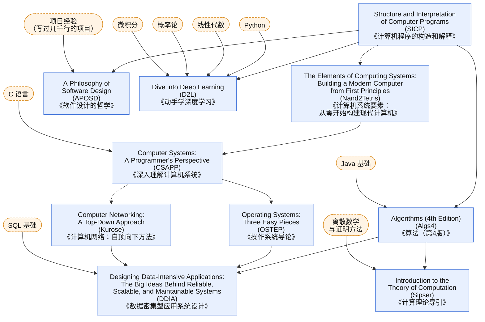

# 计算机科学核心十本书：前置依赖图

```mermaid
---
config:
  htmlLabels: false
  markdownAutoWrap: false
  flowchart:
    htmlLabels: false
    wrappingWidth: 400
    nodeSpacing: 24
    rankSpacing: 48
---
flowchart TD
    %% 书单内的十本书
    SICP["Structure and Interpretation<br/>of Computer Programs<br/>(SICP)<br/>《计算机程序的构造和解释》"]
    N2T["The Elements of Computing Systems:<br/>Building a Modern Computer<br/>from First Principles<br/>(Nand2Tetris)<br/>《计算机系统要素：<br/>从零开始构建现代计算机》"]
    ALGS["Algorithms (4th Edition)<br/>(Algs4)<br/>《算法（第4版）》"]
    CSAPP["Computer Systems:<br/>A Programmer's Perspective<br/>(CSAPP)<br/>《深入理解计算机系统》"]
    OSTEP["Operating Systems:<br/>Three Easy Pieces<br/>(OSTEP)<br/>《操作系统导论》"]
    NET["Computer Networking:<br/>A Top-Down Approach<br/>(Kurose)<br/>《计算机网络：自顶向下方法》"]
    SIPSER["Introduction to the<br/>Theory of Computation<br/>(Sipser)<br/>《计算理论导引》"]
    DDIA["Designing Data-Intensive Applications:<br/>The Big Ideas Behind Reliable,<br/>Scalable, and Maintainable Systems<br/>(DDIA)<br/>《数据密集型应用系统设计》"]
    APOSD["A Philosophy of<br/>Software Design<br/>(APOSD)<br/>《软件设计的哲学》"]
    D2L["Dive into Deep Learning<br/>(D2L)<br/>《动手学深度学习》"]

    %% 书单外的前置
    X_C(["C 语言"])
    X_JAVA(["Java 基础"])
    X_PY(["Python"])
    X_DM(["离散数学<br/>与证明方法"])
    X_LA(["线性代数"])
    X_PROB(["概率论"])
    X_CALC(["微积分"])
    X_SQL(["SQL 基础"])
    X_EXP(["项目经验<br/>（写过几千行的项目）"])

    %% 书单内的依赖，虚线为弱依赖
    SICP -.-> N2T
    SICP --> ALGS
    SICP --> APOSD
    SICP --> D2L
    N2T --> CSAPP
    CSAPP --> OSTEP
    CSAPP -.-> NET
    ALGS --> SIPSER
    ALGS --> DDIA
    OSTEP --> DDIA
    NET --> DDIA

    %% 书单外的依赖
    X_JAVA --> ALGS
    X_C --> CSAPP
    X_DM --> SIPSER
    X_SQL --> DDIA
    X_EXP --> APOSD
    X_PY --> D2L
    X_LA --> D2L
    X_PROB --> D2L
    X_CALC --> D2L

    classDef book fill:#e8f0fe,stroke:#3b6fd8,color:#111
    classDef ext fill:#fff4e5,stroke:#d98a1c,color:#111,stroke-dasharray:4 3
    class SICP,N2T,ALGS,CSAPP,OSTEP,NET,SIPSER,DDIA,APOSD,D2L book
    class X_C,X_JAVA,X_PY,X_DM,X_LA,X_PROB,X_CALC,X_SQL,X_EXP ext
```
